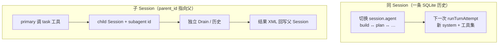

# Agent 抽象与多 Agent（build / plan / task）

> **源码锚点**：`packages/schema/src/agent.ts` · `packages/core/src/agent.ts` · `packages/core/src/plugin/agent.ts` · `packages/core/src/config/plugin/agent.ts` · `packages/opencode/src/tool/task.ts`  
> **合并稿中的旧版 multi-agent 分卷已废弃**；下文按当前 V2 实现整理。

---

## 1. 一句话：Agent 不是「另一个进程里的 LLM」

OpenCode 只有 **一套 Session 执行引擎**（Drain + `runTurnAttempt` + ToolRegistry）。所谓 Agent 是 **同一引擎上的配置切片**：

```text
Agent Profile = id + mode + system + permissions + model/steps
                    ↓
         ToolRegistry.materialize(permissions)  → 可见工具集
                    ↓
         llm.stream(...)                         → 同一 Provider Turn 管线
```

**不是** MetaGPT 里独立 Role 对象，也 **没有** 单独的 `ManagerAgent` 类。

---

## 2. Agent 包含哪些「实体」？

### 2.1 契约层：`AgentV2.Info`（Schema）

```20:31:opencode/packages/schema/src/agent.ts
export const Info = Schema.Struct({
  id: ID,
  model: Model.Ref.pipe(optional),
  request: Provider.Request,
  system: Schema.String.pipe(optional),
  description: Schema.String.pipe(optional),
  mode: Schema.Literals(["subagent", "primary", "all"]),
  hidden: Schema.Boolean,
  color: Color.pipe(optional),
  steps: PositiveInt.pipe(optional),
  permissions: Permission.Ruleset,
})
```

| 字段 | 含义 |
|------|------|
| `id` | 稳定标识，如 `build`、`plan`、`explore` |
| `mode` | `primary`：可作会话主 Agent；`subagent`：仅被 `task` 或特殊流程选用；`all`：配置默认 |
| `system` | 追加/覆盖系统说明（探索 Agent 有专用 PROMPT） |
| `permissions` | **Ruleset**：决定工具是否注册、执行前是否 `ask` |
| `steps` | 可选，限制该 Agent 连续 provider-step 上限 |
| `hidden` | UI 不展示（`compaction`、`title`、`summary`） |

### 2.2 运行时注册表：`AgentV2.Service`

```22:41:opencode/packages/core/src/agent.ts
type Data = {
  agents: Map<ID, Types.DeepMutable<Info>>
  default?: ID
}

export interface Interface extends State.Transformable<Draft> {
  readonly get: (id: ID) => Effect.Effect<Info | undefined>
  readonly default: () => Effect.Effect<Info | undefined>
  readonly resolve: (id?: ID | string) => Effect.Effect<Info | undefined>
  readonly select: (id?: ID | string) => Effect.Effect<Selection>
  readonly all: () => Effect.Effect<Info[]>
}
```

- **Location 级** 内存表（随 Config / Plugin reload 刷新）。
- `select()`：`session.agent` 有值则用该 id，否则用 default（通常 `build`）。
- `selectable()`：**`subagent` 与 `hidden` 不能作为用户默认主 Agent**。

### 2.3 会话上挂的是「当前 Agent id」，不是 Execution 里的 Map

```51:56:opencode/packages/core/src/session/sql.ts
    permission: text({ mode: "json" }).$type<PermissionV1.Ruleset>(),
    agent: text(),
    model: text({ mode: "json" }).$type<{
      id: string
      providerID: string
      variant?: string
    }>(),
```

切换 Agent → 发 `session.next.agent.switched` → Projector 写 `session.agent`：

```329:335:opencode/packages/core/src/session/projector.ts
    yield* events.project(SessionEvent.AgentSwitched, (event) =>
      db
        .update(SessionTable)
        .set({ agent: event.data.agent, time_updated: DateTime.toEpochMillis(event.data.timestamp) })
        .where(eq(SessionTable.id, event.data.sessionID))
```

下一轮 `runTurnAttempt` 读库：

```182:203:opencode/packages/core/src/session/runner/llm.ts
      const agent = yield* agents.select(session.agent)
      const initialized = yield* SessionContextEpoch.initialize(db, loadSystemContext(agent), session.id)
      // ...
      const toolMaterialization = isLastStep ? undefined : yield* tools.materialize(agent.info?.permissions)
```

### 2.4 Agent 包含哪些「动作」？

| 动作 | 谁触发 | 效果 |
|------|--------|------|
| **注册 / 合并 Profile** | 内置 `agent` 插件 + `config-agent` 插件 | `ctx.agent.transform(draft => draft.update(...))` |
| **选择 Agent** | API / TUI / `plan_exit` 确认后改 session | `AgentSwitched` 事件 |
| **物化工具** | 每次 `runTurnAttempt` | `tools.materialize(permissions)` |
| **权限门** | 工具执行前 | `permission` action（含 `task`、`plan_enter`、`plan_exit`） |
| **子 Session 委派** | `task` 工具 | `sessions.create({ parentID, agent: subagent.name })` |

**不存在**（当前 Core）文档旧稿里的 `agent_create` / `agent_list` **工具**；`agent_list` 仅是 TUI 快捷键绑定。

---

## 3. 内置 Agent 从哪来？

两层叠加：

1. **`plugin/agent.ts`（Core）** — 写入默认 `build` / `plan` / `general` / `explore` / 隐藏 Agent 的 `system` + `permissions`。
2. **`config/plugin/agent.ts`** — 扫描配置目录 markdown，解析 frontmatter 合并进同一注册表。

```46:48:opencode/packages/core/src/config/plugin/agent.ts
export const Plugin = define({
  id: "config-agent",
  effect: Effect.fn(function* (ctx) {
```

发现规则（节选）：

```20:23:opencode/packages/core/src/config/plugin/agent.ts
const legacySources = [
  { pattern: "{agent,agents}/**/*.md", primary: false },
  { pattern: "{mode,modes}/*.md", primary: true },
] as const
```

`packages/opencode/src/agent/agent.ts` 仍保留 **V1 风格** 的 `build`/`plan`/… 定义（PermissionV1），与 Core V2 路径并行；新 Session 主线以 **Core `AgentV2` + `plugin/agent.ts`** 为准。

### 3.1 内置 Profile 对照表

| id | mode | 用户可见 | 职责摘要 |
|----|------|----------|----------|
| `build` | primary | 是 | 默认实现 Agent；允许 `plan_enter`、用户问答 |
| `plan` | primary | 是 | 规划：默认 deny `edit`；仅允许 `.opencode/plans/*.md` 与 data plans 路径 |
| `general` | subagent | 否（作 worker） | 通用子任务；deny `todowrite` |
| `explore` | subagent | 否 | 只读搜索（grep/glob/read/web…） |
| `compaction` | primary | hidden | 压缩摘要专用 |
| `title` / `summary` | primary | hidden | 会话标题 / PR 式摘要 |

`plan` 权限片段（Core，带注释）：

```133:149:opencode/packages/core/src/plugin/agent.ts
      draft.update(AgentV2.ID.make("plan"), (item) => {
        item.description = "Plan mode. Disallows all edit tools."
        item.mode = "primary"
        item.permissions.push(
          ...PermissionV2.merge(defaults, [
            { action: "question", resource: "*", effect: "allow" },
            { action: "plan_exit", resource: "*", effect: "allow" },
            // 全局 data 目录下的 plan 文件可读
            { action: "external_directory", resource: path.join(Global.Path.data, "plans", "*"), effect: "allow" },
            { action: "edit", resource: "*", effect: "deny" },
            // 仓库内计划 markdown 可写
            { action: "edit", resource: path.join(".opencode", "plans", "*.md"), effect: "allow" },
            {
              action: "edit",
              resource: path.relative(worktree, path.join(Global.Path.data, "plans", "*.md")),
              effect: "allow",
            },
          ]),
        )
      })
```

---

## 4. 三种「多 Agent」语义（不要混）



| 机制 | 隔离级别 | 典型入口 |
|------|----------|----------|
| **A. Agent 切换** | 同 Session、同 Drain、历史连续 | TUI 选 Agent、`plan_exit` 后切 `build`、API 改 agent |
| **B. `task` 委派** | **新 Session**（`session.parent_id`），消息隔离 | `task` 工具，`subagent_type=explore|general` |
| **C. Plan 模式** | 仍是 **A**，只是 active profile = `plan` | 用户选 Plan Agent，或 build 侧 `plan_enter` 权限流（交互式） |

---

## 5. Plan Agent：不是什么

| 误解（旧文档） | 事实（当前源码） |
|----------------|------------------|
| `plan_enter` / `plan_exit` 是普通内置 tool 名 | 主要是 **permission action**；`plan_exit` 在 `packages/opencode` 有 **Tool.define("plan_exit")**，`plan_enter` 由权限/UI/CLI 控制（非交互 `opencode run` 会 deny） |
| `plan.create` / `plan.update` 一等工具 | **无** 这套 Core 工具；计划落在 **markdown 计划文件** + 对话内容，靠 `plan` Agent 的 edit 白名单写 `.opencode/plans/` |
| 切到 plan 立刻换 prompt | 切换在 **安全边界** 后生效：当前 provider turn settle 后，下一次 `runTurnAttempt` 才 `agents.select(plan)` |
| Plan 是第三个引擎 | Plan = **`plan` Profile** + 文件路径权限 + `plan_exit` 问用户是否回 `build` |

`plan_exit` 工具核心行为（节选，带注释）：

```15:44:opencode/packages/opencode/src/tool/plan.ts
export const PlanExitTool = Tool.define(
  "plan_exit",
  Effect.gen(function* () {
    // ...
    return {
      description: EXIT_DESCRIPTION,
      parameters: Parameters,
      execute: (_params: {}, ctx: Tool.Context) =>
        Effect.gen(function* () {
          const plan = path.relative(instance.worktree, Session.plan(info, instance))
          const answers = yield* question.ask({
            // 问用户：是否切换到 build 开始实现
            questions: [{ question: `Plan at ${plan} is complete...`, options: [...] }],
          })
          if (answers[0]?.[0] === "No") yield* new Question.RejectedError()
          // 后续：恢复用户模型、触发 agent 切到 build（见同文件下半）
```

---

## 6. `task` 工具：主子 Agent（子 Session）

实现：`packages/opencode/src/tool/task.ts`。

要点（对照源码）：

```104:117:opencode/packages/opencode/src/tool/task.ts
      const parent = yield* sessions.get(ctx.sessionID)
      let current = parent
      let depth = 0
      while (current.parentID) {
        depth++
        current = yield* sessions.get(current.parentID)
      }
      if (depth >= (cfg.subagent_depth ?? 1)) {
        return yield* Effect.fail(new Error(`Subagent depth limit reached ...`))
      }
```

```156:172:opencode/packages/opencode/src/tool/task.ts
      const nextSession =
        session ??
        (yield* sessions.create({
          parentID: ctx.sessionID,
          title: params.description + ` (@${next.name} subagent)`,
          agent: next.name,           // 子 Session 绑定 subagent Profile
          permission: [ ... ],        // 继承 + 派生子权限规则
        }))
```

| 项 | 规则 |
|----|------|
| 可委派类型 | `agent.get(subagent_type)` 必须存在；通常 `mode=subagent` |
| 深度 | 默认 `subagent_depth: 1`（配置可调） |
| 权限 | `ctx.ask({ permission: "task", patterns: [subagent_type] })` |
| 后台模式 | `background: true` 需 `OPENCODE_EXPERIMENTAL_BACKGROUND_SUBAGENTS` |
| 续跑 | `task_id` 复用已有子 Session |

父 Session **阻塞等待** 子 Session 完成（前台模式），结果以 `<task>...</task>` 文本回到父对话。

---

## 7. 与社区插件的边界

| | Core | 插件（如 oh-my-opencode、handoff） |
|--|------|-------------------------------------|
| 子会话 | `task` + `parent_id` | 可包装/并行/增强通知 |
| 编排 | 无总线 | 自定义命令、额外 Agent 定义 |
| Plan | `plan` Profile + 文件 | Plannotator、micode、conductor 等 **工作流** |

列表见 [PLUGINS.md](./PLUGINS.md)。

---

## 8. 阅读顺序（源码）

1. `packages/schema/src/agent.ts` — 数据结构  
2. `packages/core/src/plugin/agent.ts` — 内置 Profile  
3. `packages/core/src/config/plugin/agent.ts` — md 扩展  
4. `packages/core/src/session/runner/llm.ts` — `agents.select` + `tools.materialize`  
5. `packages/opencode/src/tool/task.ts` — 子 Session  
6. `packages/opencode/src/tool/plan.ts` — 退出规划  

返回总览：[ARCHITECTURE.md §11](./ARCHITECTURE.md) · [README](./README.md)
