# OpenCode 架构与源码精读（合并主文档）

> **目标**：读完后能解释 admit / Drain / Provider Turn、Context Epoch、工具 settle 与 SQLite 投影，并能定位 `opencode/packages/core/src`。  
> **目录索引**：[README.md](./README.md)（推荐阅读顺序、分卷说明）  
> **专题（已拆出，避免与本文件重复）**：[AGENT_AND_MULTI_AGENT.md](./AGENT_AND_MULTI_AGENT.md) · [PLUGINS.md](./PLUGINS.md)  
> **图解**：[diagrams/](./diagrams/README.md)

---

## 如何用这个文档弄懂设计和源码

**优先只读下文「总控篇」§0–§16（到 `# 分卷原文` 之前）**；`# 分卷原文：…` 起为历史合并存档，与 §0–§16 大量重复。

| 阶段 | 做什么 | 读哪里 |
|------|--------|--------|
| **0** | 分层心智模型、steer/queue、settle | **§0.5** |
| 1 | Session / Turn / 持久化 | §1、§5 |
| 2 | 双 Loop | §6 |
| 3 | Epoch / Compaction | §7 |
| 4 | Tool / Permission | §8 |
| 5 | E2E | §14 |
| 6 | **Agent / plan / task** | **[AGENT_AND_MULTI_AGENT.md](./AGENT_AND_MULTI_AGENT.md)**（勿读已删除的 multi-agent 分卷） |
| 7 | **插件生态** | **[PLUGINS.md](./PLUGINS.md)** |
| 8 | 深潜模块表 | §17–§26；全维度矩阵见分卷 ATLAS |

IDE 并排：`session/input.ts` → `run-coordinator.ts` → `runner/llm.ts` → `context-epoch.ts` → `tool/registry.ts`。

---


---

# 分卷原文：ARCHITECTURE.md


# OpenCode 完整架构总文档（总控篇）

> **体例参照**: [maf-agent/docs/ARCHITECTURE_PART1.md](../maf-agent/docs/ARCHITECTURE_PART1.md) · [MetaGPT 架构](../metagpt-architecture/ARCHITECTURE.md)  
> **唯一主入口**：整体架构、源码包、Session、双层循环、Context Epoch、Tool、持久化、客户端边界；专题细节见分卷（不删原文）。  
> **源码范围**：本仓库 `opencode/` → `opencode/packages/core/src/`（下文路径均相对 `packages/core/src/` 除非注明 package）。

**阅读顺序（推荐）**: §0 → §1–§6（运行时主线）→ **§17–§26（分模块）** → §27 编排对照 → §28 概念索引 → 按需打开专题 MD

---

## §0 阅读导航

### 0.1 一句话心智模型

```text
用户 (CLI / TUI / Web / SDK)
  → Server API (sessions.prompt / steer / queue / abort)
  → SessionInput.admit          # 持久化签收，不丢任务
  → SessionExecution.wake
  → RunCoordinator / Session Drain     # 外层：消费 inbox、推进 turn
       → Provider Turn (runner/llm.ts) # 内层：stream + tool settle + 续跑
       → Context Epoch + History + Compaction
       → ToolRegistry + Permission + Snapshot
  → EventV2 → Projector → SQLite (message/part)
  → 事件流回 UI
```

与 **MetaGPT** 对照：OpenCode 无 `Team.env.run` 多 Role 并行 tick；**单 Session Drain** + **Agent Profile** 切换；协作靠 **子 Session / task 工具**，不是 `cause_by` 总线。

与 **MAF** 对照：`agent.run` ≈ **一次 Provider Turn 链**（可含多轮 tool）；`workflow superstep` ≈ **Drain 消费一条 promoted 输入**；ContextProvider 管道 ≈ **Context Epoch + system-context + reference + skill 注入**。

### 0.2 章节索引（本章 + 专题）

| 章节 | 内容 | 关键源码 |
|------|------|----------|
| §1 | 心智模型、三概念分离 | — |
| §2 | Workspace 包分层 | `packages/*` |
| §3 | Core 目录地图 | `core/src/` |
| §4 | Project / Location / Snapshot | `project/`, `snapshot.ts`, `git.ts` |
| §5 | Session、admit、三种消息形态 | `session/input.ts`, `event/` |
| §6 | Drain + Provider Turn 双层循环 | `run-coordinator.ts`, `runner/llm.ts` |
| §7 | Context Epoch、Compaction | `context-epoch.ts`, `compaction.ts` |
| §8 | Tool、Permission、代码执行 | `tool/`, `permission/` |
| §9 | Skill、Plugin、MCP | `skill/`, `plugin/`, MCP 客户端 |
| §10 | steer / queue / abort | `session/input.ts` |
| §11 | Agent Profile、Plan、多 Agent | `config/agent.ts`, `agent.ts` |
| §12 | Event、投影、恢复 | `projector.ts`, `database/` |
| §13 | Server、Client、SDK、UI 边界 | `packages/server`, `client`, `sdk` |
| §14–§15 | E2E 流程、错误语义 | — |
| §16 | 源码阅读顺序、文档归并 | — |
| **§17** | **API / Client / Server** | `server/src/api.ts` |
| **§18** | **Input Admission** | `session/input.ts` |
| **§19** | **Session / Drain / Coordinator** | `run-coordinator.ts` |
| **§20** | **Provider Turn / LLM 包** | `runner/llm.ts`, `packages/llm` |
| **§21** | **Context / History / Compaction** | `history.ts`, `compaction.ts` |
| **§22** | **Tool / Permission / Snapshot** | `tool/registry.ts`, `permission.ts` |
| **§23** | **Event / Projector / SQLite** | `event/`, `projector.ts` |
| **§24** | **Skill / Plugin / MCP** | 见 §9 + §24 表 |
| **§25** | **Config / Agent Profile** | `config/` |
| **§26** | **Project / Location / Git** | 见 §4 + §26 表 |
| **§27** | **编排模型对照** | Profile vs Subagent vs Plan |
| §28 | 概念交叉索引 | — |
| §29 | 专题文档映射 | Part1/2、ATLAS… |
| §30 | Archify 图解索引 | `diagrams/` |
| **§0.5** | **Agent Loop 分层、steer/queue、settle、内存快照** | 本文 §0.5 |
| 附录 A | OMO 插件扩展 | 本文附录 B |

| 专题（深潜） | 文件 |
|--------------|------|
| 包级地图 | 「PACKAGE_MAP.md」（见下文同卷分节） |
| 模块交互 | 「MODULES_AND_INTERACTIONS.md」（见下文同卷分节） |
| 运行时流程 | 「RUNTIME_FLOWS.md」（见下文同卷分节） |
| steer/queue | 「SESSION_AND_CONTEXT.md」（见下文同卷分节） |
| 类图/Compaction 算法 | 「ARCHITECTURE_PART1.md」（见下文同卷分节） |
| 全维度矩阵 | 「ARCHITECTURE_ATLAS.md」（见下文同卷分节） |
| 多 Agent / Plan / task | **[AGENT_AND_MULTI_AGENT.md](./AGENT_AND_MULTI_AGENT.md)**（分卷 multi-agent 已移除） |
| 插件列表 | **[PLUGINS.md](./PLUGINS.md)** |

### 0.3 三层原语与双 Loop（最易混淆）

| | **admit** | **Drain（外层）** | **Provider Turn（内层）** |
|--|-----------|-------------------|---------------------------|
| 含义 | 输入落库签收 | 推进 Session 工作队列 | 一次 `llm.stream` + tool settle 周期 |
| 持久化 | ✅ `session_input` / Event | ❌ 内存协调态 | ✅ message/part（settle 后） |
| 触发 | `sessions.prompt` | `SessionExecution.wake` | Drain 内调度 |
| 崩溃 | 任务不丢 | at-least-once 重跑 | settle 前可能重复执行工具 |
| 源码 | `session/input.ts` | `run-coordinator.ts` | `runner/llm.ts` |

```text
admit ≠ drain ≠ provider turn
Session ≠ SessionExecution ≠ Provider Turn   （见 §1.2）
```

| Loop | 单位 | 上限 / 停止 |
|------|------|-------------|
| **Session Drain** | 推广输入 → 启动/续跑 Turn | idle、abort、无 pending |
| **Provider Turn** | stream → tools → 续跑 | 模型结束、compaction 插入、错误 |
| **Tool settle** | 并行/串行执行 tool calls | permission、timeout |

→ 图解 [opencode-dual-loop.workflow.html](./diagrams/opencode-dual-loop.workflow.html)

### 0.5 Agent Loop 分层心智模型（精读）

本节把 **Agent Loop 全流程**、**各层概念**、**steer / queue / settle**、**DB 与内存快照** 收成一份导读，并与 **Pi step**、**OpenHands `step()`** 对照。细节仍见 §6、§10 与分卷 `SESSION_AND_CONTEXT`。

#### 0.5.1 抽象全流程（L0–L4）

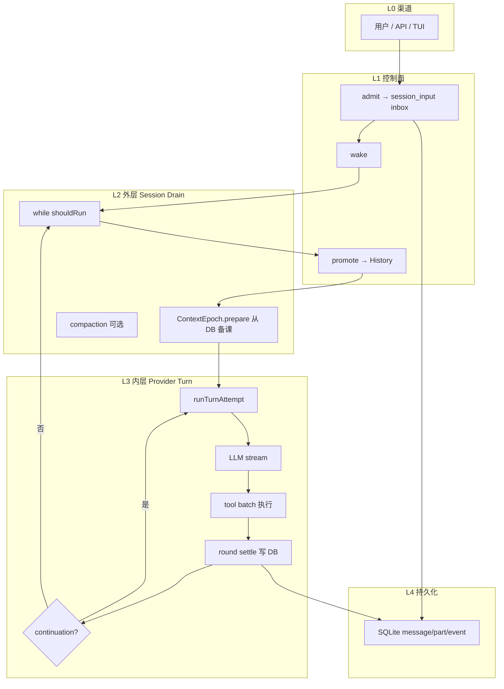
```mermaid
flowchart TB
  subgraph L0["L0 渠道"]
    IN["用户 / API / TUI"]
  end
  subgraph L1["L1 控制面"]
    ADMIT["admit → session_input inbox"]
    WAKE["wake"]
    PROMOTE["promote → History"]
  end
  subgraph L2["L2 外层 Session Drain"]
    DRAIN["while shouldRun"]
    PREP["ContextEpoch.prepare 从 DB 备课"]
    COMPACT["compaction 可选"]
  end
  subgraph L3["L3 内层 Provider Turn"]
    ATT["runTurnAttempt"]
    STREAM["LLM stream"]
    TOOLS["tool batch 执行"]
    ROUND["round settle 写 DB"]
    CONT{"continuation?"}
  end
  subgraph L4["L4 持久化"]
    DB["SQLite message/part/event"]
  end
  IN --> ADMIT --> DB
  ADMIT --> WAKE --> DRAIN
  DRAIN --> PROMOTE --> PREP --> ATT
  ATT --> STREAM --> TOOLS --> ROUND --> DB
  ROUND --> CONT
  CONT -->|是| ATT
  CONT -->|否| DRAIN
```

| 层 | 人话 | OpenCode 典型名 |
|----|------|-----------------|
| **L0** | 谁发话 | `sessions.prompt` |
| **L1** | 签收、送货方式、推广进聊天史 | `admit`、`delivery` steer/queue、`promote*` |
| **L2** | 会话总调度、从 DB 拼快照、idle | **Session Drain**、`prepare()` |
| **L3** | 一次作业：可多轮问模型+工具 | **Provider Turn**、**`runTurnAttempt`** |
| **L4** | 真相在库；UI 看投影 | `session_input`、`message`/`part`、EventV2 |

**三个原语挂在哪一层**

| 原语 | 层 | 含义 |
|------|-----|------|
| **admit** | L1 | inbox 签收，模型还看不见 |
| **drain** | L2 | 外层调度（协调态内存，不持久化） |
| **settle** | L3→L4 | 见 §0.5.3（有两层粒度） |
| **Provider Turn** | L3 | 内层容器，可含多个 `runTurnAttempt` |

#### 0.5.2 `runTurnAttempt` 是什么？

**`runTurnAttempt`** = 内层 **「又要去问大模型一次」** 的一圈，不是整个 Provider Turn，也不是外层 Drain 一圈。

```text
L2 Drain 一圈
  ├─ prepare()                    # 从 DB 读 message+part → ContextEpoch 快照（内存）
  └─ Provider Turn
        ├─ runTurnAttempt #1      # 第 1 次 LLM + 本响应触发的 tool batch + round settle
        ├─ runTurnAttempt #2      # continuation
        └─ …
  └─ 回到 L2（可再 prepare、压缩、处理 inbox）
```

- **与 Pi 对照**：**`runTurnAttempt` ≈ Pi 的 step**（一次 model 回合 + 这批 tool 收尾）；Pi 外环 + steering 队列 ≈ L1/L2。
- **与 OpenHands 对照**：**一个 `runTurnAttempt` ≈ 一次 `Agent.step()`**；OpenCode 常把 **多个 attempt 捆在同一 Provider Turn** 里 `needsContinuation`，OpenHands 则 **每 step 返回一次**。

#### 0.5.3 settle：两层粒度（易混）

| 粒度 | 含义 | 与「一次 LLM 返回多个 tool」 |
|------|------|------------------------------|
| **A. 单 tool 状态机** | 一个 `tool_call` 执行完 → `settled` → 投影 | 每个 call 各自结案 |
| **B. round settle（内层一圈）** | 本次 **LLM 流结束** + **本响应触发的 tool batch 全部跑完** → **整批 part + Message 写 SQLite** | **不是**每完成 1 个 tool 就单独问模型；是 **整批 tool 完成 → 写库 → 再 continuation 调 LLM** |

**steer 安全边界**常落在 **A/B 之后**（不在 tool 半道 promote），不是取消当前 token 流。

原语表里较粗的 **settle = 一轮 ProviderTurn 固化** 指崩溃语义上的「本轮 AI 输出写稳」；内层可有多圈 attempt，每圈各有一次 **round settle（B）**。

#### 0.5.4 同一 Turn 内多次 `runTurnAttempt`：会重读 DB 吗？

| 时机 | 是否全量从 DB `prepare()` 重建 message |
|------|--------------------------------------|
| **外层 Drain 每圈开头** | ✅ `ContextEpoch.prepare()` |
| **同一 Provider Turn 内 attempt #2、#3…** | ❌ **不**再完整 prepare；沿用 **本圈开始的 Epoch 快照** |
| **tool 结果给下一次 LLM** | **continuation 内存路径**接上轮输出，非每 attempt 全库 JOIN |
| **round settle 写 DB** | ✅ 写入，但 **不刷新当前 Turn 正在用的 Epoch 快照** |

因此：**没有「只靠内存、零 DB」**——真相在 SQLite；**一轮内层 Turn 缓存一本快照**，避免每问一次模型就全量重读。

**steer promote 后**：History（DB）已有新 user，若仍在 **同一 Turn 的旧快照** 里，模型 **往往还看不到**；需 **外层再 `prepare()`**（或新 Turn/新快照）后 **下一次 LLM** 才稳定带上（promote ≠ 立刻刷新内存列表）。给 Provider 的仍是普通 **`role: user`**，`delivery: steer` 多在 metadata，不是 LLM 协议里的单独 role。

#### 0.5.5 steer 与 queue：在哪一层？

两者 **语义在 L1**（`session_input.delivery`），**存 L4**（无独立内存消息队列；`wake` 仅为调度）。

| | **steer** | **queue** |
|--|-----------|-----------|
| **含义** | 运行中改道 | 当前大段活后再处理，每次一条 |
| **promote 时机** | **L2 Drain 每圈开头** `promote steer` **+** **L3 `runTurnAttempt` 边界**（`promotion === "steer"` → `promoteSteers(cutoff)`） | **主要在 L2**（Turn 收尾、将 idle → `promoteNextQueued()`） |
| **优先级** | **steer > queue** | 无 pending steer 才推广 |
| **模型可见** | promote 后，**下次 prepare → 下次 LLM** | 更晚，偏 idle 前一条 |

```text
delivery=steer|queue  →  L1 admit + wake
                      →  L2 开头 promoteSteers（steer 优先）
                      →  L3 边界 promoteSteers(cutoff)（补 mid-flight steer）
                      →  L4 History（user message）
                      →  L2 prepare → L3 runTurnAttempt → LLM
```

**queue** 可理解为：**外层 Drain 在「要收工 / 将 idle」时** 判断并 **每次 promote 一条**。**steer** 不是「只在外层」：外层先 promote，内层在 **安全边界**（常见：本批 tool round settle 后、下一 attempt 前）再 promote。

#### 0.5.6 常见误解对照

| 误解 | 更正 |
|------|------|
| Provider Turn = 用户一问的完整答复、且只调一次 LLM | Turn 内可 **多次** `runTurnAttempt`（continuation）；用户眼里「答完」可能跨 **多圈 Drain / 多个 Turn** |
| settle = 一整步 LLM+tool | **round settle** = 一圈 attempt 的 **整批** part 写库；另有 **per-tool settled** |
| steer = 每 step 开头硬插 user | 在 **L2 开头 + L3 attempt 边界** promote，**不等** tool 半道 |
| steer/queue 用内存队列 | **仅 DB `session_input`**，公平锁式排队在 admit 路径 |
| promote 后模型立刻看见 | 常需 **外层再 prepare** 才进 Epoch 快照 |

→ 图解：[opencode-queue-steer.workflow.html](./diagrams/opencode-queue-steer.workflow.html) · [opencode-dual-loop.workflow.html](./diagrams/opencode-dual-loop.workflow.html)

### 0.4 端到端时序（摘要）

→ 全文 §14 · 图 [opencode-e2e-prompt.sequence.html](./diagrams/opencode-e2e-prompt.sequence.html)

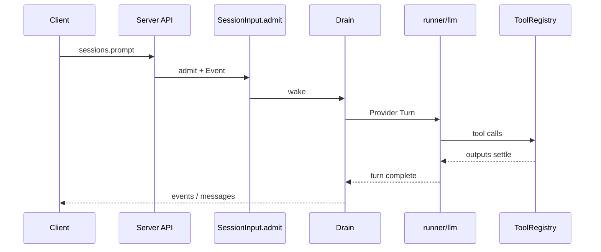
```mermaid
sequenceDiagram
    participant C as Client
    participant S as Server API
    participant A as SessionInput.admit
    participant D as Drain
    participant L as runner/llm
    participant T as ToolRegistry

    C->>S: sessions.prompt
    S->>A: admit + Event
    A->>D: wake
    D->>L: Provider Turn
    L->>T: tool calls
    T-->>L: outputs settle
    L-->>D: turn complete
    D-->>C: events / messages
```

---

## 目录（§1–§16 正文）

1. [先建立正确心智模型](#1-先建立正确心智模型)
2. [源码包与模块分层](#2-源码包与模块分层)
3. [Core 内部目录地图](#3-core-内部目录地图)
4. [代码工作区模型](#4-代码工作区模型)
5. [Session、输入和持久化消息](#5-session输入和持久化消息)
6. [双层执行循环](#6-双层执行循环)
7. [Context Epoch 与 Compaction](#7-context-epoch-与-compaction)
8. [Tool、Permission 与代码执行](#8-toolpermission-与代码执行)
9. [Skill、Plugin 与 MCP](#9-skillplugin-与-mcp)
10. [Steer、Queue、Abort](#10-steerqueueabort)
11. [Agent Profile、Plan 和多 Agent](#11-agent-profileplan-和多-agent)
12. [事件、投影与恢复](#12-事件投影与恢复)
13. [客户端、Server、SDK 和 UI](#13-客户端server-sdk-和-ui)
14. [完整运行流程](#14-完整运行流程)
15. [错误边界和一致性语义](#15-错误边界和一致性语义)
16. [代码阅读路线与文档合并说明](#16-代码阅读路线与文档合并说明)
17. [分模块详解 §17–§26](#17-api--client--server-模块详解)
28. [概念交叉索引 §28](#28-概念交叉索引)
29. [专题文档映射 §29](#29-阅读路径与专题文档映射)
30. [图解索引 §30](#30-archify-图解索引)
- [附录 A：OpenCode 扩展 OMO](#附录-aopencode-扩展-omo)

---

## 1. 先建立正确心智模型

OpenCode 不是简单的：

```text
聊天窗口 + LLM + bash
```

更准确的模型是：

```text
Project / Location / Repository / Worktree
  + Durable Session / Event / Projection
  + Context Epoch / Compaction
  + Code-native Tools
  + Permission / Snapshot / Revert
  + Plugin / Skill / MCP
  + 多 Provider LLM
  + CLI / TUI / Web / Desktop / SDK
```

它的核心产品本质是：

> **面向代码仓库的、可持久化、可中断、可审计、可回滚的 Agent Runtime。**

代码任务的主反馈回路不是“回答结束”，而是：

```text
定位代码
  → 读取上下文
  → 修改文件
  → 运行测试/构建
  → 观察输出
  → 修复
  → 再验证
```

### 1.1 系统总图

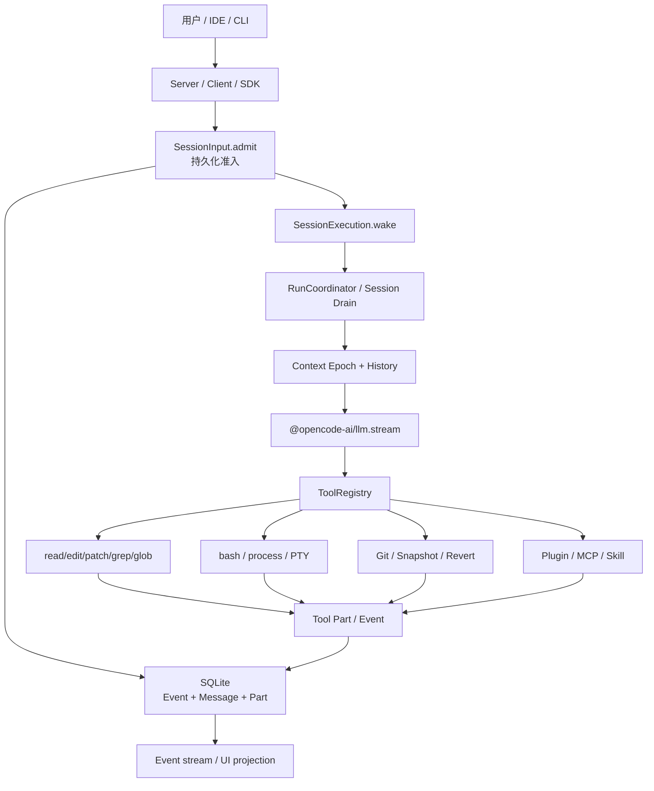
```mermaid
flowchart TB
    USER["用户 / IDE / CLI"] --> API["Server / Client / SDK"]
    API --> ADMIT["SessionInput.admit\n持久化准入"]
    ADMIT --> DB["SQLite\nEvent + Message + Part"]
    ADMIT --> WAKE["SessionExecution.wake"]
    WAKE --> DRAIN["RunCoordinator / Session Drain"]
    DRAIN --> EPOCH["Context Epoch + History"]
    EPOCH --> LLM["@opencode-ai/llm.stream"]
    LLM --> TOOLS["ToolRegistry"]
    TOOLS --> FILE["read/edit/patch/grep/glob"]
    TOOLS --> PROC["bash / process / PTY"]
    TOOLS --> GIT["Git / Snapshot / Revert"]
    TOOLS --> EXT["Plugin / MCP / Skill"]
    FILE & PROC & GIT & EXT --> PART["Tool Part / Event"]
    PART --> DB
    DB --> UI["Event stream / UI projection"]
```

### 1.2 三个必须分开的概念

| 概念 | 含义 |
|---|---|
| `Session` | 持久化的会话身份、历史和代码工作区关系 |
| `SessionExecution` | 当前进程内负责唤醒、运行 Drain 的执行句柄 |
| `Provider Turn` | 一次模型流式输出及其工具调用/续跑过程 |

因此：

```text
Session 不是内存里的 Agent 对象
SessionExecution 不是数据库 Session 行
Provider Turn 不是一次用户输入
```

---

## 2. 源码包与模块分层

### 2.1 Workspace package 分层

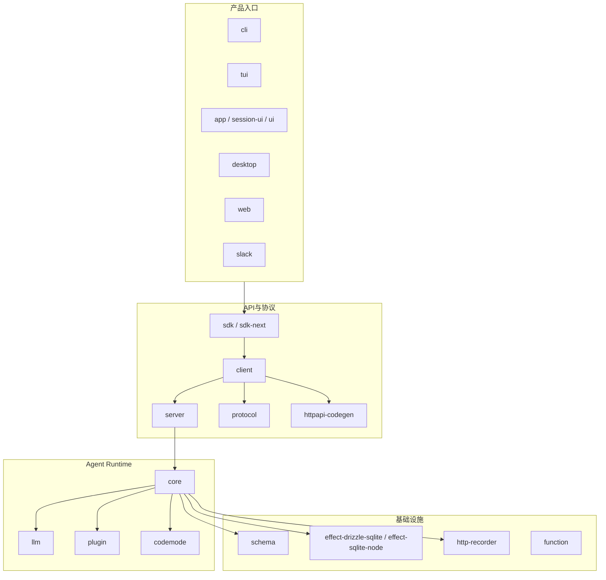
```mermaid
flowchart TB
    subgraph PRODUCT[产品入口]
        CLI["cli"]
        TUI["tui"]
        APP["app / session-ui / ui"]
        DESKTOP["desktop"]
        WEB["web"]
        SLACK["slack"]
    end
    subgraph API[API与协议]
        SERVER["server"]
        CLIENT["client"]
        SDK["sdk / sdk-next"]
        PROTOCOL["protocol"]
        GEN["httpapi-codegen"]
    end
    subgraph RUNTIME[Agent Runtime]
        CORE["core"]
        LLM["llm"]
        PLUGIN["plugin"]
        CODEMODE["codemode"]
    end
    subgraph FOUNDATION[基础设施]
        SCHEMA["schema"]
        DB["effect-drizzle-sqlite / effect-sqlite-node"]
        REC["http-recorder"]
        FUNC["function"]
    end
    PRODUCT --> SDK --> CLIENT --> SERVER --> CORE
    CLIENT --> PROTOCOL & GEN
    CORE --> LLM & PLUGIN & CODEMODE
    CORE --> SCHEMA & DB & REC
```

### 2.2 Workspace package 职责表

| Package | 封装功能 | 关键边界 |
|---|---|---|
| `@opencode-ai/core` | Session、Drain、Provider Turn、Context、Tool、Permission、Project、Git、PTY、Plugin、MCP、SQLite 投影 | Agent Runtime 真相所在 |
| `@opencode-ai/llm` | Provider 无关的模型消息、stream、tool call、usage、route、错误 | 不决定项目路径和工具权限 |
| `@opencode-ai/plugin` | Plugin API、Hook、Provider/Tool/Command/Skill 扩展 | 面向插件作者的 SDK |
| `@opencode-ai/codemode` | 受 schema 描述的程序化工具编排/执行模式 | 不等同于普通 bash |
| `@opencode-ai/server` | HTTP API、路由、handler、认证、Session/Project/PTY API | 不复制 Core Loop |
| `@opencode-ai/client` | 生成的 API Client、Effect Client、请求契约 | 不保存数据库真相 |
| `@opencode-ai/sdk` / `sdk-next` | 对外 SDK 和高层调用入口 | 给 CLI、TUI、插件、应用使用 |
| `@opencode-ai/protocol` | API middleware、授权、错误和请求分组 | 协议层，不是执行器 |
| `@opencode-ai/httpapi-codegen` | 从 API 定义生成 client/types | 防止 API 契约漂移 |
| `@opencode-ai/cli` | CLI 命令、daemon/server 启动、TUI 启动 | 产品入口 |
| `@opencode-ai/tui` | 终端 UI、prompt、diff、权限确认 | 不持有持久化真相 |
| `@opencode-ai/app` | Web/Desktop 共用 UI、Session 页面、设置、文件浏览 | 不实现 Session Runner |
| `@opencode-ai/session-ui` | Session 消息、diff、虚拟列表、文件选择和代码展示 | UI 子系统 |
| `@opencode-ai/ui` | 通用组件、主题、Markdown、代码渲染、hooks、i18n | 不执行工具 |
| `@opencode-ai/desktop` | 桌面主进程、renderer、preload 和资源 | 桌面壳，不替代 Core |
| `@opencode-ai/web` | 网站和文档页面 | 不属于 Agent Runtime |
| `@opencode-ai/slack` | Slack 事件到 SDK/Server 的适配 | 不直接调用 LLM |
| `@opencode-ai/schema` | 跨包 Schema/领域类型 | 类型契约，不是数据库 |
| `@opencode-ai/effect-drizzle-sqlite` | Drizzle + Effect SQLite 适配、迁移 | 持久化基础设施 |
| `@opencode-ai/effect-sqlite-node` | Node SQLite 平台实现 | 平台适配 |
| `@opencode-ai/http-recorder` | HTTP 录制、回放、deterministic cassette | 测试/调试基础设施 |
| `@opencode-ai/function` | 小型 API/GitHub/function helper | 通用基础库 |
| `enterprise` / `identity` / `console` / `containers` / `stats` | 企业、身份、控制台、部署、统计产品功能 | 不属于 Core 基础循环 |
| `script` / `storybook` | 构建、发布、组件开发环境 | 不属于生产 Agent Runtime |

### 2.3 依赖方向

```text
产品入口
  → SDK / Client / Protocol
  → Server
  → Core
  → LLM / Plugin / CodeMode / Database
  → Schema / Effect / SQLite
```

禁止把依赖方向倒过来：

```text
UI 不能直接写 session_message
LLM 包不决定文件路径
MCP Server 不在 Core 进程执行
Plugin 不应绕过 ToolRegistry
Server 不复制 SessionRunner
Schema 不承担业务副作用
```

---

## 3. Core 内部目录地图

源码根目录：

```text
opencode/packages/core/src/
```

| 目录/文件组 | 封装功能 |
|---|---|
| `account/` | 账户信息和持久化 |
| `config/` | Provider、Agent、Tool、MCP、Plugin、Compaction、LSP 等配置 |
| `control-plane/` | Workspace/Session 移动和控制面操作 |
| `credential/` | API Key、Provider credential 的读取和 SQL 持久化 |
| `database/` | SQLite 连接、schema、migration、平台实现 |
| `effect/` | Effect Runtime、Layer、Fiber、Mutex、Memo 和依赖注入 |
| `event/` | EventV2 定义、SQL 存储、广播和订阅 |
| `filesystem/` | 文件访问、ignore、protected path、watcher、search |
| `flag/` | Feature flag 和运行时开关 |
| `github-copilot/` | Copilot provider/Responses 兼容适配 |
| `id/` | Session、Message、Part 等 ID 生成 |
| `image/` | 图片读取、转换和模型输入 |
| `installation/` | 版本、安装和升级信息 |
| `integration/` | 外部集成连接和生命周期 |
| `oauth/` | OAuth 页面和授权流程 |
| `observability/` | logging、OTLP 和观测上下文 |
| `permission/` | allow/deny/ask、保存决定、权限 SQL |
| `plugin/` | Plugin Host、加载、Hook、Plugin Tool/Provider/Command/Skill |
| `project/` | Project 元数据、目录、复制和 SQL |
| `pty/` | 交互式终端、PTY ticket、协议和 Bun/Node 实现 |
| `reference/` | 项目 reference/instruction 的发现和注入 |
| `ripgrep/` | 高性能文件和内容搜索 |
| `session/` | Session、输入 inbox、History、Runner、Compaction、Revert、Todo、Projection |
| `share/` | Session 分享持久化 |
| `skill/` | Skill discovery、元数据和 guidance |
| `system-context/` | 系统上下文 baseline、内置 context source、registry |
| `tool/` | Tool schema、Registry、原生工具和工具输出 |
| `util/` | path、retry、hash、glob、token、lazy 等基础函数 |
| `v1/` | V1 schema/config/session/permission 兼容和迁移 |

### 3.1 Session 子系统文件职责

| 文件 | 作用 |
|---|---|
| `session/input.ts` | 持久化 inbox，区分 steer/queue |
| `session/run-coordinator.ts` | 一个 Session 的本地 Drain 所有权和 wake 合并 |
| `session/runner/llm.ts` | 组装上下文、调用 stream、settle 工具和决定续跑 |
| `session/runner/to-llm-message.ts` | 内部 Message/Part 转 Provider 消息 |
| `session/history.ts` | 从投影历史建立模型上下文 |
| `session/context-epoch.ts` | 系统上下文 baseline 和 epoch 边界 |
| `session/compaction.ts` | prune + summary，限制上下文大小 |
| `session/projector.ts` | Event/Message/Part 的幂等投影 |
| `session/revert.ts` | 历史和文件变更回滚 |
| `session/todo.ts` | todowrite 任务状态 |
| `session/store.ts` / `sql.ts` | Session 数据访问和持久化 |

### 3.2 代码 Agent 专用模块

```text
定位文件      → ripgrep/ + glob.ts + grep.ts
读取代码      → filesystem/ + read.ts
修改代码      → edit.ts + apply-patch.ts + file-mutation.ts
运行测试      → bash.ts + process.ts + pty/
Git 操作      → git.ts + repository.ts
回滚修改      → snapshot.ts + session/revert.ts
大日志治理    → tool-output-store.ts + config/tool-output.ts
项目规则      → system-context/ + reference/ + skill/
危险操作控制  → permission/ + policy.ts
```

---

## 4. 代码工作区模型

### 4.1 Project、Location、Repository、Worktree

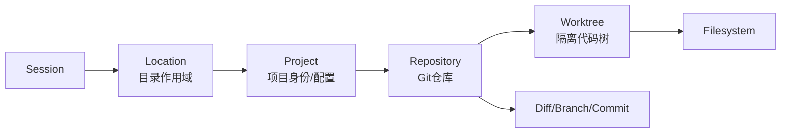
```mermaid
flowchart LR
    LOCATION["Location\n目录作用域"] --> PROJECT["Project\n项目身份/配置"]
    PROJECT --> REPO["Repository\nGit仓库"]
    REPO --> WT["Worktree\n隔离代码树"]
    REPO --> GIT["Diff/Branch/Commit"]
    WT --> FS["Filesystem"]
    SESSION["Session"] --> LOCATION
```

源码锚点：

```text
core/src/location.ts
core/src/location-services.ts
core/src/project.ts
core/src/project/
core/src/repository.ts
core/src/git.ts
```

普通 Agent 把 cwd 当作字符串；OpenCode 把代码位置作为可持久化、可检查和可变更的运行时状态。

### 4.2 Snapshot、Mutation 和 Revert

```text
snapshot.capture()
  → edit / write / apply_patch / bash
  → file-mutation / location-mutation
  → Event + Message Part
  → 用户验证
  → revert / checkout snapshot
```

源码：

```text
core/src/snapshot.ts
core/src/file-mutation.ts
core/src/location-mutation.ts
core/src/session/revert.ts
core/src/git.ts
```

代码变更的关键语义：

```text
模型说“改了什么” ≠ 磁盘实际上变成什么
```

Snapshot 和 Git 状态以文件树为准，支持比较和恢复。

---

## 5. Session、输入和持久化消息

### 5.1 三种消息形态

```text
EventV2
  ≠ session_message / message + part 投影
  ≠ Provider / LLM messages
```

| 形态 | 作用 | 典型位置 |
|---|---|---|
| `EventV2` | 记录已发生事实，用于广播、审计和投影 | `event/`、SQLite |
| `session_input` | 已接收但尚未推广的 durable inbox | `session/input.ts`、SQLite |
| `session_message` / parts | Session History 查询投影 | `session/`、SQLite |
| Provider messages | 发送给模型的规范化请求 | `@opencode-ai/llm` |

### 5.2 用户输入的完整链路

```text
sessions.prompt
  → SessionInput.admit()
  → PromptAdmitted Event
  → session_input
  → promoteSteers() / promoteNextQueued()
  → Prompted Event
  → session_message + parts
  → SessionHistory
  → toLLMMessages()
  → Provider request
```

`session_input` 不是普通内存队列；正常消费不是删除，而是更新 `promoted_seq`：

```text
INSERT promoted_seq = NULL
  → 推广到 History
  → UPDATE promoted_seq = N
```

删除主要发生在回滚或 Session 级联删除，而不是正常消费。

### 5.3 内存态、持久化态、LLM 投影态

运行时至少存在三份不同形态：

```text
持久化：SQLite session_input / message / part / event
内存态：Runner 正在累积的 text/reasoning/tool part
LLM 投影：toLLMMessages() 生成的 user/assistant/tool 消息
```

例如一个工具调用：

```json
{
  "type": "tool",
  "tool": "bash",
  "callID": "call_001",
  "state": {
    "status": "completed",
    "input": {"command": "pnpm test login"},
    "output": "2 tests failed"
  }
}
```

投影给模型时变成：

```json
{
  "role": "assistant",
  "content": [{
    "type": "tool-call",
    "toolCallId": "call_001",
    "toolName": "bash",
    "input": {"command": "pnpm test login"}
  }]
}
```

工具结果变成：

```json
{
  "role": "tool",
  "content": [{
    "type": "tool-result",
    "toolCallId": "call_001",
    "result": "2 tests failed"
  }]
}
```

### 5.4 数据表核心职责

```text
session       = 会话身份、项目位置、agent 配置
session_input = 尚未推广的输入 inbox
message       = UserTurn / ProviderTurn 元数据
part          = text / reasoning / tool / file 等细粒度内容
event         = 事实流、状态变化和客户端事件
```

---

## 6. 双层执行循环

### 6.1 外层：Session Drain

外层负责把 durable input 变成可运行任务，并持续推进到 Session idle：

```text
while shouldRun(session):
    promote steer inputs
    if no steer:
        promote next queue input
    prepare ContextEpoch
    run Provider Turn
    if compaction needed:
        compact and start next epoch
    if no continuation and no pending input:
        idle
```

外层核心源码：

```text
session/run-coordinator.ts
session/execution.ts
session/input.ts
session/runner/llm.ts
```

### 6.2 内层：Provider Turn

一次 Provider Turn 不是一次纯文本回答，而是：

```text
llm.stream(request)
  → assistant text/reasoning/tool-call
  → tool schema decode
  → permission check
  → execute / settle
  → persist Part/Event
  → 是否需要 continuation
```

如果模型返回工具调用：

```text
stream
  → tool call
  → settle tool
  → append tool result
  → 继续 stream
```

直到：

```text
模型不再请求工具
或达到 max steps
或发生错误/中断
或收到需要在安全边界处理的输入
```

### 6.3 代码修复的真实反馈回路

```text
read/grep/glob
  → edit/apply_patch
  → bash/PTY 测试
  → 截断预览 + 完整输出引用
  → 读取失败日志
  → 再次 edit
  → 再次测试
```

所以 OpenCode 的“内层循环”更准确地叫：

```text
编辑 → 执行 → 观察 → 修复循环
```

---

## 7. Context Epoch 与 Compaction

### 7.1 Context Epoch

Context Epoch 是模型所见系统上下文的版本边界。它把：

```text
项目规则
Agent system prompt
Skill guidance
Reference guidance
工具描述
历史消息
```

组织为一次相对稳定的上下文基线。

当系统规则、压缩摘要或中途控制消息发生变化时，不是随意修改旧 prompt，而是建立新的 Epoch/追加系统语义。

源码：

```text
session/context-epoch.ts
system-context/
reference/
skill/
instruction-context.ts
```

### 7.2 Context Source

规则来源包括：

```text
AGENTS.md
README.md
项目规则
目录级规则
Reference
Skill
Plugin system transform
```

Skill 的特点是懒加载：启动时只扫描名称和描述；模型调用 `skill` 工具后才把完整 `SKILL.md` 放进当前上下文。

### 7.3 Compaction

Compaction 不是简单删除旧消息，而是两阶段：

```text
Phase 1: Prune
  内存投影中裁剪旧的 tool output / 可重建内容

Phase 2: Summary
  调用 compaction Agent 生成摘要
  写入 summary 边界消息
  建立新的 Context Epoch
```

它同时影响：

```text
History 查询范围
Context Epoch
Provider 投影
下一轮工具可见内容
```

### 7.4 Tool Output Store

工具输出超过行数/字节阈值时：

```text
完整输出 → ToolOutputStore
模型上下文 ← 短预览 + 引用
```

源码：

```text
core/src/tool-output-store.ts
core/src/config/tool-output.ts
```

这避免测试、编译、grep 日志污染整个上下文，同时保留回看能力。

---

## 8. Tool、Permission 与代码执行

### 8.1 统一 Tool Runtime

三类工具最终都进入同一个 ToolRegistry：

```text
原生 Tool
Plugin Tool
MCP Proxy Tool
```

统一执行：

```text
Tool Call
  → ToolRegistry resolve
  → Schema decode
  → Permission allow/deny/ask
  → settle
  → ToolResult
  → Message Part / Event
```

### 8.2 内置代码工具

```text
read          文件读取
write         文件创建/覆盖
edit          定点替换
apply_patch   结构化 patch
glob          文件发现
grep          内容检索
bash          非交互命令
question      用户确认
todowrite     任务状态
skill         加载 Skill
```

源码：

```text
core/src/tool/read.ts
core/src/tool/write.ts
core/src/tool/edit.ts
core/src/tool/apply-patch.ts
core/src/tool/glob.ts
core/src/tool/grep.ts
core/src/tool/bash.ts
core/src/tool/question.ts
core/src/tool/todowrite.ts
```

### 8.3 Permission 不是 UI 弹窗

```text
Tool / Agent request
  → policy match
  → allow / deny / ask
  → 保存或读取决定
  → 执行或阻断
```

源码：

```text
core/src/permission.ts
core/src/permission/saved.ts
core/src/permission/sql.ts
core/src/policy.ts
```

### 8.4 Bash、Process 和 PTY

OpenCode 把三种执行场景分开：

| 场景 | 模块 | 用途 |
|---|---|---|
| 普通命令 | `tool/bash.ts`、`process.ts` | 测试、构建、脚本 |
| 交互终端 | `pty/` | REPL、开发服务器、需要终端的程序 |
| 外部服务 | MCP/Plugin | 独立能力和进程边界 |

---

## 9. Skill、Plugin 与 MCP

### 9.1 Skill

```text
Skill = 文本化 SOP / 规则 / 工作流
```

Skill 可以改变思考流程，但不能直接新增任意工具能力；完整正文通过 `skill` 工具懒加载。

### 9.2 Plugin

Plugin 在主进程内加载，常见能力：

```text
注册自定义 Tool
注册 Hook
修改 system/messages/headers/params
注册 Command
注册 Provider
注册 Skill
订阅 Event
```

源码：

```text
core/src/plugin/
packages/plugin/src/
```

同进程插件的优点是低延迟，缺点是插件异常可能影响主进程。

### 9.3 MCP

MCP Server 是独立进程或远程服务：

```text
读取配置
  → spawn / connect
  → initialize
  → listTools
  → convertMcpTool
  → 注册到 ToolRegistry
  → tool call 转 JSON-RPC
```

MCP 的优势是进程隔离和跨语言；MCP 不会自动把数据注入上下文，Agent 仍然要主动调用工具。

### 9.4 三者对照

| 维度 | Skill | Plugin | MCP |
|---|---|---|---|
| 主要作用 | 约束思考流程 | 扩展主进程 Runtime | 提供外部工具/服务 |
| 是否新增 Tool | 否 | 是 | 是，作为代理 Tool |
| 运行边界 | 文本加载 | Core 同进程 | 独立进程/远程 |
| 是否有 Hook | 否 | 是 | 由 Core Hook 包围代理调用 |
| 故障隔离 | 不涉及 | 弱 | 强 |

---

## 10. Steer、Queue、Abort

### 10.1 它们不是两个普通内存队列

```text
steer / queue = session_input 表中的 delivery 类型
wake           = 唤醒调度，不消费消息
promote        = 在安全边界将输入推广到 History
```

### 10.2 Queue

`queue` 在当前 Provider Turn 完成或安全边界到达后处理：

```text
用户输入
  → INSERT delivery=queue
  → 当前 Turn 继续
  → 当前 Turn settle
  → promoteNextQueued()
  → 新的 UserTurn / Provider Turn
```

### 10.3 Steer

`steer` 用于改变当前任务方向，优先于 queue：

```text
用户输入
  → INSERT delivery=steer
  → 当前工具执行完成
  → promoteSteers()
  → 下一次 Provider request 立刻看到
```

它不会粗暴中断正在执行的同步工具；安全边界通常是工具 settle 或下一次 Provider 请求前。

### 10.4 Abort

Abort 主要是运行控制信号：

```text
abort request
  → execution/coordinator 感知
  → 中止或拒绝继续运行
  → 记录状态/event
  → Session 回到可恢复/终止状态
```

### 10.5 优先级

```text
steer > queue
```

原因：steer 是对当前工作方向的纠偏，queue 是后续待办。二者仍然通过同一持久化 inbox 统一管理。

---

## 11. Agent Profile、Plan 和多 Agent

> **完整专题（含带注释源码引用、与旧稿纠错）**：[AGENT_AND_MULTI_AGENT.md](./AGENT_AND_MULTI_AGENT.md)

### 11.1 Agent 抽象（实体 + 动作）

| 层 | 是什么 |
|----|--------|
| **契约** | `AgentV2.Info`（`packages/schema/src/agent.ts`）：`id`、`mode`、`system`、`permissions`、`model`、`steps` |
| **注册表** | `AgentV2.Service`（`packages/core/src/agent.ts`）：Location 级 `Map<id, Info>` |
| **会话状态** | `session.agent` 列 + `session.next.agent.switched` 事件（非 Execution 内 `activeAgentId` Map） |
| **执行** | `runTurnAttempt` → `agents.select(session.agent)` → `tools.materialize(permissions)` → `llm.stream` |

内置 Profile 由 **`plugin/agent.ts`** 种子化，**`config-agent`** 插件从 `agent(s)/**/*.md` 合并覆盖。

### 11.2 三种协作语义（勿混）

| 机制 | 隔离 | 入口 |
|------|------|------|
| **Agent 切换** | 同 Session、同历史 | 改 `session.agent`（UI/API/`plan_exit`） |
| **`task` 委派** | **子 Session**（`parent_id`） | `packages/opencode/src/tool/task.ts`，`subagent_type` |
| **Plan 模式** | 同 Session，Profile=`plan` | 计划文件 `.opencode/plans/*.md` + `plan_exit`；**无** `plan.create` 工具族 |

### 11.3 内置 Profile 速查

| id | mode | 要点 |
|----|------|------|
| `build` | primary | 默认实现；允许 `plan_enter` |
| `plan` | primary | 默认 deny `edit`；计划路径白名单 |
| `general` / `explore` | subagent | 供 `task` 委派 |
| `compaction` / `title` / `summary` | primary, hidden | 系统内部 |

### 11.4 权限与工具

隔离靠 **Permission Ruleset → ToolRegistry.materialize**，不是第二套 Runtime。`explore` 在 Core 中对 `edit`/`write` 等显式 deny。

社区多 Agent 插件与 Core 边界见 [PLUGINS.md](./PLUGINS.md)。

---

## 12. 事件、投影与恢复

### 12.1 Event 与 Projection

```text
EventV2 = 事实流
Message/Part = 查询和模型上下文投影
UI Event = 客户端观察投影
```

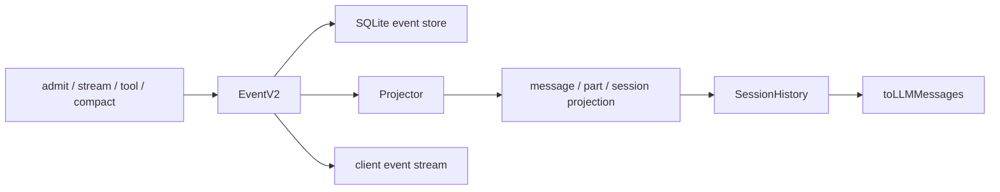
```mermaid
flowchart LR
    ACTION["admit / stream / tool / compact"] --> EVENT["EventV2"]
    EVENT --> SQL["SQLite event store"]
    EVENT --> PROJ["Projector"]
    PROJ --> MSG["message / part / session projection"]
    MSG --> HISTORY["SessionHistory"]
    HISTORY --> LLM["toLLMMessages"]
    EVENT --> UI["client event stream"]
```

### 12.2 崩溃语义

| 阶段 | 持久化语义 |
|---|---|
| `admit` 成功 | 用户任务已签收，重启后可以继续处理 |
| 工具执行中 | 可能存在未 settle 的半成品和重复执行风险 |
| `settle` 完成 | ProviderTurn 和工具结果已经固化 |
| `projector` 完成 | 查询历史和 UI 可以看到投影 |
| Drain 崩溃 | 进程内执行句柄丢失，但持久化输入/事件仍可重新驱动 |

OpenCode 的恢复更准确地说是：

```text
从持久化输入和历史重新建立运行上下文
```

不是把内存 Agent 对象完整 checkpoint 后恢复。

---

## 13. 客户端、Server、SDK 和 UI

### 13.1 API 调用边界

```text
CLI / TUI / Desktop / Web / Slack
  → SDK / Client
  → Server HTTP API
  → Core Service
```

客户端负责：

```text
提交 prompt
订阅事件
显示消息和 diff
显示权限请求
操作 Session 控制
```

Core 负责：

```text
准入、持久化、Drain、模型、工具、权限、投影、回滚
```

### 13.2 客户端不拥有业务真相

```text
UI 状态 = projection/cache
SQLite + Event = runtime truth
SessionRunner = execution truth
```

这避免 TUI、Web、Desktop 各自维护不同的 Agent Loop。

---

## 14. 完整运行流程

### 14.1 用户修复测试失败

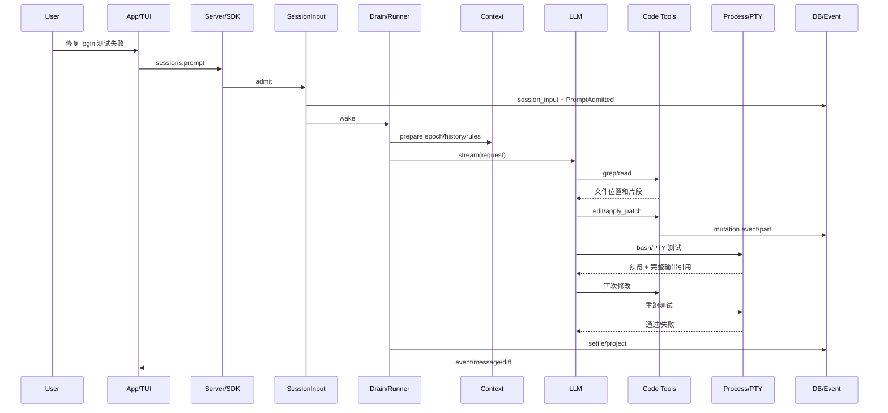
```mermaid
sequenceDiagram
    participant U as User
    participant A as App/TUI
    participant S as Server/SDK
    participant I as SessionInput
    participant R as Drain/Runner
    participant C as Context
    participant L as LLM
    participant T as Code Tools
    participant P as Process/PTY
    participant D as DB/Event

    U->>A: 修复 login 测试失败
    A->>S: sessions.prompt
    S->>I: admit
    I->>D: session_input + PromptAdmitted
    I->>R: wake
    R->>C: prepare epoch/history/rules
    R->>L: stream(request)
    L->>T: grep/read
    T-->>L: 文件位置和片段
    L->>T: edit/apply_patch
    T->>D: mutation event/part
    L->>P: bash/PTY 测试
    P-->>L: 预览 + 完整输出引用
    L->>T: 再次修改
    L->>P: 重跑测试
    P-->>L: 通过/失败
    R->>D: settle/project
    D-->>A: event/message/diff
```

### 14.2 完整主链路

```text
1. Client 调用 sessions.prompt
2. Server 转给 SessionInput.admit
3. 输入写入 SQLite，并发布 PromptAdmitted
4. SessionExecution.wake 唤醒 Coordinator
5. Drain 推广 steer 或 queue
6. History + Context Epoch 构建 Provider request
7. LLM stream 返回文本、reasoning、tool call
8. ToolRegistry 做 schema、permission、execute、settle
9. 工具结果写入 Part/Event
10. 如果需要，继续 Provider Turn
11. 如果上下文过长，执行 Compaction 并切换 Epoch
12. 没有 continuation 且没有 pending input 时进入 idle
13. Projector 和 Event stream 更新 UI
```

### 14.3 失败路径

```text
模型错误       → Provider error event → retry/终止
工具参数错误   → ToolFailure → tool result 返回给模型
权限拒绝       → permission event → 工具不执行
MCP 崩溃       → proxy error → 主 Session 保持运行
PTY 退出       → process event → Agent 观察退出码
Context 超限   → prune/summary → 新 Epoch
进程崩溃       → durable input/history → 重新 wake/drain
```

---

## 15. 错误边界和一致性语义

### 15.1 同进程与外部进程

| 模块 | 进程边界 | 故障影响 |
|---|---|---|
| Core Native Tool | Core 进程内 | 异常可能影响主进程，但统一可记录 |
| Plugin | Core 进程内 | 插件异常可能影响主进程 |
| MCP Server | 外部进程/远程 | 主要影响该工具调用 |
| Provider | 网络外部系统 | 产生 Provider error，可重试或终止 |
| PTY/Process | 子进程 | 记录退出码和输出 |

### 15.2 代码安全的最小闭环

```text
路径约束
  + Permission
  + Snapshot
  + Tool Output 限制
  + Event/Part 审计
  + Revert
```

OpenCode 不是完整 OS 沙箱；它主要通过 Permission、受保护路径、进程边界、快照和工具约束降低风险。

---

## 16. 代码阅读路线与文档合并说明

### 16.1 推荐源码阅读顺序

```text
packages/server/src/api.ts
  → packages/core/src/session/input.ts
  → packages/core/src/session/run-coordinator.ts
  → packages/core/src/session/runner/llm.ts
  → packages/core/src/session/history.ts
  → packages/core/src/tool/registry.ts
  → packages/core/src/permission.ts
  → packages/core/src/session/projector.ts
```

然后补读：

```text
代码修改：tool/read.ts → edit.ts → apply-patch.ts → bash.ts → snapshot.ts → revert.ts
上下文：system-context/ → reference/ → skill/ → context-epoch.ts
扩展：plugin/ → packages/plugin/ → MCP 配置与客户端
多 Agent：agent.ts → config/agent.ts → task/agent_switch/plan 工具
客户端：server → client → sdk → tui/app/desktop
```

### 16.2 原有文档如何归并

从现在开始采用以下原则：

| 文档 | 处理方式 |
|---|---|
| `ARCHITECTURE.md` | 唯一主文档，按模块和流程去重后的阅读入口 |
| `ARCHITECTURE_PART1.md` | 保留原始源码推导，作为历史/细节材料；不再作为总入口 |
| `ARCHITECTURE_PART2.md` | 保留 Context/Tool 专题细节 |
| `ARCHITECTURE_ATLAS.md` | 保留全维度对照、OpenManus 对照和 Code-native 设计专题 |
| `PACKAGE_MAP.md` | 保留包级源码清单，本文已抽取主线 |
| `SYSTEM_ARCHITECTURE.md` | 保留早期整体架构导读 |
| `MODULES_AND_INTERACTIONS.md` | 保留模块交互细节 |
| `RUNTIME_FLOWS.md` | 保留逐流程时序 |
| `SESSION_AND_CONTEXT.md` | 保留 steer/queue/Context 专题 |
| `AGENT_AND_MULTI_AGENT.md` | Agent 抽象、plan、task、主子 Session（独立专题） |
| `PLUGINS.md` | 官方生态插件表 + Core 内置插件 |
| 本文附录 B | 作为 OpenCode Plugin 生态扩展专题，不与 Core 混写 |

旧文档不会删除，因此原始内容不会丢失；重复概念只在本文主线中出现一次，专题文档用于查询源码细节。

---

## 17. API / Client / Server 模块详解

| 项 | 说明 |
|----|------|
| **职责** | 对外 HTTP/Embedded API；**不**实现 Drain、**不**直接调 Provider |
| **Server** | 路由、`sessions.*`、`project.*`、PTY、文件 → 调 Core Service |
| **Client / SDK** | 生成类型、Effect client；CLI/TUI/Desktop 唯一协议入口 |
| **边界** | 客户端只：创建 Session、prompt、steer/queue/abort、订阅事件 |
| **源码** | `packages/server/src/api.ts`, `packages/client/`, `packages/sdk/` |
| **深潜** | §13、「PACKAGE_MAP §2.2」（见下文同卷分节） |

```text
TUI / CLI / Web → SDK → Client → Server → Core
```

---

## 18. Input Admission 模块详解

| 项 | 说明 |
|----|------|
| **职责** | 请求进入系统的边界：校验、生成 input id、写 Event/SQLite、唤醒 Drain |
| **核心 API** | `SessionInput.admit`, `promoteSteers`, `promoteNextQueued` |
| **steer vs queue** | steer 打断当前 turn 注入；queue 顺序排队 → §10 |
| **持久语义** | `promoted_seq` 推广到 History，正常消费不 DELETE |
| **源码** | `session/input.ts` |
| **深潜** | §5.2、「SESSION_AND_CONTEXT」（见下文同卷分节） |

---

## 19. Session / Drain / RunCoordinator 模块详解

| 项 | 说明 |
|----|------|
| **Session** | 持久身份：history 投影、parent/child、status、与 Location 绑定 |
| **SessionExecution** | 进程内执行句柄：`wake`、合并重复 wake |
| **Drain** | 消费 inbox → 启动 Provider Turn → 处理 steer/queue/abort → idle |
| **RunCoordinator** | 单 Session 本地 Drain 所有权，防止并发双 Drain |
| **源码** | `session/run-coordinator.ts`, `session/store.ts`, `session/status.ts` |
| **深潜** | §6、「RUNTIME_FLOWS」（见下文同卷分节） |

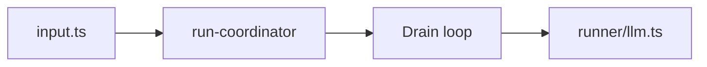
```mermaid
flowchart LR
    INPUT[input.ts] --> COORD[run-coordinator]
    COORD --> DRAIN[Drain loop]
    DRAIN --> RUNNER[runner/llm.ts]
```

---

## 20. Provider Turn / LLM 模块详解

| 项 | 说明 |
|----|------|
| **职责** | 组装 Provider 消息、`@opencode-ai/llm.stream`、流式 part、tool call settle、决定是否续跑 |
| **≠** | 一次 HTTP 请求（工具后可多轮 stream） |
| **Core** | `session/runner/llm.ts`, `runner/to-llm-message.ts` |
| **LLM 包** | Provider 路由、schema 规范化、认证、usage |
| **源码** | `packages/llm/src/route/`, `packages/llm/src/providers/` |
| **深潜** | §6、「ARCHITECTURE_PART1 §6」（见下文同卷分节） |

---

## 21. Context / History / Compaction 模块详解

| 项 | 说明 |
|----|------|
| **History** | 从 SQLite 投影构建模型可见对话 |
| **Context Epoch** | 系统基线不可变；变更通过中途 system 消息 / epoch 边界 |
| **Compaction** | prune + summary，控制 token；可在 Agent loop 内触发 |
| **三态** | 持久化 message/part ≠ Runner 内存累积 ≠ `toLLMMessages()` |
| **源码** | `session/history.ts`, `session/context-epoch.ts`, `session/compaction.ts`, `system-context/` |
| **深潜** | §7、「ARCHITECTURE_PART2」（见下文同卷分节）、[diagrams/opencode-compaction.workflow.html](./diagrams/opencode-compaction.workflow.html) |

---

## 22. Tool / Permission / Snapshot 模块详解

| 项 | 说明 |
|----|------|
| **ToolRegistry** | 内置 read/edit/patch/bash/grep/glob/task… + Plugin + MCP 代理 |
| **Permission** | allow / deny / ask；持久化用户决定 |
| **Snapshot / Revert** | 变更前捕获；`revert` 对齐磁盘与历史 |
| **代码 Agent 链** | read → edit/apply_patch → bash → git → snapshot |
| **源码** | `tool/registry.ts`, `tool/builtins.ts`, `permission.ts`, `snapshot.ts`, `session/revert.ts` |
| **深潜** | §8、§4.2、[diagrams/opencode-tool-pipeline.dataflow.html](./diagrams/opencode-tool-pipeline.dataflow.html) |

---

## 23. Event / Projector / SQLite 模块详解

| 项 | 说明 |
|----|------|
| **EventV2** | 事实日志：广播、审计、投影源 |
| **Projector** | Event → message/part 幂等投影 |
| **SQLite** | session、message、part、event、permission、session_input… |
| **恢复** | 重启后从 DB 重建 History，Drain 重新 wake |
| **源码** | `event/`, `session/projector.ts`, `database/` |
| **深潜** | §12、「ARCHITECTURE_PART1 §3 ER」（见下文同卷分节） |

---

## 24. Skill / Plugin / MCP 模块详解

| 能力 | 进程 | 能否新增 Tool | 崩溃影响 |
|------|------|---------------|----------|
| **Skill** | Core 扫描 `SKILL.md` | ❌ 仅文本 SOP | 低 |
| **TS Plugin** | 主进程同仓 | ✅ Hook + Plugin Tool | 插件异常可拖垮主进程 |
| **MCP** | 子进程 JSON-RPC | ✅ 代理 Tool | MCP 挂不影响 Core |

| 源码 | `skill/`, `plugin/host.ts`, MCP 配置于 `config/` |
| **深潜** | §9、「ARCHITECTURE_PART2」（见下文同卷分节） |

---

## 25. Config / Agent Profile 模块详解

| 项 | 说明 |
|----|------|
| **职责** | 合并 `opencode.json`、Provider、Agent、Tool、MCP、Compaction、LSP |
| **Agent Profile** | `build` / `plan` / `general` / `explore` / `compaction` / `title` / `summary` — **配置而非另一套引擎** |
| **切换** | `agent_switch` 工具、Plan 模式、子 Session |
| **源码** | `config/config.ts`, `config/agent.ts`, `agent.ts` |
| **深潜** | §11、[AGENT_AND_MULTI_AGENT.md](./AGENT_AND_MULTI_AGENT.md) |

---

## 26. Project / Location / Git 模块详解

| 项 | 说明 |
|----|------|
| **Location** | 目录作用域；Session 绑定 |
| **Project** | 元数据、配置、多 Session |
| **Repository / Worktree** | Git 状态、diff、隔离工作树 |
| **与普通 Agent 差异** | cwd 是可持久化、可 revert 的运行时状态 |
| **源码** | `location.ts`, `project/`, `repository.ts`, `git.ts` |
| **深潜** | §4、「PACKAGE_MAP §3」（见下文同卷分节） |

---

## 27. 编排模型对照

| 模型 | 机制 | 适用场景 |
|------|------|----------|
| **单 Session + build** | 默认编码 Agent | 日常改代码 |
| **plan Profile** | 只读/规划向工具集 | 先方案后 build |
| **子 Session / task** | 委派 explore、general | 并行探索、子任务 |
| **compaction Agent** | 隐藏服务 Profile | 上下文压缩 |
| **title / summary** | 隐藏内部 Agent | 会话元数据 |
| **Queue / Steer** | inbox 优先级 | 中途改指令 |
| **OMO（插件）** | Plugin 编排 Ralph/Team | 非 Core，见附录 A |

**不是** MetaGPT 式 `watch/cause_by` 多 Role 公司轮。

---

## 28. 概念交叉索引

| 你想搞懂… | 读 |
|-----------|-----|
| admit / drain / turn | §0.3、§5–§6 |
| steer vs queue | §10、「SESSION_AND_CONTEXT」（见下文同卷分节） |
| Context Epoch | §7、§21、「ARCHITECTURE_PART2」（见下文同卷分节） |
| Compaction 算法 | 「ARCHITECTURE_PART1」（见下文同卷分节）、§21 |
| Tool settle | §6、§22、「RUNTIME_FLOWS」（见下文同卷分节） |
| Agent Profile 列表 | §11、§25、「MODULES §9」（见下文同卷分节） |
| 包依赖方向 | §2、「PACKAGE_MAP」（见下文同卷分节） |
| Core 每个文件夹 | §3、「PACKAGE_MAP §3」（见下文同卷分节） |
| 客户端不能做什么 | §13、§17 |
| Event 投影 | §12、§23 |
| 与 Codex/Pi 对照 | 「README」（见下文同卷分节） |
| 全维度矩阵 | 「ARCHITECTURE_ATLAS」（见下文同卷分节） |

---

## 29. 阅读路径与专题文档映射

| 时间 | 路径 |
|------|------|
| **30 分钟** | §0 + §1 + §5–§6 + §28 |
| **2 小时** | 本章 §17–§27 模块表 + §14 E2E |
| **半天** | COMPLETE + 「ARCHITECTURE_PART1」（见下文同卷分节） ER/Compaction |
| **改 core** | §16 源码顺序 → `opencode/CONTEXT.md`、`specs/v2/` |
| **只查包边界** | 「PACKAGE_MAP」（见下文同卷分节） |

### 29.1 文档归并（与 §16 一致）

| 文档 | 角色 |
|------|------|
| **ARCHITECTURE.md** | 总控：导航 + 主线 + §17–§30 |
| ARCHITECTURE_PART1 | ER、Compaction 算法、类图 |
| ARCHITECTURE_PART2 | Epoch、Tool、持久化专题 |
| ARCHITECTURE_ATLAS | 维度矩阵、对照 |
| MODULES / RUNTIME_FLOWS / SESSION_AND_CONTEXT | 交互与时序专文 |
| SYSTEM_ARCHITECTURE | 早期总览（保留） |

---

## 30. Archify 图解索引

| 图 | 文件 |
|----|------|
| 运行时栈 | [opencode-runtime-stack.architecture.html](./diagrams/opencode-runtime-stack.architecture.html) |
| 双 Loop | [opencode-dual-loop.workflow.html](./diagrams/opencode-dual-loop.workflow.html) |
| E2E prompt | [opencode-e2e-prompt.sequence.html](./diagrams/opencode-e2e-prompt.sequence.html) |
| Session 生命周期 | [opencode-session-lifecycle.lifecycle.html](./diagrams/opencode-session-lifecycle.lifecycle.html) |
| Compaction | [opencode-compaction.workflow.html](./diagrams/opencode-compaction.workflow.html) |
| Queue / Steer | [opencode-queue-steer.workflow.html](./diagrams/opencode-queue-steer.workflow.html) |
| Tool 管线 | [opencode-tool-pipeline.dataflow.html](./diagrams/opencode-tool-pipeline.dataflow.html) |
| 多 Agent | [opencode-multi-agent.architecture.html](./diagrams/opencode-multi-agent.architecture.html) |
| 冷启动 | [opencode-cold-start.workflow.html](./diagrams/opencode-cold-start.workflow.html) |

---

## 附录 A：与 MAF / MetaGPT 体例对齐说明

| 习惯 | OpenCode 对应 |
|------|----------------|
| §0 导航 + 索引表 | 本章 §0.2 |
| 双/三层 Loop 表 | §0.3（admit / Drain / Turn） |
| 分模块源码锚点 | §17–§26 |
| 概念交叉索引 | §28 |
| Prompt 手册 | `system-context/`、`reference/`、各 Profile instruction（未单列全文，见 Part2 / config） |
| 多卷 Part | PART1 / PART2 / ATLAS |

---

## 附录 B：OpenCode 扩展 OMO

本文附录 B 描述的是基于 OpenCode Plugin 体系实现的外部扩展，不是 OpenCode Core 内置模块。

其典型扩展链路是：

```text
IntentGate
  → delegate-task
  → BackgroundManager
  → boulder.json 状态
  → Ralph Loop
  → Team Mode
  → SkillMcpManager
```

与 Core 的关系：

```text
OMO 使用 OpenCode Plugin / Hook / Tool / MCP 扩展点
OMO 自己实现后台 Agent、任务状态和循环
Core 只提供 Session、Tool、Event、Permission 等基础能力
```

因此应区分：

```text
OpenCode Core = 通用编码 Agent Runtime
OMO           = 基于 Plugin 机制的多 Agent 编排方案
```

OMO 细节见上文 **附录 B**（插件扩展，非 Core）。


---

# 分卷原文：ARCHITECTURE_PART1.md

> **存档分卷**：与上文总控篇 §0–§16 / §17–§30 内容重叠，仅作检索备份。日常阅读请用 [README.md](./README.md) 导航 + 独立专题 MD。


# OpenCode 完整内核架构全量文档（增补修订版）

> **主文档**：「`ARCHITECTURE.md`」（见下文同卷分节）。本文保留本专题的源码细节。

>
> 文档来源：本次对话全量复盘，基于 `anomalyco/opencode` 源码；无臆测，保留全部原有内容，新增：消息示例、数据表职责、Compaction 完整算法 + 调用时机、消息投影示例、补充 Mermaid 类图 / 架构图 / 时序图。
> 原有章节保留不动，新增内容追加在对应章节，末尾补充新增图表。

## 目录

1. 整体架构总览
2. 核心原语：admit /settle/drain
3. 数据模型 ER & 字段说明【**新增：各表职责、消息示例**】
4. 双层执行循环：Session Drain + ProviderTurn
5. ContextEpoch 原理与 `ContextEpoch.prepare()`【**新增：消息投影示例关系**】
6. Compaction 上下文压缩【**大幅扩充：完整步骤、算法、Agent Loop 调用位置、内存 /history 影响**】
7. Skill 模块设计与生命周期
8. Plugin（TS 同进程插件 & Hook 体系）
9. MCP 模块设计（Model Context Protocol）
10. Tool 体系详解：原生 Tool / Plugin Tool / MCP 代理 Tool
11. 全局启动完整流程
12. 会话运行完整时序（用户提问全链路）
13. Memory 相关插件体系
14. 模块横向对比汇总表
15. 常见误区澄清
16. **新增：类图、组件架构图**
17. **新增：压缩流程独立时序图**
18. 源码包地图：Workspace packages 与 Core 内部模块（详见 「PACKAGE_MAP.md」（见下文同卷分节））

---

# 1 整体架构总览

```
客户端(TUI/SDK)
    ↓
Core引擎
├─ admit/settle 消息持久化
├─ Drain双层执行循环
├─ ContextEpoch 上下文快照投影
├─ Compaction（Prune + Summary）
├─ ToolRegistry 全局统一工具注册表
├─ PluginLoader：加载TS插件、注册Hook、注册同进程自定义工具
├─ SkillLoader：扫描skill元信息，LLM按需加载SKILL.md
└─ MCPClient：拉起MCP子进程、握手、convertMcpTool、注册代理工具
    ↓
持久层 SQLite（session / message / part）
```

> **源码包地图入口**：本文保留执行循环、消息、Context Epoch、Compaction、Tool/Plugin/MCP 的主线；完整的 workspace package 与 `packages/core/src` 目录职责见 「`PACKAGE_MAP.md`」（见下文同卷分节）。这两个维度要分开看：Part 1 解释“怎么运行”，Package Map 解释“代码放在哪里、每个包封装什么”。

## 1.1 三大扩展模块一句话区分

- Skill：只约束思考流程，**不能新增工具能力**，纯文本 SOP；
- TS Plugin：主进程内运行，注册同进程工具、事件 Hook、修改上下文；插件代码异常会直接 crash 主进程；
- MCP：独立子进程，JSON-RPC 通信，提供外部工具；MCP 进程崩溃不会影响 OpenCode Core。

---

# 2 核心原语：admit /settle/drain

表格

| 原语 | 定义 | 触发时机 | 持久对象 | 崩溃语义 |
| --- | --- | --- | --- | --- |
| **admit** | 用户提交 prompt，将输入落盘，完成任务签收 | `sessions.prompt` 用户提交消息 | UserTurn（message+parts） | admit 写入 SQL 后任务不丢失，崩溃重启可继续 |
| **settle** | 一轮 ProviderTurn（LLM + 工具）执行完毕，固化本轮交互结果 | LLM 流式输出完成、并行工具执行结束 | ProviderTurn（message+parts） | settle 完成，本轮结果固化；settle 前崩溃，工具结果未落盘，存在重复执行风险 |
| **drain** | Session Drain 执行引擎，外层循环载体，驱动会话执行 | admit 写入 UserTurn 后，`SessionExecution.wake`唤醒 | Drain 状态仅内存，**不持久化** | at-least-once；进程 crash 后会重新拉起任务 |

- **UserTurn**：用户一轮输入回合，由 admit 写入。
- **ProviderTurn**：Agent 一轮 LLM 推理 + 工具调用回合，由 settle 写入。

>
> 崩溃语义重点：admit 是 “签收任务”，只要落库，任务就不会丢；settle 是保存 AI 这一轮所有输出。如果 settle 之前进程挂掉，本轮工具执行结果没有写入数据库，重启 Drain 会重新执行本轮，存在重复执行工具的风险。

---

# 3 数据模型 ER & 字段说明（修正版）

## ER 图


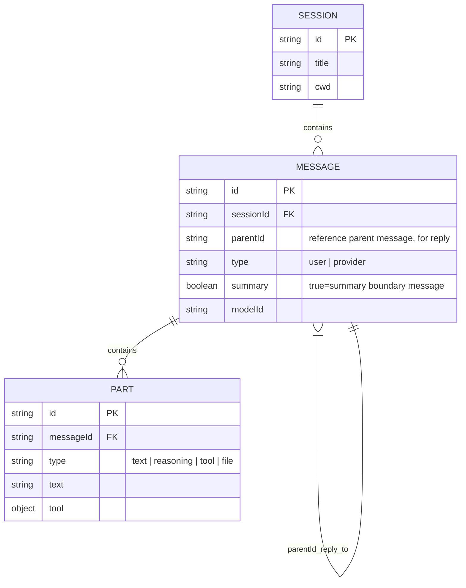
```mermaid
erDiagram
    SESSION ||--o{ MESSAGE : contains
    MESSAGE ||--o{ PART : contains
    MESSAGE }|--|| MESSAGE : parentId_reply_to
    SESSION {
        string id PK
        string title
        string cwd
    }
    MESSAGE {
        string id PK
        string sessionId FK
        string parentId "reference parent message, for reply"
        string type "user | provider"
        boolean summary "true=summary boundary message"
        string modelId
    }
    PART {
        string id PK
        string messageId FK
        string type "text | reasoning | tool | file"
        string text
        object tool
    }
```

生成失败，请重试

## ✅【新增：三张表职责和用途整理】

### SESSION 表

- **职责**：会话顶层容器，会话元数据，不存储对话正文。
- **用途**
  1. 隔离不同会话，所有 message 通过`sessionId`关联归属。
  2. 保存会话标题、当前项目工作目录`cwd`，供工具（bash/read）使用。
  3. 会话生命周期标记（创建时间、是否归档等，视源码实现）。

>
> 一条 Session 可以拥有 N 条 Message。

### MESSAGE 表

- **职责**：回合（Turn）元信息壳，**不存储正文**，只记录回合属性、对话链关系。
- **用途**
  1. 区分回合类型：`type=user` UserTurn；`type=provider` ProviderTurn。
  2. `parentId` 构建对话链表，还原历史顺序。
  3. `summary: boolean` 标记该消息是否为 Compaction 生成的摘要边界消息。
  4. `modelId`：记录本轮使用的模型。

>
> 一条 Message 可以拥有 N 条 Part。

### PART 表

- **职责**：最小内容分片，**唯一存储对话正文 / 工具内容的表**。
- **用途**
  1. 支持多分片：同一轮 Turn 可以同时包含文本、思考过程、多个并行工具调用结果。
  2. `type`区分分片类型：`text`普通文本、`reasoning`模型思考内容、`tool`工具调用入参 / 返回值、`file`文件片段。
  3. `tool`字段：JSON 对象，存放工具名称、参数、返回内容、状态码。
  4. 支持流式增量追加：流式输出时，持续向同一个 Message 追加 Part 记录。

>
> 核心规则：**所有人类 / 模型输出、工具 IO，全部保存在 Part；Message 只做元数据骨架。**

## ✅【新增：消息示例部分】

### 示例 1：用户输入（UserTurn）

```
SESSION: sid_001
MESSAGE: mid_u1
{
  "id": "mid_u1",
  "sessionId": "sid_001",
  "parentId": null,
  "type": "user",
  "summary": false,
  "modelId": null
}
PART: pid_u1_1
{
  "id": "pid_u1_1",
  "messageId": "mid_u1",
  "type": "text",
  "text": "帮我统计src目录下所有ts文件行数"
}
```

>
> admit 写入：1 条 user 类型 Message，1 条 text Part。

### 示例 2：Agent 一轮 ProviderTurn，文本 + 1 个 bash 工具调用

```
MESSAGE: mid_p1
{
  "id": "mid_p1",
  "sessionId": "sid_001",
  "parentId": "mid_u1",
  "type": "provider",
  "summary": false,
  "modelId": "gpt-4o"
}
PART: pid_p1_1 reasoning
{
  "type": "reasoning",
  "text": "需要执行bash find命令遍历src，统计ts文件行数"
}
PART: pid_p1_2 tool
{
  "type": "tool",
  "tool": {
    "name": "bash",
    "arguments": "find src -name '*.ts' | xargs wc -l",
    "result": "总共有1284行ts代码",
    "status": "success"
  }
}
PART: pid_p1_3 text
{
  "type": "text",
  "text": "src目录ts文件总行数：1284行"
}
```

>
> settle 写入：1 条 provider Message，3 个 Part（reasoning + tool + text）。

### 示例 3：Compaction 生成 summary 边界消息

```
MESSAGE: mid_p_summary
{
  "id": "mid_p_summary",
  "sessionId": "sid_001",
  "parentId": "mid_p1",
  "type": "provider",
  "summary": true,
  "modelId": "gpt-4o"
}
PART: pid_sum_1
{
  "type": "text",
  "text": "【历史摘要】前面对话：用户要求统计ts代码行数，执行bash得到1284行；用户后续询问文件结构，遍历src目录，列出所有模块。"
}
```

>
> 当`ContextEpoch.prepare()`加载消息链，读到`summary=true`的 mid_p_summary，则**丢弃 mid_p_summary 之前全部消息，只加载 mid_p_summary 以及之后所有消息**；数据库原始记录不会删除。

---

# 4 双层执行循环：Session Drain + ProviderTurn

>
> 源码位置：`packages/core/src/session/runner/llm.ts`

## 外层循环：Session Drain `while(shouldRun)`

每轮迭代完整步骤：

1. `MessageV2.loadWithParts(sessionId)`：SQL JOIN 读取 message + 关联 parts
2. 截断逻辑：遇到`summary=true`的 Message，丢弃这条消息之前全部历史，**只保留 summary 消息及其之后**
3. Token 预算评估，判断是否触发 Compaction
4. 分支：
  - 触发 Compaction → 执行 Prune + Summary 生成，写入新`summary=true`ProviderTurn，`continue`回到外层循环头部
  - 无溢出、有待办任务 → 进入`runTurnAttempt`内层 ProviderTurn 循环
5. 无待办任务，`shouldRun=false`，Drain 退出，ContextEpoch 销毁。

>
> 关键规则：外层每次迭代都会重新执行 `ContextEpoch.prepare()`，重建全新快照。
> 压缩**只能在外层循环执行**，不能打断正在运行的内层 ProviderTurn。

## 内层循环：ProviderTurn `while(needsContinuation)`（`runTurnAttempt`内部）

1. 复用外层 prepare 好的 ContextEpoch 快照，**不再重读数据库**
2. LLM 流式推理，生成 reasoning、tool_call、文本 Part
3. 并行执行 tool fibers（同一 Turn 下多工具并行）
4. `settle`：本轮所有 Part 连同顶层 Message 写入 SQLite
5. 判断 LLM 是否还有后续 tool_calls：
  - 是：继续内层循环（复用当前 Epoch 快照）
  - 否：退出内层，回到外层循环头部

>
> 核心要点：内层 settle 写入新 ProviderTurn**不会刷新当前正在使用的 ContextEpoch 快照**；新消息只有回到外层下一轮迭代才会加载。
> 含义：在同一轮 ProviderTurn 内部，LLM 看不到自己刚刚 settle 保存的消息，必须等内层循环结束，回到外层 Drain，重新 prepare 加载，新消息才会进入上下文快照。

---

# 5 ContextEpoch 原理与 `ContextEpoch.prepare()`

## ContextEpoch

- **纯内存快照对象，不持久化数据库**
- 对应外层 Drain 单次迭代的上下文基线
- 内层 ProviderTurn 全程复用该快照，快照不会自动更新
- 外层迭代结束，对象销毁；下一轮外层迭代重新`prepare()`生成全新快照
- 快照内容直接送入 LLM 请求窗口，也就是会话短期记忆 (STM)

## ContextEpoch.prepare () 完整流程

1. `MessageV2.loadWithParts(sessionId)`：JOIN 读取 message+parts
2. 消息链截断：找到第一条`summary=true`的 Message，丢弃其之前全部历史
3. `toModelMessages()`：遍历保留消息，展开 part 数组，转为 LLM API 消息结构；**内存层面对超长 tool 输出做截断，数据库原始 Part 不变**
4. 计算 token 总量，评估是否触发 compaction
5. 组装返回 ContextEpoch 快照，供给`runTurnAttempt`

### 两处裁剪区分（极易混淆）

- summary 消息：**消息链截断边界**（控制哪些回合被加载）
- toModelMessages part 截断：**内存投影裁剪，不修改 DB 原始记录**

>
> 举例：工具返回上万行日志，`toModelMessages`会在内存里截断文本，送给 LLM；但是 SQLite 里面原始 Part 完整保存，没有任何修改。

## ✅【新增：消息投影的示例关系】

>
> 数据库原始消息链（持久化，完整）

```
mid_u1 (user) → mid_p1 (provider) → mid_u2 (user) → mid_p2 (provider) → mid_u3 (user) → mid_p_summary (summary=true) → mid_u4 (user) → mid_p4 (provider)
```

>
> DB 中全部消息永久保留，不会删除。

>
> ContextEpoch 内存投影（prepare 之后，送入 LLM 的快照）

- 扫描消息链，发现`mid_p_summary`是 summary 边界
- 投影仅包含：`mid_p_summary` → mid_u4 → mid_p4
- mid_u1/mid_p1/mid_u2/mid_p2/mid_u3：**数据库存在，但本次投影直接跳过，不会进入 LLM 上下文**

>
> 投影转换细节：
>
>
> 1. 遍历保留的 Message 列表，展开每个 Message 下所有 Part
> 2. 合并 Part，组装成 LLM 标准 `[{role:"user", content:"..."}, {role:"assistant", content:"..."}]`
> 3. 在`toModelMessages`阶段：超长 tool part 在**内存字符串层面截断**，只截断投影版本，DB Part 不变。
> 4. 最终得到的 model 消息数组，就是 ContextEpoch 里交给 LLM 的窗口。

>
> 投影关系一句话：**DB 是完整原始历史；ContextEpoch 是 DB 历史经过边界截断 + 内存裁剪后的视图快照。**

---

# 6 Compaction 上下文压缩【大幅扩充：完整步骤、算法、Agent Loop 调用位置、内存 /history 影响】

>
> 源码文件：`compaction.ts`；**不存在`message.compacted`时间戳字段，旧文档该描述为错误假设**
> 目标：控制 token 总量；**不删除任何 message/part 数据库记录，仅改变下一次 prepare 加载哪些内容**。

## ✅ Compaction 在 Agent Loop 中的调用位置 & 触发时机

>
> 调用位置：**Drain 外层循环，ContextEpoch.prepare () 之后，进入 runTurnAttempt 之前**
> ❗ 不能在内层 ProviderTurn 循环执行压缩；压缩会中断当前 turn，必须回到外层循环头部。

触发判定逻辑：

1. prepare 加载并投影消息，计算总 token 数
2. 若总 token > 模型窗口预算阈值 → 触发 Compaction
3. Compaction 执行完成，`continue`回到外层循环头部，**重新执行 prepare，生成新的 ContextEpoch 快照**
4. 新的 prepare 会识别新增 summary 消息，自动截断旧历史

>
> 时序位置：
>
>
> ```
> Drain外层循环
>   prepare() → 计算token
>   if token溢出 → Compaction执行 → continue（回到循环开头）
>   else → runTurnAttempt内层ProviderTurn
> ```

## ✅ Compaction 完整两大阶段：Phase1 Prune（内存修剪） + Phase2 Summary（摘要边界写入 DB）

### Phase1：Prune（Part 级别内存修剪，仅内存投影，不改 DB）

**算法步骤**

1. 从消息链尾部反向遍历（保留最新对话）
2. 设定保护区：最近 N 条 UserTurn 不做修剪（保护用户最新提问不丢失）
3. 保护区之外的历史消息，遍历所有 Part
4. 只针对`type=tool`的 Part 执行裁剪：工具返回的长日志、大输出，截断文本内容
5. 裁剪仅修改**内存投影中的 part.text**；SQLite Part 原始记录完全不变
6. 重新计算修剪后总 token；若 token 已经降到阈值以内，可跳过 Summary 阶段

>
> Prune 策略算法要点：
>
>
> - 优先级保护：user 文本 > reasoning > tool 输出；只优先裁剪 tool 返回结果
> - 反向遍历：优先丢弃最古老工具输出，保留近期工具结果
> - 无 DB 写入，纯内存操作，开销低

### Phase2：Summary 摘要生成（写入 DB，新增 summary 边界消息）

>
> Prune 之后 token 仍然超出预算，则执行 Summary。
> **算法步骤**

1. 收集本次被 Prune 裁剪的全部历史对话（保护区之前的全部 turn）
2. 调用 LLM，对这段历史生成结构化摘要（提炼目标、关键动作、工具结果、结论）
3. settle 写入一条**`summary=true`的 ProviderTurn Message + text Part**存入 SQLite
4. 这条 summary 消息追加到消息链末尾，作为新截断边界
5. 回到 Drain 外层循环头部，重新`ContextEpoch.prepare()`
6. 新 prepare 加载消息链，读到 summary 标记，自动丢弃 summary 之前所有历史

>
> Summary 生成提示词约定：提炼关键事实、任务目标、工具执行结果，省略细节，保留决策依据。

## ✅ Compaction 对内存、History 的影响

### 对持久化 History（SQLite message/part）

1. ✅ **不会 DELETE 任何 message、part 记录**；全部历史永久保存在数据库。
2. ✅ 仅新增一条`summary=true`的 ProviderTurn 消息。
3. ✅ 原始 Part 文本完全不变；Prune 只修改内存投影，DB 原始内容无改动。

>
> 历史永远可回溯：直接查询数据库，拿到完整原始对话。

### 对内存（ContextEpoch 快照）

1. Prune 阶段：内存里的 tool part 文本被缩短，快照 token 下降；DB 不变。
2. Summary 完成后，下一轮 prepare 会**截断掉 summary 之前全部消息**，新 ContextEpoch 快照只包含 summary 消息 + 后续消息。
3. 当前正在运行的 ContextEpoch 快照**不会被就地修改**；压缩完成后强制回到外层循环，重新 prepare 生成全新快照。
4. 压缩完成后旧 Epoch 对象销毁，内存释放。

### 副作用边界

- 压缩只影响**下一轮 LLM 上下文窗口**；当前这一轮不会感知压缩。
- 摘要质量依赖 LLM；摘要丢失细节，Agent 后续无法看到 summary 之前的细粒度工具输出，只能依赖摘要文本。
- 多次压缩会生成多条 summary 消息；prepare 读取消息链，取**最靠后的 summary 消息**作为截断边界。

>
> 多轮压缩示例：
> 消息链：T1 T2 T3 → summary1 → T4 T5 T6 → summary2 → T7 T8
> prepare 读取，识别到 summary2，只加载 summary2、T7、T8；summary1 以及前面全部被跳过。

---

# 7 Skill 模块设计与生命周期

Skill 不是代码插件，**结构化任务 SOP 包，核心文件 `SKILL.md`**，只改变 Agent 思考流程，**不能新增工具能力**。

## 目录扫描规则（优先级：项目 > 全局）

1. 项目级：`./.opencode/skills/*/SKILL.md`
2. 全局级：`~/.config/opencode/skills/*/SKILL.md`
   每个 Skill 为独立文件夹，文件夹名 = skill 名称；可附带 checklist、examples。

```
skills/
  code-review/
    SKILL.md        # YAML元数据 + 主指令（name, description, activation, workflow）
    checklist.md
    examples/
```

- `SKILL.md`头部元数据：`name`、`description`、`activation`，定义触发场景。
- **懒加载**：启动阶段仅扫描 skill 名称 + 简短描述，注入 system prompt；**只有 LLM 主动调用内置`skill`工具，才会读取完整 SKILL.md 进入上下文**，节省 token。

## Skill 生命周期

1. 启动扫描：OpenCode 启动，遍历全局 + 项目 skills 目录，收集 skill 元信息列表，注入 system prompt
2. 会话运行：Drain 外层循环，LLM 评估任务，决定调用`skill`工具
3. 加载：Core 读取 SKILL.md，追加到当前 ContextEpoch 上下文
4. 本轮生效：加载后的 skill 规则，**仅当前 ProviderTurn 内生效；不会持久写入 message/part**；下一轮是否重新加载由 LLM 再次判断

>
> ⚠️ 用户不能用`/`命令直接调用 skill；**只有模型可以调用 skill 工具**，和`/xxx`用户命令完全分开。
> AGENTS.md ≠ Skill：AGENTS.md 是项目根目录静态全局规则，会话启动默认注入 system prompt，不需要调用 skill 工具加载。

>
> 举例子：code-review skill，启动的时候只把名字和简介放进 system prompt。LLM 在处理代码任务时，主动调用内置 skill 工具，此时 Core 才读取完整 SKILL.md，把评审规则加入当前上下文，本轮 AI 按照规则执行；本轮结束，skill 规则不会留在消息里，下一轮是否加载由模型自己决定。

---

# 8 Plugin（TS 同进程插件 & Hook 体系）

>
> 源码位置：`packages/core/src/plugin`；插件运行在 OpenCode**主进程内**。

## 加载路径

1. 全局插件：`~/.config/opencode/plugins/*.ts`
2. 项目级插件：`./.opencode/plugins/*.ts`

插件导出`Plugin`函数，返回 hook map 与 tool 定义：

```
export default function plugin(ctx: PluginContext) {
  return {
    tool: {
      memory_search: async (args, ctx) => {
        return { content: "记忆检索结果" }
      }
    },
    hooks: {
      "message.part.updated": async (evt) => {},
      "experimental.chat.system.transform": (sysPrompts) => {
        sysPrompts.push("额外记忆上下文");
        return sysPrompts;
      }
    }
  }
}
```

## 插件三类扩展能力

1. **注册自定义 Tool**：同进程内执行，注册进全局 ToolRegistry。
2. **事件 Hook（订阅事件，副作用 / 观测）**

表格

| 事件分类 | 事件名 | Memory 插件典型用途 |
| --- | --- | --- |
| Session 生命周期 | `session.created` / `session.idle` / `session.compacted` / `session.deleted` | idle 后自动抽取对话摘要写入记忆库 |
| Message/Part | `message.updated` / `message.part.updated` | settle 之后捕获 ProviderTurn 内容，抽取记忆 |
| Tool | `tool.execute.before` / `tool.execute.after` | 观测工具执行结果 |
| File | `file.edited` / `file.watcher.updated` | 代码变更抽取、RAG 富集 |
3. **Experimental Transform Hook（修改 LLM 上下文）**
  - `experimental.chat.system.transform`：LLM 调用前修改 system prompt 数组；记忆注入常用路径，不产生 Part。
  - `chat.message` transform：修改 UserTurn parts，注入 synthetic Part。

>
> 插件风险：插件代码运行在主进程；插件异常会直接导致主进程崩溃；与 MCP 进程隔离完全不同。

## 记忆插件两条主流注入路径

1. **System Prompt Transform**
  - 不写入 message/part；LLM 组装请求时追加到 system 数组；不污染会话消息链。
2. **Synthetic Part 注入**
  - 插件构造合法虚拟 Part，插入 UserTurn parts 数组；`ContextEpoch.prepare()`加载时自动纳入上下文；
  - Core**不区分原生 Part 与插件注入的 Part**。

>
> 第三条扩展方式：注册自定义 tool，Agent 在内层循环主动调用。

>
> 示例：记忆插件监听`message.part.updated`，每次 AI settle 完成一轮回复，插件读取本轮对话，抽取事实存入独立向量库；当用户新提问，插件在`experimental.chat.system.transform`把相关记忆追加进 system prompt，LLM 直接看到记忆，不会生成额外 message/part。

---

# 9 MCP 模块设计（Model Context Protocol）

MCP = Model Context Protocol；**MCP Client 是 Core 原生内置模块；MCP Server 是独立子进程**，C/S JSON-RPC over stdio / HTTP。

>
> MCP 只提供外部工具能力，**不会自动注入上下文**；Agent 必须主动调用 MCP 工具。

## 配置样例（opencode.jsonc）

```
{
  "mcp": {
    "mem-mcp": {
      "type": "local",
      "command": ["npx", "opencode-md-memory-mcp"],
      "enabled": true,
      "environment": {}
    }
  }
}
```

- `type: local`：spawn 子进程，stdio 管道通信
- `type: remote`：远程 HTTP/SSE MCP 服务

## MCP 启动流程

1. Core 读取`opencode.jsonc` mcp 配置块
2. 遍历每个 enabled MCP 服务：
  - local：spawn 子进程；remote：建立 http 连接
  - MCP `initialize`握手
  - 调用`listTools()`拉取 MCP Server 工具定义
3. 调用`convertMcpTool`，将 MCP 工具定义转换为 Core 标准 Tool
4. 注册代理 Tool 到全局`ToolRegistry`

>
> MCP 连接全局单例，跨会话复用；**MCP 工具注册在全局启动阶段，不是会话创建阶段**。

## MCP 运行时调用链路

1. LLM 输出 tool_call，命中 MCP 代理工具
2. 触发`tool.execute.before` hook
3. MCP 代理 wrapper 的 execute 执行 JSON-RPC 转发，调用 MCP 子进程
4. MCP Server 执行业务逻辑，返回结果
5. Core 包装结果为 tool Part，settle 写入 message/part
6. 触发`tool.execute.after` hook

>
> 故障隔离：MCP 子进程崩溃，**不会导致 OpenCode 主进程挂掉**；MCPClient 捕获异常并返回错误给 Agent。

---

# 10 Tool 体系详解：原生 Tool / Plugin Tool / MCP 代理 Tool

>
> 核心底层事实：**OpenCode 内部只有一套统一 ToolRegistry；LLM 视角完全无法区分三类工具**。

## Core 内部统一 Tool 类型

```
type Tool = {
  name: string
  description: string
  inputSchema: JSONSchema7
  execute: (args: unknown, ctx: ToolContext) => Promise<ToolResult>
}
```

- `ToolContext`：会话上下文，包含 sessionId、cwd、事件总线、权限、项目环境
- `execute`：执行入口；原生 / 插件工具执行真实业务；MCP 的 execute 仅为 RPC 代理转发。

## 原生内置 Tool 封装与注册

原生工具（bash /read/edit /skill）使用内置`tool()` Zod helper 定义，**硬编码在 Core**。

```
import { tool } from "@opencode/core/tool"
export const bashTool = tool({
  description: "shell命令执行",
  args: { cmd: tool.schema.string() },
  async execute(args, ctx) {
    // 权限校验、沙箱、spawn shell
    return { content: await runBash(ctx.cwd, args.cmd) }
  }
})
```

1. Core 启动最早阶段静态注册，`registry.register(bashTool)`写入 ToolRegistry
2. 执行：主进程直接调用 execute；异常会影响主进程
3. 调用前后触发`tool.execute.before` / `tool.execute.after` hook

## MCP 工具封装核心函数 `convertMcpTool`

接收 MCP 协议`MCPToolDef`，输出 Core 标准 Tool 对象；execute 是 RPC 代理：

```
function convertMcpTool(mcpTool: MCPToolDef, mcpClient: MCPClient): Tool {
  return dynamicTool({
    name: mcpTool.name,
    description: mcpTool.description ?? "",
    inputSchema: { type:"object", ...mcpTool.inputSchema, additionalProperties:false },
    execute: async (args) => {
      return mcpClient.callTool({ name: mcpTool.name, arguments: args })
    }
  })
}
```

>
> 为避免多 MCP 服务重名冲突，默认添加名称前缀：`mcp__serverName__toolName`。

## 三类工具横向对比

表格

| 项目 | 原生内置 Tool | Plugin 自定义 Tool | MCP 代理 Tool |
| --- | --- | --- | --- |
| 定义来源 | Core 内置硬编码 | TS 插件导出 tool | MCP Server listTools + convertMcpTool 包装 |
| 运行进程 | OpenCode 主进程 | OpenCode 主进程 | MCP 独立子进程 |
| execute | 原生业务逻辑 | 插件内业务逻辑 | RPC 代理转发，无业务 |
| 注册时机 | Core 启动最早加载 | 插件加载阶段 | MCP 握手 listTools 后，全局启动阶段 |
| 故障隔离 | ❌ 主进程崩溃 | ❌ 插件异常崩主进程 | ✅ MCP 进程挂掉不影响主 Core |
| 协议 | 直接函数调用 | 直接函数调用 | MCP JSON-RPC over stdio/http |
| hook 触发 | ✅ before/after | ✅ before/after | ✅ before/after |
| LLM 感知 | 完全一致 | 完全一致 | 完全一致，LLM 看不到底层差异 |

### 全局工具注册顺序（同名覆盖）

1. 原生内置工具
2. TS 插件注册的自定义工具
3. MCP 代理工具

>
> 示例：如果插件注册了一个叫`bash`的工具，会覆盖 Core 原生 bash；再如果 MCP 注册同名 bash，会再次覆盖插件版本。LLM 拿到的 function schema 完全一样，不知道底层是哪一个实现。

---

# 11 全局启动完整流程


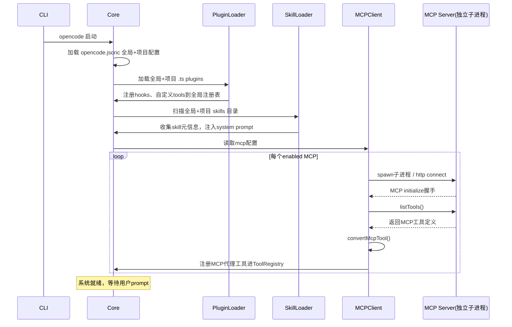
```mermaid
sequenceDiagram
    participant CLI
    participant Core
    participant PluginLoader
    participant SkillLoader
    participant MCPClient
    participant MCP_Server as MCP Server(独立子进程)

    CLI->>Core: opencode 启动
    Core->>Core: 加载 opencode.jsonc 全局+项目配置
    Core->>PluginLoader: 加载全局+项目 .ts plugins
    PluginLoader->>Core: 注册hooks、自定义tools到全局注册表
    Core->>SkillLoader: 扫描全局+项目 skills 目录
    SkillLoader->>Core: 收集skill元信息，注入system prompt
    Core->>MCPClient: 读取mcp配置
    loop 每个enabled MCP
        MCPClient->>MCP_Server: spawn子进程 / http connect
        MCP_Server-->>MCPClient: MCP initialize握手
        MCPClient->>MCP_Server: listTools()
        MCP_Server-->>MCPClient: 返回MCP工具定义
        MCPClient->>MCPClient: convertMcpTool()
        MCPClient->>Core: 注册MCP代理工具进ToolRegistry
    end
    Note over Core: 系统就绪，等待用户prompt
```

---

# 12 会话运行完整时序（用户提问全链路）


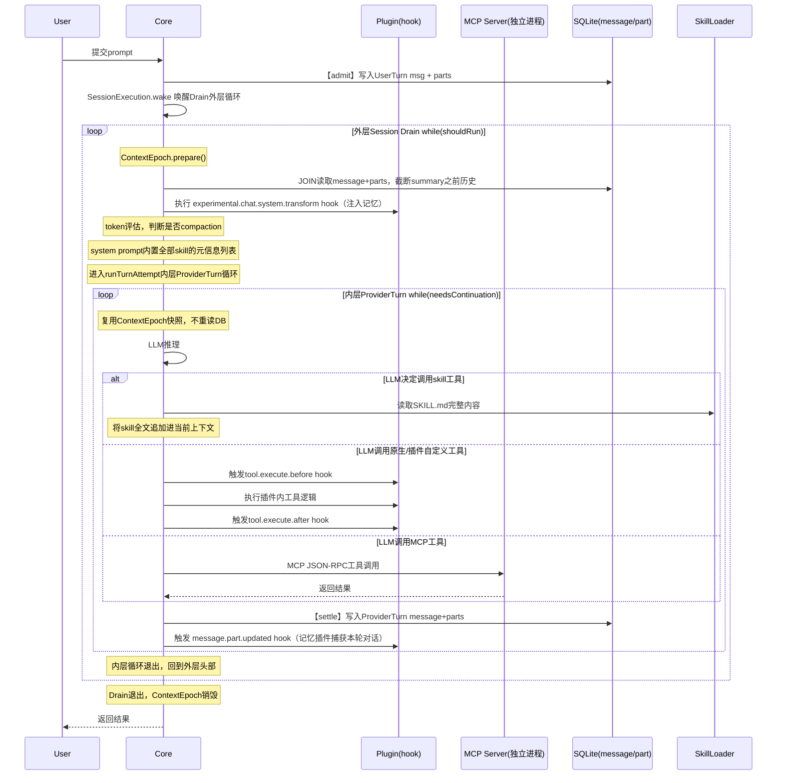
```mermaid
sequenceDiagram
    participant User
    participant Core
    participant Plugin as Plugin(hook)
    participant MCP as MCP Server(独立进程)
    participant DB as SQLite(message/part)

    User->>Core: 提交prompt
    Core->>DB:【admit】写入UserTurn msg + parts
    Core->>Core: SessionExecution.wake 唤醒Drain外层循环

    loop 外层Session Drain while(shouldRun)
        Note over Core: ContextEpoch.prepare()
        Core->>DB: JOIN读取message+parts，截断summary之前历史
        Core->>Plugin: 执行 experimental.chat.system.transform hook（注入记忆）
        Note over Core: token评估，判断是否compaction
        Note over Core: system prompt内置全部skill的元信息列表
        Note over Core: 进入runTurnAttempt内层ProviderTurn循环

        loop 内层ProviderTurn while(needsContinuation)
            Note over Core: 复用ContextEpoch快照，不重读DB
            Core->>Core: LLM推理
            alt LLM决定调用skill工具
                Core->>SkillLoader: 读取SKILL.md完整内容
                Note over Core: 将skill全文追加进当前上下文
            else LLM调用原生/插件自定义工具
                Core->>Plugin: 触发tool.execute.before hook
                Core->>Plugin: 执行插件内工具逻辑
                Core->>Plugin: 触发tool.execute.after hook
            else LLM调用MCP工具
                Core->>MCP: MCP JSON-RPC工具调用
                MCP-->>Core: 返回结果
            end
            Core->>DB:【settle】写入ProviderTurn message+parts
            Core->>Plugin: 触发 message.part.updated hook（记忆插件捕获本轮对话）
        end
        Note over Core: 内层循环退出，回到外层头部
    end
    Note over Core: Drain退出，ContextEpoch销毁
    Core-->>User: 返回结果
```

---

# 13 Memory 相关插件体系

>
> 原生 Core**没有自动跨会话记忆、agent.md/user.md/memory.md**；全部是第三方插件约定。

## Memory 类插件清单

表格

| 插件 | 存储形态 | 注入方式 | 特点 |
| --- | --- | --- | --- |
| opencode-mem0 / @mem0/opencode-plugin | 本地 SQLite 向量库 | chat.message hook 注入 synthetic Part | 自动 embedding、session.idle 抽取记忆、project/user 作用域、记忆打分衰减 |
| agent-memory (Letta 风格) | Markdown memory blocks（agent.md/user.md/project.md） | system.transform 注入 + memory_set/list 工具 | 可编辑分块记忆，MemGPT 风格；Agent 主动读写 md 块 |
| opencode-md-memory | `.memory/` 下纯 markdown（MEMORY.md/ USER.md/ IDENTITY.md） | 注入 part / 提供 read/write 工具 | agent.md/user.md/memory.md，纯文件，人可读，无向量 |
| simple-memory | logfmt 文本日志 | tool + 可选注入 | 极简无向量，审计友好 |
| opencode-mem | 本地向量 SQLite | synthetic part + tools | 双 STM/LTM、web UI |
| opencode rag / code-rag plugins | 代码 chunk 向量库 | MCP / register search tool | 代码检索，无自动注入，工具调用为主 |
| MCP project-memory / memsearch | MCP 独立进程 | 纯工具调用，无自动注入 | 完全走工具路径，不自动注入上下文 |

## Memory 插件标准工作流（mem0 synthetic part 路线）

1. **Capture 捕获**：监听`message.part.updated` / `session.idle` hook；settle 拿到完整 ProviderTurn，LLM 抽取事实，生成 embedding 写入插件独立向量库（与 OpenCode SQLite 隔离）
2. **Recall 召回**：用户新 prompt，admit 之后、Drain 运行前；对 query 做向量检索，召回 topN 记忆
3. **注入二选一**
  - A. 构造 synthetic text Part，prepend 到当前 UserTurn parts → ContextEpoch.prepare 自动加载
  - B. push 记忆文本到 system prompt 数组（experimental.chat.system.transform）
4. **消费**：Drain prepare 完成，runTurnAttempt 内层 LLM 直接看到记忆；或者 Agent 主动调用 memory_search 工具检索

>
> 组合方案：Plugin 做捕获，MCP 做检索工具，Skill 写 SOP 规范记忆读写时机。

---

# 14 模块横向对比汇总表

表格

| 模块 | 运行进程 | 核心作用 | 触发主体 | 持久化 | 故障隔离 |
| --- | --- | --- | --- | --- | --- |
| Skill | 主进程内 | 任务 SOP、领域规范，**修改 Agent 行为 / 流程** | LLM 主动调用 skill 工具 | SKILL.md 静态文件，运行加载内容不写入消息库 | 无，纯文本 |
| Plugin(TS Hook) | 主进程内 | 监听事件、修改上下文、注册同进程自定义工具 | 事件总线自动触发 / LLM 调用工具 | 插件外部存储（记忆插件独立 DB/MD） | ❌ 插件崩溃会影响主进程 |
| MCP Server | **独立子进程** | 外部系统能力：数据库、向量检索、RAG、外部 API | LLM 主动调用 MCP 工具 | MCP 服务自己管理存储 | ✅ 进程隔离，MCP 挂掉不崩 OpenCode |

---

# 15 常见误区澄清（本次对话全部纠错点，完整保留）

1. ❌ MCP 是插件的一种
   ✅ MCP Client 是 Core 原生模块；MCP Server 是独立外部进程；TS 插件是另一套同进程扩展体系，二者可以搭配但不属于同一层。
2. ❌ LLM 能够区分 MCP 工具和原生工具
   ✅ LLM 拿到的 function calling schema 全部来自 ToolRegistry，**没有任何标记区分来源**。
3. ❌ MCP 工具在会话创建时注册
   ✅ MCP 工具在**OpenCode 全局启动阶段一次性发现注册**，跨会话复用。
4. ❌ Compaction 会删除旧 message/part 数据库记录
   ✅ Compaction 不会 DELETE 任何记录；仅新增 summary 边界消息，prepare 阶段做内存投影截断。
5. ❌ agent.md/user.md/memory.md 是 OpenCode 原生文件
   ✅ 原生不存在；这是`opencode-md-memory`、`agent-memory`插件约定的文件。
6. ❌ Skill 可以新增工具
   ✅ Skill 只提供 SOP 文本，**不能新增工具**。

---

# ✅【新增：16 类图】


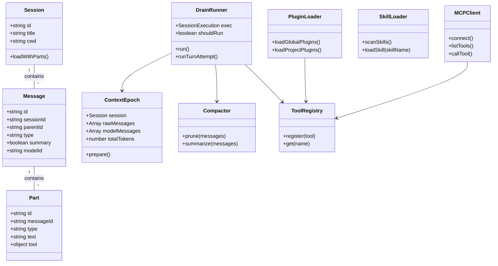
```mermaid
classDiagram
    class Session {
        +string id
        +string title
        +string cwd
        +loadWithParts()
    }
    class Message {
        +string id
        +string sessionId
        +string parentId
        +string type
        +boolean summary
        +string modelId
    }
    class Part {
        +string id
        +string messageId
        +string type
        +string text
        +object tool
    }
    class ContextEpoch {
        +Session session
        +Array<Message> rawMessages
        +Array<ModelMsg> modelMessages
        +number totalTokens
        +prepare()
    }
    class DrainRunner {
        +SessionExecution exec
        +boolean shouldRun
        +run()
        +runTurnAttempt()
    }
    class Compactor {
        +prune(messages)
        +summarize(messages)
    }
    class ToolRegistry {
        +register(tool)
        +get(name)
    }
    class PluginLoader {
        +loadGlobalPlugins()
        +loadProjectPlugins()
    }
    class SkillLoader {
        +scanSkills()
        +loadSkill(skillName)
    }
    class MCPClient {
        +connect()
        +listTools()
        +callTool()
    }

    Session "1" -- "*" Message : contains
    Message "1" -- "*" Part : contains
    DrainRunner --> ContextEpoch
    DrainRunner --> Compactor
    DrainRunner --> ToolRegistry
    PluginLoader --> ToolRegistry
    MCPClient --> ToolRegistry
```

# ✅【新增：17 Compaction 独立时序图】


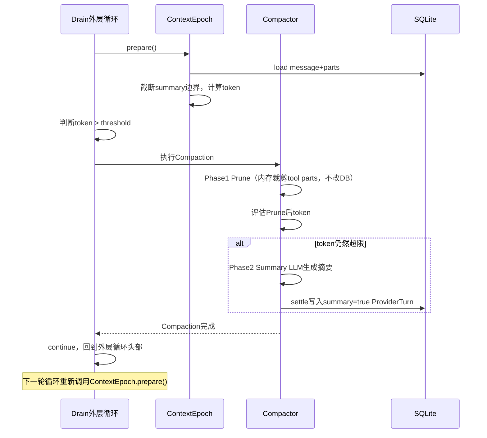
```mermaid
sequenceDiagram
    participant Drain as Drain外层循环
    participant CE as ContextEpoch
    participant Compactor
    participant DB as SQLite

    Drain->>CE: prepare()
    CE->>DB: load message+parts
    CE->>CE: 截断summary边界，计算token
    Drain->>Drain: 判断token > threshold
    Drain->>Compactor: 执行Compaction
    Compactor->>Compactor: Phase1 Prune（内存裁剪tool parts，不改DB）
    Compactor->>Compactor: 评估Prune后token
    alt token仍然超限
        Compactor->>Compactor: Phase2 Summary LLM生成摘要
        Compactor->>DB: settle写入summary=true ProviderTurn
    end
    Compactor-->>Drain: Compaction完成
    Drain->>Drain: continue，回到外层循环头部
    Note over Drain: 下一轮循环重新调用ContextEpoch.prepare()
```

# ✅【新增：组件架构分层图】


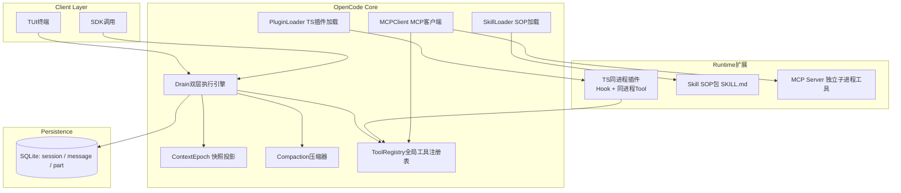
```mermaid  
graph TD
    subgraph Client Layer
        TUI[TUI终端]
        SDK[SDK调用]
    end
    subgraph OpenCode Core
        Drain[Drain双层执行引擎]
        CE[ContextEpoch 快照投影]
        Compactor[Compaction压缩器]
        ToolReg[ToolRegistry全局工具注册表]
        PluginLoader[PluginLoader TS插件加载]
        SkillLoader[SkillLoader SOP加载]
        MCPClient[MCPClient MCP客户端]
    end
    subgraph Runtime扩展
        Plugin[TS同进程插件<br/>Hook + 同进程Tool]
        Skill[Skill SOP包 SKILL.md]
        MCPServer[MCP Server 独立子进程工具]
    end
    subgraph Persistence
        SQLite[(SQLite: session / message / part)]
    end

    TUI --> Drain
    SDK --> Drain
    Drain --> CE
    Drain --> Compactor
    Drain --> ToolReg
    PluginLoader --> Plugin
    Plugin --> ToolReg
    SkillLoader --> Skill
    MCPClient --> MCPServer
    MCPClient --> ToolReg
    Drain --> SQLite
```

---

现在这份文档补齐了你要求的 5 项增补点：

1. ✅ 消息示例部分（UserTurn / ProviderTurn /summary 消息完整 JSON 样例）
2. ✅ Session / Message / Part 三张数据表职责整理
3. ✅ Compaction：完整步骤、算法、Agent Loop 调用位置时机、内存 & history 影响
4. ✅ 消息投影示例关系（DB 原始链 vs ContextEpoch 内存快照）
5. ✅ 新增类图、压缩独立时序图、组件分层架构图

# OpenCode 沙箱模块完整设计（源码视角，区分**原生内置权限层** 和 **可选 OS 隔离沙箱插件**）

>
> 核心前置结论（官方文档明确）：
> **OpenCode 本身没有内置操作系统级强隔离沙箱**。原生自带的是 `PermissionGate + FileSystemGate`，只是**权限校验层（软防护、人工确认弹窗），不是安全沙箱**，不能抵御命令注入逃逸；真正 OS 隔离沙箱属于外挂插件（msb /opencode-sandbox/bubblewrap /sandbox-exec），基于 Hook 拦截 bash 工具调用实现，**插件化插拔**。

>
> 很多人混淆：
>
>
> - ✅ 原生权限系统：**业务层白名单 / 路径过滤、人机确认弹窗**（属于 DrainRunner 工具调用链路的一部分）
> - ✅ 可选沙箱插件：**OS 内核隔离（Linux bwrap /macOS Seatbelt sandbox-exec）**，进程级文件 / 网络隔离，真正沙箱；非核心、可关闭。
> - ❌ OpenCode 主程序内部没有硬编码容器 /namespace 沙箱。

## 一、模块分层总览

```
┌────────────────────────────────────────────────────────────┐
│ DrainRunner（Agent Loop大管家）                              │
└───────────────────────┬────────────────────────────────────┘
                        │ ToolCall进入工具执行阶段
┌───────────────────────▼────────────────────────────────────┐
│ HookManager：tool.execute.before / tool.execute.after 钩子    │  <--- 沙箱插件在这里拦截bash
└───────────────────────┬────────────────────────────────────┘
                        ▼
┌────────────────────────────────────────────────────────────┐
│ PermissionGate（原生权限网关，OpenCode内置）                  │
│  ├─ 工具级规则：bash / read / write / edit / glob / task     │
│  └─ 路径规则：cwd内外、敏感目录拦截（~/.ssh, ~/.aws）         │
└───────────────────────┬────────────────────────────────────┘
                        ▼
┌────────────────────────────────────────────────────────────┐
│ FileSystemGate（文件操作网关，内置）                         │
│  文件读写路径校验、项目目录边界保护                          │
└───────────────────────┬────────────────────────────────────┘
                        ▼
┌────────────────────────────────────────────────────────────┐
│ Tool 实现（bash/read_file/write_file）                       │
│   └─ 如果启用沙箱插件：bash命令转发给SandboxRuntime执行       │
│   └─ 不启用沙箱：直接在host本机spawn子进程跑shell            │
└────────────────────────────────────────────────────────────┘
```

## 二、原生内置安全模块（不是沙箱，是权限控制）

### 1. PermissionGate

**位置**：挂载在 `SessionExecution.permissionGate`，会话实例独立，从 Agent 定义的`permission`配置加载规则。
职责：在**工具执行前**做规则匹配，返回 `allow / deny / ask（人工确认弹窗）`。
规则粒度：

1. 工具维度：bash /read/edit /glob/grep /task（子 Agent）独立规则
2. Bash 命令解析：**解析 argv，不是简单字符串匹配**，按命令前缀做模式匹配（`git *`、`rm *`）
3. 文件路径：glob 路径匹配，限制可读写目录
4. 优先级：更具体规则覆盖通配规则

示例 agent 权限配置：

```
"permission": {
  "bash": {
    "*": "ask",
    "git *": "allow",
    "rm -rf *": "deny"
  },
  "edit": {
    "*": "deny",
    "./src/**": "allow"
  }
}
```

>
> 弱点：纯应用层规则。LLM 构造命令绕过字符串匹配即可逃逸；**仅作为人工提醒，不是安全边界**。

### 2. FileSystemGate

配合 PermissionGate，专门拦截文件操作：

- 限制读写默认仅允许在当前 worktree（项目目录）
- 黑名单路径：`~/.ssh`、`~/.aws`、`~/.gnupg`等密钥目录
- 跨目录访问触发 `ask` 确认弹窗

>
> 文件操作默认不走沙箱，直接操作 host 磁盘。**沙箱插件可以覆盖 read/write 工具，把文件操作也转发进隔离环境**。

## 三、可选沙箱插件模块（真正 OS 级隔离，插件式注入）

沙箱插件（msb /opencode-sandbox）**不侵入 DrainRunner 主循环代码**，完全依托 OpenCode 的 Hook 机制插入链路。

### 核心组件

1. **SandboxManager**
   会话级沙箱管理器；**延迟初始化**：直到第一次 bash 工具调用才创建沙箱实例，不拖慢启动。
    - 维护会话 ↔ sandbox 实例映射
    - 生命周期管理：create /exec/destroy /list
    - 子 Agent 共享根会话的同一个沙箱（子 Agent 不会新建独立沙箱）docs.tenso...
2. **SandboxContext**
   绑定当前 SessionExecution，拦截工具调用，把 bash 执行转发给 sandbox runtime；携带 mount、env、network 配置。
3. **Shell Shim**
   包装 bash 调用，把原始 agent 的 command，包装成 bwrap /sandbox-exec 执行参数；对上层 Agent 透明，UI 展示仍然是原始命令（hook after 阶段恢复）
4. SandboxRuntime（底层驱动）

表格

| 平台 | 底层原语 | 隔离能力 |
| --- | --- | --- |
| Linux | bubblewrap（用户 namespace） | 文件系统、mount 隔离，网络可控制 allowlist |
| macOS | sandbox-exec Seatbelt | 强制配置文件系统读写边界 |
| Windows | 有限支持，无原生内核隔离 | 仅文件权限过滤 |

### 沙箱插件 完整 Hook 拦截时序（嵌入 DrainRunner turn 循环）

```
DrainRunner准备执行bash工具
  → 触发hook: tool.execute.before
      → Sandbox插件拦截，调用SandboxManager.wrapWithSandbox()
      → 首次调用：创建沙箱实例，挂载worktree（项目目录）
      → 将原始bash命令封装，交给SandboxRuntime执行
  → 执行隔离环境内命令
  → hook: tool.execute.after
      → 把包装后的底层执行参数隐藏，返回原始命令文本给事件流/UI
  → 工具结果返回DrainRunner，继续settleTurn落库
```

### 沙箱挂载策略

- worktree 项目目录**同路径映射**：host 上`/xxx/project`映射到沙箱内部同样路径，agent 代码不需要改路径逻辑，对 LLM 完全透明
- 只读挂载：系统目录、home 密钥目录只读 / 不可访问
- 可写目录：仅项目目录 + /tmp 临时目录
- Network：支持域名 allowlist（npm、github、pypi），其余出站连接阻断

### 沙箱生命周期（和 SessionExecution 绑定）

1. 会话创建：sandbox=null，延迟初始化
2. 第一次 bash 工具调用 → 创建 sandbox 实例，挂载 worktree
3. 同会话后续所有 bash 共享该实例；子 Agent 共用父沙箱
4. 会话终止 /abort → 停止销毁 sandbox，清理临时资源

>
> 沙箱独立于 DB 消息持久化，**只在内存运行，会话销毁就销毁**。

## 四、和我们前面 ER 图集成（新增实体）


```mermaid
erDiagram
%% ====================== 持久化实体（SQLite磁盘存储） ======================
    SESSION_DB {
        string sessionId PK
        string parentSessionId FK
        string status
        string summary
        number createdAt
        number updatedAt
    }
    MESSAGE {
        string id PK
        string sessionId FK
        string role
        string content
        string toolCalls "json"
        string toolResult "json"
        number turnIndex
    }
    AGENT_DEF_FILE {
        string agentId PK
        string filePath
        string frontMatter "yaml"
        string rawSystemPrompt
        string toolNames "list of tool names"
        string permissionRule "json"
    }
%% ====================== 运行时内存实体（进程内，进程销毁丢失） ======================
    CLI {
        string cwd
        string cliArgs
        string stdio "EventEmitter"
    }
    DRAIN_RUNNER {
        string se_ref "ref SessionExecution"
        boolean isRunning
        string globalAbort "AbortSignal"
    }
    SESSION_EXECUTION {
        string sessionId
        string activeAgentId
        string plan "nullable ref Plan"
        string agentsMap "agentId -> Agent map"
        string eventBus_ref "ref EventBus"
        string sessionService_ref "ref SessionService"
        string llmProvider_ref "ref LlmProvider"
        string budgetGuard_ref "ref BudgetGuard"
        string permissionGate_ref "ref PermissionGate"
        string signal "AbortSignal"
        string cwd
    }
    SESSION_SERVICE {
        string db_ref "ref sqlite"
    }
    AGENT {
        string id PK
        string mode "primary | subagent"
        string tools "list of tool names"
        string permission "json"
        string systemPrompt
    }
    PLAN {
        string id PK
        string title
        string steps "list of PlanStep"
    }
    PLAN_STEP {
        string stepId PK
        string description
        string status "pending | in_progress | done | failed"
    }
    CONTEXT_EPOCH {
        string se_ref "ref SessionExecution"
        string assembledSystemPrompt
        string compressedHistory "list of Message"
    }
    HOOK_MANAGER {
        string registeredHooks "list of Hook"
    }
    HOOK {
        string hookName PK
        string hookType "prePrepare | postPrepare | preTool | postTool"
        string handler "function"
    }
    TOOL_REGISTRY {
        string toolMap "toolName -> Tool map"
    }
    TOOL {
        string name PK
        string description
        string schema "zod schema"
        string execute "function"
    }
    TOOL_CONTEXT {
        string se_ref "ref SessionExecution"
        string signal "AbortSignal"
    }
    EVENT_BUS {
        string listeners "eventName -> callback list map"
    }
    LLM_PROVIDER {
        string modelName
        string chatCompletion "function"
    }
    BUDGET_GUARD {
        number tokenUsed
        number tokenLimit
    }
    PERMISSION_GATE {
        string agent_ref "ref Agent"
        string rule "PermissionRule"
    }
    FILE_SYSTEM_GATE {
        string cwd
        string permissionGate_ref "ref PermissionGate"
    }
%% ====================== 新增：Sandbox 沙箱模块 ======================
    SANDBOX_MANAGER {
        string sandboxId PK
        string sessionId FK
        string driver "msb / bwrap / sandbox-exec"
        string state "idle/running"
        string mountRules "json"
        string networkPolicy "json"
    }
    SANDBOX_CONTEXT {
        string sandboxRef
        string se_ref "ref SessionExecution"
    }
    SAND_HOOK {
        string hookName PK
        string pluginId
        string hookDesc "tool.execute.before"
    }
%% ====================== 实体关系定义 ======================
%% 持久层关系
    SESSION_DB ||--o{ MESSAGE : contains
    AGENT_DEF_FILE ||--|| AGENT : "loaded into memory as"
%% 入口 & Drain Runner
    CLI ||--|| DRAIN_RUNNER : "start & drive"
    DRAIN_RUNNER ||--|| SESSION_EXECUTION : "holds reference"
    DRAIN_RUNNER ||--|| SESSION_SERVICE : "call db via"
%% SessionService & DB
    SESSION_SERVICE ||--|| SESSION_DB : load
    SESSION_SERVICE ||--o{ MESSAGE : "read/write"
%% SessionExecution 内部引用
    SESSION_EXECUTION ||--|| EVENT_BUS : owns
    SESSION_EXECUTION ||--|| SESSION_SERVICE : ref
    SESSION_EXECUTION ||--|| LLM_PROVIDER : ref
    SESSION_EXECUTION ||--|| BUDGET_GUARD : owns
    SESSION_EXECUTION ||--|| PERMISSION_GATE : owns
    SESSION_EXECUTION ||--o| PLAN : "holds in memory se.plan"
    SESSION_EXECUTION ||--o{ AGENT : "agentsMap loaded agents"
    SESSION_EXECUTION ||--|| AGENT : "activeAgentId points to one"
%% Plan
    PLAN ||--o{ PLAN_STEP : contains
%% ContextEpoch（每一轮prepare产物）
    CONTEXT_EPOCH }|--|| SESSION_EXECUTION : "built from"
    HOOK_MANAGER ||--o{ HOOK : registered
    HOOK_MANAGER }|--|| CONTEXT_EPOCH : "run hooks during prepare"
%% Tool 体系
    TOOL_REGISTRY ||--o{ TOOL : register
    TOOL_REGISTRY }|--|| DRAIN_RUNNER : "used to resolve tool calls"
    TOOL ||--|| TOOL_CONTEXT : "receive ctx on execute"
    TOOL_CONTEXT }|--|| SESSION_EXECUTION : reference
    TOOL ||--o{ SESSION_EXECUTION : "mutate se.plan / se.activeAgentId"
%% 权限 & 文件网关
    PERMISSION_GATE ||--|| FILE_SYSTEM_GATE : "guard fs actions"
    PERMISSION_GATE }|--|| AGENT : "read agent permission rules"
%% EventBus 事件分发
    EVENT_BUS ||--o{ CLI : "push streaming events"
    EVENT_BUS ||--o{ HOOK_MANAGER : "emit runtime events"
%% Sandbox 沙箱关系
    SESSION_EXECUTION ||--o{ SANDBOX_MANAGER : "may attach sandbox(plugin)"
    SANDBOX_MANAGER ||--|| SANDBOX_CONTEXT : create
    HOOK_MANAGER ||--o{ SAND_HOOK : register sandbox intercept hook
    PERMISSION_GATE }|--|| SESSION_EXECUTION : "built-in, always active"
    FILE_SYSTEM_GATE }|--|| PERMISSION_GATE : "file rule enforcement"
```

## 五、OpenCode 沙箱 vs Claude Code 沙箱（关键差距，承接你上一问）

表格

| 对比项 | OpenCode | Claude Code |
| --- | --- | --- |
| 沙箱是否内置 | ❌ 原生没有 OS 隔离沙箱；权限校验只是软确认，插件才提供隔离 | ✅ 原生内置 OS 沙箱，开箱启用 |
| 执行模型 | bash 可选转发沙箱；文件操作默认直接 host，插件覆盖文件工具 | 文件 + shell 统一全部在沙箱执行 |
| 逃逸风险 | 原生模式风险高；插件模式可实现强隔离 | 内核级隔离边界 |
| 子 Agent 沙箱 | 子 Agent 共享父沙箱，无法独立隔离 | 子 Agent 可以独立 fork 隔离沙箱 |
| 网络策略 | 插件支持 allowlist，原生无网络拦截 | 原生网络策略控制 |
| 默认安全基线 | 默认直接操作本机，需要用户手动开启插件沙箱 | 默认打开沙箱保护，用户主动关闭才会直接跑本机 shell |

>
> 这就是核心差距：Claude Code 默认把 agent 手脚关进沙箱；OpenCode 默认**直接操作你的本机**，沙箱属于可选附加插件，很多用户不知道要手动启用。

## 六、威胁模型 & 短板

1. **原生 PermissionGate 只是提示层**：不是安全边界。命令解析可以被绕过；一旦 LLM 构造特殊 shell 语法，能读取 host 密钥。官方文档明确提醒：不要在无沙箱情况下执行不受信任 agent 任务。
2. 沙箱插件是外部生态，不是核心仓库内置模块，不同插件实现质量参差不齐。
3. Windows 平台 OS 级隔离支持弱，仅文件路径校验。
4. 沙箱和 SessionExecution 绑定，**会话 crash 可能残留沙箱进程**，需要额外 reconcile 清理。

## 七、改造思路（如果要在 OpenCode 上增强沙箱）

1. 把文件工具（read/write/edit）全部路由进沙箱，而不仅仅 bash；
2. 内置沙箱驱动到主程序，不再依赖外部插件；
3. 增加沙箱快照、diff、自动回滚（Claude Code 投机执行）；
4. 子 Agent 支持独立 fork 隔离沙箱，而不是共享父环境；
5. 网络代理全局拦截，默认最小 allowlist。

# . 嵌入沙箱插件的 DrainRunner 完整时序图（Mermaid sequenceDiagram）

>
> 场景：Agent 调用 bash 命令，开启沙箱插件；对比不开启时，会在钩子层拦截并转发命令到 SandboxManager


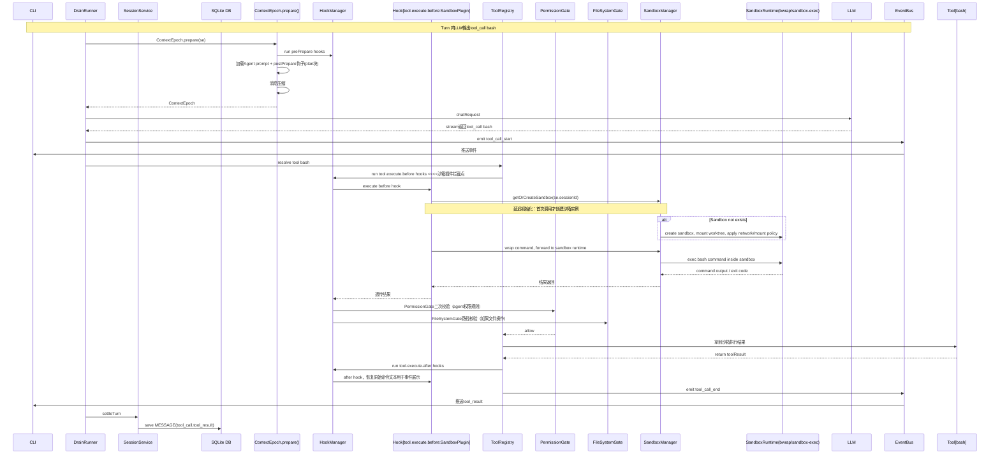
```mermaid
sequenceDiagram
    participant CLI
    participant DR as DrainRunner
    participant SS as SessionService
    participant DB as SQLite DB
    participant CE as ContextEpoch.prepare()
    participant HM as HookManager
    participant SandboxHook as Hook[tool.execute.before:SandboxPlugin]
    participant TR as ToolRegistry
    participant PG as PermissionGate
    participant FS as FileSystemGate
    participant SM as SandboxManager
    participant SR as SandboxRuntime(bwrap/sandbox-exec)
    participant LLM
    participant EB as EventBus

    Note over CLI,EB: Turn 内LLM输出tool_call bash
    DR->>CE: ContextEpoch.prepare(se)
    CE->>HM: run prePrepare hooks
    CE->>CE: 加载Agent prompt + postPrepare钩子(plan块)
    CE->>CE: 消息压缩
    CE-->>DR: ContextEpoch

    DR->>LLM: chatRequest
    LLM-->>DR: stream返回tool_call bash

    DR->>EB: emit tool_call_start
    EB->>CLI: 推送事件

    DR->>TR: resolve tool bash
    TR->>HM: run tool.execute.before hooks <<<<沙箱插件拦截点
    HM->>SandboxHook: execute before hook
    SandboxHook->>SM: getOrCreateSandbox(se.sessionId)
    Note over SandboxHook,SM: 延迟初始化：首次调用才创建沙箱实例
    alt Sandbox not exists
        SM->>SR: create sandbox, mount worktree, apply network/mount policy
    end
    SandboxHook->>SM: wrap command, forward to sandbox runtime
    SM->>SR: exec bash command inside sandbox

    SR-->>SM: command output / exit code
    SM-->>SandboxHook: 结果返回
    SandboxHook-->>HM: 透传结果
    HM->>PG: PermissionGate二次校验（agent权限规则）
    HM->>FS: FileSystemGate路径校验（如果文件操作）
    PG-->>TR: allow
    TR->>Tool[bash]: 拿到沙箱执行结果
    Tool[bash]-->>TR: return toolResult
    TR->>HM: run tool.execute.after hooks
    HM->>SandboxHook: after hook，恢复原始命令文本用于事件展示
    TR->>EB: emit tool_call_end
    EB->>CLI: 推送tool_result

    DR->>SS: settleTurn
    SS->>DB: save MESSAGE(tool_call,tool_result)
```

## 时序关键点

1. **拦截时机：`tool.execute.before`**，在 PermissionGate 之前；沙箱插件接管命令执行。
2. **延迟创建沙箱**：SessionExecution 创建的时候不会起沙箱，第一次 bash 调用才创建，减少资源占用。
3. 沙箱插件**不修改 DrainRunner、PermissionGate 主逻辑**，完全插件化插拔；关闭插件，直接走本机 bash。
4. 沙箱生命周期绑定 SessionExecution：se 销毁 → SandboxManager 销毁沙箱进程，清理 mount。

# 2. 沙箱模块独立架构图（Mermaid flowchart）


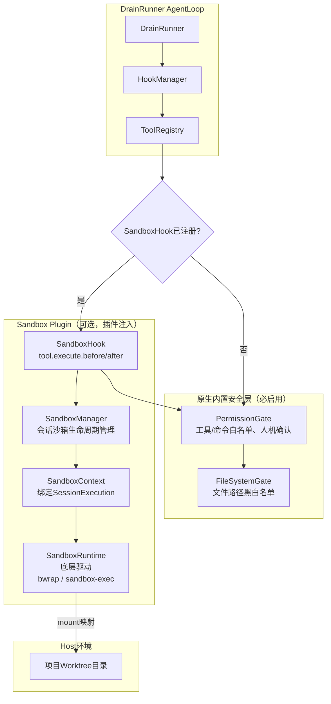
```mermaid
flowchart TD
    subgraph "DrainRunner AgentLoop"
        DR["DrainRunner"]
        HM["HookManager"]
        TR["ToolRegistry"]
    end
    subgraph "原生内置安全层（必启用）"
        PG["PermissionGate<br/>工具/命令白名单、人机确认"]
        FS["FileSystemGate<br/>文件路径黑白名单"]
    end
    subgraph "Sandbox Plugin（可选，插件注入）"
        SH["SandboxHook<br/>tool.execute.before/after"]
        SM["SandboxManager<br/>会话沙箱生命周期管理"]
        SC["SandboxContext<br/>绑定SessionExecution"]
        SR["SandboxRuntime<br/>底层驱动<br/>bwrap / sandbox-exec"]
    end
    subgraph "Host环境"
        HOST_WT["项目Worktree目录"]
    end
%% 主流程
    DR --> HM
    HM --> TR
    TR --> J{"SandboxHook已注册?"}
%% 分支：启用沙箱插件
    J -->|是| SH
    SH --> SM
    SM --> SC
    SC --> SR
    SR -->|"mount映射"| HOST_WT
    SH --> PG
%% 分支：不启用沙箱插件
    J -->|否| PG
%% 原生校验链路（两条分支最终汇合）
    PG --> FS
```


---

# 分卷原文：ARCHITECTURE_PART2.md


# OpenCode — 架构文档（第 2 部分）

> **专题深潜**: Context Epoch · 工具管线 · 持久化投影 · Skills  
> **第 1 部分**: 「ARCHITECTURE_PART1.md」（见下文同卷分节）

---

## 目录

- [§1 会话与上下文三层](#1-会话与上下文三层)
- [§2 Context Epoch 与 System Context](#2-context-epoch-与-system-context)
  - [2.1 为何需要 Epoch](#21-为何需要-epoch)
  - [2.2 Context Source 与 Registry](#22-context-source-与-registry)
  - [2.3 Compaction 与 Epoch 切换](#23-compaction-与-epoch-切换)
- [§3 工具管线](#3-工具管线)
  - [3.1 注册与物化](#31-注册与物化)
  - [3.2 settle 与输出有界](#32-settle-与输出有界)
  - [3.3 内置工具族](#33-内置工具族)
- [§4 持久化 — 事件溯源](#4-持久化--事件溯源)
- [§5 Skills 与 System Context](#5-skills-与-system-context)
- [§6 客户端与 Embedded](#6-客户端与-embedded)
- [§7 心智模型（六句）](#7-心智模型六句)

---

## §1 会话与上下文三层

### 1.1 一句话

OpenCode 把「模型需要的背景」拆成三层，**不同步更新**，在 **安全 Provider-Turn 边界** 对齐：

| 层 | 存储 | 消费者 |
|----|------|--------|
| **准入 inbox** | `session_input` pending | Drain 推广逻辑 |
| **Session History** | `session_message` 投影 | `llm.stream` messages |
| **System Context** | Context Epoch baseline + 中途系统消息 | Provider Turn 组装 |

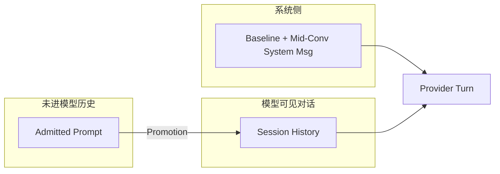
```mermaid
flowchart LR
    subgraph 未进模型历史
        ADMIT["Admitted Prompt"]
    end
    subgraph 模型可见对话
        HIST["Session History"]
    end
    subgraph 系统侧
        SYS["Baseline + Mid-Conv System Msg"]
    end
    ADMIT -->|Promotion| HIST
    SYS --> TURN["Provider Turn"]
    HIST --> TURN
```

→ 完整 steer/queue 时序见 「SESSION_AND_CONTEXT.md」（见下文同卷分节）

---

## §2 Context Epoch 与 System Context

### 2.1 为何需要 Epoch

**问题**：Provider prompt cache 需要 **稳定的 system baseline**；但 AGENTS.md、skills、cwd 会变。

**解法**：**Context Epoch** = 一段内 baseline **不可变**；变更 → **Mid-Conversation System Message**。

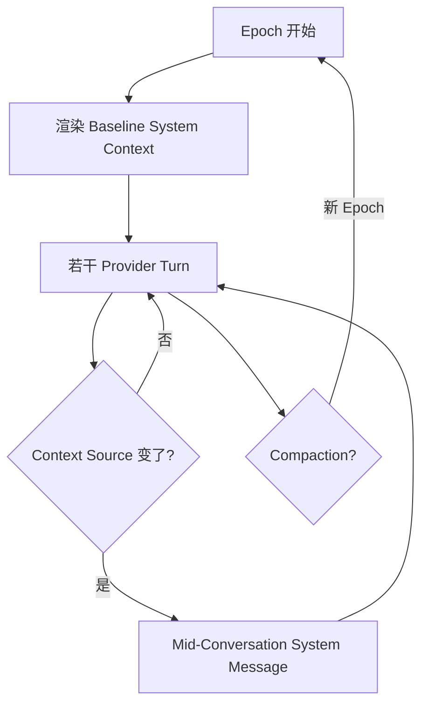
```mermaid
flowchart TB
    START["Epoch 开始"] --> BASE["渲染 Baseline System Context"]
    BASE --> TURNS["若干 Provider Turn"]
    TURNS --> CHANGE{"Context Source 变了?"}
    CHANGE -->|是| MID["Mid-Conversation System Message"]
    MID --> TURNS
    CHANGE -->|否| TURNS
    TURNS --> END{"Compaction?"}
    END -->|新 Epoch| START
```

### 2.2 Context Source 与 Registry

| 概念 | 含义 |
|------|------|
| **Context Source** | 可观测域（cwd、rules、skills 摘要…） |
| **Context Snapshot** | 上次 admit 时的 JSON 快照 |
| **Unavailable** | 暂时读不到 → 保留旧值，不发噪声 |

**源码**：`packages/core/src/system-context/`、`session/context-epoch.ts`

### 2.3 Compaction 与 Epoch 切换

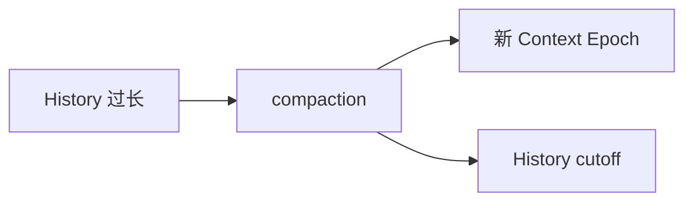
```mermaid
flowchart LR
    LONG["History 过长"] --> CMP["compaction"]
    CMP --> NEW["新 Context Epoch"]
    CMP --> CUT["History cutoff"]
```

---

## §3 工具管线

### 3.1 注册与物化

```mermaid
flowchart TB
    LOC["Location（项目目录）"]
    LOC --> CFG["配置 / AGENTS.md"]
    LOC --> TR["ToolRegistry.materialize"]
    LOC --> PERM["权限过滤"]
    PERM --> LLM["发给模型的 tools[]"]
```

**注册优先级**（`specs/v2/tools.md`）：Location > application > builtin。

### 3.2 settle 与输出有界

```mermaid
sequenceDiagram
    participant LLM as Provider
    participant TR as ToolRegistry
    participant STO as ToolOutputStore
    participant H as Session History

    LLM-->>TR: tool_call
    TR->>TR: 执行工具
    alt 输出过大
        TR->>STO: Managed Output File
        TR->>H: 有界摘要
    else 正常
        TR->>H: 完整有界结果
    end
    Note over H: settle 完成后才续跑
```

### 3.3 内置工具族

| 类别 | 工具 |
|------|------|
| 文件 | read, write, edit, patch |
| 执行 | bash |
| 发现 | search, web |
| 交互 | question |
| 规划 | todowrite |
| 技能 | skill（正文需单独调用，权限门控） |

---

## §4 持久化 — 事件溯源

```mermaid
flowchart LR
    EV["EventV2 append-only"] --> PROJ["SessionProjector"]
    PROJ --> SM["session_message"]
    PROJ --> SI["session_input"]
    PROJ --> META["session 元数据"]
    PROJ --> CE["session_context_epoch"]
    SM --> HIST["Session History 选择"]
    HIST --> LLM["Provider Turn"]
```

| 表 / 概念 | 作用 |
|-----------|------|
| `event` | 真相日志 |
| `session_input` | 准入 inbox |
| `session_message` | V2 有序 transcript |
| `session_context_epoch` | baseline + snapshot |

---

## §5 Skills 与 System Context

| 阶段 | 模型看见什么 |
|------|--------------|
| Epoch 开始 | skill 名 + 描述（Context Source） |
| 调用 skill 工具 | 完整 skill body（受权限） |
| 变更 AGENTS.md | 中途系统消息 |

与 Codex Skills：OpenCode 强调 **Context Source 代数** 与 **provider cache baseline**。

---

## §6 客户端与 Embedded

```mermaid
flowchart LR
    APP["宿主应用"] --> EMB["Embedded HttpClient"]
    EMB --> ROUTER["同 server handlers"]
    ROUTER --> CORE["core"]
    TUI["TUI"] --> HTTP["opencode serve"]
    HTTP --> ROUTER
```

客户端观察：**事件流 + 投影 `session_message`**，不直接驱动 tool loop。

---

## §7 心智模型（六句）

1. **prompt 先准入，再 drain** — 崩溃不丢用户意图。  
2. **一次 stream = 一个 Provider Turn** — 续跑前工具必须 settle。  
3. **System Context 按 Epoch 变** — 不是每步重写 system prompt。  
4. **steer 在边界推广** — 不是硬中断当前 provider 响应。  
5. **History 是投影** — EventV2 才是审计源。  
6. **Location 决定工具与权限** — Session 只带引用。

---

**返回**: 「ARCHITECTURE.md」（见下文同卷分节） · 「README.md」（见下文同卷分节）


---

# 分卷原文：RUNTIME_FLOWS.md


# OpenCode — 完整流程设计

> **主文档**：「`ARCHITECTURE.md`」（见下文同卷分节）。本文保留本专题的源码细节。

## 1. 端到端请求流程

```mermaid
sequenceDiagram
    participant C as CLI/TUI/Web/SDK
    participant API as API
    participant DB as EventV2/SQLite
    participant D as Session Drain
    participant CTX as Context Builder
    participant P as Provider
    participant T as Tool Runtime
    participant UI as Event Stream
    C->>API: prompt(session_id, input)
    API->>DB: append session_input admitted
    API->>D: wake(session_id)
    D->>DB: load pending input/history
    D->>CTX: build baseline + epoch + history
    CTX-->>D: provider request
    D->>P: stream(request)
    P-->>D: text/reasoning/tool call parts
    D->>T: execute tool call
    T-->>D: result/error/permission pending
    D->>DB: append tool settled / message parts
    DB-->>UI: events/projections
    D->>P: continue turn if needed
    D->>DB: append turn/session completed or failed
    UI-->>C: stream updated session
```

## 2. Session Drain 外层流程

```mermaid
stateDiagram-v2
    [*] --> Idle
    Idle --> Admitted: input appended
    Admitted --> Waking: wake(session)
    Waking --> Draining: acquire session execution
    Draining --> ProviderTurn: promote next input
    ProviderTurn --> Draining: turn settled, more work
    Draining --> Idle: no pending work
    Draining --> Interrupted: abort
    Draining --> Failed: unrecoverable error
    Interrupted --> Idle
    Failed --> Idle
```

Drain 的核心问题是：

```text
当前 Session 是否还有可消费输入？
是否已经有一个执行器？
当前 turn 是否完成？
是否有 steer/queue/abort？
```

## 3. Provider Turn 内层流程

```mermaid
flowchart TD
    START[Turn start] --> BUILD[Build Context Epoch + history]
    BUILD --> STREAM[llm.stream]
    STREAM --> PARTS[收集 text/reasoning/tool call]
    PARTS --> CALLS{有 tool calls?}
    CALLS -- 否 --> COMPLETE[完成/等待用户/结束]
    CALLS -- 是 --> AUTH[Permission gate]
    AUTH --> DENY{允许?}
    DENY -- 否 --> DENIED[tool denied part]
    DENY -- 是 --> EXEC[执行一个或多个工具]
    EXEC --> BOUND[限制/外置工具输出]
    BOUND --> SETTLE[tool settle + EventV2]
    DENIED --> SETTLE
    SETTLE --> CONTINUE{需要继续问模型?}
    CONTINUE -- 是 --> STREAM
    CONTINUE -- 否 --> COMPLETE
```

一次 Provider Turn 不一定只对应一次 provider 请求；工具结果 settle 后，可能继续下一轮 provider request。

## 4. 输入控制流程

### 4.1 queue

```text
用户输入
  → append queued input
  → 当前 turn 继续
  → 当前 turn 结束
  → Drain 消费 queued input
```

### 4.2 steer

```text
用户控制意图
  → admission 为 steer
  → 等待允许的边界
  → 注入当前执行上下文
  → Provider 继续时看到新方向
```

### 4.3 abort

```mermaid
flowchart LR
    C[Client abort] --> API[API control]
    API --> D[Drain cancel]
    D --> P[Provider stream cancel]
    D --> T[Tool cancel]
    T --> MCP[MCP child/process]
    T --> SUB[Sub-session]
    D --> E[Interrupted event]
```

取消不是简单设置一个布尔值；它需要沿着正在执行的资源边界传播。

## 5. 工具完整流程

```text
Tool discovery
  → registry
  → location materialize
  → agent/permission filter
  → provider tools[]
  → model tool_call
  → parse/validate
  → permission
  → execute
  → output bound or managed output file
  → settle
  → message/part projection
  → provider continuation
```

工具状态可以抽象为：

```text
registered
  → exposed
  → requested
  → authorized / rejected
  → running
  → completed / failed / timeout / cancelled
  → settled
  → projected
```

## 6. Context Epoch 与 Compaction 流程

```mermaid
flowchart TD
    INPUT[Location/config/skills/permissions/history] --> SNAP[Context snapshot]
    SNAP --> DIFF{与当前 epoch 相同?}
    DIFF -- 是 --> BASE[复用 baseline]
    DIFF -- 否 --> EPOCH[创建新 Context Epoch]
    EPOCH --> BASE
    BASE --> TOKENS{超出上下文预算?}
    TOKENS -- 否 --> REQUEST[构造 provider request]
    TOKENS -- 是 --> COMPACT[compaction]
    COMPACT --> SUMMARY[生成 summary/cutoff]
    SUMMARY --> EPOCH2[新 epoch / 新 history 边界]
    EPOCH2 --> REQUEST
```

Epoch 负责表达上下文基线变化；Compaction 负责在预算不足时压缩历史，两者相关但不是同一个操作。

## 7. EventV2、投影与恢复

```mermaid
flowchart TB
    Runtime[Admission / Drain / Turn / Tool] --> APPEND[append EventV2]
    APPEND --> STORE[(SQLite event log)]
    STORE --> P1[Session projection]
    STORE --> P2[Message/Part projection]
    STORE --> P3[Input projection]
    STORE --> P4[Context Epoch projection]
    P1 --> API[Query API]
    P2 --> API
    P3 --> API
    P4 --> API
    STORE --> RESTART[Process restart]
    RESTART --> REPLAY[replay/rebuild missing projection]
    REPLAY --> WAKE[detect pending work and wake Drain]
```

关键边界：

```text
append input 后、drain 前崩溃：可以依据 pending input 继续
tool 执行中崩溃：是否重复执行取决于 settle 和外部副作用幂等
settle 后 projection 延迟：可以通过事件重建查询视图
```

具体恢复语义必须以对应版本实现为准，不能简单承诺 exactly-once。

## 8. 多 Agent / 子 Session 流程

```mermaid
sequenceDiagram
    participant P as Parent Session
    participant R as Agent Runtime
    participant C as Child Session
    participant DB as Event Store
    P->>R: delegate task
    R->>DB: create child session/input
    R->>C: wake child drain
    C->>C: provider turns + tools
    C->>DB: child events/projections
    C-->>R: child result/status
    R->>P: parent continuation with result
```

需要分别考虑：上下文继承、工具/权限继承、预算、取消传播、子 Session 失败是否阻断父 Session。

## 9. 失败路径

| 故障点 | 可能结果 | 需要观察的对象 |
|---|---|---|
| Admission 失败 | 输入未进入可执行状态 | API error、input event |
| Provider stream 失败 | turn failed/retry | provider turn、error event |
| Tool 被拒绝 | 生成 denied part，模型可能继续 | permission event、tool part |
| Tool 执行失败 | failed tool result，按策略继续或结束 | tool call、settle event |
| MCP 子进程崩溃 | 工具失败/重启/人工介入 | process state、tool error |
| Projection 失败 | 事件存在但查询视图落后 | projector lag、replay |
| 进程崩溃 | 依据 durable input/event 恢复 | pending input、unfinished turn |

## 10. 一张图如何对应一条完整流程

现有图表建议按以下视角组合阅读：

| 视角 | 图/文档 |
|---|---|
| 系统拓扑 | `SYSTEM_ARCHITECTURE.md`、`diagrams/opencode-runtime-stack.architecture.html` |
| 双层循环 | `ARCHITECTURE_PART1.md`、`diagrams/opencode-dual-loop.workflow.html` |
| Prompt 端到端 | `diagrams/opencode-e2e-prompt.sequence.html` |
| Session 生命周期 | `diagrams/opencode-session-lifecycle.lifecycle.html` |
| Tool pipeline | `diagrams/opencode-tool-pipeline.dataflow.html` |
| queue/steer | `SESSION_AND_CONTEXT.md`、`diagrams/opencode-queue-steer.workflow.html` |
| Compaction | `ARCHITECTURE_PART2.md`、`diagrams/opencode-compaction.workflow.html` |
| Multi-agent | `diagrams/opencode-multi-agent.architecture.html` |

## 11. 从用户输入到最终结果：角色参与的完整时序

```mermaid
sequenceDiagram
    participant U as User
    participant C as Client
    participant API as API/Admission
    participant S as Session
    participant A as Primary Agent Profile
    participant D as Session Drain
    participant P as Provider
    participant T as Tool Runtime
    participant SA as Subagent
    participant DB as EventV2/Projection
    U->>C: 输入任务
    C->>API: prompt(session, input)
    API->>DB: 持久化 admitted input
    API->>S: wake
    S->>A: resolve build/plan/profile
    A-->>D: prompt + model + permissions + tools
    D->>P: Provider Turn request
    P-->>D: text/reasoning/tool call
    alt 普通工具
        D->>T: authorize + execute
        T-->>D: result/error
        D->>DB: tool part + settle event
        D->>P: 带工具结果继续推理
    else 需要代码探索
        D->>SA: 委派 explore/general
        SA->>P: 子 Session Provider Turn
        SA->>DB: 子 Session events
        SA-->>D: 结构化/文本结果
        D->>P: 带子任务结果继续推理
    end
    opt 上下文超限
        D->>P: 调用 compaction profile
        P-->>D: summary/cutoff
        D->>DB: 新 context epoch / summary
    end
    D->>DB: settle provider turn
    DB-->>C: event stream / projected history
    C-->>U: 显示结果
```

## 12. 角色决策表：一次请求中谁负责什么

| 阶段 | 参与者 | 是否每次必经 | 作用 |
|---|---|---:|---|
| 主任务执行 | `build` 或 `plan` | 通常是 | 作为用户会话的 primary profile |
| 代码探索 | `explore` | 否 | 被主 Agent 委派，只读搜索和阅读 |
| 复杂子任务 | `general` | 否 | 被主 Agent 委派，处理独立/并行单元 |
| 上下文压缩 | `compaction` | 否 | 历史过长或 overflow 时生成摘要 |
| 标题生成 | `title` | 否 | 会话元数据维护 |
| 摘要生成 | `summary` | 否 | 会话结束或维护阶段生成摘要 |

所以“OpenCode 有很多角色”这句话需要补充限定：

> OpenCode 有多个内置 Agent Profile，但它们不是多个互不相关的 Agent 系统，也不是固定顺序的流水线；它们共享同一个 Session/Drain/Provider/Tool Runtime，通过 prompt、权限、工具集合和 mode 形成分工。


---

# 分卷原文：MODULES_AND_INTERACTIONS.md


# OpenCode — 模块设计与模块交互

> **主文档**：「`ARCHITECTURE.md`」（见下文同卷分节）（§17–§27 模块边界表）。本文保留 **依赖图与各模块交互** 专文。

## 1. 依赖方向

```mermaid
flowchart LR
    Client[CLI / TUI / Web / SDK] --> API[HttpApi / Embedded API]
    API --> Admission[Input Admission]
    Admission --> Session[Session Runtime]
    Session --> Drain[Session Drain]
    Drain --> Context[Context Builder]
    Context --> Provider[Provider Runtime]
    Drain --> Tools[Tool Runtime]
    Tools --> Permission[Permission Gate]
    Tools --> Ext[Built-in / Skill / Plugin / MCP]
    Admission --> Events[Event Store]
    Session --> Events
    Tools --> Events
    Context --> Events
    Events --> Projection[Projectors]
    Projection --> API
```

## 2. 运行时模块

### 2.1 API / Client

客户端模块只负责：

```text
创建/查询 Session
提交 prompt
发送 steer / queue / abort
订阅事件
读取 message / part / tool output
```

它不应该负责：

```text
直接调用 provider
直接执行工具
自己推进 drain
修改内部 history
```

### 2.2 Input Admission

Admission 是“请求进入系统”的边界：

```text
外部请求
  → 身份/session 校验
  → 生成 input id
  → 写入 session_input / EventV2
  → wake Session Drain
```

它和执行器解耦的价值是：即使执行器暂时忙、进程重启或客户端断开，输入仍有可追踪状态。

### 2.3 Session 与 Session Drain

Session 是状态聚合和隔离单位；Drain 是推进器。

```text
Session
  ├── status
  ├── history projection
  ├── pending inputs
  ├── context epoch
  ├── parent/child relation
  └── drain handle
```

Drain 的职责是：

1. 找出可消费的输入；
2. 将输入提升为运行中的 turn；
3. 创建或继续 Provider Turn；
4. 处理 steer、queue、abort；
5. 在没有工作时回到 idle。

### 2.4 Provider Turn

Provider Turn 是模型交互的最小运行单元：

```text
build request
  → llm.stream
  → 持续接收 text/reasoning/tool call
  → settle tool calls
  → 决定继续、等待、完成或失败
```

不要把 Provider Turn 等同于一次 HTTP 请求：一个 turn 可能因为工具调用而触发后续模型请求。

### 2.5 Context Builder / Epoch

Context 模块将多个来源合并成模型可见上下文：

```text
Location / config / AGENTS.md / skills / permissions
  → Context Sources
  → Snapshot
  → Context Epoch
  → system baseline + history + user input
  → provider request
```

Epoch 是上下文语义版本，不是普通的消息编号。上下文发生重要变化时，通过新的 epoch 或中途 system message 表达变化。

## 3. 能力模块

### 3.1 Provider Runtime

```text
Agent profile + model config
  → resolve provider/model
  → normalize internal messages
  → stream response
  → normalize text/reasoning/tool calls/usage/errors
```

Provider 适配层屏蔽不同模型的协议差异；Runtime 只消费统一的内部响应事件。

### 3.2 Tool Runtime

工具生命周期：

```text
发现
  → 注册
  → location materialize
  → agent/permission 过滤
  → 暴露 tools[]
  → 接收 tool call
  → 参数校验
  → 授权
  → 执行
  → 输出限制/外置
  → settle
  → 写入 history/EventV2
```

```mermaid
sequenceDiagram
    participant P as Provider Turn
    participant R as Tool Runtime
    participant G as Permission Gate
    participant X as Tool implementation
    participant E as Event Store
    P->>R: tool_call
    R->>R: validate name/arguments
    R->>G: authorize
    G-->>R: allow / deny / ask
    R->>X: execute
    X-->>R: output/error
    R->>R: bound or externalize output
    R->>E: settle tool result
    E-->>P: continue provider turn
```

### 3.3 Skill / Plugin / MCP

三者的扩展边界不同：

| 扩展 | 形态 | 进入系统的方式 | 风险边界 |
|---|---|---|---|
| Skill | 文本化 SOP/知识 | metadata、摘要或 skill tool | 主要影响上下文和行为 |
| Plugin | 进程内代码 | 注册工具、hook、事件处理 | 影响主进程稳定性 |
| MCP | 外部协议/进程 | capability discovery、工具代理 | 子进程/网络/远程服务 |

它们最终可以汇聚到 Tool Runtime，但不应把三者的生命周期混为一谈。

## 4. 数据与持久化模块

### 4.1 Event Store

EventV2 记录运行事实，例如：

```text
input admitted
session status changed
provider message started/updated
tool call started
tool settled
context epoch created
compaction completed
```

事件应至少回答：发生了什么、属于哪个 session/turn/tool、顺序是什么、是否可重放。

### 4.2 Projection

Projection 把事件转换为查询友好的结构：

```text
EventV2
  ├── Session projection
  ├── Message projection
  ├── Part projection
  ├── Input projection
  └── Context Epoch projection
```

投影不是新的执行事实。投影丢失时，理论上可以通过重放事件重建；具体可恢复范围取决于实现和版本。

## 5. 控制交互：queue、steer、abort

```text
queue：排队，等待当前工作安全结束后处理
steer：在允许的边界把新意图注入当前执行
abort：取消当前 drain/turn，并向下传播取消
```

它们不是同一种消息：

| 控制 | 目标 | 典型边界 |
|---|---|---|
| queue | 后续输入 | 当前 turn/step 完成后 |
| steer | 当前任务方向 | 安全的 provider/tool 边界 |
| abort | 停止当前工作 | drain、stream、tool、子进程 |

## 6. 模块间数据契约

| 生产者 | 数据 | 消费者 |
|---|---|---|
| Client/API | session input/control command | Admission/Control |
| Admission | durable input event | Drain |
| Context Builder | provider request messages | Provider |
| Provider | response parts/tool calls | Turn/Tool Runtime |
| Tool Runtime | tool result/settle event | Turn/Projection |
| Event Store | ordered events | Projectors/API/Event stream |
| Projector | session/message/part view | Client/API |
| Permission Gate | allow/deny/pending | Tool Runtime/Client |

## 7. 状态所有权

```text
API request：请求级
Session：会话级
Drain：执行器级
Provider Turn：一轮模型执行级
Message/Part：历史级
Context Epoch：上下文版本级
Tool call：工具调用级
EventV2：全局/持久化事实级
```

清晰区分这些所有权，才能解释为什么：

- 一个 Session 内通常不能同时运行两个 Drain；
- 一个 Provider Turn 可以产生多个 tool call；
- 一个 tool result settle 后才进入可查询历史；
- Context Epoch 变化不等于创建新 Session；
- Projection 更新不等于再次执行工具。

## 8. 当前实现与设计推断的边界

### 当前文档可以直接确认的主线

```text
admit → drain → provider turn → tool settle → history/event
```

### 需要按源码版本继续核对的细节

- EventV2 的每个事件字段、幂等键和重放策略；
- 同一 Session 的具体锁/队列实现；
- abort 如何传播到每一种外部工具；
- Plugin hook 的完整顺序；
- MCP 进程崩溃和重启策略；
- projection 失败后的自动恢复方式。

## 9. 内置 Agent / Role：不是很多套引擎，而是多种 Profile

### 9.1 Agent 的三种 mode

源码中的 Agent 配置支持：

| mode | 含义 | 是否可作为用户主 Agent | 是否可被委派 |
|---|---|---:|---:|
| `primary` | 主会话使用的 Agent | 是 | 通常不是以子 Agent 形式 |
| `subagent` | 被主 Agent 委派的子 Agent | 否（默认不出现在主选择） | 是 |
| `all` | 两种场景都可用 | 是 | 是 |

`hidden` 只影响是否展示在选择/自动补全中，不等于 Agent 不存在。

### 9.2 当前内置角色

当前核心插件在 `packages/core/src/plugin/agent.ts` 中装配以下 Agent Profile：

| ID | mode | 主要职责 | 是否用户可见 |
|---|---|---|---|
| `build` | `primary` | 默认编码 Agent；读取代码、修改文件、执行工具 | 是，默认 Agent |
| `plan` | `primary` | 规划模式；禁止普通编辑，只允许写计划文件/执行受限操作 | 是 |
| `general` | `subagent` | 通用复杂任务、研究和多单元并行工作 | 通常不作为主 Agent |
| `explore` | `subagent` | 快速搜索、阅读、定位代码，不负责修改代码 | 通常由主 Agent 委派 |
| `compaction` | `primary` + `hidden` | 将长会话压缩为可继续执行的结构化摘要 | 否，内部维护 Agent |
| `title` | `primary` + `hidden` | 根据用户输入生成会话标题 | 否，内部维护 Agent |
| `summary` | `primary` + `hidden` | 生成会话/任务摘要 | 否，内部维护 Agent |

这里的 `build`、`plan`、`general`、`explore` 是面向任务的角色；`compaction`、`title`、`summary` 是内部服务角色。它们都通过同一套 Agent/Session Runtime 运行，但有不同的 prompt、工具权限和可见性。

### 9.3 角色不是流水线阶段

常见误解是把它理解为：

```text
build → plan → explore → summary
```

实际不是固定流水线。更准确的关系是：

```text
用户
  → 选择/进入 primary Agent（通常 build 或 plan）
  → primary Agent 执行 Provider Turn
  → 需要时委派 subagent（general / explore）
  → 上下文超限时调用 compaction
  → 会话生命周期中按需生成 title / summary
```

角色的调用关系是**条件触发和委派关系**，不是每个请求都必经的串行阶段。

### 9.4 Profile 如何改变同一个 Runtime

以 `build` 和 `explore` 为例：

```text
同一个 Session/Provider Turn/Tool Runtime
       │
       ├── build profile
       │     ├── 编码 Agent system prompt
       │     ├── 允许读/写/执行等工具
       │     └── 可进入 plan 等控制能力
       │
       └── explore profile
             ├── 代码探索 system prompt
             ├── 只允许 grep/glob/read/web 等只读能力
             └── 禁止修改工作区
```

因此角色差异主要由以下四个东西共同决定：

```text
system prompt
+ permission rules
+ tool visibility
+ model / step configuration
```

## 10. Agent 角色参与的完整流水线

```mermaid
flowchart TB
    U[用户 prompt] --> S[选择或创建 Session]
    S --> A[选择 primary Agent Profile]
    A --> C[装配 Context / Skills / Permissions / Tools]
    C --> D[Session Drain]
    D --> T[Provider Turn]
    T --> L[模型推理]
    L --> Q{需要工具?}
    Q -- 否 --> H[写入回复历史]
    Q -- 是 --> X{需要子 Agent?}
    X -- 是 --> SA[创建/调用 general 或 explore 子 Session]
    SA --> R[子 Agent 结果回传]
    R --> T
    X -- 否 --> P[Permission Gate]
    P --> E[执行工具]
    E --> Z[Tool settle]
    Z --> B{继续模型推理?}
    B -- 是 --> T
    B -- 否 --> H
    H --> K{需要 compaction/title/summary?}
    K -- 是 --> I[内部服务 Agent]
    I --> H
    K -- 否 --> O[事件/投影/API/客户端]
```

注意：图中的 `compaction/title/summary` 不是用户可见的“下一位角色”，而是系统在特定条件下调用的内部 Agent Profile。


---

# 分卷原文：SESSION_AND_CONTEXT.md


# OpenCode 会话与上下文导读

> **定位**：讲清 **System Context、Context Epoch、Session History、steer/queue** 如何协作。  
> **阅读时间**：~20 分钟  
> **循序渐进**：「DESIGN_THINKING_SERIES.md」（见下文同卷分节）  
> **术语权威**：[opencode/CONTEXT.md](../../opencode/CONTEXT.md)

---

## 目录

- [1. 一句话](#1-一句话)
- [2. steer vs queue](#2-steer-vs-queue)
- [3. Context Epoch](#3-context-epoch--系统上下文为何分代)
- [4. Session History vs inbox](#4-session-history-vs-准入-inbox)
- [5. 工具输出进 History](#5-工具输出如何进-history)
- [6. Compaction 与 Epoch](#6-compaction-与-epoch-切换)
- [7. 三项目对照](#7-三项目对照)
- [8. 心智模型](#8-心智模型六句)
- [相关文档](#相关文档)

---

## 1. 一句话

OpenCode 把「模型需要的背景」拆成：**System Context**（结构化、有 Epoch）+ **Session History**（对话投影）+ **准入 inbox**（尚未进 history 的用户输入）——三者 **不同步更新**，在 **安全 Provider-Turn 边界** 对齐。

---

## 2. steer vs queue

| 模式 | 语义 | 何时进 History |
|------|------|----------------|
| **steer（默认）** | 运行中改道 | 当前 Drain **下一安全边界** 推广 |
| **queue** | 排队等待 | Session **将空闲** 时推广 **一条** |

```mermaid
sequenceDiagram
    participant U as 用户
    participant IN as session_input
    participant DR as Session Drain
    participant H as Session History

    Note over DR: Provider Turn 进行中
    U->>IN: prompt steer
    IN->>DR: 标记 pending
    DR->>DR: 完成当前 tool settle
    DR->>H: 推广 steer 消息
    DR->>DR: 继续 Provider Turn

    Note over DR: 即将 idle
    U->>IN: prompt queue
    IN-->>DR: 保持 pending
    DR->>DR: 当前续跑结束
    DR->>H: 推广一条 queue
```

**易错**：steer **不是**取消当前 LLM 流——在边界前可能仍完成当前 tool settle。

---

## 3. Context Epoch — 系统上下文为何分「代」

**问题**：provider prompt cache 需要 **稳定的 system baseline**；但 AGENTS.md、skills、cwd 会变。

**解法**：**Context Epoch** = 一段内 baseline **不可变**；变更不产生「偷偷改 prompt」，而是 **中途系统消息** 告诉模型新状态。

```mermaid
flowchart TB
    START["Epoch 开始"] --> BASE["渲染 Baseline System Context<br/>全量 Context Sources"]
    BASE --> TURNS["若干 Provider Turn"]
    TURNS --> CHANGE{"Context Source 变了?"}
    CHANGE -->|是| MID["写入 Mid-Conversation System Message"]
    MID --> TURNS
    CHANGE -->|否| TURNS
    TURNS --> END{"Compaction / 搬家?"}
    END -->|新 Epoch| START
```

| 概念 | 含义 |
|------|------|
| **Context Source** | 一个可观测域（cwd、rules、skills 摘要…） |
| **Context Snapshot** | 上次 admit 时的 JSON 快照 |
| **Unavailable** | 暂时读不到 → 保留旧有效值，不发噪声更新 |

→ 与 Codex **WorldState diff** 对照：OpenCode 更强调 **Epoch + 中途系统消息** 而非每步 user fragment。

---

## 4. Session History vs 准入 inbox

```mermaid
flowchart LR
    subgraph 未进模型历史
        ADMIT["Admitted Prompt<br/>session_input pending"]
    end
    subgraph 模型可见对话
        HIST["Session History<br/>session_message 投影"]
    end
    subgraph 系统侧
        SYS["Baseline + 中途系统消息"]
    end

    ADMIT -->|Promotion| HIST
    SYS --> TURN["Provider Turn 组装"]
    HIST --> TURN
```

| 层 | 消费者 |
|----|--------|
| pending inbox | Drain 推广逻辑 |
| Session History | `llm.stream` 的 messages |
| compaction cutoff | History 选择窗口 |

---

## 5. 工具输出如何进 History

```mermaid
sequenceDiagram
    participant LLM as Provider
    participant TR as ToolRegistry
    participant STO as ToolOutputStore
    participant H as Session History

    LLM-->>TR: tool_call
    TR->>TR: 执行工具
    alt 输出过大
        TR->>STO: Managed Tool Output File
        TR->>H: Model Tool Output（有界摘要）
    else 正常
        TR->>H: 完整有界结果
    end
    Note over H: settle 完成后才续跑
```

**设计原则**：Registry **强制**最终写入 history 的尺寸；大结果落临时文件，模型只见投影。

---

## 6. Compaction 与 Epoch 切换

Compaction 结束当前 Context Epoch，建立新 baseline，并截断 Session History 选择窗口。

```mermaid
flowchart LR
    LONG["History 过长"] --> CMP["compaction"]
    CMP --> NEW["新 Context Epoch"]
    CMP --> CUT["History cutoff"]
    NEW --> BASE2["新 Baseline System Context"]
    CUT --> H2["较短 Session History"]
```

---

## 7. 三项目对照

| | OpenCode | Codex | Pi |
|--|----------|-------|-----|
| 系统背景 | Context Epoch + Sources | WorldState + developer | Harness entries |
| 对话真相 | session_message 投影 | ContextManager.history | Session JSONL |
| 中途输入 | steer / queue | steer / mailbox | steering / follow-up |
| 工具结果 | settle 后有界 | FunctionCallOutput | tool result message |

---

## 8. 心智模型（六句）

1. **prompt 先准入，再 drain** — 崩溃不丢用户意图。  
2. **一次 stream = 一个 Provider Turn** — 续跑前工具必须 settle。  
3. **System Context 按 Epoch 变** — 不是每步重写 system prompt。  
4. **steer 在边界推广** — 不是硬中断当前 provider 响应。  
5. **History 是投影** — EventV2 才是审计源。  
6. **Location 决定工具与权限** — Session 只带引用。

---

## 相关文档

| 文档 | 内容 |
|------|------|
| 「DESIGN_THINKING_SERIES.md」（见下文同卷分节） | 总运行路径 |
| [opencode/CONTEXT.md](../../opencode/CONTEXT.md) | 完整术语表 |
| [specs/v2/session.md](../../opencode/specs/v2/session.md) | API 规范 |


---

# 分卷原文：multi-agent.md

> **已迁移**：原 ~2800 行 multi-agent 合并稿与 §11 重复，且含过时描述（`agent_create`、`plan.create`、SessionExecution.agents Map 等）。  
> **请以专题为准**：[AGENT_AND_MULTI_AGENT.md](./AGENT_AND_MULTI_AGENT.md)

---

# 分卷原文：ARCHITECTURE_ATLAS.md


# OpenCode — 架构概念图谱（全维度）

> **主文档**：「`ARCHITECTURE.md`」（见下文同卷分节）。本文保留本专题的源码细节。

> **定位**：按 **Session / Memory / Loop / Tool / 队列 / 多 Agent / Plan / App / 长时任务 / 缓存** 等维度逐项展开，每节含架构图、实体图、流程图、端到端时序。  
> **前置**：「ARCHITECTURE_PART1.md」（见下文同卷分节） · 「PACKAGE_MAP.md」（见下文同卷分节） · 「ARCHITECTURE_PART2.md」（见下文同卷分节）  
> **源码**: `opencode/packages/core/`

---

## 目录

- [0. 全维度能力矩阵](#0-全维度能力矩阵)
- [1. 端到端全景](#1-端到端全景)
- [2. Session 与会话身份](#2-session-与会话身份)
- [3. Memory 与对话历史](#3-memory-与对话历史)
- [4. 长短期记忆](#4-长短期记忆)
- [5. 压缩 Compaction](#5-压缩-compaction)
- [6. Loop 双层结构](#6-loop-双层结构)
- [7. Tool 管线](#7-tool-管线)
- [8. Skill](#8-skill)
- [9. Sandbox 与执行隔离](#9-sandbox-与执行隔离)
- [10. 多 Turn](#10-多-turn)
- [11. 队列与中途输入](#11-队列与中途输入)
- [12. 多 Agent](#12-多-agent)
- [13. Plan 与任务规划](#13-plan-与任务规划)
- [14. App / Gateway / 客户端](#14-app--gateway--客户端)
- [15. 长时任务](#15-长时任务)
- [16. 缓存](#16-缓存)
- [17. 跨框架对照](#17-跨框架对照)
- [18. Hook / Plugin 机制](#18-hook--plugin-机制)
- [19. OpenCode 面向 Code 的独特设计](#19-opencode-面向-code-的独特设计)

---

## 0. 全维度能力矩阵

| 维度 | OpenCode V2 | 实现锚点 | 说明 |
|------|-------------|----------|------|
| **Session** | ✅ 一等 | `SessionV2`, `session` 表 | 持久化会话 + 子 Session（subagent） |
| **短期 Memory** | ✅ | `session_message` 投影 | Session History = 模型可见对话 |
| **长期 Memory** | ⚠️ 弱 | 工作区文件、AGENTS.md | 无向量 MEMORY；靠 Context Source + 文件 |
| **压缩** | ✅ | `session/compaction.ts` | LLM 结构化摘要 + History cutoff + 新 Epoch |
| **外层 Loop** | ✅ | Session Drain | 推广 input → 多 Provider Turn → idle |
| **内层 Loop** | ✅ | Provider Turn | `llm.stream` → settle → 续跑 |
| **Tool** | ✅ | `ToolRegistry` | materialize + settle + 输出有界 |
| **Skill** | ✅ | `skill/`, Context Source | 摘要注入 + `skill` 工具加载正文 |
| **Sandbox** | ⚠️ 进程级 | bash/PTY、权限层 | 非 Codex 容器沙箱；靠 Permission |
| **多 Turn** | ✅ | 多次 `sessions.prompt` | 同一 Session 多轮用户输入 |
| **队列** | ✅ | steer / queue | `session_input` inbox |
| **多 Agent** | ✅ 配置级 | build/plan/subagent | 同引擎不同权限+提示词 |
| **Plan** | ⚠️ | `todowrite` 工具 | 非 Codex `update_plan` 一等对象 |
| **App 层** | ✅ | `app/`, `desktop/`, `tui/` | 纯客户端，不 import core |
| **Gateway** | ❌ | — | 无独立多租户 Gateway 包 |
| **长时任务** | ⚠️ | Drain 续跑 + compaction | 无 Foundry 式 checkpoint 恢复 |
| **缓存** | ✅ | Context Epoch baseline | Provider prompt cache 友好 |

---

## 1. 端到端全景

```mermaid
flowchart TB
    subgraph CLIENT["L0 客户端 App"]
        TUI["TUI / Desktop / HTTP / Embedded SDK"]
    end

    subgraph API["L1 协议 Gateway 边界"]
        HTTP["protocol HttpApi"]
        HND["server handlers"]
    end

    subgraph ADMIT["L2 准入层（持久化）"]
        PROMPT["sessions.prompt"]
        ADM["SessionInput.admit"]
        INBOX[("session_input")]
        EVT["EventV2 PromptAdmitted"]
    end

    subgraph EXEC["L3 执行层（进程内）"]
        WAKE["SessionExecution.wake"]
        COORD["SessionRunCoordinator"]
        DRAIN["SessionRunner.run · Drain"]
    end

    subgraph INNER["L4 Provider Turn 内层"]
        EPOCH["ContextEpoch.prepare"]
        STREAM["llm.stream"]
        TOOLS["ToolRegistry.settle"]
        STREAM --> TOOLS
        TOOLS -->|续跑| STREAM
    end

    subgraph STATE["L5 状态与投影"]
        HIST[("session_message")]
        CE[("context_epoch")]
        SQLITE[("SQLite EventV2")]
    end

    TUI --> HTTP --> HND --> PROMPT
    PROMPT --> ADM --> INBOX & EVT
    ADM --> WAKE --> COORD --> DRAIN
    DRAIN --> EPOCH --> INNER
    INNER --> HIST
    EVT --> SQLITE
    DRAIN --> SQLITE
    EPOCH --> CE
```

**一次用户意图的完整路径**：

```text
Client prompt
  → admit（durable inbox）
  → wake（建议性，可合并）
  → Drain：推广 steer/queue @ 安全边界
  → Context Epoch 对齐
  → loop Provider Turn（stream → settle）
  → 可选 compaction → 新 Epoch
  → EventV2 → 投影 → 客户端事件流
```

---

## 2. Session 与会话身份

### 2.1 实体图

```mermaid
erDiagram
    Session ||--o{ SessionInput : inbox
    Session ||--o{ SessionMessage : history
    Session ||--o{ ContextEpoch : system_context
    Session }o--|| Location : scoped_to
    Session }o--o| AgentConfig : active_agent
    Session ||--o| Session : parent_subagent

    Session {
        string id PK
        string location_id
        string agent_name
        string parent_id
        json metadata
    }

    SessionInput {
        int admitted_seq
        int promoted_seq
        enum delivery
    }

    SessionMessage {
        int seq
        string role
        json content
    }
```

### 2.2 Session 生命周期

```mermaid
stateDiagram-v2
    direction LR
    [*] --> Created: sessions.create
    Created --> Idle: 无活跃 Drain
    Idle --> Draining: prompt + wake
    Draining --> Draining: Provider Turn 续跑
    Draining --> Idle: 无 pending queue
    Draining --> Interrupted: interrupt
    Interrupted --> Draining: resume
    Idle --> Compacted: compaction 完成
    Compacted --> Draining: 新 prompt
```

| 概念 | 持久化 | 说明 |
|------|--------|------|
| **Session 行** | ✅ SQLite | 元数据、agent、location |
| **Session Drain** | ❌ | 进程内执行跨度，无 drain ID |
| **子 Session** | ✅ | subagent `@explore`，`parent_id` |

---

## 3. Memory 与对话历史

OpenCode 把「记忆」拆成 **三层**，不同步更新：

```mermaid
flowchart TB
    subgraph 未进模型
        INBOX["Admitted Prompt<br/>session_input pending"]
    end

    subgraph 对话记忆
        HIST["Session History<br/>session_message 投影"]
    end

    subgraph 系统记忆
        BASE["Baseline System Context<br/>Context Epoch"]
        MID["Mid-Conversation System Msg"]
    end

    INBOX -->|Promotion @ 安全边界| HIST
    BASE --> TURN["Provider Turn 输入"]
    MID --> TURN
    HIST --> TURN
```

| 层 | 类比 Pi | 类比 Codex |
|----|---------|------------|
| inbox | steering 未推广 | UserTurn 待处理 |
| History | JSONL messages | ContextManager.history |
| System Context | Harness entries | WorldState + developer |

### 3.1 先区分三个“消息形态”

同一段用户输入或工具结果，在系统里会经历三种不同形态：

```text
持久化事件/表记录
  → SessionMessage / Part 投影
  → Provider/LLM 请求消息
```

它们不是同一个 JSON，也不是简单地把数据库行原样传给模型。

| 形态 | OpenCode 例子 | 作用 |
|---|---|---|
| **事件事实** | `PromptAdmitted`、`Prompted`、tool settled | 记录“发生过什么”，用于审计/重放/投影 |
| **历史投影** | `session_message` + `data`，消息内含 parts | Session 查询、历史展示、上下文构建的来源 |
| **LLM 投影** | `@opencode-ai/llm` 的 user/assistant/tool 消息 | 适配具体 Provider API，供模型阅读 |

因此要记住：

```text
EventV2 ≠ session_message ≠ provider messages
```

### 3.2 OpenCode 持久化链路

OpenCode 的消息不是只放在内存里。典型链路是：

```text
客户端 prompt
  → SessionInput.admit()
  → EventV2.PromptAdmitted
  → session_input（暂存 inbox）
  → promoteSteers() / promoteNextQueued()
  → EventV2.Prompted
  → session_message 投影
  → SessionHistory.entriesForRunner()
  → toLLMMessages()
  → Provider request
```

Provider 产生的 assistant 文本、reasoning、tool call，以及工具结果，也沿着相反方向回写：

```text
Provider stream
  → assistant message parts（内存中的流式构建态）
  → tool execution / settle
  → EventV2
  → session_message + parts 投影
  → 下一次 SessionHistory
  → toLLMMessages()
```

这里的“内存消息”需要分两种理解：

1. **运行中的临时构建态**：Provider stream 尚未 settle 时，正在累积的 text/reasoning/tool part；
2. **从持久化历史加载到内存的上下文数组**：下一次 Provider Turn 开始时，从 SQLite 投影读出，再转换为 LLM 消息。

它不是一个长期独立的 `Memory.messages` 主存储。

### 3.3 OpenCode 示例：用户消息的三种形态

#### A. `session_input`：刚收到，还没进入历史

```json
{
  "id": "msg_u1",
  "session_id": "ses_001",
  "prompt": {
    "text": "检查 login 模块并修复测试失败"
  },
  "delivery": "queue",
  "admitted_seq": 100,
  "promoted_seq": null
}
```

> 这里的 `promoted_seq: null` 表示“已接收但尚未推广”。

#### B. `session_message`：已推广到会话历史

概念化表示如下（字段细节以对应版本 schema 为准）：

```json
{
  "id": "msg_u1",
  "session_id": "ses_001",
  "type": "user",
  "seq": 101,
  "data": {
    "text": "检查 login 模块并修复测试失败",
    "files": [],
    "metadata": {
      "delivery": "queue"
    }
  }
}
```

`session_message` 表本身保存的是一行消息元数据和 JSON `data`；复杂消息内容进一步由 message/part schema 表达。它是查询和历史投影，不等同于 Provider 的请求格式。

#### C. 发送给 LLM 的 user message

`toLLMMessages()` 会把内部 SessionMessage 转换成 Provider SDK 的规范消息：

```json
{
  "role": "user",
  "content": [
    {
      "type": "text",
      "text": "检查 login 模块并修复测试失败"
    }
  ]
}
```

模型实际看到的请求还会叠加：

```text
system baseline（Context Epoch）
+ agent system prompt
+ history messages
+ 当前 user message
+ tools[] schema
```

### 3.4 OpenCode 示例：assistant tool call 和 tool result

模型返回的 assistant tool call，在历史投影中不是普通字符串，而是一个带状态的 tool part。概念化表示：

```json
{
  "id": "msg_a1",
  "session_id": "ses_001",
  "type": "provider",
  "seq": 102,
  "data": {
    "model": "provider/model",
    "parts": [
      {
        "id": "part_t1",
        "type": "tool",
        "tool": "bash",
        "callID": "call_001",
        "state": {
          "status": "completed",
          "input": { "command": "pnpm test login" },
          "output": "2 tests failed",
          "time": { "start": 200, "end": 350 }
        }
      }
    ]
  }
}
```

之后，Provider 请求的规范化消息通常表达为：

```json
{
  "role": "assistant",
  "content": [
    {
      "type": "tool-call",
      "toolCallId": "call_001",
      "toolName": "bash",
      "input": { "command": "pnpm test login" }
    }
  ]
}
```

工具执行结果再被转换为类似：

```json
{
  "role": "tool",
  "content": [
    {
      "type": "tool-result",
      "toolCallId": "call_001",
      "toolName": "bash",
      "result": "2 tests failed"
    }
  ]
}
```

注意：OpenCode 内部的 `part.state` 比发送给模型的 `tool-result` 更丰富，因为内部还要保存 pending/running/completed/error、耗时、元数据和事件关联。

### 3.5 OpenCode 的历史读取与 LLM 投影

一次 Provider Turn 开始时，逻辑可以简化为：

```python
# 概念流程，不是逐字源码
entries = SessionHistory.entriesForRunner(
    session_id,
    system.baseline_seq,
)

context = [entry.message for entry in entries]
llm_messages = toLLMMessages(context, model)

request = LLM.request(
    system=[agent_system_prompt, system.baseline],
    messages=llm_messages,
    tools=materialized_tool_definitions,
)
```

所以“投影给 LLM”至少包含四步：

```text
SQLite projection
  → history entries
  → 内部 Message/Part
  → Provider canonical messages
  → 具体模型 API 格式
```

### 3.6 OpenCode 的 compaction 消息

压缩后，旧历史不是简单物理删除后让模型失忆。系统会生成一个摘要边界，下一次 LLM 看到的内容概念上类似：

```text
<conversation-checkpoint>
<summary>已完成登录模块定位……</summary>
<recent-context>最近正在运行 login 测试……</recent-context>
</conversation-checkpoint>
```

内部仍会保留 summary/cutoff/epoch 等语义，用于知道这是一条历史检查点，而不是用户刚刚提出的新指令。

### 3.7 OpenManus 对照：只有进程内 Memory，没有消息持久化投影

OpenManus 的消息模型更简单：

```python
Memory.messages: list[Message]
```

典型内存快照：

```json
[
  {
    "role": "user",
    "content": "检查 login 模块并修复测试失败"
  },
  {
    "role": "assistant",
    "content": "我先运行相关测试。",
    "tool_calls": [
      {
        "id": "call_001",
        "type": "function",
        "function": {
          "name": "bash",
          "arguments": "{\"command\":\"pnpm test login\"}"
        }
      }
    ]
  },
  {
    "role": "tool",
    "name": "bash",
    "tool_call_id": "call_001",
    "content": "Observed output: 2 tests failed"
  }
]
```

它的路径是：

```text
Message.user_message()
  → Memory.add_message()
  → llm.ask_tool(Memory.messages, tools=...)
  → Message.from_tool_calls()
  → Memory.add_message(assistant)
  → ToolCollection.execute()
  → Message.tool_message()
  → Memory.add_message(tool)
```

OpenManus 当前默认没有：

```text
session_input 表
session_message 投影
EventV2
SQLite message store
Provider canonical history projection
崩溃后从消息历史恢复
```

它的 `Memory.to_dict_list()` 只是把当前内存对象转成字典列表，不等于持久化。达到 `max_messages` 后，Memory 会直接尾部截断：

```python
self.messages = self.messages[-self.max_messages:]
```

### 3.8 两个系统的核心对照

| 维度 | OpenCode | OpenManus |
|---|---|---|
| 消息主存储 | SQLite + EventV2/Projection | Agent 实例内 `Memory.messages` |
| 输入暂存 | `session_input` | 无独立 inbox |
| 历史投影 | `session_message` + parts | 无独立 history projection |
| LLM 投影 | `SessionHistory → toLLMMessages → Provider` | `Memory.messages → ask/ask_tool` |
| 工具调用 | provider message/part + settle event | assistant `tool_calls` + tool message |
| 投影状态 | pending/running/completed/error 等 | 主要是 role/content/tool_call_id |
| 压缩 | summary/cutoff/Context Epoch | 默认尾部截断 100 条 |
| 崩溃恢复 | 依赖已持久化输入/事件，存在重试语义 | 默认无法恢复内存历史 |
| 多客户端可见性 | Event/Projection/API/UI | 主要依赖日志/最终返回值 |

### 3.9 一张总图：消息如何从输入变成 LLM 请求

```mermaid
flowchart LR
    U[用户输入] --> A[admit]
    A --> SI[(OpenCode session_input)]
    SI --> P[promote]
    P --> EV[Prompted Event]
    EV --> SM[(session_message projection)]
    SM --> H[SessionHistory]
    H --> C[Message/Part context]
    C --> L[toLLMMessages]
    L --> Q[Provider request]
    Q --> R[assistant text/tool call]
    R --> SET[tool execution + settle]
    SET --> EV2[EventV2]
    EV2 --> SM2[message/part projection]
    SM2 --> H

    M[OpenManus Memory.messages] --> O[LLM.ask/ask_tool]
    O --> R2[assistant/tool result]
    R2 --> M
```

这张图最重要的区别是：

```text
OpenCode：事件/数据库 → 投影 → LLM
OpenManus：内存列表 → LLM
```

---

## 4. 长短期记忆

```mermaid
flowchart LR
    subgraph 短期_STM["短期（会话内）"]
        SM["session_message 全量投影"]
        CMP["compaction 后 cutoff 窗口"]
    end

    subgraph 中期["中期（Epoch 内）"]
        SNAP["Context Snapshot JSON"]
        AGENTS["AGENTS.md / rules"]
    end

    subgraph 长期_LTM["长期（工作区）"]
        FILES["仓库文件、patch"]
        SKSUM["Skill 名+描述摘要"]
    end

    SM --> CMP
    SNAP --> BASELINE["Baseline System Context"]
    SKSUM --> BASELINE
    FILES --> TOOLS["read/write 工具按需读"]
```

| 类型 | OpenCode | 有无 |
|------|----------|------|
| 对话 STM | Session History | ✅ |
| 向量 LTM | — | ❌ |
| 文件 LTM | 工作区 + Managed Tool Output | ✅ |
| Role 级 memory | — | ❌（非 MetaGPT） |

---

## 5. 压缩 Compaction

### 5.1 流程图

```mermaid
flowchart TB
    CHECK["Turn 前 token 预算检查"] --> OVER{"超出 buffer?"}
    OVER -->|否| STREAM["正常 llm.stream"]
    OVER -->|是| COMPACT["SessionCompaction"]
    COMPACT --> SUM["LLM 生成结构化 Markdown 摘要"]
    SUM --> CUT["History cutoff（保留尾部 tokens）"]
    CUT --> NEWEP["新 Context Epoch"]
    NEWEP --> STREAM2["后续 Turn 用短 History + 新 baseline"]
```

### 5.2 与 Codex 对照

| | OpenCode | Codex |
|--|----------|-------|
| 机制 | LLM 摘要 + cutoff | 摘要 **或** Token Budget 切窗 |
| Epoch | compaction 结束当前代 | compaction / new_context_window |
| 工具输出 | settle 时已截断 2k 字符 | FunctionCallOutput 有界 |

**源码**: `packages/core/src/session/compaction.ts` — `DEFAULT_BUFFER=20000`, `DEFAULT_KEEP_TOKENS=8000`

---

## 6. Loop 双层结构

```mermaid
flowchart TB
    subgraph OUTER["外层 Session Drain"]
        P1["推广 input"]
        P2["ContextEpoch.prepare"]
        P3["runTurnAttempt"]
        P4["检查 queue / compaction"]
        P1 --> P2 --> P3 --> P4
        P4 -->|续跑| P3
        P4 -->|新 input| P1
        P4 -->|idle| END["结束 Drain"]
    end

    subgraph INNER["内层 Provider Turn"]
        S1["组装 llm request"]
        S2["llm.stream 一次"]
        S3["并行 tool fibers"]
        S4["settle 写 history"]
        S1 --> S2 --> S3 --> S4
        S4 -->|有 tool_calls 需续跑| S1
    end

    P3 --> INNER
```

| Loop | 循环单位 | 上限 |
|------|----------|------|
| **Drain** | 直到 idle / 无 queue | 无硬上限（受 steps 配置） |
| **Provider Turn** | 一次 `llm.stream` | Agent `steps` 配额 |
| **Tool settle** | 单 Turn 内 | 并行 fiber |

---

## 7. Tool 管线

### 7.1 模块图

```mermaid
flowchart LR
    LOC["Location"] --> MAT["ToolRegistry.materialize"]
    MAT --> BUILTIN["builtins"]
    MAT --> PLUGIN["plugin register"]
    MAT --> PERM["Permission 过滤"]
    PERM --> LLM["tools[] → model"]
    LLM --> CALL["tool_calls"]
    CALL --> SETTLE["ToolRegistry.settle"]
    SETTLE --> BOUND["输出有界"]
    BOUND --> HIST["session_message"]
    BOUND -->|超大| FILE["Managed Tool Output File"]
```

### 7.2 时序

```mermaid
sequenceDiagram
    participant DR as Drain
    participant TR as ToolRegistry
    participant T as Tool 实现
    participant STO as OutputStore
    participant H as History

    DR->>TR: materialize(location)
    DR->>DR: llm.stream → tool_calls
    par 并行执行
        TR->>T: execute
    end
    T-->>TR: raw output
    alt > 限制
        TR->>STO: 落盘完整输出
        TR->>H: 摘要投影
    else 正常
        TR->>H: 有界全文
    end
    Note over DR: settle 完成后才下一 stream
```

---

## 8. Skill

```mermaid
flowchart TB
    subgraph 注入["Context Epoch 边界"]
        REG["SystemContextRegistry"]
        SUM["skill 名 + 描述摘要"]
    end

    subgraph 加载["运行时按需"]
        TOOL["skill 工具调用"]
        BODY["完整 skill 正文"]
        PERM["权限门控"]
    end

    REG --> SUM --> BASELINE["Baseline System Context"]
    TOOL --> PERM --> BODY
```

| 阶段 | 模型看见 |
|------|----------|
| Epoch 开始 | skill 列表摘要（Context Source） |
| 调用 skill 工具 | 完整 body |
| 变更 skill | 中途系统消息 |

---

## 9. Sandbox 与执行隔离

| 层级 | OpenCode | 说明 |
|------|----------|------|
| **权限** | `Permission` 过滤工具/路径 | 非 Codex ExecPolicy 四层 |
| **bash/PTY** | 主机进程 + PTY Environment | Location 作用域 |
| **容器沙箱** | ❌ 框架内置 | 依赖外部隔离 |
| **子 Session** | subagent 隔离 history | 非 OS 隔离 |

```mermaid
flowchart TB
    AGENT["Agent 配置 permission"] --> TR["ToolRegistry"]
    TR --> READ["read 路径白名单"]
    TR --> BASH["bash 审批/限制"]
    TR --> PLAN["plan 模式只读工具集"]
```

---

## 10. 多 Turn

```mermaid
sequenceDiagram
    participant U as 用户
    participant S as Session
    participant D as Drain

    U->>S: prompt Turn 1
    S->>D: Drain 完成 → idle
    U->>S: prompt Turn 2
    S->>D: 新 Drain（History 累积）
    Note over S: 同一 sessionID<br/>History 投影持续增长<br/>直至 compaction cutoff
```

| 概念 | 行为 |
|------|------|
| 用户 Turn | 每次 `prompt` = 新 Admitted Prompt |
| Provider Turn | Drain 内多次 `llm.stream` |
| Agent steps | 推广新 user input 重置配额 |

---

## 11. 队列与中途输入

```mermaid
flowchart TB
    subgraph INBOX["session_input"]
        P1["pending steer"]
        P2["pending queue"]
    end

    subgraph DRAIN["Session Drain 进行中"]
        SAFE["安全边界<br/>promote 后 / settle 后"]
    end

    P1 -->|steer| SAFE
    SAFE --> HIST["进 History → 可能重置 steps"]
    P2 -->|queue| IDLE["Session 将 idle"]
    IDLE -->|推广一条| HIST
```

```mermaid
sequenceDiagram
    participant U as 用户
    participant IN as session_input
    participant DR as Drain

    Note over DR: Provider Turn 进行中
    U->>IN: steer "先只测 login"
    IN-->>DR: pending
    DR->>DR: 完成当前 tool settle
    DR->>IN: promoteSteers
    DR->>DR: 继续 Drain（新 History）
```

| 模式 | 语义 | 类比 |
|------|------|------|
| **steer** | 下一安全边界推广 | Pi steering |
| **queue** | idle 时推广一条 | Pi follow-up |
| **Coordinator.wake** | 合并唤醒 | 防丢 wake |

**源码**: `session/input.ts`, `run-coordinator.ts`


### 11.1 先建立正确心智模型：它们不是两个普通内存队列

OpenCode 的 `steer` 和 `queue` 都先进入持久化的 `session_input` inbox；区别不在“存在哪里”，而在**何时被推广（promote）到当前 Session 的可见历史**：

```text
客户端请求
  → sessions.prompt(..., delivery="steer" | "queue")
  → SessionInput.admit()
  → EventV2: PromptAdmitted
  → session_input 表（promoted_seq = NULL）
  → SessionExecution.wake(session_id)
  → SessionRunner.run()
  → promoteSteers() / promoteNextQueued()
  → EventV2: Prompted
  → session_message / history
  → 下一次 Provider Turn 看到它
```

所以有三个不同概念：

| 概念 | 含义 |
|---|---|
| **admit** | 接收请求并落盘；请求进入 inbox，但模型还看不到 |
| **promote** | 把 inbox 输入标记为已送入当前会话历史；模型下一次构建上下文时可以看到 |
| **wake** | 唤醒或安排 Session Drain；它不是消费输入，也不是把输入直接注入模型 |

### 11.2 `steer` 的实现原理

`steer` 表示：**当前 Agent 正在执行时，用户想改变方向；本次输入尽快在下一个安全边界生效。**

源码语义：

```python
# session/runner/llm.ts（概念化）
if has_pending_steer:
    promotion = "steer"

# runTurnAttempt
if promotion == "steer":
    cutoff = latest_event_sequence(session)
    promoteSteers(session, cutoff)
```

`promoteSteers()` 会：

1. 查找同一 Session 中 `delivery = "steer"` 且 `promoted_seq IS NULL` 的输入；
2. 只选择 `admitted_seq <= cutoff` 的输入，形成一个稳定快照；
3. 按 `admitted_seq` 顺序全部推广；
4. 发布 `Prompted` 事件；
5. 更新这些行的 `promoted_seq`；
6. 后续构建 history/context 时将其作为会话输入提供给模型。

关键点是：**steer 不是强行中断当前正在进行的模型流或工具执行。**它通常要等到当前安全边界（例如当前工具 settle、当前 provider attempt 结束）后，才被推广并进入下一次模型请求。

```text
当前 Provider Turn 正在运行
  ├── 用户提交 steer
  │     ├── admit：立即落盘
  │     ├── wake：通知/标记 Drain
  │     └── 不打断当前 stream/tool
  └── 当前边界完成
        └── promoteSteers()
              └── 下一次 provider request 读取到 steer
```

源码锚点：

```text
packages/core/src/session/input.ts
  └── promoteSteers()
packages/core/src/session/runner/llm.ts
  └── promotion = "steer"
  └── runTurnAttempt(..., promotion, ...)
```

### 11.3 `queue` 的实现原理

`queue` 表示：**不要改变当前正在执行的任务；把新任务排在后面，等当前工作彻底结束后再处理。**

源码语义：

```python
# 当前 turn 完成后
if no_pending_steer and has_pending_queue:
    promotion = "queue"

# runTurnAttempt
if promotion == "queue":
    promoteNextQueued()       # 只推广最早的一条 queue
    promoteSteers(cutoff)     # 同时补进安全边界前已有的 steer
```

`promoteNextQueued()` 会：

1. 查找同一 Session 中最早的、尚未推广的 `delivery = "queue"` 输入；
2. 只取一条；
3. 发布 `Prompted` 事件并设置 `promoted_seq`；
4. 该输入进入下一次 Provider Turn；
5. 下一条 queue 留在 inbox，等待下一个循环。

```text
当前任务
  → 当前 Provider Turn 完成
  → 检查 steer
      ├── 有 steer：优先推广 steer
      └── 无 steer：推广最早的一条 queue
  → 新 Provider Turn
  → 如果还有 queue，再处理下一条
```

因此 queue 不是“一次性把所有排队消息塞给模型”，而是**每次只取最早的一条**。这样可以保持用户任务的顺序，并避免一次将大量后续任务混进当前上下文。

### 11.4 为什么 `steer` 优先于 `queue`

源码中的判断顺序是：

```python
hasSteer = hasPending(session, "steer")
hasQueue = False if hasSteer else hasPending(session, "queue")
```

这表达了优先级：

```text
steer = 当前任务的方向修正
queue = 当前任务之后的新任务
```

如果用户一边排队了“运行测试”，一边又说“先只检查 login 模块”，那么系统应先让当前 Agent 看到方向修正，而不是先启动排队任务。

### 11.5 `wake` 和 `run-coordinator` 为什么重要

输入落盘后需要唤醒 Drain，但多个请求可能同时到达。`run-coordinator.ts` 不会为每个请求无条件启动一个并发 Drain，而是按 Session key 合并唤醒：

```text
第一个 wake(session)
  → 启动 Drain

Drain 尚未结束时又来 wake(session)
  → 不启动第二个 Drain
  → 设置 pendingWake = true

当前 Drain 结束
  → 如果 pendingWake = true
  → 自动启动 successor Drain
```

这解决了两个问题：

1. **同一 Session 不并发运行两个执行器**；
2. **Drain 结束窗口中到达的新输入不会丢失唤醒信号**。

但要注意：`wake` 只负责调度执行，不决定 steer/queue 的优先级；优先级由 `SessionRunner.run()` 和 `promote*()` 决定。

### 11.6 两个典型时序

#### 场景 A：执行中收到 steer

```text
T0  Agent 正在执行“修复登录问题”
T1  用户提交 steer：“先只检查 login，不要修改文件”
T2  admit → session_input(delivery=steer, promoted_seq=NULL)
T3  wake → 当前 Drain 已运行，因此合并为 pendingWake
T4  当前 tool/provider 边界完成
T5  runTurnAttempt(..., promotion="steer")
T6  promoteSteers() → Prompted event → promoted_seq 写入
T7  新 provider request 读取更新后的 history
T8  Agent 按“只检查 login”继续
```

#### 场景 B：执行中收到 queue

```text
T0  Agent 正在处理任务 A
T1  用户提交 queue：“任务 B：运行测试”
T2  admit → session_input(delivery=queue, promoted_seq=NULL)
T3  当前任务 A 继续，不把 B 混进当前请求
T4  A 完成
T5  没有 steer → promoteNextQueued() 只取 B
T6  新 Provider Turn 执行 B
T7  如果还有 C，C 继续留在 inbox
```

### 11.7 与“内存队列”的区别

不要把 OpenCode 的实现想成：

```python
steering_queue.append(message)
followup_queue.append(message)
while running:
    message = queue.pop()
```

更接近真实源码的是：

```python
# admission：持久化
SessionInput.admit(delivery="steer" | "queue")

# scheduling：唤醒
RunCoordinator.wake(session_id)

# execution：在安全边界推广
SessionInput.promoteSteers(...)
SessionInput.promoteNextQueued(...)

# history：Provider 下一次构建上下文时读取
SessionHistory.entriesForRunner(...)
```

所以：

```text
session_input = 持久化 inbox
RunCoordinator = 防重复/防丢唤醒协调器
promote* = 把输入交给当前会话历史的提交动作
Provider Turn = 真正消费已推广输入的模型执行单元
```

---

## 12. 多 Agent

```mermaid
flowchart TB
    subgraph Primary["Primary Agent"]
        BUILD["build 默认"]
        PLAN["plan 只读偏规划"]
    end

    subgraph Sub["Subagent"]
        EXP["explore"]
        GEN["general"]
        SCT["scout"]
    end

    USER["用户 Tab / 配置"] --> Primary
    MENTION["@explore"] --> SUB["子 Session parent_id"]
    SUB --> DRAIN2["独立 Drain + History"]
    DRAIN2 --> SUMMARY["结果回主 Session"]
```

| | OpenCode | Codex |
|--|----------|-------|
| 多 Agent | 配置档 + 子 Session | spawn_agent + mailbox |
| 引擎 | **同一** SessionRunner | 同一 run_turn |
| 隔离 | 子 history 投影 | 子 Thread |

---

## 13. Plan 与任务规划

| 能力 | OpenCode | 说明 |
|------|----------|------|
| `plan` agent | ✅ | 只读工具集 + 规划向 system |
| `todowrite` | ✅ | 工具级 todo 列表 |
| 一等 Plan 对象 | ❌ | 非 Codex `update_plan` / PlanEntry |
| compaction 摘要 | ✅ | 含 Objective / Next Move 结构 |

---

## 14. App / Gateway / 客户端

```mermaid
flowchart TB
    subgraph Apps["应用层（无执行权）"]
        CLI["opencode CLI"]
        TUI["TUI"]
        DESK["desktop"]
        EMB["Embedded sdk-next"]
    end

    subgraph Boundary["唯一边界"]
        API["@opencode-ai/protocol HttpApi"]
    end

    subgraph Server["server 进程"]
        H["handlers"]
        CORE["@opencode-ai/core"]
    end

    CLI & TUI & DESK & EMB --> API
    EMB -->|内存 HttpClient| H
    CLI -->|HTTP| H
    H --> CORE
```

| 层 | 职责 | 禁止 |
|----|------|------|
| **app/desktop/tui** | UI、订阅 EventV2 | import core |
| **server** | HTTP 路由 | 业务逻辑应在 core |
| **core** | Session 真相 | — |
| **Gateway** | ❌ 无独立包 | 多租户需自建 |

---

## 15. 长时任务

```mermaid
stateDiagram-v2
    direction TB
    [*] --> Running: prompt + Drain
    Running --> Running: 多 Provider Turn + settle
    Running --> Compacting: token 溢出
    Compacting --> Running: 新 Epoch 续跑
    Running --> Idle: 无 queue
    Idle --> Running: 新 prompt / queue 推广
    Running --> Interrupted: interrupt
    Interrupted --> Running: resume(force)
```

| 能力 | 状态 |
|------|------|
| 跨小时多 Turn | ✅ 同一 Session |
| 崩溃恢复 inbox | ✅ session_input 仍在 |
| 崩溃恢复 mid-stream | ⚠️ 无自动 provider 重试 |
| 集群 Drain 所有权 | ❌ 演进中 |
| Daemon 托管 Worker | ❌（非 Pi Prime） |

---

## 16. 缓存

```mermaid
flowchart LR
    subgraph ProviderCache["Provider Prompt Cache"]
        EPOCH["Context Epoch baseline 不可变"]
        MID["变更 → 中途系统消息<br/>不重写 baseline"]
    end

    subgraph LocationCache["Location 作用域缓存"]
        CFG["Config"]
        TR["ToolRegistry"]
        AG["Agent 表"]
    end

    EPOCH --> LLM["llm.stream 稳定前缀"]
    LOC["Location"] --> LocationCache
```

| 缓存类型 | 机制 |
|----------|------|
| **Prompt cache** | Context Epoch 不可变 baseline |
| **Location 服务** | `LocationServiceMap` 按目录缓存 |
| **LLM 响应** | ❌ 框架级无 |
| **Embedding** | ❌ |

---

## 17. 跨框架对照

| 维度 | OpenCode | Codex | Pi/Prime | MetaGPT | OpenManus |
|------|----------|-------|----------|---------|-----------|
| Session | SQLite+EventV2 | Rollout JSONL | JSONL 树 | Team 轮次 | 无 |
| 压缩 | LLM 摘要+Epoch | 摘要/切窗 | CompactionEntry | 文件替代 | 尾截断100 |
| 队列 | steer/queue | steer/mailbox | steering/follow-up | msg_buffer | reject |
| 多 Agent | subagent 配置 | spawn | RLM 子 Session | Role 并行 | PlanningFlow |
| Gateway | ❌ | app-server | Daemon | ❌ | ❌ |
| Skill | Context Source | Skills | Harness | learn/ | ❌ |

---

**返回**: 「README.md」（见下文同卷分节）
## 2. OpenCode 的双层循环（和 Pi 命名同，分层逻辑不同）

OpenCode 的两层是**执行控制流的嵌套循环**，`steer / inbox queue` 是**独立于循环之外的持久化任务调度层**，不属于 Drain 循环体内：

1. **外层：Session Drain 大循环（会话生命周期）**
   管理整个会话，读取 inbox 新输入、上下文压缩 compaction、判断是否继续拉起 runTurnAttempt。
2. **内层：Provider Turn 循环（单轮 LLM 回合）**
   单次 Turn 内，LLM 流式输出 → 并行工具 fiber → settle 写历史；如果 LLM 继续返回 tool_call，继续内层循环。


```mermaid
flowchart TD
    Q[前置：steer + inbox持久队列<br/>不属于循环体] -->|唤醒Drain| A[外层Session Drain循环]
    A --> B[runTurnAttempt 进入内层]
    B --> C[内层Provider Turn循环<br/>LLM stream + 并行工具 + settle]
    C{还有tool_call?}
    C -->是 --> C
    C -->否 --> A
    A{有新input/compaction?}
    A -->是 --> A
    A -->否 --> END[Drain idle结束]
```

OpenCode 的 `steer / inbox`：**持久化任务队列，是 Drain 循环启动之前的任务池，不在 Drain 两层 while 循环里面**。

>
> 所以 OpenCode 不把它算成第三层循环：队列是排队缓冲区，不是循环体内的消息注入循环。
> 
>
# 基于源码：OpenCode 双层循环深度解析 + 回答你的核心疑问

>
> 源码入口：`packages/core/src/session/runner/llm.ts`
> 外层循环：`while (shouldRun)` —— **Session Drain 外层 while**
> 内层循环：`while (needsContinuation)` —— **Provider Turn 内层 while**

## 核心结论先回答你的疑问

**外层循环不是循环 steer/queue 队列！**

- `steer` 和 `inbox queue` 是**持久化存储在 SQLite 的会话消息**，属于**Drain 唤醒之前的前置调度层**；
- Drain 一旦被 `SessionExecution.wake` 唤醒，外层 `while(shouldRun)` 循环**不会持续轮询队列**；
- 外层循环每次迭代，**从当前会话的持久消息历史里，提取待办任务（新输入、compaction 压缩任务、子任务）**，不是从独立的内存队列里 pop 消息。

>
> 这是 OpenCode 和 Pi 最本质区别：
> Pi 的两个队列（steering /follow-up）是**内存队列，变量保存在循环栈内，while 循环持续 poll 队列**；
> OpenCode 没有独立内存队列对象，所有待办消息**持久化写在 session 消息表（sqlite）**，每次外层循环迭代，**从会话历史重建待办任务列表**。

## 源码伪代码还原（packages/core/src/session/runner/llm.ts）

```
// ========== 外层循环：Session Drain while(shouldRun) ==========
let shouldRun = true;
while (shouldRun) {
  // 1. 从会话持久消息，重建当前待办任务（不是内存队列！）
  const { lastUser, finished, tasks } = MessageV2.latest(msgs);
  const task = tasks.pop();

  // 2. 判断本轮要做什么任务：子任务 / 上下文压缩 compaction / 新用户输入
  if (task.type === "subtask") { /* 处理子任务 */ continue; }
  if (task.type === "compaction") { /* 上下文压缩 */ continue; }
  if (上下文溢出需要压缩) { /* 触发compaction */ continue; }

  // 3. 拿到有效的输入，准备启动一轮Turn
  const input = 推广input();
  ContextEpoch.prepare();

  // 4. 进入内层循环 runTurnAttempt，拿到本轮是否继续的标记
  const { needsContinuation } = await runTurnAttempt(input);

  if (needsContinuation) {
    // 内层Provider Turn没有跑完，继续外层循环，再次进入runTurnAttempt
    continue;
  }

  // 5. 本轮Turn彻底结束。检查：会话里还有没有新待办任务？
  //    注意：不是轮询inbox队列，重新从session消息加载tasks
  const hasMoreWork = 检查queue/compaction(msgs);
  if (!hasMoreWork) {
    shouldRun = false; // idle，退出外层Drain循环
  }
}

// ========== 内层循环 Provider Turn：runTurnAttempt内部 while(needsContinuation) ==========
async function runTurnAttempt(input) {
  let needsContinuation = true;
  while (needsContinuation) {
    // 组装LLM请求，流式调用llm.stream
    const streamResult = await llm.stream();
    // 并行执行tool fibers（多工具并行）
    const toolResults = await runParallelTools(streamResult.toolCalls);
    // settle：把tool_call+tool_result写入会话历史持久化
    await settleWriteHistory(toolResults);

    // 判断LLM是否继续输出tool_calls，决定内层循环是否继续
    needsContinuation = streamResult.hasToolCalls;
  }
  return { needsContinuation: false };
}
```

## 逐段解释外层循环到底在干什么

1. **外层循环每次迭代第一件事：读取当前会话的全部消息，重建待办 tasks**
   `MessageV2.latest(msgs)`：从 SQLite 加载 session 消息，动态算出当前会话还有哪些待办（新输入、压缩任务、子任务）。

>
> 没有单独的 `inbox queue` 内存数组。**队列就是会话历史本身**，不是一个独立的消息容器。这一点是源码关键。
2. **外层循环的三种工作分支（每次 while 迭代只会选其一）**
   - 分支 A：上下文压缩 `compaction`：token 超限，先做会话摘要压缩，**不调用 LLM**，直接 continue 回到外层循环头部；
   - 分支 B：子任务处理；
   - 分支 C：正常用户输入，进入`runTurnAttempt`启动内层 Provider Turn 循环。
3. **外层循环退出条件：本轮 Turn 跑完，重新读取会话消息，发现没有任何待办任务 → shouldRun=false，Drain 进入 idle 结束**

>
> 重点：**外层循环不会阻塞轮询 inbox**。
> Drain 唤醒之后，一次性跑完所有可以从当前会话状态里找到的任务；跑完之后 Drain 直接退出。
> 后续新的 `sessions.prompt`（admit 写入 session_input）会**再次触发 SessionExecution.wake，重新唤醒一轮全新的外层 while 循环**。
> 👉 inbox 队列的作用：**用来唤醒 Drain，而不是在外层循环内持续消费**。

## OpenCode vs Pi 源码层面循环对比

表格

| 项目 | Pi（双层循环） | OpenCode（双层循环） |
| --- | --- | --- |
| 循环定义来源 | 两个 while 循环，**循环内部持有两个内存队列变量 steeringQueue /followUpQueue**；while 循环每次迭代主动 poll 内存队列 | 两个嵌套 while；**无内存队列变量**；待办任务从持久化 session 消息动态重建 |
| 消息注入时机 | Agent 正在跑内层循环时，可以往 steeringQueue 塞消息，**立刻打断当前 Turn，在本轮内响应 steer 消息** | 消息只能通过 `sessions.prompt` admit 写入 sqlite；**正在执行内层 Provider Turn 时不能打断**；新消息只能等内层循环跑完，回到外层循环头部，下一次迭代才会读到 |
| 队列本质 | 内存数组，进程 crash 丢失 | 持久化在 session 消息表，admit 落盘；Drain 唤醒后从数据库重建 tasks |
| 两层职责 | 内层 while：消费 steeringQueue（同 Turn 内干预）；外层 while：消费 followUpQueue（Turn 之间新消息） | 内层 while：Provider Turn，单轮 LLM + 多轮工具循环，settle 写 history；外层 while：会话级调度，处理 compaction / 子任务 / 新输入，管理整个 session 生命周期 |
| 循环唤醒 | 一旦启动 runAgentLoop，两层 while 持续运行，持续 poll 两个内存队列直到无消息 | Drain 是一次性唤醒。外层 while 跑完当前会话所有待办，Drain 退出；**新消息需要重新 wake 唤醒新一轮 Drain** |

## 时序 Mermaid（OpenCode 双层循环，贴合源码）


```mermaid
sequenceDiagram
    participant Client
    participant Core
    participant DB[SQLite session消息存储]

    Client->>Core: sessions.prompt(userInput)
    Core->>DB: admit写入session_input ✅持久化
    Core->>Core: SessionExecution.wake 唤醒Drain
    Note over Core: ====== 外层 while(shouldRun) 开始 ======
    loop 外层 Session Drain while(shouldRun)
        Core->>DB: 读取session消息，重建tasks待办列表
        alt task是compaction/子任务
            Core->>Core: 执行压缩/子任务
            Note over Core: continue回到外层循环头部，不进入LLM
        else task是新用户输入
            Core->>Core: ContextEpoch.prepare
            Note over Core: ====== 内层 while(needsContinuation) runTurnAttempt ======
            loop 内层 Provider Turn while(needsContinuation)
                Core->>Core:组装LLM request
                Core->>Core:llm.stream一次
                Core->>Core:并行tool fibers执行工具
                Core->>DB: settle写history ✅持久化
                Core->>Core:判断hasToolCalls?
            end
            Note over Core: =====内层循环结束，回到外层=====
        end
        Core->>DB:再次读取session消息，检查是否还有待办任务
        Core->>Core:设置shouldRun（有任务=true，无任务=false）
    end
    Note over Core: =====外层while退出，Drain idle结束=====
```

生成失败，请重试

## 一句话总结你最关心的点

1. OpenCode **外层循环不是循环 / 轮询 steer、inbox 队列**；Drain 唤醒后，外层 while 每次迭代**从 sqlite 会话历史动态重建待办任务列表**；inbox 只是用来触发 wake 唤醒 Drain 的持久存储，不是循环内被持续消费的队列。
2. Pi 的两层 while 循环**内部绑定两个内存队列**，循环持续 poll 内存队列，所以 Pi 文档把「两个 while + 两个内存队列」称为双层循环。两者都叫双层循环，但**底层控制流、队列模型完全不是一回事**。
3. OpenCode 的两层 while 是**嵌套函数内的两层 while**：外层 `while(shouldRun)` 在 SessionRunner.run；内层`while(needsContinuation)` 在 runTurnAttempt 函数内部。

## 补充：为什么不能算三层循环

steer/inbox 是**持久化消息存储，唤醒触发器**，不属于 Drain 执行阶段的 while 控制流。
循环的定义：代码里`while/for`迭代控制流。OpenCode 在 Drain 执行阶段只有两个 while，因此定义为双层循环。

如果你愿意，我可以把 Pi 的源码伪代码，和 OpenCode 的伪代码并排放在一张表里，一眼看清两者控制流差异。 
## 11.8 `session_input` 是 SQLite 表吗？取出后会删除吗？

**是。** 在当前 V2 源码中，`session_input` 是 SQLite 表，对应 Drizzle 定义：

```text
packages/core/src/session/sql.ts
  └── sqliteTable("session_input", ...)
```

它不是一个只存在于内存里的数组，也不是一个取出后立即删除的临时队列。

表中最关键的生命周期字段是：

| 字段 | 含义 |
|---|---|
| `admitted_seq` | 这条输入被 `admit` 接收时的 Session 事件序号 |
| `promoted_seq` | 这条输入被 `promote` 推广到历史时的序号；`NULL` 表示仍待推广 |
| `delivery` | `steer` 或 `queue` |
| `prompt` | 输入内容（JSON 编码存储） |

### 不是删除，而是“标记已推广”

正常情况下，推广函数不会删除行：

```text
promoteSteers()
  → SELECT promoted_seq IS NULL 的 steer
  → 发布 Prompted 事件
  → projector/update 将 promoted_seq 设置为事件序号

promoteNextQueued()
  → SELECT 最早的一条 promoted_seq IS NULL 的 queue
  → 发布 Prompted 事件
  → 将 promoted_seq 设置为事件序号
```

因此一条输入的正常生命周期是：

```text
session_input 表
  ├── admitted_seq = 100
  ├── promoted_seq = NULL       # pending，模型还未正式看到
  │
  └── promote 后
        ├── admitted_seq = 100
        └── promoted_seq = 101  # 已推广
```

查询“待处理输入”时，系统使用：

```sql
WHERE session_id = ?
  AND promoted_seq IS NULL
```

已推广的行仍然可以保留在表里，作为输入生命周期和事件投影的一部分；后续查询不会再把它当作 pending input。

### 推广时实际发生了什么

可以把 `promote` 理解为一次状态转换，而不是 `pop()`：

```text
Pending input
  → 发布 Prompted Event
  → projectPrompted 更新 promoted_seq
  → 进入 session_message / history
  → 下一次 Provider Turn 读取 history
```

所以模型真正读取的不是“直接从 `session_input` 表取一条 prompt”，而是：

```text
session_input pending
  → promote
  → Prompted Event
  → session_message / History projection
  → Context Builder
  → Provider request
```

### 为什么不直接删除？

因为 OpenCode 把输入接收和输入推广设计成可追踪的两个阶段：

```text
admitted_seq   = 已接收
promoted_seq   = 已推广
```

如果取出后直接删除，系统就难以表达：

- 这条输入是否已经被接收；
- 是否已经进入 Session History；
- 事件投影是否重复；
- 重启或重放时是否已经处理过。

源码还对 `projectPrompted` 做了幂等/冲突保护：更新要求目标行仍然是 `promoted_seq IS NULL`；如果已经更新，则会读取现有行核对内容和序号，而不是盲目重复写入。

### 什么时候会删除？

“正常推广”不会删除 `session_input` 行。当前源码中能看到的删除路径主要是 **revert（回滚会话历史）**：

```text
revert 到某个历史边界
  → 删除边界之后的 SessionMessage
  → 删除 admitted_seq 或 promoted_seq 超过边界的 SessionInput
```

这不是“Provider 取出 prompt 后清空队列”，而是回滚操作为了让输入投影与历史边界一致而删除相关记录。

另外，数据库 migration 中可能出现清空 `session_input` 的迁移 SQL；那是 schema/版本迁移行为，不是运行时消费行为。

### 最简模型

```text
session_input = SQLite 持久化 inbox

admit:
  INSERT row(promoted_seq = NULL)

promote:
  SELECT pending row
  INSERT/PUBLISH Prompted event
  UPDATE row SET promoted_seq = N

history:
  Provider Turn 从 session_message/history projection 读取

正常情况:
  不 DELETE，只把 NULL 变成已推广序号
```

因此最终答案是：

> `session_input` 是 SQLite 表；`steer` 和 `queue` 的 prompt 会先插入这张表。系统推广 prompt 时通常不会删除记录，而是通过 `promoted_seq` 从“待推广”变成“已推广”，再由 `Prompted` 事件把它投影到会话历史，供下一次 Provider Turn 使用。只有回滚、迁移等特殊路径才会删除相关记录。

## 18. Hook / Plugin 机制：OpenCode 有，OpenManus 基本没有统一 Hook

> 本节回答：两个系统能不能在关键生命周期前后插入自定义逻辑？

### 18.1 OpenCode：有正式的 Plugin Hook 面

OpenCode 的 Plugin 不是单纯“注册一个工具”，而是可以返回一组 Hook：

```text
Plugin(input, options) → Hooks
```

插件由配置或自动发现加载：

```text
.opencode/plugin/*.ts
.opencode/plugins/*.ts
配置中的 plugin 数组
```

核心 Hook 类型包括：

| Hook | 介入位置 | 能做什么 |
|---|---|---|
| `event` | 事件总线 | 监听所有事件，做日志/同步/审计 |
| `config` | 初始化 | 修改合并后的配置 |
| `chat.message` | 用户消息进入 | 修改/补充消息和 parts |
| `chat.params` | 请求模型前 | 修改温度、token、provider 参数 |
| `chat.headers` | 请求模型前 | 注入 HTTP headers |
| `tool.definition` | 工具暴露前 | 修改工具定义/schema |
| `tool.execute.before` | 工具执行前 | 修改参数、校验或拦截 |
| `tool.execute.after` | 工具执行后 | 修改标题、输出、metadata |
| `command.execute.before` | 命令执行前 | 修改命令 parts |
| `shell.env` | Shell 启动前 | 注入环境变量 |
| `permission.ask` | 权限询问时 | 改写 allow/ask/deny 决策 |
| `experimental.chat.messages.transform` | LLM 消息装配时 | 改写发送给模型的 messages |
| `experimental.chat.system.transform` | system context 装配时 | 改写 system prompt |
| `experimental.session.compacting` | compaction 时 | 参与压缩过程 |
| `experimental.text.complete` | 文本完成时 | 处理完成后的文本 |

因此 OpenCode 的完整请求链可以插入 Hook：

```text
用户消息
  → chat.message
  → Context / Agent / Tool 装配
  → chat.params / chat.headers
  → experimental.chat.system.transform
  → experimental.chat.messages.transform
  → Provider
  → tool.execute.before
  → Permission / Tool 执行
  → tool.execute.after
  → EventV2
  → event
```

### 18.2 OpenCode Hook 和 Event 的区别

这两个概念不要混淆：

```text
Hook：生命周期扩展点，可以观察或修改正在处理的数据
Event：系统运行事实，可以被发布、订阅、投影和展示
```

| 对比 | Hook | Event |
|---|---|---|
| 主要目的 | 改写/拦截/扩展流程 | 记录和传播已经发生的事实 |
| 是否同步流程 | 通常是 | 发布后由订阅者处理 |
| 是否可修改数据 | 很多 Hook 可以修改 output | Event 通常不可修改已发生事实 |
| 典型例子 | `tool.execute.before` | `ToolCompleted` / `Prompted` |
| 适合用途 | 注入参数、权限、provider 配置 | UI、审计、投影、监控 |

一个典型 OpenCode 插件可以这样表达：

```ts
export default async ({ directory }) => ({
  "tool.execute.before": async (input, output) => {
    if (input.tool === "bash") {
      // 在工具真正执行前修改参数或拒绝危险命令
      output.args = sanitize(output.args)
    }
  },
  "tool.execute.after": async (input, output) => {
    // 补充工具执行的标题、输出或 metadata
    output.metadata = { ...output.metadata, directory }
  },
  "chat.params": async (_input, output) => {
    output.temperature = 0.2
  },
})
```

这是**同进程插件 Hook**。插件代码运行在 OpenCode 主进程边界内，异常隔离和安全责任不能类比 MCP 子进程。

### 18.3 OpenManus：没有统一 Plugin/Hook 总线

OpenManus 当前的核心扩展方式主要是：

```text
继承 Agent
实现/覆盖 think、act、step
新增 BaseTool
把工具加入 ToolCollection
自定义 Flow
```

它有一些可以“插入逻辑”的位置，但这些不是统一 Hook 系统：

| 可插入位置 | 方式 | 限制 |
|---|---|---|
| Agent 开始/结束 | 覆盖 `run()` 或使用 `cleanup()` | 需要继承/修改 Agent |
| 每轮执行 | 覆盖 `step()` | 没有通用 before/after 注册表 |
| LLM 决策 | 覆盖 `think()` 或包装 LLM | 没有统一 `before_llm` Hook |
| 工具执行前后 | 覆盖 `execute_tool()` 或自定义 Tool | 需要代码继承，不能配置订阅 |
| 状态切换 | 修改 `state_context()` / `run()` | 没有状态事件总线 |
| Plan 编排 | 自定义 Flow | 没有通用 Flow Hook |
| 观察运行 | logger | 主要是日志，不是结构化事件流 |

典型的“手动扩展”是：

```python
class AuditedToolCallAgent(ToolCallAgent):
    async def think(self) -> bool:
        await self.before_think()
        result = await super().think()
        await self.after_think()
        return result

    async def execute_tool(self, command):
        await self.before_tool(command)
        result = await super().execute_tool(command)
        await self.after_tool(command, result)
        return result
```

这能实现 Hook 效果，但本质上是**继承/覆盖**，不是 OpenCode 那种：

```text
plugin → 注册多个命名 Hook → Runtime 自动调用
```

### 18.4 两个系统的扩展模型对照

| 维度 | OpenCode | OpenManus |
|---|---|---|
| Plugin 系统 | 有，TS Plugin | 无统一 Plugin Runtime |
| 命名 Hook | 有多个正式 Hook | 无统一 Hook registry |
| 工具前后拦截 | `tool.execute.before/after` | 覆盖 `execute_tool()` / 自定义 Tool |
| LLM 参数拦截 | `chat.params`、`chat.headers` | 包装或替换 `LLM` |
| Prompt 拦截 | message/system transform | 修改 prompt 或覆盖 think |
| 权限拦截 | `permission.ask` | 没有统一权限 Hook |
| 事件订阅 | `event` | logger / 自行加回调 |
| 工具扩展 | Plugin tool / BaseTool / MCP | BaseTool / ToolCollection / MCP |
| 隔离边界 | Plugin 同进程；MCP 外部进程 | BaseTool 同进程；MCP/Sandbox 外部边界 |

### 18.5 最终结论

```text
OpenCode：有正式的 Plugin + Hook + Event 扩展体系
OpenManus：有继承、覆盖、BaseTool、Flow 等扩展点，但没有统一 Hook 总线
```

因此不能说 OpenManus 完全“没有 Hook 效果”，更准确的说法是：

> OpenManus 可以通过继承和方法覆盖实现 Hook 类似能力，但当前没有一个独立、命名化、可配置、可组合的 Hook 生命周期系统。


---

## 19. OpenCode 面向 Code 的独特设计

> 这一节专门回答：“如果 OpenCode 只是 Claude Code 的平替，为什么源码里还要有这么多特殊模块？”
>
> 结论先说：**OpenCode 的独特性不主要在“多了一个 Agent Loop”，而在于它把代码工程本身建模成了运行时对象。**
> 
> 它不是：
>
> ```text
> 聊天机器人 + bash 工具 + 文件读写
> ```
>
> 而更接近：
>
> ```text
> Project/Location/Repository
> + Worktree/Snapshot
> + Code-aware File Tools
> + PTY/Process
> + Permission Policy
> + Context Sources
> + Durable Session/Event Projection
> ```

### 19.1 与通用 Agent 最大的区别：代码工作区是一等对象

普通 Agent 通常把当前目录当作一个字符串参数；OpenCode 把它拆成多个有生命周期的对象：

```mermaid
flowchart LR
    LOC["Location\n当前工作位置"] --> PROJECT["Project\n项目身份/配置"]
    PROJECT --> REPO["Repository\nGit 仓库/Worktree"]
    REPO --> SNAP["Snapshot\n文件树快照"]
    REPO --> FILE["Filesystem\n受保护的文件访问"]
    SESSION["Session"] --> LOC
    SESSION --> PROJECT
```

对应源码：

| 代码对象 | 源码路径 | 面向 Code 的意义 |
|---|---|---|
| Location | `core/src/location.ts`、`location-services.ts` | 把当前目录、项目目录、全局数据目录分开，避免所有路径逻辑散落在工具里 |
| Project | `core/src/project.ts`、`project/` | 维护项目身份、配置、仓库和工作区关系 |
| Repository | `core/src/repository.ts`、`git.ts` | 不只执行 shell，而是理解 Git 仓库、分支、diff、worktree |
| Worktree | `core/src/git.ts` | 支持创建/删除/列出隔离工作树，允许任务在独立代码树中执行 |
| Snapshot | `core/src/snapshot.ts` | 在文件变更前后保存可恢复的树状态，支持 undo/revert 语义 |

**这意味着 Session 不是“对话绑定一个 cwd”这么简单，而是绑定一个可检查、可回滚、可复现的代码位置。**

### 19.2 工具不是泛化 function call，而是代码编辑原语

OpenCode 的内置工具集合直接对应软件工程动作：

```text
read       → 读取文件/行范围
write      → 创建或覆盖文件
edit       → 定点替换文件片段
apply_patch→ 结构化 patch 应用
glob       → 文件发现
grep       → 内容检索
bash       → 命令执行
question   → 向用户确认
todowrite  → 任务状态记录
```

源码位于：

```text
packages/core/src/tool/read.ts
packages/core/src/tool/write.ts
packages/core/src/tool/edit.ts
packages/core/src/tool/apply-patch.ts
packages/core/src/tool/glob.ts
packages/core/src/tool/grep.ts
packages/core/src/tool/bash.ts
packages/core/src/tool/question.ts
packages/core/src/tool/todowrite.ts
```

这些工具的特殊点不是“名字不同”，而是它们共享一套代码安全边界：

```mermaid
flowchart LR
    CALL["LLM tool call"] --> SCHEMA["Schema 校验"]
    SCHEMA --> PERM["Permission policy"]
    PERM --> PATH["Location/path 检查"]
    PATH --> MUT["文件/进程 mutation"]
    MUT --> SNAP["Snapshot / Event / Part"]
    MUT --> OUT["Tool output"]
    OUT --> LIMIT["截断/落盘/重新引用"]
```

因此 `edit` 不是简单的：

```ts
fs.writeFile(path, content)
```

而是一个带有输入 schema、路径约束、权限、错误模型、输出投影和事件记录的 Runtime Tool。

### 19.3 “编辑代码”与“执行代码”是两条不同的安全管线

OpenCode 没有把所有能力都塞进 `bash`：

| 能力 | 专用模块 | 为什么不只用 bash |
|---|---|---|
| 精确文件修改 | `edit.ts`、`apply-patch.ts` | 能校验替换/patch，减少整文件覆盖和误改 |
| 文件发现 | `glob.ts` | 统一忽略规则、项目路径和结果格式 |
| 内容检索 | `grep.ts`、`ripgrep/` | 高效、结构化、受工作区约束 |
| 读取文件 | `read.ts`、`read-filesystem.ts` | 行号/范围/二进制和受保护路径处理统一 |
| Shell 命令 | `bash.ts`、`shell.ts`、`process.ts` | 命令权限、cwd、超时、输出治理独立 |
| 交互式进程 | `pty/` | 支持需要终端的测试、REPL、开发服务器 |
| Git 操作 | `git.ts`、`repository.ts` | 理解 diff、branch、worktree，而不是把 Git 当普通字符串命令 |

这是一种明显的 **code-native tool design**：工具边界与 IDE/代码工作流边界重合，而不是与“HTTP 调用/通用 API”边界重合。

### 19.4 变更可逆性：Snapshot + Revert 是代码 Agent 的核心能力

代码 Agent 最危险的动作不是生成文本，而是修改用户仓库。OpenCode 因此单独设计了：

```text
文件变更
  → snapshot.capture()
  → edit/write/apply_patch/bash
  → session event + message part
  → 用户继续验证
  → revert / checkout snapshot
```

源码锚点：

```text
packages/core/src/snapshot.ts
packages/core/src/session/revert.ts
packages/core/src/file-mutation.ts
packages/core/src/location-mutation.ts
packages/core/src/git.ts
```

`Snapshot` 的价值是把“模型说它改了什么”与“磁盘实际上变成什么”分开记录。模型输出可能不可靠，但文件树快照可以用于恢复和比较。

这也是代码场景区别于普通聊天的关键：

```text
文本回答可重试
代码变更必须可审计、可比较、可撤销
```

### 19.5 工具输出治理：代码仓库的输出不能无限塞进上下文

编译、测试、grep、日志很容易超过上下文窗口。OpenCode 单独设计了：

```text
Tool execution
  → output size/line threshold
  → preview 返回给 LLM
  → full output 写入 ToolOutputStore
  → 后续通过引用/读取获得完整内容
```

源码锚点：

```text
packages/core/src/tool-output-store.ts
packages/core/src/config/tool-output.ts
packages/core/src/session/runner/llm.ts
```

这和简单的“把 shell stdout 全部追加进 messages”不同：

| 方案 | 结果 |
|---|---|
| 全量追加 | 测试日志/构建日志迅速污染上下文 |
| 全部丢弃 | Agent 无法回看失败细节 |
| OpenCode | 给模型短预览，同时把完整输出落盘，可再次读取 |

这是一种专门针对编译器、测试器、日志流设计的上下文治理。

### 19.6 Context Source：项目指令不是静态 system prompt

OpenCode 的代码 Agent 需要知道项目约定，例如：

```text
AGENTS.md
README.md
项目级规则
目录级规则
Skill 指引
Reference 文件
```

这些内容不是简单硬编码到某一个 Agent 的 system prompt，而是通过以下模块动态汇总：

```text
core/src/system-context/
core/src/reference/
core/src/skill/
core/src/instruction-context.ts
```

概念流程：

```mermaid
flowchart TB
    ROOT["项目根目录"] --> DISCOVER["Context Source discovery"]
    DISCOVER --> AGENTS["AGENTS.md / README / rules"]
    DISCOVER --> REF["Reference guidance"]
    DISCOVER --> SKILL["Skill guidance"]
    AGENTS & REF & SKILL --> BASE["Context Epoch baseline"]
    BASE --> PROMPT["当前 Provider request"]
```

它解决的是代码 Agent 的“仓库规范漂移”问题：同一个 Agent 换项目后，系统上下文必须随项目变化；同一项目的不同目录，也可能有不同规则。

### 19.7 Agent Profile 不是多个“人格”，而是代码工作流策略

OpenCode 的 `build`、`plan`、`explore`、`general`、`compaction`、`title` 等配置，不只是角色名称，而是不同的执行策略：

| Agent Profile | 代码工作流职责 |
|---|---|
| `build` | 允许修改文件、运行命令、完成实现闭环 |
| `plan` | 主要探索和分析，限制修改，产出执行计划 |
| `explore` | 只读搜索/定位代码，降低破坏性 |
| `general` | 通用任务/子 Agent 能力 |
| `compaction` | 把过长工程上下文压缩为可继续执行的摘要 |
| `title` / `summary` | 维护会话可读性和摘要，不参与代码修改 |

源码锚点：

```text
packages/core/src/agent.ts
packages/core/src/config/agent.ts
packages/core/src/session/runner/model.ts
packages/core/src/tool/registry.ts
```

这里的“多 Agent”本质是：

```text
同一 Session Runtime
+ 不同 system context
+ 不同工具集合
+ 不同 permission policy
+ 不同模型/variant
```

而不是启动多个互不共享状态的聊天机器人。

### 19.8 Permission 是代码变更的策略层，不是 UI 弹窗

代码 Agent 的权限至少涉及：

```text
读取哪些路径
写入哪些路径
能否执行 shell
能否访问网络
能否调用 MCP / Plugin 工具
是否需要用户确认
```

OpenCode 的权限链路包括：

```text
Tool / Agent request
  → permission rule match
  → allow / deny / ask
  → permission event
  → execute or block
```

源码锚点：

```text
packages/core/src/permission.ts
packages/core/src/permission/saved.ts
packages/core/src/permission/sql.ts
packages/core/src/policy.ts
```

因此 Permission 不只是前端的确认框；它是工具执行前的策略判断，且有持久化的 saved decision。

### 19.9 Session Loop 的特殊之处：以“代码稳定点”而不是“回答结束”为边界

普通聊天的循环可以理解为：

```text
用户问题 → LLM 回答 → 结束
```

OpenCode 的一次 Provider Turn 可能是：

```text
LLM 思考
  → read/grep/glob
  → edit/apply_patch
  → bash/PTY 跑测试
  → 读取失败输出
  → 再修改
  → 再跑测试
  → compaction / max step / idle
```

工具调用结束不等于任务结束。真正的终止条件通常是：

```text
模型不再请求工具
或达到 max steps
或发生错误/中断
或 Session 被新的 steer/queue 输入唤醒
```

源码锚点：

```text
packages/core/src/session/runner/llm.ts
packages/core/src/session/run-coordinator.ts
packages/core/src/session/runner/max-steps.ts
packages/core/src/session/compaction.ts
```

这解释了为什么 OpenCode 的内层循环不是“聊天循环 + 工具调用”这么抽象，而是一个 **编辑—执行—观察—修复** 的工程反馈回路。

### 19.10 OpenCode 的真正产品本质

用一句更准确的话描述 OpenCode：

```text
OpenCode = 面向代码仓库的、可持久化的、可恢复/可中断的 Agent Runtime
```

而不是：

```text
OpenCode = Claude Code 的另一个 UI
```

它的差异集中在以下五个对象：

```text
1. Project / Repository / Worktree：任务绑定代码空间
2. Code-native Tools：read/edit/patch/grep/glob/test
3. Snapshot / Revert：文件变更可逆
4. Context Source / Permission：项目规则和风险边界动态化
5. Output / Session Persistence：长日志和执行过程可审计
```

### 19.11 一次“修复测试失败”的完整代码闭环

```mermaid
sequenceDiagram
    participant U as User
    participant S as Session
    participant C as Context/Rules
    participant L as LLM
    participant T as Code Tools
    participant G as Git/Snapshot
    participant P as Process/PTY

    U->>S: 修复 login 测试失败
    S->>C: 加载项目规则、AGENTS.md、Skill
    S->>L: history + baseline + tools
    L->>T: grep/read 定位实现和测试
    T-->>L: 文件片段/行号
    L->>G: capture snapshot
    L->>T: edit/apply_patch
    T-->>S: mutation event + changed parts
    L->>P: bash/PTY 运行测试
    P-->>L: 截断预览 + 完整输出引用
    L->>T: 读取失败日志并再次 edit
    L->>P: 重跑测试
    P-->>L: 通过/失败
    S-->>U: diff、测试结果、可回滚状态
```

这个闭环才是 OpenCode 面向 Code 的核心设计；如果文档只写 `Session → LLM → Tool → Memory`，确实看不出它和普通 Agent/Claude Code 平替之间的设计差异。


---

# 分卷原文：PACKAGE_MAP.md


# OpenCode 源码包地图：模块封装与依赖边界

> **主文档**：「`ARCHITECTURE.md`」（见下文同卷分节）（§0 导航、**§17–§26 分模块摘要**、§28 索引）。本文保留 **包级与目录级** 完整清单。

> **源码范围**：`opencode/packages/`，核心实现重点是 `packages/core/src/`。
>
> 本文回答两个问题：
>
> 1. 每个 workspace package 封装什么；
> 2. `core` 内部每个一级目录为什么存在、谁调用它。
>
> 这里的“包”是工程构建边界；“模块”是运行时职责边界。两者不能混为一谈：例如 `@opencode-ai/core` 是一个包，但内部同时包含 Session、Project、Permission、Tool、Plugin、PTY 等多个模块。

## 1. 先看完整分层

```mermaid
flowchart TB
    subgraph PRODUCT[产品与入口]
        CLI["cli"]
        TUI["tui"]
        DESKTOP["desktop"]
        APP["app"]
        WEB["web"]
        SLACK["slack"]
    end

    subgraph API[协议与访问层]
        SERVER["server"]
        CLIENT["client"]
        SDK["sdk / sdk-next"]
        PROTOCOL["protocol"]
        HTTPGEN["httpapi-codegen"]
    end

    subgraph RUNTIME[Agent Runtime]
        CORE["core"]
        PLUGIN["plugin"]
        LLM["llm"]
        CODEMODE["codemode"]
    end

    subgraph FOUNDATION[基础设施]
        SCHEMA["schema"]
        FUNCTION["function"]
        DB["effect-drizzle-sqlite"]
        DBNODE["effect-sqlite-node"]
        REC["http-recorder"]
    end

    CLI & TUI & DESKTOP & APP & WEB & SLACK --> SDK
    SDK --> CLIENT --> SERVER
    SERVER --> CORE
    CORE --> LLM & PLUGIN & CODEMODE
    CORE & LLM & PLUGIN & CODEMODE --> SCHEMA
    CORE --> DB & DBNODE & REC
    CLIENT --> PROTOCOL & HTTPGEN
```

### 1.1 四个边界

| 边界 | 主要包 | 作用 |
|---|---|---|
| 产品入口 | `cli`、`tui`、`app`、`desktop`、`web`、`slack` | 接收用户输入、展示事件和代码 diff；不应重新实现 Agent Loop |
| API/协议 | `server`、`client`、`sdk`、`sdk-next`、`protocol`、`httpapi-codegen` | 把 HTTP/API/类型契约连接到 Core |
| Agent Runtime | `core`、`llm`、`plugin`、`codemode` | 会话、上下文、模型、工具、权限、插件、执行 |
| 基础设施 | `schema`、`function`、SQLite 适配、`http-recorder` | 数据契约、Effect helper、持久化和测试基础设施 |

---

## 2. Workspace package 逐包说明

### 2.1 Agent Runtime 核心包

| 包 | 封装功能 | 关键源码 |
|---|---|---|
| `@opencode-ai/core` | OpenCode 的运行时内核：Project/Location、Session、Drain/Provider Turn、Context Epoch、Compaction、Tool、Permission、Plugin、Skill、MCP、Git、PTY、SQLite 投影 | `packages/core/src/` |
| `@opencode-ai/llm` | Provider 无关的模型协议：规范化消息、stream、tool call、usage、provider route、错误和认证边界 | `llm/src/route/`, `llm/src/providers/`, `llm/src/schema/` |
| `@opencode-ai/plugin` | 插件开发者 API：Plugin context、Hook、Plugin Tool、Provider/Command/Skill 扩展和宿主适配 | `plugin/src/index.ts`, `plugin/src/v2/` |
| `@opencode-ai/codemode` | 受 schema 描述的代码执行模式：把工具/模型能力组合成受约束的代码执行运行时，不等同于普通 `bash` | `codemode/src/interpreter/`, `codemode/src/tool-runtime.ts`, `codemode/src/openapi/` |

**重要边界**：

```text
core 负责“会话如何运行”
llm   负责“模型如何被调用”
plugin 负责“第三方如何扩展运行时”
codemode 负责“如何在受约束的代码模式中组合工具”
```

### 2.2 API、SDK 和协议包

| 包 | 封装功能 | 关键源码 |
|---|---|---|
| `@opencode-ai/server` | HTTP 服务、路由、认证、Session/Project/PTY/文件等 API handler；把外部请求转给 Core | `server/src/api.ts`, `routes.ts`, `handlers.ts` |
| `@opencode-ai/client` | 面向客户端的 API client；包含生成的类型、Effect client 和请求契约 | `client/src/generated/`, `client/src/contract.ts`, `client/src/effect.ts` |
| `@opencode-ai/sdk` | 对外 SDK/高层调用入口，供 CLI、TUI、插件和应用使用 | `packages/sdk/` |
| `@opencode-ai/sdk-next` | 新版 SDK 封装，连接 Core、Server、Client、Tool | `sdk-next/src/` |
| `@opencode-ai/protocol` | API middleware、授权、错误、分组协议和跨端契约，不是 Agent 执行器 | `protocol/src/middleware/`, `protocol/src/groups/` |
| `@opencode-ai/httpapi-codegen` | 从 API 描述生成 client/types，减少 HTTP 契约手写漂移 | `httpapi-codegen/src/index.ts` |

调用方向是：

```text
TUI/Desktop/CLI/Web
  → SDK/Client
  → Server/Protocol
  → Core
```

客户端不应该直接操纵 `SessionRunner` 内部循环；客户端通过 API/事件观察 Session。

### 2.3 产品端包

| 包 | 封装功能 | 不是它负责的事情 |
|---|---|---|
| `@opencode-ai/cli` | 命令行入口、daemon/server 启动、命令分发、TUI 启动 | 不实现另一套 Session Loop |
| `@opencode-ai/tui` | 终端 UI、交互式 prompt、diff、权限确认、插件 UI | 不持有数据库真相 |
| `@opencode-ai/app` | Web/Desktop 共用的应用界面、Session 页面、设置、文件浏览等 | 不定义 Core 的消息持久化语义 |
| `@opencode-ai/desktop` | Electron/桌面壳、主进程、renderer、preload、资源打包 | 不替代 Server/Core |
| `@opencode-ai/web` | 文档/网站/网页端内容和页面组件 | 不等同于 Agent Runtime |
| `@opencode-ai/session-ui` | Session 专用 UI：消息、diff、虚拟列表、文件选择、代码展示 | 不执行工具和模型 |
| `@opencode-ai/ui` | 通用 UI 组件、主题、Markdown/代码渲染、hooks、i18n | 不保存 Session 状态 |
| `@opencode-ai/slack` | Slack 入口/适配，把 Slack 事件接入 SDK/Server | 不直接实现 LLM 调用 |
| `@opencode-ai/storybook` | UI 组件开发和可视化测试环境 | 不参与生产运行时 |

### 2.4 企业、集成和其他产品包

| 包 | 封装功能 |
|---|---|
| `@opencode-ai/enterprise` | 企业版 Web/分享/存储/路由等产品能力，在 Core 之上组合，不是基础 Agent 引擎 |
| `@opencode-ai/identity` | 身份/账户/登录相关产品边界；与 Core credential/session 运行时不同 |
| `@opencode-ai/console` | Console/运营或服务端产品界面与入口 |
| `@opencode-ai/containers` | 容器/部署相关产品封装；是否参与本地 Core 取决于产品入口 |
| `@opencode-ai/stats` | 统计、指标或使用数据产品模块 |
| `@opencode-ai/script` | 构建、发布、开发脚本和工程自动化，不是运行时 Agent 模块 |

### 2.5 基础库包

| 包 | 封装功能 |
|---|---|
| `@opencode-ai/schema` | 跨包共享的 Effect Schema/领域类型：Session、Project、Message、Part、Permission、Tool 等；是类型契约，不是数据库本身 |
| `@opencode-ai/function` | 通用 API/函数 helper；当前包含 GitHub/API 等小型函数封装 |
| `@opencode-ai/effect-drizzle-sqlite` | Drizzle + Effect 的 SQLite 数据访问/迁移适配 |
| `@opencode-ai/effect-sqlite-node` | Node SQLite 平台实现，提供 Effect 层给 Core 使用 |
| `@opencode-ai/http-recorder` | HTTP 请求录制/回放和 deterministic cassette，主要服务测试与调试 |

---

## 3. `@opencode-ai/core` 内部一级目录地图

> `core` 是 OpenCode 的真正内核。下面按源码目录解释封装职责，而不是按 UI 角色解释。

| 目录 | 封装功能 | 典型入口 |
|---|---|---|
| `account/` | 账户信息与账户持久化 | `account.ts`, `account/sql.ts` |
| `config/` | 配置加载、合并、agent/provider/tool/MCP/plugin/compaction/LSP 配置 | `config.ts`, `config/*.ts` |
| `control-plane/` | Session/Workspace 的移动和控制面操作 | `move-session.ts`, `workspace.sql.ts` |
| `credential/` | Provider/API credential 的读取、保存、SQL 持久化 | `credential.ts`, `credential/sql.ts` |
| `database/` | SQLite 连接、schema、migration、路径和平台适配 | `database.ts`, `schema.sql.ts`, `migration.ts` |
| `effect/` | Effect Runtime、Layer、Service、Mutex、memo/fiber 等依赖注入与并发基础设施 | `runtime.ts`, `app-node.ts` |
| `event/` | 全局 EventV2 的定义、SQL 存储、订阅/广播 | `event.ts`, `event/sql.ts` |
| `filesystem/` | 工作区文件访问、ignore、protected path、watcher、search | `filesystem.ts`, `filesystem/ignore.ts`, `filesystem/protected.ts` |
| `flag/` | Feature flag 和运行时开关 | `flag/flag.ts` |
| `github-copilot/` | GitHub Copilot provider/Responses 兼容适配 | `copilot-provider.ts`, `responses/` |
| `id/` | Session/Message/Part 等 ID 生成和标识规则 | `id/id.ts` |
| `image/` | 图片读取、转换和 provider 输入准备 | `image.ts`, `image/photon.ts` |
| `installation/` | 版本、安装和升级相关信息 | `installation/version.ts` |
| `integration/` | 外部集成连接和 integration 生命周期 | `integration.ts`, `integration/connection.ts` |
| `oauth/` | OAuth 页面/授权相关流程 | `oauth/page.ts` |
| `observability/` | logging、OTLP、共享观测上下文 | `observability.ts`, `observability/` |
| `permission/` | 权限规则、ask/allow/deny、已保存决定和 SQL | `permission.ts`, `permission/saved.ts` |
| `plugin/` | Core 内部 Plugin Host、加载、Hook、Plugin Tool/Provider/Command/Skill | `plugin.ts`, `plugin/host.ts` |
| `project/` | Project 元数据、复制/移动策略、目录和 SQL | `project.ts`, `project/schema.ts`, `project/copy.ts` |
| `pty/` | 交互式终端、PTY ticket、协议和 Bun/Node 平台实现 | `pty.ts`, `pty/protocol.ts` |
| `reference/` | 项目 reference/instruction guidance 的发现和注入 | `reference.ts`, `reference/guidance.ts` |
| `ripgrep/` | 高性能文件/内容搜索以及 binary 处理 | `ripgrep.ts`, `ripgrep/binary.ts` |
| `session/` | Session、input inbox、history、message/part、runner、compaction、revert、todo、projector | 见 4 节 |
| `share/` | Session 分享相关 SQL/持久化 | `share/sql.ts` |
| `skill/` | Skill discovery、元数据和 guidance | `skill.ts`, `skill/discovery.ts` |
| `system-context/` | 系统上下文 baseline、built-in context source、registry | `system-context/index.ts`, `builtins.ts` |
| `tool/` | Tool schema、registry、内置文件/命令/搜索/skill 工具 | `tool.ts`, `registry.ts`, `builtins.ts` |
| `util/` | path、retry、hash、glob、token、lazy、编码等无业务基础函数 | `util/*.ts` |
| `v1/` | V1 兼容 schema/session/permission/config，用于迁移和兼容 | `v1/session.ts`, `v1/config/` |

### 3.1 `session/` 不是一个文件，而是一整套执行子系统

```mermaid
flowchart TB
    INPUT["input.ts\n持久化 inbox"] --> COORD["run-coordinator.ts\n单 Session 调度"]
    COORD --> RUNNER["runner/llm.ts\nProvider Turn"]
    RUNNER --> HISTORY["history.ts\n读取历史"]
    RUNNER --> PROJECTOR["projector.ts\n消息/Part投影"]
    RUNNER --> COMPACT["compaction.ts\n压缩"]
    RUNNER --> REVERT["revert.ts\n回滚"]
    HISTORY --> EPOCH["context-epoch.ts\n系统上下文基线"]
    RUNNER --> STORE["store.ts / sql.ts\n持久化"]
```

| 文件/目录 | 职责 |
|---|---|
| `input.ts` | 接收用户输入，区分 steer/queue，形成 durable inbox |
| `run-coordinator.ts` | 保证一个 Session 的本地 Drain 所有权，合并 wake/resume |
| `runner/llm.ts` | 组装上下文、调用一次 stream、settle 工具、决定是否续跑 |
| `runner/to-llm-message.ts` | 内部 Message/Part → Provider 消息 |
| `history.ts` | 从投影历史构建 Runner 需要的上下文 |
| `context-epoch.ts` | 管理系统上下文 baseline 和 epoch 边界 |
| `compaction.ts` | prune + summary，控制上下文长度 |
| `projector.ts` | Event/Message/Part 的持久化投影和幂等更新 |
| `revert.ts` | Session 历史和文件变更的回滚入口 |
| `todo.ts` | todowrite 任务状态持久化/投影 |

### 3.2 代码 Agent 专用内核目录

| 代码场景问题 | 源码模块 | 解决方案 |
|---|---|---|
| 如何定位文件 | `ripgrep/`, `tool/glob.ts`, `tool/grep.ts` | 高速、受 workspace/ignore 约束的搜索 |
| 如何安全读取/修改 | `filesystem/`, `tool/read.ts`, `tool/edit.ts`, `tool/apply-patch.ts` | schema + path + permission + mutation 事件 |
| 如何执行测试/构建 | `tool/bash.ts`, `process.ts`, `pty/` | 非交互 shell 与交互终端分离 |
| 如何撤销修改 | `snapshot.ts`, `session/revert.ts`, `git.ts` | 文件树快照、Git/worktree、回滚 |
| 如何处理巨大日志 | `tool-output-store.ts`, `config/tool-output.ts` | 预览进上下文、全文落盘再引用 |
| 如何遵守项目规则 | `system-context/`, `reference/`, `skill/` | AGENTS/Reference/Skill 动态注入 |
| 如何限制破坏性操作 | `permission/`, `policy.ts` | allow/deny/ask + 保存决定 |

---

## 4. 包之间的真实运行调用链

### 4.1 用户发起一次代码修复

```text
CLI/TUI/App
  → Client/SDK
  → Server route
  → Core SessionInput.admit()
  → SQLite + EventV2
  → SessionExecution.wake()
  → RunCoordinator
  → SessionRunner
  → ContextEpoch + SessionHistory
  → @opencode-ai/llm stream()
  → ToolRegistry
  → filesystem / PTY / Git / MCP / Plugin
  → Message/Part projector
  → Event stream
  → Client/UI
```

### 4.2 一次工具调用的包边界

```mermaid
sequenceDiagram
    participant L as @opencode-ai/llm
    participant C as core/session/runner
    participant R as core/tool/registry
    participant P as core/permission
    participant T as core/tool
    participant X as Filesystem/PTY/MCP/Plugin
    participant D as SQLite/Event

    L->>C: assistant tool-call
    C->>R: resolve tool definition
    R->>P: check allow/deny/ask
    P-->>R: decision
    R->>T: schema decode + settle
    T->>X: execute code operation
    X-->>T: output/error
    T-->>C: ToolResult + model content
    C->>D: persist Part/Event
    C->>L: next provider continuation
```

### 4.3 不同包不能互相越权

```text
UI 不能直接写 session_message
Plugin 不能绕过 ToolRegistry 获得隐式权限
MCP Server 不在 Core 进程内执行
LLM 包不决定项目文件路径
Server 不复制 SessionRunner 逻辑
Schema 不承担业务副作用
```

这几条边界是理解源码的关键；如果看到某个功能似乎“重复实现”，先确认它属于产品层、API 层还是 Core 层。

---

## 5. 容易漏掉、但不能删掉的模块

| 模块 | 为什么容易被忽略 | 实际作用 |
|---|---|---|
| `project/` + `location*` | 文档常把 cwd 当字符串 | 决定 Session 绑定哪个代码空间 |
| `snapshot.ts` + `revert.ts` | 不是普通聊天必需 | 让代码变更可撤销 |
| `tool-output-store.ts` | 看起来只是日志工具 | 防止测试/编译日志污染上下文 |
| `pty/` | `bash` 已经能执行命令 | 支持交互式开发服务器、REPL、终端程序 |
| `reference/` + `system-context/` | 容易被合并为 system prompt | 负责项目规则的动态发现和 epoch 基线 |
| `permission/sql.ts` | 容易误认为 UI 逻辑 | 保存用户的权限决策，影响后续执行 |
| `event/` + `projector.ts` | 容易只看 message 表 | Event 是事实流，message/part 是查询投影 |
| `effect/` | 没有业务名词 | 提供 Layer、Fiber、Mutex、并发与生命周期管理 |
| `v1/` | 看起来像旧代码 | 负责 schema/config/session 兼容和迁移 |
| `codemode/` | 不在传统 Tool 表中 | 提供受约束的程序化工具编排能力 |
| `http-recorder/` | 不是生产功能 | 让 Provider/HTTP 测试可重复回放 |

---

## 6. 最短源码阅读路线

### 6.1 先理解一次请求

```text
packages/server/src/api.ts
  → packages/core/src/session/input.ts
  → packages/core/src/session/run-coordinator.ts
  → packages/core/src/session/runner/llm.ts
  → packages/core/src/tool/registry.ts
  → packages/core/src/session/projector.ts
```

### 6.2 再理解代码变更

```text
packages/core/src/tool/read.ts
packages/core/src/tool/edit.ts
packages/core/src/tool/apply-patch.ts
packages/core/src/tool/bash.ts
packages/core/src/snapshot.ts
packages/core/src/session/revert.ts
packages/core/src/git.ts
```

### 6.3 最后理解扩展和客户端

```text
packages/core/src/plugin/
packages/plugin/src/
packages/core/src/skill/
packages/core/src/system-context/
packages/server/src/
packages/client/src/
packages/tui/src/
packages/app/src/
```

---

## 7. 与“Claude Code 平替”说法的边界

从产品定位上，OpenCode 可以被看作 Claude Code 类的开源替代品；但从源码结构看，它不是一个只有 Prompt 和 Bash 的小程序，而是一套拆分为：

```text
可持久化 Session
+ Event/Projection
+ Project/Repository/Worktree
+ Code-native Tools
+ Permission
+ Context Epoch
+ Plugin/MCP
+ 多 Provider LLM
+ CLI/TUI/Web/Desktop/SDK
```

因此阅读 OpenCode 时，不能只找“Agent Loop”；还必须同时看：

```text
Session 状态机
代码工作区模型
工具执行安全边界
上下文来源和压缩
客户端/API 分层
```