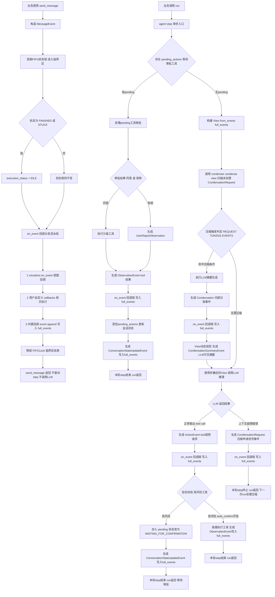
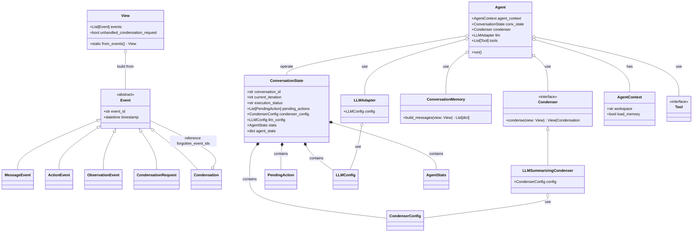
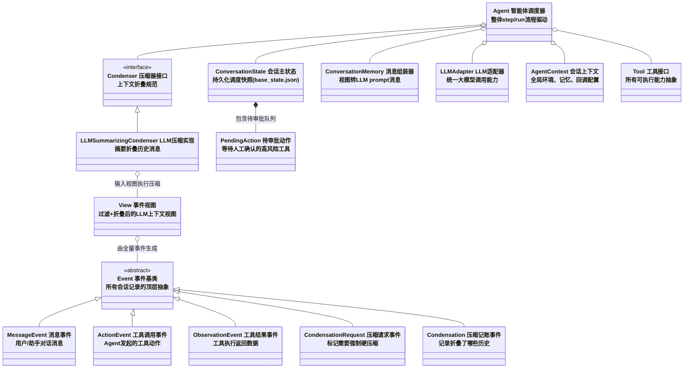
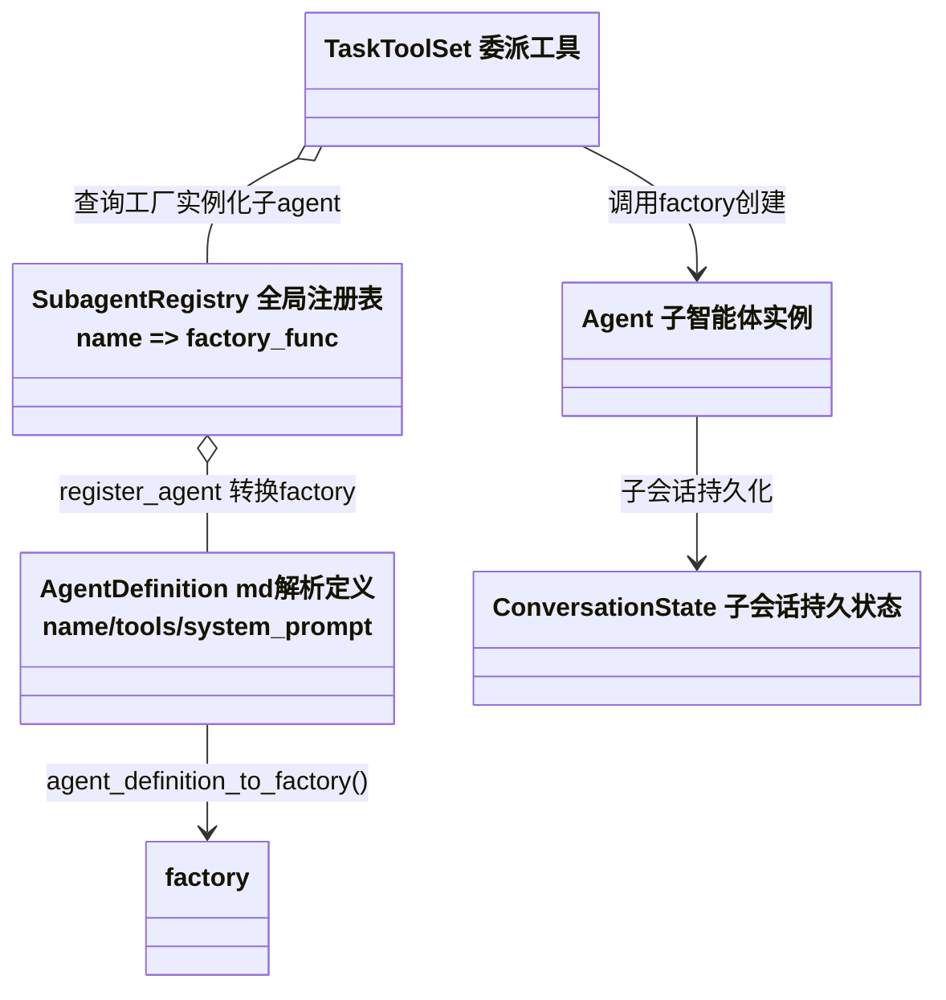
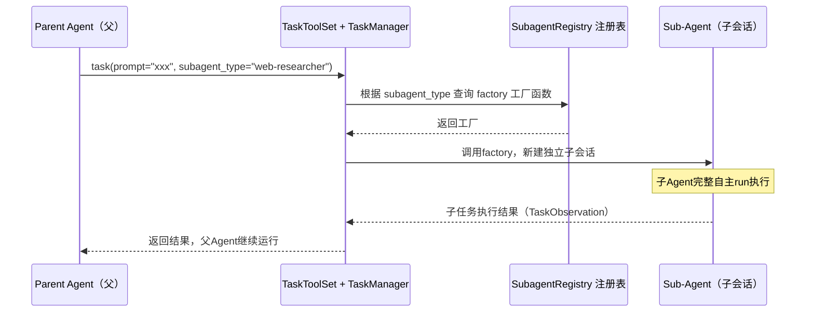

# Software Agent SDK — 架构导航

> **包版本**: 见 `openhands-sdk` release · **文档整理**: 2026-08-05  
> **完整大纲**: [README.md](./README.md)

---

## 分章索引

| 主题 | 文档 | 章节 |
|------|------|------|
| 核心架构 | [ARCHITECTURE_PART1.md](./ARCHITECTURE_PART1.md) | Agent、Conversation、E2E、Memory、多 Agent、Plan |
| 扩展与安全 | [ARCHITECTURE_PART2.md](./ARCHITECTURE_PART2.md) | §0 工具注册、Tool、MCP、Security、[§8 四包功能封装](./ARCHITECTURE_PART2.md#81-workspace-包一览) |
| 运维与质量 | [ARCHITECTURE_PART3.md](./ARCHITECTURE_PART3.md) | Persistence、Observability、Testing |

## 专题深潜

| 主题 | 文档 |
|------|------|
| 运行时走查（折叠 / View / Condensation JSON / 工具挂载） | [CORE_RUNTIME_WALKTHROUGH.md](./CORE_RUNTIME_WALKTHROUGH.md) |
| 运行时 Prompt（Default / Planning 中文全文） | [SDK_RUNTIME_PROMPTS.md](./SDK_RUNTIME_PROMPTS.md) |
| 跨项目压缩 Prompt 对比 | [COMPRESSION_SCHEMES_COMPARISON.md](./COMPRESSION_SCHEMES_COMPARISON.md) |

## 10 分钟速览

1. 运行时只有一张工具表：`Agent.tools_map` → [PART2 §0](./ARCHITECTURE_PART2.md#第0章工具注册全景mcp--skills--内置工具)
2. Event → View → `messages[]` 投影链 → [WALKTHROUGH 第一部分](./CORE_RUNTIME_WALKTHROUGH.md#第一部分折叠与-event--view--messages)
3. Plan 与 Execute 须两段 Conversation → [WALKTHROUGH 第零部分](./CORE_RUNTIME_WALKTHROUGH.md#第零部分补充没有一次-run-先-plan-再执行)
4. Monorepo 四包分工（sdk / tools / workspace / agent-server）→ [PART2 §8.1](./ARCHITECTURE_PART2.md#81-workspace-包一览)
5. `send_message` 无消息队列；loop 中插入时序 → [PART1 §3.6](./ARCHITECTURE_PART1.md#36-loop-过程中-send_message-时序)

返回：[文档中心](./README.md)
# ✅ OpenHands software-agent-sdk 完整事件清单（区分【LLM 可见事件】和【内部控制事件】）

>
> 所有事件全部遵循统一流程：构造事件 → `_on_event()` 回调链 → 追加写入 `full_events`（append-only），都走同一套 send_message/run 内的事件回调链路
> 核心工具闭环：**ActionEvent（tool 调用） ↔ ObservationEvent（tool 结果）**，依靠 `tool_call_id` 一一配对

## 一、LLM 可见事件（会转换为 LLM messages，参与 agent 推理上下文）

表格

| 事件名称 | 核心含义 | 典型场景 |
| --- | --- | --- |
| **MessageEvent** | 文本对话消息（user /agent） | send_message 用户输入、Agent 主动反问等待用户输入（WAITING_FOR_USER_INPUT） |
| **ActionEvent** | Agent 工具调用（tool call）【你关心的 tool 调用事件】 | 执行 shell、读写文件、浏览器、python 代码、finish 完成任务；内部承载各类 Action：CmdRunAction / FileReadAction / AgentFinishAction 等；⚠️ 高风险 action 会存入 pending，进入 WAITING_FOR_CONFIRMATION |
| **ObservationEvent（ObservationBaseEvent 子类）** | 工具执行返回结果【你关心的 tool 结果事件】 | 命令 stdout/stderr、文件内容、浏览器返回；配套特殊子类：✅ UserRejectObservation：用户拒绝 pending 工具审批 /hook 拦截工具 |
| **SystemPromptEvent** | 系统提示词事件 | 会话初始化注入 system prompt、工具定义 schema |
| **CondensationSummaryEvent** | 历史压缩摘要 | 长上下文压缩后，摘要写入上下文，替代旧事件给 LLM |

## 二、内部控制事件（**不会发给 LLM，仅 SDK 内部记账、状态流转、压缩控制**，同样存入 full_events）

表格

| 事件名称 | 核心含义 | 典型场景 |
| --- | --- | --- |
| **CondensationRequest** | 请求上下文压缩 | token 超限，触发 condenser，申请压缩历史事件 |
| **Condensation** | 压缩完成事件 | 标记哪些旧事件被折叠、丢弃，保留摘要信息 |
| **ConversationStateUpdateEvent** | 会话状态变更事件 | 元数据、pending_actions 变更、状态流转埋点审计 |
| **PauseEvent** | 用户主动暂停会话 | 人工中断 agent 执行 |
| **AgentErrorEvent** | 执行异常事件 | LLM 调用失败、工具执行报错、权限异常，会话切 ERROR 状态 |
| **TokenEvent**（部分版本） | LLM token 用量埋点 | 记录 prompt/completion token 统计，用于计费观测 |

# ✅ 纠正之前简化带来的遗漏：完整区分压缩三事件 + ConversationStateUpdateEvent

>
> 源码定义（区分两类：**LLM 可见事件** vs **内部控制事件（不会发给 LLM）**）
> 内部控制事件（仅 SDK 记账、流程控制，存入 full_events，但不会序列化给 LLM）
>
>
> 1. `CondensationRequest`：【请求压缩】触发一次压缩流程（硬触发 HARD）
> 2. `Condensation`：【压缩完成结果】记录本次压缩：哪些事件被遗忘、摘要文本、偏移位置
> 3. `ConversationStateUpdateEvent`：会话状态字段变更埋点（pending_actions /execution_status/metrics 快照变更）
>
>
> LLM 可见事件（会进入发给大模型的 messages）
> 4. `CondensationSummaryEvent`：压缩产出的摘要，替换掉历史被折叠的事件，送入 LLM 上下文

>
> ❌ 之前错误简化：直接 “按需执行压缩”，跳过了 `CondensationRequest` 事件抛出、step 返回、下一轮处理完整闭环；压缩**不是当前 step 立刻同步完成**，存在 step 切分。

## 一、四个相关事件逐个定义

### 1. CondensationRequest（内部事件，不发给 LLM）

**含义：申请执行上下文压缩**
触发来源：

1. LLM 调用抛出 `LLMContextWindowExceedError`（上下文超限，**被动触发**）
2. 业务 /agent 主动发起强制压缩（**主动硬触发 HARD**）
   流程行为：

- 在当前 step 内部构造 `CondensationRequest`，走 `_on_event` 回调写入 full_events
- **当前 step 直接终止返回，不会继续调用 LLM**
- 等待下一轮 run () step 启动时，先处理这条压缩请求

>
> 关键：Request 只是 “发一个压缩申请事件”，**本身不做摘要、不修改视图**OpenHands

### 2. Condensation（内部事件，不发给 LLM）

**含义：压缩执行完成的记账结果**
当 condenser（LLMSummarizingCondenser）执行摘要成功后，生成：

- `forgotten_event_ids`：本次被折叠、遗忘的旧事件 ID 列表
- summary：生成的摘要文本
- summary_offset：摘要插入到事件视图的位置
- reason：触发原因（REQUEST / TOKENS / EVENTS）

写入 full_events，永久留存审计：本次压缩到底折叠了哪些历史

>
> 注意：`Condensation` 本身**不会直接变成 LLM 可见文本**；它是内部记账凭证；真正给 LLM 看的是下面的 CondensationSummaryEvent

### 3. CondensationSummaryEvent（LLM 可见事件 ✅）

**含义：压缩摘要消息，会转换为 message 送入 LLM 上下文**
视图层 `View.from_events()` 在构建 LLM 输入时：
扫描 full_events 里所有 Condensation 记录，把摘要生成 / 替换为 `CondensationSummaryEvent`，替换掉被遗忘的一堆旧事件，减少 token。

>
> full_events 原始全量不变（append-only），只是**发给 LLM 的视图快照做折叠**，回放、断点续跑依然保留完整原始事件链。

### 4. ConversationStateUpdateEvent（内部事件，不发给 LLM）

**含义：ConversationState 核心字段发生变更时，发出的同步埋点事件**
触发时机：只要会话 state 变更就会生成：

- execution_status 流转（IDLE → RUNNING → WAITING_FOR_CONFIRMATION）
- pending_actions 新增 / 清空（工具等待审批）
- metrics、元数据快照更新
  作用：

1. 持久化审计：记录会话状态变更历史，存入 full_events
2. 用于 websocket 前端实时同步会话状态，客户端不用轮询拉取完整 state

>
> 和状态锁区分：`self._state` 是内存会话对象；`ConversationStateUpdateEvent` 是**把变更记录为可回放的事件日志**GitHub

## 二、完整标准压缩闭环时序（包含 CondensationRequest 事件）

```
run() → step() 启动
    ↓
【前置分支】如果存在 pending_actions → 处理审批，返回（跳过压缩）
    ↓
【1】预检查 condenser，尝试预压缩（soft 软触发：事件数量超限 / token超限）
    condenser.condense(view)
        ├ 返回 View（轻量视图裁剪，同step继续走LLM调用）
        └ 返回 Condensation 对象 → 生成 Condensation 事件写入full_events，当前step直接返回，下一轮处理
    ↓
【2】使用视图调用 LLM
    ↓
【分支A：LLM返回正常】解析ActionEvent / MessageEvent，正常流程
【分支B：LLM抛出 LLMContextWindowExceedError】
        → 构造 CondensationRequest 事件
        → _on_event 回调写入 full_events
        → 当前 step 终止，run 返回，**本轮不再继续推理**
    ↓
【下一次外部调用 run()，进入新一轮 step】
        读取 full_events，发现存在未处理 CondensationRequest
        → 调用 condenser 执行摘要压缩
        → 生成 Condensation（内部记账事件，写入full_events）
        → View.from_events 基于 Condensation 生成 CondensationSummaryEvent（LLM可见摘要）
        → 使用折叠后的新视图，继续调用LLM推理
```

>
> 重点：`CondensationRequest` 会切分 step，压缩逻辑放到**下一轮 run**处理，不是阻塞同步完成压缩OpenHands

## 三、补充：View 视图 和 full_events 的本质区别（很多人混淆）

1. **full_events**：append-only 原始完整事件流，包含：Message/Action/Observation/CondensationRequest/Condensation/ConversationStateUpdateEvent 全部事件，永久存储，永不删除修改
2. **View（视图快照）**：每次 step 启动时，基于 full_events 动态计算出来的**LLM 可用子集**
    - 过滤内部控制事件（Request / Condensation / StateUpdate 全部剔除，不给 LLM）
    - 根据 Condensation 记录，删除 forgotten_event_ids，插入 CondensationSummaryEvent
      → 视图是动态投影，不会修改原始 full_events

## 四、再对齐：工具调用整套事件时序（方便对比压缩流程）

>
> 工具闭环（没有 step 切分，同步执行）

1. LLM 输出工具调用 → ActionEvent（写入 full_events）
2. 安全校验：高风险 → pending_actions，会话切 WAITING_FOR_CONFIRMATION，run 返回
3. send_message 审批指令 → 写入 MessageEvent
4. run () 再次启动 step：发现 pending，执行工具
5. 工具返回 → ObservationEvent / UserRejectObservation（写入 full_events）

>
> 压缩闭环（存在 step 切分，Request 抛出后本轮终止，下一轮处理）

1. 上下文超限报错 → CondensationRequest（写入 full_events）
2. 当前 run step 直接返回
3. 外部再次调用 run () → 处理压缩请求
4. 执行摘要 → Condensation（记账事件写入 full_events）
5. View 投影生成 CondensationSummaryEvent，送入 LLM

## 五、一句话总结之前哪里讲的不够严谨

我上一轮简化时，**省略了 CondensationRequest 抛出后，当前 step 直接终止、压缩放到下一轮 run 处理的 step 切分机制**，直接描述为 “按需压缩”；
完整链路：超限 → 抛出 CondensationRequest 事件（本轮退出）→ 下一轮 run 读取 Request → 执行压缩产出 Condensation 记账事件 → View 生成 CondensationSummaryEvent 摘要给 LLM；
同时 `ConversationStateUpdateEvent` 是会话内存 state 变更时的审计同步事件，记录 pending、execution_status 变更，存入 full_events，但不会发给 LLM。

# ✅ CondensationRequest 的检测入口（源码完整链路）

>
> 一句话结论：**每次 run () 启动新的 agent step，调用 condenser.condense (view) 时，Condenser（LLMSummarizingCondenser）内部会遍历 full_events 里的事件，扫描是否存在未处理的 CondensationRequest，识别 Reason.REQUEST（硬压缩请求）**GitHub

## 1. 整体位置：agent step 最前置分支

```
conversation.run()
    ↓
agent.step() 【单步循环入口】
    ↓
【分支1】先判断 pending_actions（等待审批工具）→ 有就处理，返回
    ↓
【分支2】如果配置了 condenser：调用 condenser.condense(view) 【这里就是检测 CondensationRequest 的核心位置！】
```

>
> view = View.from_events (full_events)，视图加载了完整原始事件流（包含内部控制事件 CondensationRequest）

## 2. Condenser 内部如何检测 CondensationRequest

`LLMSummarizingCondenser.condense()` 内部逻辑：

1. 拿到 view（包含全部原始事件 full_events 的投影）
2. **反向遍历事件列表**，查找有没有还没有被处理的 `CondensationRequest` 事件
    - 判定规则：从尾部向前扫，直到遇到 `Condensation`（压缩完成记账事件）为止；中间如果存在 CondensationRequest → 判定：**存在未处理请求 Reason.REQUEST（HARD 硬压缩，必须执行）**
3. 三种触发判定（condenser 内部统一识别）
    - `Reason.REQUEST`：检测到 CondensationRequest 事件（本次讨论重点）
    - `Reason.TOKENS`：token 总数超过阈值（软触发 soft）
    - `Reason.EVENTS`：事件条数超过阈值（软触发 soft）GitHub
4. 如果命中 Reason.REQUEST：执行完整摘要压缩，生成 `Condensation` 记账事件，通过 _on_event 写入 full_events；本轮 step 结束返回，下一轮 step 使用折叠后的视图（带 CondensationSummaryEvent）调用 LLM

>
> ⚠️ 关键点：CondensationRequest **不会在 _on_event 回调里自动处理**；回调只是负责把它 append 存入 full_events；**真正扫描识别、处理它，是下一轮 run → step → condenser.condense () 阶段**

## 3. CondensationRequest 是怎么被生成写入 full_events 的（补充来源）

两种产生途径：

1. LLM 调用抛出 `LLMContextWindowExceedError` 上下文超限异常 → 当前 step 内部构造 CondensationRequest，走 _on_event 回调写入 full_events，然后本轮 step 直接终止返回GitHub
2. 业务主动调用 `conversation.condense()` 接口 → 内部构造 CondensationRequest 事件写入 full_events，等待下一轮 run 处理GitHub

## 4. 完整闭环时序（Request 写入 → 检测到 → 执行压缩）

1. 本轮 run step：LLM 上下文超限 → 构造 CondensationRequest → _on_event → 写入 full_events → run 返回退出本轮
2. **外部再次调用 run ()，开启全新一轮 step**
    1. step 前置：无 pending_actions
    2. 调用 condenser.condense (view)
    3. condenser 遍历 view 内事件，**检测到未处理 CondensationRequest → Reason.REQUEST（硬压缩）**
    4. condenser 执行 LLM 摘要，产出 Condensation（记账事件），写入 full_events
    5. View 动态投影：根据 Condensation 生成 CondensationSummaryEvent（LLM 可见摘要）
    6. 使用折叠后的视图，调用 LLM 继续推理

## 5. 容易踩坑区分

1. ❌ 不是 view.from_events () 自动处理压缩；from_events 只是视图投影，**只负责过滤、折叠，不执行摘要生成**
2. ✅ **condenser.condense () 才是扫描 CondensationRequest + 执行摘要的唯一入口**
3. CondensationRequest 属于内部控制事件：view 传给 LLM 的 messages 会过滤掉它，**不会发给大模型**，只用于 SDK 内部流程信号

## 6. 和 ConversationStateUpdateEvent 的区别

- CondensationRequest：**事件流里的信号事件，由 condenser 在 step 开头扫描识别**，控制压缩流程
- ConversationStateUpdateEvent：**state 内存字段变更时生成的审计埋点**（pending、execution_status 变更），不会被 condenser 扫描作为压缩触发信号



base_state.json 文件格式
```json

{
"conversation_id": "550e8400-e29b-41d4-a716-446655440000",
"persistence_dir": "./.conversations/550e8400-e29b-41d4-a716-446655440000",
"workspace": "/data/my-project",
"execution_status": "PAUSED",
"max_iterations": 50,
"current_iteration": 12,
"confirmation_policy": "auto_confirm_low_risk",
"load_memory": true,
"memory_paths": {
"user_global": "/root/.openhands/memory/MEMORY.md",
"project": "/data/my-project/.openhands/memory/MEMORY.md"
},
"stats": {
"llm_api_calls": 18,
"input_tokens": 42800,
"output_tokens": 9600,
"total_cost": 0.326,
"tool_call_count": 24
},
"pending_actions": [
{
"action_id": "act-0012",
"event_ref": "event-0012-abcdef1234.json",
"action_type": "file_edit",
"requires_confirmation": true
}
],
"activated_skills": ["python_lint", "git_helper"],
"llm_config": {
"model": "anthropic/claude-sonnet-4",
"base_url": "https://api.anthropic.com",
"prompt_caching_enabled": true
},
"secrets": {
"llm_api_key": "**********"
},
"agent_state": {
"extra_data": {
"project_branch": "main",
"last_summary_event_id": "evt-cond-001"
}
},
"condenser_config": {
"keep_last_events": 8,
"token_threshold": 4000,
"summary_model": "anthropic/claude-haiku"
},
"created_at": "2026-08-20T08:30:15.234Z",
"updated_at": "2026-08-20T10:15:42.891Z"
}
```
```
.conversations/
└── 550e8400-e29b-41d4-a716-446655440000/
├── base_state.json        # 主运行状态快照（本示例）
└── events/
├── event-00000-xxx.json
├── event-00001-xxx.json
├── event-00002-condensation-request.json
└── event-00003-condensation.json
```



表格

| 实体 | 是否持久化 | 存储位置 | 有 / 无状态 |
| --- | --- | --- | --- |
| ConversationState | ✅ 持久 | base_state.json | 有状态 |
| PendingAction | ✅ 持久 | base_state.json（内嵌） | 有状态 |
| Event 所有子类 | ✅ 持久 | events/event-*.json | 无状态（只读） |
| View | ❌ 不持久 | 运行内存，step 后销毁 | 无状态投影 |
| LLMSummarizingCondenser | ❌ 不持久 | 运行内存 | 无状态转换器 |
| Agent / AgentContext | ❌ 不持久 | 运行内存 | 运行上下文 |
| ConversationMemory / LLM / Tool | ❌ 不持久 | 运行内存 | 无状态转换 |

# AgentContext / ConversationMemory 详解（OpenHands software-agent-sdk）

## 1. AgentContext

**中文名称：会话运行上下文**

>
> 定位：贯穿整个会话生命周期的**环境配置、回调、沙盒权限、记忆开关容器（运行时实体，不完整持久化）**

### 核心职责

1. **基础环境配置**
   - workspace：Agent 工作沙盒目录
   - load_memory：是否开启读取 `MEMORY.md / AGENTS.md` 持久记忆
   - 文件读写权限、沙盒隔离策略
2. **回调钩子托管**
   挂载生命周期回调：on_event、on_step、on_llm_request、on_tool_exec 等，用于日志、埋点、自定义拦截。
>
> ⚠️ 回调函数是内存对象，**无法序列化存入 base_state.json**
3. **全局共享资源**
   日志实例、文件读写句柄、全局技能注册信息
4. **区分：和 ConversationState 的边界**
   - AgentContext：**运行环境、回调、临时资源**，进程重启要重建
   - ConversationState：**可持久调度快照（迭代号、pending 审批、统计）**，写入 base_state.json
   - 关键配置（load_memory）会同步下沉保存到 ConversationState，会话恢复时读取

### 一句话总结

**AgentContext = 本次会话运行的 “环境底座”，控制权限、文件沙盒、回调钩子、是否加载 MEMORY.md 记忆**

---

## 2. ConversationMemory

**中文名称：消息组装器**

>
> 定位：**无状态纯转换工具**，负责把 SDK 内部 `View` 视图 → 转换成 LLM 标准 messages 数组（符合 Claude / OpenAI 协议）

### 核心职责

1. 事件类型映射：将 View 内各类 Event（MessageEvent / ActionEvent / ObservationEvent）翻译成 system /user/assistant /tool 消息结构
2. 拼接系统提示词：整合基础 system prompt + 加载后的 MEMORY.md/ AGENTS.md 记忆上下文
3. 处理 Prompt Caching 标记（配合 LLMAdapter 给长前缀添加缓存分界）
4. 过滤内部 SDK 私有事件：CondensationRequest / Condensation 记账事件**不会透传给大模型**（仅内部调度使用）
5. 控制消息格式对齐不同大模型服务商的协议差异

### 执行时序位置

```
View（折叠后的事件视图）
    ↓
ConversationMemory.build_messages()
    ↓
标准 messages 数组 → LLMAdapter 调用大模型
```

### 一句话总结

**ConversationMemory = 翻译转换器，把 SDK 内部事件视图，组装成大模型能识别的完整 Prompt 消息列表**

---

# 两者配合 + 和其他实体关系

1. Agent 持有 AgentContext（环境）、ConversationMemory（消息组装工具）
2. AgentContext 控制是否加载 MEMORY.md，加载出来的记忆文本交给 ConversationMemory 拼入 system prompt
3. ConversationMemory 不保存任何对话历史，每次 build 都是纯函数转换，输入 View，输出 messages，执行完无残留

## 边界区分（高频混淆点）

表格

| 实体 | 是否保存对话 | 是否持久化 | 主要作用 |
| --- | --- | --- | --- |
| AgentContext | ❌ 不存对话 | 回调不可持久，配置下沉到 ConversationState | 环境、权限、回调、记忆开关 |
| ConversationMemory | ❌ 不存对话 | ❌ 完全临时 | 事件视图 → LLM 消息组装转换 |
| ConversationState | ❌ 不存对话 | ✅ base_state.json | 调度快照、迭代、pending 审批、统计 |
| View | ✅ 持有本轮可用事件 | ❌ 临时投影 | 过滤、折叠事件，携带压缩标记 |
| Event | ✅ 完整对话日志 | ✅ events 目录 | 全量 append-only 事件溯源 |

# AgentContext 独立出来，而不是直接合并进 Agent 的核心原因

>
> 一句话结论：**职责分离 + 复用解耦 + 区分【调度运行快照】和【环境基础设施】，同时兼顾会话恢复持久化边界**

## 1. 职责边界完全不同（最核心）

- **Agent：执行调度器（run/step 主循环）**
  职责：驱动一轮一轮 step、处理 pending 审批、调用 condenser、调用 LLM、派发工具、追加事件、更新 ConversationState。
  关注点：**会话业务执行流程、状态流转**。
  Agent 偏向：一次会话的执行驱动器。
- **AgentContext：运行环境上下文（基础设施容器）**
  职责：沙盒 workspace、文件权限、全局回调钩子、日志句柄、memory 加载开关、技能注册表、外部依赖注入。
  关注点：**执行环境、外部依赖、生命周期拦截（埋点 / 审计 / 拦截）**。
  AgentContext 偏向：支撑 Agent 运行的基础设施。

如果全部塞到 Agent 里，Agent 会变成**大上帝类**：既要管循环调度，又要管理文件权限、日志回调、全局配置，后期极难维护、单元测试困难。
## 区分「可持久状态」和「不可持久运行环境」

我们有三层东西要分开：

1. **ConversationState（base_state.json）**：可持久调度快照（迭代号、pending 动作、统计指标），进程崩溃后可以落盘恢复。
2. **AgentContext**：运行时环境，里面大量资源（文件句柄、回调函数、日志实例）**不能序列化、不能持久化**，重启必须重新构建。
3. **Agent**：临时调度执行实例，每次续跑会话，会新建 Agent + 重建 AgentContext，然后加载 ConversationState。

如果把 AgentContext 合并进 Agent：
当会话暂停持久化时，开发者容易误以为整个 Agent 可以序列化保存，误把回调、文件句柄尝试写入 base_state，引发序列化异常。
**拆分后强制边界：持久化只认 ConversationState，环境上下文只在内存生命周期内有效。**

# Subagent 注册表完整详解（OpenHands software-agent-sdk）

## 一、Subagent 注册表是什么

**Subagent Registry（子智能体注册表）**：全局单例字典注册表，位于 `openhands.sdk.subagent`，核心作用：**按名称保存子 Agent 工厂函数（factory）**，供 `TaskToolSet` / 委托工具在运行时根据 `subagent_type` 动态实例化子 AgentOpenHands。

>
> 核心设计：**不保存 Agent 实例，只保存工厂函数 `(llm: LLM) -> Agent`**
>
>
> - 每次委派任务，传入父级 LLM，调用工厂生成全新独立子 Agent
> - 子 Agent 拥有独立会话（独立 events、独立 ConversationState），共享 workspace
> - 注册表全局复用，多个 Conversation 共用一套子 Agent 定义

核心导出 API：

1. `register_agent(name, factory_func, description)`：代码注册自定义子 agent
2. `register_file_agents(project_path)`：扫描 md 文件批量注册文件型子 agent
3. `register_builtins_agents(enable_browser=True/False)`：注册官方内置子 agent
4. `agent_definition_to_factory(definition)`：把 md 解析后的 AgentDefinition 转为工厂函数

## 二、是否存在内置子 agent

✅ **存在官方内置子 agent**，放在包内 `openhands/tools/preset/subagents/*.md`，需要手动调用 `register_builtins_agents()` 一次性注册，不会默认全部加载OpenHands

### 内置清单（v1.12+ 标准命名，旧名称已废弃）

表格

| 子 Agent 名称 | 内置工具 | 用途 |
| --- | --- | --- |
| general-purpose | terminal、file_editor、task_tracker | 通用全能子 Agent（默认兜底，替代旧 default） |
| code-explorer | terminal | 只读代码浏览，不会修改文件（替代旧 explore） |
| bash-runner | terminal | shell 执行、编译、测试、git 操作（替代旧 bash） |
| web-researcher | browser_tool_set + MCP(fetch/tavily) | 网页检索、文档抓取；`enable_browser=False` 时不注册 |

>
> 注册优先级规则（先注册先生效，同名不会覆盖）
>
>
> 1. 代码 `register_agent()` 手动注册（最高，优先）
> 2. Plugin 内置 agents
> 3. 项目目录 `.agents/agents/*.md` / `.openhands/agents/*.md`
> 4. 用户全局目录 `~/.agents/agents/*.md`
> 5. `register_builtins_agents()` 内置预设（最低）
     > ⚠️ 如果你先注册内置，再注册同名自定义 agent 会被忽略；**自定义优先：先注册自己，再 register_builtins_agents**OpenHands

## 三、两种注册方式（代码注册 / 文件 md 注册）

### 方式 1：Python 代码注册（自定义工厂，灵活）

```
from openhands.sdk import LLM, Agent, AgentContext
from openhands.sdk.context import Skill
from openhands.sdk.subagent import register_agent

# 1. 定义工厂函数：入参LLM，返回Agent实例
def create_code_reviewer(llm: LLM) -> Agent:
    return Agent(
        llm=llm,
        tools=[],
        agent_context=AgentContext(
            skills=[
                Skill(
                    name="code_review",
                    content="你是代码评审专家，检查bug、规范、安全问题",
                    trigger=None,
                )
            ]
        )
    )

# 2. 注册到全局注册表
register_agent(
    name="code_reviewer",
    factory_func=create_code_reviewer,
    description="代码评审子Agent，发现缺陷并给出修复建议"
)
```

### 方式 2：Markdown 文件式注册（无需写 Python，业务常用）

编写 `code-reviewer.md`，放在项目 `.agents/agents/`

```
---
name: code-reviewer
description: 代码评审，检查bug与编码规范
tools:
  - file_editor
  - terminal
---
你是严谨的代码评审专家，检查正确性、性能、安全漏洞，给出可落地修复方案
```

加载注册：

```
from openhands.sdk.subagent import register_file_agents
# 扫描项目目录下所有md子agent并注册
registered_names = register_file_agents("./your_project_path")
```

### 方式 3：一次性加载官方内置子 agent

```
from openhands.tools.preset.default import register_builtins_agents
# 全部内置（包含web-researcher，需要浏览器依赖）
register_builtins_agents()
# 不含浏览器相关，不加载 web-researcher
register_builtins_agents(enable_browser=False)
```

## 四、完整初始化流程（从注册 → 父 Agent 委派 → 子 Agent 运行）

### 整体时序

1. **全局注册阶段（程序启动，仅执行一次）**

>
> 注册表填充完成：`{"name": factory_function}`
- 可选：`register_agent()` / `register_file_agents()` 注册自定义子 Agent 工厂
- 可选：`register_builtins_agents()` 加载官方预设子 Agent
2. **父 Agent 初始化**

```
from openhands.tools.task import TaskToolSet
main_agent = Agent(llm=llm, tools=[Tool(name=TaskToolSet.name)])
```
- 父 Agent 必须挂载 `TaskToolSet`（委派工具），否则无法调用子 Agent
3. 创建主会话 `Conversation`（父会话，独立 workspace）
4. **运行时委派（父 Agent 调用 task 工具）**
    - 父 Agent 输出 tool 调用：`task(prompt="xxx", subagent_type="code_reviewer")`
    - TaskManager 接收调用，用 subagent_type 去全局注册表查找 factory
    - 调用 factory (父 LLM) → **实例化全新子 Agent**
    - 创建独立子会话（独立 ConversationState + events，持久化到磁盘，支持 resume）
    - 子 Agent 完整 run () 执行任务，直到完成
    - 子执行结果封装为 TaskObservation 返回给父 Agent
5. 子会话持久化：子任务拥有 task_id，后续可通过 resume 参数恢复子会话继续执行

>
> 重要隔离点：
>
>
> - 父、子 **ConversationState、events 事件流完全独立**，互不污染上下文
> - 默认继承父 LLM；md 配置可指定独立 model
> - 共享同一个 workspace 文件沙盒

## 五、实体引用关系

1. **Subagent Registry（全局单例字典）**：保存 name → factory
2. **AgentDefinition**：md 文件解析后的结构化定义（name/description/tools/system_prompt），用于生成 factory
3. **factory 工厂函数**：`(LLM) → Agent`，运行时生产子 Agent 实例
4. **TaskToolSet / TaskManager**：运行时查询注册表、创建子会话、调度子 Agent 执行
5. 子产出：独立 `Agent` + `AgentContext` + `ConversationState` + events

```python
#`List[Event]` **不在 Conversation 顶层直接字段，封装在 ConversationState.event_log（EventLog 对象内部持有事件数组）**
Conversation
    └── ConversationState
          └── event_log: EventLog (List[Event] 全量可信事件)
                ↓ Condenser → View（过滤后的事件子集）
                      ↓ ConversationMemory.build_messages(view) 【投影】
                            ↓ 临时 List[Message] → LLMAdapter 请求大模型
                            ↓ Agent产生新Action/Observation → 包装Event append写入 event_log
```



## 六、高频避坑

1. **注册时机**：必须在创建 Conversation、执行 run 之前完成注册；运行中动态注册也支持，但不推荐
2. **同名覆盖**：注册表是 “先注册生效，后注册忽略”，自定义优先于内置，所以顺序：自定义 register → register_builtins_agents
3. **循环递归风险**：子 Agent 不要挂载 TaskToolSet 委派工具，防止无限嵌套 spawn
4. **持久恢复**：子会话独立落盘，task_id 用于 resume 续跑子任务
5. **注册表全局共享**：多 Conversation 共用一套子 Agent 工厂，工厂无状态，线程安全；但实例 Agent、ConversationState 各自独立
# TaskToolSet 完整详解（OpenHands SDK）

>
> **一句话定义：TaskToolSet 是官方内置的【任务委派工具集】，是父 Agent 用来生成、调用、恢复子 Agent（Subagent）的标准入口，替代旧版废弃的 delegate 委派工具**GitHub
> 包路径：`openhands.tools.task.TaskToolSet`

## ✅ 核心定位与职责

1. **对外：标准工具（ToolSet）**
   和 `TerminalTool`、`FileEditorTool` 同级；**父 Agent 必须挂载 TaskToolSet，才具备委派子 Agent 的能力**，LLM 才能调用 `task()` 函数来分发子任务OpenHands
2. **对内：封装 TaskManager**
   TaskManager 是真正执行逻辑：查询 Subagent 注册表、实例化子 Agent、创建独立子会话、执行子任务、持久化 task_id、返回结果给父 Agent、支持后续 resume 恢复子任务OpenHands
3. **能力特性**
    - 同步阻塞委派：父 Agent 暂停等待子 Agent 完整跑完，拿到结果后继续执行
    - 父子会话隔离：子拥有独立 `ConversationState + events`，互不污染上下文；**共享同一个 workspace 文件沙盒**
    - 持久可恢复：每个子任务分配唯一 task_id，会话落盘保存，支持中断后 resume 续跑子任务（对应你截图的 `41_task_tool_set.py`）
    - 配合 Subagent 注册表：通过 `subagent_type` 名字查找工厂函数，动态生成不同专业子 Agent（web-researcher /code-explorer 等）OpenHands

## ✅ 核心组件关系

```
Parent Agent（父智能体）
    ↓（必须挂载）
TaskToolSet（委派工具，暴露 task(prompt, subagent_type)）
    ↓（内部封装）
TaskManager（调度管理器）
    ↓（查询）
SubagentRegistry（全局子Agent注册表 name → factory工厂）
    ↓（调用工厂）
Sub-Agent + 独立 Conversation（子会话，独立events、state）
```
