# Software Agent SDK 完整架构设计文档（第一部分）

> **版本**: 2.7（2026-08-05，§6.9.0d 压缩检查点仅在 step 入口）
> **分析时间**: 2026-05-17（v2.0 扩写）
> **分析方法**: 源码深度阅读
> **源码路径**: `software-agent-sdk/openhands-sdk`

---

## 📋 目录

- [第1章：项目概览与核心架构](#第1章项目概览与核心架构)
- [第2章：Agent 核心系统](#第2章agent-核心系统)
- [第3章：Conversation 会话管理](#第3章conversation-会话管理)
  - [3.3 单轮迭代（agent.step）](#33-单轮迭代agentstep-详解)
    - [3.3.0 术语：step / turn / run](#330-术语stepturnrun-怎么对应)
  - [3.5 事件持久化（一 Event 一文件）](#35-事件持久化)
  - [3.6 loop 中 `send_message` 时序](#36-loop-过程中-send_message-时序)
- [第4章：Tool 工具系统](#第4章tool-工具系统)
- [第5章：端到端流程与双循环（完整）](#第5章端到端流程与双循环完整)
- [第6章：Memory 体系与运行时 Message 变化](#第6章memory-体系与运行时-message-变化)
  - [6.8 SDK 差异化设计](#68-这个-sdk-到底特别在哪为何不是普通-agent-壳)
  - [6.9 Condensation 压缩机制与完整实例](#69-condensation-压缩机制--对-memory-的影响--完整实例)（含 [§6.9.0d 检查点仅在 step 入口](#690d-检查点时机仅在-step-入口工具执行后不检查)）
  - [附录：ARCHITECTURE_PART2.md（工具注册 §0、包地图 §8）](./ARCHITECTURE_PART2.md)
  - [附录：CORE_RUNTIME_WALKTHROUGH.md（折叠 / 实体 / 压缩 / 工具·MCP·切换 · **已合并**）](./CORE_RUNTIME_WALKTHROUGH.md)
  - [附录：SDK_RUNTIME_PROMPTS.md（Planning Prompt 中文）](./SDK_RUNTIME_PROMPTS.md)
  - [附录：COMPRESSION_SCHEMES_COMPARISON.md（压缩 Prompt 对比）](./COMPRESSION_SCHEMES_COMPARISON.md)
- [第7章：多 Agent 模式与编排](#第7章多-agent-模式与编排)
- [第8章：Plan 模式详解](#第8章plan-模式详解)

---

## 第1章：项目概览与核心架构

### 1.1 项目定位

**Software Agent SDK** 是一个企业级 Agent 开发框架，提供：

1. ✅ **本地对话** - `LocalConversation` 在本地运行 Agent
2. ✅ **远程对话** - `RemoteConversation` 通过 HTTP API 与 Agent Server 交互
3. ✅ **插件系统** - Skills、MCP Servers、Hooks 的加载和管理
4. ✅ **安全机制** - Confirmation Mode、Security Analyzer、Secrets 管理
5. ✅ **持久化** - 事件溯源(Event Sourcing)、状态恢复、Forking

---

### 1.2 核心模块架构

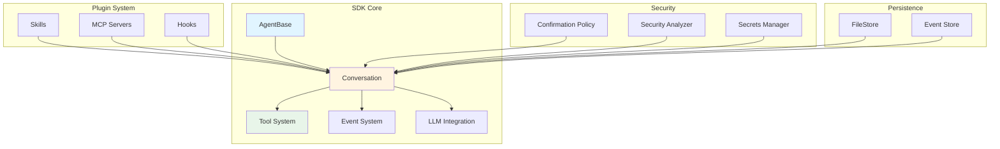
```mermaid
graph TB
    subgraph "SDK Core"
        A[AgentBase] --> B[Conversation]
        B --> C[Tool System]
        B --> D[Event System]
        B --> E[LLM Integration]
    end

    subgraph "Plugin System"
        F[Skills] --> B
        G[MCP Servers] --> B
        H[Hooks] --> B
    end

    subgraph "Security"
        I[Confirmation Policy] --> B
        J[Security Analyzer] --> B
        K[Secrets Manager] --> B
    end

    subgraph "Persistence"
        L[FileStore] --> B
        M[Event Store] --> B
    end

    style A fill:#e1f5ff
    style B fill:#fff4e1
    style C fill:#e8f5e9
```

---

### 1.3 关键组件关系

| 组件 | 位置 | 职责 |
|------|------|------|
| `AgentBase` | `openhands/sdk/agent/base.py` | Agent 定义、工具注册、初始化 |
| `LocalConversation` | `openhands/sdk/conversation/impl/local_conversation.py` | 本地对话执行引擎 |
| `RemoteConversation` | `openhands/sdk/conversation/impl/remote_conversation.py` | 远程对话代理 |
| `Tool` | `openhands/sdk/tool/` | 工具定义、执行器、Schema |
| `Event` | `openhands/sdk/event/` | 事件类型、序列化、可视化 |
| `LLM` | `openhands/sdk/llm/` | LLM 调用、流式响应、Metrics |
| `FileStore` | `openhands/sdk/context/file_store/` | 持久化存储 |

---

### 1.4 数据流转全景图（完整，不省略）

下图覆盖：**外层 `run`/`arun`**、**内层 `step`**、**Condensation**、**Confirmation 两阶段**、**Delegate 子会话**、**持久化**。细节展开见 [第5章](#第5章端到端流程与双循环完整)。

**入口对照**：本地用 `LocalConversation`；远程 `RemoteConversation` 为 **RPC ack + WebSocket 事件流** 同构逻辑（事件在 Agent Server 侧同样 file-backed）。

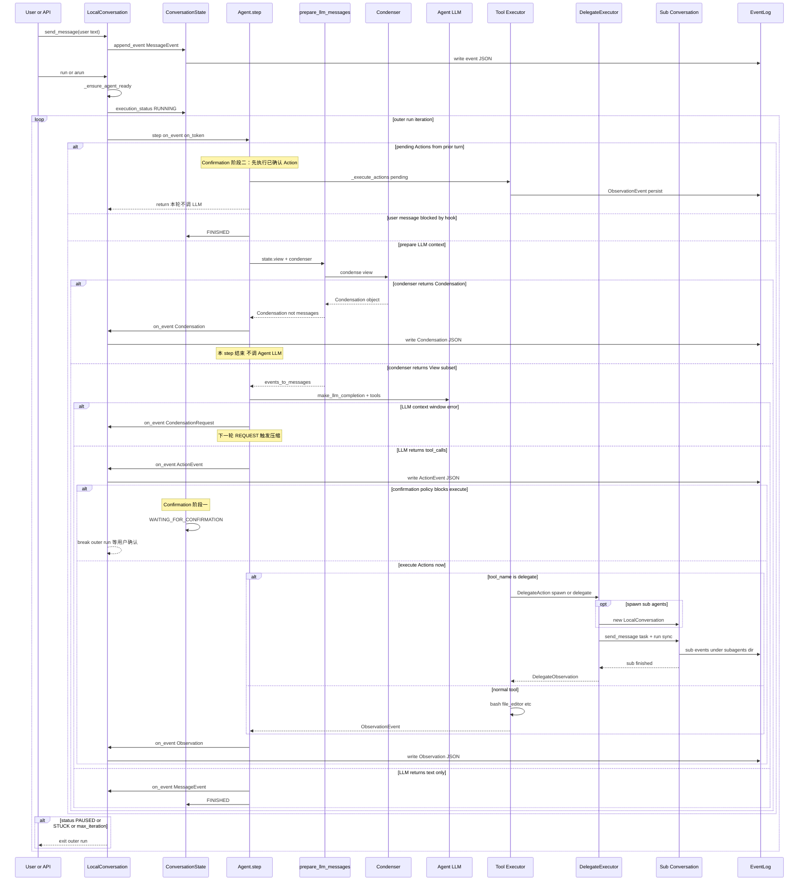
```mermaid
sequenceDiagram
    participant U as User or API
    participant LC as LocalConversation
    participant ST as ConversationState
    participant AG as Agent.step
    participant PR as prepare_llm_messages
    participant CD as Condenser
    participant LLM as Agent LLM
    participant TE as Tool Executor
    participant DE as DelegateExecutor
    participant SUB as Sub Conversation
    participant EV as EventLog

    U->>LC: send_message(user text)
    LC->>ST: append_event MessageEvent
    ST->>EV: write event JSON
    U->>LC: run or arun
    LC->>LC: _ensure_agent_ready
    LC->>ST: execution_status RUNNING

    loop outer run iteration
        LC->>AG: step on_event on_token

        alt pending Actions from prior turn
            Note over AG: Confirmation 阶段二：先执行已确认 Action
            AG->>TE: _execute_actions pending
            TE->>EV: ObservationEvent persist
            AG-->>LC: return 本轮不调 LLM
        else user message blocked by hook
            AG->>ST: FINISHED
        else prepare LLM context
            AG->>PR: state.view + condenser
            PR->>CD: condense view
            alt condenser returns Condensation
                CD-->>PR: Condensation object
                PR-->>AG: Condensation not messages
                AG->>LC: on_event Condensation
                LC->>EV: write Condensation JSON
                Note over AG: 本 step 结束 不调 Agent LLM
            else condenser returns View subset
                PR-->>AG: events_to_messages
                AG->>LLM: make_llm_completion + tools
                alt LLM context window error
                    AG->>LC: on_event CondensationRequest
                    Note over AG: 下一轮 REQUEST 触发压缩
                else LLM returns tool_calls
                    AG->>LC: on_event ActionEvent
                    LC->>EV: write ActionEvent JSON
                    alt confirmation policy blocks execute
                        Note over ST: Confirmation 阶段一
                        ST->>ST: WAITING_FOR_CONFIRMATION
                        LC-->>LC: break outer run 等用户确认
                    else execute Actions now
                        alt tool_name is delegate
                            TE->>DE: DelegateAction spawn or delegate
                            opt spawn sub agents
                                DE->>SUB: new LocalConversation
                            end
                            DE->>SUB: send_message task + run sync
                            SUB->>EV: sub events under subagents dir
                            SUB-->>DE: sub finished
                            DE-->>TE: DelegateObservation
                        else normal tool
                            TE->>TE: bash file_editor etc
                            TE-->>AG: ObservationEvent
                        end
                        AG->>LC: on_event Observation
                        LC->>EV: write Observation JSON
                    end
                else LLM returns text only
                    AG->>LC: on_event MessageEvent
                    AG->>ST: FINISHED
                end
            end
        end

        alt status PAUSED or STUCK or max_iteration
            LC-->>U: exit outer run
        end
    end
```

**与实现对齐的要点**：

1. `LocalConversation.run()` **不直接调 LLM** — 只循环 `agent.step()` / `astep()`。
2. **Condensation** 与 **CondensationRequest** 是两条路径：前者本 step 落盘摘要事件；后者标记 View，下一轮 condense。
3. **Confirmation**：第一次 run 可能 `WAITING_FOR_CONFIRMATION` 并 break；再次 run 时 step 开头走 `pending_actions` 分支。
4. **Delegate**：在工具执行器内对子 `LocalConversation` 调 **同步 `run()`**，父 step 阻塞到子会话结束。
5. 每条 `on_event` → `append_event` → **一个** `events/event-{idx}-{id}.json`（见 §3.5）。

**异步 `arun()`**：外层逻辑相同，差异为 `astep` + `amake_llm_completion`；LLM 等待时可 `_released_state_lock_during_io` 释放 FIFOLock（§5.5）。**勿用 participant 名 `Loop`** — Mermaid 会把 `Loop->>` 解析成 `loop` 关键字导致报错。

---

## 第2章：Agent 核心系统

### 2.1 AgentBase 架构

**位置**: `openhands/sdk/agent/base.py`

```python
from openhands.sdk.tool import Tool
from openhands.sdk.tool.registry import resolve_tool

class AgentBase(BaseModel):
  tools: list[Tool] = Field(default_factory=list)  # 名字 + params，非 ToolSpec
  include_default_tools: list[str] = ...  # 如 FinishTool、ThinkTool 类名

  _tools: dict[str, ToolDefinition] = PrivateAttr(default_factory=dict)
  _initialized: bool = PrivateAttr(default=False)

  def _initialize(self, state: ConversationState) -> None:
    if self._initialized:
      return
    tools: list[ToolDefinition] = []
    with ThreadPoolExecutor(max_workers=4) as executor:
      futures = [
        executor.submit(resolve_tool, tool_spec, state)
        for tool_spec in self.tools
      ]
      for future in futures:
        tools.extend(future.result())  # 一个 spec 可产出多个 ToolDefinition
    # include_default_tools → BUILT_IN_TOOL_CLASSES[cls].create(state)
    self._tools = {tool.name: tool for tool in tools}
    self._initialized = True

  @property
  def tools_map(self) -> dict[str, ToolDefinition]:
    return self._tools  # make_llm_completion(tools=...) 与 ToolExecutor 共用
```

**关键点**：
1. ✅ **延迟初始化** — `init_state` / 首次 `_ensure_agent_ready()` 时 `_initialize(state)`
2. ✅ **并行 resolve** — `resolve_tool(spec, state)` 查全局 `_REG` 工厂表
3. ✅ **运行时表** — `tools_map`（即 `_tools`）；MCP 经 `add_runtime_tools()` 合并，**不写** `_REG`

---

### 2.2 Agent 初始化流程
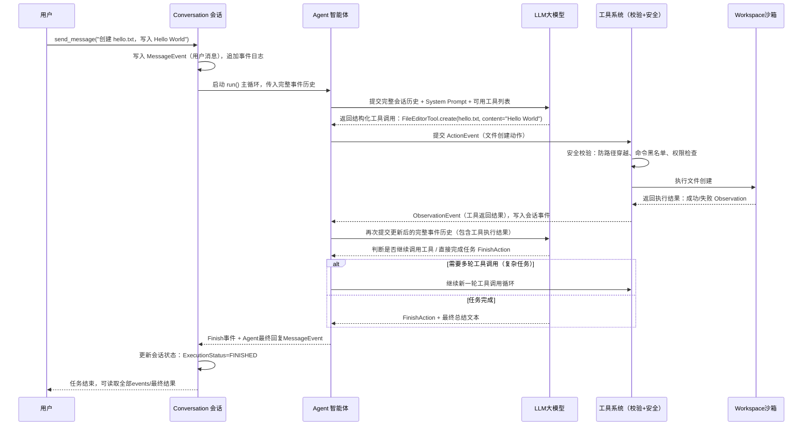
```mermaid
sequenceDiagram
participant User as 用户
participant Conv as Conversation 会话
participant Agent as Agent 智能体
participant LLM as LLM大模型
participant ToolSys as 工具系统（校验+安全）
participant Workspace as Workspace沙箱
User->>Conv: send_message("创建 hello.txt，写入 Hello World")
Conv->>Conv: 写入 MessageEvent（用户消息），追加事件日志
Conv->>Agent: 启动 run() 主循环，传入完整事件历史
Agent->>LLM: 提交完整会话历史 + System Prompt + 可用工具列表
LLM-->>Agent: 返回结构化工具调用：FileEditorTool.create(hello.txt, content="Hello World")
Agent->>ToolSys: 提交 ActionEvent（文件创建动作）
ToolSys->>ToolSys: 安全校验：防路径穿越、命令黑名单、权限检查
ToolSys->>Workspace: 执行文件创建
Workspace-->>ToolSys: 返回执行结果：成功/失败 Observation
ToolSys-->>Agent: ObservationEvent（工具返回结果），写入会话事件
Agent->>LLM: 再次提交更新后的完整事件历史（包含工具执行结果）
LLM-->>Agent: 判断是否继续调用工具 / 直接完成任务 FinishAction
alt 需要多轮工具调用（复杂任务）
Agent->>ToolSys: 继续新一轮工具调用循环
else 任务完成
LLM-->>Agent: FinishAction + 最终总结文本
end
Agent-->>Conv: Finish事件 + Agent最终回复MessageEvent
Conv->>Conv: 更新会话状态：ExecutionStatus=FINISHED
Conv-->>User: 任务结束，可读取全部events/最终结果
```


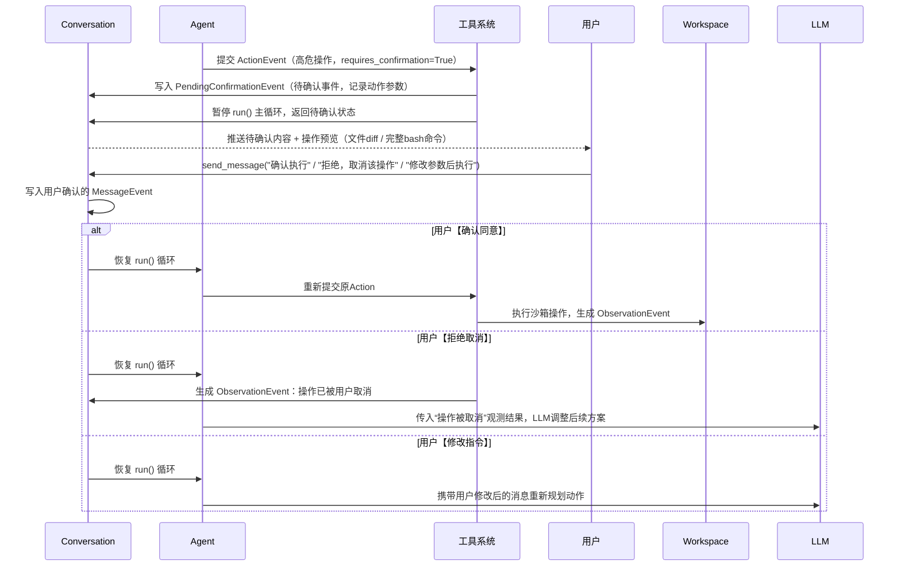
```mermaid
sequenceDiagram
  participant Conv as Conversation
  participant Agent as Agent
  participant ToolSys as 工具系统
  participant User as 用户
  Agent->>ToolSys: 提交 ActionEvent（高危操作，requires_confirmation=True）
  ToolSys->>Conv: 写入 PendingConfirmationEvent（待确认事件，记录动作参数）
  ToolSys->>Conv: 暂停 run() 主循环，返回待确认状态
  Conv-->>User: 推送待确认内容 + 操作预览（文件diff / 完整bash命令）
  User->>Conv: send_message("确认执行" / "拒绝，取消该操作" / "修改参数后执行")
  Conv->>Conv: 写入用户确认的 MessageEvent
alt 用户【确认同意】
Conv->>Agent: 恢复 run() 循环
Agent->>ToolSys: 重新提交原Action
ToolSys->>Workspace: 执行沙箱操作，生成 ObservationEvent
else 用户【拒绝取消】
Conv->>Agent: 恢复 run() 循环
ToolSys->>Conv: 生成 ObservationEvent：操作已被用户取消
Agent->>LLM: 传入“操作被取消”观测结果，LLM调整后续方案
else 用户【修改指令】
Conv->>Agent: 恢复 run() 循环
Agent->>LLM: 携带用户修改后的消息重新规划动作
end
```

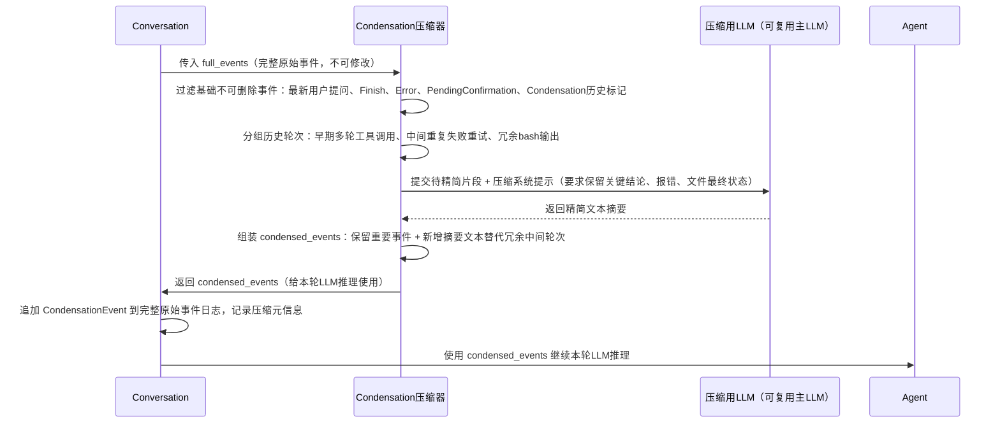
```mermaid
sequenceDiagram
participant Conv as Conversation
participant Condenser as Condensation压缩器
participant LLM as 压缩用LLM（可复用主LLM）
Conv->>Condenser: 传入 full_events（完整原始事件，不可修改）
Condenser->>Condenser: 过滤基础不可删除事件：最新用户提问、Finish、Error、PendingConfirmation、Condensation历史标记
Condenser->>Condenser: 分组历史轮次：早期多轮工具调用、中间重复失败重试、冗余bash输出
Condenser->>LLM: 提交待精简片段 + 压缩系统提示（要求保留关键结论、报错、文件最终状态）
LLM-->>Condenser: 返回精简文本摘要
Condenser->>Condenser: 组装 condensed_events：保留重要事件 + 新增摘要文本替代冗余中间轮次
Condenser->>Conv: 返回 condensed_events（给本轮LLM推理使用）
Conv->>Conv: 追加 CondensationEvent 到完整原始事件日志，记录压缩元信息
Conv->>Agent: 使用 condensed_events 继续本轮LLM推理
```

# 完整时序汇总（合并前后整段，可直接写文档）

## 【前半段：生成待确认动作，暂停】

1. LLM 返回单条工具 Action
2. ActionEvent 追加写入 events
3. 检测工具 requires_confirmation=True
4. 内存保存 pending_action = 当前 Action
5. PendingConfirmationEvent 追加写入 events
6. 会话状态 = AWAITING_USER_CONFIRMATION
7. step 终止，run 返回，暂停执行（无 ObservationEvent）

## 【后半段：用户确认，恢复 run 执行】

1. 用户输入确认文本 → send_message 写入 MessageEvent
2. 调用 run ()，进入新一轮 step
3. step 首检：存在 pending_action && 状态 AWAITING_USER_CONFIRMATION
  - ✅ 同意：执行 pending 的 Action → 生成 ObservationEvent → 清空 pending_action → 恢复正常状态 → 进入标准循环（压缩→LLM）
  - ❌ 拒绝：不执行工具 → 生成 “已取消” ObservationEvent → 清空 pending_action → 进入标准循环
  - ✏️ 修改指令：直接丢弃 pending_action → 清空 pending → 进入标准循环交由 LLM 重规划
4. 后续正常循环：按需压缩 → LLM 推理 → 新 Action/Finish/Agent 问答

---

# 🧩 补充边界问题（容易踩坑）

1. **会话断点持久化（服务端保存会话）**
   pending_action 内存对象需要序列化保存；恢复会话时，重建 pending_action，会话状态恢复 AWAITING_USER_CONFIRMATION，可以继续等待用户确认
2. **auto_confirm=True 自动确认模式**
   检测 requires_confirmation 后，**不创建 pending_action、不写入 PendingConfirmationEvent，直接执行工具生成 Observation**，跳过整个暂停分支，适合 CI 自动化
3. **回放评估模式（SWE-bench）**
   读取历史 events 中的 PendingConfirmationEvent，回放时 auto_confirm 强制 true，跳过弹窗，不会重建 pending_action 等待人工
4. 事件审计溯源：
   完整链路审计：MessageEvent (user) → ActionEvent → PendingConfirmationEvent → MessageEvent (user_confirm) → ObservationEvent，整条链条通过 event id 关联
# 问题 1：SDK 是否支持一次返回多个工具调用？第一个高危要确认，后面工具会丢弃吗？是否浪费 LLM 输出？

## 核心结论

1. **SDK 原生支持 LLM 单次返回多工具并行调用（parallel tool calls），但默认 `tool_concurrency_limit=1`，串行执行（实验特性）**OpenHands
  - 配置 `tool_concurrency_limit>1` 才开启真正并发执行；默认是逐个串行处理这批同一次 LLM 返回的多个 Action
2. **串行模式（默认，concurrency=1）：逐个处理同批次多个 Action，一旦遇到任意一个需要确认，整个批次暂停；但不是直接丢弃后面工具，而是暂不执行，当前 SDK 版本默认只支持单条 pending，所以后面未执行 Action 会作废，本轮不再执行，下一轮交给 LLM 重新规划，确实会浪费本轮 LLM 返回的剩余工具调用**
>
> 官方当前设计：**WAITING_FOR_CONFIRMATION 状态下，同一时刻仅维护一组待确认动作（支持批量确认，不是单个 pending_action，我之前表述有误！），可以批量确认整批 actions**，`ConversationState.get_unmatched_actions()` 可以拿到一批 pending actions，不是只能单条OpenHands
3. 两种模式区分：
  - ✅ 串行默认（concurrency=1）：
    LLM 返回 [ActionA (高危), ActionB (普通), ActionC (普通)]
    ① 写入 ActionA → 检测 requires_confirmation
    ② 把**整批关联同一个 llm_response_id 的 actions 标记为 pending 待确认**，写入 PendingConfirmationEvent，状态切 WAITING_FOR_CONFIRMATION，run 暂停
    ③ 等待用户**批量同意 / 批量拒绝整批**
   >
   > 用户同意：整批依次执行 A/B/C，生成多条 ObservationEvent
   > 用户拒绝：整批全部不执行，生成批量拒绝 Observation，交给 LLM 重规划
   > ⚠️ 重点：**不是执行 A 发现确认就直接扔掉 B/C，SDK 会把同 llm_response_id 的整批 actions 作为一个待确认集合，支持批量审批**，这是我上一轮回答里的关键疏漏！
  - ⚠️ 并发模式（concurrency>1，实验）：
    并行执行一批工具，如果并行过程中任意一条触发确认，执行逻辑会立刻暂停整批，等待批量确认；并发模式对工具线程安全有严格约束，读写共享文件不建议开启OpenHands

## 是否浪费 LLM 返回？

- 如果用户**同意整批**：不会浪费，全部执行，本轮 LLM 输出完整复用
- 如果用户**拒绝整批 / 修改指令**：本轮 LLM 返回的全部多工具调用作废，下一轮重新调用 LLM 生成新动作，确实存在 token 浪费

>
> 优化思路：业务层做提示词约束，引导 LLM 不要一次性混合高危 + 普通工具拆分多轮调用；高危动作单独一轮 tool call，避免批量审批带来的浪费

>
> 补充：旧认知纠正：
> 之前我说 “同一时刻只能单个 pending_action” 不准确；**pending 是一批 actions（同 llm_response_id），支持批量确认**，可以 `get_unmatched_actions` 获取全部待审批动作，`reject_pending_actions()` 批量拒绝，是整套批量审批接口，不是只能单条确认OpenHands

# 问题 2：用户确认传入的是字符串，SDK 如何判定同意 / 拒绝？

## 核心结论

**SDK 内核本身不会自动语义解析自然语言字符串（不会 NLP 猜 “好的、行、不要、算了”）！**
有两套用法：

1. 【标准官方推荐】上层业务自己解析用户输入字符串，**主动调用 SDK 提供的专用接口完成确认 / 拒绝**（这是生产标准写法）
2. 【简易交互 demo】CLI 示例里自己做简单字符串匹配（yes/y/no/n），属于 demo 层代码，不是 SDK 内核逻辑OpenHands

## 详细拆解

### 1）SDK 内核层面：不解析用户文本

当会话处于 `WAITING_FOR_CONFIRMATION`：

- 用户输入任意文本调用 `send_message("ok，执行")` → 仅追加一条普通 MessageEvent 进事件流，**内核不会自动识别这句话是同意还是拒绝**
- 必须由上层业务代码：
  1. 获取待审批列表：`pending_actions = ConversationState.get_unmatched_actions(conversation.state.events)`
  2. 自己解析用户输入字符串（正则 / 关键词 / 甚至调用 LLM 做语义理解）
  3. 分支处理：
    - ✅ 同意：直接再次调用 `conversation.run()`，SDK 检测 pending 集合，批量执行全部 pending actions
    - ❌ 拒绝：调用内置接口 `conversation.reject_pending_actions("原因文本")`，写入拒绝观测，清空 pending 集合
    - ✏️ 修改指令：调用 send_message 传入修改需求，run 之后交由 LLM 重新生成新 actions，作废旧 pending 批次

>
> 源码示例（官方 demo）：
>
>
> ```
> def confirm_in_console(pending_actions) -> bool:
>     ans = input("Do you want to execute these actions? (yes/no): ").strip().lower()
>     if ans in ("yes", "y"):
>         return True
>     if ans in ("no", "n"):
>         return False
> ```
>
>
> 👉 这段关键词匹配是 demo 的控制台交互层，**不属于 sdk 内核实现**，业务 Web/IDE 接入时可以自定义解析规则，甚至做复杂语义：“只执行第 1 条，剩下跳过”

### 2）完整时序（用户字符串确认标准流程）

1. 会话状态 WAITING_FOR_CONFIRMATION，存在一批 pending actions，events 包含 ActionEvents + PendingConfirmationEvent
2. 用户输入自然语言字符串：`send_message("全部执行")` → MessageEvent 入库
3. 上层业务读取 pending 列表 + 用户最新消息，**自行解析意图**
4. 分支：
  - 同意：不调用 reject，直接 `conversation.run()` → SDK 取出整批 pending actions 串行 / 并发执行，生成多条 ObservationEvent，清空 pending 集合
  - 拒绝：`conversation.reject_pending_actions("用户不同意执行这批高危操作")` → 写入拒绝 Observation，清空 pending
  - 局部确认（部分执行）：SDK 原生**不支持批次内挑选部分 action 执行**，原生只能整批同意 / 整批拒绝；想要 “只执行第一条” 属于自定义扩展，需要上层拆分批次，不在原生能力内
5. 继续标准 agent 循环：按需压缩 → LLM 推理下一步

### 3）扩展方案：如果想要支持自然语言模糊确认（比如 “好的，没问题，执行吧”）

业务层可以把用户 Message + pending 动作摘要交给 LLM 做意图分类，输出 `APPROVE / REJECT / MODIFY`，再调用 sdk 确认接口，**这个语义能力由业务实现，不是 SDK 自带**

# 整合修正后的关键补充（修正上一轮回答的两处偏差）

1. pending 不是单条 action，**支持同一次 LLM 返回的批量 actions 作为一整个待确认批次，批量审批**，通过 `get_unmatched_actions` 获取全部待确认动作，`reject_pending_actions` 批量拒绝
2. 多工具调用默认串行，遇到高危确认，整批暂停等待批量确认；用户同意则全部复用本轮 LLM 结果执行，不会浪费；拒绝则整批作废，下一轮重推 LLM
3. 用户输入字符串只是普通 MessageEvent；**同意 / 拒绝的判定逻辑由上层业务实现，SDK 内核不做自然语言解析**，SDK 只提供批量确认执行、批量拒绝的接口

# 补充高频疑问边界

1. 能不能支持 “一批 3 个 action，只确认第 1 个，放弃 2、3”？
   原生 SDK 不支持，原生是整批确认 / 整批拒绝；想要局部审批，业务层需要在 LLM 返回多工具之后手动拆分，分多次送入 agent 执行，拆分多个独立批次，每个批次单独确认
2. auto_confirm=True 模式下批量工具如何处理？
   自动跳过确认策略，整批直接串行 / 并发执行，不会写入 PendingConfirmationEvent，无暂停
3. 回放模式处理批量 pending：
   回放读取历史 PendingConfirmationEvent，auto_confirm 强制开启，自动放行整批 pending actions 复现执行
4. LLM 返回 [ActionA (高危), ActionB (普通), ActionC (普通), ActionD (高危), ActionE (普通)]
   是如何处理的？
   上层处理用户的语义，sdk 不处理是吧？

# 一、先回答第二个简短问题：

✅ **是的：software-agent-sdk 内核本身不做用户确认文本的语义理解**

- `send_message(任意字符串)` 只会追加一条 `MessageEvent` 进入事件流；
- 同意 / 拒绝 / 部分执行 / 修改指令 的意图解析，全部交给上层业务（CLI/Web/IDE）自己实现（关键词正则、自研分类、再调用 LLM 做意图识别都属于业务层）；
- SDK 只提供原语：执行 pending 批次、批量拒绝 pending 批次，**不内置 NLP 解析**。

>
> 补充：SDK 只负责：维护 pending 动作集合、会话状态 `AWAITING_USER_CONFIRMATION`、持久化 `PendingConfirmationEvent`、run () 恢复后批量执行 pending。

# 二、场景：LLM 返回同一轮 response 批量 Actions

`[ActionA(高危), ActionB(普通), ActionC(普通), ActionD(高危), ActionE(普通)]`

>
> 前提：默认配置 `tool_concurrency_limit=1`（串行执行，官方默认），**这批 Action 归属同一个 llm_response_id，属于同一批次**

## 两种核心分支：是否开启「逐 Action 校验确认」（SDK 调度策略关键）

>
> SDK 工具调度有两种常见策略：
> 策略 1：**先收集整批，整体扫描是否存在任意 requires_confirmation，整批挂起等待批量确认（主流默认）**
> 策略 2：**逐个串行执行 Action，执行前逐个校验，遇到高危立刻暂停，剩余同批次 Action 全部作废（旧策略 / 部分 fork 版本）**

## ✅ 策略 1：整批预扫描（新版 software-agent-sdk 推荐）

1. Agent 接收 LLM 返回的 Action 数组：A/B/C/D/E，同批次
2. 全部封装为 ActionEvent，依次写入 events（携带相同 llm_response_id 用于批次关联）
3. 调度层预扫描全部 5 个 Action：发现 ActionA、ActionD 标记 `requires_confirmation=True`（高危）
4. **整批 [A,B,C,D,E] 全部放入 pending_actions 批次集合（内存）**
5. 写入一条 `PendingConfirmationEvent`，关联本批次 llm_response_id，记录全部待审批动作、风险预览
6. 会话状态切换：`AWAITING_USER_CONFIRMATION`
7. run () 本轮直接暂停返回，**不会执行任何一条工具（A/B/C/D/E 全都不跑）**
8. 上层展示全部 5 条动作给用户审批（可以标注 A、D 是高危）

### 用户审批后恢复 run () 的三种情况

1. **全部同意**
   run 恢复 → 取出整批 pending，串行依次执行 A→B→C→D→E
   每条执行完成生成各自 ObservationEvent，执行完毕清空 pending 集合，继续标准循环（压缩→LLM）
   ✅ 本轮 LLM 输出完整复用，无浪费
2. **全部拒绝**
   上层调用 `reject_pending_actions(原因)`，生成批量取消 ObservationEvent
   清空 pending 集合，进入下一轮：压缩 → LLM 重新规划动作
   ❗ 本轮 LLM 输出全部作废
3. **用户想要部分执行（例如：只执行 B、C、E，跳过 A、D）**
   ⚠️ **原生 SDK 不支持同一批次内局部勾选执行！**
   原生接口只有【整批放行 / 整批拒绝】
   实现方案（业务层扩展）：
  - 上层解析用户意图后：调用 reject_pending_actions 作废整个批次
  - 上层拆解动作，分多次送入 Agent，拆成多个独立 LLM 轮次，每一批单独审批

## ❌ 策略 2：逐个串行执行、边跑边校验（早期逻辑，新版默认不再启用）

1. ActionA 写入 ActionEvent
2. 校验 A 高危 → 挂起 pending，写入 PendingConfirmationEvent，暂停 run
3. **同批次后面 B/C/D/E 直接丢弃，不会进入 pending 集合**
4. 用户确认完成后，本轮批次已经作废，需要下一轮 LLM 重新生成 B/C/D/E

>
> 缺点：浪费 LLM 多工具输出；新版 SDK 默认不再使用该策略

# 三、补充边界：如果开启并发 tool_concurrency_limit > 1（实验特性）

1. 并发调度前依然先做整批预扫描，只要存在任意高危 requires_confirmation
2. **整批全部进入 pending 等待批量确认，不会启动任何并发执行**

>
> 设计约束：高危操作不允许静默并发执行，必须统一审批；并发主要用于无确认的安全工具并行

# 四、额外重要细节

1. **一条 PendingConfirmationEvent 对应一整个 llm_response_id 批次，不是一个 Action 一条**
   审计回放时，通过 llm_response_id 关联该批次下所有 ActionEvent
2. auto_confirm=True 自动确认模式：
   跳过整批审批逻辑，不写入 PendingConfirmationEvent，直接串行 / 并发执行全部 5 个 Action
3. 回放评测模式：
   读取 PendingConfirmationEvent，强制 auto_confirm，整批自动放行复现

# 五、一句话总结该场景（策略 1，新版默认）

LLM 一轮返回包含多条高危 + 普通混合批量工具：
SDK **先全部写入 ActionEvent，扫描发现存在高危，则整批全部 pending 挂起，写入一条 PendingConfirmationEvent，暂停等待上层业务解析用户审批意图；原生只支持整批同意或整批拒绝，局部勾选执行需要业务自行拆分批次**；SDK 本身不解析用户确认文本。
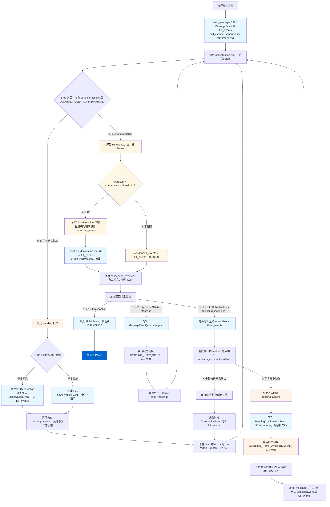
```mermaid
flowchart TD
    A["用户输入消息"] --> B["send_message：写入 MessageEvent 至 full_events<br/>full_events：append-only 原始完整事件流"]
    B --> C["调用 conversation.run()，启动 Step"]

    C --> D{"Step 入口：存在 pending_actions 且 AWAITING_USER_CONFIRMATION?"}
%% 分支1：恢复处理待确认批次（优先执行，跳过压缩 & LLM）
    D -->|✅ 存在待确认批次| E["处理 pending 批次"]
    E --> E1{"上层业务解析用户意图"}
    E1 -->|整批同意| E2["串行执行全部 Action<br/>逐条生成 ObservationEvent 写入 full_events"]
    E1 -->|整批拒绝| E3["生成汇总 ObservationEvent：操作已取消"]
    E2 & E3 --> E4["清空内存 pending_actions，会话恢复正常状态"]
    E4 --> F["本轮 Step 结束，回到 run 主循环，开启新一轮 Step"]

%% 分支2：无pending，标准流程：前置压缩 → LLM调用
    D -->|❌ 无 pending 待确认| G["读取 full_events，统计总 Token"]
    G --> H{"总Token > condensation_threshold ?"}
    H -->|✅ 超限| H1["执行 Condensation 压缩<br/>生成临时精简投影 condensed_events"]
    H1 --> H2["追加 CondensationEvent 写入 full_events<br/>记录压缩前后token、摘要"]
    H -->|❌ 未超限| H3["condensed_events = full_events，跳过压缩"]
    H2 & H3 --> I["使用 condensed_events 作为上下文，调用 LLM"]

    I --> J["LLM 返回结果分支"]
    J -->|分支1：FinishAction| J1["写入 FinishEvent，会话状态 FINISHED"]
    J1 --> Z["会话整体结束"]

    J -->|分支2：Agent 文本问答 Message| J2["写入 MessageEvent(source=agent)"]
    J2 --> J3["会话状态切换 AWAITING_USER_INPUT，run 暂停"]
    J3 --> K["等待用户补充输入 send_message"]
    K --> C

    J -->|分支3：批量 Tool Actions（同 llm_response_id）| J4["逐条写入全部 ActionEvent 至 full_events"]
    J4 --> J5["整批预扫描 Action：是否存在 requires_confirmation=True"]
    J5 -->|✅ 包含高危动作| J6["整批存入内存 pending_actions"]
    J6 --> J7["写入 PendingConfirmationEvent 至 full_events，关联批次ID"]
    J7 --> J8["会话状态切换 AWAITING_USER_CONFIRMATION，run 暂停"]
    J8 --> L["上层展示待确认动作，等待用户确认输入"]
    L --> M["send_message：写入用户确认 MessageEvent 至 full_events"]
    M --> C

    J5 -->|❌ 全部普通无需确认| J9["串行/并发执行所有工具"]
    J9 --> J10["逐条生成 ObservationEvent 写入 full_events"]
    J10 --> F

    F --> C

%% 样式定义
    classDef event color:#222,fill:#e6f7ff
    classDef condense color:#222,fill:#fff7e6
    classDef pending color:#222,fill:#fff2e8
    classDef endnode color:#fff,fill:#0066cc

    class B,J2,J4,J7,H2,E2,E3,J1 event
    class G,H,H1,H3 condense
    class E,J6,J8 pending
    class Z endnode
```


```mermaid
graph TD
  A[Conversation.run] --> B{_ensure_agent_ready}
  B -->|未初始化| C[Agent._initialize]
  B -->|已初始化| D[直接返回]

  C --> E[加载 Plugins / MCP 配置]
  E --> F[合并 Agent.tools 列表]
  F --> G[并行 resolve_tool&#40;spec, state&#41;]
G --> H[构建 _tools / tools_map]
H --> I[标记 _initialized=True]
I --> D

style C fill:#fff4e1
style G fill:#e1f5ff
```

**源码位置**:
- `_ensure_agent_ready()`: `local_conversation.py:142-158`
- `_initialize()`: `base.py:506-550`

---

### 2.3 工具解析机制

**位置**: `openhands/sdk/tool/registry.py` · `agent/base.py` `_initialize`

构造 Agent 时只传 **工具规格** `Tool(name, params)`；可执行实例在初始化时 resolve：

```python
from openhands.sdk.tool import Tool
from openhands.sdk.tool.registry import resolve_tool, register_tool

# openhands-tools 各 definition.py import 时：
register_tool(TerminalTool.name, TerminalTool)  # → _REG["terminal"]

# Agent 配置（名字须已在 _REG 注册，或与类名一致——见各包 register_tool）
agent = Agent(
  tools=[Tool(name=TerminalTool.name), Tool(name=FileEditorTool.name)],
  llm=...,
)

# 首次 run → init_state → _initialize(state)
definitions = resolve_tool(Tool(name="terminal"), state)  # Sequence[ToolDefinition]
```

| 来源 | 如何进入 `tools_map` |
|------|----------------------|
| **内置 / 自定义** | `openhands-tools` import → `register_tool` → `Agent.tools` → `resolve_tool` |
| **默认附带** | `include_default_tools`（`FinishTool` 等）→ `BUILT_IN_TOOL_CLASSES.create(state)` |
| **MCP** | `_ensure_agent_ready` → `create_mcp_tools` → `add_runtime_tools`（绕过 `_REG`） |
| **Plugin** | 合并进 `Agent.tools` / `mcp_config`，仍走 resolve 或 MCP 路径 |

**没有** `ToolSpec(type="builtin"|"plugin"|"custom")` 这类运行时分支；自定义工具需 `ToolDefinition` 子类 + `register_tool` 或 MCP。详见 [ARCHITECTURE_PART2.md §0](./ARCHITECTURE_PART2.md#第0章工具注册全景mcp--skills--内置工具)。

---

### 2.4 Agent 配置示例

```python
from openhands.sdk.agent import Agent
from openhands.sdk.llm import LLM
from openhands.sdk.tool import Tool
from openhands.tools.terminal import TerminalTool
from openhands.tools.file_editor import FileEditorTool

agent = Agent(
    llm=LLM(
        model="gpt-4o",
        temperature=0.7,
        max_tokens=4096,
    ),
    tools=[
        Tool(name=TerminalTool.name),      # 注册名，通常 snake_case（如 "terminal"）
        Tool(name=FileEditorTool.name),  # 或 Tool(name="FileEditorTool") 若按类名注册
    ],
    mcp_config={...},  # 可选 MCP Server → 运行时 add_runtime_tools
)

# 使用 Agent
from openhands.sdk.conversation import LocalConversation
from openhands.sdk.workspace import LocalWorkspace

workspace = LocalWorkspace("/path/to/repo")
conversation = LocalConversation(
    agent=agent,
    workspace=workspace,
)

conversation.run()  # ← 这里会触发 _initialize()
```

---

## 第3章：Conversation 会话管理

### 3.1 Conversation 类型系统

```python
# 两种主要实现
class LocalConversation(BaseConversation):
    """本地对话 - 直接在进程中执行"""
    pass

class RemoteConversation(BaseConversation):
    """远程对话 - 通过 HTTP API 与 Agent Server 交互"""
    pass
```

**对比**：

| 特性 | LocalConversation | RemoteConversation |
|------|-------------------|-------------------|
| **执行位置** | 本地进程 | 远程服务器 |
| **网络依赖** | 无 | 需要 HTTP 连接 |
| **沙箱隔离** | 可选 | 强制（Docker/Apptainer） |
| **适用场景** | 开发调试、单机任务 | 生产环境、多租户 |

---

### 3.2 LocalConversation 核心流程

**位置**: `openhands/sdk/conversation/impl/local_conversation.py` `run()` L1800+

```python
@observe(name="conversation.run")
def run(self) -> None:
    self._ensure_agent_ready()
    self._cancel_token = CancellationToken()

    with self._state:
        if self._state.execution_status in (IDLE, PAUSED, ERROR, STUCK):
            self._state.execution_status = RUNNING

    iteration = 0
    try:
        while True:
            with self._state:
                if self._state.execution_status in (PAUSED, STUCK):
                    break
                if self._state.execution_status == FINISHED:
                    # Stop Hook 可拒绝结束并注入 feedback → 继续 RUNNING
                    if not self._handle_stop_hooks():
                        break
                if self._stuck_detector and self._stuck_detector.is_stuck():
                    self._state.execution_status = STUCK
                    continue
                if self._state.execution_status == WAITING_FOR_CONFIRMATION:
                    self._state.execution_status = RUNNING  # 用户已批准，本圈执行 pending

            self._step_holds_state_lock = True
            try:
                self.agent.step(self, on_event=self._on_event, on_token=self._on_token)
            finally:
                self._step_holds_state_lock = False
            iteration += 1

            # 注意：此处故意不因 FINISHED 立即 break（并发 send_message 设计，见 §5.3）
            if self._state.execution_status == WAITING_FOR_CONFIRMATION:
                break
            if self._budget_exceeded() and self._state.execution_status != FINISHED:
                self._emit_run_limit_error(...)
                break
            if iteration >= self.max_iteration_per_run:
                if self._state.execution_status == FINISHED:
                    break
                self._state.execution_status = ERROR
                break
    finally:
        self._cancel_token = None
```

**关键步骤**：
1. ✅ **初始化** — `_ensure_agent_ready()`（插件、MCP、`init_state`）
2. ✅ **外层循环** — 每 iteration **一次** `agent.step()`（不是 `LocalConversation._step`）
3. ✅ **终止** — `FINISHED`（含 Stop Hook）、`PAUSED`/`STUCK`、`WAITING_FOR_CONFIRMATION`、预算、`max_iteration_per_run`
4. ✅ **`run()` 不调 LLM** — 采样与工具执行全在 `agent.step()` 内

术语与逐步展开见 [§3.3](#33-单轮迭代agentstep-详解) 与 [§5.3](#53-外层循环-run-逐步逻辑)。

---
表格

| execution_status | send_message（原生默认） | run() | 核心说明 |
| --- | --- | --- | --- |
| IDLE | ✅ 允许，追加 MessageEvent | ✅ 允许，获取_run_lock，进入 RUNNING，启动 step | 空闲无 pending，step 完整流程：前置压缩→LLM→工具 |
| RUNNING | ✅ 允许，追加 MessageEvent（消息本轮不生效，下一轮 step 使用） | ❌ 禁止，run 重入锁拦截报错 | step 正在执行（压缩 / LLM / 工具执行）；send_message 不中断当前 step |
| WAITING_FOR_CONFIRMATION | ✅ 允许，追加用户确认 MessageEvent | ✅ 允许，获取_run_lock；step 入口优先处理 pending，跳过压缩、跳过 LLM | 存在 pending_actions 整批工具待审批；锁已释放 |
| WAITING_FOR_USER_INPUT | ✅ 允许，追加用户回复 MessageEvent | ✅ 允许，获取_run_lock；step 正常走前置压缩 + LLM | 无 pending_actions，Agent 文本反问等待用户回答；锁已释放 |
| FINISHED | ✅ 允许，追加 MessageEvent（重置会话为可继续） | ✅ 大多允许，重新开启一轮任务 | FinishEvent 产生，本轮任务完成，对话可续写 |
| ERROR | ✅ 允许，追加 MessageEvent，用于重试对话 | ✅ 允许，run 会尝试恢复执行 | 执行异常，锁释放 |
| STUCK | ✅ 允许 | ⚠️ run 行为看配置（部分禁止，支持 reset 重置） | 会话卡死，人工介入重置 |

IDLE                    // 空闲，初始化/本轮执行完毕，可调用run推进

RUNNING                 // 正在执行step（内部状态，业务一般不可见）

AWAITING_USER_INPUT     // 等待用户补充自然语言提问（Agent主动反问）

AWAITING_USER_CONFIRMATION // 等待用户审批pending工具动作（高危动作批量确认）

FINISHED                // 任务正常完成（FinishEvent）

ERROR                   // 异常终止（执行报错、超时等）
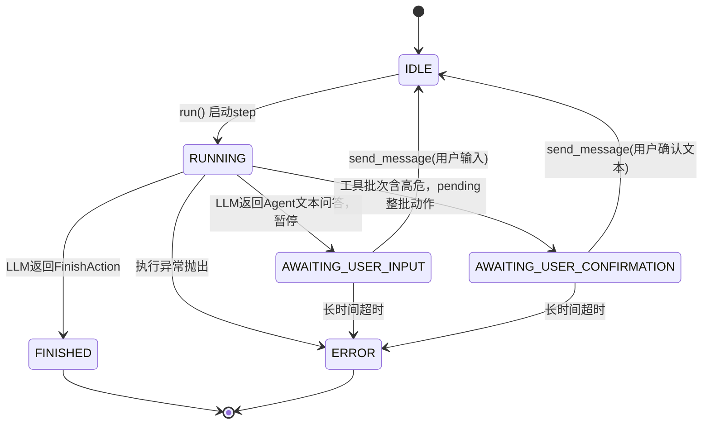
```mermaid
    stateDiagram-v2
    [*] --> IDLE
    IDLE --> RUNNING : run() 启动step
    RUNNING --> AWAITING_USER_INPUT : LLM返回Agent文本问答，暂停
    RUNNING --> AWAITING_USER_CONFIRMATION : 工具批次含高危，pending整批动作
    RUNNING --> FINISHED : LLM返回FinishAction
    RUNNING --> ERROR : 执行异常抛出
    AWAITING_USER_INPUT --> IDLE : send_message(用户输入)
    AWAITING_USER_CONFIRMATION --> IDLE : send_message(用户确认文本)
    AWAITING_USER_INPUT --> ERROR : 长时间超时
    AWAITING_USER_CONFIRMATION --> ERROR : 长时间超时
    FINISHED --> [*]
    ERROR --> [*]
```

# 核心结论（基于 OpenHands software-agent-sdk 原生内核）

**原生 SDK：所有 `ConversationExecutionStatus` 下都可以调用 `send_message`，消息最终都可以追加写入 `full_events`（EventLog，append-only）**
但是有两个非常重要的约束，不能简单理解成 “发了就立刻生效”：

1. **锁排队**：`send_message` 需要竞争 `self._state.lock（FIFOLock）`，如果锁被 `run()` 的 step 持有（RUNNING），调用会**阻塞排队**，等锁释放后才完成追加，不是立即写入。
2. **生效时机**：RUNNING 过程中追加的 MessageEvent，**本轮正在执行的 step 不会读取这条新消息**，只会在下一次调用 `run()` 启动新 step 时，才会纳入上下文参与压缩、LLM 推理。

## 📌 逐个状态核验

表格

| 状态 | send_message 是否可调用 | 能否写入 full_events | 特殊行为 |
| --- | --- | --- | --- |
| IDLE | ✅ | ✅ | 直接排队锁，追加消息，状态不变 |
| RUNNING | ✅ | ✅ | 阻塞等待锁释放后写入；本轮 step 看不到这条消息 |
| WAITING_FOR_USER_INPUT | ✅ | ✅ | 追加消息，状态保持等待 |
| WAITING_FOR_CONFIRMATION | ✅ | ✅ | 追加确认消息，状态保持等待 |
| FINISHED | ✅ | ✅ | 拿到锁后自动把状态重置为 IDLE，再追加消息，支持续写 |
| ERROR | ✅ | ✅ | 追加消息，状态保留 ERROR，后续 run 可重试恢复会话 |
| STUCK | ✅ | ✅ | 拿到锁后自动把状态重置为 IDLE，再追加消息 |

## ⚠️ 两个常见误区澄清

### 误区 1：RUNNING 调用 send_message 会报错拒绝

❌ SDK 内核**不会主动拒绝**；
✅ 行为是：FIFOLock 排队阻塞，等待当前 step 执行完毕释放锁，完成事件追加；

>
> 如果你遇到 RUNNING 禁止发消息，这是 **上层服务（agent-server）额外增加的业务校验**，不属于 SDK 原生逻辑。

### 误区 2：send_message 写入后，正在跑的 run 立刻感知到新消息

❌ 不会；
一轮 step 执行时，上下文快照在 step 启动时读取确定，中途追加的事件不会注入本轮执行上下文。

## 🧩 补充已知风险（工程重点）

RUNNING / WAITING_FOR_CONFIRMATION 中途插入 user MessageEvent，会破坏 tool_call 协议时序：
`ActionEvent → UserMessage → ObservationEvent`
LLM 解析 tool_result 会失败，所以业务层通常会自己加校验拦截，**但这不是 SDK 内核强制限制**。

## ✍️ 一句话总结你的问题

>
> 在 **software-agent-sdk 原生内核 无上层封装拦截** 的前提下：**无论处于任何 execution_status，都允许 send_message，消息最终都会成功追加进 full_events（EventLog），区别只在于锁排队阻塞、以及消息在哪一轮 run 生效**
> 
### 3.3 单轮迭代（`agent.step`）详解

> **命名勘误**：旧文写 `LocalConversation._step`——**源码里没有这个方法**。外层是 `run()`/`arun()` 的 `while`；内层每轮调用 **`agent.step()`**（`local_conversation.py` ≈1896 行）。下文「一步 / step」均指 `agent.step()`。

#### 3.3.0 术语：`step`、`turn`、`run` 怎么对应？

SDK **源码主词是 `step` 和 `run()`**；文档口语里的 **turn** 需看语境：

| 说法 | 代码/API | 含义 |
|------|----------|------|
| **用户一轮 / 用户 turn** | `send_message()` + 一次（或确认后再一次）`run()` | 用户发一条话，驱动 Agent 把这件事做完 |
| **外层循环一圈** | `run()` 的 `while` 每调一次 `agent.step()` | `max_iteration_per_run` 限制的是 **step 次数** |
| **Agent turn 切片 / 一步 step** | `agent.step()` 一次 | **最多一次 Agent LLM** + **可能同步执行一批 tool** |
| **同一步多个 tool** | 一次 LLM 返回多个 `tool_calls` | 仍在 **同一个 `step()`** 内 `_execute_actions` |
| **LLM → tool → 再 LLM** | 两次 `agent.step()` | **不会**在同一步里连续两次 Agent LLM |

与 Grok 等框架对照（帮助记忆）：

| | Grok `grok-build` | OpenHands SDK |
|--|-------------------|-----------------|
| 用户一条 Prompt | `handle_prompt` + turn 处理 | `send_message` + `run()` |
| 内层 sampling↔tool | `process_conversation_turn` 的 `loop_index` | 外层 `run()` 多次 `step()` |
| turn 内插话 | `Interjection` | 无同名机制；新消息 `send_message` + 再 `run()` |
| turn 外排队 | `pending_inputs` | EventLog + FIFOLock（见 [§3.6](#36-loop-过程中-send_message-时序)） |

**整条 loop（数据流）**：

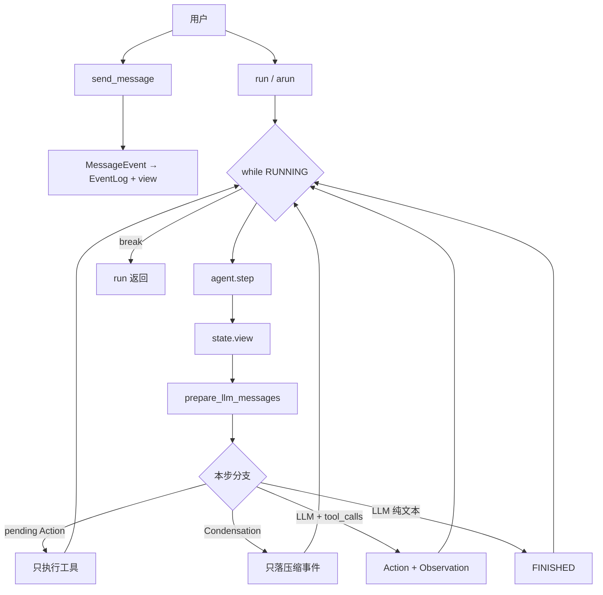
```mermaid
flowchart TB
    U[用户] --> SM[send_message]
    SM --> ME[MessageEvent → EventLog + view]
    U --> RUN[run / arun]
    RUN --> WHILE{while RUNNING}
    WHILE --> ST[agent.step]
    ST --> V[state.view]
    V --> P[prepare_llm_messages]
    P --> BR{本步分支}
    BR -->|pending Action| EX1[只执行工具]
    BR -->|Condensation| C0[只落压缩事件]
    BR -->|LLM + tool_calls| EX2[Action + Observation]
    BR -->|LLM 纯文本| FIN[FINISHED]
    EX1 --> WHILE
    C0 --> WHILE
    EX2 --> WHILE
    FIN --> WHILE
    WHILE -->|break| END[run 返回]
```

**`send_message` 与 `run` 分离**：`send_message` 只写用户 `MessageEvent`；**必须**再调 `run()`/`arun()` 才会进入上述循环。CLI / Agent Server 在入队消息后显式 `run()`。

#### 3.3.1 `_step` / `step` 是什么粒度？

| 概念 | 对应 | 说明 |
|------|------|------|
| **一次用户请求** | `send_message(...)` + 一次（或确认后再一次）`run()` | 用户发一句话；`run()` 可循环 **很多** 次 `agent.step()` |
| **一次 `run()`** | 外层循环直到 `FINISHED` / `PAUSED` / `WAITING_FOR_CONFIRMATION` / 预算耗尽 | 覆盖「想完 + 调工具 + 再想」整段工作 |
| **一次 `agent.step()`** | **一个 Agent turn 切片**（不是整次用户请求） | 下面四种分支 **互斥，每步只走一条** |

一步里实际会发生什么（`agent/agent.py` `step()`）：

1. **有未配对的 pending Action**（确认模式第二阶段）→ **只执行工具**，写 `ObservationEvent`，**不调 Agent LLM**
2. **`prepare_llm_messages` 返回 `Condensation`** → 只 `on_event(Condensation)`，**不调 Agent LLM**（下一轮再采样）
3. **调 Agent LLM** → 得到 tool_calls → `_handle_tool_calls`（写 `ActionEvent`，通常同一步内执行工具并写 `ObservationEvent`；确认模式则只挂起）
4. **调 Agent LLM** → 纯文本 / 空响应 → `_handle_content_response` 等，常设 `FINISHED`

因此：**一步 ≠ 一轮用户对话**；典型「读文件 → 改代码 → 跑测」= **至少 3 次 `step()`**（每步最多一次 Agent LLM）。

**同一步内的边界**：一次 `step()` 可以 **1 次 LLM + N 个 tool_call**（同批执行）；**不能** 1 次 LLM + tool + **再** 1 次 LLM——第二次采样在 **下一个 `step()`**。

#### 3.3.2 每步会不会重新「拼 system prompt」？

**不会重新渲染系统提示模板。** 旧流程图里「构建 System Message」容易误解。

真实路径：

| 时机 | 做什么 |
|------|--------|
| **会话初始化一次** | `init_state` → 写入 **`SystemPromptEvent`**（静态 + 动态上下文已落事件） |
| **之后每步** | 用缓存的 **`state.view`** → `prepare_llm_messages` → `events_to_messages`：**把已有事件转成 LiteLLM messages** |
| **condenser** | 多数步只做阈值检查；仅在需要压缩时才调 **Condenser LLM**（与 Agent LLM 分离） |

也就是说：每步做的是 **View → messages 的线性投影**（O(可见事件数)），不是重新跑 `system_prompt.j2`。System 内容来自 View 里已有的 `SystemPromptEvent.to_llm_message()`（以及压缩后合成的 `CondensationSummaryEvent`）。

#### 3.3.3 工具结果是不是单独的 event 文件？

**是。** 一次成功的工具调用至少产生：

- `ActionEvent` → `events/event-{idx}-{id}.json`
- `ObservationEvent` → **另一个** `events/event-{idx+1}-{id}.json`

二者都是独立 Event、独立落盘；不是塞进同一条 JSON。大 payload 可另存 `observations/`，但事件头仍是单独的 Observation 文件。详见 [§3.5](#35-事件持久化)。

#### 3.3.4 完整时序图（一次用户请求 → 多步）

场景：用户说「修 login bug」→ Agent 读文件 → 得到 Observation → 再调 LLM 给文本答复并结束。确认模式与 Condensation 用 `alt` 标出。

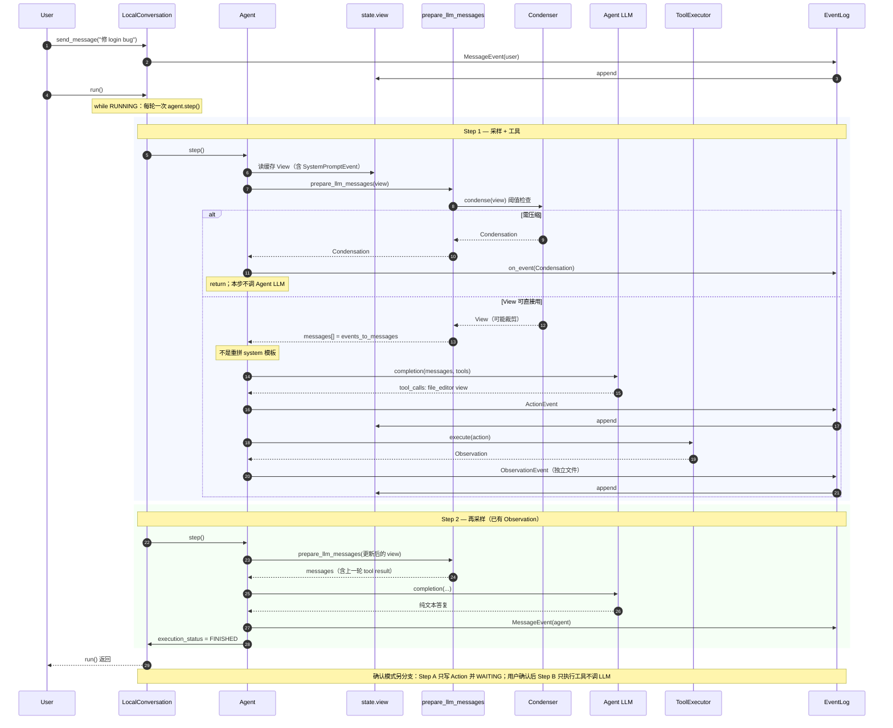
```mermaid
sequenceDiagram
    autonumber
    participant U as User
    participant LC as LocalConversation
    participant AG as Agent
    participant V as state.view
    participant P as prepare_llm_messages
    participant CD as Condenser
    participant LLM as Agent LLM
    participant T as ToolExecutor
    participant EL as EventLog

    U->>LC: send_message("修 login bug")
    LC->>EL: MessageEvent(user)
    EL->>V: append
    U->>LC: run()

    Note over LC: while RUNNING：每轮一次 agent.step()

    rect rgb(245,248,255)
        Note over LC,EL: Step 1 — 采样 + 工具
        LC->>AG: step()
        AG->>V: 读缓存 View（含 SystemPromptEvent）
        AG->>P: prepare_llm_messages(view)
        P->>CD: condense(view) 阈值检查
        alt 需压缩
            CD-->>P: Condensation
            P-->>AG: Condensation
            AG->>EL: on_event(Condensation)
            Note over AG: return；本步不调 Agent LLM
        else View 可直接用
            CD-->>P: View（可能裁剪）
            P-->>AG: messages[] = events_to_messages
            Note over AG: 不是重拼 system 模板
            AG->>LLM: completion(messages, tools)
            LLM-->>AG: tool_calls: file_editor view
            AG->>EL: ActionEvent
            EL->>V: append
            AG->>T: execute(action)
            T-->>AG: Observation
            AG->>EL: ObservationEvent（独立文件）
            EL->>V: append
        end
    end

    rect rgb(245,255,245)
        Note over LC,EL: Step 2 — 再采样（已有 Observation）
        LC->>AG: step()
        AG->>P: prepare_llm_messages(更新后的 view)
        P-->>AG: messages（含上一轮 tool result）
        AG->>LLM: completion(...)
        LLM-->>AG: 纯文本答复
        AG->>EL: MessageEvent(agent)
        AG->>LC: execution_status = FINISHED
    end

    LC-->>U: run() 返回

    Note over LC,EL: 确认模式另分支：Step A 只写 Action 并 WAITING；用户确认后 Step B 只执行工具不调 LLM
```

**与旧图的差异（为何旧图「有问题」）**：

1. 旧图把「构建 System Message」画在每步开头 → 实际是 **init 一次事件**，之后只 **投影**。
2. 旧图暗示一步 = 想完+工具+结束 → 实际 **一步常只推进半拍**（或只压缩 / 只执行 pending）。
3. 旧图把确认画在工具后「继续下一轮」→ 确认时常在 **本步结束 `run()`**，下次 `run()` 再执行。

**源码**：`local_conversation.py` `run()` / `arun()`；`agent/agent.py` `step()`；`agent/utils.py` `prepare_llm_messages`。

---


### 3.4 确认模式 (Confirmation Mode)

**作用**: 在执行危险操作前等待用户确认

```python
# 启用确认模式
from openhands.sdk.security import AlwaysConfirmConfirmationPolicy

conversation = LocalConversation(
    agent=agent,
    workspace=workspace,
    confirmation_policy=AlwaysConfirmConfirmationPolicy(),  # ← 所有操作都需确认
)

# 第一次 run() - 生成 Actions 挂起，等待确认
conversation.run()
# → execution_status = WAITING_FOR_CONFIRMATION；run() break

# 用户确认后，第二次 run() - step 开头执行 pending actions（不调 LLM）
conversation.run()
# → 继续后续 step，直至 FINISHED 或其它终止条件
```

**确认策略类型**：
- `AlwaysConfirmConfirmationPolicy` - 所有操作都需确认
- `NeverConfirmConfirmationPolicy` - 从不确认（默认）
- `SelectiveConfirmConfirmationPolicy` - 根据工具名称选择

**源码位置**: `openhands/sdk/security/confirmation_policy.py`

---

### 3.5 事件持久化

**结论：是「一个 Event 一个文件」，不是把所有事件写进同一个 JSON。**

持久化目录下有两类文件，职责不同：

| 文件 | 数量 | 内容 | 何时写入 |
|------|------|------|----------|
| `base_state.json` | 1 个/会话 | Agent、workspace、`leaf_event_id`、metrics、secrets 等**元状态**（**不含** events 正文） | 新建会话、字段 autosave |
| `events/event-{idx}-{event_id}.json` | **每个 Event 1 个** | 单条事件的完整 Pydantic JSON | 每次 `on_event` |
| `events/.eventlog.lock` | 1 个 | 文件锁，非事件数据 | `EventLog.append` 时 |

**目录布局示例**（`persistence_dir` 为 base，实际路径会加上 `conversation_id.hex`）：

```text
~/.openhands/conversations/
└── a1b2c3d4e5f6789012345678abcdef01/     # conversation_id.hex
    ├── base_state.json
    ├── events/
    │   ├── .eventlog.lock
    │   ├── event-00000-7f3e9a2b-4c1d-8e5f-9a0b-1c2d3e4f5a6b.json
    │   ├── event-00001-8a4b5c6d-7e8f-9a0b-1c2d-3e4f5a6b7c8d.json
    │   └── event-00002-9b5c6d7e-8f9a-0b1c-2d3e-4f5a6b7c8d9e.json
    └── observations/                     # 环境 Observation 大 payload（可选）
```

#### 3.5.1 单个事件文件实例

文件名规则（`persistence_const.py`）：

```text
event-{idx:05d}-{event_id}.json
```

- `idx`：从 **0** 递增的**追加序号**（5 位起步，可超过 5 位：`00000`、`00001`、…、`100000`）
- `event_id`：事件 UUID（与 JSON 内 `id` 字段一致）

**示例**：第 0 条用户消息（`event-00000-…json`）：

```json
{
  "kind": "MessageEvent",
  "id": "7f3e9a2b-4c1d-8e5f-9a0b-1c2d3e4f5a6b",
  "timestamp": "2026-07-28T20:06:00.123456",
  "source": "user",
  "parent_id": null,
  "llm_message": {
    "role": "user",
    "content": [
      {
        "type": "text",
        "text": "帮我修这个 bug"
      }
    ]
  },
  "llm_response_id": null,
  "activated_skills": [],
  "extended_content": [],
  "sender": null,
  "critic_result": null
}
```

**示例**：第 1 条 Agent 工具调用（`event-00001-…json`，`parent_id` 指向上一条）：

```json
{
  "kind": "ActionEvent",
  "id": "8a4b5c6d-7e8f-9a0b-1c2d-3e4f5a6b7c8d",
  "timestamp": "2026-07-28T20:06:05.654321",
  "source": "agent",
  "parent_id": "7f3e9a2b-4c1d-8e5f-9a0b-1c2d3e4f5a6b",
  "thought": [{"type": "text", "text": "先查看相关文件"}],
  "tool_name": "file_editor",
  "tool_call_id": "call_abc123",
  "tool_call": { "...": "LLM 原始 tool_call 结构" },
  "action": { "kind": "FileEditorAction", "command": "view", "path": "src/main.py" },
  "llm_response_id": "resp_xyz789"
}
```

**示例**：第 2 条工具结果（`event-00002-…json`）——**与 Action 分开的独立文件**：

```json
{
  "kind": "ObservationEvent",
  "id": "9b5c6d7e-8f9a-0b1c-2d3e-4f5a6b7c8d9e",
  "timestamp": "2026-07-28T20:06:06.111111",
  "source": "environment",
  "parent_id": "8a4b5c6d-7e8f-9a0b-1c2d-3e4f5a6b7c8d",
  "tool_name": "file_editor",
  "tool_call_id": "call_abc123",
  "action_id": "8a4b5c6d-7e8f-9a0b-1c2d-3e4f5a6b7c8d",
  "observation": {
    "kind": "FileEditorObservation",
    "content": "def login(...):\n    ..."
  },
  "extended_content": []
}
```

无效文件名（如 `invalid-file.json`、`000001.json`）在扫描时**被忽略**；只有匹配 `event-(?P<idx>\d{5,})-(?P<event_id>…)\.json` 的才计入索引。

#### 3.5.2 「切换文件」是什么意思？

SDK **不做**日志轮转（没有「写满 1MB 换新文件」）。所谓「切换」是指：

| 场景 | 行为 |
|------|------|
| **每条新 Event** | `idx = 当前 events 数量`，写入**新文件** `event-{idx:05d}-{id}.json`，**从不改写旧文件** |
| **Fork 分支** | 新会话目录复制已有 event 文件，之后在新目录继续 `00003`、`00004`… |
| **导航 / 新根** | `navigate_to(None)` 后新 event 可挂新根；旧文件仍在磁盘，只是不在 `active_branch` |
| **Condensation** | 追加 `Condensation` 事件文件，摘要替代的是 **View 逻辑**，不是删旧 JSON |

因此：**文件序号 = 该会话 EventLog 的追加顺序**；读历史时按 `idx` 0→n 连续扫描，中间缺号会打 warning 并截断。

#### 3.5.3 这些文件用来做什么？

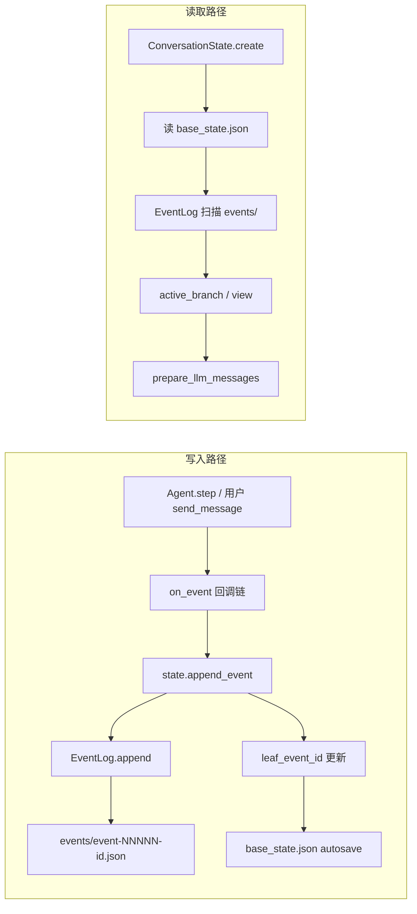
```mermaid
flowchart LR
    subgraph write["写入路径"]
        A[Agent.step / 用户 send_message] --> B[on_event 回调链]
        B --> C[state.append_event]
        C --> D[EventLog.append]
        D --> E["events/event-NNNNN-id.json"]
        C --> F["leaf_event_id 更新"]
        F --> G[base_state.json autosave]
    end

    subgraph read["读取路径"]
        H[ConversationState.create] --> I[读 base_state.json]
        I --> J[EventLog 扫描 events/]
        J --> K[active_branch / view]
        K --> L[prepare_llm_messages]
    end
```

- **event JSON**：事件溯源真相源；恢复对话、Fork、审计、Web UI 时间线
- **base_state.json**：快速恢复「当前 HEAD、Agent 配置、执行状态」；**不能**只靠它还原完整历史
- **observations/****：过大 Observation 正文（与单 event 文件分离时的落盘路径）

#### 3.5.4 什么时候用？

| 时机 | 是否落盘 |
|------|----------|
| 创建 `LocalConversation(..., persistence_dir=...)` | 立即写 `base_state.json` |
| 每次 `on_event`（Message / Action / Observation / Condensation…） | 写一条 event 文件 |
| `execution_status`、`agent` 等字段变更 | 更新 `base_state.json` |
| 未设 `persistence_dir` | `InMemoryFileStore`，**进程结束即丢失** |
| Resume 同一 `conversation_id` | 读已有 `base_state` + 扫描 `events/` |
| Remote `RemoteConversation` | 事件在 Agent Server 侧同样 file-backed，客户端 WebSocket 同步 |

#### 3.5.5 怎么写、怎么读（源码路径）

**写入**（`local_conversation.py` 默认回调）：

```python
def _default_callback(e):
  self._state.append_event(e)  # → EventLog.append → fs.write(target_path, payload)
```

`EventLog.append`（`event_store.py`）：

1. `flock` 获取 `events/.eventlog.lock`（超时 30s）
2. 与磁盘同步长度（多进程安全）
3. `target_path = events/event-{length:05d}-{evt_id}.json`
4. `event.model_dump_json(exclude_none=True)` 写入
5. 内存索引 `_idx_to_id` / `_id_to_idx` 更新

**读取**：

```python
conversation = LocalConversation(
    agent=agent,
    workspace=workspace,
    persistence_dir="/path/to/base",      # 实际目录 = base / conversation_id.hex
    conversation_id=existing_uuid,       # 与磁盘一致才能 resume
)
# ConversationState.create 自动：
#   file_store.read("base_state.json")
#   EventLog(fs, "events") → _scan_and_build_index()
```

按索引读：`state.events[i]` → 读对应 JSON → `Event.model_validate_json`
按分支读：`state.active_branch()` → `path_to_root(leaf_event_id)`
给 LLM：`state.view` → `prepare_llm_messages`

**源码位置**：

- `openhands/sdk/conversation/persistence_const.py` — 文件名模式
- `openhands/sdk/conversation/event_store.py` — `EventLog`
- `openhands/sdk/conversation/state.py` — `append_event`、`_save_base_state`
- `openhands/sdk/conversation/impl/local_conversation.py` — `_default_callback`
- `openhands/sdk/conversation/base.py` — `get_persistence_dir`

---

### 3.6 Forking 机制

**作用**: 创建对话的深拷贝，用于分支实验

```python
# Fork 当前对话
forked_conv = conversation.fork(
    conversation_id=new_uuid(),  # 新 ID
    title="Experiment Branch",   # 新标题
    reset_metrics=True,          # 重置 Metrics
)

# Fork 后的状态
assert forked_conv.id != conversation.id
assert len(forked_conv.state.events) == len(conversation.state.events)
assert forked_conv.state.execution_status == IDLE  # ← 重置为 IDLE

# 可以继续运行
forked_conv.run()  # 从 fork 点继续
```

**实现原理**：
```python
def fork(self, ...) -> BaseConversation:
    """深拷贝对话"""

    # Step 1: 复制所有事件
    forked_events = deepcopy(self._state.events)

    # Step 2: 创建新的 FileStore
    forked_store = FileStore(persistence_dir=new_dir)

    # Step 3: 写入事件到新目录
    for event in forked_events:
        forked_store.save_event(event)

    # Step 4: 创建新 Conversation
    return LocalConversation(
        agent=self.agent,
        workspace=self.workspace,
        persistence_dir=new_dir,
        conversation_id=new_id,
    )
```

**应用场景**：
- ✅ **A/B 测试** - 不同 Prompt/工具的对比
- ✅ **回滚** - 回到某个时间点重新尝试
- ✅ **协作** - 多人基于同一状态分支

---

### 3.6 loop 过程中 `send_message` 时序

> **源码**：`local_conversation.py` `send_message` L1705+、`run` L1800+、`arun` L1973+；`fifo_lock.py`；`agent/agent.py` `astep` L880+（`_released_state_lock_during_io`）。

#### 3.6.1 没有「消息 FIFO 队列」

文档里的 **FIFO** 指 **`FIFOLock`**（状态锁的公平排队），**不是**用户消息队列：

| 概念 | 实际实现 |
|------|----------|
| 用户消息存哪 | **EventLog** 上的 `MessageEvent`（`append_event`） |
| `run()` 如何「取消息」 | **不 dequeue**；每步 `agent.step()` 读 `state.view` → `prepare_llm_messages` |
| FIFO 含义 | 多线程抢 **`ConversationState` 锁** 时，先等到锁的线程先 `append` |

```text
send_message
  → with self._state（FIFOLock）
  → 可选 FINISHED/STUCK → IDLE
  → _on_event(MessageEvent) → append_event → EventLog + view
  → 返回（不调 LLM）

run() / arun()
  → while：agent.step() 从 view 投影 messages（含已 append 的用户消息）
```

与 Grok `pending_inputs`、Pi `followUp` 对比：SDK 用 **事件溯源** 代替显式消息队列；顺序 = **append 顺序**（抢锁顺序）+ 事件树上的 `parent_id` 链。

#### 3.6.2 锁窗口：`run()` 何时能插入 `send_message`

同步 **`run()`**：**一整圈 iteration 几乎全程持锁**（`with self._state` 内包含完整 `agent.step()` 与 iteration 后检查）。

| 阶段 | 同步 `run()` | `arun()` |
|------|--------------|----------|
| `step`：`prepare_llm_messages` | `send_message` **阻塞** | 阻塞 |
| `step`：等 LLM 网络 | **阻塞** | **可 `send_message`**（`_released_state_lock_during_io` 放锁） |
| `step`：执行工具 | **阻塞** | **阻塞**（锁仍持有） |
| 两圈 iteration 之间（`with` 结束） | **可 `send_message`** | **可 `send_message`** |

因此：**同步 `run` 只有 iteration 间隙**（及 `run` 完全结束后）能无阻塞插入；**`arun` 还多一个 LLM 等待窗口**。

#### 3.6.3 场景 A：`RUNNING` 中，两圈 iteration 之间

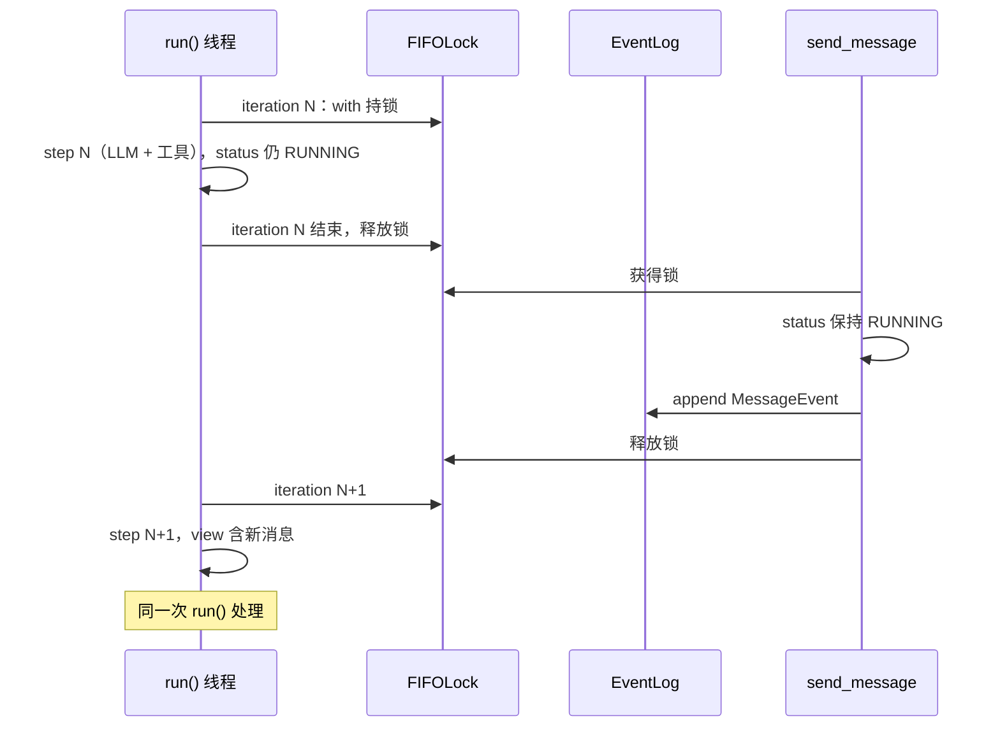
```mermaid
sequenceDiagram
    participant R as run() 线程
    participant L as FIFOLock
    participant EL as EventLog
    participant S as send_message

    R->>L: iteration N：with 持锁
    R->>R: step N（LLM + 工具），status 仍 RUNNING
    R->>L: iteration N 结束，释放锁

    S->>L: 获得锁
    S->>S: status 保持 RUNNING
    S->>EL: append MessageEvent
    S->>L: 释放锁

    R->>L: iteration N+1
    R->>R: step N+1，view 含新消息
    Note over R: 同一次 run() 处理
```

- 新消息 **立刻落盘**；**下一次 `step()`** 在 view 里可见。
- **同一次 `run()`** 即可处理，**不必**再调 `run()`（若外层尚未 break）。

#### 3.6.4 场景 B：同步 `run`，`step()` 执行期间

`send_message` **阻塞到当前 `step()` 结束**（整步持锁）。当前步在 `prepare_llm_messages` 之后 **不会再读** 新用户消息；新消息在 **下一圈 `step()`** 才进 LLM 上下文。

#### 3.6.5 场景 C：`arun()` 等 LLM 时

```text
prepare_llm_messages（已读完 view）
  → 放锁 → await LLM …
       ↑ send_message 可在此 append
  → 收锁 → 处理本次 completion（不含刚 append 的消息）
下一圈 step → 才看到新消息
```

**不会在当前这次 completion 半路插队**；只影响 **下一个 `step()`**。

#### 3.6.6 场景 D：`FINISHED` 后并发 `send_message`（不丢消息）

`run()` 在 `step` 设 `FINISHED` 后 **故意不在本圈 break**（L1903–1910），留出锁窗口：

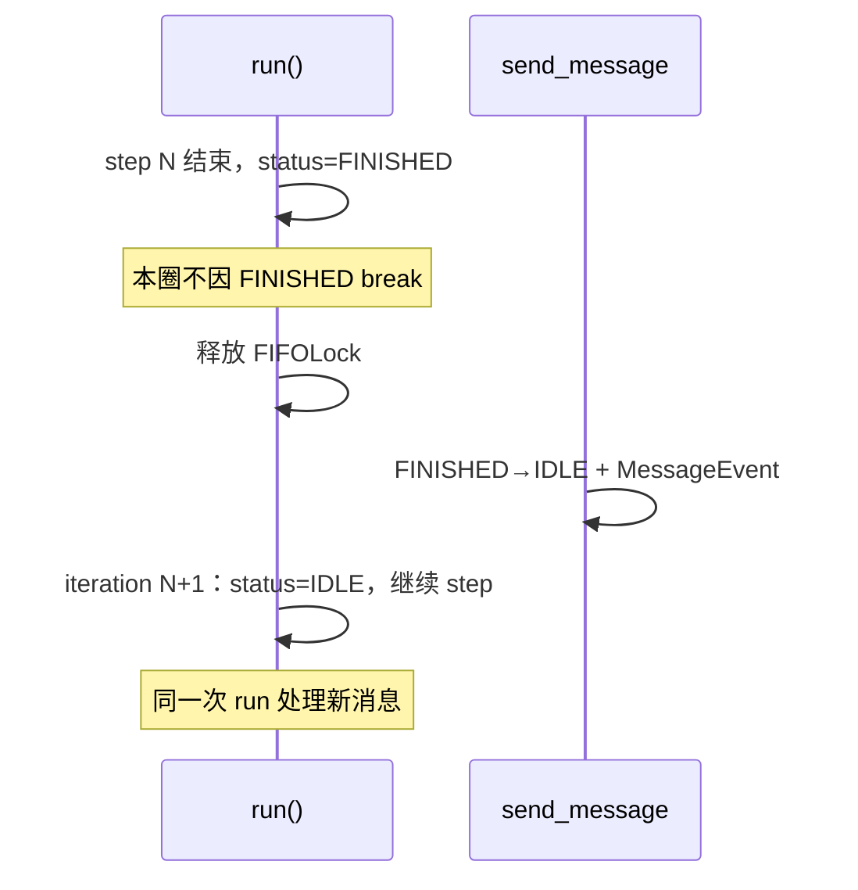
```mermaid
sequenceDiagram
    participant R as run()
    participant S as send_message

    R->>R: step N 结束，status=FINISHED
    Note over R: 本圈不因 FINISHED break
    R->>R: 释放 FIFOLock

    S->>S: FINISHED→IDLE + MessageEvent
    R->>R: iteration N+1：status=IDLE，继续 step
    Note over R: 同一次 run 处理新消息
```

`send_message` 仅将 **`FINISHED` / `STUCK`** 重置为 **`IDLE`**（L1730–1736）；**不会**把 `WAITING_FOR_CONFIRMATION` 改成 `IDLE`。

#### 3.6.7 场景 E：`WAITING_FOR_CONFIRMATION`

消息仍会 **append**；当前 `run()` 在 step 后常 **break**。新消息通常需 **确认后再 `run()`** 才会与 pending Action 的执行顺序一起推进。

#### 3.6.8 场景 F：长工具 / `delegate`

- 同步 `run`：`step` 持锁 → `send_message` 等到工具跑完（含子会话 `conversation.run()` 阻塞父 `step`）。
- `arun`：工具在 executor 中执行时 **仍持锁** → 同样阻塞（无 LLM 放锁窗口）。

#### 3.6.9 模型何时「看到」新消息（速查）

| 何时 `send_message` | 何时落盘 | 模型何时看到 | 是否同一 `run()` |
|---------------------|----------|--------------|------------------|
| iteration 之间 | 立刻 | 下一圈 `step` | 是 |
| 同步 `step` 执行中 | step 结束后 | 下一圈 `step` | 是 |
| `arun` 等 LLM 时 | 立刻 | 下一圈 `step` | 是 |
| `FINISHED` 后、下一圈 break 前 | 立刻，`IDLE` | 下一圈 `step` | 是（设计目标） |
| `run()` 已完全结束 | 立刻 | 需再 `run()` | 否 |
| `WAITING_FOR_CONFIRMATION` 后 break | 立刻 | 确认后再 `run()` | 通常否 |

**原则**：`send_message` = 记账；**不会在当前 `step` 已 `prepare_llm_messages` 之后半路改 LLM 输入**；总是 **下一次 `agent.step()`** 通过 view 投影。

#### 3.6.10 Agent Server 附加层（非消息队列）

`openhands-agent-server` 的 `event_service.send_message(run=True)`：若 run 任务仍在收尾，可能拒 `run()` 并设 `_rerun_requested`——消息 **已 append**，收尾后再 **自动再 `run()` 一次**（推迟 run 意图，不是 dequeue 消息 body）。见 `event_service.py` L702+、L1223+。

---

## 第4章：Tool 工具系统

### 4.1 Tool 架构

```python
class Tool(BaseModel):
    """工具定义"""

    name: str = Field(..., description="工具名称")
    description: str = Field(..., description="工具描述")
    parameters: dict = Field(..., description="JSON Schema 参数")
    executor: Callable[[Action, Conversation], Observation] | None = None

    def __call__(self, action: Action, conv: Conversation) -> Observation:
        """执行工具"""
        if not self.executor:
            raise NotImplementedError(f"Tool '{self.name}' has no executor")
        return self.executor(action, conv)
```

**关键组件**：
1. ✅ **Schema** - JSON Schema 定义参数结构
2. ✅ **Executor** - 实际执行逻辑
3. ✅ **Action/Observation** - 输入输出类型

---

### 4.2 内置工具示例

#### **Bash 工具**

**位置**: `openhands/tools/terminal/bash.py`

```python
class BashTool(Tool):
    name = "bash"
    description = "Execute bash commands in the terminal"
    parameters = {
        "type": "object",
        "properties": {
            "command": {"type": "string", "description": "The bash command to execute"}
        },
        "required": ["command"]
    }

    def executor(action: Action, conv: Conversation) -> Observation:
        cmd = action.command
        result = subprocess.run(cmd, shell=True, capture_output=True, text=True)

        return Observation(
            content=result.stdout,
            error=result.stderr if result.returncode != 0 else None,
            exit_code=result.returncode,
        )
```

**使用示例**：
```python
# LLM 生成的 Action
action = BashAction(command="ls -la /tmp")

# 执行
obs = bash_tool(action, conversation)
print(obs.content)  # 输出文件列表
```

---

#### **File Editor 工具**

**位置**: `openhands/tools/file_editor/file_editor.py`

```python
class FileEditorTool(Tool):
    name = "file_editor"
    description = "Edit files using various operations"
    parameters = {
        "type": "object",
        "properties": {
            "operation": {
                "type": "string",
                "enum": ["view", "create", "str_replace", "insert", "delete"]
            },
            "path": {"type": "string"},
            "content": {"type": "string"},
            # ... 其他参数
        }
    }

    def executor(action: Action, conv: Conversation) -> Observation:
        workspace = conv.workspace

        if action.operation == "view":
            content = workspace.read_file(action.path)
            return Observation(content=content)

        elif action.operation == "str_replace":
            workspace.str_replace(action.path, action.old_str, action.new_str)
            return Observation(content="Replacement successful")

        # ... 其他操作
```

**支持的操作**：
- ✅ `view` - 查看文件内容
- ✅ `create` - 创建新文件
- ✅ `str_replace` - 字符串替换
- ✅ `insert` - 插入文本
- ✅ `delete` - 删除文本

---

### 4.3 自定义工具

> **勘误**：旧示例用 `Tool` 子类 + `ToolSpec(type="custom")`——**当前 SDK 主路径是 `ToolDefinition` + `register_tool`**。完整模式见 [ARCHITECTURE_PART2.md §0](./ARCHITECTURE_PART2.md#第0章工具注册全景mcp--skills--内置工具) 与 `openhands-tools/*/definition.py`。

```python
from openhands.sdk.tool import ToolDefinition, register_tool
from openhands.sdk.tool import Tool  # Agent 配置用的 name+params 规格

class WeatherTool(ToolDefinition):
    @classmethod
    def create(cls, conv_state, **params):
        return [cls(name="get_weather", description="...", executor=...)]

register_tool("get_weather", WeatherTool)

agent = Agent(tools=[Tool(name="get_weather", params={})], llm=...)
```

也可用 **MCP Server** 暴露工具而无需写 `ToolDefinition`（§PART2 §6）。

---

### 4.4 工具安全机制

#### **安全分析器 (Security Analyzer)**

```python
from openhands.sdk.security import LLMSecurityAnalyzer

conversation = LocalConversation(
    agent=agent,
    workspace=workspace,
    security_analyzer=LLMSecurityAnalyzer(llm_config),  # ← 启用安全分析
)

# 每次执行 Action 前，LLM 评估风险
# → 高风险操作会被标记或阻止
```

**工作流程**：
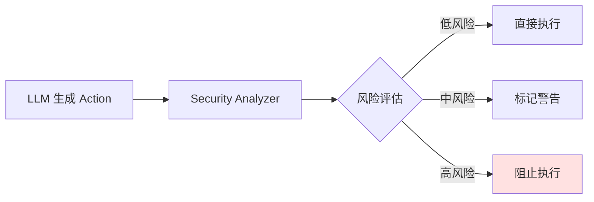
```mermaid
graph LR
    A[LLM 生成 Action] --> B[Security Analyzer]
    B --> C{风险评估}
    C -->|低风险| D[直接执行]
    C -->|中风险| E[标记警告]
    C -->|高风险| F[阻止执行]

    style F fill:#ffe1e1
```

**源码位置**: `openhands/sdk/security/analyzer.py`

---

#### **防御性深度 (Defense in Depth)**

多层安全策略：

1. ✅ **Confirmation Mode** - 用户确认
2. ✅ **Security Analyzer** - LLM 风险评估
3. ✅ **Tool-level Guards** - 工具级别的权限检查
4. ✅ **Sandbox Isolation** - 沙箱隔离执行

```python
# 综合使用
conversation = LocalConversation(
    agent=agent,
    workspace=workspace,
    confirmation_policy=SelectiveConfirmConfirmationPolicy(
        confirm_tools=["bash", "file_editor"],  # 这些工具需要确认
    ),
    security_analyzer=LLMSecurityAnalyzer(llm_config),
)
```

---

### 4.5 工具注册表

**位置**: `openhands/sdk/tool/registry.py`

全局 **工厂表**（不是 `Agent.tools_map`）：

```python
_REG: dict[str, Resolver] = {}  # name → (params, conv_state) → Sequence[ToolDefinition]

def register_tool(name: str, factory: ToolDefinition | type[ToolDefinition]) -> None:
    """import openhands-tools 时副作用注册；factory 须为实例或带 .create 的子类"""

def resolve_tool(tool_spec: Tool, conv_state: ConversationState) -> Sequence[ToolDefinition]:
    resolver = _REG[tool_spec.name]
    return resolver(tool_spec.params, conv_state)

def list_registered_tools() -> list[str]: ...
def list_usable_tools() -> list[str]: ...  # 注册且 is_usable() 通过
```

**三层不要混**（详见 [PART2 §0](./ARCHITECTURE_PART2.md#第0章工具注册全景mcp--skills--内置工具)）：

| 表 | 内容 | 何时填充 |
|----|------|----------|
| `_REG` | 名字 → 工厂 | `openhands-tools` import → `register_tool` |
| `Agent._tools` / `tools_map` | 名字 → 可执行 `ToolDefinition` | `_initialize` + `add_runtime_tools`（MCP） |
| MCP Server | 远端 `tools/list` | 连接后桥接为 `MCPToolDefinition` |

**旧 API 勘误**：不存在 `_TOOL_REGISTRY`、`get_tool_by_name()`；构造 `Agent(tools=[Tool(name, params)])` 时 **不会** 把工具写进 `_REG`——`_REG` 由工具包 import 时注册，`Agent` 只在初始化时 **resolve** 进 `tools_map`。

---

## 第5章：端到端流程与双循环（完整）

本章从**源码级**说明：用户消息如何进入 EventLog、外层 `run`/`arun` 与内层 `step`/`astep` 如何嵌套、每一步读写哪些存储、以及异步边界在哪里。

> **术语速查**：`step` / `turn` / `run` 对照表与整条 loop 图见 [§3.3.0](./ARCHITECTURE_PART1.md#330-术语stepturnrun-怎么对应)。

### 5.0 运行时架构总览

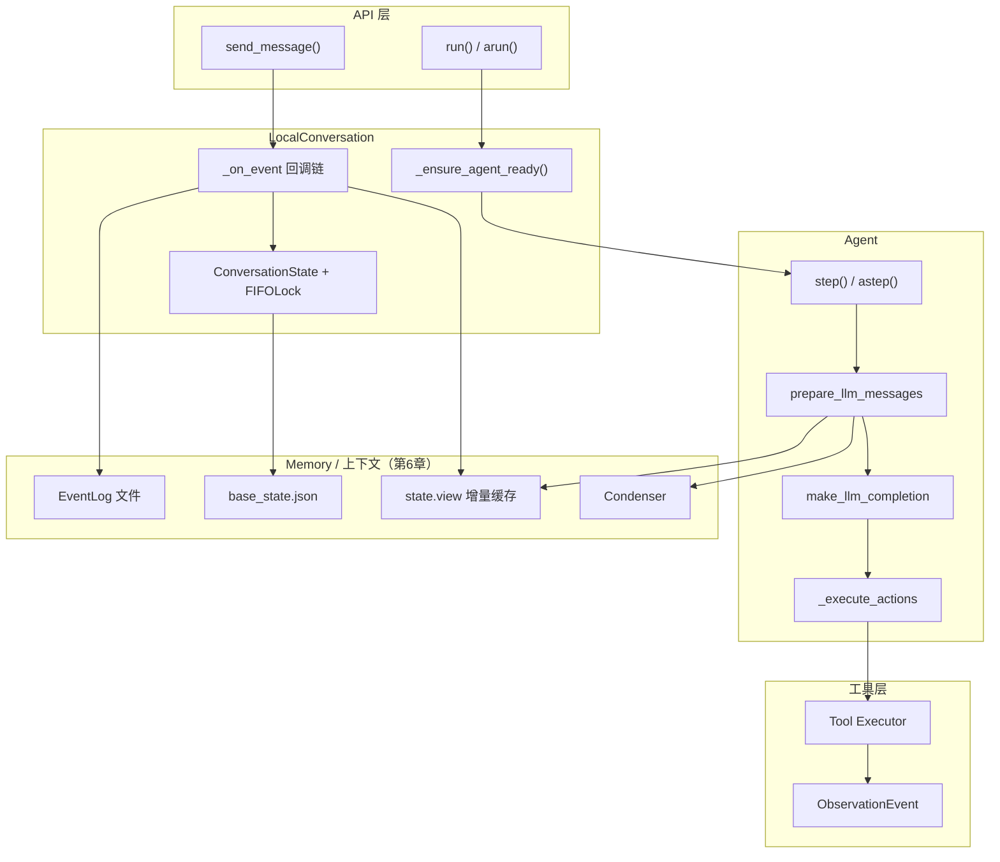
```mermaid
flowchart TB
    subgraph API["API 层"]
        SM["send_message()"]
        RUN["run() / arun()"]
    end

    subgraph Conv["LocalConversation"]
        EAR["_ensure_agent_ready()"]
        CB["_on_event 回调链"]
        ST["ConversationState + FIFOLock"]
    end

    subgraph Agent["Agent"]
        STEP["step() / astep()"]
        PREP["prepare_llm_messages"]
        LLM["make_llm_completion"]
        EXE["_execute_actions"]
    end

    subgraph Memory["Memory / 上下文（第6章）"]
        EVL["EventLog 文件"]
        BASE["base_state.json"]
        VIEW["state.view 增量缓存"]
        COND["Condenser"]
    end

    subgraph Tools["工具层"]
        TR["Tool Executor"]
        OBS["ObservationEvent"]
    end

    SM --> CB --> ST
    RUN --> EAR --> STEP
    STEP --> PREP --> VIEW
    PREP --> COND
    PREP --> LLM
    LLM --> EXE --> TR --> OBS
    CB --> EVL
    CB --> VIEW
    ST --> BASE
```

**核心设计原则**：

| 原则 | 实现 |
|------|------|
| 单一写入点 | `ConversationState.append_event()` 统一 stamp `parent_id`、推进 `leaf_event_id` |
| 事件即真相 | LLM 可见历史来自 Event → View → Message，不是可变 messages 数组 |
| 双层循环 | 外层控制「跑几轮」；内层控制「一轮 LLM + 工具批」 |
| 增量 View | 线性 append O(k)；分支切换才全量 `rebuild_view()` |
| 锁与 FIFO | **FIFOLock** 公平抢锁（**非**消息队列）；loop 中插入时序见 [§3.6](#36-loop-过程中-send_message-时序) |

**源码锚点**：`local_conversation.py`、`agent/agent.py`、`conversation/state.py`、`agent/utils.py`。

---

### 5.1 入口 API 与调用栈

| API | 同步/异步 | 典型调用栈 |
|-----|-----------|------------|
| `send_message(msg)` | 同步 | 构造 `MessageEvent` → `_on_event` → `append_event` → **写 event 文件** |
| `run()` | 同步 | `while` → `agent.step(self, on_event)` |
| `arun()` | async | `while` → `await agent.astep(...)`；LLM 用 `amake_llm_completion` |
| `run_goal(conv, objective, judge_llm)` | 同步驱动 | `send_message` → `run()` 循环 + `GoalController.on_run_finished`（第7章） |
| Agent Server | async task | 包装同一 `LocalConversation.arun()` |

`send_message` **不会**自动 `run()`；CLI / Server 在入队消息后显式调 `run()`/`arun()`。  
**loop 中并发 `send_message`**：无消息队列，靠 FIFOLock + EventLog；完整时序见 [§3.6](#36-loop-过程中-send_message-时序)。

---

### 5.2 完整 E2E 时序：用户消息 → 一次工具回合

以下假设：已 `_ensure_agent_ready()`、`persistence_dir` 已设、Confirmation 关闭、无 condense。

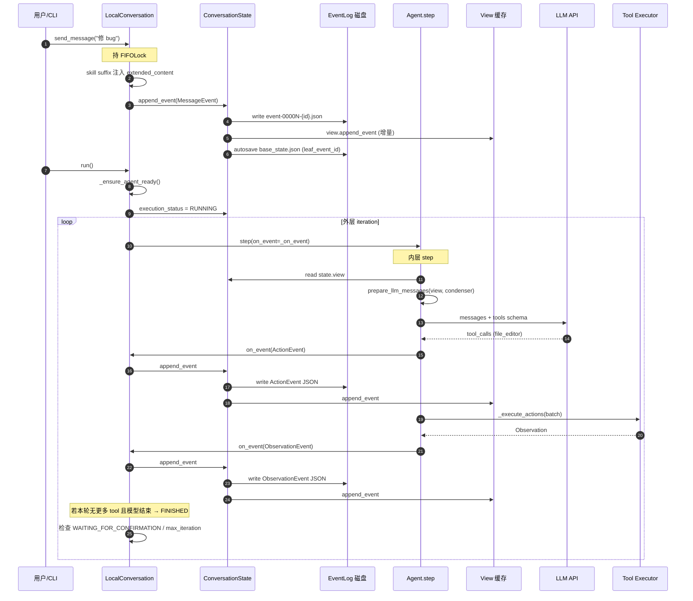
```mermaid
sequenceDiagram
    autonumber
    participant U as 用户/CLI
    participant LC as LocalConversation
    participant ST as ConversationState
    participant EV as EventLog 磁盘
    participant AG as Agent.step
    participant V as View 缓存
    participant LLM as LLM API
    participant TE as Tool Executor

  U->>LC: send_message("修 bug")
  Note over LC: 持 FIFOLock
  LC->>LC: skill suffix 注入 extended_content
  LC->>ST: append_event(MessageEvent)
  ST->>EV: write event-0000N-{id}.json
  ST->>V: view.append_event (增量)
  ST->>EV: autosave base_state.json (leaf_event_id)

  U->>LC: run()
  LC->>LC: _ensure_agent_ready()
  LC->>ST: execution_status = RUNNING

  loop 外层 iteration
    LC->>AG: step(on_event=_on_event)
    Note over AG: 内层 step
    AG->>ST: read state.view
    AG->>AG: prepare_llm_messages(view, condenser)
    AG->>LLM: messages + tools schema
    LLM-->>AG: tool_calls (file_editor)
    AG->>LC: on_event(ActionEvent)
    LC->>ST: append_event
    ST->>EV: write ActionEvent JSON
    ST->>V: append_event

    AG->>TE: _execute_actions(batch)
    TE-->>AG: Observation
    AG->>LC: on_event(ObservationEvent)
    LC->>ST: append_event
    ST->>EV: write ObservationEvent JSON
    ST->>V: append_event

    Note over LC: 若本轮无更多 tool 且模型结束 → FINISHED
    LC->>LC: 检查 WAITING_FOR_CONFIRMATION / max_iteration
  end
```

**一轮 `step()` 可能产生的 Event 序列**（正常 tool 回合）：

| 序号 | Event | 是否进入 View | 是否写磁盘 |
|------|-------|---------------|------------|
| 1 | `ActionEvent` | 是 | `events/event-…json` |
| 2 | `ObservationEvent` | 是 | 同上 |
| 0 | `Condensation`（若需压缩） | 触发 view 折叠 | 是；**本 step 不调 LLM** |
| 0 | `CondensationRequest` | 标记 `unhandled` | 是（由 agent 发出） |

---

### 5.3 外层循环 `run()` 逐步逻辑

源码：`local_conversation.py` `run()` L1791+。

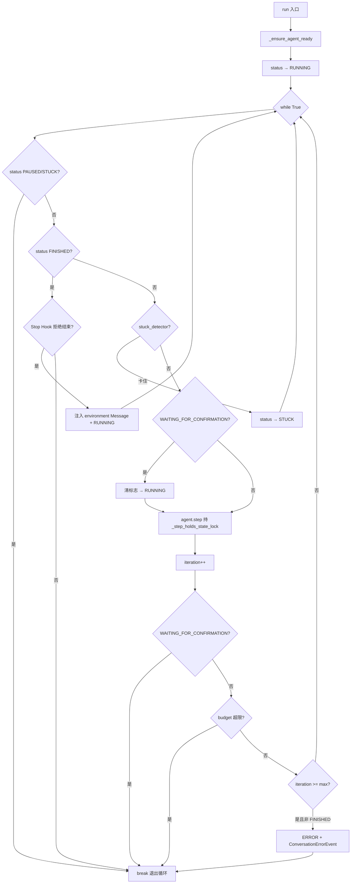
```mermaid
flowchart TD
    A[run 入口] --> B[_ensure_agent_ready]
    B --> C[status → RUNNING]
    C --> D{while True}
    D --> E{status PAUSED/STUCK?}
    E -->|是| Z[break 退出循环]
    E -->|否| F{status FINISHED?}
    F -->|是| G{Stop Hook 拒绝结束?}
    G -->|是| H[注入 environment Message + RUNNING]
    H --> D
    G -->|否| Z
    F -->|否| I{stuck_detector?}
    I -->|卡住| J[status → STUCK] --> D
    I -->|否| K{WAITING_FOR_CONFIRMATION?}
    K -->|是| L[清标志 → RUNNING]
    K -->|否| M
    L --> M[agent.step 持 _step_holds_state_lock]
    M --> N[iteration++]
    N --> O{WAITING_FOR_CONFIRMATION?}
    O -->|是| Z
    O -->|否| P{budget 超限?}
    P -->|是| Z
    P -->|否| Q{iteration >= max?}
    Q -->|是且非 FINISHED| R[ERROR + ConversationErrorEvent]
    R --> Z
    Q -->|否| D
```

**要点**：

1. **FINISHED 不立即 break**：允许并发 `send_message` 把 status 改回 `IDLE`，下一轮继续处理新消息（L1893–1900）。
2. **Stop Hook**：Agent 想结束时，Hook 可注入 feedback 并强制 `RUNNING` 继续。
3. **`max_iteration_per_run`**：只限制**外层 iteration 次数**（每 iteration 一次 `step`），不是 LLM token 数。

---

### 5.4 内层 `Agent.step()` 完整时序

源码：`agent/agent.py` `step()` L612+。

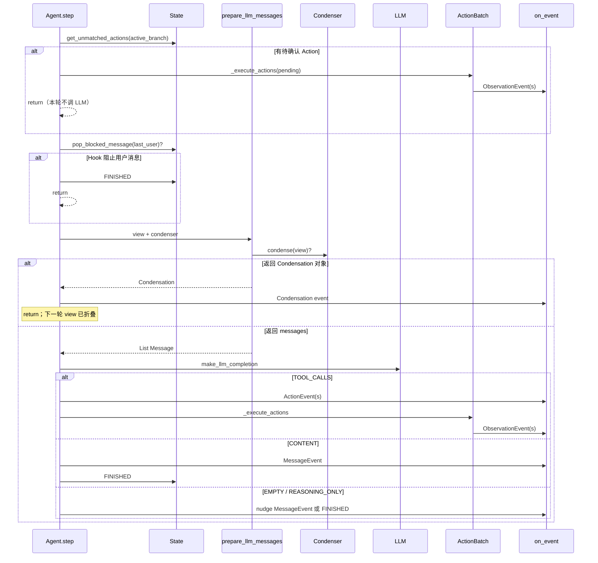
```mermaid
sequenceDiagram
    participant S as Agent.step
    participant ST as State
    participant P as prepare_llm_messages
    participant C as Condenser
    participant LLM as LLM
    participant B as ActionBatch
    participant O as on_event

    S->>ST: get_unmatched_actions(active_branch)
    alt 有待确认 Action
        S->>B: _execute_actions(pending)
        B->>O: ObservationEvent(s)
        S-->>S: return（本轮不调 LLM）
    end

    S->>ST: pop_blocked_message(last_user)?
    alt Hook 阻止用户消息
        S->>ST: FINISHED
        S-->>S: return
    end

    S->>P: view + condenser
    P->>C: condense(view)?
    alt 返回 Condensation 对象
        P-->>S: Condensation
        S->>O: Condensation event
        Note over S: return；下一轮 view 已折叠
    else 返回 messages
        P-->>S: List Message
        S->>LLM: make_llm_completion
        alt TOOL_CALLS
            S->>O: ActionEvent(s)
            S->>B: _execute_actions
            B->>O: ObservationEvent(s)
        else CONTENT
            S->>O: MessageEvent
            S->>ST: FINISHED
        else EMPTY / REASONING_ONLY
            S->>O: nudge MessageEvent 或 FINISHED
        end
    end
```

**错误恢复路径**（同 step 内）：

| 异常 | 处理 |
|------|------|
| `FunctionCallValidationError` | 注入 user MessageEvent 说明 malformed call，return |
| `LLMContentPolicyViolationError` | 注入 user nudge，return |
| `LLMContextWindowExceedError` | `on_event(CondensationRequest())`，return |
| `LLMMalformedConversationHistoryError` | `rebuild_view()` + `CondensationRequest()` |

---

### 5.5 `arun()` 异步边界详解

| 阶段 | `run()` | `arun()` |
|------|---------|----------|
| Agent 初始化 | 同步 `_ensure_agent_ready()` | `await asyncio.to_thread(_ensure_agent_ready)` |
| 单轮执行 | `agent.step()` | `await agent.astep()` |
| LLM 调用 | `make_llm_completion` | `amake_llm_completion` |
| 工具执行 | 同步或线程池 | `await _aexecute_actions`（工具间有 await 边界） |
| 状态锁 | step 期间持锁 | **整段 astep await 期间持 FIFOLock** |
| LLM 等待 | 阻塞线程 | `_released_state_lock_during_io` 可在网络等待时**释放锁** |
| 取消 | `CancellationToken` | 同上 + `InterruptEvent`；未匹配 Observation 补 `AgentErrorEvent` |

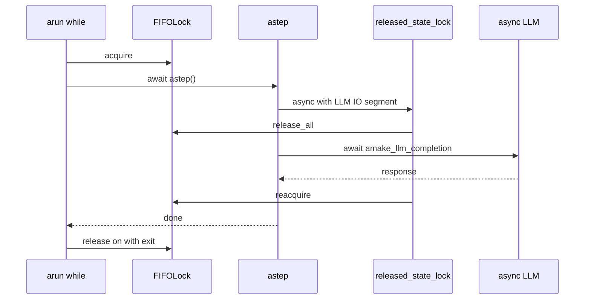
```mermaid
sequenceDiagram
    participant ARun as arun while
    participant Lock as FIFOLock
    participant AST as astep
    participant IO as released_state_lock
    participant LLM as async LLM

    ARun->>Lock: acquire
    ARun->>AST: await astep()
    AST->>IO: async with LLM IO segment
    IO->>Lock: release_all
    AST->>LLM: await amake_llm_completion
    LLM-->>AST: response
    IO->>Lock: reacquire
    AST-->>ARun: done
    ARun->>Lock: release on with exit
```

**Delegate 子会话**：子 Agent 在工具线程内调 **同步 `conversation.run()`**，父 `arun` 在子 run 完成前阻塞当前 `step`——子任务对父来说是**同步原子**操作。

---

### 5.6 `on_event` 回调链与持久化触发

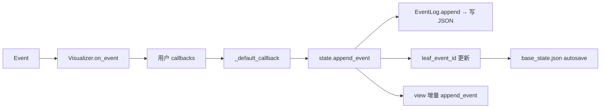
```mermaid
flowchart LR
    E[Event] --> VZ[Visualizer.on_event]
    VZ --> UCB[用户 callbacks]
    UCB --> DEF[_default_callback]
    DEF --> AE[state.append_event]
    AE --> EL[EventLog.append → 写 JSON]
    AE --> LEAF[leaf_event_id 更新]
    LEAF --> BS[base_state.json autosave]
    AE --> VAPP[view 增量 append_event]
```

包装顺序（`local_conversation.py` L388–396）：

```text
_on_event = _tree_stamping(_rules_injecting(compose([visualizer, user_cb, _default])))
```

- **`_tree_stamping`**：在 Hook 链之前/之后保证树结构一致
- **`_rules_injecting`**：注入 rules 相关逻辑
- **`_default_callback`**：`append_event` + 跟踪 `last_user_message_id`

**锁**：`send_message` 与 `run` 均在 `with self._state`（FIFOLock）内调用 `_on_event`；**同步 `run` 整圈 iteration 持锁**，故 `step` 期间另一线程 `send_message` 会阻塞。详见 [§3.6](#36-loop-过程中-send_message-时序)。

---

### 5.7 Confirmation Mode 两阶段

```mermaid
sequenceDiagram
    participant R as run iteration 1
    participant S as step
    participant P as Policy
    participant R2 as run iteration 2

    R->>S: step
    S->>P: ActionEvent 创建时评估
    P-->>S: 需确认 → pending，不执行
    S->>R: WAITING_FOR_CONFIRMATION
    R-->>R: break 外层循环

    Note over R2: 用户 confirm 或再次 run()
    R2->>S: step 开头 get_unmatched_actions
    S->>S: _execute_actions(pending) 不调 LLM
    S->>R2: 继续正常 step
```

---

### 5.8 `_ensure_agent_ready()` 与 SystemPrompt 时机

首次 `run()`/`send_message()`（视 Agent 类型）触发：

| 步骤 | 动作 | 存储影响 |
|------|------|----------|
| 1 | 加载 Plugins / MCP | 可能改 `agent.tools_map` |
| 2 | `load_project_skills` | 合并 skills 到 `AgentContext` |
| 3 | `load_memory(working_dir)` | 读 MEMORY.md → `memory_context`（第6章） |
| 4 | `agent.init_state(state, on_event)` | 若无 SystemPromptEvent → **emit + 写盘** |
| 5 | Hooks 注册 | 无直接存储 |

`init_state` 在**无**已有 `SystemPromptEvent` 时发出 `SystemPromptEvent`（含 static/dynamic system、tools schema 快照），成为 EventLog 中通常的 **index 0**。

---

## 第6章：Memory 体系与运行时 Message 变化

本章说明：**四层记忆如何分工、读写在何时发生、单轮对话 messages[] 如何变化**。

### 6.0 Memory 架构总图

> **实体关系 / 折叠 / Condensation JSON**：见合并附录 [CORE_RUNTIME_WALKTHROUGH.md](./CORE_RUNTIME_WALKTHROUGH.md)。

```mermaid
flowchart TB
    subgraph L0["L0 事件溯源 EventLog"]
        F1["events/event-00000-….json"]
        F2["events/event-00001-….json"]
        FN["… 每条 Event 一文件"]
    end

    subgraph L1["L1 分支与 View"]
        LEAF["leaf_event_id in base_state"]
        AB["active_branch()"]
        VIEW["state.view 增量缓存"]
    end

    subgraph L2["L2 Condensation 压缩"]
        CR["CondensationRequest"]
        CO["Condensation + summary"]
        LC["LLMSummarizingCondenser"]
    end

    subgraph L3["L3 长期 MEMORY.md"]
        UM["~/.openhands/memory/MEMORY.md"]
        PM["workspace/.openhands/memory/MEMORY.md"]
        MC["memory_context → dynamic prompt"]
    end

    subgraph LLM_IN["送入 LLM"]
        SP["SystemPromptEvent → system Message"]
        MSG["events_to_messages(history)"]
    end

    F1 --> AB
    F2 --> AB
    LEAF --> AB
    AB --> VIEW
    VIEW --> LC
    LC --> CO
    CO --> VIEW
    UM --> MC
    PM --> MC
    MC --> SP
    VIEW --> MSG
    SP --> LLM_IN
    MSG --> LLM_IN
```

---

### 6.1 存储层：读写路径详解
# ✅ 结论：OpenHands software-agent-sdk 新版确实有 **MEMORY.md 持久记忆沉淀机制（Persistent Memory，双分层文件记忆）**

>
> 文档入口：`docs.openhands.dev/sdk/guides/persistent-memory.md`（官方文档，不是代码仓库根目录 memory.md）
> 代码实现：`AgentContext(load_memory=True)` 开启，**默认关闭（opt-in）**，属于 SDK 原生内置持久记忆方案（区别于我们前面聊的外挂向量 RAG）GitHub

## 一、MEMORY.md 完整设计（两层文件记忆）

### 两层存储（都是 Markdown 文件沉淀）

1. **User 全局记忆（跨所有项目）**
   路径：`~/.openhands/memory/MEMORY.md`
   存放：用户全局偏好、通用规则（统一用 uv 管理 python 依赖、输出中文等）
2. **Project 项目记忆（当前仓库专属）**
   路径：`<workspace>/.openhands/memory/MEMORY.md`
   存放：本项目架构、技术选型、重要决策、构建命令、代码规范

>
> 配套辅助文件：`YYYY-MM-DD.md` 每日日志（详细笔记，**不会自动注入 prompt，agent 按需文件读取**）OpenHands

### MEMORY.md 作用规则

1. **会话启动阶段自动加载**
   读取两层 MEMORY.md，合并后包装成 `<MEMORY_CONTEXT>` 块注入系统提示词；
   总字符预算上限约 **6000 字符**，超限从**头部（最旧内容）截断**，保留头部截断提示。
2. **Agent 自行维护 MEMORY.md（依靠文件读写工具 FileEditorTool）**
   系统 prompt 内置记忆维护指引，指导 agent：
    - 任务收尾时，把长期有效结论写入 MEMORY.md（索引摘要）
    - 详细过程放到日期日志 YYYY-MM-DD.md
    - 去重、清理过期无效条目，精简索引
    - ❌ 禁止保存密钥、临时一次性信息（临时报错、单次命令输出）
3. 隔离区分
    - `AGENTS.md`：人类编写的静态项目规范（给所有 agent 的固定指引）
    - `MEMORY.md`：**Agent 运行后自己沉淀学习到的动态持久记忆**（跨会话复用）GitHub

### 安全设计

MEMORY.md 注入时外层包裹 `<UNTRUSTED_CONTENT>`，Agent 被提示：磁盘上的记忆文件可被人工修改，**仅作为参考，非权威指令，防 prompt 注入风险**OpenHands

## 二、完整生命周期（MEMORY.md 读写时序，和 Condenser 共存）

1. AgentContext 设置 `load_memory=True` 开启持久记忆
2. 新会话初始化：读取 user + project 两层 MEMORY.md → 组装 `<MEMORY_CONTEXT>` 注入系统 prompt
3. run step 前置：
   加载持久记忆（MEMORY.md） → 构建 View (full_events) → condenser 会话内摘要压缩（CondensationRequest/Condensation） → 组装完整 LLM messages
4. 任务收尾：Agent 判断存在长期有效结论 → 使用文件工具 write_file 更新 MEMORY.md/ 新增日志 md
5. 下一次全新会话：自动读取更新后的 MEMORY.md，实现跨会话记忆复用

>
> 分层记忆分工汇总
>
>
> 1. MEMORY.md（持久文件记忆）：跨会话、长期事实，原生文件方案（无向量库）
> 2. Condensation 会话摘要：单次会话超长上下文折叠（CondensationSummaryEvent）
> 3. full_events：本次会话完整原始事件回放日志（append-only）

## 三、MEMORY.md 示例内容

`.openhands/memory/MEMORY.md`

```
# 项目持久记忆
- Python 依赖统一使用 uv，不使用 pip / poetry
- API 分页使用 cursor 分页，不使用 offset
- 单元测试使用 pytest，测试文件放在 tests/ 目录
- 代码格式化工具：ruff + black
```

## 四、开启最小示例（官方原版）

```
agent_context = AgentContext(load_memory=True) # 开启MEMORY.md持久记忆
agent = Agent(
    llm=llm,
    agent_context=agent_context,
    tools=[TerminalTool, FileEditorTool]
)
```

完整可运行示例：`examples/01_standalone_sdk/55_persistent_memory.py`OpenHands

## 五、对比两种长期记忆方案（重点区分）

表格

| 方案 | 实现 | 优点 | 缺点 |
| --- | --- | --- | --- |
| 原生 MEMORY.md 持久记忆 | 文件 markdown，双分层索引 | SDK 原生、开箱即用、可人工编辑提交 git、无需向量库 | 没有语义检索，全量 6k 字符注入，容量受限，不支持向量召回 |
| 外挂 RAG 向量长期记忆 | 自定义 callback + 向量库 | 语义检索、按需召回、token 可控、大容量长期记忆 | 需要自行开发抽取 / 召回逻辑，不属于 SDK 原生 |

## 六、补充：常见误区

1. ❌ MEMORY.md 和 Condensation 压缩是同一个东西
   ✅ MEMORY.md：跨会话持久文件记忆；Condensation：**单次会话内部长上下文摘要折叠**，二者配合使用
2. ❌ MEMORY.md 会自动写入 full_events
   ✅ 文件写入属于沙盒文件操作（FileEditorTool → ActionEvent/ObservationEvent 记录到 full_events）；MEMORY.md 本体是磁盘文件，不是 SDK 内置事件
3. ❌ 开启 load_memory 之后自动抽取记忆
   ✅ 只是开启加载逻辑；**写入维护 MEMORY.md 由 Agent 自主调用文件工具完成**，依靠系统 prompt 指引，不是底层自动抽取

如果你需要，我可以整理：

1. MEMORY.md 机制对应的官方完整文档原文（persistent-memory.md）
2. 设计取舍：为什么官方优先实现 MEMORY.md 文件记忆，而不是内置向量 RAG
3. 扩展改造：MEMORY.md 如何升级为向量检索版本（混合方案）
#### 6.1.1 目录与文件职责

```text
{persistence_base}/{conversation_id.hex}/
├── base_state.json          # ConversationState 快照（无 events 正文）
├── events/
│   ├── .eventlog.lock       # append 互斥锁
│   └── event-{idx:05d}-{uuid}.json
└── observations/            # 大 Observation 外置（可选）
```

#### 6.1.2 写入路径（每次 Event）

```mermaid
sequenceDiagram
    participant CB as on_event
    participant AE as append_event
    participant EL as EventLog.append
    participant FS as LocalFileStore
    participant BS as _save_base_state

    CB->>AE: stamp parent_id
    AE->>EL: append(event)
    EL->>EL: flock .eventlog.lock
    EL->>FS: write events/event-{n}-{id}.json
    EL->>EL: 更新 idx/id 索引
    AE->>AE: leaf_event_id = event.id
    AE->>BS: __setattr__ autosave
    BS->>FS: write base_state.json
```

**`EventLog.append` 关键逻辑**（`event_store.py`）：

- 路径：`events/event-{self._length:05d}-{evt_id}.json`
- 内容：`event.model_dump_json(exclude_none=True)`
- 并发：先 `_count_events_on_disk()` 同步多进程写入
- 读取：`__getitem__(i)` → `fs.read(path)` → `Event.model_validate_json`

#### 6.1.3 读取路径（冷启动 / Resume）

```mermaid
sequenceDiagram
    participant C as ConversationState.create
    participant FS as FileStore
    participant EL as EventLog
    participant RV as rebuild_view

    C->>FS: read base_state.json
    C->>C: model_validate → state 字段
    C->>EL: __init__ → _scan_and_build_index()
    EL->>FS: list(events/) 解析文件名建 idx↔id 映射
    C->>RV: rebuild_view()
    RV->>EL: path_to_root(leaf_event_id)
    RV->>RV: View.from_events + enforce_properties
```

**Resume 校验**：`agent.verify(persisted_agent, events=...)` 工具列表必须与历史一致。

#### 6.1.4 `base_state.json` 存什么、不存什么

| 存储 | 不存储 |
|------|--------|
| `id`, `execution_status`, `leaf_event_id` | Event 正文 |
| `agent` 配置快照 | View 缓存 |
| `workspace`, `max_iterations` | Condensation 摘要 |
| `conversation_stats`, `tags` | |
| `secret_registry`（可加密） | |
| `blocked_actions/messages` | |

`leaf_event_id` 变更会 autosave，但**不**触发 `_on_state_change` 广播（避免事件风暴）。

---

### 6.2 View 设计与增量更新

**View 是什么**：从 `active_branch` 投影出的 **LLM 可见事件列表**（`context/view/view.py`），外加 `unhandled_condensation_request` 标记。
**不是** EventLog 全量，**不是** API `messages[]`。关系走查见 [CORE_RUNTIME_WALKTHROUGH.md](./CORE_RUNTIME_WALKTHROUGH.md)。

#### 6.2.0 实体关系速记

```text
EventLog（磁盘全量） → active_branch（当前路径） → View（LLM 子集 + 压缩标记） → messages（API）
MEMORY.md（磁盘）   → SystemPrompt.dynamic → 通常在 View[0]，keep_first 保护
CondensationRequest → 只改 View 标记，不改 events 列表
Condensation        → 改 View.events，并写一条 Condensation JSON
CondensationSummary → 仅内存合成，无独立 event 文件
```

#### 6.2.1 `append_event` 语义

| 输入 Event | View 变化 |
|------------|-----------|
| `LLMConvertibleEvent` | `events.append` |
| `CondensationRequest` | `unhandled_condensation_request = True` |
| `Condensation` | `events = condensation.apply(events)`；清除 unhandled |
| 其他（`ConversationStateUpdateEvent` 等） | 跳过，不进 View |

#### 6.2.2 `state.view` 增量算法（`state.py` L336+）

```mermaid
flowchart TD
    A[读 state.view] --> B{leaf == cached _view_branch_leaf?}
    B -->|是| C[直接返回缓存 View]
    B -->|否| D{新 leaf 是旧 leaf 祖先?}
    D -->|是线性 append| E[只 replay tail O k]
    E --> F[view.append_event 每条]
    D -->|否分支切换| G[View.from_events 全分支 O n]
    G --> H[enforce_properties]
```

**触发全量 rebuild**：`rebuild_view()`、`navigate_to`、`fork`、malformed history 恢复。

---

### 6.3 Condensation 完整流程

#### 6.3.1 触发原因（`LLMSummarizingCondenser`）

| Reason | 条件 |
|--------|------|
| `REQUEST` | View 含未处理的 `CondensationRequest` |
| `TOKENS` | `get_total_token_count > max_tokens` |
| `EVENTS` | `len(view.events) > max_size`（默认 240） |

#### 6.3.2 压缩时序

```mermaid
sequenceDiagram
    participant S as step
    participant P as prepare_llm_messages
    participant C as Condenser
    participant SL as Condenser 独立 LLM
    participant O as on_event
    participant V as View

    S->>P: prepare_llm_messages(view, condenser)
    P->>C: condense(view, agent_llm)
    alt 需要压缩
        C->>C: 选 forgotten_event_ids（保留 keep_first 等）
        C->>SL: 摘要 forgotten events
        SL-->>C: summary text
        C-->>P: Condensation 对象
        P-->>S: Condensation（非 messages）
        S->>O: on_event(Condensation)
        Note over S: 本 step return，不调 Agent LLM
        O->>V: append_event → apply「折叠」View
        Note over V: 折叠=View 去掉 forgotten + 插摘要；磁盘不动
    else 窗口足够
        C-->>P: View 子集
        P->>P: events_to_messages
        P-->>S: List Message
    end
```

> **「折叠」**：改 View 列表，不删 Event 文件。详见 [CORE_RUNTIME_WALKTHROUGH.md 第一部分](./CORE_RUNTIME_WALKTHROUGH.md)。

**`Condensation` 事件字段**（`event/condenser.py`）：

- `forgotten_event_ids`：从 View 移除的 id 集
- `summary`：替换文本
- `summary_offset`：摘要插入位置
- 落盘：与其它 Event 相同，**单独一个 JSON 文件**

**Agent 侧主动请求**：`on_event(CondensationRequest())` → 下一轮 condense 见 `REQUEST`。

---

### 6.4 MEMORY.md：读写与注入

#### 6.4.1 读取（`context/memory.py`）

| 层级 | 路径 | 顺序 |
|------|------|------|
| User | `~/.openhands/memory/MEMORY.md` | 先读 |
| Project | `{workspace}/.openhands/memory/MEMORY.md` | 后读（模型注意力偏后段） |

- 预算：`MEMORY_CHAR_BUDGET = 6000` 字符
- 超限：从**顶部删整行**，保留 tier header + `[earlier memory truncated]`
- **不自动读** `YYYY-MM-DD.md` 日志（Agent 按需 `file_editor` 读）

#### 6.4.2 注入时机与路径

```mermaid
sequenceDiagram
    participant R as _ensure_agent_ready
    participant LM as load_memory
    participant AC as AgentContext
    participant IS as init_state
    participant SP as SystemPromptEvent

    R->>LM: load_memory(working_dir)
    LM-->>R: memory_context 字符串
    R->>AC: model_copy(memory_context=...)
    R->>IS: init_state
    IS->>IS: get_dynamic_context(state)
    Note over IS: AgentContext.memory_context 进入 dynamic tier
    IS->>SP: dynamic_context 块
    SP->>SP: on_event → 写 event 文件
```

`AgentContext.load_memory=True` 时启用；workspace 路径在 `AgentContext` 校验时未知，故**延迟到 Conversation 层**加载。

#### 6.4.3 写入（沉淀）

无后台自动写入。Agent 通过 `file_editor` **显式编辑** MEMORY.md；用户也可手工维护。

---

### 6.5 SystemPrompt、Skills 与 Event 的关系

| 内容 | 进入 LLM 的方式 | 是否进 EventLog |
|------|-----------------|-----------------|
| Static system | `SystemPromptEvent.system_prompt` | 是（首事件） |
| Dynamic（skills、memory、secrets） | `SystemPromptEvent.dynamic_context` 或 `MessageEvent.extended_content` | 是 |
| Per-turn skill 触发 | `send_message` → `extended_content` | 是（MessageEvent） |
| Skills 文件本体 | 不直接进 Event | 否（仅引用） |

`prepare_llm_messages` 最终调用 `LLMConvertibleEvent.events_to_messages(view.events)`，把 View 中事件转为 `Message[]`；SystemPrompt 通常作为 history 第一条 assistant/system 结构。

---

### 6.6 三轮对话 Message 变化示例

假设：无 condense；Round1 用户消息；Round2 tool；Round3 模型文本结束。

**磁盘 Event 序列**（idx）：

| idx | kind | 进入 View |
|-----|------|-----------|
| 0 | SystemPromptEvent | 是 |
| 1 | MessageEvent(user) | 是 |
| 2 | ActionEvent | 是 |
| 3 | ObservationEvent | 是 |
| 4 | MessageEvent(agent, 无 tool) | 是 |

**Round2 step 送入 LLM 的 messages 逻辑结构**：

```text
[system 来自 SystemPromptEvent]
[user: "修 bug"]
[assistant: tool_calls file_editor]
[tool: observation 内容]
```

**Round3**（模型直接回复）新增 idx 4，messages 追加 assistant 文本 → `execution_status = FINISHED`。

**若 Round2 前发生 Condensation**：

1. 写入 `Condensation` event（idx 2'）
2. View 移除 forgotten ids，插入 summary 片段
3. 下一轮 messages **变短**；旧细节仅保留在 summary 文本和**未删的 event 文件**中

---

### 6.7 冷启动 vs Resume 对照

| 阶段 | 冷启动 | Resume |
|------|--------|--------|
| base_state | 新建写入 | 读入 + 校验 id |
| events | 空目录 | 扫描 `event-*.json` |
| SystemPrompt | `init_state` 创建 | 已存在则跳过 |
| MEMORY.md | `_ensure_agent_ready` 读 | 若 agent 重载会再读 |
| View | 随 append 增长 | `rebuild_view()` 冷加载 |
| metrics | 新建 | **保留**累计值 |

---

### 6.8 这个 SDK 到底「特别」在哪？（为何不是普通 Agent 壳）

若只把它看成「调 LLM + 调工具」，确实像任何框架。它的设计重心在 **可恢复、可审计、可分支的长程软件工程会话**，压缩（Condensation）是这套设计的一环，而不是孤立功能。

| 能力 | 典型 LangChain Agent | Software Agent SDK |
|------|---------------------|-------------------|
| 历史存储 | 内存 `messages[]` 或单 JSON | **每条 Event 一个文件** + `parent_id` 事件树 |
| 给 LLM 的历史 | 往往直接删 messages | **View 投影**：磁盘全保留，仅 View「遗忘」 |
| 压缩记录 | 静默截断或 middleware 黑盒 | **`Condensation` 事件落盘**，可审计「忘了什么、摘要是什么」 |
| 压缩 LLM | 常与 Agent 共用 | **独立 `condenser.llm`**，metrics 分开计 |
| tool 配对 | 手工保证 | **`manipulation_indices`** 禁止拆开 tool_call/result |
| 长期记忆 | 向量库或 session | **`MEMORY.md` 文件** + system dynamic（与 Event 压缩**无关**） |
| 多 Agent | 多线程 messages | **子 `LocalConversation`** 独立 EventLog |
| 确认执行 | 少见 | **Action 级** `WAITING_FOR_CONFIRMATION` 两阶段 step |
| Fork | 少见 | 复制 events 目录 + 新 `leaf_event_id` |

**一句话**：EventLog 是「档案馆」，View 是「当期阅卷范围」，Condensation 是「阅卷范围缩小但档案馆不焚毁」；MEMORY.md 是「贴在卷子封面的备忘条」，不参与档案馆删减。

#### 6.8.1 适用场景：何时值得用这套 SDK

| 更适合本 SDK | 不太需要 / 可用更简单方案 |
|--------------|---------------------------|
| 长会话（数百轮 tool）、需 **resume / Fork** | 单次问答、无持久化 |
| 需审计「压缩忘了什么、摘要是什么」 | 可接受静默 `messages.pop(0)` |
| 软件工程工具链（bash/editor **大输出**） | 输出很短、几乎无 tool |
| Web UI 时间线、合规日志、事件溯源 | 纯原型 demo |
| 多 Agent **子 LocalConversation**、Action 级确认 | 单 Agent 脚本几十行搞定 |
| `/goal` 多轮 Judge、Delegate 并行派工 | 固定一两步流水线即可 |

---

### 6.9 Condensation 压缩：机制 + 对 Memory 的影响 + 完整实例

> **磁盘目录树 + 每条 Event 完整 JSON + 压缩前后 messages 对照** 见：[CORE_RUNTIME_WALKTHROUGH.md 第三部分](./CORE_RUNTIME_WALKTHROUGH.md)。

#### 6.9.0 `CondensationRequest` vs `Condensation` vs `CondensationSummaryEvent`

| 对象 | 阶段 | 落盘 `events/*.json` | 改 View | 调 Agent LLM | 调 Condenser LLM |
|------|------|----------------------|---------|--------------|------------------|
| **`CondensationRequest`** | **请求/标记** | 是 | 只设 `unhandled_condensation_request=True` | **否**（本 step return 或仅记账） | **否** |
| **`Condensation`** | **执行压缩** | 是 | `apply()` 折叠（忘 id + 插摘要） | **否**（本 step return） | **是**（`get_condensation` 内） |
| **`CondensationSummaryEvent`** | **LLM 可见摘要** | **否**（合成） | 插入 `view.events` | 下一轮 **是**（进 `messages[]`） | — |

**口诀**：`CondensationRequest` = 「该压了」的 **旗子**；`Condensation` = **压完了** 的 **墓碑 + 元数据**；`CondensationSummaryEvent` = 给模型看的 **摘要替身**（见 [§6.9.3](#693-压缩对三层-memory-的影响)）。

**何时只出现 `CondensationRequest`（尚未压缩）**

| 入口 | 代码 | 下一圈做什么 |
|------|------|--------------|
| Agent LLM **超窗** | `agent.py` `LLMContextWindowExceedError` → `on_event(CondensationRequest())` | 下一 `step`：`condense` 见 `REQUEST` → 产出 `Condensation` |
| Agent LLM **历史 malformed** | `LLMMalformedConversationHistoryError` → `rebuild_view()` + `CondensationRequest()` | 同上 |
| 用户/API **强制压缩** | `LocalConversation.condense()` → `CondensationRequest` + **一次** `agent.step()` | **同一次** `step` 内 `condense` 见 `REQUEST` → `Condensation` |

前提：`agent.condenser` 为 `LLMSummarizingCondenser`（`handles_condensation_requests() == True`）。无 condenser 时发 `CondensationRequest` **不会**自动压，超窗错误可能直接抛出。

**何时直接 `Condensation`（无先验 `CondensationRequest`）**

每步 `prepare_llm_messages` 都会调 `condenser.condense(view)`。若阈值已满足，**直接** `get_condensation` → 返回 `Condensation` 对象：

| Reason | 条件 | 软硬 |
|--------|------|------|
| `TOKENS` | token 数 > `max_tokens` | HARD |
| `EVENTS` | `len(view) > max_size` | SOFT |
| `REQUEST` | View 含未处理 `CondensationRequest` | HARD |

因此：**日常「到 240 条 event」或 token 超限** 时，常 **不经过** `CondensationRequest`，一步内直接 `Condensation`。

#### 6.9.0a 三路径总览

```mermaid
flowchart TB
    subgraph paths["谁触发压缩"]
        A["路径 A：阈值<br/>每 step prepare_llm_messages"]
        B["路径 B：错误恢复<br/>超窗 / malformed"]
        C["路径 C：手动<br/>conversation.condense()"]
    end

    A --> CD["condenser.condense(view)"]
    B --> CR["on_event(CondensationRequest)"]
    C --> CR2["CondensationRequest + agent.step()"]
    CR --> CD
    CR2 --> CD

    CD --> Q{condensation_requirement?}
    Q -->|否| VW["返回 View，正常调 Agent LLM"]
    Q -->|是| GC["get_condensation<br/>Condenser LLM 摘要"]
    GC --> CO["返回 Condensation"]
    CO --> OE["on_event(Condensation) 落盘"]
    OE --> AP["View.append_event → apply 折叠"]
    AP --> RET["本 step return<br/>不调 Agent LLM"]
    RET --> NEXT["下一 step：view 已短，调 Agent LLM"]
```

#### 6.9.0b 路径 B：先 `CondensationRequest`，再 `Condensation`（两步 step）

```mermaid
sequenceDiagram
    participant S1 as step N
    participant AL as Agent LLM
    participant O as on_event
    participant EV as EventLog
    participant V as View
    participant S2 as step N+1
    participant C as Condenser
    participant SL as Condenser LLM

    S1->>AL: make_llm_completion(messages)
    AL-->>S1: LLMContextWindowExceedError
  Note over S1: condenser.handles_condensation_requests()
    S1->>O: CondensationRequest
    O->>EV: event-…-req.json
    O->>V: unhandled_condensation_request=true
    Note over S1: return；本步不调 Agent LLM

    S2->>C: condense(view) 见 REQUEST
    C->>SL: summarizing_prompt
    SL-->>C: summary
    C-->>S2: Condensation
    S2->>O: Condensation
    O->>EV: event-…-cond.json
    O->>V: apply 折叠 + CondensationSummaryEvent
    Note over S2: return；本步仍不调 Agent LLM

    Note over S2: step N+2 才正常调 Agent LLM
```

#### 6.9.0c 路径 A：阈值触发（常无 `CondensationRequest`）

```mermaid
sequenceDiagram
    participant S as step N
    participant P as prepare_llm_messages
    participant C as Condenser
    participant SL as Condenser LLM
    participant O as on_event
    participant S2 as step N+1
    participant AL as Agent LLM

    S->>P: condense(view)
    Note over C: len(view)>max_size 或 tokens>max_tokens
    C->>SL: 摘要 forgotten 区间
    SL-->>C: summary
    P-->>S: Condensation（不是 messages）
    S->>O: Condensation
    Note over S: return

    S2->>AL: messages（含 CondensationSummaryEvent）
    AL-->>S2: tool_calls / 文本
```

#### 6.9.0d 检查点时机：仅在 `step` 入口，工具执行后不检查

**结论**：`condenser.condense()` **只**在 `prepare_llm_messages()` 内调用；而 `prepare_llm_messages()` **只**在每次 `agent.step()` 的 **前半段**（pending-action 分支之后、Agent LLM 之前）调用。**同一 `step` 内工具执行完毕后不会再做阈值检查，也不会再 condense。**

| 时机 | 是否调用 `condense()` | 说明 |
|------|----------------------|------|
| `step()` 入口 → `prepare_llm_messages` | **是** | 主检查点；可能直接返回 `Condensation` |
| 同一 `step` 内 Agent LLM 之后、工具执行后 | **否** | `_execute_actions` 只写 Action/Observation，不回调 condenser |
| `run()` 下一次 `step()` 入口 | **是** | 上一步新事件已进增量 `state.view`，此时才再次评估 |
| Confirmation pending 分支（先执行未确认工具） | **否** | 直接 `_execute_actions` 后 `return`，跳过 `prepare_llm_messages` |
| `step()` 末尾 LLM 超窗 / malformed | **否**（只发旗子） | `on_event(CondensationRequest())`；真正 `condense` 在 **下一 `step`** |
| `conversation.condense()` | **是**（同一次 `step`） | 发 `CondensationRequest` 后 **立即** `agent.step()` → 入口 `condense` 见 `REQUEST` |

**源码锚点**：

- `openhands/sdk/agent/agent.py` — `step()`：`prepare_llm_messages(state.view, condenser=…)` 在 pending / hook 检查 **之后**、`make_llm_completion` **之前**
- `openhands/sdk/agent/utils.py` — `prepare_llm_messages()`：`condenser.condense(view, agent_llm=llm)`

**单步内顺序**（无 pending、无压缩 return 的典型路径）：

```text
step 开始
  → prepare_llm_messages → condense?（仅此一处）
  → make_llm_completion（Agent LLM）
  → _handle_tool_calls → _execute_actions（写 Observation）
step 结束（不再 condense）
```

若本 step 刚产生的 Action/Observation 让 View 超过 `max_size` 或 token 上限：**要等到 `run()` 循环里的下一次 `step()` 入口** 才会触发压缩（路径 A 或 B）。

**与增量 View**：`state.view` 在每次 `on_event` 时增量更新；本 step 入口的 condenser 看到的是 **进入本 step 之前** 已落盘的事件集合（不含本 step 即将产生的 tool 结果）。

```mermaid
sequenceDiagram
    participant R as run loop
    participant S as step N
    participant P as prepare_llm_messages
    participant C as condenser
    participant AL as Agent LLM
    participant EX as _execute_actions
    participant S2 as step N+1

    R->>S: step()
    S->>P: condense(view) 唯一检查点
    alt 需要压缩
        P-->>S: Condensation
        Note over S: on_event + return
    else 不需要
        P-->>S: messages[]
        S->>AL: make_llm_completion
        AL-->>S: tool_calls
        S->>EX: 执行工具 → Observation
        Note over S: 不再 condense
    end

    R->>S2: step()
    Note over S2: view 已含上步 Observation
    S2->>P: condense(view) 再次检查
```

**易混点**：

- **不是**「每调一次工具就检查一次」；是 **每 `step` 一次**（且 pending 分支连这一次都会跳过）。
- `CondensationRequest` 是 **标记**；`condense()` 仍只在下一（或同一次手动 `condense()` 触发的）`step` 入口执行。
- Condenser LLM（摘要生成）发生在 `get_condensation` 内，同样只在上述 `condense()` 调用链上，**不在**工具 executor 里。

#### 6.9.1 压缩在何时触发？

`LLMSummarizingCondenser`（默认 Rolling 实现）检查三类原因（`get_condensation_reasons`）：

| Reason | 条件 | 软硬 |
|--------|------|------|
| `REQUEST` | View 里存在未处理的 `CondensationRequest` | **HARD** |
| `TOKENS` | `get_total_token_count > max_tokens` | **HARD** |
| `EVENTS` | `len(view) > max_size`（默认 240） | **SOFT** |

Agent 在 **上下文超窗** 或 **历史 malformed** 时会 `on_event(CondensationRequest())`；下一轮 condense 看到 `unhandled_condensation_request` 即 `REQUEST`。

#### 6.9.2 压缩算法（选哪些 Event「遗忘」）

核心函数：`_get_forgotten_events(view)`（`llm_summarizing_condenser.py`）。

1. **永不动**：View 前 `keep_first` 条（默认 **2**，通常是 SystemPrompt + 首条用户消息）。
2. **算要保留的尾部条数** `events_from_tail`（取各 Reason 中最严的 `min`）：
   - `REQUEST`：`target = len(view)//2` → 保留约一半
   - `EVENTS`：`target = max_size//2`（默认 120）
   - `TOKENS`：算需砍掉多少 token，从尾部反推保留条数
3. **`manipulation_indices`**：在 `[keep_first, naive_end)` 区间按 **原子边界** 切（不拆开 tool_call 与 tool_result）。
4. 被切出的 `forgotten_events` 交给 **condenser 专用 LLM** + `summarizing_prompt.j2` 生成 `summary`。
5. 产出 `Condensation`：`forgotten_event_ids`、`summary`、`summary_offset`（摘要插入位置）。

**本 step 行为**（`agent.step`）：

```text
prepare_llm_messages → condenser 返回 Condensation（不是 messages）
→ on_event(Condensation) → append 写盘
→ step return，本轮不调 Agent LLM
```

下一轮 `view` 已折叠，再正常调 LLM。

#### 6.9.3 压缩对「三层 Memory」的影响

| 层 | 压缩后变化 | 说明 |
|----|------------|------|
| **L0 EventLog（磁盘）** | **不变 + 多 1 条** | 被忘的 `event-*.json` **全部仍在**；新增 `Condensation` 的 JSON |
| **L1 View（LLM 投影）** | **变短** | `forgotten_event_ids` 从 View 移除；插入 `CondensationSummaryEvent`（**不落独立文件**） |
| **L3 MEMORY.md** | **无影响** | 在 `SystemPromptEvent.dynamic_context`；除非 Agent 主动去改文件 |
| **base_state.json** | `leaf_event_id` 指向 Condensation | 元数据更新，不含摘要正文 |

**关键**：`CondensationSummaryEvent` 由 `Condensation.apply()` **运行时合成**（id=`{condensation.id}-summary`），**不会**作为单独 event 文件写入 `events/`。

`apply()` 逻辑（`event/condenser.py`）：

```python
output = [e for e in events if e.id not in forgotten_event_ids]
output.insert(summary_offset, summary_event)  # 合成摘要事件
```

#### 6.9.4 完整数字实例（7 条 View → 3 条 LLM 输入）

**场景**：修 auth bug；已 `view` 7 条；因超窗 Agent 发出 `CondensationRequest`；`keep_first=2`。

**压缩前 — View（= LLM 可见，index 0..6）**

| View idx | kind | id | 内容摘要 |
|----------|------|-----|----------|
| 0 | SystemPromptEvent | `s0` | system + tools + dynamic（含 MEMORY.md） |
| 1 | MessageEvent | `u1` | user: 「修 auth 登录 bug」 |
| 2 | ActionEvent | `a2` | file_editor view `auth/login.py` |
| 3 | ObservationEvent | `o3` | 文件 80 行源码 |
| 4 | ActionEvent | `a4` | bash `pytest tests/auth` |
| 5 | ObservationEvent | `o5` | pytest 失败栈 |
| 6 | ActionEvent | `a6` | file_editor str_replace（未执行完） |

**磁盘 EventLog（idx 0..6，7 个文件）** — 与 View 一一对应，另可能有 idx 7 的 `CondensationRequest`。

**触发压缩**（`REQUEST`，`len(view)=7`）：

```text
target_size = 7 // 2 = 3
suffix_events_to_keep = 3 - 2 - 1 = 0
events_from_tail = 0
naive_end = 7
forgetting_start = manipulation_indices.find_next(2) → 2
forgetting_end = manipulation_indices.find_next(7) → 7
forgotten = view[2:7]  →  a2, o3, a4, o5, a6  （5 条）
summary_offset = 2
```

**Condenser LLM**（非 Agent LLM）输入：5 条事件的 `str(event)` 拼接进 `summarizing_prompt.j2`。

**Condenser LLM 输出摘要示例**：

```text
用户要修 auth 登录 bug。已查看 auth/login.py：使用 session cookie。
运行 pytest tests/auth 失败：test_login_expired_session 断言 401 得 200。
Agent 正准备修改 login.py 的 session 校验逻辑。
```

**写入磁盘 — 新增 1 个文件** `event-00008-c0nd.json`：

```json
{
  "kind": "Condensation",
  "id": "c0nd-…",
  "source": "environment",
  "parent_id": "a6",
  "forgotten_event_ids": ["a2", "o3", "a4", "o5", "a6"],
  "summary": "用户要修 auth 登录 bug…",
  "summary_offset": 2,
  "llm_response_id": "resp-cond-…"
}
```

**旧文件 `event-00002-a2.json` … `event-00006-a6.json` 仍在**，审计/Fork 仍可读全文。

**压缩后 — View（LLM 下一轮可见）**

| View idx | kind | 来源 |
|----------|------|------|
| 0 | SystemPromptEvent | `s0`（保留） |
| 1 | MessageEvent | `u1`（保留） |
| 2 | CondensationSummaryEvent | **合成**，`to_llm_message()` → user 角色摘要文本 |
| （无 a2..a6） | — | 已从 View 移除 |

**压缩后 — 送入 Agent LLM 的 messages 逻辑结构**：

```text
[system: static + dynamic，dynamic 仍含 MEMORY.md 全文]
[user: 「修 auth 登录 bug」]
[user: 「用户要修 auth 登录 bug。已查看 auth/login.py…」]  ← 摘要顶替中间历史
```

**对 MEMORY.md 的影响**：`s0` 的 `dynamic_context` 在压缩时 **原样保留**（idx 0 在 `keep_first` 内）。磁盘 `~/.openhands/memory/MEMORY.md` **未改**。若 MEMORY 里写了「项目用 JWT」，压缩 **不会** 删掉这条——它在 system 块，不在 forgotten 区间。

#### 6.9.5 压缩全流程时序

```mermaid
sequenceDiagram
    participant S as step N
    participant C as LLMSummarizingCondenser
    participant SL as Condenser LLM
    participant O as on_event
    participant EV as EventLog
    participant V as View
    participant S2 as step N+1
    participant AL as Agent LLM

    S->>C: condense(view) 见 REQUEST
    C->>C: _get_forgotten_events → a2..a6
    C->>SL: summarizing_prompt + event strings
    SL-->>C: summary text
    C-->>S: Condensation 对象
    S->>O: Condensation（不调 Agent LLM）
    O->>EV: write event-00008-c0nd.json
    O->>V: append_event → apply「折叠」（只改 View）
    Note over S: step return

    S2->>V: state.view（3 条有效 LLM 事件）
    S2->>AL: messages（含摘要 user 块）
    AL-->>S2: 继续 tool_calls…
```

#### 6.9.6 压缩失败与兜底

| 情况 | 行为 |
|------|------|
| SOFT + `NoCondensationAvailableException` | 本步 **不压缩**，用原 View 调 LLM（可能超窗失败） |
| HARD + 摘要 LLM 失败 | `hard_context_reset`：截断 event 字符串重试，最多 5 次 |
| forgotten &lt; 10% view | 抛 `NoCondensationAvailableException`（防无效压缩） |
| tool 环占满 View | 可能 `forgotten` 为空，无法压缩 |

#### 6.9.7 与「删 messages」框架对比

```text
LangChain 式：messages.pop(0)  →  旧内容消失，无法 Fork 复盘
本 SDK：      View 遗忘        →  EventLog 全保留 + Condensation 记录「忘了啥」
              LLM 只看摘要     →  审计/UI 仍可打开 event-00003-o5.json 看原始 pytest 输出
```

---

## 第7章：多 Agent 模式与编排

### 7.0 三种多 Agent 机制对比

```mermaid
flowchart TB
    subgraph Delegate["Delegate 工具（模型驱动）"]
        PA[父 Agent LLM] -->|tool delegate| DE[DelegateExecutor]
        DE --> SA[子 LocalConversation]
    end

    subgraph Goal["Goal 编排（策略驱动）"]
        RG[run_goal] --> GC[GoalController]
        GC -->|judge_llm| JD[Judge LLM]
        GC -->|followup| PA2[父 Conversation.run]
    end

    subgraph Registry["Subagent 注册表（定义驱动）"]
        MD[".agents/agents/*.md"] --> GF[get_agent_factory]
        GF --> SA
    end
```

| 机制 | 谁决定派工 | I/O 边界 |
|------|------------|----------|
| Delegate | 父 LLM 调 `delegate` tool | 工具内 `send_message` + `run()` |
| Goal | Judge LLM 每轮审计 | `run_goal` 驱动 `send_message` + `run()` |
| Subagent 注册表 | 开发者定义 agent 类型 | `spawn` 时 `factory_func(llm)` |

---
# GoalController 完整说明（OpenHands software-agent-sdk）

>
> **定位：GoalController = 目标循环控制器（可选扩展组件，不属于基础 Agent 核心调度）**
> 作用：实现 **judge 裁判闭环**，让 Agent 反复执行直到独立裁判 LLM 判定目标真正完成，而不是 Agent 自己说做完就结束OpenHands

## ✅ 核心职责

1. **持有目标判定的循环启停逻辑**：保存 objective（终极目标）、max_iterations（最大审计轮次上限，防止死循环）、judge LLM
2. **每一轮 Agent.run () 结束后，调用独立 Judge LLM 做验收**：读取完整会话事件，判断目标是否真的完成，输出 verdict（是否完成、缺失内容、评分）
3. **决策继续 / 终止**
    - 裁判判定完成 → 终止循环，返回 GoalOutcome (complete)
    - 未完成且没到最大轮次 → 把缺失的要求作为补充提示，继续驱动 Agent 执行下一轮
    - 达到 max_iterations → 终止，返回 capped（轮次耗尽）
4. **封装 judge 调用入口 `on_run_finished()`**，负责执行裁判 LLM；**不处理网络 IO、不接管 Agent 内部 step 调度**（IO 和 Agent 运行交给外层 driver）OpenHands
5. 配套支持 goal 暂停、恢复（agent-server 后台长任务 `/goal` 命令底层实现）OpenHands

>
> 区分两组容易混淆的组件：
>
>
> 1. **Critic**：管控 **单次 agent.run () 内部** 的迭代微调（一轮里面反复优化）
> 2. **GoalController**：管控 **多次 run () 外层大循环**，独立裁判验收整体目标是否交付完成（多轮 run）OpenHands

## ✅ 和原有核心实体关系

1. **GoalController 不是替代 Agent**：Agent 依旧负责单次 run /step 推理、工具调用；GoalController 在 **Agent 外部套一层验收循环**
2. **依赖 Conversation（ConversationState + events）**：每轮结束读取完整事件流给 judge 评估
3. **独立持有 judge LLM**（和干活的 agent LLM 分离，方便独立计费、隔离判断偏见）
4. **属于可选扩展**：基础对话直接 `conversation.run()` 不需要 GoalController；只有 “可验证交付目标”（测试必须通过、代码交付验收）场景才启用

## ✅ 典型工作时序

```
1. GoalController 初始化：objective、judge_llm、max_iterations
2. 外层 driver：conversation.run() → Agent 完成一轮执行
3. GoalController.on_run_finished(events)
    └─ 调用 judge_goal 裁判LLM审核完整对话
4. 如果 GoalContinue：发送缺失反馈 → 再次 run()
5. 如果 GoalDone：停止循环，返回最终 GoalOutcome
```

## ✅ 关键边界（重要避坑）

1. **GoalController 不会 fork / 新建独立会话**，所有目标、裁判反馈都写入原有会话的 events，和正常对话共用一套 ConversationState、事件流，会话可以正常持久化、续跑OpenHands
2. **GoalController 本身不是持久化主实体**：goal 的运行状态（迭代数、objective）会通过 `ConversationStateUpdateEvent` 写入会话事件，会话恢复时重建 GoalController
3. **不介入 View、Condenser、压缩流程**：上下文压缩依旧走原有 View / Condensation 链路

## ✅ 一句话总结

**Agent 负责一轮一轮干活；GoalController 在外面增加独立裁判验收循环，驱动 Agent 反复迭代，直到第三方 Judge LLM 确认整体目标交付完成或者达到最大轮次上限。**

## 补充：放入之前的 Mermaid 类图的简易关系

```
GoalController["GoalController 目标循环控制器<br/>外层judge验收循环驱动"]
GoalController o-- LLM : judge_llm（独立裁判模型）
GoalController o-- Conversation : 读取事件做验收
GoalController -- Agent : 外部驱动Agent多次run
```

### 7.1 Subagent 注册表

**路径**：`openhands/sdk/subagent/`

Markdown frontmatter 字段：`name`、`description`、`tools`、`max_iteration_per_run`、`hooks`、`confirmation_policy` 等。

**优先级**（高→低）：

1. `register_agent_factory()` 程序化
2. Plugin 内置
3. `{workspace}/.agents/agents/`
4. 用户目录 `~/.openhands/agents/`
5. SDK builtins

`get_agent_factory(name)` → `AgentFactory`（`factory_func` + `AgentDefinition`）。

---

### 7.2 Delegate：`spawn` 完整时序

```mermaid
sequenceDiagram
    participant PL as 父 step
    participant DE as DelegateExecutor
    participant GF as get_agent_factory
    participant SC as Sub LocalConversation
    participant EV as 子 events/

    PL->>DE: ActionEvent delegate spawn ids=[researcher]
    DE->>GF: factory_func(sub_llm)
    GF-->>DE: worker Agent
    DE->>SC: LocalConversation(agent, workspace, persistence=subagents/)
    DE->>SC: 继承 confirmation_policy
    DE-->>PL: DelegateObservation 成功
    Note over SC: 子会话尚未 run
```

持久化：`{parent_persistence}/subagents/{agent_id}/events/…`

限制：`max_children` 防 spawn 过多。

---

### 7.3 Delegate：`delegate` 并行任务时序，已经被TaskToolSet 工具替代

```mermaid
sequenceDiagram
    participant DE as DelegateExecutor
    participant T1 as Thread researcher
    participant T2 as Thread coder
    participant SR as SubConv researcher
    participant SC as SubConv coder
    participant PL as 父 Conversation

    DE->>T1: start run_task
    DE->>T2: start run_task
    par 并行
        T1->>SR: send_message(task, sender=parent_name)
        T1->>SR: run() 直到 FINISHED
        SR-->>T1: final_response
    and
        T2->>SC: send_message(task)
        T2->>SC: run()
        SC-->>T2: final_response
    end
    T1-->>DE: results
    T2-->>DE: results
    DE->>PL: 合并 metrics → parent_stats
    DE-->>PL: DelegateObservation 全文
    Note over PL: 父 step 结束；下一轮 step 父 LLM 才看到 observation
```

**阻塞语义**：父 Agent 当前 `step` 在 `delegate` 工具内阻塞，直到所有子线程 `join()`。

---

### 7.4 GoalController + `run_goal` 完整时序

```mermaid
sequenceDiagram
    participant U as 用户/CLI
    participant RG as run_goal
    participant GC as GoalController
    participant C as LocalConversation
    participant A as Agent.run 外层
    participant J as judge_goal LLM

    U->>RG: objective + judge_llm
    RG->>GC: GoalController(objective)
    RG->>C: send_message(GC.start())
    loop 每轮 audit
        RG->>C: run()
        C->>A: while step…
        A-->>C: FINISHED / terminal
        RG->>GC: on_run_finished(state.events)
        GC->>J: judge_goal(objective, events)
        J-->>GC: GoalVerdict score/complete/missing
        alt GoalDone complete/capped
            GC-->>RG: GoalOutcome
            RG-->>U: return
        else GoalContinue
            GC-->>RG: followup 文本
            RG->>C: send_message(followup)
        end
    end
```

**与 Critic 区别**（`goal/runner.py` 注释）：

- **Critic**：在**单次 `run()` 内部**评估
- **Goal**：在 **`run()` 之间**驱动多轮，与已有 Critic **可叠加**

Agent Server 异步版：同样 `GoalController`，I/O 在 `event_service` 任务中 `send_message(step.followup, run=False)` 再 `arun()`。

---

### 7.5 并发 `send_message` 与 `run()`

完整时序（锁窗口、各 `execution_status`、同步/`arun` 差异、模型何时看到新消息）见 **[§3.6 loop 过程中 `send_message` 时序](#36-loop-过程中-send_message-时序)**。

此处仅保留 **FINISHED 不立即 break** 的核心时序（`local_conversation.py` L1903–1910）：

```mermaid
sequenceDiagram
    participant R as run() 线程
    participant S as send_message 线程
    participant L as FIFOLock

    R->>L: iteration N：with 持锁，step 结束 status=FINISHED
    Note over R: 本圈不因 FINISHED break
    R->>L: 释放锁

    S->>L: send_message 获得锁
    S->>S: FINISHED→IDLE + MessageEvent
    S->>L: 释放

    R->>L: iteration N+1：status=IDLE，继续 step
    Note over R: 同一次 run() 处理新消息
```

无独立 `run_queue` / `message_queue`；Agent Server 的 `_rerun_requested` 是 **推迟再 `run()`**，见 §3.6.10。

---

### 7.6 选型表

| 场景 | 推荐 |
|------|------|
| 固定角色流水线 | Subagent 定义 + `spawn` + `delegate` |
| 目标直到 Judge 满意 | `run_goal` + Judge LLM |
| 单 Agent 复杂任务 | Plan preset + `task_tracker` |
| 人工逐步确认 | Confirmation，慎用并行 delegate |

---

## 第8章：Plan 模式详解

### 8.0 Plan 模式架构（非 runtime gate）

SDK **没有** Grok 式 `plan_mode` 硬开关。Plan 模式 = **Preset 换脑 + 工具权限收缩 + PLAN.md 工件**。

**也没有**「一次 Agent / 一次 `run()` 内先 Plan 再自动切 Coding 执行」的内置编排。官方与 demo 都是 **两段 Conversation**（Plan 会话写完 `PLAN.md` → 同 workspace 再开 Default 会话）。详见 [CORE_RUNTIME_WALKTHROUGH.md 第零部分](./CORE_RUNTIME_WALKTHROUGH.md#第零部分补充没有一次-run-先-plan-再执行)。

```mermaid
flowchart LR
    subgraph Planning["Planning Agent"]
        PP[PromptPreset.PLANNING]
        PS[PlanningSection 长文工作流]
        PFE[planning_file_editor]
        PLAN[".agents_tmp/PLAN.md"]
    end

    subgraph Execution["Coding Agent（切换后）"]
        DP[PromptPreset.DEFAULT]
        FE[file_editor + terminal]
        TT[task_tracker]
    end

    PP --> PS
    PFE --> PLAN
    PLAN -->|人工/流程切换| DP
    TT -->|勾选步骤| Execution
```

---

### 8.1 Preset 与 System Prompt 路由--官方提供了get_planning_agent

| 组件 | 路径 | 作用 |
|------|------|------|
| `PromptPreset.PLANNING` | `context/prompts/` | 选用 planning registry |
| `PlanningSection` | `sections/planning.py` | 单块 STATIC prompt（Phase1 理解 + Phase2 写 PLAN） |
| `system_prompt_planning.j2` | agent base 路由 | Jinja 模板入口 |

`AgentBase` 根据 `system_prompt_filename` / preset 构建 `static_system_message`；`init_state` 写入 `SystemPromptEvent`。

Planning prompt 强调：**用 glob/grep 探索、先澄清再规划、PLAN.md 写步骤**。

---

### 8.2 `planning_file_editor` 与 PLAN.md

**定义**：`openhands-tools/.../planning_file_editor/`

| 命令 | 权限 |
|------|------|
| `view` | 任意路径 |
| `create` / `str_replace` / `insert` / `undo_edit` | **仅** PLAN.md |

默认路径：`{workspace}/.agents_tmp/PLAN.md`（兼容根目录遗留 `PLAN.md`）。

初始化时带 **section 骨架**，Agent 填充内容而非从零建结构。

**存储**：PLAN.md 是**普通 workspace 文件**，**不**进 EventLog（除非 Agent 用 view 产生 Observation）。

---

### 8.3 `task_tracker` 工具

**定义**：`openhands-tools/.../task_tracker/`

- 运行时**结构化任务列表**（内存/工具 state），适合**执行阶段**逐步勾选
- Default profile 常与 `terminal`、`file_editor` 一起启用
- 与 PLAN.md 互补：PLAN = 人类可读大纲；task_tracker = Agent 执行 checklist

---

### 8.4 如何从 Plan「切换」到执行 Agent

SDK **没有**「同会话一键切成 Coding Agent」的 API。`switch_llm` / `switch_profile` **只换模型**，不换 tools / system prompt。

| 做法 | 换什么 | 适用 |
|------|--------|------|
| **新建 Conversation（推荐）** | 全新 `Agent`（Default preset + 写工具）+ 同 workspace | Plan → Execute |
| `switch_llm` / `switch_profile` | 仅 LLM | 同角色换模型 |
| Agent Server / Profile | 可按 profile 起新会话 | 产品层切换 |

推荐代码形态：  官方提供了get_planning_agent，需要自己组合调用而已

```python
# 1) Plan
plan_agent = get_planning_agent(llm)
plan_conv = LocalConversation(agent=plan_agent, workspace=ws, ...)
plan_conv.send_message("给登录模块做加固方案")
plan_conv.run()
# → 写出 .agents_tmp/PLAN.md

# 2) Execute：同 workspace，新 Agent + 新 Conversation
exec_agent = get_default_agent(llm)  # 或 enable_sub_agents=True 时用 get_default_tools(...)
exec_conv = LocalConversation(agent=exec_agent, workspace=ws, ...)
exec_conv.send_message(
    "按 .agents_tmp/PLAN.md 实现；先用 task_tracker 拆步骤。"
)
exec_conv.run()
```

同一 `working_dir` 才能读到 PLAN.md；EventLog **不共享**（两套会话、两套 events）。

---

### 8.5 完整时序：开启 Plan 模式 → 切换执行 Agent

```mermaid
sequenceDiagram
    autonumber
    participant App as 应用/CLI
    participant PA as get_planning_agent
    participant PC as Plan Conversation
    participant AGP as Planning Agent
    participant ELP as Plan EventLog
    participant VP as Plan View
    participant LLM as Agent LLM
    participant PFE as planning_file_editor
    participant PLAN as PLAN.md
    participant DA as get_default_agent
    participant EC as Exec Conversation
    participant AGE as Coding Agent
    participant FE as file_editor/terminal
    participant TT as task_tracker

    Note over App,PLAN: —— 阶段 A：开启 Plan ——
    App->>PA: get_planning_agent(llm)
    PA-->>App: Agent(tools=glob/grep/planning_file_editor,<br/>system_prompt_planning.j2)
    App->>PC: LocalConversation(plan_agent, workspace)
    App->>PC: send_message(需求)
    PC->>ELP: MessageEvent(user)
    App->>PC: run()

    PC->>AGP: _ensure_agent_ready → init_state
    AGP->>ELP: SystemPromptEvent(PlanningSection)
    ELP->>VP: append

    loop 每轮 agent.step 直到 FINISHED
        PC->>AGP: step()
        AGP->>VP: prepare_llm_messages(view)
        AGP->>LLM: completion(messages, planning tools)
        alt 探索
            LLM-->>AGP: tool_calls glob/grep/view
            AGP->>ELP: ActionEvent + ObservationEvent
        else 写计划
            LLM-->>AGP: tool_calls planning_file_editor
            AGP->>PFE: str_replace/create（仅 PLAN.md）
            PFE->>PLAN: 写入 .agents_tmp/PLAN.md
            AGP->>ELP: ActionEvent + ObservationEvent
        else 澄清/收尾
            LLM-->>AGP: 纯文本（问用户或说明计划就绪）
            AGP->>ELP: MessageEvent(agent)
            AGP->>PC: FINISHED
        end
    end

    Note over App,TT: —— 阶段 B：切换 Agent（新建会话，非 switch_llm）——
    App->>App: 可选：人工审阅 PLAN.md
    App->>DA: get_default_agent(llm)<br/>或 tools=get_default_tools(enable_sub_agents=True)
    DA-->>App: Agent(DEFAULT prompt + file_editor/terminal/…)
    App->>EC: LocalConversation(exec_agent, **同一 workspace**)
    App->>EC: send_message("按 PLAN.md 实现…")
    App->>EC: run()

    EC->>AGE: init_state → SystemPromptEvent(DEFAULT)
    loop 执行 step
        EC->>AGE: step()
        AGE->>LLM: completion(coding tools)
        alt 拆任务
            LLM-->>AGE: task_tracker
            AGE->>TT: 更新 checklist
        else 改代码/跑命令
            LLM-->>AGE: file_editor / terminal
            AGE->>FE: 写文件 / shell
            Note over FE,PLAN: 可 view PLAN.md 作参考
        end
    end
    EC-->>App: FINISHED
```

要点：

1. Plan 开法 = `get_planning_agent` + `LocalConversation` + `run`（无单独 `plan_mode=true` 旗）
2. 「切换」= **新 Conversation + Default Agent**，共享 workspace
3. `switch_profile` **不能**完成 Plan→Execute 角色切换

---

### 8.6 完整时序：执行 Agent + 子 Agent（`task` / TaskToolSet）完成任务

前置：`register_agent` / builtin 已进注册表；父 Agent 工具含 `TaskToolSet`（`enable_sub_agents=True`）。

```mermaid
sequenceDiagram
    autonumber
    participant U as 用户
    participant EC as 父 LocalConversation
    participant PAG as 父 Agent
    participant LLM as 父 LLM
    participant TT as task 工具<br/>TaskExecutor
    participant REG as Subagent 注册表
    participant SC as 子 LocalConversation
    participant SAG as 子 Agent
    participant SLLM as 子 LLM
    participant TOOL as 子工具<br/>terminal/file_editor…
    participant ELP as 父 EventLog
    participant ELS as 子 EventLog<br/>subagents/…

    U->>EC: send_message("按 PLAN.md 实现并测通")
    U->>EC: run()
    EC->>PAG: init_state（若需）
    Note over PAG: tools_map 含 task；<br/>description 已嵌入 get_factory_info()

    rect rgb(245,248,255)
        Note over EC,ELP: 父 Step 1 — 父模型决定委派
        EC->>PAG: step()
        PAG->>LLM: completion(messages, tools含task)
        LLM-->>PAG: tool_call task<br/>subagent_type=code-explorer<br/>prompt=摸清 auth 调用链…
        PAG->>ELP: ActionEvent(task)
        PAG->>TT: execute(TaskAction)
        TT->>REG: get_agent_factory("code-explorer")
        REG-->>TT: factory → worker Agent
        TT->>SC: LocalConversation(子Agent, 同 workspace,<br/>persistence=…/subagents/)
        TT->>SC: send_message(prompt) + run()

        loop 子会话多轮 step
            SC->>SAG: step()
            SAG->>SLLM: completion(子 tools)
            SLLM-->>SAG: tool_calls
            SAG->>TOOL: 执行
            SAG->>ELS: Action/Observation 文件
        end
        SC-->>TT: 最终文本结果
        TT-->>PAG: TaskObservation(result)
        PAG->>ELP: ObservationEvent(task 结果)
        Note over PAG: 本父 step 在 tool 内阻塞至子结束
    end

    rect rgb(245,255,245)
        Note over EC,ELP: 父 Step 2 — 父根据子结果继续（可再委派或自己改）
        EC->>PAG: step()
        PAG->>LLM: messages 含上一轮 tool 结果
        LLM-->>PAG: tool_call task<br/>subagent_type=bash-runner<br/>prompt=跑 pytest…
        PAG->>TT: 再起子会话（或 resume）
        TT->>SC: 新/续 LocalConversation
        SC-->>TT: 测试摘要
        PAG->>ELP: ObservationEvent
    end

    rect rgb(255,250,240)
        Note over EC,ELP: 父 Step 3 — 父自己收尾
        EC->>PAG: step()
        PAG->>LLM: completion
        LLM-->>PAG: file_editor / 纯文本答复
        PAG->>ELP: 事件
        PAG->>EC: FINISHED
    end
    EC-->>U: 完成
```

数据边界：

| | 父 | 子 |
|--|----|----|
| EventLog | 父 `events/`；只看到 **一条** task Observation | `…/subagents/{id}/events/` 完整子轨迹 |
| tools | 含 `task` + 自己的写工具 | 由 `AgentDefinition.tools` / 工厂决定 |
| 选型 | 父 LLM 填 `subagent_type`（对照工具 description 清单） | — |

---

### 8.7 Plan vs Confirmation vs Goal

| | Plan | Confirmation | Goal |
|---|------|--------------|------|
| 控制点 | Prompt + 工具写权限 | 每个 Action | 每轮 `run()` 后 Judge |
| 人类介入 | 审阅 PLAN.md | 确认/拒绝 Action | 设定 objective |
| 持久化工件 | PLAN.md 文件 | EventLog 中 pending Action | `GoalOutcome` |
| 自动化 | 中 | 低 | 高 |
| 「切换 Agent」 | **新 Conversation** | 同会话 | 同会话 |

---

## 总结

本文档深入分析了 Software Agent SDK 的核心架构（v2.3）：

✅ **第1章** - 项目概览与核心架构
✅ **第2章** - Agent 核心系统（初始化、工具解析）
✅ **第3章** - Conversation 会话管理（**§3.3 agent.step**、**§3.6 loop 中 send_message**、确认模式、**§3.5 一 Event 一文件**、Forking）
✅ **第4章** - Tool 工具系统（内置工具、自定义工具、安全机制）
✅ **第5章** - **端到端流程与双循环**（`run`/`arun`、`step`/`astep`、状态机、`on_event`）
✅ **第6章** - **Memory 体系**（EventLog、View、Condensation、MEMORY.md、**§6.8 差异化 §6.9 压缩实例**）
✅ **附录** - [CORE_RUNTIME_WALKTHROUGH.md](./CORE_RUNTIME_WALKTHROUGH.md)（折叠 / 实体 T0–T5 / Condensation JSON / 工具·MCP·切换；含「无一次 Plan→Execute」）
✅ **附录** - [SDK_RUNTIME_PROMPTS.md](./SDK_RUNTIME_PROMPTS.md)（Planning Prompt 中文）
✅ **附录** - [COMPRESSION_SCHEMES_COMPARISON.md](./COMPRESSION_SCHEMES_COMPARISON.md)（多项目压缩对比 + 中文 Prompt）
✅ **第7章** - **多 Agent 与编排**（Delegate、Subagent 注册表、GoalController、run_queue）
✅ **第8章** - **Plan 模式**（Planning preset、PLAN.md、`planning_file_editor`、`task_tracker`）

**关键洞察**：
1. ✅ **延迟初始化** - Agent 在首次 `run()` 时才初始化工具
2. ✅ **事件溯源** - 所有操作记录为 Event，支持恢复和 Fork
3. ✅ **双层循环** - `Conversation.run` 外层 + `Agent.step` 内层（一步 ≠ 一次用户请求）
4. ✅ **增量 View** - 避免每 step 重拼 system 模板；只做 events→messages 投影
5. ✅ **Condensation** - 上下文超窗时的官方压缩路径
6. ✅ **双层安全** - Confirmation Mode + Security Analyzer
7. ✅ **Plan 非 runtime gate** - 规划靠 preset + PLAN.md，非 Grok 式 plan_mode 闩
8. ✅ **灵活扩展** - Plugin 系统支持 Skills、MCP、Hooks、Subagent

**下一步**：
- 阅读 [ARCHITECTURE_PART2.md](./ARCHITECTURE_PART2.md)（§0 工具注册、MCP、Security、§8 包地图）
- 阅读 [ARCHITECTURE_PART3.md](./ARCHITECTURE_PART3.md)（Persistence、Observability、Testing）
- 阅读 [COMPRESSION_SCHEMES_COMPARISON.md](./COMPRESSION_SCHEMES_COMPARISON.md)
- 参考官方文档：https://docs.openhands.dev/sdk

---

**文档版本**: 2.3
**最后更新**: 2026-07-29
**维护者**: Deep Agents Team
