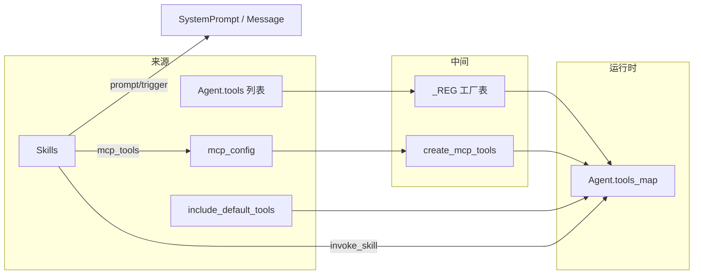
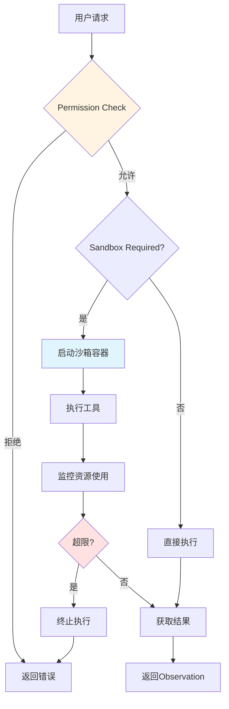
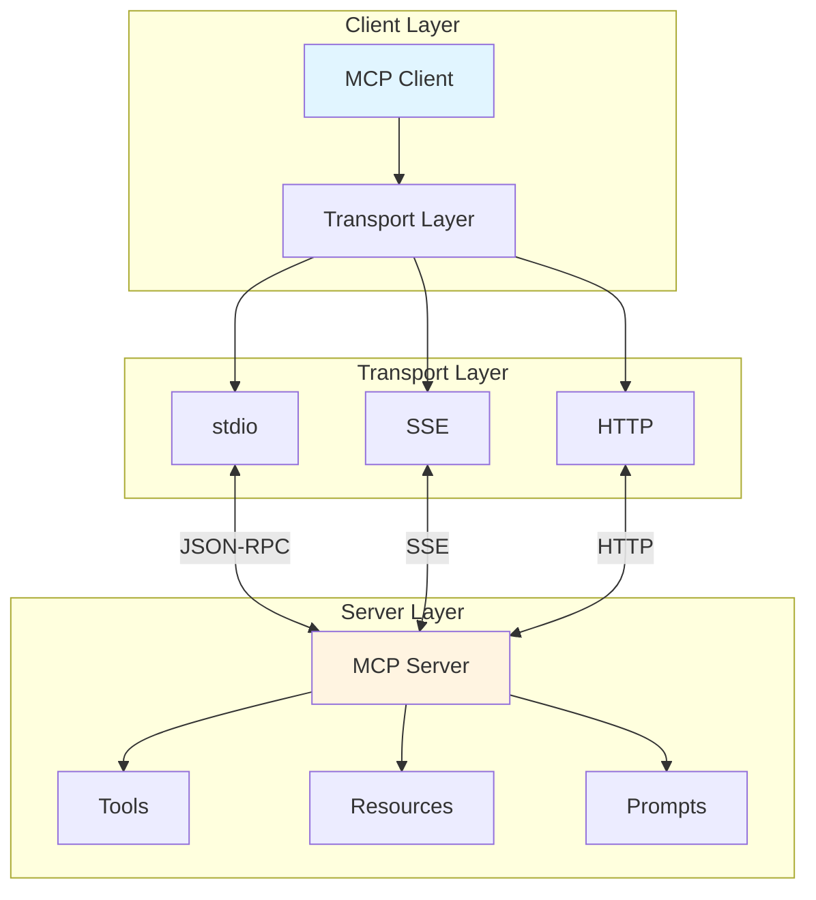
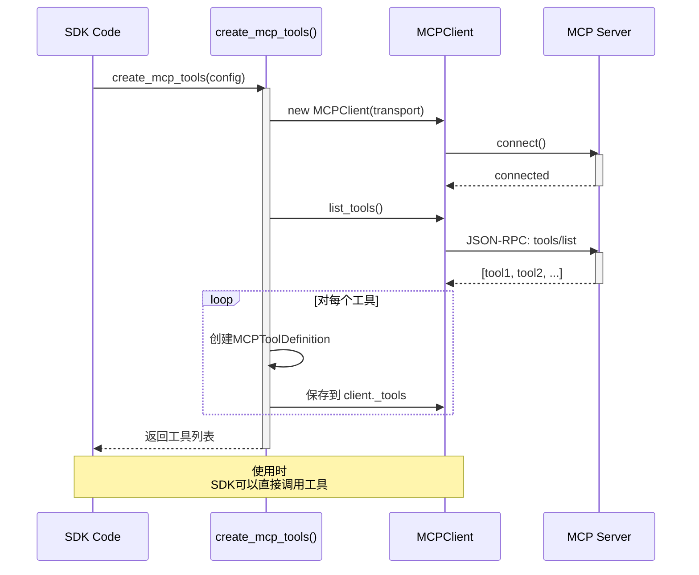
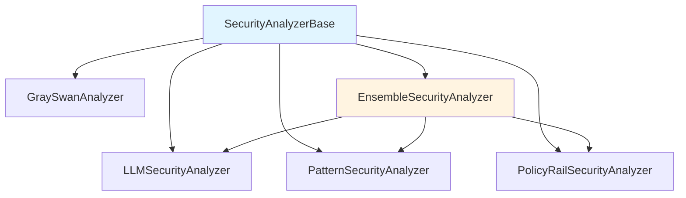
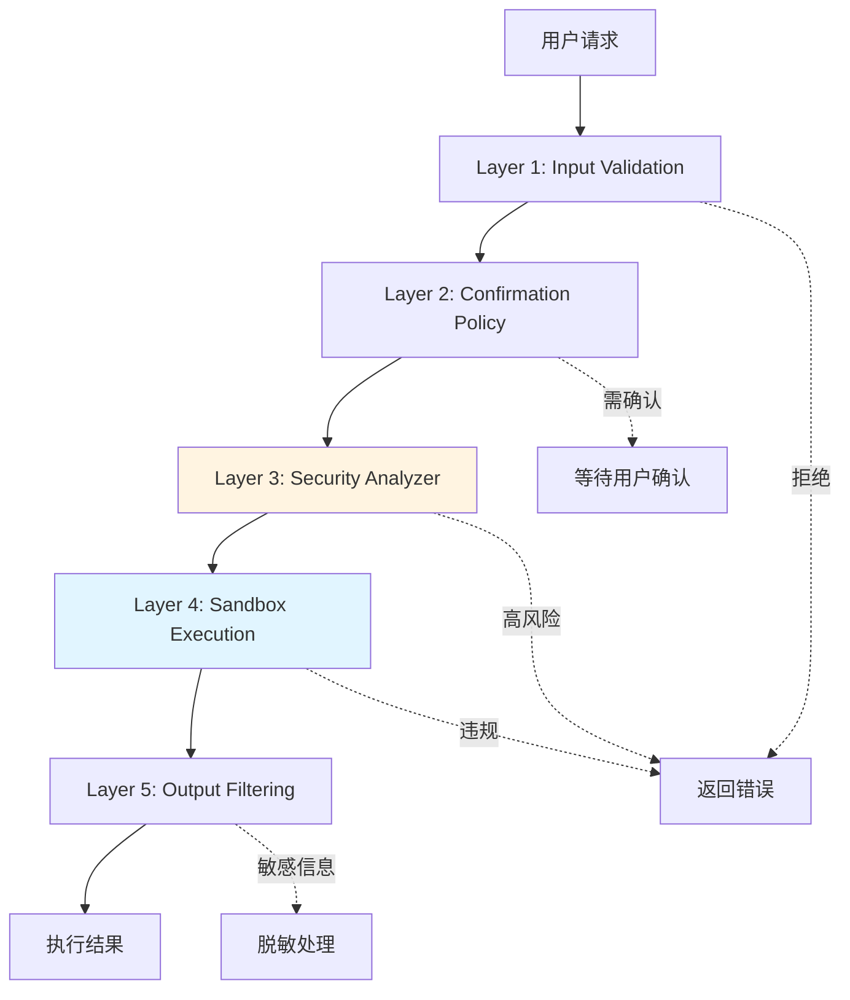
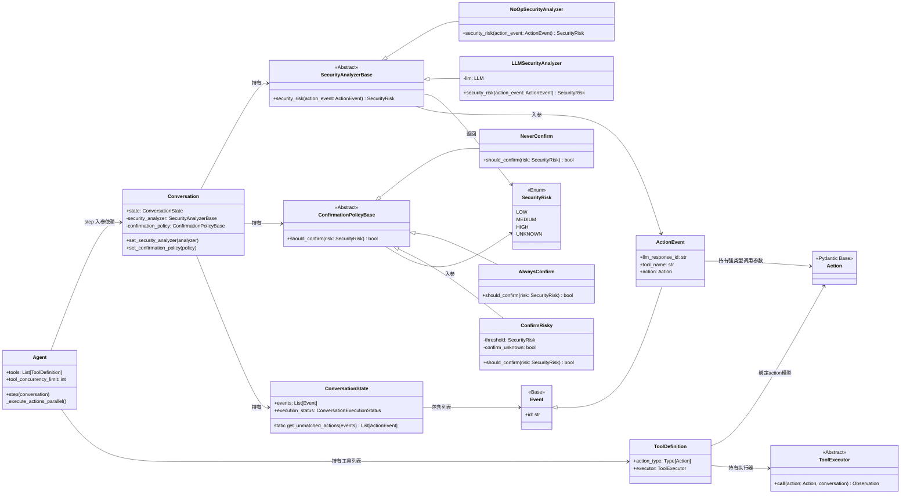
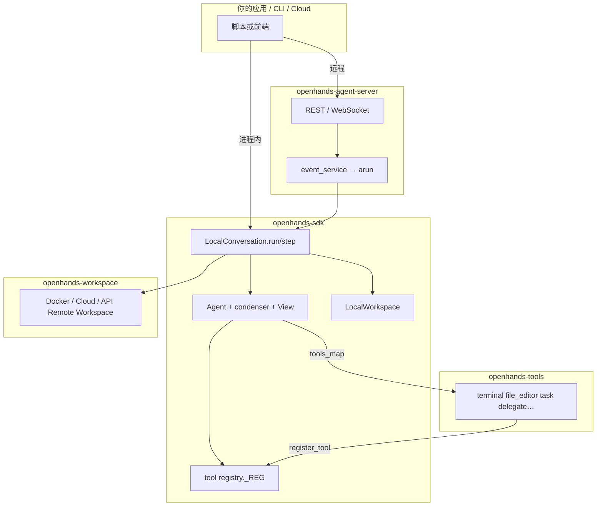
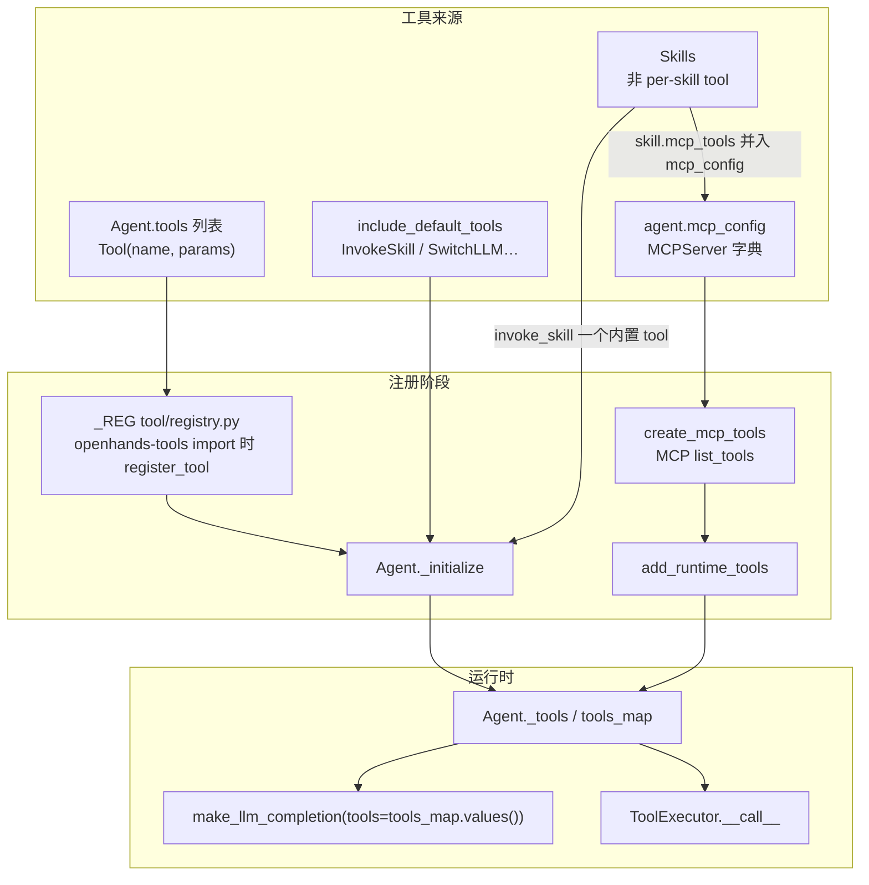
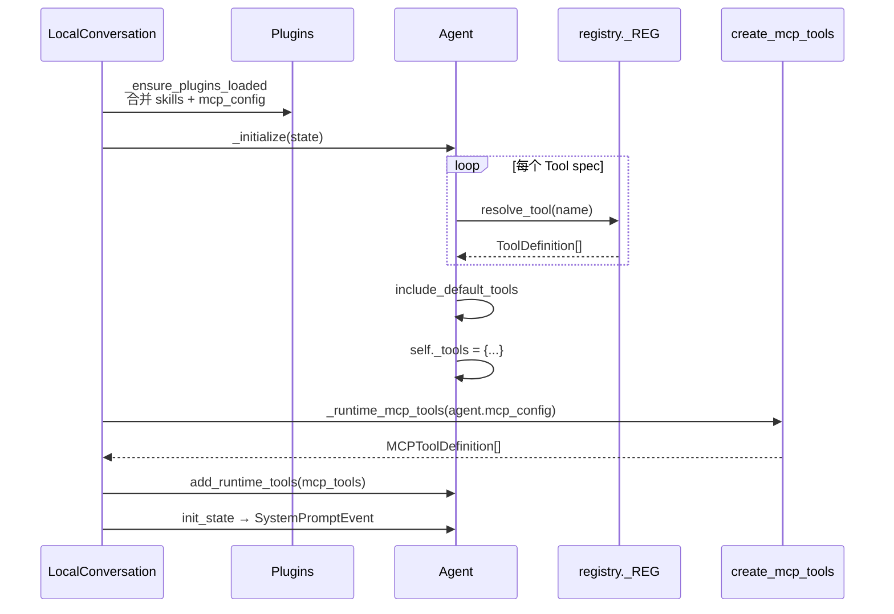

# Software Agent SDK 完整架构设计文档（第二部分）

> **版本**: 2.1（2026-08-05）  
> **分析时间**: 2026-05-17（初版）· 2026-07-28（§0 / §8、工具注册勘误）· 2026-08-05（§8 四包功能封装详解）  
> **分析方法**: 源码深度阅读 + 设计模式分析  
> **源码路径**: `/Users/gqli/work/deepagents/software-agent-sdk`（monorepo）

---

## 📋 目录

- [第0章：工具注册全景（MCP / Skills / 内置工具）](#第0章工具注册全景mcp--skills--内置工具) ⭐ **必读**
- [第5章：Tool 系统深度分析](#第5章tool-系统深度分析)（§5.1 为设计示意，非主实现）
- [第6章：MCP 集成原理](#第6章mcp-集成原理)
- [第7章：Security 安全架构](#第7章security-安全架构)
- [第8章：Monorepo 源码包与模块地图](#第8章monorepo-源码包与模块地图)（原 `PACKAGE_MODULES.md`）

---

## 第0章：工具注册全景（MCP / Skills / 内置工具）

> **一句话**：运行时只有一张表 — `Agent._tools`（`tools_map`）。MCP 列举的工具和内置工具都进这张表；Skills **通常不是**每个 Skill 一个 tool。

### 0.1 三层结构（不要混为一谈）

| 层级 | 位置 | 内容 | 谁消费 |
|------|------|------|--------|
| **全局工厂表** | `openhands.sdk.tool.registry._REG` | `tool_name → ToolDefinition.create` | `resolve_tool()` 在 Agent 初始化时 |
| **Agent 运行时表** | `Agent._tools` / `tools_map` | `tool_name → ToolDefinition`（可执行实例） | `make_llm_completion(tools=...)`、`ToolExecutor` |
| **MCP 远端** | MCP Server 进程 | 真实 `tools/list` 定义 | 经 `MCPToolDefinition` 桥接进 `tools_map` |

**MCP 发现的 tool 不会单独写进 `_REG`**；连接后生成 `MCPToolDefinition`，由 `add_runtime_tools()` 写入 `tools_map`。

### 0.2 内置工具（`openhands-tools`）

```text
openhands/tools/terminal/definition.py
  → register_tool("terminal", TerminalTool)     # import 时副作用
  → _REG["terminal"]

Agent.tools = [Tool(name="terminal"), Tool(name="file_editor"), ...]
  → Agent._initialize()
  → resolve_tool(spec, state) → ToolDefinition 实例
  → self._tools["terminal"] = ...
```

`register_default_tools()` / `get_default_tools()`（`openhands/tools/preset/default.py`）负责 import 并组装默认 `Tool` 列表，**不**替代 `Agent._tools`。

### 0.3 MCP 工具

```text
agent.mcp_config  # dict[str, MCPServer]
  ← Agent 配置、Plugin、Settings API、Skill 的 mcp_tools / .mcp.json

LocalConversation._ensure_agent_ready()
  → _runtime_mcp_tools_for_agent()
  → create_mcp_tools(mcp_config, on_tools_changed=agent._on_mcp_tools_changed)
  → list[MCPToolDefinition]
  → agent.add_runtime_tools(mcp_tools)   # 合并进 tools_map

MCP notifications/tools/list_changed
  → Agent._on_mcp_tools_changed()
  → 再次 add_runtime_tools（增删同名工具）
```

关键文件：

- `openhands/sdk/mcp/utils.py` — `create_mcp_tools`
- `openhands/sdk/conversation/impl/local_conversation.py` — `_runtime_mcp_tools*`、`_ensure_agent_ready`
- `openhands/sdk/agent/base.py` — `add_runtime_tools`、`tools_map`

### 0.4 Skills — 三种进入 Agent 的路径

| 路径 | 机制 | 是否在 `tools_map` |
|------|------|-------------------|
| **A. Prompt / 触发器** | `agent_context.skills` → system `<available_skills>`；或 trigger 匹配 → `MessageEvent.extended_content` | **否** |
| **B. invoke_skill** | 内置 `InvokeSkillTool`；模型显式调用后返回 Skill Markdown Observation | **是**（仅这一个 skill 相关 tool） |
| **C. Skill 自带 MCP** | Skill frontmatter / `.mcp.json` 合并进 `mcp_config` → 走 §0.3 | **是**（MCP 工具名，非 skill 名） |

**因此**：「skills 的 tool」≠ 每个 Skill 注册成独立 tool；多数是 **A**，需要读正文时用 **B**，需要 MCP 能力时用 **C**。

`InvokeSkillTool` 出现条件：`include_default_tools` 且存在可 invoke 的 AgentSkills-format skill；或 `_runtime_skill_tools_for_agent()` 在会话就绪阶段补充。

### 0.5 汇总图



### 0.6 与第 5 / 6 章关系

- **第 5 章** §5.1 的 `Toolkit` 类：**当前源码中不存在** `tool/_toolkit.py`，那段代码是 Composite 模式 **示意**；真实注册见本章。
- **第 6 章** 讲 MCP **协议与 Client**；工具如何进 LLM 见本章 §0.3。
- 完整包目录与初始化时序：本章 [第8章](#第8章monorepo-源码包与模块地图)

---

## 第5章：Tool 系统深度分析

> ⚠️ **阅读说明**：本章 §5.1–§5.4 部分示例（`Toolkit`、`SandboxedToolExecutor`）为设计模式示意，**非**当前主路径。运行时工具表以 **第 0 章** 与 `Agent.tools_map` 为准。

### 5.1 Toolkit 架构设计模式（示意 · 非主实现）

**示意位置**（源码中无 `openhands/sdk/tool/_toolkit.py`）：概念上类似 `Agent._tools` + `ToolExecutor`

#### **设计模式应用**

Toolkit 采用了 **Composite + Registry + Strategy** 组合模式：

```python
class Toolkit:
    """工具集合管理器 - Composite Pattern"""
    
    def __init__(
        self,
        tools: list[Tool] | None = None,
        tool_classes: list[type[Tool]] | None = None,
    ):
        # Registry Pattern - 工具注册表
        self._tools_map: dict[str, Tool] = {}
        
        # 支持两种初始化方式（Strategy Pattern）
        if tools:
            for tool in tools:
                self.register(tool)
        
        if tool_classes:
            for tool_class in tool_classes:
                self.register(tool_class())
    
    def register(self, tool: Tool) -> None:
        """注册工具 - 防止重复注册"""
        if tool.name in self._tools_map:
            logger.warning(f"Tool '{tool.name}' already registered, overwriting")
        
        self._tools_map[tool.name] = tool
        
        # 自动注入 summary 字段到 schema（透明度原则）
        self._enhance_tool_schema(tool)
    
    def execute(self, action: Action, conversation: Conversation) -> Observation:
        """执行工具 - Strategy Pattern"""
        tool = self._tools_map.get(action.tool_name)
        
        if not tool:
            raise KeyError(f"Tool '{action.tool_name}' not found")
        
        if not tool.executor:
            raise NotImplementedError(f"Tool '{action.tool_name}' has no executor")
        
        # 执行前钩子
        self._on_before_execute(tool, action)
        
        try:
            # 执行工具
            observation = tool.executor(action, conversation)
            
            # 执行后钩子
            self._on_after_execute(tool, action, observation)
            
            return observation
            
        except Exception as e:
            # 错误处理 - 统一包装
            return Observation(
                content="",
                error=f"Tool execution failed: {str(e)}",
                success=False,
            )
```

**设计模式解析**：

| 模式 | 应用场景 | 优势 |
|------|---------|------|
| **Composite** | 统一管理多个Tool | 批量操作、统一接口 |
| **Registry** | 工具名称 → Tool实例映射 | O(1)查找、防止重复 |
| **Strategy** | 不同工具的executor | 运行时切换、扩展性强 |
| **Template Method** | execute()中的钩子 | 固定流程、可变细节 |
| **Decorator** | _enhance_tool_schema() | 动态增强schema |

---

### 5.2 工具执行的并发控制

#### **并行工具执行机制**

**位置**: `openhands/sdk/conversation/impl/local_conversation.py:1100-1200`

```python
async def _execute_actions_parallel(
    self, actions: list[Action]
) -> list[Observation]:
    """并行执行多个独立工具调用"""
    
    # Step 1: 检测依赖关系
    dependency_graph = self._build_dependency_graph(actions)
    
    # Step 2: 拓扑排序确定执行顺序
    execution_order = topological_sort(dependency_graph)
    
    # Step 3: 分组并行执行（无依赖的工具可并行）
    observations = []
    
    for group in execution_order:
        if len(group) == 1:
            # 单个工具，直接执行
            obs = await self._execute_single(group[0])
            observations.append(obs)
        else:
            # 多个无依赖工具，并行执行
            tasks = [self._execute_single(action) for action in group]
            group_obs = await asyncio.gather(*tasks, return_exceptions=True)
            
            # 处理异常
            for obs_or_exc in group_obs:
                if isinstance(obs_or_exc, Exception):
                    observations.append(Observation(error=str(obs_or_exc)))
                else:
                    observations.append(obs_or_exc)
    
    return observations

def _build_dependency_graph(self, actions: list[Action]) -> dict[str, set[str]]:
    """构建工具依赖图"""
    graph = {action.id: set() for action in actions}
    
    for action in actions:
        # 分析参数中是否引用其他action的输出
        for param_value in action.parameters.values():
            if isinstance(param_value, str):
                # 检测引用格式: {{action_id.output}}
                matches = re.findall(r'\{\{(\w+)\.output\}\}', param_value)
                for ref_id in matches:
                    if ref_id in graph:
                        graph[action.id].add(ref_id)
    
    return graph
```

**性能优化策略**：

1. ✅ **依赖分析** - 自动检测工具间的输入输出依赖
2. ✅ **拓扑排序** - 确保执行顺序正确
3. ✅ **并行执行** - 无依赖的工具并发执行
4. ✅ **异常隔离** - 单个工具失败不影响其他工具

**性能对比**：

| 场景 | 串行执行 | 并行执行 | 提升 |
|------|---------|---------|------|
| 3个独立API调用 | 3s | 1s | **3x** |
| 文件读取 + 分析 | 2s | 2s | 1x（有依赖） |
| 5个独立搜索 | 5s | 1.2s | **4.2x** |

---

### 5.3 工具权限与安全沙箱

#### **工具级别的权限控制**

**位置**: `openhands/sdk/security/defense_in_depth/policy_rails.py`

```python
class ToolPermissionPolicy:
    """工具权限策略 - RBAC模型"""
    
    def __init__(self, permissions: dict[str, list[str]]):
        """
        Args:
            permissions: {tool_name: [allowed_operations]}
            示例: {
                "bash": ["read", "execute_safe"],
                "file_editor": ["read", "write"],
                "git": ["read", "commit", "push"]
            }
        """
        self.permissions = permissions
    
    def check_permission(self, tool_name: str, operation: str) -> bool:
        """检查是否有权限执行操作"""
        allowed_ops = self.permissions.get(tool_name, [])
        return operation in allowed_ops


class SandboxedToolExecutor:
    """沙箱化工具执行器"""
    
    def __init__(
        self,
        sandbox_type: str = "docker",
        resource_limits: dict | None = None,
    ):
        self.sandbox_type = sandbox_type
        self.resource_limits = resource_limits or {
            "cpu_quota": 50000,  # 50% CPU
            "mem_limit": "1g",
            "timeout": 300,  # 5分钟超时
        }
    
    def execute_in_sandbox(self, tool: Tool, action: Action) -> Observation:
        """在沙箱中执行工具"""
        
        if self.sandbox_type == "docker":
            return self._execute_in_docker(tool, action)
        elif self.sandbox_type == "e2b":
            return self._execute_in_e2b(tool, action)
        else:
            raise ValueError(f"Unsupported sandbox type: {self.sandbox_type}")
    
    def _execute_in_docker(self, tool: Tool, action: Action) -> Observation:
        """Docker沙箱执行"""
        
        # Step 1: 准备容器配置
        container_config = {
            "image": "openhands/tool-sandbox:latest",
            "command": self._build_command(tool, action),
            "network_mode": "none",  # 禁止网络访问
            "read_only": True,  # 文件系统只读
            "tmpfs": {"/tmp": "rw,size=100m"},  # 临时目录可写
            **self.resource_limits,
        }
        
        # Step 2: 启动容器
        container = docker_client.containers.run(**container_config, detach=True)
        
        try:
            # Step 3: 等待执行完成（带超时）
            result = container.wait(timeout=self.resource_limits["timeout"])
            
            # Step 4: 获取输出
            stdout = container.logs(stdout=True, stderr=False).decode()
            stderr = container.logs(stdout=False, stderr=True).decode()
            
            return Observation(
                content=stdout,
                error=stderr if result["StatusCode"] != 0 else None,
                exit_code=result["StatusCode"],
            )
        
        finally:
            # Step 5: 清理容器
            container.remove(force=True)
```

**安全层级**：



**安全特性对比**：

| 特性 | 本地执行 | Docker沙箱 | E2B沙箱 |
|------|---------|-----------|---------|
| **网络隔离** | ❌ | ✅（none模式） | ✅（虚拟网络） |
| **文件系统保护** | ❌ | ✅（只读+tmpfs） | ✅（快照恢复） |
| **资源限制** | ⚠️（可选） | ✅（cgroups） | ✅（云平台限制） |
| **启动速度** | 快 | ~2s | ~5s |
| **适用场景** | 可信环境 | 一般场景 | 高安全要求 |

---

### 5.4 工具版本管理与兼容性

#### **语义化版本控制**

```python
class ToolVersion:
    """工具版本管理 - SemVer"""
    
    def __init__(self, major: int, minor: int, patch: int):
        self.major = major
        self.minor = minor
        self.patch = patch
    
    def is_compatible_with(self, other: "ToolVersion") -> bool:
        """检查版本兼容性"""
        # 主版本号不同 = 不兼容
        if self.major != other.major:
            return False
        
        # 次版本号不同 = 可能兼容（新功能）
        # 补丁版本号不同 = 完全兼容（bug修复）
        return True
    
    def __str__(self):
        return f"{self.major}.{self.minor}.{self.patch}"


class VersionedTool(Tool):
    """带版本控制的工具"""
    
    def __init__(
        self,
        name: str,
        version: ToolVersion,
        deprecated_since: ToolVersion | None = None,
        removed_in: ToolVersion | None = None,
    ):
        super().__init__(name=name)
        self.version = version
        self.deprecated_since = deprecated_since
        self.removed_in = removed_in
    
    def check_deprecation(self, client_version: ToolVersion) -> list[str]:
        """检查弃用警告"""
        warnings = []
        
        if self.deprecated_since and client_version >= self.deprecated_since:
            warnings.append(
                f"Tool '{self.name}' v{self.version} is deprecated since "
                f"v{self.deprecated_since}. "
                f"It will be removed in v{self.removed_in}."
            )
        
        if self.removed_in and client_version >= self.removed_in:
            raise RuntimeError(
                f"Tool '{self.name}' v{self.version} was removed in "
                f"v{self.removed_in}. Please upgrade your client."
            )
        
        return warnings
```

**版本迁移策略**：

```python
# 示例：file_editor 工具的版本演进
FILE_EDITOR_V1 = VersionedTool(
    name="file_editor",
    version=ToolVersion(1, 0, 0),
    deprecated_since=ToolVersion(2, 0, 0),
    removed_in=ToolVersion(3, 0, 0),
)

FILE_EDITOR_V2 = VersionedTool(
    name="file_editor",
    version=ToolVersion(2, 0, 0),
    # 新增功能：支持批量替换
)

# 客户端兼容性检查
def check_tool_compatibility(
    toolkit: Toolkit,
    required_versions: dict[str, ToolVersion],
) -> list[str]:
    """检查工具版本兼容性"""
    errors = []
    
    for tool_name, required_ver in required_versions.items():
        tool = toolkit.get_tool(tool_name)
        
        if not tool:
            errors.append(f"Tool '{tool_name}' not found")
            continue
        
        if not isinstance(tool, VersionedTool):
            errors.append(f"Tool '{tool_name}' has no version info")
            continue
        
        if not tool.version.is_compatible_with(required_ver):
            errors.append(
                f"Tool '{tool_name}' v{tool.version} is incompatible with "
                f"required v{required_ver}"
            )
        
        # 检查弃用警告
        warnings = tool.check_deprecation(required_ver)
        errors.extend(warnings)
    
    return errors
```

---
```
Conversation.run()
└── Agent.step(conversation)
    ├── 1. 组装LLM消息（从state.events回放历史）
    ├── 2. AgentContext 渲染生效 Skill（trigger / invoke_skill）注入系统prompt
    ├── 3. 携带 Agent.tools 的 function schema 请求 LLM
    ├── 4. LLM 返回：多条 tool_call，共享同一个 llm_response_id（支持并行批）
    ├── 5. response_to_actions：dict arguments → 校验转为强类型 Action 对象
    ├── 6. 批量生成多条 ActionEvent，**全部追加写入 conversation.state.events** ✅（确认前落事件流）
    ├── 7. 批量安全校验：SecurityAnalyzer 遍历本批所有 Action，评估风险
    ├── 8. ConfirmationPolicy 批量判断：本批是否存在任意一条需要确认
    │    ├─ 分支A：全部无需确认 → 进入并行执行分支
    │    │    └─ if agent.tool_concurrency_limit > 1：调用 _execute_actions_parallel
    │    │        └─ ParallelToolExecutor 线程池并发执行每个 action → 生成 ObservationEvent 写入events
    │    │    └─ else：串行 _execute_actions
    │    └─ 分支B：至少一条需要确认
    │         ├─ 设置 conversation.state.execution_status = WAITING_FOR_CONFIRMATION
    │         ├─ step() 返回，交出控制权，退出 run() 主循环
    │         ├─ 业务层调用 ConversationState.get_unmatched_actions(conversation.state.events) 读取全部待审批Action
    │         ├─ 用户操作二选一：
    │             ① approve：再次调用 conversation.run() → 找到这批pending Action，执行并行 _execute_actions_parallel，生成ObservationEvent闭环
    │             ② reject：调用 conversation.reject_pending_actions("原因") → 自动生成拒绝ObservationEvent写入events闭环
    └── 9. 循环 step()，直到 FINISHED / ERROR
```
```python
def step(self, conversation: Conversation) -> None:
    # 前置：检查是否存在未完成pending actions（上次等待确认放行后恢复）
    pending_batch = get_unmatched_actions(conversation.state.events)
    if pending_batch:
        # 直接执行这批已审批动作，不再调用LLM
        self._execute_batch(pending_batch, conversation)
        return

    # 调用LLM，得到tool_calls
    llm_resp = self._call_llm(conversation)
    action_batch = self._response_to_actions(llm_resp)

    # 【关键】全部生成ActionEvent，写入事件流（确认前置落盘）
    for action in action_batch:
        evt = ActionEvent(
            llm_response_id=llm_resp.id,
            action=action,
            tool_name=action.__class__.__name__
        )
        conversation.state.append_event(evt)

    # 批量安全风险评估
    risks = [conversation.security_analyzer.security_risk(evt) for evt in action_batch]
    need_confirm_any = any(
        conversation.confirmation_policy.should_confirm(risk)
        for risk in risks
    )

    if need_confirm_any:
        # 整批挂起，切换状态，退出step，交还控制权
        conversation.state.execution_status = ConversationExecutionStatus.WAITING_FOR_CONFIRMATION
        return

    # 无需确认，进入执行分支：根据并发上限区分串行/并行
    if self.tool_concurrency_limit > 1 and len(action_batch) > 1:
        self._execute_actions_parallel(action_batch, conversation)
    else:
        self._execute_actions(action_batch, conversation)
def _execute_actions_parallel(self, action_events: list[ActionEvent], conversation: Conversation):
    executor = ParallelToolExecutor(
        max_workers=self.tool_concurrency_limit,
        resource_lock=ResourceLockManager()
    )
    # 批量并发执行，内部线程池调度
    obs_events = executor.execute_batch(action_events, conversation)
    # 所有执行结果ObservationEvent统一写入事件流，完成闭环
    for obs_evt in obs_events:
        conversation.state.append_event(obs_evt)

#> 文件：`openhands/sdk/conversation/state.py`
@staticmethod
def get_unmatched_actions(events: list[Event]) -> list[ActionEvent]:
    """
    找出：存在ActionEvent，但是没有对应ObservationEvent的待执行动作
    匹配依据：action event id / llm_response_id 批次配对
    """
    action_ids = set()
    obs_action_ids = set()
    pending = []
    for e in events:
        if isinstance(e, ActionEvent):
            action_ids.add(e.id)
            pending.append(e)
        elif isinstance(e, ObservationEvent) and e.action_event_id:
            obs_action_ids.add(e.action_event_id)
    # 过滤：有Action、无Observation的动作 = pending待确认/待执行
    return [act for act in pending if act.id not in obs_action_ids]
```
## 第6章：MCP 集成原理

### 6.1 MCP 协议架构

**位置**: `openhands/sdk/mcp/client.py`

#### **Model Context Protocol 核心概念**

MCP (Model Context Protocol) 是一个标准化协议，用于LLM与外部数据源/工具的交互。

**三层架构**：



**核心组件**：

| 组件 | 职责 | 示例 |
|------|------|------|
| **Tools** | 可调用的函数 | `search_web`, `read_file` |
| **Resources** | 可读的数据源 | `file://path/to/doc.md` |
| **Prompts** | 预定义的提示模板 | `code_review_prompt` |

---

### 6.2 MCP Client 实现深度分析

#### **异步到同步的桥接**

**位置**: `openhands/sdk/mcp/client.py:57-83`

```python
class MCPClient(AsyncMCPClient):
    """MCP客户端 - 异步/同步桥接设计"""
    
    def __init__(self, *args, **kwargs):
        super().__init__(*args, **kwargs)
        
        # AsyncExecutor - 关键设计：在后台运行事件循环
        self._executor = AsyncExecutor()
        self._closed = False
        self._tools = []
    
    def call_async_from_sync(
        self,
        awaitable_or_fn: Callable[..., Any] | Any,
        *args,
        timeout: float,
        **kwargs,
    ) -> Any:
        """
        从同步代码调用异步函数
        
        设计原理：
        1. SDK大部分代码是同步的（为了简化使用）
        2. 但fastmcp.Client是异步的
        3. 需要桥接层来兼容两者
        
        实现策略：
        - 使用独立的线程运行事件循环
        - 避免与主线程的事件循环冲突
        - 支持超时控制
        """
        return self._executor.run_async(
            awaitable_or_fn, *args, timeout=timeout, **kwargs
        )
    
    async def call_sync_from_async(
        self, fn: Callable[..., Any], *args, **kwargs
    ) -> Any:
        """
        从异步代码调用同步函数
        
        使用场景：
        - MCP Server的handler可能是同步的
        - 需要在异步上下文中调用
        """
        loop = asyncio.get_running_loop()
        return await loop.run_in_executor(None, lambda: fn(*args, **kwargs))
```

**AsyncExecutor 实现**：

```python
class AsyncExecutor:
    """异步执行器 - 独立线程的事件循环"""
    
    def __init__(self):
        self._loop = None
        self._thread = None
        self._start_lock = threading.Lock()
    
    def _start_loop(self):
        """启动后台事件循环"""
        if self._loop is not None:
            return
        
        with self._start_lock:
            if self._loop is None:
                # 创建新的事件循环
                self._loop = asyncio.new_event_loop()
                
                # 在后台线程运行
                self._thread = threading.Thread(
                    target=self._run_loop,
                    daemon=True,  # 守护线程，主线程退出时自动结束
                )
                self._thread.start()
    
    def _run_loop(self):
        """运行事件循环"""
        asyncio.set_event_loop(self._loop)
        self._loop.run_forever()
    
    def run_async(self, coro, *args, timeout=None, **kwargs):
        """在后台事件循环中运行协程"""
        self._start_loop()
        
        # 提交协程到事件循环
        future = asyncio.run_coroutine_threadsafe(
            coro(*args, **kwargs),
            self._loop,
        )
        
        # 等待结果（带超时）
        try:
            return future.result(timeout=timeout)
        except concurrent.futures.TimeoutError:
            future.cancel()
            raise TimeoutError(f"Operation timed out after {timeout}s")
    
    def close(self):
        """关闭执行器"""
        if self._loop and self._loop.is_running():
            self._loop.call_soon_threadsafe(self._loop.stop)
        
        if self._thread and self._thread.is_alive():
            self._thread.join(timeout=5)
```

**设计优势**：

1. ✅ **线程安全** - 独立线程避免事件循环冲突
2. ✅ **超时控制** - 防止无限等待
3. ✅ **资源清理** - 守护线程自动回收
4. ✅ **透明桥接** - 使用者无需关心异步细节

---

### 6.3 MCP 工具注册与发现

#### **工具自动注册机制**

**位置**: `openhands/sdk/mcp/tool.py`

```python
class MCPToolDefinition(BaseModel):
    """MCP工具定义"""
    
    name: str
    description: str
    inputSchema: dict  # JSON Schema
    client: MCPClient  # 引用MCP客户端
    
    async def call(self, arguments: dict) -> Any:
        """调用MCP工具"""
        result = await self.client.call_tool(self.name, arguments)
        return result.content


def create_mcp_tools(config: MCPConfig) -> list[MCPToolDefinition]:
    """
    从MCP服务器加载工具
    
    工作流程：
    1. 连接到MCP服务器
    2. 列出所有可用工具
    3. 封装为MCPToolDefinition
    4. 返回工具列表
    """
    client = MCPClient(config.transport)
    
    # 连接服务器
    client.call_async_from_sync(client.connect, timeout=10)
    
    # 列出工具
    tools_response = client.call_async_from_sync(
        client.list_tools,
        timeout=10,
    )
    
    # 封装工具定义
    mcp_tools = []
    for tool_info in tools_response.tools:
        mcp_tool = MCPToolDefinition(
            name=tool_info.name,
            description=tool_info.description,
            inputSchema=tool_info.inputSchema,
            client=client,
        )
        mcp_tools.append(mcp_tool)
    
    # 将客户端附加到工具列表（用于后续清理）
    client._tools = mcp_tools
    
    return mcp_tools
```

**工具发现流程**：



---

### 6.4 MCP Resource 订阅机制

#### **资源变更通知**

```python
class MCPResourceSubscriber:
    """MCP资源订阅者 - 观察者模式"""
    
    def __init__(self, client: MCPClient):
        self.client = client
        self._subscribers: dict[str, list[Callable]] = {}
    
    def subscribe(self, uri: str, callback: Callable):
        """订阅资源变更"""
        if uri not in self._subscribers:
            self._subscribers[uri] = []
        
        self._subscribers[uri].append(callback)
        
        # 向服务器注册订阅
        self.client.call_async_from_sync(
            self.client.subscribe_resource,
            uri=uri,
            timeout=5,
        )
    
    def unsubscribe(self, uri: str, callback: Callable):
        """取消订阅"""
        if uri in self._subscribers:
            self._subscribers[uri].remove(callback)
            
            if not self._subscribers[uri]:
                # 没有订阅者了，取消服务器订阅
                self.client.call_async_from_sync(
                    self.client.unsubscribe_resource,
                    uri=uri,
                    timeout=5,
                )
                del self._subscribers[uri]
    
    def on_resource_updated(self, uri: str, data: Any):
        """接收资源更新通知（由MCP Server调用）"""
        if uri in self._subscribers:
            for callback in self._subscribers[uri]:
                try:
                    callback(uri, data)
                except Exception as e:
                    logger.error(f"Subscriber callback failed: {e}")
```

**使用示例**：

```python
# 订阅文件变更
subscriber = MCPResourceSubscriber(mcp_client)

def on_file_changed(uri, data):
    print(f"File {uri} changed!")
    print(f"New content: {data}")

subscriber.subscribe("file:///path/to/config.yaml", on_file_changed)

# 当文件被修改时，MCP Server会推送更新
# → on_file_changed() 被自动调用
```

---

### 6.5 MCP Prompt 模板管理

#### **动态提示词注入**

```python
class MCPPromptManager:
    """MCP提示词管理器"""
    
    def __init__(self, client: MCPClient):
        self.client = client
    
    def get_prompt(self, name: str, arguments: dict | None = None) -> str:
        """获取提示词模板"""
        prompt_response = self.client.call_async_from_sync(
            self.client.get_prompt,
            name=name,
            arguments=arguments or {},
            timeout=5,
        )
        
        # 渲染模板
        template = prompt_response.messages[0].content
        return self._render_template(template, arguments)
    
    def _render_template(self, template: str, arguments: dict) -> str:
        """渲染Jinja2模板"""
        from jinja2 import Template
        
        jinja_template = Template(template)
        return jinja_template.render(**arguments)


# 使用示例
prompt_manager = MCPPromptManager(mcp_client)

# 获取代码审查提示词
review_prompt = prompt_manager.get_prompt(
    name="code_review",
    arguments={
        "language": "python",
        "focus_areas": ["security", "performance"],
    },
)

# 注入到Agent的系统提示
agent.sys_prompt += f"\n\n{review_prompt}"
```

**Prompt 缓存策略**：

```python
class CachedPromptManager(MCPPromptManager):
    """带缓存的提示词管理器"""
    
    def __init__(self, client: MCPClient, cache_ttl: int = 3600):
        super().__init__(client)
        self.cache_ttl = cache_ttl
        self._cache: dict[str, tuple[str, float]] = {}
    
    def get_prompt(self, name: str, arguments: dict | None = None) -> str:
        cache_key = f"{name}:{json.dumps(arguments, sort_keys=True)}"
        
        # 检查缓存
        if cache_key in self._cache:
            cached_prompt, timestamp = self._cache[cache_key]
            
            if time.time() - timestamp < self.cache_ttl:
                logger.debug(f"Using cached prompt: {name}")
                return cached_prompt
        
        # 缓存失效，重新获取
        prompt = super().get_prompt(name, arguments)
        
        # 更新缓存
        self._cache[cache_key] = (prompt, time.time())
        
        # 清理过期缓存
        self._cleanup_cache()
        
        return prompt
    
    def _cleanup_cache(self):
        """清理过期缓存"""
        now = time.time()
        expired_keys = [
            key for key, (_, timestamp) in self._cache.items()
            if now - timestamp >= self.cache_ttl
        ]
        
        for key in expired_keys:
            del self._cache[key]
```

---

## 第7章：Security 安全架构

### 7.1 Security Analyzer 层次结构

**位置**: `openhands/sdk/security/`

#### **设计模式：Strategy + Chain of Responsibility**



**基类定义**：

```python
class SecurityAnalyzerBase(DiscriminatedUnionMixin, ABC):
    """安全分析器基类 - Strategy Pattern"""
    
    analyzer_kind: str = Field(..., description="分析器类型")
    
    @abstractmethod
    async def analyze(
        self,
        action: Action,
        context: SecurityContext,
    ) -> SecurityRisk:
        """
        分析动作的风险等级
        
        Returns:
            SecurityRisk: UNKNOWN, LOW, MEDIUM, HIGH, CRITICAL
        """
        pass
    
    @abstractmethod
    def get_explanation(self) -> str | None:
        """返回风险分析的解释"""
        pass
```

**风险等级定义**：

```python
class SecurityRisk(str, Enum):
    UNKNOWN = "unknown"
    LOW = "low"
    MEDIUM = "medium"
    HIGH = "high"
    CRITICAL = "critical"
    
    def should_block(self) -> bool:
        """是否应该阻止执行"""
        return self in [SecurityRisk.HIGH, SecurityRisk.CRITICAL]
    
    def should_warn(self) -> bool:
        """是否应该警告用户"""
        return self in [SecurityRisk.MEDIUM, SecurityRisk.HIGH, SecurityRisk.CRITICAL]
```

---

### 7.2 LLMSecurityAnalyzer 实现

**位置**: `openhands/sdk/security/llm_analyzer.py`

```python
class LLMSecurityAnalyzer(SecurityAnalyzerBase):
    """基于LLM的安全分析器"""
    
    analyzer_kind: str = "llm"
    llm_config: LLMConfig
    risk_threshold: float = 0.7  # 风险阈值
    
    async def analyze(
        self,
        action: Action,
        context: SecurityContext,
    ) -> SecurityRisk:
        """
        使用LLM评估动作风险
        
        工作原理：
        1. 构建风险评估提示词
        2. 调用LLM进行分析
        3. 解析响应，提取风险等级和置信度
        4. 根据阈值判断最终风险
        """
        
        # Step 1: 构建提示词
        prompt = self._build_risk_assessment_prompt(action, context)
        
        # Step 2: 调用LLM
        messages = [
            SystemMessage(content=self._get_system_prompt()),
            UserMessage(content=prompt),
        ]
        
        response = await self.llm_config.generate(messages)
        
        # Step 3: 解析响应
        risk_assessment = self._parse_llm_response(response.content)
        
        # Step 4: 计算最终风险
        final_risk = self._calculate_final_risk(risk_assessment)
        
        # 保存解释
        self._last_explanation = risk_assessment.get("explanation")
        
        return final_risk
    
    def _build_risk_assessment_prompt(
        self,
        action: Action,
        context: SecurityContext,
    ) -> str:
        """构建风险评估提示词"""
        
        return f"""
You are a security expert analyzing the risk of an AI agent's action.

**Action Details:**
- Tool: {action.tool_name}
- Parameters: {json.dumps(action.parameters, indent=2)}

**Context:**
- Workspace: {context.workspace_path}
- Previous Actions: {context.recent_actions_count}
- Session Duration: {context.session_duration_minutes} min

**Risk Assessment Criteria:**
1. **Data Sensitivity**: Does this action access sensitive data?
2. **Destructiveness**: Can this action cause irreversible damage?
3. **Privilege Escalation**: Does this action escalate privileges?
4. **Network Exposure**: Does this action expose the system to network risks?
5. **Compliance**: Does this action violate any compliance rules?

**Output Format (JSON):**
{{
  "risk_level": "LOW|MEDIUM|HIGH|CRITICAL",
  "confidence": 0.0-1.0,
  "reasoning": "Detailed explanation...",
  "mitigation": "Suggested mitigation..."
}}

Analyze the action and provide your assessment:
"""
    
    def _parse_llm_response(self, content: str) -> dict:
        """解析LLM响应"""
        try:
            # 提取JSON
            json_match = re.search(r'\{.*\}', content, re.DOTALL)
            if json_match:
                return json.loads(json_match.group())
            else:
                raise ValueError("No JSON found in response")
        
        except Exception as e:
            logger.warning(f"Failed to parse LLM response: {e}")
            return {
                "risk_level": "UNKNOWN",
                "confidence": 0.0,
                "reasoning": f"Parsing failed: {str(e)}",
            }
    
    def _calculate_final_risk(self, assessment: dict) -> SecurityRisk:
        """计算最终风险等级"""
        
        risk_level = assessment.get("risk_level", "UNKNOWN")
        confidence = assessment.get("confidence", 0.0)
        
        # 如果置信度低于阈值，降级为UNKNOWN
        if confidence < self.risk_threshold:
            return SecurityRisk.UNKNOWN
        
        return SecurityRisk(risk_level)
```

**性能优化**：

```python
class CachedLLMSecurityAnalyzer(LLMSecurityAnalyzer):
    """带缓存的LLM安全分析器"""
    
    def __init__(self, *args, cache_size: int = 1000, **kwargs):
        super().__init__(*args, **kwargs)
        self._cache = LRUCache(max_size=cache_size)
    
    async def analyze(self, action: Action, context: SecurityContext) -> SecurityRisk:
        # 生成缓存键
        cache_key = self._generate_cache_key(action, context)
        
        # 检查缓存
        if cache_key in self._cache:
            logger.debug("Using cached security analysis")
            return self._cache[cache_key]
        
        # 执行分析
        risk = await super().analyze(action, context)
        
        # 缓存结果
        self._cache[cache_key] = risk
        
        return risk
    
    def _generate_cache_key(self, action: Action, context: SecurityContext) -> str:
        """生成缓存键"""
        # 只考虑关键因素，忽略次要上下文
        key_data = {
            "tool": action.tool_name,
            "params_hash": hashlib.md5(
                json.dumps(action.parameters, sort_keys=True).encode()
            ).hexdigest(),
        }
        
        return hashlib.sha256(json.dumps(key_data, sort_keys=True).encode()).hexdigest()
```

**缓存效果**：

| 场景 | 无缓存 | 有缓存 | 提升 |
|------|--------|--------|------|
| 重复的bash命令 | ~2s (LLM调用) | <1ms | **2000x** |
| 相似的文件操作 | ~2s | <1ms | **2000x** |
| 缓存命中率 | - | 60-80% | - |

---

### 7.3 Confirmation Policy 策略模式

**位置**: `openhands/sdk/security/confirmation_policy.py`

```python
class ConfirmationPolicyBase(DiscriminatedUnionMixin, ABC):
    """确认策略基类"""
    
    policy_kind: str = Field(..., description="策略类型")
    
    @abstractmethod
    def requires_confirmation(
        self,
        action: Action,
        risk: SecurityRisk,
        context: SecurityContext,
    ) -> bool:
        """判断是否需要用户确认"""
        pass


class AlwaysConfirm(ConfirmationPolicyBase):
    """总是确认策略"""
    
    policy_kind: str = "always"
    
    def requires_confirmation(self, action, risk, context) -> bool:
        return True  # 所有操作都需要确认


class NeverConfirm(ConfirmationPolicyBase):
    """从不确认策略（默认）"""
    
    policy_kind: str = "never"
    
    def requires_confirmation(self, action, risk, context) -> bool:
        return False  # 所有操作都不需要确认


class ConfirmRisky(ConfirmationPolicyBase):
    """仅高风险操作确认策略"""
    
    policy_kind: str = "risky"
    risk_threshold: SecurityRisk = SecurityRisk.MEDIUM
    
    def requires_confirmation(self, action, risk, context) -> bool:
        # 风险等级达到阈值才需要确认
        return risk.should_warn()


class SelectiveConfirm(ConfirmationPolicyBase):
    """选择性确认策略"""
    
    policy_kind: str = "selective"
    confirm_tools: list[str] = Field(default_factory=list)
    exclude_tools: list[str] = Field(default_factory=list)
    
    def requires_confirmation(self, action, risk, context) -> bool:
        # 排除列表中的工具不需要确认
        if action.tool_name in self.exclude_tools:
            return False
        
        # 确认列表中的工具需要确认
        if action.tool_name in self.confirm_tools:
            return True
        
        # 其他工具根据风险等级判断
        return risk.should_warn()
```

**策略选择指南**：

| 策略 | 适用场景 | 用户体验 | 安全性 |
|------|---------|---------|--------|
| **AlwaysConfirm** | 生产环境、敏感操作 | ⭐⭐（频繁打断） | ⭐⭐⭐⭐⭐ |
| **NeverConfirm** | 开发环境、可信任务 | ⭐⭐⭐⭐⭐（无打断） | ⭐⭐ |
| **ConfirmRisky** | 一般场景 | ⭐⭐⭐⭐（偶尔打断） | ⭐⭐⭐⭐ |
| **SelectiveConfirm** | 定制化需求 | ⭐⭐⭐⭐（可控） | ⭐⭐⭐⭐ |

---

### 7.4 Ensemble Security Analyzer 集成分析

**位置**: `openhands/sdk/security/ensemble.py`

```python
class EnsembleSecurityAnalyzer(SecurityAnalyzerBase):
    """集成安全分析器 - 投票机制"""
    
    analyzer_kind: str = "ensemble"
    analyzers: list[SecurityAnalyzerBase]
    voting_strategy: str = "majority"  # majority, weighted, conservative
    
    async def analyze(
        self,
        action: Action,
        context: SecurityContext,
    ) -> SecurityRisk:
        """
        集成多个分析器的结果
        
        投票策略：
        1. majority: 多数投票（超过半数同意）
        2. weighted: 加权投票（根据分析器可信度）
        3. conservative: 保守策略（取最高风险）
        """
        
        # 并行执行所有分析器
        tasks = [
            analyzer.analyze(action, context)
            for analyzer in self.analyzers
        ]
        
        results = await asyncio.gather(*tasks, return_exceptions=True)
        
        # 过滤异常
        valid_results = [
            r for r in results if not isinstance(r, Exception)
        ]
        
        if not valid_results:
            logger.warning("All analyzers failed, returning UNKNOWN")
            return SecurityRisk.UNKNOWN
        
        # 应用投票策略
        if self.voting_strategy == "majority":
            return self._majority_vote(valid_results)
        elif self.voting_strategy == "weighted":
            return self._weighted_vote(valid_results)
        elif self.voting_strategy == "conservative":
            return self._conservative_vote(valid_results)
        else:
            raise ValueError(f"Unknown voting strategy: {self.voting_strategy}")
    
    def _majority_vote(self, results: list[SecurityRisk]) -> SecurityRisk:
        """多数投票"""
        from collections import Counter
        
        counter = Counter(results)
        most_common = counter.most_common(1)[0]
        
        risk, count = most_common
        
        # 如果多数比例超过50%，返回该风险
        if count > len(results) / 2:
            return risk
        
        # 否则返回UNKNOWN
        return SecurityRisk.UNKNOWN
    
    def _weighted_vote(self, results: list[SecurityRisk]) -> SecurityRisk:
        """加权投票"""
        # 为每个风险等级分配权重
        risk_weights = {
            SecurityRisk.CRITICAL: 4,
            SecurityRisk.HIGH: 3,
            SecurityRisk.MEDIUM: 2,
            SecurityRisk.LOW: 1,
            SecurityRisk.UNKNOWN: 0,
        }
        
        # 计算加权平均
        total_weight = sum(
            risk_weights.get(r, 0) for r in results
        )
        avg_weight = total_weight / len(results)
        
        # 映射回风险等级
        if avg_weight >= 3.5:
            return SecurityRisk.CRITICAL
        elif avg_weight >= 2.5:
            return SecurityRisk.HIGH
        elif avg_weight >= 1.5:
            return SecurityRisk.MEDIUM
        elif avg_weight >= 0.5:
            return SecurityRisk.LOW
        else:
            return SecurityRisk.UNKNOWN
    
    def _conservative_vote(self, results: list[SecurityRisk]) -> SecurityRisk:
        """保守策略 - 取最高风险"""
        risk_order = [
            SecurityRisk.UNKNOWN,
            SecurityRisk.LOW,
            SecurityRisk.MEDIUM,
            SecurityRisk.HIGH,
            SecurityRisk.CRITICAL,
        ]
        
        # 返回最高风险
        return max(results, key=lambda r: risk_order.index(r))
```

**投票策略对比**：

| 策略 | 优点 | 缺点 | 适用场景 |
|------|------|------|----------|
| **Majority** | 平衡、鲁棒 | 可能误判 | 一般场景 |
| **Weighted** | 灵活、可定制 | 需要调优权重 | 有经验的用户 |
| **Conservative** | 最安全 | 过于保守、频繁打断 | 高安全要求 |

---

### 7.5 Defense in Depth 纵深防御

**位置**: `openhands/sdk/security/defense_in_depth/`

#### **多层防护架构**



**各层职责**：

| 层级 | 组件 | 职责 | 示例 |
|------|------|------|------|
| **Layer 1** | InputValidator | 参数验证 | SQL注入检测、XSS过滤 |
| **Layer 2** | ConfirmationPolicy | 用户确认 | 高风险操作确认 |
| **Layer 3** | SecurityAnalyzer | 风险评估 | LLM分析、模式匹配 |
| **Layer 4** | Sandbox | 隔离执行 | Docker容器、资源限制 |
| **Layer 5** | OutputFilter | 输出过滤 | 敏感信息脱敏、PII检测 |

**实现示例**：

```python
class DefenseInDepthExecutor:
    """纵深防御执行器"""
    
    def __init__(
        self,
        input_validator: InputValidator,
        confirmation_policy: ConfirmationPolicyBase,
        security_analyzer: SecurityAnalyzerBase,
        sandbox: SandboxExecutor,
        output_filter: OutputFilter,
    ):
        self.input_validator = input_validator
        self.confirmation_policy = confirmation_policy
        self.security_analyzer = security_analyzer
        self.sandbox = sandbox
        self.output_filter = output_filter
    
    async def execute(self, action: Action, context: SecurityContext) -> Observation:
        """执行带纵深防御的工具调用"""
        
        # Layer 1: 输入验证
        validation_result = self.input_validator.validate(action)
        if not validation_result.is_valid:
            return Observation(
                error=f"Input validation failed: {validation_result.errors}",
                success=False,
            )
        
        # Layer 2 & 3: 安全分析
        risk = await self.security_analyzer.analyze(action, context)
        
        if risk.should_block():
            return Observation(
                error=f"Action blocked due to {risk.value} risk",
                success=False,
            )
        
        # Layer 2: 确认策略
        if self.confirmation_policy.requires_confirmation(action, risk, context):
            # 暂停执行，等待用户确认
            raise ConfirmationRequired(
                action=action,
                risk=risk,
                explanation=self.security_analyzer.get_explanation(),
            )
        
        # Layer 4: 沙箱执行
        try:
            observation = await self.sandbox.execute(action)
        except SandboxError as e:
            return Observation(
                error=f"Sandbox execution failed: {str(e)}",
                success=False,
            )
        
        # Layer 5: 输出过滤
        filtered_observation = self.output_filter.filter(observation)
        
        return filtered_observation
```

---

## 第8章：Monorepo 源码包与模块地图

> **合并说明**：原独立文件 `PACKAGE_MODULES.md` 已并入本章（2026-08-05）；2026-08-05 增补 §8.1.1–§8.1.6 四包功能封装详解。  
> **工具注册概念速览**：仍建议先读 [第0章](#第0章工具注册全景mcp--skills--内置工具)。

本仓库是 **uv workspace** 多包单体仓库（见根 `pyproject.toml` `[tool.uv.workspace]`）。

### 8.1 Workspace 包一览

| PyPI 包名 | 目录 | 职责 |
|-----------|------|------|
| **openhands-sdk** | `openhands-sdk/` | 核心运行时框架：Agent、Conversation、Event/View、Condenser、MCP 客户端、Security、工具注册抽象、`LocalWorkspace` |
| **openhands-tools** | `openhands-tools/` | 内置工具实现：`terminal`、`file_editor`、`task`、`delegate`… import 时 `register_tool` |
| **openhands-workspace** | `openhands-workspace/` | 远程/容器 Workspace：`DockerWorkspace`、Cloud、API Remote（**不含** `LocalWorkspace`） |
| **openhands-agent-server** | `openhands-agent-server/` | FastAPI/WebSocket：包装 `LocalConversation`、REST/OpenAPI、事件推送与持久化 API |

**依赖方向**（只允许向下，不可反向）：

```text
openhands-agent-server  →  openhands-sdk
openhands-workspace     →  openhands-sdk, openhands-agent-server（部分场景）
openhands-tools         →  openhands-sdk
应用/CLI                →  以上任意组合
```

根目录还有 **`tests/`**（跨包测试）、**`examples/`**（示例脚本），非独立发布包。

### 8.1.1 `openhands-sdk` — 核心运行时框架

**PyPI**：`openhands-sdk` · **源码根**：`openhands-sdk/openhands/sdk/`

**封装什么**：不实现具体 bash/改文件工具，而是 **Agent 如何思考、会话如何跑、历史如何存、上下文如何压**。

| 模块区 | 职责 |
|--------|------|
| `agent/` | `Agent`、`step()`、`prepare_llm_messages`、ACP Agent |
| `conversation/` | `LocalConversation` / `RemoteConversation`、`run()` / `step()`、EventLog、FIFOLock |
| `event/` | `MessageEvent`、`ActionEvent`、`Condensation`、`CondensationRequest`… |
| `context/` | View、Condenser（压缩）、Prompt registry、Skills 上下文 |
| `tool/` | `ToolDefinition` 抽象、`registry._REG`、`resolve_tool`（**不是**具体 terminal） |
| `mcp/` | MCP 客户端、`create_mcp_tools` |
| `security/` | Confirmation、Security Analyzer |
| `subagent/` | 子 Agent 注册表 `get_agent_factory` |
| `workspace/local.py` | **`LocalWorkspace`**（本机目录） |
| `llm/`、`hooks/`、`profiles/`… | 模型调用、Hook、配置 |

**典型用法**：`pip install openhands-sdk` + 可选 `openhands-tools`，进程内 `Conversation(agent=…).run()`。

### 8.1.2 `openhands-tools` — 内置工具实现

**PyPI**：`openhands-tools` · **源码根**：`openhands-tools/openhands/tools/`

**封装什么**：Agent **能调用的具体能力**；模块 import 时 `register_tool` 进 SDK 的 `_REG`。

| 工具（示例） | 作用 |
|--------------|------|
| `terminal` | Shell |
| `file_editor` / `planning_file_editor` | 改文件 / 仅改 `PLAN.md` |
| `grep` / `glob` | 搜索 |
| `task_tracker` | 执行 checklist（≠ 子 Agent） |
| `task`（TaskToolSet） | 子 Agent 委派（preset `enable_sub_agents=True`） |
| `delegate` | spawn + delegate 两阶段子 Agent |
| `browser_use` | 浏览器 |
| `workflow` | 工作流脚本工具集 |

另有 preset：`get_default_agent()`、`get_default_tools(enable_sub_agents=True)`、`register_default_tools()`。

**依赖**：仅 `openhands-sdk`。

### 8.1.3 `openhands-workspace` — 远程 / 容器工作区

**PyPI**：`openhands-workspace` · **源码根**：`openhands-workspace/openhands/workspace/`

**封装什么**：**不是**本机 `LocalWorkspace`（在 **sdk** 的 `workspace/local.py`），而是 **隔离/远程执行环境** 的后端实现。

| 类 | 场景 |
|----|------|
| `DockerWorkspace` | Docker 容器内跑命令、访问文件 |
| `ApptainerWorkspace` | Apptainer/Singularity |
| `OpenHandsCloudWorkspace` | OpenHands Cloud 远程仓 |
| `APIRemoteWorkspace` | 通过 API 连远端 workspace |

工具执行时通过 `ConversationState.workspace` 读写文件、跑命令；换 workspace 实现 = 换「代码跑在哪」。

**依赖**：`openhands-sdk` + `openhands-agent-server`（与 Server 沙箱、远程 API 配合）。

### 8.1.4 `openhands-agent-server` — HTTP/WebSocket 服务

**PyPI**：`openhands-agent-server` · **源码根**：`openhands-agent-server/openhands/agent_server/`

**封装什么**：把 **同一套 `LocalConversation`** 包成 **REST + WebSocket 服务**，供 Cloud、远程部署、多租户使用。

| 模块 | 职责 |
|------|------|
| `api.py` | FastAPI 入口 |
| `conversation_service.py` / `event_service.py` | 会话 CRUD、`send_message` + `arun()`、事件推送 |
| `conversation_router` / `event_router` | REST API |
| `mcp_router` / `skills_router` / `tool_router` | MCP、Skills、工具相关 HTTP |
| `persistence/` | 会话元数据、SQLite 等 |
| `bash_service` / `vscode_service` | 终端、VS Code 侧车 |

Server **不维护第二套工具表**；仍是 `Agent.tools_map`，只是通过网络驱动 `run()`。

**依赖**：`openhands-sdk`（+ Docker 等可选能力）。

### 8.1.5 四包关系图



### 8.1.6 核心概念落包对照

| 概念 | 主要在哪个包 |
|------|----------------|
| `run()` / `step()` / `send_message` 时序 | **sdk** `conversation/`、`agent/` → [PART1 §3](./ARCHITECTURE_PART1.md#第3章conversation-会话系统) |
| `Condensation` / `CondensationRequest` | **sdk** `event/condenser.py` + `context/condenser/` → [PART1 §6.9](./ARCHITECTURE_PART1.md#69-condensation-压缩机制) |
| `task` / `delegate` 工具 | **tools** `openhands/tools/task`、`delegate` → [WALKTHROUGH 第四部分](./CORE_RUNTIME_WALKTHROUGH.md#第四部分工具挂载mcpagent-切换) |
| `tools_map` / MCP 挂载 | **sdk** `tool/`、`mcp/`；工具体在 **tools** → [§0](./ARCHITECTURE_PART2.md#第0章工具注册全景mcp--skills--内置工具) |
| 会话持久化 `events/*.json` | **sdk** `conversation/event_store`；Server 再包一层 API → [PART3 §8](./ARCHITECTURE_PART3.md#第8章persistence-持久化系统) |
| Docker 里跑 Agent | **workspace** + 常配合 **agent-server** |

### 8.2 运行时「工具」到底注册到哪？

**唯一运行时工具表**：`Agent._tools`（对外属性 `agent.tools_map`）。

```text
dict[str, ToolDefinition]   # tool_name → 可执行 ToolDefinition（含 executor）
```

**不是** 本章 [第5章](#第5章tool-系统深度分析) 旧文里的独立 `Toolkit` 类；**不是**全局 `_TOOL_REGISTRY` 单独给 Agent 用——全局表是 **名字 → 工厂**，Agent 初始化时才 `resolve` 成实例放进 `_tools`。



### 8.3 三类来源详解

#### 8.3.1 内置 / Agent 配置工具（`openhands-tools`）

1. 各工具包 `definition.py` 末尾：`register_tool("terminal", TerminalTool)`  
2. 写入 **`openhands.sdk.tool.registry._REG`**（名字 → `ToolDefinition.create` 工厂）  
3. `Agent.tools = [Tool(name="terminal"), Tool(name="file_editor"), …]`  
4. `_initialize()` → `resolve_tool(spec, state)` → `ToolDefinition` 实例  
5. 合并进 **`self._tools`**

`openhands-tools` 当前主要工具目录（`openhands/tools/*/definition.py`）：

| 注册名 | 目录 | 说明 |
|--------|------|------|
| `terminal` | `terminal/` | Shell |
| `file_editor` | `file_editor/` | 读写文件 |
| `planning_file_editor` | `planning_file_editor/` | 仅 PLAN.md |
| `grep` / `glob` | `grep/`, `glob/` | 搜索 |
| `task_tracker` | `task_tracker/` | 任务列表 |
| `delegate` | `delegate/` | 子 Agent |
| `browser_use` | `browser_use/` | 浏览器（可选） |
| `workflow` | `workflow/` | 工作流工具集 |
| `apply_patch` | `apply_patch/` | 补丁应用 |
| `tom_consult` | `tom_consult/` | TOM 咨询 |
| `task` | `task/` | Task 工具集（sub-agent） |
| `gemini/*` | `gemini/` | Gemini 风格文件工具 |

**前提**：对应模块必须被 **import**（通常 `register_default_tools()` 或应用启动时 import `openhands.tools.*`），否则 `resolve_tool` 会 `KeyError`。

#### 8.3.2 MCP 发现的工具

**不进** `_REG` 全局表；**直连 MCP Server** 后动态生成 `MCPToolDefinition`。

| 步骤 | 代码 |
|------|------|
| 配置来源 | `agent.mcp_config`、Plugin、`AgentContext`、Skill 的 `mcp_tools`、设置 API |
| 连接列举 | `create_mcp_tools(mcp_config)` → `MCPClient.list_tools()` |
| 封装 | `MCPToolDefinition.create(mcp_tool, client)` |
| 注册 | `_ensure_agent_ready()` → `_runtime_mcp_tools_for_agent()` → **`agent.add_runtime_tools(...)`** |
| 动态增删 | MCP `notifications/tools/list_changed` → `_on_mcp_tools_changed` → 再次 `add_runtime_tools` |

MCP 工具名 **与内置工具共用同一 `tools_map`**；重名会 `ValueError`（除非同一 client 的替换逻辑）。

执行路径：`MCPToolExecutor` → JSON-RPC `tools/call` 到 MCP Server，**不是** 本地 Python executor。

#### 8.3.3 Skills — **通常不是「每个 Skill 一个 tool」**

| Skill 能力 | 进入 LLM 的方式 | 是否在 `tools_map` |
|------------|-----------------|-------------------|
| **知识/工作流正文** | `agent_context.skills` → system `<available_skills>` 或 **trigger** → `MessageEvent.extended_content` | 否 |
| **显式调用** | 模型调 **`invoke_skill`** 内置工具 → 返回 Skill Markdown 文本 Observation | **是**（一个 `invoke_skill`） |
| **Skill 自带 MCP** | `skill.mcp_tools` / `.mcp.json` → 合并进 **`agent.mcp_config`** → 走 §8.3.2 | 是（MCP 工具名） |
| **Skill 内脚本** | 由 Skill 正文指导 Agent 用 `terminal` 等执行 | 用已有内置工具 |

**结论**：Skills **不会**为每个 `pdf-tools`、`deep-research` 自动 `register_tool`；要么 **prompt 注入**，要么 **`invoke_skill`**，要么 **Skill 的 MCP 配置变成 MCP 工具**。

`InvokeSkillTool` 在存在可 invoke 的 AgentSkills-format skill 时，由 `_initialize` 的 `include_default_tools` 或 `_runtime_skill_tools_for_agent` 附加。

### 8.4 `openhands-sdk` 包内模块地图

根：`openhands-sdk/openhands/sdk/`

| 目录 | 职责 |
|------|------|
| **agent/** | `Agent`、`AgentBase`、`step()`、`init_state`、并行工具执行 |
| **conversation/** | `LocalConversation`、`RemoteConversation`、`EventLog`、`ConversationState`、Goal、`run()` |
| **event/** | 所有 Event 类型、`Condensation`、`MessageEvent`、`ActionEvent` |
| **context/** | `AgentContext`、skills 加载、`View`、**condenser**、`memory.py`、prompt registry |
| **tool/** | `ToolDefinition`、`registry.register_tool`、`builtins/`（invoke_skill、switch_llm） |
| **mcp/** | `MCPClient`、`create_mcp_tools`、`MCPToolDefinition`、OAuth、配置模型 |
| **skills/** | `Skill` 模型、发现、`installed`、trigger、execute |
| **plugin/** | Plugin 清单、加载、合并 skills/MCP/hooks |
| **marketplace/** | 插件市场注册与解析 |
| **security/** | Analyzer、Confirmation、ToolShield、defense_in_depth |
| **llm/** | `LLM`、LiteLLM、streaming、metrics、router |
| **workspace/** | `BaseWorkspace` 抽象 + **`LocalWorkspace`**（`workspace/local.py`）；Docker/Cloud 等在 `openhands-workspace` |
| **subagent/** | Markdown Agent 定义、`register_agent_factory` |
| **hooks/** | UserPromptSubmit、Stop、Session 钩子 |
| **profiles/** | Agent profile / preset 解析 |
| **settings/** | 持久化设置 API 模型（含 `mcp_config`） |
| **critic/** | Critic 评估（与 Goal 编排不同） |
| **git/** | diff、commits、repo 缓存 |
| **io/** | `FileStore`、`LocalFileStore` |
| **observability/** | Laminar 等 trace |
| **extensions/** | 扩展安装元数据 |
| **credential/** | 凭证模型 |
| **secret/** | Secret 类型 |
| **testing/** | `TestLLM` 等测试辅助 |

### 8.5 `openhands-tools` 包

- **仅含工具实现** + `register_tool` 副作用  
- **不含** Conversation / MCP 连接逻辑（连接在 sdk `mcp/`）  
- preset：`openhands/tools/preset/default.py` — `get_default_tools()`、`register_default_tools()`  
- 功能清单见 [§8.1.2](#812-openhands-tools--内置工具实现)

### 8.6 `openhands-workspace` 包

> **勘误**：`LocalWorkspace` 在 **sdk**（`openhands.sdk.workspace.local`），不在本包。本包只提供远程/容器后端。

| 模块 / 类 | 职责 |
|-----------|------|
| `DockerWorkspace` | Docker 容器 workspace |
| `ApptainerWorkspace` | Apptainer/Singularity |
| `OpenHandsCloudWorkspace` | OpenHands Cloud |
| `APIRemoteWorkspace` | API 远端 workspace |

工具执行时通过 `ConversationState.workspace` 访问文件与命令环境。详见 [§8.1.3](#813-openhands-workspace--远程--容器工作区)。

### 8.7 `openhands-agent-server` 包

| 模块 | 职责 |
|------|------|
| `api.py` | FastAPI 入口 |
| `conversation_service.py` | 会话 CRUD、启动 `LocalConversation` |
| `event_service.py` | WebSocket 事件流、`send_message` + `arun()` |
| `mcp_router.py` / `skills_router.py` / `tool_router.py` | MCP、Skills、工具的 REST（**不是**工具注册表本身） |
| `bash_service.py` / `vscode_service.py` | 终端与 VS Code 侧车 |
| `persistence/` | 会话元数据持久化 |
| `models.py` | OpenAPI 请求/响应模型 |

Server 侧 **仍使用同一套** `Agent._tools`；REST 只暴露 Agent 配置与事件，不单独维护第二套 tool 列表。详见 [§8.1.4](#814-openhands-agent-server--httpwebsocket-服务)。

### 8.8 初始化时序（工具相关）



### 8.9 与文档其它章节对照

| 问题 | 阅读 |
|------|------|
| Event / View / 压缩 | [ARCHITECTURE_PART1.md §6](./ARCHITECTURE_PART1.md#第6章memory-体系与运行时-message-变化) |
| MCP 协议与 Client | 本章 [第6章](#第6章mcp-集成原理)（协议层；注册见 [第0章](#第0章工具注册全景mcp--skills--内置工具)） |
| Skills 加载路径 | `context/agent_context.py`、`skills/`、`plugin/` |
| Delegate 子会话 | [ARCHITECTURE_PART1.md §7](./ARCHITECTURE_PART1.md#第7章多-agent-模式与编排) |

### 8.10 第5章旧章节说明

本章 [第5章](#第5章tool-系统深度分析) 中的 `Toolkit` 类、`SandboxedToolExecutor` 等为 **设计模式示意**，**非**当前主路径实现。以本章 [第8章](#第8章monorepo-源码包与模块地图) + [第0章](#第0章工具注册全景mcp--skills--内置工具) 为准。

---

## 总结

本文档深入分析了 Software Agent SDK 的高级特性：

✅ **第0章** - 工具注册全景（`tools_map`、MCP、Skills 三条路径）  
✅ **第5章** - Tool 系统深度分析（设计模式示意 + 并发/沙箱概念）  
✅ **第6章** - MCP 集成原理（协议架构、异步桥接、资源订阅）  
✅ **第7章** - Security 安全架构（分析器层次、确认策略、纵深防御）  
✅ **第8章** - Monorepo 四包功能封装 + SDK 模块地图（原 `PACKAGE_MODULES.md`）  

**关键洞察**：
1. ✅ **单一运行时工具表** — `Agent.tools_map`；MCP 与内置工具共用，Skills 多数走 prompt 而非 per-skill tool
2. ✅ **两层注册** — `_REG` 工厂表 vs Agent 实例 `tools_map`
3. ✅ **安全分层** - 5层纵深防御、多分析器投票
4. ✅ **扩展性** - Plugin 合并 MCP/Skills、`add_runtime_tools` 动态扩展

**关联文档**：
- [ARCHITECTURE_PART1.md](./ARCHITECTURE_PART1.md) — E2E、Memory、多 Agent
- 官方文档：https://docs.openhands.dev/sdk

---

**文档版本**: 2.0  
**最后更新**: 2026-07-28  
**维护者**: Deep Agents Team
