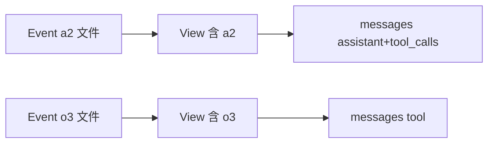
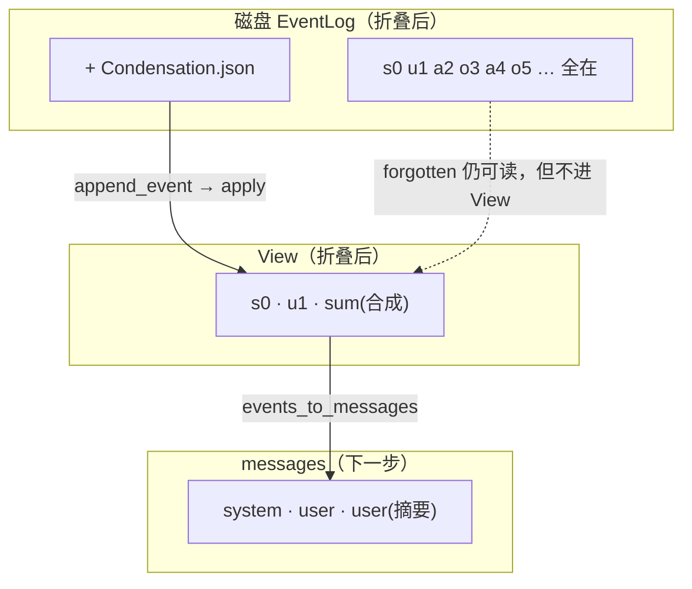
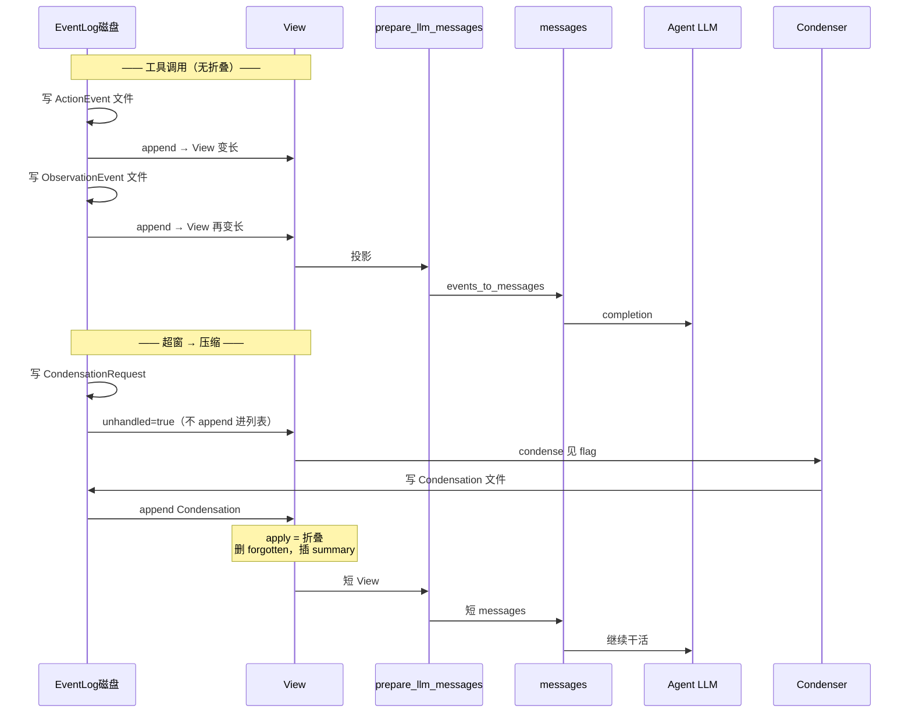
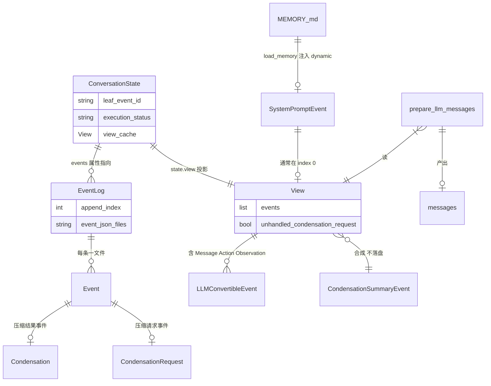
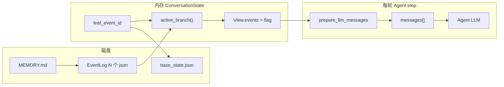
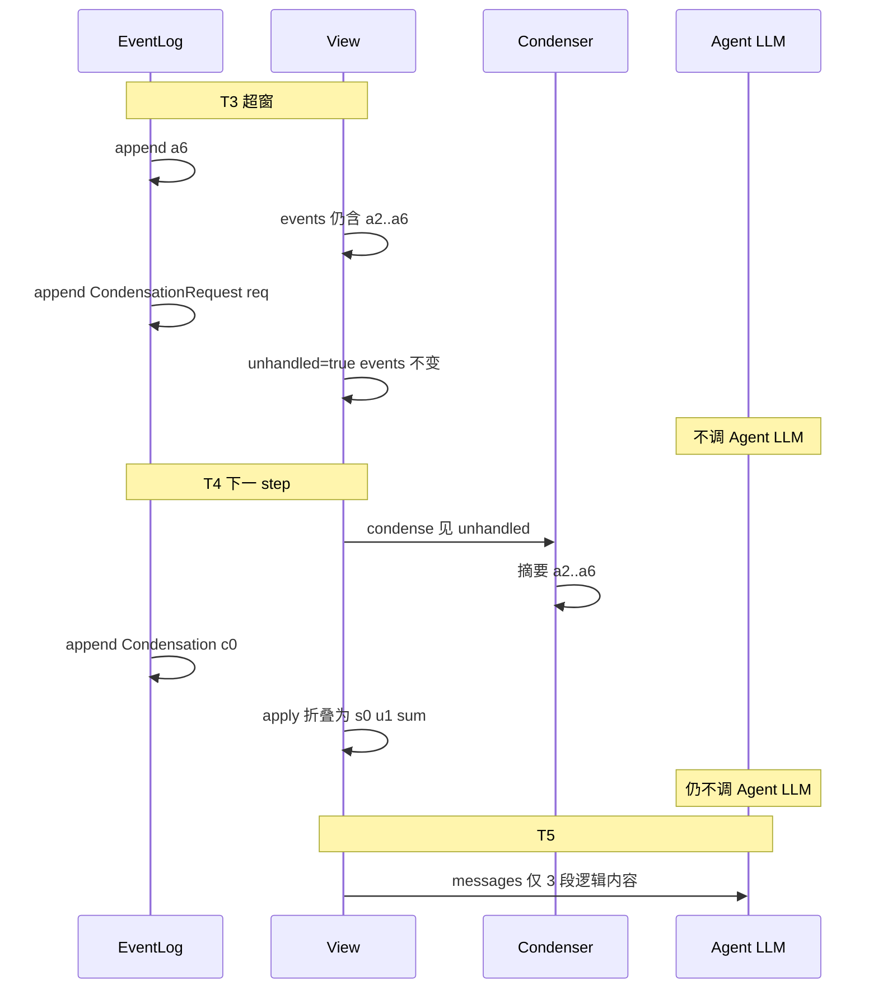
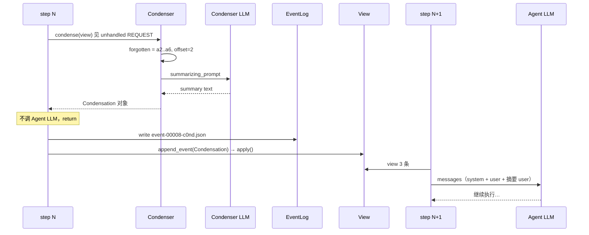
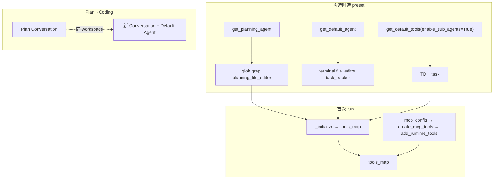

# SDK 核心运行时走查（合并本）

> **版本**: 1.0（2026-07-29）  
> **合并自**: `VIEW_FOLD_WALKTHROUGH` · `ENTITY_RELATIONSHIP_WALKTHROUGH` · `CONDENSATION_WALKTHROUGH` · `DELEGATE_AND_TASK`  
> **关联**: [ARCHITECTURE_PART1.md §3.3](./ARCHITECTURE_PART1.md#330-术语stepturnrun-怎么对应)（step/turn/run）· [SDK_RUNTIME_PROMPTS.md](./SDK_RUNTIME_PROMPTS.md)

---

## 目录

- [第零部分补充：没有「一次 run 先 Plan 再执行」](#第零部分补充没有一次-run-先-plan-再执行)
- [第一部分：「折叠」与 Event → View → messages](#第一部分折叠与-event--view--messages)
- [第二部分：实体关系完整走查（T0–T5）](#第二部分实体关系完整走查t0t5)
- [第三部分：Condensation 压缩完整走查（磁盘 JSON）](#第三部分condensation-压缩完整走查磁盘-json)
- [第四部分：工具挂载、MCP、task/delegate、Agent 切换](#第四部分工具挂载mcptaskdelegateagent-切换)

---

## 第零部分补充：没有「一次 run 先 Plan 再执行」

**SDK 没有**内置的「一次 `run()` / 一次 Agent 生命周期里先 Plan 再自动切 Coding 执行」编排。

| 问法 | 事实 |
|------|------|
| 有没有 `plan_then_execute()`？ | **没有** |
| 官方怎么做？ | **两段 Conversation**：`get_planning_agent` → `run()` 写 `PLAN.md`，再 `get_default_agent` → **新** `Conversation`（同 workspace）→ `run()` |
| 官方示例 | `examples/01_standalone_sdk/24_planning_agent_workflow.py`；本地 demo：`demos/plan_then_subagent_demo.py` |
| `switch_llm` 能否切 Plan→Coding？ | **不能**（只换模型） |
| 单次 Default `run()`？ | 模型可自行「先想再写」，但 **没有** Plan 工具闸 + `PLAN.md` 硬约束 |

详见下文 [第四部分 §2 切换实例](#2-切到默认-agent怎么做实例)。

---

## 第一部分：「折叠」与 Event → View → messages

> **双层循环**：`send_message` 与 `run()` 分离；`step` ≠ 用户一轮 → [PART1 §3.3.0](./ARCHITECTURE_PART1.md#330-术语stepturnrun-怎么对应)。  
> **loop 中 `send_message`**：无消息 FIFO 队列，FIFOLock + EventLog → [PART1 §3.6](./ARCHITECTURE_PART1.md#36-loop-过程中-send_message-时序)。

> **版本**: 1.0（2026-07-29）  
> **一句话**：**折叠 = 改 View 里「给 LLM 看的事件列表」：删掉一批中间事件，塞进一条摘要。磁盘 Event 文件不动。**  
> **源码**：`View.append_event` 遇到 `Condensation` → `Condensation.apply(self.events)`  
> **关联**：[第二部分（实体关系）](#第二部分实体关系完整走查t0t5) · [第三部分（Condensation JSON）](#第三部分condensation-压缩完整走查磁盘-json)

---

### 1. 「折叠」到底指什么

文档里写「下次 `append_event` 时 apply 折叠」——对应源码就是：

```python
## view.py append_event
case Condensation():
    self.events = event.apply(self.events)   # ← 这就是「折叠」
    self.unhandled_condensation_request = False
```

```python
## condenser.py Condensation.apply
output = [e for e in events if e.id not in forgotten_event_ids]  # 从 View 拿掉
output.insert(summary_offset, summary_event)                     # 插入合成摘要
return output
```

| 词 | 含义 | **不是** |
|----|------|----------|
| **折叠** | 把 View 中间一段「压扁」成一条 `CondensationSummaryEvent` | 不是删磁盘文件 |
| **forgotten** | 「对 LLM 遗忘」——从 View 列表移除 | 不是从 EventLog 删除 |
| **apply** | 把 Condensation 事件上的 `forgotten_event_ids` + `summary` 作用到当前 View 列表 | 不是再次调 Condenser LLM |

类比：**EventLog = 完整账本（append-only）**；**View = 给模型看的简报**；折叠 = **改简报，不撕账本**。

```text
折叠前 View:  [系统] [用户] [动作] [观察] [动作] [观察] [动作] …
折叠后 View:  [系统] [用户] [摘要一条] …
磁盘文件:     原来那些 json 全部还在 + 多一个 Condensation.json
```

---

### 2. 三个实体的职责（投影链）

```text
Event（文件）  ──投影──►  View（内存列表）  ──转化──►  messages（API 请求体）
   全历史、审计              LLM 可见子集              LiteLLM / OpenAI 格式
```

| 实体 | 存哪 | 一条「工具调用」长什么样 | 谁改它 |
|------|------|--------------------------|--------|
| **Event** | `events/event-{idx}-{id}.json` | Action 一个文件 + Observation **另一个**文件 | 每次 `on_event` **只追加**，从不改旧文件 |
| **View** | `state.view.events`（内存） | 通常同时挂着 Action + Observation | 普通事件：`append`；**Condensation：`apply` 折叠** |
| **messages** | 每步临时算出 | `assistant`+`tool_calls` + `tool` role | `events_to_messages` / 各 Event 的 `to_llm_message()` |

**口诀**：

1. Event 是 **事实真相**（文件）  
2. View 是 **给模型看的投影**（可折叠）  
3. messages 是 **这一步 API 包装**（由 View 现算，不持久化）

---

### 3. 普通工具调用：三实体怎么长（无压缩）

用户：「看一下 `login.py`」

#### 3.1 磁盘 EventLog（只增不改）

```text
event-00000-s0.json   SystemPromptEvent
event-00001-u1.json   MessageEvent(user)
event-00002-a2.json   ActionEvent(file_editor view)     ← 工具调用意图
event-00003-o3.json   ObservationEvent(文件内容)       ← 工具结果（独立文件）
```

#### 3.2 View（与上述一一对应 append）

```text
View.events = [s0, u1, a2, o3]
```

#### 3.3 下一步 `prepare_llm_messages` → messages

每个 LLMConvertible Event 调 `to_llm_message()`：

```text
messages ≈
  [system]     ← s0
  [user]       ← u1「看一下 login.py」
  [assistant]  ← a2（含 tool_calls）
  [tool]       ← o3（tool 角色，带 tool_call_id）
```

**转化规则**：Event 种类 → Message role；**没有**「折叠」发生，只是投影 + 格式转换。



---

### 4. 压缩时：三实体怎么分叉（折叠发生点）

接上例，又跑了 pytest（`a4`/`o5`），再准备改文件时超窗。

#### 4.1 时间线（谁写文件 / 谁改 View）

| 时刻 | EventLog（磁盘） | View | messages |
|------|------------------|------|----------|
| T1 工具完成 | 有 s0…o5 等文件 | `[s0,u1,a2,o3,a4,o5]` | 由 View 投影，很长 |
| T2 超窗 | **追加** `CondensationRequest` 文件 | **不进** `View.events`；只设 `unhandled=true` | 本步常不调 Agent LLM |
| T3 Condenser 产出 | **追加** `Condensation` 文件（含 forgotten_ids + summary） | **`append_event(c0)` → apply → 折叠** | 本步仍可不调 Agent |
| T4 下一 step | 文件不变 | 已是短列表 | **短 messages** 再调 Agent LLM |

#### 4.2 「折叠」那一瞬间（数字例子）

**折叠前 View**：

```text
[0] s0  SystemPrompt
[1] u1  用户：修 login
[2] a2  Action  读文件
[3] o3  Observation 源码
[4] a4  Action  pytest
[5] o5  Observation 长失败栈
```

假设 Condensation 说：`forgotten_event_ids={a2,o3,a4,o5}`，`summary_offset=2`，`summary="…"`。

**`apply` 做两件事**：

```text
1) 过滤：去掉 a2,o3,a4,o5
   → [s0, u1]

2) 在 offset=2 插入合成事件 sum（id = c0-summary，不落盘）
   → [s0, u1, sum]
```

这就是 **折叠**：中间四条工具往返 **在 View 里变成一条摘要**。

**磁盘** 此时：

```text
event-00002-a2.json … event-00005-o5.json   ← 仍在
event-0000N-c0.json                         ← 新增 Condensation（说明书：忘谁、摘要是啥）
没有 event-…-c0-summary.json                ← 摘要事件从不单独存文件
```

#### 4.3 折叠后 messages（转化）

```text
[system]  ← s0.to_llm_message()
[user]    ← u1
[user]    ← sum.to_llm_message()   # CondensationSummaryEvent 固定 role=user，正文=summary
```

模型 **看不见** 当年的 tool_calls / tool 长输出；只看见摘要文字。需要细节时再调工具重读文件。



---

### 5. 三种「事件」别混

| kind | 落盘？ | 进 View.events？ | 作用 |
|------|--------|------------------|------|
| `ActionEvent` / `ObservationEvent` | 是 | 是（直到被折叠忘掉） | 工具往返 |
| `CondensationRequest` | 是 | **否**（只打 `unhandled` 旗） | 「请压缩」信号 |
| `Condensation` | 是 | **不作为列表项留下**；触发 **apply 改写整表** | 折叠说明书 |
| `CondensationSummaryEvent` | **否** | **是**（apply 插入） | 给 LLM 看的摘要正文 |

所以：

- **Request** = 举手要压缩  
- **Condensation 文件** = 压缩结果的 **持久化记录**（谁被忘、摘要文本）  
- **折叠** = 把这份说明书 **应用到 View**  
- **Summary 合成事件** = 折叠产物，只活在 View / messages 里  

---

### 6. 一张总图：工具 + 压缩整条链



---

### 7. 和「拼 prompt」的关系

| 操作 | 改 Event？ | 改 View？ | 改 messages？ |
|------|-----------|-----------|---------------|
| 初始化 SystemPrompt | 写 1 个文件 | append | 下一步投影出来 |
| 工具 Action/Observation | 各写 1 个文件 | append | 下一步投影出来 |
| **折叠 apply** | **只多写 Condensation 文件**；旧文件不动 | **列表变短** | 下一步投影变短 |
| 每步 `prepare_llm_messages` | 否 | 只读（或 condenser 另产 Condensation） | **现算一遍** |

**折叠不重拼 system 模板**；它只动 View 中间段。System 仍来自 View 里那条 `SystemPromptEvent`（若在 `keep_first` 内会保留）。

---

### 8. 最小记忆口诀

```text
文件 = 发生过什么（永远追加）
View = 模型现在该看什么（可被折叠缩短）
messages = 这一枪 API 怎么打包（由 View 转化，用完即弃）

折叠 = Condensation.apply(View)
     = 忘掉一批 Event（仅对 View）+ 插入一条摘要（仅内存）
```

---

**文档版本**: 1.0  
**最后更新**: 2026-07-29  

---

## 第二部分：实体关系完整走查（T0–T5）

> **版本**: 1.0（2026-07-28）  
> **关联**: [ARCHITECTURE_PART1.md §6](./ARCHITECTURE_PART1.md#第6章memory-体系与运行时-message-变化) · [第三部分（Condensation JSON）](#第三部分condensation-压缩完整走查磁盘-json)

用一个虚构会话，把 **ConversationState、EventLog、View、active_branch、messages、MEMORY.md、CondensationRequest、Condensation** 在同一时间轴上对齐。

> **先读「折叠」**：见本文 [第一部分](#第一部分折叠与-event--view--messages)。

---

### 1. 实体一览（谁存什么）

| 实体 | 存在哪 | 存什么 | 给谁用 |
|------|--------|--------|--------|
| **EventLog** | 磁盘 `events/event-{idx}-{id}.json` | **每一条** Event 全文，append-only | 审计、Resume、Fork、UI 时间线 |
| **ConversationState** | 内存 + `base_state.json` | `leaf_event_id`、Agent 配置、`execution_status`、metrics… | 运行控制、Resume 元数据 |
| **active_branch()** | 内存（算出来） | 从 `leaf_event_id` 沿 `parent_id` 到根的 Event **列表** | stuck 检测、pending actions |
| **View** | 内存 `state.view` 缓存 | **LLM 可见**事件的线性列表 + `unhandled_condensation_request` | `prepare_llm_messages` |
| **messages[]** | 内存（每 step 临时） | OpenAI/Anthropic API 格式的请求体 | `make_llm_completion` |
| **MEMORY.md** | 磁盘 `~/.openhands/…` 与 workspace | 跨会话事实文本 | 读入 `AgentContext.memory_context` → SystemPrompt **dynamic** |
| **CondensationSummaryEvent** | **仅内存**（`Condensation.apply` 合成） | 摘要文本 | 进 View → `to_llm_message()`，**无独立 json 文件** |

**关系口诀**：

```text
EventLog（全） → active_branch（当前路径） → View（LLM 子集 + 压缩标记） → messages（API 格式）
```

---

### 2. 实体关系图





---

### 3. 场景：从发消息到压缩后继续

**设定**：用户一句「修 auth bug」→ 一次 file_editor → 一次 bash pytest（输出很长）→ LLM 再要改文件时 **上下文超窗**。

#### 3.0 符号表（本例 id）

| 符号 | kind | 说明 |
|------|------|------|
| `s0` | SystemPromptEvent | idx 0，dynamic 含 MEMORY.md |
| `u1` | MessageEvent user | idx 1 |
| `a2` | ActionEvent | file_editor view |
| `o3` | ObservationEvent | 源码 |
| `a4` | ActionEvent | bash pytest |
| `o5` | ObservationEvent | 长 pytest 输出 |
| `a6` | ActionEvent | str_replace（触发超窗） |
| `req` | CondensationRequest | idx 7，**不进 View.events** |
| `c0` | Condensation | idx 8，带 summary + forgotten_ids |
| `sum` | CondensationSummaryEvent | **合成**，id=`c0-summary` |

---

#### 时刻 T0：`_ensure_agent_ready` 之后

| 实体 | 状态 |
|------|------|
| **MEMORY.md**（磁盘） | `# Project memory\nauth 在 src/auth/` |
| **EventLog** | `event-00000-s0.json`（SystemPrompt 已写入） |
| **leaf_event_id** | `s0` |
| **active_branch** | `[s0]` |
| **View.events** | `[s0]`（dynamic 里已有 MEMORY 文本） |
| **View.unhandled** | `false` |
| **messages** | 尚未组装 |

---

#### 时刻 T1：`send_message` 之后

```text
U->LC: send_message("修 auth bug")
```

| 实体 | 变化 |
|------|------|
| **EventLog** | +`event-00001-u1.json` |
| **leaf_event_id** | `u1` |
| **active_branch** | `[s0, u1]` |
| **View.events** | `[s0, u1]`（增量 append） |
| **messages** | 仍无（还没 run） |

**关系**：`append_event` 同时写 EventLog、推进 leaf、更新 View。

---

#### 时刻 T2：一轮 tool 回合结束后（idx 0–5）

| EventLog idx | id | 在 active_branch | 在 View.events |
|--------------|-----|----------------|----------------|
| 0 | s0 | ✓ | ✓ |
| 1 | u1 | ✓ | ✓ |
| 2 | a2 | ✓ | ✓ |
| 3 | o3 | ✓ | ✓ |
| 4 | a4 | ✓ | ✓ |
| 5 | o5 | ✓ | ✓ |

| 实体 | 值 |
|------|-----|
| **leaf_event_id** | `o5`（最后一条 Observation） |
| **View.unhandled** | `false` |

**本轮 messages（逻辑）**：

```text
system:  static + MEMORY.md 全文
user:    修 auth bug
assistant+tool: file_editor view
tool:      源码…
assistant+tool: bash pytest
tool:      长 pytest 栈…
```

**MEMORY.md**：仍在 `s0` 的 dynamic 里，**不在**中间 Action/Observation 里。

---

#### 时刻 T3：Step 产生 `a6`，LLM 超窗 → 发出 CondensationRequest

Agent 采样出 `a6` 并写入 EventLog，再调 LLM 时抛 `LLMContextWindowExceedError`：

```text
on_event(CondensationRequest)   # 不是 Condensation
step return，本轮不调 LLM
```

| EventLog idx | id | 在 active_branch | 在 View.events | 在 View 其他 |
|--------------|-----|----------------|----------------|--------------|
| 0–5 | … | ✓ | ✓ | |
| 6 | a6 | ✓ | ✓ | |
| 7 | req | ✓ | **✗ 不在列表** | **unhandled=true** |

| 实体 | 值 |
|------|-----|
| **leaf_event_id** | `req` |
| **View.events** | 仍 `[s0,u1,a2,o3,a4,o5,a6]` — **7 条，历史未缩短** |
| **View.unhandled_condensation_request** | **`true`** ← 「只在 View 上打标记」 |

**要点**：

- `req` **在 EventLog 里有文件**（档案馆多一条「请压缩」记录）。
- LLM **看不见** `req`；condenser **能看见** `unhandled` 标记。
- 磁盘上 `o3`、`o5` 长文 **仍在**，View 也 **仍加载** 它们 — 所以下一步要靠 condenser 真正压缩。

---

#### 时刻 T4：下一 Step，condenser 产出 Condensation（仍不调 Agent LLM）

```text
prepare_llm_messages → condense(view) 见 REQUEST
→ Condenser LLM 摘要 a2,o3,a4,o5,a6
→ 返回 Condensation 对象（不是 messages）
→ on_event(Condensation c0)
→ step return
```

| EventLog idx | id | 文件仍在磁盘 |
|--------------|-----|-------------|
| 0–7 | s0…req | ✓ 全部保留 |
| 8 | c0 | ✓ 新增 Condensation JSON |

| 实体 | 值 |
|------|-----|
| **leaf_event_id** | `c0` |
| **View.events** | `[s0, u1, sum]` — **3 条**（`apply` 删掉 a2–a6，插入合成 `sum`） |
| **View.unhandled** | `false`（Condensation 清掉标记） |

**Condensation.apply 做了什么**：

```text
输入 view.events:  [s0, u1, a2, o3, a4, o5, a6]
forgotten_ids:     {a2, o3, a4, o5, a6}
输出 view.events:  [s0, u1, sum]   # sum 插在 summary_offset=2
```

**磁盘 vs View 分叉**（压缩后）：

```text
EventLog:  s0 u1 a2 o3 a4 o5 a6 req c0   （9 个文件，全在）
View:      s0 u1 sum                    （LLM 只见 3 条逻辑事件）
```

---

#### 时刻 T5：再下一 Step，正常调 Agent LLM

| 实体 | 状态 |
|------|------|
| **prepare_llm_messages** | 读 `state.view` → `[s0,u1,sum]` |
| **messages[]** | system + user + **user 摘要块** |
| **Agent LLM** | 在此 messages 上继续推理 |

```text
[system]  … + MEMORY.md 仍在 dynamic …
[user]    修 auth bug
[user]    （Condenser 摘要：看过 login.py、pytest 失败、准备 str_replace…）
```

**MEMORY.md 磁盘文件**：仍未改；**s0** 仍在 View index 0，**未 forgotten**。

---

### 4. 三列对照总表（压缩前后）

| | T2 压缩前 | T3 Request 后 | T4 Condensation 后 |
|---|-----------|---------------|-------------------|
| **EventLog 条数** | 6 | 8（+a6,+req） | 9（+c0） |
| **leaf_event_id** | o5 | req | c0 |
| **View 条数** | 6 | 7（+a6，仍很长） | 3 |
| **unhandled 标记** | false | **true** | false |
| **Agent LLM 本 step** | 调用了 | **未调**（发 req） | **未调**（发 c0） |
| **messages 长度** | 很长 | 仍很长 | 下一轮变短 |

---

### 5. CondensationRequest vs Condensation（在本例里）



| | CondensationRequest | Condensation |
|---|---------------------|--------------|
| **本例时刻** | T3 | T4 |
| **改 View.events？** | 否 | **是**（删 + 插摘要） |
| **改 View 标记？** | `unhandled=true` | `unhandled=false` |
| **含 summary 文本？** | 否 | 是（在 c0 JSON 里） |
| **本 step 调 Agent LLM？** | 否 | 否 |

---

### 6. 和 `state.events` 的区别

代码里常写 `conversation.state.events` — 这是 **EventLog** 的别名（可索引、可迭代），**不是** View：

```python
len(state.events)      # EventLog 总 append 数（含 req、c0）
len(state.view)        # LLM 投影条数（压缩后 3）
state.active_branch()  # 与 leaf 对齐的完整 Event 对象（含非 LLM 类型）
```

---

### 7. 源码锚点

| 行为 | 文件 |
|------|------|
| `append_event` 写盘 + leaf | `conversation/state.py` |
| `view` 增量 / `rebuild_view` | `conversation/state.py` |
| `View.append_event` Request/Condensation | `context/view/view.py` |
| `Condensation.apply` | `event/condenser.py` |
| `prepare_llm_messages` | `agent/utils.py` |
| 超窗 → `CondensationRequest` | `agent/agent.py` `step()` |

---

### 8. 延伸阅读

- 压缩磁盘 JSON 全文：见本文 [第三部分](#第三部分condensation-压缩完整走查磁盘-json)
- 一 Event 一文件：[ARCHITECTURE_PART1.md §3.5](./ARCHITECTURE_PART1.md#35-事件持久化)
- View 增量算法：[ARCHITECTURE_PART1.md §6.2](./ARCHITECTURE_PART1.md#62-view-设计与增量更新)

---

## 第三部分：Condensation 压缩完整走查（磁盘 JSON）

> **版本**: 1.0（2026-07-28）  
> **关联文档**: [ARCHITECTURE_PART1.md §6.8–6.9](./ARCHITECTURE_PART1.md#69-condensation-压缩机制--对-memory-的影响--完整实例)（[§6.9.0d 检查点仅在 step 入口](./ARCHITECTURE_PART1.md#690d-检查点时机仅在-step-入口工具执行后不检查)）  
> **源码**: `openhands-sdk/openhands/sdk/context/condenser/llm_summarizing_condenser.py`、`openhands-sdk/openhands/sdk/event/condenser.py`

本附录用**同一虚构会话**贯穿：压缩前后的磁盘目录树、每条 event JSON 样例、View 变化、送入 LLM 的 messages 结构。

---

### 1. 场景设定

- **任务**：修 auth 登录 bug
- **workspace**：`/home/dev/myproject`
- **conversation_id.hex**：`a1b2c3d4e5f6789012345678abcdef01`
- **persistence_base**：`~/.openhands/conversations`
- **Condenser 参数**：`keep_first=2`，`max_size=240`（默认）
- **触发原因**：`REQUEST`（Agent 因上下文超窗发出 `CondensationRequest`）
- **压缩前 View 长度**：7（index 0–6）

---

### 2. 压缩前：磁盘目录树

```text
~/.openhands/conversations/a1b2c3d4e5f6789012345678abcdef01/
├── base_state.json
├── events/
│   ├── .eventlog.lock
│   ├── event-00000-s0.json          # SystemPromptEvent
│   ├── event-00001-u1.json          # MessageEvent (user)
│   ├── event-00002-a2.json          # ActionEvent file_editor view
│   ├── event-00003-o3.json          # ObservationEvent 源码
│   ├── event-00004-a4.json          # ActionEvent bash pytest
│   ├── event-00005-o5.json          # ObservationEvent pytest 失败
│   ├── event-00006-a6.json          # ActionEvent str_replace（进行中）
│   └── event-00007-req.json         # CondensationRequest（Agent 发出）
└── observations/                    # （本例未用大 payload 外置）
```

**说明**：idx 0–6 与 View 中 LLM 可见事件一一对应；idx 7 的 `CondensationRequest` **不进 View**（非 LLMConvertible），但会设 `unhandled_condensation_request=True`。

---

### 3. 压缩前：各 Event JSON 样例

#### 3.1 `event-00000-s0.json` — SystemPromptEvent

```json
{
  "kind": "SystemPromptEvent",
  "id": "s0-1111-2222-3333-444444444444",
  "timestamp": "2026-07-28T20:00:00.000000",
  "source": "agent",
  "parent_id": null,
  "system_prompt": {
    "type": "text",
    "text": "You are a software engineering agent..."
  },
  "tools": ["file_editor", "terminal", "task_tracker"],
  "dynamic_context": {
    "type": "text",
    "text": "# User memory (~/.openhands/memory/MEMORY.md)\n项目使用 session cookie 而非 JWT。\n\n# Project memory (.openhands/memory/MEMORY.md)\nauth 模块在 src/auth/。"
  }
}
```

**MEMORY.md 在此**：`dynamic_context` 文本来自 `load_memory()`，**不属于**中间对话 Event，压缩时因 `keep_first` **不会被 forgotten**。

#### 3.2 `event-00001-u1.json` — MessageEvent (user)

```json
{
  "kind": "MessageEvent",
  "id": "u1-aaaa-bbbb-cccc-dddddddddddd",
  "timestamp": "2026-07-28T20:00:05.000000",
  "source": "user",
  "parent_id": "s0-1111-2222-3333-444444444444",
  "llm_message": {
    "role": "user",
    "content": [
      { "type": "text", "text": "修 auth 登录 bug，test_login_expired_session 失败" }
    ]
  },
  "activated_skills": [],
  "extended_content": []
}
```

#### 3.3 `event-00002-a2.json` — ActionEvent

```json
{
  "kind": "ActionEvent",
  "id": "a2-2222-3333-4444-555555555555",
  "timestamp": "2026-07-28T20:00:10.000000",
  "source": "agent",
  "parent_id": "u1-aaaa-bbbb-cccc-dddddddddddd",
  "tool_name": "file_editor",
  "tool_call_id": "call_fe_001",
  "thought": [{ "type": "text", "text": "先查看 login 实现" }],
  "action": {
    "kind": "FileEditorAction",
    "command": "view",
    "path": "src/auth/login.py"
  },
  "llm_response_id": "resp-agent-001"
}
```

#### 3.4 `event-00003-o3.json` — ObservationEvent（将被遗忘）

```json
{
  "kind": "ObservationEvent",
  "id": "o3-3333-4444-5555-666666666666",
  "timestamp": "2026-07-28T20:00:12.000000",
  "source": "environment",
  "parent_id": "a2-2222-3333-4444-555555555555",
  "observation": {
    "kind": "FileEditorObservation",
    "content": "     1|def validate_session(cookie):\n     2|    ...（共 80 行完整源码）..."
  }
}
```

#### 3.5 `event-00004-a4.json` / `event-00005-o5.json`（将被遗忘）

Action：bash `pytest tests/auth -k test_login_expired_session`  
Observation：完整 pytest 失败栈（多行）。

#### 3.6 `event-00006-a6.json` — ActionEvent（将被遗忘）

file_editor `str_replace` 修改 `login.py` 的 session 校验（LLM 已采样，工具尚未在本附录中执行完）。

#### 3.7 `event-00007-req.json` — CondensationRequest

```json
{
  "kind": "CondensationRequest",
  "id": "req-7777-8888-9999-000000000000",
  "timestamp": "2026-07-28T20:00:25.000000",
  "source": "environment",
  "parent_id": "a6-6666-7777-8888-999999999999"
}
```

---

### 4. 压缩前：View 与 LLM messages

**View（7 条 LLMConvertible）**

| View idx | id | kind |
|----------|-----|------|
| 0 | s0 | SystemPromptEvent |
| 1 | u1 | MessageEvent |
| 2 | a2 | ActionEvent |
| 3 | o3 | ObservationEvent |
| 4 | a4 | ActionEvent |
| 5 | o5 | ObservationEvent |
| 6 | a6 | ActionEvent |

**送入 Agent LLM 的逻辑 messages（压缩前）**

```text
[system]  static system + dynamic（含 MEMORY.md 全文）
[user]    修 auth 登录 bug，test_login_expired_session 失败
[assistant + tool_calls] file_editor view login.py
[tool]    80 行完整源码
[assistant + tool_calls] bash pytest ...
[tool]    完整 pytest 失败栈
[assistant + tool_calls] file_editor str_replace ...
```

---

### 5. 压缩计算（`REQUEST`, len(view)=7）

```text
target_size           = 7 // 2 = 3
suffix_events_to_keep = 3 - keep_first(2) - 1 = 0
events_from_tail      = 0
naive_end             = 7 - 0 = 7
forgetting_start      = manipulation_indices.find_next(2) → 2
forgetting_end        = manipulation_indices.find_next(7) → 7
forgotten             = view[2:7]  →  a2, o3, a4, o5, a6
summary_offset        = 2
```

**Condenser LLM**（`self.llm`，非 Agent LLM）输入：`summarizing_prompt.j2` + 5 条 `str(event)`。

**Condenser LLM 输出 summary（示例）**

```text
用户要修 auth 登录 bug，test_login_expired_session 失败。
已查看 src/auth/login.py：使用 session cookie 校验。
运行 pytest 失败：期望 401 实际 200，session 过期未拒绝。
Agent 正准备用 str_replace 修改 session 校验逻辑。
```

---

### 6. 压缩后：新增磁盘文件

#### 6.1 目录树（压缩后）

```text
events/
├── event-00000-s0.json          # 仍在
├── event-00001-u1.json          # 仍在
├── event-00002-a2.json          # 仍在（档案馆不删）
├── event-00003-o3.json          # 仍在
├── event-00004-a4.json          # 仍在
├── event-00005-o5.json          # 仍在
├── event-00006-a6.json          # 仍在
├── event-00007-req.json         # 仍在
└── event-00008-c0nd.json        # 新增 Condensation
```

**没有** `event-00008-c0nd-summary.json`：`CondensationSummaryEvent` **不落盘**。

#### 6.2 `event-00008-c0nd.json` — Condensation（完整）

```json
{
  "kind": "Condensation",
  "id": "c0nd-aaaa-bbbb-cccc-eeeeeeeeeeee",
  "timestamp": "2026-07-28T20:00:30.000000",
  "source": "environment",
  "parent_id": "a6-6666-7777-8888-999999999999",
  "forgotten_event_ids": [
    "a2-2222-3333-4444-555555555555",
    "o3-3333-4444-5555-666666666666",
    "a4-4444-5555-6666-777777777777",
    "o5-5555-6666-7777-888888888888",
    "a6-6666-7777-8888-999999999999"
  ],
  "summary": "用户要修 auth 登录 bug，test_login_expired_session 失败。已查看 src/auth/login.py：使用 session cookie 校验。运行 pytest 失败：期望 401 实际 200。Agent 正准备用 str_replace 修改 session 校验逻辑。",
  "summary_offset": 2,
  "llm_response_id": "resp-cond-001"
}
```

#### 6.3 `base_state.json` 变化（字段片段）

```json
{
  "id": "a1b2c3d4-e5f6-7890-1234-5678abcdef01",
  "leaf_event_id": "c0nd-aaaa-bbbb-cccc-eeeeeeeeeeee",
  "execution_status": "running"
}
```

---

### 7. 压缩后：View 与 LLM messages

**`Condensation.apply()` 逻辑**

```python
output = [e for e in events if e.id not in forgotten_event_ids]
output.insert(summary_offset, CondensationSummaryEvent(
    id="c0nd-aaaa-bbbb-cccc-eeeeeeeeeeee-summary",
    summary=...,
))
```

**View（3 条有效 LLM 输入）**

| View idx | 来源 | 磁盘文件 |
|----------|------|----------|
| 0 | SystemPromptEvent `s0` | event-00000-s0.json |
| 1 | MessageEvent `u1` | event-00001-u1.json |
| 2 | **CondensationSummaryEvent（合成）** | **无独立文件** |

**送入 Agent LLM 的逻辑 messages（压缩后，step N+1）**

```text
[system]  static + dynamic（MEMORY.md 全文仍在 dynamic_context）
[user]    修 auth 登录 bug，test_login_expired_session 失败
[user]    用户要修 auth 登录 bug…（Condenser 摘要全文）
```

**丢失的（仅对 LLM）**：80 行源码、完整 pytest 栈、str_replace 参数细节。  
**仍可审计**：打开 `event-00003-o3.json`、`event-00005-o5.json` 读原文。

---

### 8. 三层 Memory 影响对照

| 层 | 压缩前 | 压缩后 |
|----|--------|--------|
| **L0 EventLog** | 8 个 event 文件（含 Request） | **9 个**；旧 8 个 **全保留** |
| **L1 View** | 7 条 LLMConvertible | **3 条**（+ 合成摘要） |
| **L3 MEMORY.md** | 在 s0.dynamic_context | **不变**（磁盘文件不变，dynamic 仍在 idx 0） |
| **base_state** | leaf=a6 | leaf=c0nd |

---

### 9. 逐步时序（step N → step N+1）



---

### 10. 适用场景：何时值得用这套压缩

| 更适合 | 不太需要 |
|--------|----------|
| 长会话（数百轮 tool）、需 resume/Fork | 单次问答、无持久化 |
| 需审计「忘了什么」 | 可接受静默删 messages |
| 软件工程工具链（bash/editor 大输出） | 输出很短、无 tool 环 |
| 要与 UI 时间线、合规日志对齐 | 纯原型 demo |

---

### 11. 相关源码索引

| 符号 | 路径 |
|------|------|
| `LLMSummarizingCondenser` | `openhands/sdk/context/condenser/llm_summarizing_condenser.py` |
| `Condensation.apply` | `openhands/sdk/event/condenser.py` |
| `View.append_event` | `openhands/sdk/context/view/view.py` |
| `prepare_llm_messages` | `openhands/sdk/agent/utils.py` |
| `agent.step` 压缩分支 | `openhands/sdk/agent/agent.py` |
| `load_memory` | `openhands/sdk/context/memory.py` |

---

## 第四部分：工具挂载、MCP、task/delegate、Agent 切换

> **版本**: 1.1（2026-07-29）

---

### 1. 非 Plan 模式挂什么工具？什么时机挂？

工具分两批：**构造 Agent 时写进 `Agent.tools`（名字规格）**，**首次 `run()` → `_ensure_agent_ready` 时 resolve + 挂 MCP**。

#### 1.1 Preset 对照

| Preset | 工厂 | 默认挂上（`Agent.tools`） | **不**默认挂 |
|--------|------|---------------------------|--------------|
| **Coding / Default** | `get_default_agent(llm, cli_mode=…)` | `terminal`、`file_editor`、`task_tracker`；非 CLI 再加 browser | **`task`**、**`delegate`** |
| **Default + 子 Agent** | `get_default_tools(enable_sub_agents=True)` 再自己组 `Agent` | 上面 + **`task`（TaskToolSet）** | **`delegate`** |
| **Planning** | `get_planning_agent(llm)` | `glob`、`grep`、`planning_file_editor` | `file_editor` / `terminal` / `task` / `delegate` |

另：`_initialize` 还会按 `include_default_tools` 加 builtins（`finish`、`think`；有可 invoke skill 时还有 `invoke_skill`）。

**一句话**：

- 普通干活 → Default：**没有** `task`，除非 `enable_sub_agents=True`。  
- 要子 Agent → 挂 **`task`**，不是 `delegate`。  
- `delegate` → 只有手写挂载；**两个 preset 都不挂**。

#### 1.2 挂载时间线

```text
① 构造 Agent
   Agent(tools=[Tool(name="terminal"), …])   ← 只是名字，还没实例

② 首次 conversation.run()
   _ensure_agent_ready()
     → Agent._initialize()
         resolve_tool → 从 _REG 取出 ToolDefinition → tools_map
         + builtins
     → 若 agent.mcp_config 非空：
         create_mcp_tools → MCPToolDefinition[]
         → add_runtime_tools → 并进同一张 tools_map

③ 每个 agent.step()
   make_llm_completion(tools=tools_map.values())
```

Plan→Execute「换工具」= **换整颗 Agent + 新 Conversation**，不是同会话热换 preset。

---

### 2. 切到默认 Agent：怎么做？（实例）

**不会自动切。** 同一 workspace 再建 Coding 会话：

```python
from openhands.sdk import LLM, Conversation, Agent
from openhands.tools.preset.planning import get_planning_agent
from openhands.tools.preset.default import get_default_agent, get_default_tools

llm = LLM(model="...", api_key="...", base_url="...")
workspace = "/path/to/project"

## Phase A：Plan
plan_conv = Conversation(agent=get_planning_agent(llm), workspace=workspace)
plan_conv.send_message("给登录模块加固，直接写 PLAN.md，不要追问")
plan_conv.run()
## → .agents_tmp/PLAN.md

## Phase B：切换 = 新 Agent + 新 Conversation（同 workspace）
exec_agent = get_default_agent(llm, cli_mode=True)
## 若要子 Agent（挂 task）：
## tools = get_default_tools(enable_browser=False, enable_sub_agents=True)
## exec_agent = Agent(llm=llm, tools=tools, system_prompt_kwargs={"cli_mode": True})

exec_conv = Conversation(agent=exec_agent, workspace=workspace)
exec_conv.send_message("按 .agents_tmp/PLAN.md 实现。不要追问。")
exec_conv.run()
```

| API | 能否完成 Plan→Coding？ |
|-----|------------------------|
| 新 Conversation + `get_default_agent` | **能** |
| `switch_llm` / `switch_profile` | **不能**（只换模型） |

可跑示例：`demos/plan_then_subagent_demo.py`。

---

### 3. `task` vs `delegate`

| | **`task`（TaskToolSet）** | **`delegate`** |
|--|---------------------------|----------------|
| 何时出现 | `enable_sub_agents=True` 或手动挂 | **手动**挂时才有 |
| 用法 | 一次：`subagent_type` + `prompt`（可 `resume`） | `spawn(ids, agent_types?)` → `delegate(tasks={id:文案})` |
| 行为 | 阻塞跑完一个子会话 | spawn 只建会话；delegate 可多 id **并行** |

Preset 主路径：**只用 `task`。**

#### `task` 路径

```text
LLM tool_call task
 → TaskExecutor → TaskManager.start_task
 → get_agent_factory(subagent_type) → 子 Agent
 → LocalConversation(同 workspace, …/subagents/)
 → send_message + run() 直到结束
 → TaskObservation 回父（父本 step 一直阻塞）
```

#### `delegate` 路径

```text
spawn → 各 id 建 LocalConversation 存 _sub_agents（还不 run）
delegate → 校验 id → 多线程 send_message+run → join → 合并 Observation
```

---

### 4. MCP 注册 → 运行详解

#### 4.1 两张表，一张运行时表

```text
_REG（全局工厂）     ← 仅 register_tool：terminal / file_editor…
        ↑ resolve_tool
Agent.tools 规格      ← 构造时 Tool(name=…)
        ↓ _initialize
Agent.tools_map       ← 模型真正看见的全部工具
        ↑ add_runtime_tools
MCPToolDefinition[]   ← 不进 _REG；create_mcp_tools 动态生成
```

#### 4.2 发现与挂载

```text
agent.mcp_config = {"fetch": {"command": "uvx", "args": ["mcp-server-fetch"]}, …}
## Plugin / Skill 的 mcp 也会合并进该 dict

_ensure_agent_ready:
  create_mcp_tools(mcp_config)
    → 连接各 MCP Server
    → tools/list
    → 每个远端 tool → MCPToolDefinition.create(mcp_tool, client)
         name = MCP 工具名
         inputSchema → 动态 Action 模型
         executor = MCPToolExecutor(name, client)
    → agent.add_runtime_tools(...)

tools/list_changed → _on_mcp_tools_changed → 再 add_runtime_tools
```

#### 4.3 调用（与内置同一条 step 路径）

```text
LLM tool_calls name=<mcp名>
  → tools_map[name]          # MCPToolDefinition
  → action_from_arguments    # 按 MCP schema 校验 → MCPToolAction
  → MCPToolExecutor
       未连接则重连一次
       JSON-RPC tools/call(name, arguments)
  → MCPToolObservation → ObservationEvent
  → 下一 step 进 messages（role=tool）
```

#### 4.4 封装点

| 组件 | 作用 |
|------|------|
| `MCPToolDefinition` | 当普通 `ToolDefinition` 用，名字来自远端 |
| 动态 Action | `Schema.from_mcp_schema` |
| `MCPToolExecutor` | 发 `tools/call`；超时默认 300s；可重连 |
| `MCPToolObservation` | 远端结果 → LLM 可读 |

**不会** `register_tool` 进 `_REG`；只活在该 Agent 的 `tools_map`。

---

### 5. Event：没有 PlanEvent

计划落在 **`.agents_tmp/PLAN.md`**。写计划产生的是 `ActionEvent` / `ObservationEvent`（工具 `planning_file_editor`）。

| 进 LLM（LLMConvertible） | 多半不进 messages |
|--------------------------|-------------------|
| SystemPrompt / Message / Action / Observation | Condensation、CondensationRequest |
| UserReject / AgentError / CondensationSummary（合成） | Pause、Token、Hook、StateUpdate、ConversationError… |

---

### 6. 总图



### 7.hook机制
hook当成aop里的切面，在这些点上可以hook，没有实现类和方法，执行器runner可以自行实现
# 一句话先分清两个概念（很多人混淆根源）

1. **Hook 点位（Hook Type）**：6 个固定拦截时机：`PreToolUse / PostToolUse / UserPromptSubmit / Stop / SessionStart / SessionEnd` → **定义【什么时候跑】**
2. **执行器（Runner /type: command /prompt/agent）**：3 种官方内置运行引擎 → **定义【怎么跑这段评审逻辑】**
3. **HookManager**：总调度中心，负责串联：到达时机 → 匹配规则 → 选择执行器运行 → 解析返回结果 → 判断是否阻断主流程

>
> 关系：**HookManager 在指定 Hook 点位触发，调用对应的执行器去运行你的自定义评审逻辑，最后读取执行结果决定放行 / 阻断**
## 三种执行器各自职责（官方实现）

1. **CommandRunner（command 默认）**
   能力：子进程跑外部脚本（bash/python），环境变量传入事件上下文
   适用：固定规则拦截、外部系统回调、日志审计
2. **PromptRunner（prompt）**
   能力：构造评审 prompt，单次 LLM 调用，**不允许调用任何工具**
   适用：纯语义评审，判断命令是否高危
3. **AgentRunner（agent）**
   能力：创建隔离子会话，可配置允许使用哪些工具，独立 LLM 用量，**默认关闭嵌套 hook，防止死循环**
   适用：复杂评审（读取配置文件、扫描代码做安全审计）
```json
{
  "hooks": {
    "PreToolUse": [ // ① Hook点位：什么时候触发
      {
        "matcher": "terminal",
        "hooks": [
          {
            "type": "command", // ② 指定用哪一个【官方执行器】运行
            "command": "./check_bash_risk.sh", // ③ 用户自己写的业务逻辑
            "timeout": 10
          }
        ]
      }
    ]
  }
}
```
```
主Agent循环：准备调用 bash 工具
    ↓
1. 到达固定点位 PreToolUse（Hook点位，什么时候执行）
    ↓
2. HookManager 读取当前会话的 HookConfig / hooks.json
    ↓
3. Matcher 匹配：判断这条hook是否生效（例如 matcher="terminal" 只匹配bash工具）
    ↓
4. 根据配置里的 type，选择对应的【官方内置执行器】执行用户定义逻辑
    ├─ type=command → CommandRunner：拉起子进程执行shell脚本，传入事件JSON上下文
    ├─ type=prompt → PromptRunner：组装评审prompt，调用LLM单次判断，禁止调用工具
    └─ type=agent → AgentRunner：新建隔离短期子会话（子agent），允许配置可用工具
    ↓
5. 执行器运行完成，返回输出 + 退出码/评审结论 给 HookManager
    ↓
6. HookManager 统一处理阻断规则：
    exit 0 = 放行；exit 2 = 阻断本次工具调用；其他非0 = 告警不阻断
    ↓
7. 阻断：直接终止本次工具调用，返回拒绝理由给主Agent
    放行：继续往下，执行真实工具
```
```python
# 伪代码示意（源码真实结构）
from abc import ABC, abstractmethod

# 【抽象基类】所有Hook执行器统一接口
class HookRunner(ABC):
    @abstractmethod
    async def run(self, event: HookEvent, config: HookConfig) -> HookResult:
        ...

# 三个官方内置实现（继承抽象）
class CommandRunner(HookRunner):
    async def run(...):
        # 拉起子进程执行脚本

class PromptRunner(HookRunner):
    async def run(...):
        # 单次LLM评审，禁止工具调用

class AgentRunner(HookRunner):
    async def run(...):
        # 新建隔离子会话执行子agent评审
```