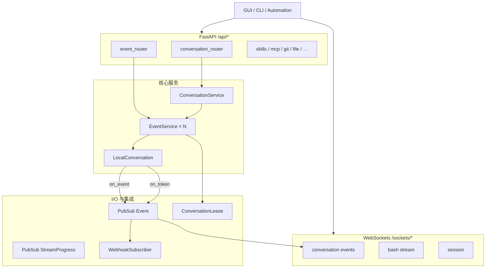
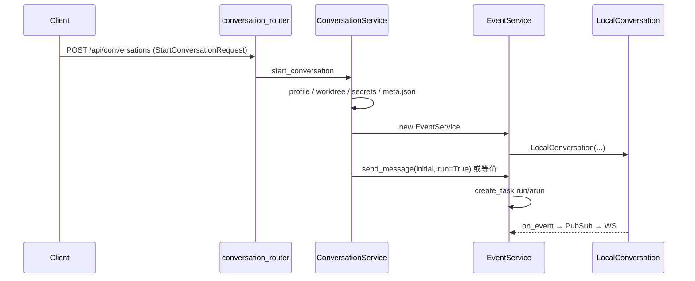
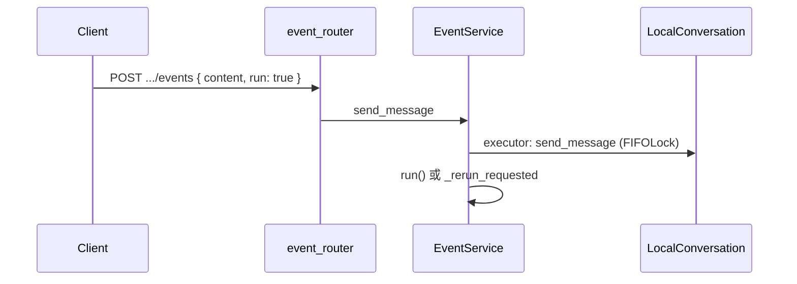

# openhands-agent-server 设计实现

> **源码**: `software-agent-sdk/openhands-agent-server/openhands/agent_server/`  
> **包名**: `openhands-agent-server`（PyPI，与 `openhands-sdk` 同版本号）  
> **互补**: [`APPLICATION_LAYER.md`](APPLICATION_LAYER.md)、[`ENTITY_MODEL.md`](ENTITY_MODEL.md) §11、SDK [`ARCHITECTURE_PART1`](../openhands-sdk/ARCHITECTURE_PART1.md)（若存在）

---

## 1. 定位与边界

**Agent Server** 是 Software Agent SDK 的 **进程级宿主**：把 `LocalConversation` 暴露为 REST + WebSocket API，管理磁盘持久化、并发 run、实时推送与周边能力（Git、文件、MCP、Profile、Bash 侧车等）。

| 属于 Agent Server | 不属于（在 SDK 或其它包） |
|-------------------|---------------------------|
| FastAPI 路由、鉴权、OpenAPI | `Agent.step()` / `run()` 语义 |
| `ConversationService` / `EventService` | 工具实现（`openhands-tools`） |
| 会话目录 `meta.json`、lease、Webhook 投递 | Docker 沙箱编排（`openhands-workspace` + App Server） |
| WebSocket 订阅、流式 delta 转发 | React UI（`OpenHands/` + TS client） |

官方边界（README）：**后端行为与端点改 Python Agent Server；浏览器客户端改 `clients/typescript`。**

---

## 2. 总体架构



**单进程内典型关系**

- **一个** `ConversationService` 实例（`app.state.conversation_service`，lifespan 内 `async with service`）。
- **每个活跃会话** 最多一个 `EventService`，内含 **一个** `LocalConversation`。
- **一个** `ConversationRegistry` 适配运行时形态（默认本机可用），挂载 execution 路由与 socket。

---

## 3. 启动与生命周期

### 3.1 入口

- CLI：`python -m openhands.agent_server`（`__main__.py`）
- Uvicorn 加载 `api.create_app()`（或等价工厂）
- 绑定安全：`0.0.0.0` / `::` 若未配置 Session API Key 会倾向回环（见 `__main__.py` 注释）

### 3.2 `api_lifespan`（`api.py`）

| 阶段 | 行为 |
|------|------|
| 启动 | 设置 `TMUX_TMPDIR`、清理陈旧 tmux 会话 |
| 配置 | `app.state.config`、`create_conversation_registry(config)` |
| 遥测 | `build_telemetry_sink`；非 deferred 时 `emit_server_started` |
| 旁路服务 | VSCode 服务、Tool preload（并行 `gather`） |
| **deferred_init=false** | `get_default_conversation_service()` → `conversation_registry.start()` → `async with service` |
| **deferred_init=true** | 仅 `InitService` + `/ready`；**不**挂载可用 ConversationService，直至 `POST /api/init` |

### 3.3 两种部署模式

| 模式 | 场景 | 关键 API |
|------|------|----------|
| **标准启动** | 本地 dev、桌面、单用户沙箱 | 启动即 `ConversationService` 就绪 |
| **Deferred init** | Cloud 暖池 Pod | 先 dormant → `POST /api/init` 注入 `conversations_path`、`session_api_keys`、webhook 等 → ready |

`init_router.py`：`InitRequest` 字段刻意收窄为「按用户变化」的运行时配置；镜像级依赖不在此覆盖。

### 3.4 鉴权（`dependencies.py`）

| 机制 | 用途 |
|------|------|
| `X-Session-API-Key` | 绝大多数 `/api/*` |
| `X-Init-API-Key` | 仅 `/api/init`（暖池） |
| `oh_workspace_session_key` Cookie | 工作区静态文件 / iframe（`check_workspace_session`） |
| WebSocket 首帧 `{type:"auth", session_api_key}` | 避免 token 进 URL 日志 |

`check_session_api_key` **每次请求**读 `app.state.config.session_api_keys`，故 init 下发的 key 无需重启。

---

## 4. 配置（`config.py`）

`Config` 由环境变量（`OH_*`）+ 可选 `OPENHANDS_AGENT_SERVER_CONFIG_PATH` JSON 合并。

常见项：

| 配置 | 作用 |
|------|------|
| `conversations_path` | 会话根目录（每会话子目录） |
| `session_api_keys` / `secret_key` | API 鉴权与持久化密钥加密（`Cipher`） |
| `webhook_specs` | 向 App Server 批量 POST 事件 |
| `max_concurrent_runs` | 全进程并发 run 上限 |
| `conversation_idle_ttl_seconds` | 空闲驱逐 `EventService` |
| `conversation_worktree_root` | Git worktree 根目录 |
| `deferred_init` | 暖池模式 |
| `bash_events_dir` / retention | Bash 侧车事件持久化 |
| `acp_skill_sourcing` | `native` vs `openhands_managed`（ACP 技能注入策略） |
| `telemetry` / `deployment_kind` | 产品遥测 |

---

## 5. ConversationService：会话目录与编排

**文件**: `conversation_service.py`（约 3000 行，核心应用逻辑）

### 5.1 职责

1. **目录 catalog**：扫描 `conversations_path/<uuid>/`，读 `meta.json` → `StoredConversation`，读 `base_state.json` 摘要 `execution_status`。
2. **懒加载**：`start_conversation` / 访问事件时 `_get_or_load_event_service_locked` 创建 `EventService`。
3. **启动流水线**（新会话 `_start_conversation`）：
   - 解析 `agent_profile_id` → SDK `resolve` agent（或内联 `request.agent`）
   - 全局 `PersistedSettings`：`load_memory`、`mcp_config` 等补丁
   - ACP skill sourcing、system_message_suffix、`worktree` 创建
   - Codex 凭证绑定、`tool_module_qualnames` 动态 import
   - **Client tools** 注册（Canvas UI 等 JSON schema）
   - 写 `meta.json`、构造 `EventService`、`initial_message` + `run`
4. **生命周期锁**：`_conversation_lifecycle`、per-conversation `asyncio.Lock`、与 registry shutdown 顺序配合。
5. **控制面**：`pause_conversation`、`interrupt_conversation`、`run_conversation`、fork、navigate event tree、`/goal` 循环等（经 router 暴露）。

### 5.2 持久化布局（单会话目录）

与 SDK `persistence_const` 一致，典型结构：

```text
conversations_path/<conversation_id>/
  meta.json              # StoredConversation（workspace、plugins、tags、…）
  base_state.json        # ConversationState 快照；agent 真源（新架构）
  events/                # EventLog 分片文件
  owner_lease.json       # 多实例时的会话租约（可选）
  bash_events/           # 按会话 Bash 侧车（EventService 懒创建）
```

`StoredConversation` 继承 SDK `ConversationConfig`（`models.py` re-export `StartConversationRequest` 等于 SDK `conversation/request.py`）。

### 5.3 Webhook

`WebhookSpec`：缓冲 `event_buffer_size`、定时 `flush_delay`、重试、背压 `max_queue_size`。`ConversationWebhookSubscriber` 在后台 `asyncio.create_task` 批量 POST 到 `{base_url}/events`（App Server 入库再推前端）。

---

## 6. EventService：单会话运行时

**文件**: `event_service.py`（约 2000 行）

### 6.1 与 SDK 的映射

```text
EventService
  ├─ stored: StoredConversation
  ├─ _conversation: LocalConversation | None
  ├─ _persisted_events: EventLog（读路径可与内存 state 对齐）
  ├─ _pub_sub: PubSub[Event]           # 持久化事件 fan-out
  ├─ _stream_pub_sub: PubSub[StreamProgress]  # 非持久化流式帧
  ├─ _run_task: asyncio.Task           # run()/arun() 后台任务
  ├─ _run_lock                         # 单会话同时只起一个 run
  ├─ _rerun_requested                  # run=True 撞车后的补偿
  └─ _callback_wrapper: AsyncCallbackWrapper  # 线程 → 事件循环
```

**构造 `LocalConversation`**（约 1133 行）：注入 `workspace`、`plugins`、`persistence_dir`、`callbacks=[_callback_wrapper]`、`token_callbacks`、`stream_callbacks`、`cipher`、`hook_config`、`mcp_tool_provider` 等；确认策略 / security analyzer 从 `stored` 恢复。

### 6.2 Run 路径

`async def run()`：

1. `_run_lock` + `execution_status == RUNNING` + `_run_task` 检查 → 否则 `conversation_already_running`。
2. `_run_and_publish`：
   - 若 agent 有原生 `arun` + `astep` → `await conversation.arun()`（LLM I/O 不占线程池）
   - 否则 `run_in_executor(_run_executor, conversation.run)`
3. `finally`：`callback_wrapper.wait_for_pending` → 清 `_run_task` → 发布状态 → 若 `_rerun_requested` 再 `run()`。

`send_message`：`run_in_executor(conversation.send_message)`；`run=True` 时尝试 `await self.run()`，失败则设 `_rerun_requested`（见 ENTITY_MODEL §11.9）。

### 6.3 事件 API（`event_router.py`）

| 路由 | 作用 |
|------|------|
| `GET .../events/search` | 分页、按 kind/source/body/时间过滤 |
| `GET .../events/{id}` | 单条 |
| `POST .../events` | `SendMessageRequest`（含 `run` 标志） |
| 确认相关 | `ConfirmationResponseRequest` → SDK 确认流 |

读路由与写路由分拆（`event_read_router` / `event_write_router`），由 `ConversationRegistry.add_execution_routes` 挂到带 `conversation_id` 的 runtime 前缀下。

### 6.4 流式

- **Token delta**：`StreamingDeltaEvent` 经 `_publish_stream_delta` → `_pub_sub`，**不写** EventLog（SDK 设计）。
- **StreamProgress**：ACP/工具进度 → `_stream_pub_sub`，仅 session socket 消费。
- WebSocket subscriber：`Subscriber.receives_streaming_deltas` 控制是否接收 delta。

### 6.5 租约（`conversation_lease.py`）

多 Agent Server 实例共享 NFS/共享盘时，`owner_lease.json` + `FileLock` 防止双写同一对话。`owner_instance_id`、TTL、generation；`ConversationLeaseHeldError` 时拒绝加载。单实例本地 dev 通常仍走默认 TTL 续租逻辑。

---

## 7. ConversationRegistry：路由与运行时抽象

**文件**: `conversation_registry.py`

默认实现：

- `runtime_info()` → `AVAILABLE` / `can_resume`
- `add_execution_routes()` → `runtime_router` + `event_router`
- `workspace_router`、`sockets_router`（会话 WS + bash WS + session WS）

上游可替换 Registry，使「catalog 在中心、执行在远端」；GUI 通过 `ConversationInfo.runtime_info` 区分。

---

## 8. HTTP 路由地图（`api._add_api_routes`）

前缀一般为 `/api`（另：`/api/init` 无 session 依赖；OpenAI 兼容路由单独鉴权）。

| Router | 功能摘要 |
|--------|----------|
| `server_details_router` | `/alive`、`/ready`、版本、能力 |
| `conversation_catalog_router` | 列表/搜索会话 |
| `conversation_router` | `POST /conversations` start、`pause`/`interrupt`/`run`、fork、secrets、goal |
| `event_router` | 事件 CRUD、发消息 |
| `runtime_router` | 按会话解析 `EventService`（path 参数） |
| `credential_binding_router` | OAuth/版本化凭证激活 |
| `tool_router` | 工具元数据/预加载 |
| `bash_router` / `bash_service` | 与会话解耦或绑定的 bash 执行记录 |
| `git_router` |  status、diff、sync 等 |
| `file_router` / `file_discovery_router` | 工作区文件读写、发现 |
| `vscode_router` | 嵌入式 VSCode URL |
| `skills_router` / `skills_service` | 技能发现与启用 |
| `sub_agents_router` | 子 agent 定义 |
| `plugins_router` / `plugins_service` | SDK 插件 |
| `canvas_extensions_router` | Canvas 扩展点 |
| `hooks_router` / `hooks_service` | Hook 配置 |
| `llm_router` | LLM 补全/日志等辅助 |
| `mcp_router` / `mcp_oauth_store` | MCP 服务与 OAuth 状态 |
| `settings_router` | 服务端 `PersistedSettings` 文件 |
| `profiles_router` / `agent_profiles_router` | Agent Profile CRUD / 解析 |
| `provider_connections_router` | LLM 提供商连接 |
| `workspaces_router` | 多工作区注册 |
| `auth_router` | workspace session cookie |
| `openai_router` | OpenAI 兼容 API（可选） |

WebSocket：`sockets.py` — 会话事件订阅、bash、session 通道。

---

## 9. 横切能力

### 9.1 Pub/Sub（`pub_sub.py`）

内存 fan-out；`max_subscribers` 防止 WS 泄漏；subscriber 异常隔离日志。

### 9.2 密钥与脱敏

- `_secret_redaction.py` / `_secrets_exposure.py`：响应与校验错误中脱敏
- `conversation_router`：`decrypt_incoming_llm_secrets` + `get_cipher`
- LLM API key 等经 `SecretStr` / `Cipher` 持久化

### 9.3 Bash 侧车（`bash_service.py`）

终端工具与 UI 终端面板可共用 bash 事件流；可选 retention cleanup loop（lifespan）。

### 9.4 遥测（`telemetry/`）

`build_telemetry_sink`、路由模板级 `REQUEST_FAILED`、conversation 属性；与 SDK `observability` 字段对齐。

### 9.5 OpenAPI（`openapi.py`）

生成/定制 schema，供 `clients/typescript` 同步。

---

## 10. 关键请求流

### 10.1 创建并运行



### 10.2 运行中发消息



### 10.3 订阅事件

Client WebSocket 连接 → `ConversationService` 解析 `EventService` → `subscribe_to_events` 注册 `Subscriber` → 先推 initial state（带超时 `INITIAL_STATE_PUSH_TIMEOUT_SECONDS`）→ 后续 `PubSub` 推送。

---

## 11. 与 TypeScript 客户端

- 包：`clients/typescript` → `@openhands/typescript-client`
- OpenAPI 驱动类型；`ConversationClient`、`FileClient`、`ProfilesClient` 等
- OpenHands GUI：`OpenHands/src/api/agent-server-adapter.ts` 构建与 Agent Server 一致的 `StartConversationRequest` 载荷

---

## 12. 实现原则（读代码时的抓手）

1. **SDK 拥有 loop 语义**；Agent Server 只做 **线程/async 边界** 与 **I/O**。
2. **EventService 是会话级单例**；不要在 router 里直接 new `LocalConversation`（除测试）。
3. **状态双写**：`meta.json`（配置）+ `base_state.json`（运行态/agent）；事件在 `events/`。
4. **并发**：SDK `FIFOLock`（step 内）+ EventService `_run_lock`（单 run 任务）+ ConversationService 生命周期锁。
5. **deferred init** 下任何依赖 `get_conversation_service` 的路由在 init 前返回 **503**（`require_initialized`）。

---

## 13. 相关源码索引

| 主题 | 文件 |
|------|------|
| App 工厂与路由 | `api.py` |
| 配置 | `config.py` |
| 会话编排 | `conversation_service.py` |
| 单会话运行时 | `event_service.py` |
| HTTP 会话 | `conversation_router.py` |
| HTTP 事件 | `event_router.py` |
| WebSocket | `sockets.py`, `session_socket.py` |
| 依赖注入 | `dependencies.py`, `runtime_router.py` |
| DTO | `models.py` + SDK `conversation/request.py` |
| 暖池 | `init_router.py` |
| 租约 | `conversation_lease.py` |

---

**维护**: 版本号以 `openhands-agent-server/pyproject.toml` 为准；行为变更请同步 [`APPLICATION_LAYER.md`](APPLICATION_LAYER.md) 与 [`ENTITY_MODEL.md`](ENTITY_MODEL.md)。
