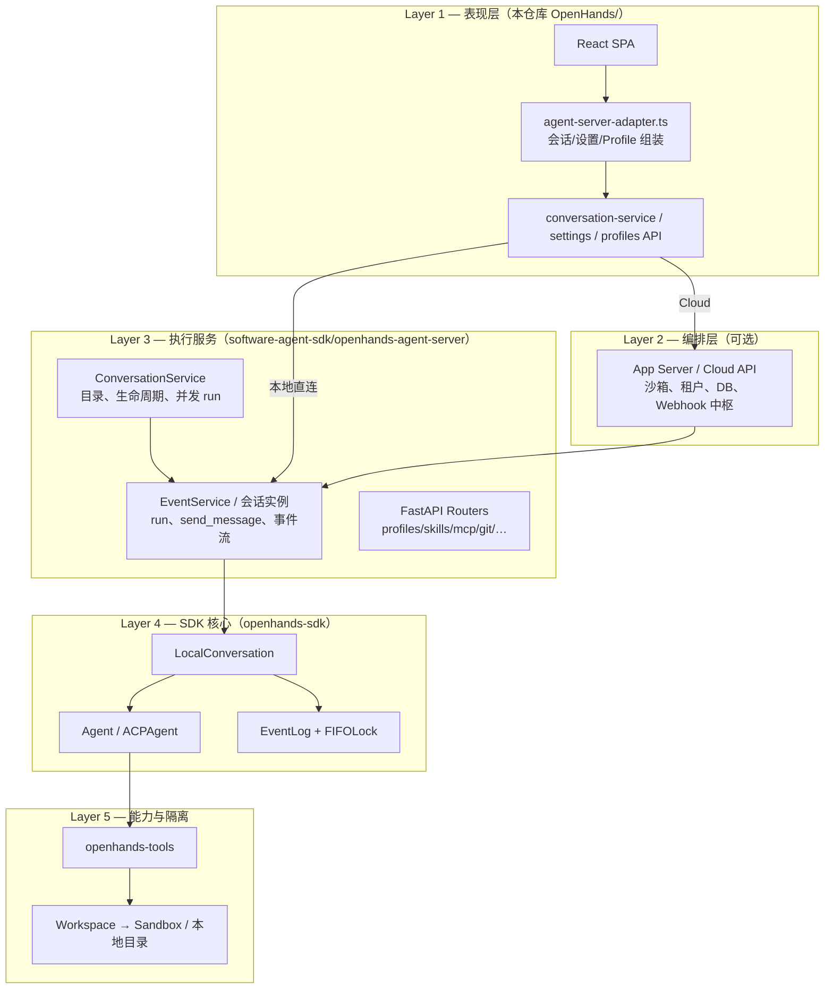
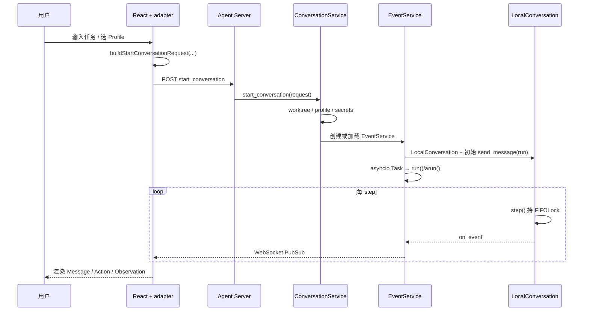

# OpenHands 应用层详解（SDK 之上的封装）

> **范围**: 本 monorepo 可对照的 V1 实现 — `software-agent-sdk/`（Agent Server + SDK）+ `OpenHands/`（React GUI）  
> **互补文档**: [`ENTITY_MODEL.md`](ENTITY_MODEL.md)、[`ARCHITECTURE_PART1.md`](ARCHITECTURE_PART1.md)、[`ARCHITECTURE_PART2.md`](ARCHITECTURE_PART2.md)、[`OpenHands_ARCHITECTURE_OVERVIEW.md`](OpenHands_ARCHITECTURE_OVERVIEW.md)  
> **最后更新**: 2026-09-24

---

## 1. 为什么要分层？

**Software Agent SDK** 提供的是「可嵌入的 Agent 运行时」：`LocalConversation`、`Agent`/`ACPAgent`、`EventLog`、`run()`/`step()`、工具与 Workspace。它**不知道** Web UI、多租户、沙箱编排、Git 凭证、Profile 商店、自动化触发等企业产品能力。

OpenHands **应用层**在 SDK 外包了三件事：

1. **进程与 API 边界** — 把 `LocalConversation` 变成长期运行的 HTTP/WebSocket 服务（Agent Server），可选再套一层编排（App Server / Cloud）。
2. **产品配置与密钥** — 把 UI/DB 里的 Settings、Agent Profile、MCP、Skills 解析成 SDK 能消费的 `Agent` + `StartConversationRequest`。
3. **观测与集成** — 事件 Pub/Sub、Webhook、遥测、终端/文件/ Git 侧车路由、Canvas Client Tools 等。



**本 monorepo 对照说明**

| 文档常见路径 | 本仓库 |
|--------------|--------|
| `openhands/app_server/`（上游 OpenHands 主仓） | 概念同 [`ARCHITECTURE_PART1.md`](ARCHITECTURE_PART1.md) §2；Cloud 代理见 `OpenHands/src/api/cloud/` |
| `openhands-agent-server/` | `software-agent-sdk/openhands-agent-server/` |
| `frontend/` | `OpenHands/src/` |
| V0 `AgentController` / `agenthub` | **无**；见 [`OpenHands_ARCHITECTURE_OVERVIEW.md`](OpenHands_ARCHITECTURE_OVERVIEW.md) 迁移表 |

---

## 2. SDK 与应用层的职责切分

| 能力 | SDK（`openhands-sdk`） | 应用层（Agent Server + GUI） |
|------|------------------------|------------------------------|
| ReAct 循环 | `run()` / `step()` / `astep()` | `EventService.run()` 后台任务 + 线程池 |
| 状态与事件 | `ConversationState`、`EventLog`、FIFOLock | 持久化目录、`meta.json` / `base_state.json`、分页读事件 |
| 用户消息 | `send_message()` → `MessageEvent` | HTTP `POST /events`、`run: true`、`_rerun_requested` |
| Agent 构造 | `Agent` / `ACPAgent` + `Tool` 列表 | Profile 解析、Settings 加密字段、Client Tools 注册 |
| 工作区 | `LocalWorkspace(working_dir)` | Git worktree 每会话分支、Docker 运行时工作目录 |
| 子 Agent | `TaskTool` + `AgentDefinition` | `sub_agents_router`、项目/用户 agent 目录 |
| 安全确认 | `ConfirmationPolicy` | UI 确认流 + `confirmation_policy` 请求字段 |
| 多用户 / RBAC | 无 | App Server / Cloud（文档 PART1–2） |

应用层**不替代** SDK 的 loop 语义；它负责 **何时创建/恢复 `LocalConversation`、如何把 HTTP 请求映射到 `send_message`/`run`、如何把 `_on_event` 推到 WebSocket**。

---

## 3. Agent Server：SDK 的「宿主进程」

源码根：`software-agent-sdk/openhands-agent-server/openhands/agent_server/`。

### 3.1 入口与路由装配

完整路由表、生命周期与 `EventService` 实现见 **[`AGENT_SERVER.md`](AGENT_SERVER.md)**。

`api.py` 挂载 FastAPI 应用，聚合能力路由，例如：

- **会话**: `conversation_router`、`conversation_catalog_router`
- **事件**: `event_router`（经 `ConversationRegistry.add_execution_routes`）
- **配置**: `settings_router`、`profiles_router`、`agent_profiles_router`
- **能力**: `skills_router`、`mcp_router`、`plugins_router`、`sub_agents_router`
- **工作区**: `file_router`、`git_router`、`bash_router`、`workspace_router`
- **产品扩展**: `canvas_extensions_router`、`hooks_router`、`llm_router`、`openai_router`
- **运维**: `auth_router`（Session API Key）、`init_router`、`server_details_router`

Agent Server 通常与 **同一沙箱或本机工作目录** 同进程运行，工具执行的 `Workspace` 即该环境。

### 3.2 ConversationService：目录级「会话经理」

```685:690:software-agent-sdk/openhands-agent-server/openhands/agent_server/conversation_service.py
class ConversationService:
    """Manage persisted conversations and their live runtimes.

    Startup loads only lightweight metadata. An ``EventService`` and its event
    history are hydrated when a conversation needs a live runtime.
    """
```

职责摘要：

| 职责 | 说明 |
|------|------|
| **目录扫描** | `conversations_dir` 下 `meta.json` + `base_state.json` 建会话目录 |
| **懒加载运行时** | 需要时才 `_get_or_load_event_service_locked` → 构造 `EventService` + `LocalConversation` |
| **start_conversation** | 解析 `StartConversationRequest`（Agent、workspace、worktree、profile、secrets） |
| **并发与驱逐** | `max_concurrent_runs`、idle TTL、lease（多实例时所有权） |
| **凭证** | `credential_bindings`、Codex/ACP 等 `activate_credential_binding` |
| **Webhook** | `webhook_specs` → 会话事件回调 App Server / 外部系统 |
| **Git worktree** | `worktree=true` 时为会话创建 `openhands/{conversation_id}` 分支隔离 |

`start_conversation` 对**已打开**的会话可幂等返回已有 `EventService`（例如重复启动或补密钥），否则创建新持久化目录并挂上 `EventService`。

### 3.3 EventService：单会话的 SDK 适配器

`EventService` ≈ **一个** `LocalConversation` 的 async 外壳（见 `event_service.py` 类文档）。

| SDK 调用 | 应用层包装 |
|----------|------------|
| `LocalConversation(...)` | 从 `StoredConversation` + `base_state.json` 恢复或新建 |
| `conversation.run()` / `arun()` | `_run_task` 后台任务；同步 `run` 走 `_run_executor` 线程池 |
| `send_message` | `run_in_executor` + 可选 `run()`；`conversation_already_running` → `_rerun_requested` |
| `_on_event` | `AsyncCallbackWrapper` → `PubSub` → WebSocket / 订阅方 |
| 流式 token | `_stream_pub_sub`（与事件总线分离） |
| 状态查询 | `get_state`、`ConversationStateUpdateEvent` 推送 |

循环与锁的语义仍以 SDK 为准，详见 [`ENTITY_MODEL.md`](ENTITY_MODEL.md) §11。

### 3.4 ConversationRegistry：运行时形态适配

默认 `ConversationRegistry` 描述**本机可执行**运行时，并把 `event_router`、runtime 路由、WebSocket（`conversation_sockets_router`、`session_socket`、bash socket）挂到 API 上。

Cloud / Remote 形态可在上游替换 Registry 实现（持久化事件读、runtime 不可用等），GUI 通过 `runtime_info`、`sandbox_status` 区分。

### 3.5 与 SDK 包的关系

| 包 | 角色 |
|----|------|
| `openhands-sdk` | Agent、Conversation、Event、LLM、Credential |
| `openhands-tools` | terminal、file_editor、task、browser 等 `ToolDefinition` |
| `openhands-workspace` | 沙箱/远程 workspace 实现（Docker 等） |
| `openhands-agent-server` | **本产品** FastAPI + 上述 SDK 的装配与 I/O |

---

## 4. App Server / Cloud（编排层，可选）

在 **本地桌面 / dev** 模式下，React 常 **直连 Agent Server**（`agent-server-conversation-service.api.ts` + Session API Key）。

在 **OpenHands Cloud / 自托管双机** 模式下，[`ARCHITECTURE_PART1.md`](ARCHITECTURE_PART1.md) 描述的 App Server 负责：

1. 用户/组织/计费与 DB 持久化  
2. **Sandbox 生命周期**（起容器、健康检查、注入 Agent Server URL）  
3. `start_conversation` **代理**到沙箱内 Agent Server  
4. Agent Server **Webhook** 回写事件 → DB → **WebSocket 推前端**  

数据流与 PART1 §1.4 序列图一致；本 monorepo 中 Cloud 路径见 `OpenHands/src/api/cloud/`、`callCloudProxy`。

应用层在此多出一跳，但 **沙箱内的 loop 仍是 SDK `LocalConversation`**。

---

## 5. React GUI：配置组装与协议翻译

源码根：`OpenHands/src/`。

### 5.1 双后端抽象

`agent-server-conversation-service.api.ts` 根据 active backend：

- **Local / Direct** — `@openhands/typescript-client` 调 Agent Server REST/WebSocket  
- **Cloud** — Cloud API + proxy，形状映射为统一的 `AppConversation`

`agent-server-adapter.ts` 是 **应用层最集中的「SDK 请求构建器」**。

### 5.2 启动会话：`buildStartConversationRequest`

把 UI 状态变成 Agent Server 的 `StartConversationRequest` 载荷：

| 输入 | 输出字段 / 行为 |
|------|-----------------|
| `Settings.agent_settings` | 内联 `agent_settings`（LLM、tools、`agent_kind` openhands/acp） |
| `agentProfileId` | **互斥**走 `agent_profile_id`，由服务端 resolve profile（#3727） |
| Skills 开关 | `agent_context.skills`、`disabled_skills`、`load_*_skills` |
| 扩展目录 | `buildBundledSkills()` 把 `@openhands/extensions` 打进 context |
| 初始用户话 | `initial_message` + `run: true` |
| OpenHands Agent | `client_tools`: Canvas UI、Launch Child Conversation |
| 工作区 | `workspace.working_dir`、可选 **git worktree** |
| 策略 | `confirmation_policy`、`max_iterations`、`stuck_detection`、`autotitle` |

Profile 路径与内联 `agent_settings` 的 enrichment 边界在 adapter 注释中写清（默认 toolset、public skills 由 server/SDK #3967 补齐）。

### 5.3 运行中交互

| UI 行为 | 应用层 | SDK |
|---------|--------|-----|
| 发送消息 | `POST /api/conversations/:id/events`（`run: true`） | `send_message` + `EventService.run` |
| 乐观气泡 | `enqueuePendingMessage` | 无 |
| 事件列表 | WebSocket / 分页 events API | `EventLog` 只读投影 |
| 暂停/停止 | execution API | `pause` / `interrupt` |
| 切换 Profile | 常需新会话 | `LaunchedAgentProfile` 快照 |

前端 **没有** agent 侧 steer 队列；并发语义见 [`ENTITY_MODEL.md`](ENTITY_MODEL.md) §11.7–11.11。

### 5.4 其它产品模块（仍属应用层）

- **Profiles / LLM Settings** — 解析为 SDK LLM 与 Agent Profile 存储格式  
- **MCP 页** — Agent Server `mcp_router` + Cloud MCP 服务（测试里区分 app server vs local agent-server OAuth）  
- **Automations** — `automation-service.api.ts` 挂本地 agent-server 或 Cloud 后端  
- **Planning 模式** — `buildStartPlanningConversationRequestWithEncryptedSettings`、plan 文件与 parent tag  
- **Telemetry** — `conversation_source`、distinct id 随启动请求打入 server  

---

## 6. 端到端：创建会话并跑一轮



**读路径**：UI 拉取 `meta` + 分页 `events`；**写路径**：用户消息与确认都经 Agent Server 进入 SDK EventLog。

---

## 7. 与 V0 应用层的概念映射

| V0（Legacy，`OpenHands_ARCHITECTURE_OVERVIEW.md`） | V1 应用层 + SDK |
|--------------------------------------------------|-----------------|
| `AgentController` + EventStream | `EventService` + `LocalConversation` |
| `agenthub` 多 Agent 类 | 单 `Agent` + Profile 字符串遗留字段；ACP 为 `ACPAgent` |
| `server/session` | `ConversationService` + WebSocket |
| Delegate / 子 controller | `TaskTool` + `sub_agents_router` |
| Runtime 插件 | SDK Plugins + `plugins_router` |

---

## 8. 阅读与调试建议

1. **先** [`ENTITY_MODEL.md`](ENTITY_MODEL.md) 弄清实体与 loop。  
2. **Agent 行为** — SDK `local_conversation.py` / `agent.py`。  
3. **HTTP 行为** — `conversation_router.py`、`event_router.py`、`event_service.py`。  
4. **UI 发什么** — `agent-server-adapter.ts` + `agent-server-conversation-service.api.ts`。  
5. **企业编排** — [`ARCHITECTURE_PART1.md`](ARCHITECTURE_PART1.md) App Server + [`ARCHITECTURE_PART2.md`](ARCHITECTURE_PART2.md) Event 回调与集成。

---

**维护**: 若上游 `openhands/app_server` 或 Agent Server 路由有变，以 `software-agent-sdk/openhands-agent-server` 与 `OpenHands/src/api` 为准更新本文。
