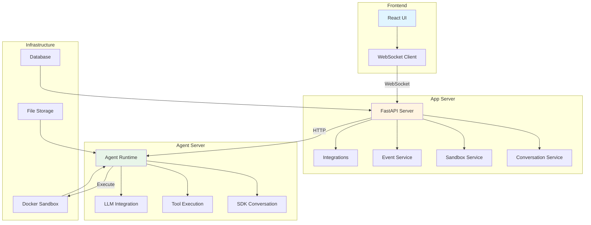
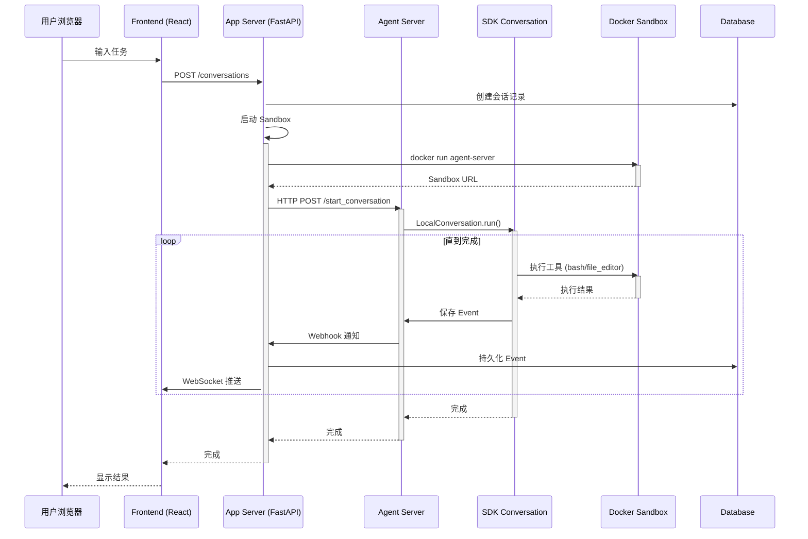
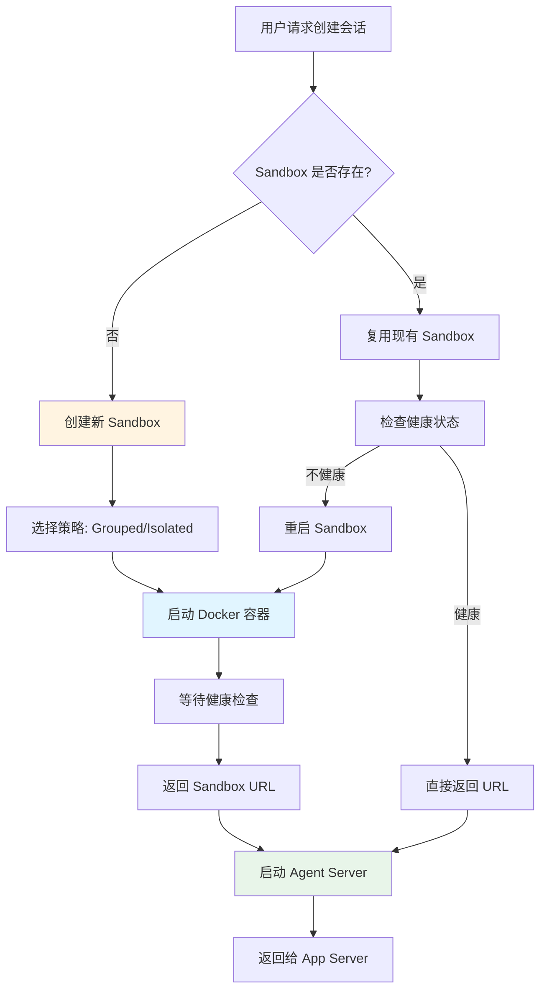

# OpenHands 完整架构设计文档（第一部分）

> **版本**: Latest (基于当前源码)  
> **分析时间**: 2026-05-17  
> **分析方法**: 源码深度阅读  
> **源码路径**: `/Users/gqli/work/deepagents/OpenHands/openhands`  
> **V1 应用层总览（SDK 封装、本 monorepo 路径）**: [`APPLICATION_LAYER.md`](APPLICATION_LAYER.md)

---

## 📋 目录

- [第1章：项目概览与核心架构](#第1章项目概览与核心架构)
- [第2章：App Server 架构](#第2章app-server-架构)
- [第3章：Agent Runtime 系统](#第3章agent-runtime-系统)
- [第4章：Sandbox 沙箱管理](#第4章sandbox-沙箱管理)

---

## 第1章：项目概览与核心架构

### 1.1 项目定位

**OpenHands** 是一个开源的 AI Agent 平台，提供：

1. ✅ **Web UI** - React 前端，支持实时对话可视化
2. ✅ **Agent Server** - FastAPI 后端，管理多个并发对话
3. ✅ **Sandbox 隔离** - Docker/Apptainer 沙箱执行环境
4. ✅ **企业功能** - 多租户、Git 集成、Analytics
5. ✅ **插件生态** - Skills、MCP、Integrations

---

### 1.2 核心模块架构



---

### 1.3 关键组件关系

| 组件 | 位置 | 职责 |
|------|------|------|
| `App Server` | `openhands/app_server/` | Web API、用户管理、会话编排 |
| `Agent Server` | `openhands-agent-server/` | Agent 执行、工具调用、事件流 |
| `SDK` | `openhands-sdk/` | 核心 Agent 逻辑（复用 software-agent-sdk） |
| `Sandbox` | `openhands-workspace/` | Docker/Apptainer 沙箱管理 |
| `Frontend` | `frontend/` | React + TypeScript UI |

---

### 1.4 数据流转全景图



---

### 1.5 两服务器架构

OpenHands 采用 **双服务器架构**：

#### **App Server** (`openhands/app_server/`)
- **技术栈**: FastAPI + PostgreSQL + Redis
- **职责**:
  - ✅ 用户认证与授权
  - ✅ 会话管理（创建、删除、列表）
  - ✅ Sandbox 生命周期管理
  - ✅ Git 集成（GitHub/GitLab/Bitbucket）
  - ✅ Analytics & Billing
  - ✅ Webhook 接收与处理

#### **Agent Server** (`openhands-agent-server/`)
- **技术栈**: FastAPI + Software Agent SDK
- **职责**:
  - ✅ 运行 `LocalConversation`
  - ✅ 工具执行（在 Sandbox 内）
  - ✅ 事件流式推送（Server-Sent Events）
  - ✅ 技能加载与管理
  - ✅ MCP Server 集成

**通信方式**：
- App Server → Agent Server: HTTP REST API
- Agent Server → App Server: Webhook 回调
- Frontend ↔ App Server: WebSocket 实时推送

---

## 第2章：App Server 架构

### 2.1 FastAPI 路由结构

**位置**: `openhands/app_server/routes/`

```
routes/
├── auth_router.py          # 认证路由 (/auth/*)
├── conversation_router.py  # 会话路由 (/conversations/*)
├── event_router.py         # 事件路由 (/events/*)
├── sandbox_router.py       # 沙箱路由 (/sandboxes/*)
├── integration_router.py   # 集成路由 (/integrations/*)
└── webhook_router.py       # Webhook 路由 (/webhooks/*)
```

---

### 2.2 会话创建流程

**位置**: `openhands/app_server/app_conversation/live_status_app_conversation_service.py:1216-1540`

```python
async def start_conversation(
    self,
    sandbox: SandboxInfo,
    conversation_id: UUID,
    initial_message: SendMessageRequest | None,
    agent_type: AgentType = AgentType.DEFAULT,
) -> StartConversationResponse:
    """创建并启动新对话"""
    
    # Step 1: 解析用户配置
    user = await self.user_context.get_user_info()
    agent_settings = user.agent_settings
    conversation_settings = user.conversation_settings
    
    # Step 2: 构建 Agent
    agent = agent_settings.create_agent()
    
    # Step 3: 应用服务器端覆盖
    if agent_type == AgentType.PLAN:
        # Planning Agent 特殊配置
        agent = self._apply_planning_overrides(agent)
    
    # Step 4: 准备初始消息
    initial_msg = self._construct_initial_message_with_plugin_params(
        initial_message, plugins
    )
    
    # Step 5: 构建 ConversationSettings
    conv_settings = conversation_settings.model_copy(update={
        'workspace': workspace,
        'conversation_id': conversation_id,
        'initial_message': initial_msg,
        'plugins': sdk_plugins,
    })
    
    # Step 6: 发送到 Agent Server
    request = conv_settings.create_request(StartConversationRequest, agent=agent)
    response = await self._send_to_agent_server(sandbox.url, request)
    
    return response
```

**关键点**：
1. ✅ **配置分离** - Agent Settings vs Conversation Settings
2. ✅ **Planning Agent** - 特殊的计划制定模式
3. ✅ **插件参数** - 将 Plugin 配置注入初始消息

---

### 2.3 Sandbox 生命周期管理

**位置**: `openhands/app_server/sandbox/`



**Sandbox 分组策略**：

```python
class SandboxGroupingStrategy(str, Enum):
    GROUPED = "grouped"      # 多个会话共享一个 Sandbox
    ISOLATED = "isolated"    # 每个会话独立 Sandbox
```

**对比**：

| 策略 | 优点 | 缺点 | 适用场景 |
|------|------|------|----------|
| **Grouped** | 资源利用率高、启动快 | 安全性较低、可能冲突 | 开发环境、可信用户 |
| **Isolated** | 完全隔离、安全 | 资源消耗大、启动慢 | 生产环境、多租户 |

**源码位置**: `openhands/app_server/settings/settings_models.py`

---

### 2.4 Webhook 处理机制

**位置**: `openhands/app_server/event_callback/webhook_router.py`

```python
@router.post("/webhooks/events")
async def handle_webhook(request: Request):
    """接收 Agent Server 的事件回调"""
    
    # Step 1: 验证签名
    signature = request.headers.get("X-Webhook-Signature")
    if not verify_signature(request.body(), signature):
        raise HTTPException(401, "Invalid signature")
    
    # Step 2: 解析事件
    data = await request.json()
    events = parse_events(data["events"])
    
    # Step 3: 持久化到数据库
    for event in events:
        await event_service.save_event(conversation_id, event)
    
    # Step 4: 推送到前端（WebSocket）
    await websocket_manager.broadcast(conversation_id, event)
    
    # Step 5: 执行回调处理器
    for callback in callbacks:
        await callback.execute(event)
    
    # Step 6: 检测终端状态
    exec_status = detect_execution_status(events)
    if exec_status.is_terminal():
        await track_conversation_terminal(...)
    
    return Success()
```

**回调处理器**：
- ✅ `SetTitleCallbackProcessor` - 自动生成会话标题
- ✅ `EventCallbackProcessor` - 自定义业务逻辑

**源码位置**: `openhands/app_server/event_callback/set_title_callback_processor.py`

---

### 2.5 用户与组织管理

**位置**: `openhands/app_server/storage/`

```python
# 核心存储模型
class UserStore:
    """用户数据存储"""
    async def get_user(user_id: str) -> User
    async def update_user_settings(user_id: str, settings: dict)
    async def get_user_secrets(user_id: str) -> dict[str, SecretValue]

class OrgStore:
    """组织数据存储"""
    async def get_org(org_id: str) -> Organization
    async def add_member(org_id: str, user_id: str, role: str)
    async def get_members(org_id: str) -> list[Member]

class UserRepositoryMapStore:
    """用户-仓库映射"""
    async def link_repo(user_id: str, repo_url: str, provider: str)
    async def get_linked_repos(user_id: str) -> list[Repository]
```

**数据表关系**：
```
users ──< user_authorizations >── git_providers (GitHub/GitLab)
  │
  ├─< org_members >── organizations
  │
  ├─< user_repo_map >── repositories
  │
  └─< stored_custom_secrets >── secrets
```

---

## 第3章：Agent Runtime 系统

### 3.1 Agent Server 入口

**位置**: `openhands-agent-server/openhands/agent_server/__main__.py`

```python
def main():
    """Agent Server 启动入口"""
    
    # Step 1: 加载配置
    config = load_config()
    
    # Step 2: 初始化服务
    conversation_service = ConversationService(config.persistence_dir)
    event_service = EventService()
    tool_service = ToolService()
    
    # Step 3: 注册路由
    app = FastAPI()
    app.include_router(conversation_router)
    app.include_router(event_router)
    app.include_router(tool_router)
    
    # Step 4: 启动服务器
    uvicorn.run(app, host="0.0.0.0", port=config.port)

if __name__ == "__main__":
    main()
```

---

### 3.2 对话路由

**位置**: `openhands-agent-server/openhands/agent_server/conversation_router.py`

```python
@router.post("/start_conversation")
async def start_conversation(request: StartConversationRequest):
    """启动新对话"""
    
    # Step 1: 创建 LocalConversation
    conversation = LocalConversation(
        agent=request.agent,
        workspace=LocalWorkspace(request.workspace_path),
        persistence_dir=request.persistence_dir,
        callbacks=[event_callback],
    )
    
    # Step 2: 异步运行
    task = asyncio.create_task(conversation.run())
    
    # Step 3: 返回会话 ID
    return {
        "conversation_id": str(conversation.id),
        "status": "running",
    }

@router.get("/conversation/{conversation_id}/events")
async def stream_events(conversation_id: str):
    """流式推送事件（Server-Sent Events）"""
    
    async def event_generator():
        while True:
            event = await event_queue.get()
            yield f"data: {event.json()}\n\n"
    
    return StreamingResponse(
        event_generator(),
        media_type="text/event-stream",
    )
```

---

### 3.3 工具执行服务

**位置**: `openhands-agent-server/openhands/agent_server/tool_router.py`

```python
@router.post("/execute_tool")
async def execute_tool(request: ExecuteToolRequest):
    """直接执行工具（绕过 Agent Loop）"""
    
    # Step 1: 获取工具
    tool = tools_map.get(request.tool_name)
    if not tool:
        raise HTTPException(404, f"Tool '{request.tool_name}' not found")
    
    # Step 2: 执行
    try:
        observation = tool.executor(request.action, conversation)
        
        return {
            "success": True,
            "observation": observation.dict(),
        }
    except Exception as e:
        return {
            "success": False,
            "error": str(e),
        }
```

**应用场景**：
- ✅ **预运行设置** - 索引代码库、安装依赖
- ✅ **手动调试** - 测试工具行为
- ✅ **环境准备** - 配置工作区

---

### 3.4 事件持久化与重放

**位置**: `openhands-agent-server/openhands/agent_server/persistence/`

```python
class FileEventStore:
    """基于文件系统的事件存储"""
    
    def __init__(self, base_dir: str):
        self.base_dir = Path(base_dir)
    
    def save_event(self, conversation_id: str, event: Event):
        """保存事件到 JSON 文件"""
        event_file = self.base_dir / conversation_id / f"{event.id}.json"
        event_file.write_text(event.json(indent=2))
    
    def load_events(self, conversation_id: str) -> list[Event]:
        """按顺序加载所有事件"""
        event_dir = self.base_dir / conversation_id
        event_files = sorted(event_dir.glob("*.json"))
        
        events = []
        for event_file in event_files:
            event_data = json.loads(event_file.read_text())
            events.append(Event.parse_obj(event_data))
        
        return events
    
    def replay_events(self, conversation_id: str):
        """重放事件以恢复对话状态"""
        events = self.load_events(conversation_id)
        
        # 重建 Conversation 状态
        conversation = LocalConversation(...)
        for event in events:
            conversation._add_event(event, persist=False)
        
        return conversation
```

**文件格式**：
```
.persistence/
├── conv_abc123/
│   ├── 000001.json  # SystemPromptEvent
│   ├── 000002.json  # MessageEvent (user)
│   ├── 000003.json  # ActionEvent (bash)
│   ├── 000004.json  # ObservationEvent
│   └── ...
└── conv_def456/
    └── ...
```

---

## 第4章：Sandbox 沙箱管理

### 4.1 Sandbox 类型系统

```python
class SandboxType(str, Enum):
    DOCKER = "docker"           # Docker 容器
    APPTAINER = "apptainer"     # Apptainer (原 Singularity)
    REMOTE_API = "remote_api"   # 远程 API (如 Daytona)
    CLOUD_WORKSPACE = "cloud"   # 云工作区
```

**对比**：

| 类型 | 隔离级别 | 启动速度 | 适用平台 |
|------|---------|---------|----------|
| **Docker** | 进程级 | ~5秒 | Linux/macOS/Windows |
| **Apptainer** | 系统级 | ~2秒 | Linux (HPC) |
| **Remote API** | 网络级 | ~1秒 | 云平台 |
| **Cloud** | VM级 | ~30秒 | AWS/GCP/Azure |

---

### 4.2 Docker Sandbox 实现

**位置**: `openhands-workspace/openhands/workspace/docker/`

```python
class DockerSandboxSpecService(SandboxSpecService):
    """Docker 沙箱管理服务"""
    
    async def create_sandbox(
        self,
        image: str = "openhands/agent-server:latest",
        environment: dict[str, str] | None = None,
        volumes: dict[str, str] | None = None,
    ) -> SandboxInfo:
        """创建 Docker 容器"""
        
        # Step 1: 拉取镜像（如果不存在）
        await self._pull_image_if_needed(image)
        
        # Step 2: 准备环境变量
        env = self._prepare_environment(environment)
        
        # Step 3: 启动容器
        container = self.docker_client.containers.run(
            image=image,
            environment=env,
            volumes=volumes,
            network_mode="bridge",
            detach=True,
            auto_remove=False,
        )
        
        # Step 4: 等待健康检查
        await self._wait_for_health(container)
        
        # Step 5: 返回 Sandbox 信息
        return SandboxInfo(
            id=container.id,
            url=f"http://localhost:{container.ports['8000/tcp'][0]['HostPort']}",
            status=SandboxStatus.RUNNING,
        )
```

**健康检查**：
```python
async def _wait_for_health(self, container, timeout=60):
    """等待容器健康"""
    start_time = time.time()
    
    while time.time() - start_time < timeout:
        try:
            response = await httpx.get(f"http://localhost:{port}/health")
            if response.status_code == 200:
                return
        except:
            pass
        
        await asyncio.sleep(1)
    
    raise TimeoutError("Sandbox health check timeout")
```

---

### 4.3 Sandbox 环境变量注入

**位置**: `openhands/app_server/sandbox/sandbox_spec_service.py:77-130`

```python
def get_agent_server_env() -> dict[str, str]:
    """获取要注入到 Agent Server 容器的环境变量"""
    
    env = {}
    
    # 自动转发特定前缀的变量
    AUTO_FORWARD_PREFIXES = ["LLM_", "LMNR_"]
    
    for key, value in os.environ.items():
        if any(key.startswith(prefix) for prefix in AUTO_FORWARD_PREFIXES):
            env[key] = value
    
    # 显式覆盖（通过 OH_AGENT_SERVER_ENV）
    if override := os.getenv("OH_AGENT_SERVER_ENV"):
        env.update(json.loads(override))
    
    return env
```

**转发的变量**：
- ✅ `LLM_TIMEOUT` - LLM 超时设置
- ✅ `LLM_NUM_RETRIES` - 重试次数
- ✅ `LMNR_PROJECT_API_KEY` - Laminar Analytics
- ✅ `LMNR_BASE_URL` - Analytics 端点

---

### 4.4 Workspace 持久化

**位置**: `openhands-agent-server/openhands/agent_server/workspace_router.py`

```python
@router.post("/workspace/upload")
async def upload_workspace(conversation_id: str, file: UploadFile):
    """上传文件到工作区"""
    
    workspace_dir = self._get_workspace_dir(conversation_id)
    file_path = workspace_dir / file.filename
    
    with open(file_path, "wb") as f:
        f.write(await file.read())
    
    return {"path": str(file_path)}

@router.get("/workspace/download/{path:path}")
async def download_workspace_file(conversation_id: str, path: str):
    """从工作区下载文件"""
    
    workspace_dir = self._get_workspace_dir(conversation_id)
    file_path = workspace_dir / path
    
    if not file_path.exists():
        raise HTTPException(404, "File not found")
    
    return FileResponse(file_path)
```

**持久化策略**：
- ✅ **会话级** - 每个对话有独立的工作区目录
- ✅ **自动清理** - 对话删除时清理工作区
- ✅ **挂载卷** - Docker 容器挂载主机目录

---

### 4.5 Sandbox 安全机制

#### **网络隔离**

```python
# Docker 网络配置
network_config = {
    "network_mode": "bridge",  # 桥接网络
    "dns": ["8.8.8.8"],        # DNS 服务器
    "extra_hosts": {},          # 额外 hosts 映射
}

# 禁止访问内部网络
iptables_rules = [
    "DROP -d 10.0.0.0/8",      # 禁止访问私有网络
    "DROP -d 172.16.0.0/12",
    "DROP -d 192.168.0.0/16",
]
```

#### **资源限制**

```python
# Docker 资源限制
container_config = {
    "cpu_quota": 50000,         # 50% CPU
    "mem_limit": "2g",          # 2GB 内存
    "pids_limit": 100,          # 最多 100 个进程
    "ulimits": [
        Ulimit(name="nofile", soft=1024, hard=2048),  # 文件描述符
    ]
}
```

#### **文件系统只读**

```python
# 关键目录只读
volumes = {
    "/usr/lib": {"bind": "/usr/lib", "mode": "ro"},  # 只读
    "/etc/passwd": {"bind": "/etc/passwd", "mode": "ro"},
    "/workspace": {"bind": "/workspace", "mode": "rw"},  # 工作区可写
}
```

---

## 总结

本文档深入分析了 OpenHands 的核心架构：

✅ **第1章** - 项目概览与核心架构（双服务器架构、数据流转）  
✅ **第2章** - App Server 架构（FastAPI 路由、Sandbox 管理、Webhook）  
✅ **第3章** - Agent Runtime 系统（Agent Server、工具执行、事件持久化）  
✅ **第4章** - Sandbox 沙箱管理（Docker 实现、环境变量、安全机制）  

**关键洞察**：
1. ✅ **双服务器架构** - App Server 负责编排，Agent Server 负责执行
2. ✅ **Sandbox 隔离** - Docker/Apptainer 提供安全执行环境
3. ✅ **事件驱动** - Webhook + WebSocket 实现实时更新
4. ✅ **灵活扩展** - 支持多种 Sandbox 类型和部署策略

**下一步**：
- 阅读 PART2（Event 处理、Integrations、Analytics）
- 阅读 PART3（Enterprise 功能、Deployment、Advanced Topics）
- 参考官方文档：https://docs.all-hands.dev/

---

**文档版本**: 1.0  
**最后更新**: 2026-05-17  
**维护者**: Deep Agents Team
