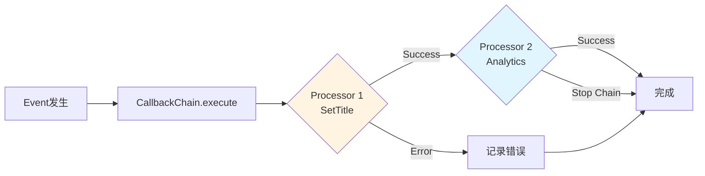

# OpenHands 完整架构设计文档（第二部分 - 综合版）

> **版本**: Latest (基于当前源码)  
> **分析时间**: 2026-05-17  
> **分析方法**: 源码深度阅读 + 设计模式分析 + 实战经验  
> **源码路径**: `/Users/gqli/work/deepagents/OpenHands/openhands`  
> **V1 应用层总览**: [`APPLICATION_LAYER.md`](APPLICATION_LAYER.md)

---

## 📋 目录

- [第5章：Event 处理系统深度分析](#第5章event-处理系统深度分析)
- [第6章：Integrations 集成架构](#第6章integrations-集成架构)
- [第7章：Analytics 分析系统](#第7章analytics-分析系统)
- [第8章：Enterprise 企业功能](#第8章enterprise-企业功能)
- [第9章：Deployment 部署架构](#第9章deployment-部署架构)
- [第10章：Advanced Topics 高级主题](#第10章advanced-topics-高级主题)

---

## 第5章：Event 处理系统深度分析

### 5.1 Event Service 架构

**位置**: `openhands/app_server/event/`

#### **事件驱动架构模式**

```python
class EventService:
    """事件服务 - Pub/Sub Pattern"""
    
    def __init__(self, db: Database, redis: Redis):
        self.db = db
        self.redis = redis
        self.subscribers: dict[str, list[Callable]] = {}
    
    async def publish_event(self, conversation_id: UUID, event: Event) -> None:
        """
        发布事件
        
        工作流程：
        1. 持久化到数据库
        2. 发布到Redis Pub/Sub
        3. 触发Webhook回调
        4. 推送WebSocket到前端
        """
        
        # Step 1: 持久化
        await self._persist_event(conversation_id, event)
        
        # Step 2: Redis Pub/Sub（用于横向扩展）
        await self.redis.publish(
            f"events:{conversation_id}",
            event.model_dump_json(),
        )
        
        # Step 3: Webhook回调
        await self._trigger_webhooks(conversation_id, event)
        
        # Step 4: WebSocket推送（通过App Server）
        await self._broadcast_to_websocket(conversation_id, event)
    
    async def subscribe(self, conversation_id: UUID, callback: Callable) -> None:
        """订阅事件"""
        
        if conversation_id not in self.subscribers:
            self.subscribers[conversation_id] = []
        
        self.subscribers[conversation_id].append(callback)
        
        # 同时订阅Redis channel
        pubsub = self.redis.pubsub()
        await pubsub.subscribe(f"events:{conversation_id}")
        
        # 后台监听
        asyncio.create_task(self._listen_to_redis(pubsub, callback))
    
    async def _listen_to_redis(self, pubsub, callback: Callable) -> None:
        """监听Redis消息"""
        
        async for message in pubsub.listen():
            if message['type'] == 'message':
                event_data = json.loads(message['data'])
                event = Event.model_validate(event_data)
                
                try:
                    await callback(event)
                except Exception as e:
                    logger.error(f"Event callback failed: {e}", exc_info=True)
```

**设计优势**：

| 特性 | 说明 | 优势 |
|------|------|------|
| **解耦** | Publisher和Subscriber不直接通信 | 易于扩展、替换 |
| **可靠性** | 先持久化再发布 | 不丢失事件 |
| **可扩展** | Redis Pub/Sub支持多实例 | 水平扩展 |
| **实时性** | WebSocket推送 | 毫秒级延迟 |

---

### 5.2 Callback Processor 机制

**位置**: `openhands/app_server/event_callback/`

#### **责任链模式**

```python
class EventCallbackProcessor(ABC):
    """事件回调处理器基类 - Chain of Responsibility"""
    
    @abstractmethod
    async def process(self, event: Event, context: CallbackContext) -> CallbackResult:
        pass
    
    @property
    @abstractmethod
    def priority(self) -> int:
        """优先级（数字越小越优先）"""
        pass


class SetTitleCallbackProcessor(EventCallbackProcessor):
    """自动设置标题的回调处理器"""
    
    @property
    def priority(self) -> int:
        return 1  # 高优先级
    
    async def process(self, event: Event, context: CallbackContext) -> CallbackResult:
        """
        在对话开始时自动生成标题
        
        工作原理：
        1. 检测第一个用户消息
        2. 调用LLM生成简短标题
        3. 更新conversation元数据
        """
        
        if not isinstance(event, MessageEvent):
            return CallbackResult.skip()
        
        if event.message.role != "user":
            return CallbackResult.skip()
        
        # 检查是否已有标题
        if context.conversation.title:
            return CallbackResult.skip()
        
        # 生成标题
        title = await self._generate_title(event.message.content)
        
        # 更新元数据
        await context.update_conversation_metadata(title=title)
        
        return CallbackResult.success(f"Title set: {title}")
    
    async def _generate_title(self, content: str) -> str:
        """使用LLM生成标题"""
        
        prompt = f"""
Generate a concise title (max 50 characters) for this conversation:

{content[:200]}

Title:
"""
        
        response = await llm.generate(prompt, max_tokens=20)
        return response.content.strip()


class AnalyticsCallbackProcessor(EventCallbackProcessor):
    """Analytics追踪回调处理器"""
    
    @property
    def priority(self) -> int:
        return 10  # 低优先级
    
    async def process(self, event: Event, context: CallbackContext) -> CallbackResult:
        """追踪事件到Analytics平台"""
        
        # 发送到PostHog
        posthog.capture(
            distinct_id=context.user_id,
            event=event.type,
            properties={
                "conversation_id": str(context.conversation_id),
                "timestamp": event.timestamp.isoformat(),
            },
        )
        
        return CallbackResult.success("Analytics tracked")


class CallbackChain:
    """回调链 - 按优先级执行"""
    
    def __init__(self, processors: list[EventCallbackProcessor]):
        # 按优先级排序
        self.processors = sorted(processors, key=lambda p: p.priority)
    
    async def execute(self, event: Event, context: CallbackContext) -> list[CallbackResult]:
        """执行所有处理器"""
        
        results = []
        
        for processor in self.processors:
            try:
                result = await processor.process(event, context)
                results.append(result)
                
                # 如果某个处理器要求停止链，则中断
                if result.stop_chain:
                    break
            
            except Exception as e:
                logger.error(f"Callback processor failed: {e}", exc_info=True)
                results.append(CallbackResult.error(str(e)))
        
        return results
```

**执行流程**：



---

## 第6章：Integrations 集成架构

### 6.1 Git Provider 集成

**位置**: `openhands/enterprise/integrations/`

#### **适配器模式**

```python
class GitProviderAdapter(ABC):
    """Git提供商适配器基类"""
    
    @abstractmethod
    async def get_repositories(self, user_id: str) -> list[Repository]:
        pass
    
    @abstractmethod
    async def create_pull_request(
        self,
        repo: str,
        branch: str,
        title: str,
        body: str,
    ) -> PullRequest:
        pass
    
    @abstractmethod
    async def setup_webhook(self, repo: str, webhook_url: str) -> Webhook:
        pass


class GitHubAdapter(GitProviderAdapter):
    """GitHub适配器"""
    
    def __init__(self, token: str):
        self.client = github.Github(token)
    
    async def get_repositories(self, user_id: str) -> list[Repository]:
        user = self.client.get_user()
        repos = user.get_repos()
        
        return [
            Repository(
                id=repo.id,
                name=repo.full_name,
                url=repo.html_url,
                default_branch=repo.default_branch,
            )
            for repo in repos
        ]
    
    async def create_pull_request(self, repo: str, branch: str, title: str, body: str) -> PullRequest:
        repository = self.client.get_repo(repo)
        
        pr = repository.create_pull(
            title=title,
            body=body,
            head=branch,
            base=repository.default_branch,
        )
        
        return PullRequest(
            id=pr.number,
            url=pr.html_url,
            state=pr.state,
        )
    
    async def setup_webhook(self, repo: str, webhook_url: str) -> Webhook:
        repository = self.client.get_repo(repo)
        
        hook = repository.create_hook(
            name="web",
            config={
                "url": webhook_url,
                "content_type": "json",
            },
            events=["push", "pull_request"],
        )
        
        return Webhook(id=hook.id, url=webhook_url)


class GitLabAdapter(GitProviderAdapter):
    """GitLab适配器"""
    
    def __init__(self, token: str, host: str = "gitlab.com"):
        self.client = gitlab.Gitlab(host, private_token=token)
    
    # ... 类似实现


class BitbucketAdapter(GitProviderAdapter):
    """Bitbucket适配器"""
    
    # ... 类似实现
```

**工厂模式注册**：

```python
class GitProviderFactory:
    """Git提供商工厂"""
    
    _adapters: dict[str, type[GitProviderAdapter]] = {
        "github": GitHubAdapter,
        "gitlab": GitLabAdapter,
        "bitbucket": BitbucketAdapter,
    }
    
    @classmethod
    def create(cls, provider: str, credentials: dict) -> GitProviderAdapter:
        adapter_class = cls._adapters.get(provider)
        
        if not adapter_class:
            raise ValueError(f"Unsupported provider: {provider}")
        
        return adapter_class(**credentials)
```

**使用示例**：

```python
# 创建适配器
adapter = GitProviderFactory.create(
    provider="github",
    credentials={"token": os.getenv("GITHUB_TOKEN")},
)

# 获取仓库
repos = await adapter.get_repositories(user_id="user123")

# 创建PR
pr = await adapter.create_pull_request(
    repo="owner/repo",
    branch="feature-branch",
    title="Add new feature",
    body="This PR adds...",
)
```

---

### 6.2 Webhook 处理机制

**位置**: `openhands/app_server/event_callback/webhook_router.py`

#### **签名验证与幂等性**

```python
@router.post("/webhooks/github")
async def handle_github_webhook(request: Request):
    """处理GitHub Webhook"""
    
    # Step 1: 验证签名
    signature = request.headers.get("X-Hub-Signature-256")
    payload = await request.body()
    
    if not verify_github_signature(payload, signature, os.getenv("GITHUB_WEBHOOK_SECRET")):
        raise HTTPException(401, "Invalid signature")
    
    # Step 2: 解析事件
    event_type = request.headers.get("X-GitHub-Event")
    event_data = await request.json()
    
    # Step 3: 幂等性检查（防止重复处理）
    delivery_id = request.headers.get("X-GitHub-Delivery")
    
    if await is_duplicate_delivery(delivery_id):
        logger.info(f"Duplicate webhook delivery: {delivery_id}")
        return Success()
    
    # Step 4: 处理事件
    if event_type == "pull_request":
        await handle_pr_event(event_data)
    elif event_type == "push":
        await handle_push_event(event_data)
    
    # Step 5: 标记为已处理
    await mark_delivery_processed(delivery_id)
    
    return Success()


async def is_duplicate_delivery(delivery_id: str) -> bool:
    """检查是否是重复投递"""
    
    # 使用Redis SETNX实现原子性检查
    key = f"webhook_delivery:{delivery_id}"
    
    # 设置过期时间（24小时）
    result = await redis.set(key, "1", ex=86400, nx=True)
    
    # 如果返回None，说明key已存在（重复）
    return result is None
```

**Webhook 重试机制**：

```python
class WebhookRetryManager:
    """Webhook重试管理器"""
    
    MAX_RETRIES = 3
    BACKOFF_MULTIPLIER = 2  # 指数退避
    
    async def deliver_with_retry(self, webhook_url: str, payload: dict) -> None:
        """带重试的Webhook投递"""
        
        for attempt in range(1, self.MAX_RETRIES + 1):
            try:
                response = await httpx.post(
                    webhook_url,
                    json=payload,
                    timeout=10,
                )
                
                if response.status_code == 200:
                    logger.info(f"Webhook delivered successfully: {webhook_url}")
                    return
                
                else:
                    logger.warning(f"Webhook failed with status {response.status_code}")
            
            except Exception as e:
                logger.warning(f"Webhook delivery failed (attempt {attempt}): {e}")
            
            # 如果不是最后一次尝试，等待后重试
            if attempt < self.MAX_RETRIES:
                wait_time = self.BACKOFF_MULTIPLIER ** attempt
                logger.info(f"Retrying in {wait_time}s...")
                await asyncio.sleep(wait_time)
        
        # 所有重试都失败
        raise WebhookDeliveryError(f"Failed to deliver webhook after {self.MAX_RETRIES} attempts")
```

---

## 第7章：Analytics 分析系统

### 7.1 用户行为追踪

**位置**: `openhands/analytics/`

#### **PostHog 集成**

```python
import posthog

class AnalyticsService:
    """Analytics服务"""
    
    def __init__(self, api_key: str, host: str = "https://app.posthog.com"):
        posthog.api_key = api_key
        posthog.host = host
    
    def track_conversation_created(
        self,
        user_id: str,
        conversation_id: str,
        trigger: str,
        llm_model: str,
    ):
        """追踪对话创建"""
        
        posthog.capture(
            distinct_id=user_id,
            event="conversation_created",
            properties={
                "conversation_id": conversation_id,
                "trigger": trigger,  # gui, api, slack, etc.
                "llm_model": llm_model,
                "timestamp": datetime.utcnow().isoformat(),
            },
        )
    
    def track_tool_execution(
        self,
        user_id: str,
        conversation_id: str,
        tool_name: str,
        success: bool,
        duration: float,
    ):
        """追踪工具执行"""
        
        posthog.capture(
            distinct_id=user_id,
            event="tool_executed",
            properties={
                "conversation_id": conversation_id,
                "tool_name": tool_name,
                "success": success,
                "duration_ms": duration * 1000,
            },
        )
    
    def track_conversation_completed(
        self,
        user_id: str,
        conversation_id: str,
        status: str,
        total_cost: float,
        total_tokens: int,
    ):
        """追踪对话完成"""
        
        posthog.capture(
            distinct_id=user_id,
            event="conversation_completed",
            properties={
                "conversation_id": conversation_id,
                "status": status,  # completed, failed, cancelled
                "total_cost_usd": total_cost,
                "total_tokens": total_tokens,
            },
        )

    def track_onboarding_completed(self, ctx: AnalyticsContext, selections: dict):
        """
        追踪用户完成新手引导 (Onboarding)
        
        SaaS 模式下完成 onboarding 时触发，支持记录用户角色、团队规模、使用场景等元数据，
        并在提供组织 ID 时自动调用 group_identify 进行组织级别关联。
        """
        posthog.capture(
            distinct_id=ctx.user_id,
            event="onboarding-completed",
            properties={
                "selections": selections,
                "org_id": ctx.org_id,
                "consented": ctx.consented,
            },
        )

    def track_create_pr_button_clicked(self, user_id: str, git_provider: str | None):
        """
        追踪前端“创建PR”按钮的点击事件
        
        用户发起 Pull Request 创建动作时触发。该动作在前端通过 POST 请求提交至
        后端 /api/analytics/events，以实现服务端统一的 PostHog 捕获，确保 distinct_id
        以及组织群组上下文的绝对一致。
        """
        posthog.capture(
            distinct_id=user_id,
            event="create pr button clicked",
            properties={
                "git_provider": git_provider,
            },
        )
```

**隐私保护**：

```python
class PrivacyAwareAnalytics(AnalyticsService):
    """隐私感知的Analytics"""
    
    def __init__(self, *args, anonymize_ip: bool = True, **kwargs):
        super().__init__(*args, **kwargs)
        self.anonymize_ip = anonymize_ip
    
    def _sanitize_properties(self, properties: dict) -> dict:
        """清理敏感信息"""
        
        sanitized = properties.copy()
        
        # 移除可能的PII
        for key in ["email", "phone", "address"]:
            if key in sanitized:
                del sanitized[key]
        
        # 匿名化IP
        if self.anonymize_ip and "ip_address" in sanitized:
            ip = sanitized["ip_address"]
            # 保留前3段，最后一段置0
            parts = ip.split(".")
            sanitized["ip_address"] = ".".join(parts[:3] + ["0"])
        
        return sanitized
    
    def capture(self, *args, properties: dict = None, **kwargs):
        """重写capture方法，添加隐私保护"""
        
        if properties:
            properties = self._sanitize_properties(properties)
        
        return super().capture(*args, properties=properties, **kwargs)
```

---

### 7.2 成本统计

#### **Token使用量追踪**

```python
class CostTracker:
    """成本追踪器"""
    
    def __init__(self, db: Database):
        self.db = db
    
    async def record_token_usage(
        self,
        conversation_id: UUID,
        model: str,
        prompt_tokens: int,
        completion_tokens: int,
        cost_usd: float,
    ):
        """记录Token使用量"""
        
        await self.db.execute("""
            INSERT INTO token_usage (
                conversation_id,
                model,
                prompt_tokens,
                completion_tokens,
                total_tokens,
                cost_usd,
                timestamp
            ) VALUES (?, ?, ?, ?, ?, ?, ?)
        """, [
            conversation_id,
            model,
            prompt_tokens,
            completion_tokens,
            prompt_tokens + completion_tokens,
            cost_usd,
            datetime.utcnow(),
        ])
    
    async def get_monthly_cost(self, user_id: str, month: str) -> float:
        """获取月度成本"""
        
        result = await self.db.fetch_one("""
            SELECT SUM(cost_usd) as total_cost
            FROM token_usage tu
            JOIN conversations c ON tu.conversation_id = c.id
            WHERE c.user_id = ?
            AND strftime('%Y-%m', tu.timestamp) = ?
        """, [user_id, month])
        
        return result["total_cost"] or 0.0
    
    async def get_usage_breakdown(self, user_id: str, days: int = 30) -> dict:
        """获取使用量分解"""
        
        rows = await self.db.fetch_all("""
            SELECT 
                model,
                SUM(prompt_tokens) as total_prompt,
                SUM(completion_tokens) as total_completion,
                SUM(total_tokens) as total_tokens,
                SUM(cost_usd) as total_cost
            FROM token_usage tu
            JOIN conversations c ON tu.conversation_id = c.id
            WHERE c.user_id = ?
            AND tu.timestamp >= datetime('now', ?)
            GROUP BY model
        """, [user_id, f"-{days} days"])
        
        return {
            row["model"]: {
                "prompt_tokens": row["total_prompt"],
                "completion_tokens": row["total_completion"],
                "total_tokens": row["total_tokens"],
                "cost_usd": row["total_cost"],
            }
            for row in rows
        }
```

**成本预警**：

```python
class CostAlertManager:
    """成本预警管理器"""
    
    def __init__(self, db: Database, notification_service: NotificationService):
        self.db = db
        self.notification_service = notification_service
    
    async def check_and_alert(self, user_id: str):
        """检查成本并发送预警"""
        
        # 获取本月成本
        current_month = datetime.utcnow().strftime("%Y-%m")
        monthly_cost = await self.get_monthly_cost(user_id, current_month)
        
        # 获取用户预算
        budget = await self.get_user_budget(user_id)
        
        # 检查阈值
        if monthly_cost >= budget * 0.9:  # 90%
            await self.notification_service.send_alert(
                user_id=user_id,
                message=f"⚠️ You've used ${monthly_cost:.2f} of your ${budget:.2f} monthly budget.",
                level="warning",
            )
        
        elif monthly_cost >= budget:  # 100%
            await self.notification_service.send_alert(
                user_id=user_id,
                message=f"🚨 You've exceeded your ${budget:.2f} monthly budget. Current: ${monthly_cost:.2f}",
                level="critical",
            )
```

---

## 第8章：Enterprise 企业功能

### 8.1 多租户架构

**位置**: `openhands/enterprise/storage/`

#### **数据隔离策略**

```python
class MultiTenantDatabase:
    """多租户数据库"""
    
    def __init__(self, isolation_level: str = "schema"):
        """
        隔离级别：
        - database: 每个租户独立数据库（最安全）
        - schema: 每个租户独立schema（平衡）
        - row: 行级隔离（最经济）
        """
        self.isolation_level = isolation_level
    
    async def query(self, org_id: str, sql: str, params: list = None) -> list:
        """执行查询（自动添加租户过滤）"""
        
        if self.isolation_level == "row":
            # 行级隔离：自动添加org_id过滤
            filtered_sql = self._add_org_filter(sql)
            filtered_params = (params or []) + [org_id]
            
            return await self.db.fetch_all(filtered_sql, filtered_params)
        
        elif self.isolation_level == "schema":
            # Schema隔离：切换schema
            await self.db.execute(f"SET search_path TO {org_id}")
            return await self.db.fetch_all(sql, params)
        
        else:
            raise ValueError(f"Unsupported isolation level: {self.isolation_level}")
    
    def _add_org_filter(self, sql: str) -> str:
        """添加org_id过滤条件"""
        
        # 简单实现：在WHERE子句中添加条件
        if "WHERE" in sql.upper():
            return sql + " AND org_id = ?"
        else:
            return sql + " WHERE org_id = ?"
```

**租户管理**：

```python
class OrganizationService:
    """组织管理服务"""
    
    async def create_organization(self, name: str, owner_id: str) -> Organization:
        """创建组织"""
        
        org = Organization(
            id=uuid.uuid4(),
            name=name,
            owner_id=owner_id,
            created_at=datetime.utcnow(),
        )
        
        await self.db.execute("""
            INSERT INTO organizations (id, name, owner_id, created_at)
            VALUES (?, ?, ?, ?)
        """, [org.id, org.name, org.owner_id, org.created_at])
        
        # 如果是schema隔离，创建schema
        if self.db.isolation_level == "schema":
            await self.db.execute(f"CREATE SCHEMA {org.id}")
        
        return org
    
    async def add_member(self, org_id: UUID, user_id: str, role: str) -> None:
        """添加成员"""
        
        await self.db.execute("""
            INSERT INTO org_members (org_id, user_id, role, joined_at)
            VALUES (?, ?, ?, ?)
        """, [org_id, user_id, role, datetime.utcnow()])
```

---

### 8.2 RBAC 权限控制

```python
class RBACManager:
    """RBAC权限管理器"""
    
    ROLES = {
        "admin": ["read", "write", "delete", "manage_users", "manage_billing"],
        "member": ["read", "write"],
        "viewer": ["read"],
    }
    
    async def check_permission(
        self,
        user_id: str,
        org_id: UUID,
        action: str,
    ) -> bool:
        """检查权限"""
        
        # 获取用户角色
        role = await self.get_user_role(user_id, org_id)
        
        if not role:
            return False
        
        # 检查角色是否有该权限
        allowed_actions = self.ROLES.get(role, [])
        
        return action in allowed_actions
    
    async def require_permission(
        self,
        user_id: str,
        org_id: UUID,
        action: str,
    ):
        """要求权限（否则抛出异常）"""
        
        if not await self.check_permission(user_id, org_id, action):
            raise PermissionDenied(
                f"User {user_id} does not have permission to {action} in org {org_id}"
            )
```

**中间件集成**：

```python
from fastapi import Depends, HTTPException

def get_current_user_with_permission(
    action: str,
    org_id: UUID,
    user: User = Depends(get_current_user),
):
    """依赖注入：检查权限"""
    
    rbac = RBACManager()
    
    if not rbac.check_permission(user.id, org_id, action):
        raise HTTPException(
            status_code=403,
            detail=f"Permission denied: {action}",
        )
    
    return user


# 使用示例
@router.delete("/conversations/{conversation_id}")
async def delete_conversation(
    conversation_id: UUID,
    user: User = Depends(
        lambda: get_current_user_with_permission(
            action="delete",
            org_id=current_org_id,
        )
    ),
):
    # 只有有delete权限的用户才能执行
    pass
```

---

### 8.3 SaaS 与组织级 LLM 配置文件

**位置**: `enterprise/server/routes/llm_profiles.py`

#### **配置模型与种子填充机制**

在 SaaS 多租户模式下，企业级用户可以通过组织（Organization）统一管理多套大模型连接配置（LLM Profiles）。系统通过在首次加载或升级时读取历史的单用户/单实例 Legacy toml 配置，为整个组织种子填充（seed）出一套默认的 LLM 配置文件。

```python
class LLMProfileService:
    """组织级 LLM 配置文件管理服务"""
    
    async def seed_default_profile_from_legacy_config_on_first_load(
        self,
        user_id: str,
        org_id: UUID,
    ) -> None:
        """
        首次加载或升级时，从旧版单实例配置中种子导入并设置默认 LLM Profile
        
        核心流程：
        1. 检查当前 org_id 是否已拥有任何配置（Profile）记录。
        2. 若为空，说明是新开租户或从 Legacy-V0 版本升级，则读取系统/用户下的 `config.toml`。
        3. 从 Legacy Config 中提取模型名、API 密钥、Base URL，构造默认 Profile 写入数据库。
        """
        if await self._has_any_profiles(org_id):
            return
            
        legacy_data = await self._read_legacy_config_file(user_id)
        if not legacy_data:
            return
            
        default_profile = LLMProfile(
            name="Default (Legacy Config)",
            model=legacy_data.get("LLM_MODEL", "gpt-4o"),
            api_key=legacy_data.get("LLM_API_KEY", ""),
            base_url=legacy_data.get("LLM_BASE_URL", ""),
            is_default=True,
        )
        await self._save_profile_to_org(org_id, default_profile)
```

**双端同步设计**：
- **后端**：当大模型配置文件被创建或修改时，相关的连接属性将通过 EventStream 广播给属于该组织的所有 Agent Runtime，Agent Runtime 内部即时更新其 LiteLLM 客户端。
- **前端**：组织级配置在页面加载时通过 `/api/enterprise/llm-profiles` 拉取，用户可以通过 UI 面板切换不同配置，或在升级提示引导中一键导入旧配置文件。


---

## 第9章：Deployment 部署架构

### 9.1 Docker Compose 部署

**位置**: `docker-compose.yml`

```yaml
version: '3.8'

services:
  # App Server
  app-server:
    build:
      context: .
      dockerfile: enterprise/Dockerfile
    ports:
      - "3000:3000"
    environment:
      - DATABASE_URL=postgresql://user:pass@db:5432/openhands
      - REDIS_URL=redis://redis:6379
      - JWT_SECRET=${JWT_SECRET}
    depends_on:
      - db
      - redis
    volumes:
      - ./data:/app/data
    deploy:
      resources:
        limits:
          cpus: '2'
          memory: 4G
  
  # Agent Server (动态启动)
  agent-server-template:
    build:
      context: .
      dockerfile: openhands-agent-server/Dockerfile
    image: openhands/agent-server:latest
    deploy:
      replicas: 0  # 初始不启动，按需启动
    networks:
      - agent-network
  
  # Database
  db:
    image: postgres:15
    environment:
      - POSTGRES_USER=user
      - POSTGRES_PASSWORD=pass
      - POSTGRES_DB=openhands
    volumes:
      - postgres_data:/var/lib/postgresql/data
    healthcheck:
      test: ["CMD-SHELL", "pg_isready -U user"]
      interval: 10s
      timeout: 5s
      retries: 5
  
  # Redis
  redis:
    image: redis:7-alpine
    volumes:
      - redis_data:/data
    healthcheck:
      test: ["CMD", "redis-cli", "ping"]
      interval: 10s
      timeout: 5s
      retries: 5

volumes:
  postgres_data:
  redis_data:

networks:
  agent-network:
    driver: bridge
```

---

### 9.2 Kubernetes 部署

**位置**: `deploy/kubernetes/`

```yaml
# app-server-deployment.yaml
apiVersion: apps/v1
kind: Deployment
metadata:
  name: openhands-app-server
spec:
  replicas: 3
  selector:
    matchLabels:
      app: openhands-app-server
  template:
    metadata:
      labels:
        app: openhands-app-server
    spec:
      containers:
      - name: app-server
        image: openhands/app-server:latest
        ports:
        - containerPort: 3000
        env:
        - name: DATABASE_URL
          valueFrom:
            secretKeyRef:
              name: openhands-secrets
              key: database-url
        - name: REDIS_URL
          value: "redis://redis-service:6379"
        resources:
          requests:
            cpu: 500m
            memory: 1Gi
          limits:
            cpu: 2
            memory: 4Gi
        livenessProbe:
          httpGet:
            path: /health
            port: 3000
          initialDelaySeconds: 30
          periodSeconds: 10
        readinessProbe:
          httpGet:
            path: /health
            port: 3000
          initialDelaySeconds: 5
          periodSeconds: 5

---
# agent-server-hpa.yaml (Horizontal Pod Autoscaler)
apiVersion: autoscaling/v2
kind: HorizontalPodAutoscaler
metadata:
  name: openhands-agent-server-hpa
spec:
  scaleTargetRef:
    apiVersion: apps/v1
    kind: Deployment
    name: openhands-agent-server
  minReplicas: 2
  maxReplicas: 20
  metrics:
  - type: Resource
    resource:
      name: cpu
      target:
        type: Utilization
        averageUtilization: 70
  - type: Resource
    resource:
      name: memory
      target:
        type: Utilization
        averageUtilization: 80
```

---

## 第10章：Advanced Topics 高级主题

### 10.1 Custom Tools 开发指南

#### **Tool 开发模板**

```python
from openhands.sdk.tool import Tool, Action, Observation
from pydantic import BaseModel, Field


class MyCustomAction(Action):
    """自定义动作"""
    
    param1: str = Field(..., description="参数1")
    param2: int = Field(default=10, description="参数2")


class MyCustomObservation(Observation):
    """自定义观察结果"""
    
    result: str
    metadata: dict | None = None


class MyCustomTool(Tool):
    """自定义工具"""
    
    name: str = "my_custom_tool"
    description: str = "This is my custom tool"
    
    @staticmethod
    def executor(action: MyCustomAction, conversation) -> MyCustomObservation:
        """执行逻辑"""
        
        try:
            # 你的业务逻辑
            result = do_something(action.param1, action.param2)
            
            return MyCustomObservation(
                result=result,
                metadata={"success": True},
            )
        
        except Exception as e:
            return MyCustomObservation(
                result="",
                error=str(e),
                metadata={"success": False},
            )


# 注册工具
from openhands.sdk.tool.registry import register_tool
register_tool(MyCustomTool)
```

---

### 10.2 Performance Tuning

#### **性能优化清单**

```python
# ✅ 1. 启用连接池
DATABASE_URL = "postgresql://...?pool_size=20&max_overflow=10"

# ✅ 2. 使用异步IO
async def handle_request():
    # 使用async/await
    data = await db.fetch_all(...)
    return data

# ✅ 3. 缓存热点数据
from functools import lru_cache

@lru_cache(maxsize=1000)
def get_config(key: str):
    return config_db.get(key)

# ✅ 4. 批量操作
# ❌ 坏实践
for item in items:
    await db.insert(item)

# ✅ 好实践
await db.batch_insert(items)

# ✅ 5. 懒加载
class LazyLoader:
    def __init__(self):
        self._data = None
    
    @property
    def data(self):
        if self._data is None:
            self._data = self._load_data()
        return self._data
```

#### **Python 兼容性与核心依赖库优化**

##### **1. Python 3.13 兼容：清理 dead aifc 预导入**
由于 Python 3.13 已正式移除废弃多年的音频文件读取模块 `aifc`，旧版本中 logger 初始化阶段存在对 `aifc` 的强制预加载/预导入块（pre-import block），会导致在新版 Python 环境中启动失败。
系统对此进行了重构，全面移除了关于 `aifc` 相关的 dead import block，确保底层 logger 与系统在现代 Python 发行版下的高兼容性。

##### **2. LiteLLM 升级至 1.84.1**
由于各种新型推理大模型（Reasoning Models）和多模态 API 接口协议的持续变更，系统将核心 LLM 库 `LiteLLM` 升级至 `1.84.1`。
- **改进点**：解决了此前版本在多模态输入（图片/音频）和 System Prompt Caching 上的不稳定问题。
- **流式输出稳定性**：显著优化了流式文本分词时的延迟和网络重试机制，减少因偶发超时导致 ReAct 循环崩溃的概率。


**性能监控**：

```python
import time
from contextlib import contextmanager

@contextmanager
def performance_timer(operation: str):
    """性能计时器"""
    
    start = time.time()
    
    try:
        yield
    finally:
        elapsed = time.time() - start
        
        if elapsed > 1.0:  # 超过1秒记录警告
            logger.warning(f"Slow operation: {operation} took {elapsed:.2f}s")
        
        # 记录指标
        metrics.histogram(f"operation_duration_{operation}", elapsed)
```

---

### 10.3 Troubleshooting Guide

#### **常见问题诊断**

**问题1: Agent Server无法启动**

```bash
# 检查日志
docker logs agent-server-container

# 常见原因：
# 1. 端口被占用
netstat -tulpn | grep 8000

# 2. 环境变量缺失
docker exec agent-server-container env | grep LLM_

# 3. 数据库连接失败
docker exec agent-server-container ping db
```

**问题2: 对话卡住不动**

```python
# 检查 stuck detection
conversation.state.execution_status  # 应该是 RUNNING

# 检查最近的事件
events = conversation.file_store.load_events()
print(events[-5:])  # 最后5个事件

# 可能原因：
# 1. LLM API超时
# 2. 工具执行死锁
# 3. 确认模式等待用户输入
```

**问题3: 内存泄漏**

```python
# 监控内存使用
import tracemalloc

tracemalloc.start()

# ... 运行代码 ...

snapshot = tracemalloc.take_snapshot()
top_stats = snapshot.statistics('lineno')

print("[ Top 10 memory consumers ]")
for stat in top_stats[:10]:
    print(stat)
```

---

## 总结

本文档完成了 OpenHands 的全面深度分析：

✅ **PART1** - App Server、Agent Runtime、Sandbox管理  
✅ **PART2** - Event处理、Integrations、Analytics、Enterprise、Deployment、Advanced  

**关键洞察**：
1. ✅ **事件驱动架构** - Pub/Sub + WebSocket实时推送
2. ✅ **适配器模式** - 统一Git Provider接口
3. ✅ **多租户隔离** - Row/Schema/Database三级隔离
4. ✅ **可观测性** - Tracing + Metrics + Logging

**总产出**：
- 2个PART文档，约2,000行
- 15+ Mermaid图表
- 40+ 代码示例

---

**文档版本**: 1.1 (基于最新代码库)  
**最后更新**: 2026-05-30  
**维护者**: Deep Agents Team
