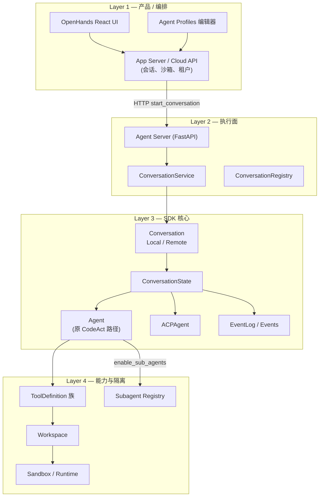
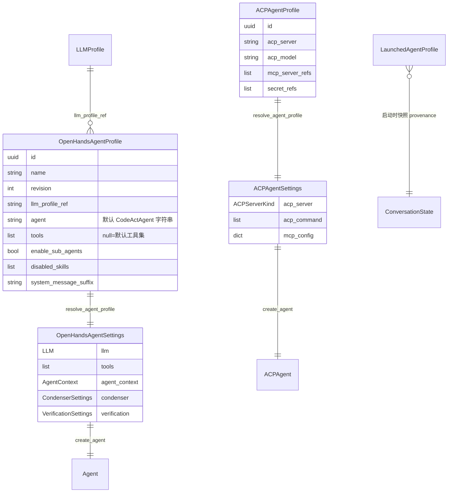
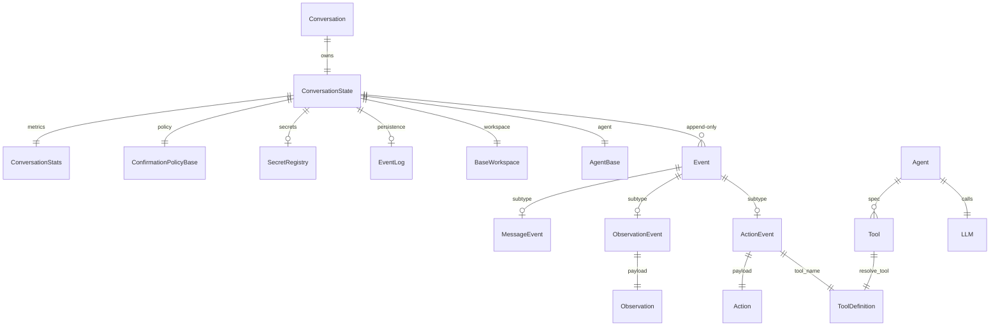
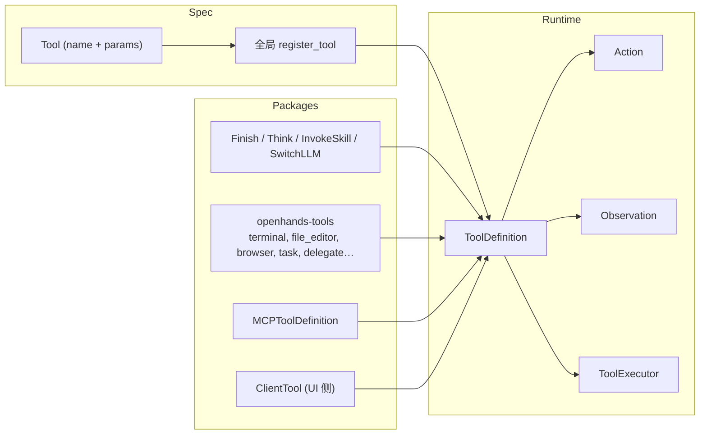
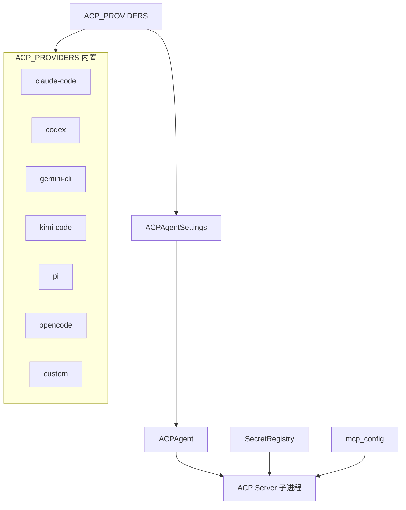
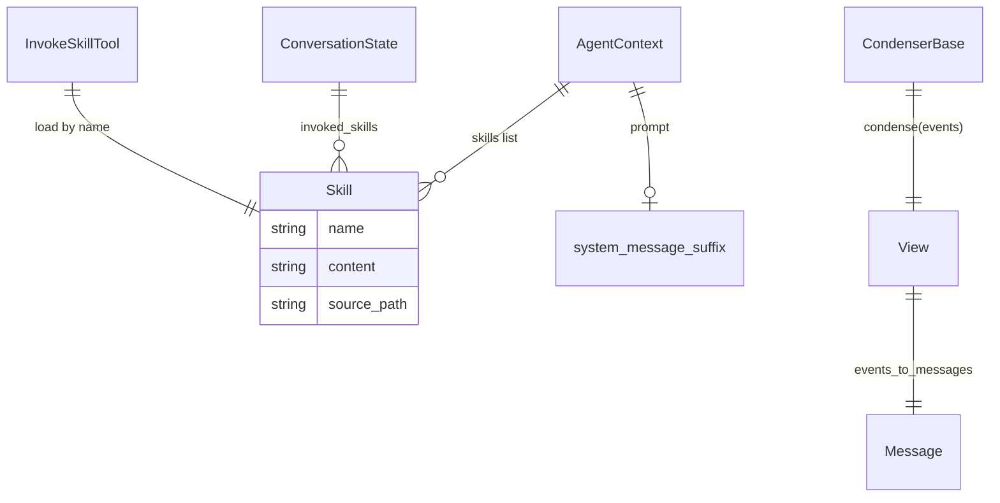
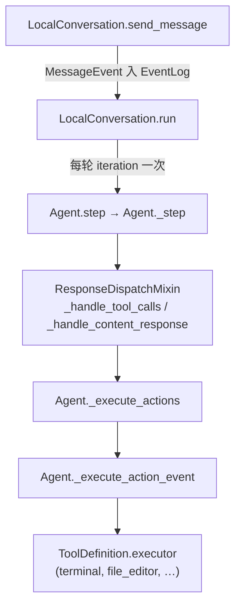
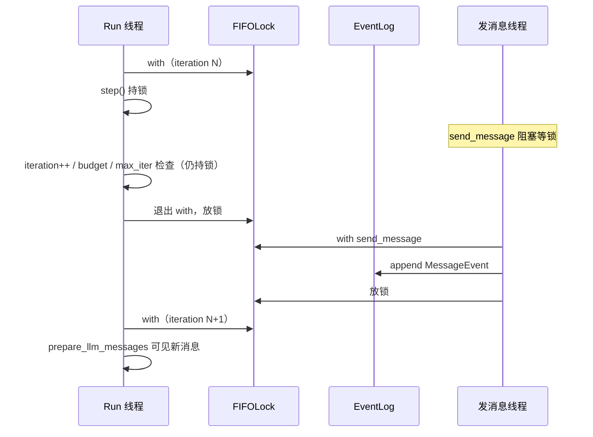

# OpenHands 实体模型与关系图（V1 / Software Agent SDK）

> **范围**: `software-agent-sdk` + OpenHands GUI/Cloud 编排层 + V0 Legacy 对照  
> **最后更新**: 2026-09-24  
> **用途**: 理解「有哪些实体、谁持有谁、谁调用谁」  
> **应用层封装（Agent Server / GUI / Cloud）**: [`APPLICATION_LAYER.md`](APPLICATION_LAYER.md)

---

## 1. 总览：三层 + 两条 Agent 主线



**两条并列的「顶层 Agent」**（同一会话只能二选一）：

| 实体 | `agent_kind` | 运行时类 | 推理与工具 |
|------|--------------|----------|------------|
| OpenHands Agent | `openhands` | `Agent` | SDK `step()` + 内建/注册工具 |
| ACP Agent | `acp` | `ACPAgent` | 子进程 ACP CLI（Claude Code、Codex 等） |

---

## 2. 配置与启动：Profile → Settings → Agent



**关系说明**

- **AgentProfile**（磁盘/DB，无密钥）通过 `resolve_agent_profile()` 解析为 **AgentSettings**（含 LLM、MCP、技能）。
- `OpenHandsAgentProfile.agent` 字段多为历史命名；`create_agent()` 实际构造的是单一 **`Agent`** 类，不再按 V0 的 `CodeActAgent` / `BrowsingAgent` 分派。
- **LaunchedAgentProfile** 记录在会话上，供 UI「切换 Profile 是否需新会话」。

---

## 3. 会话与状态（事件溯源）



**Conversation 变体**

| 实体 | 职责 |
|------|------|
| `LocalConversation` | 本进程跑 `Agent.step()` / `ACPAgent` 循环 |
| `RemoteConversation` | HTTP 代理到 Agent Server 内的 LocalConversation |
| `Conversation` 工厂 | 按配置选择 Local / Remote |

**ConversationState 关键字段**

- `execution_status`: IDLE → RUNNING → FINISHED / STUCK / WAITING_FOR_CONFIRMATION …
- `events`: 唯一真相源；**View + Condenser** 再投影为 LLM `Message` 列表
- `persistence_dir`: 事件 JSON + `base_state.json`；子 Agent 写在 `subagents/` 子目录

---

## 4. 工具系统



**默认 OpenHands Agent 工具集**（`tools=null` 时）

| 工具名 | 包 | 说明 |
|--------|-----|------|
| `terminal` | openhands-tools | Shell / tmux |
| `file_editor` | openhands-tools | 查看/编辑文件 |
| `task_tracker` | openhands-tools | 任务列表 |
| `browser_tool_set` | 服务层注入 | 环境有 Chromium 时 |
| `task_tool_set` | openhands-tools | `enable_sub_agents=true` 时 |

内建：**FinishTool、ThinkTool、InvokeSkillTool**；可选 **SwitchLLMTool**。

---

## 5. 多 Agent（子 Agent）实体

```mermaid
erDiagram
  AgentDefinition ||--o{ AgentFactory : "agent_definition_to_factory"
  AgentFactory ||--|| Agent : "factory_func(llm)"
  SubagentRegistry ||--o{ AgentFactory : "name -> factory"
  Agent ||--o| TaskToolSet : "optional tool"
  TaskToolSet ||--|| TaskManager : "owns"
  TaskManager ||--o{ Task : "task_id"
  Task ||--|| LocalConversation : "child session"
  ParentConv["父 LocalConversation"] ||--o{ Task : "delegates"
  DelegateTool ||--|| DelegateExecutor : "legacy API"

  AgentDefinition {
    string name
    list tools
    string model "inherit|profile"
    string system_prompt
    string permission_mode
    int max_iteration_per_run
  }

  Task {
    string id
    uuid conversation_id
    string status
    string result
  }
```

**子 Agent 来源与优先级**（注册表 `_agent_factories`）

1. 代码 `register_agent()` — 最高，不可被覆盖  
2. Plugin `register_plugin_agents()`  
3. 项目 `.agents/agents/*.md`、`.openhands/agents/*.md`  
4. 用户 `~/.agents/agents/`、`~/.openhands/agents/`  
5. 内置 `register_builtins_agents()` — `preset/subagents/*.md`

**内置子 Agent 类型**（均为独立 `Agent` 实例，非顶层 Profile）

| name | 工具侧重 |
|------|----------|
| `general-purpose` | terminal + file_editor + task_tracker |
| `code-explorer` | 只读 terminal |
| `bash-runner` | terminal（摘要输出） |
| `web-researcher` | browser + MCP fetch/tavily |

**交互契约**

- 父 → 子：仅 **`TaskAction.prompt`**（+ `subagent_type`）；`send_message(..., sender=父名)`  
- 子 → 父：仅 **`TaskObservation.text`**（`get_agent_final_response`）  
- **不共享** event 历史；**共享** workspace 目录、默认确认策略、metrics 汇总键 `task:{id}`  
- 遗留 **`DelegateTool`**: `spawn` 预创建命名子会话 + `delegate` 并行 `threading` 派发

---

## 6. ACP 实体与外部 CLI



| 实体 | 关系 |
|------|------|
| `ACPProviderInfo` | `acp_server` 键 → 默认 npx 命令、API key 环境变量、模型列表 |
| `ACPAgent` | 不持有 OpenHands 工具列表；事件含 `ACPToolCallEvent` 等 |
| `mcp_config` | 会话创建时**转发**给 CLI，非进程内 MCPTool |
| 凭证 | Profile 的 `secret_refs` + 会话 `LookupSecret` → `SecretRegistry` → 子进程 env |

**与 OpenHands Agent 的关系**：**互斥**。ACP 会话不能通过 `task` 工具调用 SDK 子 Agent；OpenHands Agent 也不能把任务 handoff 给 Codex ACP。

---

## 7. 记忆、技能、插件



| 实体 | 说明 |
|------|------|
| **Skill** | `SKILL.md` / legacy 触发器；`InvokeSkillTool` 按需加载 |
| **AgentContext** | 挂到 `Agent`；Profile 用 `disabled_skills` **排除**目录技能 |
| **Condenser** | LLM 摘要 / NoOp / Pipeline；溢出时 `CondensationRequest` |
| **Critic** | `VerificationSettings` → 对 Action/Message 评估与迭代精炼 |
| **HookConfig** | Shell 钩子：PRE/POST_TOOL、USER_PROMPT、SESSION_* |

---

## 8. Agent Server 与 OpenHands 前端

```mermaid
erDiagram
  ConversationService ||--o{ ConversationRecord : "manages"
  ConversationRecord ||--|| LocalConversation : "wraps"
  ConversationRegistry ||--o{ ConversationRecord : "index"
  WebhookSubscriber ||--o{ Event : "push"
  SubAgentsRouter ||--o{ AgentDefinition : "discover only"
  ToolRouter ||--o{ ToolDefinition : "register builtins"

  ConversationService {
    StartConversationRequest
    webhook_url
    agent_settings
  }
```

| API 路由（概念） | 实体 |
|------------------|------|
| `POST /start_conversation` | `ConversationService` → `LocalConversation.run()` |
| `POST /sub-agents` | 列出 builtin + file agents（**不写入**注册表） |
| Agent profiles CRUD | `OpenHandsAgentProfile` / `ACPAgentProfile` 存储 |
| WebSocket / SSE | 订阅 `Event` 流 → 前端 transcript |

**OpenHands 仓库（`OpenHands/src`）**：主要是 **类型适配**（`agent-server-adapter.ts`）、**Profile 服务**、**会话 API**；**不**再实现 V0 的 `AgentHub` 类层次。

---

## 9. V0 Legacy 对照（同一产品名，不同实体）

| V0 实体 | V1 / SDK 对应 |
|---------|----------------|
| `AgentController` | `LocalConversation` + `Agent.step()` |
| `AgentHub` / `CodeActAgent` / `BrowsingAgent` | 单一 `Agent` + 工具集 |
| `EventStream`（进程内 pub/sub） | `ConversationState.events` + 持久化 EventLog |
| `AgentDelegateAction` | `TaskTool` / `DelegateTool` |
| `ConversationMemory` | `View` + `events_to_messages` + Condenser |
| `DockerRuntime` | Workspace + Sandbox 内的 Agent Server |
| `MicroAgents` | Skills + 部分 AgentDefinition |

---

## 10. 关系矩阵（快速查阅）

| 从 | 到 | 关系 | 基数 |
|----|-----|------|------|
| User | Conversation | 创建/发消息 | 1:N |
| AgentProfile | Conversation | 启动配置来源 | N:1（启动时） |
| Conversation | ConversationState | 1:1 | 1:1 |
| ConversationState | Event | 追加 | 1:N |
| Agent | LLM | 调用（ACP 仅 metrics） | 1:1 |
| Agent | ToolDefinition | 解析 specs | 1:N |
| Agent | LocalConversation（子） | Task 委派 | 1:N |
| 子 LocalConversation | 父 LocalConversation | workspace 共享；events 隔离 | N:1 |
| AgentDefinition | Agent | 工厂创建 | 1:N（按 name） |
| ToolExecutor | LocalConversation | 执行时注入 | N:1 |
| Workspace | Sandbox | 命令/文件实际执行 | 1:1 |
| App Server | Agent Server | HTTP 编排 | 1:N 沙箱 |
| ACPAgent | ACP 子进程 | stdio 协议 | 1:1 |

---

## 11. 核心循环：函数调用链（同步 `run()`）

源码根目录：`software-agent-sdk/openhands-sdk/openhands/sdk/`。

### 11.1 调用关系（从外到内）



| 层级 | 函数 | 文件 | 职责 |
|------|------|------|------|
| 输入 | `send_message` | `conversation/impl/local_conversation.py` | `with self._state` 写入用户 `MessageEvent` |
| 外循环 | `run` | 同上 ~1903 | `while True` + `with self._state` → `agent.step()` |
| 内循环 | `step` / `_step` | `agent/agent.py` ~635 | 一轮 LLM 决策 + 可选工具 |
| 响应分发 | `_handle_tool_calls` 等 | `agent/response_dispatch.py` | 按 `classify_response` 分支 |
| 工具批处理 | `_execute_actions` | `agent/agent.py` ~570 | `ParallelToolExecutor` + `finalize` |
| 单工具 | `_execute_action_event` | `agent/agent.py` ~1384 | 调 `tools_map[name](action, conversation)` |

异步路径：`run` 对应 `arun`，`step` 对应 `astep`（LLM 等待时会 `_released_state_lock_during_io` 放锁）；逻辑与上表同构。

### 11.2 外循环：`run()`（iteration）

持锁范围：**每次 `with self._state:` 整段**（含一次 `step()` 和 iteration 后检查），步间释放锁。

```1931:2042:software-agent-sdk/openhands-sdk/openhands/sdk/conversation/impl/local_conversation.py
            while True:
                ...
                with self._state:
                    if ... PAUSED / STUCK: break
                    if ... FINISHED: ... break  # 或 Stop Hook 拉回 RUNNING
                    if self._check_stuck_or_nudge(): continue
                    if ... WAITING_FOR_CONFIRMATION: → RUNNING
                    self.agent.step(self, on_event=..., on_token=...)
                    iteration += 1
                    if ... WAITING_FOR_CONFIRMATION: break
                    if budget exceeded: break
                    if iteration >= max_iteration_per_run: break
```

入口前置：`run()` 开头短 `with self._state` 把 `IDLE/PAUSED/ERROR/STUCK` → `RUNNING`（~1919–1926）。

### 11.3 用户输入：`send_message()`

```1832:1870:software-agent-sdk/openhands-sdk/openhands/sdk/conversation/impl/local_conversation.py
        with self._state:
            if execution_status in (FINISHED, STUCK):
                execution_status = IDLE
            ...
            self._on_event(MessageEvent(...))  # → append_event，更新 last_user_message_id
```

与 `run()` 争同一把 `ConversationState` 上的 `FIFOLock`（`conversation/fifo_lock.py`）。

### 11.4 内循环：`step()` → `_step()`

```635:643:software-agent-sdk/openhands-sdk/openhands/sdk/agent/agent.py
    def step(self, conversation, on_event, on_token=None):
        with StreamContext.open(conversation, on_token) as stream:
            self._step(conversation, on_event, stream)
```

`_step` 主路径（省略异常与 condense 早退）：

1. **有待执行 Action**（确认模式）→ `_execute_actions(pending)` → `return`
2. **Hook 拦截用户消息** → `FINISHED` → `return`
3. `prepare_llm_messages(state.view, condenser)` → 若需压缩则发事件 → `return`
4. `llm.generate(messages, tools=...)`
5. `match classify_response(message)`：

```816:834:software-agent-sdk/openhands-sdk/openhands/sdk/agent/agent.py
        match response_type:
            case LLMResponseType.TOOL_CALLS:
                self._handle_tool_calls(...)
            case LLMResponseType.CONTENT:
                self._handle_content_response(...)
            case LLMResponseType.REASONING_ONLY | LLMResponseType.EMPTY:
                self._handle_no_content_response(...)
```

### 11.5 工具路径：分发 → 批执行 → 单工具

**分发**（需确认则只发 `ActionEvent`，`WAITING_FOR_CONFIRMATION`，不执行）：

```186:190:software-agent-sdk/openhands-sdk/openhands/sdk/agent/response_dispatch.py
        if self._requires_user_confirmation(state, action_events):
            return
        if action_events:
            self._execute_actions(conversation, action_events, on_event)
```

**纯文本结束 turn**：

```257:261:software-agent-sdk/openhands-sdk/openhands/sdk/agent/response_dispatch.py
        self._emit_message_event(...)
        state.execution_status = ConversationExecutionStatus.FINISHED
```

**批执行**（`FinishTool` 等在 `finalize` 里可把 status 设为 `FINISHED`）：

```570:598:software-agent-sdk/openhands-sdk/openhands/sdk/agent/agent.py
    def _execute_actions(...):
        batch = _ActionBatch.prepare(..., tool_runner=lambda ae: self._execute_action_event(...))
        batch.emit(conversation, on_event)
        batch.finalize(..., mark_finished=lambda: setattr(state, "execution_status", FINISHED))
```

**单工具**：

```1410:1423:software-agent-sdk/openhands-sdk/openhands/sdk/agent/agent.py
            observation = tool(action_event.action, conversation)
```

### 11.6 一次「用户问题 → 最终答案」要几次 step？

| 场景 | step 次数 | 谁设 `FINISHED` |
|------|-----------|-----------------|
| 多步编码（bash / 改文件 …） | **多次** `run` iteration | 通常 `FinishTool` → `_execute_actions.finalize` |
| 直接文字回复 | **1 次** | `_handle_content_response` |
| 仅压缩 / 纠错 nudge | +1 iteration，可能仍 `RUNNING` | 无 |

### 11.7 线程模型：占线程 ≠ 占锁

常见误解：「`run()` 线程还在 `while True` 里」⇒ EventLog 不能被改。  
实际并发边界是 **`ConversationState` 上的 `FIFOLock`**，不是「run 线程是否空闲」。

| 概念 | 含义 |
|------|------|
| **Run 线程** | Agent Server 里通常 **一个** `run_in_executor(..., conversation.run)`；线程卡在 `while` 里直到 break/异常 |
| **发消息线程** | HTTP/WebSocket 处理里 `run_in_executor(..., conversation.send_message)`；**不会**进入 `run()` 的 `while` |
| **持锁** | 任意 `with self._state:` 内（含整次 `step()` 与 step 后的 iteration 检查） |
| **放锁** | 本轮 `with` 正常结束或 `break` 退出 `with` 时（context manager `__exit__`） |



**单线程脚本**：主线程同步 `run()` 堵死、且无第二线程时，运行中无法并发 `send_message`——这是用法限制。桌面/Web 的 Agent Server 用线程池，与用户并发发消息匹配。

### 11.8 step 与 step 之间：持锁段 vs 放锁窗口

同步 `run()` 里，**不是** `step()` 一返回就立刻放锁。同一轮 iteration 内，`step()` 之后还有后置检查，仍在 **同一个** `with self._state` 中。

**Run 线程：step(N) 结束 → step(N+1) 开始**

| 阶段 | 持锁？ | Run 线程操作 |
|------|--------|----------------|
| `step()` 全过程 | 是 | LLM、`on_event` 写 assistant/action/observation、工具执行 |
| `step()` 返回后 | 是 | `iteration += 1` |
| 同上 | 是 | `WAITING_FOR_CONFIRMATION` → `break`（结束 run） |
| 同上 | 是 | `_budget_exceeded_detail()` → 可能发错误事件并 `break` |
| 同上 | 是 | `iteration >= max_iteration_per_run` → ERROR 或 `break` |
| 退出 `with`（未 break） | **否** | 仅 `logger.debug("Conversation run iteration …")` |
| 下一轮 `with` 开头 | 重新获取 | `PAUSED`/`STUCK`/`FINISHED`+Stop Hook、`stuck/nudge`、确认模式 → `step()` |

**放锁窗口内**：Run 线程几乎只做 debug 再抢锁；**其它线程**可在此窗口 `send_message` 写入 EventLog。  
**step 执行中或 step 后仍在本轮 `with` 内**：`send_message` **阻塞排队**（公平锁），不是失败。

源码在 step 后刻意 **不在此轮立即因 `FINISHED` 退出 run**（注释 ~1998–2005）：允许并发用户消息在后续 iteration 被处理；用户事件仍须在某次抢到锁后 append（常为步间短窗口或下一轮 `with` 之前）。

`pause()` 在 **下一轮** `with` 抢到锁后、调用 `step()` 之前看到 `PAUSED` 并 `break`（注释 ~1934–1936）。

**async `arun()`**：步间结构与上表同构；此外在 **单个 step 内** LLM I/O 等待时可能 `_released_state_lock_during_io` 放锁，插入窗口比同步路径更长。详见 `ARCHITECTURE_PART1.md` §3.6 / §5.5。

### 11.9 并发 `send_message` 与「只有一个 while」

| 调用方 | 是否进入 `run()` 的 `while` | 与其它调用的关系 |
|--------|------------------------------|------------------|
| `conversation.send_message` | **否** | 短临界区：`with self._state` → `_on_event(MessageEvent)` → 返回 |
| `conversation.run` | **是** | 每会话通常 **一条** run 线程、**一个** while |

**两个线程都只 `send_message`**：共争 `FIFOLock`，**串行 append**；EventLog 中用户消息顺序与抢锁顺序一致。不会因 `send_message` 各自开启 `while`。

**Run 线程 + `send_message`**：发消息不接替 run；同一 while 继续，新消息在 **下一轮** `prepare_llm_messages(state.view)` 进入 LLM 上下文（step 边界生效，非 mid-step steer）。

**Agent Server：`send_message(run=True)` 与单任务 `run`**

```text
send_message → run_in_executor(conversation.send_message)   # 先 append
run=True     → EventService.run() → 后台 _run_task → conversation.run() / arun()
```

- `EventService.run()` 用 `_run_lock` + `execution_status == RUNNING` + `_run_task` 保证 **至多一个** 后台 run；重复调用抛 `conversation_already_running`。
- 运行中再次 `send_message(run=True)`：**append 仍会完成**（锁上排队）；`run()` 被拒时设 **`_rerun_requested`**，当前 `_run_task` 在 `finally` 收尾后 **再启一轮** run，消费 EventLog 中累积的新输入（含多条用户消息），而不是启动第二个 while。
- ACP：新用户消息可能 mark running prompt superseded + `interrupt`；仍非通用 Pi-style steering 队列。

相关实现：`openhands-agent-server/openhands/agent_server/event_service.py`（`send_message` ~745，`run` ~1243，` _rerun_requested` ~1345–1393）。

### 11.10 设计取舍：EventLog + 锁，而非 steer 队列

| 机制 | OpenHands SDK（V1） | 对比（如 Pi/Hermes steer） |
|------|---------------------|----------------------------|
| 用户输入 | `send_message` → append `MessageEvent` | 运行中注入 steering / follow-up 队列 |
| 串行化 | `FIFOLock` 公平抢锁 | 独立消息 FIFO 与 turn 内合并语义 |
| 生效边界 | 默认 **step 边界**（下一轮 `step` 读 view） | 可在 turn 内改 agent 行为 |
| 打断 | `pause` / `interrupt`（async）、ACP supersede | `steer()` 等 |

设计意图简述：

1. **Event sourcing**：真相在 EventLog；用户与 agent 产出同一套事件流。  
2. **单写者语义**：同一时刻只有一个 `with self._state` 写状态，避免 log 与 `execution_status` 乱序。  
3. **可预测性**：当前 step 内的 LLM/tool 不被另一条线程「插队改 prompt」（除非走 interrupt/ACP 路径）。  

openharness 对照：`docs/openharness/framework-comparison/14-loop-interjection.md` 将 software-agent-sdk 标为 **non mid-turn chat**。

### 11.11 GUI 与 Server：排队 ≠ steer

**前端（`OpenHands/`）**

| 名称 | 作用 | 是否 agent 侧队列 |
|------|------|-------------------|
| `enqueuePendingMessage`（`optimistic-user-message-store`） | 发送后乐观 UI；WebSocket 回显 `UserMessageEvent` 后移除 | **否** |
| 聊天输入 `disabled` | 主要为 `isNewConversationPending`、`llmBlocked` | **否**（`RUNNING` 时仍可发） |
| API | `POST …/events`，body 常带 `run: true`（`agent-server-conversation-service.api.ts`） | 触发 Server `send_message` + `run` |

**Server**

| 机制 | 含义 |
|------|------|
| `FIFOLock` 阻塞 | 用户 `send_message` 在 step/后置检查持锁时等待，写完即返回 |
| `_rerun_requested` | 运行中 `run=True` 被拒后，当前 run 结束再跑一轮 |
| `wait_for_pending`（callback） | run 任务 `finally` 里等事件发布完再清 `_run_task`，避免 UI 状态与事件乱序 |

本 monorepo 的 Python 树中 **未** 实现 Cloud 文档里的 `PendingMessageService` / `pending_messages/` 产品级缓冲；并发语义以 SDK EventLog + Agent Server 上述标志为准。

---

**维护**: 与 `OPENHANDS_SDK_ARCHITECTURE_DEEP_DIVE.md`、`OpenHands_ARCHITECTURE_OVERVIEW.md`、`docs/openhands-sdk/ARCHITECTURE_PART1.md` §3.6 互补；源码以 `software-agent-sdk/` 为准。
