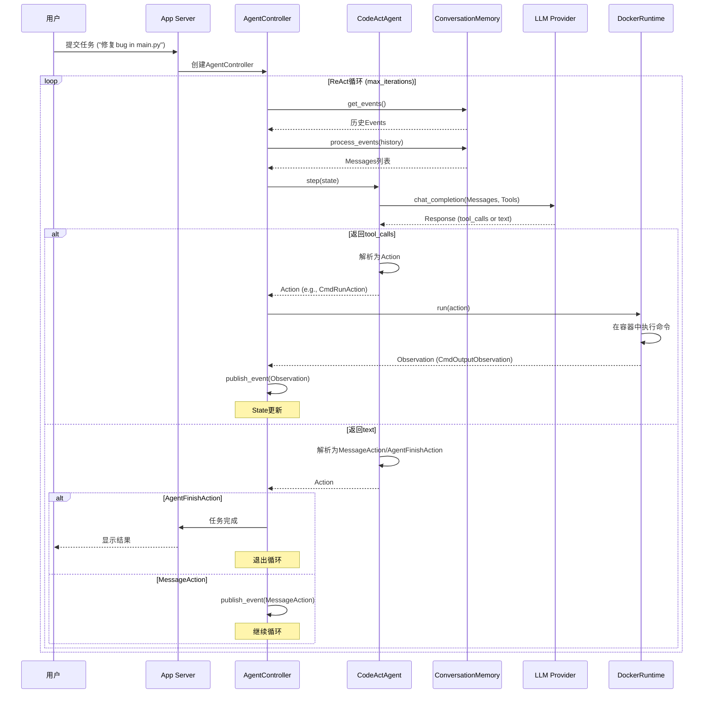

# OpenHands 架构深度分析

> **版本**: v1.0  
> **最后更新**: 2026-04-17  
> **作者**: AI Assistant (基于源码分析)  
> **说明**: 本文档从OpenHands源码出发,深度解析其架构设计、核心模块和执行流程

---

## ⚠️ 重要说明: V0 → V1 迁移

**OpenHands正在进行重大架构升级**:

- **V0 (Legacy)**: 当前主分支的代码,标记为`Legacy-V0`,计划于2026年4月1日移除
- **V1 (New)**: 使用Software Agent SDK重构的新架构
  - Agentic Core: https://github.com/OpenHands/software-agent-sdk
  - App Server: `openhands/app_server/`目录

**本文档同时覆盖V0和V1**,但重点分析V0的成熟实现,因为V1仍在开发中。

**在本 monorepo 中对照源码时请注意**:

| 文档中的路径/类名 | 本仓库是否存在 | V1 实际位置 |
|-------------------|----------------|-------------|
| `openhands/agenthub/`、`CodeActAgent`、`BrowsingAgent`… | **否**（仅 Legacy 主仓） | 单一 `openhands.sdk.agent.Agent` + `openhands-tools` |
| `openhands/controller/`、`AgentController` | **否** | `LocalConversation.run()` + `Agent.step()` |
| `OpenHands/` 前端 | **是** | `deepagents/OpenHands/`（React，无 Python agenthub） |
| Agent 执行核心 | **是** | `deepagents/software-agent-sdk/` |

V1 实体与关系见 [`ENTITY_MODEL.md`](ENTITY_MODEL.md)；**SDK 之上的应用层封装**见 [`APPLICATION_LAYER.md`](APPLICATION_LAYER.md)；SDK 细节见 [`OPENHANDS_SDK_ARCHITECTURE_DEEP_DIVE.md`](OPENHANDS_SDK_ARCHITECTURE_DEEP_DIVE.md)。

---

## 📋 目录

- [1. 项目概述](#1-项目概述)
- [2. 整体架构](#2-整体架构)
- [3. 核心模块详解](#3-核心模块详解)
- [4. Agent Loop执行流程](#4-agent-loop执行流程)
- [5. 关键设计模式](#5-关键设计模式)
- [6. 与竞品对比](#6-与竞品对比)

---

## 1. 项目概述

### 1.1 什么是OpenHands?

OpenHands是一个**AI驱动的软件开发平台**,旨在通过自然语言指令自动化完成编程任务。

**核心价值主张**:
1. **代码生成与修改**: 自动编写、编辑、调试代码
2. **多Agent协作**: 支持多个 specialized agents协同工作
3. **安全沙箱**: 在隔离环境中执行代码,保护宿主系统
4. **多模态交互**: 支持CLI、Web GUI、API等多种交互方式
5. **企业级功能**: RBAC、多用户、集成Slack/Jira/Linear等

**技术亮点**:
- 🏆 **SWE-bench 77.6分**: 在软件工程基准测试中表现优异
- 🔄 **ReAct循环**: Reasoning + Acting交替执行
- 🛡️ **Docker沙箱**: 容器化隔离,安全执行任意代码
- 🤖 **多Agent架构**: CodeAct/Browsing/VisualBrowsing等专用Agent

### 1.2 主要组件

```
OpenHands生态系统:
├── Software Agent SDK (V1核心)
│   └── https://github.com/OpenHands/software-agent-sdk
├── OpenHands CLI (命令行工具)
│   └── https://github.com/OpenHands/OpenHands-CLI
├── OpenHands Local GUI (本地Web应用)
│   ├── Frontend: React SPA
│   └── Backend: FastAPI server
├── OpenHands Cloud (托管服务)
│   └── https://app.all-hands.dev
└── OpenHands Enterprise (企业自部署)
    └── enterprise/ 目录(源码可用,需许可证)
```

---

## 2. 整体架构

### 2.1 分层架构图

```
┌─────────────────────────────────────────────────────────────┐
│              Layer 1: Presentation Layer                     │
│  ┌──────────────┬──────────────┬──────────────────────┐    │
│  │ Web GUI      │ CLI          │ REST API             │    │
│  │ (React SPA)  │ (Typer)      │ (FastAPI)            │    │
│  └──────────────┴──────────────┴──────────────────────┘    │
└────────────────────────┬────────────────────────────────────┘
                         │
┌────────────────────────▼────────────────────────────────────┐
│              Layer 2: Application Layer                      │
│  ┌──────────────────────────────────────────────────────┐  │
│  │ App Server (openhands/server/)                       │  │
│  │ ├─ Session Management                                │  │
│  │ ├─ Conversation Management                           │  │
│  │ ├─ User Authentication                               │  │
│  │ └─ Event Streaming (WebSocket/SSE)                   │  │
│  └──────────────────────────────────────────────────────┘  │
└────────────────────────┬────────────────────────────────────┘
                         │
┌────────────────────────▼────────────────────────────────────┐
│              Layer 3: Agentic Core (Controller)              │
│  ┌──────────────────────────────────────────────────────┐  │
│  │ Agent Controller (openhands/controller/)             │  │
│  │ ├─ Agent Loop (ReAct循环)                            │  │
│  │ ├─ State Management                                  │  │
│  │ ├─ Event Stream                                      │  │
│  │ └─ Delegation (多Agent协作)                          │  │
│  └──────────────────────────────────────────────────────┘  │
│  ┌──────────────────────────────────────────────────────┐  │
│  │ Agent Hub (openhands/agenthub/)                      │  │
│  │ ├─ CodeActAgent (代码执行)                           │  │
│  │ ├─ BrowsingAgent (网页浏览)                          │  │
│  │ ├─ VisualBrowsingAgent (视觉浏览)                    │  │
│  │ └─ ... (可扩展)                                      │  │
│  └──────────────────────────────────────────────────────┘  │
└────────────────────────┬────────────────────────────────────┘
                         │
        ※ Layer 3 上图 = **V0 Legacy**。V1 无 Agent Hub 目录：Agentic Core 在
          software-agent-sdk（`Agent` / `ACPAgent`、`ConversationState.events`、
          `TaskTool` 子 Agent）。勿在本仓库搜索 `openhands/agenthub/`。
                         │
┌────────────────────────▼────────────────────────────────────┐
│              Layer 4: Memory & Context                       │
│  ┌──────────────┬──────────────┬──────────────────────┐    │
│  │ Conversation │ Condenser    │ MicroAgents          │    │
│  │ Memory       │ (压缩)       │ (Skills)             │    │
│  └──────────────┴──────────────┴──────────────────────┘    │
└────────────────────────┬────────────────────────────────────┘
                         │
┌────────────────────────▼────────────────────────────────────┐
│              Layer 5: Runtime (Sandbox)                      │
│  ┌──────────────────────────────────────────────────────┐  │
│  │ Runtime Base (openhands/runtime/base.py)             │  │
│  │ ├─ DockerRuntime (容器化)                            │  │
│  │ ├─ RemoteRuntime (远程执行)                          │  │
│  │ ├─ LocalRuntime (本地开发)                           │  │
│  │ └─ KubernetesRuntime (K8s集群)                       │  │
│  └──────────────────────────────────────────────────────┘  │
│  ┌──────────────┬──────────────┬──────────────────────┐    │
│  │ Bash Shell   │ Jupyter      │ Browser              │    │
│  │ Execution    │ (Python)     │ Automation           │    │
│  └──────────────┴──────────────┴──────────────────────┘    │
└────────────────────────┬────────────────────────────────────┘
                         │
┌────────────────────────▼────────────────────────────────────┐
│              Layer 6: Infrastructure                         │
│  ┌──────────────┬──────────────┬──────────────────────┐    │
│  │ LLM Providers│ File Storage │ MCP Servers          │    │
│  │ (Anthropic/  │ (Local/S3)   │ (External Tools)     │    │
│  │  OpenAI/etc) │              │                      │    │
│  └──────────────┴──────────────┴──────────────────────┘    │
└─────────────────────────────────────────────────────────────┘
```

### 2.2 核心数据流

```
用户输入 (Web/CLI/API)
  ↓
App Server (会话管理)
  ↓
EventStream (事件发布/订阅)
  ↓
AgentController (ReAct循环)
  ├→ Agent.step(state) → Action
  ├→ Runtime.execute(action) → Observation
  └→ State更新
  ↓
ConversationMemory (历史处理)
  ├→ Condenser (上下文压缩)
  └→ Prompt组装
  ↓
LLM API调用
  ↓
Action执行 (Bash/Python/File/Browser)
  ↓
Observation返回
  ↓
循环继续或结束
```

---

## 3. 核心模块详解

### 3.1 Agent Controller (控制器)

**职责**: 管理Agent的执行循环,维护状态,处理事件

**关键文件**:
- `openhands/controller/agent_controller.py` (1393行) - 主控制器
- `openhands/controller/agent.py` (192行) - Agent抽象基类
- `openhands/controller/state/state.py` - 状态管理

**核心类**:

```python
class AgentController:
    """控制Agent执行的主循环"""
    
    def __init__(
        self,
        agent: Agent,              # Agent实例
        event_stream: EventStream, # 事件流
        max_iterations: int,       # 最大迭代次数
        confirmation_mode: bool,   # 确认模式
        ...
    ):
        self.agent = agent
        self.event_stream = event_stream
        self.state = State()
        
    def on_event(self, event: Event):
        """处理事件的核心方法"""
        # 1. 更新State
        # 2. 检查是否需要执行Action
        # 3. 调用agent.step(state)
        # 4. 执行Action并publish Observation
```

**关键设计**:
1. **事件驱动**: 通过EventStream订阅事件,异步处理
2. **状态跟踪**: State对象保存所有历史信息
3. **委托机制**: 支持AgentDelegateAction,实现多Agent协作
4. ** stuck检测**: StuckDetector检测无限循环

### 3.2 Agent Hub (Agent仓库)

> **V1 迁移说明（读代码前必看）**  
> 本节描述 **V0** 的 `openhands/agenthub/` 多 Agent 类体系。在 **Software Agent SDK** 中已合并为：
>
> - **顶层**：`Agent`（原 CodeAct 能力 = 默认工具集）或 `ACPAgent`（外部 CLI）
> - **浏览**：`browser_tool_set`，非 `BrowsingAgent` 类
> - **多 Agent 协作**：`TaskTool` + `AgentDefinition` 注册表，非 `AgentDelegateAction` + 子 `AgentController`
> - **循环**：`conversation.run()` 调用 `agent.step()`，状态在 `ConversationState`，Agent 本身为无状态配置（frozen Pydantic）
>
> Profile 字段 `agent: "CodeActAgent"` 为遗留命名，`create_agent()` 不按该类名分派。

**职责（V0）**: 提供多种专用Agent实现

**可用Agents（V0）**:

| Agent | 职责 | 特点 |
|-------|------|------|
| **CodeActAgent** | 代码执行 | 统一代码空间(CodeAct论文),支持Bash/Python |
| **BrowsingAgent** | 网页浏览 | 自动化浏览器操作,提取信息 |
| **VisualBrowsingAgent** | 视觉浏览 | 结合视觉模型的浏览 |
| **LOC Agent** | Lines of Code | 专门统计代码行数 |
| **ReadonlyAgent** | 只读操作 | 仅读取,不修改文件 |

**CodeActAgent核心设计**:

```python
class CodeActAgent(Agent):
    """CodeAct Agent - 统一代码行动空间"""
    
    sandbox_plugins = [
        AgentSkillsRequirement(),  # Python技能
        JupyterRequirement(),      # Jupyter支持
    ]
    
    def step(self, state: State) -> Action:
        """执行一步: LLM推理 → 选择Action"""
        # 1. 构建Prompt (System + History + Tools)
        # 2. 调用LLM
        # 3. 解析响应为Action
        # 4. 返回Action
        
    def _get_tools(self) -> list[Tool]:
        """根据配置动态选择Tools"""
        tools = []
        if config.enable_cmd: tools.append(BashTool)
        if config.enable_jupyter: tools.append(IPythonTool)
        if config.enable_editor: tools.append(StrReplaceEditorTool)
        if config.enable_browsing: tools.append(BrowserTool)
        return tools
```

**设计理念**: 
- **CodeAct思想**: 将所有Actions统一为代码执行(Bash/Python)
- **最小化**: 相比其他Agent,CodeAct更简洁高效
- **可扩展**: 通过plugins添加新功能

### 3.3 Runtime (运行时沙箱)

**职责**: 提供安全的代码执行环境

**关键文件**:
- `openhands/runtime/base.py` (1346行) - Runtime抽象基类
- `openhands/runtime/impl/docker/docker_runtime.py` - Docker实现

**Runtime类型**:

| 类型 | 适用场景 | 隔离级别 |
|------|---------|---------|
| **DockerRuntime** | 生产环境 | 🔒🔒🔒 强隔离 |
| **RemoteRuntime** | 云端执行 | 🔒🔒🔒 强隔离 |
| **LocalRuntime** | 本地开发 | 🔒 弱隔离 |
| **KubernetesRuntime** | K8s集群 | 🔒🔒🔒 强隔离 |
| **CLIRuntime** | 命令行模式 | 🔒 弱隔离 |

**核心接口**:

```python
class Runtime(ABC):
    """Agent运行时环境抽象"""
    
    @abstractmethod
    async def run(self, action: CmdRunAction) -> Observation:
        """执行bash命令"""
        pass
    
    @abstractmethod
    async def run_ipython(self, action: IPythonRunCellAction) -> Observation:
        """执行Python代码"""
        pass
    
    @abstractmethod
    async def read(self, action: FileReadAction) -> Observation:
        """读取文件"""
        pass
    
    @abstractmethod
    async def write(self, action: FileWriteAction) -> Observation:
        """写入文件"""
        pass
    
    @abstractmethod
    async def browse(self, action: BrowseURLAction) -> Observation:
        """浏览网页"""
        pass
```

**DockerRuntime关键特性**:
1. **容器隔离**: 每个会话一个Docker容器
2. **插件系统**: Jupyter/AgentSkills/VSCode等插件
3. **资源限制**: CPU/Memory/Network限制
4. **文件系统挂载**: 项目目录映射到容器内
5. **网络隔离**: 可配置允许/禁止的域名

### 3.4 Memory System (记忆系统)

**职责**: 管理对话历史,提供上下文压缩

**关键文件**:
- `openhands/memory/conversation_memory.py` (899行) - 对话记忆
- `openhands/memory/condenser/` - 压缩器

**核心类**:

```python
class ConversationMemory:
    """将事件历史转换为LLM消息"""
    
    def process_events(
        self,
        condensed_history: list[Event],
        initial_user_action: MessageAction,
        forgotten_event_ids: set[int] | None = None,
        max_message_chars: int | None = None,
        vision_is_active: bool = False,
    ) -> list[Message]:
        """处理事件为Messages"""
        # 1. 确保SystemMessage在最前
        # 2. 确保初始UserMessage存在
        # 3. 遍历Events,转换为Messages
        # 4. 处理Tool Calls配对
        # 5. 过滤未匹配的Tool Calls
        # 6. 应用格式化规则
```

**Condenser (压缩器)**:

```python
class Condenser(ABC):
    """上下文压缩抽象"""
    
    @abstractmethod
    def condense(self, history: list[Event]) -> View:
        """压缩历史,返回View"""
        pass

# 实现的压缩策略:
# - NoOpCondenser: 不压缩
# - LLMSummarizingCondenser: LLM总结
# - RecentEventsCondenser: 保留最近N条
```

**设计要点**:
1. **事件驱动**: 所有交互记录为Events
2. **灵活压缩**: 可插拔的Condenser策略
3. **Tool Call配对**: 确保Action-Observation成对出现
4. **截断保护**: max_message_chars防止超长内容

### 3.5 Event System (事件系统)

**职责**: 统一的通信机制

**关键文件**:
- `openhands/events/stream.py` (11.3KB) - EventStream
- `openhands/events/action/` - Actions定义
- `openhands/events/observation/` - Observations定义

**Event类型**:

```
Events
├── Actions (Agent → Runtime)
│   ├── CmdRunAction (执行bash命令)
│   ├── IPythonRunCellAction (执行Python)
│   ├── FileReadAction / FileWriteAction (文件操作)
│   ├── BrowseURLAction / BrowseInteractiveAction (浏览)
│   ├── AgentDelegateAction (委托子Agent)
│   ├── AgentFinishAction (完成任务)
│   └── MessageAction (文本消息)
│
└── Observations (Runtime → Agent)
    ├── CmdOutputObservation (命令输出)
    ├── IPythonRunCellObservation (Python输出)
    ├── FileReadObservation (文件内容)
    ├── BrowserOutputObservation (网页内容)
    ├── AgentDelegateObservation (子Agent结果)
    └── ErrorObservation (错误信息)
```

**EventStream核心机制**:

```python
class EventStream:
    """发布-订阅事件流"""
    
    def subscribe(self, subscriber_id, callback, sid):
        """订阅事件"""
        self.subscribers[subscriber_id] = callback
        
    def publish_event(self, event: Event, source: EventSource):
        """发布事件,通知所有订阅者"""
        for callback in self.subscribers.values():
            callback(event)
            
    def get_events(self, start_id=0, end_id=None):
        """获取历史事件"""
        return self.storage.get_events(start_id, end_id)
```

**设计优势**:
- ✅ **解耦**: Agent/Runtime/Memory通过Events通信
- ✅ **可追溯**: 所有Events持久化,支持回放
- ✅ **扩展性**: 新模块只需订阅Events
- ✅ **异步**: 支持并发处理

---

## 4. Agent Loop执行流程

### 4.1 完整的ReAct循环



### 4.2 详细步骤分解

**Step 1: 初始化**
```python
# App Server创建Controller
controller = AgentController(
    agent=CodeActAgent(config, llm_registry),
    event_stream=event_stream,
    max_iterations=100,
    confirmation_mode=False,
)

# Controller订阅Events
event_stream.subscribe(AGENT_CONTROLLER, controller.on_event, sid)
```

**Step 2: 用户输入**
```python
# 用户发送消息
user_message = MessageAction(content="修复main.py的bug")
event_stream.publish_event(user_message, source=EventSource.USER)
```

**Step 3: Controller处理**
```python
def on_event(self, event: Event):
    # 1. 更新State
    self.state.history.append(event)
    
    # 2. 如果是UserMessage,触发Agent执行
    if isinstance(event, MessageAction) and event.source == USER:
        self._run_agent_step()
```

**Step 4: Agent推理**
```python
def _run_agent_step(self):
    # 1. 获取历史
    events = self.state.history.get_events()
    
    # 2. 转换为Messages
    messages = self.conversation_memory.process_events(events)
    
    # 3. 调用Agent.step()
    action = self.agent.step(self.state)
    
    # 4. 执行Action
    self._execute_action(action)
```

**Step 5: Action执行**
```python
def _execute_action(self, action: Action):
    if isinstance(action, CmdRunAction):
        # 在Docker容器中执行命令
        obs = await self.runtime.run(action)
    elif isinstance(action, FileReadAction):
        obs = await self.runtime.read(action)
    elif isinstance(action, AgentDelegateAction):
        # 创建子Agent
        self._delegate_to_subagent(action)
    
    # 发布Observation
    self.event_stream.publish_event(obs, source=EventSource.AGENT)
```

**Step 6: 循环继续**
```python
# Observation触发下一次on_event
# 回到Step 3,直到AgentFinishAction或达到max_iterations
```

### 4.3 多Agent协作(Delegation)

```python
# CodeActAgent决定委托给BrowsingAgent
delegate_action = AgentDelegateAction(
    agent='BrowsingAgent',
    inputs={'task': '查找GitHub stars数量'},
)

# Controller创建子Agent
sub_controller = AgentController(
    agent=BrowsingAgent(config, llm_registry),
    event_stream=event_stream,
    parent=self,  # 设置父Agent
    is_delegate=True,
)

# 子Agent执行完成后返回
delegate_obs = AgentDelegateObservation(
    content='OpenHands有10k stars',
    outputs={'result': '10000'},
)

# 父Agent继续执行
```

---

## 5. 关键设计模式

### 5.1 事件驱动架构

**模式**: Publish-Subscribe

**优势**:
- ✅ 松耦合: 模块间通过Events通信
- ✅ 可扩展: 新模块只需订阅Events
- ✅ 可追溯: 所有Events持久化

**实现**:
```python
# 发布
event_stream.publish_event(action, source=EventSource.AGENT)

# 订阅
event_stream.subscribe(AGENT_CONTROLLER, controller.on_event, sid)
event_stream.subscribe(RUNTIME, runtime.on_event, sid)
```

### 5.2 策略模式 (Strategy Pattern)

**应用场景**: Runtime选择、Condenser选择

**示例**:
```python
# 根据配置选择不同的Runtime
runtime_cls = get_runtime_cls(config.runtime)  # 'docker', 'local', etc.
runtime = runtime_cls(config, event_stream, ...)

# 根据配置选择不同的Condenser
condenser = Condenser.from_config(config.condenser, llm_registry)
```

### 5.3 模板方法模式 (Template Method)

**应用场景**: Agent基类

**示例**:
```python
class Agent(ABC):
    def get_system_message(self) -> SystemMessageAction:
        """模板方法,子类可override"""
        system_message = self.prompt_manager.get_system_message()
        return SystemMessageAction(content=system_message)
    
    @abstractmethod
    def step(self, state: State) -> Action:
        """抽象方法,子类必须实现"""
        pass
```

### 5.4 工厂模式 (Factory Pattern)

**应用场景**: Action/Observation序列化

**示例**:
```python
# Action工厂
ACTION_TYPE_TO_CLASS = {
    'cmd_run': CmdRunAction,
    'file_read': FileReadAction,
    ...
}

def action_from_dict(action_dict: dict) -> Action:
    action_type = action_dict['action']
    action_cls = ACTION_TYPE_TO_CLASS[action_type]
    return action_cls.from_dict(action_dict)
```

---

## 6. 与竞品对比

### 6.1 架构对比

| 特性 | OpenHands | OpenHarness | hermes-agent | Claude Code |
|------|-----------|-------------|--------------|-------------|
| **核心循环** | ReAct (Controller+Agent) | ReAct (QueryEngine) | ReAct (AIAgent) | ReAct |
| **沙箱** | Docker/K8s/Local | srt (bubblewrap) | subprocess | proprietary |
| **多Agent** | ✅ Delegation机制 | ✅ Coordinator-Worker | ✅ Subagents | ❌ |
| **Memory** | ConversationMemory + Condenser | 4-Layer Model | File-based | Proprietary |
| **Skills** | MicroAgents | anthropics/skills | Skills | Skills |
| **前端** | React SPA + WebSocket | Textual TUI + CLI | CLI | CLI |
| **企业功能** | ✅ RBAC/多用户/集成 | ❌ | ❌ | ✅ |
| **开源协议** | MIT | MIT | MIT | Proprietary |

### 6.2 技术亮点

**OpenHands优势**:
1. 🏆 **成熟的Docker沙箱**: 最强隔离,支持完整Linux环境
2. 🏆 **企业级架构**: RBAC、多租户、Slack/Jira集成
3. 🏆 **丰富的Agent库**: CodeAct/Browsing/VisualBrowsing等
4. 🏆 **完善的Event系统**: 所有交互可追溯、可回放
5. 🏆 **活跃的社区**: GitHub 50k+ stars,大量贡献者

**OpenHands劣势**:
1. ⚠️ **复杂度高**: 代码量大,学习曲线陡
2. ⚠️ **资源消耗**: Docker容器开销大
3. ⚠️ **V0→V1迁移**: 架构正在重构,稳定性待观察

---

## 📚 后续文档

本文档是总览,各模块的深度分析见:

- [Engine深度分析](ARCHITECTURE_ENGINE.md) - Agent Loop、State管理、Delegation
- [Runtime深度分析](ARCHITECTURE_RUNTIME.md) - Docker沙箱、插件系统、资源隔离
- [Memory深度分析](ARCHITECTURE_MEMORY.md) - ConversationMemory、Condenser策略
- [Agent Hub深度分析](ARCHITECTURE_AGENTS.md) - CodeAct/Browsing等Agent实现
- [Event System深度分析](ARCHITECTURE_EVENTS.md) - Actions、Observations、EventStream
- [Server深度分析](ARCHITECTURE_SERVER.md) - App Server、Session管理、WebSocket

---

**文档作者**: AI Assistant (基于OpenHands v0源码分析)  
**参考来源**: OpenHands GitHub仓库 (https://github.com/OpenHands/OpenHands)  
**最后更新**: 2026-04-17
