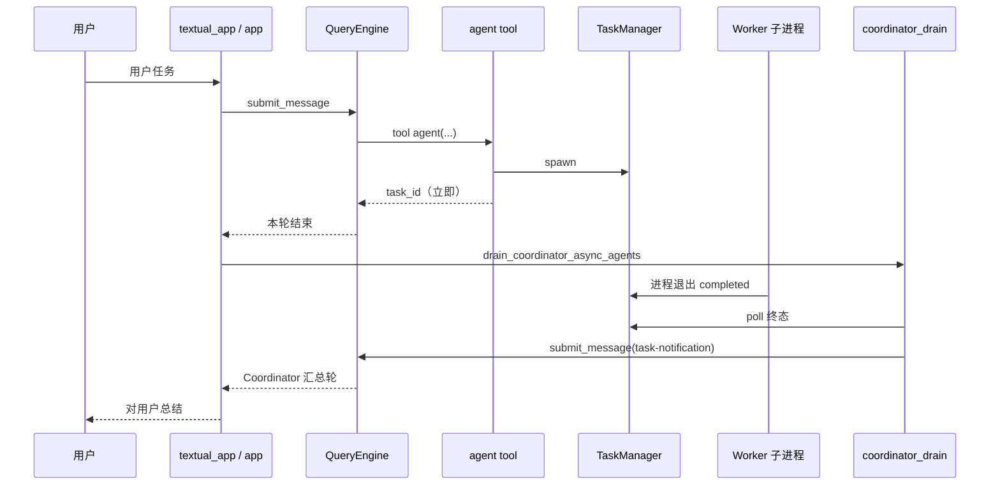
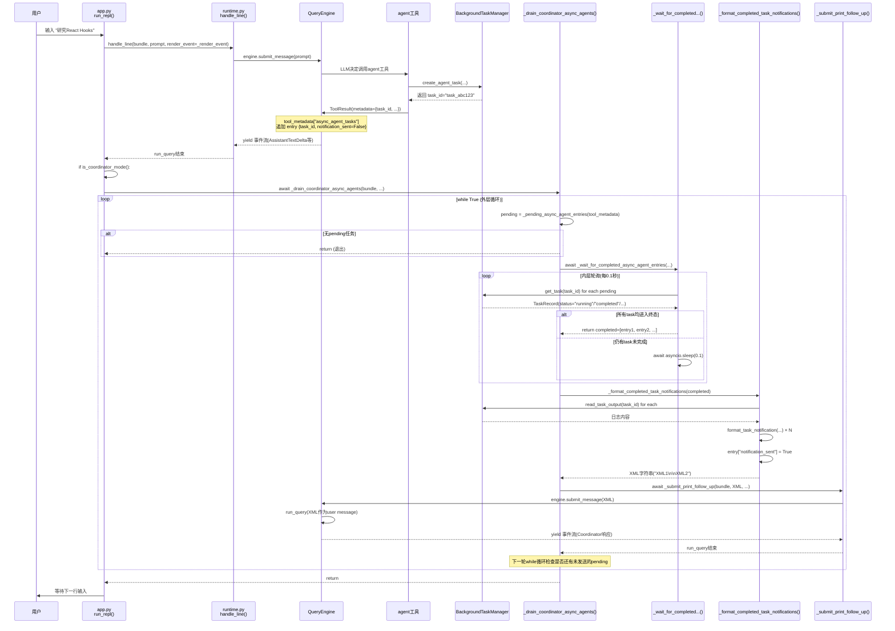
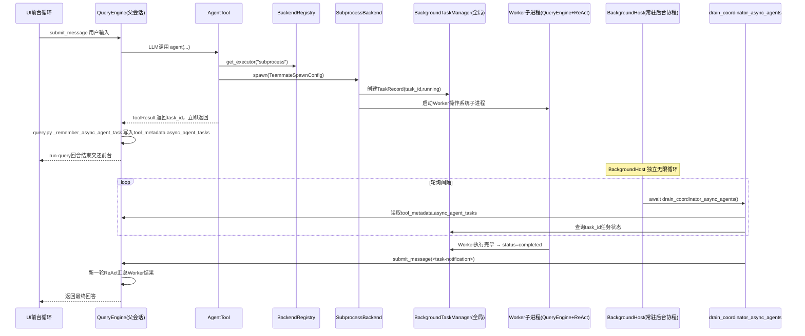
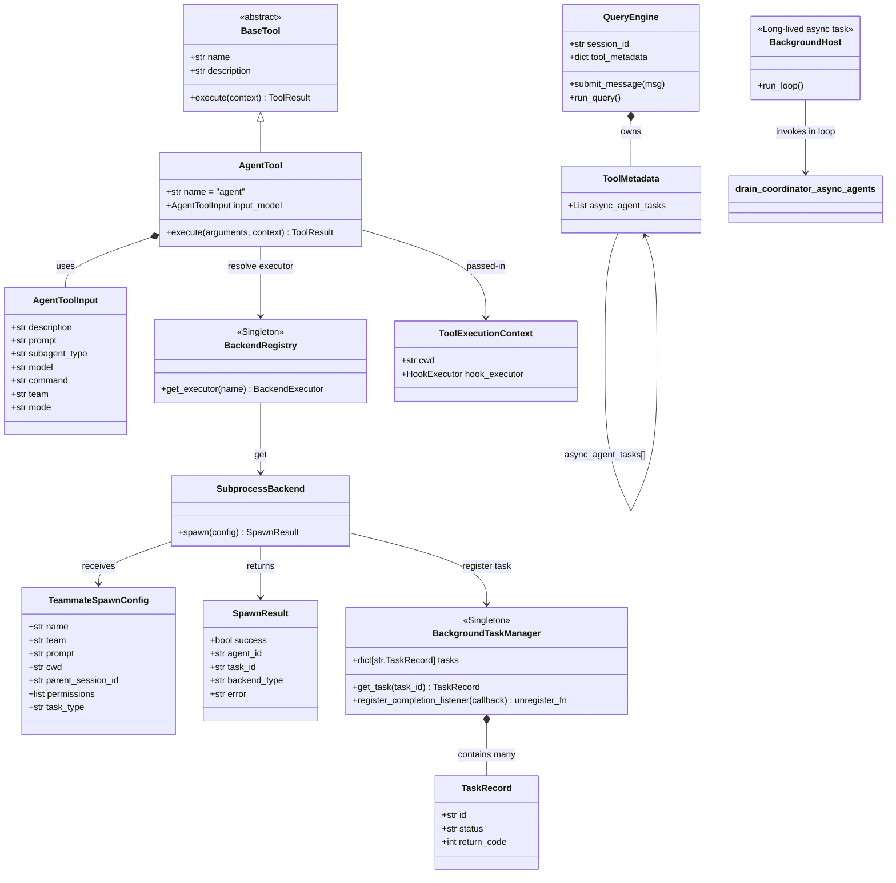
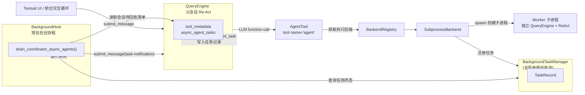

# OpenHarness Coordinator 模式深度分析

> **版本**: v1.1  
> **最后更新**: 2026-06-10  
> **包版本**: 0.1.9 · **同步说明**: [ARCHITECTURE_DOCS_SYNC.md](./ARCHITECTURE_DOCS_SYNC.md)  
> **文档类型**: Coordinator 模式专项（普通 vs Coordinator、spawn、drain、notification）

---

## 📋 目录

- [1. 概述](#1-概述)
- [2. 如何开启](#2-如何开启)
- [3. 普通模式 vs Coordinator（行为）](#3-普通模式-vs-coordinator行为)
- [4. Prompt 差异](#4-prompt-差异)
- [5. spawn 与 Worker](#5-spawn-与-worker)
- [6. drain 与 task-notification](#6-drain-与-task-notification)
- [7. 端到端时序](#7-端到端时序)
- [8. 相关文档](#8-相关文档)

---

## 1. 概述

Coordinator 模式是 OpenHarness 的 **应用层编排形态**：主会话换用协调器 System Prompt，spawn 后台 Worker 后由 harness **自动** 轮询完成并注入 `<task-notification>`，再触发 Coordinator 下一轮。

**不是** 另一套引擎：底层仍是 `QueryEngine` + `agent` 子进程 spawn。

| 组件 | 路径 | 职责 |
|------|------|------|
| 模式检测 | `coordinator/coordinator_mode.py` | `is_coordinator_mode()`、`get_coordinator_system_prompt()` |
| spawn | `tools/agent_tool.py` | 非阻塞 spawn |
| drain | `ui/coordinator_drain.py` | 轮询、`format_task_notification`、`submit_follow_up` |
| 调用方 | `ui/app.py`, `ui/textual_app.py`, `ui/backend_host.py` | `handle_line` 后 `await drain_coordinator_async_agents(...)` |

---

## 2. 如何开启

环境变量（源码 `coordinator_mode.py`）：

```bash
export CLAUDE_CODE_COORDINATOR_MODE=1
```

也可通过 slash `/coordinator` 等入口切换（见 `commands/`）。关闭时清除该环境变量。

---

## 3. 普通模式 vs Coordinator（行为）

| 行为维度 | 普通模式 | Coordinator 模式 |
|----------|----------|-------------------|
| System | `build_system_prompt` + Skills + **Delegation** | `get_coordinator_system_prompt()` |
| Memory | ✅ 每轮 `build_runtime_system_prompt` | ✅ 同样注入 |
| `agent` spawn | 非阻塞，立即 `task_id` | 相同 |
| spawn 后 | **不** 自动收 Worker 结果 | `drain_coordinator_async_agents` |
| 结果进对话 | `task_output` / `/agents` / 用户下一条 | 自动 `<task-notification>` → `submit_message` |
| 用户一句之后 | 通常一轮结束 | 可能连续多轮（无新用户输入） |
| 并行 spawn | 可选 | Prompt 强调单消息多 `agent` |

**为何普通模式不等结果**：引擎在 `TaskManager` 完成时 **不** 自动 `submit_message`；避免阻塞 TUI、保留 Job 模型。详见 [ARCHITECTURE_ENGINE.md §5.0](./ARCHITECTURE_ENGINE.md#50-普通模式-vs-coordinator-模式运行时行为)。
# 第一个核心问题：为什么 Coordinator 删掉它？

## 1）两套完全不一样的委派契约（互斥）

- **普通模式 Delegation（旧契约）：可选委派**

>
> 默认优先自己干活；**子 Agent 是备选、可选项**；仅当任务适合拆分时才用 agent ()。

- **Coordinator（新契约，写在 `get_coordinator_system_prompt()`）：强制委派**

>
> Coordinator **原则上不能直接执行 shell / 文件工具**；所有实际工作必须派发给后台 Worker；spawn‑worker 不是可选，而是标准工作方式。

👉 如果你把旧的 `Delegation And Subagents` 段落塞给 Coordinator，**两套指令直接打架冲突**：

>
> 旧：简单任务优先自己干
> 新：所有干活任务都不能自己干，必须派 Worker

模型会出现行为漂移：Coordinator 忍不住直接执行 shell，不走后台 spawn。
**为了消除指令冲突 → Coordinator 直接跳过整个 delegation_section。**

## 2）两套子 Agent 底层执行模型不一样

表格

| 项目 | 普通模式 `agent()`（delegation_section 描述的） | Coordinator `spawn_background_agent` |
| --- | --- | --- |
| 父会话 run‑query 是否阻塞 | **同步阻塞调用**。父循环停下，等待子 Agent 跑完才返回；父会话不会结束、不会交还控制权给 UI；**不会进入 drain 轮询** | **非阻塞后台**。spawn 之后工具立刻返回 task_id；父 run‑query 回合直接结束、返回 UI；**UI 主动调用 drain 去轮询结果** |
| 回调 / 结果回收逻辑 | **run_query 内部同步等待，没有 drain 参与** | 结果回收完全交给 `drain_coordinator_async_agents`；独立于父会话循环之外 |
| tool_metadata["async_agent_tasks"] | 不会写入这条注册表 | 必须登记任务，drain 依靠这份列表轮询 |
| 消息交互 send_message /task_output | 父会话还活着，可以随时调用 | 父会话早已结束；只能依靠 drain‑notification‑XML 闭环 |

>
> ⚠️ 最关键一点：
> `_build_delegation_section` 里面写的用法（`agent()` + send_message + task_output）是**同步子 Agent 范式**，**根本不是 Coordinator 后台 Worker 异步范式**。
> 这份提示词说明书描述的 API、工作流程、生命周期和 Coordinator 后台任务**不匹配**。
> 所以 Coordinator 不能复用它，Coordinator 有自己一整套 spawn‑drain‑notification 规则，写在独立的 `get_coordinator_system_prompt()`
---

## 4. Prompt 差异

`build_runtime_system_prompt`（`prompts/context.py`）：

- **Coordinator**：`sections = [get_coordinator_system_prompt()]`，**跳过** Skills 列表与 Delegation 段。
- **普通**：`build_system_prompt` + `_build_skills_section` + `_build_delegation_section`。
- **两者均**：Permission mode、Reasoning settings、CLAUDE.md、Local rules、Project context、**Memory**（L1 + L2 token 加权）。

深读：[ARCHITECTURE_PROMPTS.md §5](./ARCHITECTURE_PROMPTS.md#5-coordinator-mode-prompt)。

---

## 5. spawn 与 Worker

`agent` 工具 → `SubprocessBackend` → `BackgroundTaskManager.create_agent_task`：

1. 工具 **立即** 返回 `Spawned agent … (task_id=…)`。
2. Worker 子进程跑完整 ReAct（独立 `QueryEngine`）。
3. `query.py` 在 `_record_tool_carryover` 中调用 `_remember_async_agent_task`，写入 `tool_metadata.async_agent_tasks`（供 drain 匹配）。

Coordinator Prompt **建议** `subagent_type="worker"`；代码不强制该字符串。
异步后台 + drain 轮询，**是 Coordinator 模式独有的上层编排机制，不属于普通 Agent 的能力**。

# 一张完整对照表

表格

| 配置项 | 普通单 Agent 模式     | Coordinator 协调器模式 |
| --- |------------------| --- |
| system‑prompt 包含 delegation_section | ✅是；提供「可选委派」决策指引  | ❌跳过；旧委派规则和强制派工契约冲突 |
| 子 Agent 工具 | `agent()` 默认同步阻塞 | `spawn_background_agent`，非阻塞后台任务 |
| 父 run‑query 在 spawn 之后 | 非阻塞              | 立刻结束，交还控制权给 UI |
| 结果回收 | 父 Agent 循环内等待返回  | UI 调用 drain 轮询 tool_metadata ["async_agent_tasks"] |
| drain 组件是否参与回收子任务 | ❌不参与             | ✅必须参与 |
| 角色定位 | 自己优先干活；委派是备选     | 包工头，禁止直接干活；必须派 Worker |

详见 [ARCHITECTURE_TOOLS_SWARM.md §4](./ARCHITECTURE_TOOLS_SWARM.md#4-子-agent-与任务工具)。

是的，在普通模式下，如果父 Agent 调用 agent 工具后，不在后续回合中主动去拉取结果，子 Agent 的输出确实不会对父 Agent 的推理过程可见。从对话上下文的视角看，结果就是"丢失"了。
但这并不是代码的 bug，而是有意设计的"异步解耦"，只是这个设计把"保证结果不丢"的责任从架构转移给了模型行为（Prompt）。
---

## 6. drain 与 task-notification

### 6.1 `drain_coordinator_async_agents`

实现：`ui/coordinator_drain.py`。

1. 从 `tool_metadata.async_agent_tasks` 取 `notification_sent=False` 的条目。
2. `wait_for_completed_async_agent_entries` 轮询 `TaskManager`（默认 0.1s）。
3. `format_completed_task_notifications` → XML 字符串。
4. `submit_follow_up` → `engine.submit_message(notification)`，并 **重建** `build_runtime_system_prompt`。
5. 若仍有 pending，循环；无 pending 则 return。

### 6.2 XML 格式

```xml
<task-notification>
<task-id>agent-a1b</task-id>
<status>completed</status>
<summary>Agent "Investigate auth bug" completed</summary>
<result>Found null pointer in validate.ts:42...</result>
</task-notification>
```

由 `coordinator_mode.format_task_notification` 生成；Coordinator Prompt 要求将其视为 **内部信号**，对用户翻译总结。

### 6.3 批处理

同一 polling 窗口内多个 Worker 终态 → 一次 `submit_message(XML_A + "\n\n" + XML_B)`。

更细 UI 时序：见本文 **附录 · Coordinator UI 轮询**（实现以 `coordinator_drain.py` 为准）。

### 6.4 drain 在哪些 UI 宿主中执行？

| 宿主 | 文件 | 说明 |
|------|------|------|
| React TUI 后端 | `ui/backend_host.py` `_process_line` | 默认 `oh` 时运行于 `--backend-only` **子进程** |
| Print 模式 | `ui/app.py` `run_print_mode` | `oh -p "..."` |
| Textual TUI | `ui/textual_app.py` | 若使用 Textual 入口 |
| React 父进程 | `launch_react_tui` | ❌ 不持有 `QueryEngine`，**不调** drain |

`run_repl(backend_only=True)` 委托给 `run_backend_host`，与 React 拉起的子进程相同。详见 [BACKEND_HOST_ARCHITECTURE.md §5.4–5.6](./BACKEND_HOST_ARCHITECTURE.md#54-apppy-与-backend_hostpy)。

---

## 7. 端到端时序



---

## 8. 相关文档

| 文档 | 内容 |
|------|------|
| [ARCHITECTURE_ENGINE.md §5](./ARCHITECTURE_ENGINE.md) | 子 Agent 异步、非阻塞设计 |
| [ARCHITECTURE_PROMPTS.md §5](./ARCHITECTURE_PROMPTS.md) | Coordinator System Prompt |
| [ARCHITECTURE_TOOLS_SWARM.md](./ARCHITECTURE_TOOLS_SWARM.md) | Worker 消息传递（深潜附录） |
| [ARCHITECTURE_TASKS_AUTH.md](./ARCHITECTURE_TASKS_AUTH.md) | Tasks 与 metadata |
| [BACKEND_HOST_ARCHITECTURE.md](./BACKEND_HOST_ARCHITECTURE.md) | BackendHost、`app.py` 启动链、drain 分布 |

---

## 附录 · Coordinator UI 轮询

> 合并自 `COORDINATOR_UI_POLLING.md`（2026-08-05）

> **版本**: v1.1  
> **最后更新**: 2026-06-21（实现路径：`ui/coordinator_drain.py`；调用方 `app.py` / `textual_app.py` / `backend_host.py`）  
> **关联**: [ARCHITECTURE_COORDINATOR.md](./ARCHITECTURE_COORDINATOR.md)
> **作者**: OpenHarness Community  
> **文档类型**: 技术架构补充(UI轮询检测与多Task批处理)

---

## 📋 概述

本文档详细说明OpenHarness在Coordinator模式下,**UI层如何通过轮询检测后台Agent任务完成**,并**批量注入`<task-notification>`到主会话**。这是对 [ARCHITECTURE_TOOLS_SWARM.md](ARCHITECTURE_TOOLS_SWARM.md) 和 [ARCHITECTURE_TASKS_AUTH.md](ARCHITECTURE_TASKS_AUTH.md) 的重要补充。

**核心源码**: `src/openharness/ui/coordinator_drain.py`（`drain_coordinator_async_agents`）；调用方见 `ui/app.py`、`ui/textual_app.py`、`ui/backend_host.py`。

---

## 1. 完整调用链路



---

## 2. 核心函数详解

### 2.1 `_pending_async_agent_entries()` - 获取待办集合

**源码**: [`app.py:58-67`](file:///Users/gqli/work/deepagents/OpenHarness/src/openharness/ui/app.py#L58-L67)

```python
def _pending_async_agent_entries(tool_metadata: dict[str, object] | None) -> list[dict[str, object]]:
    """从tool_metadata中提取尚未发送notification的async_agent_tasks条目。"""
    pending: list[dict[str, object]] = []
    for entry in _async_agent_task_entries(tool_metadata):
        task_id = str(entry.get("task_id") or "").strip()
        if not task_id:
            continue
        if bool(entry.get("notification_sent")):  # ← 关键过滤条件
            continue
        pending.append(entry)
    return pending
```

**数据来源**:
- **写入位置**: Hook机制在 `SUBAGENT_SPAWN` 事件触发时,向 `tool_metadata["async_agent_tasks"]` 追加entry
- **Entry结构**:
  ```python
  {
      "task_id": "task_abc123",
      "agent_id": "researcher@default",
      "description": "研究React Hooks",
      "backend_type": "subprocess",
      "notification_sent": False,  # ← 初始为False
      "notified_status": None,     # ← 通知时的状态快照
      "return_code": None,         # ← 进程退出码
  }
  ```

**过滤规则**:
1. ✅ `task_id` 非空
2. ✅ `notification_sent == False` (尚未发送过notification)

**设计意图**: 确保每个Task的notification**只发送一次**,避免重复注入XML

---

### 2.2 `_wait_for_completed_async_agent_entries()` - 轮询等待终态

**源码**: [`app.py:81-105`](file:///Users/gqli/work/deepagents/OpenHarness/src/openharness/ui/app.py#L81-L105)

```python
async def _wait_for_completed_async_agent_entries(
    tool_metadata: dict[str, object] | None,
    *,
    poll_interval_seconds: float = 0.1,  # ← 轮询间隔100ms
) -> list[dict[str, object]]:
    manager = get_task_manager()
    while True:
        pending = _pending_async_agent_entries(tool_metadata)
        if not pending:
            return []
        
        completed: list[dict[str, object]] = []
        for entry in pending:
            task_id = str(entry.get("task_id") or "").strip()
            task = manager.get_task(task_id)
            
            if task is None:
                # Task不存在(可能已被删除),标记为已处理
                entry["notification_sent"] = True
                entry["status"] = "missing"
                continue
            
            entry["status"] = task.status
            
            # 检查是否进入终态
            if task.status in _TERMINAL_TASK_STATUSES:  # {"completed", "failed", "killed"}
                entry["return_code"] = task.return_code
                completed.append(entry)
        
        if completed:
            return completed  # ← 批量返回所有已完成的entry
        
        await asyncio.sleep(poll_interval_seconds)  # ← 等待100ms后重试
```

**关键特性**:

1. **批量返回**: 单次调用可能返回**多个**已完成的entry(如果它们在同一轮polling窗口内都进入终态)
2. **非阻塞轮询**: 每隔100ms扫描一次,不阻塞主事件循环
3. **容错处理**: `get_task()` 返回 `None` 时,标记为 `"missing"` 并跳过,避免无限等待
4. **动态pending列表**: 每次循环重新调用 `_pending_async_agent_entries()`,排除已发送notification的entry

**终态定义** (`_TERMINAL_TASK_STATUSES`):
```python
_TERMINAL_TASK_STATUSES = {"completed", "failed", "killed"}
```

---

### 2.3 `_format_completed_task_notifications()` - 格式化XML

**源码**: [`app.py:108-134`](file:///Users/gqli/work/deepagents/OpenHarness/src/openharness/ui/app.py#L108-L134)

```python
def _format_completed_task_notifications(completed: list[dict[str, object]]) -> str:
    manager = get_task_manager()
    notifications: list[str] = []
    
    for entry in completed:
        task_id = str(entry.get("task_id") or "").strip()
        agent_id = str(entry.get("agent_id") or task_id).strip()
        
        task = manager.get_task(task_id)
        if task is None:
            continue
        
        # 读取Task输出日志(最多8KB)
        output = manager.read_task_output(task_id, max_bytes=8000).strip()
        
        # 构建TaskNotification对象
        notification = TaskNotification(
            task_id=agent_id,
            status=task.status,
            summary=_build_async_task_summary(
                entry,
                task_status=task.status,
                return_code=task.return_code,
            ),
            result=output or None,
        )
        
        # 格式化为XML
        xml = format_task_notification(notification)
        notifications.append(xml)
        
        # ⚠️ 关键:标记为已发送,下一轮_pending不再包含此entry
        entry["notification_sent"] = True
        entry["notified_status"] = task.status
    
    # 多条XML用双换行符拼接
    return "\n\n".join(notifications)
```

**Summary生成逻辑** ([`_build_async_task_summary`](file:///Users/gqli/work/deepagents/OpenHarness/src/openharness/ui/app.py#L70-L78)):

```python
def _build_async_task_summary(entry, *, task_status, return_code) -> str:
    description = str(entry.get("description") or entry.get("agent_id") or "background task").strip()
    
    if task_status == "completed":
        return f'Agent "{description}" completed'
    if task_status == "killed":
        return f'Agent "{description}" was stopped'
    if return_code is not None:
        return f'Agent "{description}" failed with exit code {return_code}'
    return f'Agent "{description}" failed'
```

**XML示例**:
```xml
<task-notification>
<task-id>researcher@default</task-id>
<status>completed</status>
<summary>Agent "研究React Hooks" completed</summary>
<result>React Hooks是函数组件的状态管理方案...</result>
</task-notification>
```

---

### 2.4 `_drain_coordinator_async_agents()` - 主循环

**源码**: [`app.py:177-206`](file:///Users/gqli/work/deepagents/OpenHarness/src/openharness/ui/app.py#L177-L206)

```python
async def _drain_coordinator_async_agents(
    bundle,
    *,
    prompt_seed: str,
    output_format: str,
    print_system,
    render_event,
) -> None:
    engine = getattr(bundle, "engine", None)
    if engine is None:
        return
    
    while True:  # ← 外层循环:持续处理直到所有pending都发送完毕
        # Step 1: 获取待办集合
        pending = _pending_async_agent_entries(getattr(engine, "tool_metadata", None))
        if not pending:
            return  # ← 无待办,退出
        
        # Step 2: 提示用户(仅text模式)
        if output_format == "text":
            await print_system(f"Waiting for {len(pending)} background agent task(s) to finish...")
        
        # Step 3: 轮询等待至少一个Task完成
        completed = await _wait_for_completed_async_agent_entries(getattr(engine, "tool_metadata", None))
        
        # Step 4: 格式化XML
        notification_payload = _format_completed_task_notifications(completed)
        if not notification_payload.strip():
            return
        
        # Step 5: 提交XML到引擎,触发Coordinator响应
        await _submit_print_follow_up(
            bundle,
            notification_payload,
            prompt_seed=prompt_seed,
            print_system=print_system,
            render_event=render_event,
        )
        
        # Step 6: 回到while开头,检查是否还有未发送的pending
```

**循环终止条件**:
1. ✅ `_pending_async_agent_entries()` 返回空列表(所有entry都已 `notification_sent=True`)
2. ✅ `_format_completed_task_notifications()` 返回空字符串(无有效Task)

---

## 3. 多Task批处理场景分析

### 场景1: 先后完成(Task A先于Task B)

```
T0: 用户输入 → spawn Agent A (task_a) + Agent B (task_b)
    → tool_metadata["async_agent_tasks"] = [
        {task_id: "task_a", notification_sent: False},
        {task_id: "task_b", notification_sent: False}
    ]

T1: _drain_coordinator_async_agents() 启动
    → _pending = [entry_a, entry_b]

T2: _wait_for_completed...() 开始轮询
    → T2.1: task_a.status = "running", task_b.status = "running" → sleep(0.1)
    → T2.2: task_a.status = "running", task_b.status = "running" → sleep(0.1)
    → T2.3: task_a.status = "completed" ✅, task_b.status = "running"
    → 返回 completed = [entry_a]

T3: _format_completed_task_notifications([entry_a])
    → 生成 XML_A
    → entry_a["notification_sent"] = True

T4: _submit_print_follow_up(XML_A)
    → engine.submit_message(XML_A)
    → Coordinator看到 <task-notification>,决定下一步行动

T5: 回到while开头
    → _pending = [entry_b] (entry_a已被过滤)

T6: _wait_for_completed...() 继续轮询
    → T6.1: task_b.status = "completed" ✅
    → 返回 completed = [entry_b]

T7: _format_completed_task_notifications([entry_b])
    → 生成 XML_B
    → entry_b["notification_sent"] = True

T8: _submit_print_follow_up(XML_B)
    → engine.submit_message(XML_B)

T9: 回到while开头
    → _pending = [] → return (退出)
```

**结论**: 发生**两轮**「`_wait` → 格式化 → `submit_message`」

---

### 场景2: 同时完成(Task A和B在同一轮polling窗口内完成)

```
T0: 用户输入 → spawn Agent A + Agent B
    → tool_metadata["async_agent_tasks"] = [entry_a, entry_b]

T1: _drain_coordinator_async_agents() 启动
    → _pending = [entry_a, entry_b]

T2: _wait_for_completed...() 开始轮询
    → T2.1: task_a.status = "running", task_b.status = "running" → sleep(0.1)
    → T2.2: task_a.status = "running", task_b.status = "running" → sleep(0.1)
    → T2.3: task_a.status = "completed" ✅, task_b.status = "completed" ✅
    → 返回 completed = [entry_a, entry_b]  ← 批量返回!

T3: _format_completed_task_notifications([entry_a, entry_b])
    → 生成 XML_A 和 XML_B
    → entry_a["notification_sent"] = True
    → entry_b["notification_sent"] = True
    → 返回 "XML_A\n\nXML_B"

T4: _submit_print_follow_up("XML_A\n\nXML_B")
    → engine.submit_message("XML_A\n\nXML_B")
    → Coordinator在同一轮看到两个 <task-notification>

T5: 回到while开头
    → _pending = [] → return (退出)
```

**结论**: 仅发生**一轮**「`_wait` → 格式化 → `submit_message`」,两条XML一次性提交

---

## 4. 关键设计决策

### 4.1 为什么使用轮询而非WebSocket/Callback?

| 方案 | 优点 | 缺点 | OpenHarness选择 |
|------|------|------|----------------|
| **轮询** | ✅ 实现简单<br>✅ 无需额外连接<br>✅ 易于调试 | ⚠️ 延迟~100ms<br>⚠️ 轻微CPU开销 | ✅ **采用** |
| **WebSocket** | ✅ 实时推送<br>✅ 低延迟 | ❌ 需要维护长连接<br>❌ 复杂度高 | ❌ 未采用 |
| **Callback** | ✅ 事件驱动<br>✅ 无延迟 | ❌ 需要注册回调<br>❌ 错误处理复杂 | ❌ 未采用 |

**权衡**: 100ms延迟对用户体验影响极小,但实现复杂度大幅降低

---

### 4.2 为什么需要 `notification_sent` 标志?

**问题**: 如果不标记已发送,会发生什么?

```python
# 错误示例:没有notification_sent标志
pending = [entry for entry in async_agent_tasks if entry["task_id"]]
# 每次循环都会包含所有task_id非空的entry

# 第一轮: entry_a和entry_b都在pending
# 第二轮: entry_a和entry_b仍在pending (因为task_id依然存在)
# → 无限循环!
```

**解决方案**:
```python
# 正确示例:通过notification_sent过滤
pending = [entry for entry in async_agent_tasks 
           if entry["task_id"] and not entry["notification_sent"]]

# 第一轮: entry_a和entry_b都在pending (notification_sent=False)
# 发送后: entry_a["notification_sent"] = True
# 第二轮: 仅entry_b在pending (entry_a被过滤)
# → 正常退出
```

---

### 4.3 为什么批量返回而非逐个处理?

**优势**:
1. **减少LLM调用次数**: 多条XML一次性提交,Coordinator在一轮内看到所有结果
2. **提高效率**: 避免多次 `_wait` → `_format` → `_submit` 的开销
3. **更好的上下文**: Coordinator可以同时看到多个Worker的结果,做出更优决策

**示例**:
```python
# 逐个处理(低效)
for entry in completed:
    xml = format_task_notification(entry)
    await engine.submit_message(xml)  # ← 3次LLM调用

# 批量处理(高效)
xmls = [format_task_notification(e) for e in completed]
await engine.submit_message("\n\n".join(xmls))  # ← 1次LLM调用
```

---

## 5. 与Task系统的关系

### 5.1 数据流

```
┌─────────────────────────────────────────────────────┐
│              Data Flow Architecture                  │
├─────────────────────────────────────────────────────┤
│                                                     │
│  1. agent工具执行                                    │
│  ┌──────────────────────────┐                      │
│  │ AgentTool.execute()      │                      │
│  │   ↓                       │                      │
│  │ executor.spawn(config)   │                      │
│  │   ↓                       │                      │
│  │ BackgroundTaskManager    │                      │
│  │   .create_agent_task()   │                      │
│  └──────────────────────────┘                      │
│           ↓                                         │
│  2. 写入Task Record                                │
│  ┌──────────────────────────┐                      │
│  │ TaskRecord {             │                      │
│  │   id: "task_abc123",     │                      │
│  │   status: "running",     │                      │
│  │   process: Process(...), │                      │
│  │   log_file: Path(...)    │                      │
│  │ }                         │                      │
│  └──────────────────────────┘                      │
│           ↓                                         │
│  3. Hook触发(可选)                                 │
│  ┌──────────────────────────┐                      │
│  │ HookExecutor.execute(    │                      │
│  │   SUBAGENT_SPAWN, {      │                      │
│  │     task_id: "...",      │                      │
│  │     agent_id: "...",     │                      │
│  │     ...                  │                      │
│  │   }                       │                      │
│  │ )                         │                      │
│  │   ↓                       │                      │
│  │ Hook写入:                │                      │
│  │ tool_metadata[           │                      │
│  │   "async_agent_tasks"    │                      │
│  │ ].append({               │                      │
│  │   task_id: "...",        │                      │
│  │   notification_sent: F   │                      │
│  │ })                        │                      │
│  └──────────────────────────┘                      │
│           ↓                                         │
│  4. UI轮询检测                                     │
│  ┌──────────────────────────┐                      │
│  │ _drain_coordinator...()  │                      │
│  │   ↓                       │                      │
│  │ _pending_async_agent...()│                      │
│  │   → 读取tool_metadata    │                      │
│  │   ↓                       │                      │
│  │ _wait_for_completed...() │                      │
│  │   → 轮询TaskRecord.status│                      │
│  │   ↓                       │                      │
│  │ _format_completed...()   │                      │
│  │   → 读取log_file         │                      │
│  │   → 生成XML              │                      │
│  │   → 标记notification_sent│                      │
│  │   ↓                       │                      │
│  │ _submit_print_follow_up()│                      │
│  │   → engine.submit_message│                      │
│  └──────────────────────────┘                      │
│                                                     │
└─────────────────────────────────────────────────────┘
```




### 5.2 生命周期对比

| 阶段 | Task系统 | UI轮询 |
|------|---------|--------|
| **创建** | `BackgroundTaskManager.create_agent_task()` | Hook写入 `async_agent_tasks` |
| **运行** | `Process` 子进程执行 | `_wait` 轮询 `TaskRecord.status` |
| **完成** | `TaskRecord.status = "completed"` | `_wait` 检测到终态 |
| **通知** | 无(由UI层负责) | `_format` 生成XML, `_submit` 注入 |
| **清理** | `cleanup_worktree()` | `notification_sent=True` |

---

## 6. 常见问题

### Q1: 如果Task永远不完成怎么办?

**A**: `_wait_for_completed_async_agent_entries()` 会**无限轮询**,但有以下保护:
1. **Task超时**: `BackgroundTaskManager` 可配置超时时间,超时后自动kill
2. **手动停止**: 用户可通过 `/agents stop task_id` 强制终止
3. **进程崩溃**: `Process.wait()` 返回非零退出码,标记为 `"failed"`

### Q2: 为什么轮询间隔是100ms?

**A**: 权衡实时性和CPU开销:
- **10ms**: 太频繁,CPU占用高
- **100ms**: 平衡点,延迟对用户不可感知
- **1000ms**: 延迟明显,用户体验差

### Q3: 多个Coordinator会话会冲突吗?

**A**: 不会,因为:
1. **独立tool_metadata**: 每个 `QueryEngine` 实例有自己的 `tool_metadata`
2. **Task ID唯一**: `task_id` 全局唯一,不同会话的Task不会混淆
3. **notification_sent隔离**: 每个entry的 `notification_sent` 仅在当前会话生效

### Q4: 如何调试轮询逻辑?

**A**: 启用日志:
```bash
export LOG_LEVEL=DEBUG
openharness --coordinator
```

关键日志:
```
DEBUG: _pending_async_agent_entries: found 2 pending tasks
DEBUG: _wait_for_completed: task_abc status=running
DEBUG: _wait_for_completed: task_def status=completed
INFO: _format_completed_task_notifications: generated 1 notification(s)
INFO: _submit_print_follow_up: submitting XML to engine
```

---

## 7. 性能优化建议

### 7.1 调整轮询间隔

```python
# 快速响应场景(开发环境)
await _wait_for_completed_async_agent_entries(
    tool_metadata,
    poll_interval_seconds=0.05  # 50ms
)

# 节能场景(后台任务)
await _wait_for_completed_async_agent_entries(
    tool_metadata,
    poll_interval_seconds=0.5  # 500ms
)
```

### 7.2 限制并发Task数量

```python
# 在spawn前检查
pending_count = len(_pending_async_agent_entries(tool_metadata))
if pending_count >= MAX_CONCURRENT_AGENTS:
    return ToolResult(
        output=f"Error: Too many concurrent agents ({pending_count}). "
               f"Max allowed: {MAX_CONCURRENT_AGENTS}",
        is_error=True,
    )
```

### 7.3 批量读取日志

当前实现逐Task读取日志,可优化为批量读取:
```python
# 当前实现(O(N) I/O)
for entry in completed:
    output = manager.read_task_output(entry["task_id"])

# 优化方案(并行I/O)
outputs = await asyncio.gather(*[
    manager.read_task_output_async(entry["task_id"])
    for entry in completed
])
```

---

## 📚 相关文档

- [ARCHITECTURE_TOOLS_SWARM.md](ARCHITECTURE_TOOLS_SWARM.md) - Tools & Swarm系统架构
- [ARCHITECTURE_TASKS_AUTH.md](ARCHITECTURE_TASKS_AUTH.md) - Task系统与认证机制
- [ARCHITECTURE_ENGINE.md](ARCHITECTURE_ENGINE.md) - Engine模块与ReAct循环

---

**文档版本**: v1.0 | **最后更新**: 2026-04-20
