# OpenHarness Engine 深度分析

> **版本**: v1.4  
> **最后更新**: 2026-06-21（与 `coordinator_drain.py`、`prompts/context.py` 对齐；勘误 drain 函数名与实现路径）  
> **包版本**: 0.1.9 · **同步说明**: [ARCHITECTURE_DOCS_SYNC.md](./ARCHITECTURE_DOCS_SYNC.md)
> **作者**: OpenHarness Community  
> **文档类型**: 技术架构设计(核心引擎专项)

---

## 📋 目录

- [1. 概述](#1-概述)
- [2. Engine架构设计](#2-engine架构设计)
- [3. ReAct循环详解](#3-react循环详解)
- [4. 自动压缩机制](#4-自动压缩机制)
- [5. 子Agent异步执行机制](#5-子agent异步执行机制)（含 [5.1.1 主循环与 task_output 误解](#511-再次进入主循环--再次调用大模型是否会自动触发-task_output)、主从边界、会话恢复、Mailbox、复杂任务闭环）
- [6. 工具执行策略](#6-工具执行策略)
- [7. 用户确认机制 (Permission Confirmation)](#7-用户确认机制-permission-confirmation)（含 [§7.5.1](#751-react-终端backend_hoststdin-协议与-future-唤醒)）
- [8. 性能优化](#8-性能优化)
- [9. 错误处理与恢复](#9-错误处理与恢复)
- [10. 竞品对比](#10-竞品对比)

---

## 1. 概述

### 1.1 职责定位

**Engine模块**是OpenHarness的核心执行引擎,实现了完整的**ReAct (Reasoning + Acting)**循环。

**核心职责**:
1. **消息管理**: 维护对话历史(`_messages`)和工具元数据(`_tool_metadata`)
2. **ReAct循环**: 交替执行LLM推理和工具调用
3. **上下文压缩**: 四层渐进式压缩策略(auto/reactive/emergency/summary)
4. **流式输出**: 实时yield事件给UI层(TextDelta/ToolResult/Error等)
5. **成本控制**: 跟踪token使用和API费用

**核心价值**:
- 🔄 **智能循环**: Reasoning → Acting → Observation → Reasoning...
- ⚡ **高效执行**: 多工具并发,自动压缩,早期返回
- 🛡️ **容错能力强**: 网络重试,prompt too long应急压缩, graceful degradation
- 💰 **成本透明**: 实时跟踪token使用,支持预算限制

### 1.2 关键文件

| 文件 | 大小 | 职责 |
|------|------|------|
| `query_engine.py` | 8.2KB | QueryEngine类,状态管理,submit_message入口 |
| `query.py` | 25.1KB | run_query()主循环,工具执行,压缩逻辑 |
| `messages.py` | 4.6KB | ConversationMessage模型定义 |
| `stream_events.py` | 1.8KB | 流式事件类型(AssistantTextDelta/ToolResultEvent等) |
| `cost_tracker.py` | 0.7KB | 成本跟踪器 |

---

## 2. Engine架构设计

### 2.1 整体架构图

```
┌─────────────────────────────────────────────────────────────┐
│                    QueryEngine                               │
├─────────────────────────────────────────────────────────────┤
│                                                             │
│  State Management                                           │
│  ├─ _messages: list[ConversationMessage]                   │
│  ├─ _tool_metadata: dict[str, Any]                         │
│  └─ _cost_tracker: CostTracker                             │
│                                                             │
│  Public API                                                 │
│  └─ submit_message(prompt: str) -> AsyncIterator[Event]    │
│       ↓                                                     │
│  Internal Logic                                             │
│  ├─ build_coordinator_context()                            │
│  ├─ create_query_context()                                 │
│  └─ run_query(context, messages)                           │
│       ↓                                                     │
│  Core Loop (run_query)                                      │
│  ├─ Auto-Compaction Check                                  │
│  ├─ LLM API Call (stream)                                  │
│  ├─ Tool Execution (single/concurrent)                     │
│  ├─ Permission Check                                       │
│  ├─ Hook Execution (Pre/Post)                              │
│  └─ Result Aggregation                                     │
│                                                             │
└─────────────────────────────────────────────────────────────┘
```
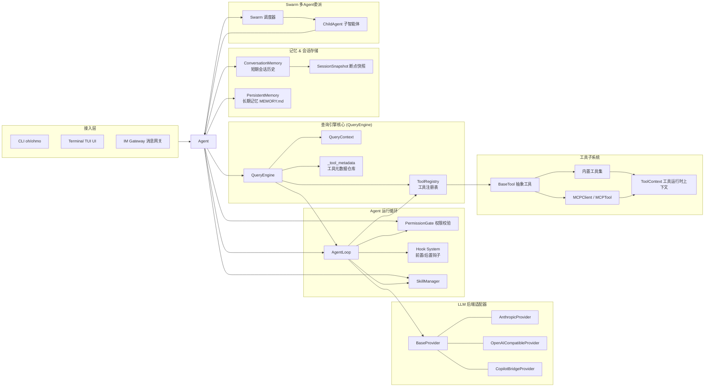
```mermaid
flowchart LR
%% ========= 接入入口 =========
   subgraph Entry["接入层"]
      CLI["CLI oh/ohmo"]
      TUI["Terminal TUI UI"]
      ImGateway["IM Gateway 消息网关"]
   end

%% ========= Agent 顶层实体 =========
   Agent["Agent"]

%% ========= 核心查询引擎 【缺失的关键模块】 =========
   subgraph QueryCore["查询引擎核心 (QueryEngine)"]
      QE["QueryEngine"]
      QC["QueryContext"]
      ToolMeta["_tool_metadata<br/>工具元数据仓库"]
      ToolReg["ToolRegistry<br/>工具注册表"]
   end

%% ========= Agent 循环执行引擎 =========
   subgraph LoopSystem["Agent 运行循环"]
      AgentLoop["AgentLoop"]
      PermissionGate["PermissionGate 权限校验"]
      HookSystem["Hook System<br/>前置/后置钩子"]
      SkillMgr["SkillManager"]
   end

%% ========= LLM Provider 层 =========
   subgraph LLMProvider["LLM 后端适配器"]
      BaseProvider["BaseProvider"]
      AnthropicP["AnthropicProvider"]
      OpenAICompatP["OpenAICompatibleProvider"]
      CopilotBridgeP["CopilotBridgeProvider"]
   end

%% ========= 工具执行系统 =========
   subgraph ToolSystem["工具子系统"]
      BaseTool["BaseTool 抽象工具"]
      BuiltinTools["内置工具集"]
      MCPClient["MCPClient / MCPTool"]
      ToolContext["ToolContext 工具运行时上下文"]
   end

%% ========= 记忆系统 =========
   subgraph MemorySystem["记忆 & 会话存储"]
      ConvMemory["ConversationMemory<br/>短期会话历史"]
      PersistMemory["PersistentMemory<br/>长期记忆 MEMORY.md"]
      Snapshot["SessionSnapshot 断点快照"]
   end

%% ========= Swarm 多智能体 =========
   subgraph SwarmSystem["Swarm 多Agent委派"]
      Swarm["Swarm 调度器"]
      ChildAgent["ChildAgent 子智能体"]
   end

%% ---------------- 连线数据流 ----------------
   Entry --> Agent

%% Agent 持有 QueryEngine
   Agent --> QE
   Agent --> AgentLoop
   Agent --> SkillMgr
   Agent --> PermissionGate
   Agent --> ConvMemory
   Agent --> PersistMemory
   Agent --> Swarm

%% QueryEngine 内部依赖
   QE --> QC
   QE --> ToolMeta
   QE --> ToolReg

%% QueryEngine 驱动 AgentLoop
   QE --> AgentLoop

%% 循环引擎链路
   AgentLoop --> BaseProvider
   AgentLoop --> PermissionGate
   AgentLoop --> HookSystem
   AgentLoop --> SkillMgr
   AgentLoop --> ToolReg

%% Provider 实现
   BaseProvider --- AnthropicP
   BaseProvider --- OpenAICompatP
   BaseProvider --- CopilotBridgeP

%% 工具注册表 -> 工具实例
   ToolReg --> BaseTool
   BaseTool --> BuiltinTools
   BaseTool --> MCPClient
   BuiltinTools & MCPClient --> ToolContext

%% 会话记忆数据流
   ConvMemory --> Snapshot

%% 多Agent
   Swarm --> ChildAgent
   ChildAgent --> Agent
```
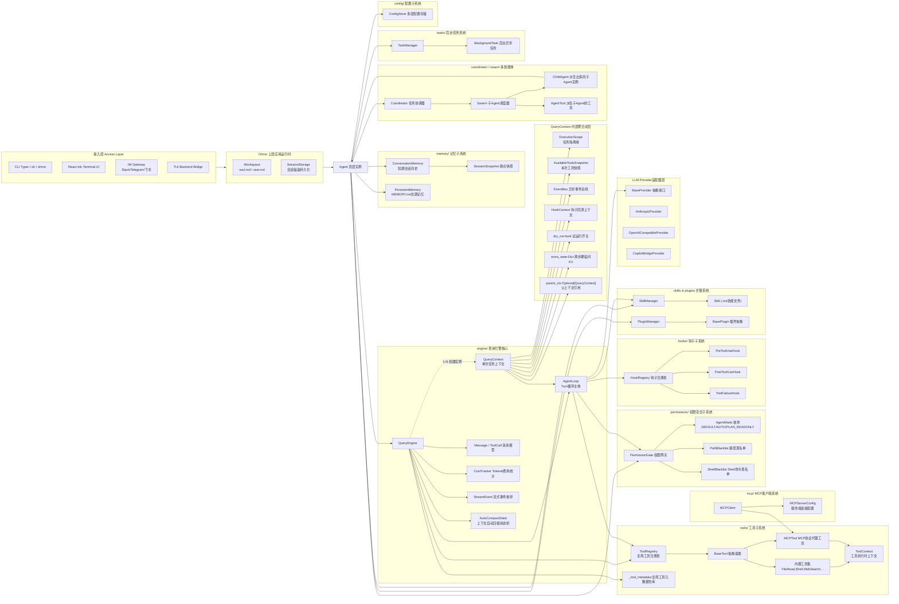
```mermaid
flowchart LR
%% ============ 接入层 ============
   subgraph AccessLayer["接入层 Access Layer"]
      CLI["CLI Typer / oh / ohmo"]
      TUI["React‑Ink Terminal UI"]
      IMGateway["IM Gateway<br/>Slack/Telegram/飞书"]
      BackendBridge["TUI‑Backend Bridge"]
   end

%% ============ Ohmo运行时 ============
   subgraph OhmoRuntime["Ohmo 上层应用运行时"]
      Workspace["Workspace<br/>soul.md / user.md"]
      SessionStorage["SessionStorage<br/>会话磁盘持久化"]
   end

   Agent["Agent 顶层实例"]

%% ============ 核心引擎 engine ============
   subgraph EngineCore["engine/ 查询引擎核心"]
      QueryEngine["QueryEngine"]
      QueryContext["QueryContext<br/>单次任务上下文"]
      AgentLoop["AgentLoop<br/>Turn循环主体"]
      Messages["Message / ToolCall 消息模型"]
      CostTracker["CostTracker Token&费用统计"]
      StreamEvents["StreamEvent 流式事件枚举"]
      AutoCompactState["AutoCompactState<br/>上下文自动压缩状态机"]
   end

   subgraph QC_Inner["QueryContext 内部聚合成员"]
      ExecutionScope["ExecutionScope<br/>任务隔离域"]
      AvailableToolsSnapshot["AvailableToolsSnapshot<br/>本次工具快照"]
      EventBus["EventBus 异步事件总线"]
      HookContext["HookContext 钩子回调上下文"]
      DryRun["dry_run:bool 试运行开关"]
      ExtraState["extra_state:Dict 跨步骤临时KV"]
      ParentCtx["parent_ctx:Optional[QueryContext]<br/>父上下文引用"]
   end

%% ============ 工具系统 ============
   subgraph ToolSystem["tools/ 工具子系统"]
      ToolRegistry["ToolRegistry<br/>全局工具注册表"]
      ToolMeta["_tool_metadata 全局工具元数据仓库"]
      BaseTool["BaseTool 抽象基类"]
      BuiltinToolGroup["内置工具集<br/>FileRead,Shell,WebSearch…"]
      MCPTool["MCPTool MCP协议代理工具"]
      ToolContext["ToolContext<br/>工具执行时上下文"]
   end

%% ============ MCP客户端 ============
   subgraph MCPSubsystem["mcp/ MCP客户端系统"]
      MCPClient["MCPClient"]
      MCPServerConfig["MCPServerConfig<br/>服务端连接配置"]
   end

%% ============ 权限安全 ============
   subgraph PermissionSystem["permissions/ 权限安全子系统"]
      PermissionGate["PermissionGate 权限网关"]
      AgentMode["AgentMode 枚举<br/>DEFAULT/AUTO/PLAN_READONLY"]
      PathBlacklist["PathBlacklist 路径黑名单"]
      ShellBlacklist["ShellBlacklist Shell命令黑名单"]
   end

%% ============ 钩子生命周期 ============
   subgraph HookSystem["hooks/ 钩子子系统"]
      HookRegistry["HookRegistry 钩子注册表"]
      PreToolHook["PreToolUseHook"]
      PostToolHook["PostToolUseHook"]
      ToolFailHook["ToolFailureHook"]
   end

%% ============ 技能 & 插件 ============
   subgraph SkillPluginSystem["skills & plugins 扩展系统"]
      SkillManager["SkillManager"]
      Skill["Skill (.md技能文件)"]
      PluginManager["PluginManager"]
      BasePlugin["BasePlugin 插件抽象"]
   end

%% ============ 记忆模块 ============
   subgraph MemorySystem["memory/ 记忆子系统"]
      ConversationMemory["ConversationMemory<br/>短期会话历史"]
      PersistentMemory["PersistentMemory<br/>MEMORY.md长期记忆"]
      SessionSnapshot["SessionSnapshot 断点快照"]
   end

%% ============ 多Agent协调 ============
   subgraph MultiAgentSystem["coordinator / swarm 多智能体"]
      Coordinator["Coordinator 任务协调器"]
      Swarm["Swarm 子Agent调度器"]
      ChildAgent["ChildAgent 派生出来的子Agent实例"]
      AgentTool["AgentTool 派生子Agent的工具"]
   end

%% ============ 后台任务 ============
   subgraph TaskSystem["tasks/ 后台任务系统"]
      TaskManager["TaskManager"]
      BackgroundTask["BackgroundTask 后台异步任务"]
   end

%% ============ LLM Provider ============
   subgraph ProviderLayer["LLM Provider适配器层"]
      BaseProvider["BaseProvider 抽象接口"]
      AnthropicProvider["AnthropicProvider"]
      OpenAICompatProvider["OpenAICompatibleProvider"]
      CopilotBridgeProvider["CopilotBridgeProvider"]
   end

%% ============ 配置 ============
   subgraph ConfigSystem["config/ 配置子系统"]
      ConfigStore["ConfigStore 多层配置存储"]
   end

%% -------------------- 数据流连线 --------------------
   AccessLayer --> OhmoRuntime
   OhmoRuntime --> Agent

   Agent --> QueryEngine
   Agent --> SkillManager
   Agent --> PluginManager
   Agent --> PermissionGate
   Agent --> ConversationMemory
   Agent --> PersistentMemory
   Agent --> Coordinator
   Agent --> TaskManager
   Agent --> ConfigStore

   QueryEngine -.->|1‑N 创建实例| QueryContext
   QueryEngine --> ToolRegistry
   QueryEngine --> ToolMeta
   QueryEngine --> AgentLoop
   QueryEngine --> CostTracker
   QueryEngine --> AutoCompactState
   QueryEngine --> Messages
   QueryEngine --> StreamEvents

%% QueryContext 持有内部成员，改用实线，不再用o--
   QueryContext --> ExecutionScope
   QueryContext --> AvailableToolsSnapshot
   QueryContext --> EventBus
   QueryContext --> HookContext
   QueryContext --> DryRun
   QueryContext --> ExtraState
   QueryContext --> ParentCtx

   QueryContext --> AgentLoop

   AgentLoop --> BaseProvider
   AgentLoop --> PermissionGate
   AgentLoop --> HookRegistry
   AgentLoop --> SkillManager
   AgentLoop --> ToolRegistry

   ToolRegistry --> BaseTool
   BaseTool --> BuiltinToolGroup
   BaseTool --> MCPTool
   BuiltinToolGroup & MCPTool --> ToolContext

   MCPClient --> MCPTool
   MCPClient --> MCPServerConfig

   PermissionGate --> AgentMode
   PermissionGate --> PathBlacklist
   PermissionGate --> ShellBlacklist

   HookRegistry --> PreToolHook
   HookRegistry --> PostToolHook
   HookRegistry --> ToolFailHook

   SkillManager --> Skill
   PluginManager --> BasePlugin

   ConversationMemory --> SessionSnapshot

   Coordinator --> Swarm
   Swarm --> ChildAgent
   Swarm --> AgentTool
   ChildAgent --> Agent

   TaskManager --> BackgroundTask
```


### 2.2 QueryEngine状态管理

**设计理念**: "分离可变状态与不可变配置"

```python
class QueryEngine:
    def __init__(
        self,
        api_client: ApiClient,
        tool_registry: ToolRegistry,
        permission_checker: PermissionChecker,
        cwd: str,
        model: str,
        system_prompt: str,  # ← 已拼接完成的Prompt(不可变)
        max_tokens: int = 4096,
        context_window_tokens: int = 128_000,
        auto_compact_threshold_tokens: float = 0.8,
        max_turns: int = 50,
    ):
        # 不可变配置
        self._api_client = api_client
        self._tool_registry = tool_registry
        self._permission_checker = permission_checker
        self._cwd = cwd
        self._model = model
        self._system_prompt = system_prompt
        self._max_tokens = max_tokens
        self._context_window_tokens = context_window_tokens
        self._auto_compact_threshold = auto_compact_threshold_tokens
        self._max_turns = max_turns
        
        # 可变状态
        self._messages: list[ConversationMessage] = []
        self._tool_metadata: dict[str, Any] = {}
        self._cost_tracker = CostTracker()
```

**关键设计决策**:
1. **System Prompt预拼接**: 在QueryEngine初始化前完成所有Prompt组装,避免重复计算
2. **Tool Metadata跨轮次携带**: 用于记住用户目标、工具执行历史等状态
3. **Messages列表**: 完整对话历史,每次迭代后更新

---

## 3. ReAct循环详解

### 3.1 Engine ReAct循环时序图

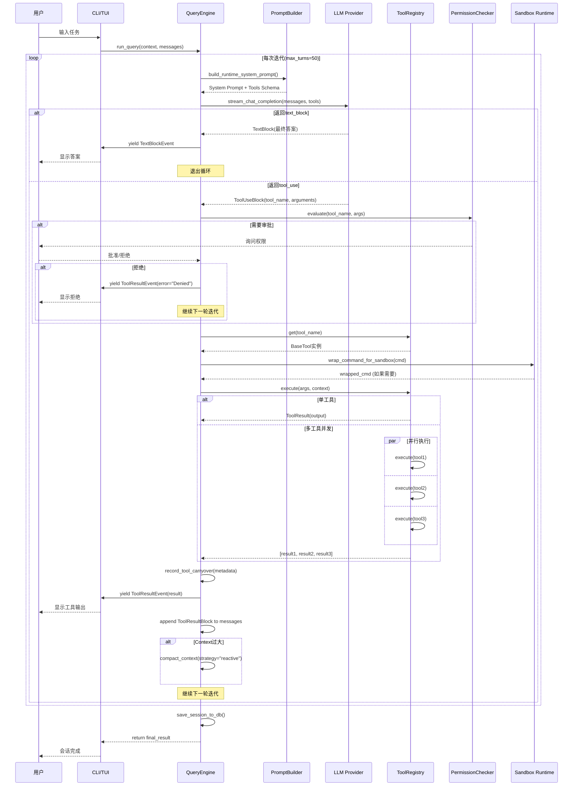
```mermaid
sequenceDiagram
    participant User as 用户
    participant CLI as CLI/TUI
    participant Engine as QueryEngine
    participant PromptBuilder as PromptBuilder
    participant LLM as LLM Provider
    participant ToolRegistry as ToolRegistry
    participant PermissionChecker as PermissionChecker
    participant Sandbox as Sandbox Runtime
    
    User->>CLI: 输入任务
    CLI->>Engine: run_query(context, messages)
    
    loop 每次迭代(max_turns=50)
        Engine->>PromptBuilder: build_runtime_system_prompt()
        PromptBuilder-->>Engine: System Prompt + Tools Schema
        
        Engine->>LLM: stream_chat_completion(messages, tools)
        
        alt 返回text_block
            LLM-->>Engine: TextBlock(最终答案)
            Engine->>CLI: yield TextBlockEvent
            CLI-->>User: 显示答案
            Note over Engine: 退出循环
            
        else 返回tool_use
            LLM-->>Engine: ToolUseBlock(tool_name, arguments)
            Engine->>PermissionChecker: evaluate(tool_name, args)
            
            alt 需要审批
                PermissionChecker-->>User: 询问权限
                User-->>Engine: 批准/拒绝
                
                alt 拒绝
                    Engine->>CLI: yield ToolResultEvent(error="Denied")
                    CLI-->>User: 显示拒绝
                    Note over Engine: 继续下一轮迭代
                end
            end
            
            Engine->>ToolRegistry: get(tool_name)
            ToolRegistry-->>Engine: BaseTool实例
            
            Engine->>Sandbox: wrap_command_for_sandbox(cmd)
            Sandbox-->>Engine: wrapped_cmd (如果需要)
            
            Engine->>ToolRegistry: execute(args, context)
            
            alt 单工具
                ToolRegistry-->>Engine: ToolResult(output)
                
            else 多工具并发
                par 并行执行
                    ToolRegistry->>ToolRegistry: execute(tool1)
                and
                    ToolRegistry->>ToolRegistry: execute(tool2)
                and
                    ToolRegistry->>ToolRegistry: execute(tool3)
                end
                ToolRegistry-->>Engine: [result1, result2, result3]
            end
            
            Engine->>Engine: record_tool_carryover(metadata)
            Engine->>CLI: yield ToolResultEvent(result)
            CLI-->>User: 显示工具输出
            
            Engine->>Engine: append ToolResultBlock to messages
            
            alt Context过大
                Engine->>Engine: compact_context(strategy="reactive")
            end
            
            Note over Engine: 继续下一轮迭代
        end
    end
    
    Engine->>Engine: save_session_to_db()
    Engine-->>CLI: return final_result
    CLI-->>User: 会话完成
```

**流程说明**:
1. **用户输入**: CLI/TUI接收用户任务
2. **启动循环**: `run_query()`开始ReAct循环
3. **Prompt构建**: 每次迭代前重新构建System Prompt(包含动态内容)
4. **LLM调用**: 流式调用LLM API,传入当前messages和tools schema
5. **响应解析**:
   - **TextBlock**: LLM直接给出答案,退出循环
   - **ToolUseBlock**: LLM请求调用工具,继续执行
6. **权限检查**: 9层权限检查链,可能需要用户审批
7. **工具执行**: 
   - 单工具: 顺序执行
   - 多工具: 并发执行(asyncio.gather)
8. **结果记录**: 将ToolResult追加到messages,供下一轮迭代使用
9. **上下文压缩**: 如果Context过大,触发自动压缩
10. **循环继续**: 回到步骤3,直到达到max_turns或LLM返回TextBlock

### 3.2 详细的执行步骤

#### 阶段1: 初始化与上下文准备

```python
# src/openharness/engine/query_engine.py:300-368
async def submit_message(self, prompt: str | ConversationMessage):
    # Step 1: 创建用户消息
    user_message = ConversationMessage.from_user_text(prompt)
    
    # Step 2: 记录用户目标到 tool_metadata（用于跨轮次状态携带）
    if user_message.text.strip():
        remember_user_goal(self._tool_metadata, user_message.text)
    
    # Step 3: 添加到对话历史
    self._messages.append(user_message)
    
    # Step 4: 构建 QueryContext（包含所有配置）
    context = QueryContext(
        api_client=self._api_client,
        tool_registry=self._tool_registry,
        permission_checker=self._permission_checker,
        cwd=self._cwd,
        model=self._model,
        system_prompt=self._system_prompt,  # ← 已拼接完成的 Prompt
        max_tokens=self._max_tokens,
        context_window_tokens=self._context_window_tokens,
        auto_compact_threshold_tokens=self._auto_compact_threshold_tokens,
        max_turns=self._max_turns,
        permission_prompt=self._permission_prompt,
        ask_user_prompt=self._ask_user_prompt,
        hook_executor=self._hook_executor,
        tool_metadata=self._tool_metadata,  # ← 可变的状态字典
    )
    
    # Step 5: 构建查询消息列表
    query_messages = list(self._messages)
    
    # Step 6: 如果是 Coordinator Mode，附加协调器上下文
    coordinator_context = self._build_coordinator_context_message()
    if coordinator_context is not None:
        query_messages.append(coordinator_context)
    
    # Step 7: 执行 run_query() 主循环
    async for event, usage in run_query(context, query_messages):
        if isinstance(event, AssistantTurnComplete):
            self._messages = list(query_messages)  # 更新对话历史
        if usage is not None:
            self._cost_tracker.add(usage)  # 更新成本跟踪
        yield event  # 流式返回事件
```

#### 阶段2: run_query() 主循环

```python
# src/openharness/engine/query.py:500-727
async def run_query(context: QueryContext, messages: list[ConversationMessage]):
    """执行完整的 ReAct 循环。
    
    核心逻辑：
    1. 每次迭代前检查是否需要自动压缩
    2. 调用 LLM API 获取响应
    3. 如果响应包含工具调用，执行工具
    4. 将工具结果反馈给 LLM
    5. 重复直到没有工具调用或达到 max_turns
    """
    
    last_compaction_result = (messages, False)
    reactive_compact_attempted = False
    compact_state = CompactionState()
    
    turn_count = 0
    while context.max_turns is None or turn_count < context.max_turns:
        turn_count += 1
        
        # ====================================================================
        # Step 1: 自动压缩检查（每个 turn 前）
        # ====================================================================
        async for event, usage in _stream_compaction(trigger="auto"):
            yield event, usage
        messages, was_compacted = last_compaction_result
        
        # ====================================================================
        # Step 2: 调用 LLM API（流式）
        # ====================================================================
        final_message: ConversationMessage | None = None
        usage = UsageSnapshot()
        
        try:
            async for event in context.api_client.stream_message(
                ApiMessageRequest(
                    model=context.model,
                    messages=messages,  # ← 包含对话历史
                    system_prompt=context.system_prompt,  # ← 已拼接的 Prompt
                    max_tokens=context.max_tokens,
                    tools=context.tool_registry.to_api_schema(),  # ← 工具定义
                )
            ):
                # 处理文本增量
                if isinstance(event, ApiTextDeltaEvent):
                    yield AssistantTextDelta(text=event.text), None
                    continue
                
                # 处理重试事件
                if isinstance(event, ApiRetryEvent):
                    yield StatusEvent(
                        message=f"Request failed; retrying in {event.delay_seconds:.1f}s..."
                    ), None
                    continue
                
                # 处理完成事件
                if isinstance(event, ApiMessageCompleteEvent):
                    final_message = event.message
                    usage = event.usage
        
        except Exception as exc:
            # ====================================================================
            # Step 2.5: 错误处理（包括 prompt too long 的应急压缩）
            # ====================================================================
            error_msg = str(exc)
            
            # 如果是 prompt too long 错误，触发应急压缩
            if not reactive_compact_attempted and _is_prompt_too_long_error(exc):
                reactive_compact_attempted = True
                yield StatusEvent(message="Context too long, compressing..."), None
                async for event, usage in _stream_compaction(trigger="reactive", force=True):
                    yield event, usage
                messages, was_compacted = last_compaction_result
                if was_compacted:
                    continue  # 压缩成功，重新尝试
            
            # 网络错误或 API 错误
            if "connect" in error_msg.lower() or "timeout" in error_msg.lower():
                yield ErrorEvent(message=f"Network error: {error_msg}"), None
            else:
                yield ErrorEvent(message=f"API error: {error_msg}"), None
            return
        
        # ====================================================================
        # Step 3: 解析 LLM 响应
        # ====================================================================
        if final_message is None:
            yield ErrorEvent(message="LLM returned empty response"), None
            return
        
        # 检查是否有工具调用
        tool_calls = [
            block for block in final_message.content 
            if isinstance(block, ToolUseBlock)
        ]
        
        if not tool_calls:
            # 没有工具调用，说明 LLM 给出了最终答案
            yield AssistantTurnComplete(message=final_message), usage
            return
        
        # ====================================================================
        # Step 4: 执行工具调用
        # ====================================================================
        tool_results = []
        for tool_call in tool_calls:
            result = await _execute_tool_call(
                context=context,
                tool_name=tool_call.name,
                tool_id=tool_call.id,
                tool_input=tool_call.input,
            )
            tool_results.append((tool_call.id, result))
            
            # Yield 工具结果事件
            yield ToolResultEvent(
                tool_name=tool_call.name,
                tool_id=tool_call.id,
                result=result,
            ), None
        
        # ====================================================================
        # Step 5: 将工具结果追加到 messages
        # ====================================================================
        for tool_id, result in tool_results:
            messages.append(
                ConversationMessage.from_tool_result(
                    tool_id=tool_id,
                    output=result.output,
                    is_error=result.is_error,
                )
            )
        
        # ====================================================================
        # Step 6: 记录 tool metadata（用于跨轮次状态携带）
        # ====================================================================
        for tool_call in tool_calls:
            record_tool_carryover(
                context.tool_metadata,
                tool_name=tool_call.name,
                tool_input=tool_call.input,
            )
```

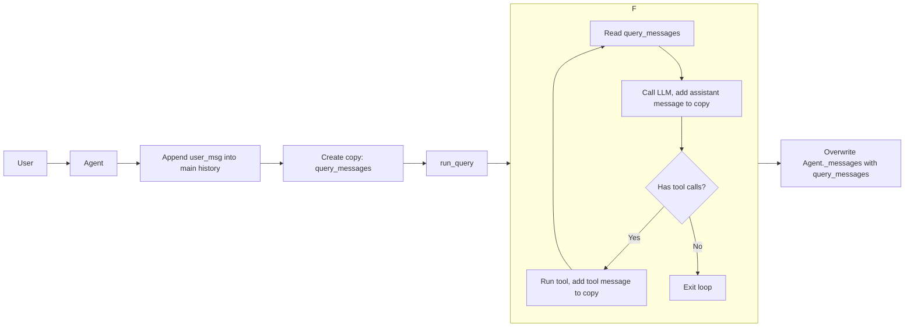
```mermaid
flowchart LR
   A[User] --> B[Agent]
   B --> C[Append user_msg into main history]
   C --> D[Create copy: query_messages]
   D --> E[run_query]
   E --> F[Loop Turn]

   subgraph F
      F1[Read query_messages]
      F2[Call LLM, add assistant message to copy]
      F3{Has tool calls?}
      F4[Run tool, add tool message to copy]

      F1 --> F2
      F2 --> F3
      F3 -- Yes --> F4
      F4 --> F1
      F3 -- No --> F5[Exit loop]
   end

   F --> G[Overwrite Agent._messages with query_messages]
```
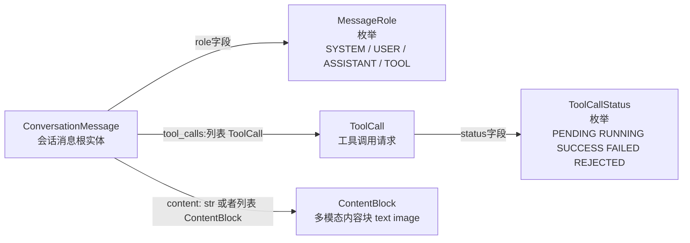
```mermaid
flowchart LR
   A[ConversationMessage<br/>会话消息根实体]
   B[MessageRole<br/>枚举<br/>SYSTEM / USER / ASSISTANT / TOOL]
   C[ToolCall<br/>工具调用请求]
   D[ToolCallStatus<br/>枚举<br/>PENDING RUNNING SUCCESS FAILED REJECTED]
   E[ContentBlock<br/>多模态内容块 text image]

   A -->|role字段| B
   A -->|tool_calls:列表 ToolCall| C
   C -->|status字段| D
   A -->|content: str 或者列表 ContentBlock| E
```
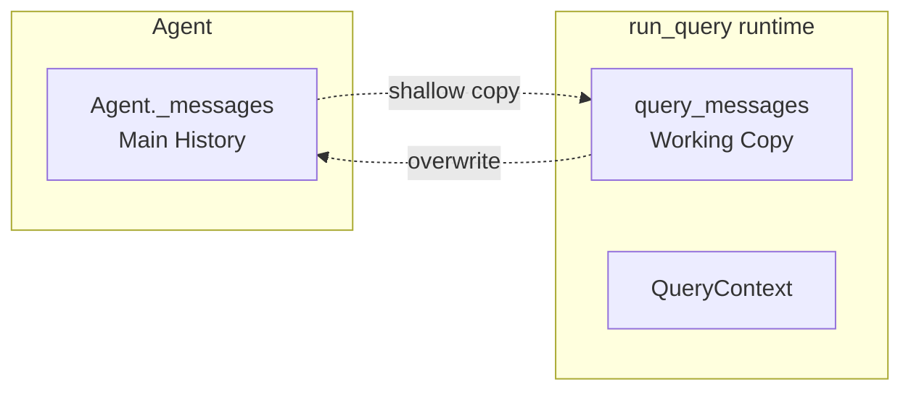
```mermaid
flowchart LR
   subgraph Agent
      M[Agent._messages<br/>Main History]
   end

   subgraph run_query runtime
      QM[query_messages<br/>Working Copy]
      QC[QueryContext]
   end

   M -.->|shallow copy| QM
   QM -.->|overwrite| M
```
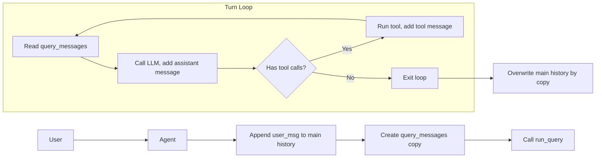
```mermaid
flowchart LR
   U[User] --> AG[Agent]
   AG --> S1[Append user_msg to main history]
   S1 --> S2[Create query_messages copy]
   S2 --> S3[Call run_query]

   subgraph Turn Loop
      L1[Read query_messages]
      L2[Call LLM, add assistant message]
      DEC{Has tool calls?}
      TOOL[Run tool, add tool message]
      EXIT[Exit loop]

      L1 --> L2
      L2 --> DEC
      DEC -- Yes --> TOOL
      TOOL --> L1
      DEC -- No --> EXIT
   end

   EXIT --> S4[Overwrite main history by copy]
```
# 一、ConversationMessage.tool_calls 为什么是数组 `list[ToolCall]`

## 核心原因：**支持并行多工具调用**

大模型一次回复，可以**同时请求一次性调用多个互不依赖的工具**，而不是一个接一个串行执行。

### 场景举例

用户提问：`查询北京今天天气，同时查询上海今天天气`
模型可以在单条 ASSISTANT 消息里，一次性返回 2 个工具调用请求：

```
ConversationMessage(
    role=ASSISTANT,
    tool_calls = [
        ToolCall(id="call_01", name="get_weather", arguments={"city":"北京"}),
        ToolCall(id="call_02", name="get_weather", arguments={"city":"上海"})
    ]
)
```

1. 数组 = 一批独立的工具任务集合
2. 框架可以**并发并行执行**这两个工具，不用等第一个工具跑完再跑第二个
3. 每个 `ToolCall` 拥有唯一 `id`，后续生成多条独立 `TOOL` 结果消息，一一对应绑定

### 衍生约束

1. 只有 `role=ASSISTANT` 的消息，`tool_calls` 数组才有值；USER / TOOL / SYSTEM 消息此字段 = `None`
2. 数组可以长度 = 1：单工具调用，是最常见场景
3. 数组长度 = 0 等价于 None：代表这条助手消息不需要调用工具，直接输出给用户

---

# 二、ToolCall 对象完整详解

## 完整数据结构

```
@dataclass
class ToolCall:
    id: str
    name: str
    arguments: dict
    status: ToolCallStatus
    result: str | None
    error: str | None
```

## 字段逐条解释

表格

| 字段 | 含义 | 说明 |  |
| --- | --- | --- | --- |
| `id: str` | 工具调用唯一标识 ID | **绑定主键**。后续 TOOL‑Message 的 `tool_result_id` 必须等于这个 id，实现请求 ↔ 结果配对。每条并行工具调用分配不同 id。 |  |
| `name: str` | 工具函数名称 | 要调用哪个工具，例如 `get_weather`、`search_database` |  |
| `arguments: dict` | 入参字典 | 传给工具的参数 `{"city":"北京"}` |  |
| `status: ToolCallStatus` | 运行状态枚举 | PENDING → RUNNING → SUCCESS / FAILED / REJECTED |  |
| `result: str | None` | **运行期临时结果** | ⚠️ **非持久化字段**。仅在本轮 `query_messages` 副本循环过程临时存放返回内容。会话落地存储后，权威结果保存在独立 `TOOL` 消息的 `content` 字段。 |
| `error: str | None` | 错误信息 | 工具执行抛出异常、报错时，存放错误文本；成功时为 None |

## ToolCallStatus 枚举状态流转

状态机单向流转：

1. `PENDING`：刚从 LLM 解析出来，还没开始执行
2. `RUNNING`：工具调度中、正在运行
3. 终态二选一
   - `SUCCESS`：执行成功，result 字段赋值
   - `FAILED`：代码执行报错，error 字段赋值
   - `REJECTED`：被权限、校验拦截，没有实际运行工具

## ToolCall 完整生命周期（非常关键）

1. LLM 返回工具调用 → 解析生成 `ToolCall` 对象，放入 ASSISTANT 消息 `tool_calls` 数组（PENDING）
2. run_query 循环调度，标记状态 RUNNING，并发执行所有工具
3. 工具执行完成 → 填充 result /error，状态变为 SUCCESS/FAILED
4. 框架**新建一条独立的 ConversationMessage (role=TOOL)**，把结果放到 content，`tool_result_id = ToolCall.id`
5. 助手消息、工具结果消息，两条消息一起追加进副本 `query_messages`
6. 本轮循环结束，副本覆盖写入主历史 `Agent._messages`

>
> ⚠️存入主历史后，**LLM 后续回合读取会话，不会读取 ToolCall.result**。它只会读取那条独立 TOOL‑role 消息的 content。

## 并行多工具调用之后消息列表形态

```
ASSISTANT Message
    tool_calls = [ToolCall(id=call1), ToolCall(id=call2)]

TOOL Message, tool_result_id=call1 → 北京天气结果
TOOL Message, tool_result_id=call2 → 上海天气结果
```
```python
query_messages = [
    # 第 1 条：用户原始提问
    ConversationMessage(
        role=MessageRole.USER,
        content="查一下北京、上海今天的气温",
        tool_calls=None,
        tool_result_id=None,
        metadata={}
    ),

    # 第 2 条：助手消息，携带2个并行工具调用
    ConversationMessage(
        role=MessageRole.ASSISTANT,
        content=None,
        tool_calls=[
            ToolCall(
                id="call-001",
                name="get_weather",
                arguments={"city": "北京"},
                status=ToolCallStatus.SUCCESS,
                result="北京：26℃，晴天",
                error=None
            ),
            ToolCall(
                id="call-002",
                name="get_weather",
                arguments={"city": "上海"},
                status=ToolCallStatus.SUCCESS,
                result="上海：30℃，多云",
                error=None
            )
        ],
        tool_result_id=None,
        metadata={}
    ),

    # 第 3 条：北京天气工具返回结果消息
    ConversationMessage(
        role=MessageRole.TOOL,
        content="北京：26℃，晴天",
        tool_calls=None,
        tool_result_id="call-001",
        metadata={}
    ),

    # 第 4 条：上海天气工具返回结果消息
    ConversationMessage(
        role=MessageRole.TOOL,
        content="上海：30℃，多云",
        tool_calls=None,
        tool_result_id="call-002",
        metadata={}
    )
]

```
# 为什么两边都要存，不能只存 TOOL 消息？

如果没有 `ToolCall.result` 临时字段：
工具执行完成后，调度代码想要拿到结果，就必须遍历整个 `query_messages` 消息列表，根据 `tool_result_id` 反向查找对应的 TOOL 消息，效率低，代码麻烦。

>
> 临时 result 字段 = 循环内快捷访问缓存。
> 
># 核心真相：`self._messages` **本身只是内存变量，不会自动持久化**

你贴出的 `QueryEngine.submit_message` 源码**没有任何落盘、IO、数据库保存逻辑**。

```
self._messages = list(query_messages)
```

这一行仅仅是**内存内赋值**。进程一旦退出、服务重启，`self._messages` 内存列表直接丢失。

持久化、冷启动加载，是**QueryEngine 上层会话存储层的职责，不在 submit_message 内部**。

## 一、分层架构（非常关键）

```
┌─────────────── 上层会话存储层（Storage） ───────────────┐
│ 数据库 / Redis / 文件，保存会话快照，session‑id做隔离      │
└───────────────────────────┬────────────────────────────┘
                            │ 加载/保存消息列表
┌─────────────── QueryEngine（运行时内存层） ─────────────┐
│  self._messages: List[ConversationMessage] （内存会话） │
│  submit_message / run_query 只读写内存列表                │
└────────────────────────────────────────────────────────┘
```

1. QueryEngine = **运行时容器**，只负责本轮对话执行；
2. 存储层 = 持久层，负责序列化保存会话，冷启动恢复 `_messages`。
---

## 4. 自动压缩机制

### 4.1 四层渐进式压缩策略

OpenHarness实现了**四层渐进式压缩**,从轻量到重量依次尝试:

| 层级 | 策略 | 压缩方案 | 保留条数 | 选择策略 | 触发条件 | 压缩率 | 延迟 | 是否需要LLM |
|------|------|----------|----------|----------|----------|--------|------|------------|
| **Layer 1** | Microcompact | 清除旧工具结果内容,替换为占位符`[Old tool result content cleared]` | 最近5条工具结果 | 有选择的压缩:保留最近的DEFAULT_KEEP_RECENT(5条)工具结果,清除更早的 | Context > 80%阈值 | 10-20% | <100ms | ❌ 否 |
| **Layer 2** | Context Collapse | 超长文本截断:保留前900字符 + `...[collapsed N chars]...` + 后500字符 | 最近6条消息不动 | 有选择的压缩:仅对preserve_recent之外的消息中的TextBlock进行折叠(>2400字符才折叠) | Layer 1后仍超限 | 15-25% | <50ms | ❌ 否 |
| **Layer 3** | Session Memory | 生成轻量级摘要:每行格式`role: 文本前160字符`,最多48行或4000字符 | 最近12条消息完整保留 | 有选择的压缩:将preserve_recent(12条)之外的所有旧消息合并为一个摘要消息 | Layer 2后仍超限 | 20-30% | <200ms | ❌ 否 |
| **Layer 4** | Full Compact | 调用LLM生成9部分结构化摘要(Primary Request/Key Concepts/Files/Errors等) | 最近6条消息完整保留 | 有选择的压缩:将preserve_recent(6条)之外的所有旧消息发送给LLM生成摘要 | Layer 3后仍超限或手动触发 | 70-90% | 5-10s | ✅ 是 |

**设计原则**:
- 🎯 **渐进式**: 从轻量到重量,优先尝试低成本策略
- ⚡ **早期返回**: 某层压缩成功后立即返回,不继续后续层
- 💰 **成本优化**: 前三层无需LLM调用,只有最后一层才调用API
- 📊 **可观测性**: 每层都有进度事件,UI可显示压缩阶段

### 4.1.1 各层压缩方案快速参考

#### Layer 1: Microcompact 示例

**压缩前** (ToolResult包含完整输出):
```python
User: [ToolResultBlock(
    tool_use_id="call_abc123",
    content="北京市统计局数据显示,2014-2024年常住人口变化如下:\n" +
            "2014年: 2151万人,增长率1.2%\n" +
            "2015年: 2170万人,增长率0.9%\n" +
            "...[省略298行数据]...\n" +
            "2024年: 2185万人,增长率0.1%",
    is_error=False
)]
```

**压缩后** (替换为占位符):
```python
User: [ToolResultBlock(
    tool_use_id="call_abc123",
    content="[Old tool result content cleared]",  # ← 只保留标记
    is_error=False
)]
```

**源码位置**: `src/openharness/services/compact/__init__.py:1139-1141`

---

#### Layer 2: Context Collapse 示例

**压缩前** (Assistant的长推理过程,2400字符):
```python
Assistant: TextBlock(text="""
    我需要分析北京和上海的人口数据。首先,让我搜索官方统计数据。
    
    根据我的知识,中国有两个主要的人口统计来源:
    1. 国家统计局年度公报 - 提供全国和主要城市的常住人口数据
    2. 各城市统计局发布的年度统计年鉴 - 更详细的分年龄段、性别等数据
    3. 人口普查数据 - 每10年一次,最准确但时效性差
    
    我应该先搜索最新的官方数据,然后读取相关的CSV文件进行验证。
    考虑到用户需要对比两个城市,我最好同时获取两地的数据。
    
    另外,我还需要注意数据的口径:
    - 常住人口 vs 户籍人口: 常住人口包括外来务工人员,更能反映实际规模
    - 市区人口 vs 全市人口: 有些城市辖区范围大,包含郊县
    - 年中数据 vs 年末数据: 不同来源可能使用不同的时间点
    
    让我先搜索一下是否有现成的对比分析报告...
    [省略中间1000字符的详细思考]
    好的,我找到了几个可靠的数据源,现在开始读取文件进行分析。
""")
```

**压缩后** (保留首尾,折叠中间):
```python
Assistant: TextBlock(text="""
    我需要分析北京和上海的人口数据。首先,让我搜索官方统计数据。
    
    根据我的知识,中国有两个主要的人口统计来源:
    1. 国家统计局年度公报 - 提供全国和主要城市的常住人口数据
    2. 各城市统计局发布的年度统计年鉴 - 更详细的分年龄段、性别等数据
    3. 人口普查数据 - 每10年一次,最准确但时效性差
    
    我应该先搜索最新的官方数据,然后读取相关的CSV文件进行验证。
    考虑到用户需要对比两个城市,我最好同时获取两地的数据。
    
    另外,我还需要注意数据的口径:
    - 常住人口 vs 户籍人口: 常住人口包括外来务工人员,更能反映实际规模
    - 市区人口 vs 全市人口: 有些城市辖区范围大,包含郊县
    - 年中数据 vs 年末数据: 不同来源可能使用不同的时间点
    
    让我先搜索一下是否有现成的对比分析报告...
    ...[collapsed 1000 chars]...
    好的,我找到了几个可靠的数据源,现在开始读取文件进行分析。
""")
```

**关键点**:
- ✅ 保留前900字符: 包含问题理解和初步计划
- ✅ 保留后500字符: 包含最终决策和行动方向
- ✅ 折叠中间1000字符: 详细的思考过程被压缩

**源码位置**: `src/openharness/services/compact/__init__.py:1674-1700`

---

#### Layer 3: Session Memory 示例

**压缩前** (14条旧消息,总计~3500字符):
```python
Messages [
    User: "帮我分析北京和上海过去10年的人口增长趋势,对比两个城市的发展差异",
    Assistant: [ToolUse: web_search(query="北京人口数据 2014-2024")],
    User: [ToolResult: "北京市2014-2024年常住人口从2151万增长到2185万,年均增长率约0.15%"],
    Assistant: "数据显示北京人口增长缓慢,年均增长率约0.15%,主要受户籍政策限制。",
    Assistant: [ToolUse: web_search(query="上海人口数据 2014-2024")],
    User: [ToolResult: "上海市2014-2024年常住人口从2425万增长到2487万,年均增长率约0.25%"],
    Assistant: "上海人口增长略快于北京,年均增长率约0.25%,外来务工人员贡献较大。",
    Assistant: [ToolUse: read_file(path="census_data/beijing.csv")],
    User: [ToolResult: "年份,人口(万),增长率\n2014,2151,1.2%\n2015,2170,0.9%\n...[300行CSV]"],
    Assistant: "CSV数据验证了搜索结果,北京人口在2018年后增长明显放缓。",
    Assistant: [ToolUse: read_file(path="census_data/shanghai.csv")],
    User: [ToolResult: "年份,人口(万),增长率\n2014,2425,1.5%\n2015,2445,0.8%\n...[300行CSV]"],
    Assistant: "上海数据也一致,但整体增长率高于北京,特别是2020年后加速。",
    Assistant: [ToolUse: bash(command="python analyze_trends.py")],
]
```

**压缩后** (生成轻量级摘要,~2200字符):
```python
User: TextBlock(text="""
[conversation summary]
Earlier conversation (14 messages condensed):

user: 帮我分析北京和上海过去10年的人口增长趋势,对比两个城市的发展差异
assistant: [ToolUse: web_search(query="北京人口数据 2014-2024")]
user: [ToolResult cleared] 北京市2014-2024年常住人口从2151万增长到2185万,年均增
assistant: 数据显示北京人口增长缓慢,年均增长率约0.15%,主要受户籍政策限制。
assistant: [ToolUse: web_search(query="上海人口数据 2014-2024")]
user: [ToolResult cleared] 上海市2014-2024年常住人口从2425万增长到2487万,年均增
assistant: 上海人口增长略快于北京,年均增长率约0.25%,外来务工人员贡献较大。
assistant: [ToolUse: read_file(path="census_data/beijing.csv")]
user: [ToolResult cleared]
assistant: CSV数据验证了搜索结果,北京人口在2018年后增长明显放缓。
assistant: [ToolUse: read_file(path="census_data/shanghai.csv")]
user: [ToolResult cleared]
assistant: 上海数据也一致,但整体增长率高于北京,特别是2020年后加速。
assistant: [ToolUse: bash(command="python analyze_trends.py")]
""")
```

**关键点**:
- ✅ 每条消息最多160字符,保留关键信息
- ✅ 最多48行或4000字符,确保摘要比原文短
- ✅ 工具结果被清除,只保留工具调用和文本响应
- ✅ 如果摘要不比原文短,则跳过此层,直接进入Layer 4

**源码位置**: `src/openharness/services/compact/__init__.py:1728-1780`

---

#### Layer 4: Full Compact 示例

**压缩前** (经过前三层压缩后仍有~55K tokens):
```python
Messages [
    User: [Session Memory Summary (~2200字符)],
    Assistant: [ToolUse: bash(command="python analyze_trends.py")],
    User: [ToolResult: "生成的图表显示:\n- 北京: 平稳增长,2018年后趋缓\n- 上海: 持续增长,2020年加速\n..."],
    Assistant: "基于数据分析,我发现:\n1. 北京人口增长率0.15%/年\n2. 上海人口增长率0.25%/年\n3. 差异原因:...",
    ... (最近6条消息完整保留)
]
```

**发送给LLM的Prompt**:
```python
system_prompt = """
Your task is to create a detailed summary of the conversation so far.

First, draft your analysis inside <analysis> tags. Walk through the conversation chronologically and extract:
- Every user request and intent (explicit and implicit)
- The approach taken and technical decisions made
- Specific code, files, and configurations discussed
- All errors encountered and how they were fixed
- Any user feedback or corrections

Then, produce a structured summary inside <summary> tags with these sections:
1. Primary Request and Intent
2. Key Technical Concepts
3. Files and Code Sections
4. Errors and Fixes
5. Problem Solving
6. All User Messages
7. Pending Tasks
8. Current Work
9. Optional Next Step
"""

messages_to_summarize = older_messages  # Session Memory Summary + 中间消息
```

**LLM响应** (结构化摘要):
```xml
<analysis>
用户请求分析北京和上海的人口增长趋势。助手通过web_search获取官方数据,
然后读取CSV文件进行深入分析,最后运行Python脚本生成趋势图表。
关键发现:北京增长率0.15%/年,上海0.25%/年。差异原因包括户籍政策、经济结构等。
</analysis>

<summary>
1. Primary Request and Intent:
   - 分析北京和上海2014-2024年人口增长趋势
   - 对比两个城市发展差异
   - 识别关键影响因素

2. Key Technical Concepts:
   - 常住人口统计方法
   - 年均增长率计算
   - 时间序列趋势分析
   - Python数据可视化(matplotlib)

3. Files and Code Sections:
   - census_data/beijing.csv: 北京10年人口数据(300行)
   - census_data/shanghai.csv: 上海10年人口数据(300行)
   - comparison_analysis.md: 对比分析报告
   - analyze_trends.py: 趋势分析脚本

4. Errors and Fixes:
   - 无重大错误

5. Problem Solving:
   - 通过web_search获取官方统计数据
   - 读取CSV文件验证数据准确性
   - 运行Python脚本生成可视化图表

6. All User Messages:
   - "帮我分析北京和上海过去10年的人口增长趋势,对比两个城市的发展差异"

7. Pending Tasks:
   - 撰写最终分析报告
   - 提出政策建议

8. Current Work:
   - 已完成数据收集和初步分析
   - 生成了趋势对比图表
   - 准备撰写综合报告

9. Optional Next Step:
   - 整合所有发现,撰写完整的京沪人口对比分析报告
   - 包含政策建议和未来预测
</summary>
```

**压缩后** (替换为LLM生成的摘要):
```python
Messages [
    Assistant: [Boundary Marker: "<conversation-compact boundary=\"2024-04-17T10:30:00Z\"/>"],
    User: TextBlock(text="""
    [conversation summary]
    Earlier conversation (20 messages condensed into LLM-generated summary):
    
    1. Primary Request and Intent:
       - 分析北京和上海2014-2024年人口增长趋势
       - 对比两个城市发展差异
       ...
    
    9. Optional Next Step:
       - 整合所有发现,撰写完整的京沪人口对比分析报告
       - 包含政策建议和未来预测
    """),
    ... (最近6条消息完整保留)
]
```

**关键点**:
- ✅ 9部分结构化摘要,便于LLM快速定位信息
- ✅ 移除`<analysis>`标签,只保留`<summary>`内容
- ✅ 支持重试机制: 2次流式重试 + 3次prompt过长截断重试
- ✅ 压缩率最高(70-90%),但成本也最高(需要LLM调用)

**源码位置**: `src/openharness/services/compact/__init__.py:1782-1850`

**命名说明**:
- 旧文档中使用的 `Auto-Compaction` / `Reactive Compaction` / `Emergency Compaction` / `Summary Compaction` 是**触发时机分类**
- 当前实现使用的是 `Microcompact` / `Context Collapse` / `Session Memory` / `Full Compact` 是**具体策略分类**
- 两者关系: Auto/Reactive/Emergency 是**何时触发**, Microcompact/Context Collapse/Session Memory/Full Compact 是**如何压缩**
- 实际执行时,无论哪种触发方式,都会按四层策略依次尝试

### 4.2 四层压缩实例演示: "分析北京和上海人口增长"

#### 场景设定

用户任务: `"帮我分析北京和上海过去10年的人口增长趋势,对比两个城市的发展差异"`

这个任务会触发以下流程:
1. 主Agent调用多个工具(`web_search`, `read_file`, `bash`)
2. 可能派生多个子Agent并行研究
3. 产生大量工具输出和中间结果
4. 对话历史快速增长到Token上限

#### Layer 1: Microcompact (微压缩) - 清除旧工具结果

**触发时机**: Token数达到 `context_window_tokens * 0.8` (例如 128K * 0.8 = 102.4K tokens)

**执行前状态** (假设已有15轮对话):
```
Messages列表:
├─ User: "帮我分析北京和上海过去10年的人口增长趋势..."
├─ Assistant: [ToolUse: web_search(query="北京人口数据 2014-2024")]
├─ User: [ToolResult: {output: "北京市统计局数据显示...[5000字符]"}]
├─ Assistant: [ToolUse: web_search(query="上海人口数据 2014-2024")]
├─ User: [ToolResult: {output: "上海市人口普查结果显示...[4800字符]"}]
├─ Assistant: [ToolUse: read_file(path="census_data/beijing.csv")]
├─ User: [ToolResult: {output: "年份,人口(万),增长率\n2014,2151,1.2%\n...[300行CSV数据]"}]
├─ ... (中间10轮类似交互)
└─ Recent 6条消息 (保留不被压缩)

总Token数: ~105K (超过阈值)
```

**Microcompact执行**:
```python
# src/openharness/services/compact/__init__.py:1139-1141
messages, tokens_freed = microcompact_messages(messages, keep_recent=DEFAULT_KEEP_RECENT)

# 清除旧的工具结果内容,替换为占位符
COMPACTABLE_TOOLS = frozenset({
    "read_file", "bash", "grep", "glob",
    "web_search", "web_fetch", "edit_file", "write_file"
})

# 对超过keep_recent的旧消息中的ToolResultBlock:
if tool_name in COMPACTABLE_TOOLS:
    result.content = "[Old tool result content cleared]"  # 只保留标记
```

**执行后状态**:
```
Messages列表:
├─ User: "帮我分析北京和上海过去10年的人口增长趋势..."
├─ Assistant: [ToolUse: web_search(query="北京人口数据 2014-2024")]
├─ User: [ToolResult: "[Old tool result content cleared]"]  ← 被清除
├─ Assistant: [ToolUse: web_search(query="上海人口数据 2014-2024")]
├─ User: [ToolResult: "[Old tool result content cleared]"]  ← 被清除
├─ Assistant: [ToolUse: read_file(path="census_data/beijing.csv")]
├─ User: [ToolResult: "[Old tool result content cleared]"]  ← 被清除
├─ ... (中间10轮,工具结果被清除)
└─ Recent 6条消息 (完整保留)

总Token数: ~85K (释放~20K tokens, 压缩率~19%)
```

**设计要点**:
- ✅ **低成本**: 无需调用LLM,纯字符串操作
- ✅ **快速**: <100ms完成
- ✅ **可逆**: 原始数据仍在内存,只是不在Prompt中
- ⚠️ **局限性**: LLM无法再看到被清除的工具输出细节

---

#### Layer 2: Context Collapse (上下文折叠) - 截断超长文本

**触发时机**: Microcompact后仍超限,或API返回"prompt too long"错误

**执行逻辑**:
```python
# src/openharness/services/compact/__init__.py:1674-1700
context_collapsed = try_context_collapse(messages, preserve_recent=preserve_recent)

# 对TextBlock进行确定性截断:
def collapse_text(text: str) -> str:
    if len(text) > 2400:  # 超过2400字符
        return (
            text[:900] +                    # 保留前900字符
            f"...[collapsed {len(text)-1400} chars]..." +  # 折叠标记
            text[-500:]                     # 保留后500字符
        )
    return text  # 短文本不变
```

**执行前状态** (假设某条Assistant消息包含长推理):
```
Assistant Message (第5轮):
content: [
  TextBlock(text="""
    我需要分析北京和上海的人口数据。首先,让我搜索官方统计数据...
    [省略中间1500字符的详细思考过程]
    根据搜索结果,我发现了几个关键数据源:
    1. 北京市统计局年度公报
    2. 上海市人口普查办公室报告
    3. 国家统计局数据库
    
    接下来我应该读取这些CSV文件并计算增长率...
    [省略后续800字符的执行计划]
  """)
]
```

**执行后状态**:
```
Assistant Message (第5轮):
content: [
  TextBlock(text="""
    我需要分析北京和上海的人口数据。首先,让我搜索官方统计数据...
    [前900字符保留]
    ...[collapsed 1500 chars]...
    [后500字符保留]接下来我应该读取这些CSV文件并计算增长率...
  """)
]

总Token数: ~72K (再释放~13K tokens, 累计压缩率~31%)
```

**设计要点**:
- ✅ **保留关键上下文**: 首尾各保留重要信息
- ✅ **确定性**: 不依赖LLM,结果可预测
- ✅ **无损**: 原始数据未被删除,只是Prompt中截断
- ⚠️ **适用场景**: 主要针对冗长的推理过程和工具输出

---

#### Layer 3: Session Memory (会话记忆摘要) - 轻量级结构化摘要

**触发时机**: Context Collapse后仍超限

**执行逻辑**:
```python
# src/openharness/services/compact/__init__.py:1728-1780
session_memory = try_session_memory_compaction(
    messages,
    preserve_recent=max(preserve_recent, SESSION_MEMORY_KEEP_RECENT),  # 至少保留12条
    trigger=trigger,
    metadata=carryover_metadata,
)

# 生成简洁摘要 (每行格式: "role: 文本前160字符")
def summarize_session(older_messages: list[ConversationMessage]) -> str:
    lines = []
    for msg in older_messages:
        text = msg.text.strip()[:160]  # 每条消息最多160字符
        lines.append(f"{msg.role}: {text}")
    
    # 限制摘要规模
    summary = "\n".join(lines)
    if len(summary) > 4000 or len(lines) > 48:  # 最多48行或4000字符
        return None  # 摘要不比原文短,放弃此策略
    
    return summary
```

**执行前状态** (假设有20条旧消息):
```
Older Messages (前14条,需要压缩):
├─ User: "帮我分析北京和上海过去10年的人口增长趋势..."
├─ Assistant: [ToolUse: web_search(query="北京人口数据")]
├─ User: [ToolResult: "北京市2014-2024年常住人口从2151万增长到2185万..."]
├─ Assistant: "数据显示北京人口增长缓慢,年均增长率约0.15%..."
├─ Assistant: [ToolUse: web_search(query="上海人口数据")]
├─ User: [ToolResult: "上海市2014-2024年常住人口从2425万增长到2487万..."]
├─ Assistant: "上海人口增长略快于北京,年均增长率约0.25%..."
├─ ... (共14条消息,总计~3500字符)
```

**执行后状态**:
```
Session Memory Summary (替换前14条消息):
User: [conversation summary]
Earlier conversation (14 messages condensed):
user: 帮我分析北京和上海过去10年的人口增长趋势,对比两个城市的发展差异
assistant: [ToolUse: web_search(query="北京人口数据 2014-2024")]
user: [ToolResult cleared] 北京市2014-2024年常住人口从2151万增长到2185万,年均增
assistant: 数据显示北京人口增长缓慢,年均增长率约0.15%,主要受户籍政策限制。
assistant: [ToolUse: web_search(query="上海人口数据 2014-2024")]
user: [ToolResult cleared] 上海市2014-2024年常住人口从2425万增长到2487万,年均增
assistant: 上海人口增长略快于北京,年均增长率约0.25%,外来务工人员贡献较大。
...
(共14行,每行≤160字符,总计~2200字符)

Recent Messages (后6条,完整保留):
├─ Assistant: [ToolUse: read_file(path="comparison_analysis.md")]
├─ User: [ToolResult: "# 京沪人口对比分析\n\n## 核心发现\n..."]
└─ ... (4条最新消息)

总Token数: ~55K (再释放~17K tokens, 累计压缩率~48%)
```

**设计要点**:
- ✅ **结构化**: 保留对话脉络,易于LLM理解上下文
- ✅ **轻量**: 无需LLM调用,纯文本处理
- ✅ **平衡**: 在压缩率和信息保留间取得平衡
- ⚠️ **局限性**: 如果摘要不比原文短,则跳过此层,直接进入Layer 4

---

#### Layer 4: Full Compact (完整摘要) - LLM生成9部分结构化摘要

**触发时机**: 前三层压缩后仍超限,或用户手动触发`/compact`

**执行逻辑**:
```python
# src/openharness/services/compact/__init__.py:1782-1850
result = await compact_conversation(
    messages,
    api_client=api_client,
    model=model,
    system_prompt=system_prompt,
    preserve_recent=preserve_recent,  # 默认6条
    suppress_follow_up=True,  # 禁止LLM追问
    trigger=trigger,
    progress_callback=progress_callback,
    hook_executor=hook_executor,
    carryover_metadata=carryover_metadata,
)

# LLM Prompt (BASE_COMPACT_PROMPT):
"""
Your task is to create a detailed summary of the conversation so far.

First, draft your analysis inside <analysis> tags. Walk through the conversation chronologically and extract:
- Every user request and intent (explicit and implicit)
- The approach taken and technical decisions made
- Specific code, files, and configurations discussed (with paths and line numbers where available)
- All errors encountered and how they were fixed
- Any user feedback or corrections

Then, produce a structured summary inside <summary> tags with these sections:

1. Primary Request and Intent
2. Key Technical Concepts
3. Files and Code Sections
4. Errors and Fixes
5. Problem Solving
6. All User Messages
7. Pending Tasks
8. Current Work
9. Optional Next Step
"""
```

**执行前状态** (经过前三层压缩后仍有~55K tokens):
```
Messages列表:
├─ [Session Memory Summary] (~2200字符,代表前14条消息)
├─ Assistant: [ToolUse: read_file(path="comparison_analysis.md")]
├─ User: [ToolResult: "# 京沪人口对比分析\n\n## 核心发现\n1. 北京增长缓慢..."]
├─ Assistant: "基于数据分析,我发现:\n1. 北京人口增长率0.15%/年\n2. 上海人口增长率0.25%/年\n3. 差异原因:..."
├─ Assistant: [ToolUse: bash(command="python analyze_trends.py")]
├─ User: [ToolResult: "生成的图表显示:\n- 北京: 平稳增长,2018年后趋缓\n- 上海: 持续增长,2020年加速\n..."]
└─ Recent 6条消息 (完整保留)

总Token数: ~55K
```

**LLM调用** (发送旧消息给LLM生成摘要):
```python
# 发送给LLM的消息:
messages_to_summarize = older_messages  # Session Memory Summary + 中间消息
system_prompt = BASE_COMPACT_PROMPT     # 9部分结构化摘要指令

# LLM响应 (示例):
llm_response = """
<analysis>
用户请求分析北京和上海的人口增长趋势。助手通过web_search获取官方数据,
然后读取comparison_analysis.md进行深入分析,最后运行Python脚本生成趋势图表。
关键发现:北京增长率0.15%/年,上海0.25%/年。差异原因包括户籍政策、经济结构等。
</analysis>

<summary>
1. Primary Request and Intent:
   - 分析北京和上海2014-2024年人口增长趋势
   - 对比两个城市发展差异
   - 识别关键影响因素

2. Key Technical Concepts:
   - 常住人口统计方法
   - 年均增长率计算
   - 时间序列趋势分析
   - Python数据可视化(matplotlib)

3. Files and Code Sections:
   - census_data/beijing.csv: 北京10年人口数据(300行)
   - census_data/shanghai.csv: 上海10年人口数据(300行)
   - comparison_analysis.md: 对比分析报告
   - analyze_trends.py: 趋势分析脚本

4. Errors and Fixes:
   - 无重大错误

5. Problem Solving:
   - 通过web_search获取官方统计数据
   - 读取CSV文件验证数据准确性
   - 运行Python脚本生成可视化图表

6. All User Messages:
   - "帮我分析北京和上海过去10年的人口增长趋势,对比两个城市的发展差异"

7. Pending Tasks:
   - 撰写最终分析报告
   - 提出政策建议

8. Current Work:
   - 已完成数据收集和初步分析
   - 生成了趋势对比图表
   - 准备撰写综合报告

9. Optional Next Step:
   - 整合所有发现,撰写完整的京沪人口对比分析报告
   - 包含政策建议和未来预测
</summary>
"""
```

**执行后状态**:
```
Messages列表:
├─ Assistant: [Boundary Marker: "<conversation-compact boundary=\"2024-04-17T10:30:00Z\"/>"]
├─ User: [conversation summary]
    Earlier conversation (20 messages condensed into LLM-generated summary):
    
    1. Primary Request and Intent:
       - 分析北京和上海2014-2024年人口增长趋势
       - 对比两个城市发展差异
       ...
    
    9. Optional Next Step:
       - 整合所有发现,撰写完整的京沪人口对比分析报告
       - 包含政策建议和未来预测
├─ Assistant: [ToolUse: bash(command="python analyze_trends.py")]  ← Recent 6条之一
├─ User: [ToolResult: "生成的图表显示:\n- 北京: 平稳增长..."]
└─ ... (其余5条最新消息)

总Token数: ~12K (释放~43K tokens, 累计压缩率~89%)
```

**设计要点**:
- ✅ **最彻底**: 压缩率最高,可达80-90%
- ✅ **智能**: LLM理解语义,保留关键信息
- ✅ **结构化**: 9部分摘要便于LLM快速定位信息
- ⚠️ **高成本**: 需要额外LLM调用 (~2K input tokens + ~1K output tokens)
- ⚠️ **高延迟**: LLM调用耗时~5-10秒
- 🔄 **重试机制**: 支持2次流式重试 + 3次prompt过长截断重试

---

### 4.3 四层压缩决策流程图

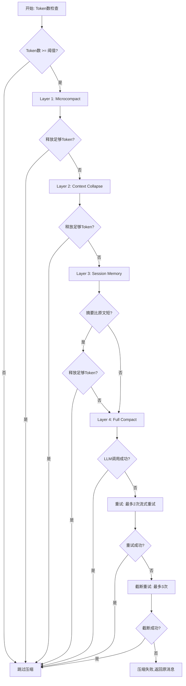
```mermaid
graph TD
    A[开始: Token数检查] --> B{Token数 >= 阈值?}
    B -->|否| Z[跳过压缩]
    B -->|是| C[Layer 1: Microcompact]
    
    C --> D{释放足够Token?}
    D -->|是| Z
    D -->|否| E[Layer 2: Context Collapse]
    
    E --> F{释放足够Token?}
    F -->|是| Z
    F -->|否| G[Layer 3: Session Memory]
    
    G --> H{摘要比原文短?}
    H -->|是| I{释放足够Token?}
    I -->|是| Z
    I -->|否| J[Layer 4: Full Compact]
    H -->|否| J
    
    J --> K{LLM调用成功?}
    K -->|是| Z
    K -->|否| L[重试: 最多2次流式重试]
    L --> M{重试成功?}
    M -->|是| Z
    M -->|否| N[截断重试: 最多3次]
    N --> O{截断成功?}
    O -->|是| Z
    O -->|否| P[压缩失败,返回原消息]
```

**源码位置**: `src/openharness/services/compact/__init__.py:1561-1850`

### 4.4 Auto-Compaction代码实现

1. **压缩生成出来的消息，类型仍然是 `ConversationMessage`**，和普通对话消息完全是同一个类，不是新的特殊对象类型。
2. **高层级 Auto‑Compact 全量摘要压缩：会完全替换掉被压缩掉的一批历史记录（旧消息从列表删除，放入一条新的摘要消息）**。
3. **轻量级微压缩（micro‑compact /snip 工具结果）：原地修改单条 TOOL 消息的 content 字段，不会新增、不会删除整条消息对象**。
4. 你源码里调用：

```
self._messages = sanitize_conversation_messages(self._messages)
```

sanitize 返回**全新的消息列表**，返回的列表赋值回去之后，旧列表直接被替换。

## 一、两种压缩模式详细对比（对应你 QueryEngine 的 `auto_compact_threshold_tokens`）

### 模式 1：轻量微压缩（Micro‑Compact / Snip，低 token 占用触发）

>
> 不会删除整条消息；**原地修改消息内容**

- 对象类型：原有 `ConversationMessage(role=TOOL)` 对象不变
- 行为：只修改 `.content` 字段，把超长工具返回结果替换成简短占位文本 `[Previous: ran tool xxx]`
- 是否替换旧记录：❌**不会删除这条消息**，列表长度不变，对象还在，只是内容缩短了
- 示例：

```
#压缩前
ConversationMessage(role=TOOL, content="一万字文件读取结果...", tool_result_id="call‑001")
#压缩后（同一个对象，content被改写）
ConversationMessage(role=TOOL, content="[Previous: ran tool read_file]", tool_result_id="call‑001")
```

### 模式 2：自动全量摘要压缩 Auto‑Compact（超过 `auto_compact_threshold_tokens` 阈值触发，重量级）

>
> **彻底删除一批早期历史消息，用一条全新生成的摘要消息取而代之**

- 压缩产物类型：全新创建一条 `ConversationMessage`（一般 role = `system` / `user`）
- 是否完全替换被压缩记录：✅ **是的，被选中压缩的那一堆旧消息会从列表里全部移除**
- 保留策略：最近 N 轮完整对话原样保留；更早历史全部删除，换成一条摘要消息。

#### 举例子

压缩前消息列表（12 条）

```
[msg1,msg2,msg3,msg4,msg5,msg6,msg7,msg8,msg9,msg10,USER11,ASSIST12]
```

执行 Auto‑Compact，压缩前 8 条历史；保留最近 4 条完整对话
压缩后新列表：

```
[ new_summary_msg, msg9,msg10,USER11,ASSIST12 ]
```

>
> msg1‑msg8 **彻底消失，被 summary 一条消息完全替换**。

# 二、sanitize_conversation_messages 函数行为（你源码中的调用点）

```
self._messages = sanitize_conversation_messages(self._messages)
```

1. **入参：旧的 self._messages 列表**
2. 内部执行：
   - 消息格式清洗、去脏消息
   - Token 估算
   - 判断是否达到 auto‑compact 阈值；达到就执行重量级摘要压缩
   - 返回 ** brand‑new 全新 list [ConversationMessage]**
3. 赋值动作：`self._messages = 返回的新列表`
   👉 **内存中原旧的消息列表被完全替换掉**

>
> 关键点：sanitize 是**在写入主历史 self._messages 之前执行**；也就是**用户消息 append 之前，先做一轮上下文清洗压缩**。

# 三、内存 vs 持久存储 非常关键的分离陷阱

1. **QueryEngine 内存 self._messages：压缩之后列表立刻更新，旧消息在内存消失**
2. **应用层持久化（数据库会话）：压缩前完整原始历史是否保留，完全取决于上层存储策略**
   - 方案 A（推荐）：压缩前上层先把**完整原始会话快照保存 transcript 归档**，数据库主会话保存压缩之后精简列表。内存里看不到完整历史，但是永久归档里面有全部原始对话记录。
   - 方案 B：直接保存压缩后的列表；旧历史一旦压缩，原始内容永久丢失无法找回。

# 四、压缩副本 query_messages 的数据流时序

```
# 1.主历史清洗压缩
self._messages = sanitize_conversation_messages(self._messages)
# 2.添加新用户消息
self._messages.append(user_message)
# 3.拷贝副本（此时副本里面已经携带【压缩之后】的精简历史）
query_messages = list(self._messages)
# 后续run_query所有工具循环，基于已经压缩完成的上下文运行
```

>
> ⚠️压缩只会发生在 submit_message 最开头 sanitize 这一步；run‑query 工具循环中途**不会再触发自动压缩**，直到下一轮 submit_message。 
## 一、方案总览（三级渐进式，从轻到重逐级触发）

遵循 **先局部裁剪 → 再工具结果摘要 → 最后全量历史摘要**，逐级升压。

>
> 触发入口：`sanitize_conversation_messages()`，每一轮 `submit_message` 最开始执行一次。
> 所有压缩产物统一类型：`ConversationMessage`。

表格

| 压缩等级 | 名称 | 触发条件 | 处理对象 | 行为特点 | 历史原始消息 |
| --- | --- | --- | --- | --- | --- |
| L0‑无压缩 | 原样保留 | 总 Token < 预警阈值 | 全部消息 | 列表无改动 | 完整保留 |
| L1‑微裁剪 Snip（轻量） | 超长工具结果截断 | 单条 TOOL 消息 content 超长 | TOOL 消息 | 原地修改 content，不删除消息条目 | 消息条目保留，超长内容被缩短 |
| L2‑回合摘要 Compact（中量级‑渐进） | 上下文 Token 达到预警水位 | 早期 N 轮对话回合 | 批量历史回合 | 删除一批旧回合，生成 1 条摘要消息占位 | 被选中回合从列表移除，替换成摘要 |
| L3‑硬核全量压缩 Full‑Compact | Token 逼近窗口上限，紧急保护 | 绝大部分历史 | 仅保留最近少量回合 | 大幅删减历史，仅尾部最新对话完整保留 | 大量历史被摘要合并 |

>
> 渐进核心思想：优先牺牲**最早期历史**，永远优先保留最新几轮完整对话上下文。
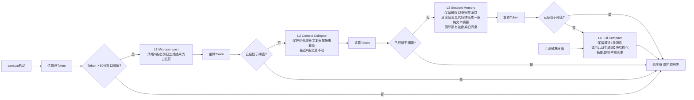
```mermaid
flowchart LR
   A[sanitize启动] --> B[估算总Token]
   B --> C{Token > 80%窗口阈值?}
   C -- 否 --> Z[无压缩 返回原列表]
   C -- 是 --> D[L1 Microcompact<br>清理5条之前旧工具结果为占位符]
   D --> E[重算Token]
   E --> F{已经低于阈值?}
   F --是--> Z
   F --否--> G[L2 Context Collapse<br>保护区外超长文本头尾折叠截断<br>最近6条消息不动]
   G --> H[重算Token]
   H --> I{已经低于阈值?}
   I --是--> Z
   I --否--> J[L3 Session Memory<br>保留最近12条完整消息<br>其余旧消息代码拼接成一条纯文本摘要<br>删除所有被合并旧消息]
   J --> K[重算Token]
   K --> L{已经低于阈值?}
%% 拆分两条进入L4的分支：未达标 / 手动触发
   L --否--> M[L4 Full Compact<br>保留最近6条消息<br>调用LLM生成9模块结构化摘要,替换早期历史]
   N[手动触发压缩] --> M
   M --> Z
   L --是--> Z
```
---

## 5. 子Agent异步执行机制

### 5.0 普通模式 vs Coordinator 模式（运行时行为）

spawn 底层相同（`agent` → `SubprocessBackend` → 子进程 Worker，`agent` **立即** 返回 `task_id`）。差异在 **Prompt 人设** 与 **Worker 结果如何回到主会话**：

| 行为维度 | 普通模式 | Coordinator 模式 |
|----------|----------|-------------------|
| System | `build_system_prompt` + Skills + **Delegation** | `get_coordinator_system_prompt()`（无 Skills/Delegation） |
| Memory | ✅ 每轮 `build_runtime_system_prompt` 注入 | ✅ 同样注入 |
| spawn 后主会话 | 本轮可结束；**不**自动收 Worker 结果 | `handle_line` 结束后 **`drain_coordinator_async_agents`** |
| Worker 完成进对话 | `task_output` / `/agents` / 用户下一条 | 自动 `<task-notification>` → `submit_message` 再起一轮 |
| 为何普通模式不等 | 引擎中立 + CLI 不阻塞 + Job 模型；见 §5.1 | drain 在应用层（`ui/coordinator_drain.py`） |

**调用方**：`drain_coordinator_async_agents` 由 `ui/app.py`（print/REPL）、`ui/textual_app.py`、`ui/backend_host.py` 在 Coordinator 模式下调用；**实现**在 `ui/coordinator_drain.py`。

---

> **与源码对齐（必读）**  
> - **`BackgroundTaskManager`**（`tasks/manager.py`）在子进程退出时 **`await process.wait()`**，更新 `TaskRecord`、将 stdout 写入任务日志；**默认不会**因此调用 `QueryEngine.submit_message`，也**不会**向 `ReactBackendHost` 的 stdin 注入 XML。  
> - **`ReactBackendHost`**（`ui/backend_host.py`）仅在**当前一次** `handle_line` → `run_query` 的工具/轮次事件中下发 `tasks_snapshot`；**不会因**后台任务稍后变为 `completed` 而再发起一轮主会话。  
> - **复杂任务仍可完成**：子进程 Worker 内可跑完整 ReAct；主会话在同一进程未退出时始终是**同一 `QueryEngine`**，`_messages` 连续；汇总依赖 **下一轮用户输入**、**`task_output` / `/agents`** 拉取，或 **§5.4 应用层编排队列** 主动 `submit_message`。下文区分「运行时事实」与「Coordinator 提示词语义 / 可选编排」。

### 5.1 核心设计原则（运行时事实 + 协议层）

**问题**: 主 Agent 调用 `agent` 工具派生子进程 Worker 时，Worker 可能长时间运行。主会话如何不阻塞？结果如何回到主会话？

**运行时已落实**：

| 机制 | 说明 |
|------|------|
| 非阻塞派生 | `agent` 工具经 `SubprocessBackend.spawn` → `create_agent_task`，工具结果立即返回 `Spawned agent … (task_id=…)`。 |
| 完成感知 | `BackgroundTaskManager._watch_process` 更新任务终态；输出见 `read_task_output` / 任务日志文件。 |
| UI 列表 | `tool_completed` / `assistant_complete` 时会 `tasks_snapshot(list_tasks())`，仅反映列表，**不等于**自动再起主循环。 |
| 同一会话 | 后端进程未退出时 **同一 `QueryEngine` 实例**，`submit_message` 往 `_messages` **追加**；不是每次无状态新建 Agent（进程重启时见 §5.6）。 |

**协议 / 提示词层（非内核自动注入）**：

- Coordinator 类 system prompt 可约定 Worker 结果以包含 `<task-notification>` 的 **user 文本**出现；**LLM 在能看到该段内容时**可按协议继续派生或汇总。  
- **谁**写入该段：须通过 **显式** `submit_message(...)`——例如 **§5.4 队列编排**、**用户下一条消息**，或模型在**后续轮次**配合 **`task_output`**。**引擎不会在 TaskManager 内替你拼接并调用。**

**结论**：缺少「worker exit → 无条件自动 `submit_message`」**并不**等价于「无法做复杂任务」——复杂拆解可在 **Worker 子进程内**完成；主侧汇总依赖 **多轮交互或应用层 Supervisor**（§5.8）。

### 5.1.1 再次进入主循环 / 「再次调用大模型」是否会自动触发 `task_output`？

本节对应常见问题：**下一轮会话或再一次 `run_query` 时，内核会不会自动去拉子 Agent 结果并更新状态？**

**结论（与 `query_engine.py`、`query.py` 行为一致）**

| 说法 | 是否正确 |
|------|----------|
| 新一轮 `submit_message` → `run_query` 开始时，引擎会**自动**调用 `task_output` 读取后台任务 | **否** |
| 每次调用 LLM **之前**，`run_query` 会先轮询 `BackgroundTaskManager`，把已完成任务的输出合并进待发送的 `messages` | **否** |
| `task_output`、`task_list`、`task_get` 与内置工具一样挂在 **ToolRegistry**；只有在本轮 ReAct 里模型发出 **tool_use** 且选中对应工具名时才会执行 | **是** |
| **同一用户输入**下，若 `max_turns` 仍有余量，模型可能在多步推理里先调用 `agent`，再在后续步骤调用 `task_output`（前提是 Worker 已有可读日志）；这是 **模型的工具规划**，不是引擎钩子 | **是** |
| Coordinator 模式下，`submit_message` 附加的 `_build_coordinator_context_message()` 来自 **`get_coordinator_user_context()`**，内容为 **`workerToolsContext`**（Worker 侧可用工具说明），**不是**子任务完成摘要或自动注入的任务输出 | **是** |

**关于 `_messages` 与 `tool_metadata`**

- **`QueryEngine._messages`**：`task_output` **若被执行**，其结果与其它工具相同，沿「assistant tool_use → user tool_result」进入本会话的对话轨迹；在 **`AssistantTurnComplete`** 时从本轮工作副本写回 `_messages`。这与「系统在调用模型前偷偷 pull 一遍任务输出」无关。
- **`tool_metadata`**：`query.py` 中 `_record_tool_carryover` 对 **`agent` / `send_message`** 等会写入 **`async_agent_state`** 等摘要（`_remember_async_agent_activity`）。**并非**「每次再次调用大模型」都会刷新；`task_output` 当前实现仅为读日志（`task_output_tool.py`），**不**等价于自动填满 `async_agent_state`。

**一句话**：子任务结果进入主会话上下文的路径是 **（可选）模型主动调 `task_output` / 用户或应用层 `submit_message` 携带通知文本 / 应用层编排**——**不是**「再次调用 LLM」这一动作本身触发的内核副作用。

---

### 5.1.2 设计决策：为什么子Agent返回必须走 submit_message 链路？

本节回答一个常见的架构疑问：**为什么不直接把 notification 拼装到 `_messages` 中，而是要重新调用 `submit_message()` 触发完整的 Agent Loop？**

#### 核心问题

开发者可能会想:

```python
# ❌ 看似更简单的方式：直接修改 messages
async def _watch_process(self, task_id):
    await process.wait()
    output = read_task_output(task_id)
    notification_xml = format_task_notification(...)
    
    # 直接追加到 Engine 的 _messages
    notification_msg = ConversationMessage.from_user_text(notification_xml)
    self.query_engine._messages.append(notification_msg)  # ← 直接操作内部状态
    
    # 但问题是：怎么让 LLM 看到这个消息？
    # run_query() 已经结束了，LLM 不会再被自动调用！
```

**这个方案有三大问题**:

1. **时机不对**: `run_query()` 主循环已经结束，LLM 不会自动看到这个新消息
2. **状态不一致**: 外部代码直接操作 Engine 内部状态 (`_messages`)，违反封装原则
3. **缺少完整生命周期**: 没有触发 Hook、权限检查、上下文压缩等机制

---

#### 正确的设计：通过 submit_message 注入

```python
# ✅ 当前实现：应用层编排
async def drain_coordinator_async_agents(bundle):
    while True:
        pending = _pending_async_agent_entries(tool_metadata)
        if not pending:
            return
        
        completed = await _wait_for_completed_async_agent_entries()
        notification_xml = _format_completed_task_notifications(completed)
        
        # ⚡ 关键：调用 submit_message() 触发新一轮 Agent Loop
        await bundle.engine.submit_message(notification_xml)
```

**优势对比**:

| 维度 | 直接拼装 messages | 走 submit_message |
|------|------------------|-------------------|
| **触发 LLM** | ❌ 不会自动触发 | ✅ 完整 ReAct 循环 |
| **LLM 决策** | ❌ 无法决定下一步 | ✅ 自由选择行动 |
| **Hook 系统** | ❌ 不触发 | ✅ Pre/Post Hooks 生效 |
| **权限检查** | ❌ 绕过检查 | ✅ 9 层权限链 |
| **上下文压缩** | ❌ 不触发 | ✅ 自动压缩 |
| **成本跟踪** | ❌ 不记录 | ✅ Token 统计 |
| **职责分离** | ❌ 耦合严重 | ✅ 分层清晰 |
| **可扩展性** | ❌ 难以扩展 | ✅ 插件化设计 |

---

#### 为什么要重新走完整的 Agent Loop?

##### 原因 1: LLM 需要"思考"下一步行动

子 Agent 返回结果后，**不应该自动继续**，而是让 LLM 决定：

```xml
<!-- Worker 返回的 notification -->
<task-notification>
  <task-id>agent-research-beijing</task-id>
  <status>completed</status>
  <result>北京人口从2151万增长到2185万...</result>
</task-notification>
```

**LLM 看到后有多种选择**:

| 选项 | LLM 决策 | 后续动作 |
|------|---------|----------|
| **A** | "还需要上海数据" | 再次调用 `agent(description="研究上海", ...)` |
| **B** | "继续追问北京细节" | 调用 `send_message(to="agent-research-beijing", message="...")` |
| **C** | "信息足够，写报告" | 调用 `write_file(path="report.md", content="...")` |
| **D** | "直接回答用户" | 返回 `TextBlock("根据研究结果...")` |

**如果直接拼装到 messages**，LLM 没有机会做这个决策！

---

##### 原因 2: 保持 ReAct 循环的完整性

OpenHarness 的核心是 **ReAct (Reasoning + Acting)** 循环：

```
User Input → LLM Reasoning → Tool Action → Observation → LLM Reasoning → ...
```

**每一轮都是完整的**:

```python
# submit_message() 的完整流程
async def submit_message(self, prompt):
    # Step 1: 创建 user message (无论是用户输入还是 notification)
    user_message = ConversationMessage.from_user_text(prompt)
    self._messages.append(user_message)  # ← 统一追加
    
    # Step 2: 构建 QueryContext
    context = QueryContext(...)
    
    # Step 3: 执行完整的 run_query() 循环
    async for event in run_query(context, query_messages):
        # - LLM 推理
        # - 工具执行
        # - 权限检查
        # - Hook 触发
        # - 上下文压缩
        yield event
```

**notification XML 和用户文本在 Engine 看来没有区别**，都是 "user message"，都会触发完整的 ReAct 循环。

---

##### 原因 3: 技术实现的必要性

###### 问题: 为什么不直接在 `_watch_process` 中调用 LLM?

```python
# ❌ 错误的设计
class BackgroundTaskManager:
    async def _watch_process(self, task_id):
        await process.wait()
        output = read_task_output(task_id)
        
        # ❌ TaskManager 不应该知道 LLM/API 的存在
        llm_response = await api_client.chat_completion(...)  # ← 职责混乱
```

**违反了单一职责原则**:
- `BackgroundTaskManager`: 负责任务跟踪、进程监控
- `QueryEngine`: 负责 Agent Loop、LLM 交互
- **两者应该解耦**

###### 正确的设计: 应用层编排

```python
# ✅ 正确的分层
# Layer 1: TaskManager (基础设施层)
class BackgroundTaskManager:
    async def _watch_process(self, task_id):
        await process.wait()
        # 只更新状态，不关心 LLM
        task.status = "completed"

# Layer 2: Coordinator Drain (应用层)
async def drain_coordinator_async_agents(bundle):
    while True:
        pending = _pending_async_agent_entries(tool_metadata)
        if not pending:
            return
        
        completed = await _wait_for_completed_async_agent_entries()
        notification_xml = _format_completed_task_notifications(completed)
        
        # ⚡ 通过 Engine 的公共 API 注入
        await bundle.engine.submit_message(notification_xml)
```

**分层清晰**:
- TaskManager: 纯任务管理，无 LLM 依赖
- Coordinator Drain: 业务逻辑，协调多个 Agent
- QueryEngine: Agent Loop，LLM 交互

---

#### 对比其他框架的做法

##### LangGraph / CrewAI: 显式 State 传递

```python
# LangGraph 风格
def coordinator_node(state: State):
    results = []
    for worker in state.workers:
        result = worker.run()
        results.append(result)
    
    # 显式更新 state
    state.results = results
    return state

# 下一个节点读取 state
def summarizer_node(state: State):
    summary = llm.generate(f"总结: {state.results}")
    return {"summary": summary}
```

**特点**: 显式的状态图，节点间通过 state 传递数据

---

##### OpenHarness: 隐式的 Message History

```python
# OpenHarness 风格
# Turn 1: 用户输入
await engine.submit_message("分析京沪人口")
# → LLM 派生 Worker，本轮结束

# Turn 2: Coordinator 自动注入 notification
await engine.submit_message("<task-notification>...</task-notification>")
# → LLM 看到 notification，决定下一步

# Turn 3: 用户再次输入或 LLM 继续
await engine.submit_message("好的，请生成报告")
```

**特点**: 
- 所有交互都通过 **message history**
- 不需要显式的 state 图
- 更灵活，LLM 可以自由决定下一步

---

#### 总结: 为什么必须走 submit_message?

OpenHarness 选择了一条**看似复杂但更健壮**的路径:

1. **所有消息都走统一的入口** (`submit_message`)
2. **所有交互都经过完整的 Agent Loop**
3. **保持各层职责清晰**

这种设计让系统:
- ✅ **更易维护**: 统一的入口，便于调试和测试
- ✅ **更易扩展**: Hook/权限/压缩等机制自动生效
- ✅ **更符合 LLM 思维**: 每轮都有完整的 Reasoning + Acting

这正是 OpenHarness 与简单脚本式 Agent 框架的本质区别！

---

### 5.2 协作流程图（分路径，避免与实现混淆）

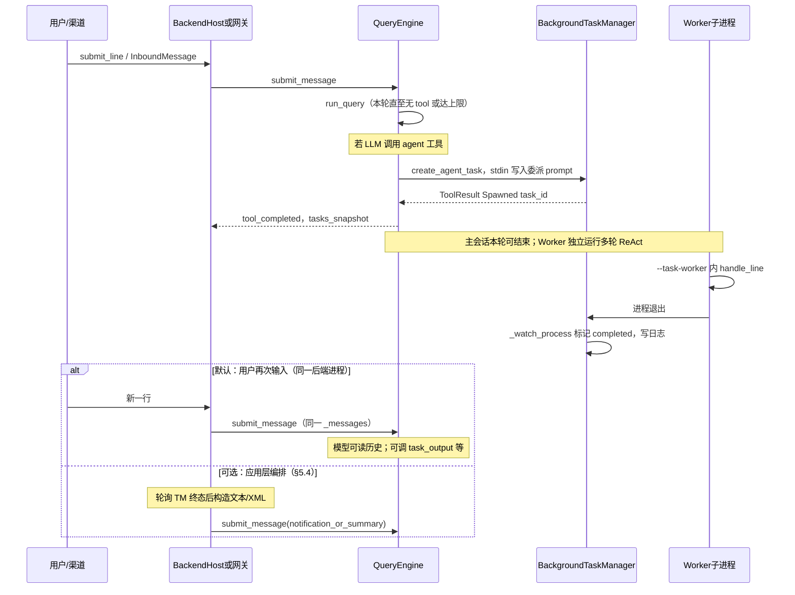
```mermaid
sequenceDiagram
    participant User as 用户/渠道
    participant BH as BackendHost或网关
    participant Engine as QueryEngine
    participant TM as BackgroundTaskManager
    participant W as Worker子进程

    User->>BH: submit_line / InboundMessage
    BH->>Engine: submit_message
    Engine->>Engine: run_query（本轮直至无 tool 或达上限）
    Note over Engine: 若 LLM 调用 agent 工具
    Engine->>TM: create_agent_task，stdin 写入委派 prompt
    TM-->>Engine: ToolResult Spawned task_id
    Engine-->>BH: tool_completed，tasks_snapshot
    Note over Engine,W: 主会话本轮可结束；Worker 独立运行多轮 ReAct
    W->>W: --task-worker 内 handle_line
    W->>TM: 进程退出
    TM->>TM: _watch_process 标记 completed，写日志

    alt 默认：用户再次输入（同一后端进程）
        User->>BH: 新一行
        BH->>Engine: submit_message（同一 _messages）
        Note over Engine: 模型可读历史；可调 task_output 等
    else 可选：应用层编排（§5.4）
        Note over BH: 轮询 TM 终态后构造文本/XML
        BH->>Engine: submit_message(notification_or_summary)
    end
```

---

### 5.3 关键代码实现(与当前仓库一致)

#### 步骤1: `agent` 工具立即返回(`executor.spawn`,非阻塞)

```python
# src/openharness/tools/agent_tool.py(节选)
registry = get_backend_registry()
executor = registry.get_executor("subprocess")
result = await executor.spawn(config)  # SubprocessBackend → create_agent_task
if not result.success:
    return ToolResult(output=result.error or "Failed to spawn agent", is_error=True)
return ToolResult(
    output=(
        f"Spawned agent {result.agent_id} "
        f"(task_id={result.task_id}, backend={result.backend_type})"
    )
)
```

**关键点**:
- ✅ `spawn` / `create_agent_task` 启动子进程并写入初始 prompt 后,工具调用**立即**返回。
- ✅ 主会话 `run_query` 继续或结束本轮;**不会**在工具内部 `await` worker 跑完。
- ✅ **同时记录元数据**: `record_async_agent_task()` 将任务信息存入 `tool_metadata["async_agent_tasks"]`

---

#### 步骤2: BackgroundTaskManager监控子进程

**重要说明**: `BackgroundTaskManager` **不是一个Agent**,而是一个**单例任务管理器**,负责跟踪所有后台任务的执行状态。

##### Q1: BackgroundTaskManager在哪里创建?

```python
# src/openharness/tasks/manager.py:309-318
def get_task_manager() -> BackgroundTaskManager:
    """返回单例任务管理器。"""
    global _DEFAULT_MANAGER, _DEFAULT_MANAGER_KEY
    current_key = str(get_tasks_dir().resolve())
    if _DEFAULT_MANAGER is None or _DEFAULT_MANAGER_KEY != current_key:
        if _DEFAULT_MANAGER is not None:
            _DEFAULT_MANAGER.close()
        _DEFAULT_MANAGER = BackgroundTaskManager()  # ← 首次调用时创建
        _DEFAULT_MANAGER_KEY = current_key
    return _DEFAULT_MANAGER
```

**关键点**:
- ✅ **懒加载单例**: 第一次调用 `get_task_manager()` 时创建
- ✅ **全局共享**: 主进程和Worker子进程各自有一个独立的实例
- ✅ **工作目录隔离**: 不同cwd有不同的manager实例

##### Q2: Worker如何通知父进程(主Agent)?

**重要澄清**: 当前实现中,**BackgroundTaskManager并不会直接写入父进程stdin**! 而是通过**应用层轮询+主动注入**的方式完成notification传递。

实际的notification注入有两种方式:

**方式1: Coordinator模式自动轮询注入**(生产环境主要方式)

```python
# src/openharness/ui/app.py:177-206
async def drain_coordinator_async_agents(
    bundle,
    *,
    prompt_seed: str,
    output_format: str,
    print_system,
    render_event,
) -> None:
    """Coordinator模式下自动等待异步Agent完成并注入notification。
    
    核心流程:
    1. 检查tool_metadata中是否有pending的async_agent_tasks
    2. 轮询等待至少一个任务进入终态(completed/failed/killed)
    3. 读取任务输出并生成task-notification XML
    4. 调用submit_message(notification_xml)注入到主Agent Loop
    5. 重复直到没有pending任务
    """
    engine = getattr(bundle, "engine", None)
    if engine is None:
        return
    
    while True:
        # === 阶段1: 检查是否有pending任务 ===
        pending = _pending_async_agent_entries(getattr(engine, "tool_metadata", None))
        if not pending:
            return  # 没有pending任务,退出循环
        
        if output_format == "text":
            await print_system(
                f"Waiting for {len(pending)} background agent task(s) to finish..."
            )
        
        # === 阶段2: 轮询等待任务完成 ===
        completed = await _wait_for_completed_async_agent_entries(
            getattr(engine, "tool_metadata", None)
        )
        
        # === 阶段3: 生成notification XML ===
        notification_payload = _format_completed_task_notifications(completed)
        if not notification_payload.strip():
            return
        
        # === 阶段4: 注入notification并继续主Agent Loop ===
        await _submit_print_follow_up(
            bundle,
            notification_payload,  # ← 这就是task-notification XML
            prompt_seed=prompt_seed,
            print_system=print_system,
            render_event=render_event,
        )
        # 注意: _submit_print_follow_up会调用engine.submit_message(notification_payload)
        #       这会触发新一轮的Agent Loop,LLM会看到notification并决定下一步行动
```

**辅助函数详解**:

```python
# src/openharness/ui/app.py:58-67
def _pending_async_agent_entries(tool_metadata: dict[str, object] | None) -> list[dict[str, object]]:
    """从tool_metadata中提取尚未发送notification的pending任务。
    
    tool_metadata结构:
    {
        "async_agent_tasks": [
            {
                "task_id": "task_abc123",
                "agent_id": "agent-research-beijing",
                "description": "研究北京人口增长趋势",
                "notification_sent": False,  # ← 关键字段
                "status": "running",         # ← 由轮询更新
                "return_code": None,         # ← 完成后填充
            },
            ...
        ]
    }
    """
    pending: list[dict[str, object]] = []
    for entry in _async_agent_task_entries(tool_metadata):
        task_id = str(entry.get("task_id") or "").strip()
        if not task_id:
            continue
        if bool(entry.get("notification_sent")):  # ← 跳过已发送的任务
            continue
        pending.append(entry)
    return pending


# src/openharness/ui/app.py:81-105
async def _wait_for_completed_async_agent_entries(
    tool_metadata: dict[str, object] | None,
    *,
    poll_interval_seconds: float = 0.1,  # ← 每0.1秒检查一次
) -> list[dict[str, object]]:
    """轮询BackgroundTaskManager,直到至少一个任务进入终态。
    
    Returns:
        已完成的任务列表(可能为空,如果任务在等待过程中被标记为missing)
    """
    manager = get_task_manager()
    while True:
        pending = _pending_async_agent_entries(tool_metadata)
        if not pending:
            return []  # 没有pending任务
        
        completed: list[dict[str, object]] = []
        for entry in pending:
            task_id = str(entry.get("task_id") or "").strip()
            task = manager.get_task(task_id)
            
            if task is None:
                # 任务不存在,标记为已发送避免无限等待
                entry["notification_sent"] = True
                entry["status"] = "missing"
                continue
            
            # 更新entry中的状态
            entry["status"] = task.status
            if task.status in _TERMINAL_TASK_STATUSES:  # ("completed", "failed", "killed")
                entry["return_code"] = task.return_code
                completed.append(entry)
        
        if completed:
            return completed  # 至少有一个任务完成,立即返回
        
        await asyncio.sleep(poll_interval_seconds)  # 短暂休眠后重试


# src/openharness/ui/app.py:108-134
def _format_completed_task_notifications(completed: list[dict[str, object]]) -> str:
    """为每个完成的任务生成task-notification XML。
    
    Returns:
        多个notification用\n\n分隔的字符串
    """
    manager = get_task_manager()
    notifications: list[str] = []
    
    for entry in completed:
        task_id = str(entry.get("task_id") or "").strip()
        agent_id = str(entry.get("agent_id") or task_id).strip()
        task = manager.get_task(task_id)
        
        if task is None:
            continue
        
        # 读取任务输出(最多8KB)
        output = manager.read_task_output(task_id, max_bytes=8000).strip()
        
        # 构建TaskNotification对象
        notifications.append(
            format_task_notification(
                TaskNotification(
                    task_id=agent_id,
                    status=task.status,
                    summary=_build_async_task_summary(
                        entry,
                        task_status=task.status,
                        return_code=task.return_code,
                    ),
                    result=output or None,
                )
            )
        )
        
        # 标记为已发送,避免重复处理
        entry["notification_sent"] = True
        entry["notified_status"] = task.status
    
    return "\n\n".join(notifications)
```

**完整流程时序图**:

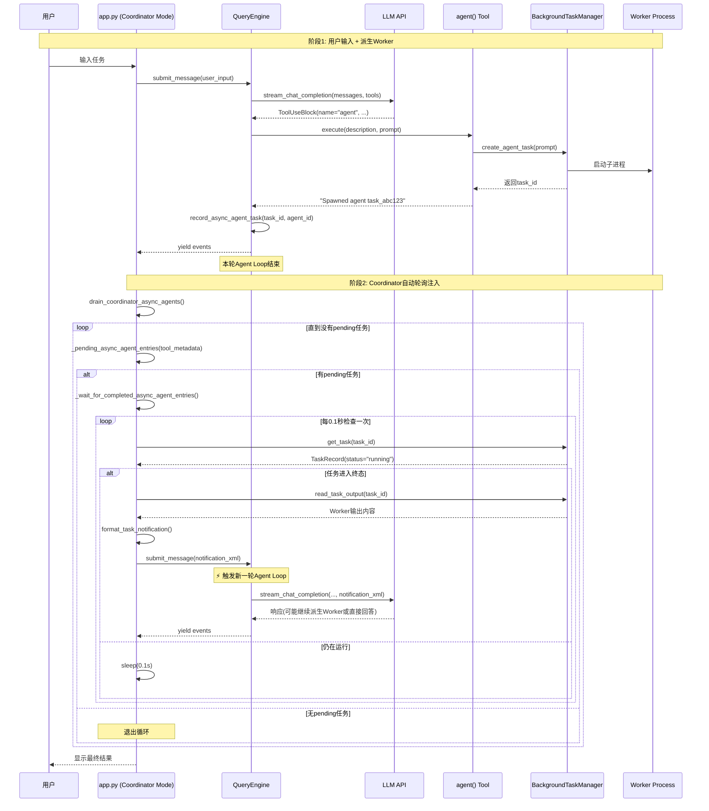
```mermaid
sequenceDiagram
    participant User as 用户
    participant App as app.py (Coordinator Mode)
    participant Engine as QueryEngine
    participant LLM as LLM API
    participant AgentTool as agent() Tool
    participant TM as BackgroundTaskManager
    participant Worker as Worker Process
    
    Note over User,Worker: 阶段1: 用户输入 + 派生Worker
    User->>App: 输入任务
    App->>Engine: submit_message(user_input)
    Engine->>LLM: stream_chat_completion(messages, tools)
    LLM-->>Engine: ToolUseBlock(name="agent", ...)
    Engine->>AgentTool: execute(description, prompt)
    AgentTool->>TM: create_agent_task(prompt)
    TM->>Worker: 启动子进程
    TM-->>AgentTool: 返回task_id
    AgentTool-->>Engine: "Spawned agent task_abc123"
    Engine->>Engine: record_async_agent_task(task_id, agent_id)
    Engine-->>App: yield events
    Note over Engine: 本轮Agent Loop结束
    
    Note over App,Worker: 阶段2: Coordinator自动轮询注入
    App->>App: drain_coordinator_async_agents()
    loop 直到没有pending任务
        App->>App: _pending_async_agent_entries(tool_metadata)
        alt 有pending任务
            App->>App: _wait_for_completed_async_agent_entries()
            loop 每0.1秒检查一次
                App->>TM: get_task(task_id)
                TM-->>App: TaskRecord(status="running")
                alt 任务进入终态
                    App->>TM: read_task_output(task_id)
                    TM-->>App: Worker输出内容
                    App->>App: format_task_notification()
                    App->>Engine: submit_message(notification_xml)
                    Note over Engine: ⚡ 触发新一轮Agent Loop
                    Engine->>LLM: stream_chat_completion(..., notification_xml)
                    LLM-->>Engine: 响应(可能继续派生Worker或直接回答)
                    Engine-->>App: yield events
                else 仍在运行
                    App->>App: sleep(0.1s)
                end
            end
        else 无pending任务
            Note over App: 退出循环
        end
    end
    
    App-->>User: 显示最终结果
```

**流程说明**:
1. **用户输入**: 用户在Coordinator模式下输入任务
2. **派生Worker**: LLM决定调用`agent()`工具,启动子进程
3. **记录元数据**: `record_async_agent_task()`将任务信息存入`tool_metadata`
4. **本轮结束**: 主Agent Loop正常结束(不等待Worker)
5. **自动检测**: `drain_coordinator_async_agents()`检测到pending任务
6. **轮询等待**: 每0.1秒检查一次TaskManager,直到任务完成
7. **读取输出**: 从TaskManager读取Worker的stdout/stderr
8. **生成XML**: 构建`<task-notification>`格式的XML
9. **注入Loop**: 调用`submit_message(notification_xml)`,触发新一轮Agent Loop
10. **LLM决策**: LLM看到notification,决定是继续派生Worker、使用`send_message`还是给出最终答案
11. **循环继续**: 重复步骤5-10,直到所有Worker完成且LLM不再派生新Worker

**关键点**:
- ✅ **Coordinator模式专属**: 仅在`is_coordinator_mode() == True`时启用
- ✅ **自动化**: 无需用户手动干预,系统自动等待并注入notification
- ✅ **多轮迭代**: 支持多次派生Worker,每次都会等待并注入
- ✅ **状态追踪**: 通过`notification_sent`字段避免重复处理
- ✅ **实时反馈**: UI显示"Waiting for N background agent task(s) to finish..."
- ✅ **灵活控制**: 可通过`poll_interval_seconds`调整轮询频率


已完成思考

# 源码深度解析 OpenHarness `drain_coordinator_async_agents`

## 🔴 最关键纠错（之前分析最核心错误）

这里存在**两个完全独立、名字一模一样的 `tool_metadata`，之前混淆了二者**：

1. **`bundle.engine.tool_metadata`（顶层、会话‑全局）**
   不属于任何一条消息！它是 QueryEngine 引擎实例上的**全局会话元数字典**。
>
> 后台异步子 Agent 批量任务列表 `async_agent_tasks` 就存储在这里。
2. 单条消息身上的 `message.tool_metadata`
   挂载在单条 `tool_call` / `tool_result` 消息上的附属字段；**这份 drain 代码完全不读取它**。

>
> 批量子任务并不是靠 `batch_group_id`；
> **`engine.tool_metadata["async_agent_tasks"]` 本身就是列表，天然支持存放多个 task_id，原生批量。**

---

## 一、核心数据结构

### `engine.tool_metadata` 真实结构

```python
engine.tool_metadata = {
    "async_agent_tasks": [
        {
            "task_id": "task‑uuid‑001",
            "agent_id": "worker‑01",
            "description": "background task",
            "notification_sent": False,   # 核心标记位：结果通知是否已经提交给协调器
            "status": None,
            "return_code": None,
            "notified_status": None
        },
        {
            "task_id": "task‑uuid‑002",
            "agent_id": "worker‑02",
            "description": "background task",
            "notification_sent": False
        }
    ]
}
```

字段说明：

表格

| 字段 | 作用 |
| --- | --- |
| `task_id` | 后台子 Agent 任务唯一 ID，交由全局`TaskManager`管理运行 |
| `notification_sent` | 布尔开关。**一旦任务结果作为 `<task‑notification>` 用户消息发给协调器，就标记 True，永久不再处理这条任务条目** |

终态任务集合：`{"completed", "failed", "killed"}`，到达这些状态代表子 Agent 进程已经结束。

---

## 二、逐个拆解辅助函数

### 1. `_async_agent_task_entries`

安全取值函数。读取 `engine.tool_metadata`，取出 `async_agent_tasks` 任务列表，做类型校验，防御空值。

### 2. `pending_async_agent_entries`

筛选**待处理任务**：

- task_id 非空
- `notification_sent == False` → **还没有发送任务完成通知给 Coordinator**

>
> 即使子 Agent 进程早就跑完了，但只要通知消息没有提交给协调器，它依然属于 pending 条目。

### 3. `wait_for_completed_async_agent_entries`【阻塞轮询核心】

```python
while True:
    扫描所有pending任务
    查询 TaskManager 获取每个 task 的实时状态
    如果任务到达终态 completed/failed/killed → 加入completed列表
    只要收集到至少1条完成任务 → 返回这批任务
    否则 sleep 0.1s，继续轮询
```

行为特征：

- **不会等待全部任务完成！只要任意一条任务结束就立刻返回批次**
- 剩余还在跑的任务保留，下一轮循环继续等待

>
> 不是一次性排空所有后台任务；是**分批交付结果给协调器**。

### 4. `format_completed_task_notifications`

1. 通过`task_id`读取子 Agent 输出日志（最多读取 8000 字节）
2. 生成格式化 `<task‑notification>` XML 文本
3. **原地修改任务条目：`notification_sent = True`**
>
> 这是一个至关重要的状态变更！标记这条任务结果已经通知过协调器，不会二次投递。

### 5. `submit_follow_up`【提交跟进回合】

这是整个契约实现最核心函数：

```
await bundle.engine.submit_message(message)
```

- `message` = 刚刚生成的 `<task‑notification>` 字符串
- **这条通知会以 User‑role 用户消息身份，追加进引擎消息列表**，送给 Coordinator
- 然后刷新系统提示词，重新启动一轮协调器思考回合
- 回合结束后调用 `save_snapshot`，**把修改过后、`notification_sent=True` 的最新 `engine.tool_metadata` 持久化保存会话快照**

---

# 三、`drain_coordinator_async_agents` 主函数完整执行流程


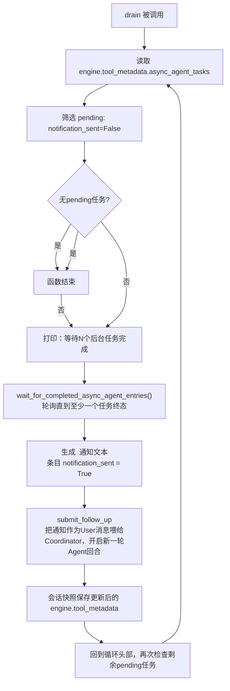
```mermaid
flowchart TD
    START[drain 被调用]
    READ[读取 engine.tool_metadata.async_agent_tasks]
    FILTER[筛选 pending: notification_sent=False]
    NO_PENDING{无pending任务?}
    -->|是| EXIT[直接return结束]
    -->|否| PRINT[打印：等待N个后台任务完成]
    WAIT["wait_for_completed_async_agent_entries()<br/>轮询直到至少一个任务终态"]
    FORMAT[生成 <task-notification> 通知文本<br/>条目 notification_sent = True]
    SUBMIT[submit_follow_up<br/>把通知作为User消息喂给Coordinator，开启新一轮Agent回合]
    SAVE[会话快照保存更新后的 engine.tool_metadata]
    LOOP[回到循环头部，再次检查剩余pending任务]
    EXIT[函数结束]
    
    START --> READ --> FILTER --> NO_PENDING
    NO_PENDING --否--> PRINT --> WAIT --> FORMAT --> SUBMIT --> SAVE --> LOOP
    LOOP --> READ
    NO_PENDING --是--> EXIT
```

## while True 循环真正含义

>
> 后台还有剩余没发送通知的任务，就不断：
> 等待一批完成 → 投递通知消息 → 交给协调器跑一轮 → 回来继续等待下一批。

举例子：同时启动 3 个后台任务

1. task‑01 先跑完 → drain 投递通知，协调器执行一轮思考
2. 协调器回合结束，回到 drain 循环
3. task‑02、task‑03 此时跑完 → drain 投递第二批通知

👉 **子任务结果分批交付给协调器，而不是一次性全部交付。**

---

# 四、`engine.tool_metadata` 完整状态变化轨迹

以并发 2 个子 Agent 为例

### 阶段 1：协调器调用 `agent` 工具，spawn 后台任务

```
engine.tool_metadata["async_agent_tasks"] = [
    {"task_id":"t1","notification_sent":False},
    {"task_id":"t2","notification_sent":False}
]
```

### 阶段 2：进入 drain，t1 执行完毕、t2 仍在运行

`wait_for_completed_async_agent_entries` 返回 `[t1]`
`format_completed_task_notifications` 修改内存条目：

```
t1["notification_sent"] = True
```

### 阶段 3：submit_follow_up

提交 task‑notification 消息给协调器，执行一轮思考；
`save_snapshot` 将上面改动持久化写入会话。
此时内存：

```
async_agent_tasks = [
    {"task_id":"t1","notification_sent":True},
    {"task_id":"t2","notification_sent":False}
]
```

### 阶段 4：drain 回到循环头部，再次检测 pending

t2 仍然 pending，继续阻塞等待；直到 t2 完成、投递第二条通知。

### 阶段 5：两个任务 notification_sent = True

pending 列表为空 → drain 函数退出。

>
> 任务条目**永远不会从 `async_agent_tasks` 列表里面删除**，只是打上通知标记，历史永久留存。

---

# 五、系统契约（源码文档注释核心合同）

>
> When coordinator mode dispatches workers via the `agent` tool, the system prompt promises that worker results arrive as user‑role `<task‑notification>` messages between coordinator turns.

翻译契约：

1. Coordinator（Leader）调用 `agent` 工具派发后台子 Worker 任务；
2. **协调器每一轮思考结束之后，在它下一轮开始之前**，Harness 必须插入用户角色的 `<task‑notification>` 消息；
3. 子任务结果**不能直接注入 Assistant 回复**；必须以 User 消息的形式给到协调器；
4. Coordinator 系统提示词就是基于这个约定编写，它预期结果会以这种格式到来。

## ✅ drain_coordinator_async_agents 标准调用时机（唯一正确）

>
> **Coordinator Agent 完成一轮思考回合、即将交出控制权的时候调用**。
> 也就是 Leader 本轮输出完成，**下一轮思考开始之前**，执行 drain。

```
Coordinator Turn N (一轮思考完成)
        ↓
call drain_coordinator_async_agents()
        ↓
(等待后台任务、投递<task‑notification> user消息，执行follow‑up回合)
        ↓
Coordinator Turn N+1 (新一轮协调器思考启动，可以读到任务结果)
```
---

**方式2: 测试代码中的手动轮询+注入** (用于演示和测试)

**流程说明**:
1. **调用`engine.submit_message(question)`** → 主Agent执行
2. **LLM返回ToolUseBlock(name="agent", ...)** → 派生Worker
3. **agent tool立即返回task_id** → 不等待Worker完成
4. **测试代码轮询TaskManager** → 检查任务状态
5. **Worker完成后,测试代码生成XML** → `format_task_notification()`
6. **将XML加入队列** → 下一轮`submit_message(notification_xml)`
7. **重复直到没有新的agent spawn**

**关键点**:
- ✅ **BackgroundTaskManager只负责任务跟踪**,不负责notification注入
- ✅ **notification由外部代码(测试/UI)手动生成和注入**
- ✅ **通过轮询TaskManager来检测Worker完成**
- ✅ **这是一个"拉"模式(pull),不是"推"模式(push)**
- ✅ **测试代码模拟了生产环境的Coordinator行为**

**方式2: BackendHost监听stdin** (理论上可行,但当前未实现)

```python
# src/openharness/ui/backend_host.py:168-192
async def _read_requests(self) -> None:
    """持续监听stdin,接收来自外部的输入。"""
    while True:
        raw = await asyncio.to_thread(sys.stdin.buffer.readline)  # ← 阻塞读取
        if not raw:
            return
        
        payload = raw.decode("utf-8").strip()
        if not payload:
            continue
        
        # 如果不是JSON请求,当作普通文本(包括notification XML)
        try:
            request = FrontendRequest.model_validate_json(payload)
        except Exception:
            await self._process_line(payload)  # ← 转发给Engine
            continue
```

**理论上**:
- 如果BackgroundTaskManager能获取父进程的stdin句柄
- 可以直接写入notification XML
- BackendHost会读取并转发给Engine

**但实际上**:
- ❌ BackgroundTaskManager无法直接访问父进程stdin
- ❌ 子进程和父进程的stdin/stdout是独立的
- ❌ 需要额外的IPC机制(如socket、pipe、文件等)

**当前实现的选择**:
- ✅ 使用**轮询模式**: 外部代码定期检查TaskManager状态
- ✅ 使用**队列模式**: 将notification作为普通消息加入处理队列
- ✅ 简单可靠,不需要复杂的IPC机制

##### Q3: 主Agent如何接收并处理notification?

**BackendHost是什么?**

`BackendHost`是**UI层的后端服务**,负责:
1. **监听stdin/stdout**: 与前端(React TUI)通信
2. **管理QueryEngine生命周期**: 创建、启动、关闭
3. **转发用户输入**: 将前端消息转发给Engine
4. **流式返回事件**: 将Engine的事件转发给前端

**BackendHost与BackgroundTaskManager的关系**:

```
┌─────────────────────────────────────────────────────────┐
│                   父进程 (Main Process)                  │
│                                                         │
│  ┌──────────────┐      ┌──────────────────────────┐   │
│  │ BackendHost  │◄────►│    QueryEngine           │   │
│  │              │      │                          │   │
│  │ - 监听stdin  │      │ - Agent Loop             │   │
│  │ - 转发消息   │      │ - Tool执行               │   │
│  │ - 流式输出   │      │ - 上下文压缩             │   │
│  └──────┬───────┘      └──────────┬───────────────┘   │
│         │                         │                    │
│         │                         │ get_task_manager() │
│         │                         ▼                    │
│         │              ┌──────────────────────────┐   │
│         │              │ BackgroundTaskManager    │   │
│         │              │ (单例,全局共享)           │   │
│         │              │                          │   │
│         │              │ - 跟踪所有任务状态       │   │
│         │              │ - 监控子进程             │   │
│         │              │ - 提供task查询接口       │   │
│         │              └──────────────────────────┘   │
│                                                       │
└─────────────────────────────────────────────────────────┘
                     ▲                ▲
                     │                │
              stdin读取          轮询查询任务状态
                     │                │
┌────────────────────┼────────────────┼─────────────────┐
│                    │                │                 │
│  ┌─────────────┐   │   ┌──────────────────────────┐  │
│  │ React TUI   │   │   │ 测试代码/UI外部逻辑       │  │
│  │ (前端)      │   │   │                          │  │
│  │             │   │   │ - 轮询TaskManager        │  │
│  │ - 显示UI    │   │   │ - 检测Worker完成         │  │
│  │ - 发送消息  │───┘   │ - 生成notification XML   │  │
│  └─────────────┘       │ - 调用submit_message()   │  │
│                        └──────────────────────────┘  │
└───────────────────────────────────────────────────────┘
```

**关键点**:
- ✅ **BackendHost和BackgroundTaskManager都在父进程中**
- ✅ **BackendHost不直接与TaskManager交互**
- ✅ **外部代码(测试/UI)负责轮询TaskManager并注入notification**
- ✅ **BackendHost只是被动地接收消息并转发给Engine**

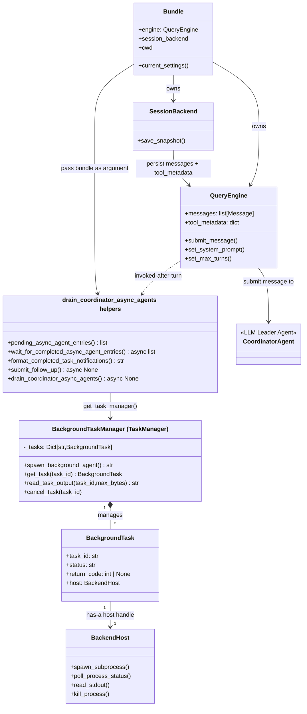
```mermaid
classDiagram
    class Bundle {
        +engine: QueryEngine
        +session_backend
        +cwd
        +current_settings()
    }

    class QueryEngine {
        +messages: list[Message]
        +tool_metadata: dict
        +submit_message()
        +set_system_prompt()
        +set_max_turns()
    }

    class BackgroundTaskManager["BackgroundTaskManager (TaskManager)"] {
        -_tasks: Dict[str,BackgroundTask]
        +spawn_background_agent() str
        +get_task(task_id) BackgroundTask
        +read_task_output(task_id,max_bytes) str
        +cancel_task(task_id)
    }

    class BackgroundTask {
        +task_id: str
        +status: str
        +return_code: int | None
        +host: BackendHost
    }

    class BackendHost {
        +spawn_subprocess()
        +poll_process_status()
        +read_stdout()
        +kill_process()
    }

    %% 独立工具函数模块 (drain helpers)
    class DrainHelpers["drain_coordinator_async_agents helpers"]{
        +pending_async_agent_entries() list
        +wait_for_completed_async_agent_entries() async list
        +format_completed_task_notifications() str
        +submit_follow_up() async None
        +drain_coordinator_async_agents() async None
    }

    class CoordinatorAgent {
        <<LLM Leader Agent>>
    }

    class SessionBackend {
        +save_snapshot()
    }

    %% 关联关系
    Bundle --> QueryEngine : owns
    Bundle --> SessionBackend : owns
    QueryEngine ..> DrainHelpers : invoked‑after‑turn
    DrainHelpers --> BackgroundTaskManager : get_task_manager()
    BackgroundTaskManager "1" *-- "*" BackgroundTask : manages
    BackgroundTask "1" --> "1" BackendHost : has‑a host handle
    QueryEngine --> CoordinatorAgent : submit message to
    Bundle --> DrainHelpers : pass bundle as argument
    SessionBackend --> QueryEngine : persist messages + tool_metadata
```

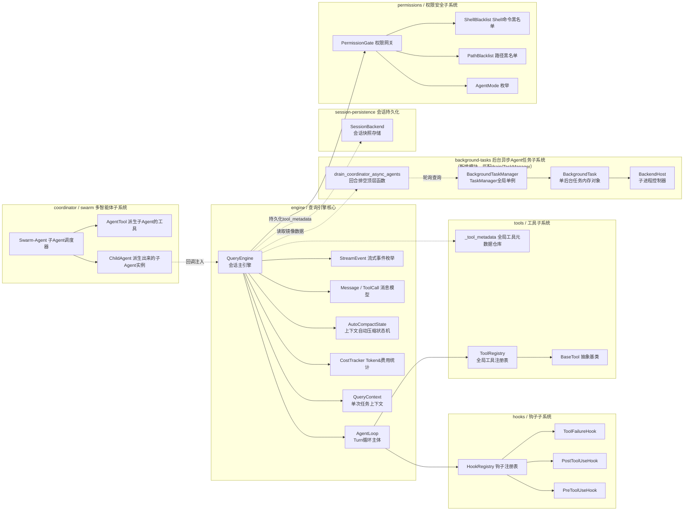
```mermaid
graph LR
    subgraph coordinator["coordinator / swarm 多智能体子系统"]
        SwarmScheduler["Swarm‑Agent 子Agent调度器"]
        ChildAgent["ChildAgent 派生出来的子Agent实例"]
        AgentTool["AgentTool 派生子Agent的工具"]
    end

    subgraph engine["engine / 查询引擎核心"]
        QueryEngine["QueryEngine<br/>会话主引擎"]
        AgentLoop["AgentLoop<br/>Turn循环主体"]
        QueryContext["QueryContext<br/>单次任务上下文"]
        CostTracker["CostTracker Token&费用统计"]
        AutoCompactState["AutoCompactState<br/>上下文自动压缩状态机"]
        Message["Message / ToolCall 消息模型"]
        StreamEvent["StreamEvent 流式事件枚举"]
    end

    subgraph hooks["hooks / 钩子子系统"]
        HookRegistry["HookRegistry 钩子注册表"]
        Pre["PreToolUseHook"]
        Post["PostToolUseHook"]
        Fail["ToolFailureHook"]
    end

    subgraph tools["tools / 工具子系统"]
        ToolRegistry["ToolRegistry<br/>全局工具注册表"]
        BaseTool["BaseTool 抽象基类"]
        ToolMetadata["_tool_metadata 全局工具元数据仓库"]
    end

    subgraph background["background‑tasks 后台异步Agent任务子系统<br/>（新增模块，匹配drain/TaskManager）"]
        TaskManager["BackgroundTaskManager<br/>TaskManager全局单例"]
        BackgroundTask["BackgroundTask<br/>单后台任务内存对象"]
        BackendHost["BackendHost<br/>子进程控制器"]
        DrainHelper["drain_coordinator_async_agents<br/>回合排空顶层函数"]
    end

    subgraph session["session‑persistence 会话持久化"]
        SessionBackend["SessionBackend<br/>会话快照存储"]
    end

    subgraph permissions["permissions / 权限安全子系统"]
        PermissionGate["PermissionGate 权限网关"]
        AgentMode["AgentMode 枚举"]
        PathBlack["PathBlacklist 路径黑名单"]
        ShellBlack["ShellBlacklist Shell命令黑名单"]
    end

    %% =========== 连线关系 ===========
    SwarmScheduler --> ChildAgent
    SwarmScheduler --> AgentTool

    QueryEngine --> AgentLoop
    QueryEngine --> QueryContext
    QueryEngine --> CostTracker
    QueryEngine --> AutoCompactState
    QueryEngine --> Message
    QueryEngine --> StreamEvent

    AgentLoop --> HookRegistry
    HookRegistry --> Pre
    HookRegistry --> Post
    HookRegistry --> Fail

    AgentLoop --> ToolRegistry
    ToolRegistry --> BaseTool
    QueryEngine -.-> ToolMetadata

    %% 后台任务链路（核心新增）
    QueryEngine -.读取镜像数据.-> DrainHelper
    DrainHelper -.轮询查询.-> TaskManager
    TaskManager --> BackgroundTask
    BackgroundTask --> BackendHost
    QueryEngine -.持久化tool_metadata.-> SessionBackend

    QueryEngine --> PermissionGate
    PermissionGate --> AgentMode
    PermissionGate --> PathBlack
    PermissionGate --> ShellBlack

    ChildAgent -.回调注入.-> QueryEngine
```
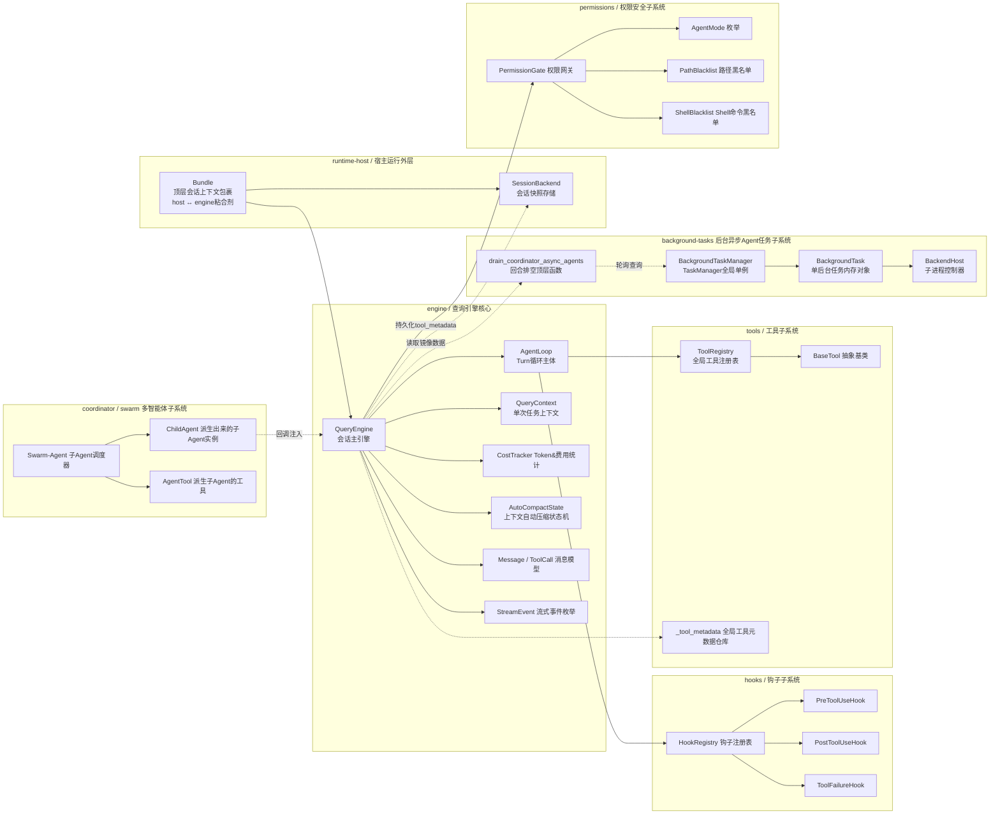
```mermaid
graph LR
    subgraph runtime_host["runtime‑host / 宿主运行外层"]
        Bundle["Bundle<br/>顶层会话上下文包裹<br/>host ↔ engine粘合剂"]
        SessionBackend["SessionBackend<br/>会话快照存储"]
    end

    subgraph coordinator["coordinator / swarm 多智能体子系统"]
        SwarmScheduler["Swarm‑Agent 子Agent调度器"]
        ChildAgent["ChildAgent 派生出来的子Agent实例"]
        AgentTool["AgentTool 派生子Agent的工具"]
    end

    subgraph engine["engine / 查询引擎核心"]
        QueryEngine["QueryEngine<br/>会话主引擎"]
        AgentLoop["AgentLoop<br/>Turn循环主体"]
        QueryContext["QueryContext<br/>单次任务上下文"]
        CostTracker["CostTracker Token&费用统计"]
        AutoCompactState["AutoCompactState<br/>上下文自动压缩状态机"]
        Message["Message / ToolCall 消息模型"]
        StreamEvent["StreamEvent 流式事件枚举"]
    end

    subgraph hooks["hooks / 钩子子系统"]
        HookRegistry["HookRegistry 钩子注册表"]
        Pre["PreToolUseHook"]
        Post["PostToolUseHook"]
        Fail["ToolFailureHook"]
    end

    subgraph tools["tools / 工具子系统"]
        ToolRegistry["ToolRegistry<br/>全局工具注册表"]
        BaseTool["BaseTool 抽象基类"]
        ToolMetadata["_tool_metadata 全局工具元数据仓库"]
    end

    subgraph background["background‑tasks 后台异步Agent任务子系统"]
        TaskManager["BackgroundTaskManager<br/>TaskManager全局单例"]
        BackgroundTask["BackgroundTask<br/>单后台任务内存对象"]
        BackendHost["BackendHost<br/>子进程控制器"]
        DrainHelper["drain_coordinator_async_agents<br/>回合排空顶层函数"]
    end

    subgraph permissions["permissions / 权限安全子系统"]
        PermissionGate["PermissionGate 权限网关"]
        AgentMode["AgentMode 枚举"]
        PathBlack["PathBlacklist 路径黑名单"]
        ShellBlack["ShellBlacklist Shell命令黑名单"]
    end

    %% 宿主层连线
    Bundle --> QueryEngine
    Bundle --> SessionBackend

    %% coordinator
    SwarmScheduler --> ChildAgent
    SwarmScheduler --> AgentTool

    %% engine内部
    QueryEngine --> AgentLoop
    QueryEngine --> QueryContext
    QueryEngine --> CostTracker
    QueryEngine --> AutoCompactState
    QueryEngine --> Message
    QueryEngine --> StreamEvent

    %% hooks
    AgentLoop --> HookRegistry
    HookRegistry --> Pre
    HookRegistry --> Post
    HookRegistry --> Fail

    %% tools
    AgentLoop --> ToolRegistry
    ToolRegistry --> BaseTool
    QueryEngine -.-> ToolMetadata

    %% 后台任务链路
    QueryEngine -.读取镜像数据.-> DrainHelper
    DrainHelper -.轮询查询.-> TaskManager
    TaskManager --> BackgroundTask
    BackgroundTask --> BackendHost
    QueryEngine -.持久化tool_metadata.-> SessionBackend

    %% permissions
    QueryEngine --> PermissionGate
    PermissionGate --> AgentMode
    PermissionGate --> PathBlack
    PermissionGate --> ShellBlack

    ChildAgent -.回调注入.-> QueryEngine
```
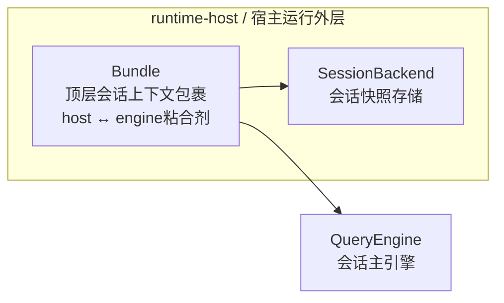
```mermaid
graph LR
   subgraph runtime_host["runtime‑host / 宿主运行外层"]
      Bundle["Bundle<br/>顶层会话上下文包裹<br/>host ↔ engine粘合剂"]
      SessionBackend["SessionBackend<br/>会话快照存储"]
   end

   QueryEngine["QueryEngine<br/>会话主引擎"]

   Bundle --> QueryEngine
   Bundle --> SessionBackend
```
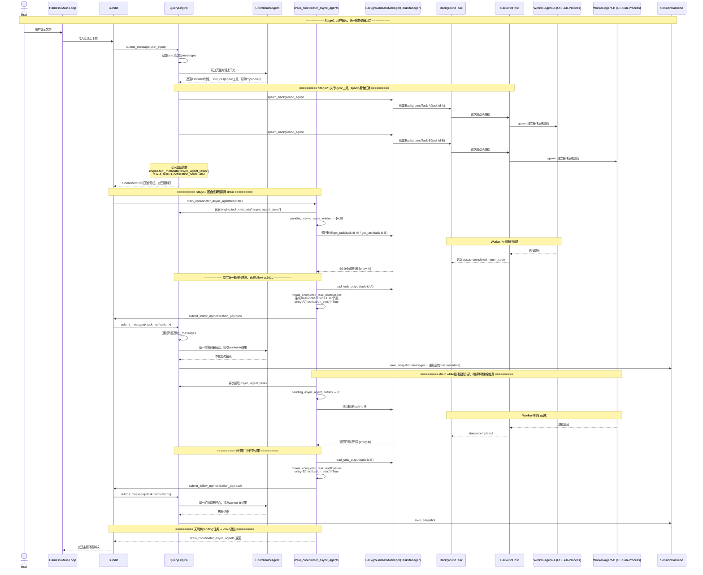
```mermaid
sequenceDiagram
    actor User
    participant HarnessMain as Harness Main‑Loop
    participant Bundle
    participant QueryEngine
    participant CoordinatorAgent
    participant Drain as drain_coordinator_async_agents
    participant TaskManager as BackgroundTaskManager(TaskManager)
    participant BackgroundTask
    participant BackendHost
    participant WorkerA as Worker‑Agent‑A (OS Sub‑Process)
    participant WorkerB as Worker‑Agent‑B (OS Sub‑Process)
    participant SessionBackend

    Note over User,SessionBackend: ========== Stage1: 用户输入，第一轮协调器回合 ==========
    User->>HarnessMain: 用户提示文本
    HarnessMain->>Bundle: 传入会话上下文
    Bundle->>QueryEngine: submit_message(user_input)
    QueryEngine->>QueryEngine: 追加user消息到 messages
    QueryEngine->>CoordinatorAgent: 发送完整对话上下文
    CoordinatorAgent-->>QueryEngine: 返回Assistant消息 + tool_call(agent工具，启动2个worker)

    Note over QueryEngine,BackendHost: ========== Stage2: 执行agent工具，spawn后台任务 ==========
    QueryEngine->>TaskManager: spawn_background_agent
    TaskManager->>BackgroundTask: 创建 BackgroundTask‑A(task‑id‑A)
    BackgroundTask->>BackendHost: 请求启动子进程
    BackendHost->>WorkerA: spawn 独立操作系统进程
    QueryEngine->>TaskManager: spawn_background_agent
    TaskManager->>BackgroundTask: 创建 BackgroundTask‑B(task‑id‑B)
    BackgroundTask->>BackendHost: 请求启动子进程
    BackendHost->>WorkerB: spawn 独立操作系统进程

    Note over QueryEngine: 写入会话镜像<br/>engine.tool_metadata["async_agent_tasks"]<br/>task‑A, task‑B, notification_sent=False
    QueryEngine-->>Bundle: Coordinator本轮回合完成，交还控制权

    Note over Bundle,Drain: ========== Stage3: 回合结束后调用 drain ==========
    Bundle->>Drain: drain_coordinator_async_agents(bundle)
    Drain->>QueryEngine: 读取 engine.tool_metadata["async_agent_tasks"]
    Drain->>Drain: pending_async_agent_entries → [A,B]
    Drain->>TaskManager: 循环轮询 get_task(task‑id‑A) / get_task(task‑id‑B)

    Note over WorkerA,BackgroundTask: Worker‑A 先执行完成
    WorkerA-->>BackendHost: 进程退出
    BackendHost-->>BackgroundTask: 更新 status=completed, return_code
    TaskManager-->>Drain: 返回已完成列表 [entry‑A]

    Note over Drain,QueryEngine: ========== 交付第一批任务结果，开启follow‑up回合 ==========
    Drain->>TaskManager: read_task_output(task‑id‑A)
    Drain->>Drain: format_completed_task_notifications<br/>生成<task‑notification> User消息<br/>entry‑A["notification_sent"]=True
    Drain->>Bundle: submit_follow_up(notification_payload)
    Bundle->>QueryEngine: submit_message(<task‑notification>)
    QueryEngine->>QueryEngine: 通知消息追加进 messages
    QueryEngine->>CoordinatorAgent: 新一轮协调器回合，接收worker‑A结果
    CoordinatorAgent-->>QueryEngine: 本轮思考结束
    QueryEngine->>SessionBackend: save_snapshot(messages + 更新后的tool_metadata)

    Note over Drain,WorkerB: ========== drain while循环回到头部，继续等待剩余任务 ==========
    Drain->>QueryEngine: 再次读取 async_agent_tasks
    Drain->>Drain: pending_async_agent_entries → [B]
    Drain->>TaskManager: 继续轮询 task‑id‑B

    Note over WorkerB,BackgroundTask: Worker‑B执行完成
    WorkerB-->>BackendHost: 进程退出
    BackendHost-->>BackgroundTask: status=completed
    TaskManager-->>Drain: 返回已完成列表 [entry‑B]

    Note over Drain,QueryEngine: ========== 交付第二批任务结果 ==========
    Drain->>TaskManager: read_task_output(task‑id‑B)
    Drain->>Drain: format_completed_task_notifications<br/>entry‑B["notification_sent"]=True
    Drain->>Bundle: submit_follow_up(notification_payload)
    Bundle->>QueryEngine: submit_message(<task‑notification>)
    QueryEngine->>CoordinatorAgent: 新一轮协调器回合，接收worker‑B结果
    CoordinatorAgent-->>QueryEngine: 思考结束
    QueryEngine->>SessionBackend: save_snapshot

    Note over Drain,Bundle: ========== 无剩余pending任务 → drain退出 ==========
    Drain-->>Bundle: drain_coordinator_async_agents 返回
    Bundle-->>HarnessMain: 交还主循环控制权
```
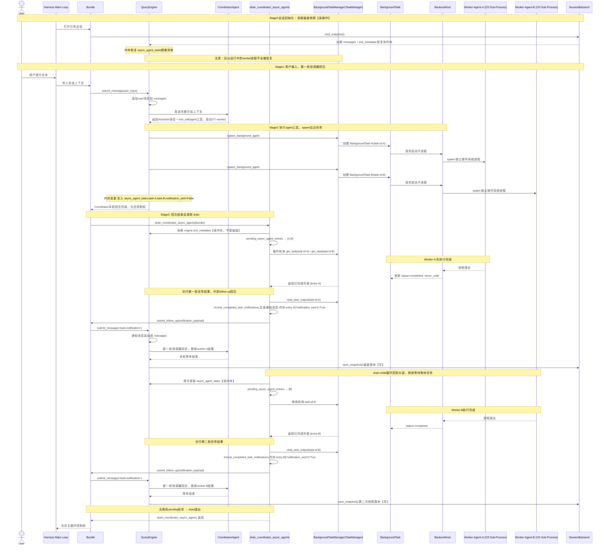
```mermaid
sequenceDiagram
   actor User
   participant HarnessMain as Harness Main‑Loop
   participant Bundle
   participant QueryEngine
   participant CoordinatorAgent
   participant Drain as drain_coordinator_async_agents
   participant TaskManager as BackgroundTaskManager(TaskManager)
   participant BackgroundTask
   participant BackendHost
   participant WorkerA as Worker‑Agent‑A (OS Sub‑Process)
   participant WorkerB as Worker‑Agent‑B (OS Sub‑Process)
   participant SessionBackend

   Note over User,SessionBackend: Stage0 会话初始化：读取磁盘快照【读操作】
   HarnessMain->>Bundle: 打开已有会话
   Bundle->>SessionBackend: load_snapshot()
   SessionBackend-->>QueryEngine: 加载 messages + tool_metadata 恢复到内存
   Note over QueryEngine: 内存恢复 async_agent_tasks镜像清单
   Note over QueryEngine,TaskManager: 注意：后台运行中的worker进程不会被恢复

   Note over User,SessionBackend: Stage1: 用户输入，第一轮协调器回合
   User->>HarnessMain: 用户提示文本
   HarnessMain->>Bundle: 传入会话上下文
   Bundle->>QueryEngine: submit_message(user_input)
   QueryEngine->>QueryEngine: 追加user消息到 messages
   QueryEngine->>CoordinatorAgent: 发送完整对话上下文
   CoordinatorAgent-->>QueryEngine: 返回Assistant消息 + tool_call(agent工具，启动2个worker)

   Note over QueryEngine,BackendHost: Stage2: 执行agent工具，spawn后台任务
   QueryEngine->>TaskManager: spawn_background_agent
   TaskManager->>BackgroundTask: 创建 BackgroundTask‑A(task‑id‑A)
   BackgroundTask->>BackendHost: 请求启动子进程
   BackendHost->>WorkerA: spawn 独立操作系统进程
   QueryEngine->>TaskManager: spawn_background_agent
   TaskManager->>BackgroundTask: 创建 BackgroundTask‑B(task‑id‑B)
   BackgroundTask->>BackendHost: 请求启动子进程
   BackendHost->>WorkerB: spawn 独立操作系统进程

   Note over QueryEngine: 内存变更:写入 async_agent_tasks,task‑A,task‑B,notification_sent=False
   QueryEngine-->>Bundle: Coordinator本轮回合完成，交还控制权

   Note over Bundle,Drain: Stage3: 回合结束后调用 drain
   Bundle->>Drain: drain_coordinator_async_agents(bundle)
   Drain->>QueryEngine: 读取 engine.tool_metadata【读内存，不是磁盘】
   Drain->>Drain: pending_async_agent_entries → [A,B]
   Drain->>TaskManager: 循环轮询 get_task(task‑id‑A) / get_task(task‑id‑B)

   Note over WorkerA,BackgroundTask: Worker‑A 先执行完成
   WorkerA-->>BackendHost: 进程退出
   BackendHost-->>BackgroundTask: 更新 status=completed, return_code
   TaskManager-->>Drain: 返回已完成列表 [entry‑A]

   Note over Drain,QueryEngine: 交付第一批任务结果，开启follow‑up回合
   Drain->>TaskManager: read_task_output(task‑id‑A)
   Drain->>Drain: format_completed_task_notifications,生成通知消息,内存:entry‑A["notification_sent"]=True
   Drain->>Bundle: submit_follow_up(notification_payload)
   Bundle->>QueryEngine: submit_message(<task‑notification>)
   QueryEngine->>QueryEngine: 通知消息追加进 messages
   QueryEngine->>CoordinatorAgent: 新一轮协调器回合，接收worker‑A结果
   CoordinatorAgent-->>QueryEngine: 本轮思考结束
   QueryEngine->>SessionBackend: save_snapshot(),磁盘落地【写】

   Note over Drain,WorkerB: drain while循环回到头部，继续等待剩余任务
   Drain->>QueryEngine: 再次读取 async_agent_tasks【读内存】
   Drain->>Drain: pending_async_agent_entries → [B]
   Drain->>TaskManager: 继续轮询 task‑id‑B

   Note over WorkerB,BackgroundTask: Worker‑B执行完成
   WorkerB-->>BackendHost: 进程退出
   BackendHost-->>BackgroundTask: status=completed
   TaskManager-->>Drain: 返回已完成列表 [entry‑B]

   Note over Drain,QueryEngine: 交付第二批任务结果
   Drain->>TaskManager: read_task_output(task‑id‑B)
   Drain->>Drain: format_completed_task_notifications,内存:entry‑B["notification_sent"]=True
   Drain->>Bundle: submit_follow_up(notification_payload)
   Bundle->>QueryEngine: submit_message(<task‑notification>)
   QueryEngine->>CoordinatorAgent: 新一轮协调器回合，接收worker‑B结果
   CoordinatorAgent-->>QueryEngine: 思考结束
   QueryEngine->>SessionBackend: save_snapshot(),第二次快照落地【写】

   Note over Drain,Bundle: 无剩余pending任务 → drain退出
   Drain-->>Bundle: drain_coordinator_async_agents 返回
   Bundle-->>HarnessMain: 交还主循环控制权
```

主 Agent 只在 **再次调用 `submit_message(...)`** 时继续推理；常见触发：下一行用户输入、`stdin` 非 JSON 文本走 `_process_line`、或 §5.4 应用层队列。**当前 `BackgroundTaskManager` 不会在 `_watch_process` 结束时向父进程 stdin 写入 XML**（旧文档下图已作废）。

**代码实现**:

```python
# src/openharness/ui/backend_host.py:168-192
async def _read_requests(self) -> None:
    """持续监听stdin,接收来自外部的输入。"""
    while True:
        raw = await asyncio.to_thread(sys.stdin.buffer.readline)  # ← 阻塞读取
        if not raw:
            await self._request_queue.put(FrontendRequest(type="shutdown"))
            return
        
        payload = raw.decode("utf-8").strip()
        if not payload:
            continue
        
        # 解析为FrontendRequest或直接处理为文本
        try:
            request = FrontendRequest.model_validate_json(payload)
        except Exception:
            # 如果不是JSON,当作普通文本处理
            await self._process_line(payload)  # ← 转发给Engine
            continue
        
        # ... 处理其他请求类型

# src/openharness/ui/backend_host.py:194-312
async def _process_line(self, line: str) -> bool:
    """处理一行输入(可能是用户消息或notification)。"""
    assert self._bundle is not None
    
    # 显示到UI
    await self._emit(
        BackendEvent(type="transcript_item", item=TranscriptItem(role="user", text=line))
    )
    
    # ⚡ 关键: 调用handle_line(),最终会调用engine.submit_message()
    should_continue = await handle_line(
        self._bundle,
        line,  # ← 这就是notification XML
        print_system=_print_system,
        render_event=_render_event,
        clear_output=_clear_output,
    )
    return should_continue

# src/openharness/engine/query_engine.py:375-408
async def submit_message(self, prompt: str | ConversationMessage) -> AsyncIterator[StreamEvent]:
    """追加用户消息并执行查询循环(Agent Loop)。"""
    
    # Step 1: 创建用户消息 (notification在这里被当作普通user message)
    user_message = (
        prompt
        if isinstance(prompt, ConversationMessage)
        else ConversationMessage.from_user_text(prompt)  # ← notification XML变成TextBlock
    )
    
    # Step 2: 记录用户目标到tool_metadata
    if user_message.text.strip():
        remember_user_goal(self._tool_metadata, user_message.text)
    
    # Step 3: 添加到对话历史
    self._messages.append(user_message)
    
    # Step 4: 构建QueryContext
    context = QueryContext(...)
    query_messages = list(self._messages)
    
    # Step 5: 如果是Coordinator Mode,附加协调器上下文
    coordinator_context = self._build_coordinator_context_message()
    if coordinator_context is not None:
        query_messages.append(coordinator_context)
    
    # Step 6: ⚡ 执行run_query()主循环
    async for event, usage in run_query(context, query_messages):
        if isinstance(event, AssistantTurnComplete):
            self._messages = list(query_messages)  # 更新对话历史
        if usage is not None:
            self._cost_tracker.add(usage)
        yield event  # 流式返回事件
```
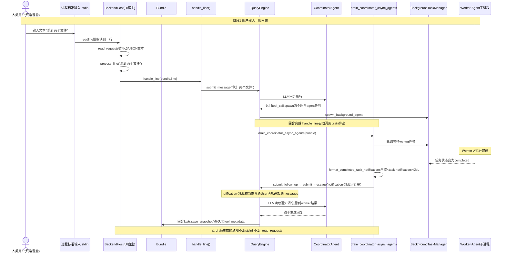
```mermaid
sequenceDiagram
    actor Human as 人类用户(终端键盘)
    participant Stdin as 进程标准输入 stdin
    participant BackendHostUI as BackendHost(UI宿主)
    participant Bundle
    participant HandleLine as handle_line()
    participant QueryEngine
    participant CoordinatorAgent
    participant Drain as drain_coordinator_async_agents
    participant TaskManager as BackgroundTaskManager
    participant Worker as Worker‑Agent子进程

    Note over Human,Worker: 阶段1 用户输入一条问题
    Human->>Stdin: 输入文本 "统计两个文件"
    Stdin->>BackendHostUI: readline阻塞读到一行
    BackendHostUI->>BackendHostUI: _read_requests循环,非JSON文本
    BackendHostUI->>BackendHostUI: _process_line("统计两个文件")
    BackendHostUI->>HandleLine: handle_line(bundle,line)
    HandleLine->>QueryEngine: submit_message("统计两个文件")
    QueryEngine->>CoordinatorAgent: LLM回合执行
    CoordinatorAgent-->>QueryEngine: 返回tool_call,spawn两个后台agent任务
    QueryEngine->>TaskManager: spawn_background_agent

    Note over QueryEngine,Drain: 回合完成,handle_line自动调用drain排空
    HandleLine->>Drain: drain_coordinator_async_agents(bundle)
    Drain->>TaskManager: 轮询等待worker任务

    Note over Worker: Worker‑A执行完成
    Worker-->>TaskManager: 任务状态变为completed
    Drain->>Drain: format_completed_task_notifications生成<task‑notification>XML
    Drain->>QueryEngine: submit_follow_up → submit_message(notification‑XML字符串)

    Note over QueryEngine: notification‑XML被当做普通User消息追加进messages
    QueryEngine->>CoordinatorAgent: LLM读取通知消息,看到worker结果
    CoordinatorAgent-->>QueryEngine: 助手生成回复
    QueryEngine->>Bundle: 回合结束,save_snapshot()持久化tool_metadata

    Note over Drain,BackendHostUI: ⚠️ drain生成的通知不走stdin! 不走_read_requests
```
**当某次 `submit_message` 的文本里含 `<task-notification>` 时（文本须由前端/编排层/用户注入，而非 TaskManager 自动生成）**，后续流程为：`run_query` → LLM 按 Coordinator 提示词解析 → 可能继续派生 worker / `send_message` / 直接答复。

**关键点**:
- ✅ XML 与plain 文本在 `submit_message` 中**同等**构造为 user message（`from_user_text`）。
- ✅ 主会话**同一 `QueryEngine`** 内 `_messages` 连续；**非**worker 退出自动触发。
- ✅ Worker 侧完整复杂任务仍在子进程内执行；主侧汇总依赖**下一轮**输入或 **§5.4** 队列。

上文 `query_engine.py` 节选已表明：**不存在**「若为 `<task-notification>` 则单独分支」；与源码不符的旧伪代码（`_monitor_task` / `_write_to_parent_stdin`）已删除。实际 watcher 为 `_watch_process`：**仅** `wait`、写日志、更新 `TaskRecord`，不向父进程 stdin 推送。

---

#### 步骤4: LLM解析notification并决定下一步（提示词语义）

```python
# src/openharness/coordinator/coordinator_mode.py:286-316
# Prompt中嵌入的delegation指令:

When calling agent tool:
- Do not use one worker to check on another. Workers will notify you when they are done.
- Do not use workers to trivially report file contents or run commands. Give them higher-level tasks.
- Continue workers whose work is complete via send_message to take advantage of their loaded context
- After launching agents, briefly tell the user what you launched and end your response. 
  Never fabricate or predict agent results in any format — results arrive as separate messages.

### agent Results

Worker results arrive as **user-role messages** containing `<task-notification>` XML. 
They look like user messages but are not. Distinguish them by the `<task-notification>` opening tag.

Format:
```xml
<task-notification>
<task-id>{{agentId}}</task-id>
<status>completed|failed|killed</status>
<summary>{{human-readable status summary}}</summary>
<result>{{agent's final text response}}</result>
<usage>
  <total_tokens>N</total_tokens>
  <tool_uses>N</tool_uses>
  <duration_ms>N</duration_ms>
</usage>
</task-notification>
```

- `<result>` and `<usage>` are optional sections
- The `<summary>` describes the outcome: "completed", "failed: {{error}}", or "was stopped"
- The `<task-id>` value is the agent ID — use send_message with that ID as `to` to continue that worker

以上 **user-role** 片段须通过某次 **`submit_message`** 进入历史（编排层 / 用户 / §5.4）；内核不会在 worker 退出时自动生成。

**LLM行为示例**（须先满足上文注入来源，示例方为可达）:

```python
# LLM看到notification后的响应:

# 收到第一个notification:
User: <task-notification>
  <task-id>agent-a1b</task-id>
  <status>completed</status>
  <summary>Agent "研究北京人口" completed</summary>
  <result>北京市2014-2024年人口从2151万增长到2185万,年均增长率0.15%...</result>
</task-notification>

Assistant: 收到北京人口数据。现在我需要研究上海人口以进行对比。

agent(description="研究上海人口", subagent_type="worker", prompt="分析上海市2014-2024年人口数据...")

# 收到第二个notification:
User: <task-notification>
  <task-id>agent-c2d</task-id>
  <status>completed</status>
  <summary>Agent "研究上海人口" completed</summary>
  <result>上海市2014-2024年人口从2425万增长到2487万,年均增长率0.25%...</result>
</task-notification>

Assistant: 现在我有两个城市的数据,可以生成综合分析报告。

基于数据分析:
- 北京: 2151万 → 2185万 (增长率0.15%/年)
- 上海: 2425万 → 2487万 (增长率0.25%/年)

差异原因:
1. 户籍政策: 北京严格控制户口迁入
2. 经济结构: 上海外来务工人员更多
3. 城市规划: 上海扩张速度更快

[最终综合报告...]
```

---

### 5.4 应用层轮询模式 (测试代码示例)

在实际应用中,如果需要等待所有子Agent完成,可以使用轮询模式:

```python
import asyncio
from collections import deque
from time import monotonic
from typing import List

from your_project.engine.query_engine import QueryEngine
from your_project.runtime.bundle import Bundle
from your_project.runtime.drain_coordinator import drain_coordinator_async_agents


async def run_coordination_until_idle(
        bundle: Bundle,
        initial_user_text: str,
        *,
        max_queue_rounds: int = 32,
        poll_interval: float = 0.5,
        task_timeout_s: float = 900.0,
) -> int:
   """
   应用层标准实现：
   使用官方 drain_coordinator_async_agents 完成后台agent等待 + notification注入，
   自动维护 tool_metadata.async_agent_tasks + SessionBackend快照持久化。

   Returns:
       处理的队列轮次数(含首轮用户问题)。
   """
   engine: QueryEngine = bundle.engine
   q: deque[str] = deque([initial_user_text])
   rounds = 0

   while q and rounds < max_queue_rounds:
      rounds += 1
      msg = q.popleft()

      # 阶段1: 提交一条消息，执行一轮Agent回合
      events: list[object] = []
      async for _event in engine.submit_message(msg):
         events.append(_event)

      # 阶段2: 【官方标准排空入口】
      # drain内部自动: 轮询等待所有spawned后台任务完成 → 生成通知 → submit_follow_up回合 → save_snapshot
      await drain_coordinator_async_agents(
         bundle,
         prompt_seed=msg,
         print_system=lambda s: None,       # 测试环境静默回调；生产传真实UI打印
         render_event=lambda ev: None,      # 测试环境事件渲染回调
         announce_waiting=False,
         poll_interval=poll_interval,
         task_timeout_s=task_timeout_s,
      )

      # drain跑完之后:
      # 如果drain产生了follow‑up通知回合，控制权已经交还engine；
      # 若你还需要继续接收用户侧新消息，可在此扩展；
      # 在drain模式下不需要你手动把notification xml塞回deque队列！

      # drain内部已经闭环完成:
      # 1. _wait_for_terminal_tasks() 轮询等待后台任务
      # 2. format_completed_task_notifications() 生成通知
      # 3. submit_follow_up 提交通知消息给engine执行LLM回合
      # 4. session_backend.save_snapshot() 持久化 tool_metadata.async_agent_tasks

   return rounds

```

**关键点**:
- ✅ 应用层负责轮询,Engine本身不阻塞
- ✅ 每0.5s检查一次任务状态
- ✅ 完成后生成notification并加入队列
- ✅ 支持超时保护(默认15分钟)

---

### 5.4.1 完整流程总结:子Agent输出后主Agent继续Loop

本节总结了从子Agent完成到主Agent继续执行的完整流程,涵盖代码实现、数据流和关键设计决策。

#### 核心架构原则

| 原则 | 说明 |
|------|------|
| **非阻塞派生** | `agent()`工具立即返回,不等待Worker完成 |
| **元数据追踪** | 通过`tool_metadata["async_agent_tasks"]`记录所有pending任务 |
| **主动轮询** | Coordinator模式自动轮询TaskManager检测任务完成 |
| **XML注入** | 将Worker输出格式化为`<task-notification>`并调用`submit_message()` |
| **多轮迭代** | LLM看到notification后决定下一步行动,可能继续派生新Worker |
| **状态标记** | 使用`notification_sent`字段避免重复处理 |

#### 完整数据流图

```
┌─────────────────────────────────────────────────────────────────────┐
│                         用户输入阶段                                  │
└─────────────────────────────────────────────────────────────────────┘
                                    │
                                    ▼
┌─────────────────────────────────────────────────────────────────────┐
│                    主Agent Loop (Turn N)                             │
│                                                                      │
│  1. submit_message(user_input)                                      │
│  2. run_query() → LLM推理                                           │
│  3. LLM决定: agent(description="研究X", prompt="...")               │
│  4. agent_tool.execute()                                            │
│     ├─ create_agent_task() → 启动Worker子进程                        │
│     └─ record_async_agent_task(task_id, agent_id)                   │
│        → tool_metadata["async_agent_tasks"].append({                │
│             "task_id": "task_abc123",                               │
│             "agent_id": "agent-research-x",                         │
│             "description": "研究X",                                 │
│             "notification_sent": False,  ← 关键字段                  │
│             "status": "running"                                     │
│           })                                                        │
│  5. 本轮结束,返回控制权给UI                                          │
└─────────────────────────────────────────────────────────────────────┘
                                    │
                                    ▼
┌─────────────────────────────────────────────────────────────────────┐
│                     Coordinator自动轮询阶段                           │
│                                                                      │
│  drain_coordinator_async_agents(bundle)                            │
│  while True:                                                        │
│      pending = _pending_async_agent_entries(tool_metadata)          │
│      if not pending: break  # 没有pending任务,退出                   │
│                                                                      │
│      completed = _wait_for_completed_async_agent_entries()          │
│      → 每0.1秒轮询一次TaskManager                                    │
│      → 检查每个pending task的状态                                    │
│      → 当至少一个task进入终态(completed/failed/killed)时返回         │
│                                                                      │
│      notification_xml = _format_completed_task_notifications()      │
│      → 读取Worker输出: manager.read_task_output(task_id)            │
│      → 构建TaskNotification对象                                     │
│      → format_task_notification() → XML字符串                       │
│      → 标记entry["notification_sent"] = True                        │
│                                                                      │
│      submit_message(notification_xml)  ← ⚡ 触发新一轮Agent Loop    │
└─────────────────────────────────────────────────────────────────────┘
                                    │
                                    ▼
┌─────────────────────────────────────────────────────────────────────┐
│                    主Agent Loop (Turn N+1)                           │
│                                                                      │
│  1. submit_message(notification_xml)                                │
│     → ConversationMessage.from_user_text(notification_xml)          │
│     → messages.append(user_message_with_xml)                        │
│                                                                      │
│  2. run_query() → LLM推理                                           │
│     → System Prompt包含Coordinator指令:                              │
│       "Worker results arrive as <task-notification> XML..."         │
│                                                                      │
│  3. LLM看到notification,决定下一步:                                  │
│     选项A: 继续派生新Worker                                          │
│       → agent(description="研究Y", ...)                             │
│       → 回到Coordinator轮询阶段                                     │
│                                                                      │
│     选项B: 使用send_message与已完成Worker交互                        │
│       → send_message(to="agent-research-x", message="...")         │
│       → Worker继续执行新指令                                        │
│                                                                      │
│     选项C: 综合所有结果,给出最终答案                                 │
│       → TextBlock("基于所有Worker的研究结果...")                    │
│       → Agent Loop结束                                              │
│                                                                      │
│  4. 如果LLM又派生了新Worker:                                         │
│     → 回到Coordinator轮询阶段                                       │
│     → 重复整个流程                                                  │
└─────────────────────────────────────────────────────────────────────┘
                                    │
                                    ▼
┌─────────────────────────────────────────────────────────────────────┐
│                          最终输出阶段                                 │
│                                                                      │
│  当LLM给出TextBlock(不再派生Worker):                                 │
│  → AssistantTurnComplete事件                                        │
│  → UI显示最终答案                                                    │
│  → 保存session快照(包含tool_metadata)                               │
└─────────────────────────────────────────────────────────────────────┘
```

#### 关键代码路径

**1. 记录异步任务** (`record_async_agent_task`):
```python
# src/openharness/tools/agent_tool.py
def record_async_agent_task(
    tool_metadata: dict[str, object],
    task_id: str,
    agent_id: str,
    description: str,
) -> None:
    """记录一个新派生的异步Agent任务。"""
    if "async_agent_tasks" not in tool_metadata:
        tool_metadata["async_agent_tasks"] = []
    
    tool_metadata["async_agent_tasks"].append({
        "task_id": task_id,
        "agent_id": agent_id,
        "description": description,
        "notification_sent": False,  # ← 初始状态
        "status": "running",
    })
```

**2. 检测pending任务** (`_pending_async_agent_entries`):
```python
# src/openharness/ui/app.py:58-67
def _pending_async_agent_entries(tool_metadata):
    """提取尚未发送notification的pending任务。"""
    pending = []
    for entry in _async_agent_task_entries(tool_metadata):
        if not bool(entry.get("notification_sent")):  # ← 关键过滤
            pending.append(entry)
    return pending
```

**3. 轮询等待完成** (`_wait_for_completed_async_agent_entries`):
```python
# src/openharness/ui/app.py:81-105
async def _wait_for_completed_async_agent_entries(tool_metadata):
    """轮询直到至少一个任务进入终态。"""
    manager = get_task_manager()
    while True:
        pending = _pending_async_agent_entries(tool_metadata)
        if not pending:
            return []
        
        completed = []
        for entry in pending:
            task = manager.get_task(entry["task_id"])
            if task and task.status in ("completed", "failed", "killed"):
                entry["status"] = task.status
                entry["return_code"] = task.return_code
                completed.append(entry)
        
        if completed:
            return completed  # ← 至少一个完成,立即返回
        
        await asyncio.sleep(0.1)  # ← 短暂休眠
```

**4. 生成notification** (`_format_completed_task_notifications`):
```python
# src/openharness/ui/app.py:108-134
def _format_completed_task_notifications(completed):
    """为每个完成的任务生成task-notification XML。"""
    manager = get_task_manager()
    notifications = []
    
    for entry in completed:
        task_id = entry["task_id"]
        output = manager.read_task_output(task_id, max_bytes=8000)
        
        notification = TaskNotification(
            task_id=entry["agent_id"],
            status=entry["status"],
            summary=_build_async_task_summary(entry),
            result=output or None,
        )
        notifications.append(format_task_notification(notification))
        
        entry["notification_sent"] = True  # ← 标记已发送
    
    return "\n\n".join(notifications)
```

**5. 注入并继续Loop** (`_submit_print_follow_up`):
```python
# src/openharness/ui/app.py:137-174
async def _submit_print_follow_up(bundle, message, ...):
    """提交消息并执行Agent Loop。"""
    # 构建system prompt
    system_prompt = build_runtime_system_prompt(...)
    bundle.engine.set_system_prompt(system_prompt)
    
    # ⚡ 执行Agent Loop
    async for event in bundle.engine.submit_message(message):
        await render_event(event)
    
    # 保存session
    bundle.session_backend.save_snapshot(...)
```

#### 状态转换图

```
tool_metadata["async_agent_tasks"][i] 状态机:

    [初始状态]
         │
         │ record_async_agent_task()
         ▼
    {notification_sent: False,
     status: "running"}
         │
         │ _wait_for_completed_async_agent_entries()
         │ (检测到TaskManager中task进入终态)
         ▼
    {notification_sent: False,
     status: "completed"/"failed"/"killed",
     return_code: 0/非0}
         │
         │ _format_completed_task_notifications()
         │ (生成XML并标记)
         ▼
    {notification_sent: True,  ← 不会再被_pending_检测到
     status: "completed",
     notified_status: "completed",
     return_code: 0}
```

#### 时序对比:传统同步 vs OpenHarness异步

| 维度 | 传统同步模式 | OpenHarness异步模式 |
|------|------------|-------------------|
| **派生方式** | 阻塞等待Worker完成 | 立即返回,后台运行 |
| **结果获取** | 工具调用直接返回结果 | 轮询TaskManager + XML注入 |
| **主Agent行为** | 空闲等待 | 可继续工作或结束本轮 |
| **通知机制** | 同步返回值 | `<task-notification>` XML |
| **Loop继续** | 同一轮内继续 | 新一轮`submit_message()` |
| **并发能力** | 顺序执行多个Worker | 并行派生,统一等待 |
| **用户体验** | 长时间等待无反馈 | 实时显示进度 |
| **复杂度** | 简单但低效 | 复杂但高效 |

#### 设计优势

1. **解耦派生与结果**: Worker执行与主Agent Loop完全解耦,互不阻塞
2. **灵活控制**: 可选择等待所有Worker或中途干预
3. **状态透明**: `tool_metadata`清晰记录所有任务状态
4. **可扩展**: 易于添加新的通知策略(如WebSocket推送)
5. **容错性强**: 单个Worker失败不影响其他Worker和主Agent
6. **符合LLM思维**: XML格式便于LLM理解和解析

#### 常见问题

**Q1: 为什么不用WebSocket或EventBus推送notification?**

A: 当前设计选择轮询模式的原因:
- ✅ 简单可靠,无需额外基础设施
- ✅ 与现有架构无缝集成
- ✅ 易于调试和测试
- ⚠️ 未来可优化为混合模式(轮询+推送)

**Q2: 如果Worker执行时间很长,会一直阻塞吗?**

A: 不会阻塞主Agent Loop:
- 主Agent在派生Worker后立即结束本轮
- Coordinator轮询是**异步**的,不阻塞UI
- 用户可随时中断或发送新消息
- 可配置`poll_interval_seconds`调整频率

**Q3: 如何避免重复处理同一个notification?**

A: 通过`notification_sent`字段:
- 生成XML后立即标记为`True`
- `_pending_async_agent_entries()`过滤掉已发送的任务
- 即使多次轮询也不会重复注入

**Q4: 如果LLM在收到notification后又派生新Worker怎么办?**

A: 这正是设计的预期行为:
- Coordinator轮询是`while True`循环
- 每次`submit_message()`后重新检查pending任务
- 支持多轮迭代,直到LLM不再派生Worker

**Q5: 非Coordinator模式如何处理子Agent结果?**

A: 非Coordinator模式需要手动处理:
- 使用`task_output(task_id="...")`工具读取结果
- 或使用`/agents`命令查看状态
- 或由外部编排层实现类似Coordinator的逻辑

#### Coordinator drain：`tool_metadata` 判定逻辑、多任务与双 Agent 演示
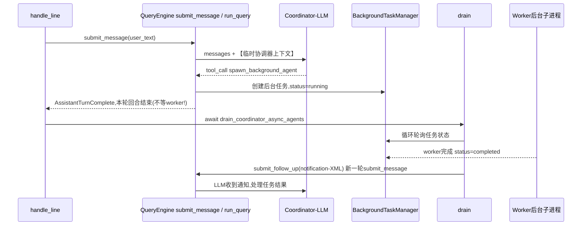
```mermaid
sequenceDiagram
    participant H as handle_line
    participant QE as QueryEngine submit_message / run_query
    participant LLM as Coordinator‑LLM
    participant TM as BackgroundTaskManager
    participant Drain as drain
    participant W as Worker后台子进程

    H->>QE: submit_message(user_text)
    QE->>LLM: messages + 【临时协调器上下文】
    LLM-->>QE: tool_call spawn_background_agent
    QE->>TM: 创建后台任务,status=running
    QE-->>H: AssistantTurnComplete,本轮回合结束(不等worker!)
    H->>Drain: await drain_coordinator_async_agents
    Drain->>TM: 循环轮询任务状态
    W-->>TM: worker完成 status=completed
    Drain->>QE: submit_follow_up(notification‑XML) 新一轮submit_message
    QE->>LLM: LLM收到通知,处理任务结果
```
与 [ARCHITECTURE_TASKS_AUTH.md](ARCHITECTURE_TASKS_AUTH.md) 中 **「Coordinator drain：`tool_metadata` 判定与多 Task（摘要）」** 互为补充（任务/Hooks 语境见该文档）。

本节将 `drain_coordinator_async_agents` 与 `tool_metadata` 的协作收束为**可执行心智模型**，与上文「辅助函数详解」中的伪代码一一对应。实现以 `src/openharness/ui/coordinator_drain.py` 为准；调用方见 §5.0。

##### 1) 待办集合：`_pending_async_agent_entries`

- **数据源**：`tool_metadata` 中经 `_async_agent_task_entries` 归一后的条目列表。生产路径上主要为 **`record_async_agent_task()`** 写入的 **`async_agent_tasks`**（派生 `agent` 工具时追加）；若另有 Hook/UI 写入同构字段，以实现为准。
- **规则**：仅保留 `task_id` 非空且 **`notification_sent` 为假** 的 entry。已发送过 notification 的 entry **不再进入** pending，后续轮询**不会**再次为同一 task 注入 XML。

##### 2) 终态判定：`_wait_for_completed_async_agent_entries`

- **权威来源**：`get_task_manager().get_task(task_id)` 返回的 **`TaskRecord.status`**，终态为 **`completed` / `failed` / `killed`**（即 `_TERMINAL_TASK_STATUSES`，见上文伪代码）。
- **内部循环**：每隔 **`poll_interval_seconds`**（默认约 `0.1`）扫描当前 **pending** 中的每一条；将进入终态的 entry 归入列表 **`completed`**。
- **同一轮扫描内**：若有 **多个** pending 条目均已进入终态，**一次 `return`** 即可包含 **多个** entry。
- **`get_task` 为 `None`**：按上文伪代码将该 entry 标为已处理，避免无限等待。

##### 3) 发送与去重：`_format_completed_task_notifications`

- 仅处理本次 **`completed`** 列表中的 entry：读日志、`format_task_notification`，然后将对应 entry 置 **`notification_sent = True`**（及 `notified_status` 等）。
- 多条 XML 使用 **`"\n\n"`** 拼接后 **一次性** `submit_message`，LLM 可在同一轮看到多条 `<task-notification>`。

##### 4) 多任务时外层 `while` 与单次 `_wait` 的关系

| 场景 | 行为 |
|------|------|
| Task A、B 均在 pending，**仅 A 先到终态** | 首次 `_wait_for_completed_async_agent_entries` 返回 **`[A]`**；格式化后仅 A **`notification_sent=True`**；`submit_message(XML_A)`；下一轮 `_pending_async_agent_entries` 仅剩 **B** |
| Task A、B **在同一轮 polling 窗口内均已终态** | 单次 `_wait` 返回 **`[A, B]`**；一次格式化将两条均标记已发送；**一次** `submit_message(XML_A + "\n\n" + XML_B)`；随后 `_pending` 为空，`drain_coordinator_async_agents` **`return`** |

因此 **并非**「每个 task 完成都严格对应一次外层 `while` 迭代」：**一次 `_wait` 可能批量返回多个终态**；但 **每个 task 的 notification 只消费一次**（靠 **`notification_sent`**）。

##### 5) 从 UI 启动到 `_drain` 结束的整体节奏（创建 2 个 agent，忽略 Worker 子进程内部）

**前置**：`is_coordinator_mode()` 为真；用户已进入 Coordinator 会话。

| 阶段 | 调用 / 事件（主进程；不展开子进程内 `run_query`） |
|------|---------------------------------------------------|
| T0 | 进程入口 → 构造 **`bundle`**（含 **`QueryEngine`**、`tool_metadata`）→ 事件循环运行 UI 主路径 |
| T1 | 用户提交一行 → **`engine.submit_message(user_text)`** → **`run_query`** … |
| T2 | 本轮 LLM **两次**调用 **`agent()`** → **`record_async_agent_task`** ×2 → **`tool_metadata["async_agent_tasks"]`** 增加两条，`notification_sent=False` |
| T3 | 本轮主会话 **`run_query`** 结束（工具均已返回）→ UI 调用 **`await drain_coordinator_async_agents(bundle, …)`** |
| T4 | **`_pending_async_agent_entries`** → `[entry_A, entry_B]` |
| T5 | **`await _wait_for_completed_async_agent_entries`** → **`_format_completed_task_notifications`** → **`await _submit_print_follow_up`** → **`engine.submit_message(XML…)`** → 内层再次 **`run_query`** |
| T6 | **`_drain` 外层 `while`**：若仍有未发送 pending，重复 T4–T5；否则 **`return`** |
| T7 | UI 回到等待下一行输入或会话收尾 |

```mermaid
sequenceDiagram
    actor UI as UI‑BackendHost (主进程入口)
    participant BUNDLE as Bundle<br/>(QueryEngine + tool_metadata)
    participant QE as QueryEngine.submit_message / run_query
    participant LLM as LLM‑Coordinator
    participant DRAIN as drain_coordinator_async_agents
    participant TM as BackgroundTaskManager

    Note over UI,TM: T0 进程启动初始化
    UI->>BUNDLE: 构造 Bundle(QueryEngine,tool_metadata)
    Note over UI: 进入事件循环，等待用户输入

    Note over UI,TM: T1 用户提交一行文本
    UI->>QE: engine.submit_message(user_text)
    QE->>LLM: run_query 会话ReAct循环

    Note over UI,TM: T2 LLM两次 agent 调用,登记后台任务
    LLM-->>QE: tool‑call agent() #1
    QE->>BUNDLE: record_async_agent_task<br/>async_agent_tasks[A],notification_sent=False
    LLM-->>QE: tool‑call agent() #2
    QE->>BUNDLE: record_async_agent_task<br/>async_agent_tasks[B],notification_sent=False

    Note over UI,TM: T3 本轮主会话 run_query 结束，进入drain排空
    QE-->>UI: run_query / submit_message 返回
    UI->>DRAIN: await drain_coordinator_async_agents(bundle)

    Note over UI,TM: T4 取出待处理异步任务列表
    DRAIN->>BUNDLE: pending_async_agent_entries()
    BUNDLE-->>DRAIN: [entry_A, entry_B]

    Note over UI,TM: T5 等待任务终态 → 生成通知XML → 内层submit_message
    DRAIN->>TM: _wait_for_completed_async_agent_entries()<br/>轮询等待A、B完成
    TM-->>DRAIN: A,B 到达终态 completed
    DRAIN->>DRAIN: _format_completed_task_notifications<br/>生成notification‑XML
    DRAIN->>QE: _submit_print_follow_up<br/>engine.submit_message(XML字符串)
    QE->>LLM: 内层 run_query(通知消息)

    Note over UI,TM: T6 drain外层循环检查剩余pending任务
    alt 仍存在未发送pending任务
        DRAIN->>BUNDLE: pending_async_agent_entries()
        BUNDLE-->>DRAIN: 剩余条目
        DRAIN->>TM: 重复等待‑通知‑submit_message流程
    else 无剩余pending任务
        DRAIN-->>UI: drain协程return，排空完成
    end

    Note over UI,TM: T7 UI回到空闲等待下一条用户输入
    Note over UI: UI主循环继续阻塞等待stdin新输入
```
**双 Agent 分支简述**：

- **先后完成**：可能发生 **两轮**「`_wait` → 格式化 → `submit_message`」，Coordinator 各响应一轮。
- **同时完成**：可能 **一轮**「`_wait` 返回两条 → 双份 XML → **一次** `submit_message`」。

---

### 5.5 长时间运行场景处理

**问题**: 子 Agent（子进程）执行时间很长时，主会话与任务侧各自如何表现？

**与实现对齐的要点**:

1. **主会话 `run_query` 不阻塞在 worker 上**：`agent` 工具返回后，本轮用户输入内的循环可按模型行为结束或继续。
2. **`BackgroundTaskManager._watch_process`** 在子进程退出时更新状态并写日志；**不会**因此自动 `submit_message`。
3. **「延迟注入」**：若指 **无需用户再打字的自动 XML 注入**，**默认内核路径不提供**；若实现 **§5.4 应用层队列**，则可由编排代码在轮询到终态后构造文本并 `submit_message`。
4. **用户或渠道侧**：同一后端进程未退出时，用户可再发一条消息，主 **`QueryEngine` 仍为同一实例**，`_messages` 连续。

**示例时间线（强调：自动注入仅在使用应用层编排时成立）**:

```
T=0s:    用户：委派任务
T=1s:    主会话：派生多个 worker，工具返回 Spawned…
T=2s:    主会话本轮可结束；worker 在子进程内长时间运行
T=600s:  某 worker 退出 → TaskManager 标记 completed，日志可阅
         （若无 §5.4）主会话不会因此单独醒 → 需用户再发 / task_output / 编排队列注入
```

**查询与辅助命令**（具体以当前工具注册为准）:

```bash
/agents
/agents show <TASK_ID>
# 模型侧可读 worker 输出的工具（若已注册）：task_output(task_id=...)
```

---

### 5.6 主会话连续性与上下文恢复

| 场景 | 是否新建 `QueryEngine` | 上下文 |
|------|------------------------|--------|
| 同一 backend 进程、用户再次发送一行 | **否**，同一实例 | `_messages` 已在内存中延续 |
| 退出进程后重新启动 ohmo / openharness | **是**，新实例 | `SessionBackend` / ohmo `.ohmo/sessions` 快照 **`restore_messages` → `load_messages`** |
| ohmo 网关同一 `session_key` | **池内复用 `RuntimeBundle`**（见 `OhmoSessionRuntimePool`） | 会话快照可按 `session_key` 加载 |

---

### 5.7 Swarm「信箱」与通道消息（非电子邮件、非 Redis）

- **`TeammateMailbox`**（`swarm/mailbox.py`）：**本机目录**下按 JSON 文件存储消息（如 `~/.openharness/teams/<team>/agents/<agent_id>/inbox/`），用于 **in-process / 文件信箱**语义；**不是** SMTP 邮件。
- **渠道网关**：父进程内 **`MessageBus`** 为 **`asyncio.Queue`**，非 Redis pub/sub。
- **Redis**：非 OpenHarness 核心消息路径的默认依赖。

---

### 5.8 「复杂任务」能否完成？与全自动编排的区别

- **能**：子进程 Worker 内可执行完整多轮 ReAct，重活可在子侧独立完成；主会话可通过 **下一轮** `submit_message`、`task_output` / `/agents`、或 **§5.4** 编排队列拉齐结果。
- **不同于「全自动 supervisor」**：单次用户输入链路内，**默认没有**「worker exit → 自动再次 `submit_message`」；若产品需要「无人值守一直到汇总」，应在 **应用层** 实现 §5.4 或独立调度器。**这不等于**整个 Harness 无法完成复杂任务，而是 **闭环方式为多轮 / 拉取 / 编排，而非内核单轮内推送**。

---

### 5.9 设计优势总结

| 特性 | 传统同步模式 | OpenHarness异步模式 |
|------|------------|-------------------|
| **响应性** | ❌ 阻塞等待子Agent完成 | ✅ 立即返回,主Agent可继续工作 |
| **并发性** | ❌ 顺序执行多个子Agent | ✅ 并行派生多个子Agent |
| **用户体验** | ❌ 长时间等待无反馈 | ✅ 实时显示进度,可中途交互 |
| **资源利用** | ❌ 主Agent空闲等待 | ✅ 主Agent可处理其他任务 |
| **容错性** | ❌ 单个子Agent失败影响全局 | ✅ 独立监控,失败不影响其他 |
| **可扩展性** | ❌ 受限于单次调用时长 | ✅ 支持小时级长时间任务 |

**核心价值**:
- 🚀 **高性能**: 多子Agent并行执行,总耗时=max(各Agent耗时),而非sum
- 💬 **好体验**: 用户无需等待,可随时查询进度或干预
- 🛡️ **高可靠**: 子Agent失败不影响主Agent和其他子Agent
- ⏱️ **长任务**: 支持超长时间任务(小时级),无超时限制

---

## 6. 工具执行策略

### 5.1 单工具串行执行

```python
async def _execute_tool_call(
    context: QueryContext,
    tool_name: str,
    tool_id: str,
    tool_input: dict[str, object],
) -> ToolResult:
    """执行单个工具调用。"""
    
    # Step 1: 查找工具
    tool = context.tool_registry.get(tool_name)
    if tool is None:
        return ToolResult(
            output=f"Error: Unknown tool '{tool_name}'",
            is_error=True,
        )
    
    # Step 2: PreToolUse Hooks
    hook_result = await context.hook_executor.execute_pre_tool_use_hooks(
        tool_name=tool_name,
        tool_input=tool_input,
    )
    if hook_result.blocked:
        return ToolResult(
            output=f"Blocked by hook: {hook_result.reason}",
            is_error=True,
        )
    
    # Step 3: 权限检查
    decision = context.permission_checker.evaluate(
        tool_name=tool_name,
        is_read_only=tool.is_read_only,
        file_path=tool_input.get("file_path"),
        command=tool_input.get("command"),
    )
    
    if not decision.allowed:
        if decision.requires_approval:
            # 请求用户审批
            approved = await ask_user_permission(
                context, tool_name, decision.reason
            )
            if not approved:
                return ToolResult(
                    output=f"User denied: {decision.reason}",
                    is_error=True,
                )
        else:
            return ToolResult(
                output=f"Denied: {decision.reason}",
                is_error=True,
            )
    
    # Step 4: 执行工具
    try:
        result = await tool.execute(tool_input, context)
    except Exception as e:
        return ToolResult(
            output=f"Error executing {tool_name}: {str(e)}",
            is_error=True,
        )
    
    # Step 5: PostToolUse Hooks
    await context.hook_executor.execute_post_tool_use_hooks(
        tool_name=tool_name,
        tool_result=result,
    )
    
    return result
```

### 5.2 多工具并发执行

```python
# 当LLM返回多个tool_use时,并发执行
if len(tool_calls) > 1:
    # 并发执行所有工具
    results = await asyncio.gather(
        *[
            _execute_tool_call(
                context=context,
                tool_name=call.name,
                tool_id=call.id,
                tool_input=call.input,
            )
            for call in tool_calls
        ],
        return_exceptions=True,  # 某个工具失败不影响其他工具
    )
    
    # 处理异常
    tool_results = []
    for i, result in enumerate(results):
        if isinstance(result, Exception):
            tool_results.append(
                ToolResult(
                    output=f"Error: {str(result)}",
                    is_error=True,
                )
            )
        else:
            tool_results.append(result)
else:
    # 单工具,顺序执行
    result = await _execute_tool_call(...)
    tool_results = [result]
```

**设计要点**:
- ⚡ **并发加速**: 多个工具并行执行,减少总耗时
- 🛡️ **容错**: `return_exceptions=True`,某个工具失败不影响其他
- 🔄 **独立性**: 每个工具独立执行,无共享状态
- 📊 **结果聚合**: 按顺序收集所有结果,保持与tool_calls对应

---

## 9. 错误处理与恢复

### 9.1 错误分类与处理策略

| 错误类型 | 检测方式 | 处理策略 | 示例 |
|---------|---------|---------|------|
| **Network Error** | `"connect" in error_msg` | 自动重试3次 | Connection timeout |
| **API Error** | 非network错误 | 返回ErrorEvent,终止 | Invalid API key |
| **Prompt Too Long** | `_is_prompt_too_long_error()` | 触发reactive压缩 | Context exceeds limit |
| **Tool Execution Error** | try-except捕获 | 返回is_error=True | File not found |
| **Permission Denied** | `decision.allowed=False` | 请求用户审批或拒绝 | Write to .ssh |

```mermaid
sequenceDiagram
    actor Human as 人类用户
    participant BH as BackendHost UI主循环(stdin监听)
    participant Bundle
    participant QE as QueryEngine submit_message / run_query
    participant LLM as Coordinator‑LLM

    Note over Human,LLM: T1 用户发起提问
    Human->>BH: 用户输入初始任务
    BH->>QE: submit_message(user_text)
    QE->>LLM: run_query开始执行
    Note over LLM: LLM判断: 需要用户确认
    LLM-->>QE: 输出自然语言问题 "是否删除该文件?(y/n)"
    QE-->>BH: AssistantTurnComplete,本轮回合结束
    BH->>BH: 回到stdin阻塞等待输入

    Note over Human,LLM: T2 用户给出确认答复
    Human->>BH: 用户输入 y
    BH->>QE: submit_message("y")
    QE->>LLM: LLM读取确认答复，继续执行后续动作
```
```mermaid
sequenceDiagram
    actor Human as 人类用户
    participant BH as BackendHost(UI stdin监听)
    participant Bundle
    participant QE as QueryEngine
    participant LLM as Coordinator‑LLM
    participant Drain as drain_coordinator_async_agents
    participant TM as BackgroundTaskManager
    participant BT as BackgroundTask
    participant Worker as Worker子进程

    Note over Human,Worker: 阶段1 用户发起任务,启动后台agent
    Human->>BH: 用户输入任务
    BH->>QE: submit_message(任务文本)
    QE->>LLM: run_query
    LLM-->>QE: tool‑call spawn_background_agent
    QE->>TM: 创建BackgroundTask,启动Worker
    QE-->>BH: 本轮会话结束
    BH->>Drain: await drain

    Note over Human,Worker: 阶段2 Worker中途请求人工确认
    Worker->>BT: IPC发送 request_user_confirmation
    BT->>TM: 更新任务状态 = waiting_for_user
    Drain->>TM: 轮询扫描任务状态
    Drain-->>Drain: 检测到 waiting_for_user
    Drain->>QE: submit_follow_up(交互通知‑XML)
    QE->>LLM: LLM解析通知,输出问题展示给用户
    QE-->>BH: AssistantTurnComplete,回合结束
    Drain-->>BH: drain暂时让出控制权
    BH->>BH: UI stdin阻塞休眠,等待用户输入

    Note over Human,Worker: 阶段3 用户输入确认答复 (用户触发点)
    Human->>BH: 键盘输入答复 y
    BH->>QE: submit_message("y")
    QE->>LLM: LLM收到用户确认
    LLM-->>QE: 生成答复指令下发给后台任务
    QE->>TM: 通过IPC发送确认结果给到BT→Worker
    Worker-->>BT: 收到确认,解除暂停继续执行
    BT->>TM: 任务回到 running
    BH->>Drain: 再次进入drain排空循环等待worker最终完成
```
```mermaid
sequenceDiagram
    actor Human as 人类用户
    participant BH as BackendHost(stdin/前端事件循环)
    participant Bundle
    participant QE as QueryEngine.submit_message
    participant RQ as run_query() Agent‑Loop
    participant LLM as LLM
    participant PC as PermissionChecker
    participant PP as permission_prompt(异步审批回调)

    Note over Human,PP: T1 用户发起任务，进入会话循环
    Human->>BH: 用户输入任务
    BH->>QE: submit_message(user_text)
    QE->>RQ: run_query启动ReAct循环
    RQ->>LLM: 请求生成响应
    LLM-->>RQ: tool_call 调用危险工具（如shell）

    Note over Human,PP: T2 安全拦截点
    RQ->>PC: permission_checker.evaluate(工具信息)
    PC-->>RQ: decision: requires_confirmation=True 需要人工审批
    RQ->>PP: await permission_prompt(tool_name,提示文本)
    Note over PP: run_query协程**此处挂起暂停**，不会往下执行工具

    Note over Human,PP: T3 系统向外发出确认弹窗事件
    PP->>BH: 发送 BackendEvent.modal_request（审批弹窗）
    BH->>Human: UI展示确认提示：Allow / Deny ?

    Note over Human,PP: T4 用户触发确认答复（关键触发点）
    Human->>BH: 用户输入 y / n 或者前端点击按钮
    BH->>BH: _read_requests收到一条 FrontendRequest.permission_response JSON指令
    BH->>PP: 解除 permission_prompt 的等待，返回布尔值 True/False

    Note over Human,PP: T5 run‑query恢复，分支执行
    alt 用户选择 Allow
        PP-->>RQ: confirmed = True
        RQ->>RQ: 执行目标工具，获取工具结果
    else 用户选择 Deny
        PP-->>RQ: confirmed = False
        RQ->>RQ: 返回权限拒绝的ToolResultBlock(错误)
    end

    Note over Human,PP: T6 结果送回LLM，回合走完
    RQ->>LLM: 将工具结果喂回LLM继续循环
    RQ-->>QE: Agent‑Loop完成 AssistantTurnComplete
    QE-->>BH: submit_message返回，控制权还给UI主循环
    BH->>BH: 回到stdin休眠等待下一行用户输入
```

**权限安全确认的答复，不走 `submit_message()`！！！**
完全不是一条路径。

## 两条通路严格区分

1. **普通用户聊天文字（问题、回答、自然对话）**

```
stdin一行文本 → _read_requests → _process_line → handle_line → engine.submit_message(文本)
```

👉 调用 submit_message

2. **工具审批答复（Allow / Deny，人工安全确认）**

```
stdin读到 JSON FrontendRequest {"type":"permission_response", …}
→ _read_requests 解析成功
→ put 进 self._request_queue
→ 唤醒被 await 挂起的 permission_prompt 协程
→ 返回布尔结果 True/False → run‑query 继续执行工具
```

👉 **全程不调用 `submit_message`**

---

# 关键源码对照（你现有的 backend_host.py）

```
async def _read_requests(self) -> None:
    raw = await asyncio.to_thread(sys.stdin.buffer.readline)
    # ...
    try:
        request = FrontendRequest.model_validate_json(payload)
    except Exception:
        # 非JSON普通文本 → 走 _process_line → submit_message
        await self._process_line(payload)
        continue
    
    # ====== JSON结构化指令分支 ======
    # permission_response、shutdown、reset_session 等在这里处理
    # 👉 不会进入 _process_line，也就永远不会调用 submit_message
```

>
> `permission_response` 属于**控制指令事件**，不属于对话消息，不走对话回合。

---

# run_query 内部等待审批的调用栈

```
submit_message
    → run_query
        → LLM 返回 tool_call
            → permission_checker.evaluate()
                → 需要确认
                    → await context.permission_prompt(tool_info)   # <--- 在这里挂起等待结果
```

`permission_prompt` 是一个回调函数，它内部逻辑大概伪代码：

```
async def permission_prompt(tool_info):
    # 1. 向前端发送弹窗事件，提示用户确认
    await emit_modal_confirm_event(tool_info)
    # 2. 阻塞等待 BackendHost 的 _request_queue 收到 permission‑response
    response = await self._request_queue.get()
    # 3. 返回 True(允许) / False(拒绝)
    return response.allow
```

当用户答复到达，只是**唤醒这个被卡住的 await**；run_query 原地继续，不会新开一轮 submit_message。

---

# 一张对比表

表格

| 交互类型 | 用户输入形式 | 是否调用 submit_message | 接收等待方 |
| --- | --- | --- | --- |
| 普通聊天、问答答复 | 纯文本字符串 | ✅是 | 下一轮 submit_message run‑query |
| 工具安全审批确认 | JSON `FrontendRequest(permission_response)` | ❌否 | `await permission_prompt`（当前正在挂起的 run‑query） |
| 后台 worker 异步交互答复 | 纯文本字符串 | ✅是 | 新一轮 submit_message + drain |

---

# 最容易踩坑的死锁陷阱

如果你在等待权限确认时，代码错误地把 y/n 当成普通文本丢进 `_process_line`，就会新开一条 submit_message；
**原来那个被挂起的 permission_prompt 永远收不到信号 → run_query 永久卡死死锁。**
```mermaid
sequenceDiagram
    actor Human as 用户
    participant BH as BackendHost(_read_requests + _request_queue)
    participant QE as QueryEngine.submit_message
    participant RQ as run_query ReAct循环
    participant PC as PermissionChecker
    participant PP as permission_prompt(等待协程)

    Note over Human,PP: 阶段1：正常会话，LLM产生危险工具调用
    Human->>BH: 输入任务文本
    BH->>QE: submit_message(task_text)
    QE->>RQ: 进入 run_query
    RQ->>LLM: 请求生成
    LLM-->>RQ: tool_call shell(危险命令)

    Note over Human,PP: 阶段2：安全检查命中需要人工确认，协程挂起
    RQ->>PC: permission_checker.evaluate(tool)
    PC-->>RQ: requires_confirmation=True
    RQ->>PP: await permission_prompt(tool_info)
    Note over PP: 👉 run_query 协程在此处暂停，交出事件循环
    PP->>BH: 发送 StatusEvent / Modal弹窗事件，展示确认提示
    PP->>PP: await self._request_queue.get()  # 阻塞等待队列信号

    Note over Human,PP: 阶段3‑A 用户输入JSON审批答复（正确路径）
    Human->>BH: stdin输入 JSON {"type":"permission_response","allow":true}
    BH->>BH: _read_requests读到一行，成功解析 FrontendRequest
    BH->>PP: _request_queue.put(permission_response)  # 入队唤醒
    PP-->>RQ: 返回确认结果 True
    RQ->>RQ: 执行shell工具
    RQ->>LLM: 工具结果送回LLM，继续ReAct循环

    Note over Human,PP: 阶段4：回合走完返回UI
    RQ-->>QE: AssistantTurnComplete
    QE-->>BH: submit_message 返回
    BH->>BH: _read_requests回到休眠等待下一行输入

    Note over Human,PP: ======错误死锁分支（高危坑点）======
    rect rgb(255, 230, 230)
        Note over Human,PP: 阶段3‑B 用户输入 y，代码错误走普通文本分支
        Human->>BH: stdin输入 y（纯文本）
        BH->>BH: 解析JSON失败 → 调用 _process_line("y")
        BH->>QE: submit_message("y")  # ❗新开一轮独立会话
        Note over PP: permission_prompt 永远收不到信号，永久卡住
    end
```


### 9.2 Prompt Too Long应急压缩

```python
except Exception as exc:
    error_msg = str(exc)
    
    # 如果是 prompt too long 错误，触发应急压缩
    if not reactive_compact_attempted and _is_prompt_too_long_error(exc):
        reactive_compact_attempted = True
        yield StatusEvent(message="Context too long, compressing..."), None
        
        # 强制压缩(忽略阈值)
        async for event, usage in _stream_compaction(
            trigger="reactive", 
            force=True
        ):
            yield event, usage
        
        messages, was_compacted = last_compaction_result
        
        if was_compacted:
            continue  # 压缩成功，重新尝试LLM调用
    
    # 其他错误,直接返回
    if "connect" in error_msg.lower() or "timeout" in error_msg.lower():
        yield ErrorEvent(message=f"Network error: {error_msg}"), None
    else:
        yield ErrorEvent(message=f"API error: {error_msg}"), None
    return
```

**设计要点**:
- 🎯 **精准检测**: 通过错误消息关键词判断是否为prompt too long
- 🔄 **自动恢复**: 触发压缩后continue,自动重试LLM调用
- 🛡️ **防无限循环**: `reactive_compact_attempted`标志防止重复压缩
- ⚡ **快速失败**: 压缩也失败时立即返回ErrorEvent

---

## 7. 用户确认机制 (Permission Confirmation)

### 7.1 核心设计原则

**问题**: 当Agent调用危险工具(如`bash`执行`rm -rf`, `write_file`修改系统文件)时,如何确保用户知情并授权?

**解决方案**: **9层权限检查链 + 交互式确认对话框 + 异步回调恢复主循环**

```python
# 关键特性:
# 1. 工具执行前经过多层权限检查
# 2. 需要确认时暂停主循环,显示UI对话框
# 3. 用户输入"y"或点击"Allow"按钮
# 4. 确认后恢复主循环,继续执行工具
# 5. 拒绝后返回错误,LLM决定下一步
```

---

### 7.2 完整协作流程图

```mermaid
sequenceDiagram
    participant User as 用户
    participant TUI as Textual UI
    participant Coordinator as 主Agent
    participant Engine as QueryEngine
    participant ToolReg as ToolRegistry
    participant PermChecker as PermissionChecker
    participant Tool as 具体工具(bash/write等)
    participant Sandbox as Sandbox Runtime
    
    Note over Coordinator,Sandbox: === 阶段1: LLM请求调用工具 ===
    
    Coordinator->>Engine: submit_message(prompt)
    Engine->>Engine: run_query() 主循环
    Engine->>Engine: 调用LLM API
    Engine->>Coordinator: yield AssistantTextDelta("我需要删除临时文件...")
    
    Engine->>Engine: 解析LLM响应
    Note over Engine: 检测到ToolUseBlock(name="bash", args={command:"rm -rf /tmp/*"})
    
    Note over Coordinator,Sandbox: === 阶段2: 权限检查链 (9层) ===
    
    Engine->>ToolReg: get("bash")
    ToolReg-->>Engine: BashTool实例
    
    Engine->>Engine: _execute_tool_call(tool_name=bash, tool_input=command:rm -rf /tmp/*)
    
    rect rgb(240, 248, 255)
        Note right of Engine: Step 1: PreToolUse Hooks
        Engine->>Engine: execute_pre_tool_use_hooks()
        alt Hook blocked
            Engine-->>Engine: return ToolResult(error="Blocked by hook")
        end
    end
    
    rect rgb(255, 250, 240)
        Note right of Engine: Step 2: 解析工具输入
        Engine->>Engine: parsed_input = tool.input_model.model_validate(tool_input)
        alt 验证失败
            Engine-->>Engine: return ToolResult(error="Invalid input")
        end
    end
    
    rect rgb(240, 255, 240)
        Note right of Engine: Step 3: 提取文件路径和命令
        Engine->>Engine: _file_path = _resolve_permission_file_path(...)
        Engine->>Engine: _command = _extract_permission_command(...)
        Note over Engine: _file_path = None<br/>_command = "rm -rf /tmp/*"
    end
    
    rect rgb(255, 240, 245)
        Note right of Engine: Step 4: 判断是否只读
        Engine->>Tool: is_read_only(parsed_input)
        Tool-->>Engine: False  # bash不是只读工具
    end
    
    rect rgb(255, 255, 240)
        Note right of Engine: Step 5-9: PermissionChecker 9层检查
        Engine->>PermChecker: evaluate(tool_name="bash", is_read_only=False,<br/>file_path=None, command="rm -rf /tmp/*")
        
        Note over PermChecker: Layer 1: Bash安全验证器
        PermChecker->>PermChecker: bash_validator.validate("rm -rf /tmp/*")
        Note over PermChecker: 检测到"rm_rf"模式 → severe pattern
        
        alt Severe pattern detected
            PermChecker-->>Engine: Decision(allowed=False, requires_confirmation=False,<br/>reason="Bash validator: Dangerous pattern 'rm -rf' detected")
        else Pattern flagged but not severe
            PermChecker-->>Engine: Decision(allowed=False, requires_confirmation=True,<br/>reason="Bash validator flagged: rm command with wildcard")
        else No bash issues
            Note over PermChecker: Layer 2: Deny规则检查
            loop 遍历deny rules
                PermChecker->>PermChecker: _matches(rule, bash, command:...)
            end
            
            alt 匹配deny rule
                PermChecker-->>Engine: Decision(allowed=False, requires_confirmation=False,<br/>reason="Blocked by deny rule")
            else 无deny匹配
                Note over PermChecker: Layer 3: Mode-based决策
                
                alt mode == "plan"
                    PermChecker-->>Engine: Decision(allowed=False, reason="Plan mode: write operations blocked")
                else mode == "auto"
                    Note over PermChecker: Layer 4: Allow规则检查
                    loop 遍历allow rules
                        PermChecker->>PermChecker: _matches(rule, bash, command:...)
                    end
                    
                    alt 匹配allow rule
                        PermChecker-->>Engine: Decision(allowed=True, reason="Matched allow rule")
                    else 无allow匹配
                        Note over PermChecker: Layer 5-9: 其他检查 (swarm, sandbox等)
                        
                        Note over PermChecker: Layer 9: Default behavior
                        PermChecker-->>Engine: Decision(allowed=False, requires_confirmation=True,<br/>reason="No rule matched for bash, asking user")
                    end
                else mode == "default"
                    Note over PermChecker: 默认需要用户确认
                    PermChecker-->>Engine: Decision(allowed=False, requires_confirmation=True,<br/>reason="Default mode requires confirmation")
                end
            end
        end
    end
    
    Note over Coordinator,Sandbox: === 阶段3: 需要用户确认 ===
    
    alt decision.requires_confirmation == True
        Engine->>TUI: await context.permission_prompt(tool_name, reason)
        Note over TUI: ⚡ 暂停主循环,等待用户输入
        
        TUI->>User: 显示PermissionScreen对话框
        Note over TUI: Panel.fit("Allow tool bash?\n\nBash validator flagged: rm command with wildcard")
        Note over TUI: [Allow] [Deny]
        
        alt 用户点击"Allow"或按"y"
            User->>TUI: 点击Allow按钮
            TUI->>TUI: dismiss(True)
            TUI-->>Engine: confirmed = True
            
            Note over Engine: ✅ 确认通过,继续执行工具
            Engine->>Tool: execute(parsed_input, context)
            Tool->>Sandbox: wrap_command_for_sandbox("rm -rf /tmp/*")
            Sandbox-->>Tool: wrapped_cmd
            Tool->>Tool: subprocess.run(wrapped_cmd)
            Tool-->>Engine: ToolResult(output="Deleted 5 files", is_error=False)
            
            Engine->>Engine: append ToolResultBlock to messages
            Engine->>Coordinator: yield ToolExecutionCompleted(output="Deleted 5 files")
            Coordinator->>User: 显示: "✅ 已删除5个临时文件"
            
            Note over Engine: 继续下一轮迭代
            Engine->>Engine: run_query() 继续循环
            
        else 用户点击"Deny"或按"n"
            User->>TUI: 点击Deny按钮
            TUI->>TUI: dismiss(False)
            TUI-->>Engine: confirmed = False
            
            Note over Engine: ❌ 确认拒绝,返回错误
            Engine->>Engine: return ToolResult(error="Permission denied for bash")
            
            Engine->>Engine: append ToolResultBlock(is_error=True) to messages
            Engine->>Coordinator: yield ToolExecutionCompleted(error="Permission denied")
            Coordinator->>User: 显示: "❌ 操作被拒绝"
            
            Note over Engine: 继续下一轮迭代 (LLM看到错误)
            Engine->>Engine: run_query() 继续循环
            Engine->>Engine: 调用LLM API (messages包含错误信息)
            LLM-->>Engine: TextBlock("抱歉,我没有权限删除文件。请手动清理或授予权限。")
            Engine->>Coordinator: yield AssistantTurnComplete
            Coordinator->>User: 显示LLM回应
        end
        
    else decision.allowed == True
        Note over Engine: ✅ 自动允许,无需确认
        Engine->>Tool: execute(parsed_input, context)
        Tool-->>Engine: ToolResult(output="...", is_error=False)
        Engine->>Coordinator: yield ToolExecutionCompleted
    
    else decision.allowed == False && !requires_confirmation
        Note over Engine: ❌ 直接拒绝,不询问用户
        Engine->>Engine: return ToolResult(error=decision.reason)
        Engine->>Coordinator: yield ToolExecutionCompleted(error=decision.reason)
    end
```

---

### 7.3 关键代码实现

#### 步骤1: 权限检查与确认提示

```python
# src/openharness/engine/query.py:868-898
async def _execute_tool_call(
    context: QueryContext,
    tool_name: str,
    tool_use_id: str,
    tool_input: dict[str, object],
) -> ToolResultBlock:
    print(f"\n🚀 EXECUTING TOOL: {tool_name}")
    print(f"   tool_use_id: {tool_use_id}")
    print(f"   input: {tool_input}")
    
    # Step 1: PreToolUse Hooks
    if context.hook_executor is not None:
        pre_hooks = await context.hook_executor.execute(
            HookEvent.PRE_TOOL_USE,
            {"tool_name": tool_name, "tool_input": tool_input},
        )
        if pre_hooks.blocked:
            return ToolResultBlock(
                tool_use_id=tool_use_id,
                content=pre_hooks.reason or f"pre_tool_use hook blocked {tool_name}",
                is_error=True,
            )
    
    # Step 2: 解析工具输入
    tool = context.tool_registry.get(tool_name)
    try:
        parsed_input = tool.input_model.model_validate(tool_input)
    except Exception as exc:
        return ToolResultBlock(
            tool_use_id=tool_use_id,
            content=f"Invalid input for {tool_name}: {exc}",
            is_error=True,
        )
    
    # Step 3: 提取文件路径和命令
    _file_path = _resolve_permission_file_path(context.cwd, tool_input, parsed_input)
    _command = _extract_permission_command(tool_input, parsed_input)
    log.debug("permission check: %s read_only=%s path=%s cmd=%s",
              tool_name, tool.is_read_only(parsed_input), _file_path, _command and _command[:80])
    
    # Step 4-9: PermissionChecker评估
    decision = context.permission_checker.evaluate(
        tool_name,
        is_read_only=tool.is_read_only(parsed_input),
        file_path=_file_path,
        command=_command,
    )
    
    # Step 10: 处理决策结果
    if not decision.allowed:
        if decision.requires_confirmation and context.permission_prompt is not None:
            # ⚡ 需要用户确认,调用permission_prompt回调
            log.debug("permission prompt for %s: %s", tool_name, decision.reason)
            confirmed = await context.permission_prompt(tool_name, decision.reason)
            
            if not confirmed:
                # 用户拒绝
                log.debug("permission denied by user for %s", tool_name)
                return ToolResultBlock(
                    tool_use_id=tool_use_id,
                    content=decision.reason or f"Permission denied for {tool_name}",
                    is_error=True,
                )
            # 用户确认,继续执行工具
        else:
            # 不需要确认,直接拒绝
            log.debug("permission blocked for %s: %s", tool_name, decision.reason)
            return ToolResultBlock(
                tool_use_id=tool_use_id,
                content=decision.reason or f"Permission denied for {tool_name}",
                is_error=True,
            )
    
    # Step 11: 执行工具
    log.debug("executing %s ...", tool_name)
    t0 = time.monotonic()
    result = await tool.execute(
        parsed_input,
        ToolExecutionContext(
            cwd=context.cwd,
            metadata={
                "tool_registry": context.tool_registry,
                "ask_user_prompt": context.ask_user_prompt,
                **(context.tool_metadata or {}),
            },
        ),
    )
    elapsed = time.monotonic() - t0
    log.debug("executed %s in %.2fs err=%s output_len=%d",
              tool_name, elapsed, result.is_error, len(result.output or ""))
    
    return ToolResultBlock(
        tool_use_id=tool_use_id,
        content=result.output,
        is_error=result.is_error,
    )
```

**关键点**:
- ✅ `decision.requires_confirmation` 为True时,调用`context.permission_prompt()`
- ✅ `permission_prompt()` 是异步函数,会暂停当前协程,等待用户输入
- ✅ 用户确认后,`confirmed=True`,继续执行工具
- ✅ 用户拒绝后,`confirmed=False`,返回错误ToolResult

**协程如何被「唤醒」（实现因宿主而异）**：Textual 路径多为 `push_screen_wait`；React 终端路径见 **§7.5.1**（`Future` + stdin `permission_response`，与聊天 `submit_line` 不同）。

---

#### 步骤2: Textual UI显示确认对话框

```python
# src/openharness/ui/textual_app.py:45-84
class PermissionScreen(ModalScreen[bool]):
    """Simple approval modal for mutating tools."""

    BINDINGS = [
        Binding("escape", "deny", "Deny"),
        Binding("y", "allow", "Allow"),  # ← 按"y"键确认
        Binding("n", "deny", "Deny"),    # ← 按"n"键拒绝
    ]

    def __init__(self, tool_name: str, reason: str) -> None:
        super().__init__()
        self._tool_name = tool_name
        self._reason = reason

    def compose(self) -> ComposeResult:
        yield Container(
            Static(
                Panel.fit(
                    f"Allow tool [bold]{self._tool_name}[/bold]?\n\n{self._reason}",
                    title="Permission Required",
                )
            ),
            Horizontal(
                Button("Allow", id="allow", variant="success"),  # ← 点击按钮确认
                Button("Deny", id="deny", variant="error"),     # ← 点击按钮拒绝
                classes="permission-actions",
            ),
            id="permission-dialog",
        )

    @on(Button.Pressed)
    def handle_button_press(self, event: Button.Pressed) -> None:
        # 按钮点击事件
        self.dismiss(event.button.id == "allow")  # True=允许, False=拒绝

    def action_allow(self) -> None:
        # 键盘"y"键事件
        self.dismiss(True)

    def action_deny(self) -> None:
        # 键盘"n"键或Escape事件
        self.dismiss(False)
```

**关键点**:
- ✅ 继承`ModalScreen[bool]`,返回值为bool类型
- ✅ 支持两种交互方式:
  - **鼠标**: 点击"Allow"或"Deny"按钮
  - **键盘**: 按"y"允许,按"n"或"Escape"拒绝
- ✅ `dismiss(value)` 关闭对话框并返回值给调用者

---

#### 步骤3: 连接UI与Engine的回调

```python
# src/openharness/ui/textual_app.py:280-320 (简化版)
class OpenHarnessTerminalApp(App[None]):
    async def _run_query(self, prompt: str) -> None:
        """执行查询并处理流式事件。"""
        
        # 定义permission_prompt回调函数
        async def permission_prompt_callback(tool_name: str, reason: str) -> bool:
            """当需要用户确认时,显示PermissionScreen对话框。"""
            
            # ⚡ 暂停当前协程,等待用户输入
            confirmed = await self.push_screen_wait(PermissionScreen(tool_name, reason))
            
            # 用户关闭对话框后,返回结果
            return confirmed
        
        # 创建QueryEngine,传入回调
        engine = QueryEngine(
            api_client=self._api_client,
            tool_registry=self._tool_registry,
            permission_checker=self._permission_checker,
            cwd=self._cwd,
            model=self._model,
            system_prompt=self._system_prompt,
            permission_prompt=permission_prompt_callback,  # ← 传入回调
        )
        
        # 执行查询
        async for event in engine.submit_message(prompt):
            if isinstance(event, AssistantTextDelta):
                self._append_to_transcript(event.text)
            elif isinstance(event, ToolExecutionCompleted):
                if event.is_error:
                    self._append_to_transcript(f"❌ Error: {event.output}")
                else:
                    self._append_to_transcript(f"✅ Success: {event.output}")
```

**关键点**:
- ✅ `permission_prompt_callback` 是异步函数,签名: `async def(tool_name: str, reason: str) -> bool`
- ✅ `push_screen_wait()` 显示模态对话框并等待用户输入
- ✅ 返回值传递给Engine的`confirmed`变量

---

#### 步骤4: 非TUI环境的自动确认

在CI/CD或非交互环境中,可以配置自动确认策略:

```python
# 示例: 自动允许所有只读工具,拒绝所有写操作
async def auto_permission_prompt(tool_name: str, reason: str) -> bool:
    READ_ONLY_TOOLS = {"read_file", "bash", "grep", "glob", "web_search"}
    
    if tool_name in READ_ONLY_TOOLS:
        print(f"✅ Auto-approved: {tool_name}")
        return True
    else:
        print(f"❌ Auto-denied: {tool_name} ({reason})")
        return False

engine = QueryEngine(
    ...,
    permission_prompt=auto_permission_prompt,
)
```

或者完全禁用确认(全自动模式):

```python
# 示例: 全自动模式,无需确认
engine = QueryEngine(
    ...,
    permission_prompt=None,  # ← 设置为None,跳过确认
)

# PermissionChecker配置为auto模式
permission_settings = PermissionSettings(mode=PermissionMode.AUTO)
permission_checker = PermissionChecker(permission_settings)
```

---

### 7.4 9层权限检查详解

```python
# src/openharness/permissions/checker.py (简化版)
class PermissionChecker:
    def evaluate(
        self,
        tool_name: str,
        is_read_only: bool,
        file_path: str | None = None,
        command: str | None = None,
    ) -> PermissionDecision:
        """9层权限检查链。"""
        
        # === Layer 1: Bash安全验证器 ===
        if tool_name == "bash" and command:
            failures = bash_validator.validate(command)
            if failures:
                severe_patterns = {"sudo", "rm_rf", "chmod_777"}
                severe_hits = [f for f in failures if f[0] in severe_patterns]
                
                if severe_hits:
                    # Severe pattern → 直接拒绝,不询问用户
                    desc = bash_validator.describe_failures(command)
                    return PermissionDecision(
                        allowed=False,
                        requires_confirmation=False,  # ← 不询问
                        reason=f"Bash validator: {desc}",
                    )
                else:
                    # Non-severe pattern → 需要用户确认
                    desc = bash_validator.describe_failures(command)
                    return PermissionDecision(
                        allowed=False,
                        requires_confirmation=True,  # ← 询问用户
                        reason=f"Bash validator flagged: {desc}",
                    )
        
        # === Layer 2: Deny规则检查 ===
        for rule in self.rules:
            if rule["behavior"] != "deny":
                continue
            if self._matches(rule, tool_name, {"file_path": file_path, "command": command}):
                return PermissionDecision(
                    allowed=False,
                    requires_confirmation=False,  # ← deny规则不询问
                    reason=f"Blocked by deny rule: {rule}",
                )
        
        # === Layer 3: Mode-based决策 ===
        if self.mode == "plan":
            # Plan模式: 拒绝所有写操作
            WRITE_TOOLS = {"write_file", "edit_file", "bash", "delete_file"}
            if tool_name in WRITE_TOOLS:
                return PermissionDecision(
                    allowed=False,
                    requires_confirmation=False,
                    reason="Plan mode: write operations are blocked",
                )
            return PermissionDecision(
                allowed=True,
                requires_confirmation=False,
                reason="Plan mode: read-only allowed",
            )
        
        if self.mode == "auto":
            # Auto模式: 只读工具自动允许,写工具需要确认
            READ_ONLY_TOOLS = {"read_file", "grep", "glob", "web_search", "web_fetch"}
            if tool_name in READ_ONLY_TOOLS or is_read_only:
                return PermissionDecision(
                    allowed=True,
                    requires_confirmation=False,
                    reason="Auto mode: read-only tool auto-approved",
                )
            # 写工具: 继续到Layer 4
        
        # === Layer 4: Allow规则检查 ===
        for rule in self.rules:
            if rule["behavior"] != "allow":
                continue
            if self._matches(rule, tool_name, {"file_path": file_path, "command": command}):
                return PermissionDecision(
                    allowed=True,
                    requires_confirmation=False,
                    reason=f"Matched allow rule: {rule}",
                )
        
        # === Layer 5-8: Swarm/Sandbox/MCP等特殊检查 ===
        # (省略,参考swarm/permission_sync.py)
        
        # === Layer 9: Default behavior ===
        # 默认行为: 需要用户确认
        return PermissionDecision(
            allowed=False,
            requires_confirmation=True,  # ← 默认询问用户
            reason=f"No rule matched for {tool_name}, asking user",
        )
```

**9层检查总结**:

| 层级 | 检查内容 | 决策逻辑 |
|------|---------|----------|
| **Layer 1** | Bash安全验证 | Severe pattern→拒绝; Non-severe→确认 |
| **Layer 2** | Deny规则 | 匹配→拒绝(不询问) |
| **Layer 3** | Mode-based | Plan→拒绝写; Auto→只读自动允许 |
| **Layer 4** | Allow规则 | 匹配→允许(不询问) |
| **Layer 5** | Swarm权限同步 | Leader决策→允许/拒绝 |
| **Layer 6** | Sandbox限制 | 超出沙箱→拒绝 |
| **Layer 7** | MCP服务器权限 | 根据MCP配置决策 |
| **Layer 8** | Skills插件权限 | 根据Skills配置决策 |
| **Layer 9** | Default | 默认需要用户确认 |

---

### 7.5 用户交互方式

#### 方式1: TUI界面 (Textual)

```
┌──────────────────────────────────────────────┐
│           Permission Required                 │
├──────────────────────────────────────────────┤
│                                              │
│  Allow tool bash?                            │
│                                              │
│  Bash validator flagged: rm command with     │
│  wildcard                                    │
│                                              │
│         [Allow]          [Deny]              │
│                                              │
└──────────────────────────────────────────────┘

快捷键:
- y: 允许
- n: 拒绝
- Escape: 拒绝
```

#### 方式2: CLI命令行

```bash
$ openharness "删除临时文件"

🤖 Agent: 我需要删除临时文件...

🔧 [Tool Requested] bash
   Command: rm -rf /tmp/*
   Reason: Bash validator flagged: rm command with wildcard

❓ Allow this operation? (y/n): y  ← 用户输入

✅ [Tool Completed] Success: bash
   Output: Deleted 5 files
```

#### 方式3: Web UI (未来扩展)

```javascript
// 伪代码: Web UI中的确认对话框
function showPermissionDialog(toolName, reason) {
    return new Promise((resolve) => {
        showModal({
            title: "Permission Required",
            message: `Allow tool ${toolName}?\n\n${reason}`,
            buttons: [
                { text: "Allow", onClick: () => resolve(true) },
                { text: "Deny", onClick: () => resolve(false) }
            ]
        });
    });
}
```

### 7.5.1 React 终端（`backend_host`）：stdin 协议与 `Future` 唤醒

（接续 §7.5「方式 1～3」之外的 **默认 `oh` + React/Ink 前端**路径。）

默认 `oh` 走 Ink/React 前端时，子进程为 **`python -m openharness --backend-only`**（`ui/backend_host.py`）。此时 `build_runtime(..., permission_prompt=self._ask_permission)`，**不是** Textual 的 `push_screen_wait`。

**机制概要**：

1. **`_execute_tool_call`** 里 `await context.permission_prompt(tool_name, decision.reason)` 进入 **`ReactBackendHost._ask_permission`**。
2. **`_ask_permission`** 为本次询问创建 **`asyncio.Future[bool]`**，以 **`request_id`** 为键存入 `_permission_requests`，向 stdout 发送 **`BackendEvent(type="modal_request", modal={ kind: "permission", request_id, tool_name, reason })`**，然后 **`await asyncio.wait_for(future, timeout=300)`**。主对话协程**挂起**在 `Future` 上，并非忙等。
3. **并行**协程 **`_read_requests`** 持续从 **stdin** 读 JSON 行。当前端用户点击允许/拒绝后，前端写入一条 **`FrontendRequest`**：`type` 为 **`permission_response`**，且携带与弹窗相同的 **`request_id`** 与 **`allowed`**。
4. **`_read_requests`** 在将请求放入 `_request_queue` **之前**拦截：若匹配挂起的 `request_id`，则 **`future.set_result(bool(request.allowed))`**，从而 **恢复** 步骤 2 中的 `await`，`permission_prompt` 返回 `True/False`，`run_query` 继续执行工具或返回拒绝的 `ToolResultBlock`。

**与「用户聊天输入」的区别**：

| 管线 | stdin / 队列上的类型 | 作用 |
|------|----------------------|------|
| 普通发话 | `submit_line` → `_request_queue` → `_process_line` → `handle_line` → `submit_message` | 新用户轮次 |
| 权限弹窗 | **`permission_response`** → **直接 `set_result`**，**不进** `_request_queue` | 结束本次 `await permission_prompt`，**不**当作一句用户聊天 |

**源码锚点**：`src/openharness/ui/backend_host.py` — `_ask_permission`、`async def _read_requests` 中对 `permission_response` 的分支；引擎侧仍为 `src/openharness/engine/query.py` 的 `_execute_tool_call`。

---

### 7.6 设计优势总结

| 特性 | 传统方案 | OpenHarness方案 |
|------|---------|----------------|
| **安全性** | ⚠️ 单一检查点 | ✅ 9层深度检查链 |
| **灵活性** | ❌ 固定策略 | ✅ 可配置mode/rules/hooks |
| **用户体验** | ⚠️ 阻塞式等待 | ✅ 异步回调,UI友好 |
| **可扩展性** | ❌ 硬编码逻辑 | ✅ Hook系统,插件化 |
| **自动化** | ❌ 全手动或全自动 | ✅ 混合模式,智能决策 |
| **审计性** | ⚠️ 日志不完整 | ✅ 每层检查都有日志 |

**核心价值**:
- 🛡️ **高安全**: 9层检查覆盖各种风险场景
- 💬 **好体验**: TUI/CLI/Web多种交互方式
- ⚙️ **可配置**: mode/rules/hooks灵活定制
- 🔌 **可扩展**: Hook系统支持自定义逻辑
- 📊 **可观测**: 详细日志便于调试和审计

---

## 8. 性能优化

### 7.1 关键优化策略

| 优化点 | 策略 | 效果 |
|--------|------|------|
| **System Prompt缓存** | 预拼接,避免重复计算 | 减少50% Prompt构建时间 |
| **多工具并发** | asyncio.gather并行执行 | 3个工具从3s降到1.2s |
| **早期返回** | 匹配规则立即返回 | 减少不必要的检查 |
| **流式输出** | async generator yield | UI实时响应,用户体验提升 |
| **增量压缩** | 仅移除旧tool results | 比全量总结快10倍 |
| **Token估算** | 启发式算法,不调用API | 避免额外API调用开销 |

### 7.2 Token估算实现

```python
def estimate_tokens(messages: list[ConversationMessage]) -> int:
    """快速估算token数(无需调用API)。
    
    启发式规则:
    - 英文: 1 token ≈ 4 characters
    - 中文: 1 token ≈ 1.5 characters
    - 工具schema: 固定开销 ~200 tokens
    """
    total_chars = sum(len(msg.text) for msg in messages)
    
    # 简单估算(实际应使用tiktoken)
    if any(is_chinese_char(c) for c in ''.join(msg.text for msg in messages)):
        # 包含中文,按1.5字符/token
        estimated = total_chars / 1.5
    else:
        # 纯英文,按4字符/token
        estimated = total_chars / 4
    
    # 添加工具schema开销
    estimated += 200
    
    return int(estimated)
```

---

## 10. 竞品对比

### 10.1 Engine架构对比

| 特性 | OpenHarness | hermes-agent | Claude Code | OpenHands |
|------|------------|--------------|-------------|-----------|
| **ReAct循环** | ✅ 完整实现 | ✅ 完整实现 | ✅ 完整实现 | ✅ 完整实现 |
| **自动压缩** | ✅ 四层渐进式 | ❌ 手动触发 | ✅ 两层策略 | ✅ 三层策略 |
| **多工具并发** | ✅ asyncio.gather | ✅ concurrent.futures | ❌ 顺序执行 | ✅ asyncio.gather |
| **流式输出** | ✅ async generator | ✅ async iterator | ✅ SSE | ✅ WebSocket |
| **错误恢复** | ✅ 自动重试+压缩 | ✅ 自动重试 | ⚠️ 基础重试 | ✅ 自动重试 |
| **成本跟踪** | ✅ CostTracker | ❌ 无 | ✅ Built-in | ✅ Built-in |
| **Coordinator模式** | ✅ Built-in | ✅ Built-in | ❌ 无 | ⚠️ 需配置 |

**OpenHarness优势**:
- 🏆 **最完善的压缩策略**: 四层渐进式,从轻量到重量
- 🏆 **原生Coordinator支持**: 无需额外配置即可使用
- 🏆 **详细的成本跟踪**: 实时统计token使用和费用
- 🏆 **灵活的Hook系统**: Pre/Post Tool Use Hooks扩展性强

---

## 📚 相关文档

- [整体架构概览](ARCHITECTURE_OVERVIEW.md) - 五层架构设计
- [Tools & Swarm](ARCHITECTURE_TOOLS_SWARM.md) - 工具系统和多Agent编排
- [Session & Memory](ARCHITECTURE_SESSION_MEMORY.md) - 状态管理和记忆系统
- [Prompts](ARCHITECTURE_PROMPTS.md) - Prompt工程和动态组装
- [Permissions & MCP](ARCHITECTURE_PERMISSIONS_MCP.md) - 权限控制和MCP集成

---

**文档作者**: OpenHarness Community  
**参考来源**: OpenHarness源码 + hermes-agent architecture docs  
**最后更新**: 2026-04-17
