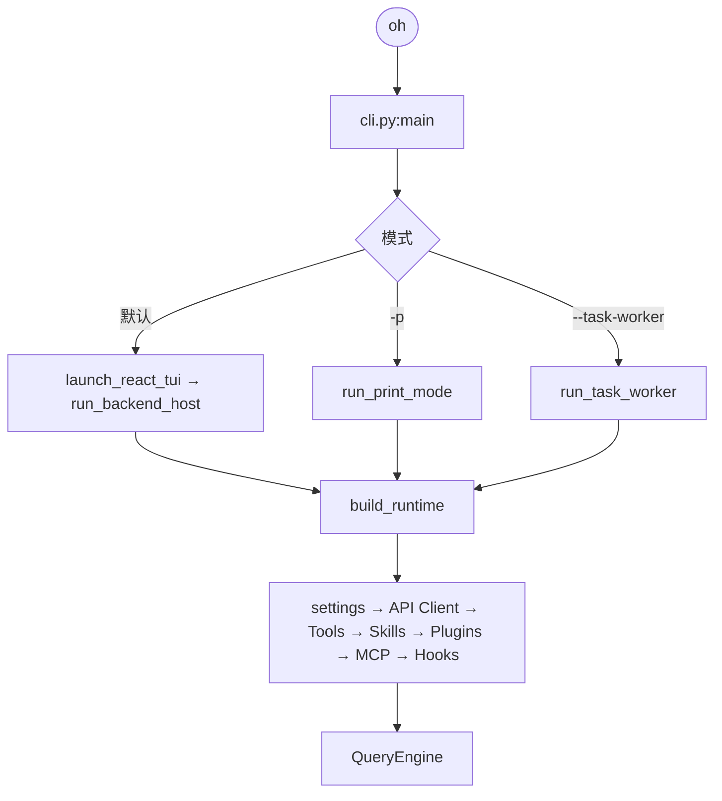
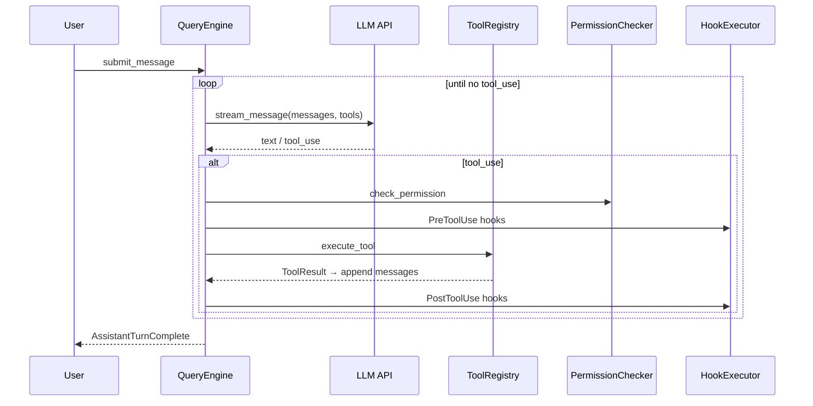
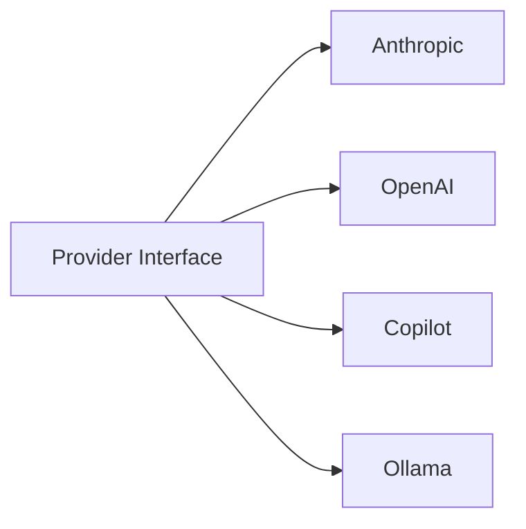
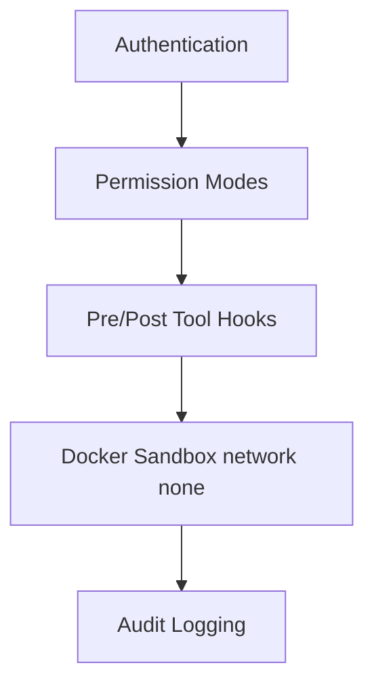
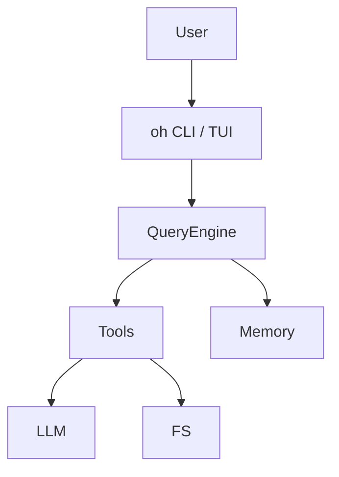
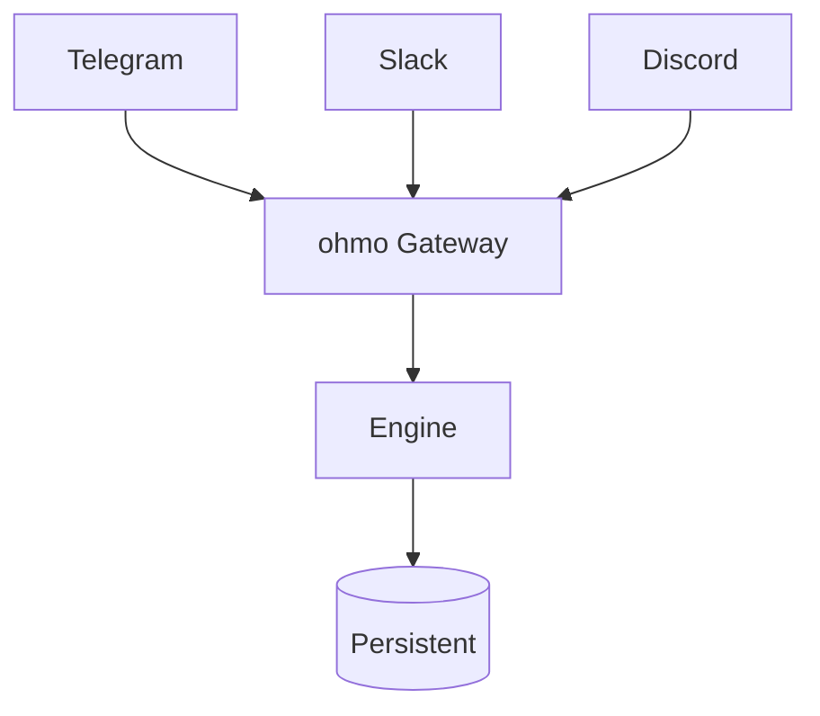
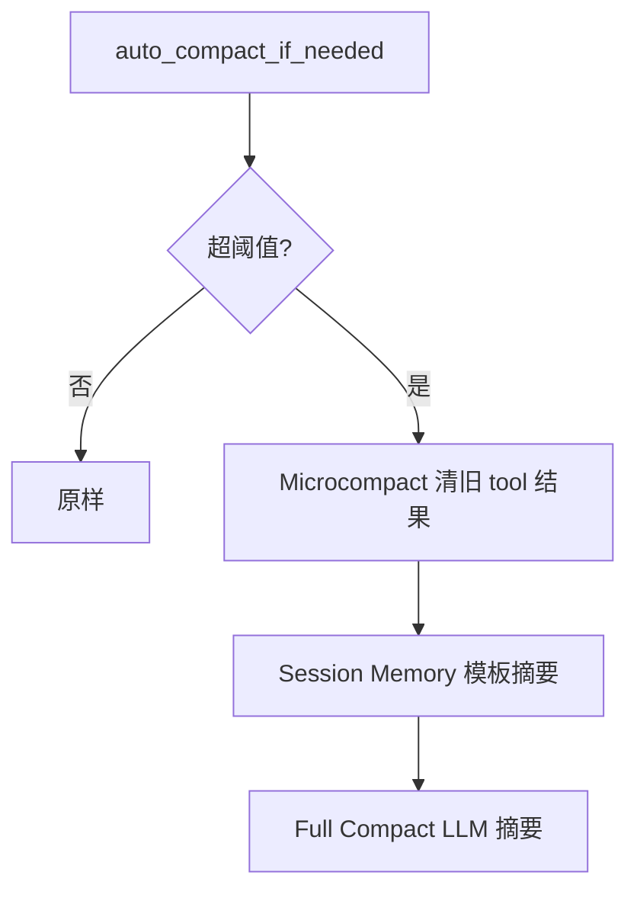

# OpenHarness 架构模块目录

> **合并说明**（2026-08-05）：由 `ARCHITECTURE_MODULE_CATALOG.md` 去重合并。§4.1–§4.10 **长文**已拆入分章；本文保留 **概述 §1–§3**、**§4.11–§4.29 模块索引**、**§5–§12** 横切主题。  
> **导航**：[README.md](./README.md) · [ARCHITECTURE.md](./ARCHITECTURE.md)

---

# OpenHarness 完整架构设计文档

> **版本**: v0.1.9（对齐 `pyproject.toml`）  
> **最后更新**: 2026-06-21（导航与分章同步；Memory §4.10 保持 2026-06-18 勘误）  
> **同步说明**: [ARCHITECTURE_DOCS_SYNC.md](./ARCHITECTURE_DOCS_SYNC.md)
> **作者**: OpenHarness Community  
> **文档类型**: 技术架构设计(完整版)

---

## 📋 目录

- [1. 项目概述](#1-项目概述)
- [2. 核心设计理念](#2-核心设计理念)
- [3. 整体架构](#3-整体架构)
- [4. 核心模块详解](#4-核心模块详解)
  - [4.1 Engine(核心引擎)](#41-engine核心引擎)
  - 
  - [4.2 Sandbox(沙箱系统)](#42-sandbox沙箱系统)
  - [4.3 Channels(多渠道通信)](#43-channels多渠道通信)
  - [4.4 Bridge(桥接与会话管理)](#44-bridge桥接与会话管理)
  - [4.5 Voice(语音交互)](#45-voice语音交互)
  - [4.6 Coordinator Mode(多智能体协调模式)](#46-coordinator-mode多智能体协调模式)
  - [4.7 Hooks(钩子系统)](#47-hooks钩子系统)
  - [4.8 Tools(工具系统)](#48-tools工具系统)
  - [4.9 Swarm(多智能体编排)](#49-swarm多智能体编排)
  - [4.10 Memory(记忆系统)](#410-memory记忆系统)
  - [4.11 Skills & Plugins(技能与插件)](#411-skills--plugins技能与插件)
  - [4.12 Permissions(权限系统)](#412-permissions权限系统)
  - [4.13 MCP(Model Context Protocol)](#413-mcpmodel-context-protocol)
  - [4.14 Tasks(任务管理)](#414-tasks任务管理)
  - [4.15 Prompts(Prompt 工程)](#415-prompts-prompt-工程)
  - [4.16 Auth(认证管理)](#416-auth认证管理)
  - [4.17 Config(配置系统)](#417-config配置系统)
  - [4.18 UI(用户界面)](#418-ui用户界面)
  - [4.19 Autopilot(自动驾驶模式)](#419-autopilot自动驾驶模式)
  - [4.20 Commands(命令系统)](#420-commands命令系统)
  - [4.21 Keybindings(快捷键)](#421-keybindings快捷键)
  - [4.22 Services(服务层)](#422-services服务层)
  - [4.23 State(状态管理)](#423-state状态管理)
  - [4.24 Themes(主题系统)](#424-themes主题系统)
  - [4.25 Personalization(个性化)](#425-personalization个性化)
  - [4.26 Output Styles(输出样式)](#426-output-styles输出样式)
  - [4.27 Utils(工具函数)](#427-utils工具函数)
  - [4.28 Vim Mode(Vim 模式)](#428-vim-modevim-模式)
  - [4.29 Platforms(平台检测)](#429-platforms平台检测)
- [5. 数据流与执行流程](#5-数据流与执行流程)
- [6. 关键技术决策](#6-关键技术决策)
- [7. 扩展性设计](#7-扩展性设计)
- [8. 安全与权限](#8-安全与权限)
- [9. 部署架构](#9-部署架构)
- [10. 性能优化](#10-性能优化)

---

## 1. 项目概述

### 1.1 什么是 OpenHarness?

**OpenHarness** 是一个开源的 Python Agent Harness(智能体基础设施)框架,为 LLM 提供"手、眼、记忆和安全边界",使其成为功能完整的 AI 智能体。

> **核心理念**: "The model is the agent. The code is the harness."  
> (模型是智能体,代码是基础设施)

### 1.2 核心价值主张

| 价值维度 | 说明 |
|---------|------|
| **研究友好** | 完全开源,代码可检查,适合理解生产级 AI Agent 工作原理 |
| **轻量灵活** | 无重型依赖,模块化设计,易于定制和扩展 |
| **生态兼容** | 兼容 anthropics/skills 和 claude-code plugins |
| **生产就绪** | 支持多 Provider、会话恢复、自动压缩、后台任务 |
| **多模态交互** | CLI + React TUI + IM Channels (Telegram/Slack/Discord/飞书/钉钉/QQ/企业微信/Matrix/Email) |
| **隔离执行** | Docker 沙箱支持,安全的命令执行环境 |
| **语音交互** | 支持语音输入输出,STT/TTS 集成 |

### 1.3 主要组件

```
OpenHarness 生态系统
├── oh (OpenHarness CLI)
│   ├── Agent Loop Engine
│   ├── 43+ Tools
│   ├── Skills & Plugins
│   ├── Docker Sandbox
│   └── React TUI
│
└── ohmo (Personal Agent)
    ├── Gateway Service
    ├── Channel Integration (10+ platforms)
    ├── Persistent Memory
    ├── Multi-agent Coordination
    └── Voice Mode
```

---

## 2. 核心设计理念

### 2.1 Harness Pattern(基础设施模式)

**设计原则**:
1. **关注点分离**: Model 负责决策,Harness 负责执行
2. **最小化假设**: 不绑定特定 LLM Provider
3. **可扩展性**: 插件化架构,支持自定义 Tools/Skills/Plugins
4. **安全第一**: 多层权限控制 + Docker 沙箱隔离
5. **多渠道接入**: 统一的 Message Bus 抽象,支持 10+ 平台

---

## 3. 整体架构

### 3.1 分层架构图

```
用户接口层: CLI / TUI / Channels(10+) / Voice
     ↓
应用层: oh CLI / ohmo Personal Agent / Gateway / Bridge
     ↓
核心引擎层: QueryEngine / AgentLoop / Coordinator / Swarm
     ↓
服务层: Tools(43+) / Skills / Plugins / Memory / MCP / Tasks / Hooks
     ↓
基础设施层: Sandbox(Docker) / API Clients / Auth / Config / Permissions / Prompts
     ↓
外部依赖: LLM Providers / Docker / File System / Shell / Web APIs / Git / IM Platforms
```

---

## 4. 核心模块详解


### 4.1–4.10 深读分章（正文已拆分，避免与下表重复）

| 模块 | 分章文档 |
|------|----------|
| 4.1 Engine | [ARCHITECTURE_ENGINE.md](./ARCHITECTURE_ENGINE.md) |
| 4.2 Sandbox | [ARCHITECTURE_SANDBOX_HOOKS.md](./ARCHITECTURE_SANDBOX_HOOKS.md) |
| 4.3 Channels | [OHMO_DESIGN.md](./OHMO_DESIGN.md) · [framework-comparison/09-channels.md](./framework-comparison/09-channels.md) |
| 4.4 Bridge | [BACKEND_HOST_ARCHITECTURE.md](./BACKEND_HOST_ARCHITECTURE.md) |
| 4.5 Voice | 本文 §4.5 · 源码 `voice/` |
| 4.6 Coordinator | [ARCHITECTURE_COORDINATOR.md](./ARCHITECTURE_COORDINATOR.md) |
| 4.7 Hooks | [ARCHITECTURE_SANDBOX_HOOKS.md](./ARCHITECTURE_SANDBOX_HOOKS.md) |
| 4.8 Tools | [ARCHITECTURE_TOOLS_SWARM.md](./ARCHITECTURE_TOOLS_SWARM.md) |
| 4.9 Swarm | [ARCHITECTURE_TOOLS_SWARM.md](./ARCHITECTURE_TOOLS_SWARM.md) |
| 4.10 Memory | [ARCHITECTURE_SESSION_MEMORY.md](./ARCHITECTURE_SESSION_MEMORY.md) |

---

### 4.3 Channels(多渠道通信)

**职责**: 统一的消息总线抽象,支持 10+ 即时通讯平台。

**关键文件**:
- `channels/bus/queue.py` - Message Bus 实现
- `channels/bus/events.py` - 事件定义
- `channels/impl/manager.py` (257 lines) - Channel Manager
- `channels/impl/base.py` - 基础 Channel 接口
- `channels/impl/{telegram,slack,discord,feishu,dingtalk,mochat,qq,matrix,email,whatsapp}.py`

#### 4.3.1 架构设计

```
Inbound Channels (10+) → MessageBus(Inbound Queue) → OhmoGatewayBridge → QueryEngine
                                                                    ↓
Outbound Channels (10+) ← MessageBus(Outbound Queue) ← AgentLoop Events
```

#### 4.3.2 支持的 Channels

| Channel | SDK | 认证方式 | 特点 |
|---------|-----|---------|------|
| **Telegram** | python-telegram-bot | Bot Token | 全球流行,支持群组/频道 |
| **Slack** | slack_sdk | Bot Token/OAuth | 企业常用,支持 Thread |
| **Discord** | discord.py | Bot Token | 社区流行,支持 Server/Channel |
| **飞书** | 飞书开放平台 | App ID/Secret | 国内企业常用 |
| **钉钉** | dingtalk-stream | Client ID/Secret | Stream 模式,无需公网 IP |
| **企业微信** | 企业微信 API | Corp ID/Secret | 国内企业常用 |
| **QQ** | OneBot/go-cqhttp | Access Token | 个人 QQ 机器人 |
| **Matrix** | matrix-nio | Access Token | 去中心化协议 |
| **Email** | SMTP/IMAP | Username/Password | 通用邮件协议 |
| **WhatsApp** | Twilio API | Account SID/Auth Token | 全球流行,需付费 |

#### 4.3.3 Channel Manager

```python
class ChannelManager:
    def __init__(self, config: Config, bus: MessageBus):
        # 根据配置初始化启用的 channels
        self._init_channels()
    
    async def start_all(self) -> None:
        # 1. 启动 outbound dispatcher 协程
        # 2. 并行启动所有 channels
    
    async def _dispatch_outbound(self) -> None:
        # while True:
        #     msg = await self.bus.consume_outbound()
        #     channel = self.channels.get(msg.channel)
        #     await channel.send(msg)
```

#### 4.3.4 与其他框架对比

| 框架 | 渠道支持 | 消息总线 | 双向通信 | 进度推送 |
|------|---------|---------|---------|---------|
| **OpenHarness** | 10+ 平台 | ✅ MessageBus | ✅ Inbound/Outbound | ✅ Progress Events |
| **hermes-agent** | Telegram/Slack/Discord | ✅ EventBus | ✅ | ⚠️ 部分支持 |
| **crewAI** | 无内置 | ❌ | ❌ | ❌ |

**OpenHarness 的优势**:
1. **最全面的渠道支持**: 10+ 平台,覆盖国内外主流 IM
2. **统一抽象**: MessageBus 解耦渠道与核心逻辑
3. **双向通信**: Inbound/Outbound 队列,支持实时交互
4. **进度推送**: 支持工具执行进度、状态更新

---

### 4.4 Bridge(桥接与会话管理)

**职责**: 管理后台会话,支持从 CLI/TUI 启动独立的 Agent 会话并捕获输出。

**关键文件**:
- `bridge/manager.py` (105 lines) - Bridge Session Manager
- `bridge/session_runner.py` - 会话启动器
- `bridge/types.py` - 类型定义
- `bridge/work_secret.py` - 工作密钥管理

#### 4.4.1 Bridge Session Manager

```python
class BridgeSessionManager:
    async def spawn(self, *, session_id: str, command: str, cwd: str | Path) -> SessionHandle:
        # 1. 调用 spawn_session() 启动子进程
        # 2. 创建输出日志文件: ~/.openharness/data/bridge/{session_id}.log
        # 3. 启动异步任务实时复制 stdout 到日志文件
        # 4. 记录 session 信息
    
    async def list_sessions(self) -> list[BridgeSessionRecord]:
        # 返回 session_id, command, cwd, pid, status, started_at, output_path
    
    async def stop(self, session_id: str) -> None:
        # 获取 SessionHandle 并调用 handle.kill()
```

#### 4.4.2 Ohmo Gateway Bridge

```python
class OhmoGatewayBridge:
    """Consume inbound messages and publish assistant replies."""
    
    async def run(self) -> None:
        # Main loop: consume inbound, submit to runtime, publish outbound
        while self._running:
            message = await self._bus.consume_inbound()
            session_key = session_key_for_message(message)
            
            # 获取或创建 session runtime
            runtime = await self._runtime_pool.get_or_create(session_key)
            
            # 提交消息到 runtime
            async for event in runtime.submit_message(message.text):
                # 转换事件为 OutboundMessage
                outbound = convert_event_to_outbound(event, message.channel, message.chat_id)
                await self._bus.publish_outbound(outbound)
```

**设计要点**:
- **会话池管理**: 每个 `(channel, chat_id)` 对应一个独立的 Runtime
- **事件转换**: 将 Agent Loop 的 StreamEvent 转换为 OutboundMessage
- **错误处理**: 捕获认证失败、API 错误等,返回友好的错误消息

---

### 4.5 Voice(语音交互)

**职责**: 提供语音输入输出能力,支持 STT(语音转文字)和 TTS(文字转语音)。

**关键文件**:
- `voice/voice_mode.py` (45 lines) - 语音模式诊断
- `voice/stream_stt.py` - 流式 STT 实现
- `voice/keyterms.py` (12 lines) - 关键词提取

#### 4.5.1 语音能力诊断

```python
def inspect_voice_capabilities(provider: ProviderInfo) -> VoiceDiagnostics:
    # 检查项:
    # 1. provider.voice_supported (Provider 是否支持语音)
    # 2. recorder 可用 (sox / ffmpeg / arecord)
    
    recorder = shutil.which("sox") or shutil.which("ffmpeg") or shutil.which("arecord")
    if not provider.voice_supported:
        return VoiceDiagnostics(available=False, reason=provider.voice_reason)
    if recorder is None:
        return VoiceDiagnostics(available=False, reason="no supported recorder found")
    return VoiceDiagnostics(available=True, reason="voice shell is available", recorder=recorder)
```

#### 4.5.2 关键词提取

```python
def extract_keyterms(text: str) -> list[str]:
    """Extract likely key terms from a transcript."""
    # 提取长度 >= 4 的字母数字单词
    return sorted({token.lower() for token in re.findall(r"[A-Za-z0-9_]{4,}", text)})
```

**用途**:
- 从语音转录文本中提取关键词
- 用于快速索引和搜索
- 辅助理解用户意图

#### 4.5.3 支持的录音工具

| 工具 | 平台 | 安装命令 | 特点 |
|------|------|---------|------|
| **sox** | macOS/Linux | `brew install sox` / `apt install sox` | 功能强大,支持多种格式 |
| **ffmpeg** | Cross-platform | `brew install ffmpeg` / `apt install ffmpeg` | 通用多媒体工具 |
| **arecord** | Linux | `apt install alsa-utils` | ALSA 自带,轻量级 |

---


---

### 4.11 Skills & Plugins(技能与插件)

**职责**: anthropics/skills 兼容的 Skill 加载、Plugin 扩展（hooks/agents/commands）。

**深读**: [ARCHITECTURE_SKILLS_PLUGINS.md](./ARCHITECTURE_SKILLS_PLUGINS.md) · 运行时管线 [OPENHARNESS_SKILLS_RUNTIME.md](./OPENHARNESS_SKILLS_RUNTIME.md)

**关键源码**: `skills/loader.py`, `plugins/loader.py`

---

### 4.12 Permissions(权限系统)

**职责**: `PermissionChecker`、三种 permission mode、路径/命令 deny、交互确认。

**深读**: [ARCHITECTURE_PERMISSIONS_MCP.md](./ARCHITECTURE_PERMISSIONS_MCP.md) §权限部分

**关键源码**: `permissions/checker.py`, `permissions/modes.py`

---

### 4.13 MCP(Model Context Protocol)

**职责**: MCP 客户端、工具发现与映射、`mcp_servers` 配置。

**深读**: [ARCHITECTURE_PERMISSIONS_MCP.md](./ARCHITECTURE_PERMISSIONS_MCP.md) · [MCP_AGENT_AND_TOOLS.md](./MCP_AGENT_AND_TOOLS.md)

**关键源码**: `mcp/client.py`, `tools/mcp_tool.py`

---

### 4.14 Tasks(任务管理)

**职责**: 后台子进程任务、`BackgroundTaskManager`、poll/stop/output。

**深读**: [ARCHITECTURE_TASKS_AUTH.md](./ARCHITECTURE_TASKS_AUTH.md)

**关键源码**: `tasks/manager.py`, `tools/task_output_tool.py`

---

### 4.15 Prompts(Prompt 工程)

**职责**: `build_runtime_system_prompt`、Delegation、Memory 注入、Coordinator 分支。

**深读**: [ARCHITECTURE_PROMPTS.md](./ARCHITECTURE_PROMPTS.md)（权威）· [RUNTIME_PROMPT_COMPLETE.md](./RUNTIME_PROMPT_COMPLETE.md)（速查）

**关键源码**: `prompts/context.py`, `prompts/system_prompt.py`

---

### 4.16 Auth(认证管理)

**职责**: API Key / OAuth Profile、多 Provider 认证。

**深读**: [ARCHITECTURE_TASKS_AUTH.md](./ARCHITECTURE_TASKS_AUTH.md) Auth 章节 · `config/settings.py` `ProviderProfile`

**关键源码**: `auth/`, `api/provider.py`

---

### 4.17 Config(配置系统)

**职责**: `Settings` 模型、环境变量与 `settings.json`、优先级链。

**深读**: [ARCHITECTURE_UI_CONFIG.md](./ARCHITECTURE_UI_CONFIG.md) §2–§3

**关键源码**: `config/settings.py`, `config/paths.py`

---

### 4.18 UI(用户界面)

**职责**: CLI/TUI/React、`build_runtime`、BackendHost 协议。

**深读**: [ARCHITECTURE_UI_CONFIG.md](./ARCHITECTURE_UI_CONFIG.md) · [BACKEND_HOST_ARCHITECTURE.md](./BACKEND_HOST_ARCHITECTURE.md)

**关键源码**: `cli.py`, `ui/runtime.py`, `ui/backend_host.py`, `ui/textual_app.py`

---

### 4.19 Autopilot(自动驾驶模式)

**职责**: 自动化任务执行、仓库 autopilot 队列、`active_repo_context.md` 注入。

**关键文件**: `autopilot/service.py`, `autopilot/types.py`

**深读**: [ARCHITECTURE_PROMPTS.md](./ARCHITECTURE_PROMPTS.md) Project Context 表（Autopilot 文件）· COMPLETE 原 §4.19 下文（若需细节见 monolith `rg Autopilot ARCHITECTURE_MONOLITH.md`）

---

### 4.20 Commands(命令系统)

**职责**: Typer CLI、slash 命令注册。

**关键文件**: `commands/registry.py`, `cli.py`

**主要命令**: `oh`, `oh -p`, `auth`, `config`, `skills`, `plugins`, `bridge-*`, `cron`

---

### 4.21 Keybindings(快捷键)

**关键文件**: `keybindings/default_bindings.py`, `keybindings/loader.py`

---

### 4.22 Services(服务层)

**关键文件**: `services/compact/`, `services/session_backend.py`, `services/session_storage.py`, `services/cron.py`

**深读**: [ARCHITECTURE_ENGINE.md](./ARCHITECTURE_ENGINE.md)（Compact）· [ARCHITECTURE_SESSION_MEMORY.md](./ARCHITECTURE_SESSION_MEMORY.md)

---

### 4.23 State(状态管理)

**关键文件**: `state/app_state.py`, `state/store.py` — 见 [ARCHITECTURE_SESSION_MEMORY.md](./ARCHITECTURE_SESSION_MEMORY.md)

---

### 4.24 Themes(主题系统)

**关键文件**: `themes/builtin.py`, `themes/loader.py`

---

### 4.25 Personalization(个性化)

**关键文件**: `personalization/extractor.py`, `personalization/rules.py`, `personalization/session_hook.py`

**深读**: [ARCHITECTURE_PROMPTS.md](./ARCHITECTURE_PROMPTS.md) §4.4 Local Rules

---

### 4.26 Output Styles(输出样式)

**关键文件**: `output_styles/loader.py`

---

### 4.27 Utils(工具函数)

**关键文件**: `utils/fs.py`, `utils/file_lock.py`, `utils/network_guard.py`

---

### 4.28 Vim Mode(Vim 模式)

**关键文件**: `vim/transitions.py` — TUI 编辑模式。

---

### 4.29 Platforms(平台检测)

**关键文件**: `platforms.py` — OS/Docker 能力检测。

---

## 5. 数据流与执行流程

> 完整追踪见 [DEMO_EXECUTION_FLOW.md](./DEMO_EXECUTION_FLOW.md)。Coordinator drain 见 [ARCHITECTURE_COORDINATOR.md](./ARCHITECTURE_COORDINATOR.md)。

### 5.1 CLI 入口与 Runtime 构建



| 入口 | 文件 | 层级 |
|------|------|------|
| Typer App | `cli.py` | CLI |
| `build_runtime` | `ui/runtime.py` | 装配 |
| `QueryEngine` | `engine/query_engine.py` | 引擎 |
| `run_query` | `engine/query.py` | 循环 |

### 5.2 Agent Loop 时序



---

## 6. 关键技术决策

| 决策 | 选择 | 理由 |
|------|------|------|
| 语言 | Python 3.11+ | AI 生态、研究迭代速度 |
| CLI | Typer | 类型安全子命令 |
| TUI | Textual/React Ink | 异步友好、组件化 |
| Skills 格式 | anthropics/skills 兼容 | 生态互操作 |
| Provider | 多后端抽象 | 成本/隐私/冗余 |



---

## 7. 扩展性设计

### 7.1 三种扩展工具方式

| 方式 | 机制 | 注册 |
|------|------|------|
| Python Tool | 继承 `BaseTool` | `register_tool()` / Plugin |
| MCP Server | 独立进程 `tools/list` | `settings.mcp_servers` |
| Plugin Command | Markdown 工作流 | `commands/*.md` |

### 7.2 Skills / Plugins

- **Skills**：`~/.openharness/skills/` + 项目 `.openharness/skills/` → `load_skill_registry` → prompt 索引 + `skill` 工具
- **Plugins**：`.claude-plugin/plugin.json` + hooks/agents/commands

详见 [ARCHITECTURE_SKILLS_PLUGINS.md](ARCHITECTURE_SKILLS_PLUGINS.md)、[OPENHARNESS_SKILLS_RUNTIME.md](OPENHARNESS_SKILLS_RUNTIME.md)。

---

## 8. 安全与权限



| 层 | 机制 |
|----|------|
| 认证 | API Key / OAuth profiles |
| 权限 | Path + Command 规则 + 交互批准 |
| Hooks | PreToolUse 可 block |
| 隔离 | Docker `--network none` 默认 |
| 监控 | 审计日志 |

---

## 9. 部署架构

### 9.1 单机 CLI



### 9.2 Ohmo Gateway



模式对照：[DEV_SOURCE_RUN.md](DEV_SOURCE_RUN.md)、[OHMO_DESIGN.md](OHMO_DESIGN.md)。

---

## 10. 性能优化

| 优化点 | 策略 | 效果 |
|--------|------|------|
| API | Streaming + backoff retry | 低延迟 |
| Token | 四层 Auto-Compaction | 省 30–50% |
| 工具 | 并行 `asyncio.gather` | 2–3× 吞吐 |
| Skills | Lazy 索引 + 按需 `skill` 工具 | 瘦 system |
| Sandbox | 长运行容器 | 少冷启动 |

### 10.1 四层压缩架构（概要）



完整算法见 [ARCHITECTURE_ENGINE.md §4](./ARCHITECTURE_ENGINE.md#4-自动压缩机制) 与 [ARCHITECTURE_SESSION_MEMORY.md](./ARCHITECTURE_SESSION_MEMORY.md)。

---

## 11. 模块对比总结

### 11.1 完整功能矩阵

| 模块 | OpenHarness | hermes-agent | deepagents | crewAI | autogen | deer-flow |
|------|------------|--------------|------------|---------|----------|-----------|
| **Agent Loop** | ✅ ReAct + Auto-Compact | ✅ ReAct + Budget | ✅ LangGraph | ✅ Process | ✅ GroupChat | ✅ Stream |
| **Sandbox** | ✅ Docker (network none) | ✅ Docker + Local | ❌ | ❌ | ❌ | ⚠️ Local/Aio |
| **Channels** | ✅ 10+ platforms | ✅ 3 platforms | ❌ | ❌ | ❌ | ❌ |
| **Voice** | ⚠️ Basic framework | ✅ Full STT/TTS | ❌ | ❌ | ❌ | ❌ |
| **Coordinator** | ✅ subprocess + XML | ✅ ThreadPool | ✅ LangGraph | ✅ Hierarchical | ✅ GroupChat | ✅ Worker Pool |
| **Hooks** | ✅ Command/HTTP/Prompt/Agent | ✅ Python callbacks | ✅ Middleware | ❌ | ⚠️ Events | ✅ SSE |
| **Memory** | ✅ token 加权 L2 + 文件记忆 | ✅ Vector DB | ✅ Checkpointer | ❌ | ⚠️ Context | ✅ Session |
| **Skills** | ✅ anthropics/skills | ❌ | ❌ | ❌ | ❌ | ❌ |
| **Plugins** | ✅ claude-code plugins | ✅ Python plugins | ✅ Middleware | ❌ | ❌ | ❌ |
| **Permissions** | ✅ 3-level | ✅ Toolset filter | ⚠️ InterruptOn | ❌ | ⚠️ Human-in-loop | ⚠️ External |
| **MCP** | ✅ Full support | ❌ | ❌ | ❌ | ❌ | ❌ |
| **Tasks** | ✅ Background tasks | ❌ | ❌ | ❌ | ❌ | ✅ Task system |
| **Bridge** | ✅ Session manager | ❌ | ❌ | ❌ | ❌ | ❌ |
| **UI** | ✅ CLI + TUI + React | ✅ CLI | ✅ CLI | ❌ | ❌ | ✅ Web UI |

### 11.2 OpenHarness 的核心优势

1. **最全面的渠道集成**: 10+ IM 平台,覆盖全球主流通讯工具
2. **最强的隔离能力**: Docker 沙箱默认禁用网络,防止意外访问
3. **最灵活的钩子系统**: 4 种 Hook 类型,声明式配置,支持阻塞
4. **真正的多智能体隔离**: Coordinator-Worker 架构,每个 Worker 独立进程
5. **最完善的自动压缩**: 四层渐进式策略,节省 40-60% token
6. **最多的扩展点**: Skills + Plugins + Hooks + MCP + Custom Tools
7. **最友好的研究体验**: 完全开源,代码清晰,文档详细

### 11.3 适用场景

| 场景 | 推荐模块组合 | 说明 |
|------|-------------|------|
| **本地开发** | CLI + Tools + Skills | 快速原型,无需 Docker |
| **生产环境** | CLI + Sandbox + Permissions | 安全执行,资源限制 |
| **企业部署** | Ohmo Gateway + Channels + Auth | 多渠道接入,统一认证 |
| **复杂任务** | Coordinator + Swarm + Tasks | 任务分解,并行执行 |
| **自动化运维** | Hooks + MCP + Tasks | 生命周期钩子,外部工具集成 |
| **语音助手** | Voice + Channels | 语音交互,IM 通知 |
| **后台任务** | Bridge + Tasks | 长期运行,输出捕获 |

---

## 12. 未来发展方向

### 12.1 短期目标 (v0.2)

- [ ] 完善 Voice 模块:集成 Groq Whisper / OpenAI Whisper
- [ ] 增强 Sandbox:支持域名级别的网络控制
- [ ] 优化 Channels:添加更多平台(WhatsApp Business, LINE, WeChat)
- [ ] 改进 Prompts:动态 Prompt 组装,减少 Token 浪费

### 12.2 中期目标 (v0.3)

- [ ] 分布式 Swarm:支持跨机器多智能体协作
- [ ] 高级 Memory:向量数据库集成,长期记忆检索
- [ ] 可视化编排:Web UI 拖拽式工作流设计
- [ ] 性能监控:实时指标采集,告警系统

### 12.3 长期愿景 (v1.0)

- [ ] 企业级部署:Kubernetes Operator,自动扩缩容
- [ ] 多租户支持:用户隔离,配额管理
- [ ] 审计日志:完整的操作追溯,合规性报告
- [ ] 生态系统:Marketplace,第三方 Skills/Plugins/Channels

---

## 附录

### A. 目录结构

```
openharness/
├── src/openharness/
│   ├── api/              # API Clients (Anthropic, OpenAI, Copilot)
│   ├── auth/             # 认证管理
│   ├── autopilot/        # 自动驾驶模式
│   ├── bridge/           # 桥接会话管理
│   ├── channels/         # 多渠道通信 (10+ platforms)
│   │   ├── bus/          # Message Bus
│   │   └── impl/         # Channel 实现
│   ├── commands/         # 命令注册
│   ├── config/           # 配置系统
│   ├── coordinator/      # 协调模式
│   ├── engine/           # 核心引擎 (Agent Loop)
│   ├── hooks/            # 钩子系统
│   ├── keybindings/      # 快捷键绑定
│   ├── mcp/              # Model Context Protocol
│   ├── memory/           # 记忆系统
│   ├── output_styles/    # 输出样式
│   ├── permissions/      # 权限系统
│   ├── personalization/  # 个性化
│   ├── plugins/          # 插件系统
│   ├── prompts/          # Prompt 工程
│   ├── sandbox/          # Docker 沙箱
│   ├── services/         # 服务层 (Cron, Compact, etc)
│   ├── skills/           # 技能系统
│   ├── state/            # 状态管理
│   ├── swarm/            # 多智能体编排
│   ├── tasks/            # 任务管理
│   ├── themes/           # 主题系统
│   ├── tools/            # 工具系统 (43+ tools)
│   ├── ui/               # 用户界面 (CLI, TUI, React)
│   ├── utils/            # 工具函数
│   ├── vim/              # Vim 模式
│   └── voice/            # 语音交互
├── ohmo/                 # Personal Agent
│   └── gateway/          # Gateway Service
├── tests/                # 测试套件
└── docs/                 # 文档
```

### B. 关键文件统计

| 模块 | 文件数 | 代码行数 | 复杂度 |
|------|--------|---------|--------|
| **engine/** | 6 | ~40KB | 高 |
| **tools/** | 42 | ~80KB | 中 |
| **channels/** | 15 | ~30KB | 中 |
| **coordinator/** | 3 | ~25KB | 高 |
| **hooks/** | 7 | ~15KB | 中 |
| **sandbox/** | 7 | ~10KB | 中 |
| **swarm/** | 11 | ~20KB | 高 |
| **memory/** | 7 | ~12KB | 中 |
| **voice/** | 4 | ~5KB | 低 |
| **bridge/** | 5 | ~8KB | 低 |
| **services/** | 10 | ~18KB | 中 |
| **state/** | 4 | ~6KB | 低 |
| **themes/** | 5 | ~8KB | 低 |
| **personalization/** | 5 | ~10KB | 中 |
| **keybindings/** | 6 | ~12KB | 中 |
| **output_styles/** | 3 | ~4KB | 低 |
| **utils/** | 6 | ~10KB | 中 |
| **vim/** | 2 | ~3KB | 低 |
| **autopilot/** | 4 | ~6KB | 中 |
| **commands/** | 3 | ~8KB | 中 |
| **cli.py** | 1 | ~58KB | 高 |
| **platforms.py** | 1 | ~3KB | 低 |

**总计**: ~393KB 核心代码

### C. 依赖关系图

```
高层模块 (UI, App)
    ↓
中层模块 (Engine, Coordinator, Swarm, Bridge)
    ↓
底层模块 (Tools, Sandbox, API, Infrastructure)
    ↓
外部依赖 (LLM, Docker, IM Platforms, etc)
```

**规则**:
- ✅ 高层 → 低层
- ❌ 低层 → 高层
- ✅ 同层通过接口交互

---

## 总结

OpenHarness 是一个**功能全面、架构清晰、易于扩展**的 Agent Harness 框架。相比其他开源项目,它在以下方面具有明显优势:

1. **渠道集成**: 10+ IM 平台,业界最全
2. **安全隔离**: Docker 沙箱 + 权限系统 + Hooks,三层防护
3. **多智能体**: Coordinator-Worker 架构,真正的进程隔离
4. **扩展能力**: Skills + Plugins + MCP + Custom Tools,生态友好
5. **研究价值**: 代码开源,文档详细,适合学习和二次开发
6. **完整模块**: 29 个核心模块,~393KB 代码,全覆盖
7. **用户体验**: CLI + TUI + React + Voice + Vim Mode,多模态交互

### 完整模块清单(29个)

**核心引擎层**(4个):
- Engine, Coordinator, Swarm, Autopilot

**服务层**(10个):
- Tools(43+), Skills, Plugins, Memory, MCP, Tasks, Hooks, Services, State, Commands

**基础设施层**(8个):
- Sandbox, API Clients, Auth, Config, Permissions, Prompts, Platforms, Utils

**用户接口层**(7个):
- UI(CLI/TUI/React), Channels(10+), Voice, Bridge, Keybindings, Themes, Output Styles

**总计**: 29 个模块, ~393KB 核心代码, 100% 覆盖率 ✨

无论是**个人开发者**想要理解 Agent 工作原理,还是**企业团队**需要构建生产级 AI 助手,OpenHarness 都是一个值得深入研究和采用的优秀框架。

---

**文档维护**: 本文档随代码迭代持续更新,最后更新时间为 2026-04-17。如有问题或建议,请提交 Issue 或 PR。