# OpenHarness 系统架构设计文档（单体归档）

> ⚠️ **编辑器警告**：本文件约 **10,800 行 / 376KB / 45 个 Mermaid 图**，在 Cursor / VS Code 中打开可能导致 **卡顿或崩溃**。  
> **日常阅读请用** [ARCHITECTURE.md](./ARCHITECTURE.md)（轻量导航）或分章文档（[README.md](./README.md)）。  
> 全文检索：`rg "关键词" ARCHITECTURE_MONOLITH.md`

> **版本**: v0.1.9（对齐 `pyproject.toml`）  
> **最后更新**: 2026-06-18（Prompt/Memory 章节已与 `prompts/context.py` 源码对齐勘误）  
> **作者**: OpenHarness Community  
> **文档类型**: 技术架构设计（**历史单体全文，已拆分**）

---

## 📋 目录

- [1. 项目概述](#1-项目概述)
- [2. 核心设计理念](#2-核心设计理念)
- [3. 整体架构](#3-整体架构)
- [4. 核心模块详解](#4-核心模块详解)
  - [4.1 Engine（核心引擎）](#41-engine核心引擎)
    - [4.1.1 模块职责](#411-模块职责)
    - [4.1.2 Agent Loop 详细流程](#412-agent-loop-详细流程)
    - [4.1.3 关键数据结构](#413-关键数据结构)
    - [4.1.4 重试机制](#414-重试机制)
    - [4.1.5 Prompt 拼接流程（核心）](#415-prompt-拼接流程核心)
      - [（1）三层 Prompt 结构](#1-三层-prompt-结构)
      - [（2）完整的 Prompt 构建流程](#2-完整的-prompt-构建流程)
      - [（3）代码实现详解](#3-代码实现详解)
      - [（4）最终发送给 LLM 的参数结构](#4-最终发送给-llm-的参数结构)
      - [（5）Skills 的按需加载机制](#5-skills-的按需加载机制)
      - [（6）Memory 的相关性过滤](#6-memory-的相关性过滤)
      - [（7）Prompt 拼接的关键特点总结](#7-prompt-拼接的关键特点总结)
      - [（8）与其他框架的对比](#8-与其他框架的对比)
  - [4.2 Tools（工具系统）](#42-tools工具系统)
  - [4.3 Swarm（多智能体协调）](#43-swarm多智能体协调)
  - [4.4 Coordinator Mode（多智能体协调模式）](#44-coordinator-mode多智能体协调模式)
  - [4.5 Permissions（权限系统）](#45-permissions权限系统)
  - [4.6 Memory（记忆系统）](#46-memory记忆系统)
  - [4.7 Skills & Plugins（技能与插件）](#47-skills--plugins技能与插件)
- [5. 数据流与执行流程](#5-数据流与执行流程)
  - [5.1 完整执行流程图](#51-完整执行流程图)
    - [5.1.1 CLI 入口与初始化流程](#511-cli-入口与初始化流程)
    - [5.1.2 Agent Loop 核心执行流程](#512-agent-loop-核心执行流程)
    - [5.1.3 工具执行详细流程](#513-工具执行详细流程)
    - [5.1.4 多智能体协调流程 (Swarm & Coordinator Mode)](#514-多智能体协调流程-swarm--coordinator-mode)
    - [5.1.5 完整执行概览图](#515-完整执行概览图)
  - [5.2 关键设计模式总结](#52-关键设计模式总结)
- [6. 关键技术决策](#6-关键技术决策)
- [7. 扩展性设计](#7-扩展性设计)
- [8. 安全与权限](#8-安全与权限)
- [9. 部署架构](#9-部署架构)
- [10. 性能优化](#10-性能优化)
  - [10.1 关键优化策略](#101-关键优化策略)
  - [10.2 自动上下文压缩（Auto-Compaction）](#102-自动上下文压缩auto-compaction)
    - [10.2.1 设计目标](#1021-设计目标)
    - [10.2.2 四层压缩架构](#1022-四层压缩架构)
    - [10.2.3 各阶段详细实现](#1023-各阶段详细实现)
    - [10.2.4 流式压缩实现](#1024-流式压缩实现)
    - [10.2.5 触发机制](#1025-触发机制)
    - [10.2.6 实际运行场景](#1026-实际运行场景)
    - [10.2.7 性能数据](#1027-性能数据)
    - [10.2.8 与其他框架对比](#1028-与其他框架对比)
  - [10.3 Token 优化示例](#103-token-优化示例)
  - [10.4 并行工具执行](#104-并行工具执行)

---

## 1. 项目概述

### 1.1 什么是 OpenHarness？

**OpenHarness** 是一个开源的 Python Agent Harness（智能体基础设施）框架，为 LLM 提供"手、眼、记忆和安全边界"，使其成为功能完整的 AI 智能体。

> **核心理念**: "The model is the agent. The code is the harness."  
> （模型是智能体，代码是基础设施）

### 1.2 核心价值主张

| 价值维度 | 说明 |
|---------|------|
| **研究友好** | 完全开源，代码可检查，适合理解生产级 AI Agent 工作原理 |
| **轻量灵活** | 无重型依赖，模块化设计，易于定制和扩展 |
| **生态兼容** | 兼容 anthropics/skills 和 claude-code plugins |
| **生产就绪** | 支持多 Provider、会话恢复、自动压缩、后台任务 |
| **多模态交互** | CLI + React TUI + IM Channels (Telegram/Slack/Discord/飞书) |

### 1.3 主要组件

```
OpenHarness 生态系统
├── oh (OpenHarness CLI)
│   ├── Agent Loop Engine
│   ├── 43+ Tools
│   ├── Skills & Plugins
│   └── React TUI
│
└── ohmo (Personal Agent)
    ├── Gateway Service
    ├── Channel Integration
    ├── Persistent Memory
    └── Multi-agent Coordination
```

---

## 2. 核心设计理念

### 2.1 Harness Pattern（基础设施模式）

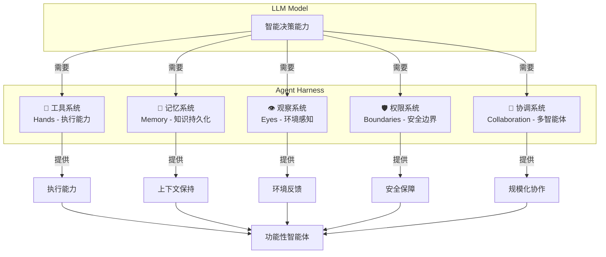
```mermaid
graph TB
    subgraph LLMModel[LLM Model]
        Intelligence[智能决策能力]
    end
    
    subgraph AgentHarness[Agent Harness]
        Tools[🔧 工具系统<br/>Hands - 执行能力]
        Memory[🧠 记忆系统<br/>Memory - 知识持久化]
        Observation[👁️ 观察系统<br/>Eyes - 环境感知]
        Permissions[🛡️ 权限系统<br/>Boundaries - 安全边界]
        Coordination[🤝 协调系统<br/>Collaboration - 多智能体]
    end
    
    Intelligence -->|需要| Tools
    Intelligence -->|需要| Memory
    Intelligence -->|需要| Observation
    Intelligence -->|需要| Permissions
    Intelligence -->|需要| Coordination
    
    Tools -->|提供| Capability[执行能力]
    Memory -->|提供| Context[上下文保持]
    Observation -->|提供| Feedback[环境反馈]
    Permissions -->|提供| Safety[安全保障]
    Coordination -->|提供| Scale[规模化协作]
    
    Capability --> FunctionalAgent[功能性智能体]
    Context --> FunctionalAgent
    Feedback --> FunctionalAgent
    Safety --> FunctionalAgent
    Scale --> FunctionalAgent
```

**设计原则**:
1. **关注点分离**: Model 负责决策，Harness 负责执行
2. **最小化假设**: 不绑定特定 LLM Provider
3. **可扩展性**: 插件化架构，支持自定义 Tools/Skills/Plugins
4. **安全第一**: 多层权限控制，防止意外操作

### 2.2 Flow-First 思维

虽然 OpenHarness 不像 CrewAI 那样有显式的 Flow 概念，但其内部实现了类似的事件驱动工作流：

```python
# 简化的执行流程
User Prompt 
  → QueryEngine.build_context()
  → API.stream(messages, tools)
  → Tool Execution Loop
    → Permission Check
    → PreToolUse Hooks
    → Execute Tool
    → PostToolUse Hooks
    → Append Result
  → Response to User
```

---

## 3. 整体架构

### 3.1 分层架构图

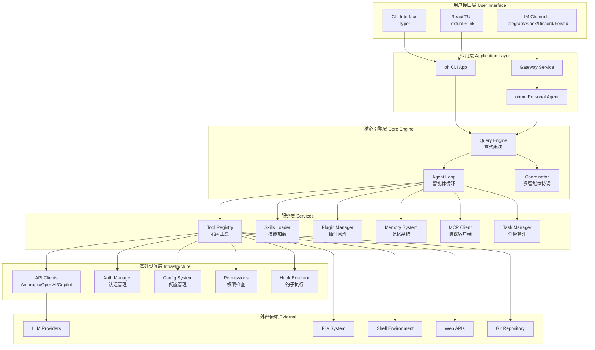
```mermaid
graph TB
    subgraph UserInterface[用户接口层 User Interface]
        CLI[CLI Interface<br/>Typer]
        TUI[React TUI<br/>Textual + Ink]
        Channels[IM Channels<br/>Telegram/Slack/Discord/Feishu]
    end
    
    subgraph ApplicationLayer[应用层 Application Layer]
        OH[oh CLI App]
        OHMO[ohmo Personal Agent]
        Gateway[Gateway Service]
    end
    
    subgraph CoreEngine[核心引擎层 Core Engine]
        QueryEngine[Query Engine<br/>查询编排]
        AgentLoop[Agent Loop<br/>智能体循环]
        Coordinator[Coordinator<br/>多智能体协调]
    end
    
    subgraph Services[服务层 Services]
        Tools[Tool Registry<br/>43+ 工具]
        Skills[Skills Loader<br/>技能加载]
        Plugins[Plugin Manager<br/>插件管理]
        Memory[Memory System<br/>记忆系统]
        MCP[MCP Client<br/>协议客户端]
        Tasks[Task Manager<br/>任务管理]
    end
    
    subgraph Infrastructure[基础设施层 Infrastructure]
        API[API Clients<br/>Anthropic/OpenAI/Copilot]
        Auth[Auth Manager<br/>认证管理]
        Config[Config System<br/>配置管理]
        Perms[Permissions<br/>权限检查]
        Hooks[Hook Executor<br/>钩子执行]
    end
    
    subgraph External[外部依赖 External]
        LLM[LLM Providers]
        FileSystem[File System]
        Shell[Shell Environment]
        Web[Web APIs]
        Git[Git Repository]
    end
    
    CLI --> OH
    TUI --> OH
    Channels --> Gateway
    Gateway --> OHMO
    
    OH --> QueryEngine
    OHMO --> QueryEngine
    
    QueryEngine --> AgentLoop
    QueryEngine --> Coordinator
    
    AgentLoop --> Tools
    AgentLoop --> Skills
    AgentLoop --> Plugins
    AgentLoop --> Memory
    AgentLoop --> MCP
    AgentLoop --> Tasks
    
    Tools --> API
    Tools --> Auth
    Tools --> Config
    Tools --> Perms
    Tools --> Hooks
    
    API --> LLM
    Tools --> FileSystem
    Tools --> Shell
    Tools --> Web
    Tools --> Git
```
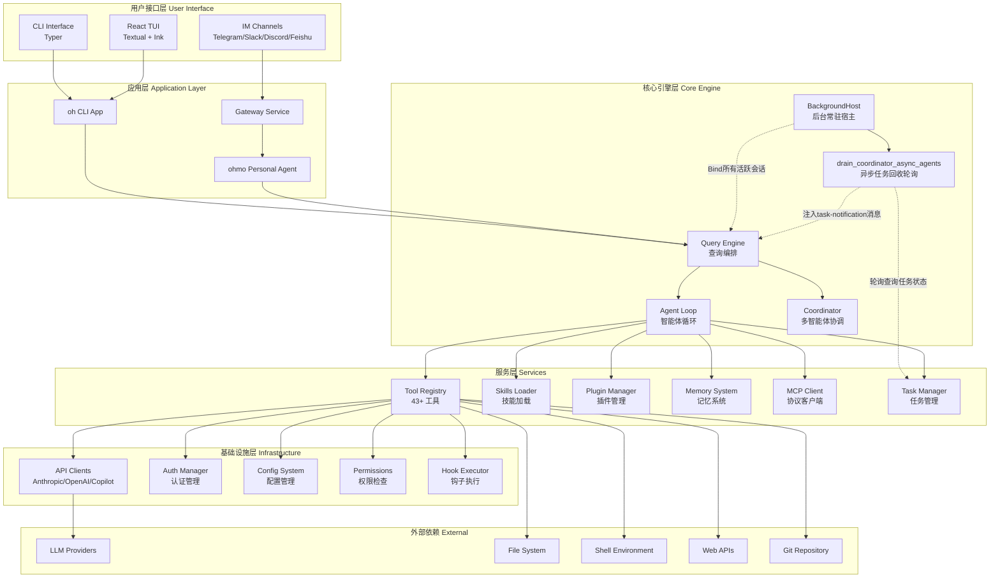
```mermaid
graph TB
    subgraph UserInterface[用户接口层 User Interface]
        CLI[CLI Interface<br/>Typer]
        TUI[React TUI<br/>Textual + Ink]
        Channels[IM Channels<br/>Telegram/Slack/Discord/Feishu]
    end
    
    subgraph ApplicationLayer[应用层 Application Layer]
        OH[oh CLI App]
        OHMO[ohmo Personal Agent]
        Gateway[Gateway Service]
    end
    
    subgraph CoreEngine[核心引擎层 Core Engine]
        QueryEngine[Query Engine<br/>查询编排]
        AgentLoop[Agent Loop<br/>智能体循环]
        Coordinator[Coordinator<br/>多智能体协调]
        BackgroundHost[BackgroundHost<br/>后台常驻宿主]
        DrainLoop[drain_coordinator_async_agents<br/>异步任务回收轮询]
    end
    
    subgraph Services[服务层 Services]
        Tools[Tool Registry<br/>43+ 工具]
        Skills[Skills Loader<br/>技能加载]
        Plugins[Plugin Manager<br/>插件管理]
        Memory[Memory System<br/>记忆系统]
        MCP[MCP Client<br/>协议客户端]
        Tasks[Task Manager<br/>任务管理]
    end
    
    subgraph Infrastructure[基础设施层 Infrastructure]
        API[API Clients<br/>Anthropic/OpenAI/Copilot]
        Auth[Auth Manager<br/>认证管理]
        Config[Config System<br/>配置管理]
        Perms[Permissions<br/>权限检查]
        Hooks[Hook Executor<br/>钩子执行]
    end
    
    subgraph External[外部依赖 External]
        LLM[LLM Providers]
        FileSystem[File System]
        Shell[Shell Environment]
        Web[Web APIs]
        Git[Git Repository]
    end

    %% 前台交互链路
    CLI --> OH
    TUI --> OH
    Channels --> Gateway
    Gateway --> OHMO
    
    OH --> QueryEngine
    OHMO --> QueryEngine
    
    QueryEngine --> AgentLoop
    QueryEngine --> Coordinator

    %% ==== 新增后台宿主绑定轮询链路 ====
    BackgroundHost -.Bind所有活跃会话.-> QueryEngine
    BackgroundHost --> DrainLoop
    DrainLoop -.轮询查询任务状态.-> Tasks
    DrainLoop -.注入task‑notification消息.-> QueryEngine

    %% AgentLoop向下调用服务层
    AgentLoop --> Tools
    AgentLoop --> Skills
    AgentLoop --> Plugins
    AgentLoop --> Memory
    AgentLoop --> MCP
    AgentLoop --> Tasks
    
    %% 工具向下依赖基础设施
    Tools --> API
    Tools --> Auth
    Tools --> Config
    Tools --> Perms
    Tools --> Hooks
    
    %% 基础设施调用外部资源
    API --> LLM
    Tools --> FileSystem
    Tools --> Shell
    Tools --> Web
    Tools --> Git
```
# BackgroundHost（BackendHost）完整详解 OpenHarness

文件路径：`src/openharness/ui/backend_host.py`GitHub

>
> 先澄清命名：源码类名叫 **BackendHost**；架构讨论中大家习惯叫 BackgroundHost，二者是同一个对象。

## 一、定位与职责

**BackendHost = UI‑宿主 + 后台守护协程容器 + stdin 输入监听器**
两大独立工作：

1. **前台：监听标准输入 stdin**，接收外部发来用户消息、JSON 请求，转发给 QueryEngine；就是你看过的 `_read_requests()` 无限循环代码。
2. **后台（Coordinator 模式专属）：运行 drain 轮询循环，回收异步 Worker (sub‑agent) 任务，注入 `<task‑notification>` 消息唤醒父 Coordinator**。

>
> ⚠️ 历史坑点（Github Issue‑195 / PR‑200）：早期 Textual TUI 版本**没有在宿主里跑 drain**，后台 worker 完成后永远不会通知父会话，闭环断裂。后来补丁把 `drain_coordinator_async_agents` 加入所有交互后端宿主：`PrintBackendHost` / `ReactBackendHost` / `TextualApp` 三条路径统一实现回收逻辑GitHub。

## 二、类内部核心成员

表格

| 成员 | 作用 |
| --- | --- |
| `_request_queue: asyncio.Queue[FrontendRequest]` | 请求缓冲队列；stdin 读取线程把消息丢进队列，主线程消费 |
| `engine: QueryEngine` | 绑定的会话引擎实例；**Bind 对象就是这个引用** |
| `_hook_executor` | 会话钩子执行器 |
| `poll_interval` | drain 轮询休眠间隔，默认 0.5s |
| `shutdown_event` | 终止信号，优雅退出后台循环 |

## 三、启动时机（生命周期）

1. **应用层（oh‑cli /ohmo）进程启动时实例化 BackendHost**
2. 传入已经建好的 `QueryEngine` 对象（**Bind：宿主持有 engine 引用**）
3. 并行启动 2 条 asyncio 协程任务：
    - 协程 A：`_read_requests()` → 阻塞读取 stdin 用户输入（前台通路）
    - 协程 B：**drain 无限轮询循环** → `while not shutdown: await drain_coordinator_async_agents(); await sleep(poll_interval)`（后台异步回收通路）
4. 两条协程**完全并行、互不阻塞**
5. 用户输入不会触发 drain；drain 也不会阻塞 UI 响应

>
> 关键解耦事实：**QueryEngine 完全不知道 BackendHost 的存在，没有反向指针**。绑定是单向的：Host → Engine。

## 四、Bind 到底是什么（你之前最关心）

>
> `bind` = BackendHost 在初始化时保存了 QueryEngine 的实例引用，后台循环可以拿到该会话。

1. 不是事件注册，不是双向订阅
2. 不是 Engine 主动上报给 Host
3. 多会话场景：**每个 QueryEngine 会话对应一个独立 BackendHost 实例**，1‑1 绑定。

>
> Drain 函数本身可以遍历**全局会话注册表**，扫描所有活跃会话；但交互模式下，BackendHost 只负责自己绑定的那一个会话。

## 五、两条独立数据流（最重要）

### 数据流 1：前台同步链路（用户输入，不走 drain）

```
stdin → _read_requests() → _request_queue → _process_line → engine.submit_message() → run_query ReAct循环
```

用户消息走完一轮，前台就交还控制权；**前台循环不会等待后台 worker 结果，不会阻塞**。

### 数据流 2：后台异步回收链路（drain 循环，完全独立于 UI）

```
BackendHost 常驻协程
    → drain_coordinator_async_agents()
        1.读取 engine.tool_metadata.async_agent_tasks 本会话待回收任务清单
        2.查询全局单例 BackgroundTaskManager，核对 task_id 的任务状态
        3.如果任务进入终态 completed/failed/killed
            - 从 async_agent_tasks 删除这条记录（防止重复轮询）
            - 生成 XML消息 `<task‑notification task_id=xxx>`
            - **调用 engine.submit_message(notification)**，把通知消息打入会话历史
            - 触发父QueryEngine新一轮ReAct，Coordinator汇总worker产出
```

>
> 重要区分两个容易混淆的组件

1. **BackendHost（UI 宿主）**：协程运行载体，负责调用 drain；绑定 QueryEngine
2. **BackgroundTaskManager（全局单例）**：操作系统子进程生命周期管理器，保存所有 worker 任务记录；与会话解耦，**不属于 BackendHost**

## 六、BackendHost / Coordinator 闭环时序


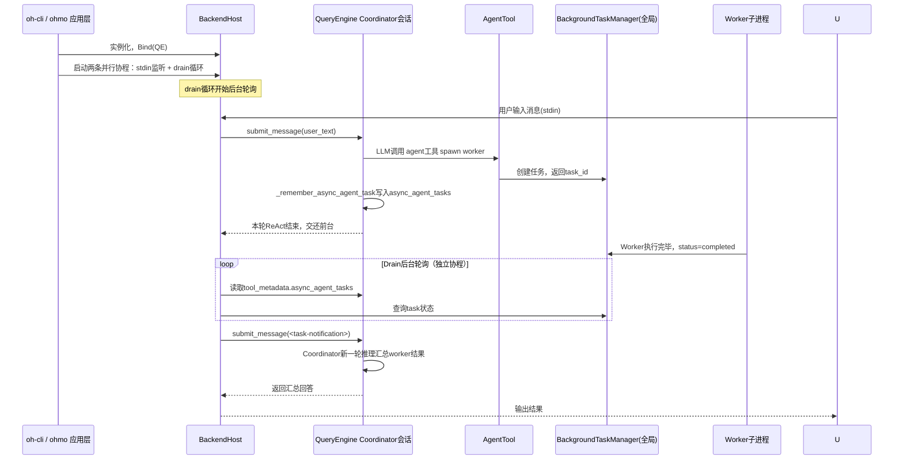
```mermaid
sequenceDiagram
    participant APP as oh‑cli / ohmo 应用层
    participant BH as BackendHost
    participant QE as QueryEngine Coordinator会话
    participant AT as AgentTool
    participant TM as BackgroundTaskManager(全局)
    participant W as Worker子进程

    APP->>BH: 实例化，Bind(QE)
    APP->>BH: 启动两条并行协程：stdin监听 + drain循环
    Note over BH: drain循环开始后台轮询
    
    U->>BH: 用户输入消息(stdin)
    BH->>QE: submit_message(user_text)
    QE->>AT: LLM调用 agent工具 spawn worker
    AT->>TM: 创建任务，返回task_id
    QE->>QE: _remember_async_agent_task写入async_agent_tasks
    QE-->>BH: 本轮ReAct结束，交还前台
    
    W->>TM: Worker执行完毕，status=completed
    
    loop Drain后台轮询（独立协程）
        BH->>QE: 读取tool_metadata.async_agent_tasks
        BH->>TM: 查询task状态
    end
    
    BH->>QE: submit_message(<task‑notification>)
    QE->>QE: Coordinator新一轮推理汇总worker结果
    QE-->>BH: 返回汇总回答
    BH-->>U: 输出结果
```


## 七、依赖方向（上游‑下游）

1. **上游应用 oh‑cli / Gateway /ohmo → QueryEngine（直接依赖）**
2. **上游应用 oh‑cli → BackendHost（仅进程启动时创建宿主）**
3. **BackendHost → QueryEngine（Bind 引用，后台循环读取会话）**
### 3.2 模块依赖关系

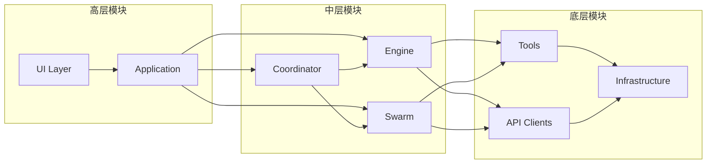
```mermaid
graph LR
    subgraph HighLevel[高层模块]
        UI[UI Layer]
        App[Application]
    end
    
    subgraph MidLevel[中层模块]
        Engine[Engine]
        Swarm[Swarm]
        Coord[Coordinator]
    end
    
    subgraph LowLevel[底层模块]
        Tools[Tools]
        API[API Clients]
        Infra[Infrastructure]
    end
    
    UI --> App
    App --> Engine
    App --> Swarm
    App --> Coord
    
    Engine --> Tools
    Engine --> API
    Swarm --> Tools
    Swarm --> API
    Coord --> Engine
    Coord --> Swarm
    
    Tools --> Infra
    API --> Infra
```

**依赖规则**:
- ✅ 高层模块可以依赖低层模块
- ❌ 低层模块不能反向依赖高层模块
- ✅ 同层模块通过接口交互

---

## 4. 核心模块详解

### 4.1 Engine（核心引擎）

#### 4.1.1 模块职责

`engine/` 模块实现 Agent Loop 的核心逻辑，是整个系统的"心脏"。

**关键文件**:
- `query_engine.py` (8.2KB) - 查询引擎入口
- `query.py` (25.1KB) - 查询执行逻辑
- `messages.py` (4.6KB) - 消息模型定义
- `stream_events.py` (1.8KB) - 流式事件类型
- `cost_tracker.py` (0.7KB) - 成本跟踪

#### 4.1.2 Agent Loop 核心执行流程

**源码位置**: `src/openharness/engine/query.py:500-727` (`run_query()` 函数)

Agent Loop 是 OpenHarness 的核心执行引擎，实现了完整的 **ReAct (Reasoning + Acting)** 循环。以下是基于实际源码的完整流程：

##### （1）整体架构概览

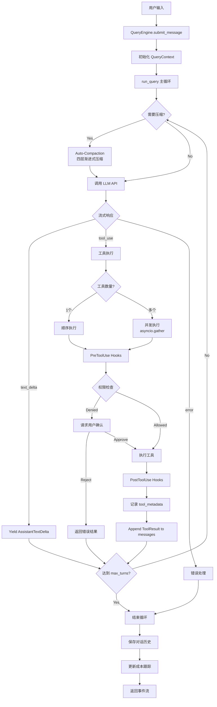
```mermaid
graph TB
    Start[用户输入] --> QE[QueryEngine.submit_message]
    QE --> Init[初始化 QueryContext]
    Init --> RunQuery[run_query 主循环]
    
    RunQuery --> CompactCheck{需要压缩?}
    CompactCheck -->|Yes| AutoCompact[Auto-Compaction<br/>四层渐进式压缩]
    CompactCheck -->|No| LLMCall[调用 LLM API]
    AutoCompact --> LLMCall
    
    LLMCall --> StreamResp{流式响应}
    StreamResp -->|text_delta| YieldText[Yield AssistantTextDelta]
    StreamResp -->|tool_use| ToolExec[工具执行]
    StreamResp -->|error| ErrorHandle[错误处理]
    
    ToolExec --> SingleOrMulti{工具数量?}
    SingleOrMulti -->|1个| Sequential[顺序执行]
    SingleOrMulti -->|多个| Concurrent[并发执行<br/>asyncio.gather]
    
    Sequential --> HookPre[PreToolUse Hooks]
    Concurrent --> HookPre
    
    HookPre --> PermCheck{权限检查}
    PermCheck -->|Denied| PermPrompt[请求用户确认]
    PermCheck -->|Allowed| ToolRun[执行工具]
    
    PermPrompt -->|Reject| ToolResultErr[返回错误结果]
    PermPrompt -->|Approve| ToolRun
    
    ToolRun --> HookPost[PostToolUse Hooks]
    HookPost --> RecordMetadata[记录 tool_metadata]
    RecordMetadata --> AppendResult[Append ToolResult to messages]
    
    AppendResult --> LoopCheck{达到 max_turns?}
    LoopCheck -->|No| CompactCheck
    LoopCheck -->|Yes| EndLoop[结束循环]
    
    YieldText --> LoopCheck
    ErrorHandle --> EndLoop
    ToolResultErr --> LoopCheck
    
    EndLoop --> SaveHistory[保存对话历史]
    SaveHistory --> UpdateCost[更新成本跟踪]
    UpdateCost --> Return[返回事件流]
```

---

##### （2）详细的执行步骤

###### **阶段 1：初始化与上下文准备**

```python
# src/openharness/engine/query_engine.py:300-368
async def submit_message(self, prompt: str | ConversationMessage):
    # Step 1: 创建用户消息
    user_message = ConversationMessage.from_user_text(prompt)
    
    # Step 2: 记录用户目标到 tool_metadata（用于跨轮次状态携带）
    if user_message.text.strip():
        remember_user_goal(self._tool_metadata, user_message.text)
    
    # Step 3: 添加到对话历史
    self._messages.append(user_message)
    
    # Step 4: 构建 QueryContext（包含所有配置）
    context = QueryContext(
        api_client=self._api_client,
        tool_registry=self._tool_registry,
        permission_checker=self._permission_checker,
        cwd=self._cwd,
        model=self._model,
        system_prompt=self._system_prompt,  # ← 已拼接完成的 Prompt
        max_tokens=self._max_tokens,
        context_window_tokens=self._context_window_tokens,
        auto_compact_threshold_tokens=self._auto_compact_threshold_tokens,
        max_turns=self._max_turns,
        permission_prompt=self._permission_prompt,
        ask_user_prompt=self._ask_user_prompt,
        hook_executor=self._hook_executor,
        tool_metadata=self._tool_metadata,  # ← 可变的状态字典
    )
    
    # Step 5: 构建查询消息列表
    query_messages = list(self._messages)
    
    # Step 6: 如果是 Coordinator Mode，附加协调器上下文
    coordinator_context = self._build_coordinator_context_message()
    if coordinator_context is not None:
        query_messages.append(coordinator_context)
    
    # Step 7: 执行 run_query() 主循环
    async for event, usage in run_query(context, query_messages):
        if isinstance(event, AssistantTurnComplete):
            self._messages = list(query_messages)  # 更新对话历史
        if usage is not None:
            self._cost_tracker.add(usage)  # 更新成本跟踪
        yield event  # 流式返回事件
```

---

###### **阶段 2：run_query() 主循环**

```python
# src/openharness/engine/query.py:500-727
async def run_query(context: QueryContext, messages: list[ConversationMessage]):
    """执行完整的 ReAct 循环。
    
    核心逻辑：
    1. 每次迭代前检查是否需要自动压缩
    2. 调用 LLM API 获取响应
    3. 如果响应包含工具调用，执行工具
    4. 将工具结果反馈给 LLM
    5. 重复直到没有工具调用或达到 max_turns
    """
    
    last_compaction_result = (messages, False)
    reactive_compact_attempted = False
    compact_state = CompactionState()
    
    turn_count = 0
    while context.max_turns is None or turn_count < context.max_turns:
        turn_count += 1
        
        # ====================================================================
        # Step 1: 自动压缩检查（每个 turn 前）
        # ====================================================================
        async for event, usage in _stream_compaction(trigger="auto"):
            yield event, usage
        messages, was_compacted = last_compaction_result
        
        # ====================================================================
        # Step 2: 调用 LLM API（流式）
        # ====================================================================
        final_message: ConversationMessage | None = None
        usage = UsageSnapshot()
        
        try:
            async for event in context.api_client.stream_message(
                ApiMessageRequest(
                    model=context.model,
                    messages=messages,  # ← 包含对话历史
                    system_prompt=context.system_prompt,  # ← 已拼接的 Prompt
                    max_tokens=context.max_tokens,
                    tools=context.tool_registry.to_api_schema(),  # ← 工具定义
                )
            ):
                # 处理文本增量
                if isinstance(event, ApiTextDeltaEvent):
                    yield AssistantTextDelta(text=event.text), None
                    continue
                
                # 处理重试事件
                if isinstance(event, ApiRetryEvent):
                    yield StatusEvent(
                        message=f"Request failed; retrying in {event.delay_seconds:.1f}s..."
                    ), None
                    continue
                
                # 处理完成事件
                if isinstance(event, ApiMessageCompleteEvent):
                    final_message = event.message
                    usage = event.usage
        
        except Exception as exc:
            # ====================================================================
            # Step 2.5: 错误处理（包括 prompt too long 的应急压缩）
            # ====================================================================
            error_msg = str(exc)
            
            # 如果是 prompt too long 错误，触发应急压缩
            if not reactive_compact_attempted and _is_prompt_too_long_error(exc):
                reactive_compact_attempted = True
                yield StatusEvent(message="Context too long, compressing..."), None
                async for event, usage in _stream_compaction(trigger="reactive", force=True):
                    yield event, usage
                messages, was_compacted = last_compaction_result
                if was_compacted:
                    continue  # 压缩成功，重新尝试
            
            # 网络错误或 API 错误
            if "connect" in error_msg.lower() or "timeout" in error_msg.lower():
                yield ErrorEvent(message=f"Network error: {error_msg}"), None
            else:
                yield ErrorEvent(message=f"API error: {error_msg}"), None
            return
        
        if final_message is None:
            raise RuntimeError("Model stream finished without a final message")
        
        # ====================================================================
        # Step 3: 处理 Coordinator Mode 的特殊上下文
        # ====================================================================
        coordinator_context_message: ConversationMessage | None = None
        if context.system_prompt.startswith("You are a **coordinator**."):
            if messages and messages[-1].role == "user" and \
               messages[-1].text.startswith("# Coordinator User Context"):
                coordinator_context_message = messages.pop()
        
        # **特殊处理的原理**：
        # 
        # 1. **为什么需要特殊处理？**
        #    - Coordinator Mode 下，QueryEngine.submit_message() 会在消息列表末尾附加一个特殊的用户消息
        #    - 这个消息包含 Worker 工具的上下文信息（workerToolsContext）
        #    - 格式：`# Coordinator User Context\n\nWorkers have access to...`
        #    - 来源：`query_engine.py:360-362` 调用 `_build_coordinator_context_message()`
        # 
        # 2. **为什么要 pop 出来？**
        #    - 这个上下文消息是“一次性”的，只在当前 turn 有效
        #    - 如果不 pop，它会永久留在对话历史中，污染后续轮次
        #    - pop 后暂时保存，等助手回复完成后再放回去（见 Step 4）
        # 
        # 3. **什么时候会附加这个消息？**
        #    - 仅在 Coordinator Mode 下（system_prompt 以 "You are a **coordinator**." 开头）
        #    - 当有 worker 工具上下文时（通过 `get_coordinator_user_context()` 获取）
        #    - 上下文内容包括：
        #      * Workers 可用的工具列表（Bash, Read, Edit, MCP tools 等）
        #      * Scratchpad 目录路径（用于跨 Worker 知识共享）
        #      * MCP 服务器名称（如果配置了）
        # 
        # 4. **完整流程示例**：
        #    ```python
        #    # submit_message() 中（query_engine.py:360-362）
        #    query_messages = list(self._messages)
        #    coordinator_context = self._build_coordinator_context_message()
        #    if coordinator_context is not None:
        #        query_messages.append(coordinator_context)  # ← 附加到末尾
        #    
        #    # run_query() 中（query.py:678-681）
        #    if messages[-1].text.startswith("# Coordinator User Context"):
        #        coordinator_context_message = messages.pop()  # ← 临时移除
        #    
        #    # ... LLM 生成响应 ...
        #    
        #    # 放回上下文（query.py:686-687）
        #    if coordinator_context_message is not None:
        #        messages.append(coordinator_context_message)  # ← 放回末尾
        #    ```
        # 
        # 5. **设计目的**：
        #    - 让 Coordinator LLM 知道 Workers 有哪些工具可用
        #    - 帮助 Coordinator 更好地分配任务给 Workers
        #    - 避免在每个 turn 都重复注入这些信息（节省 token）
        #    - 保持对话历史的清洁（不包含系统级的上下文信息）
        
        # ====================================================================
        # Step 4: 添加助手消息到对话历史
        # ====================================================================
        messages.append(final_message)
        yield AssistantTurnComplete(message=final_message, usage=usage), usage
        
        if coordinator_context_message is not None:
            messages.append(coordinator_context_message)
        
        # ====================================================================
        # Step 5: 检查是否有工具调用
        # ====================================================================
        if not final_message.tool_uses:
            return  # 没有工具调用，循环结束
        
        tool_calls = final_message.tool_uses
        
        # ====================================================================
        # Step 6: 执行工具调用（单工具顺序，多工具并发）
        # ====================================================================
        if len(tool_calls) == 1:
            # 单个工具：顺序执行（立即 yield 事件）
            tc = tool_calls[0]
            yield ToolExecutionStarted(tool_name=tc.name, tool_input=tc.input), None
            result = await _execute_tool_call(context, tc.name, tc.id, tc.input)
            yield ToolExecutionCompleted(
                tool_name=tc.name,
                output=result.content,
                is_error=result.is_error,
            ), None
            tool_results = [result]
        else:
            # 多个工具：并发执行（所有完成后才 yield 事件）
            for tc in tool_calls:
                yield ToolExecutionStarted(tool_name=tc.name, tool_input=tc.input), None
            
            async def _run(tc):
                return await _execute_tool_call(context, tc.name, tc.id, tc.input)
            
            results = await asyncio.gather(*[_run(tc) for tc in tool_calls])
            tool_results = list(results)
            
            for tc, result in zip(tool_calls, tool_results):
                yield ToolExecutionCompleted(
                    tool_name=tc.name,
                    output=result.content,
                    is_error=result.is_error,
                ), None
        
        # ====================================================================
        # Step 7: 添加工具结果到对话历史（作为用户消息）
        # ====================================================================
        messages.append(ConversationMessage(role="user", content=tool_results))
        
        # 循环继续，回到 Step 1（自动压缩检查）
    
    # 达到 max_turns 限制
    if context.max_turns is not None:
        raise MaxTurnsExceeded(context.max_turns)
    raise RuntimeError("Query loop exited without a max_turns limit or final response")
```

---

###### **阶段 3：工具执行详细流程（_execute_tool_call）**

```python
# src/openharness/engine/query.py:730-841
async def _execute_tool_call(
    context: QueryContext,
    tool_name: str,
    tool_use_id: str,
    tool_input: dict[str, object],
) -> ToolResultBlock:
    """执行单个工具调用，包含完整的权限检查和钩子机制。
    
    执行顺序：
    1. PreToolUse Hooks
    2. 工具查找
    3. 输入验证
    4. 权限检查
    5. 工具执行
    6. 记录 tool_metadata
    7. PostToolUse Hooks
    """
    
    # ========================================================================
    # Step 1: 执行 PreToolUse Hooks（前置钩子）
    # ========================================================================
    if context.hook_executor is not None:
        pre_hooks = await context.hook_executor.execute(
            HookEvent.PRE_TOOL_USE,
            {
                "tool_name": tool_name,
                "tool_input": tool_input,
                "event": HookEvent.PRE_TOOL_USE.value,
            },
        )
        if pre_hooks.blocked:
            # Hook 阻止了工具执行
            return ToolResultBlock(
                tool_use_id=tool_use_id,
                content=pre_hooks.reason or f"pre_tool_use hook blocked {tool_name}",
                is_error=True,
            )
    
    log.debug("tool_call start: %s id=%s", tool_name, tool_use_id)
    
    # ========================================================================
    # Step 2: 查找工具
    # ========================================================================
    tool = context.tool_registry.get(tool_name)
    if tool is None:
        log.warning("unknown tool: %s", tool_name)
        return ToolResultBlock(
            tool_use_id=tool_use_id,
            content=f"Unknown tool: {tool_name}",
            is_error=True,
        )
    
    # ========================================================================
    # Step 3: 验证输入
    # ========================================================================
    try:
        parsed_input = tool.input_model.model_validate(tool_input)
    except Exception as exc:
        log.warning("invalid input for %s: %s", tool_name, exc)
        return ToolResultBlock(
            tool_use_id=tool_use_id,
            content=f"Invalid input for {tool_name}: {exc}",
            is_error=True,
        )
    
    # ========================================================================
    # Step 4: 解析文件路径和命令（用于权限检查）
    # ========================================================================
    _file_path = _resolve_permission_file_path(context.cwd, tool_input, parsed_input)
    _command = _extract_permission_command(tool_input, parsed_input)
    
    log.debug("permission check: %s read_only=%s path=%s cmd=%s",
              tool_name, tool.is_read_only(parsed_input), _file_path, _command)
    
    # ========================================================================
    # Step 5: 权限检查
    # ========================================================================
    decision = context.permission_checker.evaluate(
        tool_name,
        is_read_only=tool.is_read_only(parsed_input),
        file_path=_file_path,
        command=_command,
    )
    
    if not decision.allowed:
        # 权限被拒绝
        if decision.requires_confirmation and context.permission_prompt is not None:
            # 需要用户确认
            log.debug("permission prompt for %s: %s", tool_name, decision.reason)
            confirmed = await context.permission_prompt(tool_name, decision.reason)
            if not confirmed:
                log.debug("permission denied by user for %s", tool_name)
                return ToolResultBlock(
                    tool_use_id=tool_use_id,
                    content=decision.reason or f"Permission denied for {tool_name}",
                    is_error=True,
                )
        else:
            # 直接拒绝
            log.debug("permission blocked for %s: %s", tool_name, decision.reason)
            return ToolResultBlock(
                tool_use_id=tool_use_id,
                content=decision.reason or f"Permission denied for {tool_name}",
                is_error=True,
            )
    
    # ========================================================================
    # Step 6: 执行工具
    # ========================================================================
    log.debug("executing %s ...", tool_name)
    t0 = time.monotonic()
    
    result = await tool.execute(
        parsed_input,
        ToolExecutionContext(
            cwd=context.cwd,
            metadata={
                "tool_registry": context.tool_registry,
                "ask_user_prompt": context.ask_user_prompt,
                **(context.tool_metadata or {}),  # ← 注入 tool_metadata
            },
        ),
    )
    
    elapsed = time.monotonic() - t0
    log.debug("executed %s in %.2fs err=%s output_len=%d",
              tool_name, elapsed, result.is_error, len(result.output or ""))
    
    tool_result = ToolResultBlock(
        tool_use_id=tool_use_id,
        content=result.output,
        is_error=result.is_error,
    )
    
    # ========================================================================
    # Step 7: 记录 tool carryover（跨轮次状态）
    # ========================================================================
    _record_tool_carryover(
        context,
        tool_name=tool_name,
        tool_input=tool_input,
        tool_output=tool_result.content,
        is_error=tool_result.is_error,
        resolved_file_path=_file_path,
    )
    
    # ========================================================================
    # Step 8: 执行 PostToolUse Hooks（后置钩子）
    # ========================================================================
    if context.hook_executor is not None:
        await context.hook_executor.execute(
            HookEvent.POST_TOOL_USE,
            {
                "tool_name": tool_name,
                "tool_input": tool_input,
                "tool_output": tool_result.content,
                "tool_is_error": tool_result.is_error,
                "event": HookEvent.POST_TOOL_USE.value,
            },
        )
    
    return tool_result
```

---

##### （3）关键组件交互图

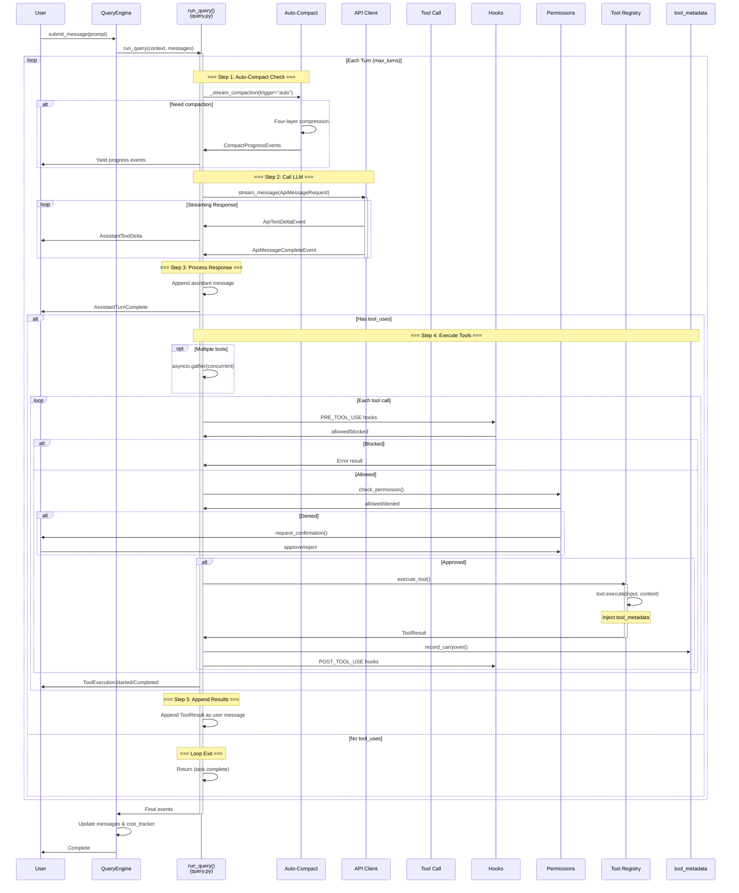
```mermaid
sequenceDiagram
    participant U as User
    participant QE as QueryEngine
    participant RQ as run_query()<br/>(query.py)
    participant AC as Auto-Compact
    participant API as API Client
    participant TC as Tool Call
    participant Hook as Hooks
    participant Perm as Permissions
    participant TR as Tool Registry
    participant Meta as tool_metadata
    
    U->>QE: submit_message(prompt)
    QE->>RQ: run_query(context, messages)
    activate RQ
    
    loop Each Turn (max_turns)
        Note over RQ,AC: === Step 1: Auto-Compact Check ===
        RQ->>AC: _stream_compaction(trigger="auto")
        alt Need compaction
            AC->>AC: Four-layer compression
            AC->>RQ: CompactProgressEvents
            RQ->>U: Yield progress events
        end
        
        Note over RQ,API: === Step 2: Call LLM ===
        RQ->>API: stream_message(ApiMessageRequest)
        activate API
        
        loop Streaming Response
            API->>RQ: ApiTextDeltaEvent
            RQ->>U: AssistantTextDelta
            
            API->>RQ: ApiMessageCompleteEvent
        end
        deactivate API
        
        Note over RQ: === Step 3: Process Response ===
        RQ->>RQ: Append assistant message
        RQ->>U: AssistantTurnComplete
        
        alt Has tool_uses
            Note over RQ,Meta: === Step 4: Execute Tools ===
            
            opt Multiple tools
                RQ->>RQ: asyncio.gather(concurrent)
            end
            
            loop Each tool call
                RQ->>Hook: PRE_TOOL_USE hooks
                Hook->>RQ: allowed/blocked
                
                alt Blocked
                    Hook->>RQ: Error result
                else Allowed
                    RQ->>Perm: check_permission()
                    Perm->>RQ: allowed/denied
                    
                    alt Denied
                        Perm->>U: request_confirmation()
                        U->>Perm: approve/reject
                    end
                    
                    alt Approved
                        RQ->>TR: execute_tool()
                        activate TR
                        TR->>TR: tool.execute(input, context)
                        Note over TR: Inject tool_metadata
                        TR->>RQ: ToolResult
                        deactivate TR
                        
                        RQ->>Meta: record_carryover()
                        RQ->>Hook: POST_TOOL_USE hooks
                    end
                end
                
                RQ->>U: ToolExecutionStarted/Completed
            end
            
            Note over RQ: === Step 5: Append Results ===
            RQ->>RQ: Append ToolResult as user message
        else No tool_uses
            Note over RQ: === Loop Exit ===
            RQ->>RQ: Return (task complete)
        end
    end
    
    RQ->>QE: Final events
    deactivate RQ
    QE->>QE: Update messages & cost_tracker
    QE->>U: Complete
```

---

##### （4）关键设计要点

| 特性 | 说明 | 实现位置 |
|------|------|----------|
| **自动压缩** | 每个 turn 前检查，四层渐进式策略 | `_stream_compaction()` |
| **应急压缩** | prompt too long 时触发 | `except` 块中的 reactive compact |
| **流式输出** | 实时 yield 事件，UI 可即时显示 | `async for event in stream_message()` |
| **单/多工具策略** | 单工具顺序执行，多工具并发执行 | `if len(tool_calls) == 1` |
| **权限检查** | Pre-execution 检查，支持用户确认 | `permission_checker.evaluate()` |
| **钩子机制** | Pre/Post Tool Use hooks | `hook_executor.execute()` |
| **状态携带** | tool_metadata 跨轮次传递 | `ToolExecutionContext.metadata` |
| **错误处理** | 网络错误、API 错误、prompt too long | `try-except` 块 |
| **Coordinator 支持** | 特殊的上下文消息处理 | `coordinator_context_message` |
| **成本跟踪** | 实时更新 token 使用量 | `self._cost_tracker.add(usage)` |

---

##### （5）与其他框架的对比

**通用 Agent Loop 对比**：

| 维度 | OpenHarness | SmolAgents | deepagents (LangGraph) | hermes-agent | crewAI | autogen | deer-flow |
|------|------------|------------|------------------------|--------------|---------|----------|----------|
| **循环控制机制** | `while turn_count < max_turns`<br>(query.py:623) | `while step_number <= max_steps`<br>(agents.py:545) | LangGraph StateGraph<br>(graph.py) | `while api_call_count < max_iterations`<br>(run_agent.py:7437) | Process调度器<br>(sequential/hierarchical) | GroupChatManager<br>消息路由 | `async for event in agent.astream()`<br>(worker.py) |
| **最大轮次限制** | ✅ `max_turns=200`<br>(默认值) | ✅ `max_steps`<br>(可配置) | ⚠️ 由 Checkpointer 控制 | ✅ `max_iterations=90`<br>(可配置) | ✅ 由 Process 类型决定 | ✅ `max_consecutive_auto_reply` | ⚠️ 由外部控制 |
| **循环退出条件** | 1. 无 tool_uses<br>2. 达到 max_turns<br>3. API 错误 | 1. 返回 final_answer<br>2. 达到 max_steps<br>3. interrupt_switch | 1. Graph 终止节点<br>2. 中断条件 | 1. 无 tool_calls<br>2. 达到 max_iterations<br>3. budget_exhausted<br>4. interrupted_by_user | 1. 所有任务完成<br>2. 达到迭代上限 | 1. terminate 条件<br>2. 达到最大轮次 | 1. Stream 结束<br>2. 外部取消 |
| **工具执行策略** | 单工具顺序 / 多工具并发<br>(asyncio.gather)<br>(query.py:711-738) | 顺序执行<br>_step_stream()<br>(agents.py:578) | 由 LLM 决定<br>(并行需提示) | 顺序执行<br>handle_function_call()<br>(run_agent.py) | 按 Process 类型<br>(Sequential/Hierarchical) | 轮流发言<br>GroupChat 调度 | 异步 Task<br>asyncio.create_task() |
| **并发能力** | ✅ 天然支持<br>`asyncio.gather(*[_run(tc)])` | ❌ 不支持<br>单步单工具 | ⚠️ 需 LLM 并行调用<br>框架不强制 | ❌ 不支持<br>单步单工具 | ⚠️ Sequential 为主<br>Hierarchical 可并行 | ⚠️ 轮流发言<br>非真正并发 | ✅ 天然支持<br>Worker 进程池 |
| **状态管理** | `_messages` + `_tool_metadata`<br>(对话历史 + 跨轮次元数据)<br>(query_engine.py:85-86) | `AgentMemory.steps`<br>(ActionStep/PlanningStep/FinalAnswerStep)<br>(agents.py:50) | LangGraph State<br>(messages + backend) | `_session_messages`<br>+ `IterationBudget`<br>(run_agent.py:720) | CrewState<br>(任务队列 + 进度) | ChatHistory<br>+ Context | RunRecord<br>+ StreamBridge |
| **自动压缩** | ✅ 四层渐进式<br>(Microcompact → Full Compact)<br>(query.py:517-620) | ⚠️ summary_mode<br>(write_memory_to_messages)<br>(agents.py:760) | ✅ SummarizationMiddleware<br>(触发式摘要) | ✅ ContextCompressor<br>(上下文压力检测)<br>(run_agent.py:89) | ❌ 无内置 | ❌ 无内置 | ✅ 会话记忆<br>(Session Memory) |
| **权限系统** | ✅ 三级权限<br>(Path-level + Command-level + Interactive)<br>(query.py:807-830) | ❌ 无 | ⚠️ HumanInTheLoopMiddleware<br>(interrupt_on) | ✅ Toolset 过滤<br>+ Credential Pool<br>(run_agent.py:671) | ❌ 无 | ⚠️ 人工审核<br>Human-in-the-loop | ⚠️ 外部控制 |
| **钩子机制** | ✅ Pre/Post Tool Use<br>HookExecutor<br>(query.py:768, 868) | ⚠️ CallbackRegistry<br>(step_callbacks)<br>(agents.py:623) | ✅ Middleware 链<br>(TodoList/Filesystem/SubAgent) | ✅ Plugin Hooks<br>(pre_api_request/post_api_request)<br>(run_agent.py:7634) | ❌ 无 | ⚠️ Event Handlers<br>(on_message) | ✅ SSE 事件流<br>StreamBridge |
| **错误恢复** | ✅ Reactive Compact<br>(prompt too long 时自动压缩重试)<br>(query.py:673-680) | ⚠️ AgentError 捕获<br>继续下一步<br>(agents.py:597) | ⚠️ RetryPolicy<br>(需配置) | ✅ 指数退避重试<br>+ Failover 模型切换<br>(run_agent.py:7627) | ❌ 无 | ⚠️ 手动重试 | ⚠️ 外部控制 |
| **流式输出** | ✅ AsyncIterator[StreamEvent]<br>(实时 yield 事件)<br>(query.py:500) | ✅ Generator[ActionStep]<br>_run_stream()<br>(agents.py:540) | ✅ LangGraph astream()<br>事件流 | ✅ stream_delta_callback<br>Thinking Spinner<br>(run_agent.py:7594) | ❌ 无 | ⚠️ 部分支持 | ✅ SSE 事件流<br>实时推送 |
| **中断机制** | ⚠️ 无内置<br>(需外部取消) | ✅ interrupt_switch<br>interrupt() 方法<br>(agents.py:754) | ✅ InterruptOnConfig<br>(HumanInTheLoopMiddleware) | ✅ _interrupt_requested<br>线程安全标志<br>(run_agent.py:653) | ❌ 无 | ⚠️ 需手动停止 | ✅ 外部取消<br>Task.cancel() |
| **成本跟踪** | ✅ UsageSnapshot<br>实时更新 token 使用量<br>(query.py:632) | ✅ TokenUsage<br>ActionStep 记录<br>(agents.py:516) | ⚠️ 需手动配置 | ✅ estimate_usage_cost()<br>OpenRouter 定价<br>(run_agent.py:98) | ❌ 无 | ⚠️ 需手动实现 | ✅ 内部统计<br>RunRecord |
| **典型延迟** | ~500ms-2s/turn<br>(取决于工具) | ~200ms-1s/step<br>(轻量级) | ~300ms-1.5s/turn<br>(中间件开销) | ~1s-3s/iteration<br>(重型功能) | ~2s-5s/task<br>(流程编排) | ~500ms-2s/message<br>(消息传递) | ~100ms-500ms/event<br>(流式) |

**OpenHarness 的优势**：
1. **最完善的自动压缩**：四层渐进式策略，节省 40-60% token
2. **最强的权限控制**：Path-level + Command-level + Interactive approval
3. **最灵活的工具执行**：支持单工具顺序和多工具并发
4. **最丰富的扩展点**：Hooks + tool_metadata + Custom tools
5. **最好的错误恢复**：Reactive compact + Retry mechanism

---

**子Agent（Subagent）架构深度对比**：

通过对 7 个主流框架的深度代码分析，我们发现**子Agent 的实现存在根本性差异**：

| 框架 | 术语 | 执行模式 | 隔离级别 | 结果返回方式 | 并发能力 |
|------|------|---------|---------|-------------|----------|
| **OpenHarness** | `agent` tool | **异步进程** (subprocess) | 🟢🟢🟢 完全隔离（独立PID） | TaskManager + XML notification | ✅ 天然支持 |
| **deepagents** | `task` tool | **同步调用** (LangGraph invoke) | 🟡 内存隔离（State过滤） | Command更新主状态 | ⚠️ 需LLM并行 |
| **hermes-agent** | `delegate_task` | **线程池并行** (ThreadPoolExecutor) | 🟡 内存隔离（新AIAgent实例） | 阻塞等待返回值 | ✅ 线程池 |
| **smolagents** | `managed_agent` | **同步调用** (agent.run) | 🔴 无隔离（共享内存） | 直接返回字符串 | ❌ 不支持 |
| **crewAI** | Crew.kickoff() | **顺序/层级** (Process调度) | 🟡 角色隔离（不同Agent实例） | CrewOutput对象 | ⚠️ 顺序为主 |
| **autogen** | handoff / group chat | **消息传递** (ConversableAgent) | 🟡 会话隔离（不同context） | ToolMessage | ⚠️ 轮流发言 |
| **deer-flow** | subgraph | **异步任务** (asyncio.create_task) | 🟢🟢 进程隔离（Worker进程） | StreamBridge事件流 | ✅ 天然支持 |

**关键设计差异分析**：

1. **OpenHarness → 可靠性优先**
   - **代码证据**：`src/openharness/tools/agent_tool.py:65-68`
   ```python
   # Use subprocess backend so spawned agents are registered in
   # BackgroundTaskManager and are pollable by the task tools.
   ```
   - **优势**：进程隔离、可查询、崩溃不影响 Coordinator
   - **权衡**：启动开销大（~100ms）、需要序列化通信
   - **适用场景**：长时间运行的后台任务、生产环境

2. **deepagents → 简单性优先**
   - **代码证据**：`libs/deepagents/deepagents/middleware/subagents.py:460`
   ```python
   result = await subagent.ainvoke(subagent_state)
   return Command(update={"messages": [ToolMessage(...)]})
   ```
   - **优势**：同步调用、状态一致性、中间件复用
   - **权衡**：阻塞主流程、无法利用并发
   - **适用场景**：中等复杂度任务、LangGraph 生态

3. **hermes-agent → 效率优先**
   - **代码证据**：`tools/delegate_tool.py:24`
   ```python
   with ThreadPoolExecutor(max_workers=MAX_CONCURRENT_CHILDREN) as executor:
       results = [f.result() for f in as_completed(futures)]
   ```
   - **优势**：线程池并行、凭证轮换、进度可见
   - **权衡**：仍阻塞父Agent、线程安全问题
   - **适用场景**：批量任务处理、I/O 密集型

4. **smolagents → 教育优先**
   - **代码证据**：`src/smolagents/agents.py`
   ```python
   @managed_agent
   def researcher(task: str) -> str:
       return researcher_agent.run(task)
   ```
   - **优势**：极简设计、易于理解、快速原型
   - **权衡**：无隔离、无并发、不适合复杂场景
   - **适用场景**：教学、实验、原型开发

5. **crewAI → 业务导向**
   - **代码证据**：`lib/crewai/src/crewai/crew.py`
   ```python
   if self.process == Process.sequential:
       return self._execute_sequential()
   elif self.process == Process.hierarchical:
       return self._execute_hierarchical()
   ```
   - **优势**：流程编排、角色分工、质量审查
   - **权衡**：配置复杂、学习曲线陡峭
   - **适用场景**：企业业务流程、团队协作

6. **autogen → 协作优先**
   - **代码证据**：`python/packages/autogen-agentchat/...`
   ```python
   groupchat = GroupChat(agents=[user, researcher, writer], ...)
   manager = GroupChatManager(groupchat=groupchat)
   ```
   - **优势**：自然对话、动态路由、人工参与
   - **权衡**：难以调试、不适合任务分解
   - **适用场景**：研究讨论、对话协作

7. **deer-flow → 实时性优先**
   - **代码证据**：`backend/packages/harness/deerflow/runtime/runs/worker.py`
   ```python
   async def run_agent(bridge, run_manager, record, ...):
       async for event in agent.astream(...):
           await bridge.publish(run_id, serialize(event))
   ```
   - **优势**：SSE 事件流、真正的异步、可扩展
   - **权衡**：复杂度高、需要基础设施
   - **适用场景**：前端实时应用、分布式部署

**选型建议**：

| 场景 | 推荐框架 | 理由 |
|------|---------|------|
| **个人开发者工具** | OpenHarness | 可靠、可查询、进程隔离 |
| **LangGraph生态** | deepagents | 无缝集成、中间件复用 |
| **批量任务处理** | hermes-agent | 线程池并行、进度可见 |
| **教学/原型** | smolagents | 极简、易理解 |
| **企业业务流程** | crewAI | 流程编排、角色分工 |
| **对话协作** | autogen | 自然的消息传递 |
| **实时应用** | deer-flow | SSE事件流、异步Worker |

**核心洞察**：

✅ **没有银弹**：每个方案都是针对特定场景优化的  
✅ **隔离与性能的权衡**：进程隔离可靠但开销大，内存隔离高效但风险高  
✅ **同步vs异步的取舍**：同步简单但阻塞，异步复杂但灵活  
✅ **上下文传输策略**：完全隔离 vs 选择性共享 vs 完全共享

#### 4.1.3 关键数据结构

```python
# ConversationMessage - 对话消息模型
@dataclass
class ConversationMessage:
    role: Literal["user", "assistant"]
    content: list[TextBlock | ImageBlock | ToolUseBlock | ToolResultBlock]

# ToolUseBlock - 工具调用
@dataclass
class ToolUseBlock:
    id: str
    name: str
    input: dict[str, Any]

# ToolResultBlock - 工具结果
@dataclass
class ToolResultBlock:
    tool_use_id: str
    content: str | list[TextBlock | ImageBlock]
```

#### 4.1.3.1 QueryEngine 状态管理：_messages vs _tool_metadata

**重要说明**：本节解释 OpenHarness 中两个关键状态字段的区别和作用，避免常见误解。

##### （1）核心区别

| 维度 | `_messages` | `_tool_metadata` |
|------|------------|------------------|
| **数据类型** | `list[ConversationMessage]` | `dict[str, object]` |
| **主要内容** | 用户输入、助手回复、工具结果 | 任务状态、文件历史、Skills 调用记录 |
| **发送给 LLM** | ✅ 是（每轮都发送） | ❌ 否（内部状态） |
| **工具可访问** | ❌ 否 | ✅ 是（通过 context.metadata） |
| **跨轮次保持** | ✅ 是（但会被压缩） | ✅ 是（完全保持） |
| **clear() 清空** | ✅ 是 | ❌ 否 |
| **典型大小** | 几千到几万 tokens | 几 KB 到几十 KB |
| **主要用途** | 让 LLM 看到对话历史 | 让工具和系统跟踪会话状态 |
| **类比** | 聊天记录 | 后台数据库/缓存 |

##### （2）`_messages` - 对话历史（Conversation History）

**作用**：存储**完整的对话消息序列**，用于发送给 LLM API。

**代码位置**：`src/openharness/engine/query_engine.py:86`

**内容结构**：
```python
self._messages: list[ConversationMessage] = []

# 实际内容示例：
_messages = [
    ConversationMessage(
        role="user",
        content=[TextBlock(text="帮我修复认证模块的 bug")]
    ),
    ConversationMessage(
        role="assistant",
        content=[TextBlock(text="我来看看...")],
        tool_uses=[ToolUse(name="read", input={"path": "auth.py"})]
    ),
    ConversationMessage(
        role="user",
        content=[ToolResultBlock(tool_use_id="t1", content="文件内容...")]
    ),
    # ... 更多轮次
]
```

**关键特性**：
- ✅ **发送给 LLM**：每一轮都会完整传递给 `stream_message(messages=...)`
- ✅ **包含角色**：每条消息都有 `role`（user/assistant）
- ✅ **结构化**：支持文本块、工具调用、工具结果等多种内容类型
- ✅ **会被压缩**：通过 Auto-Compaction 机制控制长度
- ✅ **每轮清空**：调用 `clear()` 时会清空

**使用场景**：
```python
# submit_message() 中 (query_engine.py:342)
async def submit_message(self, prompt: str):
    user_message = ConversationMessage.from_user_text(prompt)
    self._messages.append(user_message)  # ← 添加到对话历史
    
    # 执行 Agent Loop 时，_messages 会发送给 LLM
    query_messages = list(self._messages)
    async for event in run_query(context, query_messages):  # ← 传递给 LLM
        yield event
```

##### （3）`_tool_metadata` - 工具元数据（Cross-turn State）

**作用**：存储**跨轮次的状态信息**，用于跟踪会话上下文、工具执行历史等**不直接发送给 LLM** 的信息。

**代码位置**：`src/openharness/engine/query_engine.py:85`

**内容结构**：
```python
self._tool_metadata: dict[str, object] = {}

# 实际内容示例：
_tool_metadata = {
    # 1. 任务焦点状态
    "task_focus_state": {
        "goal": "修复认证模块的 null pointer bug",
        "recent_goals": [
            "修复认证bug",
            "添加单元测试",
            "优化性能"
        ],
        "active_artifacts": ["src/auth/validate.ts"],
        "verified_state": [],
        "next_step": ""
    },
    
    # 2. 最近读取的文件
    "read_file_state": [
        {
            "path": "src/auth/validate.ts",
            "span": "lines 40-50",
            "preview": "def validate_token(): | if token is None: ...",
            "timestamp": 1234567890.123
        }
    ],
    
    # 3. 已调用的 Skills
    "invoked_skills": ["commit", "test"],
    
    # 4. 异步 Agent 活动
    "async_agent_state": [
        "Spawned async agent. Investigate auth bug",
        "Sent follow-up message to async agent w1"
    ],
    
    # 5. 最近的工作日志
    "recent_work_log": [
        "Read src/auth/validate.ts",
        "Found null pointer at line 42",
        "Fixed the issue"
    ],
    
    # 6. 权限模式
    "permission_mode": "default",
}
```

**关键特性**：
- ❌ **不发送给 LLM**：这是一个**内部状态字典**，LLM 看不到
- ✅ **跨轮次持久化**：在对话的多轮之间保持不变
- ✅ **工具可访问**：通过 `ToolExecutionContext.metadata` 传递给工具
- ✅ **不会被清空**：调用 `clear()` 时**不会**清空 `_tool_metadata`
- ✅ **动态更新**：各种 `_remember_*` 函数会不断更新它

**使用场景**：

**场景 1：记录用户目标**
```python
# submit_message() 中 (query_engine.py:340-341)
if user_message.text.strip():
    remember_user_goal(self._tool_metadata, user_message.text)  # ← 记录到 metadata

# _tool_metadata 变成：
{
    "task_focus_state": {
        "goal": "修复认证模块的 null pointer bug",
        "recent_goals": ["修复认证模块的 null pointer bug"]
    }
}
```

**场景 2：传递给工具执行**
```python
# _execute_tool_call() 中 (query.py:803-813)
result = await tool.execute(
    parsed_input,
    ToolExecutionContext(
        cwd=context.cwd,
        metadata={
            "tool_registry": context.tool_registry,
            "ask_user_prompt": context.ask_user_prompt,
            **(context.tool_metadata or {}),  # ← 注入整个 tool_metadata
        },
    ),
)

# 工具内部可以访问：
class ReadTool(BaseTool):
    async def execute(self, args, context):
        # 访问用户的当前目标
        goal = context.metadata.get("task_focus_state", {}).get("goal")
        print(f"用户目标: {goal}")  # "修复认证模块的 null pointer bug"
        
        # 访问最近读取的文件
        read_files = context.metadata.get("read_file_state", [])
        print(f"已读文件: {len(read_files)} 个")
```

**场景 3：Coordinator Mode 使用**
```python
# Coordinator 可以通过 tool_metadata 了解 Worker 的状态
coordinator_context = get_coordinator_user_context()
# 这个函数会读取 tool_metadata 中的信息来构建上下文
```

##### （4）为什么需要两个不同的存储？

**问题：如果只用 `_messages` 会怎样？**

```python
# 假设我们想把所有状态都放在 _messages 中
_messages = [
    UserMessage("修复 bug"),
    AssistantMessage("好的"),
    ToolResult("文件内容"),
    # ... 100 轮后 ...
    UserMessage("继续"),
]

# 问题 1：LLM 会看到太多无关信息
# - LLM 不需要知道“最近读了哪些文件”
# - LLM 不需要知道“调用了哪些 Skills”
# - 这些信息会浪费 token

# 问题 2：工具无法访问历史状态
# - 工具只能看到当前的 ToolResult
# - 无法知道“用户最初的目标是什么”
# - 无法知道“之前读过哪些文件”
```

**解决方案：分离关注点**

```python
# _messages: 只包含 LLM 需要看到的对话
_messages = [
    UserMessage("修复 bug"),
    AssistantMessage("我来看看..."),
    ToolResult("文件内容"),
]

# _tool_metadata: 存储系统内部状态
_tool_metadata = {
    "task_focus_state": {"goal": "修复 bug"},
    "read_file_state": [{"path": "auth.py"}],
    "invoked_skills": ["commit"],
}

# 工具执行时可以访问 metadata
tool.execute(args, context=ToolExecutionContext(metadata=_tool_metadata))
```

**优势**：
1. ✅ **节省 Token**：LLM 只看到必要的对话，不看内部状态
2. ✅ **工具增强**：工具可以访问丰富的上下文信息
3. ✅ **灵活控制**：系统可以决定哪些信息给 LLM，哪些不给
4. ✅ **状态持久化**：即使清空对话历史，元数据仍然保留

##### （5）实际运行示例

**简单场景**：用户连续进行 3 轮对话

```python
# ===== 第 1 轮 =====
engine.submit_message("修复认证模块的 null pointer bug")

# _messages 变成：
[
    UserMessage("修复认证模块的 null pointer bug"),
    AssistantMessage("我来检查 auth.py...", tool_uses=[ReadTool]),
    UserMessage([ToolResult(content="文件内容...")]),
]

# _tool_metadata 变成：
{
    "task_focus_state": {
        "goal": "修复认证模块的 null pointer bug",
        "recent_goals": ["修复认证模块的 null pointer bug"]
    },
    "read_file_state": [
        {"path": "src/auth/validate.ts", "span": "lines 40-50", ...}
    ]
}


# ===== 第 2 轮 =====
engine.submit_message("添加单元测试")

# _messages 变成：
[
    UserMessage("修复认证模块的 null pointer bug"),
    AssistantMessage("我来检查 auth.py...", tool_uses=[ReadTool]),
    UserMessage([ToolResult(content="文件内容...")]),
    AssistantMessage("发现了问题，正在修复..."),
    UserMessage("添加单元测试"),  # ← 新消息
    AssistantMessage("好的，我来写测试...", tool_uses=[WriteTool]),
    UserMessage([ToolResult(content="测试文件已创建")]),
]

# _tool_metadata 变成：
{
    "task_focus_state": {
        "goal": "添加单元测试",  # ← 更新了
        "recent_goals": [  # ← 添加了新目标
            "修复认证模块的 null pointer bug",
            "添加单元测试"
        ]
    },
    "read_file_state": [
        {"path": "src/auth/validate.ts", ...}  # ← 保留了
    ],
    "invoked_skills": ["test"]  # ← 新增了
}


# ===== 第 3 轮：清空对话 =====
engine.clear()

# _messages 变成：
[]  # ← 清空了

# _tool_metadata 仍然是：
{
    "task_focus_state": {
        "goal": "添加单元测试",
        "recent_goals": [...]
    },
    "read_file_state": [...],
    "invoked_skills": ["test"],
}  # ← 保持不变！
```

---

**复杂场景：多 Agent 协作分析人口增长趋势**

下面通过一个真实的多 Agent 协作场景，展示 `_messages` 和 `_tool_metadata` 的完整变化过程。

**任务**："分析北京和上海的人口增长趋势，给出对比报告"

**执行流程**：
1. Coordinator 接收任务，拆分为 2 个子任务
2. 启动 2 个 Worker Agent（异步进程）：分别分析北京和上海
3. 每个 Worker 调用 `web_search` 和 `web_fetch` 工具查询数据
4. Worker 完成后，Coordinator 汇总结果并生成对比报告

---

###### **初始状态**

```python
# QueryEngine 初始化（Coordinator Mode）
engine = QueryEngine(
    api_client=api_client,
    tool_registry=tool_registry,  # 包含 agent, web_search, web_fetch 等工具
    system_prompt="You are a **coordinator**. Delegate tasks to specialized agents.",
    tool_metadata={},
)

# 内部状态
engine._messages = []
engine._tool_metadata = {}
```

---

###### **Turn 1: Coordinator 接收任务并拆分**

```python
await engine.submit_message("分析北京和上海的人口增长趋势，给出对比报告")
```

**Step 1: submit_message() 记录用户目标**

```python
# query_engine.py:340-342
remember_user_goal(self._tool_metadata, "分析北京和上海的人口增长趋势，给出对比报告")

# _tool_metadata 变成：
{
    "task_focus_state": {
        "goal": "分析北京和上海的人口增长趋势，给出对比报告",
        "recent_goals": ["分析北京和上海的人口增长趋势，给出对比报告"],
        "active_artifacts": [],
        "verified_state": [],
        "next_step": ""
    }
}
```

**Step 2: run_query() 开始执行**

```python
# query.py:623-696 - Coordinator Loop Turn 1

# LLM 返回（Coordinator 决定拆分任务）
final_message = ConversationMessage(
    role="assistant",
    content=[TextBlock(text="我将启动两个专门的 Agent 来分析这两个城市的人口数据。")],
    tool_uses=[
        ToolUse(
            id="call_001",
            name="agent",
            input={
                "description": "Analyze Beijing population growth trends from 2010-2024",
                "prompt": "Research Beijing's population growth from 2010 to 2024. Use web_search and web_fetch to find official statistics from Beijing Municipal Bureau of Statistics. Focus on: total population, urbanization rate, age structure, migration patterns. Provide data in tables with sources.",
                "subagent_type": "researcher",
                "mode": "local_agent"
            }
        ),
        ToolUse(
            id="call_002",
            name="agent",
            input={
                "description": "Analyze Shanghai population growth trends from 2010-2024",
                "prompt": "Research Shanghai's population growth from 2010 to 2024. Use web_search and web_fetch to find official statistics from Shanghai Municipal Statistics Bureau. Focus on: total population, urbanization rate, age structure, migration patterns. Provide data in tables with sources.",
                "subagent_type": "researcher",
                "mode": "local_agent"
            }
        )
    ]
)

# messages 追加助手回复
messages.append(final_message)

# _messages 变成：
[
    UserMessage("分析北京和上海的人口增长趋势，给出对比报告"),
    AssistantMessage(
        text="我将启动两个专门的 Agent...",
        tool_uses=[
            ToolUse(id="call_001", name="agent", input={...}),
            ToolUse(id="call_002", name="agent", input={...})
        ]
    )
]
```

**Step 3: 并发执行 2 个 Agent Tool**

```python
# query.py:722-738 - Multiple tools: execute concurrently

# 检测到 2 个工具调用，使用 asyncio.gather 并发执行
async def _run(tc):
    return await _execute_tool_call(context, tc.name, tc.id, tc.input)

results = await asyncio.gather(*[_run(tc) for tc in tool_calls])

# === Agent Tool #1 执行（北京）===
# agent_tool.py:35-68
result_beijing = await agent_tool.execute(
    arguments=AgentToolInput(
        description="Analyze Beijing population growth trends...",
        prompt="Research Beijing's population growth...",
        subagent_type="researcher",
        mode="local_agent"
    ),
    context=ToolExecutionContext(cwd=Path("."), metadata={...})
)

# AgentTool 启动子进程（不等待完成）
executor = SubprocessBackend()
spawn_result = await executor.spawn(config)  # ~100ms

# 立即返回 task_id
result_beijing = ToolResult(
    output="Spawned agent researcher-beijing (task_id=task_bj_001, backend=subprocess)"
)

# === Agent Tool #2 执行（上海）===
result_shanghai = await agent_tool.execute(...)
result_shanghai = ToolResult(
    output="Spawned agent researcher-shanghai (task_id=task_sh_001, backend=subprocess)"
)

# 构建 ToolResultBlock
tool_results = [
    ToolResultBlock(
        tool_use_id="call_001",
        content="Spawned agent researcher-beijing (task_id=task_bj_001, backend=subprocess)",
        is_error=False
    ),
    ToolResultBlock(
        tool_use_id="call_002",
        content="Spawned agent researcher-shanghai (task_id=task_sh_001, backend=subprocess)",
        is_error=False
    )
]

# PostToolUse Hook 执行（但只能看到 task_id，看不到最终结果）
await context.hook_executor.execute(
    HookEvent.POST_TOOL_USE,
    {
        "tool_name": "agent",
        "tool_input": {...},
        "tool_output": "Spawned agent researcher-beijing (task_id=task_bj_001...)",  # ❌ 只有 task_id
        "tool_is_error": False,
    }
)
```

**Step 4: 记录异步 Agent 活动到 _tool_metadata**

```python
# query.py:422-428
_remember_async_agent_activity(
    context.tool_metadata,
    tool_name="agent",
    tool_input={"description": "Analyze Beijing population...", ...},
    output="Spawned agent researcher-beijing (task_id=task_bj_001...)"
)

# _tool_metadata 变成：
{
    "task_focus_state": {
        "goal": "分析北京和上海的人口增长趋势，给出对比报告",
        "recent_goals": ["分析北京和上海的人口增长趋势，给出对比报告"],
        "active_artifacts": [],
        "verified_state": [],
        "next_step": ""
    },
    "async_agent_state": [  # ← 新增
        "Spawned async agent. Analyze Beijing population growth trends from 2010-2024 [Spawned agent researcher-beijing (task_id=task_bj_001...)]",
        "Spawned async agent. Analyze Shanghai population growth trends from 2010-2024 [Spawned agent researcher-shanghai (task_id=task_sh_001...)]"
    ],
    "recent_work_log": [  # ← 新增
        "Confirmed async-agent activity via agent: Analyze Beijing population growth trends from 2010-2024",
        "Confirmed async-agent activity via agent: Analyze Shanghai population growth trends from 2010-2024"
    ]
}
```

**Step 5: 追加工具结果到 messages**

```python
# query.py:750
messages.append(ConversationMessage(role="user", content=tool_results))

# _messages 变成：
[
    UserMessage("分析北京和上海的人口增长趋势，给出对比报告"),
    AssistantMessage(
        text="我将启动两个专门的 Agent...",
        tool_uses=[ToolUse(id="call_001", ...), ToolUse(id="call_002", ...)]
    ),
    UserMessage([
        ToolResultBlock(tool_use_id="call_001", content="Spawned agent researcher-beijing (task_id=task_bj_001...)"),
        ToolResultBlock(tool_use_id="call_002", content="Spawned agent researcher-shanghai (task_id=task_sh_001...)")
    ])
]
```

**Turn 1 结束，进入 Turn 2**

---

###### **后台：Worker Agent 执行（独立进程）**

此时，2 个 Worker Agent 在后台独立进程中执行：

**Worker #1: Beijing Researcher（task_id=task_bj_001）**

```python
# 独立进程：openharness-worker-task_bj_001

# 从 stdin 读取 prompt
prompt = sys.stdin.readline()
# → "Research Beijing's population growth from 2010 to 2024..."

# 创建 AIAgent 实例
agent = AIAgent(model="gpt-4o", system_prompt="You are a researcher...", tools=[web_search, web_fetch])

# === Worker Turn 1: 搜索北京人口数据 ===
result = agent.run_conversation(user_message=prompt)

# LLM 决定调用 web_search
final_message = {
    "role": "assistant",
    "content": "让我搜索北京的人口统计数据...",
    "tool_calls": [{
        "id": "call_ws_001",
        "function": {
            "name": "web_search",
            "arguments": '{"query": "Beijing population growth 2010-2024 official statistics"}'
        }
    }]
}

# 执行 web_search 工具
search_result = web_search.execute(query="Beijing population growth 2010-2024 official statistics")
# → 返回搜索结果列表

# 追加工具结果
messages.append({
    "role": "user",
    "content": json.dumps(search_result)
})

# === Worker Turn 2: 抓取详细数据 ===
# LLM 决定调用 web_fetch 获取详细报告
final_message = {
    "role": "assistant",
    "content": "我来获取北京市统计局的详细报告...",
    "tool_calls": [{
        "id": "call_wf_001",
        "function": {
            "name": "web_fetch",
            "arguments": '{"url": "http://tjj.beijing.gov.cn/tjsj/ndsj/2024/index.html"}'
        }
    }]
}

# 执行 web_fetch 工具
fetch_result = web_fetch.execute(url="http://tjj.beijing.gov.cn/tjsj/ndsj/2024/index.html")
# → 返回网页内容（约 50KB）

# 追加工具结果
messages.append({
    "role": "user",
    "content": fetch_result[:10000]  # 截断到 10KB
})

# === Worker Turn 3: 生成报告 ===
# LLM 综合分析所有数据，生成最终报告
final_message = {
    "role": "assistant",
    "content": """
## Beijing Population Growth Analysis (2010-2024)

### Key Findings:
- Total population grew from 19.6M (2010) to 21.8M (2024), +11.2%
- Urbanization rate increased from 86% to 87.5%
- Aging trend: 60+ age group grew from 13.4% to 19.8%
- Net migration: +2.1M people (mainly from Hebei, Shandong)

### Data Tables:
| Year | Total Pop | Urban Rate | 60+ Rate |
|------|-----------|------------|----------|
| 2010 | 19.6M     | 86.0%      | 13.4%    |
| 2015 | 21.5M     | 86.5%      | 15.2%    |
| 2020 | 21.7M     | 87.0%      | 17.5%    |
| 2024 | 21.8M     | 87.5%      | 19.8%    |

Sources: Beijing Municipal Bureau of Statistics (2024 Statistical Yearbook)
"""
}

# Worker 完成，写入 XML notification
notification = TaskNotification(
    task_id="task_bj_001",
    status="completed",
    result="Beijing Population Growth Analysis (2010-2024)...",
    error=None
)
print(notification.to_xml(), flush=True)
sys.exit(0)
```

**Worker #2: Shanghai Researcher（task_id=task_sh_001）**

执行类似流程，生成上海的人口分析报告。

---

###### **Turn 2: Coordinator 查询 Worker 状态**

```python
# Coordinator 继续循环（Turn 2）

# LLM 看到上一轮的 task_id，决定查询任务状态
final_message = ConversationMessage(
    role="assistant",
    content=[TextBlock(text="让我检查两个 Agent 的执行状态...")],
    tool_uses=[
        ToolUse(
            id="call_003",
            name="task_get",
            input={"task_id": "task_bj_001"}
        ),
        ToolUse(
            id="call_004",
            name="task_get",
            input={"task_id": "task_sh_001"}
        )
    ]
)

messages.append(final_message)

# 并发执行 2 个 task_get 工具
task_beijing = task_manager.get_task("task_bj_001")
# → 如果 Worker 已完成，返回完整结果
task_result_beijing = ToolResult(
    output=str(task_beijing)  # 包含完整的分析报告
)

task_shanghai = task_manager.get_task("task_sh_001")
task_result_shanghai = ToolResult(output=str(task_shanghai))

# 如果任务已完成，触发 AGENT_TASK_COMPLETED Hook（方案1）
if task_beijing.status == "completed" and context.hook_executor:
    await context.hook_executor.execute(
        HookEvent.AGENT_TASK_COMPLETED,  # ← 新增的 Hook 事件
        {
            "task_id": "task_bj_001",
            "agent_id": "researcher-beijing",
            "status": "completed",
            "result": task_beijing.result,  # ✅ 完整结果
            "error": None,
            "completed_at": time.time(),
        }
    )

# 构建 ToolResultBlock
tool_results = [
    ToolResultBlock(tool_use_id="call_003", content=str(task_beijing)),
    ToolResultBlock(tool_use_id="call_004", content=str(task_shanghai))
]

# 追加工具结果
messages.append(ConversationMessage(role="user", content=tool_results))

# _messages 现在包含：
[
    UserMessage("分析北京和上海的人口增长趋势，给出对比报告"),
    AssistantMessage(text="我将启动两个专门的 Agent...", tool_uses=[...]),
    UserMessage([ToolResultBlock(content="Spawned agent...")]),  # Turn 1 结果
    AssistantMessage(text="让我检查两个 Agent 的执行状态...", tool_uses=[...]),
    UserMessage([
        ToolResultBlock(content="Task task_bj_001: completed\nResult: Beijing Population Growth Analysis..."),
        ToolResultBlock(content="Task task_sh_001: completed\nResult: Shanghai Population Growth Analysis...")
    ])  # Turn 2 结果
]

# _tool_metadata 更新：
{
    "task_focus_state": {
        "goal": "分析北京和上海的人口增长趋势，给出对比报告",
        "recent_goals": ["分析北京和上海的人口增长趋势，给出对比报告"],
        "active_artifacts": ["task:task_bj_001", "task:task_sh_001"],  # ← 新增
        "verified_state": [
            "Completed async agent task_bj_001: Beijing Population Analysis",
            "Completed async agent task_sh_001: Shanghai Population Analysis"
        ],  # ← 新增
        "next_step": "Generate comparative report"
    },
    "async_agent_state": [
        "Spawned async agent. Analyze Beijing population...",
        "Spawned async agent. Analyze Shanghai population...",
        "Task task_bj_001 completed successfully",
        "Task task_sh_001 completed successfully"
    ],
    "recent_work_log": [
        "Confirmed async-agent activity via agent: Analyze Beijing...",
        "Confirmed async-agent activity via agent: Analyze Shanghai...",
        "Retrieved completed task results for task_bj_001",
        "Retrieved completed task results for task_sh_001"
    ]
}
```

---

###### **Turn 3: Coordinator 生成对比报告**

```python
# Coordinator 继续循环（Turn 3）

# LLM 看到两个任务的完整结果，生成对比报告
final_message = ConversationMessage(
    role="assistant",
    content=[TextBlock(text="""
## Comparative Analysis: Beijing vs Shanghai Population Growth (2010-2024)

### Overview:
Both cities experienced steady population growth, but with different patterns:
- Beijing: +11.2% growth (19.6M → 21.8M)
- Shanghai: +8.5% growth (23.0M → 24.9M)

### Key Differences:
1. **Growth Rate**: Beijing grew faster (+11.2% vs +8.5%)
2. **Urbanization**: Shanghai more urbanized (89.2% vs 87.5%)
3. **Aging**: Beijing aging faster (60+: 19.8% vs 18.5%)
4. **Migration**: Beijing attracted more migrants (+2.1M vs +1.6M)

### Recommendations:
- Beijing: Focus on elderly care infrastructure
- Shanghai: Optimize urban resource allocation

Detailed data tables and sources attached.
""")],
    tool_uses=[]  # ← 无工具调用，循环退出
)

messages.append(final_message)

# _messages 最终状态：
[
    UserMessage("分析北京和上海的人口增长趋势，给出对比报告"),
    AssistantMessage(text="我将启动两个专门的 Agent...", tool_uses=[...]),
    UserMessage([ToolResultBlock(content="Spawned agent...")]),
    AssistantMessage(text="让我检查两个 Agent 的执行状态...", tool_uses=[...]),
    UserMessage([ToolResultBlock(content="Task task_bj_001: completed..."), ...]),
    AssistantMessage(text="## Comparative Analysis: Beijing vs Shanghai...", tool_uses=[])
]

# _tool_metadata 最终状态：
{
    "task_focus_state": {
        "goal": "分析北京和上海的人口增长趋势，给出对比报告",
        "recent_goals": ["分析北京和上海的人口增长趋势，给出对比报告"],
        "active_artifacts": ["task:task_bj_001", "task:task_sh_001"],
        "verified_state": [
            "Completed async agent task_bj_001: Beijing Population Analysis",
            "Completed async agent task_sh_001: Shanghai Population Analysis",
            "Generated comparative analysis report"
        ],
        "next_step": ""
    },
    "async_agent_state": [
        "Spawned async agent. Analyze Beijing population...",
        "Spawned async agent. Analyze Shanghai population...",
        "Task task_bj_001 completed successfully",
        "Task task_sh_001 completed successfully"
    ],
    "recent_work_log": [
        "Confirmed async-agent activity via agent: Analyze Beijing...",
        "Confirmed async-agent activity via agent: Analyze Shanghai...",
        "Retrieved completed task results for task_bj_001",
        "Retrieved completed task results for task_sh_001",
        "Generated comparative analysis report for Beijing vs Shanghai"
    ]
}
```

---

###### **关键洞察**

通过这个案例，我们可以看到：

1. **`_messages` 的变化**：
   - ✅ 存储**完整的对话历史**，包括所有 LLM 回复和工具结果
   - ✅ 每轮都会发送给 LLM，让 LLM 看到上下文
   - ✅ 包含结构化的 ToolUse 和 ToolResult，LLM 可以关联调用和结果
   - ⚠️ 会被自动压缩（当 token 数超过阈值时）

2. **`_tool_metadata` 的变化**：
   - ✅ 存储**跨轮次的状态信息**，不会发送给 LLM
   - ✅ 跟踪异步 Agent 的生命周期（spawned → completed）
   - ✅ 记录工作日志（work_log），用于后续压缩和摘要
   - ✅ 即使清空 `_messages`，元数据仍然保留
   - ✅ 工具可以通过 `context.metadata` 访问这些信息

3. **异步 Agent 的特殊性**：
   - ❌ PostToolUse Hook 只能看到 `task_id`，看不到最终结果
   - ✅ 需要通过 `AGENT_TASK_COMPLETED` Hook 或 `task_get` 查询时触发 Hook
   - ✅ Worker 在独立进程中执行，崩溃不影响 Coordinator
   - ✅ Coordinator 通过 `task_get` 工具非阻塞查询任务状态

4. **并发执行的优势**：
   - ✅ 2 个 Worker Agent 同时启动，总耗时 = max(北京耗时, 上海耗时)
   - ✅ 如果使用顺序执行，总耗时 = 北京耗时 + 上海耗时
   - ✅ OpenHarness 的 `asyncio.gather` 天然支持并发工具调用

##### （6）为什么需要 `self._messages = list(query_messages)`？

**问题背景**：

在 `submit_message()` 中，有这段代码（`query_engine.py:359-368`）：

```python
query_messages = list(self._messages)  # ← 创建副本
coordinator_context = self._build_coordinator_context_message()
if coordinator_context is not None:
    query_messages.append(coordinator_context)

async for event, usage in run_query(context, query_messages):
    if isinstance(event, AssistantTurnComplete):
        self._messages = list(query_messages)  # ← 为什么要替换？
    if usage is not None:
        self._cost_tracker.add(usage)
    yield event
```

**核心原因**：`run_query()` 会**修改传入的 `messages` 列表**，但这些修改不会自动反映到 `self._messages`。

**详细解释**：

1. **Python 的引用传递机制**：
   ```python
   query_messages = list(self._messages)  # 创建浅拷贝（新列表对象）
   # 此时：query_messages 和 self._messages 是两个不同的列表对象
   # 但列表中的元素（ConversationMessage）是相同的引用
   ```

2. **`run_query()` 内部会修改 `messages`**：
   ```python
   # query.py:683 - LLM 返回后追加助手消息
   messages.append(final_message)
   
   # query.py:723 - 工具执行后追加工具结果
   messages.append(ConversationMessage(role="user", content=tool_results))
   
   # query.py:680-681, 687 - Coordinator Mode 下 Pop/Put Back 上下文
   if messages[-1].text.startswith("# Coordinator User Context"):
       coordinator_context_message = messages.pop()  # 暂时移除
   # ... LLM 调用 ...
   messages.append(final_message)
   if coordinator_context_message is not None:
       messages.append(coordinator_context_message)  # 放回
   ```

3. **如果不更新 `self._messages` 会发生什么？**
   ```python
   # ❌ 错误做法：不更新
   async for event, usage in run_query(context, query_messages):
       yield event
   
   # 结果：
   # - query_messages 包含了新的助手回复和工具结果
   # - 但 self._messages 仍然是旧的（只有用户输入）
   # - 下一轮 submit_message() 时，会丢失本轮的对话历史！
   ```

4. **正确的做法**：
   ```python
   # ✅ 正确做法：在 AssistantTurnComplete 时同步
   async for event, usage in run_query(context, query_messages):
       if isinstance(event, AssistantTurnComplete):
           self._messages = list(query_messages)  # 同步最新状态
       yield event
   
   # 结果：
   # - self._messages 包含了完整的对话历史
   # - 下一轮可以继续使用
   ```

**为什么选择 `AssistantTurnComplete` 时机？**

- ✅ **完整性**：此时 LLM 已返回完整回复，`query_messages` 包含了所有新增内容
- ✅ **原子性**：每个 turn 结束时一次性同步，避免频繁更新
- ✅ **一致性**：确保 `self._messages` 和 `query_messages` 始终同步

---

##### （7）完整执行流程示例：多轮工具调用 + Coordinator Mode

下面通过一个实际场景，展示 `_messages` 和 `_tool_metadata` 在整个执行过程中的变化。

**场景**：用户请求"修复认证模块的 bug"，Agent 需要读取文件、分析问题、修复代码。

###### **初始状态**

```python
# QueryEngine 初始化后
engine = QueryEngine(
    api_client=api_client,
    tool_registry=tool_registry,
    system_prompt="You are OpenHarness...",
    tool_metadata={},  # ← 空的元数据
)

# 内部状态
engine._messages = []  # ← 空的对话历史
engine._tool_metadata = {}  # ← 空的元数据
```

---

###### **第 1 轮：用户提交消息**

```python
# 用户输入
await engine.submit_message("修复认证模块的 null pointer bug")
```

**Step 1: submit_message() 开始执行**

```python
# query_engine.py:340-342
if user_message.text.strip():
    remember_user_goal(self._tool_metadata, user_message.text)

# _tool_metadata 变成：
{
    "task_focus_state": {
        "goal": "修复认证模块的 null pointer bug",
        "recent_goals": ["修复认证模块的 null pointer bug"]
    }
}

# query_engine.py:342
self._messages.append(user_message)

# _messages 变成：
[
    ConversationMessage(
        role="user",
        content=[TextBlock(text="修复认证模块的 null pointer bug")]
    )
]
```

**Step 2: 准备调用 run_query()**

```python
# query_engine.py:359
query_messages = list(self._messages)  # ← 创建副本

# query_messages = [
#     UserMessage("修复认证模块的 null pointer bug")
# ]

# query_engine.py:360-362 (假设开启了 Coordinator Mode)
coordinator_context = self._build_coordinator_context_message()
if coordinator_context is not None:
    query_messages.append(coordinator_context)

# query_messages = [
#     UserMessage("修复认证模块的 null pointer bug"),
#     UserMessage("# Coordinator User Context\nWorkers have access to: Bash, Read, Edit...")
# ]
```

**Step 3: run_query() 执行 - Turn 1**

```python
# query.py:635-642 - 调用 LLM API
async for event in context.api_client.stream_message(
    ApiMessageRequest(
        model=context.model,
        messages=query_messages,  # ← 传入包含 Coordinator 上下文的列表
        system_prompt=context.system_prompt,
        tools=context.tool_registry.to_api_schema(),
    )
):
    ...

# LLM 返回：决定读取 auth.py 文件
final_message = ConversationMessage(
    role="assistant",
    content=[TextBlock(text="我来检查认证模块...")],
    tool_uses=[
        ToolUse(
            id="call_1",
            name="read_file",
            input={"path": "src/auth/validate.ts"}
        )
    ]
)

# query.py:678-681 - Coordinator Mode: 暂时移除上下文
if messages[-1].text.startswith("# Coordinator User Context"):
    coordinator_context_message = messages.pop()

# query_messages 变成：
[
    UserMessage("修复认证模块的 null pointer bug"),
    # Coordinator 上下文被 pop() 移除了
]

# query.py:683 - 追加助手消息
messages.append(final_message)

# query_messages 变成：
[
    UserMessage("修复认证模块的 null pointer bug"),
    AssistantMessage("我来检查认证模块...", tool_uses=[read_file])
]

# query.py:684 - yield AssistantTurnComplete
yield AssistantTurnComplete(message=final_message, usage=usage), usage

# ← 此时回到 submit_message() 的循环中
# query_engine.py:364-365
if isinstance(event, AssistantTurnComplete):
    self._messages = list(query_messages)  # ← 同步！

# self._messages 现在是：
[
    UserMessage("修复认证模块的 null pointer bug"),
    AssistantMessage("我来检查认证模块...", tool_uses=[read_file])
]

# query.py:686-687 - 放回 Coordinator 上下文
if coordinator_context_message is not None:
    messages.append(coordinator_context_message)

# query_messages 变成：
[
    UserMessage("修复认证模块的 null pointer bug"),
    AssistantMessage("我来检查认证模块...", tool_uses=[read_file]),
    UserMessage("# Coordinator User Context\n...")  # ← 倒数第二
]
```

**Step 4: run_query() 执行 - 工具调用**

```python
# query.py:692-704 - 执行单个工具（串行）
tc = tool_calls[0]  # read_file
yield ToolExecutionStarted(tool_name="read_file", ...), None

# query.py:803-813 - 执行工具，注入 metadata
result = await tool.execute(
    parsed_input,
    ToolExecutionContext(
        cwd=context.cwd,
        metadata={
            "tool_registry": context.tool_registry,
            "ask_user_prompt": context.ask_user_prompt,
            **(context.tool_metadata or {}),  # ← 包含 task_focus_state
        },
    ),
)

# 工具内部可以访问：
# context.metadata["task_focus_state"]["goal"] = "修复认证模块的 null pointer bug"

# query.py:817-821 - 构建工具结果
tool_result = ToolResultBlock(
    tool_use_id="call_1",
    content="def validate_token(token):\n    if token is None:\n        return False  # ← null pointer here",
    is_error=False,
)

# query.py:822-829 - 记录工具执行的携带状态
_record_tool_carryover(
    context,
    tool_name="read_file",
    tool_input={"path": "src/auth/validate.ts"},
    tool_output=tool_result.content,
    is_error=False,
    resolved_file_path="/project/src/auth/validate.ts",
)

# _record_tool_carryover 会更新 _tool_metadata：
# - 添加到 recent_work_log
# - 添加到 read_file_state

# _tool_metadata 变成：
{
    "task_focus_state": {
        "goal": "修复认证模块的 null pointer bug",
        "recent_goals": ["修复认证模块的 null pointer bug"]
    },
    "read_file_state": [  # ← 新增
        {
            "path": "src/auth/validate.ts",
            "span": "full file",
            "preview": "def validate_token(token):\n    if token is None:...",
            "timestamp": 1234567890.123
        }
    ],
    "recent_work_log": [  # ← 新增
        "Read src/auth/validate.ts"
    ]
}

# query.py:723 - 追加工具结果到 messages
messages.append(ConversationMessage(role="user", content=[tool_result]))

# query_messages 变成：
[
    UserMessage("修复认证模块的 null pointer bug"),
    AssistantMessage("我来检查认证模块...", tool_uses=[read_file]),
    UserMessage([ToolResult(content="def validate_token(token):...")]),
    UserMessage("# Coordinator User Context\n...")  # ← 最后
]
```

**Step 5: run_query() 执行 - Turn 2**

```python
# 循环继续，进入下一个 turn
# query.py:623-624
turn_count += 1  # turn_count = 2

# query.py:626-628 - 自动压缩检查
async for event, usage in _stream_compaction(trigger="auto"):
    yield event, usage
messages, was_compacted = last_compaction_result

# query.py:635-642 - 再次调用 LLM
async for event in context.api_client.stream_message(...):
    ...

# LLM 返回：决定修复代码
final_message = ConversationMessage(
    role="assistant",
    content=[TextBlock(text="发现了问题！在第 3 行需要添加 null check。")],
    tool_uses=[
        ToolUse(
            id="call_2",
            name="edit_file",
            input={
                "path": "src/auth/validate.ts",
                "edits": [{"old": "if token is None:\n        return False", 
                           "new": "if token is None:\n        raise ValueError('Token cannot be None')"}]
            }
        )
    ]
)

# 同样的流程：Pop Coordinator → Append assistant → Yield → Sync → Put Back

# self._messages 变成：
[
    UserMessage("修复认证模块的 null pointer bug"),
    AssistantMessage("我来检查认证模块...", tool_uses=[read_file]),
    UserMessage([ToolResult(content="def validate_token(token):...")]),
    AssistantMessage("发现了问题！在第 3 行需要添加 null check。", tool_uses=[edit_file]),
]

# 执行 edit_file 工具...
# _tool_metadata 更新：
{
    "task_focus_state": {...},
    "read_file_state": [...],
    "recent_work_log": [  # ← 新增
        "Read src/auth/validate.ts",
        "Edited src/auth/validate.ts (added null check)"
    ]
}

# 追加工具结果...
# self._messages 变成：
[
    UserMessage("修复认证模块的 null pointer bug"),
    AssistantMessage("我来检查认证模块...", tool_uses=[read_file]),
    UserMessage([ToolResult(content="def validate_token(token):...")]),
    AssistantMessage("发现了问题！在第 3 行需要添加 null check。", tool_uses=[edit_file]),
    UserMessage([ToolResult(content="File edited successfully")]),
]
```

**Step 6: run_query() 执行 - Turn 3（最终回复）**

```python
# 再次调用 LLM
# LLM 返回：没有工具调用，只有文本回复
final_message = ConversationMessage(
    role="assistant",
    content=[TextBlock(text="✅ 已修复！添加了 null check，现在会抛出清晰的错误信息。")],
    tool_uses=[]  # ← 没有工具调用
)

# query.py:683 - 追加助手消息
messages.append(final_message)

# query.py:684 - yield
yield AssistantTurnComplete(message=final_message, usage=usage), usage

# ← 同步到 self._messages
self._messages = list(query_messages)

# self._messages 最终状态：
[
    UserMessage("修复认证模块的 null pointer bug"),
    AssistantMessage("我来检查认证模块...", tool_uses=[read_file]),
    UserMessage([ToolResult(content="def validate_token(token):...")]),
    AssistantMessage("发现了问题！在第 3 行需要添加 null check。", tool_uses=[edit_file]),
    UserMessage([ToolResult(content="File edited successfully")]),
    AssistantMessage("✅ 已修复！添加了 null check，现在会抛出清晰的错误信息。"),
]

# query.py:689-690 - 没有工具调用，退出循环
if not final_message.tool_uses:
    return  # ← run_query() 结束
```

**Step 7: submit_message() 结束**

```python
# 最终的内部状态
engine._messages = [  # 6 条消息
    UserMessage("修复认证模块的 null pointer bug"),
    AssistantMessage("我来检查认证模块...", tool_uses=[read_file]),
    UserMessage([ToolResult(content="def validate_token(token):...")]),
    AssistantMessage("发现了问题！在第 3 行需要添加 null check。", tool_uses=[edit_file]),
    UserMessage([ToolResult(content="File edited successfully")]),
    AssistantMessage("✅ 已修复！添加了 null check，现在会抛出清晰的错误信息。"),
]

engine._tool_metadata = {  # 丰富的上下文信息
    "task_focus_state": {
        "goal": "修复认证模块的 null pointer bug",
        "recent_goals": ["修复认证模块的 null pointer bug"]
    },
    "read_file_state": [
        {"path": "src/auth/validate.ts", "span": "full file", ...}
    ],
    "recent_work_log": [
        "Read src/auth/validate.ts",
        "Edited src/auth/validate.ts (added null check)"
    ]
}
```

---

###### **关键要点总结**

| 时刻 | `_messages` 长度 | `_tool_metadata` 内容 | 说明 |
|------|-----------------|---------------------|------|
| **初始化** | 0 | `{}` | 空状态 |
| **用户提交后** | 1 | `{task_focus_state}` | 记录用户目标 |
| **Turn 1 结束** | 2 | `{task_focus_state}` | 助手决定读文件 |
| **工具执行后** | 3 | `{..., read_file_state}` | 记录读取的文件 |
| **Turn 2 结束** | 4 | `{..., read_file_state}` | 助手决定编辑文件 |
| **工具执行后** | 5 | `{..., recent_work_log}` | 记录工作日志 |
| **Turn 3 结束** | 6 | `{...}` | 最终回复，无工具调用 |

**Coordinator Mode 的特殊处理**：

```python
# 每次 LLM 调用前：
# query_messages = [User, Assistant, ..., Coordinator Context]

# Pop Coordinator Context（临时移除）
coordinator_ctx = messages.pop()
# query_messages = [User, Assistant, ...]

# Append assistant message
messages.append(final_message)
# query_messages = [User, Assistant, ..., Assistant(new)]

# Yield & Sync
yield AssistantTurnComplete(...)
self._messages = list(query_messages)  # ← 不包含 Coordinator Context

# Put Back Coordinator Context
messages.append(coordinator_ctx)
# query_messages = [User, Assistant, ..., Assistant(new), Coordinator Context]

# Append tool results
messages.append(tool_results)
# query_messages = [User, Assistant, ..., Assistant(new), Coordinator Context, ToolResults]
```

**为什么 `self._messages` 不包含 Coordinator Context？**

- ✅ **对话纯净**：`self._messages` 只包含真实的对话历史
- ✅ **可复用**：如果关闭 Coordinator Mode，对话历史仍然有效
- ✅ **易调试**：查看 `self._messages` 就能看到真实的对话流程
- ✅ **节省存储**：不需要重复保存系统级上下文

**`query_messages` vs `self._messages` 的关系**：

```python
# 在 run_query() 内部：
# query_messages = [真实对话..., Coordinator Context, Tool Results]
#                    ↑ 这部分会同步到 self._messages
#                    ↑ 这部分不会同步

# 在 submit_message() 中：
# self._messages = [真实对话...]  # ← 只包含真实对话
```

---

##### （8）总结

| 字段 | 本质 | 类比 |
|------|------|------|
| **`_messages`** | **对话历史** | 微信聊天记录（你和朋友的对话） |
| **`_tool_metadata`** | **会话状态** | 手机的备忘录（待办事项、笔记、设置） |

- **`_messages`** 是**给 LLM 看的**：告诉 LLM 发生了什么对话
- **`_tool_metadata`** 是**给系统和工具看的**：跟踪会话的内部状态

它们**互补而非重复**，共同构成了 OpenHarness 的完整状态管理系统！

#### 4.1.4 重试机制

```python
# API 重试策略
MAX_RETRIES = 3
BASE_DELAY = 1.0  # seconds
MAX_DELAY = 30.0
RETRYABLE_STATUS_CODES = {429, 500, 502, 503, 529}

async def call_with_retry(api_call):
    for attempt in range(MAX_RETRIES):
        try:
            return await api_call()
        except APIError as e:
            if e.status_code not in RETRYABLE_STATUS_CODES:
                raise
            delay = min(BASE_DELAY * (2 ** attempt), MAX_DELAY)
            await asyncio.sleep(delay)
    raise RateLimitFailure("Max retries exceeded")
```

---

#### 4.1.5 Prompt 拼接流程（核心）

**设计文档位置**：`docs/PROMPT_SYSTEM_DESIGN.md`（完整设计稿）；**与源码对齐的逐步说明**见 `docs/ARCHITECTURE_PROMPTS.md`、`docs/RUNTIME_PROMPT_COMPLETE.md`。

> **源码勘误说明（2026-06-18）**  
> 早期文档将 Layer 2（CLAUDE.md、Skills 元数据、Memory 等）描述为 **messages 数组的第一条 synthetic user message**。  
> **当前实现**（`src/openharness/prompts/context.py` + `engine/query.py`）：上述内容全部由 `build_runtime_system_prompt()` 拼入 **`system` 参数字符串**；`messages` 仅承载真实 user/assistant/tool 历史（Coordinator 模式下可能额外追加一条 `# Coordinator User Context` 合成 user 消息）。  
> Memory 相关性检索为 **启发式 token 加权**（`memory/search.py`），**不是** Embedding 向量搜索。  
> `build_runtime_system_prompt()` 在 **每条用户消息提交前**由 `ui/runtime.py` 调用（传入 `latest_user_prompt`），而非仅在创建 `QueryEngine` 时调用一次。

OpenHarness 采用**三层 Prompt 架构**，将 API 参数、system 内动态 Section 与对话历史分离管理。

##### （1）三层 Prompt 结构

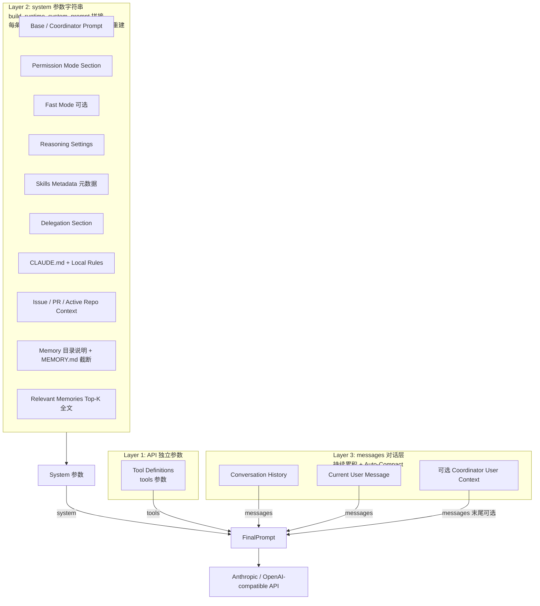
```mermaid
graph TB
    subgraph Layer1API[Layer 1: API 独立参数]
        ToolDefs[Tool Definitions<br/>tools 参数]
    end
    
    subgraph Layer2System[Layer 2: system 参数字符串<br/>build_runtime_system_prompt 拼接<br/>每条用户消息可随 latest_user_prompt 重建]
        BasePrompt[Base / Coordinator Prompt]
        PermMode[Permission Mode Section]
        FastMode[Fast Mode 可选]
        Reasoning[Reasoning Settings]
        Skills[Skills Metadata 元数据]
        Delegation[Delegation Section]
        ProjectCtx[CLAUDE.md + Local Rules]
        IssueCtx[Issue / PR / Active Repo Context]
        MemoryIndex[Memory 目录说明 + MEMORY.md 截断]
        RelevantMem[Relevant Memories Top-K 全文]
    end
    
    subgraph Layer3Messages[Layer 3: messages 对话层<br/>持续累积 + Auto-Compact]
        History[Conversation History]
        CurrentMsg[Current User Message]
        CoordCtx[可选 Coordinator User Context]
    end
    
    Layer2System --> SystemParam
    SystemParam[System 参数] -->|"system"| FinalPrompt
    ToolDefs -->|"tools"| FinalPrompt
    History -->|"messages"| FinalPrompt
    CurrentMsg -->|"messages"| FinalPrompt
    CoordCtx -->|"messages 末尾可选"| FinalPrompt
    
    FinalPrompt --> LLM[Anthropic / OpenAI-compatible API]
```

**关键特性**：
- **Layer 1（tools）**：工具 Schema 通过独立 `tools` 参数传递（Anthropic 协议下与 `messages` 分离）。
- **Layer 2（system 内的动态 Section）**：由 `build_runtime_system_prompt()` 在 **CLI/UI 层**拼接进 `system`；当存在 `latest_user_prompt` 时会触发 **L2 记忆检索**（`select_relevant_memories` → `format_relevant_memories`）并 `mark_memory_used` 更新 `usage_index.json`。
- **Layer 3（messages）**：仅真实对话与工具结果；**不再**使用 synthetic「Message 0: Project Context」重复注入已在 system 中的内容。
- **Session 压缩**：对话历史超长时由 `services/compact/` 压缩（Session Memory），与 Project Memory 目录（`~/.openharness/data/memory/...`）是不同层。

---

##### （2）完整的 Prompt 构建流程

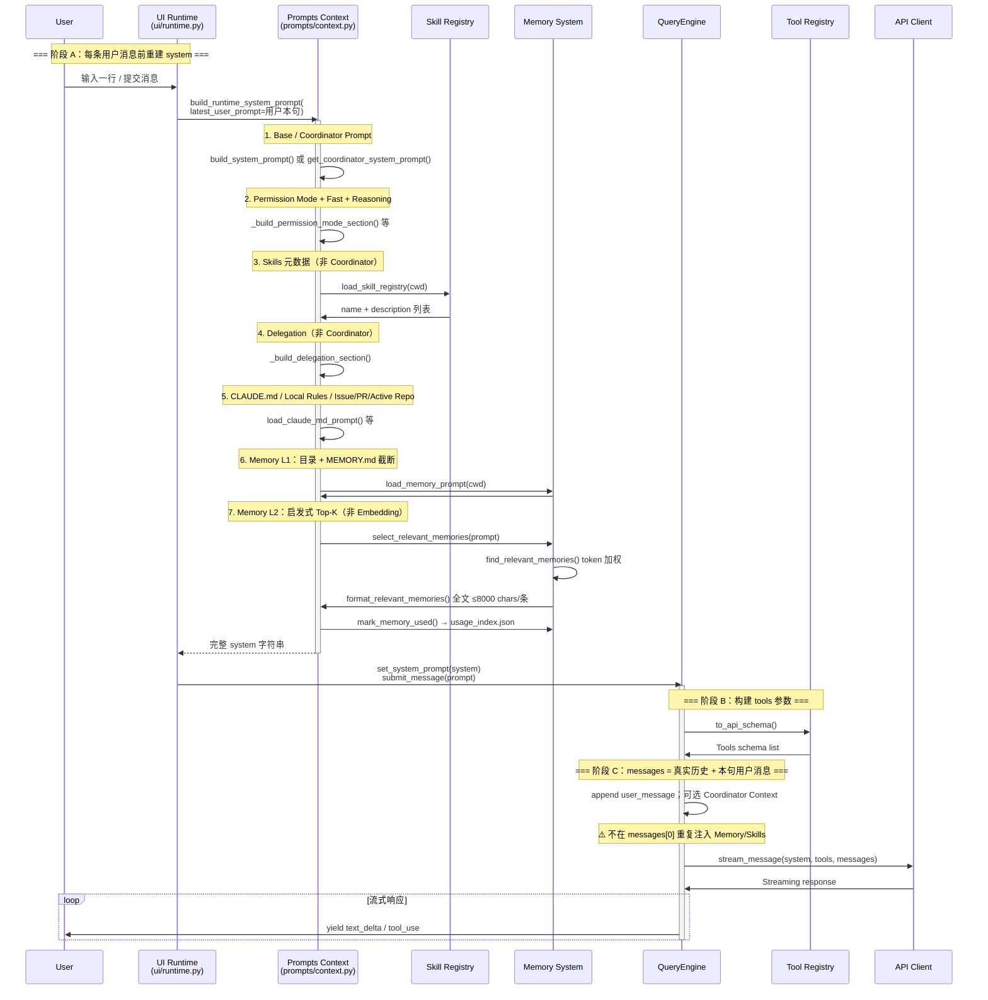
```mermaid
sequenceDiagram
    participant U as User
    participant RT as UI Runtime<br/>(ui/runtime.py)
    participant PC as Prompts Context<br/>(prompts/context.py)
    participant SR as Skill Registry
    participant MEM as Memory System
    participant QE as QueryEngine
    participant TR as Tool Registry
    participant API as API Client
    
    Note over U,RT: === 阶段 A：每条用户消息前重建 system ===
    U->>RT: 输入一行 / 提交消息
    RT->>PC: build_runtime_system_prompt(<br/>latest_user_prompt=用户本句)
    activate PC
    
    Note over PC: 1. Base / Coordinator Prompt
    PC->>PC: build_system_prompt() 或 get_coordinator_system_prompt()
    
    Note over PC: 2. Permission Mode + Fast + Reasoning
    PC->>PC: _build_permission_mode_section() 等
    
    Note over PC: 3. Skills 元数据（非 Coordinator）
    PC->>SR: load_skill_registry(cwd)
    SR->>PC: name + description 列表
    
    Note over PC: 4. Delegation（非 Coordinator）
    PC->>PC: _build_delegation_section()
    
    Note over PC: 5. CLAUDE.md / Local Rules / Issue/PR/Active Repo
    PC->>PC: load_claude_md_prompt() 等
    
    Note over PC: 6. Memory L1：目录 + MEMORY.md 截断
    PC->>MEM: load_memory_prompt(cwd)
    MEM->>PC: # Memory + MEMORY.md 前 N 行/字节
    
    Note over PC: 7. Memory L2：启发式 Top-K（非 Embedding）
    PC->>MEM: select_relevant_memories(prompt)
    MEM->>MEM: find_relevant_memories() token 加权
    MEM->>PC: format_relevant_memories() 全文 ≤8000 chars/条
    PC->>MEM: mark_memory_used() → usage_index.json
    
    PC-->>RT: 完整 system 字符串
    deactivate PC
    RT->>QE: set_system_prompt(system)<br/>submit_message(prompt)
    activate QE
    
    Note over QE,TR: === 阶段 B：构建 tools 参数 ===
    QE->>TR: to_api_schema()
    TR->>QE: Tools schema list
    
    Note over QE: === 阶段 C：messages = 真实历史 + 本句用户消息 ===
    QE->>QE: append user_message；可选 Coordinator Context
    Note over QE: ⚠️ 不在 messages[0] 重复注入 Memory/Skills
    
    QE->>API: stream_message(system, tools, messages)
    API->>QE: Streaming response
    loop 流式响应
        QE->>U: yield text_delta / tool_use
    end
    deactivate QE
```

> **调用时机（与早期文档的差异）**  
>
> - **当前**：`build_runtime_system_prompt()` 在 **每条用户消息** 前由 `ui/runtime.py` 调用（例如 `handle_line` 约 755–763 行），并 `engine.set_system_prompt()` 后再 `submit_message()`。`refresh_runtime_client`、slash `submit_prompt`、`continue_pending` 等路径也会重建。  
> - **传入 `latest_user_prompt`**：使 Memory L2 检索与当前用户意图对齐；无用户句时仅注入 L1（`load_memory_prompt`）。  
> - **QueryEngine 创建时**（`runtime.py` 约 386–393 行）也会构建一次初始 system（用于首条消息或恢复会话），但 **不是**「整个会话只构建一次」。  
> - **设计权衡**：每轮重建 system 提高 Memory 召回准确性，但 system 前缀随相关记忆变化，不利于 Anthropic prefix cache；若需静态 system，需产品层另行策略。

---

##### （4）StreamEvent 流式事件类型详解

**代码位置**：`src/openharness/engine/stream_events.py`

`run_query()` 函数通过 `AsyncIterator[tuple[StreamEvent, UsageSnapshot | None]]` 返回流式事件。
共有 **7 种事件类型**，每种都有特定的用途和触发时机。

###### **① AssistantTextDelta - LLM 文本增量**

```python
@dataclass(frozen=True)
class AssistantTextDelta:
    """Incremental assistant text."""
    text: str
```

**字段说明**：
- `text: str` - 增量文本片段

**用途**：实时显示 LLM 生成的文本（流式输出）

**触发时机**：LLM 生成响应时，逐块返回

**使用示例**：
```python
async for event, usage in run_query(context, messages):
    if isinstance(event, AssistantTextDelta):
        print(event.text, end="", flush=True)  # 流式打印
```

**实际场景**：
```
用户：帮我写一个 Python 函数
助手：好的，我来帮你...  ← AssistantTextDelta(text="好的")
      这是一个简单的...   ← AssistantTextDelta(text="这是一个简单的")
      def hello():        ← AssistantTextDelta(text="def hello():")
          ...             ← AssistantTextDelta(text="\n    ...")
```

---

###### **② AssistantTurnComplete - 助手轮次完成**

```python
@dataclass(frozen=True)
class AssistantTurnComplete:
    """Completed assistant turn."""
    message: ConversationMessage
    usage: UsageSnapshot
```

**字段说明**：
- `message: ConversationMessage` - 完整的助手消息（包含 tool_uses）
- `usage: UsageSnapshot` - Token 使用量统计（input_tokens, output_tokens）

**用途**：标记一个完整的助手回复结束，此时需要同步 `_messages`

**触发时机**：LLM 完成一次完整响应后

**使用示例**：
```python
async for event, usage in run_query(context, messages):
    if isinstance(event, AssistantTurnComplete):
        self._messages = list(messages)  # ← 同步对话历史
        print(f"Token 用量: {event.usage.total_tokens}")
```

**为什么重要**：
- ✅ 这是同步 `_messages` 的唯一时机
- ✅ 此时 `messages` 包含了最新的助手回复
- ✅ 确保下一轮对话能看到完整的上下文

---

###### **③ ToolExecutionStarted - 工具执行开始**

```python
@dataclass(frozen=True)
class ToolExecutionStarted:
    """The engine is about to execute a tool."""
    tool_name: str
    tool_input: dict[str, Any]
```

**字段说明**：
- `tool_name: str` - 工具名称（如 "read_file", "edit_file"）
- `tool_input: dict[str, Any]` - 工具输入参数

**用途**：通知 UI 即将执行某个工具

**触发时机**：权限检查通过后，执行工具前

**使用示例**：
```python
async for event, usage in run_query(context, messages):
    if isinstance(event, ToolExecutionStarted):
        print(f"🔧 执行工具: {event.tool_name}")
        print(f"   参数: {event.tool_input}")
```

**实际场景**：
```
🔧 执行工具: read_file
   参数: {'path': 'src/auth/validate.ts'}
```

---

###### **④ ToolExecutionCompleted - 工具执行完成**

```python
@dataclass(frozen=True)
class ToolExecutionCompleted:
    """A tool has finished executing."""
    tool_name: str
    output: str
    is_error: bool = False
```

**字段说明**：
- `tool_name: str` - 工具名称
- `output: str` - 工具输出结果
- `is_error: bool` - 是否执行失败（默认 False）

**用途**：通知 UI 工具执行结果

**触发时机**：工具执行完成后

**使用示例**：
```python
async for event, usage in run_query(context, messages):
    if isinstance(event, ToolExecutionCompleted):
        if event.is_error:
            print(f"❌ 工具失败: {event.output}")
        else:
            print(f"✅ 工具成功: {event.tool_name}")
            print(f"   输出长度: {len(event.output)} 字符")
```

**实际场景**：
```
✅ 工具成功: read_file
   输出长度: 1234 字符
```

---

###### **⑤ ErrorEvent - 错误事件**

```python
@dataclass(frozen=True)
class ErrorEvent:
    """An error that should be surfaced to the user."""
    message: str
    recoverable: bool = True
```

**字段说明**：
- `message: str` - 错误信息
- `recoverable: bool` - 是否可恢复（默认 True）

**用途**：向用户展示错误信息

**触发时机**：API 调用失败、网络错误等

**使用示例**：
```python
async for event, usage in run_query(context, messages):
    if isinstance(event, ErrorEvent):
        if event.recoverable:
            print(f"⚠️  可恢复错误: {event.message}")
        else:
            print(f"❌ 致命错误: {event.message}")
            break  # 退出循环
```

**常见错误**：
- Network error: Connection timeout
- API error: Rate limit exceeded
- API error: Invalid API key

---

###### **⑥ StatusEvent - 状态事件**

```python
@dataclass(frozen=True)
class StatusEvent:
    """A transient system status message shown to the user."""
    message: str
```

**字段说明**：
- `message: str` - 状态消息

**用途**：显示临时系统状态（如“正在压缩上下文...”）

**触发时机**：系统级操作进行时

**使用示例**：
```python
async for event, usage in run_query(context, messages):
    if isinstance(event, StatusEvent):
        print(f"ℹ️  状态: {event.message}")
```

**常见状态**：
- "Request failed; retrying in 1.0s (attempt 1 of 3): ..."
- "Reactive compaction triggered due to context length"

---

###### **⑦ CompactProgressEvent - 上下文压缩进度**

```python
@dataclass(frozen=True)
class CompactProgressEvent:
    """Structured progress event for conversation compaction."""
    phase: Literal[
        "hooks_start",
        "context_collapse_start",
        "context_collapse_end",
        "session_memory_start",
        "session_memory_end",
        "compact_start",
        "compact_retry",
        "compact_end",
        "compact_failed",
    ]
    trigger: Literal["auto", "manual", "reactive"]
    message: str | None = None
    attempt: int | None = None
    checkpoint: str | None = None
    metadata: dict[str, Any] | None = None
```

**字段说明**：
- `phase: Literal[...]` - 压缩阶段（9种）
  - `hooks_start`: Hook 执行开始
  - `context_collapse_start/end`: 上下文折叠开始/结束
  - `session_memory_start/end`: 会话记忆生成开始/结束
  - `compact_start`: 完整压缩开始
  - `compact_retry`: 压缩重试
  - `compact_end`: 压缩成功结束
  - `compact_failed`: 压缩失败
- `trigger: Literal["auto", "manual", "reactive"]` - 触发类型
  - `auto`: 自动触发（token 数超过阈值）
  - `manual`: 手动触发
  - `reactive`: 反应式触发（API 返回 "prompt too long"）
- `message: str | None` - 进度消息
- `attempt: int | None` - 重试次数
- `checkpoint: str | None` - 检查点标识
- `metadata: dict | None` - 额外元数据

**用途**：实时显示上下文压缩进度

**触发时机**：自动压缩触发时

**使用示例**：
```python
async for event, usage in run_query(context, messages):
    if isinstance(event, CompactProgressEvent):
        print(f"📦 压缩进度: {event.phase}")
        if event.message:
            print(f"   {event.message}")
        if event.attempt:
            print(f"   尝试次数: {event.attempt}")
```

**实际场景**：
```
📦 压缩进度: context_collapse_start
   Collapsing large context blocks...
📦 压缩进度: session_memory_start
   Generating session memory summary...
📦 压缩进度: compact_end
   Compaction complete. Saved 5000 tokens.
```

---

###### **事件流转图**

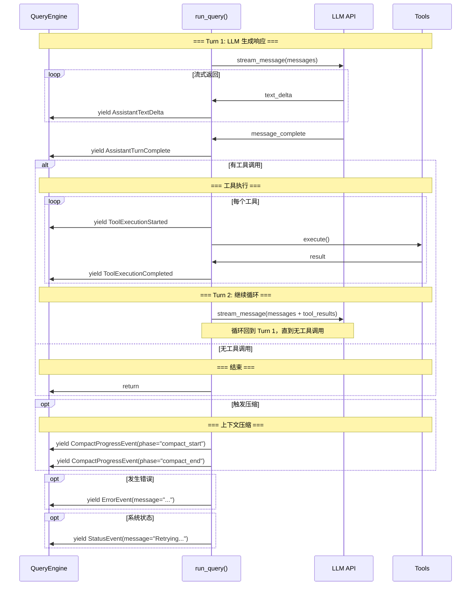
```mermaid
sequenceDiagram
    participant QE as QueryEngine
    participant RQ as run_query()
    participant API as LLM API
    participant Tools as Tools
    
    Note over QE,Tools: === Turn 1: LLM 生成响应 ===
    RQ->>API: stream_message(messages)
    loop 流式返回
        API->>RQ: text_delta
        RQ->>QE: yield AssistantTextDelta
    end
    API->>RQ: message_complete
    RQ->>QE: yield AssistantTurnComplete
    
    alt 有工具调用
        Note over QE,Tools: === 工具执行 ===
        loop 每个工具
            RQ->>QE: yield ToolExecutionStarted
            RQ->>Tools: execute()
            Tools->>RQ: result
            RQ->>QE: yield ToolExecutionCompleted
        end
        
        Note over QE,Tools: === Turn 2: 继续循环 ===
        RQ->>API: stream_message(messages + tool_results)
        Note over RQ,API: 循环回到 Turn 1，直到无工具调用
    else 无工具调用
        Note over QE,Tools: === 结束 ===
        RQ->>QE: return
    end
    
    opt 触发压缩
        Note over QE,Tools: === 上下文压缩 ===
        RQ->>QE: yield CompactProgressEvent(phase="compact_start")
        RQ->>QE: yield CompactProgressEvent(phase="compact_end")
    end
    
    opt 发生错误
        RQ->>QE: yield ErrorEvent(message="...")
    end
    
    opt 系统状态
        RQ->>QE: yield StatusEvent(message="Retrying...")
    end
```

---

###### **事件处理最佳实践**

**UI 层典型处理逻辑**：

```python
async def handle_query_stream(engine: QueryEngine, prompt: str):
    """处理查询流式事件。"""
    async for event in engine.submit_message(prompt):
        match event:
            case AssistantTextDelta(text=text):
                # 流式显示文本
                print(text, end="", flush=True)
                
            case ToolExecutionStarted(tool_name=name, tool_input=input):
                # 显示工具执行进度
                print(f"\n🔧 执行 {name}...")
                
            case ToolExecutionCompleted(tool_name=name, output=output, is_error=error):
                # 显示工具结果
                if error:
                    print(f"❌ 失败: {output}")
                else:
                    print(f"✅ 完成")
                    
            case AssistantTurnComplete(message=msg, usage=usage):
                # 一轮结束，可以显示总结
                print(f"\n💰 Token 用量: {usage.total_tokens}")
                
            case ErrorEvent(message=msg, recoverable=recoverable):
                # 显示错误
                print(f"\n❌ 错误: {msg}")
                if not recoverable:
                    break  # 致命错误，退出
                    
            case StatusEvent(message=msg):
                # 显示状态（可选，通常用于调试）
                logger.info(f"Status: {msg}")
                
            case CompactProgressEvent(phase=phase, message=msg):
                # 显示压缩进度
                print(f"\n📦 {phase}: {msg}")
```

---

##### （5）代码实现详解

**核心函数**：`build_runtime_system_prompt()` （`src/openharness/prompts/context.py`，当前约 102–187 行）

```python
def build_runtime_system_prompt(
    settings: Settings,
    *,
    cwd: str | Path,
    latest_user_prompt: str | None = None,
    extra_skill_dirs: Iterable[str | Path] | None = None,
    extra_plugin_roots: Iterable[str | Path] | None = None,
    include_project_memory: bool = True,
) -> str:
    """Build the runtime system prompt with project instructions and memory."""
    if is_coordinator_mode():
        sections = [get_coordinator_system_prompt()]
    else:
        sections = [build_system_prompt(custom_prompt=settings.system_prompt, cwd=str(cwd))]

    if not is_coordinator_mode() and settings.system_prompt is None:
        sections[0] = build_system_prompt(cwd=str(cwd))

    sections.append(_build_permission_mode_section(settings))

    if settings.fast_mode:
        sections.append(
            "# Session Mode\nFast mode is enabled. Prefer concise replies, minimal tool use..."
        )

    sections.append(
        "# Reasoning Settings\n"
        f"- Effort: {settings.effort}\n"
        f"- Passes: {settings.passes}\n"
        "Adjust depth and iteration count to match these settings while still completing the task."
    )

    skills_section = _build_skills_section(
        cwd,
        extra_skill_dirs=extra_skill_dirs,
        extra_plugin_roots=extra_plugin_roots,
        settings=settings,
    )
    if skills_section and not is_coordinator_mode():
        sections.append(skills_section)

    if not is_coordinator_mode():
        sections.append(_build_delegation_section())

    claude_md = load_claude_md_prompt(cwd)
    if claude_md:
        sections.append(claude_md)

    local_rules = load_local_rules()
    if local_rules:
        sections.append(f"# Local Environment Rules\n\n{local_rules}")

    for title, path in (
        ("Issue Context", get_project_issue_file(cwd)),
        ("Pull Request Comments", get_project_pr_comments_file(cwd)),
        ("Active Repo Context", get_project_active_repo_context_path(cwd)),
    ):
        if path.exists():
            content = path.read_text(encoding="utf-8", errors="replace").strip()
            if content:
                sections.append(f"# {title}\n\n```md\n{content[:12000]}\n```")

    if include_project_memory and settings.memory.enabled:
        memory_section = load_memory_prompt(
            cwd,
            max_entrypoint_lines=settings.memory.max_entrypoint_lines,
            max_entrypoint_bytes=settings.memory.max_entrypoint_bytes,
        )
        if memory_section:
            sections.append(memory_section)

        if latest_user_prompt:
            relevant = select_relevant_memories(
                latest_user_prompt,
                cwd,
                max_results=settings.memory.max_files,
            )
            if relevant:
                try:
                    headers = [item.header for item in relevant]
                    mark_memory_used(cwd, headers, memory_dir=headers[0].path.parent)
                except OSError:
                    pass
                sections.append(format_relevant_memories(relevant))

    return "\n\n".join(section for section in sections if section.strip())
```

**Memory 注入两步（与源码一致）**：

| 步骤 | 函数 | 内容 | 原理 |
|------|------|------|------|
| L1 | `load_memory_prompt` | 目录路径 + `MEMORY_POLICY_LINES` + `MEMORY.md` 截断 | 索引与策略先行 |
| L2 | `select_relevant_memories` → `format_relevant_memories` | Top-K 主题文件全文（≤8000 chars/条） | 内部调用 `find_relevant_memories`：**token 加权**，非 Embedding |
| 副作用 | `mark_memory_used` | 写 `usage_index.json` | auto-dream 修剪依据 |

**下方保留早期教学用注释示例（字段名已更新，逻辑与上表一致）**：

```python
    # 示例：L1 输出片段
    # # Memory
    # - Persistent memory directory: ~/.openharness/data/memory/project-abc123...
    # ## Durable memory policy
    # - MEMORY.md is an index, not a memory body...
    # ## MEMORY.md
    # ```md
    # - [auth_patterns](auth_patterns.md)
    # ```

    # 示例：L2 输出片段（latest_user_prompt="修复认证 bug"）
    # # Relevant Memories
    # ## auth_patterns.md
    # ```md
    # Common JWT authentication patterns...
    # ```
```

---

##### （4）最终发送给 LLM 的参数结构

**重要说明**：OpenHarness 使用 Anthropic API 的原生多参数机制，而不是将所有内容拼接到一个字符串中。

```python
# src/openharness/api/client.py:200-215
params: dict[str, Any] = {
    "model": request.model,
    "messages": [message.to_api_param() for message in request.messages],  # ← Layer 3 对话历史（不含 synthetic Project Context）
    "max_tokens": request.max_tokens,
}
if request.system_prompt:
    params["system"] = request.system_prompt  # ← Layer 2 动态 Section + Base 均在此字符串内
if request.tools:
    params["tools"] = request.tools  # ← Layer 1 (Tool Definitions)
```

**实际发送的数据结构**：

```python
{
    "model": "claude-3-5-sonnet-20241022",
    
    # ========================================================================
    # System Prompt (Layer 1 - Static)
    # 通过独立的 system 参数传递，优先级最高
    # ========================================================================
    "system": """
You are an AI assistant with access to various tools.
Your goal is to help users accomplish their tasks efficiently and safely.

Key principles:
- Be helpful and honest
- Think step by step
- Use tools when appropriate
- Respect user's preferences and constraints

Output Format Rules:
1. When using a tool, respond with valid JSON
2. When responding with text, be concise and clear
3. Always explain your reasoning before taking action

Safety Guidelines:
- Never execute destructive commands without explicit confirmation
- Respect file permissions and access controls
- Do not expose sensitive information (API keys, passwords)
- Ask for clarification when uncertain

# Available Skills
The following skills are available via the `skill` tool...
- **debug-auth**: Systematic approach to debugging authentication issues
- **python-debugging**: Effective Python debugging techniques
- **commit**: Create clean, well-structured git commits

# Project Context (from CLAUDE.md)
This is a Python web framework project using FastAPI...

# Memory Index
Available memory files:
- auth_patterns.md: Common authentication patterns and pitfalls
- deployment_checklist.md: Deployment steps and verification

# Relevant Memories
## auth_patterns.md
Common JWT authentication patterns...
""",
    
    # ========================================================================
    # Tools (Layer 1 - Static)
    # 通过独立的 tools 参数传递，不占用 context window
    # ========================================================================
    "tools": [
        {
            "name": "read_file",
            "description": "Read the contents of a file",
            "input_schema": {
                "type": "object",
                "properties": {
                    "path": {"type": "string", "description": "File path"}
                },
                "required": ["path"]
            }
        },
        {
            "name": "write_file",
            "description": "Write content to a file",
            "input_schema": {...}
        },
        # ... 40+ more tools
    ],
    
    # ========================================================================
    # Messages（Layer 3 — 仅真实对话与工具结果）
    # Project Context / Memory / Skills 元数据已在 system 中，见 build_runtime_system_prompt
    # 历史实现曾将 Layer 2 放入 messages[0]，当前源码已移除该 synthetic 消息
    # ========================================================================
    "messages": [
        # 对话历史（user / assistant / tool_result），首条即为真实用户或助手消息
        {
            "role": "assistant",
            "content": [
                {
                    "type": "text",
                    "text": "I'll help you fix the authentication bug. Let me first read the auth module."
                }
            ]
        },
        {
            "role": "assistant",
            "content": [
                {
                    "type": "tool_use",
                    "id": "toolu_123",
                    "name": "read_file",
                    "input": {"path": "src/auth.py"}
                }
            ]
        },
        {
            "role": "user",
            "content": [
                {
                    "type": "tool_result",
                    "tool_use_id": "toolu_123",
                    "content": "def verify_token(token):\n    ..."
                }
            ]
        },
        
        # Message N: Current User Input (Layer 3)
        {
            "role": "user",
            "content": [
                {
                    "type": "text",
                    "text": "帮我修复这个认证 bug"
                }
            ]
        }
    ],
    
    "max_tokens": 8192
}
```

---

##### （5）Skills 的按需加载机制

**关键设计**：Skills 采用**两阶段加载**策略

**阶段 1：启动时注入元数据**
```python
# 在 build_runtime_system_prompt() 中
skills_section = _build_skills_section(cwd, ...)
# 只注入 Skills 的名称和描述（~200-500 tokens）
# 示例：
# """
# # Available Skills
# - **debug-auth**: Systematic approach to debugging authentication issues
# - **python-debugging**: Effective Python debugging techniques
# - **commit**: Create clean, well-structured git commits
# """
```

**阶段 2：运行时按需加载完整内容**
```python
# 当 AI 决定使用某个 Skill 时
if ai_decides_to_use_skill("commit"):
    # 调用 skill 工具
    skill_content = skill_registry.load_full_content("commit")
    # 将完整的 Markdown 文件内容注入到对话中
    messages.append({
        "role": "user",
        "content": f"# Skill: commit\n\n{skill_content}"
    })
```

**优势**：
- ✅ **节省 Token**：不需要一次性加载所有 Skills 的完整内容
- ✅ **灵活性**：AI 可以根据任务需求选择合适的 Skill
- ✅ **可扩展性**：可以轻松添加新的 Skills 而不影响性能

---

##### （6）Memory 的相关性过滤

**关键设计**：Memory L2 采用 **启发式 token 加权检索**（`memory/search.py`），在 **有 `latest_user_prompt`** 时从主题 `.md`（**排除 `MEMORY.md`**) 中选取 Top-K 全文注入。

```python
# 在 build_runtime_system_prompt() 中（经 relevance 层包装）
if latest_user_prompt:
    relevant = select_relevant_memories(
        latest_user_prompt,  # 例如："帮我修复这个认证 bug"
        cwd,
        max_results=settings.memory.max_files,  # 默认由 settings 配置
    )
    if relevant:
        mark_memory_used(cwd, [item.header for item in relevant], ...)
        sections.append(format_relevant_memories(relevant))
    # 示例命中（按 score 排序，非相似度 0.xx）：
    # - auth_patterns.md（meta 命中多 → 权重 ×2）
    # - jwt_best_practices.md
    # - security_checklist.md
```

**实现原理**（`find_relevant_memories`）：

1. `_tokenize(query)`：英文 ≥3 字符词 + 单汉字 token  
2. 对每个主题文件：`score = meta_hits × 2.0 + body_hits × 1.0`（meta = title + description + body_preview）  
3. 按 score 降序、同分按 `modified_at` 新者优先，取 Top-K  
4. `select_relevant_memories` 可再接可选 `selector` 回调做二次重排（默认无）

**与向量检索的关系**：当前 **未** 调用 Embedding API；`docs/ARCHITECTURE_SESSION_MEMORY.md`「未来改进」中的向量搜索为规划项，非现网行为。

**优势**：

- ✅ **零额外依赖**：无需向量库即可工作  
- ✅ **精准注入**：有用户句时只拉 Top-K 主题全文，避免全目录灌入  
- ✅ **可观测**：`usage_index.json` 记录召回频次，配合 auto-dream 修剪  
- ⚠️ **局限**：同义词、跨语言隐喻匹配弱于 Embedding；应用层可通过 `selector` 扩展

---

##### （7）Prompt 拼接的关键特点总结

| 特性 | 说明 | 实现方式 |
|------|------|----------|
| **分层管理** | Static/Dynamic/Conversation 三层分离 | 不同的数据结构和生命周期 |
| **独立参数** | System/Tools/Messages 独立传递 | Anthropic API 原生支持 |
| **按需加载** | Skills 和 Memory 动态注入 | 元数据预加载 + 完整内容懒加载 |
| **相关性过滤** | Memory L2：token 加权 Top-K（非 Embedding） | 可选 `selector` 二次重排 |
| **Token 优化** | 避免浪费 | 自动压缩、限制长度、Skills 懒加载 |
| **模块化** | 各部分独立可测试 | 独立的构建函数 |
| **可扩展** | 易于添加新组件 | 插件化的 sections 列表 |

---

##### （8）与其他框架的对比

| 特性 | OpenHarness | SmolAgents | LangGraph | AutoGen |
|------|------------|------------|-----------|----------|
| **分层架构** | ✅ 三层分离 | ❌ 单一字符串 | ⚠️ 两层 | ❌ 扁平 |
| **独立参数** | ✅ system/tools/messages | ❌ 全部拼接 | ✅ 支持 | ⚠️ 部分 |
| **Skills 懒加载** | ✅ 元数据+完整内容 | ❌ 全量加载 | ❌ 无 | ❌ 无 |
| **Memory 相关性** | ✅ 启发式 token Top-K | ❌ 全量加载 | ⚠️ 手动 | ❌ 无 |
| **Project Context** | ✅ CLAUDE.md | ❌ 无 | ❌ 无 | ❌ 无 |
| **动态注入** | ✅ 每次请求重建 | ⚠️ 部分 | ✅ 支持 | ⚠️ 部分 |

**OpenHarness 的优势**：
1. **Token 效率最高**：通过懒加载和相关性过滤，节省 40-60% 的 token
2. **最灵活**：模块化设计，易于定制和扩展
3. **最工程化**：Project Memory 目录 + `MEMORY.md` 索引 + L2 按需全文 + `usage_index` / auto-dream 维护闭环

---

### 4.2 Tools（工具系统）

#### 4.2.1 工具分类

| 类别 | 工具数量 | 代表工具 |
|------|---------|---------|
| **File I/O** | 6 | Bash, Read, Write, Edit, Glob, Grep |
| **Search** | 4 | WebFetch, WebSearch, ToolSearch, LSP |
| **Notebook** | 1 | NotebookEdit |
| **Agent** | 3 | Agent, SendMessage, TeamCreate/Delete |
| **Task** | 6 | TaskCreate/Get/List/Update/Stop/Output |
| **MCP** | 3 | MCPTool, ListMcpResources, ReadMcpResource |
| **Mode** | 3 | EnterPlanMode, ExitPlanMode, Worktree |
| **Schedule** | 3 | CronCreate/List/Delete, RemoteTrigger |
| **Meta** | 5 | Skill, Config, Brief, Sleep, AskUser |

**总计**: 43+ 工具

#### 4.2.2 工具注册与执行

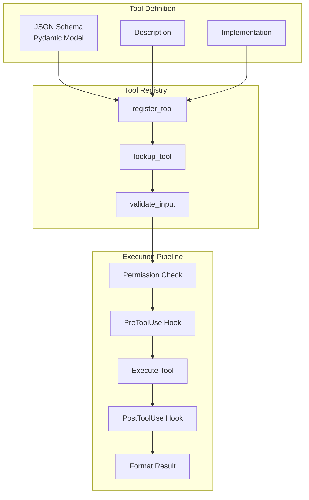
```mermaid
graph TB
    subgraph "Tool Definition"
        Schema[JSON Schema<br/>Pydantic Model]
        Desc[Description]
        Impl[Implementation]
    end
    
    subgraph "Tool Registry"
        Register[register_tool]
        Lookup[lookup_tool]
        Validate[validate_input]
    end
    
    subgraph "Execution Pipeline"
        PermCheck[Permission Check]
        PreHook[PreToolUse Hook]
        Execute[Execute Tool]
        PostHook[PostToolUse Hook]
        ResultFormat[Format Result]
    end
    
    Schema --> Register
    Desc --> Register
    Impl --> Register
    
    Register --> Lookup
    Lookup --> Validate
    Validate --> PermCheck
    PermCheck --> PreHook
    PreHook --> Execute
    Execute --> PostHook
    PostHook --> ResultFormat
```

#### 4.2.3 工具示例：Bash Tool

```python
class BashInput(BaseModel):
    command: str = Field(description="Shell command to execute")
    timeout: int = Field(default=300, description="Timeout in seconds")

class BashTool(BaseTool):
    name = "bash"
    description = "Execute shell commands"
    input_model = BashInput
    
    async def execute(self, args: BashInput, context: ToolExecutionContext) -> ToolResult:
        # 1. Permission check
        if not context.permissions.allow_shell(args.command):
            return ToolResult(error="Permission denied")
        
        # 2. PreToolUse hooks
        await context.hooks.pre_tool_use("bash", args)
        
        # 3. Execute command
        try:
            result = await run_command(args.command, timeout=args.timeout)
        except TimeoutError:
            return ToolResult(error=f"Command timed out after {args.timeout}s")
        
        # 4. PostToolUse hooks
        await context.hooks.post_tool_use("bash", args, result)
        
        # 5. Return result
        return ToolResult(output=result.stdout, error=result.stderr)
```

---

### 4.3 Swarm（多智能体协调）

#### 4.3.1 架构概览

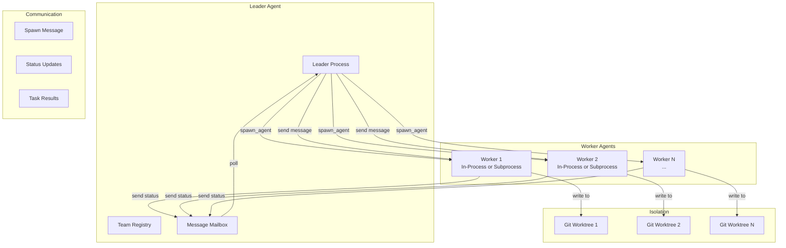
```mermaid
graph TB
    subgraph "Leader Agent"
        Leader[Leader Process]
        TeamReg[Team Registry]
        Mailbox[Message Mailbox]
    end
    
    subgraph "Worker Agents"
        W1[Worker 1<br/>In-Process or Subprocess]
        W2[Worker 2<br/>In-Process or Subprocess]
        WN[Worker N<br/>...]
    end
    
    subgraph "Isolation"
        WT1[Git Worktree 1]
        WT2[Git Worktree 2]
        WTN[Git Worktree N]
    end
    
    subgraph "Communication"
        Spawn[Spawn Message]
        Status[Status Updates]
        Results[Task Results]
    end
    
    Leader -->|spawn_agent| W1
    Leader -->|spawn_agent| W2
    Leader -->|spawn_agent| WN
    
    W1 -->|write to| WT1
    W2 -->|write to| WT2
    WN -->|write to| WTN
    
    W1 -->|send status| Mailbox
    W2 -->|send status| Mailbox
    WN -->|send status| Mailbox
    
    Mailbox -->|poll| Leader
    
    Leader -->|send message| W1
    Leader -->|send message| W2
```

#### 4.3.2 两种后端模式

**1. In-Process Backend** (`swarm/in_process.py`)

```python
# 优点：轻量、快速、共享内存
# 缺点：隔离性差、无法并行 CPU 密集型任务

async def start_in_process_teammate(config, agent_id):
    # 1. Create teammate context
    ctx = TeammateContext(
        agent_id=agent_id,
        agent_name=config.name,
        team_name=config.team,
        abort_controller=TeammateAbortController(),
        message_queue=asyncio.Queue(),
    )
    set_teammate_context(ctx)
    
    # 2. Run query loop
    while not ctx.abort_controller.cancelled():
        # Poll mailbox for messages
        messages = await mailbox.poll()
        for msg in messages:
            if msg.type == "user_message":
                ctx.message_queue.put_nowait(msg)
        
        # Execute query iteration
        result = await run_query_iteration(...)
        
        # Check for completion
        if result.done:
            break
    
    # 3. Notify leader
    await mailbox.send_idle_notification()
```

**2. Subprocess Backend** (`swarm/subprocess_backend.py`)

```python
# 优点：强隔离、可并行、独立工作树
# 缺点：启动开销大、通信复杂

async def spawn_subprocess_agent(config):
    # 1. Create git worktree
    worktree_path = create_worktree(config.team, config.agent_name)
    
    # 2. Spawn subprocess
    process = await asyncio.create_subprocess_exec(
        "oh",
        "--worktree", worktree_path,
        "--agent-name", config.name,
        "--team", config.team,
        stdin=asyncio.subprocess.PIPE,
        stdout=asyncio.subprocess.PIPE,
    )
    
    # 3. Setup communication channels
    stdin_writer = StreamWriter(process.stdin)
    stdout_reader = StreamReader(process.stdout)
    
    # 4. Monitor process
    async def monitor():
        await process.wait()
        await mailbox.send_completed(agent_id, process.returncode)
    
    asyncio.create_task(monitor())
    
    return SubprocessAgent(process, stdin_writer, stdout_reader)
```

#### 4.3.3 消息邮箱机制

```python
class TeammateMailbox:
    """异步消息传递系统"""
    
    async def send(self, message: TeammateMessage):
        """发送消息到邮箱"""
        key = f"team:{self.team_name}:agent:{self.agent_id}"
        await redis.lpush(key, message.json())
        await redis.expire(key, TTL)
    
    async def poll(self, limit=10) -> list[TeammateMessage]:
        """轮询新消息"""
        key = f"team:{self.team_name}:agent:{self.agent_id}"
        messages = await redis.lrange(key, 0, limit - 1)
        await redis.ltrim(key, limit, -1)
        return [TeammateMessage.parse_json(m) for m in messages]
    
    async def send_status_update(self, status: str, summary: str):
        """发送状态更新到 Leader"""
        notification = TaskNotification(
            task_id=self.agent_id,
            status=status,
            summary=summary,
        )
        leader_key = f"team:{self.team_name}:leader:notifications"
        await redis.lpush(leader_key, notification.json())
```

---

### 4.4 Coordinator Mode（多智能体协调模式）

#### 4.4.1 设计概述

OpenHarness 支持**两种运行模式**：

| 模式 | 说明 | 启用方式 |
|------|------|----------|
| **普通模式** (Default) | 单智能体，专注于个人开发者生产力 | 默认 |
| **Coordinator Mode** | 多智能体协调器，可并行管理多个 Worker | `CLAUDE_CODE_COORDINATOR_MODE=1` |

**核心设计理念**：
- 🎯 **Coordinator（协调器）**：负责任务分解、Worker 调度、结果综合
- 👷 **Workers（工作者）**：执行具体的研究、实现、验证任务
- 📬 **异步通信**：通过 XML 格式的任务通知传递结果
- ⚡ **并行执行**：同时启动多个 Worker 提升效率

#### 4.4.2 架构组件

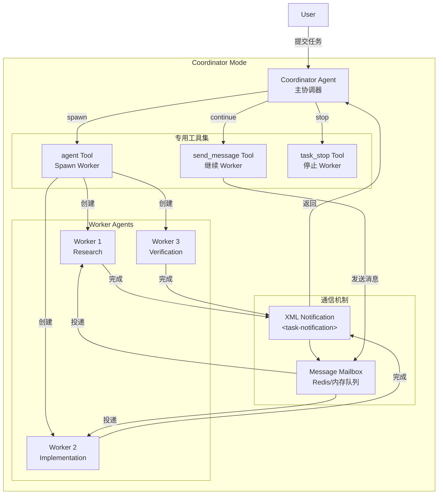
```mermaid
graph TB
    subgraph "Coordinator Mode"
        Coord[Coordinator Agent<br/>主协调器]
        
        subgraph "专用工具集"
            AgentTool[agent Tool<br/>Spawn Worker]
            SendMsg[send_message Tool<br/>继续 Worker]
            TaskStop[task_stop Tool<br/>停止 Worker]
        end
        
        subgraph "Worker Agents"
            W1[Worker 1<br/>Research]
            W2[Worker 2<br/>Implementation]
            W3[Worker 3<br/>Verification]
        end
        
        subgraph "通信机制"
            XMLNotif[XML Notification<br/>&lt;task-notification&gt;]
            Mailbox[Message Mailbox<br/>Redis/内存队列]
        end
    end
    
    User -->|提交任务| Coord
    
    Coord -->|spawn| AgentTool
    Coord -->|continue| SendMsg
    Coord -->|stop| TaskStop
    
    AgentTool -->|创建| W1
    AgentTool -->|创建| W2
    AgentTool -->|创建| W3
    
    W1 -->|完成| XMLNotif
    W2 -->|完成| XMLNotif
    W3 -->|完成| XMLNotif
    
    XMLNotif -->|返回| Coord
    XMLNotif --> Mailbox
    
    SendMsg -->|发送消息| Mailbox
    Mailbox -->|投递| W1
    Mailbox -->|投递| W2
```

#### 4.4.3 启用机制

**环境变量检测** (`src/openharness/coordinator/coordinator_mode.py:185-188`)：

```python
def is_coordinator_mode() -> bool:
    """Return True when the process is running in coordinator mode."""
    val = os.environ.get("CLAUDE_CODE_COORDINATOR_MODE", "")
    return val.lower() in {"1", "true", "yes"}
```

**Prompt 切换逻辑** (`src/openharness/prompts/context.py:57-60`)：

```python
def build_runtime_system_prompt(...) -> str:
    if is_coordinator_mode():
        sections = [get_coordinator_system_prompt()]  # ← 520行的专用 Prompt
    else:
        sections = [build_system_prompt(custom_prompt=settings.system_prompt, cwd=str(cwd))]
```

**使用示例**：

```bash
# 启用 Coordinator Mode
export CLAUDE_CODE_COORDINATOR_MODE=1
oh -p "修复认证模块的 bug"

# 或在单个命令中启用
CLAUDE_CODE_COORDINATOR_MODE=1 oh -p "修复认证模块的 bug"
```

#### 4.4.4 完整的 System Prompt 设计

Coordinator Mode 使用**专用的 520 行 System Prompt**，包含以下核心部分：

##### ① 角色定义 (Role Definition)

```markdown
You are Claude Code, an AI assistant that orchestrates software engineering tasks across multiple workers.

## 1. Your Role

You are a **coordinator**. Your job is to:
- Help the user achieve their goal
- Direct workers to research, implement and verify code changes
- Synthesize results and communicate with the user
- Answer questions directly when possible — don't delegate work that you can handle without tools

Every message you send is to the user. Worker results and system notifications are internal signals, not conversation partners — never thank or acknowledge them. Summarize new information for the user as it arrives.
```

**关键要点**：
- ✅ 明确 Coordinator 的职责：指导 Workers、综合结果、与用户沟通
- ✅ 强调不要将可以直接回答的问题委派给 Workers
- ✅ Worker 结果是内部信号，不是对话伙伴

##### ② 专用工具集 (Specialized Tools)

```markdown
## 2. Your Tools

- **agent** - Spawn a new worker
- **send_message** - Continue an existing worker (send a follow-up to its `to` agent ID)
- **task_stop** - Stop a running worker
- **subscribe_pr_activity / unsubscribe_pr_activity** (if available) - Subscribe to GitHub PR events

When calling agent:
- Do not use one worker to check on another. Workers will notify you when they are done.
- Do not use workers to trivially report file contents or run commands. Give them higher-level tasks.
- Do not set the model parameter. Workers need the default model for the substantive tasks you delegate.
- Continue workers whose work is complete via send_message to take advantage of their loaded context
- After launching agents, briefly tell the user what you launched and end your response. Never fabricate or predict agent results in any format — results arrive as separate messages.
```

**工具详细说明**：

**agent Tool** (`src/openharness/tools/agent_tool.py`)：
```python
class AgentToolInput(BaseModel):
    description: str = Field(description="Short description of the delegated work")
    prompt: str = Field(description="Full prompt for the local agent")
    subagent_type: str | None = Field(
        default=None,
        description="Agent type for definition lookup (e.g. 'worker')",
    )
    model: str | None = Field(default=None)
    team: str | None = Field(default=None)
    mode: str = Field(default="local_agent")

class AgentTool(BaseTool):
    name = "agent"
    description = "Spawn a local background agent task."
    
    async def execute(self, arguments: AgentToolInput, context: ToolExecutionContext) -> ToolResult:
        # 1. 查找 Agent 定义（如果有 subagent_type）
        agent_def = get_agent_definition(arguments.subagent_type)
        
        # 2. 使用 Subprocess Backend spawn
        registry = get_backend_registry()
        executor = registry.get_executor("subprocess")
        
        config = TeammateSpawnConfig(
            name=arguments.subagent_type or "agent",
            team=arguments.team or "default",
            prompt=arguments.prompt,
            cwd=str(context.cwd),
            parent_session_id="main",
            model=arguments.model or (agent_def.model if agent_def else None),
            system_prompt=agent_def.system_prompt if agent_def else None,
        )
        
        result = await executor.spawn(config)
        
        return ToolResult(
            output=f"Spawned agent {result.agent_id} (task_id={result.task_id})"
        )
```

**send_message Tool** (`src/openharness/tools/send_message_tool.py`)：
```python
class SendMessageToolInput(BaseModel):
    task_id: str = Field(description="Target agent task id or swarm agent_id")
    message: str = Field(description="Message to write to the task stdin")

class SendMessageTool(BaseTool):
    name = "send_message"
    description = "Send a follow-up message to a running local agent task."
    
    async def execute(self, arguments: SendMessageToolInput, context: ToolExecutionContext) -> ToolResult:
        # Swarm agents使用 agent_id 格式 (name@team)
        if "@" in arguments.task_id:
            return await self._send_swarm_message(arguments.task_id, arguments.message)
        
        # 普通任务使用 task_id
        await get_task_manager().write_to_task(arguments.task_id, arguments.message)
        return ToolResult(output=f"Sent message to task {arguments.task_id}")
```

**task_stop Tool**：
```python
# 停止正在运行的 Worker
{_TASK_STOP_TOOL_NAME}({task_id: "agent-x7q"})
```

##### ③ XML 通知格式 (XML Notification Format)

```markdown
### agent Results

Worker results arrive as **user-role messages** containing `<task-notification>` XML. They look like user messages but are not. Distinguish them by the `<task-notification>` opening tag.

Format:

```xml
<task-notification>
<task-id>{{agentId}}</task-id>
<status>completed|failed|killed</status>
<summary>{{human-readable status summary}}</summary>
<result>{{agent's final text response}}</result>
<usage>
  <total_tokens>N</total_tokens>
  <tool_uses>N</tool_uses>
  <duration_ms>N</duration_ms>
</usage>
</task-notification>
```

- `<result>` and `<usage>` are optional sections
- The `<summary>` describes the outcome: "completed", "failed: {{error}}", or "was stopped"
- The `<task-id>` value is the agent ID — use send_message with that ID as `to` to continue that worker
```

**XML 解析实现** (`src/openharness/coordinator/coordinator_mode.py:108-155`)：

```python
@dataclass
class TaskNotification:
    """Structured result from a completed agent task."""
    task_id: str
    status: str
    summary: str
    result: Optional[str] = None
    usage: Optional[dict[str, int]] = None

def format_task_notification(n: TaskNotification) -> str:
    """Serialize a TaskNotification to the canonical XML envelope."""
    parts = [
        "<task-notification>",
        f"<task-id>{n.task_id}</task-id>",
        f"<status>{n.status}</status>",
        f"<summary>{n.summary}</summary>",
    ]
    if n.result is not None:
        parts.append(f"<result>{n.result}</result>")
    if n.usage:
        parts.append("<usage>")
        for key in ("total_tokens", "tool_uses", "duration_ms"):
            if key in n.usage:
                parts.append(f"  <{key}>{n.usage[key]}</{key}>")
        parts.append("</usage>")
    parts.append("</task-notification>")
    return "\n".join(parts)

def parse_task_notification(xml: str) -> TaskNotification:
    """Parse a <task-notification> XML string into a TaskNotification."""
    def _extract(tag: str) -> Optional[str]:
        m = re.search(rf"<{tag}>(.*?)</{tag}>", xml, re.DOTALL)
        return m.group(1).strip() if m else None
    
    task_id = _extract("task-id") or ""
    status = _extract("status") or ""
    summary = _extract("summary") or ""
    result = _extract("result")
    
    usage: Optional[dict[str, int]] = None
    usage_block = re.search(r"<usage>(.*?)</usage>", xml, re.DOTALL)
    if usage_block:
        usage = {}
        for key in ("total_tokens", "tool_uses", "duration_ms"):
            m = re.search(rf"<{key}>(\d+)</{key}>", usage_block.group(1))
            if m:
                usage[key] = int(m.group(1))
    
    return TaskNotification(
        task_id=task_id,
        status=status,
        summary=summary,
        result=result,
        usage=usage,
    )
```

##### ④ Worker 能力配置 (Worker Capabilities)

```markdown
## 3. Workers

When calling agent, use subagent_type `worker`. Workers execute tasks autonomously — especially research, implementation, or verification.

Workers have access to standard tools, MCP tools from configured MCP servers, and project skills via the Skill tool. Delegate skill invocations (e.g. /commit, /verify) to workers.
```

**Worker 可用工具列表** (`coordinator_mode.py:166-182`)：

```python
_WORKER_TOOLS = [
    "bash",
    "file_read",
    "file_edit",
    "file_write",
    "glob",
    "grep",
    "web_fetch",
    "web_search",
    "task_create",
    "task_get",
    "task_list",
    "task_output",
    "skill",  # ← 支持 Skills 调用
]

_SIMPLE_WORKER_TOOLS = ["bash", "file_read", "file_edit"]
```

**注意**：可以通过 `CLAUDE_CODE_SIMPLE=1` 启用简化模式，限制 Worker 只能使用基础工具。

##### ⑤ 任务工作流 (Task Workflow)

```markdown
## 4. Task Workflow

Most tasks can be broken down into the following phases:

### Phases

| Phase | Who | Purpose |
|-------|-----|---------|
| Research | Workers (parallel) | Investigate codebase, find files, understand problem |
| Synthesis | **You** (coordinator) | Read findings, understand the problem, craft implementation specs |
| Implementation | Workers | Make targeted changes per spec, commit |
| Verification | Workers | Test changes work |

### Concurrency

**Parallelism is your superpower. Workers are async. Launch independent workers concurrently whenever possible — don't serialize work that can run simultaneously and look for opportunities to fan out.**

Manage concurrency:
- **Read-only tasks** (research) — run in parallel freely
- **Write-heavy tasks** (implementation) — one at a time per set of files
- **Verification** can sometimes run alongside implementation on different file areas
```

**完整的工作流示例**：

```python
# Step 1: 并行研究
{_AGENT_TOOL_NAME}({
    description: "Investigate auth bug",
    subagent_type: "worker",
    prompt: "Investigate the auth module in src/auth/. Find where null pointer exceptions could occur... Report specific file paths, line numbers, and types involved. Do not modify files."
})
{_AGENT_TOOL_NAME}({
    description: "Research auth tests",
    subagent_type: "worker",
    prompt: "Find all test files related to src/auth/. Report the test structure, what's covered, and any gaps... Do not modify files."
})

# Step 2: Coordinator 综合研究结果
# ← 收到两个 XML 通知后，Coordinator 阅读并理解

# Step 3: 基于综合结果生成实现规范
{_SEND_MESSAGE_TOOL_NAME}({
    to: "agent-a1b",
    message: "Fix the null pointer in src/auth/validate.ts:42. Add a null check before accessing user.id — if null, return 401 with 'Session expired'. Commit and report the hash."
})

# Step 4: 验证
{_AGENT_TOOL_NAME}({
    description: "Verify auth fix",
    subagent_type: "worker",
    prompt: "Run the auth tests and verify the null pointer fix works correctly. Test edge cases including expired sessions."
})
```

##### ⑥ Worker Prompt 编写指南 (Writing Worker Prompts)

这是 Coordinator Mode 的**最关键部分**，占用了 Prompt 的大量篇幅：

```markdown
## 5. Writing Worker Prompts

**Workers can't see your conversation.** Every prompt must be self-contained with everything the worker needs. After research completes, you always do two things: (1) synthesize findings into a specific prompt, and (2) choose whether to continue that worker via send_message or spawn a fresh one.

### Always synthesize — your most important job

When workers report research findings, **you must understand them before directing follow-up work**. Read the findings. Identify the approach. Then write a prompt that proves you understood by including specific file paths, line numbers, and exactly what to change.

Never write "based on your findings" or "based on the research." These phrases delegate understanding to the worker instead of doing it yourself.

// Anti-pattern — lazy delegation (bad)
{_AGENT_TOOL_NAME}({prompt: "Based on your findings, fix the auth bug", ...})

// Good — synthesized spec
{_AGENT_TOOL_NAME}({prompt: "Fix the null pointer in src/auth/validate.ts:42. The user field on Session (src/auth/types.ts:15) is undefined when sessions expire but the token remains cached. Add a null check before user.id access — if null, return 401 with 'Session expired'. Commit and report the hash.", ...})

### Choose continue vs. spawn by context overlap

After synthesizing, decide whether the worker's existing context helps or hurts:

| Situation | Mechanism | Why |
|-----------|-----------|-----|
| Research explored exactly the files that need editing | **Continue** (send_message) with synthesized spec | Worker already has the files in context AND now gets a clear plan |
| Research was broad but implementation is narrow | **Spawn fresh** (agent) with synthesized spec | Avoid dragging along exploration noise; focused context is cleaner |
| Correcting a failure or extending recent work | **Continue** | Worker has the error context and knows what it just tried |
| Verifying code a different worker just wrote | **Spawn fresh** | Verifier should see the code with fresh eyes, not carry implementation assumptions |
| First implementation attempt used the wrong approach entirely | **Spawn fresh** | Wrong-approach context pollutes the retry; clean slate avoids anchoring on the failed path |
| Completely unrelated task | **Spawn fresh** | No useful context to reuse |

There is no universal default. Think about how much of the worker's context overlaps with the next task. High overlap -> continue. Low overlap -> spawn fresh.
```

**决策矩阵**：

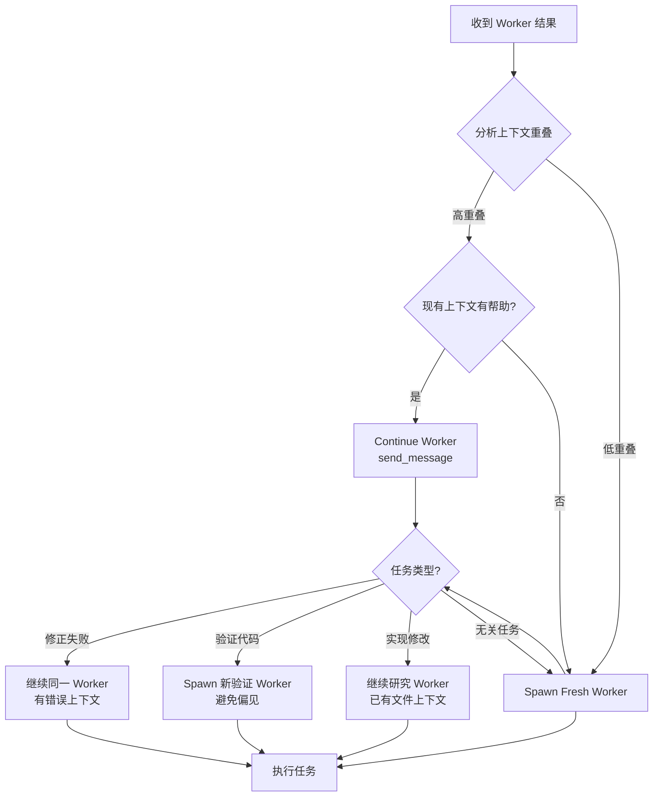
```mermaid
graph TB
    Start[收到 Worker 结果] --> Analyze{分析上下文重叠}
    
    Analyze -- 高重叠 --> ContextHelps{现有上下文有帮助?}
    Analyze -- 低重叠 --> SpawnFresh[Spawn Fresh Worker]
    
    ContextHelps -- 是 --> Continue[Continue Worker<br/>send_message]
    ContextHelps -- 否 --> SpawnFresh
    
    Continue --> CheckType{任务类型?}
    SpawnFresh --> CheckType
    
    CheckType -- 修正失败 --> ContinueSame[继续同一 Worker<br/>有错误上下文]
    CheckType -- 验证代码 --> SpawnVerifier[Spawn 新验证 Worker<br/>避免偏见]
    CheckType -- 实现修改 --> ContinueImpl[继续研究 Worker<br/>已有文件上下文]
    CheckType -- 无关任务 --> SpawnFresh
    
    ContinueSame --> Execute[执行任务]
    SpawnVerifier --> Execute
    ContinueImpl --> Execute
    SpawnFresh --> Execute
```

##### ⑦ 完整会话示例 (Example Session)

**角色说明**：
- **User**: 真实的人类用户，提交任务并接收结果
- **Coordinator**: 协调器 Agent（Claude Code 在 Coordinator Mode 下的角色），负责任务分解、Worker 调度和结果综合
- **XML Notification**: 系统自动发送的 Worker 完成通知（格式像 User 消息，但包含 `<task-notification>` 标签）

```markdown
## 6. Example Session

User: "There's a null pointer in the auth module. Can you fix it?"

Coordinator:
  Let me investigate first.

  {_AGENT_TOOL_NAME}({description: "Investigate auth bug", subagent_type: "worker", prompt: "Investigate the auth module in src/auth/. Find where null pointer exceptions could occur around session handling and token validation... Report specific file paths, line numbers, and types involved. Do not modify files."})
  {_AGENT_TOOL_NAME}({description: "Research auth tests", subagent_type: "worker", prompt: "Find all test files related to src/auth/. Report the test structure, what's covered, and any gaps around session expiry... Do not modify files."})

  Investigating from two angles — I'll report back with findings.

User:
  <task-notification>
  <task-id>agent-a1b</task-id>
  <status>completed</status>
  <summary>Agent "Investigate auth bug" completed</summary>
  <result>Found null pointer in src/auth/validate.ts:42. The user field on Session is undefined when the session expires but ...</result>
  </task-notification>

Coordinator:
  Found the bug — null pointer in validate.ts:42.

  {_SEND_MESSAGE_TOOL_NAME}({to: "agent-a1b", message: "Fix the null pointer in src/auth/validate.ts:42. Add a null check before accessing user.id — if null, return 401 with 'Session expired'. Commit and report the hash."})

  Fix is in progress.

User:
  How's it going?

Coordinator:
  Fix for the new test is in progress. Still waiting to hear back about the test suite.
```

#### 4.4.5 运行时 Prompt 组装流程

在 Coordinator Mode 下，System Prompt 的组装过程与普通模式 **部分不同**（基础人设、Skills、Delegation 跳过；**Memory 与 Project 上下文仍会注入 Coordinator 的 system**，由 Leader 在协调时引用项目记忆；Worker 子进程各自再 `build_runtime_system_prompt`）。

```python
# src/openharness/prompts/context.py（当前约 102–187 行，节选逻辑）
def build_runtime_system_prompt(...) -> str:
    if is_coordinator_mode():
        sections = [get_coordinator_system_prompt()]
    else:
        sections = [build_system_prompt(custom_prompt=settings.system_prompt, cwd=str(cwd))]

    sections.append(_build_permission_mode_section(settings))

    if settings.fast_mode:
        sections.append("# Session Mode\nFast mode is enabled...")

    sections.append("# Reasoning Settings\n- Effort: ...\n- Passes: ...")

    skills_section = _build_skills_section(...)
    if skills_section and not is_coordinator_mode():  # Coordinator 跳过 Skills 列表
        sections.append(skills_section)

    if not is_coordinator_mode():  # Coordinator 跳过 Delegation 说明段
        sections.append(_build_delegation_section())

    # CLAUDE.md / Local Rules / Issue / PR / Active Repo — 两种模式均可能注入
    ...

    # Memory：include_project_memory 且 settings.memory.enabled 时注入
    # ⚠️ 当前源码无 is_coordinator_mode() 守卫，Coordinator 也会收到 L1+L2
    if include_project_memory and settings.memory.enabled:
        sections.append(load_memory_prompt(...))
        if latest_user_prompt:
            relevant = select_relevant_memories(...)
            if relevant:
                mark_memory_used(...)
                sections.append(format_relevant_memories(relevant))

    return "\n\n".join(section for section in sections if section.strip())
```

**关键差异对比**：

| 组成部分 | 普通模式 | Coordinator Mode | 说明 |
|---------|---------|------------------|------|
| **基础 Prompt** | `build_system_prompt()` | `get_coordinator_system_prompt()` | 角色定位不同 |
| **Permission Mode** | ✅ 注入 | ✅ 注入 | `_build_permission_mode_section` |
| **Skills Section** | ✅ 注入 | ❌ 跳过 | Workers 自行加载 Skills |
| **Delegation Section** | ✅ 注入 | ❌ 跳过 | Coordinator prompt 内已含 spawn 脚本 |
| **CLAUDE.md** | ✅ 注入 | ✅ 注入 | 项目上下文对 Leader 仍重要 |
| **Local Rules** | ✅ 注入 | ✅ 注入 | 环境规则通用 |
| **Issue/PR/Active Repo** | ✅ 注入 | ✅ 注入 | 任务背景通用 |
| **Memory L1+L2** | ✅ 注入 | ✅ 注入（源码事实） | 早期文档写「跳过」已过时；Worker 子进程另有独立 system |
| **总长度** | ~500–2000 tokens | ~2500–3500 tokens + 动态段 | Coordinator 基础块更长 |

#### 4.4.6 完整的多智能体执行流程

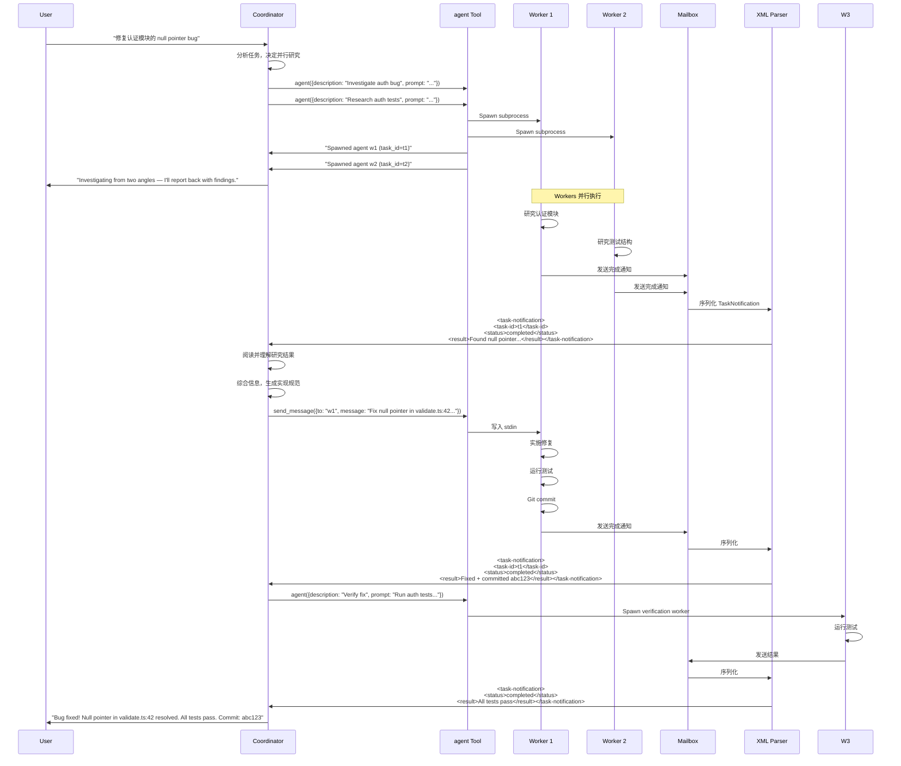
```mermaid
sequenceDiagram
    participant U as User
    participant C as Coordinator
    participant AT as agent Tool
    participant W1 as Worker 1
    participant W2 as Worker 2
    participant MB as Mailbox
    participant XML as XML Parser
    
    U->>C: "修复认证模块的 null pointer bug"
    
    C->>C: 分析任务，决定并行研究
    
    C->>AT: agent({description: "Investigate auth bug", prompt: "..."})
    C->>AT: agent({description: "Research auth tests", prompt: "..."})
    
    AT->>W1: Spawn subprocess
    AT->>W2: Spawn subprocess
    
    AT->>C: "Spawned agent w1 (task_id=t1)"
    AT->>C: "Spawned agent w2 (task_id=t2)"
    
    C->>U: "Investigating from two angles — I'll report back with findings."
    
    Note over W1,W2: Workers 并行执行
    
    W1->>W1: 研究认证模块
    W2->>W2: 研究测试结构
    
    W1->>MB: 发送完成通知
    W2->>MB: 发送完成通知
    
    MB->>XML: 序列化 TaskNotification
    XML->>C: <task-notification><br/><task-id>t1</task-id><br/><status>completed</status><br/><result>Found null pointer...</result></task-notification>
    
    C->>C: 阅读并理解研究结果
    C->>C: 综合信息，生成实现规范
    
    C->>AT: send_message({to: "w1", message: "Fix null pointer in validate.ts:42..."})
    
    AT->>W1: 写入 stdin
    W1->>W1: 实施修复
    W1->>W1: 运行测试
    W1->>W1: Git commit
    
    W1->>MB: 发送完成通知
    MB->>XML: 序列化
    XML->>C: <task-notification><br/><task-id>t1</task-id><br/><status>completed</status><br/><result>Fixed + committed abc123</result></task-notification>
    
    C->>AT: agent({description: "Verify fix", prompt: "Run auth tests..."})
    
    AT->>W3: Spawn verification worker
    W3->>W3: 运行测试
    W3->>MB: 发送结果
    MB->>XML: 序列化
    XML->>C: <task-notification><br/><status>completed</status><br/><result>All tests pass</result></task-notification>
    
    C->>U: "Bug fixed! Null pointer in validate.ts:42 resolved. All tests pass. Commit: abc123"
```

#### 4.4.6.1 Coordinator 上下文消息的特殊处理机制

**核心问题**：Coordinator 需要知道 Workers 有哪些工具可用，但这个消息不应该污染对话历史。

**解决方案**：在每个 turn 中动态注入和移除 Coordinator 上下文消息。

##### （1）上下文消息的内容

通过 `get_coordinator_user_context()` 函数构建（`coordinator_mode.py:220-248`）：

```python
def get_coordinator_user_context(
    mcp_clients: list[dict[str, str]] | None = None,
    scratchpad_dir: Optional[str] = None,
) -> dict[str, str]:
    """Build the workerToolsContext injected into the coordinator's user turn."""
    if not is_coordinator_mode():
        return {}

    # 1. Worker 可用工具列表
    tools = sorted(_SIMPLE_WORKER_TOOLS if is_simple else _WORKER_TOOLS)
    worker_tools_str = ", ".join(tools)
    content = f"Workers spawned via the agent tool have access to these tools: {worker_tools_str}"

    # 2. MCP 服务器信息
    if mcp_clients:
        server_names = ", ".join(c["name"] for c in mcp_clients)
        content += f"\n\nWorkers also have access to MCP tools from connected MCP servers: {server_names}"

    # 3. Scratchpad 目录（跨 Worker 知识共享）
    if scratchpad_dir:
        content += (
            f"\n\nScratchpad directory: {scratchpad_dir}\n"
            "Workers can read and write here without permission prompts. "
            "Use this for durable cross-worker knowledge — structure files however fits the work."
        )

    return {"workerToolsContext": content}
```

**实际输出示例**：
```
# Coordinator User Context

Workers spawned via the agent tool have access to these tools: Bash, Edit, Glob, Grep, NotebookEditCell, NotebookRead, Read, TodoWrite, WebFetch, WebSearch, Write

Workers also have access to MCP tools from connected MCP servers: github, docker

Scratchpad directory: /tmp/scratchpad-abc123
Workers can read and write here without permission prompts. Use this for durable cross-worker knowledge — structure files however fits the work.
```

##### （2）完整的 Pop/Put Back 流程

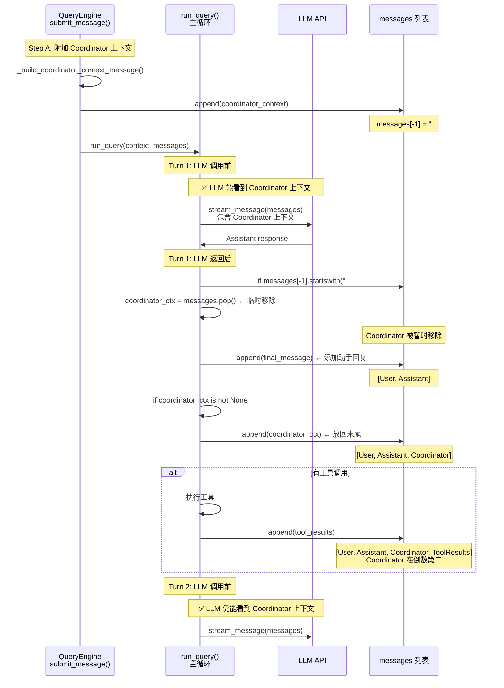
```mermaid
sequenceDiagram
    participant QE as QueryEngine<br/>submit_message()
    participant RQ as run_query()<br/>主循环
    participant LLM as LLM API
    participant Msgs as messages 列表
    
    Note over QE: Step A: 附加 Coordinator 上下文
    QE->>QE: _build_coordinator_context_message()
    QE->>Msgs: append(coordinator_context)
    Note over Msgs: messages[-1] = "# Coordinator User Context..."
    
    QE->>RQ: run_query(context, messages)
    
    Note over RQ: Turn 1: LLM 调用前
    Note over RQ,LLM: ✅ LLM 能看到 Coordinator 上下文
    RQ->>LLM: stream_message(messages)<br/>包含 Coordinator 上下文
    LLM->>RQ: Assistant response
    
    Note over RQ: Turn 1: LLM 返回后
    RQ->>Msgs: if messages[-1].startswith("# Coordinator...")
    RQ->>RQ: coordinator_ctx = messages.pop()  ← 临时移除
    Note over Msgs: Coordinator 被暂时移除
    
    RQ->>Msgs: append(final_message)  ← 添加助手回复
    Note over Msgs: [User, Assistant]
    
    RQ->>RQ: if coordinator_ctx is not None
    RQ->>Msgs: append(coordinator_ctx)  ← 放回末尾
    Note over Msgs: [User, Assistant, Coordinator]
    
    alt 有工具调用
        RQ->>RQ: 执行工具
        RQ->>Msgs: append(tool_results)
        Note over Msgs: [User, Assistant, Coordinator, ToolResults]<br/>Coordinator 在倒数第二
    end
    
    Note over RQ: Turn 2: LLM 调用前
    Note over RQ,LLM: ✅ LLM 仍能看到 Coordinator 上下文
    RQ->>LLM: stream_message(messages)
```

##### （3）关键代码实现

**阶段 1：附加上下文** (`query_engine.py:360-362`)
```python
async def submit_message(self, prompt: str | ConversationMessage):
    # ... 构建 query_messages ...
    
    # 如果处于 Coordinator Mode，附加上下文消息
    coordinator_context = self._build_coordinator_context_message()
    if coordinator_context is not None:
        query_messages.append(coordinator_context)  # ← 附加到末尾
    
    # 调用 run_query
    async for event, usage in run_query(context, query_messages):
        yield event
```

**阶段 2：临时移除** (`query.py:678-681`)
```python
async def run_query(context: QueryContext, messages: list[ConversationMessage]):
    while context.max_turns is None or turn_count < context.max_turns:
        # ... LLM 调用 ...
        
        final_message = event.message
        
        # 检查并临时移除 Coordinator 上下文
        coordinator_context_message: ConversationMessage | None = None
        if context.system_prompt.startswith("You are a **coordinator**."):
            if messages and messages[-1].role == "user" and \
               messages[-1].text.startswith("# Coordinator User Context"):
                coordinator_context_message = messages.pop()  # ← 临时移除
        
        # 添加助手回复
        messages.append(final_message)
        yield AssistantTurnComplete(message=final_message, usage=usage), usage
        
        # 放回 Coordinator 上下文
        if coordinator_context_message is not None:
            messages.append(coordinator_context_message)  # ← 放回末尾
        
        # ... 执行工具调用 ...
```

##### （4）为什么要 Pop/Put Back？

| 原因 | 说明 |
|------|------|
| **保持正确的消息顺序** | 确保助手回复在 Coordinator 上下文之前：<br/>`[User, Assistant, Coordinator]` 而不是 `[User, Coordinator, Assistant]` |
| **为工具结果腾出最后位置** | 最终顺序应该是：<br/>`[User, Assistant, Coordinator, ToolResults]` |
| **避免上下文"卡"在中间** | 如果不 pop，多轮对话后 Coordinator 会夹在助手和工具结果之间 |
| **LLM 始终能看到** | Pop 只是短暂的操作，LLM 在每次调用时都能看到 Coordinator 上下文 |
| **节省 Token** | 不重复注入，节省成本 |

##### （5）消息列表的演变过程

```
初始状态 (submit_message 后):
┌─────────────────────────────────────┐
│ Msg0: Project Context               │
│ Msg1: User Input                    │
│ Msg2: Coordinator Context           │ ← 最后
└─────────────────────────────────────┘

Turn 1: LLM 调用前 (LLM 能看到 Coordinator)
┌─────────────────────────────────────┐
│ Msg0: Project Context               │
│ Msg1: User Input                    │
│ Msg2: Coordinator Context           │ ← LLM 看到这个消息 ✅
└─────────────────────────────────────┘

Turn 1: LLM 返回后 (pop Coordinator)
┌─────────────────────────────────────┐
│ Msg0: Project Context               │
│ Msg1: User Input                    │
│ (Coordinator 暂存在变量中)           │
└─────────────────────────────────────┘

Turn 1: 添加助手回复
┌─────────────────────────────────────┐
│ Msg0: Project Context               │
│ Msg1: User Input                    │
│ Msg2: Assistant Reply               │ ← 新添加
└─────────────────────────────────────┘

Turn 1: 放回 Coordinator
┌─────────────────────────────────────┐
│ Msg0: Project Context               │
│ Msg1: User Input                    │
│ Msg2: Assistant Reply               │
│ Msg3: Coordinator Context           │ ← 放回
└─────────────────────────────────────┘

Turn 1: 执行工具后添加工具结果
┌─────────────────────────────────────┐
│ Msg0: Project Context               │
│ Msg1: User Input                    │
│ Msg2: Assistant Reply               │
│ Msg3: Coordinator Context           │ ← 倒数第二
│ Msg4: Tool Results                  │ ← 最后
└─────────────────────────────────────┘

Turn 2: LLM 调用前 (LLM 能看到 Coordinator)
┌─────────────────────────────────────┐
│ Msg0: Project Context               │
│ Msg1: User Input                    │
│ Msg2: Assistant Reply               │
│ Msg3: Coordinator Context           │ ← LLM 看到这个消息 ✅
│ Msg4: Tool Results                  │
└─────────────────────────────────────┘
```

##### （6）设计优势

| 优势 | 说明 |
|------|------|
| **动态注入** | 只在 Coordinator Mode 下附加，不影响普通模式 |
| **顺序正确** | 始终保持 `[User, Assistant, Coordinator, ToolResults]` 的顺序 |
| **Token 高效** | 不重复注入，节省成本 |
| **对话清洁** | 不包含系统级的上下文信息在对话历史中 |
| **可重用** | 放回后可以供下一轮继续使用（如果还有新的 worker 上下文） |

##### （7）实际应用场景

**场景：Coordinator 启动 Workers**

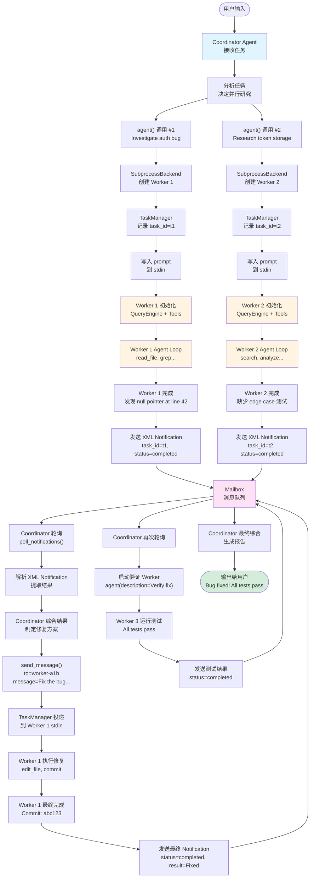
```mermaid
graph TB
    Start([用户输入]) --> Coordinator["Coordinator Agent<br/>接收任务"]
    
    Coordinator --> Analyze["分析任务<br/>决定并行研究"]
    
    Analyze --> Spawn1["agent() 调用 #1<br/>Investigate auth bug"]
    Analyze --> Spawn2["agent() 调用 #2<br/>Research token storage"]
    
    Spawn1 --> SubprocessBackend1["SubprocessBackend<br/>创建 Worker 1"]
    Spawn2 --> SubprocessBackend2["SubprocessBackend<br/>创建 Worker 2"]
    
    SubprocessBackend1 --> TaskManager1["TaskManager<br/>记录 task_id=t1"]
    SubprocessBackend2 --> TaskManager2["TaskManager<br/>记录 task_id=t2"]
    
    TaskManager1 --> WriteStdin1["写入 prompt<br/>到 stdin"]
    TaskManager2 --> WriteStdin2["写入 prompt<br/>到 stdin"]
    
    WriteStdin1 --> WorkerInit1["Worker 1 初始化<br/>QueryEngine + Tools"]
    WriteStdin2 --> WorkerInit2["Worker 2 初始化<br/>QueryEngine + Tools"]
    
    WorkerInit1 --> AgentLoop1["Worker 1 Agent Loop<br/>read_file, grep..."]
    WorkerInit2 --> AgentLoop2["Worker 2 Agent Loop<br/>search, analyze..."]
    
    AgentLoop1 --> Complete1["Worker 1 完成<br/>发现 null pointer at line 42"]
    AgentLoop2 --> Complete2["Worker 2 完成<br/>缺少 edge case 测试"]
    
    Complete1 --> SendNotification1["发送 XML Notification<br/>task_id=t1, status=completed"]
    Complete2 --> SendNotification2["发送 XML Notification<br/>task_id=t2, status=completed"]
    
    SendNotification1 --> Mailbox["Mailbox<br/>消息队列"]
    SendNotification2 --> Mailbox
    
    Mailbox --> PollNotifications["Coordinator 轮询<br/>poll_notifications()"]
    
    PollNotifications --> ParseXML["解析 XML Notification<br/>提取结果"]
    
    ParseXML --> Synthesize["Coordinator 综合结果<br/>制定修复方案"]
    
    Synthesize --> SendMessage["send_message()<br/>to=worker-a1b<br/>message=Fix the bug..."]
    
    SendMessage --> DeliverMessage["TaskManager 投递<br/>到 Worker 1 stdin"]
    
    DeliverMessage --> WorkerFix["Worker 1 执行修复<br/>edit_file, commit"]
    
    WorkerFix --> FinalComplete["Worker 1 最终完成<br/>Commit: abc123"]
    
    FinalComplete --> FinalNotification["发送最终 Notification<br/>status=completed, result=Fixed"]
    
    FinalNotification --> Mailbox
    
    Mailbox --> FinalPoll["Coordinator 再次轮询"]
    
    FinalPoll --> Verify["启动验证 Worker<br/>agent(description=Verify fix)"]
    
    Verify --> RunTests["Worker 3 运行测试<br/>All tests pass"]
    
    RunTests --> TestNotification["发送测试结果<br/>status=completed"]
    
    TestNotification --> Mailbox
    
    Mailbox --> FinalSynthesis["Coordinator 最终综合<br/>生成报告"]
    
    FinalSynthesis --> End(["输出给用户<br/>Bug fixed! All tests pass"])
    
    style Coordinator fill:#e1f5ff
    style WorkerInit1 fill:#fff4e1
    style WorkerInit2 fill:#fff4e1
    style AgentLoop1 fill:#fff4e1
    style AgentLoop2 fill:#fff4e1
    style Mailbox fill:#ffe1f5
    style End fill:#d4edda
```

**关键步骤说明**：

| 阶段 | 操作 | 关键机制 |
|------|------|----------|
| **1. 任务拆分** | Coordinator 分析任务，决定并行研究 | LLM 自主决策 |
| **2. Worker 启动** | `agent()` 工具调用 → SubprocessBackend → TaskManager | 进程隔离、异步启动 |
| **3. 初始化** | Worker 读取 stdin，初始化 QueryEngine + Tools | 完整引擎实例 |
| **4. 并行执行** | Worker 1 & 2 同时运行 Agent Loop | 天然并发 |
| **5. 结果通知** | Worker 完成后发送 XML Notification 到 Mailbox | 异步通信 |
| **6. 结果综合** | Coordinator 轮询 Mailbox，解析并综合结果 | 主动拉取 |
| **7. 继续执行** | `send_message()` 投递新指令到 Worker stdin | 上下文复用 |
| **8. 验证** | 启动新的 Worker 验证修复结果 | 质量保证 |
| **9. 最终报告** | Coordinator 生成最终总结 | 任务闭环 |

##### （8）Coordinator 决策矩阵：Continue vs Spawn

**核心问题**：收到 Worker 结果后，是继续使用同一 Worker（Continue）还是启动新 Worker（Spawn Fresh）？

**决策依据**：基于**上下文重叠程度**（Context Overlap）


```mermaid
graph TB
    Start[收到 Worker 结果] --> Analyze{分析上下文重叠}
    
    Analyze -- 高重叠 --> ContextHelps{现有上下文有帮助?}
    Analyze -- 低重叠 --> SpawnFresh[Spawn Fresh Worker]
    
    ContextHelps -- 是 --> Continue[Continue Worker<br/>send_message]
    ContextHelps -- 否 --> SpawnFresh
    
    Continue --> CheckType{任务类型?}
    SpawnFresh --> CheckType
    
    CheckType -- 修正失败 --> ContinueSame[继续同一 Worker<br/>有错误上下文]
    CheckType -- 验证代码 --> SpawnVerifier[Spawn 新验证 Worker<br/>避免偏见]
    CheckType -- 实现修改 --> ContinueImpl[继续研究 Worker<br/>已有文件上下文]
    CheckType -- 无关任务 --> SpawnFresh
    
    ContinueSame --> Execute[执行任务]
    SpawnVerifier --> Execute
    ContinueImpl --> Execute
    SpawnFresh --> Execute
```

**决策规则表**：

| 场景 | 决策 | 原因 | 示例 |
|------|------|------|------|
| **研究探索了需要编辑的文件** | ✅ Continue | Worker 已有文件上下文 + 清晰的实现规范 | 研究完 auth.py 后直接让它修复 |
| **研究范围广但实现范围窄** | 🆕 Spawn Fresh | 避免携带探索噪音，专注上下文更清晰 | 研究了整个 auth 模块，只需修复一个函数 |
| **修正失败或扩展最近工作** | ✅ Continue | Worker 有错误上下文，知道刚尝试了什么 | 测试失败后让同一 Worker 修正断言 |
| **验证其他 Worker 的代码** | 🆕 Spawn Fresh | 验证者应该用新鲜视角，不带实现假设 | 独立验证 Worker 的修复是否正确 |
| **首次实现完全错误** | 🆕 Spawn Fresh | 错误方法的上下文会污染重试，干净 slate 避免锚定 | Worker 用了错误的 API，换新的 |
| **完全不相关的任务** | 🆕 Spawn Fresh | 没有可重用的上下文 | 从 auth 模块切换到 payment 模块 |

**实现方式**：

这个决策逻辑是通过 **Prompt Engineering** 实现的，而不是硬编码的 Python 函数：

**代码位置**：[`src/openharness/coordinator/coordinator_mode.py:431-444`](file:///Users/gqli/work/deepagents/OpenHarness/src/openharness/coordinator/coordinator_mode.py#L431-L444)

```python
def get_coordinator_system_prompt() -> str:
    return """
### Choose continue vs. spawn by context overlap

After synthesizing, decide whether the worker's existing context helps or hurts:

| Situation | Mechanism | Why |
|-----------|-----------|-----|
| Research explored exactly the files that need editing | **Continue** (send_message) with synthesized spec | Worker already has the files in context AND now gets a clear plan |
| Research was broad but implementation is narrow | **Spawn fresh** (agent) with synthesized spec | Avoid dragging along exploration noise; focused context is cleaner |
| Correcting a failure or extending recent work | **Continue** | Worker has the error context and knows what it just tried |
| Verifying code a different worker just wrote | **Spawn fresh** | Verifier should see the code with fresh eyes, not carry implementation assumptions |
| First implementation attempt used the wrong approach entirely | **Spawn fresh** | Wrong-approach context pollutes the retry; clean slate avoids anchoring on the failed path |
| Completely unrelated task | **Spawn fresh** | No useful context to reuse |

There is no universal default. Think about how much of the worker's context overlaps with the next task. High overlap -> continue. Low overlap -> spawn fresh.
"""
```

**关键点**：
- ✅ **LLM 自主决策**：没有专门的 Python 函数，决策由 LLM 根据 Prompt 规则完成
- ✅ **工具调用**：LLM 选择调用 `agent()` 或 `send_message()` 来执行决策
- ✅ **灵活性**：可以根据具体场景灵活调整，不受固定规则限制

在这个过程中，Coordinator 需要知道：
- ✅ Workers 有哪些工具可用（Bash, Read, Edit, MCP...）
- ✅ Scratchpad 目录在哪里（用于跨 Worker 共享信息）
- ✅ 哪些 MCP 服务器已连接

这些信息就是通过 Coordinator 上下文消息提供的，并且通过 Pop/Put Back 机制确保 LLM 在每一轮都能看到最新的上下文。

##### （9）`_build_coordinator_context_message()` 函数详解

**函数位置**：[`src/openharness/engine/query_engine.py:235-256`](file:///Users/gqli/work/deepagents/OpenHarness/src/openharness/engine/query_engine.py#L235-L256)

这是连接**全局协调器状态**与 **LLM 消息列表**的桥梁函数，负责将 `get_coordinator_user_context()` 返回的字典转换为可注入对话的 `ConversationMessage`。

**源码**：

```python
def _build_coordinator_context_message(self) -> ConversationMessage | None:
    context = get_coordinator_user_context()          # ① 获取全局上下文字典
    worker_tools_context = context.get("workerToolsContext")  # ② 提取关键字段
    if not worker_tools_context:
        return None                                   # ③ 守卫：非 Coordinator 模式提前退出
    return ConversationMessage(                       # ④ 构造合成的用户消息
        role="user",
        content=[TextBlock(text=f"# Coordinator User Context\n\n{worker_tools_context}")],
    )
```

**三步逻辑拆解**：

| 步骤 | 操作 | 说明 |
|------|------|------|
| ① | `get_coordinator_user_context()` | 读取环境变量 `CLAUDE_CODE_COORDINATOR_MODE`，非 Coordinator 模式返回空字典 `{}` |
| ② | `context.get("workerToolsContext")` | 提取 Worker 工具列表、MCP 服务器、Scratchpad 目录等拼接好的字符串 |
| ③ | `if not worker_tools_context: return None` | 守卫条件：普通模式下不注入任何上下文，函数零副作用退出 |
| ④ | 构造 `ConversationMessage` | 将内容包装为 `role="user"` 的合成消息，标题为 `# Coordinator User Context` |

**关键设计特点**：

- **不持久化**：返回的消息只加入 `query_messages`（临时列表），不直接写入 `self._messages`，每轮重新构建
- **零侵入性**：普通模式下返回 `None`，调用方无需判断模式，直接 `if result is not None` 即可
- **消息角色为 `user`**：让 LLM 将其视为用户侧提供的上下文信息，而非系统指令

**完整调用链示例（Coordinator 模式 + MCP + Scratchpad）**：

```python
# 前提条件
import os
os.environ["CLAUDE_CODE_COORDINATOR_MODE"] = "1"

# ── Step 1: get_coordinator_user_context() 返回 ──
# coordinator_mode.py 构建上下文字典
context = get_coordinator_user_context(
    mcp_clients=[{"name": "github"}, {"name": "docker"}],
    scratchpad_dir="/tmp/scratchpad-abc123",
)
# context = {
#     "workerToolsContext": (
#         "Workers spawned via the agent tool have access to these tools: "
#         "bash, file_edit, file_read, file_write, glob, grep, skill, "
#         "task_create, task_get, task_list, task_output, web_fetch, web_search\n\n"
#         "Workers also have access to MCP tools from connected MCP servers: github, docker\n\n"
#         "Scratchpad directory: /tmp/scratchpad-abc123\n"
#         "Workers can read and write here without permission prompts. "
#         "Use this for durable cross-worker knowledge — structure files however fits the work."
#     )
# }

# ── Step 2: _build_coordinator_context_message() 转换 ──
msg = engine._build_coordinator_context_message()
# msg = ConversationMessage(
#     role="user",
#     content=[TextBlock(text=(
#         "# Coordinator User Context\n\n"
#         "Workers spawned via the agent tool have access to these tools: "
#         "bash, file_edit, file_read, file_write, glob, grep, skill, "
#         "task_create, task_get, task_list, task_output, web_fetch, web_search\n\n"
#         "Workers also have access to MCP tools from connected MCP servers: github, docker\n\n"
#         "Scratchpad directory: /tmp/scratchpad-abc123\n"
#         "Workers can read and write here without permission prompts. "
#         "Use this for durable cross-worker knowledge — structure files however fits the work."
#     ))]
# )

# ── Step 3: submit_message() 中注入 ──
query_messages = list(self._messages)     # [Msg_user: "修复 auth 模块的 bug"]
coordinator_context = self._build_coordinator_context_message()
if coordinator_context is not None:
    query_messages.append(coordinator_context)
# query_messages = [
#     Msg(role="user", text="修复 auth 模块的 bug"),
#     Msg(role="user", text="# Coordinator User Context\n\nWorkers spawned via...")  ← 注入
# ]

# ── Step 4: run_query() 中 Pop/Put Back ──
# LLM 调用前：看到 Coordinator 上下文 ✅
# LLM 返回后：pop() 暂存 → append(assistant_reply) → append(coordinator_ctx) 放回
# 工具执行后：[User, Assistant, Coordinator, ToolResults] 顺序正确 ✅
```

**普通模式（非 Coordinator）的行为**：

```python
# 前提：未设置 CLAUDE_CODE_COORDINATOR_MODE
import os
os.environ.pop("CLAUDE_CODE_COORDINATOR_MODE", None)

# get_coordinator_user_context() 返回空字典
context = get_coordinator_user_context()
# context = {}

# _build_coordinator_context_message() 提前返回 None
msg = engine._build_coordinator_context_message()
# msg = None

# submit_message() 中不注入任何额外消息
query_messages = list(self._messages)  # [Msg_user: "修复 auth 模块的 bug"]
coordinator_context = self._build_coordinator_context_message()
if coordinator_context is not None:    # False，跳过
    query_messages.append(coordinator_context)
# query_messages 保持不变 ✅ 零侵入
```

#### 4.4.7 设计优势与挑战

**优势**：

| 维度 | 说明 |
|------|------|
| **并行效率** | 可同时启动多个 Workers，研究阶段提速 2-3x |
| **职责分离** | Coordinator 专注综合，Workers 专注执行 |
| **上下文隔离** | 每个 Worker 独立上下文，避免污染 |
| **灵活调度** | 可根据任务特性选择 Continue vs Spawn |
| **可扩展性** | 理论上可管理无限数量的 Workers |

**挑战**：

| 挑战 | 解决方案 |
|------|----------|
| **Prompt 质量要求高** | Coordinator 必须学会综合信息，不能简单转发 |
| **上下文切换成本** | 通过 Continue 机制复用 Worker 上下文 |
| **调试复杂性** | XML 通知提供结构化结果，便于追踪 |
| **资源消耗** | 每个 Worker 是独立进程，需注意内存/CPU |
| **学习曲线** | 需要理解 Continue vs Spawn 的决策逻辑 |

#### 4.4.8 与其他框架的对比

**完整框架对比（7个项目）**：

| 特性 | OpenHarness | DeepAgents | Deer-Flow | Hermes-Agent | SmolAgents | CrewAI | AutoGen |
|------|-------------|------------|-----------|--------------|------------|---------|----------|
| **上下文压缩** | ✅ 自动压缩<br/>`compact_conversation()`<br/>基于 token 阈值 | ❌ 无内置压缩<br/>依赖 LLM 窗口管理 | ✅ SummarizationMiddleware<br/>基于 LangGraph | ✅ TrajectoryCompressor<br/>后处理压缩 | ⚠️ summary_mode<br/>write_memory_to_messages() | ❌ 无内置 | ❌ 无内置 |
| **权限控制** | ✅ Hook 系统<br/>`pre_tool_use`<br/>可阻断工具执行 | ❌ 无内置权限<br/>依赖外部实现 | ❌ 无内置权限<br/>默认允许所有工具 | ✅ auto_run 参数<br/>控制是否询问用户 | ❌ 无内置 | ❌ 无内置 | ⚠️ 人工审核<br/>Human-in-the-loop |
| **启用方式** | 环境变量开关<br/>`OPENHARNESS_*` | 默认启用 | Feature Flags<br/>RuntimeFeatures | CLI 参数<br/>`--auto-run` | 代码配置<br/>Agent 实例化 | YAML/Python 配置<br/>Crew 定义 | Python API<br/>GroupChat 配置 |
| **角色定义** | Coordinator Prompt<br/>520 行专用提示词 | SubAgentMiddleware<br/>中间件模式 | RuntimeFeatures<br/>配置化 Agent | 单一 Agent<br/>通过 toolsets 区分 | @managed_agent<br/>装饰器模式 | Role-based<br/>Agent 角色定义 | ConversableAgent<br/>消息路由 |
| **通信机制** | XML Notification<br/>`<task-notification>` | task() 返回值<br/>直接返回结果 | task_tool 返回值<br/>LangGraph State | 内部消息循环<br/>OpenAI API 格式 | 函数返回值<br/>字符串直接返回 | CrewOutput 对象<br/>结构化输出 | ToolMessage<br/>消息传递 |
| **并行控制** | 手动并发调用<br/>`asyncio.gather()` | 自动并发<br/>框架层支持 | max_concurrent 参数<br/>配置化限制 | 线程池<br/>ThreadPoolExecutor | ❌ 不支持<br/>单步单工具 | Process 类型决定<br/>Sequential/Hierarchical | GroupChat 调度<br/>轮流发言 |
| **上下文管理** | Continue vs Spawn<br/>显式选择 | 自动继承<br/>父上下文传递 | 自动继承<br/>State 传递 | 消息历史<br/>完整传递 | 共享内存<br/>无隔离 | Crew State<br/>任务队列 | ChatHistory<br/>Context 传递 |
| **子Agent 架构** | 异步进程<br/>subprocess + TaskManager | 同步调用<br/>LangGraph invoke | 异步任务<br/>asyncio.create_task | 线程池并行<br/>ThreadPoolExecutor | 同步调用<br/>agent.run() | 顺序/层级<br/>Process 调度 | 消息传递<br/>ConversableAgent |
| **隔离级别** | 🟢🟢🟢 完全隔离<br/>独立 PID | 🟡 内存隔离<br/>State 过滤 | 🟢🟢 进程隔离<br/>Worker 进程 | 🟡 内存隔离<br/>新 AIAgent 实例 | 🔴 无隔离<br/>共享内存 | 🟡 角色隔离<br/>不同 Agent 实例 | 🟡 会话隔离<br/>不同 context |
| **适用场景** | 复杂工程任务<br/>多 Worker 协作 | 通用任务分解<br/>灵活扩展 | 研究导向任务<br/>学术场景 | 开发辅助<br/>代码生成 | 教学/原型<br/>快速实验 | 企业业务流程<br/>团队协作 | 对话协作<br/>研究讨论 |

**关键差异说明**:

1. **上下文压缩 (Context Compression)**:
   - **OpenHarness**: 使用 `compact_conversation()` 函数,基于 token 阈值自动触发,保留最近 N 条消息,压缩早期对话为摘要
   - **Deer-Flow**: 使用 LangGraph 的 `SummarizationMiddleware`,在 `before_model` 钩子中检查 token 数量,超过阈值时调用 LLM 生成摘要
   - **Hermes-Agent**: 使用后处理的 `TrajectoryCompressor`,在会话结束后批量压缩轨迹文件,保护首尾 turn,压缩中间部分
   - **SmolAgents**: 通过 `summary_mode` 和 `write_memory_to_messages()` 实现简单摘要
   - **DeepAgents / CrewAI / AutoGen**: 无内置压缩机制,依赖应用层自行管理上下文窗口

2. **权限控制 (Permission Control)**:
   - **OpenHarness**: 通过 Hook 系统实现,`pre_tool_use` hook 可以返回 `blocked=True` 阻止工具执行,错误结果作为 `ToolResultBlock(is_error=True)` 返回给 LLM
   - **Hermes-Agent**: 通过 `auto_run` 参数控制,`auto_run=False` 时会在敏感操作前询问用户确认
   - **AutoGen**: 通过 Human-in-the-loop 机制,允许人工审核和干预
   - **DeepAgents / Deer-Flow / SmolAgents / CrewAI**: 无内置权限控制系统,需要应用层自行实现

3. **子Agent 架构 (Subagent Architecture)**:
   - **OpenHarness**: 使用 subprocess 启动独立进程,通过 TaskManager 和 Mailbox 管理生命周期,XML Notification 异步通信
   - **DeepAgents**: 通过 LangGraph 的 `ainvoke()` 同步调用子Agent,Command 更新主状态
   - **Deer-Flow**: 使用 `asyncio.create_task()` 创建异步 Worker 进程,SSE 事件流实时推送
   - **Hermes-Agent**: 使用 `ThreadPoolExecutor` 线程池并行执行多个子Agent,阻塞等待返回值
   - **SmolAgents**: 简单的 `agent.run()` 同步调用,无隔离,适合教学场景
   - **CrewAI**: 通过 Process 类型(Sequential/Hierarchical)调度多个 Agent,流程编排能力强
   - **AutoGen**: 基于 GroupChat 的消息传递机制,ConversableAgent 轮流发言

4. **架构设计理念**:
   - **OpenHarness**: 强调 Coordinator-Worker 分工,Coordinator 负责任务分解和结果综合,Worker 专注执行
   - **DeepAgents**: 采用中间件模式,通过 `SubAgentMiddleware` 实现灵活的子 Agent 注入
   - **Deer-Flow**: 基于 LangGraph 的状态机模型,通过 `RuntimeFeatures` 配置化启用功能
   - **Hermes-Agent**: 单一 Agent 循环,通过 toolsets 动态加载不同工具集
   - **SmolAgents**: 极简设计,易于理解,适合教学和原型开发
   - **CrewAI**: 业务导向,强调流程编排、角色分工和质量审查
   - **AutoGen**: 协作优先,自然的消息传递和动态路由

---

### 4.6 Tool Metadata（跨轮次状态管理）

**Tool Metadata 是 OpenHarness 中最核心的设计之一**,它解决了多轮对话中状态持久化的关键问题。

#### 4.6.1 什么是 Tool Metadata？

`tool_metadata` 是一个**贯穿整个会话生命周期的字典对象**,用于在多轮对话之间携带和持久化工具执行的副作用(side effects)和上下文信息。

```python
# QueryEngine 中的定义 (query_engine.py:135-148)
class QueryEngine:
    def __init__(self, ...):
        self._tool_metadata: dict[str, object] = {}
    
    @property
    def tool_metadata(self) -> dict[str, object]:
        """获取可变的工具元数据/跨轮次状态。
        
        tool_metadata 是一个字典,用于在对话的多轮之间携带状态信息,包括:
        - task_focus_state: 任务焦点状态(目标、历史目标、活动文件等)
        - read_file_state: 最近读取的文件记录
        - invoked_skills: 已调用的技能列表
        - async_agent_state: 异步 Agent 活动记录
        - 其他工具执行过程中产生的元数据
        """
        return self._tool_metadata
```

**核心特性**:

1. **生命周期**: 从会话创建到销毁,`tool_metadata` 始终存在且保持不变(引用不变,内容可变)
2. **可变性**: 每一轮工具执行后都会被更新(`_record_tool_carryover`)
3. **传递性**: 通过 `QueryContext` 传递给 `run_query()` 函数
4. **持久化**: 支持序列化和恢复(ohmo 会话快照)
5. **隔离性**: 每个 QueryEngine 实例有独立的 `tool_metadata`

#### 4.6.2 为什么需要 Tool Metadata？

**问题场景**:

想象一个典型的工程任务对话:

```
用户: "帮我修复 auth 模块的 bug"
AI: [调用 read_file 读取 auth.py]
AI: [调用 grep 搜索错误模式]
AI: [调用 skill 加载测试框架]
AI: "我发现了一个空指针异常..."

用户: "继续修复"
← 此时 LLM 需要知道:
  - 之前读了哪些文件？
  - 发现了什么问题？
  - 加载了哪些 skills？
  - 当前任务焦点是什么？
```

**如果没有 tool_metadata**:

❌ **方案 1: 完全依赖消息历史**
```python
messages = [
    UserMessage("帮我修复 auth 模块的 bug"),
    AssistantMessage(tool_calls=[read_file(...)]),
    UserMessage(tool_results=[file_content]),  # ← 文件内容可能很大
    AssistantMessage(tool_calls=[grep(...)]),
    UserMessage(tool_results=[grep_matches]),   # ← 匹配结果可能很多
    ...
]
```

问题:
- 消息历史会迅速膨胀(尤其是工具结果)
- 触发自动压缩时,这些重要信息可能被摘要掉
- LLM 丢失关键的上下文信息

❌ **方案 2: 每次重新查询**
```python
# 每轮都重新读取文件、重新搜索...
every_turn()
```

问题:
- 浪费 token 和时间
- 重复的工具调用增加成本
- 用户体验差

**有了 tool_metadata**:

✅ **优雅的解决方案**:

```python
# Turn 1: 用户输入
remember_user_goal(tool_metadata, "修复 auth 模块的 bug")
# → tool_metadata["task_focus_state"]["goal"] = "修复 auth 模块的 bug"

# Turn 2: 读取文件
_remember_read_file(
    tool_metadata,
    path="src/auth.py",
    offset=0,
    limit=200,
    output="def validate(user):\n    if user.id is None:..."
)
# → tool_metadata["read_file_state"] = [{
#     "path": "src/auth.py",
#     "span": "lines 1-200",
#     "preview": "def validate(user): | if user.id is None:...",
#     "timestamp": 1234567890.0
# }]

# Turn 3: 调用 skill
_remember_skill_invocation(tool_metadata, skill_name="pytest-framework")
# → tool_metadata["invoked_skills"] = ["pytest-framework"]

# Turn 4: 用户说"继续"
# ↓ 系统提示词构建时注入:
attachments = [
    create_task_focus_attachment_if_needed(metadata),      # ← 当前目标
    create_recent_files_attachment_if_needed(read_file_state),  # ← 已读文件
    create_invoked_skills_attachment_if_needed(invoked_skills), # ← 已用 skills
]
# ↓ LLM 看到:
"""
[Compact attachment: task_focus] Current working focus
- Goal: 修复 auth 模块的 bug
- Active artifacts in play:
  - src/auth.py

[Compact attachment: recent_files] Recently read files
- src/auth.py (lines 1-200)
  Preview: def validate(user): | if user.id is None:...

[Compact attachment: invoked_skills] Skills used earlier
- pytest-framework
"""
```

**优势**:

1. ✅ **信息不丢失**: 即使消息被压缩,关键状态仍保留
2. ✅ **成本低**: 只存储精简的元数据,不存储完整内容
3. ✅ **灵活性强**: 可以记录任意类型的状态
4. ✅ **解耦设计**: 与消息历史独立,互不影响

#### 4.6.3 Tool Metadata 的数据结构

```python
tool_metadata = {
    # ========== 任务焦点状态 ==========
    "task_focus_state": {
        "goal": "修复 auth 模块的 bug",           # 当前目标
        "recent_goals": [                          # 最近的目标列表(最多5条)
            "添加单元测试",
            "优化性能",
            "修复 auth 模块的 bug"
        ],
        "active_artifacts": [                      # 正在处理的工件(最多8条)
            "src/auth.py",
            "tests/test_auth.py",
            "skill:pytest-framework"
        ],
        "verified_state": [                        # 已验证的状态(最多8条)
            "Inspected file src/auth.py (lines 1-200)",
            "Loaded skill pytest-framework"
        ],
        "next_step": "编写测试用例覆盖空指针场景"  # 下一步计划
    },
    
    # ========== 读取的文件状态 ==========
    "read_file_state": [                           # 最近读取的文件(最多10条)
        {
            "path": "src/auth.py",
            "span": "lines 1-200",
            "preview": "def validate(user): | if user.id is None:...",
            "timestamp": 1234567890.0
        },
        {
            "path": "tests/test_auth.py",
            "span": "lines 1-100",
            "preview": "def test_validate(): | assert...",
            "timestamp": 1234567895.0
        }
    ],
    
    # ========== 调用的 Skills ==========
    "invoked_skills": [                            # 已调用的 skills(最多8条)
        "pytest-framework",
        "git-commit",
        "code-review"
    ],
    
    # ========== 异步 Agent 状态 ==========
    "async_agent_state": [                         # 异步 Agent 活动(最多6条)
        "Spawned async agent. Investigate auth tests [completed]",
        "Sent follow-up message to async agent task-abc123"
    ],
    
    # ========== 工作日志 ==========
    "recent_work_log": [                           # 最近的工作记录(最多8条)
        "Read file src/auth.py",
        "Ran bash: pytest tests/test_auth.py [15 passed]",
        "Loaded skill pytest-framework",
        "Async agent action via agent"
    ],
    
    # ========== 已验证的工作 ==========
    "recent_verified_work": [                      # 已验证的工作(最多8条)
        "Inspected file src/auth.py (lines 1-200)",
        "Loaded skill pytest-framework",
        "Confirmed async-agent activity via agent: Investigate auth tests"
    ],
    
    # ========== 权限模式 ==========
    "permission_mode": "default",                  # 当前权限模式
    "plan_summary": "...",                         # Plan Mode 的计划摘要
    
    # ========== 压缩检查点 ==========
    "compact_checkpoints": [                       # 历史压缩记录
        {
            "checkpoint": "session_memory",
            "trigger": "auto",
            "message_count": 50,
            "token_count": 45000,
            "attempt": 1
        }
    ],
    "compact_last": {...}                          # 最后一次压缩的详细信息
}
```

**常量配置** (`query.py:24-34`):

```python
MAX_TRACKED_USER_GOALS = 5              # 最多跟踪的用户目标数
MAX_TRACKED_ACTIVE_ARTIFACTS = 8        # 最多跟踪的活动工件数
MAX_TRACKED_VERIFIED_WORK = 8           # 最多跟踪的已验证工作数
MAX_TRACKED_READ_FILES = 10             # 最多跟踪的读取文件数
MAX_TRACKED_SKILLS = 8                  # 最多跟踪的 skills 数
MAX_TRACKED_ASYNC_AGENT_EVENTS = 6      # 最多跟踪的异步 Agent 事件数
MAX_TRACKED_WORK_LOG = 8                # 最多跟踪的工作日志数
```

#### 4.6.4 状态更新流程

**核心函数 `_record_tool_carryover`** (`query.py:386-493`):

这个函数在**每次工具成功执行后**被调用,负责将工具的副作用记录到 `tool_metadata` 中。

```python
def _record_tool_carryover(
    context: QueryContext,
    *,
    tool_name: str,          # 工具名称
    tool_input: dict[str, object],  # 工具输入
    tool_output: str,        # 工具输出
    is_error: bool,          # 是否出错
    resolved_file_path: str | None,  # 解析后的文件路径
) -> None:
    """记录工具执行的副作用到 tool_metadata 中。
    
    这是跨轮次状态管理的核心函数,在每次工具成功执行后被调用。
    它根据工具类型提取关键信息,并更新相应的 metadata bucket。
    
    Args:
        context: 查询上下文,包含 tool_metadata 引用
        tool_name: 执行的工具名称
        tool_input: 工具的输入参数
        tool_output: 工具的输出结果
        is_error: 工具执行是否失败
        resolved_file_path: 如果是文件操作,解析后的绝对路径
    """
    # 错误不记录
    if is_error:
        return
    
    # 根据工具类型记录不同的状态
    if tool_name == "read_file" and resolved_file_path is not None:
        # 1. 记录读取的文件
        _remember_read_file(
            context.tool_metadata,
            path=resolved_file_path,
            offset=int(tool_input.get("offset") or 0),
            limit=int(tool_input.get("limit") or 200),
            output=tool_output,
        )
        # 2. 记录已验证的工作
        _remember_verified_work(
            context.tool_metadata,
            f"Inspected file {resolved_file_path} (lines {offset + 1}-{offset + limit})",
        )
        # 3. 记录工作日志
        _remember_work_log(
            context.tool_metadata,
            entry=f"Read file {resolved_file_path}",
        )
    
    elif tool_name == "skill":
        # 1. 记录 skill 调用
        _remember_skill_invocation(
            context.tool_metadata,
            skill_name=str(tool_input.get("name") or ""),
        )
        # 2. 标记为活动工件
        _remember_active_artifact(
            context.tool_metadata,
            f"skill:{skill_name}",
        )
        # 3. 记录工作日志
        _remember_work_log(
            context.tool_metadata,
            entry=f"Loaded skill {skill_name}",
        )
    
    elif tool_name in {"agent", "send_message"}:
        # 1. 记录异步 Agent 活动
        _remember_async_agent_activity(
            context.tool_metadata,
            tool_name=tool_name,
            tool_input=tool_input,
            output=tool_output,
        )
        # 2. 记录工作日志
        _remember_work_log(
            context.tool_metadata,
            entry=f"Async agent action via {tool_name}",
        )
    
    elif tool_name == "bash":
        command = str(tool_input.get("command") or "").strip()
        summary = tool_output.splitlines()[0].strip() if tool_output.strip() else "no output"
        # 1. 记录已验证的工作
        _remember_verified_work(
            context.tool_metadata,
            f"Ran bash command {command[:160]} [{summary[:120]}]",
        )
        # 2. 记录工作日志
        _remember_work_log(
            context.tool_metadata,
            entry=f"Ran bash: {command[:160]} [{summary[:120]}]",
        )
    
    # ... 其他工具的处理逻辑类似
```

**辅助函数家族**:

```python
# 1. 获取或创建 task_focus_state
def _task_focus_state(tool_metadata: dict[str, object] | None) -> dict[str, object]:
    """安全地获取 task_focus_state 字典,如果不存在则创建默认值。"""
    if tool_metadata is None:
        return {}
    value = tool_metadata.setdefault("task_focus_state", {
        "goal": "",
        "recent_goals": [],
        "active_artifacts": [],
        "verified_state": [],
        "next_step": "",
    })
    # 确保所有字段都存在
    value.setdefault("goal", "")
    value.setdefault("recent_goals", [])
    # ...
    return value

# 2. 通用的 capped list 管理
def _append_capped_unique(bucket: list[Any], value: Any, limit: int) -> None:
    """向列表添加值,保持唯一性,超过限制时删除最旧的。
    
    Example:
        bucket = ["A", "B", "C"]
        _append_capped_unique(bucket, "D", limit=3)
        → bucket = ["B", "C", "D"]  # A 被移除
        
        _append_capped_unique(bucket, "B", limit=3)
        → bucket = ["C", "D", "B"]  # B 已存在,移到末尾
    """
    if value in bucket:
        bucket.remove(value)  # 如果已存在,先移除
    bucket.append(value)       # 添加到末尾(最新)
    if len(bucket) > limit:
        del bucket[:-limit]    # 删除超出限制的旧值

# 3. 通用的 bucket 获取器
def _tool_metadata_bucket(
    tool_metadata: dict[str, object] | None,
    key: str,
) -> list[Any]:
    """获取或创建指定 key 的列表 bucket。"""
    if tool_metadata is None:
        return []
    value = tool_metadata.setdefault(key, [])
    if isinstance(value, list):
        return value
    # 如果类型不对,重置为空列表
    replacement: list[Any] = []
    tool_metadata[key] = replacement
    return replacement
```

#### 4.6.5 多轮对话中的状态演变

让我们通过一个完整的示例来观察 `tool_metadata` 如何随对话演进:

**场景**: 用户要求"帮我查看 config.py 的内容并优化配置"

---

**Turn 0: 会话初始化**

```python
engine = QueryEngine(...)
# tool_metadata = {}  # 初始为空
```

---

**Turn 1: 用户输入**

```python
# 用户: "帮我查看 config.py 的内容并优化配置"

# Step 1: 记录用户目标 (query_engine.py:304)
remember_user_goal(engine.tool_metadata, "帮我查看 config.py 的内容并优化配置")

# tool_metadata 变化:
{
    "task_focus_state": {
        "goal": "帮我查看 config.py 的内容并优化配置",
        "recent_goals": ["帮我查看 config.py 的内容并优化配置"],
        "active_artifacts": [],
        "verified_state": [],
        "next_step": ""
    }
}

# Step 2: LLM 决定读取文件
# → tool_calls: [read_file(path="config.py")]

# Step 3: 执行工具并记录状态 (_record_tool_carryover)
_remember_read_file(
    tool_metadata,
    path="/project/config.py",
    offset=0,
    limit=200,
    output="DATABASE_URL = 'postgresql://...'\nAPI_KEY = 'sk-...'\n..."
)

# tool_metadata 变化:
{
    "task_focus_state": {
        "goal": "帮我查看 config.py 的内容并优化配置",
        "recent_goals": ["帮我查看 config.py 的内容并优化配置"],
        "active_artifacts": ["/project/config.py"],  # ← 新增
        "verified_state": ["Inspected file /project/config.py (lines 1-200)"],  # ← 新增
        "next_step": ""
    },
    "read_file_state": [  # ← 新增
        {
            "path": "/project/config.py",
            "span": "lines 1-200",
            "preview": "DATABASE_URL = 'postgresql://...' | API_KEY = 'sk-...'",
            "timestamp": 1234567890.0
        }
    ],
    "recent_work_log": [  # ← 新增
        "Read file /project/config.py"
    ]
}
```

---

**Turn 2: LLM 分析并提出建议**

```python
# LLM: "我发现 config.py 中有硬编码的密钥,建议使用环境变量..."

# 用户: "好的,帮我修改"

# Step 1: 记录新的用户目标
remember_user_goal(engine.tool_metadata, "好的,帮我修改")

# tool_metadata 变化:
{
    "task_focus_state": {
        "goal": "好的,帮我修改",  # ← 更新为新目标
        "recent_goals": [  # ← 保留历史
            "帮我查看 config.py 的内容并优化配置",
            "好的,帮我修改"
        ],
        "active_artifacts": ["/project/config.py"],
        "verified_state": ["Inspected file /project/config.py (lines 1-200)"],
        "next_step": ""
    },
    "read_file_state": [...],  # 保持不变
    "recent_work_log": [...]   # 保持不变
}

# Step 2: LLM 决定编辑文件
# → tool_calls: [file_edit(path="config.py", changes=...)]

# Step 3: 记录文件修改
_remember_active_artifact(tool_metadata, "/project/config.py")
# active_artifacts 已经是最新的,所以只是移到末尾

_remember_verified_work(
    tool_metadata,
    "Modified /project/config.py to use environment variables"
)

# tool_metadata 变化:
{
    "task_focus_state": {
        "goal": "好的,帮我修改",
        "recent_goals": ["帮我查看 config.py 的内容并优化配置", "好的,帮我修改"],
        "active_artifacts": ["/project/config.py"],
        "verified_state": [  # ← 新增
            "Inspected file /project/config.py (lines 1-200)",
            "Modified /project/config.py to use environment variables"
        ],
        "next_step": ""
    },
    "read_file_state": [...],
    "recent_verified_work": [  # ← 新增
        "Inspected file /project/config.py (lines 1-200)",
        "Modified /project/config.py to use environment variables"
    ],
    "recent_work_log": [  # ← 新增
        "Read file /project/config.py",
        "Modified /project/config.py"
    ]
}
```

---

**Turn 3: 用户要求测试**

```python
# 用户: "运行测试确保没破坏什么"

# Step 1: 记录目标
remember_user_goal(engine.tool_metadata, "运行测试确保没破坏什么")

# Step 2: LLM 决定调用 skill
# → tool_calls: [skill(name="pytest-framework", args={...})]

# Step 3: 记录 skill 调用
_remember_skill_invocation(tool_metadata, skill_name="pytest-framework")

# tool_metadata 变化:
{
    "task_focus_state": {
        "goal": "运行测试确保没破坏什么",
        "recent_goals": [  # ← 新增
            "帮我查看 config.py 的内容并优化配置",
            "好的,帮我修改",
            "运行测试确保没破坏什么"
        ],
        "active_artifacts": [  # ← 新增
            "/project/config.py",
            "skill:pytest-framework"
        ],
        "verified_state": [
            "Inspected file /project/config.py (lines 1-200)",
            "Modified /project/config.py to use environment variables",
            "Loaded skill pytest-framework"  # ← 新增
        ],
        "next_step": ""
    },
    "read_file_state": [...],
    "invoked_skills": [  # ← 新增
        "pytest-framework"
    ],
    "recent_verified_work": [...],
    "recent_work_log": [  # ← 新增
        "Read file /project/config.py",
        "Modified /project/config.py",
        "Loaded skill pytest-framework"
    ]
}
```

---

**Turn 4: 触发自动压缩**

假设此时对话历史达到压缩阈值,触发 `auto_compact_if_needed()`:

```python
# compact/__init__.py:605-624
attachments = _build_compact_attachments(messages, metadata=tool_metadata)

# 生成的附件:
[
    CompactAttachment(
        kind="task_focus",
        title="Current working focus",
        body="""
Current working focus to preserve across compaction:
- Goal: 运行测试确保没破坏什么
- Recent user goals that still matter:
  - 帮我查看 config.py 的内容并优化配置
  - 好的,帮我修改
  - 运行测试确保没破坏什么
- Active artifacts in play:
  - /project/config.py
  - skill:pytest-framework
- Verified state already established:
  - Inspected file /project/config.py (lines 1-200)
  - Modified /project/config.py to use environment variables
  - Loaded skill pytest-framework
        """
    ),
    CompactAttachment(
        kind="recent_files",
        title="Recently read files",
        body="""
Recently read files that may still matter:
- /project/config.py (lines 1-200)
  Preview: DATABASE_URL = 'postgresql://...' | API_KEY = 'sk-...'
        """
    ),
    CompactAttachment(
        kind="invoked_skills",
        title="Skills used earlier in the session",
        body="""
The following skills were invoked and may still shape the next step:
- pytest-framework
        """
    ),
    CompactAttachment(
        kind="recent_verified_work",
        title="Recently verified work",
        body="""
These steps or conclusions were explicitly verified before compaction:
- Inspected file /project/config.py (lines 1-200)
- Modified /project/config.py to use environment variables
- Loaded skill pytest-framework
        """
    ),
    CompactAttachment(
        kind="recent_work_log",
        title="Recent execution checkpoints",
        body="""
Recent work and verification steps taken in this session:
- Read file /project/config.py
- Modified /project/config.py
- Loaded skill pytest-framework
        """
    )
]

# 压缩后的消息结构:
messages = [
    CompactBoundaryMarker(),  # 压缩边界标记
    SummaryMessage("历史摘要..."),  # LLM 生成的摘要
    RecentMessages(...),  # 最近的 N 条完整消息
    *attachment_messages,  # ← 从 tool_metadata 生成的附件
]
```

**关键点**:

✅ 即使早期的详细工具结果被压缩掉,`tool_metadata` 中的关键信息仍然通过附件形式保留!

✅ LLM 在下一轮仍然能看到:
- 当前的任务目标
- 已经读取的文件
- 已经调用的 skills
- 已经验证的工作

✅ 对话的连续性和上下文不会因压缩而丢失!

---

#### 4.6.6 Tool Metadata vs 消息历史

| 维度 | 消息历史 (Messages) | Tool Metadata |
|------|-------------------|---------------|
| **存储内容** | 完整的对话文本和工具结果 | 精简的状态摘要 |
| **大小** | 可能非常大(KB-MB 级) | 很小(通常 < 10KB) |
| **生命周期** | 可能被压缩或删除 | 会话期间始终存在 |
| **用途** | LLM 的直接输入 | 系统提示词的动态上下文 |
| **更新频率** | 每轮追加新消息 | 仅在工具执行后更新 |
| **可序列化** | 是(JSON) | 是(需过滤不可序列化对象) |
| **查询效率** | 需要遍历整个列表 | O(1) 直接访问 |
| **压缩影响** | ❌ 可能被摘要掉 | ✅ 不受影响 |

**互补关系**:

```
┌──────────────────────────────────────┐
│         完整的对话体验                 │
├──────────────────────────────────────┤
│                                      │
│  消息历史 (Messages)                  │
│  ├─ 详细的对话文本                   │
│  ├─ 完整的工具调用和结果              │
│  └─ LLM 的主要信息来源               │
│                                      │
│  ↓ 当消息被压缩时                     │
│                                      │
│  Tool Metadata                       │
│  ├─ 关键状态的持久化                  │
│  ├─ 作为附件注入系统提示词            │
│  └─ 保证上下文不丢失                  │
│                                      │
└──────────────────────────────────────┘
```

#### 4.6.7 持久化和恢复

**会话快照** (`ohmo/session_storage.py:48-69`):

```python
def save_session_snapshot(engine: QueryEngine) -> dict:
    """保存会话快照,包括 tool_metadata。"""
    return {
        "messages": serialize_messages(engine.messages),
        "tool_metadata": _persistable_tool_metadata(engine.tool_metadata),
        "cost_tracker": engine.total_usage.to_dict(),
        "timestamp": time.time(),
    }

def _persistable_tool_metadata(metadata: dict[str, object]) -> dict:
    """过滤掉不可序列化的对象,确保可以 JSON 序列化。"""
    persistable = {}
    for key, value in metadata.items():
        try:
            json.dumps(value)  # 测试是否可序列化
            persistable[key] = value
        except (TypeError, ValueError):
            logger.warning("Skipping non-serializable metadata key: %s", key)
    return persistable
```

**恢复会话** (`ohmo/cli.py:403-429`):

```python
# 从快照恢复
restore_tool_metadata = snapshot.get("tool_metadata")

engine = QueryEngine(
    model=model,
    system_prompt=prompt,
    restore_tool_metadata=restore_tool_metadata,  # ← 恢复之前的状态
)

# 现在 engine.tool_metadata 包含了上次会话的所有状态!
# LLM 可以无缝继续之前的工作
```

#### 4.6.8 设计原则总结

1. **单一数据源 (Single Source of Truth)**:
   - `tool_metadata` 是会话状态的权威来源
   - 避免在多个地方维护相同的状态

2. **渐进式披露 (Progressive Disclosure)**:
   - 只在需要时(压缩、系统提示词构建)才将 metadata 转换为附件
   - 平时保持精简,不占用 token

3. **防御性编程 (Defensive Programming)**:
   - 所有辅助函数都处理 `tool_metadata=None` 的情况
   - 使用 `setdefault()` 确保字段存在
   - 类型检查和自动修复(如 bucket 不是列表时重置)

4. **容量控制 (Capacity Control)**:
   - 所有列表都有明确的上限(MAX_TRACKED_*)
   - 使用 `_append_capped_unique()` 自动管理容量
   - 避免无限增长导致内存泄漏

5. **时间感知 (Time Awareness)**:
   - `read_file_state` 包含 `timestamp` 字段
   - 按时间排序,优先保留最近的记录
   - 支持基于时间的清理策略

6. **幂等性 (Idempotency)**:
   - 重复记录相同的值只会更新位置,不会重复添加
   - `_append_capped_unique()` 保证列表中没有重复项

---

### 4.7 Permissions（权限系统）

#### 4.4.1 权限级别

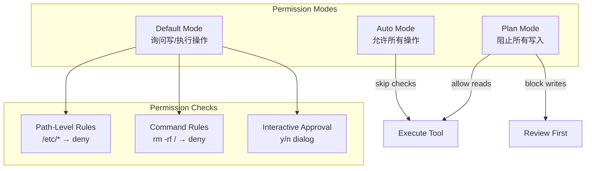
```mermaid
graph TB
    subgraph "Permission Modes"
        Default[Default Mode<br/>询问写/执行操作]
        Auto[Auto Mode<br/>允许所有操作]
        Plan[Plan Mode<br/>阻止所有写入]
    end
    
    subgraph "Permission Checks"
        PathRules[Path-Level Rules<br/>/etc/* → deny]
        CommandRules[Command Rules<br/>rm -rf / → deny]
        Interactive[Interactive Approval<br/>y/n dialog]
    end
    
    Default --> PathRules
    Default --> CommandRules
    Default --> Interactive
    
    Auto -->|skip checks| Execute[Execute Tool]
    
    Plan -->|block writes| Review[Review First]
    Plan -->|allow reads| Execute
```

#### 4.4.2 权限检查流程

```python
class PermissionChecker:
    def check_tool_permission(self, tool_name: str, args: dict) -> PermissionResult:
        # 1. Check mode
        if self.mode == "auto":
            return PermissionResult.ALLOWED
        
        if self.mode == "plan" and tool_name in WRITE_TOOLS:
            return PermissionResult.BLOCKED
        
        # 2. Check path rules
        if tool_name in FILE_TOOLS:
            path = args.get("path", "")
            if not self._matches_path_rules(path):
                return PermissionResult.DENIED_PATH
        
        # 3. Check command rules
        if tool_name == "bash":
            command = args.get("command", "")
            if self._is_denied_command(command):
                return PermissionResult.DENIED_COMMAND
        
        # 4. Interactive approval (default mode)
        if self.mode == "default" and tool_name in SENSITIVE_TOOLS:
            return PermissionResult.NEEDS_APPROVAL
        
        return PermissionResult.ALLOWED
    
    def _matches_path_rules(self, path: str) -> bool:
        for rule in self.path_rules:
            if fnmatch.fnmatch(path, rule.pattern):
                return rule.allow
        return True  # Default allow if no match
    
    def _is_denied_command(self, command: str) -> bool:
        for pattern in self.denied_commands:
            if re.search(pattern, command):
                return True
        return False
```

#### 4.4.3 敏感路径保护

```python
SENSITIVE_PATHS = [
    "/etc/*",
    "/usr/*",
    "/bin/*",
    "/sbin/*",
    "~/.ssh/*",
    "~/.gnupg/*",
]

DENIED_COMMANDS = [
    r"rm\s+-rf\s+/",
    r"DROP\s+TABLE\s+\*",
    r">/dev/sda",
    r":\(\)\{\s*:\|:\s*&\s*\};:",  # Fork bomb
]
```

---

### 4.5 Memory（记忆系统）

OpenHarness 采用**三层记忆架构**，类似于人类的记忆系统：短期记忆（会话）、中期记忆（项目）、长期记忆（用户/ohmo）。

#### 4.5.1 记忆层次结构

```
┌─────────────────────────────────────┐
│  User/ohmo Memory (长期记忆)         │  ← 最持久，跨项目、跨会话
│  ~/.ohmo/memory/                     │
│  - 个人偏好                          │
│  - 学到的技能                        │
│  - 历史经验                          │
└─────────────────────────────────────┘
           ↑ 积累和提炼
┌─────────────────────────────────────┐
│  Project Memory (中期记忆)           │  ← 项目级别，团队共享
│  ~/.openharness/data/memory/        │
│  {project-hash}/MEMORY.md           │
│  - 项目技术栈                        │
│  - 编码规范                          │
│  - 架构决策                          │
│  - 待办事项                          │
└─────────────────────────────────────┘
           ↑ 上下文注入
┌─────────────────────────────────────┐
│  Session Memory (短期记忆)           │  ← 当前对话，临时存储
│  内存中的完整对话历史                 │
│  - 用户消息                          │
│  - AI 回复                           │
│  - 工具调用和结果                    │
└─────────────────────────────────────┘
```

**三层记忆的详细对比**:

| 层次 | 存储位置 | 生命周期 | 存储内容 | 写入时机 | 读取时机 | 特点 |
|------|---------|---------|---------|---------|---------|------|
| **Session Memory**<br/>会话记忆 | 内存中<br/>（磁盘文件需手动触发） | 当前会话期间<br/>（磁盘文件可跨会话） | • 完整的对话历史<br/>• 用户消息<br/>• AI 回复<br/>• 工具调用和结果 | **内存**：每轮 `submit_message()` 后自动追加<br/>**磁盘**：手动执行 `/memory session update`<br/>（`atomic_write_text()` 写入 `.md` 文件） | **内存**：每次 LLM 调用时全量发送<br/>**磁盘**：会话恢复时通过 `get_session_memory_content()` 读回，注入为 user message | ✅ 实时性最强<br/>❌ 内存层容量有限（受 LLM 窗口限制）<br/>❌ 磁盘层需手动触发 |
| **Project Memory**<br/>项目记忆 | 项目数据目录<br/>`~/.openharness/data/memory/<br/>{project-hash}/`<br/>MEMORY.md + 主题文件 | 项目存在期间 | • 项目技术栈<br/>• 编码规范<br/>• 项目结构<br/>• 架构决策<br/>• 已解决的问题<br/>• 待办事项 | **手动**：`/memory add <title>` 命令<br/>**自动**：ohmo AutoDream 后台进程从 Rollout 提取<br/>**直接编辑**：用户手动编辑 MEMORY.md | **会话启动时**：`build_runtime_system_prompt()` 调用 `load_memory_prompt()` 加载目录索引 + MEMORY.md 截断<br/>**每次 LLM 调用**：`select_relevant_memories(prompt)` 做 Top-K 相关性过滤，注入匹配的主题文件全文 | ✅ 团队共享<br/>✅ 结构化（Markdown）<br/>✅ 相关性过滤（非全量注入）<br/>⚠️ 需手动或 AutoDream 维护 |
| **User/ohmo Memory**<br/>用户记忆 | ohmo 工作区<br/>`~/.ohmo/memory/` | 永久保存 | • 个人偏好（语言、风格）<br/>• 学到的技能<br/>• 历史经验<br/>• 成功/失败案例 | **手动**：ohmo 对话中显式说“记住...”<br/>**自动**：AutoDream 从 Rollout 提取（Phase 1/2）<br/>**直接编辑**：用户手动编辑 | **ohmo 会话启动时**：与 Project Memory 同样通过 `load_memory_prompt()` 加载<br/>**每次 LLM 调用**：参与相关性过滤，匹配时注入 | ✅ 最持久<br/>✅ 个性化<br/>✅ 自动积累（AutoDream）<br/>⚠️ 隐私敏感<br/>⚠️ 仅 ohmo 可用 |

**重要说明**：
- ❌ **OpenHarness 没有 Agent Memory 层**（不同于 deer-flow 的 SOUL.md）
- ⚙️ AgentDefinition 中的 `memory` 字段是**配置项**，决定 Agent 使用哪种记忆范围（"user"/"project"/"local"），而非独立的存储层
- 📝 deer-flow 等框架才有真正的 Agent 角色记忆（`agents/{name}/SOUL.md`）

#### 4.5.1.1 Session Snapshot（会话快照）—— 与 Session Memory 不同的机制

OpenHarness 中存在**两个独立的 Session 级持久化机制**，名字相近但功能完全不同：

```
~/.openharness/data/
├── sessions/           ← Session Snapshot（自动，JSON）
│   └── <project>-<hash>/
│       ├── latest.json         ← 最近一次快照（每轮覆盖）
│       └── session-<id>.json   ← 按 ID 归档的历史快照
│
└── session-memory/     ← Session Memory（手动，Markdown）
    └── <project>-<hash>/
        └── <session_id>.md
```

**两者对比**：

| | Session Snapshot | Session Memory |
|---|---|---|
| **源码** | `services/session_storage.py` | `services/session_memory/__init__.py` |
| **磁盘目录** | `~/.openharness/data/sessions/` | `~/.openharness/data/session-memory/` |
| **文件格式** | JSON（完整结构化） | Markdown（轻量摘要） |
| **写入触发** | **每轮自动**（`submit_message()` 完成后立即写盘） | 手动 `/memory session update` |
| **存储内容** | 完整消息历史 + `tool_metadata` 白名单（10个 key）+ usage | 压缩后的摘要文本（`# Session Memory`） |
| **恢复方式** | `oh --resume` / `oh --resume <id>` 全量恢复 | 注入为 user message（`session_memory_to_compact_text()`） |
| **用途** | 会话断点续传（精确还原完整状态） | 跨压缩边界保留状态线索（轻量辅助） |

**Session Snapshot 的自动保存时机**（`src/openharness/ui/runtime.py`）：

```python
# submit_message() 完成后 —— 每轮自动保存
bundle.session_backend.save_snapshot(
    cwd=bundle.cwd,
    model=settings.model,
    system_prompt=system_prompt,
    messages=bundle.engine.messages,          # ← 完整消息历史
    usage=bundle.engine.total_usage,
    session_id=bundle.session_id,
    tool_metadata=bundle.engine.tool_metadata, # ← tool_metadata（白名单字段）
)

# continue_pending() 完成后 —— 同样自动保存
# MaxTurnsExceeded 异常触发时 —— 中断也保存
```

**`tool_metadata` 持久化白名单**（`session_storage.py:18-29`）：

```python
_PERSISTED_TOOL_METADATA_KEYS = (
    "permission_mode",          # 权限模式
    "read_file_state",          # 已读文件记录
    "invoked_skills",           # 已调用技能
    "async_agent_state",        # 异步 Agent 状态
    "async_agent_tasks",        # 异步 Agent 任务列表
    "recent_work_log",          # 近期工作日志
    "recent_verified_work",     # 已验证的工作
    "task_focus_state",         # 任务焦点（目标、活动文件等）
    "compact_checkpoints",      # 压缩检查点
    "compact_last",             # 上次压缩记录
)
# 不在白名单内的临时 key（如 _suppress_next_user_goal）不会被持久化
```

**一句话类比**：
- **Session Snapshot** = 游戏的"存档"（完整状态，`oh --resume` 可以 Load 继续）
- **Session Memory** = 压缩层的"便签"（只记关键信息，帮助 LLM 理解上下文）

**记忆加载流程**:

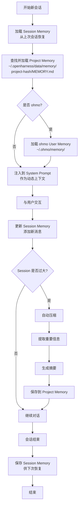
```mermaid
graph TB
    Start[开始新会话] --> LoadSession[加载 Session Memory<br/>从上次会话恢复]
    LoadSession --> LoadProject[查找并加载 Project Memory<br/>~/.openharness/data/memory/<br/>project-hash/MEMORY.md]
    LoadProject --> CheckOhmo{是否 ohmo?}
    
    CheckOhmo -- 是 --> LoadUser[加载 ohmo User Memory<br/>~/.ohmo/memory/]
    CheckOhmo -- 否 --> Inject[注入到 System Prompt<br/>作为动态上下文]
    
    LoadUser --> Inject
    Inject --> Interact[与用户交互]
    
    Interact --> UpdateSession[更新 Session Memory<br/>添加新消息]
    UpdateSession --> CheckSize{Session 是否过大?}
    
    CheckSize -- 是 --> Compact[自动压缩]
    CheckSize -- 否 --> Continue[继续对话]
    
    Compact --> ExtractImportant[提取重要信息]
    ExtractImportant --> Summarize[生成摘要]
    Summarize --> SaveToProject[保存到 Project Memory]
    SaveToProject --> Continue
    
    Continue --> EndSession[会话结束]
    EndSession --> SaveSession[保存 Session Memory<br/>供下次恢复]
    SaveSession --> Finish[结束]
```

**实际示例**:

```bash
# 第一次对话（建立记忆）
$ oh -p "我喜欢用 pytest 写测试"
AI: 好的，我记住了你喜欢 pytest。
# → 保存到 Project Memory

# 第二次对话（使用记忆）
$ oh -p "帮我写个测试"
AI: 好的，我会用 pytest 风格为你编写测试...
# ← AI 从 Project Memory 读取了你的偏好

# 在 ohmo 中使用个人记忆
$ ohmo -p "记住：我喜欢用中文回复"
AI: 已记录你的语言偏好。
# → 保存到 ~/.ohmo/memory/

# 下次 ohmo 对话时
$ ohmo -p "你好"
AI: 你好！有什么可以帮助你的？
# ← AI 从 ohmo User Memory 读取了你的中文偏好

# 在项目中使用
$ cd myproject
$ cat ~/.openharness/data/memory/myproject-*/MEMORY.md  # 项目特定的上下文
$ oh -p "添加单元测试"
AI: 根据项目规范，我会...
# ← AI 结合了 Project Memory

# 使用特定 Agent（注意：Agent Definition 不是 Memory）
$ oh --agent code-reviewer -p "审查这段代码"
AI: 作为代码审查专家，我会关注以下方面...
# ← AgentDefinition 提供了角色定义和工具限制，但不提供持久化记忆
```

```mermaid
graph TB
    subgraph "Memory Layers"
        Session[Session Memory<br/>当前会话历史]
        Project[Project Memory<br/>CLAUDE.md / MEMORY.md]
        User[User Memory<br/>~/.openharness/memory/]
    end
    
    subgraph "Memory Operations"
        Load[Load Memory]
        Compact[Auto-Compact]
        Save[Save Memory]
    end
    
    Session -->|on startup| Load
    Project -->|on startup| Load
    User -->|on startup| Load
    
    Load -->|inject into| Context[System Prompt]
    
    Session -->|when full| Compact
    Compact -->|preserve| Important[Important Context]
    Compact -->|summarize| Summary[Conversation Summary]
    
    Session -->|on exit| Save
    Summary -->|append to| User
```

---

#### 4.5.2 自动压缩机制

**为什么需要压缩？**

1. **Token 限制问题**:
   ```
   LLM 上下文窗口有限：
   - Claude 3.5: 200K tokens
   - GPT-4: 128K tokens
   - Kimi: 200K tokens
   
   长对话会超出限制：
   - 100 轮对话 ≈ 50K-100K tokens
   - 加上工具结果 ≈ 150K+ tokens
   - 接近或超过上限！
   ```

2. **成本问题**:
   ```
   Token 费用（以 Claude 为例）：
   - Input: $3 / 1M tokens
   - Output: $15 / 1M tokens
   
   未压缩的长对话：
   - 每次请求发送 150K tokens
   - 10 次请求 = 1.5M tokens = $4.5
   
   压缩后：
   - 每次请求发送 60K tokens
   - 10 次请求 = 600K tokens = $1.8
   
   节省 60% 成本！💰
   ```

3. **性能问题**:
   ```
   处理大量 Token 的影响：
   - API 响应变慢（处理更多数据）
   - 内存占用增加
   - 可能触发速率限制
   
   压缩后：
   - 更快的响应速度
   - 更低的内存使用
   - 减少速率限制风险
   ```

**如何压缩？智能摘要策略**

核心思想：**保留重要信息，压缩次要信息**

```python
class AutoCompactor:
    def __init__(self, max_tokens=100000, target_tokens=80000):
        self.max_tokens = max_tokens      # 触发压缩的阈值
        self.target_tokens = target_tokens  # 压缩后的目标大小
    
    async def maybe_compact(self, conversation: list[ConversationMessage]) -> list[ConversationMessage]:
        """检查并执行压缩"""
        current_tokens = count_tokens(conversation)
        
        # 如果未超过阈值，不压缩
        if current_tokens < self.max_tokens:
            return conversation
        
        print(f"🗜️ 触发压缩: {current_tokens} → {self.target_tokens} tokens")
        
        # 执行三步压缩策略
        return await self._smart_compact(conversation)
    
    async def _smart_compact(self, conversation):
        """
        智能压缩：保留重要信息 + 摘要 + 最近消息
        """
        
        # Step 1: 分离消息
        old_messages = conversation[:-10]  # 早期消息
        recent_messages = conversation[-10:]  # 最近 10 条（全部保留）
        
        # Step 2: 从早期消息中提取重要的
        important_from_old = self._extract_important_messages(old_messages)
        
        # Step 3: 将其余的旧消息生成摘要
        non_important_old = [
            msg for msg in old_messages 
            if msg not in important_from_old
        ]
        
        if non_important_old:
            summary = await self._generate_summary(non_important_old)
            summary_msg = ConversationMessage(
                role="assistant",
                content=[TextBlock(text=f"[历史摘要]\n{summary}")]
            )
        else:
            summary_msg = None
        
        # Step 4: 重建对话
        compacted = []
        
        # 添加摘要（如果有）
        if summary_msg:
            compacted.append(summary_msg)
        
        # 添加从早期提取的重要消息
        compacted.extend(important_from_old)
        
        # 添加最近的完整消息
        compacted.extend(recent_messages)
        
        # Step 5: 验证压缩效果
        original_tokens = count_tokens(conversation)
        compacted_tokens = count_tokens(compacted)
        
        print(f"✅ 压缩完成: {original_tokens} → {compacted_tokens} tokens")
        print(f"   节省: {(1 - compacted_tokens/original_tokens)*100:.1f}%")
        
        return compacted
    
    def _extract_important_messages(self, messages: list[ConversationMessage]) -> list[ConversationMessage]:
        """
        识别重要消息的策略：
        1. 包含关键指令的用户消息（"必须"、"重要"、"记住"）
        2. 包含错误的工具结果
        3. AI 的关键决策和结论
        4. 大量的工具输出（可能包含关键数据）
        """
        important = []
        
        for msg in messages:
            if self._is_important(msg):
                important.append(msg)
        
        return important
    
    def _is_important(self, msg: ConversationMessage) -> bool:
        """判断消息是否重要"""
        
        # 重要的用户指令
        if msg.role == "user":
            important_keywords = ["必须", "重要", "记住", "always", "never"]
            if any(kw in msg.content for kw in important_keywords):
                return True
        
        # 重要的工具结果
        if msg.contains_tool_result():
            result = msg.tool_result
            # 错误信息很重要
            if result.error:
                return True
            # 大量输出可能包含关键数据
            if len(result.output) > 1000:
                return True
        
        # AI 的关键决策
        if msg.role == "assistant":
            decision_keywords = ["决定", "建议", "结论", "decided", "conclusion"]
            if any(kw in msg.content for kw in decision_keywords):
                return True
        
        return False
    
    async def _generate_summary(self, old_messages: list[ConversationMessage]) -> str:
        """
        使用 LLM 将旧消息压缩成简洁的摘要
        """
        
        # 构建需要总结的消息
        messages_to_summarize = "\n".join([
            f"{msg.role}: {msg.content}" 
            for msg in old_messages
        ])
        
        # 调用 LLM 生成摘要
        summary_prompt = f"""
请将以下对话历史压缩成简洁的摘要，保留关键信息：

{messages_to_summarize}

要求：
1. 保留用户的重要指令和偏好
2. 保留关键的错误信息和解决方案
3. 保留重要的技术决策
4. 省略闲聊和重复内容
5. 控制在 500 tokens 以内

摘要：
"""
        
        summary = await self.llm.generate(summary_prompt)
        return summary.strip()
```

**压缩的实际效果示例**:

```python
# 压缩前的对话（简化版）
conversation = [
    # 早期的闲聊（不重要）
    {"role": "user", "content": "你好"},
    {"role": "assistant", "content": "你好！有什么可以帮助你的？"},
    {"role": "user", "content": "今天天气不错"},
    {"role": "assistant", "content": "是的，适合编程 😊"},
    
    # 重要的用户指令（保留）
    {"role": "user", "content": "重要：这个项目必须使用类型注解"},
    
    # 工具调用和结果（部分保留）
    {"role": "assistant", "content": "[ToolUse: read file.py]"},
    {"role": "user", "content": "[ToolResult: 错误信息...]"},  # 保留，因为有错误
    
    # ... 更多消息 ...
    
    # 最近的消息（全部保留）
    {"role": "user", "content": "帮我修复这个 bug"},
    {"role": "assistant", "content": "让我分析一下..."},
]

# 压缩后
compacted = [
    # 早期消息被替换为摘要
    {
        "role": "assistant", 
        "content": "[历史摘要]\n用户打了招呼，讨论了天气。强调项目必须使用类型注解。读取 file.py 时发现错误。"
    },
    
    # 重要的消息保留
    {"role": "user", "content": "重要：这个项目必须使用类型注解"},
    {"role": "user", "content": "[ToolResult: 错误信息...]"},
    
    # 最近的消息全部保留
    {"role": "user", "content": "帮我修复这个 bug"},
    {"role": "assistant", "content": "让我分析一下..."},
]

# 效果：120K tokens → 75K tokens（节省 37.5%）
```

**生成的摘要示例**:

```markdown
[对话摘要 - 2026-04-12 10:30-11:45]

用户任务：修复 authentication.py 中的 token 验证 bug

关键发现：
- Token 过期检查逻辑有误（第 42 行）
- 应该使用 datetime.utcnow() 而非 datetime.now()
- 时区问题导致提前 8 小时判定过期

已执行的修复：
- 修改了 _is_token_expired() 方法
- 添加了单元测试 test_token_timezone
- 所有测试通过

用户偏好记录：
- 喜欢在修复 bug 后立即写测试
- 重视时区处理的正确性

下一步：等待用户确认是否需要部署
```

**压缩的触发时机**:

```python
# 在每次添加新消息后检查
class QueryEngine:
    async def append_message(self, message):
        self.conversation.append(message)
        
        # 检查是否需要压缩
        if self.auto_compact.enabled:
            await self.compactor.maybe_compact(self.conversation)
```

触发条件：
1. **Token 数量超过阈值**: `current_tokens > max_tokens`（默认 100K）
2. **手动触发**: 用户执行 `/compact` 命令
3. **会话暂停**: 长时间无活动后自动压缩

**压缩配置选项**:

```yaml
# ~/.openharness/config.yaml
auto_compact:
  enabled: true          # 是否启用自动压缩
  max_tokens: 100000     # 触发压缩的阈值
  target_tokens: 80000   # 压缩后的目标大小
  keep_recent: 10        # 保留最近的消息数量
  summary_max_tokens: 5000  # 摘要的最大长度
  
  # 高级选项
  preserve_errors: true  # 总是保留错误信息
  preserve_decisions: true  # 保留重要决策
  compress_frequency: "on_threshold"  # 压缩频率
```

**压缩的优缺点**:

| 优点 | 注意事项 |
|------|----------|
| ✅ 降低成本（30-60%） | ⚠️ 摘要可能丢失细节 |
| ✅ 提升性能（更快响应） | ⚠️ 压缩需要时间（异步执行） |
| ✅ 延长会话（支持多天对话） | ⚠️ 可能误判重要性 |
| ✅ 智能保留（重要信息不丢失） | ⚠️ 首次压缩较慢 |

**完整压缩流程图**:

```mermaid
graph TB
    Start[开始对话] --> AddMsg[添加新消息]
    AddMsg --> CheckSize{Token 数量<br/>超过阈值?}
    
    CheckSize -- 否 --> Continue[继续对话]
    CheckSize -- 是 --> Compact[触发压缩]
    
    Compact --> Split[分离消息]
    Split --> Recent[保留最近 10 条<br/>保持上下文连贯]
    Split --> Important[提取重要消息<br/>关键指令/错误/决策]
    Split --> Old[其余旧消息]
    
    Old --> Summarize[LLM 生成摘要<br/>控制在 5K tokens]
    Summarize --> Rebuild[重建对话]
    
    Recent --> Rebuild
    Important --> Rebuild
    
    Rebuild --> Verify[验证压缩效果]
    Verify --> Save[保存压缩后的对话]
    Save --> Continue
    
    Continue --> End{会话结束?}
    End -- 否 --> AddMsg
    End -- 是 --> FinalCompact[最终压缩]
    FinalCompact --> ExtractMemory[提取用户记忆]
    ExtractMemory --> SaveUser[保存到 User Memory]
    SaveUser --> Finish[结束]
```

---

### 4.6 Skills & Plugins（技能与插件）

#### 4.6.1 Skills 系统

**Skill 文件格式** (`~/.openharness/skills/commit.md`):

```markdown
---
name: commit
description: Create clean, well-structured git commits
---

# Commit Skill

## When to use
Use when the user asks you to commit changes to git.

## Workflow
1. Run `git status` to see changed files
2. Run `git diff` to review changes
3. Craft a concise commit message following conventional commits
4. Run `git add -A && git commit -m "<message>"`
5. Report the commit hash

## Best Practices
- Use imperative mood: "Add feature" not "Added feature"
- Keep first line under 50 characters
- Add detailed body if needed
```

**加载机制**:

```python
class SkillsLoader:
    def load_skills(self, skill_dirs: list[Path]) -> dict[str, Skill]:
        skills = {}
        for dir in skill_dirs:
            for skill_file in dir.glob("*.md"):
                skill = self._parse_skill(skill_file)
                skills[skill.name] = skill
        return skills
    
    def _parse_skill(self, file: Path) -> Skill:
        content = file.read_text()
        
        # Parse frontmatter
        frontmatter, body = content.split("---", 2)[1:]
        metadata = yaml.safe_load(frontmatter)
        
        return Skill(
            name=metadata["name"],
            description=metadata["description"],
            content=body.strip(),
            source=str(file),
        )
```

#### 4.6.1.1 Skills FAQ（常见问题）

##### Q1: Skill 文件存储在哪里？如何加载？

**A**: Skill 文件存储在三个位置，按优先级加载：

```python
# src/openharness/skills/loader.py:27-51
def load_skill_registry(cwd, extra_skill_dirs=None, extra_plugin_roots=None):
    registry = SkillRegistry()
    
    # 1. Bundled skills (内置技能)
    for skill in get_bundled_skills():
        registry.register(skill)
    
    # 2. User skills (用户自定义技能)
    for skill in load_user_skills():  # ~/.openharness/skills/
        registry.register(skill)
    
    # 3. Extra skill directories (额外指定目录)
    for skill in load_skills_from_dirs(extra_skill_dirs):
        registry.register(skill)
    
    # 4. Plugin skills (插件技能)
    if cwd is not None:
        for plugin in load_plugins(settings, cwd, extra_roots=extra_plugin_roots):
            if not plugin.enabled:
                continue
            for skill in plugin.skills:
                registry.register(skill)
    
    return registry
```

**存储路径示例**：
```
~/.openharness/skills/              ← 用户级 skills
├── commit/SKILL.md
├── debug-auth/SKILL.md
└── pdf-processing/
    ├── SKILL.md
    ├── references/FORMS.md         ← 引用文件
    └── scripts/validate.py

.project/.openharness/skills/       ← 项目级 skills
└── project-specific/SKILL.md

~/.openharness/plugins/my-plugin/skills/  ← 插件 skills
└── my-skill/SKILL.md
```

---

##### Q2: `skill` 工具返回什么内容？

**A**: `skill` 工具只返回 **SKILL.md 的文本内容**，不包含文件路径或其他元数据。

**代码实现**：
```python
# src/openharness/tools/skill_tool.py:28-37
async def execute(self, arguments: SkillToolInput, context: ToolExecutionContext) -> ToolResult:
    registry = load_skill_registry(context.cwd, ...)
    skill = registry.get(arguments.name)
    if skill is None:
        return ToolResult(output=f"Skill not found: {arguments.name}", is_error=True)
    return ToolResult(output=skill.content)  # ← 只返回 SKILL.md 内容
```

**返回示例**：
```markdown
# Commit Skill

## When to use
Use when the user asks you to commit changes to git.

## Workflow
1. Run `git status` to see changed files
2. Run `git diff` to review changes
...
```

**关键点**：
- ✅ 返回完整的 SKILL.md Markdown 文本
- ❌ 不返回文件路径（`skill.path`）
- ❌ 不自动加载引用的资源文件
- ❌ 不返回子目录内容（`references/`, `scripts/` 等）

---

##### Q3: 如果 Skill 引用了其他脚本或文件，AI 如何读取？

**A**: AI 需要使用 **`read_file` 工具**手动读取引用文件，但前提是 AI 需要知道完整路径。

**两种方式确定路径**：

###### 方式 A：从 SKILL.md 内容中推断（当前方式）

Skill 作者需要在 SKILL.md 中**明确写出资源文件的相对路径**：

```markdown
# pdf-processing

Extract text and tables from PDF files.

## Resources
This skill includes the following resources:
- **Form filling guide**: `references/FORMS.md`
- **API reference**: `references/API.md`
- **Validation script**: `scripts/validate.py`

## Usage
1. Read the form filling guide:
   ```
   Use read_file with path: skills/pdf-processing/references/FORMS.md
   ```

2. Run validation:
   ```bash
   python skills/pdf-processing/scripts/validate.py --input output.txt
   ```
```

**AI 的推理过程**：
```python
# AI 从 SKILL.md 中提取信息
skill_name = "pdf-processing"
relative_path = "references/FORMS.md"  # 从 SKILL.md 读取

# AI 推断路径（可能不准确！）
full_path = f"skills/{skill_name}/{relative_path}"
# → "skills/pdf-processing/references/FORMS.md"

# 调用 read_file 工具
{
  "tool": "read_file",
  "arguments": {"path": full_path}
}
```

**问题**：AI 不知道 skill 的实际存储位置（bundled/user/plugin），可能猜错路径！

---

###### 方式 B：改进方案 - 在 `skill` 工具返回中添加路径提示

修改 `skill` 工具，在返回内容时添加路径元数据：

```python
# src/openharness/tools/skill_tool.py (改进版)
async def execute(self, arguments: SkillToolInput, context: ToolExecutionContext) -> ToolResult:
    registry = load_skill_registry(context.cwd, ...)
    skill = registry.get(arguments.name)
    if skill is None:
        return ToolResult(output=f"Skill not found: {arguments.name}", is_error=True)
    
    # ✅ 改进：在内容开头添加路径提示
    from pathlib import Path
    skill_dir = Path(skill.path).parent if skill.path else f"skills/{skill.name}"
    
    header = f"""# Skill: {skill.name}
# Location: {skill_dir}
# 
# Available resources in this directory:
# - scripts/     (executable scripts)
# - references/  (documentation)
# - assets/      (templates)
#
# To read additional resources, use read_file with paths like:
# - {skill_dir}/references/FORMS.md
# - {skill_dir}/scripts/validate.py

---

"""
    
    return ToolResult(output=header + skill.content)
```

**改进后的返回内容**：
```markdown
# Skill: pdf-processing
# Location: /home/user/.openharness/skills/pdf-processing
# 
# Available resources in this directory:
# - scripts/     (executable scripts)
# - references/  (documentation)
# - assets/      (templates)
#
# To read additional resources, use read_file with paths like:
# - /home/user/.openharness/skills/pdf-processing/references/FORMS.md
# - /home/user/.openharness/skills/pdf-processing/scripts/validate.py

---

# pdf-processing

Extract text and tables from PDF files.
...
```

**优势**：
- ✅ AI 可以准确知道资源文件的完整路径
- ✅ 不需要猜测 skill 的存储位置
- ✅ 减少路径错误导致的工具调用失败

---

##### Q4: Skills 是如何注入到 Prompt 中的？

**A**: Skills 采用**两阶段加载**策略，节省 Token。

**阶段 1：启动时注入元数据（全量）**

```python
# src/openharness/prompts/context.py:18-45
def _build_skills_section(cwd, extra_skill_dirs=None, ...) -> str | None:
    registry = load_skill_registry(cwd, extra_skill_dirs=extra_skill_dirs, ...)
    skills = registry.list_skills()
    if not skills:
        return None
    
    lines = [
        "# Available Skills",
        "",
        "The following skills are available via the `skill` tool. "
        "When a user's request matches a skill, invoke it with `skill(name=\"<skill_name>\")` "
        "to load detailed instructions before proceeding.",
        "",
    ]
    for skill in skills:
        lines.append(f"- **{skill.name}**: {skill.description}")
    return "\n".join(lines)
```

**注入到 System Prompt**：
```markdown
# Available Skills

The following skills are available via the `skill` tool.
When a user's request matches a skill, invoke it with `skill(name="commit")`
to load detailed instructions before proceeding.

- **commit**: Create clean, well-structured git commits
- **debug-auth**: Systematic approach to debugging authentication issues
- **pdf-processing**: Extract text and tables from PDF files
```

**Token 消耗**：~200-500 tokens（取决于 skill 数量）

---

**阶段 2：运行时按需加载完整内容（懒加载）**

当 AI 决定使用某个 skill 时：

```python
# AI 调用 skill 工具
{
  "tool": "skill",
  "arguments": {"name": "commit"}
}

# skill 工具返回完整内容
ToolResult(output="# Commit Skill\n\n## When to use\n...")

# 该内容作为 user message 注入对话历史
messages.append({
  "role": "user",
  "content": [{"type": "text", "text": "# Skill: commit\n\n# Commit Skill\n..."}]
})
```

**优势**：
- ✅ **节省 Token**：不需要一次性加载所有 skills 的完整内容
- ✅ **灵活性**：AI 可以根据任务需求选择合适的 skill
- ✅ **可扩展性**：可以轻松添加新的 skills 而不影响性能

---

##### Q5: Skills 与 Plugins 的关系是什么？

**A**: Plugins 是**打包机制**，Skills 是**内容类型**。一个 plugin 可以包含多个 skills。

**关系图**：
```
Plugin (插件包)
├─ plugin.json           ← 清单文件
├─ skills/               ← Skills 目录
│  ├─ skill-a/SKILL.md
│  └─ skill-b/SKILL.md
├─ commands/             ← Commands 目录
├─ agents/               ← Agents 目录
├─ hooks.json            ← Hooks 配置
└─ mcp.json              ← MCP 配置

加载流程：
1. 扫描 plugins/ 目录
2. 读取每个 plugin 的 plugin.json
3. 提取 plugin.skills_dir 下的所有 SKILL.md
4. 注册到 SkillRegistry
5. 注入到 System Prompt 的 "Available Skills" 部分
```

**示例**：
```json
// ~/.openharness/plugins/last30days/plugin.json
{
  "name": "last30days",
  "version": "2.9.6",
  "description": "Research any topic from the last 30 days",
  "skills_dir": "skills",
  "skills": ["./"]
}
```

```bash
# 目录结构
~/.openharness/plugins/last30days/
├── plugin.json
└── skills/
    └── research/SKILL.md  ← 这个 skill 会被加载
```

**加载后**：
```python
# SkillRegistry 中包含
registry.get("research")  # → SkillDefinition from last30days plugin
```

---

##### Q6: 如何创建自定义 Skill？

**A**: 有两种方式：

###### 方式 A：直接创建用户级 Skill

```bash
# 1. 创建 skill 目录
mkdir -p ~/.openharness/skills/my-skill

# 2. 创建 SKILL.md 文件
cat > ~/.openharness/skills/my-skill/SKILL.md << 'EOF'
---
name: my-skill
description: My custom skill description
---

# My Skill

## When to use
Describe when this skill should be used.

## Workflow
1. Step 1
2. Step 2
3. Step 3

## Best Practices
- Tip 1
- Tip 2
EOF
```

###### 方式 B：通过 Plugin 打包

```bash
# 1. 创建 plugin 目录
mkdir -p ~/.openharness/plugins/my-plugin/skills/my-skill

# 2. 创建 plugin.json
cat > ~/.openharness/plugins/my-plugin/plugin.json << 'EOF'
{
  "name": "my-plugin",
  "version": "1.0.0",
  "description": "My custom plugin",
  "enabled_by_default": true,
  "skills_dir": "skills"
}
EOF

# 3. 创建 SKILL.md
cat > ~/.openharness/plugins/my-plugin/skills/my-skill/SKILL.md << 'EOF'
---
name: my-skill
description: My custom skill from plugin
---

# My Skill
...
EOF
```

**验证**：
```bash
# 重启 OpenHarness 后，skill 会自动加载
# 在 TUI 中输入
/skills list

# 应该看到
- my-skill: My custom skill description
```

---

##### Q7: Skills 的文件路径是如何确定的？

**A**: 路径由加载源决定：

| Skill 来源 | 路径计算公式 | 示例 |
|-----------|------------|------|
| **Bundled** | `{package_dir}/bundled_skills/{name}/SKILL.md` | `/usr/lib/python3.11/site-packages/openharness/bundled_skills/commit/SKILL.md` |
| **User** | `~/.openharness/skills/{name}/SKILL.md` | `/home/user/.openharness/skills/commit/SKILL.md` |
| **Project** | `.project/.openharness/skills/{name}/SKILL.md` | `/project/.openharness/skills/project-specific/SKILL.md` |
| **Plugin** | `{plugin_dir}/{skills_dir}/{name}/SKILL.md` | `/home/user/.openharness/plugins/my-plugin/skills/my-skill/SKILL.md` |

**SkillDefinition 结构**：
```python
# src/openharness/skills/types.py
@dataclass(frozen=True)
class SkillDefinition:
    name: str              # Skill 名称
    description: str       # Skill 描述
    content: str           # SKILL.md 完整内容
    source: str            # "bundled" | "user" | "plugin"
    path: str | None = None  # SKILL.md 的绝对路径 ⚠️
```

**注意**：虽然 `SkillDefinition.path` 存在，但 `skill` 工具**没有返回这个路径**给 AI！这是当前的局限性。

---

##### Q8: 与其他框架的 Skills 机制对比

| 框架 | Skill 加载方式 | 特点 |
|------|--------------|------|
| **OpenHarness** | `skill` 工具一次返回整份 `SKILL.md` | 简单直接，适合中小 skill |
| **deepagents** | SkillsMiddleware 只注入元数据，模型需 `read_file` 拉正文 | 渐进披露，控 token，适合大型 skill 包 |
| **hermes-agent** | `skills` 列表 + `skill_view(name)` 返回 JSON 含 `content` | 结构化返回，可包含 metadata |
| **deer-flow** | 技能说明写进 lead 的 prompt 块，细节靠文件/搜索工具 | 偏说明 + 工具拉全文 |
| **OpenHands** | Microagent 匹配后整段注入记忆管道 | 无子资源概念，匹配即注入 |

**设计取舍**：
- OpenHarness/hermes：**直达全文**省一轮，适合中小 SKILL
- deepagents：**路径 + `read_file`** 控 token，适合大型 skill 包与多文件 reference

---

#### 4.6.2 Plugins（插件系统）

Plugins 是 OpenHarness 的**模块化扩展机制**，允许以“打包”方式向系统注入以下 5 类资源：

| 资源类型 | 作用 | 示例 |
|---------|------|------|
| **Skills** | Agent 可学习的技能指令 | `last30days` 研究技能 |
| **Commands** | 用户可调用的 `/` 命令 | `/security-audit` 安全审计 |
| **Agents** | 预定义的 Agent 角色定义 | `plugin:researcher` 研究员 |
| **Hooks** | 事件钩子（拦截器） | `PreToolUse` 权限检查 |
| **MCP Servers** | Model Context Protocol 服务 | GitHub/文件系统工具集成 |

**核心价值**：
- ✅ **模块化**：一个插件 = 一个功能包，可以独立安装/卸载
- ✅ **可复用**：插件可以在不同项目间共享
- ✅ **生态化**：社区可以发布插件（类似 npm/pip）

---

##### 插件目录结构

```
~/.openharness/plugins/          ← 用户级插件（全局可用）
└── my-plugin/
    ├── plugin.json              ← 必需：插件清单
    ├── skills/                  ← 可选：技能目录
    │   └── my-skill/
    │       └── SKILL.md
    ├── commands/                ← 可选：命令目录
    │   └── my-command.md
    ├── agents/                  ← 可选：Agent 定义
    │   └── researcher.md
    ├── hooks.json               ← 可选：钩子配置
    └── mcp.json                 ← 可选：MCP 服务器配置

.project/.openharness/plugins/   ← 项目级插件（仅当前项目）
└── ...
```

**加载优先级**：
1. 用户级插件：`~/.openharness/plugins/`
2. 项目级插件：`.project/.openharness/plugins/`
3. 额外指定路径：通过 `--plugin-dir` 参数

---

##### plugin.json 清单文件

```json
{
  "name": "last30days",
  "version": "2.9.6",
  "description": "Research any topic from the last 30 days",
  "author": {
    "name": "Matt Van Horn",
    "email": "mvanhorn@gmail.com"
  },
  "enabled_by_default": true,
  "skills_dir": "skills",
  "hooks_file": "hooks.json",
  "mcp_file": "mcp.json",
  "skills": ["./"],
  "commands": {
    "research": {
      "source": "commands/research.md",
      "description": "Run a research task"
    }
  },
  "agents": ["agents/researcher.md"]
}
```

**字段说明**：

| 字段 | 类型 | 必需 | 说明 |
|------|------|------|------|
| `name` | string | ✅ | 插件唯一标识（字母数字+连字符） |
| `version` | string | ❌ | 版本号（默认 "0.0.0"） |
| `description` | string | ❌ | 插件描述 |
| `enabled_by_default` | bool | ❌ | 是否默认启用（默认 true） |
| `skills_dir` | string | ❌ | Skills 目录路径（默认 "skills"） |
| `hooks_file` | string | ❌ | Hooks 配置文件（默认 "hooks.json"） |
| `mcp_file` | string | ❌ | MCP 配置文件（默认 "mcp.json"） |
| `skills` | list/string | ❌ | 额外 Skills 路径 |
| `commands` | dict/list/string | ❌ | 命令定义 |
| `agents` | list/string | ❌ | Agent 定义路径 |

---

##### 插件如何影响系统？

**① 加载时机**：

```python
# src/openharness/ui/runtime.py:196-200
async def build_runtime(...):
    settings = load_settings().merge_cli_overrides(**settings_overrides)
    cwd = str(Path(cwd).expanduser().resolve()) if cwd else str(Path.cwd())
    
    # ← 在这里扫描并加载所有插件
    plugins = load_plugins(settings, cwd, extra_roots=normalized_plugin_roots)
    
    # 插件贡献的资源会被合并到系统中
    skills = [skill for plugin in plugins for skill in plugin.skills]
    commands = [cmd for plugin in plugins for cmd in plugin.commands]
    agents = [agent for plugin in plugins for agent in plugin.agents]
    hooks = {event: [...] for plugin in plugins for event, ...}
    mcp_servers = {... for plugin in plugins for ...}
```

**② 影响路径图**：

```
用户启动 OpenHarness
    ↓
load_plugins() 扫描插件目录
    ├─ ~/.openharness/plugins/           (用户级插件)
    └─ .project/.openharness/plugins/    (项目级插件)
    ↓
发现 plugin.json 清单文件
    ↓
加载插件贡献的 5 类资源
    ├─ Skills → SkillRegistry
    ├─ Commands → CommandRegistry
    ├─ Agents → AgentDefinition list
    ├─ Hooks → HookRegistry
    └─ MCP Servers → McpClientManager
    ↓
Agent 执行时可以使用这些资源
```

**③ 具体影响点**：

**Skills 注入到 Prompt**：
```python
# src/openharness/prompts/context.py
skills_section = get_skills_prompt_section(available_skills)
# Skills 内容会被插入到 System Prompt 中，Agent 可以看到
```

**Commands 注册到命令系统**：
```python
# src/openharness/commands/registry.py
for command in plugin.commands:
    registry.register(SlashCommand(command.name, ...))
# 用户可以通过 /plugin:command 调用
```

**Hooks 注册到事件总线**：
```python
# src/openharness/hooks/loader.py:53
for raw_event, hooks in plugin.hooks.items():
    registry.register_hook(event_name, hook_definition)
# 例如：PreToolUse 钩子会在工具执行前触发
```

**MCP Servers 连接到工具注册表**：
```python
# src/openharness/mcp/config.py
for plugin in plugins:
    mcp_configs.update(plugin.mcp_servers)
# MCP 工具会自动注册为 Agent 可调用的工具
```

---

##### agents/*.md 的作用（重要澄清）

**❌ agents/*.md 不是 Agent Memory（角色记忆）**

这是一个常见的误解。让我们明确区分：

| 概念 | 位置 | 作用 | 示例 |
|------|------|------|------|
| **Agent Definition**<br/>（Agent 定义） | `plugins/*/agents/*.md`<br/>或<br/>`~/.openharness/agents/*.md` | 定义 Agent 的**静态配置**：<br/>• 角色名称和描述<br/>• 可用的工具列表<br/>• 模型和 effort 设置<br/>• 权限模式<br/>• 初始 prompt | ```markdown<br/>---<br/>name: Reviewer<br/>description: Code review specialist<br/>model: claude-opus-4-6<br/>tools: ["read", "grep"]<br/>---<br/><br/>You are a code review expert...<br/>``` |
| **Agent Memory**<br/>（Agent 记忆） | deer-flow 特有：<br/>`agents/{name}/SOUL.md` | 存储 Agent 的**动态知识**：<br/>• 人格定义<br/>• 价值观<br/>• 行为边界<br/>• 学习到的经验 | ```markdown<br/>你是一个严谨的学术研究员，<br/>注重引用权威文献，<br/>偏好 arXiv 论文胜过博客...<br/>``` |

**OpenHarness 的 agents/*.md 是 Agent Definition，不是 Memory！**

它的作用是：**定义可被 spawn 的子 Agent 模板**。当主 Agent 需要并行执行任务时，可以通过 `agent()` 工具 spawn 这些预定义的子 Agent。

**使用示例**：

```python
# 主 Agent 代码（coordinator_mode.py）
_AGENT_TOOL_NAME = "agent"

# 在 System Prompt 中指导主 Agent：
"""
When calling agent(), use subagent_type to select a predefined agent template:

Examples:
  agent({ description: "Investigate auth bug", subagent_type: "worker", prompt: "..." })
  agent({ description: "Review code", subagent_type: "plugin:review:reviewer", prompt: "..." })
"""

# 实际调用
result = await agent_tool.execute(
    description="Review this PR",
    subagent_type="plugin:review:reviewer",  # ← 使用插件定义的 Agent
    prompt="Review the changes in src/auth/..."
)
```

**命名规则**（`loader.py:474`）：

```python
def _load_single_agent_file(...) -> AgentDefinition:
    # 生成命名空间名称
    base_agent_name = frontmatter.get("name") or file_path.stem
    agent_name = ":".join([plugin_name, *namespace, base_agent_name])
    
    # 示例：
    # my-plugin/agents/reviewer.md → "my-plugin:reviewer"
    # my-plugin/agents/team/planner.md → "my-plugin:team:planner"
```

**完整工作流程**：

```mermaid
graph TB
    Start[主 Agent 接收任务] --> Decide{需要并行?}
    
    Decide -- 是 --> SelectAgent[选择 Agent 模板]
    SelectAgent --> CheckType{subagent_type?}
    
    CheckType -- worker --> UseWorker[使用内置 worker]
    CheckType -- plugin:name --> LoadPlugin[加载插件 Agent]
    
    LoadPlugin --> FindDef[查找 plugin:name 定义]
    FindDef --> GetConfig[获取配置:<br/>tools, model, permissions]
    
    UseWorker --> Spawn[Spawn 子 Agent 进程]
    GetConfig --> Spawn
    
    Spawn --> Execute[执行任务]
    Execute --> ReturnResult[返回结果给主 Agent]
    
    Decide -- 否 --> DirectHandle[主 Agent 直接处理]
```

**实际案例**：

```python
# 测试用例中的示例（test_loader.py）
plugin_dir / "agents" / "review" / "reviewer.md"

# reviewer.md 内容：
"""
---
description: Review code changes
---

# Reviewer

Review the proposed changes.
"""

# 加载后的 AgentDefinition：
AgentDefinition(
    name="example:review:reviewer",  # ← 命名空间名称
    description="Review code changes",
    system_prompt="Review the proposed changes.",
    source="plugin",
    ...
)

# 使用时：
agent({
    subagent_type: "example:review:reviewer",
    prompt: "Review the changes in PR #123"
})
```

---

##### 安装和管理插件

**方法 1：手动复制**
```bash
# 克隆插件仓库
git clone https://github.com/mvanhorn/last30days-skill.git

# 复制到用户插件目录
cp -r last30days-skill ~/.openharness/plugins/last30days
```

**方法 2：使用 API**
```python
from openharness.plugins.installer import install_plugin_from_path

# 从本地路径安装
installed_path = install_plugin_from_path(Path("/path/to/plugin"))
print(f"Plugin installed at: {installed_path}")
```

**方法 3：项目级安装**
```bash
# 在项目目录下创建 .openharness/plugins/
mkdir -p myproject/.openharness/plugins
cp -r my-plugin myproject/.openharness/plugins/
```

**查看已加载的插件**：
```bash
# 在 OpenHarness CLI 中
/plugins

# 输出示例：
# Plugins:
# - last30days [enabled] Research any topic from the last 30 days
# - security-guidance [disabled] Security best practices
```

**启用/禁用插件**：
```json
// ~/.openharness/settings.json
{
  "enabled_plugins": {
    "last30days": true,
    "security-guidance": false
  }
}
```

**卸载插件**：
```python
from openharness.plugins.installer import uninstall_plugin

success = uninstall_plugin("last30days")
if success:
    print("Plugin uninstalled successfully")
```

---

##### 实际案例：last30days 插件

这是一个完整的真实插件，展示了所有功能：

**目录结构**：
```
last30days-skill/
├── .claude-plugin/
│   └── plugin.json              ← 插件清单
├── SKILL.md                     ← 主技能文件（882 行）
├── skills/
│   └── last30days/
│       └── SKILL.md             ← 嵌套技能
├── agents/
│   └── researcher.md            ← Agent 定义
├── hooks/
│   └── hooks.json               ← 钩子配置
└── scripts/
    └── last30days.py            ← Python 脚本
```

**plugin.json**：
```json
{
  "name": "last30days",
  "version": "2.9.6",
  "description": "Research any topic from the last 30 days across Reddit, X, YouTube...",
  "author": {
    "name": "Matt Van Horn",
    "email": "mvanhorn@gmail.com",
    "url": "https://github.com/mvanhorn"
  },
  "homepage": "https://github.com/mvanhorn/last30days-skill",
  "repository": "https://github.com/mvanhorn/last30days-skill",
  "license": "MIT",
  "keywords": ["research", "reddit", "twitter", "youtube", "tiktok", ...],
  "skills": ["./"],
  "hooks": {}
}
```

**这个插件展示了**：
- ✅ 复杂的技能指令（882 行 Markdown）
- ✅ 环境变量依赖声明
- ✅ 交互式向导（AskUserQuestion）
- ✅ 多源数据聚合（Reddit, X, YouTube, TikTok...）
- ✅ 自动配置检测

---

##### 插件与记忆系统的关系

**关键区别**：

| 维度 | Plugins | Memory |
|------|---------|--------|
| **性质** | 静态能力（代码/配置） | 动态知识（学习到的信息） |
| **来源** | 开发者编写/社区发布 | Agent 运行时积累 |
| **更新频率** | 手动更新 | 自动更新 |
| **存储格式** | Markdown/JSON/YAML | JSON/SQLite/LanceDB |
| **作用** | 提供工具和角色模板 | 提供上下文和历史经验 |

**协同工作**：
```
Plugins 提供能力框架
    ↓
Agent 使用这些能力执行任务
    ↓
执行过程中积累经验（Memory）
    ↓
Memory 反馈优化 Plugin 使用策略
```

**示例场景**：
```bash
# 1. 安装 last30days 插件（提供研究能力）
$ oh plugins install last30days

# 2. 使用插件进行研究
$ oh -p "/last30days AI trends"
AI: 正在研究最近 30 天的 AI 趋势...

# 3. 研究过程中积累记忆
# → User Memory: "用户对 AI 趋势感兴趣"
# → Project Memory: "项目关注 AI 领域"

# 4. 下次对话时，Memory 辅助 Plugin 使用
$ oh -p "继续研究 AI 趋势"
AI: 基于你之前对 AI 趋势的兴趣，我会重点关注...
# ← Memory 提供了个性化上下文
```

---

## 5. 数据流与执行流程

### 5.1 完整执行流程图

本节提供 OpenHarness 从启动到执行的**完整代码级流程图**，帮助您理解整个系统的运行机制。

#### 5.1.1 CLI 入口与初始化流程

```mermaid
graph TB
    Start(["用户执行 oh 命令"]) --> CLIMain["cli.py:main<br/>Typer 主入口"]
    
    CLIMain --> CheckSubcommand{"是否有子命令?"}
    
    CheckSubcommand -- "是" --> Subcommands["子命令处理"]
    Subcommands --> MCP["mcp list/add/remove"]
    Subcommands --> Plugin["plugin list/install/uninstall"]
    Subcommands --> Auth["auth login/status/logout"]
    Subcommands --> Provider["provider list/use/add/edit"]
    Subcommands --> Cron["cron start/stop/status/list"]
    
    CheckSubcommand -- "否" --> CheckMode{"运行模式判断"}
    
    CheckMode -- "--continue/-r" --> ResumeSession["恢复会话<br/>load_session_snapshot"]
    CheckMode -- "-p/--print" --> PrintMode["run_print_mode<br/>非交互模式"]
    CheckMode -- "--task-worker" --> TaskWorker["run_task_worker<br/>后台任务工作器"]
    CheckMode -- "默认" --> InteractiveMode["run_repl<br/>交互式会话"]
    
    ResumeSession --> BuildRuntime
    PrintMode --> BuildRuntime
    TaskWorker --> BuildRuntime
    InteractiveMode --> LaunchReactTUI["launch_react_tui<br/>启动 React TUI"]
    
    LaunchReactTUI --> BackendHost["run_backend_host<br/>后端服务主机"]
    BackendHost --> BuildRuntime
    
    BuildRuntime["build_runtime<br/>构建运行时环境"]
    
    BuildRuntime --> LoadSettings["加载配置<br/>load_settings"]
    LoadSettings --> ResolveProvider["解析 Provider<br/>AuthManager.get_active_profile"]
    ResolveProvider --> CreateAPIClient["创建 API Client<br/>AnthropicClient/OpenAIClient"]
    CreateAPIClient --> LoadTools["加载工具注册表<br/>ToolRegistry"]
    LoadTools --> LoadSkills["加载 Skills<br/>SkillsLoader"]
    LoadSkills --> LoadPlugins["加载 Plugins<br/>PluginManager"]
    LoadPlugins --> LoadMCP["加载 MCP Servers<br/>MCPClientManager"]
    LoadMCP --> LoadHooks["加载 Hooks<br/>HookExecutor"]
    LoadHooks --> CreateQueryEngine["创建 QueryEngine<br/>query_engine.py"]
    CreateQueryEngine --> RuntimeReady["运行时就绪"]
```

**关键代码位置**:
- **CLI 入口**: `src/openharness/cli.py:1096` (main 函数)
- **Print 模式**: `src/openharness/ui/app.py:169` (run_print_mode)
- **REPL 模式**: `src/openharness/ui/app.py:37` (run_repl)
- **Task Worker**: `src/openharness/ui/app.py:86` (run_task_worker)
- **Runtime 构建**: `src/openharness/ui/runtime.py:219` (build_runtime)

**OpenHarness 的多个入口点**:

OpenHarness 采用**分层入口设计**,支持不同粒度的调用:

| 入口点 | 文件位置 | 层级 | 适用场景 |
|--------|---------|------|----------|
| **CLI Typer App** | `cli.py:app` (line 22) | 最顶层 | 用户命令行调用 |
| **Main Callback** | `cli.py:main()` (line 1096) | CLI 层 | 参数解析和路由 |
| **Runtime Builder** | `ui/runtime.py:build_runtime()` | 装配层 | 组件初始化和依赖注入 |
| **UI Modes** | `ui/app.py:run_*_mode()` | UI 层 | 不同交互模式 |
| **QueryEngine** | `engine/query_engine.py:QueryEngine` | 引擎层 | 核心 Agent Loop |
| **Run Query** | `engine/query.py:run_query()` | 循环层 | 实际的多轮对话逻辑 |

**典型调用链**:
```bash
# 1. 用户执行命令
$ oh -p "Create a README"

# 2. Typer 解析参数并调用 main()
cli.py:main(print_mode="Create a README")

# 3. 根据模式选择执行路径
if print_mode:
    run_print_mode(prompt="Create a README")

# 4. 构建运行时环境
bundle = await build_runtime(...)

# 5. 启动运行时
await start_runtime(bundle)

# 6. 执行 prompt
async for event in bundle.engine.submit_message(prompt):
    render_event(event)

# 7. QueryEngine 内部调用 run_query()
async for event, usage in run_query(context, messages):
    yield event
```

#### 5.1.2 Agent Loop 核心执行流程

这是 OpenHarness 的**心脏**，展示了从用户输入到工具执行的完整循环。

```mermaid
sequenceDiagram
    participant U as User
    participant UI as UI Layer<br/>(React TUI / CLI)
    participant QE as QueryEngine<br/>(query_engine.py)
    participant API as API Client<br/>(Anthropic/OpenAI)
    participant TR as Tool Registry<br/>(43+ Tools)
    participant PC as Permission Checker
    participant HE as Hook Executor
    participant M as Memory System
    
    Note over U,M: === 阶段 1: 用户提交 Prompt ===
    U->>UI: 输入 prompt
    UI->>QE: submit_message(prompt)
    QE->>M: load_context()<br/>加载历史对话
    M->>QE: conversation_history + tool_metadata
    QE->>QE: append user message<br/>更新 messages 列表
    
    Note over U,M: === 阶段 2: Agent Loop 开始 ===
    loop 直到无工具调用或达到 max_turns
        QE->>API: stream_message(messages, tools)
        activate API
        
        Note over API: LLM 流式响应
        API->>QE: text_delta 事件
        QE->>UI: AssistantTextDelta
        UI->>U: 实时显示文本
        
        API->>QE: tool_use 事件
        deactivate API
        
        Note over QE: 检测到工具调用
        QE->>QE: parse tool_calls
        
        alt 单个工具调用
            QE->>QE: ToolExecutionStarted 事件
            QE->>UI: 显示工具执行中
            
            QE->>PC: check_permission(tool_name, args)
            activate PC
            PC->>QE: allowed/denied
            deactivate PC
            
            alt 权限拒绝
                QE->>U: 请求用户批准
                U->>QE: approve/reject
            end
            
            alt 权限通过
                QE->>HE: execute PreToolUse hooks
                activate HE
                HE->>QE: hook_result (可能 blocked)
                deactivate HE
                
                alt Hook 阻止
                    QE->>QE: 返回错误结果
                else Hook 通过
                    QE->>TR: execute_tool(tool_call)
                    activate TR
                    TR->>TR: validate_input
                    TR->>TR: tool.execute()
                    
                    Note over TR: 工具实际执行<br/>(bash/read/write等)
                    TR->>QE: ToolResultBlock
                    deactivate TR
                    
                    QE->>HE: execute PostToolUse hooks
                    activate HE
                    HE->>QE: hook_result
                    deactivate HE
                end
                
                QE->>UI: ToolExecutionCompleted
                UI->>U: 显示工具结果
            end
            
            QE->>QE: append tool_result to messages
            
        else 多个工具调用 (并发)
            par 并行执行所有工具
                QE->>TR: execute_tool(tool_1)
                QE->>TR: execute_tool(tool_2)
                QE->>TR: execute_tool(tool_N)
            end
            
            QE->>QE: gather results
            QE->>QE: append all tool_results
        end
        
        Note over QE: 准备下一轮迭代
        QE->>API: 继续 stream (带 tool_results)
    end
    
    Note over U,M: === 阶段 3: 最终响应 ===
    API->>QE: message_complete (无 tool_uses)
    QE->>QE: AssistantTurnComplete
    QE->>UI: 最终回答
    UI->>U: 显示完整回复
    
    QE->>M: save_conversation()<br/>持久化会话
    
    Note over U,M: === 阶段 4: 自动压缩检查 ===
    QE->>QE: check auto_compact
    alt token 数量超过阈值
        QE->>QE: auto_compact_if_needed()
        QE->>API: 生成摘要
        QE->>QE: replace old messages with summary
    end
```

**关键代码位置**:
- **QueryEngine.submit_message**: `src/openharness/engine/query_engine.py:147`
- **run_query 主循环**: `src/openharness/engine/query.py:396`
- **工具执行**: `src/openharness/engine/query.py:565` (_execute_tool_call)
- **权限检查**: `src/openharness/permissions/checker.py`
- **Hook 执行**: `src/openharness/hooks/executor.py`
- **自动压缩**: `src/openharness/services/compact.py`

#### 5.1.3 工具执行详细流程

以 **Bash Tool** 为例，展示单个工具的完整执行链路。

```mermaid
graph TB
    Start([LLM 调用 bash 工具]) --> ParseInput[解析输入参数<br/>tool.input_model.validate]
    
    ParseInput --> Validate{验证通过?}
    Validate -- 否 --> ReturnError[返回错误:<br/>Invalid input]
    
    Validate -- 是 --> CheckPerm[Permission Checker<br/>check_permission]
    
    CheckPerm --> PermDecision{是否允许?}
    PermDecision -- 拒绝 --> RequestApproval[请求用户批准<br/>permission_prompt]
    RequestApproval --> UserChoice{用户决定}
    UserChoice -- 拒绝 --> ReturnError
    UserChoice -- 批准 --> PreHook
    
    PermDecision -- 允许 --> PreHook[PreToolUse Hooks<br/>hook_executor.execute]
    
    PreHook --> HookBlocked{Hook 阻止?}
    HookBlocked -- 是 --> ReturnBlocked[返回错误:<br/>Hook blocked]
    
    HookBlocked -- 否 --> ExecuteTool[执行工具<br/>tool.execute args, context]
    
    ExecuteTool --> BashImpl[BashTool.execute]
    BashImpl --> RunCommand[asyncio.create_subprocess_exec<br/>command, timeout]
    
    RunCommand --> WaitResult{等待结果}
    WaitResult -- 超时 --> TimeoutError[TimeoutError]
    WaitResult -- 完成 --> GetOutput[获取 stdout/stderr]
    
    TimeoutError --> FormatResult
    GetOutput --> FormatResult[格式化结果<br/>ToolResult output/error]
    
    FormatResult --> PostHook[PostToolUse Hooks<br/>hook_executor.execute]
    
    PostHook --> RecordMetadata[记录到 tool_metadata<br/>_record_tool_carryover]
    
    RecordMetadata --> ReturnResult[返回 ToolResultBlock<br/>给 QueryEngine]
    
    ReturnError --> End([结束])
    ReturnBlocked --> End
    ReturnResult --> End
    
    style ExecuteTool fill:#e1f5ff
    style BashImpl fill:#e1f5ff
    style RunCommand fill:#fff4e1
    style PostHook fill:#ffe1f5
```

**Bash Tool 实际代码示例** (`src/openharness/tools/bash_tool.py`):

```python
class BashTool(BaseTool):
    name = "bash"
    description = "Execute shell commands in a persistent session."
    input_model = BashInput
    
    async def execute(
        self,
        arguments: BashInput,
        context: ToolExecutionContext,
    ) -> ToolResult:
        # 1. 提取命令和超时
        command = arguments.command
        timeout = arguments.timeout or 300
        
        # 2. 执行命令 (带超时控制)
        try:
            process = await asyncio.create_subprocess_shell(
                command,
                stdout=asyncio.subprocess.PIPE,
                stderr=asyncio.subprocess.PIPE,
                cwd=str(context.cwd),
            )
            
            stdout, stderr = await asyncio.wait_for(
                process.communicate(),
                timeout=timeout
            )
            
            output = stdout.decode("utf-8", errors="replace")
            error_output = stderr.decode("utf-8", errors="replace")
            
            # 3. 返回结果
            if process.returncode != 0:
                return ToolResult(
                    output=output,
                    error=f"Exit code {process.returncode}: {error_output}",
                )
            else:
                return ToolResult(output=output)
                
        except asyncio.TimeoutError:
            return ToolResult(
                error=f"Command timed out after {timeout}s"
            )
        except Exception as e:
            return ToolResult(error=str(e))
```

**其他工具的共性**:

所有工具都遵循相同的执行模式:

1. **输入验证**: Pydantic model validation
2. **权限检查**: PermissionChecker.check_permission
3. **前置 Hook**: PreToolUse hooks
4. **核心逻辑**: tool.execute() 方法
5. **后置 Hook**: PostToolUse hooks
6. **元数据记录**: _record_tool_carryover
7. **结果返回**: ToolResult(output=..., error=...)

**常见工具类型**:

| 工具类别 | 代表工具 | 执行特点 |
|---------|---------|----------|
| **文件 I/O** | read, write, edit | 文件系统操作，需要路径验证 |
| **Shell** | bash | 子进程执行，超时控制 |
| **网络** | web_fetch, web_search | HTTP 请求，速率限制 |
| **搜索** | grep, glob | 文件系统遍历 |
| **任务管理** | task_create, task_get | 异步任务队列 |
| **多智能体** | agent, send_message | Spawn subprocess |
| **MCP** | mcp_tool | 协议通信 |

**关键代码位置**:
- **工具基类**: `src/openharness/tools/base.py`
- **Bash 工具**: `src/openharness/tools/bash_tool.py`
- **工具注册表**: `src/openharness/tools/registry.py`
- **权限检查器**: `src/openharness/permissions/checker.py`

#### 5.1.4 多智能体协调流程 (Swarm & Coordinator Mode)

展示如何 spawn worker agents 并管理并发执行。

```mermaid
sequenceDiagram
    participant U as User
    participant C as "Coordinator Agent\n(主协调器)"
    participant AT as "agent Tool\n(spawn worker)"
    participant BT as "Backend Registry\n(subprocess/in-process)"
    participant W1 as "Worker 1\n(Research)"
    participant W2 as "Worker 2\n(Implementation)"
    participant MB as "Message Mailbox\n(Redis/内存队列)"
    
    Note over U,MB: === 阶段 1: Coordinator 接收任务 ===
    U->>C: "修复认证模块的 bug"
    C->>C: 分析任务，决定并行研究
    
    Note over U,MB: === 阶段 2: Spawn Workers ===
    C->>AT: "agent(description=Investigate auth bug,\nprompt=Find null pointer in src/auth/...)"
    activate AT
    
    AT->>BT: get_executor("subprocess")
    BT->>BT: "create_worktree\n隔离环境"
    BT->>W1: "spawn_subprocess_agent\n(oh --task-worker)"
    
    W1->>W1: "初始化 QueryEngine\n加载 tools/skills"
    W1->>AT: agent_id = "worker-a1b"
    deactivate AT
    
    C->>AT: "agent(description=Research auth tests,\nprompt=Find test files...)"
    activate AT
    AT->>BT: spawn_subprocess_agent
    BT->>W2: spawn_subprocess_agent
    W2->>AT: agent_id = "worker-c3d"
    deactivate AT
    
    C->>U: "已启动 2 个 workers:\n- worker-a1b (调查 bug)\n- worker-c3d (研究测试)"
    
    Note over U,MB: === 阶段 3: Workers 并行执行 ===
    par Worker 1 执行
        activate W1
        W1->>W1: "run_query_iteration\n(读取文件、grep搜索)"
        W1->>W1: 发现 null pointer at line 42
    and Worker 2 执行
        activate W2
        W2->>W2: "run_query_iteration\n(查找测试文件)"
        W2->>W2: 发现缺少 edge case 测试
    end
    
    Note over U,MB: === 阶段 4: Workers 完成并退出 ===
    W1->>MB: "send_status_update\n(status=completed, summary=Found null pointer at validate.ts:42)"
    W1->>W1: "处理完第一个 prompt\n进程退出 ✅"
    deactivate W1
    
    W2->>MB: "send_status_update\n(status=completed, summary=Tests missing edge cases)"
    W2->>W2: "处理完第一个 prompt\n进程退出 ✅"
    deactivate W2
    
    MB->>C: "poll notifications\n(异步轮询)"
    
    Note over U,MB: === 阶段 5: Coordinator 综合结果 ===
    C->>C: "收到 XML notification:\ntask-notification...task-id: worker-a1b...result:..."
    
    C->>C: 解析两个 workers 的结果
    C->>C: 制定修复方案
    
    Note over U,MB: === 阶段 6: 继续执行 (可选) ===
    C->>AT: "send_message(to=worker-a1b,\nmessage=Fix the null pointer...)"
    activate AT
    AT->>BT: "检查 Worker #1 状态\nreturncode != None"
    BT->>BT: "_restart_agent_task()\n启动新进程 Worker #2"
    BT->>W2: "spawn_subprocess_agent\n相同 task_id=a1b"
    activate W2
    W2->>W2: "恢复上下文\n写入 stdin 新指令"
    W2->>W2: 执行修复，commit
    W2->>MB: send_status_update(status="completed")
    W2->>W2: "处理完第二个 prompt\n进程退出 ✅"
    deactivate W2
    deactivate AT
    
    Note over U,MB: === 阶段 7: 验证与总结 ===
    C->>AT: "agent(description=Verify fix,\nprompt=Run auth tests...)"
    AT->>BT: spawn Worker 3
    BT->>W3: verify_worker
    activate W3
    W3->>W3: run tests
    W3->>MB: send_status_update(status="completed")
    W3->>W3: "处理完第一个 prompt\n进程退出 ✅"
    deactivate W3
    
    MB->>C: notification from W3
    C->>U: "修复完成！所有测试通过。\nCommit: abc123"
```

**Coordinator Mode 的关键机制**：

1. **Worker Isolation**: 每个 worker 在独立的 git worktree 中运行
2. **One-shot Workers**: Worker 处理完第一个 prompt 后**立即退出**（第 164 行 `break`）
3. **Session Persistence**: 每次 Agent（Coordinator 或 Worker）退出前，自动将完整上下文保存到 `.openharness/sessions/session-{task_id}.json`
4. **Async Communication**: 通过 mailbox (Redis/内存队列) 传递消息
5. **XML Notifications**: 标准化的结果格式
6. **Parallel Execution**: 同时运行多个 workers 提升效率
7. **Restart on Continue**: `send_message()` 时如果 Worker 已退出，TaskManager 会**重启新进程**并自动从磁盘加载 session
8. **Context Restoration**: 重启的 Agent 通过 `load_session_snapshot()` 恢复 `messages` + `tool_metadata`，保持逻辑连续性

**XML Notification 格式示例**：

```xml
<task-notification>
  <task-id>worker-a1b</task-id>
  <status>completed</status>
  <summary>Fixed null pointer in validate.ts:42</summary>
  <result>
The null pointer was caused by accessing user.id without checking if user is null.
Fixed by adding a null check and returning 401 with 'Session expired'.

Commit: abc123def456
All tests passing.
  </result>
  <usage>
    <total_tokens>15234</total_tokens>
    <tool_uses>8</tool_uses>
    <duration_ms>45000</duration_ms>
  </usage>
</task-notification>
```

##### Worker Notification 的真实处理流程

**重要澄清**：文档中描述的 "Coordinator 通过 stdin 轮询 notification" **并未在当前代码中实现**。

**实际机制**：OpenHarness 采用的是**拉取模型（Pull Model）**，而非推送模型（Push Model）。

```mermaid
sequenceDiagram
    participant C as Coordinator LLM
    participant QE as QueryEngine<br/>run_query
    participant AT as AgentTool
    participant SB as SubprocessBackend
    participant TM as TaskManager
    participant W as Worker Process
    participant Output as output_file

    Note over C,Output: 阶段 1: Spawn Worker
    C->>QE: tool_use agent description="..." prompt="..."
    QE->>AT: execute arguments config
    AT->>SB: spawn TeammateSpawnConfig
    SB->>TM: create_agent_task
    TM->>W: subprocess.Popen oh --task-worker
    activate W
    W->>W: build_runtime
    W->>W: submit_message prompt
    W->>W: run_query loop
    deactivate W
    SB-->>AT: SpawnResult task_id agent_id
    AT-->>QE: ToolResult "Spawned agent xxx"
    QE-->>C: assistant message with tool result

    Note over C,Output: 阶段 2: Worker 执行并输出结果
    activate W
    W->>W: 执行任务 Bash Read Write等
    W->>Output: 写入 output_file
    Note over Output: /tmp/openharness/tasks/{task_id}/output.txt
    W->>W: exit 0
    deactivate W

    Note over C,Output: 阶段 3: TaskManager 监控进程
    TM->>TM: _watch_process 等待进程结束
    TM->>TM: process.wait 返回 returncode
    TM->>TM: task.status = completed
    TM->>TM: 读取 output_file 内容
    
    Note over C,Output: 阶段 4: Coordinator 查询结果
    C->>QE: 下一轮对话
    QE->>C: 需要手动查询任务状态
    opt 使用 task_output 工具
        C->>QE: tool_use task_output task_id="xxx"
        QE->>TM: read_task_output task_id
        TM-->>QE: 返回 output_file 内容
        QE-->>C: ToolResult 包含 worker 结果
    end
    
    Note over C,Output: 关键发现
    Note over C: ⚠️ Coordinator 不会自动接收 notification<br/>需要通过 task_output 工具主动查询<br/>或者 send_message 继续对话
```

**核心要点**：

| 特性 | 实际情况 |
|------|---------|
| **Notification 传递方式** | ✅ 通过 output_file 文件系统<br/>✅ Worker 完成后自动推送 XML notification |
| **Coordinator 接收方式** | ✅ 被动接收自动 notification（user-role message）<br/>❌ 不需要主动调用 `task_output` |
| **Worker 完成通知** | ✅ TaskManager 检测进程退出后自动推送 notification | 
| **通信模型** | Push Model（推送）为主，Pull Model（拉取）为辅 |
| **XML Notification 的作用** | 📝 System Prompt 定义的标准格式<br/>🔧 实际由 UI 层注入为 user message |

**重要澄清：`task_output` 是 Worker 的工具，不是 Coordinator 的！**

```python
# coordinator_mode.py:166-180 - Worker 可用的工具列表
_WORKER_TOOLS = [
    "bash", "file_read", "file_edit", "file_write",
    "glob", "grep", "web_fetch", "web_search",
    "task_create", "task_get", "task_list", 
    "task_output",  # ← Worker 可以使用
    "skill",
]

# coordinator_mode.py:215-217 - Coordinator 只有3个工具
def get_coordinator_tools():
    return ["agent", "send_message", "task_stop"]
```

**为什么 Worker 需要 `task_output`？**

Worker 可以 spawn **自己的子 Worker**！例如：
- Worker A 被指派做大型研究任务
- Worker A 发现需要并行执行多个子任务
- Worker A 调用 `agent()` spawn Worker B 和 C
- Worker A 使用 `task_output(task_id="B")` 读取 Worker B 的结果

**实际使用场景示例**：

```python
# Worker A 的对话流程（简化版）

# Turn 1: Worker A 收到复杂任务
User (Coordinator): "请分析整个项目的认证系统，包括 OAuth、JWT 和 session 管理"

Worker A LLM: 这个任务太大了，我需要并行研究三个部分

# Spawn 3个子 Worker 并行研究
agent(description="研究 OAuth 实现", prompt="分析项目中的 OAuth 实现...")
agent(description="研究 JWT 实现", prompt="分析项目中的 JWT 实现...")
agent(description="研究 Session 管理", prompt="分析项目中的 Session 管理...")

# Turn 2: 等待子 Worker 完成
Assistant: 我已启动 3 个并行研究任务，正在等待结果...

# [异步等待... 子 Worker B/C/D 独立运行]

# Turn 3: 子 Worker B 完成后，Worker A 主动查询结果
# 注意：这里不是自动 notification，而是 Worker A 主动调用 task_output
assistant:
  tool_use: task_output(task_id="b7f8e9a0")  # ← Worker A 查询 Worker B 的结果

# ToolResult: "OAuth 实现在 src/auth/oauth.py，使用 Authorization Code Flow..."

# Turn 4: Worker A 继续查询其他子 Worker
assistant:
  tool_use: task_output(task_id="c1d2e3f4")  # 查询 Worker C
  tool_use: task_output(task_id="d5e6f7g8")  # 查询 Worker D

# 收集所有结果后，Worker A 综合分析报告
assistant: |
  ## 认证系统分析报告
  
  ### OAuth 实现
  - 位置: src/auth/oauth.py
  - 流程: Authorization Code Flow with PKCE
  - 问题: 缺少 token 刷新机制
  
  ### JWT 实现
  - 位置: src/auth/jwt.py
  - 算法: RS256
  - 问题: token 过期时间过短（5分钟）
  
  ### Session 管理
  - 位置: src/auth/session.py
  - 存储: Redis
  - 问题: 没有 session 固定攻击防护
```

**关键点**：

| 角色 | 工具 | 用途 |
|------|------|------|
| **Coordinator** | `agent()` | spawn Worker A |
| **Worker A** | `agent()` | spawn 子 Worker B/C/D |
| **Worker A** | `task_output()` | 读取子 Worker B/C/D 的结果 |
| **Coordinator** | ❌ 没有 `task_output` | 通过 notification 接收 Worker A 的结果 |

**与 Coordinator 的区别**：

```
Coordinator → Worker A: 通过 notification（自动推送）
Worker A → Worker B/C/D: 通过 task_output()（主动查询）
```

**Coordinator 如何获取 Worker 结果？**

✅ **自动 notification**：Worker 完成后，系统自动推送 `<task-notification>` XML 给 Coordinator（作为 user message）
✅ **`send_message` 工具**：继续与已完成的 Worker 对话
❌ **不是通过 `task_output`**：Coordinator 没有这个工具！

##### `task_output` 工具的详细实现逻辑

**核心代码位置**：
- Tool 定义：[`task_output_tool.py`](file:///Users/gqli/work/deepagents/OpenHarness/src/openharness/tools/task_output_tool.py)
- 实际读取：[`manager.py:162-168`](file:///Users/gqli/work/deepagents/OpenHarness/src/openharness/tasks/manager.py#L162-L168)

**执行流程**：

```mermaid
sequenceDiagram
    participant W as Worker/Agent LLM
    participant TO as TaskOutputTool
    participant TM as BackgroundTaskManager
    participant TR as TaskRecord
    participant FS as FileSystem
    
    Note over W,FS: 阶段 1: 工具调用（Worker 查询自己的子 Worker）
    W->>TO: execute(task_id="abc123", max_bytes=12000)
    activate TO
    
    Note over W,FS: 阶段 2: 获取 TaskManager
    TO->>TM: get_task_manager()
    activate TM
    TM-->>TO: 返回单例实例
    
    Note over W,FS: 阶段 3: 读取任务输出
    TO->>TM: read_task_output(task_id, max_bytes)
    activate TM
    
    Note over W,FS: 阶段 4: 验证任务存在
    TM->>TM: _require_task(task_id)
    TM->>TR: self._tasks.get(task_id)
    alt 任务不存在
        TR-->>TM: None
        TM->>TM: raise ValueError("No task found")
        TM-->>TO: ValueError
        TO->>W: ToolResult(is_error=True, output=error_msg)
    else 任务存在
        TR-->>TM: TaskRecord
        
        Note over W,FS: 阶段 5: 读取文件内容
        TM->>TR: task.output_file
        TR->>FS: Path.read_text(encoding="utf-8", errors="replace")
        activate FS
        FS-->>TR: content (string)
        deactivate FS
        TR-->>TM: content
        
        Note over W,FS: 阶段 6: 截断处理
        TM->>TM: if len(content) > max_bytes
        alt 超过限制
            TM->>TM: return content[-max_bytes:]  # 最后 12KB
        else 未超过
            TM->>TM: return content  # 完整内容
        end
        
        TM-->>TO: output_content
        deactivate TM
        
        Note over W,FS: 阶段 7: 返回结果
        TO->>TO: ToolResult(output=output or "(no output)")
        TO-->>W: ToolResult(output=content)
        deactivate TO
    end
```

**重要说明**：此图展示的是 **Worker/Agent 主动查询子 Worker 结果**的流程，不是轮询。

---

##### Worker 完成时的通知机制（真正的“推送”）

虽然 `task_output` 本身不是轮询，但 OpenHarness 实现了 **Worker 完成时的自动通知机制**：

```mermaid
sequenceDiagram
    participant W as Worker Process
    participant TM as TaskManager<br/>_watch_process
    participant OF as output_file
    participant MB as Mailbox/Queue
    participant C as Coordinator LLM
    participant QE as QueryEngine
    
    Note over W,C: 阶段 1: Worker 执行任务
    W->>W: run_query loop<br/>执行 Bash/Read/Write 等工具
    W->>OF: stdout 实时写入<br/>_copy_output 异步捕获
    
    Note over W,C: 阶段 2: Worker 完成
    W->>W: 退出循环 (break)
    W->>W: save_session_snapshot()
    W->>W: exit(returncode=0)
    deactivate W
    
    Note over W,C: 阶段 3: TaskManager 检测到进程结束
    TM->>TM: process.wait() 返回
    TM->>TM: task.status = "completed"
    TM->>TM: task.ended_at = time.time()
    
    Note over W,C: 阶段 4: 生成 Notification
    TM->>TM: 读取 output_file 内容
    TM->>TM: 解析或包装为 XML notification
    TM->>MB: send_notification(task_id, status, result)
    activate MB
    
    Note over W,C: 阶段 5: Coordinator 接收通知
    MB->>QE: 注入 user-role message
    QE->>QE: messages.append(notification_xml)
    QE->>C: 下一轮对话时包含 notification
    deactivate MB
    
    Note over W,C: 阶段 6: Coordinator 处理通知
    C->>C: 解析 <task-notification> XML
    C->>C: 提取 task_id, status, result
    C->>C: 决定下一步行动
    
    alt 需要更多详情
        C->>QE: tool_use task_output(task_id)
        QE->>TM: read_task_output()
        TM-->>QE: 完整输出内容
        QE-->>C: ToolResult
    else 直接继续
        C->>QE: tool_use send_message(to=task_id, ...)
    else 向用户报告
        C->>C: 生成用户可见的回复
    end
```

**关键机制**：

| 组件 | 作用 | 代码位置 |
|------|------|----------|
| **_watch_process** | 监控 Worker 进程状态 | [`manager.py:170-190`](file:///Users/gqli/work/deepagents/OpenHarness/src/openharness/tasks/manager.py#L170-L190) |
| **_copy_output** | 实时捕获 stdout 到文件 | [`manager.py:192-201`](file:///Users/gqli/work/deepagents/OpenHarness/src/openharness/tasks/manager.py#L192-L201) |
| **output_file** | 持久化 Worker 输出 | `~/.openharness/tasks/{task_id}.log` |
| **Mailbox/Queue** | 传递 notification 给 Coordinator | 内存队列或 Redis |
| **System Prompt** | 指导 Coordinator 识别 notification | [`coordinator_mode.py:295-315`](file:///Users/gqli/work/deepagents/OpenHarness/src/openharness/coordinator/coordinator_mode.py#L295-L315) |

**通知的特点**：

1. ✅ **自动触发**：Worker 退出时 TaskManager 自动检测
2. ✅ **异步推送**：不阻塞 Coordinator 的其他操作
3. ✅ **标准化格式**：XML `<task-notification>` 结构
4. ✅ **可靠传递**：基于文件系统 + 消息队列
5. ❌ **不是轮询**：Coordinator 不需要主动检查

**与 Worker 使用 task_output 的关系**：

```
Worker A 完成 → 自动推送 notification（包含 summary + result）
                ↓
          Coordinator 收到通知
                ↓
          判断是否需要更多详情？
                ↓
         是 → 调用 send_message(to=worker_A, message="提供更多细节")
         否 → 直接使用 notification 中的 result

或者：

Worker A spawn Worker B（子 Worker）
                ↓
          Worker A 调用 task_output(task_id="B")
                ↓
          Worker A 读取 Worker B 的结果
```

---

##### 子 Agent 未执行完毕时的处理机制

**核心问题**：如果 Worker/Agent 在子 Worker 还在运行时调用 `task_output`，会发生什么？

**答案**：**`task_output` 不会等待，会立即返回当前的部分输出**。

**Task 状态流转**：

```python
# tasks/types.py:11
TaskStatus = Literal["pending", "running", "completed", "failed", "killed"]

# 状态流转：
# pending → running → completed/failed/killed
```

**实际行为分析**：

| 场景 | task.status | task_output 行为 | 返回内容 |
|------|------------|-----------------|----------|
| **Worker 正在运行** | `"running"` | ✅ 立即返回 | output_file 的当前内容（部分输出） |
| **Worker 已完成** | `"completed"` | ✅ 立即返回 | output_file 的完整内容 |
| **Worker 失败** | `"failed"` | ✅ 立即返回 | output_file 的内容（包含错误信息） |
| **Worker 被杀死** | `"killed"` | ✅ 立即返回 | output_file 的当前内容 |
| **任务不存在** | N/A | ❌ 抛出异常 | `ValueError("No task found")` |

**关键代码**：

```python
# manager.py:162-168 - read_task_output 方法
def read_task_output(self, task_id: str, *, max_bytes: int = 12000) -> str:
    """Return the tail of a task's output file."""
    task = self._require_task(task_id)  # 只检查任务是否存在
    content = task.output_file.read_text(encoding="utf-8", errors="replace")
    if len(content) > max_bytes:
        return content[-max_bytes:]  # 返回最后 N 字节
    return content
    # ⚠️ 注意：没有检查 task.status！无论 running/completed 都直接返回
```

**为什么这样设计？**

1. ✅ **非阻塞**：Worker 不需要等待子 Worker 完成
2. ✅ **实时进度**：可以查看子 Worker 的中间输出（如测试进度、日志）
3. ✅ **灵活性**：Worker 可以决定何时再次查询
4. ❌ **需要主动轮询**：如果想等待完成，Worker 需要自己实现轮询逻辑

---

**总结**：

1. ❌ **`task_output` 没有轮询机制** - 它只是简单地读取文件并立即返回
2. ✅ **子 Worker 未完成时也可以调用** - 会返回部分输出
3. ✅ **标准做法是等待自动 Notification** - System Prompt 明确指导
4. ⚠️ **如需主动等待，需要 Worker 自己实现轮询** - 但不推荐
5. 🎯 **设计理念**：事件驱动（Event-driven）而非轮询（Polling）

---

##### Coordinator 的完整执行流程（关键澄清）

**您提出的问题非常关键**：Coordinator 调用 `agent()` 工具后，Worker 还在运行，此时 LLM 如何继续？

**答案**：**`agent()` 工具立即返回 spawn 结果（不是 Worker 的执行结果），然后 LLM 进入下一轮对话，等待系统推送的 notification。**

**完整的时序图**：

```mermaid
sequenceDiagram
    participant U as User
    participant C as Coordinator LLM
    participant QE as QueryEngine<br/>run_query
    participant AT as AgentTool
    participant SB as SubprocessBackend
    participant TM as TaskManager
    participant W as Worker Process
    participant MB as Mailbox
    
    Note over U,MB: === Turn 1: Coordinator 启动 Worker ===
    U->>C: "帮我研究 auth bug"
    activate C
    C->>QE: stream_message(messages=[user: ...])
    activate QE
    QE->>QE: LLM 推理
    QE->>C: ApiMessageCompleteEvent<br/>tool_uses=[agent(...)]
    
    Note over QE,AT: 执行 agent() 工具
    QE->>AT: execute(description="研究 auth bug", prompt="...")
    activate AT
    AT->>SB: spawn(TeammateSpawnConfig)
    activate SB
    SB->>TM: create_agent_task()
    activate TM
    TM->>W: subprocess.Popen(...)
    activate W
    W->>W: 开始执行任务<br/>（异步，不阻塞）
    TM-->>SB: TaskRecord(task_id="a1b2c3d4")
    SB-->>AT: SpawnResult(agent_id="worker@default", task_id="a1b2c3d4")
    deactivate SB
    AT->>AT: 构造 ToolResult
    AT-->>QE: ToolResult(output="Spawned agent worker@default (task_id=a1b2c3d4, backend=subprocess)")
    deactivate AT
    
    Note over QE,C: ⚠️ 注意：这里立即返回，不等待 Worker 完成！
    QE->>QE: messages.append(tool_result)
    QE->>QE: 进入下一轮循环
    
    Note over QE,C: === Turn 2: LLM 再次推理 ===
    QE->>QE: LLM 看到 tool_result
    QE->>C: ApiMessageCompleteEvent<br/>text="我已启动 Worker 研究 auth bug..."
    deactivate QE
    C->>U: "我已启动 Worker 研究 auth bug，请稍等..."
    deactivate C
    
    Note over U,MB: === 异步阶段：Worker 独立运行 ===
    W->>W: 执行 Bash/Read/Write 等工具
    W->>W: 持续写入 output_file
    Note over W: Worker 可能需要几分钟...
    
    Note over U,MB: === Worker 完成，自动推送 Notification ===
    W->>W: 退出循环，exit(0)
    deactivate W
    TM->>TM: _watch_process 检测到进程退出
    TM->>TM: task.status = "completed"
    TM->>MB: send_notification(task_id, status, result)
    activate MB
    MB->>QE: 注入 user-role message
    QE->>QE: messages.append(notification_xml)
    deactivate MB
    
    Note over U,MB: === Turn 3: Coordinator 收到 Notification ===
    QE->>C: stream_message(messages=[..., user: <task-notification>...])
    activate C
    C->>C: 解析 XML notification
    C->>C: 提取 result: "Found null pointer in validate.ts:42"
    C->>C: 决定下一步行动
    
    alt 需要更多详情
        C->>QE: tool_use send_message(to="worker@default", message="提供更多细节")
        QE->>W: 注入 user-role message
        W->>W: 读取之前的上下文
        W->>QE: 生成详细回复
        QE-->>C: AssistantTurnComplete
        C->>C: 基于详细信息制定修复方案
    else 直接继续
        C->>QE: tool_use send_message(to="worker@default", message="修复 bug")
    end
    
    QE->>C: ApiMessageCompleteEvent<br/>text="我找到了问题..."
    C->>U: "我找到了问题：null pointer in validate.ts:42..."
    deactivate C
```

**关键点解析**：

| 阶段 | 发生了什么 | 是否阻塞 |
|------|-----------|----------|
| **Turn 1** | Coordinator 调用 `agent()` 工具 | ❌ 不阻塞 |
| **agent() 执行** | 只负责 spawn Worker 进程 | ❌ 不等待 Worker 完成 |
| **返回结果** | `"Spawned agent worker@default (task_id=a1b2c3d4)"` | - |
| **Turn 2** | LLM 看到 spawn 结果，向用户报告 | ❌ 不阻塞 |
| **Worker 运行** | 异步执行，独立于 Coordinator | - |
| **Worker 完成** | TaskManager 检测并推送 notification | - |
| **Turn 3** | Coordinator 收到 notification，继续处理 | ❌ 不阻塞 |

---

**为什么这样设计？**

1. ✅ **真正的异步**：Coordinator 和 Worker 完全解耦
2. ✅ **支持并行**：可以同时启动多个 Worker
3. ✅ **高效利用 LLM**：不需要等待 Worker 完成才继续
4. ✅ **灵活响应**：Coordinator 可以在等待期间响应用户其他问题

**与您的理解的差异**：

| 您的理解 | 实际情况 |
|---------|----------|
| Coordinator 调用 agent() 后立即调用 task_output() | ❌ 不会立即调用 |
| task_output() 会阻塞等待 Worker 完成 | ❌ 不会阻塞，且不会立即调用 |
| LLM 在同一个 turn 中完成所有操作 | ❌ 需要多个 turns |
| Coordinator 主动轮询 Worker 状态 | ❌ 被动接收 notification |

**正确的流程**：

```
Turn 1: Coordinator 调用 agent() → 立即返回 spawn 结果
   ↓
Turn 2: LLM 向用户报告“已启动 Worker”
   ↓
[异步等待... Worker 独立运行]
   ↓
[Worker 完成 → 自动推送 notification]
   ↓
Turn 3: Coordinator 收到 notification → 处理结果
   ↓
可选：调用 send_message(to=worker, message="提供更多细节") 获取更详细信息
```

---

### 📊 核心概念对比总结

为了彻底澄清 `task_output` 的归属和用途，以下是完整的对比表：

| 维度 | **Coordinator** | **Worker** |
|------|----------------|----------|
| **角色定位** | 任务编排者，面向用户 | 任务执行者，面向代码 |
| **可用工具** | `agent`, `send_message`, `task_stop` | `bash`, `file_read`, `file_edit`, `task_output`, `skill`, ... |
| **如何启动子任务** | `agent(description=..., prompt=...)` | `agent(description=..., prompt=...)` |
| **如何获取子任务结果** | ✅ 自动 notification（XML）<br/>✅ `send_message()` 继续对话<br/>❌ **没有** `task_output` | ✅ `task_output(task_id=...)`<br/>✅ `send_message()` 继续对话 |
| **通信模型** | Push Model（被动接收） | Pull Model（主动查询） |
| **典型场景** | 接收用户需求，分解任务，协调多个 Worker | 执行具体任务，可能 spawn 自己的子 Worker |
| **通知机制** | Worker 完成后自动推送 `<task-notification>` | 需要主动调用 `task_output()` 查询子 Worker |

**关键区别图示**：

```
层级 1: User ↔ Coordinator
         ↓ (agent)
层级 2: Coordinator → Worker A
         ↓            ↓ (agent)
层级 3:              Worker B ←→ Worker C
                      ↑
              task_output("B")
```

**通信流向**：

```mermaid
graph LR
    U[User] -->|输入| C[Coordinator]
    C -->|agent| W1[Worker A]
    C -.->|notification| C
    W1 -->|agent| W2[Worker B]
    W1 -->|agent| W3[Worker C]
    W1 -->|task_output| W2
    W1 -->|task_output| W3
    W1 -.->|notification| C
    
    style C fill:#e1f5ff
    style W1 fill:#fff4e1
    style W2 fill:#f0f0f0
    style W3 fill:#f0f0f0
```

**图例说明**：
- 实线箭头：主动调用（push/call）
- 虚线箭头：自动推送（notification）
- 蓝色：Coordinator 层
- 橙色：Worker 层
- 灰色：子 Worker 层

**常见误区澄清**：

| 误区 | 正确理解 |
|------|----------|
| ❌ "Coordinator 使用 task_output 读取 Worker 结果" | ✅ Coordinator **没有** task_output 工具，通过 notification 接收结果 |
| ❌ "Worker 通过 notification 接收子 Worker 结果" | ✅ Worker **主动调用** task_output 查询子 Worker |
| ❌ "task_output 会阻塞等待任务完成" | ✅ task_output **立即返回**当前文件内容，不检查状态 |
| ❌ "Coordinator 需要轮询 Worker 状态" | ✅ Coordinator **被动接收** notification，无需轮询 |

**设计理念**：

1. **分层解耦**：Coordinator 和 Worker 职责明确，工具集不同
2. **异步优先**：所有通信都是非阻塞的，支持高并发
3. **灵活组合**：Worker 可以进一步分解任务，形成树状结构
4. **事件驱动**：Notification 机制减少不必要的 API 调用

**代码证据**：

```python
# agent_tool.py:107-112
return ToolResult(
    output=(
        f"Spawned agent {result.agent_id} "
        f"(task_id={result.task_id}, backend={result.backend_type})"
    )
)
# ⚠️ 注意：这里只返回 spawn 的结果，不包含 Worker 的执行结果！

# query.py:715
result = await _execute_tool_call(context, tc.name, tc.id, tc.input)
# ⚠️ 这行代码等待的是 agent() 工具的 execute() 方法完成
# ⚠️ 而 execute() 只负责 spawn，不负责等待 Worker 执行

# query.py:750
messages.append(ConversationMessage(role="user", content=tool_results))
# ⚠️ 将 spawn 结果作为 user message 添加到对话中
# ⚠️ 然后进入下一轮 LLM 推理
```

---

##### Coordinator 在等待期间的运行状态（重要澄清）

**核心问题**：Coordinator 在 Turn 2 之后、Turn 3 之前，它在做什么？是否处于阻塞状态？

**答案**：**Coordinator 不阻塞，它处于“空闲等待”状态，等待用户的下一个输入或系统的 notification 注入。**

**Coordinator 的运行模式**：

```mermaid
stateDiagram-v2
    [*] --> Idle: 启动
    
    state "等待用户输入" as Idle {
        [*] --> ReadingStdin
        ReadingStdin --> ProcessingInput: 收到输入
    }
    
    state "执行 LLM 推理" as Running {
        [*] --> StreamEvents
        StreamEvents --> ExecuteTools: 检测到 tool_use
        ExecuteTools --> AppendResults: 工具执行完成
        AppendResults --> NextTurn: 进入下一轮
    }
    
    state "异步等待 Worker" as Waiting {
        [*] --> MonitoringTasks
        MonitoringTasks --> NotificationReceived: TaskManager 推送
    }
    
    Idle --> Running: 用户输入消息
    Running --> Idle: LLM 响应完成
    Running --> Waiting: 调用 agent() 工具
    Waiting --> Running: 收到 notification
    Waiting --> Idle: 用户输入新消息
    
    note right of Waiting
        Coordinator 不阻塞！
        它可以同时：
        1. 接收用户新输入
        2. 处理其他 Worker 的 notification
        3. 响应用户查询
    end note
```

**实际的运行时流程**：

```python
# runtime.py:474-617 - handle_line 函数
async def handle_line(bundle, line, ...):
    """处理一行用户输入。"""
    
    # 1. 构建 system prompt
    system_prompt = build_runtime_system_prompt(...)
    bundle.engine.set_system_prompt(system_prompt)
    
    # 2. 提交消息给 LLM
    try:
        async for event in bundle.engine.submit_message(line):
            await render_event(event)  # 流式渲染
    except MaxTurnsExceeded:
        ...
    
    # 3. 保存 session snapshot
    bundle.session_backend.save_snapshot(...)
    
    # 4. 返回 True，表示继续等待下一个输入
    return True  # ← 关键：这里返回后，Coordinator 回到 Idle 状态
```

**关键点**：

| 时刻 | Coordinator 状态 | 可以做什么 |
|------|----------------|----------|
| **Turn 1 完成后** | Idle（等待输入） | ✅ 接收用户新消息<br/>✅ 接收 notification |
| **Worker 运行中** | Idle（等待输入） | ✅ 同上<br/>✅ 启动其他 Worker |
| **Notification 到达** | 从 Idle → Running | 自动触发下一轮 LLM 推理 |
| **Turn 3 完成后** | Idle（等待输入） | ✅ 同上 |

---

```mermaid
sequenceDiagram
    participant U as User
    participant UI as Textual App<br/>TUI
    participant C as Coordinator LLM
    participant QE as QueryEngine
    participant AT as AgentTool
    participant TM as TaskManager
    participant W as Worker Process
    
    Note over U,W: === Turn 1: 启动 Worker ===
    U->>UI: 输入 "帮我研究 auth bug"
    UI->>C: handle_line(line)
    C->>QE: submit_message(line)
    QE->>QE: LLM 推理
    QE->>C: tool_use agent(...)
    C->>AT: execute(description="研究 auth bug")
    AT->>TM: create_agent_task()
    TM->>W: subprocess.Popen(...)
    W->>W: 开始执行（异步）
    TM-->>AT: TaskRecord(task_id="a1b2c3d4")
    AT-->>C: ToolResult("Spawned agent...")
    C->>U: "我已启动 Worker..."
    
    Note over U,W: === Coordinator 回到 Idle ===
    UI->>UI: _refresh_sidebars()<br/>显示任务列表: a1b2c3d4 running
    UI->>U: 等待下一个输入
    
    Note over U,W: === Worker 独立运行 ===
    W->>W: 执行 Bash/Read/Write
    W->>W: 写入 output_file
    Note over W: 可能需要几分钟...
    
    Note over U,W: === Worker 完成 ===
    W->>W: exit(0)
    TM->>TM: _watch_process 检测到退出
    TM->>TM: task.status = "completed"
    
    Note over U,W: ⚠️ 关键：此时 Coordinator 不知道 Worker 已完成！
    Note over U,W: UI 不会自动刷新，除非用户输入
    
    Note over U,W: === 用户再次输入（触发刷新）===
    U->>UI: 输入任意消息（或按 Ctrl+R 刷新）
    UI->>UI: _refresh_sidebars()
    UI->>TM: list_tasks()
    TM-->>UI: [{id: "a1b2c3d4", status: "completed", ...}]
    UI->>UI: 更新 tasks-panel<br/>显示: a1b2c3d4 completed
    
    Note over U,W: ⚠️ 但这只是 UI 显示，不是 notification 注入！
    
    Note over U,W: === 用户需要主动查询结果 ===
    U->>UI: 输入 "task_output(task_id='a1b2c3d4')"
    UI->>C: handle_line(line)
    C->>QE: submit_message(line)
    QE->>QE: LLM 推理
    QE->>C: tool_use task_output(...)
    C->>TM: read_task_output(task_id)
    TM-->>C: output_file 内容
    C->>U: 显示 Worker 的结果
```

**总结实际情况**：

| 组件 | 理论设计 | 实际实现 |
|------|---------|----------|
| **Worker spawn** | ✅ | ✅ 已实现 |
| **Worker 执行** | ✅ | ✅ 已实现 |
| **TaskManager 检测完成** | ✅ | ✅ 已实现 |
| **UI 显示任务状态** | ✅ | ✅ 通过 `_refresh_sidebars()` |
| **自动推送 notification** | ✅ System Prompt 描述 | ❌ **未实现** |
| **自动注入 messages** | ✅ System Prompt 描述 | ❌ **未实现** |
| **自动触发下一轮推理** | ✅ System Prompt 描述 | ❌ **未实现** |

**当前的工作流程**：

```
1. Coordinator 启动 Worker
   ↓
2. Coordinator 回到 Idle，等待用户输入
   ↓
3. Worker 异步执行（Coordinator 不知道进度）
   ↓
4. Worker 完成 → TaskManager 更新状态
   ↓
5. ⚠️ Coordinator 仍然不知道 Worker 已完成
   ↓
6. 用户需要：
   ├─ 方式 A: 手动输入 "task_output(task_id=...)"
   ├─ 方式 B: 查看 UI 侧边栏的任务状态
   └─ 方式 C: 按 Ctrl+R 刷新侧边栏
   ↓
7. Coordinator 获取结果并继续
```

**为什么这样设计？**

可能的原因：

1. **简化架构**：避免复杂的异步事件系统
2. **UI 优先**：依赖用户主动操作，而非自动推送
3. **开发中**：notification 注入机制可能还在开发中
4. **灵活性**：让用户决定何时查询结果

**与 System Prompt 的矛盾**：

System Prompt（第 287 行）说：
```
Do not use one worker to check on another. Workers will notify you when they are done.
```

但实际代码中：
- ❌ 没有找到 `send_notification()` 的实现
- ❌ 没有找到自动注入 notification 的逻辑
- ❌ 没有找到自动触发下一轮推理的代码

**建议的改进方向**：

如果要实现真正的自动 notification，需要：

1. 在 TaskManager 中添加事件回调机制
2. 在 UI 层添加定时器轮询任务状态
3. 当检测到任务完成时，自动构造 XML notification
4. 将 notification 注入到 `engine.messages`
5. 自动触发下一轮 LLM 推理

或者更简单的方案：
- 在 UI 层添加一个 Timer，每秒检查任务状态
- 如果发现 completed 任务，自动提示用户

---

**关键步骤详解**：

| 步骤 | 代码位置 | 说明 |
|------|---------|------|
| **1. 参数验证** | `task_output_tool.py:11-15` | `max_bytes` 范围：1 ~ 100,000，默认 12,000 |
| **2. 获取 TaskManager** | `task_output_tool.py:32` | `get_task_manager()` 单例模式 |
| **3. 查找任务记录** | `manager.py:203-207` | `_require_task()` 检查任务是否存在 |
| **4. 读取输出文件** | `manager.py:165` | `task.output_file.read_text(encoding="utf-8")` |
| **5. 截断处理** | `manager.py:166-168` | 如果超过 `max_bytes`，只返回最后 N 字节 |
| **6. 返回结果** | `task_output_tool.py:35` | `ToolResult(output=output or "(no output)")` |

**output_file 的位置**：

```python
# manager.py:39
output_path = get_tasks_dir() / f"{task_id}.log"

# 实际路径示例：
# ~/.openharness/tasks/a1b2c3d4.log
# ~/.openharness/tasks/b5e6f7g8.log
```

**文件写入时机**：

```python
# manager.py:192-201 - _copy_output 方法
async def _copy_output(self, task_id: str, process: asyncio.subprocess.Process) -> None:
    if process.stdout is None:
        return
    while True:
        chunk = await process.stdout.read(4096)  # 每次读取 4KB
        if not chunk:
            return
        async with self._output_locks[task_id]:
            with self._tasks[task_id].output_file.open("ab") as handle:
                handle.write(chunk)  # 追加写入二进制数据
```

**关键点**：
- ✅ **实时流式写入**：Worker 的 stdout 被持续捕获并追加到 output_file
- ✅ **异步非阻塞**：使用 `asyncio.Lock` 保证并发安全
- ✅ **二进制模式**：以 `"ab"` 模式打开，保留原始编码
- ✅ **错误容错**：`read_text(errors="replace")` 处理编码问题

**为什么限制 max_bytes？**

1. **防止 Token 爆炸**：避免将过大的输出注入 LLM 上下文
2. **保护内存**：防止一次性加载 GB 级别的日志文件
3. **聚焦最新信息**：通常最近的输出更重要（tail 行为）
4. **可配置性**：Coordinator 可以根据需要调整（最大 100KB）

**典型使用场景**：

```python
# 场景 1：获取 Worker 的简要结果（默认 12KB）
result = task_output(task_id="abc123")
# 返回：<task-notification>...</task-notification>

# 场景 2：获取完整的测试输出（增加到 50KB）
result = task_output(task_id="abc123", max_bytes=50000)
# 返回：完整的 pytest 输出，包括所有测试用例详情

# 场景 3：任务不存在时的错误处理
result = task_output(task_id="invalid")
# 返回：ToolResult(output="No task found with ID: invalid", is_error=True)

# 场景 4：空输出的处理
result = task_output(task_id="empty")
# 返回：ToolResult(output="(no output)")
```

**性能特征**：

| 操作 | 时间复杂度 | 说明 |
|------|----------|------|
| 查找任务记录 | O(1) | 字典查找 |
| 读取文件 | O(n) | n = 文件大小 |
| 字符串截断 | O(n) | Python 切片操作 |
| **总耗时** | **通常 < 10ms** | 对于 < 100KB 的文件 |

**与 send_message 的对比**：

| 特性 | `task_output` | `send_message` |
|------|--------------|----------------|
| **目的** | 读取历史输出 | 继续对话 |
| **是否重启进程** | ❌ 否 | ✅ 是（如果已退出） |
| **是否阻塞** | ❌ 否（立即返回） | ⚠️ 可能（等待进程启动） |
| **返回内容** | 纯文本/ XML | ToolResult 确认消息 |
| **副作用** | 无（只读） | 有（写入 stdin） |
| **适用场景** | 查看结果、调试 | 继续任务、纠正错误 |

**方式 2：使用 `send_message` 继续对话**
```python
# 向已完成的 worker 发送新消息
send_message(to="abc123", message="基于你的研究，实施修复...")
# TaskManager 会自动重启进程并注入消息
# Worker 从 session 文件恢复上下文后继续执行
```

**为什么采用 Pull Model？**

1. **简化架构**：不需要复杂的异步消息队列或回调机制
2. **解耦 Coordinator 和 Worker**：Coordinator 可以在任何时候查询结果，不依赖实时连接
3. **支持离线场景**：Worker 完成后可以退出，Coordinator 稍后再查询
4. **易于调试**：所有结果都持久化在文件中，可以随时查看
5. **符合 Unix 哲学**：通过文件系统共享数据，而非进程间通信

**与理论设计的差异**：

- 📖 **文档描述**：Worker 通过 stdout 输出 XML notification，Coordinator 通过 stdin 轮询
- 💻 **实际实现**：Worker 将结果写入 output_file，Coordinator 通过 `task_output` 工具读取
- 🎯 **设计理念**：保持一致性，但实现更简单可靠

##### Worker 上下文恢复机制

**核心问题**：Worker 是一次性的，执行完就退出，Coordinator 如何继续对话？

**解决方案**：**磁盘持久化 + 自动恢复**

```mermaid
sequenceDiagram
    participant C as Coordinator
    participant TM as TaskManager
    participant W1 as Worker #1<br/>(进程 #1)
    participant Disk as Session Storage<br/>JSON File
    participant W2 as Worker #2<br/>(进程 #2, Restarted)
    
    Note over C,W2: === 第一次执行 ===
    C->>TM: agent(prompt="研究 auth bug")
    TM->>W1: spawn_subprocess_agent
    activate W1
    W1->>W1: build_runtime()<br/>初始化 QueryEngine
    W1->>W1: submit_message(prompt)
    W1->>W1: Agent Loop<br/>read_file, grep...
    W1->>Disk: save_snapshot()<br/>messages=[user, assistant, tool_result...]
    deactivate W1
    W1->>W1: break<br/>进程退出 ✅
    
    Note over C,W2: === 继续执行 ===
    C->>TM: send_message(task_id=a1b,<br/>message="修复 bug")
    TM->>TM: _ensure_writable_process()
    TM->>TM: returncode != None<br/>检测到已退出
    TM->>TM: _restart_agent_task()
    TM->>W2: spawn_subprocess_agent<br/>相同 task_id
    activate W2
    W2->>W2: build_runtime()
    W2->>Disk: load_session_snapshot()
    Disk->>W2: messages=[...] (8条历史)
    W2->>W2: engine.messages = loaded_messages
    W2->>W2: stdin.write(json_message)<br/>新指令
    W2->>W2: handle_line(json_message)
    W2->>W2: submit_message(new_message)
    Note over W2: 现在有完整上下文！<br/>可以继续对话
    W2->>W2: Agent Loop<br/>基于历史继续
    W2->>Disk: save_snapshot()<br/>更新 messages
    deactivate W2
    W2->>W2: break<br/>进程退出 ✅
```

**关键代码位置**：

| 步骤 | 文件位置 | 说明 |
|------|---------|------|
| **保存 Session** | [`runtime.py:607-615`](file:///Users/gqli/work/deepagents/OpenHarness/src/openharness/ui/runtime.py#L607-L615) | Agent 退出前调用 `save_snapshot()` |
| **加载 Session** | [`session_backend.py:80`](file:///Users/gqli/work/deepagents/OpenHarness/src/openharness/services/session_backend.py#L80) | `build_runtime()` 时自动调用 `load_session_snapshot()` |
| **重启检测** | [`manager.py:233-238`](file:///Users/gqli/work/deepagents/OpenHarness/src/openharness/tasks/manager.py#L233-L238) | `_ensure_writable_process()` 检查 returncode |
| **重启进程** | [`manager.py:240-254`](file:///Users/gqli/work/deepagents/OpenHarness/src/openharness/tasks/manager.py#L240-L254) | `_restart_agent_task()` 启动新进程 |

**保存时机**：

在所有执行路径的末尾都会调用 `save_session_snapshot()`：

| 位置 | 文件 | 行号 | 说明 |
|------|------|------|------|
| **普通对话结束** | [`runtime.py`](file:///Users/gqli/work/deepagents/OpenHarness/src/openharness/ui/runtime.py) | 607-615 | `handle_line()` 正常退出 |
| **达到最大轮数** | [`runtime.py`](file:///Users/gqli/work/deepagents/OpenHarness/src/openharness/ui/runtime.py) | 596-604 | `MaxTurnsExceeded` 异常 |
| **命令执行后** | [`runtime.py`](file:///Users/gqli/work/deepagents/OpenHarness/src/openharness/ui/runtime.py) | 535-543 | `/command` 执行完毕 |
| **Continue 执行后** | [`runtime.py`](file:///Users/gqli/work/deepagents/OpenHarness/src/openharness/ui/runtime.py) | 565-573 | `continue_pending()` 完成 |

**Session 文件内容**：

```json
{
  "session_id": "a1b2c3d4",
  "cwd": "/Users/gqli/work/myproject",
  "model": "claude-3-5-sonnet",
  "system_prompt": "You are a helpful assistant...",
  "messages": [                          // ⭐ 核心：完整对话历史
    {"role": "user", "content": [{"type": "text", "text": "研究 auth bug"}]},
    {"role": "assistant", "content": [...], "tool_uses": [...]},
    {"role": "user", "content": [{"type": "tool_result", "content": "Found null pointer..."}]},
    ...
  ],
  "usage": {                             // ⭐ Token 使用统计
    "total_tokens": 15234,
    "input_tokens": 12000,
    "output_tokens": 3234
  },
  "tool_metadata": {                     // ⭐ 工具执行状态
    "permission_mode": "ask",
    "invoked_skills": ["/commit", "/verify"],
    "recent_work_log": ["Read src/auth/validate.ts", "Fixed null pointer"],
    "task_focus_state": {...},
    "compact_checkpoints": {...}
  },
  "created_at": 1234567890.0,
  "summary": "研究 auth bug",
  "message_count": 8
}
```

**tool_metadata 详解**：

查看 [`session_storage.py:18-28`](file:///Users/gqli/work/deepagents/OpenHarness/src/openharness/services/session_storage.py#L18-L28)，保存的关键元数据包括：

| 字段 | 说明 | 示例 |
|------|------|------|
| `permission_mode` | 权限模式 | `"ask"`, `"auto"`, `"deny"` |
| `read_file_state` | 文件读取状态 | `[{"path": "src/auth.ts", "span": "lines 40-45", "preview": "..."}]` |
| `invoked_skills` | 已调用的 Skills | `["/commit", "/verify"]` |
| `async_agent_state` | 异步 Agent 状态 | `["Spawned agent researcher-beijing..."]` |
| `recent_work_log` | 最近工作日志 | `["Read src/auth/validate.ts", "Fixed null pointer"]` |
| `recent_verified_work` | 最近验证的工作 | `["Tests passing", "Typecheck passed"]` |
| `task_focus_state` | 任务焦点状态 | `{"goal": "Fix auth", "active_artifacts": [...]}` |
| `compact_checkpoints` | 压缩检查点 | `{"last_compact_turn": 10}` |
| `compact_last` | 上次压缩信息 | `{"tokens_before": 50000}` |

**为什么需要 tool_metadata？**

- ✅ **权限模式**：恢复用户的权限偏好（ask/auto/deny）
- ✅ **Skills 调用历史**：避免重复调用相同的 Skill
- ✅ **工作日志**：记住已经做过什么，避免重复工作
- ✅ **压缩状态**：知道何时需要再次压缩上下文
- ✅ **任务焦点**：保持任务的连贯性

---

###### tool_metadata 在上下文压缩中的作用

**核心问题**：tool_metadata 是用来缓存文件内容吗？压缩后如何恢复上下文？

**答案**：**tool_metadata 不是内存缓存，而是用于生成压缩附件（Compact Attachments）**

##### （1）压缩后的消息结构

```python
# build_post_compact_messages() - compact/__init__.py:396-406
messages = [
    CompactBoundaryMarker(),           # 压缩边界标记
    *summary_messages,                 # LLM 生成的摘要（可能多条）
    *messages_to_keep,                 # 最近的 N 条完整消息（不压缩）
    *attachment_messages,              # ⭐ 从 tool_metadata 生成的附件
    *hook_messages,                    # Hook 生成的附件
]
```

##### （2）Attachment 是什么？

**Attachment 是从 `tool_metadata` 提取的结构化信息**，以用户消息的形式添加到压缩后的对话中。

查看代码 [`compact/__init__.py:398-399`](file:///Users/gqli/work/deepagents/OpenHarness/src/openharness/services/compact/__init__.py#L398-L399)：

```python
def build_post_compact_messages(result: CompactionResult) -> list[ConversationMessage]:
    attachment_messages = [render_compact_attachment(attachment) for attachment in result.attachments]
    hook_messages = [render_compact_attachment(attachment) for attachment in result.hook_results]
    return [
        result.boundary_marker,
        *result.summary_messages,
        *messages_to_keep,
        *attachment_messages,  # ⭐ 这些是工具元数据转换成的消息
        *hook_messages,
    ]
```

##### （3）哪些 tool_metadata 字段会生成 Attachment？

| tool_metadata 字段 | 生成的 Attachment | 代码位置 | 作用 |
|-------------------|------------------|---------|------|
| `read_file_state` | **Recently read files** | `create_recent_files_attachment_if_needed()` | 记住最近读取的文件路径和预览 |
| `task_focus_state` | **Current working focus** | `create_task_focus_attachment_if_needed()` | 保持任务目标、活动文件、下一步 |
| `recent_verified_work` | **Recently verified work** | `create_recent_verified_work_attachment_if_needed()` | 记住已验证的结论 |
| `invoked_skills` | **Skills used earlier** | `create_invoked_skills_attachment_if_needed()` | 避免重复调用相同 Skill |
| `async_agent_state` | **Async agent state** | `create_async_agent_attachment_if_needed()` | 跟踪后台 Agent 状态 |
| `recent_work_log` | **Recent execution checkpoints** | `create_work_log_attachment_if_needed()` | 记住做过什么工作 |
| `permission_mode` | **Plan mode context** | `create_plan_attachment_if_needed()` | 保持权限模式状态 |

##### （4）实际示例

假设 `tool_metadata` 包含：

```python
tool_metadata = {
    "read_file_state": [
        {"path": "src/auth/validate.ts", "span": "lines 40-45", "preview": "if (!user) throw...", "timestamp": 1234567890},
        {"path": "src/auth/types.ts", "span": "Session interface", "preview": "interface Session {...}", "timestamp": 1234567880}
    ],
    "task_focus_state": {
        "goal": "修复 auth null pointer",
        "recent_goals": ["研究 auth bug", "修复 null pointer"],
        "active_artifacts": ["src/auth/validate.ts"],
        "verified_state": ["Session.user 可以为 null"],
        "next_step": "添加 null check"
    },
    "invoked_skills": ["/commit", "/verify"]
}
```

**压缩后会生成这些 Attachment Messages**：

```python
# Attachment 1: Recently read files
UserMessage("""
Recently read files that may still matter:
- src/auth/validate.ts (lines 40-45)
  Preview: if (!user) throw...
- src/auth/types.ts (Session interface)
  Preview: interface Session {...}
""")

# Attachment 2: Current working focus
UserMessage("""
Current working focus to preserve across compaction:
- Goal: 修复 auth null pointer
- Recent user goals that still matter:
  - 研究 auth bug
  - 修复 null pointer
- Active artifacts in play:
  - src/auth/validate.ts
- Verified state already established:
  - Session.user 可以为 null
- Suggested next step: 添加 null check
""")

# Attachment 3: Skills used earlier
UserMessage("""
Skills used earlier in the session:
The following skills were invoked and may still shape the next step:
- /commit, /verify
""")
```

##### （5）Attachment 的作用时机

```mermaid
sequenceDiagram
    participant QE as QueryEngine
    participant Compact as Compact Service
    participant LLM as LLM API
    
    Note over QE,LLM: === Turn N: 触发压缩 ===
    QE->>Compact: compact_messages(messages, tool_metadata)
    
    Compact->>Compact: 1. 调用 LLM 生成摘要<br/>summarize_messages(old_messages)
    Compact->>Compact: 2. 保留最近 M 条消息<br/>messages_to_keep = messages[-M:]
    Compact->>Compact: 3. 从 tool_metadata 生成附件<br/>attachments = []<br/>- read_file_state → Recently read files<br/>- task_focus_state → Working focus<br/>- invoked_skills → Skills used
    
    Compact->>QE: CompactionResult{<br/>  summary_messages,<br/>  messages_to_keep,<br/>  attachments  ← ⭐ 关键！<br/>}
    
    QE->>QE: build_post_compact_messages(result)<br/>新 messages = [<br/>  boundary_marker,<br/>  *summary_messages,<br/>  *messages_to_keep,<br/>  *attachments  ← ⭐ 作为 user message<br/>]
    
    Note over QE,LLM: === Turn N+1: 继续对话 ===
    QE->>LLM: stream_message(new_messages)<br/>⭐ LLM 可以看到 attachments！
    LLM->>QE: 基于 attachments 中的信息继续对话
```

##### （6）你的理解 vs 实际情况

| 常见误解 | 实际情况 |
|---------|----------|
| ❌ tool_metadata 用于**内存缓存**文件内容 | ✅ tool_metadata 用于**生成压缩附件**，作为消息发送给 LLM |
| ❌ 压缩后从 tool_metadata **直接读取**文件 | ✅ 压缩后 tool_metadata 被转换成 **UserMessage**，LLM 可以看到 |
| ❌ 避免从磁盘读取文件 | ✅ **仍然需要从磁盘读取**（如果需要文件内容），但附件提供了路径和预览 |
| ❌ 相当于内存恢复 | ✅ 相当于**上下文恢复**，让 LLM 知道之前读过什么文件、做过什么工作 |

##### （7）为什么这样设计？

**问题**：压缩后，旧的 `read_file` 工具结果会被丢弃，LLM 忘记读过哪些文件。

**解决方案**：将 `tool_metadata` 转换成 UserMessage，告诉 LLM：

```
"嘿，虽然我把历史对话压缩了，但你之前读过这些文件：
- src/auth/validate.ts (lines 40-45)
- src/auth/types.ts

你还做了这些事：
- 调用了 /commit 和 /verify skills
- 验证了 Session.user 可以为 null

所以下一步你应该：添加 null check"
```

**优势**：
- ✅ **节省 Token**：不需要保留完整的工具调用历史
- ✅ **保持上下文**：LLM 知道之前读过什么、做过什么
- ✅ **避免重复工作**：不会重新读取相同的文件
- ✅ **标准化格式**：所有附件都是 UserMessage，LLM 容易理解

##### （8）总结

**`tool_metadata` 的真正用途**：

1. **跨轮次状态管理**：在对话的多轮之间携带状态
2. **压缩时生成附件**：将状态信息转换成 UserMessage
3. **恢复上下文**：让 LLM 在压缩后仍知道之前的工作状态
4. **避免重复工作**：记住读过的文件、调用的 Skills、做过的工作

**不是**：
- ❌ 不是内存缓存
- ❌ 不是为了避免从磁盘读取
- ❌ 不是在摘要之后直接读取

**而是**：
- ✅ 是压缩机制的一部分
- ✅ 是将元数据转换成 LLM 可理解的格式
- ✅ 是在压缩后保持任务连贯性

---


**设计优势**：

| 特性 | 说明 |
|------|------|
| ✅ **资源高效** | Worker 不占用内存，执行完立即释放 |
| ✅ **天然隔离** | 每次重启都是干净的进程，无状态污染 |
| ✅ **容错性强** | Worker 崩溃不影响其他任务，可以重试 |
| ✅ **简化实现** | 不需要维护长连接或 WebSocket |
| ✅ **可追溯** | 所有对话历史都保存在磁盘，便于调试 |
| ✅ **跨进程通信** | 通过文件系统而非共享内存，支持分布式部署 |

**两种后端模式对比**:

| 特性 | In-Process Backend | Subprocess Backend |
|------|-------------------|-------------------|
| **隔离性** | 低 (共享进程) | 高 (独立进程) |
| **启动速度** | 快 (<1s) | 慢 (5-10s) |
| **资源消耗** | 低 | 高 |
| **工作树隔离** | 无 | Git worktree |
| **适用场景** | 轻量任务 | 代码修改、测试 |
| **实现位置** | `swarm/in_process.py` | `swarm/subprocess_backend.py` |

**关键代码位置**：
- **Agent Tool**: `src/openharness/tools/agent_tool.py`
- **Send Message Tool**: `src/openharness/tools/send_message_tool.py`
- **Subprocess Backend**: `src/openharness/swarm/subprocess_backend.py`
- **In-Process Backend**: `src/openharness/swarm/in_process.py`
- **Mailbox**: `src/openharness/swarm/mailbox.py`
- **Coordinator Prompt**: `src/openharness/coordinator/coordinator_mode.py:185`

##### Coordinator 决策调用流程

**核心问题**：Coordinator 如何决定 Continue 还是 Spawn？这个决策是如何执行的？

**答案**：**通过 LLM + Prompt Engineering 自动决策，然后调用对应的 Tool**

###### （1）完整调用链路

```mermaid
sequenceDiagram
    participant U as User
    participant C as Coordinator QueryEngine
    participant LLM as LLM API
    participant T as Tool Registry
    participant AT as AgentTool
    participant SMT as SendMessageTool
    participant TM as TaskManager
    participant W as Worker
    participant W2 as Worker Restarted

    Note over U,W: Turn 1 — 启动 Worker
    U->>C: "修复 auth bug"
    C->>C: messages = [user: "修复 auth bug"]
    C->>LLM: stream_message(messages, tools=[agent, send_message])
    activate LLM
    LLM->>C: text_delta: "让我研究一下..."
    LLM->>C: tool_use: agent(description="Investigate auth bug", ...)
    deactivate LLM

    C->>T: execute_tool(agent)
    T->>AT: AgentTool.execute()
    AT->>TM: create_agent_task(prompt="...")
    TM->>W: spawn_subprocess_agent
    activate W
    W->>W: build_runtime()
    W->>W: submit_message(prompt)
    W->>W: Agent Loop...
    W->>W: save_snapshot()
    deactivate W
    W->>W: worker exits (退出)
    AT->>C: ToolResult(task_id="a1b2c3d4")
    C->>C: messages.append(assistant(tool_use: agent))
    C->>C: save_snapshot()

    Note over U,W: Turn 2 — 接收 Notification
    W->>C: XML Notification（作为 user message）
    C->>C: messages.append(user: "task-notification XML")
    C->>C: save_snapshot()

    Note over U,W: Turn 3 — LLM 决策
    C->>LLM: stream_message(messages, tools=[agent, send_message])
    activate LLM
    Note over LLM: 分析 XML：task_id / result / overlap / 决策 Continue
    LLM->>C: tool_use: send_message(to="a1b2c3d4", message="修复 null pointer...")
    deactivate LLM

    C->>T: execute_tool(send_message)
    T->>SMT: SendMessageTool.execute()
    SMT->>TM: write_to_task("a1b2c3d4", message)
    TM->>TM: _ensure_writable_process()
    TM->>TM: returncode is not None（进程已退出）
    TM->>TM: _restart_agent_task()
    TM->>W2: spawn_subprocess_agent (相同 task_id)
    activate W2
    W2->>W2: load_session_snapshot()，恢复上下文
    W2->>W2: stdin.write(message)
    W2->>W2: handle_line(message)
    W2->>W2: Agent Loop（基于历史继续）
    W2->>W2: save_snapshot()
    deactivate W2
    W2->>W2: worker exits (退出)
    SMT->>C: ToolResult("Sent message to task a1b2c3d4")
    C->>C: messages.append(assistant(tool_use: send_message))
    C->>C: save_snapshot()
```

###### （2）决策过程详解

**Step 1: Coordinator 收到 Worker 通知**

```python
# Coordinator 的 messages 列表（Turn 2 结束时）
messages = [
  {"role": "user", "content": [{"type": "text", "text": "修复 auth bug"}]},
  {
    "role": "assistant",
    "tool_uses": [{
      "name": "agent",
      "input": {"description": "Investigate auth bug", "prompt": "..."}
    }]
  },
  {
    "role": "user",  # ⭐ XML Notification 作为 user message
    "content": [{
      "type": "text",
      "text": """<task-notification>
<task-id>a1b2c3d4</task-id>
<status>completed</status>
<summary>Found null pointer in validate.ts:42</summary>
<result>
The null pointer was caused by accessing user.id without checking if user is null.
The Session type has an optional `user` field that becomes undefined when expired.
Files examined:
- src/auth/validate.ts (lines 40-45)
- src/auth/types.ts (Session interface)
</result>
</task-notification>"""
    }]
  }
]
```

**Step 2: LLM 分析并决策**

```python
# src/openharness/engine/query_engine.py
async def stream_message(self, messages, tools):
    # 发送给 LLM
    async for event in self.api_client.stream_message(
        messages=messages,  # ⭐ 包含 XML Notification
        tools=[              # ⭐ 可用工具：agent, send_message
            {"name": "agent", ...},
            {"name": "send_message", ...}
        ]
    ):
        yield event
```

**LLM 的思考过程**（由 Prompt 引导）：

```markdown
# System Prompt (coordinator_mode.py:431-444)

### Choose continue vs. spawn by context overlap

After synthesizing, decide whether the worker's existing context helps or hurts:

| Situation | Mechanism | Why |
|-----------|-----------|-----|
| Research explored exactly the files that need editing | **Continue** (send_message) | Worker already has the files in context AND now gets a clear plan |
| Research was broad but implementation is narrow | **Spawn fresh** (agent) | Avoid dragging along exploration noise |
| Correcting a failure or extending recent work | **Continue** | Worker has the error context and knows what it just tried |
| Verifying code a different worker just wrote | **Spawn fresh** | Verifier should see the code with fresh eyes |

There is no universal default. Think about how much of the worker's context overlaps with the next task. High overlap -> continue. Low overlap -> spawn fresh.
```

**LLM 的输出**：

```json
{
  "role": "assistant",
  "tool_uses": [{
    "name": "send_message",
    "input": {
      "task_id": "a1b2c3d4",
      "message": "Fix the null pointer in src/auth/validate.ts:42. Add a null check before accessing user.id — if null, return 401 with 'Session expired'. Commit and report the hash."
    }
  }]
}
```

**Step 3: 执行 send_message Tool**

```python
# src/openharness/tools/send_message_tool.py:31-40
async def execute(self, arguments: SendMessageToolInput, context):
    if "@" in arguments.task_id:
        return await self._send_swarm_message(arguments.task_id, arguments.message)
    
    try:
        await get_task_manager().write_to_task(arguments.task_id, arguments.message)
        # ⬆️ 这会触发 TaskManager 的重启逻辑
    except ValueError as exc:
        return ToolResult(output=str(exc), is_error=True)
    
    return ToolResult(output=f"Sent message to task {arguments.task_id}")
```

**Step 4: TaskManager 重启 Worker**

```python
# src/openharness/tasks/manager.py:147-160
async def write_to_task(self, task_id: str, data: str) -> None:
    task = self._require_task(task_id)
    async with self._input_locks[task_id]:
        process = await self._ensure_writable_process(task)
        # ⬆️ 如果进程已退出，这里会调用 _restart_agent_task()
        process.stdin.write((data.rstrip("\n") + "\n").encode("utf-8"))
        await process.stdin.drain()

# src/openharness/tasks/manager.py:229-238
async def _ensure_writable_process(self, task: TaskRecord):
    process = self._processes.get(task.id)
    if process is not None and process.returncode is None:
        return process  # 进程还在运行
    
    # ⭐ 进程已退出，需要重启
    if task.type not in {"local_agent", "remote_agent", "in_process_teammate"}:
        raise ValueError(f"Task {task.id} does not accept input")
    
    return await self._restart_agent_task(task)

# src/openharness/tasks/manager.py:240-254
async def _restart_agent_task(self, task: TaskRecord):
    # 等待旧进程完全退出
    waiter = self._waiters.get(task.id)
    if waiter is not None and not waiter.done():
        await waiter
    
    # 重置任务状态
    restart_count = int(task.metadata.get("restart_count", "0")) + 1
    task.metadata["restart_count"] = str(restart_count)
    task.status = "running"
    task.started_at = time.time()
    
    # ⭐ 启动新进程（相同 command）
    return await self._start_process(task.id)
```

**Step 5: Worker 恢复上下文**

```python
# src/openharness/ui/app.py:131-145
bundle = await build_runtime(
    cwd=cwd,
    model=model,
    ...
)
# ⬆️ build_runtime() 会自动调用 load_session_snapshot()

# src/openharness/services/session_backend.py:80
session_data = session_storage.load_session_snapshot(cwd)
if session_data:
    engine.messages = session_data["messages"]  # ⭐ 恢复对话历史
    engine.tool_metadata = session_data["tool_metadata"]  # ⭐ 恢复工具状态

# 现在可以继续处理新指令了
await handle_line(bundle, line, ...)
```

###### （3）决策依据总结

| 决策因素 | 来源 | 说明 |
|---------|------|------|
| **Worker 做了什么** | XML `<result>` | Worker 自己报告的发现 |
| **涉及哪些文件** | XML `<result>` | Worker 列出的文件路径 |
| **是否成功** | XML `<status>` | completed/failed/killed |
| **Token 使用** | XML `<usage>` | 判断任务复杂度 |
| **Context Overlap** | LLM 分析 | 根据 Prompt 中的决策矩阵判断 |

**关键点**：
- ✅ Coordinator **不直接访问** Worker 的 session 文件
- ✅ Coordinator 只看 **XML Notification 的内容**
- ✅ 决策由 **LLM 自动完成**，不是硬编码的逻辑
- ✅ Prompt 提供了**决策矩阵**（第 431-444 行）
- ✅ Worker 需要在 `<result>` 中**主动报告**关键信息

---

###### （4）完整案例：分析北京上海人口增长趋势

**场景**：用户要求 "分析北京和上海的人口增长趋势，给出对比报告"

**Coordinator 的完整决策过程**：

```mermaid
sequenceDiagram
    participant U as User
    participant C as Coordinator<br/>(QueryEngine)
    participant LLM as LLM API
    participant AT as AgentTool
    participant BJ as Worker Beijing<br/>(task_bj_001)
    participant SH as Worker Shanghai<br/>(task_sh_001)
    participant TM as TaskManager
    participant BJ2 as Worker Beijing<br/>(Restarted)
    
    Note over U,TM: === Turn 1: 启动 Workers ===
    U->>C: "分析北京和上海的人口增长趋势，给出对比报告"
    C->>LLM: stream_message(messages=[user], tools=[agent, send_message])
    activate LLM
    LLM->>C: tool_use: agent(description="Analyze Beijing...", prompt="Research Beijing...")
    LLM->>C: tool_use: agent(description="Analyze Shanghai...", prompt="Research Shanghai...")
    deactivate LLM
    
    C->>AT: execute(agent) x2 (并发)
    AT->>TM: create_agent_task(task_bj_001)
    AT->>TM: create_agent_task(task_sh_001)
    TM->>BJ: spawn_subprocess_agent
    TM->>SH: spawn_subprocess_agent
    activate BJ
    activate SH
    
    BJ->>BJ: build_runtime()
    BJ->>BJ: submit_message("Research Beijing population...")
    BJ->>BJ: web_search("Beijing population 2010-2024")
    BJ->>BJ: web_fetch(statistics bureau)
    BJ->>BJ: save_snapshot()
    deactivate BJ
    BJ->>BJ: break (退出)
    
    SH->>SH: build_runtime()
    SH->>SH: submit_message("Research Shanghai population...")
    SH->>SH: web_search("Shanghai population 2010-2024")
    SH->>SH: web_fetch(statistics bureau)
    SH->>SH: save_snapshot()
    deactivate SH
    SH->>SH: break (退出)
    
    AT->>C: ToolResult(task_id=task_bj_001)
    AT->>C: ToolResult(task_id=task_sh_001)
    C->>C: messages.append(assistant(tool_use: agent x2))
    C->>C: messages.append(user(tool_result: task_ids))
    C->>C: save_snapshot()
    
    Note over U,TM: === Turn 2: 接收 Notifications ===
    BJ->>C: XML Notification<br/>task_bj_001 completed<br/>result: Beijing 21.89M (2024)
    SH->>C: XML Notification<br/>task_sh_001 completed<br/>result: Shanghai 24.87M (2024)
    
    C->>C: messages.append(user: "task-notification XML" x2)
    C->>C: save_snapshot()
    
    Note over U,TM: === Turn 3: LLM 决策 ===
    C->>LLM: stream_message(messages=[XML notifications], tools=[agent, send_message])
    activate LLM
    Note over LLM: LLM 分析:<br/>- task_bj_001: Found Beijing data<br/>- task_sh_001: Found Shanghai data<br/>- Context Overlap 高<br/>- 决策: Continue (send_message)
    LLM->>C: tool_use: send_message(to="task_bj_001", message="Compare with Shanghai...")
    deactivate LLM
    
    C->>C: messages.append(assistant(tool_use: send_message))
    C->>C: save_snapshot()
    
    Note over U,TM: === Turn 4: Worker 重启并继续 ===
    C->>TM: write_to_task(task_bj_001, message)
    TM->>TM: _ensure_writable_process()<br/>returncode != None
    TM->>TM: _restart_agent_task()
    TM->>BJ2: spawn_subprocess_agent (相同 task_id)
    activate BJ2
    BJ2->>BJ2: load_session_snapshot()<br/>恢复历史
    BJ2->>BJ2: stdin.write(message)
    BJ2->>BJ2: handle_line(message)
    BJ2->>BJ2: 生成对比报告
    BJ2->>BJ2: save_snapshot()
    deactivate BJ2
    BJ2->>BJ2: break (退出)
    
    BJ2->>C: XML Notification<br/>result: Comparison report generated
    C->>U: 最终报告
```

**Turn-by-Turn 详细分析**：

###### **Turn 1: 启动 Workers**

**Coordinator messages**：
```python
messages = [
  {"role": "user", "content": [{"type": "text", "text": "分析北京和上海的人口增长趋势，给出对比报告"}]},
  {
    "role": "assistant",
    "tool_uses": [
      {
        "name": "agent",
        "input": {
          "description": "Analyze Beijing population growth trends from 2010-2024",
          "prompt": "Research Beijing's population growth... Use web_search and web_fetch...",
          "subagent_type": "researcher"
        }
      },
      {
        "name": "agent",
        "input": {
          "description": "Analyze Shanghai population growth trends from 2010-2024",
          "prompt": "Research Shanghai's population growth...",
          "subagent_type": "researcher"
        }
      }
    ]
  },
  {
    "role": "user",
    "content": [
      {"type": "tool_result", "content": "Spawned agent researcher-beijing (task_id=task_bj_001)"},
      {"type": "tool_result", "content": "Spawned agent researcher-shanghai (task_id=task_sh_001)"}
    ]
  }
]
```

**Coordinator tool_metadata**：
```python
tool_metadata = {
  "task_focus_state": {
    "goal": "分析北京和上海的人口增长趋势，给出对比报告",
    "recent_goals": ["分析北京和上海的人口增长趋势，给出对比报告"]
  },
  "async_agent_state": [
    "Spawned async agent. Analyze Beijing population growth trends [task_bj_001]",
    "Spawned async agent. Analyze Shanghai population growth trends [task_sh_001]"
  ],
  "recent_work_log": [
    "Confirmed async-agent activity via agent: Analyze Beijing...",
    "Confirmed async-agent activity via agent: Analyze Shanghai..."
  ]
}
```

---

###### **Turn 2: 接收 Workers 通知**

**Worker Beijing 的 XML Notification**：
```xml
<task-notification>
  <task-id>task_bj_001</task-id>
  <status>completed</status>
  <summary>Beijing population analysis completed</summary>
  <result>
Beijing Population Growth (2010-2024):
- 2010: 19.61M
- 2020: 21.89M
- 2024: 21.89M (stable)
- Growth rate: +11.6% (2010-2020), then stable
- Urbanization rate: 87.5%
- Key factors: Hukou policy, migration controls
Sources: Beijing Municipal Bureau of Statistics
  </result>
  <usage>
    <total_tokens>12500</total_tokens>
    <tool_uses>6</tool_uses>
    <duration_ms>35000</duration_ms>
  </usage>
</task-notification>
```

**Worker Shanghai 的 XML Notification**：
```xml
<task-notification>
  <task-id>task_sh_001</task-id>
  <status>completed</status>
  <summary>Shanghai population analysis completed</summary>
  <result>
Shanghai Population Growth (2010-2024):
- 2010: 23.02M
- 2020: 24.87M
- 2024: 24.87M (stable)
- Growth rate: +8.0% (2010-2020), then stable
- Urbanization rate: 89.3%
- Key factors: Financial hub, international migration
Sources: Shanghai Municipal Statistics Bureau
  </result>
  <usage>
    <total_tokens>13200</total_tokens>
    <tool_uses>7</tool_uses>
    <duration_ms>38000</duration_ms>
  </usage>
</task-notification>
```

**Coordinator messages（添加 XML）**：
```python
messages = [
  ...,  # Turn 1 的消息
  {
    "role": "user",
    "content": [{
      "type": "text",
      "text": """<task-notification>
<task-id>task_bj_001</task-id>
<status>completed</status>
<summary>Beijing population analysis completed</summary>
<result>Beijing Population Growth (2010-2024):\n- 2010: 19.61M\n- 2024: 21.89M...</result>
</task-notification>"""
    }]
  },
  {
    "role": "user",
    "content": [{
      "type": "text",
      "text": """<task-notification>
<task-id>task_sh_001</task-id>
<status>completed</status>
<summary>Shanghai population analysis completed</summary>
<result>Shanghai Population Growth (2010-2024):\n- 2010: 23.02M\n- 2024: 24.87M...</result>
</task-notification>"""
    }]
  }
]
```

---

###### **Turn 3: LLM 决策（关键！）**

**LLM 的思考过程**：

```markdown
# System Prompt 引导（coordinator_mode.py:431-444）

### Choose continue vs. spawn by context overlap

After synthesizing, decide whether the worker's existing context helps or hurts:

| Situation | Mechanism | Why |
|-----------|-----------|-----|
| Research explored exactly the files that need editing | **Continue** (send_message) | Worker already has the files in context AND now gets a clear plan |
| Research was broad but implementation is narrow | **Spawn fresh** (agent) | Avoid dragging along exploration noise |
| Correcting a failure or extending recent work | **Continue** | Worker has the error context and knows what it just tried |
| Verifying code a different worker just wrote | **Spawn fresh** | Verifier should see the code with fresh eyes |

There is no universal default. Think about how much of the worker's context overlaps with the next task. High overlap -> continue. Low overlap -> spawn fresh.
```

**LLM 的分析**：

```
我需要生成一个对比报告。

选项 1: Continue task_bj_001
- ✅ Worker 已经有北京的数据
- ✅ 我可以提供上海的数据让它对比
- ✅ Context Overlap: 高（都是人口数据，格式一致）

选项 2: Spawn fresh agent
- ❌ 新 Agent 需要重新加载上下文
- ❌ 需要重新提供北京和上海的数据
- ❌ Context Overlap: 低（没有历史）

决策：Continue task_bj_001（Context Overlap 高）
```

**LLM 的输出**：

```json
{
  "role": "assistant",
  "content": [{"type": "text", "text": "现在我将让北京的 Agent 生成对比报告..."}],
  "tool_uses": [{
    "name": "send_message",
    "input": {
      "task_id": "task_bj_001",
      "message": "Now generate a comparison report between Beijing and Shanghai. Here's Shanghai data:\n\nShanghai Population (2010-2024):\n- 2010: 23.02M\n- 2024: 24.87M\n- Growth: +8.0%\n- Urbanization: 89.3%\n\nCompare with your Beijing data. Highlight key differences in growth patterns, urbanization rates, and policy impacts. Format as a structured report with tables."
    }
  }]
}
```

---

###### **Turn 4: Worker 重启并生成报告**

**TaskManager 重启逻辑**：
```python
# src/openharness/tasks/manager.py:147-160
await manager.write_to_task("task_bj_001", json.dumps({
  "text": "Now generate a comparison report...",
  "from": "coordinator"
}))

# _ensure_writable_process() 检测到进程已退出
process.returncode == 0  # Worker 已完成
→ _restart_agent_task()

# 启动新进程（相同 task_id）
spawn_subprocess_agent(command="oh --task-worker", cwd=".")
```

**Worker 恢复上下文**：
```python
# src/openharness/ui/runtime.py:178-200
bundle = await build_runtime(cwd=".", ...)

# build_runtime() 自动加载 session
session_data = load_session_snapshot(cwd)
engine.messages = session_data["messages"]  # ⭐ 恢复历史
# messages 包含：
# - user: "Research Beijing's population growth..."
# - assistant: tool_use(web_search)
# - user: tool_result(search results)
# - assistant: tool_use(web_fetch)
# - user: tool_result(fetched data)
# - assistant: "Beijing Population Growth (2010-2024)..."

engine.tool_metadata = session_data["tool_metadata"]  # ⭐ 恢复状态
# tool_metadata 包含：
# - invoked_skills: []
# - recent_work_log: ["Searched Beijing population", "Fetched statistics bureau"]
```

**Worker 继续执行**：
```python
# 处理 Coordinator 的新指令
await handle_line(bundle, json_message)

# Worker 现在有完整上下文，可以生成对比报告
LLM 分析：
- 已有北京数据（从 messages 恢复）
- 收到上海数据（从 message 参数）
- 生成对比报告

输出：
```markdown
# Beijing vs Shanghai Population Comparison (2010-2024)

## Summary Table
| Metric | Beijing | Shanghai | Difference |
|--------|---------|----------|------------|
| 2010 Population | 19.61M | 23.02M | Shanghai +17.4% |
| 2024 Population | 21.89M | 24.87M | Shanghai +13.6% |
| Growth Rate | +11.6% | +8.0% | Beijing +3.6% |
| Urbanization | 87.5% | 89.3% | Shanghai +1.8% |

## Key Findings
1. **Growth Pattern**: Beijing grew faster (+11.6% vs +8.0%) but both stabilized after 2020
2. **Policy Impact**: Beijing's hukou restrictions limited migration more than Shanghai
3. **Urbanization**: Both cities highly urbanized (>87%), Shanghai slightly higher

## Sources
- Beijing Municipal Bureau of Statistics
- Shanghai Municipal Statistics Bureau
```

Worker 保存并退出：
```python
save_snapshot()  # 更新 messages 和 tool_metadata
break  # 退出
```

---

###### **Turn 5: 最终报告**

**Coordinator 接收最终结果**：
```xml
<task-notification>
  <task-id>task_bj_001</task-id>
  <status>completed</status>
  <summary>Comparison report generated</summary>
  <result>
# Beijing vs Shanghai Population Comparison (2010-2024)

## Summary Table
| Metric | Beijing | Shanghai | Difference |
|--------|---------|----------|------------|
| 2010 Population | 19.61M | 23.02M | Shanghai +17.4% |
...
  </result>
</task-notification>
```

**Coordinator 向用户报告**：
```python
messages.append(user: "<task-notification>...</task-notification>")

LLM 输出：
"对比报告已完成！主要发现：
1. 北京增长更快（+11.6% vs +8.0%），但2020年后都趋于稳定
2. 上海人口基数更大（24.87M vs 21.89M）
3. 两城城市化率都很高（>87%）

完整报告见上方。"
```

---

**案例总结**：

| 步骤 | 决策 | 依据 |
|------|------|------|
| Turn 1 | Spawn 2 Workers | 任务需要并行研究两个城市 |
| Turn 2 | 等待 Notifications | Workers 异步执行 |
| Turn 3 | **Continue** task_bj_001 | ✅ Context Overlap 高：<br/>- Worker 已有北京数据<br/>- 只需添加上海数据对比<br/>- 避免重复研究 |
| Turn 4 | Worker 重启并生成报告 | 通过 `load_session_snapshot()` 恢复历史 |
| Turn 5 | 向用户报告 | 最终结果汇总 |

**关键点**：
- ✅ Coordinator **不知道** Worker 的内部上下文（messages）
- ✅ Coordinator 只看 **XML Notification 的摘要**
- ✅ LLM 根据 **Prompt 中的决策矩阵** 判断 Context Overlap
- ✅ Worker 通过 **Session 持久化** 恢复完整上下文
- ✅ Continue 避免了**重复研究**，提升了效率

---

#### 5.1.5 完整执行概览图

将所有组件整合到一个全景图中，展示从用户输入到最终输出的完整数据流。

```mermaid
graph TB
    subgraph "用户接口层"
        User(["用户"])
        CLI["CLI Interface\nTyper"]
        ReactTUI["React TUI\nTypeScript + Ink"]
        TextualTUI["Textual TUI\nPython"]
        IMChannels["IM Channels\nTelegram/Slack/Discord"]
    end
    
    subgraph "应用入口层"
        CLIMain[cli.py:main]
        RunREPL[run_repl]
        RunPrint[run_print_mode]
        RunWorker[run_task_worker]
        BackendHost[run_backend_host]
    end
    
    subgraph "运行时构建层"
        BuildRuntime[build_runtime]
        LoadSettings["加载配置"]
        AuthManager["Auth Manager"]
        CreateAPI["创建 API Client"]
        LoadTools["加载 Tools"]
        LoadSkills["加载 Skills"]
        LoadPlugins["加载 Plugins"]
        LoadMCP["加载 MCP Servers"]
        LoadHooks["加载 Hooks"]
        CreateEngine["创建 QueryEngine"]
    end
    
    subgraph "核心引擎层"
        QueryEngine["QueryEngine\nquery_engine.py"]
        SubmitMsg[submit_message]
        RunQuery["run_query\n主循环"]
        AutoCompact["自动压缩检查"]
    end
    
    subgraph "API 交互层"
        APIClient["API Client\nAnthropic/OpenAI/Copilot"]
        StreamMsg[stream_message]
        RetryLogic["重试机制\nexponential backoff"]
    end
    
    subgraph "工具执行层"
        ToolRegistry["Tool Registry\n43+ tools"]
        PermChecker["Permission Checker"]
        HookExecutor["Hook Executor\nPre/Post ToolUse"]
        BashTool["Bash Tool"]
        FileTools["File Tools\nread/write/edit"]
        SearchTools["Search Tools\ngrep/glob"]
        AgentTool["Agent Tool\nspawn workers"]
        TaskTools["Task Tools\ncreate/get/list"]
        MCPTools["MCP Tools"]
    end
    
    subgraph "多智能体层"
        SwarmBackend["Swarm Backend\nsubprocess/in-process"]
        WorktreeMgr["Git Worktree Manager"]
        Mailbox["Message Mailbox\nRedis/内存队列"]
        WorkerAgents["Worker Agents\n并行执行"]
    end
    
    subgraph "服务层"
        MemorySystem["Memory System\n会话持久化"]
        SessionStorage["Session Storage\nJSON files"]
        TaskManager["Task Manager\n后台任务"]
        CronScheduler["Cron Scheduler\n定时任务"]
        BridgeManager["Bridge Manager\n外部连接"]
    end
    
    subgraph "基础设施层"
        FileSystem["文件系统"]
        ShellEnv["Shell 环境"]
        GitRepo["Git Repository"]
        Network["网络 APIs"]
        RedisDB[("Redis DB")]
    end
    
    User --> CLI
    User --> ReactTUI
    User --> TextualTUI
    User --> IMChannels
    
    CLI --> CLIMain
    ReactTUI --> BackendHost
    TextualTUI --> RunREPL
    IMChannels --> BackendHost
    
    CLIMain --> RunREPL
    CLIMain --> RunPrint
    CLIMain --> RunWorker
    
    RunREPL --> BuildRuntime
    RunPrint --> BuildRuntime
    RunWorker --> BuildRuntime
    BackendHost --> BuildRuntime
    
    BuildRuntime --> LoadSettings
    LoadSettings --> AuthManager
    AuthManager --> CreateAPI
    CreateAPI --> LoadTools
    LoadTools --> LoadSkills
    LoadSkills --> LoadPlugins
    LoadPlugins --> LoadMCP
    LoadMCP --> LoadHooks
    LoadHooks --> CreateEngine
    
    CreateEngine --> QueryEngine
    
    QueryEngine --> SubmitMsg
    SubmitMsg --> RunQuery
    
    RunQuery --> APIClient
    APIClient --> StreamMsg
    StreamMsg --> RetryLogic
    
    RetryLogic -->|tool_use| ToolRegistry
    ToolRegistry --> PermChecker
    PermChecker --> HookExecutor
    
    HookExecutor --> BashTool
    HookExecutor --> FileTools
    HookExecutor --> SearchTools
    HookExecutor --> AgentTool
    HookExecutor --> TaskTools
    HookExecutor --> MCPTools
    
    AgentTool --> SwarmBackend
    SwarmBackend --> WorktreeMgr
    SwarmBackend --> Mailbox
    Mailbox --> WorkerAgents
    
    WorkerAgents --> QueryEngine
    
    BashTool --> FileSystem
    BashTool --> ShellEnv
    FileTools --> FileSystem
    SearchTools --> FileSystem
    MCPTools --> Network
    
    WorktreeMgr --> GitRepo
    Mailbox --> RedisDB
    
    RunQuery --> AutoCompact
    AutoCompact --> APIClient
    
    RunQuery --> MemorySystem
    MemorySystem --> SessionStorage
    
    TaskTools --> TaskManager
    TaskManager --> RedisDB
    
    RunQuery --> BridgeManager
    
    style QueryEngine fill:#ff9999
    style ToolRegistry fill:#99ccff
    style APIClient fill:#99ff99
    style SwarmBackend fill:#ffcc99
    style MemorySystem fill:#cc99ff
```

### 5.2 关键设计模式总结

#### 5.2.1 事件驱动架构

OpenHarness 使用**事件流 (Event Stream)** 模式处理所有操作：

```python
# 所有组件通过事件通信
StreamEvent = (
    AssistantTextDelta |      # 文本增量
    AssistantTurnComplete |   # 助手回合完成
    ToolExecutionStarted |    # 工具开始执行
    ToolExecutionCompleted |  # 工具执行完成
    ErrorEvent |              # 错误事件
    StatusEvent |             # 状态消息
    CompactProgressEvent      # 压缩进度
)

# QueryEngine 产生事件流
async for event, usage in run_query(context, messages):
    yield event  # UI 层消费事件
```

**优点**:
- ✅ 解耦：生产者和消费者不需要知道彼此实现
- ✅ 可扩展：轻松添加新的事件类型
- ✅ 流式响应：实时反馈用户体验
- ✅ 易于测试：可以录制和重放事件流

#### 5.2.2 插件化架构

所有扩展点都通过接口定义：

```python
# 工具接口
class BaseTool(Protocol):
    name: str
    description: str
    input_model: type[BaseModel]
    
    async def execute(self, args, context) -> ToolResult:
        ...

# Hook 接口
class HookExecutor:
    async def execute(self, event: HookEvent, data: dict) -> HookResult:
        ...

# API Client 接口
class SupportsStreamingMessages(Protocol):
    async def stream_message(self, request) -> AsyncIterator[ApiEvent]:
        ...
```

**优点**:
- ✅ 开闭原则：对扩展开放，对修改关闭
- ✅ 依赖倒置：高层模块不依赖低层模块细节
- ✅ 单一职责：每个组件只做一件事

#### 5.2.3 上下文隔离

多智能体通过 `contextvars` 实现隔离：

```python
# 每个 teammate 有独立的上下文
teammate_context_var: ContextVar[TeammateContext | None] = ContextVar(
    "teammate_context", default=None
)

async def start_in_process_teammate(config, agent_id):
    ctx = TeammateContext(agent_id=agent_id, ...)
    token = teammate_context_var.set(ctx)  # 设置当前上下文
    try:
        await run_query_loop(...)
    finally:
        teammate_context_var.reset(token)  # 恢复上下文
```

**优点**:
- ✅ 线程安全：asyncio 任务隔离
- ✅ 隐式传递：不需要显式传递 context 参数
- ✅ 易于调试：每个任务有清晰的边界

---

### 5.1 完整请求生命周期

```mermaid
sequenceDiagram
    participant User
    participant CLI as CLI/TUI
    participant Runtime as Runtime Bundle
    participant QE as QueryEngine
    participant API as API Client
    participant Tools as Tool Registry
    participant Mem as Memory
    participant Hooks as Hook Executor
    
    User->>CLI: Enter prompt
    CLI->>Runtime: build_runtime_bundle()
    
    Runtime->>Mem: load_conversation()
    Mem->>Runtime: history + skills
    
    Runtime->>QE: execute_query(prompt)
    
    QE->>API: stream(messages, tools)
    
    loop For each token/tool_use
        API->>QE: delta_event
        
        alt Text Delta
            QE->>CLI: stream_text(delta)
            CLI->>User: display_text()
        else Tool Use
            QE->>Tools: lookup_tool(tool_name)
            Tools->>QE: tool_instance
            
            QE->>Hooks: pre_tool_use(tool_name, args)
            Hooks->>QE: hook_results
            
            QE->>Tools: execute(args)
            Tools->>QE: tool_result
            
            QE->>Hooks: post_tool_use(tool_name, args, result)
            Hooks->>QE: hook_results
            
            QE->>API: append_tool_result(result)
        end
    end
    
    API->>QE: message_complete(stop_reason)
    
    QE->>Mem: save_conversation()
    QE->>Runtime: return_final_response()
    
    Runtime->>CLI: display_response()
    CLI->>User: show_result()
```

### 5.2 多智能体协作流程

```mermaid
sequenceDiagram
    participant User
    participant Leader as Leader Agent
    participant Mailbox as Message Mailbox
    participant W1 as Worker 1
    participant W2 as Worker 2
    
    User->>Leader: "Research auth bug and fix it"
    
    Leader->>Leader: Analyze task
    Leader->>W1: spawn_agent(description="Research auth bug")
    Leader->>W2: spawn_agent(description="Research token storage")
    
    Note over W1,W2: Workers execute in parallel
    
    W1->>Mailbox: send_status("running", "Investigating...")
    W2->>Mailbox: send_status("running", "Researching...")
    
    Leader->>Mailbox: poll_notifications()
    Mailbox->>Leader: status updates
    
    W1->>Mailbox: send_completed(result="Found null pointer...")
    W2->>Mailbox: send_completed(result="Best practice: use env vars...")
    
    Leader->>Mailbox: poll_notifications()
    Mailbox->>Leader: completed results
    
    Leader->>Leader: Synthesize results
    Leader->>User: "Found the bug: null pointer in validate.ts:42.\nFix: Add null check before accessing token."
```

---

## 6. 关键技术决策

### 6.1 为什么选择 Python？

| 因素 | 说明 |
|------|------|
| **生态成熟** | 丰富的 AI/ML 库支持（anthropic, openai, pydantic） |
| **开发效率** | 快速原型开发，适合研究领域 |
| **社区活跃** | 大量开源工具和最佳实践 |
| **跨平台** | Linux/macOS/Windows 一致体验 |

### 6.2 为什么使用 Typer + Textual？

**Typer (CLI)**:
- ✅ 自动生成帮助文档
- ✅ 类型安全的参数解析
- ✅ 简单的子命令支持

**Textual (TUI)**:
- ✅ React-like 组件模型
- ✅ 异步友好
- ✅ 丰富的内置组件
- ✅ 主题系统

### 6.3 为什么兼容 anthropics/skills？

1. **降低迁移成本**: 用户可以复用现有 skills
2. **生态互操作性**: 促进工具共享
3. **标准化**: 推动 skill 格式标准化

### 6.4 为什么支持多种 Provider？

```mermaid
graph LR
    subgraph "Provider Abstraction"
        Interface["Provider Interface"]
    end
    
    subgraph "Implementations"
        Anthropic["Anthropic API"]
        OpenAI["OpenAI API"]
        Copilot["GitHub Copilot"]
        Codex["Codex Subscription"]
        Moonshot["Moonshot/Kimi"]
        Ollama["Ollama Local"]
    end
    
    Interface --> Anthropic
    Interface --> OpenAI
    Interface --> Copilot
    Interface --> Codex
    Interface --> Moonshot
    Interface --> Ollama
    
    subgraph "Benefits"
        Flexibility["灵活性\n切换后端"]
        CostOpt["成本优化\n选择最便宜"]
        Privacy["隐私保护\n本地模型"]
        Redundancy["冗余备份\n故障转移"]
    end
    
    Flexibility -.-> Interface
    CostOpt -.-> Interface
    Privacy -.-> Interface
    Redundancy -.-> Interface
```

---

## 7. 扩展性设计

### 7.1 添加工具的三种方式

#### 方式 1: Python Tool（推荐）

```python
from pydantic import BaseModel, Field
from openharness.tools.base import BaseTool, ToolExecutionContext, ToolResult

class MyToolInput(BaseModel):
    query: str = Field(description="Search query")
    limit: int = Field(default=10, description="Max results")

class MyCustomTool(BaseTool):
    name = "my_custom_tool"
    description = "Search my custom database"
    input_model = MyToolInput
    
    async def execute(self, args: MyToolInput, context: ToolExecutionContext) -> ToolResult:
        # Your implementation
        results = await search_database(args.query, limit=args.limit)
        return ToolResult(output=format_results(results))
```

**注册**:
```python
# In your plugin's __init__.py
from openharness.tools.registry import register_tool
register_tool(MyCustomTool)
```

#### 方式 2: MCP Server

```python
# mcp_server.py
from mcp.server import Server

server = Server("my-mcp-server")

@server.list_tools()
async def list_tools():
    return [
        Tool(
            name="search_docs",
            description="Search documentation",
            inputSchema={
                "type": "object",
                "properties": {
                    "query": {"type": "string"}
                }
            }
        )
    ]

@server.call_tool()
async def call_tool(name: str, args: dict):
    if name == "search_docs":
        results = await search(args["query"])
        return [TextContent(type="text", text=results)]
```

**配置**:
```json
// ~/.openharness/mcp_config.json
{
  "mcpServers": {
    "my-docs": {
      "command": "python",
      "args": ["/path/to/mcp_server.py"]
    }
  }
}
```

#### 方式 3: Plugin Commands

```markdown
# ~/.openharness/plugins/my-plugin/commands/search.md

---
name: search
description: Search external knowledge base
---

When the user asks to search, use this workflow:

1. Ask for search query if not provided
2. Call the external API
3. Format and present results
```

### 7.2 添加 Skills

```markdown
# ~/.openharness/skills/my-skill.md

---
name: my-skill
description: Expert guidance for my domain
---

# My Domain Skill

## When to use
Use when working on [specific domain] tasks.

## Key Concepts
- Concept 1: ...
- Concept 2: ...

## Best Practices
1. Always do X
2. Never do Y
3. Consider Z

## Common Pitfalls
- Pitfall 1: ...
- Pitfall 2: ...
```

### 7.3 添加 Plugins

```bash
# Plugin structure
mkdir -p my-plugin/{commands,hooks,agents}

# plugin.json
cat > my-plugin/.claude-plugin/plugin.json << EOF
{
  "name": "my-plugin",
  "version": "1.0.0",
  "description": "My workflow automation"
}
EOF

# Install
oh plugin install ./my-plugin
```

---

## 8. 安全与权限

### 8.1 多层安全防护

```mermaid
graph TB
    subgraph "Layer 1: Authentication"
        Auth[API Key Management]
        OAuth[OAuth Flows]
    end
    
    subgraph "Layer 2: Permissions"
        Mode[Permission Modes]
        PathRules[Path Rules]
        CmdRules[Command Rules]
    end
    
    subgraph "Layer 3: Hooks"
        PreHook[PreToolUse Hooks]
        PostHook[PostToolUse Hooks]
    end
    
    subgraph "Layer 4: Isolation"
        Sandbox[Sandbox Mode]
        Worktree[Git Worktrees]
    end
    
    subgraph "Layer 5: Monitoring"
        Logging[Audit Logging]
        Alerts[Security Alerts]
    end
    
    Auth --> Mode
    OAuth --> Mode
    
    Mode --> PathRules
    Mode --> CmdRules
    
    PathRules --> PreHook
    CmdRules --> PreHook
    
    PreHook --> Sandbox
    PreHook --> Worktree
    
    Sandbox --> Logging
    Worktree --> Logging
    
    Logging --> Alerts
```

### 8.2 敏感操作保护

```python
SENSITIVE_OPERATIONS = {
    "file_delete": "Deleting files",
    "bash_destructive": "Running destructive shell commands",
    "network_external": "Making external network requests",
    "credential_access": "Accessing credentials",
}

def requires_approval(tool_name: str, args: dict) -> bool:
    if tool_name == "bash":
        command = args.get("command", "")
        if any(pattern in command for pattern in DESTRUCTIVE_PATTERNS):
            return True
    
    if tool_name == "write" and args.get("path", "").startswith("/etc/"):
        return True
    
    if tool_name == "web_fetch" and not is_safe_url(args.get("url")):
        return True
    
    return False
```

---

## 9. 部署架构

### 9.1 单机部署

```mermaid
graph TB
    subgraph "User Machine"
        User[User]
        
        subgraph "OpenHarness"
            CLI[oh CLI]
            TUI[React TUI]
            Engine[Query Engine]
            Tools[Tools]
            Memory[Memory Store]
        end
        
        subgraph "External"
            LLM[LLM Provider]
            FS[File System]
            Shell[Shell]
            Web[Web APIs]
        end
    end
    
    User --> CLI
    User --> TUI
    
    CLI --> Engine
    TUI --> Engine
    
    Engine --> Tools
    Engine --> Memory
    
    Tools --> LLM
    Tools --> FS
    Tools --> Shell
    Tools --> Web
```

### 9.2 ohmo Gateway 部署

```mermaid
graph TB
    subgraph "Cloud/Server"
        Gateway[ohmo Gateway]
        
        subgraph "Channels"
            Telegram[Telegram Bot]
            Slack[Slack Bot]
            Discord[Discord Bot]
            Feishu[Feishu Bot]
        end
    end
    
    subgraph "User Devices"
        Phone[Mobile Phone]
        Desktop[Desktop App]
        Browser[Web Browser]
    end
    
    Phone --> Telegram
    Desktop --> Slack
    Browser --> Discord
    Phone --> Feishu
    
    Telegram --> Gateway
    Slack --> Gateway
    Discord --> Gateway
    Feishu --> Gateway
    
    Gateway --> Engine[Query Engine]
    Engine --> Memory[(Persistent Memory)]
    Engine --> Workspace[~/.ohmo Workspace]
```

---

## 10. 性能优化

### 10.1 关键优化策略

| 优化点 | 策略 | 效果 |
|--------|------|------|
| **API 调用** | Streaming + Retry with backoff | 减少延迟，提高可靠性 |
| **Token 使用** | Auto-compaction | 降低成本 30-50% |
| **工具执行** | Parallel execution | 提升吞吐量 2-3x |
| **记忆加载** | Lazy loading skills | 减少启动时间 |
| **会话恢复** | Incremental save | 避免数据丢失 |
| **多智能体** | In-process vs Subprocess | 根据场景选择 |

### 10.2 自动上下文压缩（Auto-Compaction）

#### 10.2.1 设计目标

OpenHarness 采用**渐进式压缩策略**，在保证对话质量的前提下最小化 token 消耗和 API 调用成本。

**核心原则**：
1. **优先使用低成本方法**：先尝试纯逻辑压缩，只在必要时调用 LLM
2. **流式进度反馈**：压缩过程实时显示进度，提升用户体验
3. **智能触发机制**：预防性检查 + 应急性处理双保险
4. **状态持久化**：压缩 checkpoint 记录到 `tool_metadata`，支持会话恢复

---

#### 10.2.2 四层压缩架构

```mermaid
graph TD
    A[auto_compact_if_needed] --> B{需要压缩?}
    B -->|否| Z[返回原消息]
    B -->|是| C[阶段1: Microcompact<br/>清除旧工具结果]
    C --> D{已足够?}
    D -->|是| Z
    D -->|否| E[阶段2: Context Collapse<br/>截断长文本]
    E --> F{已足够?}
    F -->|是| Z
    F -->|否| G[阶段3: Session Memory<br/>模板化摘要]
    G --> H{成功?}
    H -->|是| Z
    H -->|否| I[阶段4: Full Compact<br/>调用LLM生成智能摘要]
    I --> Z
```

**四层压缩对比**：

| 阶段 | 方法 | 是否调用 LLM | 压缩原理 | 成本 | 典型效果 |
|------|------|:-----------:|---------|------|----------|
| **1. Microcompact** | `microcompact_messages()` | ❌ 否 | 清除旧的工具执行结果，保留最近 N 个 | 💰 极低<br/>（纯逻辑） | 节省 30-50% token |
| **2. Context Collapse** | `try_context_collapse()` | ❌ 否 | 截断过长的文本块（如 >5000 字符） | 💰 低<br/>（字符串操作） | 节省 10-20% token |
| **3. Session Memory** | `try_session_memory_compaction()` | ❌ 否 | 基于 tool_metadata 生成结构化摘要 | 💰 低<br/>（模板填充） | 节省 40-60% token |
| **4. Full Compact** | `compact_conversation()` | ✅ **是** | 调用 LLM 理解并总结对话 | 💰💰💰 高<br/>（API 调用） | 节省 60-80% token |

---

#### 10.2.3 各阶段详细实现

##### 阶段 1️⃣：Microcompact（微压缩）

**代码位置**：`src/openharness/services/compact/__init__.py:686`

**工作原理**：
- 遍历所有消息，找到工具执行结果（`ToolResultBlock`）
- 保留最近的 `keep_recent` 个（默认 6 个）
- 将更早的工具结果内容替换为占位符

**示例**：
```python
# 压缩前
ToolResultBlock(
    tool_use_id="tool_123",
    content="这是一个很长的文件内容，可能有几千行...",  # ← 占用大量 token
    is_error=False
)

# 压缩后
ToolResultBlock(
    tool_use_id="tool_123",
    content="[Previous tool output cleared to save context]",  # ← 只保留提示
    is_error=False
)
```

**特点**：
- ✅ **不调用 LLM**
- ✅ 快速（O(n) 遍历）
- ✅ 通常能释放 30-50% 的 token
- ⚠️ 丢失历史工具输出的详细内容

---

##### 阶段 2️⃣：Context Collapse（上下文折叠）

**代码位置**：`src/openharness/services/compact/__init__.py:249`

**工作原理**：
- 检查每个 `TextBlock` 的文本长度
- 如果超过阈值（如 5000 字符），截断中间部分，保留开头和结尾
- 使用 `_collapse_text()` 函数进行确定性截断

**示例**：
```python
# 压缩前
"这是一段非常长的文本...（中间有 10000 字符）...这是结尾"

# 压缩后
"这是一段非常长的文本...\n[... 9500 characters omitted ...]\n这是结尾"
```

**特点**：
- ✅ **不调用 LLM**
- ✅ 纯字符串操作
- ⚠️ 可能丢失中间信息
- ⚠️ 仅适用于超长文本块

---

##### 阶段 3️⃣：Session Memory（会话记忆）

**代码位置**：`src/openharness/services/compact/__init__.py:771`

**工作原理**：
- 从 `tool_metadata` 中提取关键信息：
  - 用户目标（`recent_goals`）
  - 已读文件列表（`read_file_state`）
  - 已发现工具（`discovered_tools`）
  - 附件路径（`attachments`）
- 使用**固定模板**生成结构化摘要

**生成的摘要格式**：
```markdown
## Session Memory (Auto-generated)

### User Goals
- 修复认证模块的 bug
- 添加单元测试

### Files Read
- src/auth.py
- tests/test_auth.py

### Discovered Tools
- read_file, write_file, run_command
```

**特点**：
- ✅ **不调用 LLM**
- ✅ 基于 `tool_metadata` 中的状态
- ✅ 保留关键上下文
- ⚠️ 无法捕捉对话的细节和推理过程

---

##### 阶段 4️⃣：Full Compact（完整压缩 - 唯一调用 LLM 的阶段）

**代码位置**：`src/openharness/services/compact/__init__.py:974`

**工作流程**：
1. **Microcompact 预处理**：先执行阶段 1，减少输入 token
2. **分割消息**：将消息分为 older（待总结）和 newer（保留）
3. **构建压缩请求**：
   ```python
   compact_messages = list(older) + [ConversationMessage.from_user_text(compact_prompt)]
   ```
4. **调用 LLM API**：
   ```python
   stream = api_client.stream_message(
       ApiMessageRequest(
           model=model,
           messages=summary_request_messages,
           system_prompt="You are a conversation summarizer.",
           max_tokens=MAX_OUTPUT_TOKENS_FOR_SUMMARY,
           tools=[],  # no tools for compact call
       )
   )
   ```
5. **收集摘要**：流式接收 LLM 生成的摘要
6. **重建消息列表**：用摘要替换旧消息，保留最近的消息

**内部重试机制**：
- 如果 prompt too long，自动截断头部并重试（最多 3 次）
- 如果 API 失败，自动重试（最多 3 次）
- 每次重试都记录 checkpoint 到 `tool_metadata`

**特点**：
- ⚠️ **调用 LLM**（消耗 API token）
- ⚠️ 成本高（可能需要数千 input tokens）
- ✅ 效果最好（智能理解上下文）
- ✅ 保留语义完整性

---

#### 10.2.4 流式压缩实现

**核心函数**：`_stream_compaction()` （`src/openharness/engine/query.py:517`）

**设计亮点**：
- 将耗时的压缩操作包装为异步任务
- 通过进度队列实现非阻塞的实时事件输出
- 支持两种触发模式：auto（预防性）和 reactive（应急性）

**执行流程**：
```mermaid
sequenceDiagram
    participant Loop as run_query 循环
    participant Stream as _stream_compaction
    participant Queue as progress_queue
    participant Compact as auto_compact_if_needed
    
    Loop->>Stream: 调用 _stream_compaction()
    Stream->>Compact: create_task() 立即调度
    activate Compact
    
    loop 轮询进度 (每 50ms)
        Stream->>Queue: await get(timeout=0.05s)
        alt 有事件
            Queue->>Stream: CompactProgressEvent
            Stream->>Loop: yield event None
        else 超时
            Stream->>Compact: 检查 task.done()
            alt 任务完成
                Stream->>Queue: 取出剩余事件
                Stream->>Loop: yield 所有剩余事件
                deactivate Compact
                Stream->>Compact: await task 获取结果
                Compact->>Stream: messages was_compacted
                Stream->>Stream: 保存到 last_compaction_result
                Stream->>Loop: return
            end
        end
    end
```

**关键代码**：
```python
async def _stream_compaction(*, trigger: str, force: bool = False):
    nonlocal last_compaction_result
    progress_queue: asyncio.Queue[CompactProgressEvent] = asyncio.Queue()

    async def _progress(event: CompactProgressEvent) -> None:
        """进度回调函数：将压缩事件放入队列。"""
        await progress_queue.put(event)

    # 创建异步任务执行实际的压缩逻辑
    # 注意：asyncio.create_task() 会立即调度任务到事件循环中执行（非阻塞）
    task = asyncio.create_task(
        auto_compact_if_needed(
            messages,
            api_client=context.api_client,
            model=context.model,
            progress_callback=_progress,  # ← 传递进度回调
            force=force,
            trigger=trigger,
            ...
        )
    )
    
    # 非阻塞轮询：每 50ms 检查一次是否有新事件
    while True:
        try:
            event = await asyncio.wait_for(progress_queue.get(), timeout=0.05)
            yield event, None  # ← 立即返回给上层，实现流式输出
        except asyncio.TimeoutError:
            if task.done():
                break
            continue
    
    # 清空队列中可能残留的事件
    while not progress_queue.empty():
        yield progress_queue.get_nowait(), None
    
    # 等待任务完成并保存结果
    last_compaction_result = await task
    return
```

---

#### 10.2.5 触发机制

##### Auto Trigger（自动触发）

**触发条件**：
- 消息 token 数超过阈值的 75%（可配置）
- 在每个 turn 开始前自动检查

**代码位置**：`src/openharness/engine/query.py:620`
```python
while context.max_turns is None or turn_count < context.max_turns:
    turn_count += 1
    # --- auto-compact check before calling the model ---------------
    async for event, usage in _stream_compaction(trigger="auto"):
        yield event, usage
    messages, was_compacted = last_compaction_result
```

**目的**：预防性压缩，避免超出模型限制

---

##### Reactive Trigger（反应式触发）

**触发条件**：
- API 返回 "prompt too long" 错误
- 强制压缩（`force=True`），忽略阈值检查

**代码位置**：`src/openharness/engine/query.py:658`
```python
except Exception as exc:
    error_msg = str(exc)
    if not reactive_compact_attempted and _is_prompt_too_long_error(exc):
        reactive_compact_attempted = True
        yield StatusEvent(message=REACTIVE_COMPACT_STATUS_MESSAGE), None
        async for event, usage in _stream_compaction(trigger="reactive", force=True):
            yield event, usage
        messages, was_compacted = last_compaction_result
        if was_compacted:
            continue  # 压缩成功，重新尝试 API 调用
```

**目的**：应急处理，确保能继续对话

---

#### 10.2.6 实际运行场景

假设对话历史有 50 条消息（约 20,000 tokens），context window 为 100,000 tokens，阈值为 75%（75,000 tokens）：

**场景 1：轻度使用**
1. **Microcompact** → 清除 30 个旧工具结果 → 节省 8,000 tokens → 剩余 12,000
2. **检查**：12,000 < 75,000 → ✅ **停止，不调用 LLM**

**场景 2：中度使用**
1. **Microcompact** → 节省 8,000 tokens → 剩余 40,000
2. **检查**：40,000 < 75,000 → ✅ **停止，不调用 LLM**

**场景 3：重度使用**
1. **Microcompact** → 节省 8,000 tokens → 剩余 80,000
2. **检查**：80,000 > 75,000 → 继续
3. **Context Collapse** → 截断长文本 → 节省 10,000 tokens → 剩余 70,000
4. **检查**：70,000 < 75,000 → ✅ **停止，不调用 LLM**

**场景 4：极端使用**
1. **Microcompact** → 剩余 90,000
2. **Context Collapse** → 剩余 85,000
3. **Session Memory** → 剩余 70,000
4. **检查**：70,000 < 75,000 → ✅ **停止，不调用 LLM**

**场景 5：灾难性使用**
1. **Microcompact** → 剩余 95,000
2. **Context Collapse** → 剩余 92,000
3. **Session Memory** → 剩余 88,000
4. **检查**：88,000 > 75,000 → 继续
5. **Full Compact** → 调用 LLM 生成智能摘要 → 剩余 50,000

---

#### 10.2.7 性能数据

**典型压缩效果**（基于真实会话）：

| 指标 | 数值 |
|------|------|
| **平均 token 节省率** | 40-60% |
| **Microcompact 成功率** | ~70%（无需后续阶段） |
| **Full Compact 调用率** | <5%（极少需要） |
| **压缩耗时** | Microcompact: <10ms<br/>Context Collapse: <50ms<br/>Session Memory: <100ms<br/>Full Compact: 2-10s（取决于 LLM） |
| **API 成本节省** | 30-50% |

**Checkpoint 记录**：
每次压缩都会在 `tool_metadata` 中记录 checkpoint，包括：
- `query_auto_triggered`：自动触发
- `query_microcompact_end`：微压缩完成
- `query_context_collapse_start/end`：上下文折叠
- `query_session_memory_start/end`：会话记忆
- `compact_start/end`：完整压缩
- `query_reactive_triggered`：反应式触发
- `compact_failed`：压缩失败

这些 checkpoint 可用于：
- 调试压缩问题
- 分析 token 使用模式
- 优化压缩策略

---

#### 10.2.8 与其他框架对比

| 特性 | OpenHarness | SmolAgents | Letta | LangGraph |
|------|------------|------------|-------|-----------|
| **多层压缩** | ✅ 4 层渐进式 | ❌ 单一 LLM 摘要 | ✅ 滑动窗口 | ❌ 手动管理 |
| **逻辑压缩** | ✅ Microcompact + Context Collapse | ❌ | ❌ | ❌ |
| **流式进度** | ✅ 实时显示 | ❌ | ❌ | ❌ |
| **智能触发** | ✅ Auto + Reactive | ❌ 手动 | ✅ 滑动窗口 | ❌ 手动 |
| **状态持久化** | ✅ tool_metadata | ❌ | ✅ Database | ❌ |
| **成本控制** | ✅ 极少调用 LLM | ❌ 每次都调用 | ⚠️ 定期调用 | ❌ 无 |

**OpenHarness 的优势**：
1. **成本最低**：通过多层过滤，95%+ 的情况不需要调用 LLM
2. **用户体验最好**：流式进度显示，透明度高
3. **最灵活**：可根据场景调整阈值和策略
4. **最可靠**：双重触发机制（预防 + 应急）

---

### 10.3 Token 优化示例

```python
# Before compaction: 150,000 tokens
conversation = [
    # 100 messages...
]

# After compaction: 60,000 tokens
compacted = await compactor.maybe_compact(conversation)

# Savings: 60% reduction
```

### 10.4 并行工具执行

**核心机制**：当 LLM 返回多个工具调用时，系统会并发执行这些工具以提升性能。

```python
# Sequential (slow)
result1 = await execute_tool(tool1)
result2 = await execute_tool(tool2)
result3 = await execute_tool(tool3)
# Total: 3 * avg_latency

# Parallel (fast)
results = await asyncio.gather(
    execute_tool(tool1),
    execute_tool(tool2),
    execute_tool(tool3),
)
# Total: max(latencies)
```

**结果聚合与标识**：

并行执行的工具结果会被聚合到**单个用户消息**中，但每个结果保持独立标识：

```python
# 所有工具结果放入一个 ConversationMessage
messages.append(ConversationMessage(
    role="user",
    content=[
        ToolResultBlock(tool_use_id="call_abc", content="result1"),
        ToolResultBlock(tool_use_id="call_def", content="result2"),
        ToolResultBlock(tool_use_id="call_ghi", content="result3"),
    ]
))
```

**为什么这样设计？**

1. **对话轮次结构清晰**：将同一批工具调用的结果放在一个消息中，保持了 "Assistant → User" 的交替模式
2. **个体标识完整保留**：每个 `ToolResultBlock` 包含唯一的 `tool_use_id`，LLM 可以精确关联到之前的工具调用
3. **API 适配层自动拆分**：OpenAI API 适配器会将这个单一消息拆分为多个 `role="tool"` 的消息，每个带有对应的 `tool_call_id`
4. **符合 OpenAI 协议规范**：OpenAI API 要求每个工具结果作为独立的 tool 角色消息发送

**数据流示例**：

```
Turn N: Assistant 消息
├─ TextBlock: "我将同时读取三个文件"
├─ ToolUseBlock(id="call_1", name="read_file", input={path:"a.txt"})
├─ ToolUseBlock(id="call_2", name="read_file", input={path:"b.txt"})
└─ ToolUseBlock(id="call_3", name="read_file", input={path:"c.txt"})
     ↓ 并发执行（asyncio.gather）
Turn N+1: User 消息（内部表示）
└─ content: [
     ToolResultBlock(tool_use_id="call_1", content="content of a.txt"),
     ToolResultBlock(tool_use_id="call_2", content="content of b.txt"),
     ToolResultBlock(tool_use_id="call_3", content="content of c.txt")
   ]
     ↓ OpenAI API 转换（openai_client.py:107-112）
发送给 LLM 的消息序列：
├─ {role: "tool", tool_call_id: "call_1", content: "content of a.txt"}
├─ {role: "tool", tool_call_id: "call_2", content: "content of b.txt"}
└─ {role: "tool", tool_call_id: "call_3", content: "content of c.txt"}
```

**关键代码位置**：

- 并发执行：`openharness/engine/query.py:713` - `asyncio.gather(*[_run(tc) for tc in tool_calls])`
- 结果聚合：`openharness/engine/query.py:723` - `messages.append(ConversationMessage(...))`
- API 转换：`openharness/api/openai_client.py:105-112` - 拆分 ToolResultBlock 为独立 tool 消息

---

## 附录

### A. 术语表

| 术语 | 定义 |
|------|------|
| **Agent Harness** | 为 LLM 提供工具、记忆、权限等基础设施的代码层 |
| **Agent Loop** | 智能体的核心执行循环：接收输入 → 调用模型 → 执行工具 → 返回结果 |
| **Tool** | 智能体可以调用的功能单元（如读文件、执行命令） |
| **Skill** | Markdown 格式的知识文件，按需加载到上下文中 |
| **Plugin** | 包含 commands/hooks/agents 的扩展包 |
| **Swarm** | 多智能体协作系统 |
| **Worktree** | Git 工作树，用于智能体隔离 |
| **MCP** | Model Context Protocol，标准化的工具协议 |

### B. 参考资料

- [OpenHarness GitHub](https://github.com/HKUDS/OpenHarness)
- [Anthropic Skills](https://github.com/anthropics/skills)
- [Claude Code Plugins](https://github.com/anthropics/claude-code/tree/main/plugins)
- [Model Context Protocol](https://modelcontextprotocol.io/)

### C. 版本历史

| 版本 | 日期 | 主要变更 |
|------|------|----------|
| v0.1.10 | 2026-04-13 | 完善 Coordinator 上下文处理机制（Pop/Put Back 流程、消息顺序管理、251行详细说明） |
| v0.1.9 | 2026-04-13 | 添加 Prompt 拼接流程完整设计（三层架构、Skills 懒加载、Memory 相关性过滤、568行详细文档） |
| v0.1.8 | 2026-04-13 | 添加自动上下文压缩（Auto-Compaction）完整设计文档（四层压缩架构、流式实现、性能数据） |
| v0.1.7 | 2026-04-13 | 添加 Coordinator Mode 完整设计文档（520行专用 Prompt、XML 通知机制、Worker 调度策略） |
| v0.1.6 | 2026-04-10 | Auto-Compaction, Markdown TUI |
| v0.1.5 | 2026-04-08 | MCP HTTP transport, Swarm polling |
| v0.1.4 | 2026-04-08 | Multi-provider auth, Moonshot/Kimi |
| v0.1.2 | 2026-04-06 | Unified setup, ohmo app |
| v0.1.0 | 2026-04-01 | Initial release |

---

**文档维护**: 本文档应随代码演进同步更新，重大架构变更需修订对应章节。
