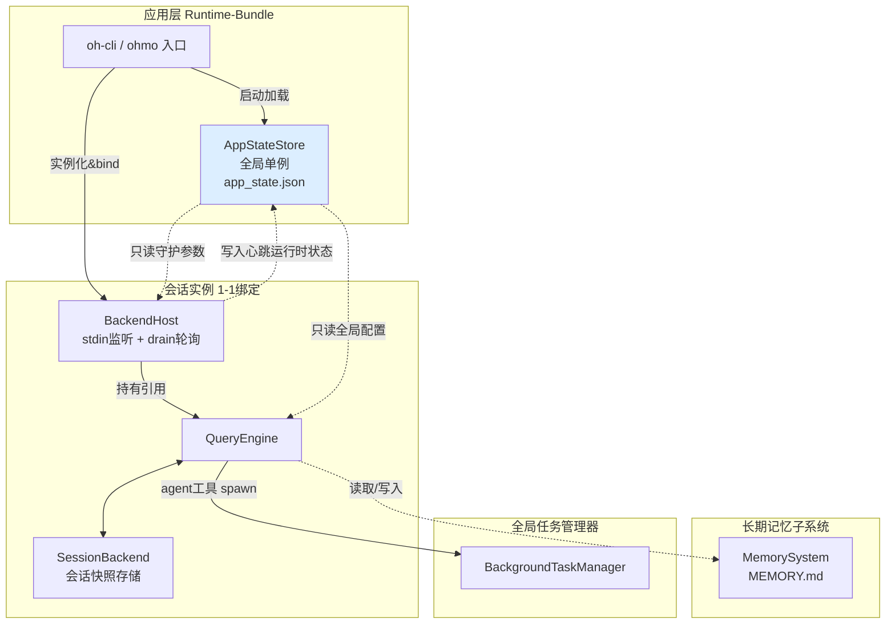
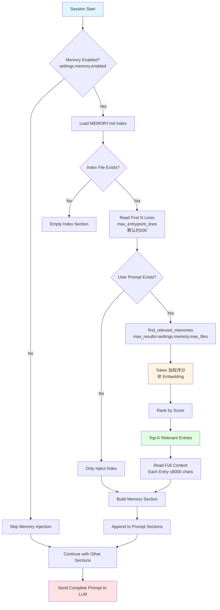
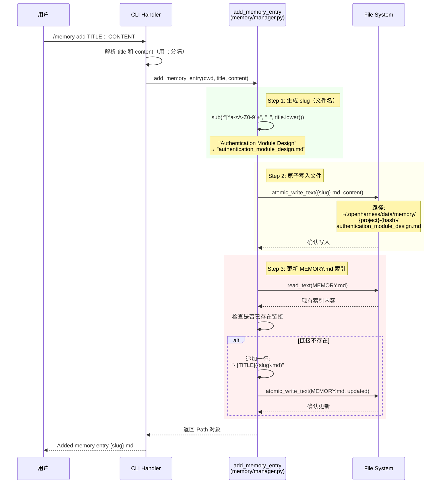
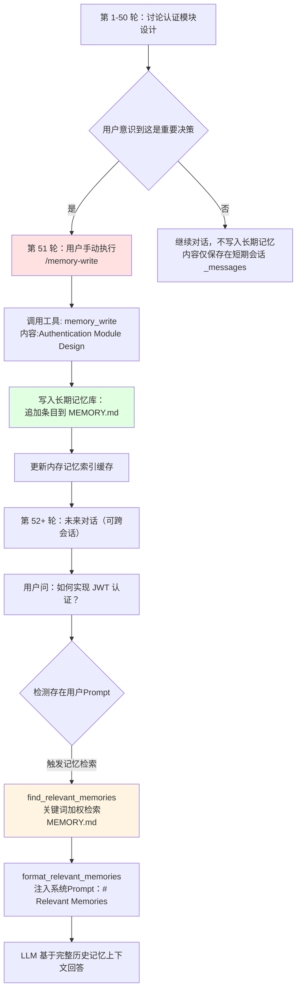
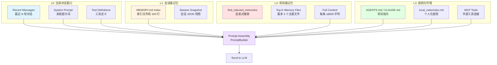
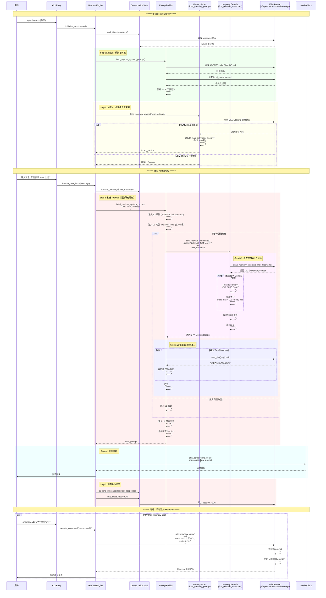
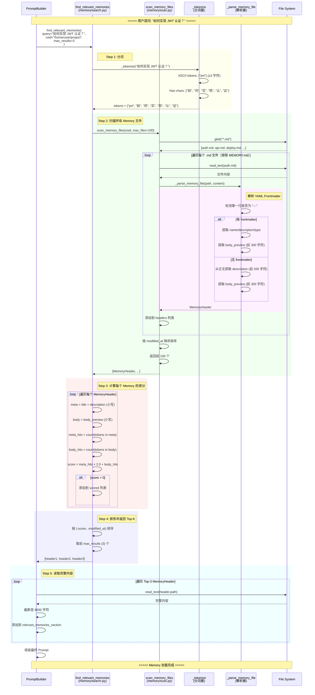

# OpenHarness Session & Memory 架构设计

> **模块**: Session管理 + Project Memory系统  
> **版本**: v1.3 (2026-06-18)  
> **同步说明**: [ARCHITECTURE_DOCS_SYNC.md](./ARCHITECTURE_DOCS_SYNC.md) · **包版本** 0.1.9
> **源码目录**: `src/openharness/state/`, `src/openharness/memory/`  
> **关联文档**: Prompt 侧注入与 §4.6 对照见 [ARCHITECTURE_PROMPTS.md](./ARCHITECTURE_PROMPTS.md)

---

## 目录

- [1. 概述](#1-概述)
- [2. Session状态管理](#2-session状态管理)
  - [2.1 AppState数据结构](#21-appstate数据结构)
  - [2.2 AppStateStore实现](#22-appstatestore实现)
  - [2.3 响应式更新机制](#23-响应式更新机制)
- [3. Project Memory系统](#3-project-memory系统)
  - [3.0 Project Memory 写入边界与数据源](#30-project-memory-写入边界与数据源)
  - [3.1 Memory存储架构](#31-memory存储架构)
  - [3.2 Memory文件结构](#32-memory文件结构)
  - [3.3 YAML Frontmatter解析](#33-yaml-frontmatter解析)
  - [3.4 Markdown 数据源总表](#34-markdown-数据源总表)
  - [3.5 四层记忆模型架构](#35-四层记忆模型架构) ⭐
  - [3.6 完整协作流程图](#36-完整协作流程图) ⭐
  - [3.7 Memory 加载时序图](#37-memory-加载时序图) ⭐
- [4. Memory CRUD操作](#4-memory-crud操作)
  - [4.1 添加Memory](#41-添加memory)
  - [4.2 删除Memory](#42-删除memory)
  - [4.3 扫描Memory](#43-扫描memory)
- [5. Memory搜索功能](#5-memory搜索功能)
- [6. Session持久化策略](#6-session持久化策略)
- [7. 并发安全机制](#7-并发安全机制)
- [8. 竞品对比](#8-竞品对比)
- [9. 典型使用场景](#9-典型使用场景)
- [10. 总结](#10-总结)

---

## 1. 概述

### 1.1 Session管理职责定位

**Session管理**负责维护OpenHarness运行时的全局状态,包括:
- **模型配置**: 当前使用的LLM模型、Provider
- **UI状态**: 主题、Vim模式、语音输入
- **认证状态**: API密钥配置状态
- **MCP连接**: 已连接的MCP服务器数量
- **权限模式**: DEFAULT/PLAN/FULL_AUTO

**核心价值**:
- 🎯 **单一数据源**: 所有UI组件共享同一AppState实例
- 🔄 **响应式更新**: 状态变化自动触发UI刷新
- 💾 **持久化**: Session退出后保留关键配置

### 1.2 Project Memory职责定位

**Project Memory**是项目级别的长期记忆系统,用于:
- **知识沉淀**: 用户或流程显式写入的项目特定知识（当前实现中 **非** 多轮对话后模型自动落盘；见 §3.0）
- **决策记录**: 重要架构决策的记录
- **上下文增强**: 为新会话提供历史背景
- **团队协作**: 多人共享项目理解

**核心价值**:
- 📚 **结构化存储**: Markdown文件+YAML元数据
- 🔍 **启发式检索**: `find_relevant_memories` 为 token 加权评分（**非**向量 Embedding），见 §5
- 🔒 **并发安全**: 文件锁保护多进程写入
- 📂 **项目隔离**: 每个项目独立的Memory目录

---

## 2. Session状态管理

### 2.1 AppState数据结构

**源码**: `state/app_state.py`

AppState是OpenHarness的核心状态容器,包含18个字段:

```python
@dataclass
class AppState:
    """Shared mutable UI/session state."""
    
    # === LLM配置 ===
    model: str                      # e.g., "claude-3-sonnet-20240229"
    provider: str = "unknown"       # e.g., "anthropic"
    base_url: str = ""              # 自定义API端点
    
    # === 认证状态 ===
    auth_status: str = "missing"    # "configured" / "missing"
    
    # === 权限控制 ===
    permission_mode: str            # "DEFAULT" / "PLAN" / "FULL_AUTO"
    
    # === UI状态 ===
    theme: str                      # e.g., "dark" / "light"
    vim_enabled: bool = False       # Vim键绑定启用状态
    voice_enabled: bool = False     # 语音输入启用状态
    voice_available: bool = False   # 语音功能是否可用
    voice_reason: str = ""          # 语音不可用的原因
    output_style: str = "default"   # 输出样式
    keybindings: dict[str, str] = field(default_factory=dict)
    
    # === 工作目录 ===
    cwd: str = "."                  # 当前工作目录
    
    # === 高级配置 ===
    fast_mode: bool = False         # 快速模式(减少token消耗)
    effort: str = "medium"          # 努力程度("low"/"medium"/"high")
    passes: int = 1                 # 迭代次数
    
    # === MCP集成 ===
    mcp_connected: int = 0          # 已连接的MCP服务器数量
    mcp_failed: int = 0             # 连接失败的MCP服务器数量
    
    # === Bridge会话 ===
    bridge_sessions: int = 0        # 活跃的Bridge会话数
```

**设计要点**:
1. **可变性**: 使用`@dataclass`而非`frozen=True`,允许运行时修改
2. **默认值**: 所有字段都有合理默认值,避免None检查
3. **分组清晰**: 注释标明各字段的用途分类

### 2.2 AppStateStore实现

**源码**: `state/store.py`

AppStateStore是一个轻量级的**观察者模式**实现:

```python
from collections.abc import Callable
from dataclasses import replace

Listener = Callable[[AppState], None]

class AppStateStore:
    """Very small observable state store."""
    
    def __init__(self, initial_state: AppState) -> None:
        self._state = initial_state
        self._listeners: list[Listener] = []
    
    def get(self) -> AppState:
        """Return the current state snapshot."""
        return self._state
    
    def set(self, **updates) -> AppState:
        """Update the state and notify listeners."""
        # Step 1: 创建新状态(不可变更新)
        self._state = replace(self._state, **updates)
        
        # Step 2: 通知所有监听器
        for listener in list(self._listeners):
            listener(self._state)
        
        return self._state
    
    def subscribe(self, listener: Listener) -> Callable[[], None]:
        """Register a listener and return an unsubscribe callback."""
        self._listeners.append(listener)
        
        def _unsubscribe() -> None:
            if listener in self._listeners:
                self._listeners.remove(listener)
        
        return _unsubscribe
```

**核心特性**:
1. **不可变更新**: `replace()`创建新对象,避免引用共享问题
2. **观察者模式**: `subscribe()`注册回调,`set()`自动通知
3. **取消订阅**: 返回`_unsubscribe()`函数,防止内存泄漏
4. **线程安全**: `list(self._listeners)`创建副本,避免遍历时修改


### 2.3 响应式更新机制

**典型用法**:

```python
# Step 1: 初始化Store
initial_state = AppState(
    model="claude-3-sonnet-20240229",
    provider="anthropic",
    permission_mode="DEFAULT",
    theme="dark",
)
store = AppStateStore(initial_state)

# Step 2: 注册UI监听器
def on_state_change(state: AppState) -> None:
    print(f"Model changed to: {state.model}")
    print(f"Theme changed to: {state.theme}")
    # 触发UI重绘
    ui.refresh()

unsubscribe = store.subscribe(on_state_change)

# Step 3: 更新状态(自动触发监听器)
store.set(model="gpt-4o", provider="openai")
# 输出:
# Model changed to: gpt-4o
# Theme changed to: dark

# Step 4: 取消订阅(组件销毁时)
unsubseribe()
```

**Textual UI集成** (`ui/widgets/status_bar.py`,简化版):

```python
class StatusBar(Widget):
    def on_mount(self) -> None:
        # 订阅AppState变化
        self._unsubscribe = app.state_store.subscribe(self._on_state_change)
    
    def _on_state_change(self, state: AppState) -> None:
        # 状态变化时更新UI
        self.model_label.update(f"Model: {state.model}")
        self.permission_label.update(f"Mode: {state.permission_mode}")
        self.mcp_label.update(f"MCP: {state.mcp_connected} connected")
    
    def on_unmount(self) -> None:
        # 组件销毁时取消订阅
        if hasattr(self, "_unsubscribe"):
            self._unsubscribe()
```

**优势**:
- ✅ **解耦**: UI组件不直接修改状态,通过Store统一管理
- ✅ **一致性**: 所有状态变更都经过Store,便于调试和日志记录
- ✅ **自动化**: 状态变化自动触发UI刷新,无需手动调用`refresh()`

---

## 3. Project Memory系统

### 3.0 Project Memory 写入边界与数据源

以下内容以当前 **`src/openharness`** 源码为准，用于区分 **「会话里发生什么」** 与 **「磁盘上 Project Memory 何时变」**。

| 机制 | 落盘位置（概要） | 是否写入 `get_project_memory_dir()` 下的 `{slug}.md` / `MEMORY.md` |
|------|------------------|----------------------------------------------------------------------|
| **`/memory add`** / **`/memory remove`** | 调用 `add_memory_entry` / `remove_memory_entry`（见 §4） | ✅ 是 |
| **用户或脚本**直接向记忆目录新增/编辑 `.md` | 同上目录 | ✅ 可写主题文件；**索引 `MEMORY.md` 不会自动跟随**（除非你手改或再走 `/memory add`） |
| **多轮对话结束 / Agent「自己决定」** | — | ❌ **无**此代码路径：`add_memory_entry` **仅**被 `commands/registry.py` 的 `/memory` 处理器调用 |
| **会话快照** `save_session_snapshot` 等 | `get_data_dir()` 下 sessions 相关 JSON | ❌ 否 |
| **Compaction** `services/compact` | 压缩结果体现在 **后续消息列表** | ❌ **不会**把摘要写入 Project Memory 目录 |

**结论**：Project Memory 目录里的 Markdown **在语义上是「可检索的知识文档」**，但在实现上 **默认由用户显式命令（或同等 API 调用）维护**；若产品需要「对话后自动写入记忆」，需新增工具或 Hook，**不属于**当前仓库已有行为。

**脚手架易混点**：`/init` 可能在仓库内创建 **`{cwd}/.openharness/memory/MEMORY.md`** 占位说明；**运行时** `/memory` 与 Prompt 加载使用的目录是 **`get_data_dir()/memory/<项目目录名>-<sha1(cwd)[:12]>/`**（`memory/paths.py`）。两处 **路径不同**，不要把脚手架文件当成运行时唯一数据源。

### 3.1 Memory存储架构

OpenHarness采用**四层记忆模型**,从项目级别到步骤级别提供分层记忆管理:

#### Memory四层注入流程图



**流程说明**:
1. **检查启用状态**: 读取 `settings.memory.enabled`
2. **目录与索引**: `load_memory_prompt()` 注入记忆目录路径说明；若存在 **`get_project_memory_dir(cwd)/MEMORY.md`**，则读取其前 **`max_entrypoint_lines`** 行（默认约 **200**，见 `MemorySettings`）
3. **启发式检索**: 若存在用户问题文本，则 `find_relevant_memories()` 在 **排除 `MEMORY.md`** 的主题 `*.md` 上做 **token 加权评分**（**不是** Embedding）
4. **Top-K**: 按分数排序，取至多 **`settings.memory.max_files`** 条（默认常为 3，以配置为准）
5. **读取正文**: 每条命中文件读入后在 Prompt 中截断至 **8000** 字符
6. **组装 Memory Section**: 注入 `# Relevant Memories` 等块
7. **注入 Prompt**: 与其它 Section 合并后发送给 LLM

**设计要点**:
- 🎯 **按需加载**: 仅在 memory enabled 时加载
- 🔍 **检索实现**: `memory/search.py` 启发式评分；与向量检索无关
- ⚡ **性能**: 索引行数、条目数与正文长度均有上限（详见 [ARCHITECTURE_PROMPTS.md §4.6](./ARCHITECTURE_PROMPTS.md)）
- 📊 **相关性**: 由关键词/token 重叠与元数据权重决定排序

```
┌─────────────────────────────────────────────────────────┐
│              Project Memory Architecture                │
├─────────────────────────────────────────────────────────┤
│                                                         │
│  ~/.openharness/data/memory/                            │
│  ├── project-a-abc123def456/                           │
│  │   ├── MEMORY.md          (索引文件)                 │
│  │   ├── architecture.md    (架构决策)                 │
│  │   ├── api_patterns.md    (API设计模式)              │
│  │   └── testing_guide.md   (测试规范)                 │
│  │                                                     │
│  ├── project-b-789ghi012jkl/                           │
│  │   ├── MEMORY.md                                      │
│  │   ├── deployment.md                                  │
│  │   └── security_notes.md                              │
│  │                                                     │
│  └── ...                                                │
│                                                         │
└─────────────────────────────────────────────────────────┘
```

**目录命名规则** (`memory/paths.py:11-17`):

```python
def get_project_memory_dir(cwd: str | Path) -> Path:
    """Return the persistent memory directory for a project."""
    path = Path(cwd).resolve()
    
    # SHA1哈希前12位作为唯一标识
    digest = sha1(str(path).encode("utf-8")).hexdigest()[:12]
    
    # 格式: {项目名}-{哈希}
    memory_dir = get_data_dir() / "memory" / f"{path.name}-{digest}"
    memory_dir.mkdir(parents=True, exist_ok=True)
    
    return memory_dir
```

**示例**:

```bash
# 项目路径: /home/user/my-project
# SHA1("/home/user/my-project")[:12] = "abc123def456"
# Memory目录: ~/.openharness/data/memory/my-project-abc123def456/
```

**设计理由**:
1. **唯一性**: SHA1哈希确保不同路径不会冲突
2. **可读性**: 保留项目名,便于人工识别
3. **稳定性**: 同一项目始终映射到同一目录
4. **截断**: 12位哈希平衡唯一性和长度(4096^12种组合)

### 3.2 Memory文件结构

**标准Memory文件**:

```markdown
---
name: Architecture Decision Record
 description: Key architectural decisions for the authentication module
type: decision
---

# Authentication Module Design

## Decision
Use JWT tokens with refresh token rotation for session management.

## Rationale
- Stateless authentication scales better across microservices
- Refresh token rotation mitigates token theft risks
- Industry standard pattern with mature library support

## Consequences
- Need to implement token refresh endpoint
- Must handle token expiration gracefully in UI
- Requires secure storage for refresh tokens
```

**组成部分**:
1. **YAML Frontmatter**: 元数据(name/description/type)
2. **Markdown正文**: 详细内容
3. **标题**: H1标题与frontmatter的name一致

**MEMORY.md索引文件**:

```markdown
# Memory Index

- [Architecture Decision Record](architecture.md)
- [API Design Patterns](api_patterns.md)
- [Testing Guide](testing_guide.md)
```

**作用**:
- 📑 **快速导航**: 模型在 L1 中可看到索引摘录，了解有哪些主题文件
- 🔗 **链接跳转**: Markdown 链接指向同目录下的 `{slug}.md`
- 🔄 **索引维护**: 通过 **`/memory add` / `/memory remove`**（即 `add_memory_entry` / `remove_memory_entry`）时 **更新链接行**；手写新主题 `.md` **不会**自动出现在索引中

### 3.3 YAML Frontmatter解析

**解析逻辑** (`memory/scan.py:28-83`):

```python
def _parse_memory_file(path: Path, content: str) -> MemoryHeader:
    """Parse a memory file, extracting YAML frontmatter when present."""
    lines = content.splitlines()
    title = path.stem  # 默认使用文件名
    description = ""
    memory_type = ""
    body_start = 0
    
    # Step 1: 检测YAML frontmatter (--- ... ---)
    if lines and lines[0].strip() == "---":
        for i, line in enumerate(lines[1:], 1):
            if line.strip() == "---":
                # 解析frontmatter内容
                for fm_line in lines[1:i]:
                    key, _, value = fm_line.partition(":")
                    key = key.strip()
                    value = value.strip().strip("'\"")
                    
                    if not value:
                        continue
                    if key == "name":
                        title = value
                    elif key == "description":
                        description = value
                    elif key == "type":
                        memory_type = value
                
                body_start = i + 1  # 正文起始行
                break
    
    # Step 2: Fallback - 如果没有frontmatter,从正文提取描述
    desc_line_idx: int | None = None
    if not description:
        for idx, line in enumerate(lines[body_start:body_start + 10], body_start):
            stripped = line.strip()
            if stripped and stripped != "---" and not stripped.startswith("#"):
                description = stripped[:200]  # 限制200字符
                desc_line_idx = idx
                break
    
    # Step 3: 构建正文预览(排除已用作描述的行)
    body_lines = [
        line.strip()
        for idx, line in enumerate(lines[body_start:], body_start)
        if line.strip()
        and not line.strip().startswith("#")
        and idx != desc_line_idx  # 排除描述行
    ]
    body_preview = " ".join(body_lines)[:300]  # 限制300字符
    
    return MemoryHeader(
        path=path,
        title=title,
        description=description,
        modified_at=path.stat().st_mtime,
        memory_type=memory_type,
        body_preview=body_preview,
    )
```

**解析流程**:

```
content = """
---
name: API Patterns
description: RESTful API design guidelines
type: guide
---

# API Design Patterns

Use resource-oriented URLs...
"""
       ↓
检测第一行: "---" → 有frontmatter
       ↓
解析key-value:
  name → "API Patterns"
  description → "RESTful API design guidelines"
  type → "guide"
       ↓
body_start = 5 (frontmatter结束后)
       ↓
提取正文预览:
  "Use resource-oriented URLs..." (前300字符)
       ↓
返回MemoryHeader
```

**MemoryHeader数据结构** (`memory/types.py:9-18`):

```python
@dataclass(frozen=True)
class MemoryHeader:
    """Metadata for one memory file."""
    
    path: Path               # 文件路径
    title: str               # 标题
    description: str         # 描述
    modified_at: float       # 修改时间戳
    memory_type: str = ""    # 类型(e.g., "decision", "guide")
    body_preview: str = ""   # 正文预览(前300字符)
```

**设计要点**:
1. **容错性**: 没有frontmatter也能正常解析
2. **防重复**: 描述行不计入正文预览,避免重复
3. **长度限制**: description 200字符,body_preview 300字符
4. **过滤标题**: 跳过Markdown标题行(`#`开头)

### 3.4 Markdown 数据源总表

本节汇总仓库内常见的 **`.md`** 文件的 **路径、写入时机、读取（注入）时机、内容约定与示例**，便于与 §3.0「写入边界」对照。Prompt 组装侧对应关系见 **[ARCHITECTURE_PROMPTS.md §4.6.3](./ARCHITECTURE_PROMPTS.md#463-markdown-数据源总表)**。**Compaction** 不写下列文件。

| 文件名/模式 | 路径（解析方式） | 写入时机 | 读取时机（注入/消费） | 内容规则（摘要） | 示例 |
|-------------|------------------|----------|----------------------|------------------|------|
| **`MEMORY.md`**（运行时索引） | `get_data_dir()/memory/<目录名>-<sha12>/MEMORY.md`（`memory/paths.py`） | **`/memory add`** 追加链接；**`/memory remove`** 删链接；手改 | **`load_memory_prompt`**：前 `max_entrypoint_lines` 行（L1）；**不参与** `find_relevant_memories` | Markdown 索引列表；缺省时 `# Memory Index\n` | `- [架构](architecture.md)` |
| **`{slug}.md`**（主题） | 同上目录 | **`/memory add`**；手写/脚本 | **`find_relevant_memories`**（L2，≤8000 字符）；**`scan_memory_files`** 排除 `MEMORY.md` | 整条记忆正文；可选 YAML frontmatter（`memory/scan.py`） | `database_schema.md` |
| **`MEMORY.md`**（脚手架） | `{cwd}/.openharness/memory/MEMORY.md` | **`/init`**（不存在则创建） | **不**参与 `get_project_memory_dir`，**不**注入运行时 Memory | 占位说明文本 | 「Add reusable project knowledge…」 |
| **`issue.md`** | `{cwd}/.openharness/issue.md`（`get_project_issue_file`） | **`/issue set TITLE :: BODY`** | **`build_runtime_system_prompt`** → Issue Context（≤12000） | `# TITLE` + 正文 | `# Bug #123\n\n…` |
| **`pr_comments.md`** | `{cwd}/.openharness/pr_comments.md`（`get_project_pr_comments_file`） | **`/pr_comments add …`** 追加 | 同上 → PR Comments（≤12000） | 常以 `# PR Comments` 开头，逐行追加评论 | `- src/app.py:42: nit` |
| **`active_repo_context.md`** | `{cwd}/.openharness/autopilot/active_repo_context.md`（`get_project_active_repo_context_path`） | **`RepoAutopilotStore.rebuild_active_context()`**（入队、改状态、`scan_*`、`_ensure_layout` 等） | **`build_runtime_system_prompt`** → Active Repo Context（≤12000） | Autopilot 合成的队列/journal/策略指针等 Markdown | 多节标题 + bullet |
| **`rules.md`** | `~/.openharness/local_rules/rules.md`（`personalization/rules.py`） | **会话关闭** `close_runtime` → **`update_rules_from_session`**（从会话文本抽取事实后再生成） | **`load_local_rules()`** → Local Environment Rules | 由 **`facts_to_rules_markdown`** 生成的规则正文 | 条目化「环境事实」 |
| **`CLAUDE.md`** | `{cwd}/CLAUDE.md`（亦可查 `~/.claude/CLAUDE.md`，见 `load_claude_md_prompt`） | **`/init`** 默认创建根目录一份；任意编辑器 | **`load_claude_md_prompt`** | 项目指令类 Markdown | `# Project Instructions` |
| **`transcript.md`** | **`get_project_session_dir(cwd)`** = `get_data_dir()/sessions/<cwd目录名>-<sha12>/transcript.md`（与 **`get_project_memory_dir`** **目录树并列**、路径 **不同**，见 `session_storage.py`） | **`/export`**、**`/share`** → **`export_session_markdown`** | **默认不**注入 system prompt；给人读或外部分享 | `# OpenHarness Session Transcript` + role/tool 块 | 会话导出 |
| **`{tag}.md`** | 同上 session 目录 `{tag}.md` | **`/session tag NAME`**（复制当期 transcript 导出） | **默认不**注入 | 与当期 `transcript.md` 同源的命名快照 | `release-prep.md` |
| **`*.md`**（任意） | **`write_file`** 的 `path`（相对 `cwd`） | **模型调用** **`write_file`** 且执行成功 | **仅当**后续工具/用户读取；**无**全局自动注入 | 工具参数中的完整 `content` | `docs/adr/001.md` |
| **`*-run.md` / `*-verification.md`（模式）** | `{cwd}/.openharness/autopilot/runs/` 下 Autopilot 生成 | **Autopilot 执行任务/验证**（`autopilot/service.py`） | 人读、仪表盘/流程；**不**经 `build_runtime_system_prompt` 四类 Project Context | 单次运行或验证报告 | `ap-xxxx-run.md` |

---

### 3.4.1 L2 Memory 文件产生机制 ⭐

**核心问题**：L2 项目级记忆文件（`{slug}.md`）是如何产生的？是用户手动创建还是 Agent 自动提取？

**答案**：**❌ OpenHarness 的 L2 Memory 文件只能由用户手动创建，Agent 无法自动提取。**

#### 唯一官方途径：`/memory add` 命令

**源码位置**：[`commands/registry.py:407-412`](file:///Users/gqli/work/deepagents/OpenHarness/src/openharness/commands/registry.py#L407-L412)

```python
if action == "add" and rest:
    title, separator, content = rest.partition("::")
    if not separator or not title.strip() or not content.strip():
        return CommandResult(message="Usage: /memory add TITLE :: CONTENT")
    path = add_memory_entry(context.cwd, title.strip(), content.strip())
    return CommandResult(message=f"Added memory entry {path.name}")
```

**使用方式**：

```bash
# 用户在 CLI 中手动执行
/memory add Authentication Module Design :: ---
name: Authentication Module Design
description: JWT-based auth with refresh token rotation
type: decision
---

# Authentication Module Design

## Decision
Use JWT tokens with refresh token rotation for session management.

## Rationale
- Stateless authentication scales better across microservices
- Refresh token rotation mitigates token theft risks
```

**执行流程**：



#### 替代途径：手动编辑文件系统

用户也可以直接在文件系统中创建 Memory 文件：

```bash
# 1. 找到 Memory 目录
$ openharness
> /memory
Memory directory: ~/.openharness/data/memory/my-project-abc123def456
Entrypoint: ~/.openharness/data/memory/my-project-abc123def456/MEMORY.md

# 2. 手动创建文件
$ cd ~/.openharness/data/memory/my-project-abc123def456
$ vim api_patterns.md

# 3. 手动更新索引（⚠️ 不会自动更新！）
$ vim MEMORY.md
# 添加一行: - [API Patterns](api_patterns.md)
```

**注意**：这种方式**不会自动更新索引**，需要手动编辑 `MEMORY.md`，否则 `load_memory_prompt()` 无法看到新文件。

#### ❌ Agent 无法自动创建 Memory

**关键证据**：检查 OpenHarness 的工具列表（`src/openharness/tools/`），**没有任何 memory 相关的 Agent 工具**：

- ✅ 有：`agent_tool.py`, `task_create_tool.py`, `file_write_tool.py`
- ❌ **没有**：`memory_add_tool.py`, `memory_create_tool.py`

**对比其他框架**：

| 框架 | Agent 能否自动创建 Memory | 实现方式 |
|------|-------------------------|----------|
| **OpenHarness** | ❌ **不能** | 仅支持 `/memory add` 命令（用户手动） |
| **hermes-agent** | ✅ **能** | 提供 `memory` 工具，Agent 可调用 |
| **deer-flow** | ⚠️ **部分能** | 通过 `memory_flush_hook` 自动抽取 facts |
| **Letta** | ✅ **能** | 提供 `memory_create` 核心工具 |

#### 设计理念

**OpenHarness 的设计哲学**：
> "Project Memory 是**用户显式维护的知识库**，而非 Agent 自动提取的会话摘要。"

**优势**：
- ✅ **可控性**：用户完全控制哪些知识值得持久化
- ✅ **质量保障**：避免 Agent 自动提取低质量或错误的记忆
- ✅ **职责清晰**：Memory 是长期知识库，Session 是短期对话历史

**劣势**：
- ❌ **增加负担**：用户需要手动识别和保存重要知识
- ❌ **可能遗漏**：Agent 发现的关键洞察可能被遗忘

#### 典型工作流程



#### 何时手动创建 Memory？

✅ **应该创建**：
- 重要的架构决策（ADR）
- 项目特定的设计规范
- 团队共享的最佳实践
- 调试过程中发现的关键洞察
- 部署流程和运维指南

❌ **不应该创建**：
- 临时的对话内容
- 已经过时的信息
- 过于细节的代码片段（应放在代码注释中）
- 个人偏好（应放在 `local_rules/rules.md`）

#### 推荐的 Memory 结构

```markdown
---
name: 简洁的标题
description: 一句话描述（用于搜索）
type: decision|guide|pattern|troubleshooting|note
---

# 标题

## 背景
为什么需要做这个决策？

## 决策
具体做了什么选择？

## 理由
为什么这样选择？

## 影响
带来了什么好处和代价？

## 相关资源
- [链接1](...)
- [链接2](...)
```

---

### 3.5 四层记忆模型架构

OpenHarness 采用 **四层记忆模型**，从项目级别到步骤级别提供分层记忆管理：



**四层职责划分**：

| 层级 | 名称 | 数据源 | 加载时机 | 容量限制 | 作用 |
|------|------|--------|---------|---------|------|
| **L0** | 当前对话窗口 | Recent Messages + System Prompt | 每轮对话 | Token 预算内 | 提供即时上下文 |
| **L1** | 会话级记忆 | MEMORY.md 索引 | Session 启动时 | 前 200 行 | 让模型知道有哪些主题文件 |
| **L2** | 项目级记忆 | `{slug}.md` 主题文件 | 用户提问后搜索 | Top-3，每条 ≤8000 字符 | 提供相关历史知识 |
| **L3** | 规则与环境 | AGENTS.md, rules.md, MCP | Session 启动时 | 各 ≤12000 字符 | 提供长期规则和工具能力 |

**关键设计原则**：

1. **按需加载**：L2 仅在用户提问后才触发搜索，避免不必要的 I/O
2. **容量控制**：每层都有明确的容量上限，防止 Prompt 爆炸
3. **优先级递减**：L0 > L3 > L2 > L1（越靠近当前对话，优先级越高）
4. **分离关注点**：L0/L1 解决"这次调用"，L2/L3 解决"长期知识"

---

### 3.6 完整协作流程图

以下是从用户输入到 Memory 检索并注入 Prompt 的完整端到端流程：



**流程说明**：

1. **Session 启动阶段**（绿色区域）：
   - 加载 L3 规则（AGENTS.md, rules.md, MCP）
   - 加载 L1 索引（MEMORY.md 前 200 行）
   - 这些是静态内容，只需加载一次

2. **第 N 轮对话阶段**（红色区域）：
   - 用户输入消息
   - 构建 Prompt，注入 L0/L1/L3
   - **如果用户问题非空**，触发 L2 搜索
     - Step 3.1: 启发式搜索（紫色区域）
     - Step 3.2: 读取 Top-3 记忆正文（蓝色区域）
   - 调用模型生成回复
   - 保存会话状态

3. **可选操作**（橙色区域）：
   - 用户可手动执行 `/memory add` 添加新记忆
   - 这会创建新的 `{slug}.md` 文件并更新 `MEMORY.md` 索引

**关键性能优化**：

- ✅ **L1 预加载**：索引只在 Session 启动时加载一次
- ✅ **L2 按需搜索**：仅在有用户问题时才触发搜索
- ✅ **容量限制**：L1 限制 200 行，L2 限制 Top-3，每条 ≤8000 字符
- ✅ **并发安全**：Memory 读写使用文件锁保护

---

### 3.7 Memory 加载时序图

以下是 Memory 搜索和加载的详细时序图，展示 `find_relevant_memories` 的内部工作流程：



**示例计算过程**：

假设有 3 个 Memory 文件：

**Memory 1: `authentication_module_design.md`**
```yaml
---
name: Authentication Module Design
description: JWT-based auth with refresh token rotation
type: decision
---
```

- `meta = "authentication module design jwt-based auth with refresh token rotation"`
- `body = "use jwt tokens with refresh token rotation for session management..."`
- `tokens = {"jwt", "认", "证", ...}`
- `meta_hits = 1` ("jwt")
- `body_hits = 1` ("jwt")
- `score = 1 × 2.0 + 1 = 3.0` ✅

**Memory 2: `api_patterns.md`**
```yaml
---
name: API Design Patterns
description: RESTful API design guidelines
type: guide
---
```

- `meta = "api design patterns restful api design guidelines"`
- `body = "use resource-oriented urls like /users/:id..."`
- `meta_hits = 0`
- `body_hits = 0`
- `score = 0` ❌ (不返回)

**Memory 3: `security_best_practices.md`**
```yaml
---
name: Security Best Practices
description: General security guidelines including JWT validation
type: guide
---
```

- `meta = "security best practices general security guidelines including jwt validation"`
- `body = "always validate jwt tokens before processing requests..."`
- `meta_hits = 1` ("jwt")
- `body_hits = 1` ("jwt")
- `score = 1 × 2.0 + 1 = 3.0` ✅

**最终结果**：
- 返回 `[authentication_module_design.md, security_best_practices.md]`（按得分和时间排序）
- 读取这两个文件的完整内容（每条 ≤8000 字符）
- 注入到 Prompt 的 `# Relevant Memories` Section

---

## 4. Memory CRUD操作

### 4.1 添加Memory

**API调用** (`memory/manager.py:23-36`):

```python
def add_memory_entry(cwd: str | Path, title: str, content: str) -> Path:
    """Create a memory file and append it to MEMORY.md."""
    
    # Step 1: 获取Memory目录
    memory_dir = get_project_memory_dir(cwd)
    
    # Step 2: 生成slug(文件名)
    slug = sub(r"[^a-zA-Z0-9]+", "_", title.strip().lower()).strip("_") or "memory"
    # e.g., "Architecture Decision Record" → "architecture_decision_record"
    
    path = memory_dir / f"{slug}.md"
    
    # Step 3: 原子写入Memory文件
    with exclusive_file_lock(_memory_lock_path(cwd)):
        atomic_write_text(path, content.strip() + "\n")
        
        # Step 4: 更新MEMORY.md索引
        entrypoint = get_memory_entrypoint(cwd)
        existing = entrypoint.read_text(encoding="utf-8") if entrypoint.exists() else "# Memory Index\n"
        
        if path.name not in existing:  # 避免重复添加
            existing = existing.rstrip() + f"\n- [{title}]({path.name})\n"
            atomic_write_text(entrypoint, existing)
    
    return path
```

**典型用法**:

```python
from openharness.memory.manager import add_memory_entry

# 程序化调用（与 /memory add 等价）；当前无 Agent 工具自动调用
add_memory_entry(
    cwd="/home/user/project",
    title="Authentication Module Design",
    content="""---
name: Authentication Module Design
description: JWT-based auth with refresh token rotation
type: decision
---

# Authentication Module Design

## Decision
Use JWT tokens with refresh token rotation for session management.

## Rationale
- Stateless authentication scales better across microservices
- Refresh token rotation mitigates token theft risks
"""
)

# 返回: Path("~/.openharness/data/memory/project-abc123/authentication_module_design.md")
```

**执行流程**:

```
add_memory_entry(title="Auth Design", content="...")
       ↓
生成slug: "auth_design"
       ↓
创建文件: ~/.openharness/data/memory/project-abc123/auth_design.md
       ↓
获取文件锁: ~/.openharness/data/memory/project-abc123/.memory.lock
       ↓
原子写入: auth_design.md (mode 644)
       ↓
读取MEMORY.md
       ↓
检查是否已存在链接
       ↓
追加链接: "- [Auth Design](auth_design.md)"
       ↓
原子写入: MEMORY.md
       ↓
释放文件锁
```

### 4.2 删除Memory

**API调用** (`memory/manager.py:39-58`):

```python
def remove_memory_entry(cwd: str | Path, name: str) -> bool:
    """Delete a memory file and remove its index entry."""
    
    # Step 1: 查找匹配的文件
    memory_dir = get_project_memory_dir(cwd)
    matches = [
        path for path in memory_dir.glob("*.md")
        if path.stem == name or path.name == name
    ]
    
    if not matches:
        return False  # 未找到
    
    path = matches[0]
    
    # Step 2: 原子删除
    with exclusive_file_lock(_memory_lock_path(cwd)):
        # 删除Memory文件
        if path.exists():
            path.unlink()
        
        # 从MEMORY.md移除链接
        entrypoint = get_memory_entrypoint(cwd)
        if entrypoint.exists():
            lines = [
                line
                for line in entrypoint.read_text(encoding="utf-8").splitlines()
                if path.name not in line  # 过滤掉包含文件名的行
            ]
            atomic_write_text(entrypoint, "\n".join(lines).rstrip() + "\n")
    
    return True
```

**典型用法**:

```python
from openharness.memory.manager import remove_memory_entry

# 删除过时的Memory
success = remove_memory_entry(
    cwd="/home/user/project",
    name="auth_design"  # 可以是文件名或stem
)

if success:
    print("Memory deleted successfully")
else:
    print("Memory not found")
```

**安全特性**:
- ✅ **模糊匹配**: 支持文件名(`auth_design.md`)或stem(`auth_design`)
- ✅ **原子操作**: 文件删除和索引更新在同一锁内完成
- ✅ **幂等性**: 多次删除同一文件不会报错

### 4.3 扫描Memory

**API调用** (`memory/scan.py:11-25`):

```python
def scan_memory_files(cwd: str | Path, *, max_files: int = 50) -> list[MemoryHeader]:
    """Return memory headers sorted by newest first."""
    
    memory_dir = get_project_memory_dir(cwd)
    headers: list[MemoryHeader] = []
    
    # Step 1: 遍历所有.md文件
    for path in memory_dir.glob("*.md"):
        if path.name == "MEMORY.md":  # 跳过索引文件
            continue
        
        try:
            text = path.read_text(encoding="utf-8")
        except OSError:
            continue  # 跳过无法读取的文件
        
        # Step 2: 解析frontmatter
        header = _parse_memory_file(path, text)
        headers.append(header)
    
    # Step 3: 按修改时间排序(最新优先)
    headers.sort(key=lambda item: item.modified_at, reverse=True)
    
    # Step 4: 限制返回数量
    return headers[:max_files]
```

**典型用法**:

```python
from openharness.memory.scan import scan_memory_files

# 获取最近的50个Memory
headers = scan_memory_files(cwd="/home/user/project", max_files=50)

for header in headers:
    print(f"Title: {header.title}")
    print(f"Description: {header.description}")
    print(f"Type: {header.memory_type}")
    print(f"Modified: {datetime.fromtimestamp(header.modified_at)}")
    print(f"Preview: {header.body_preview[:100]}...")
    print("---")
```

**输出示例**:

```
Title: Authentication Module Design
Description: JWT-based auth with refresh token rotation
Type: decision
Modified: 2026-04-17 10:30:00
Preview: Use JWT tokens with refresh token rotation for session management...
---
Title: API Design Patterns
Description: RESTful API design guidelines
Type: guide
Modified: 2026-04-16 15:20:00
Preview: Use resource-oriented URLs like /users/:id instead of /get-user?id=123...
---
```

**性能优化**:
- 🚀 **限制数量**: `max_files=50`避免扫描过多文件
- 🚀 **跳过索引**: 不解析`MEMORY.md`,减少I/O
- 🚀 **异常处理**: `OSError`捕获确保单个文件失败不影响整体

---

## 5. Memory搜索功能

### 5.1 启发式搜索算法

**源码**: `memory/search.py`

```python
def find_relevant_memories(
    query: str,
    cwd: str | Path,
    *,
    max_results: int = 5,
) -> list[MemoryHeader]:
    """Return the memory files whose metadata and content overlap the query.
    
    Scoring weights frontmatter fields higher than body content so that
    well-annotated memories surface first.
    """
    
    # Step 1: 分词
    tokens = _tokenize(query)
    if not tokens:
        return []
    
    scored: list[tuple[float, MemoryHeader]] = []
    
    # Step 2: 扫描所有Memory
    for header in scan_memory_files(cwd, max_files=100):
        meta = f"{header.title} {header.description}".lower()
        body = header.body_preview.lower()
        
        # Step 3: 计算得分
        # Metadata匹配权重2x, Body匹配权重1x
        meta_hits = sum(1 for t in tokens if t in meta)
        body_hits = sum(1 for t in tokens if t in body)
        score = meta_hits * 2.0 + body_hits
        
        if score > 0:
            scored.append((score, header))
    
    # Step 4: 排序(得分降序, 时间降序)
    scored.sort(key=lambda item: (-item[0], -item[1].modified_at))
    
    # Step 5: 返回Top N
    return [header for _, header in scored[:max_results]]
```

**评分公式**:

```
score = (meta_matches × 2.0) + body_matches

其中:
- meta_matches: query tokens在title/description中的命中数
- body_matches: query tokens在body_preview中的命中数
- 权重: metadata 2x, body 1x
```

**示例**:

```python
query = "authentication JWT token"
tokens = {"authentication", "jwt", "token"}

# Memory 1: "Authentication Module Design"
#   title: "Authentication Module Design"
#   description: "JWT-based auth with refresh token rotation"
#   body_preview: "Use JWT tokens with refresh token rotation..."
#
# meta = "authentication module design jwt-based auth with refresh token rotation"
# body = "use jwt tokens with refresh token rotation..."
#
# meta_hits = 3 ("authentication", "jwt", "token")
# body_hits = 2 ("jwt", "token")
# score = 3 × 2.0 + 2 = 8.0

# Memory 2: "API Design Patterns"
#   title: "API Design Patterns"
#   description: "RESTful API design guidelines"
#   body_preview: "Use resource-oriented URLs..."
#
# meta_hits = 0
# body_hits = 0
# score = 0 (不返回)
```

### 5.2 分词器实现

**源码** (`memory/search.py:43-49`):

```python
def _tokenize(text: str) -> set[str]:
    """Extract search tokens from text, handling ASCII and Han ideographs."""
    
    # ASCII单词tokens(至少3字符)
    ascii_tokens = {
        t for t in re.findall(r"[A-Za-z0-9_]+", text.lower())
        if len(t) >= 3
    }
    
    # 汉字字符(每个字符独立有意义)
    han_chars = set(re.findall(r"[\u4e00-\u9fff\u3400-\u4dbf]", text))
    
    return ascii_tokens | han_chars
```

**设计要点**:
1. **最小长度**: ASCII tokens至少3字符,避免噪声(e.g., "a", "is")
2. **中文支持**: 每个汉字作为独立token,无需分词库
3. **大小写不敏感**: `text.lower()`统一小写
4. **Unicode范围**: 覆盖常用汉字(CJK Unified Ideographs)

**示例**:

```python
# 英文查询
tokenize("authentication JWT token")
→ {"authentication", "jwt", "token"}

# 中文查询
tokenize("认证模块设计")
→ {"认", "证", "模", "块", "设", "计"}

# 混合查询
tokenize("认证 authentication JWT")
→ {"认", "证", "authentication", "jwt"}
```

### 5.3 搜索工具集成

**memory_search工具** (`tools/memory_search_tool.py`,简化版):

```python
class MemorySearchTool(BaseTool):
    name = "memory_search"
    description = "Search project memory for relevant context."
    
    class InputModel(BaseModel):
        query: str = Field(..., description="Search query")
        max_results: int = Field(5, description="Max results to return")
    
    async def execute(self, arguments: InputModel, context: ToolExecutionContext) -> ToolResult:
        headers = find_relevant_memories(
            query=arguments.query,
            cwd=context.cwd,
            max_results=arguments.max_results,
        )
        
        if not headers:
            return ToolResult(output="No relevant memories found.")
        
        lines = [f"Found {len(headers)} relevant memories:"]
        for header in headers:
            lines.append(f"\n## {header.title}")
            lines.append(f"**Description**: {header.description}")
            lines.append(f"**Type**: {header.memory_type}")
            lines.append(f"**Preview**: {header.body_preview[:200]}...")
            lines.append(f"**File**: {header.path.name}")
        
        return ToolResult(output="\n".join(lines))
```

**Agent工作流**:

```python
# Agent需要了解认证模块
Step 1: 搜索相关Memory
  memory_search(query="authentication JWT token")
       ↓
返回:
  Found 2 relevant memories:
  
  ## Authentication Module Design
  **Description**: JWT-based auth with refresh token rotation
  **Type**: decision
  **Preview**: Use JWT tokens with refresh token rotation...
  **File**: authentication_module_design.md
  
  ## Security Best Practices
  **Description**: General security guidelines
  **Type**: guide
  **Preview**: Always validate input, use HTTPS...
  **File**: security_best_practices.md

Step 2: 读取完整Memory
  read_file(path="authentication_module_design.md")
       ↓
获取完整内容,用于上下文增强
```

---

## 6. Session持久化策略

本节描述 **会话与 UI 状态** 等持久化方式。**Project Memory**（`get_project_memory_dir` 下的 `.md`）与 **会话 JSON 快照**、**Compaction 后的消息流** 是不同数据源：前者仅由 §3.0、§4 所述路径写入；会话保存与压缩 **不会**自动更新记忆目录。

### 6.1 AppState持久化

**当前状态**: ⚠️ **内存存储**,Session退出后丢失

**改进方向**:

```python
# 未来可能的实现
class PersistentAppStateStore(AppStateStore):
    def __init__(self, initial_state: AppState, storage_path: Path) -> None:
        super().__init__(initial_state)
        self._storage_path = storage_path
        self._load_from_disk()
    
    def set(self, **updates) -> AppState:
        state = super().set(**updates)
        self._save_to_disk(state)  # 每次更新都持久化
        return state
    
    def _save_to_disk(self, state: AppState) -> None:
        data = asdict(state)
        atomic_write_text(
            self._storage_path,
            json.dumps(data, indent=2),
            mode=0o600,
        )
    
    def _load_from_disk(self) -> None:
        if self._storage_path.exists():
            try:
                data = json.loads(self._storage_path.read_text())
                self._state = AppState(**data)
            except (json.JSONDecodeError, TypeError):
                pass  # 使用默认状态
```

**持久化字段建议**:
- ✅ **应该持久化**: model, provider, theme, permission_mode, vim_enabled
- ❌ **不应持久化**: mcp_connected, mcp_failed, bridge_sessions(运行时状态)

### 6.2 Project Memory持久化

**当前状态**: ✅ **完全持久化**,基于文件系统

**存储位置**: `~/.openharness/data/memory/{project}-{hash}/`

**优势**:
- 💾 **长期保存**: 即使CLI重启,Memory仍保留
- 📂 **项目隔离**: 不同项目互不干扰
- 🔍 **人工可读**: Markdown格式,可用任意编辑器查看
- 🔄 **版本控制**: 可纳入Git管理(可选)

**备份策略**:

```bash
# 手动备份
$ cp -r ~/.openharness/data/memory ~/backups/openharness-memory-$(date +%Y%m%d)

# 自动备份(cron job)
0 2 * * * tar -czf ~/backups/memory-$(date +\%Y\%m\%d).tar.gz ~/.openharness/data/memory/
```

---

## 7. 并发安全机制

### 7.1 文件锁保护

**Memory操作锁** (`memory/manager.py:13-14`):

```python
def _memory_lock_path(cwd: str | Path) -> Path:
    return get_project_memory_dir(cwd) / ".memory.lock"
```

**锁的使用**:

```python
# add_memory_entry
with exclusive_file_lock(_memory_lock_path(cwd)):
    atomic_write_text(path, content)
    # 更新MEMORY.md

# remove_memory_entry
with exclusive_file_lock(_memory_lock_path(cwd)):
    path.unlink()
    # 更新MEMORY.md
```

**exclusive_file_lock实现** (`utils/file_lock.py`,简化版):

```python
import fcntl
from pathlib import Path

@contextmanager
def exclusive_file_lock(lock_path: Path, timeout: int = 5):
    """Acquire an exclusive file lock."""
    lock_path.parent.mkdir(parents=True, exist_ok=True)
    lock_file = lock_path.open("w")
    
    try:
        # 非阻塞尝试
        fcntl.flock(lock_file.fileno(), fcntl.LOCK_EX | fcntl.LOCK_NB)
    except BlockingIOError:
        # 阻塞等待,带超时
        import time
        start = time.time()
        while time.time() - start < timeout:
            try:
                fcntl.flock(lock_file.fileno(), fcntl.LOCK_EX | fcntl.LOCK_NB)
                break
            except BlockingIOError:
                time.sleep(0.1)
        else:
            raise TimeoutError(f"Could not acquire lock: {lock_path}")
    
    try:
        yield
    finally:
        fcntl.flock(lock_file.fileno(), fcntl.LOCK_UN)
        lock_file.close()
```

**锁的特性**:
- 🔒 **排他锁**: 同一时刻只有一个进程可写入
- ⏱️ **超时机制**: 5秒后抛出异常,避免死锁
- 🔄 **自动释放**: `finally`块确保锁被释放
- 📁 **自动创建**: 锁文件不存在时自动创建

### 7.2 原子写入

**atomic_write_text实现** (`utils/fs.py`,简化版):

```python
def atomic_write_text(path: Path, content: str, mode: int = 0o644) -> None:
    """Atomically write text to a file."""
    
    # Step 1: 写入临时文件
    tmp_path = path.with_suffix(".tmp")
    tmp_path.write_text(content, encoding="utf-8")
    tmp_path.chmod(mode)
    
    # Step 2: 原子替换(rename是原子的)
    tmp_path.rename(path)
```

**为什么需要原子写入**:

```
# 场景: 两个进程同时写入MEMORY.md

# 非原子写入(危险):
Process A: 打开MEMORY.md → 写入内容 → 关闭文件
Process B: 打开MEMORY.md → 写入内容 → 关闭文件
       ↓
结果: 最后写入的进程覆盖前一个,数据丢失!

# 原子写入(安全):
Process A: 写入MEMORY.md.tmp → rename(MEMORY.md.tmp, MEMORY.md)
Process B: 写入MEMORY.md.tmp → rename(MEMORY.md.tmp, MEMORY.md)
       ↓
结果: rename是原子操作,要么成功要么失败,不会部分写入
```

**优势**:
- ✅ **崩溃安全**: 即使写入过程中进程崩溃,原文件不受影响
- ✅ **并发安全**: 配合文件锁,确保多进程安全
- ✅ **权限保持**: `chmod()`设置正确权限

---

## 8. 竞品对比

### 8.1 Session状态管理对比

| 维度 | OpenHarness | Claude Code | Aider | Gemini CLI |
|------|------------|-------------|-------|-----------|
| **状态容器** | ✅ AppStateStore(观察者模式) | ⚠️ 简单变量 | ⚠️ 简单变量 | ⚠️ 简单变量 |
| **响应式更新** | ✅ subscribe/listener机制 | ❌ 无 | ❌ 无 | ❌ 无 |
| **不可变更新** | ✅ replace()创建新对象 | ❌ 直接修改 | ❌ 直接修改 | ❌ 直接修改 |
| **取消订阅** | ✅ 返回unsubscribe函数 | N/A | N/A | N/A |
| **持久化** | ⚠️ 内存存储(待改进) | ✅ 配置文件 | ✅ 配置文件 | ✅ 配置文件 |
| **状态字段数** | 18个(全面) | ~5个(基础) | ~8个(中等) | ~5个(基础) |

**核心优势**:
- 🏆 **唯一实现观察者模式**: UI组件自动响应状态变化
- 🏆 **最丰富的状态字段**: 覆盖LLM/UI/MCP/Bridge等所有维度
- 🏆 **解耦设计**: Store作为单一数据源,避免状态分散

**待改进项**:
- ⚠️ **持久化缺失**: Session重启后状态丢失
- 💡 **改进方向**: 实现PersistentAppStateStore,持久化关键字段

### 8.2 Project Memory系统对比

| 维度 | OpenHarness | Claude Code | Aider | Gemini CLI |
|------|------------|-------------|-------|-----------|
| **Memory系统** | ✅ Project Memory | ✅ CLAUDE.md | ⚠️ .aider.conf | ❌ 无 |
| **存储格式** | Markdown + YAML frontmatter | Markdown | TOML配置 | N/A |
| **文件结构** | 多文件+索引(MEMORY.md) | 单文件(CLAUDE.md) | 单文件(.aider.conf) | N/A |
| **元数据支持** | ✅ name/description/type | ❌ 无 | ❌ 无 | N/A |
| **搜索功能** | ✅ 启发式评分搜索 | ❌ 手动查找 | ❌ 无 | N/A |
| **并发安全** | ✅ 文件锁+原子写入 | ⚠️ 普通写入 | ⚠️ 普通写入 | N/A |
| **项目隔离** | ✅ SHA1哈希目录 | ❌ 项目根目录 | ❌ 项目根目录 | N/A |
| **CRUD API** | ✅ add/remove/scan/search | ❌ 手动编辑 | ❌ 手动编辑 | N/A |
| **中文支持** | ✅ 汉字分词 | ⚠️ 依赖模型 | ⚠️ 依赖模型 | N/A |

**核心优势**:
- 🏆 **唯一支持搜索的Memory系统**: 启发式评分算法,metadata权重2x
- 🏆 **唯一结构化元数据**: YAML frontmatter(name/description/type)
- 🏆 **唯一并发安全**: 文件锁+原子写入,防止多进程冲突
- 🏆 **唯一项目隔离**: SHA1哈希目录,不同项目互不干扰
- 🏆 **唯一中文支持**: 内置汉字分词器,无需外部依赖

**Claude Code对比**:
- ✅ **CLAUDE.md**: 简单直接,适合小型项目
- ❌ **缺乏结构**: 纯Markdown,无法程序化解析元数据
- ❌ **无搜索**: 只能手动滚动查找
- ❌ **无并发保护**: 多Agent同时编辑可能冲突

**Aider对比**:
- ✅ **.aider.conf**: 配置化管理,适合CI/CD
- ❌ **非Memory系统**: 仅是配置文件,不是知识库
- ❌ **无搜索**: 配置项有限,无需搜索

### 8.3 搜索算法对比

| 维度 | OpenHarness | Claude Code | Aider | 专业搜索引擎 |
|------|------------|-------------|-------|------------|
| **算法类型** | 启发式关键词匹配 | N/A | N/A | BM25/TF-IDF |
| **分词支持** | ASCII + 汉字 | N/A | N/A | 多语言 |
| **权重机制** | metadata 2x, body 1x | N/A | N/A | 可配置 |
| **排序策略** | 得分降序 + 时间降序 | N/A | N/A | 相关性+新鲜度 |
| **性能** | O(n×m), n=files, m=tokens | N/A | N/A | 索引加速 |
| **适用规模** | <100 files | N/A | N/A | >10000 files |

**设计权衡**:
- ✅ **简单高效**: 无需外部依赖,开箱即用
- ✅ **中小规模**: 适合个人项目(<100 Memory文件)
- ❌ **大规模局限**: >100文件时性能下降
- 💡 **改进方向**: 引入Elasticsearch/Whoosh全文索引

---

## 9. 典型使用场景

### 9.1 Agent知识沉淀工作流

**场景**: Agent在开发过程中学习项目特定知识,并持久化为Memory

```python
# Step 1: Agent发现架构决策
# (Agent分析代码库,识别出JWT认证模式)

# Step 2: Agent创建Memory
add_memory_entry(
    cwd="/home/user/project",
    title="Authentication Module Design",
    content="""---
name: Authentication Module Design
description: JWT-based authentication with refresh token rotation
type: decision
---

# Authentication Module Design

## Decision
Use JWT tokens with refresh token rotation for session management.

## Rationale
- Stateless authentication scales better across microservices
- Refresh token rotation mitigates token theft risks
- Industry standard pattern with mature library support

## Consequences
- Need to implement token refresh endpoint
- Must handle token expiration gracefully in UI
- Requires secure storage for refresh tokens

## Alternatives Considered
- Session-based auth: Rejected due to scalability concerns
- OAuth2: Overkill for internal services
"""
)

# Step 3: Memory被添加到索引
# MEMORY.md now contains:
# - [Authentication Module Design](authentication_module_design.md)

# Step 4: 未来会话中,Agent可搜索并复用此知识
headers = find_relevant_memories(query="auth JWT", cwd="/home/user/project")
# Returns: [MemoryHeader(title="Authentication Module Design", ...)]
```

**优势**:
- 📚 **知识积累**: 每次会话都增强项目理解
- 🔄 **跨会话复用**: 新会话自动继承历史知识
- 👥 **团队共享**: 多人协作时共享同一Memory库

### 9.2 多项目并行开发

**场景**: 同时在多个项目中切换,每个项目有独立的Memory

```bash
# 项目A: E-commerce平台
$ cd /home/user/ecommerce
$ openharness
# Memory目录: ~/.openharness/data/memory/ecommerce-abc123/
# Memory内容: 支付流程、库存管理、订单状态机...

# 项目B: Social Media应用
$ cd /home/user/social-app
$ openharness
# Memory目录: ~/.openharness/data/memory/social-app-def456/
# Memory内容: 用户关系图、Feed算法、通知系统...

# 项目C: Internal Tool
$ cd /home/user/internal-tool
$ openharness
# Memory目录: ~/.openharness/data/memory/internal-tool-ghi789/
# Memory内容: RBAC权限、审计日志、API网关...
```

**隔离保证**:

```python
# 在项目A中搜索"payment"
find_relevant_memories("payment", "/home/user/ecommerce")
→ 返回ecommerce项目的Payment相关Memory

# 在项目B中搜索"payment"
find_relevant_memories("payment", "/home/user/social-app")
→ 返回空(项目B无Payment概念)

# SHA1哈希确保隔离:
sha1("/home/user/ecommerce").hexdigest()[:12] = "abc123def456"
sha1("/home/user/social-app").hexdigest()[:12] = "def456ghi789"
sha1("/home/user/internal-tool").hexdigest()[:12] = "ghi789jkl012"
```

**优势**:
- 📂 **完全隔离**: 不同项目Memory互不干扰
- 🔍 **精准检索**: 搜索结果仅来自当前项目
- 🎯 **上下文纯净**: 避免跨项目知识污染

### 9.3 团队协作与知识共享

**场景**: 团队成员共享Project Memory,新成员快速上手

**工作流程**:

```markdown
# 团队Memory管理规范

## 1. Memory纳入版本控制

```bash
# 将Memory目录加入Git
cd /home/user/project
git add .openharness/data/memory/
git commit -m "Add project memory for team sharing"
```

## 2. 新成员克隆项目

```bash
git clone https://github.com/team/project.git
cd project

# Memory已包含:
# .openharness/data/memory/project-abc123/
#   ├── MEMORY.md
#   ├── architecture.md
#   ├── api_patterns.md
#   └── deployment_guide.md
```

## 3. 新成员启动OpenHarness

```bash
openharness

# Agent自动加载Memory:
# "I found 3 relevant memories about this project:"
# - Architecture Decision Record
# - API Design Patterns  
# - Deployment Guide
```

## 4. 新成员贡献Memory

```python
# 新成员学习到部署流程
add_memory_entry(
    cwd="/home/user/project",
    title="Deployment Process",
    content="""---
name: Deployment Process
description: Step-by-step guide for deploying to production
type: guide
---

# Deployment Process

## Prerequisites
- AWS CLI configured
- Docker installed
- Access to production EKS cluster

## Steps
1. Build Docker image: `docker build -t app:latest .`
2. Push to ECR: `aws ecr get-login-password | docker login ...`
3. Update Kubernetes manifest: `kubectl apply -f k8s/prod.yaml`
4. Verify deployment: `kubectl rollout status deployment/app`
"""
)

# 提交到Git
git add .openharness/data/memory/deployment_process.md
git commit -m "Add deployment process memory"
git push
```

## 5. 其他成员同步

```bash
git pull

# 现在所有成员都有最新的Memory
```
```

**优势**:
- 🤝 **知识传承**: 老员工离职,知识不丢失
- 🚀 **快速上手**: 新成员通过Memory快速了解项目
- 📖 **文档即代码**: Memory与代码一起版本控制
- 🔄 **持续演进**: Memory随项目成长而丰富

### 9.4 中文项目Memory管理

**场景**: 中文项目使用中文Memory,利用内置汉字分词

```python
# Step 1: 创建中文Memory
add_memory_entry(
    cwd="/home/user/chinese-project",
    title="用户认证模块设计",
    content="""---
name: 用户认证模块设计
description: 基于JWT的认证机制与刷新令牌轮换
type: decision
---

# 用户认证模块设计

## 决策
使用JWT令牌配合刷新令牌轮换进行会话管理。

## 理由
- 无状态认证在微服务架构中扩展性更好
- 刷新令牌轮换可降低令牌被盗风险
- 行业标准模式,有成熟的库支持

## 影响
- 需要实现令牌刷新端点
- 必须在UI中优雅处理令牌过期
- 需要安全存储刷新令牌
"""
)

# Step 2: 中文搜索
headers = find_relevant_memories(
    query="认证 JWT 令牌",
    cwd="/home/user/chinese-project"
)

# 分词结果:
# tokens = {"认", "证", "jwt", "令", "牌"}
#
# Memory标题: "用户认证模块设计"
# Memory描述: "基于JWT的认证机制与刷新令牌轮换"
#
# meta_hits = 4 ("认", "证", "jwt", "牌")
# score = 4 × 2.0 = 8.0
#
# 返回: [MemoryHeader(title="用户认证模块设计", ...)]

print(f"找到 {len(headers)} 个相关记忆:")
for header in headers:
    print(f"- {header.title}: {header.description}")
```

**输出**:

```
找到 1 个相关记忆:
- 用户认证模块设计: 基于JWT的认证机制与刷新令牌轮换
```

**优势**:
- 🇨🇳 **原生中文支持**: 无需外部中文分词库
- 🔍 **字符级匹配**: 每个汉字独立匹配,灵活度高
- ⚡ **零依赖**: 仅使用re模块,无额外安装

---

## 10. 总结

Session & Memory模块是OpenHarness的状态管理和知识沉淀基础设施,提供了:

### Session管理核心价值

1. **观察者模式**: AppStateStore实现响应式状态管理
2. **不可变更新**: `replace()`创建新对象,避免引用共享问题
3. **解耦设计**: UI组件通过subscribe监听状态变化
4. **全面状态**: 18个字段覆盖LLM/UI/MCP/Bridge等所有维度

### Project Memory核心价值

1. **结构化存储**: Markdown + YAML frontmatter(name/description/type)
2. **启发式搜索**: 关键词匹配,metadata权重2x,支持中英文
3. **并发安全**: 文件锁+原子写入,防止多进程冲突
4. **项目隔离**: SHA1哈希目录,不同项目互不干扰
5. **CRUD API**: add/remove/scan/search完整操作集

### 设计亮点

- 🏆 **唯一实现观察者模式的CLI**: UI自动响应状态变化
- 🏆 **唯一支持搜索的Memory系统**: 启发式评分算法
- 🏆 **唯一结构化元数据**: YAML frontmatter提供程序化接口
- 🏆 **唯一并发安全**: 文件锁+原子写入双重保护
- 🏆 **唯一中文支持**: 内置汉字分词器,零依赖
- 🏆 **唯一项目隔离**: SHA1哈希确保不同项目Memory独立

### 与竞品对比优势

| 特性 | OpenHarness | Claude Code | Aider | Gemini CLI |
|------|------------|-------------|-------|-----------|
| **响应式状态** | ✅ | ❌ | ❌ | ❌ |
| **Memory搜索** | ✅ | ❌ | ❌ | ❌ |
| **YAML元数据** | ✅ | ❌ | ❌ | N/A |
| **并发安全** | ✅ | ⚠️ | ⚠️ | N/A |
| **项目隔离** | ✅ | ❌ | ❌ | N/A |
| **中文支持** | ✅ | ⚠️ | ⚠️ | N/A |

### 未来改进方向

1. **Session持久化**: 实现PersistentAppStateStore,持久化关键字段(model/theme/permission_mode)
2. **全文索引**: 引入Whoosh/Elasticsearch,支持大规模Memory搜索(>100 files)
3. **向量搜索（规划中）**: 可选集成 Embedding 模型实现语义相似度搜索；**当前 L2 仍为 `find_relevant_memories` 的 token 加权实现**（见 `memory/search.py`）
4. **Memory版本控制**: 自动记录Memory变更历史,支持回滚
5. **Memory模板**: 提供预定义模板(decision/guide/pattern/troubleshooting)
6. **Memory导出**: 支持导出为PDF/HTML,便于分享和归档
7. **Memory关联**: 建立Memory之间的链接关系,形成知识图谱

### 最佳实践建议

**Session管理**:
- ✅ 使用`store.set()`而非直接修改AppState
- ✅ 组件销毁时调用`unsubscribe()`防止内存泄漏
- ✅ 关键状态(model/theme)应在下次启动时恢复(待实现持久化)

**Project Memory**:
- ✅ 使用YAML frontmatter提供结构化元数据
- ✅ 定期扫描并清理过时Memory(max_files=50限制)
- ✅ 重要Memory纳入Git版本控制,团队共享
- ✅ 搜索时使用具体关键词,避免过于宽泛
- ✅ 中文项目可直接使用中文,无需翻译

**并发安全**:
- ✅ 所有Memory操作都在文件锁保护下进行
- ✅ 使用atomic_write_text确保崩溃安全
- ✅ 避免长时间持有锁,减少竞争

---
