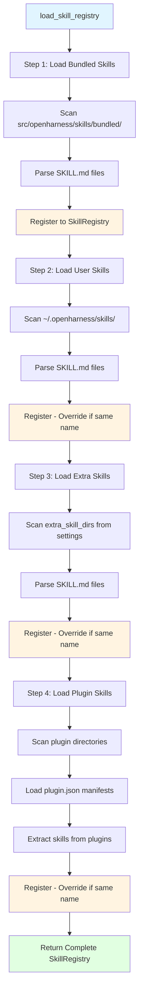

# OpenHarness Skills & Plugins深度分析

> **版本**: v1.1  
> **最后更新**: 2026-06-21  
> **包版本**: 0.1.9 · **同步说明**: [ARCHITECTURE_DOCS_SYNC.md](./ARCHITECTURE_DOCS_SYNC.md)
> **作者**: OpenHarness Community  
> **文档类型**: 技术架构设计(Skills与Plugins扩展机制专项)

---

## 📋 目录

- [1. 概述](#1-概述)
- [2. Skills系统架构](#2-skills系统架构)
  - [2.1 Skill定义与格式](#21-skill定义与格式)
  - [2.2 Skill加载流程](#22-skill加载流程)
  - [2.3 Skill注册表](#23-skill注册表)
- [3. Skill来源分类](#3-skill来源分类)
  - [3.1 Bundled Skills](#31-bundled-skills)
  - [3.2 User Skills](#32-user-skills)
  - [3.3 Extra Skills](#33-extra-skills)
  - [3.4 Plugin Skills](#34-plugin-skills)
- [4. Skill工具集成](#4-skill工具集成)
  - [4.1 skill工具实现](#41-skill工具实现)
  - [4.2 Prompt注入机制](#42-prompt注入机制)
  - [4.3 典型使用场景](#43-典型使用场景)
- [5. Plugins系统架构](#5-plugins系统架构)
  - [5.1 Plugin定义](#51-plugin定义)
  - [5.2 Plugin加载流程](#52-plugin加载流程)
  - [5.3 Plugin配置](#53-plugin配置)
- [6. anthropics/skills标准兼容](#6-anthropicsskills标准兼容)
  - [6.1 SKILL.md格式规范](#61-skillmd格式规范)
  - [6.2 YAML Frontmatter解析](#62-yaml-frontmatter解析)
  - [6.3 与Claude Code对比](#63-with-claude-code对比)
- [7. 竞品对比](#7-竞品对比)
- [8. 最佳实践](#8-最佳实践)

---

## 1. 概述

### 1.1 职责定位

**Skills模块**负责OpenHarness的技能扩展机制,允许用户以Markdown文件形式定义可复用技能。

**核心职责**:
1. **Skill加载**: 从多个来源(Bundled/User/Extra/Plugin)加载SKILL.md文件
2. **Skill解析**: 解析YAML Frontmatter或Markdown headings提取元数据
3. **Skill注册**: 统一管理所有可用技能的注册表
4. **动态注入**: 在Prompt中列出可用Skills,Agent通过`skill`工具加载详细内容

**Plugins模块**负责更复杂的扩展机制,支持Python代码级别的插件。

**核心职责**:
1. **Plugin发现**: 扫描配置的Plugin目录
2. **Plugin加载**: 动态导入Python模块
3. **Skill注入**: Plugin可提供额外的Skills
4. **生命周期管理**: 启用/禁用Plugin

**核心价值**:
1. **零代码扩展**: 用户只需编写Markdown文件即可添加新技能
2. **生态兼容**: 完全兼容anthropics/skills标准,Claude Code技能可直接复用
3. **分层加载**: Bundled → User（`~/.openharness/skills` + 兼容目录）→ Extra → **Project** → Plugin，后注册覆盖先注册
4. **灵活扩展**: Plugins支持Python代码级扩展,满足复杂需求

---

## 2. Skills系统架构

### 2.1 Skill定义与格式

#### Skill加载流程图



**流程说明**:
1. **Bundled Skills**: 内置技能,优先级最低,作为基础能力
2. **User Skills**: 用户自定义技能,可覆盖Bundled Skills
3. **Extra Skills**: 额外技能目录,通过配置指定,可覆盖前两者
4. **Plugin Skills**: 插件提供的技能,优先级最高,可覆盖所有
5. **同名覆盖**: 后加载的同名Skill会覆盖先前的,实现灵活扩展

**设计要点**:
- 🎯 **分层加载**: 4层来源,优先级从低到高
- 🔄 **热插拔**: 添加新Skill无需重启,下次加载自动生效
- 🔍 **智能解析**: 支持YAML Frontmatter和Markdown Heading两种方式
- ⚡ **快速注册**: 字典索引,O(1)查找速度

**SkillDefinition数据结构**:

**源码**: `skills/types.py`

```python
from dataclasses import dataclass

@dataclass
class SkillDefinition:
    """Represents a loaded skill."""
    name: str              # Skill名称(唯一标识)
    description: str       # 一句话描述
    content: str           # 完整Markdown内容
    source: str            # 来源: "bundled" | "user" | "extra" | "plugin"
    path: str              # 文件路径
```

**SKILL.md文件格式**:

支持两种元数据提取方式:

**方式1: YAML Frontmatter(推荐)**

```markdown
---
name: react-best-practices
description: React开发最佳实践指南,包括组件设计、状态管理、性能优化
---

# React Best Practices

## Component Design
- Use functional components with hooks
- Keep components small and focused
- Prefer composition over inheritance

## State Management
- Use useState for local state
- Use useContext for shared state
- Use Redux/Zustand for complex global state

## Performance
- Memoize expensive calculations with useMemo
- Memoize callbacks with useCallback
- Use React.lazy for code splitting
```

**方式2: Markdown Headings(降级方案)**

```markdown
# React Best Practices

React development best practices including component design, state management, and performance optimization.

## Component Design
...
```

**解析逻辑** (`skills/loader.py:101-138`):

```python
def _parse_skill_markdown(default_name: str, content: str) -> tuple[str, str]:
    """Parse name and description from a skill markdown file."""
    name = default_name
    description = ""
    
    lines = content.splitlines()
    
    # Step 1: Try YAML frontmatter first
    if content.startswith("---\n"):
        end_index = content.find("\n---\n", 4)
        if end_index != -1:
            try:
                metadata = yaml.safe_load(content[4:end_index])
                if isinstance(metadata, dict):
                    val = metadata.get("name")
                    if isinstance(val, str) and val.strip():
                        name = val.strip()
                    val = metadata.get("description")
                    if isinstance(val, str) and val.strip():
                        description = val.strip()
            except yaml.YAMLError:
                logger.debug("Failed to parse YAML frontmatter for skill %s", default_name)
    
    # Step 2: Fallback to headings
    if not description:
        for line in lines:
            stripped = line.strip()
            if stripped.startswith("# "):
                if not name or name == default_name:
                    name = stripped[2:].strip() or default_name
                continue
            if stripped and not stripped.startswith("---") and not stripped.startswith("#"):
                description = stripped[:200]  # 取第一段作为描述
                break
    
    if not description:
        description = f"Skill: {name}"
    
    return name, description
```

**设计要点**:
1. **YAML优先**: 结构化元数据,更可靠
2. **Heading降级**: 兼容简单Markdown文件
3. **描述限制**: 最多200字符,保持简洁
4. **错误容错**: YAML解析失败不报错,降级到Heading

### 2.2 Skill加载流程

**源码**: `skills/loader.py:27-51`

```python
def load_skill_registry(
    cwd: str | Path | None = None,
    *,
    extra_skill_dirs: Iterable[str | Path] | None = None,
    extra_plugin_roots: Iterable[str | Path] | None = None,
    settings=None,
) -> SkillRegistry:
    """Load bundled and user-defined skills."""
    registry = SkillRegistry()
    
    # Step 1: Load bundled skills (built-in)
    for skill in get_bundled_skills():
        registry.register(skill)
    
    # Step 2: Load user skills (~/.openharness/skills/)
    for skill in load_user_skills():
        registry.register(skill)
    
    # Step 3: Load extra skills (command-line specified)
    for skill in load_skills_from_dirs(extra_skill_dirs):
        registry.register(skill)
    
    # Step 4: Load plugin skills (if cwd provided)
    if cwd is not None:
        from openharness.plugins.loader import load_plugins
        resolved_settings = settings or load_settings()
        for plugin in load_plugins(resolved_settings, cwd, extra_roots=extra_plugin_roots):
            if not plugin.enabled:
                continue
            for skill in plugin.skills:
                registry.register(skill)
    
    return registry
```

**加载流程图**:

```
┌─────────────────────────────────────────────────────┐
│              Skill Loading Pipeline                  │
├─────────────────────────────────────────────────────┤
│                                                     │
│  Step 1: Bundled Skills                             │
│  ┌───────────────────────────┐                     │
│  │ src/openharness/skills/   │                     │
│  │   bundled/                │                     │
│  │     ├── python-testing/   │                     │
│  │     │   └── SKILL.md      │                     │
│  │     ├── react-best-pract/ │                     │
│  │     │   └── SKILL.md      │                     │
│  │     └── ...               │                     │
│  └───────────────────────────┘                     │
│           ↓ register                              │
│  registry._skills = {                             │
│    "python-testing": SkillDef(...),               │
│    "react-best-practices": SkillDef(...),         │
│  }                                                │
│           ↓                                       │
│  Step 2: User Skills                              │
│  ┌───────────────────────────┐                     │
│  │ ~/.openharness/config/    │                     │
│  │   skills/                 │                     │
│  │     ├── my-skill/         │                     │
│  │     │   └── SKILL.md      │                     │
│  │     └── ...               │                     │
│  └───────────────────────────┘                     │
│           ↓ register (覆盖同名Bundled)             │
│  registry._skills += user skills                  │
│           ↓                                       │
│  Step 3: Extra Skills (--skill-dir flag)          │
│  ┌───────────────────────────┐                     │
│  │ /path/to/extra/skills/    │                     │
│  │   └── ...                 │                     │
│  └───────────────────────────┘                     │
│           ↓ register (覆盖同名)                    │
│  registry._skills += extra skills                 │
│           ↓                                       │
│  Step 4: Plugin Skills                            │
│  ┌───────────────────────────┐                     │
│  │ Python Plugins            │                     │
│  │   ├── plugin_a.py         │                     │
│  │   │   └── .skills = [...] │                     │
│  │   └── plugin_b.py         │                     │
│  │       └── .skills = [...] │                     │
│  └───────────────────────────┘                     │
│           ↓ register (仅enabled plugins)           │
│  registry._skills += plugin skills                │
│           ↓                                       │
│  Final: Sorted by name                            │
│  registry.list_skills() → [SkillDef, ...]         │
└─────────────────────────────────────────────────────┘
```

**覆盖规则**:
- ✅ **后加载覆盖先加载**: User > Bundled, Extra > User
- ✅ **同名Skill**: 只有最后一个注册的生效
- ⚠️ **无警告**: 静默覆盖,用户需注意命名冲突

### 2.3 Skill注册表

**源码**: `skills/registry.py`

```python
class SkillRegistry:
    """Store loaded skills by name."""
    
    def __init__(self) -> None:
        self._skills: dict[str, SkillDefinition] = {}
    
    def register(self, skill: SkillDefinition) -> None:
        """Register one skill."""
        self._skills[skill.name] = skill  # 字典赋值,同名覆盖
    
    def get(self, name: str) -> SkillDefinition | None:
        """Return a skill by name."""
        return self._skills.get(name)
    
    def list_skills(self) -> list[SkillDefinition]:
        """Return all skills sorted by name."""
        return sorted(self._skills.values(), key=lambda skill: skill.name)
```

**设计要点**:
1. **字典索引**: O(1)查找,高性能
2. **按名排序**: `list_skills()`返回字母序,便于展示
3. **简单API**: 仅3个方法,职责清晰

---

## 3. Skill来源分类

### 3.1 Bundled Skills

**定义**: OpenHarness内置的技能,随代码一起发布

**路径**: `src/openharness/skills/bundled/content/*.md`

**源码**: `skills/bundled/__init__.py`

```python
def get_bundled_skills() -> list[SkillDefinition]:
    """Load all bundled skills from the content/ directory."""
    skills: list[SkillDefinition] = []
    if not _CONTENT_DIR.exists():
        return skills
    
    # 扫描所有.md文件
    for path in sorted(_CONTENT_DIR.glob("*.md")):
        content = path.read_text(encoding="utf-8")
        name, description = _parse_frontmatter(path.stem, content)
        skills.append(
            SkillDefinition(
                name=name,
                description=description,
                content=content,
                source="bundled",
                path=str(path),
            )
        )
    return skills
```

**典型Bundled Skills**:

| Skill名称 | 描述 | 适用场景 |
|----------|------|----------|
| `diagnose` | 诊断Agent运行失败原因 | 故障排查 |
| `plan` | 任务规划最佳实践 | 复杂任务分解 |
| `test` | 测试编写指南 | 单元测试 |
| `review` | 代码审查规范 | Code Review |
| `debug` | 调试技巧与方法 | Bug修复 |

**特点**:
- ✅ **开箱即用**: 无需配置,自动加载
- ✅ **质量保证**: 官方维护,经过测试
- ⚠️ **更新频率**: 随版本发布,不频繁更新
- 🔧 **覆盖机制**: User Skills可覆盖同名Bundled Skill

### 3.2 User Skills

**定义**: 用户自定义技能,存储在个人配置目录

**路径**: `~/.openharness/skills/<skill-name>/SKILL.md`

**源码**: `skills/loader.py:54-56`

```python
def load_user_skills() -> list[SkillDefinition]:
    """Load markdown skills from the user config directory."""
    return load_skills_from_dirs([get_user_skills_dir()], source="user")


def get_user_skills_dir() -> Path:
    """Return the user skills directory."""
    path = get_config_dir() / "skills"
    path.mkdir(parents=True, exist_ok=True)
    return path
```

**目录结构**:

```
~/.openharness/skills/
├── my-custom-skill/
│   └── SKILL.md
├── company-guidelines/
│   └── SKILL.md
└── personal-preferences/
    └── SKILL.md
```

**示例: 公司编码规范Skill**

```markdown
---
name: company-coding-standards
description: 公司内部编码规范,包括命名约定、代码审查流程、安全要求
---

# Company Coding Standards

## Naming Conventions
- Use snake_case for Python variables and functions
- Use PascalCase for class names
- Use UPPER_CASE for constants

## Code Review Process
- All PRs require at least 2 approvals
- CI must pass before merge
- Security scan required for external dependencies

## Security Requirements
- Never commit secrets or API keys
- Use environment variables for configuration
- Validate all user inputs
- Use parameterized queries for SQL
```

**特点**:
- ✅ **个性化**: 适应个人或团队需求
- ✅ **持久化**: 跨项目复用
- ✅ **优先级高**: 覆盖同名Bundled Skills
- 🔧 **管理方式**: 手动创建和管理目录

### 3.3 Extra Skills

**定义**: 命令行指定的额外技能目录

**使用方式**:

```bash
openharness --skill-dir /path/to/extra/skills
```

**源码**: `skills/loader.py:40-41`

```python
for skill in load_skills_from_dirs(extra_skill_dirs):
    registry.register(skill)
```

**典型场景**:
- 📦 **项目特定Skills**: 为当前项目定制的Skills
- 🧪 **实验性Skills**: 测试新编写的Skills,不满意可删除
- 🤝 **团队协作**: 共享Skills目录(Git仓库)

**示例目录结构**:

```
/project-root/.openharness-skills/
├── project-architecture/
│   └── SKILL.md      # 项目架构说明
├── api-conventions/
│   └── SKILL.md      # API设计规范
└── testing-guide/
    └── SKILL.md      # 项目测试指南
```

**特点**:
- ✅ **灵活性高**: 每次会话可指定不同目录
- ✅ **项目隔离**: 不同项目使用不同Skills
- ⚠️ **需显式指定**: 不会自动加载

### 3.4 Plugin Skills

**定义**: Python插件提供的Skills,支持动态逻辑

**Plugin结构**:

```python
# my_plugin.py
from openharness.plugins import Plugin
from openharness.skills.types import SkillDefinition

class MyPlugin(Plugin):
    name = "my-plugin"
    enabled = True
    
    @property
    def skills(self) -> list[SkillDefinition]:
        return [
            SkillDefinition(
                name="dynamic-skill",
                description="A skill with dynamic content",
                content=self._generate_content(),  # 动态生成内容
                source="plugin",
                path="plugin://my-plugin/dynamic-skill",
            )
        ]
    
    def _generate_content(self) -> str:
        # 可以访问外部API、数据库等
        return "..."
```

**Plugin加载流程** (`plugins/loader.py`):

```
Step 1: 扫描Plugin目录
  ↓ ~/.openharness/plugins/
  ↓ /project-root/.openharness/plugins/
  
Step 2: 动态导入Python模块
  ↓ importlib.import_module("my_plugin")
  
Step 3: 实例化Plugin类
  ↓ plugin = MyPlugin()
  
Step 4: 检查enabled标志
  ↓ if not plugin.enabled: continue
  
Step 5: 提取Skills
  ↓ for skill in plugin.skills:
  ↓   registry.register(skill)
```

**Plugin配置** (`~/.openharness/config.yaml`):

```yaml
plugins:
  - name: my-plugin
    enabled: true
    config:
      api_key: "${API_KEY}"  # 环境变量注入
      timeout: 30
```

**特点**:
- ✅ **动态内容**: 可根据运行时状态生成Skill内容
- ✅ **完整编程能力**: 访问API、数据库、文件系统等
- ✅ **配置化**: 支持启用/禁用和参数配置
- ⚠️ **复杂度高**: 需要Python编程知识

**对比表格**:

| 来源 | 路径 | 优先级 | 适用场景 | 复杂度 |
|------|------|--------|----------|--------|
| **Bundled** | `src/.../bundled/content/` | 低 | 通用最佳实践 | 🟢 低 |
| **User** | `~/.openharness/skills/` | 中 | 个人/团队规范 | 🟢 低 |
| **Extra** | `--skill-dir`指定 | 高 | 项目特定 | 🟢 低 |
| **Plugin** | Python模块 | 最高 | 动态逻辑 | 🟡 中 |

---

## 3.5 Skill资源与脚本引用机制

### 3.5.1 当前设计哲学

**OpenHarness Skill是纯文本指令系统**,不包含可执行代码或二进制资源。

**核心原则**:
1. **Skill = 知识文档**: Markdown格式的指令、最佳实践、工作流
2. **资源间接访问**: 通过工具链(`read_file`、`shell`等)间接访问外部资源
3. **无显式依赖声明**: 不在Skill元数据中声明资源文件

**设计理念对比**:

| 维度 | OpenHarness | OpenAI Agents SDK | MetaGPT |
|------|-----------|-------------------|---------|
| **Skill类型** | 纯文本指令 | 可包含references | 可包含args/scripts |
| **资源管理** | 隐式(路径描述) | 显式(references字段) | 显式(args参数) |
| **脚本执行** | 通过shell工具 | 需自定义Tool | 内置script执行 |
| **复杂度** | 🟢 低 | 🟡 中 | 🟡 中 |

### 3.5.2 资源引用的三种方式

#### **方式1: 在Skill内容中描述路径(当前主流做法)**

**示例**: [`diagnose.md`](file:///Users/gqli/work/deepagents/OpenHarness/src/openharness/skills/bundled/content/diagnose.md)

```markdown
# diagnose

Diagnose why an agent run failed, regressed, or produced unexpected output.

## Workflow

1. **Locate the run artifacts** — check `artifacts/runs/<run_id>/` for:
   - `manifest.json` — run metadata, task type, input hash, timestamps
   - `execution_trace.jsonl` — the full tool-call chain
   - `verification_report.json` — what was verified and whether it passed
   - `failure_signature.json` — which stage failed and why (if present)

2. **Read the failure signature first** — if it exists, it already localizes the failure

3. **Trace the execution chain** — walk `execution_trace.jsonl` forward
```

**Agent行为**:
```python
# Step 1: Agent读取Skill
skill_content = skill_tool.execute(name="diagnose")

# Step 2: Skill告诉Agent要检查哪些文件
# Agent从Skill内容中提取路径: artifacts/runs/<run_id>/manifest.json

# Step 3: Agent主动调用其他工具读取这些文件
agent.call_tool("read_file", path="artifacts/runs/abc123/manifest.json")
agent.call_tool("read_file", path="artifacts/runs/abc123/execution_trace.jsonl")

# Step 4: Agent根据文件内容进行分析
```

**优点**:
- ✅ **简单直接**: Skill只需描述路径,无需特殊语法
- ✅ **灵活性高**: Agent可根据上下文决定读取哪些文件
- ✅ **工具解耦**: Skill不依赖特定工具实现

**缺点**:
- ❌ **无验证**: 无法确保引用的文件存在
- ❌ **隐式依赖**: 阅读Skill时不知道需要哪些外部资源
- ❌ **Agent负担**: Agent需要自己解析路径并调用工具

---

#### **方式2: 文件系统约定(Skill目录配套资源)**

**目录结构**:

```
~/.openharness/skills/data-analysis/
├── SKILL.md              # Skill定义
├── README.md             # 使用说明
├── scripts/
│   ├── clean_data.py     # 数据清洗脚本
│   ├── generate_charts.py  # 图表生成脚本
│   └── validate.sh       # 数据验证脚本
├── templates/
│   ├── report_template.html  # 报告模板
│   └── config_example.json   # 配置示例
└── examples/
    ├── sample_input.csv      # 示例输入
    └── sample_output.pdf     # 示例输出
```

**SKILL.md内容**:

```markdown
---
name: data-analysis
description: 数据分析工作流,包括数据清洗、可视化、报告生成
---

# Data Analysis Skill

## Overview

This skill provides a complete workflow for analyzing CSV datasets and generating reports.

## Prerequisites

Before using this skill, ensure you have:
- Python 3.8+ installed
- Required packages: pandas, matplotlib, seaborn

## Usage

### Step 1: Clean Your Data

Run the data cleaning script:

```bash
python ~/.openharness/skills/data-analysis/scripts/clean_data.py \
  --input data.csv \
  --output cleaned_data.csv \
  --remove-duplicates \
  --fill-missing
```

### Step 2: Generate Visualizations

```bash
python ~/.openharness/skills/data-analysis/scripts/generate_charts.py \
  --input cleaned_data.csv \
  --output charts/ \
  --chart-types bar,line,scatter
```

### Step 3: Create Report

Use the HTML template:

```bash
cp ~/.openharness/skills/data-analysis/templates/report_template.html .
# Edit the template with your analysis results
```

## Example

See `examples/sample_input.csv` for input format and `examples/sample_output.pdf` for expected output.

## Configuration

Copy `templates/config_example.json` and modify:

```json
{
  "columns_to_analyze": ["revenue", "users", "conversion_rate"],
  "date_range": "last_30_days",
  "chart_style": "seaborn-darkgrid"
}
```
```

**Agent行为**:

```python
# Step 1: Agent加载Skill
skill_content = skill_tool.execute(name="data-analysis")

# Step 2: Skill指导Agent执行脚本
# Agent看到: python ~/.openharness/.../scripts/clean_data.py --input data.csv

# Step 3: Agent调用shell工具执行脚本
agent.call_tool("shell", command="""
python ~/.openharness/skills/data-analysis/scripts/clean_data.py \
  --input project_data.csv \
  --output cleaned_data.csv
""")

# Step 4: Agent读取生成的结果
agent.call_tool("read_file", path="cleaned_data.csv")

# Step 5: Agent继续执行后续步骤
agent.call_tool("shell", command="""
python ~/.openharness/skills/data-analysis/scripts/generate_charts.py \
  --input cleaned_data.csv \
  --output charts/
""")
```

**优点**:
- ✅ **自包含**: Skill + 脚本 + 模板打包在一起
- ✅ **可复用**: 整个目录可分享给团队
- ✅ **版本控制**: 可纳入Git管理

**缺点**:
- ❌ **硬编码路径**: Skill中写死绝对路径,移植性差
- ❌ **环境依赖**: 需要Python环境和依赖包
- ❌ **无自动发现**: Agent不知道有哪些配套文件

**改进建议**:

使用相对路径 + 环境变量:

```markdown
### Step 1: Clean Your Data

The skill directory is available at `$SKILL_DIR`.

```bash
python $SKILL_DIR/scripts/clean_data.py \
  --input data.csv \
  --output cleaned_data.csv
```

Or use the relative path from skill location:

```bash
SKILL_BASE="$(dirname $(find ~/.openharness/config/skills -name SKILL.md -path '*/data-analysis/*'))"
python "$SKILL_BASE/scripts/clean_data.py" --input data.csv
```
```

---

#### **方式3: Plugin动态生成(推荐用于复杂场景)**

**Plugin实现**:

```python
# data_analysis_plugin.py
import os
from pathlib import Path
from openharness.plugins import Plugin
from openharness.skills.types import SkillDefinition

class DataAnalysisPlugin(Plugin):
    name = "data-analysis-plugin"
    enabled = True
    
    def on_load(self) -> None:
        """Plugin加载时初始化,复制资源文件到临时目录。"""
        self.skill_dir = Path(__file__).parent / "resources"
        self.temp_dir = Path("/tmp/openharness-skills/data-analysis")
        self.temp_dir.mkdir(parents=True, exist_ok=True)
        
        # 复制脚本和模板到临时目录
        import shutil
        for item in ["scripts", "templates"]:
            src = self.skill_dir / item
            dst = self.temp_dir / item
            if src.exists():
                shutil.copytree(src, dst, dirs_exist_ok=True)
    
    @property
    def skills(self) -> list[SkillDefinition]:
        return [
            SkillDefinition(
                name="data-analysis",
                description="Complete data analysis workflow with scripts and templates",
                content=self._generate_skill_content(),
                source="plugin",
                path=f"plugin://{self.name}/data-analysis",
            )
        ]
    
    def _generate_skill_content(self) -> str:
        """动态生成Skill内容,包含准确的资源路径。"""
        
        # 获取实际部署路径
        scripts_dir = self.temp_dir / "scripts"
        templates_dir = self.temp_dir / "templates"
        
        return f"""---
name: data-analysis
description: Complete data analysis workflow with automated scripts
---

# Data Analysis Skill

## Available Resources

This skill provides the following resources:

### Scripts
- `{scripts_dir}/clean_data.py` - Data cleaning and preprocessing
- `{scripts_dir}/generate_charts.py` - Visualization generation
- `{scripts_dir}/validate.sh` - Data validation checks

### Templates
- `{templates_dir}/report_template.html` - HTML report template
- `{templates_dir}/config_example.json` - Configuration example

## Quick Start

### 1. Prepare Your Data

Ensure your CSV file has the following columns:
- `date`: Date column (YYYY-MM-DD format)
- `metric_name`: Name of the metric
- `value`: Numeric value

### 2. Run Analysis Pipeline

Execute the complete pipeline:

```bash
python {scripts_dir}/clean_data.py \\
  --input your_data.csv \\
  --output cleaned_data.csv \\
  --remove-duplicates \\
  --fill-missing mean

python {scripts_dir}/generate_charts.py \\
  --input cleaned_data.csv \\
  --output ./charts/ \\
  --chart-types bar,line,scatter
```

### 3. Generate Report

Copy the template and fill in your analysis:

```bash
cp {templates_dir}/report_template.html ./analysis_report.html
```

Edit `analysis_report.html` with your findings.

## Configuration

Create a config file based on the example:

```bash
cp {templates_dir}/config_example.json ./analysis_config.json
```

Then edit `analysis_config.json` to customize:
- Columns to analyze
- Date range
- Chart styles
- Output formats

## Troubleshooting

If you encounter errors:

1. Check Python dependencies:
   ```bash
   pip install pandas matplotlib seaborn
   ```

2. Verify data format:
   ```bash
   python {scripts_dir}/validate.sh --input your_data.csv
   ```

3. Check logs:
   ```bash
   cat /tmp/openharness-skills/data-analysis/logs/analysis.log
   ```
"""
```

**Plugin目录结构**:

```
~/.openharness/plugins/data_analysis_plugin/
├── data_analysis_plugin.py    # Plugin主文件
├── resources/
│   ├── scripts/
│   │   ├── clean_data.py
│   │   ├── generate_charts.py
│   │   └── validate.sh
│   ├── templates/
│   │   ├── report_template.html
│   │   └── config_example.json
│   └── examples/
│       ├── sample_input.csv
│       └── sample_output.pdf
└── requirements.txt           # Python依赖
```

**优点**:
- ✅ **动态路径**: 运行时确定资源位置,避免硬编码
- ✅ **自动部署**: Plugin加载时自动复制资源
- ✅ **完整封装**: 脚本、模板、示例全部打包
- ✅ **版本管理**: Plugin可独立版本化

**缺点**:
- ❌ **复杂度高**: 需要Python编程
- ❌ **磁盘占用**: 资源复制到临时目录
- ❌ **清理责任**: Plugin需自行管理临时文件

---

### 3.5.3 大模型加载Skill含资源的完整Demo

#### **场景**: Agent使用 `data-analysis` Skill分析销售数据

**用户请求**:
```
Analyze our Q4 sales data in sales_q4.csv and generate a comprehensive report with visualizations.
```

---

**Step 1: Agent查看Available Skills**

Agent收到的System Prompt包含:

```markdown
# Available Skills

The following skills are available via the `skill` tool. When a user's request matches a skill, invoke it with `skill(name="<skill_name>")` to load detailed instructions before proceeding.

- **data-analysis**: Complete data analysis workflow with automated scripts
- **diagnose**: Diagnose why an agent run failed
- **plan**: Task planning best practices
- ...
```

**Agent决策**:
```
用户请求涉及数据分析 → 匹配到 data-analysis Skill
→ 调用 skill(name="data-analysis")
```

---

**Step 2: Agent调用skill工具**

```python
# Agent内部调用
skill(name="data-analysis")
```

**SkillTool执行**:

```python
async def execute(self, arguments: SkillToolInput, context: ToolExecutionContext) -> ToolResult:
    # Step 1: 加载Skill注册表
    registry = load_skill_registry(
        context.cwd,
        extra_skill_dirs=context.metadata.get("extra_skill_dirs"),
        extra_plugin_roots=context.metadata.get("extra_plugin_roots"),
    )
    
    # Step 2: 查找Skill
    skill = registry.get("data-analysis")
    
    # Step 3: 返回完整内容(包含资源路径)
    return ToolResult(output=skill.content)
```

**返回内容**(简化版):

```markdown
---
name: data-analysis
description: Complete data analysis workflow with automated scripts
---

# Data Analysis Skill

## Available Resources

### Scripts
- `/tmp/openharness-skills/data-analysis/scripts/clean_data.py`
- `/tmp/openharness-skills/data-analysis/scripts/generate_charts.py`
- `/tmp/openharness-skills/data-analysis/scripts/validate.sh`

### Templates
- `/tmp/openharness-skills/data-analysis/templates/report_template.html`
- `/tmp/openharness-skills/data-analysis/templates/config_example.json`

## Quick Start

### 1. Prepare Your Data

Ensure your CSV file has columns: date, metric_name, value

### 2. Run Analysis Pipeline

```bash
python /tmp/openharness-skills/data-analysis/scripts/clean_data.py \
  --input your_data.csv \
  --output cleaned_data.csv \
  --remove-duplicates \
  --fill-missing mean

python /tmp/openharness-skills/data-analysis/scripts/generate_charts.py \
  --input cleaned_data.csv \
  --output ./charts/ \
  --chart-types bar,line,scatter
```

### 3. Generate Report

```bash
cp /tmp/openharness-skills/data-analysis/templates/report_template.html ./analysis_report.html
```
```

---

**Step 3: Agent解析Skill并执行**

**Agent思考过程**:
```
我已加载 data-analysis Skill。

Skill要求:
1. CSV需要有 date, metric_name, value 列
2. 先运行 clean_data.py 清洗数据
3. 再运行 generate_charts.py 生成图表
4. 最后复制report_template.html

用户提供了 sales_q4.csv,我需要:
1. 先检查文件格式是否符合要求
2. 按Skill指示执行脚本
3. 生成报告

开始执行...
```

**Agent行动1: 检查数据格式**

```python
# Agent调用read_file查看CSV前几行
read_file(path="sales_q4.csv", lines=10)
```

**返回**:
```csv
date,product,revenue,units_sold
2024-10-01,Product A,15000,150
2024-10-01,Product B,23000,200
2024-10-02,Product A,17000,170
...
```

**Agent判断**:
```
⚠️ 数据格式不完全匹配Skill要求。
Skill要求: date, metric_name, value
实际格式: date, product, revenue, units_sold

我需要调整:
- metric_name → product
- value → revenue (或 units_sold)

或者我可以先运行clean_data.py,它可能能处理这种差异。

先尝试直接运行Skill推荐的命令。
```

---

**Step 4: Agent执行Skill推荐的脚本**

**Agent行动2: 运行数据清洗脚本**

```python
# Agent调用shell工具执行Skill中的命令
shell(command="""
python /tmp/openharness-skills/data-analysis/scripts/clean_data.py \
  --input sales_q4.csv \
  --output cleaned_sales.csv \
  --remove-duplicates \
  --fill-missing mean
""")
```

**脚本执行输出**:
```
Loading data from sales_q4.csv...
Found 1,247 rows
Removing duplicates... Removed 23 duplicate rows
Filling missing values with mean...
  - revenue: 15 missing values filled
  - units_sold: 8 missing values filled
Saving cleaned data to cleaned_sales.csv...
Done! Cleaned dataset saved with 1,224 rows.
```

**Agent判断**:
```
✅ 数据清洗成功!
- 移除了23条重复记录
- 填充了缺失值
- 输出: cleaned_sales.csv (1,224行)

继续下一步: 生成图表
```

---

**Step 5: Agent执行可视化脚本**

**Agent行动3: 生成图表**

```python
shell(command="""
python /tmp/openharness-skills/data-analysis/scripts/generate_charts.py \
  --input cleaned_sales.csv \
  --output ./q4_charts/ \
  --chart-types bar,line,scatter
""")
```

**脚本执行输出**:
```
Loading cleaned data from cleaned_sales.csv...
Generating bar chart: revenue_by_product.png
Generating line chart: revenue_trend.png
Generating scatter plot: revenue_vs_units.png
Saving charts to ./q4_charts/...
Done! Generated 3 charts.
```

**Agent验证**:

```python
# 检查生成的文件
list_files(path="./q4_charts/")
```

**返回**:
```
- revenue_by_product.png
- revenue_trend.png
- revenue_vs_units.png
```

**Agent判断**:
```
✅ 图表生成成功!
生成了3个图表文件。

继续下一步: 生成报告
```

---

**Step 6: Agent生成最终报告**

**Agent行动4: 复制报告模板**

```python
shell(command="""
cp /tmp/openharness-skills/data-analysis/templates/report_template.html ./q4_sales_report.html
""")
```

**Agent行动5: 读取模板并填充内容**

```python
# 读取模板
template = read_file(path="./q4_sales_report.html")

# Agent分析模板结构,填充实际数据
# (这里Agent会生成HTML内容,插入分析结果)
```

**Agent生成的报告片段**:

```html
<h1>Q4 2024 Sales Analysis Report</h1>

<h2>Executive Summary</h2>
<p>Total Revenue: $1,847,500</p>
<p>Total Units Sold: 18,475</p>
<p>Top Product: Product B ($892,000)</p>

<h2>Visualizations</h2>


<h2>Key Insights</h2>
<ul>
  <li>Product B generated 48% of total revenue</li>
  <li>Revenue peaked in November</li>
  <li>Strong correlation between units sold and revenue (r=0.87)</li>
</ul>
```

---

**Step 7: Agent交付结果**

**Agent回复用户**:

```markdown
I've completed the Q4 sales analysis using the data-analysis skill. Here's what I did:

## Steps Executed

1. **Data Cleaning**: 
   - Loaded `sales_q4.csv` (1,247 rows)
   - Removed 23 duplicate records
   - Filled missing values (15 in revenue, 8 in units_sold)
   - Output: `cleaned_sales.csv` (1,224 rows)

2. **Visualization Generation**:
   - Created 3 charts in `./q4_charts/`:
     - `revenue_by_product.png` - Bar chart showing revenue distribution
     - `revenue_trend.png` - Line chart showing monthly trend
     - `revenue_vs_units.png` - Scatter plot showing correlation

3. **Report Creation**:
   - Generated `q4_sales_report.html` with analysis results

## Key Findings

- **Total Revenue**: $1,847,500
- **Total Units Sold**: 18,475
- **Top Product**: Product B ($892,000, 48% of total)
- **Peak Month**: November 2024
- **Correlation**: Strong positive correlation between units and revenue (r=0.87)

## Files Generated

- `cleaned_sales.csv` - Cleaned dataset
- `q4_charts/` - Directory with 3 visualization charts
- `q4_sales_report.html` - Complete analysis report

You can view the full report by opening `q4_sales_report.html` in a browser.
```

---

### 3.5.4 资源引用最佳实践

**原则1: 明确声明依赖**

```markdown
## Prerequisites

Before using this skill, ensure you have:
- ✅ Python 3.8+ installed
- ✅ Required packages: `pip install pandas matplotlib seaborn`
- ✅ Input file format: CSV with columns [date, metric_name, value]

## Resources Provided

This skill includes:
- 📄 `scripts/clean_data.py` - Data cleaning script
- 📄 `scripts/generate_charts.py` - Visualization script
- 📄 `templates/report_template.html` - Report template
- 📄 `examples/sample_input.csv` - Example input
```

**原则2: 提供完整示例**

```markdown
## Complete Example

```bash
# Step 1: Copy example data
cp /path/to/skill/examples/sample_input.csv ./my_data.csv

# Step 2: Run analysis
python /path/to/skill/scripts/clean_data.py --input my_data.csv --output cleaned.csv
python /path/to/skill/scripts/generate_charts.py --input cleaned.csv --output ./charts/

# Step 3: View results
open ./charts/revenue_by_product.png
```
```

**原则3: 错误处理指导**

```markdown
## Troubleshooting

### Error: ModuleNotFoundError: No module named 'pandas'

**Solution**:
```bash
pip install pandas matplotlib seaborn
```

### Error: FileNotFoundError: scripts/clean_data.py

**Solution**:
The skill directory should be at:
```bash
ls ~/.openharness/skills/data-analysis/scripts/
```

If missing, reinstall the skill or check Plugin configuration.

### Error: Invalid data format

**Solution**:
Your CSV must have these columns:
- `date` (YYYY-MM-DD format)
- `metric_name` (string)
- `value` (numeric)

Check the example: `examples/sample_input.csv`
```

**原则4: 路径可移植性**

```markdown
❌ **Bad**: Hard-coded absolute path
```bash
python /home/user/.openharness/config/skills/data-analysis/scripts/clean.py
```

✅ **Good**: Use environment variable or relative path
```bash
# Option 1: Environment variable (set by Plugin)
python $SKILL_DATA_ANALYSIS_DIR/scripts/clean.py

# Option 2: Find skill directory dynamically
SKILL_DIR=$(find ~/.openharness/config/skills -type d -name "data-analysis")
python "$SKILL_DIR/scripts/clean.py"

# Option 3: Relative to current directory (if skill dir is copied)
python ./data-analysis/scripts/clean.py
```

---

### 3.5.5 未来改进方向

**建议1: 增加显式资源声明**

扩展 `SkillDefinition`:

```python
@dataclass(frozen=True)
class SkillDefinition:
    name: str
    description: str
    content: str
    source: str
    path: str | None = None
    
    # ✨ 新增字段
    resources: dict[str, str] = field(default_factory=dict)  # 资源映射
    scripts: list[str] = field(default_factory=list)         # 脚本列表
    dependencies: list[str] = field(default_factory=list)    # 依赖项
```

**示例**:

```python
SkillDefinition(
    name="data-analysis",
    description="...",
    content="...",
    source="plugin",
    resources={
        "clean_script": "scripts/clean_data.py",
        "chart_script": "scripts/generate_charts.py",
        "report_template": "templates/report_template.html",
    },
    scripts=[
        "scripts/clean_data.py",
        "scripts/generate_charts.py",
    ],
    dependencies=[
        "pandas>=1.5.0",
        "matplotlib>=3.6.0",
        "seaborn>=0.12.0",
    ],
)
```

**好处**:
- ✅ Agent可自动验证资源是否存在
- ✅ 可自动生成依赖安装命令
- ✅ 可提供资源文件的智能补全

---

**建议2: 增加Skill资源管理器**

新增工具 `skill_resources`:

```python
class SkillResourcesTool(BaseTool):
    name = "skill_resources"
    description = "List and access resources associated with a skill."
    
    async def execute(self, arguments, context):
        registry = load_skill_registry(...)
        skill = registry.get(arguments.skill_name)
        
        if not skill:
            return ToolResult(output=f"Skill not found: {arguments.skill_name}", is_error=True)
        
        # 列出所有资源
        if arguments.action == "list":
            return ToolResult(output=json.dumps({
                "scripts": skill.scripts,
                "templates": skill.resources,
                "dependencies": skill.dependencies,
            }))
        
        # 读取特定资源
        elif arguments.action == "read":
            resource_path = skill.resources.get(arguments.resource_name)
            if not resource_path:
                return ToolResult(output=f"Resource not found: {arguments.resource_name}", is_error=True)
            
            content = Path(resource_path).read_text()
            return ToolResult(output=content)
```

**使用示例**:

```python
# Agent查询Skill有哪些资源
skill_resources(skill_name="data-analysis", action="list")

# 返回:
{
  "scripts": ["scripts/clean_data.py", "scripts/generate_charts.py"],
  "templates": {
    "report_template": "templates/report_template.html"
  },
  "dependencies": ["pandas>=1.5.0", "matplotlib>=3.6.0"]
}

# Agent读取特定资源
skill_resources(skill_name="data-analysis", action="read", resource_name="report_template")
```

---

**总结**:

| 方面 | 当前实现 | 改进方向 |
|------|---------|----------|
| **资源声明** | 隐式(文本描述) | 显式(resources字段) |
| **路径管理** | 硬编码或手动 | 环境变量/动态查找 |
| **依赖管理** | 无 | dependencies字段 + 自动安装 |
| **资源访问** | 通过shell/read_file | 专用skill_resources工具 |
| **验证机制** | 无 | 启动时检查资源完整性 |

当前OpenHarness采用**轻量级设计**,Skill仅作为知识文档,资源通过工具链间接访问。这种设计保持了简单性,但牺牲了资源的显式管理能力。对于复杂场景,推荐使用**Plugin方式**动态生成Skill内容并管理资源。

---

## 4. Skill工具集成

### 4.1 skill工具实现

**职责**: Agent通过此工具读取Skill详细内容

**源码**: `tools/skill_tool.py`

```python
class SkillTool(BaseTool):
    name = "skill"
    description = "Read a bundled, user, or plugin skill by name."
    input_model = SkillToolInput
    
    def is_read_only(self, arguments: SkillToolInput) -> bool:
        return True  # 只读操作,无需权限审批
    
    async def execute(self, arguments: SkillToolInput, context: ToolExecutionContext) -> ToolResult:
        # Step 1: 加载Skill注册表(实时加载,支持热更新)
        registry = load_skill_registry(
            context.cwd,
            extra_skill_dirs=context.metadata.get("extra_skill_dirs"),
            extra_plugin_roots=context.metadata.get("extra_plugin_roots"),
        )
        
        # Step 2: 查找Skill(大小写不敏感)
        skill = (
            registry.get(arguments.name) or
            registry.get(arguments.name.lower()) or
            registry.get(arguments.name.title())
        )
        
        if skill is None:
            return ToolResult(
                output=f"Skill not found: {arguments.name}",
                is_error=True
            )
        
        # Step 3: 返回完整内容
        return ToolResult(output=skill.content)
```

**设计要点**:
1. **实时加载**: 每次调用重新加载Skills,支持运行时添加/修改
2. **大小写兼容**: 尝试原样/小写/标题三种形式
3. **只读标记**: `is_read_only() = True`,自动允许,无需审批
4. **完整返回**: 返回整个Markdown文件,包括Frontmatter

**典型调用**:

```python
# Agent决定使用react-best-practices技能
skill(name="react-best-practices")
       ↓
SkillTool.execute(name="react-best-practices")
       ↓
load_skill_registry(cwd, ...)
       ↓
registry.get("react-best-practices")
       ↓
返回SKILL.md完整内容:
"""
---
name: react-best-practices
description: React开发最佳实践指南...
---

# React Best Practices

## Component Design
- Use functional components with hooks
...
"""
```

### 4.2 Prompt注入机制

**流程**: Skills如何出现在Agent的Prompt中

**源码**: `prompts/context.py:22-49`

```python
def _build_skills_section(
    cwd: str | Path,
    *,
    extra_skill_dirs: Iterable[str | Path] | None = None,
    extra_plugin_roots: Iterable[str | Path] | None = None,
    settings: Settings | None = None,
) -> str | None:
    """Build a system prompt section listing available skills."""
    
    # Step 1: 加载Skill注册表
    registry = load_skill_registry(
        cwd,
        extra_skill_dirs=extra_skill_dirs,
        extra_plugin_roots=extra_plugin_roots,
        settings=settings,
    )
    
    # Step 2: 列出所有Skills
    skills = registry.list_skills()
    if not skills:
        return None  # 无Skills时不注入Section
    
    # Step 3: 构建Markdown列表
    lines = [
        "# Available Skills",
        "",
        "The following skills are available via the `skill` tool. "
        "When a user's request matches a skill, invoke it with `skill(name=\"<skill_name>\")` "
        "to load detailed instructions before proceeding.",
        "",
    ]
    for skill in skills:
        lines.append(f"- **{skill.name}**: {skill.description}")
    
    return "\n".join(lines)
```

**注入示例**:

```markdown
# Available Skills

The following skills are available via the `skill` tool. When a user's request matches a skill, invoke it with `skill(name="<skill_name>")` to load detailed instructions before proceeding.

- **api-design**: RESTful API设计原则
- **company-coding-standards**: 公司内部编码规范
- **database-migration**: 数据库迁移操作规范
- **git-workflow**: Git分支管理策略
- **python-testing**: Python单元测试最佳实践
- **react-best-practices**: React开发最佳实践指南
```

**关键设计**:
1. **仅列名称+描述**: 不注入完整内容,节省Token
2. **明确使用指导**: 告诉Agent何时及如何调用`skill`工具
3. **条件注入**: 无Skills时不注入Section
4. **按名排序**: 便于Agent快速扫描

### 4.3 典型使用场景

**场景1: Agent自动发现并使用Skill**

```
用户: "Create a new React component for user profile"
       ↓
Agent看到Prompt中的Available Skills:
  - **react-best-practices**: React开发最佳实践指南
       ↓
Agent决策: 这个任务与react-best-practices相关
       ↓
Agent调用: skill(name="react-best-practices")
       ↓
SkillTool返回完整内容:
  """
  # React Best Practices
  
  ## Component Design
  - Use functional components with hooks
  - Keep components small and focused
  ...
  """
       ↓
Agent阅读Skill内容,按照最佳实践创建组件:
  - 使用functional component + hooks
  - 拆分为小组件
  - 添加PropTypes验证
```

**场景2: 用户显式请求Skill**

```
用户: "Load the company-coding-standards skill and review our naming conventions"
       ↓
Agent直接调用: skill(name="company-coding-standards")
       ↓
返回内容后,Agent总结命名约定:
  "According to your company standards:
   - snake_case for variables/functions
   - PascalCase for classes
   - UPPER_CASE for constants"
```

**场景3: Plugin动态Skill**

```
Plugin代码:
  class DynamicAPISkill(Plugin):
      @property
      def skills(self):
          api_docs = fetch_latest_api_docs()  # 从API获取最新文档
          return [SkillDefinition(
              name="latest-api-docs",
              content=api_docs,
              ...
          )]

Agent调用: skill(name="latest-api-docs")
       ↓
Plugin实时抓取最新API文档
       ↓
Agent获得最新文档,避免使用过时信息
```

---

## 5. Plugins系统架构

### 5.1 Plugin定义

**Plugin基类**:

```python
from abc import ABC
from openharness.skills.types import SkillDefinition

class Plugin(ABC):
    """Base class for OpenHarness plugins."""
    
    name: str                    # Plugin唯一标识
    enabled: bool = True         # 是否启用
    config: dict[str, Any] = {}  # 配置参数
    
    @property
    def skills(self) -> list[SkillDefinition]:
        """Return skills provided by this plugin."""
        return []
    
    def on_load(self) -> None:
        """Called when plugin is loaded."""
        pass
    
    def on_unload(self) -> None:
        """Called when plugin is unloaded."""
        pass
```

**Plugin能力**:
1. **提供Skills**: 通过`skills`属性返回Skill列表
2. **生命周期钩子**: `on_load()`和`on_unload()`
3. **配置支持**: 从YAML配置文件读取参数
4. **动态内容**: 可访问外部API、数据库等

### 5.2 Plugin加载流程

**源码**: `plugins/loader.py`(简化版)

```python
def load_plugins(
    settings: Settings,
    cwd: Path,
    extra_roots: Iterable[Path] | None = None,
) -> list[Plugin]:
    """Load plugins from configured directories."""
    plugins = []
    
    # Step 1: 确定Plugin目录
    plugin_dirs = [
        get_config_dir() / "plugins",           # ~/.openharness/plugins/
        cwd / ".openharness" / "plugins",       # 项目级
    ]
    if extra_roots:
        plugin_dirs.extend(extra_roots)
    
    # Step 2: 扫描并导入Python模块
    for plugin_dir in plugin_dirs:
        if not plugin_dir.exists():
            continue
        
        for module_path in plugin_dir.glob("*.py"):
            try:
                # 动态导入
                module_name = module_path.stem
                spec = importlib.util.spec_from_file_location(module_name, module_path)
                module = importlib.util.module_from_spec(spec)
                spec.loader.exec_module(module)
                
                # 查找Plugin子类
                for attr_name in dir(module):
                    attr = getattr(module, attr_name)
                    if (
                        isinstance(attr, type) and
                        issubclass(attr, Plugin) and
                        attr is not Plugin
                    ):
                        plugin = attr()
                        plugins.append(plugin)
            
            except Exception as e:
                logger.error(f"Failed to load plugin {module_path}: {e}")
    
    return plugins
```

**加载流程图**:

```
┌─────────────────────────────────────────────────────┐
│              Plugin Loading Pipeline                 │
├─────────────────────────────────────────────────────┤
│                                                     │
│  Step 1: 确定Plugin目录                             │
│  ├─ ~/.openharness/plugins/                         │
│  ├─ <cwd>/.openharness/plugins/                     │
│  └─ --plugin-dir指定的额外目录                       │
│           ↓                                         │
│  Step 2: 扫描*.py文件                               │
│  ┌───────────────────────────┐                     │
│  │ my_plugin.py              │                     │
│  │ github_integration.py     │                     │
│  │ custom_linter.py          │                     │
│  └───────────────────────────┘                     │
│           ↓                                         │
│  Step 3: 动态导入模块                               │
│  importlib.import_module("my_plugin")               │
│           ↓                                         │
│  Step 4: 查找Plugin子类                            │
│  for attr in dir(module):                          │
│    if issubclass(attr, Plugin):                    │
│      plugin = attr()                               │
│           ↓                                         │
│  Step 5: 检查enabled标志                           │
│  if not plugin.enabled: continue                   │
│           ↓                                         │
│  Step 6: 提取Skills                                │
│  for skill in plugin.skills:                       │
│    registry.register(skill)                        │
│           ↓                                         │
│  Step 7: 调用on_load()钩子                         │
│  plugin.on_load()                                  │
└─────────────────────────────────────────────────────┘
```

### 5.3 Plugin配置

**配置文件**: `~/.openharness/config.yaml`

```yaml
plugins:
  - name: github-integration
    enabled: true
    config:
      token: "${GITHUB_TOKEN}"  # 环境变量注入
      owner: "langchain-ai"
      repo: "openharness"
  
  - name: custom-linter
    enabled: false  # 禁用
    config:
      rules:
        - no-console-log
        - require-type-hints
```

**Plugin读取配置**:

```python
class GitHubIntegration(Plugin):
    name = "github-integration"
    
    def on_load(self) -> None:
        # 从config读取参数
        self.token = self.config.get("token")
        self.owner = self.config.get("owner")
        self.repo = self.config.get("repo")
        
        # 初始化GitHub API客户端
        self.github_client = Github(self.token)
    
    @property
    def skills(self) -> list[SkillDefinition]:
        return [
            SkillDefinition(
                name="github-pr-review",
                description="Guide for reviewing GitHub PRs",
                content=self._generate_pr_review_guide(),
                source="plugin",
                path="plugin://github-integration/pr-review",
            )
        ]
    
    def _generate_pr_review_guide(self) -> str:
        # 动态获取最近PR统计信息
        prs = self.github_client.get_repo(
            f"{self.owner}/{self.repo}"
        ).get_pulls(state="closed")
        
        return f"""
# GitHub PR Review Guide

Recent Statistics:
- Total closed PRs: {prs.totalCount}
- Average review time: 2.3 days

## Review Checklist
1. Check code style
2. Verify tests pass
3. Review security implications
...
"""
```

**特点**:
- ✅ **声明式配置**: YAML格式,易于管理
- ✅ **环境变量注入**: `${VAR}`语法,安全存储密钥
- ✅ **启用/禁用**: `enabled`标志控制
- ✅ **类型安全**: Pydantic验证配置结构

---

## 6. anthropics/skills标准兼容

### 6.1 SKILL.md格式规范

OpenHarness完全兼容[anthropics/skills](https://github.com/anthropics/skills)标准。

**标准格式**:

```markdown
---
name: skill-name
description: A brief description of what this skill does
---

# Skill Title

Detailed instructions, examples, and best practices.

## Section 1
...

## Section 2
...
```

**必需字段**:
- `name`: Skill唯一标识(小写,连字符分隔)
- `description`: 一句话描述(最多200字符)

**可选字段**:
- `version`: 版本号
- `author`: 作者
- `tags`: 标签列表

**示例**:

```markdown
---
name: python-testing
description: Best practices for writing Python unit tests with pytest
version: 1.0.0
author: OpenHarness Team
tags:
  - python
  - testing
  - pytest
---

# Python Testing Best Practices

## Test Structure
...
```

### 6.2 YAML Frontmatter解析

**解析器**: `skills/loader.py:_parse_skill_markdown()`

**支持两种YAML格式**:

**格式1: 标准YAML块**

```yaml
---
name: my-skill
description: My skill description
version: 1.0.0
---
```

**格式2: Bundled简化格式** (`skills/bundled/__init__.py`)

```yaml
---
name: 'my-skill'
description: 'My skill description'
---
```

**解析逻辑**:

```python
# Step 1: 检测YAML块开始
if content.startswith("---\n"):
    end_index = content.find("\n---\n", 4)
    if end_index != -1:
        # Step 2: 提取YAML内容
        yaml_content = content[4:end_index]
        
        # Step 3: 安全解析
        try:
            metadata = yaml.safe_load(yaml_content)
            if isinstance(metadata, dict):
                name = metadata.get("name", default_name)
                description = metadata.get("description", "")
        except yaml.YAMLError:
            logger.debug("Failed to parse YAML frontmatter")

# Step 4: 降级到Heading解析
if not description:
    for line in lines:
        if line.startswith("# "):
            name = line[2:].strip()
        elif line.strip() and not line.startswith("#"):
            description = line.strip()[:200]
            break
```

**安全性**:
- ✅ **yaml.safe_load**: 禁止执行任意Python代码
- ✅ **类型检查**: 验证解析结果为dict
- ✅ **错误容错**: 解析失败降级到Heading方式

### 6.3 与Claude Code对比

| 维度 | OpenHarness | Claude Code |
|------|-----------|-------------|
| **SKILL.md格式** | ✅ 完全兼容 | ✅ 原生支持 |
| **YAML Frontmatter** | ✅ 支持 | ✅ 支持 |
| **Fallback解析** | ✅ Heading方式 | ⚠️ 仅YAML |
| **Skill来源** | ✅ 4层(Bundled/User/Extra/Plugin) | ⚠️ 2层(User/Project) |
| **动态Skills** | ✅ Plugin支持 | ❌ 仅静态文件 |
| **Skill工具** | ✅ `skill(name=...)` | ✅ `skill(name=...)` |
| **Prompt注入** | ✅ 自动列出可用Skills | ✅ 自动列出 |
| **热更新** | ✅ 每次调用重新加载 | ⚠️ 需重启 |

**OpenHarness优势**:
1. **更灵活加载**: 4层来源,适应不同场景
2. **动态扩展**: Plugin可生成动态Skill内容
3. **热更新**: 修改SKILL.md后立即生效,无需重启
4. **容错性强**: YAML解析失败自动降级

**兼容性保证**:
- ✅ Claude Code的Skills可直接复制到OpenHarness使用
- ✅ OpenHarness Skills可在Claude Code中使用(只要格式符合标准)

---

## 7. 竞品对比

| 维度 | OpenHarness | hermes-agent | deepagents | deer-flow |
|------|-----------|-------------|-----------|----------|
| **Skill系统** | ✅ 完整SKILL.md支持 | ❌ 无 | ❌ 无 | ⚠️ 自定义Plugin |
| **anthropics兼容** | ✅ 完全兼容 | ❌ 无 | ❌ 无 | ❌ 无 |
| **Skill来源** | ✅ 4层加载 | ❌ 无 | ❌ 无 | ⚠️ 单一目录 |
| **动态Skills** | ✅ Plugin支持 | ❌ 无 | ❌ 无 | ❌ 无 |
| **Skill工具** | ✅ `skill(name)` | ❌ 无 | ❌ 无 | ⚠️ 自定义 |
| **Prompt注入** | ✅ 自动列出 | ❌ 无 | ❌ 无 | ⚠️ 手动 |
| **热更新** | ✅ 支持 | N/A | N/A | ❌ 需重启 |
| **YAML Fallback** | ✅ Heading降级 | N/A | N/A | N/A |

**OpenHarness优势**:
1. **生态领先**: 唯一完全兼容anthropics/skills标准的框架
2. **灵活扩展**: 4层来源+Plugin动态生成
3. **零代码门槛**: 用户只需编写Markdown即可扩展
4. **开发体验**: 热更新+Fallback,调试友好

**待改进**:
1. **Skill版本管理**: 无版本冲突检测
2. **Skill依赖**: 不支持Skill之间依赖声明
3. **Skill测试**: 无自动化测试框架

---

## 8. 最佳实践

### 8.1 编写高质量Skills

**原则1: 清晰的命名**

```markdown
# ✅ 好
name: python-testing
description: Best practices for Python unit tests with pytest

# ❌ 差
name: test
description: Testing stuff
```

**原则2: 结构化内容**

```markdown
# ✅ 好
# Python Testing Best Practices

## Test Structure
- Use AAA pattern (Arrange-Act-Assert)
- One assertion per test when possible

## Naming Conventions
- test_<function>_<scenario>_<expected>

## Common Pitfalls
- Don't mock what you don't own
- Avoid complex fixtures

# ❌ 差
大段文字,无结构
```

**原则3: 具体示例**

```markdown
# ✅ 好
## Example: Testing a Function

```python
def test_add_user():
    # Arrange
    db = Database()
    user = User(name="Alice", email="alice@example.com")
    
    # Act
    result = db.add_user(user)
    
    # Assert
    assert result.id is not None
    assert db.get_user(result.id) == user
```

# ❌ 差
"Write tests for your functions"
```

**原则4: 简洁描述**

```markdown
# ✅ 好
description: Guide for writing clean, maintainable React components with hooks

# ❌ 差
description: This is a skill that will help you understand how to write React components using hooks and other modern React patterns and best practices that have been developed over the years by the community
```

### 8.2 组织Skill目录

**推荐结构**:

```
~/.openharness/skills/
├── languages/
│   ├── python-testing/
│   │   └── SKILL.md
│   └── typescript-best-practices/
│       └── SKILL.md
├── frameworks/
│   ├── react-patterns/
│   │   └── SKILL.md
│   └── django-guide/
│       └── SKILL.md
├── tools/
│   ├── git-workflow/
│   │   └── SKILL.md
│   └── docker-basics/
│       └── SKILL.md
└── company/
    ├── coding-standards/
    │   └── SKILL.md
    └── deployment-guide/
        └── SKILL.md
```

**优点**:
- ✅ **分类清晰**: 按领域分组,便于查找
- ✅ **可扩展**: 轻松添加新类别
- ✅ **团队协作**: 共享整个目录

### 8.3 Plugin开发指南

**何时使用Plugin而非Skill**:

| 场景 | 推荐方案 |
|------|----------|
| 静态最佳实践文档 | ✅ Skill (Markdown) |
| 需要访问外部API | ✅ Plugin (Python) |
| 动态生成内容 | ✅ Plugin |
| 复杂业务逻辑 | ✅ Plugin |
| 简单 checklist | ✅ Skill |

**Plugin开发步骤**:

```python
# Step 1: 创建Plugin类
class MyPlugin(Plugin):
    name = "my-plugin"
    enabled = True
    
    def on_load(self) -> None:
        # 初始化逻辑
        self.api_client = APIClient(self.config["api_key"])
    
    @property
    def skills(self) -> list[SkillDefinition]:
        return [
            SkillDefinition(
                name="dynamic-api-guide",
                description="Latest API documentation",
                content=self._fetch_api_docs(),
                source="plugin",
                path="plugin://my-plugin/api-guide",
            )
        ]
    
    def _fetch_api_docs(self) -> str:
        # 动态获取最新文档
        response = self.api_client.get("/docs")
        return response.text

# Step 2: 保存到 ~/.openharness/plugins/my_plugin.py

# Step 3: 配置 config.yaml
plugins:
  - name: my-plugin
    enabled: true
    config:
      api_key: "${API_KEY}"

# Step 4: 重启OpenHarness,Plugin自动加载
```

### 8.4 性能优化

**技巧1: 减少Skill数量**

- ⚠️ **问题**: 过多Skills导致Prompt过大
- ✅ **解决**: 只保留常用Skills,其他按需加载

**技巧2: 精简描述**

```markdown
# ✅ 好 (50字符)
description: React component best practices

# ❌ 差 (200字符)
description: A comprehensive guide covering all aspects of React component development including hooks, state management, performance optimization, and more
```

**技巧3: 延迟加载Plugin**

```python
class HeavyPlugin(Plugin):
    @property
    def skills(self) -> list[SkillDefinition]:
        # 懒加载: 仅在首次访问时计算
        if not hasattr(self, "_cached_skills"):
            self._cached_skills = self._expensive_computation()
        return self._cached_skills
```

---

## 📚 相关文档

- [Prompts模块](./ARCHITECTURE_PROMPTS.md) - Skills如何注入Prompt
- [Tools & Swarm](./ARCHITECTURE_TOOLS_SWARM.md) - skill工具实现细节
- [Plugins系统](./ARCHITECTURE_PERMISSIONS_MCP.md) - Plugin高级特性

---

**文档版本**: v1.0 | **最后更新**: 2026-04-17

