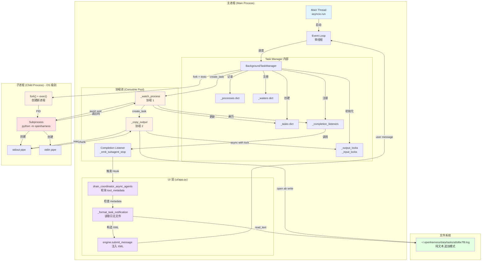
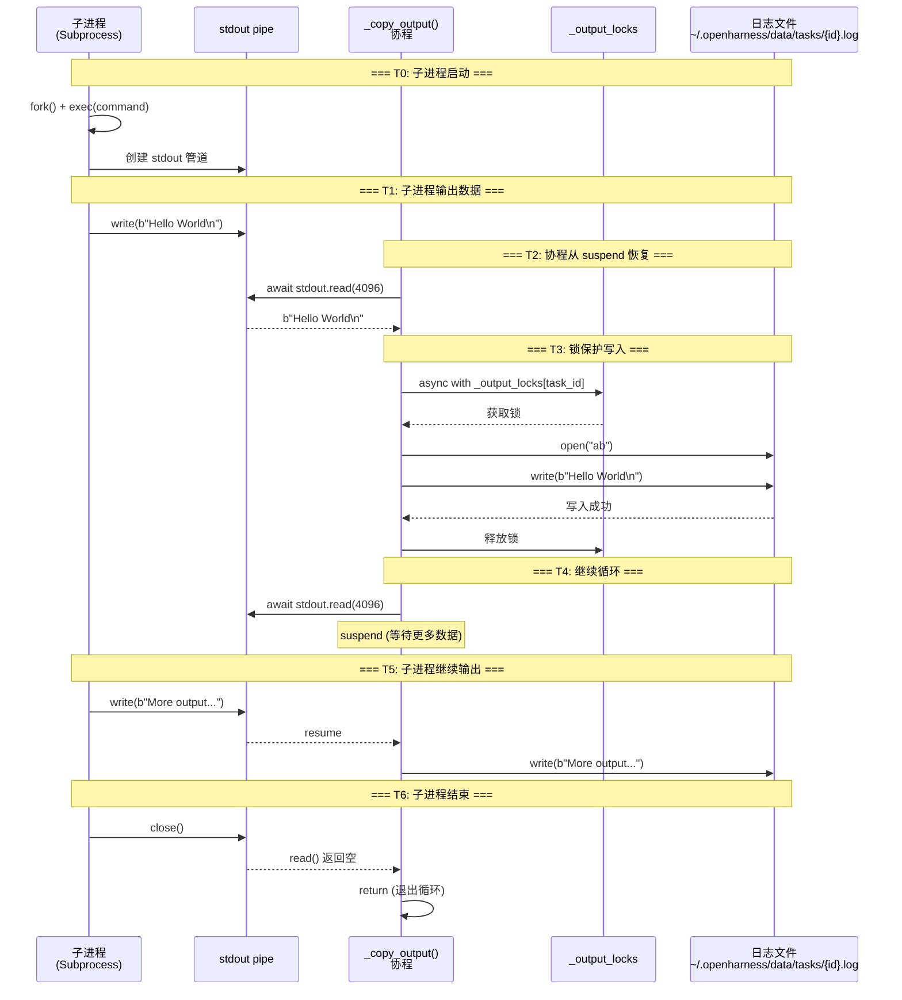
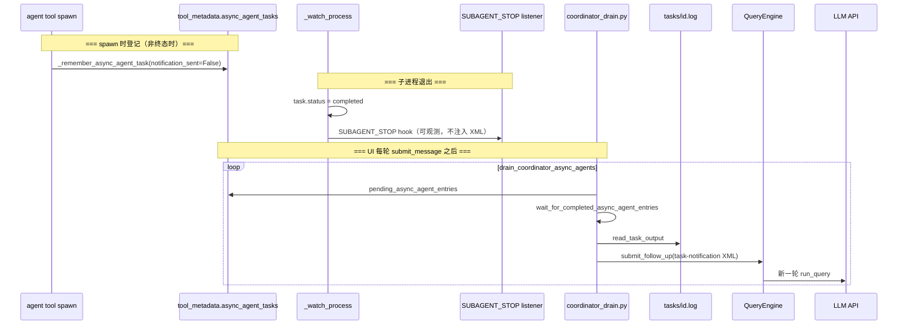
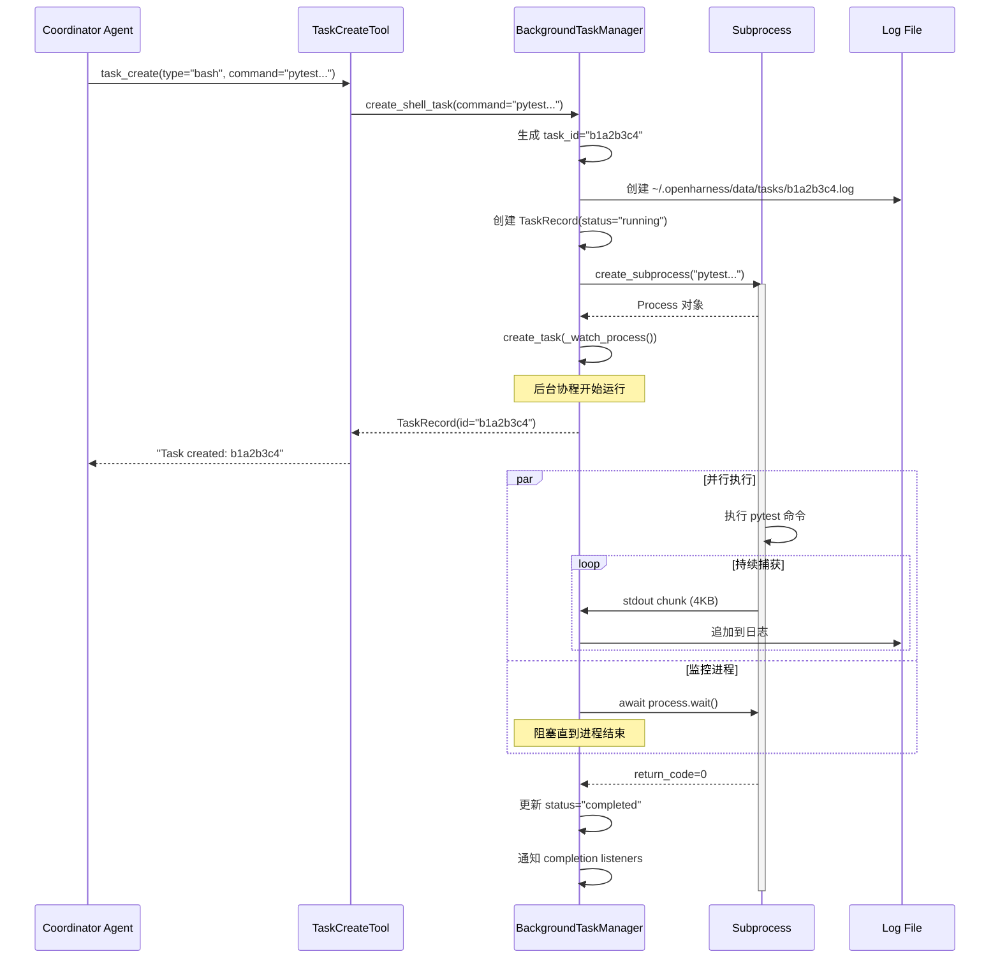
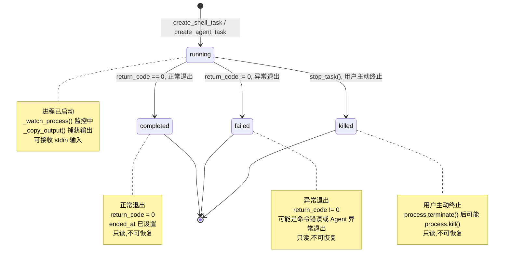
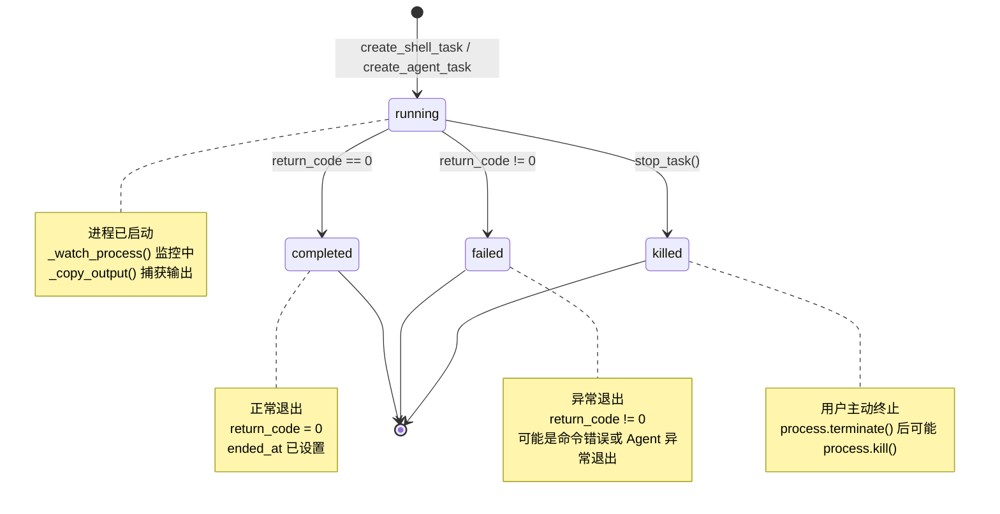
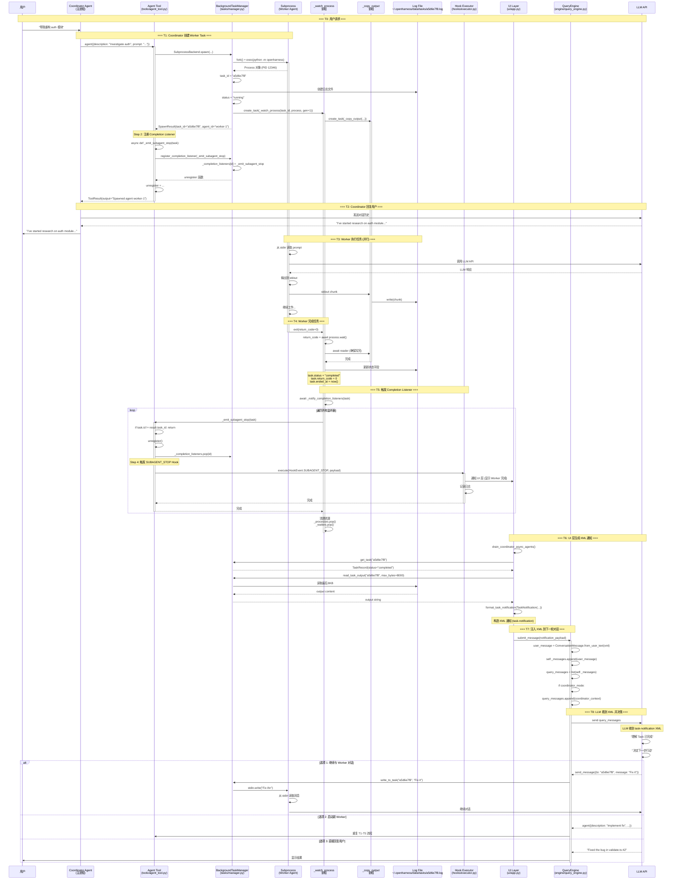
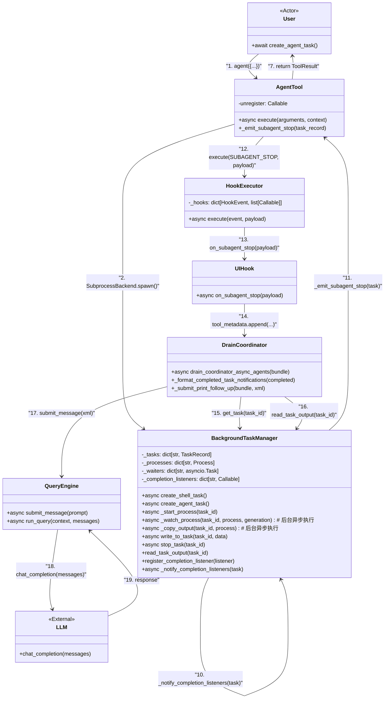
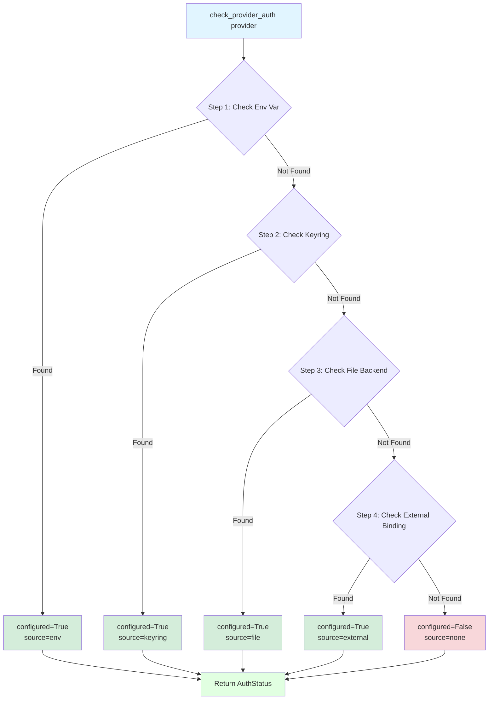

# OpenHarness Tasks & Auth深度分析

> **版本**: v1.2  
> **最后更新**: 2026-06-10（勘误：spawn 用 `agent`、drain 在 `coordinator_drain.py`；删除 fabricated `ui_hook` 叙事）  
> **包版本**: 0.1.9 · **同步说明**: [ARCHITECTURE_DOCS_SYNC.md](./ARCHITECTURE_DOCS_SYNC.md)
> **作者**: OpenHarness Community  
> **文档类型**: 技术架构设计(任务管理与认证系统专项)

---

## 📋 目录

- [1. 概述](#1-概述)
- [2. 任务管理系统架构](#2-任务管理系统架构)
  - [2.1 TaskRecord数据结构](#21-taskrecord数据结构)
  - [2.2 BackgroundTaskManager核心逻辑](#22-backgroundtaskmanager核心逻辑)
  - [2.3 任务类型分类](#23-任务类型分类)
- [3. 任务生命周期管理](#3-任务生命周期管理)
  - [3.1 任务创建流程](#31-任务创建流程)
  - [3.2 任务状态机](#32-任务状态机)
  - [3.3 进程监控与输出捕获](#33-进程监控与输出捕获)
- [4. Shell任务详解](#4-shell任务详解)
  - [4.1 create_shell_task实现](#41-create_shell_task实现)
  - [4.2 进程管理策略](#42-进程管理策略)
  - [4.3 输出流处理](#43-输出流处理)
- [5. Agent任务详解](#5-agent任务详解)
  - [5.1 create_agent_task实现](#51-create_agent_task实现)
  - [5.2 子Agent启动流程](#52-子agent启动流程)
  - [5.3 输入/输出通信](#53-输入输出通信)
- [6. 任务工具集成](#6-任务工具集成)
  - [6.1 task_create工具](#61-task_create工具)
  - [6.2 task_list工具](#62-task_list工具)
  - [6.3 task_output工具](#63-task_output工具)
  - [6.4 task_stop工具](#64-task_stop工具)
- [7. 认证系统架构](#7-认证系统架构)
  - [7.1 AuthManager职责](#71-authmanager职责)
  - [7.2 Provider Profiles](#72-provider-profiles)
  - [7.3 认证源管理](#73-认证源管理)
- [8. 凭证存储机制](#8-凭证存储机制)
  - [8.1 存储后端](#81-存储后端)
  - [8.2 环境变量注入](#82-环境变量注入)
  - [8.3 外部绑定(OAuth)](#83-外部绑定oauth)
- [9. 多Provider支持](#9-多provider支持)
  - [9.1 支持的Provider列表](#91-支持的provider列表)
  - [9.2 Provider切换机制](#92-provider切换机制)
  - [9.3 认证状态检查](#93-认证状态检查)
- [10. 安全最佳实践](#10-安全最佳实践)
  - [10.1 API密钥管理](#101-api密钥管理)
  - [10.2 OAuth令牌刷新](#102-oauth令牌刷新)
  - [10.3 凭证轮换](#103-凭证轮换)
- [11. 相关文档](#11-相关文档)

---

## 1. 概述

### 1.1 Task 系统到底是什么？

**核心定义**: Task 是 OpenHarness 的**后台进程抽象层**,将任何长期运行的操作封装为可管理的异步任务。

**本质理解**:
```
Task = 进程 + 监控 + 日志 + 状态机
```

**类比理解**:
- 🖥️ **类似 Linux 的 `systemd`**: 管理服务生命周期(start/stop/restart/status)
- 📦 **类似 Docker 容器**: 隔离执行环境,捕获输出,管理资源
- 🎯 **类似 CI/CD Job**: 异步执行,实时监控,结果收集

**核心价值**:
1. **非阻塞执行**: Agent 启动任务后继续工作,无需等待完成
2. **并行能力**: 同时运行多个任务(测试、调研、代码审查)
3. **持久化日志**: 输出写入文件,即使 CLI 重启也能查看历史
4. **自动恢复**: Agent 任务崩溃后自动重启,保持连续性
5. **统一接口**: Shell 命令和子 Agent 使用相同的管理 API

---

### 1.2 Task 在系统中的位置

**架构层级**（与源码一致）：

```
┌─────────────────────────────────────────────┐
│         User / Frontend (React UI)          │
└──────────────────┬──────────────────────────┘
                   │ 用户输入 / 工具调用
┌──────────────────▼──────────────────────────┐
│      主 Agent (QueryEngine)                  │
│  - 普通模式：Delegation + Skills             │
│  - Coordinator：协调器 System Prompt         │
│  - LLM 委派子 Agent 用 **`agent`** 工具       │
└──────────────────┬──────────────────────────┘
                   │ agent(...) 或 task_create(local_bash|local_agent)
┌──────────────────▼──────────────────────────┐
│  Swarm（可选）SubprocessBackend.spawn        │
│  → BackgroundTaskManager（单例）              │
└──────┬───────────────────────┬──────────────┘
       │ local_bash            │ local_agent / agent spawn
       ▼                       ▼
┌──────────────┐    ┌──────────────────────┐
│ Shell 进程    │    │ 子进程 --task-worker  │
│ pytest …     │    │ python -m openharness │
└──────────────┘    └──────────────────────┘
                           │ stdin: prompt
                           ▼
                    ┌────────────────┐
                    │ 子 QueryEngine │
                    └────────────────┘
```

**关键观察**：

1. **Coordinator spawn Worker**：`tools/agent_tool.py` → `SubprocessBackend.spawn`，**不是** `task_create(type="agent")`（该 type 不存在）。
2. **`task_create`**：底层 API，仅 `local_bash` / `local_agent`；不写入 `async_agent_tasks`。
3. **进程隔离**：每个 Task 独立 OS 进程；Agent 任务通过 **stdin** 输入、**stdout→log** 输出。
4. **Coordinator 收结果**：UI 层 `drain_coordinator_async_agents`（`ui/coordinator_drain.py`），不是 Hook 注入 XML。

详见 [ARCHITECTURE_TOOLS_SWARM.md](./ARCHITECTURE_TOOLS_SWARM.md)、[ARCHITECTURE_COORDINATOR.md](./ARCHITECTURE_COORDINATOR.md)。

---

### 1.3 职责定位

**Tasks模块**负责OpenHarness的后台任务管理,支持Shell命令和子Agent的异步执行。

**核心职责**:
1. **任务创建**: 创建Shell任务(local_bash)或Agent任务(local_agent/remote_agent)
2. **进程管理**: 启动、监控、停止后台进程
3. **输出捕获**: 实时捕获stdout/stderr,写入日志文件
4. **状态跟踪**: 维护任务状态机(pending/running/completed/failed/killed)
5. **输入通信**: 支持向运行中的Agent任务发送消息(stdin)

**Auth模块**负责多LLM Provider的认证管理。

**核心职责**:
1. **Provider管理**: 支持Anthropic/OpenAI/Copilot/Gemini等10+ Provider
2. **认证源检测**: 检查环境变量、配置文件、Keyring、OAuth等多种认证方式
3. **凭证存储**: 安全存储API密钥和OAuth令牌
4. **状态监控**: 实时查询各Provider的认证状态
5. **Profile切换**: 灵活切换不同的Provider配置

**核心价值**:
1. **并行执行**: 后台任务不阻塞主Agent,提升效率
2. **灵活扩展**: 支持Shell命令和完整Agent两种任务类型
3. **多Provider支持**: 避免厂商锁定,灵活选择模型
4. **安全认证**: 多种认证方式,支持环境变量/文件/OAuth

---

## 2. Task 系统深度解析

### 2.1 Task 的本质：进程抽象

**核心理解**: Task 不是线程,不是协程,而是**真实的操作系统进程**。

```python
# Task 创建时的底层操作
async def _start_process(self, task_id: str):
    # 这行代码会 fork() 一个新进程
    process = await create_shell_subprocess(
        task.command,  # e.g., "pytest tests/" or "python -m openharness"
        cwd=task.cwd,
        stdin=PIPE,
        stdout=PIPE,
        stderr=STDOUT
    )
```

**为什么用进程而非线程？**
1. **隔离性**: 进程崩溃不影响主程序
2. **安全性**: 子进程无法访问父进程内存
3. **灵活性**: 可以运行任意命令(包括其他语言的可执行文件)
4. **资源控制**: OS 级别的 CPU/内存限制

---

### 2.2 Task 数据结构详解

**源码**: `tasks/types.py`

```python
@dataclass
class TaskRecord:
    """Runtime representation of a background task."""
    
    # === 身份标识 ===
    id: str                      # 唯一标识,格式: {type_prefix}{uuid8}
                                 # 示例: "b1a2b3c4" (bash), "a5d6e7f8" (agent)
    
    type: TaskType               # 任务类型(决定行为)
                                 # - local_bash: Shell 命令
                                 # - local_agent: 子 OpenHarness 进程
                                 # - remote_agent: 远程 Agent (预留)
                                 # - in_process_teammate: 进程内协作 (预留)
    
    status: TaskStatus           # 当前状态
                                 # - pending: 已创建,未启动
                                 # - running: 进程正在执行
                                 # - completed: 成功退出 (return_code=0)
                                 # - failed: 失败退出 (return_code!=0)
                                 # - killed: 用户主动终止
    
    # === 元数据 ===
    description: str             # 人类可读的描述(e.g., "Run tests")
    cwd: str                     # 工作目录(绝对路径)
    output_file: Path            # 日志文件路径
                                 # 示例: ~/.openharness/data/tasks/b1a2b3c4.log
    
    # === 执行信息 ===
    command: str | None = None   # 执行的完整命令
                                 # Bash: "pytest tests/ -v"
                                 # Agent: "python -m openharness --api-key sk-ant-xxx"
    
    prompt: str | None = None    # 仅 Agent 任务: 初始 Prompt
                                 # 通过 stdin 发送给子 Agent
    
    # === 时间戳 ===
    created_at: float = 0.0      # 创建时间(time.time())
    started_at: float | None = None  # 进程启动时间
    ended_at: float | None = None    # 进程结束时间
    
    # === 执行结果 ===
    return_code: int | None = None   # 进程退出码
                                     # 0=成功, 非0=失败, None=仍在运行
    
    # === 扩展字段 ===
    metadata: dict[str, str] = field(default_factory=dict)
    # 常见键:
    # - "progress": "50" (进度百分比)
    # - "status_note": "Running tests..." (状态备注)
    # - "restart_count": "2" (重启次数)
    # - "agent_mode": "local_agent" (Agent 模式)
```

**设计要点**:
- ✅ **不可变字段**: id/type/cwd/output_file 创建后不变
- ✅ **可变字段**: status/return_code/metadata 随执行动态更新
- ✅ **完整追踪**: 从创建到结束的完整生命周期记录
- ✅ **可扩展**: metadata 字典支持自定义字段

---

### 2.3 BackgroundTaskManager 核心架构

**源码**: `tasks/manager.py:24-331`

**内部数据结构**:

```python
class BackgroundTaskManager:
    def __init__(self) -> None:
        # === 核心存储 ===
        self._tasks: dict[str, TaskRecord] = {}              # Task ID → 记录
        self._processes: dict[str, asyncio.subprocess.Process] = {}  # Task ID → 进程对象
        
        # === 异步监控 ===
        self._waiters: dict[str, asyncio.Task[None]] = {}    # Task ID → 监控协程
                                                               # _watch_process() 返回的 Task
        
        # === 并发控制 ===
        self._output_locks: dict[str, asyncio.Lock] = {}     # Task ID → 输出文件锁
        self._input_locks: dict[str, asyncio.Lock] = {}      # Task ID → stdin 锁
        
        # === 版本控制 ===
        self._generations: dict[str, int] = {}               # Task ID → 重启计数器
                                                               # 防止旧进程回调干扰
        
        # === 事件通知 ===
        self._completion_listeners: dict[str, CompletionListener] = {}
        # 任务完成时触发的回调(用于 Coordinator 接收通知)
```

**关键设计决策**:

| 组件 | 作用 | 为什么需要 |
|------|------|----------|
| **_processes** | 保存进程对象 | 支持 stop/write 操作 |
| **_waiters** | 监控协程 | 异步等待进程结束,不阻塞主循环 |
| **_output_locks** | 输出文件锁 | 防止多个协程同时写入同一日志文件 |
| **_input_locks** | stdin 锁 | 防止并发写入导致消息混乱 |
| **_generations** | 重启计数器 | 区分新旧进程,避免竞态条件 |
| **_completion_listeners** | 完成回调 | Coordinator 订阅任务完成事件 |

---

### 2.4 Task 类型分类与对比

| 类型 | 前缀 | 命令示例 | 典型用途 | 是否支持 stdin |
|------|------|---------|---------|--------------|
| **local_bash** | `b` | `pytest tests/` | 运行测试、构建项目、Git操作 | ❌ 否 |
| **local_agent** | `a` | `python -m openharness --api-key ...` | 并行调研、模块重构、代码审查 | ✅ 是 |
| **remote_agent** | `r` | (预留) | 未来支持云端 Agent | ✅ 是 |
| **in_process_teammate** | `t` | (预留) | 轻量级协作,无进程开销 | ✅ 是 |

**Task ID 生成规则** (`tasks/manager.py:367-374`):

```python
def _task_id(task_type: TaskType) -> str:
    prefixes = {
        "local_bash": "b",
        "local_agent": "a",
        "remote_agent": "r",
        "in_process_teammate": "t",
    }
    return f"{prefixes[task_type]}{uuid4().hex[:8]}"

# 示例:
# local_bash → "b1a2b3c4"
# local_agent → "a5d6e7f8"
# remote_agent → "r9e8d7c6"
```

**设计理由**:
- ✅ **前缀区分**: 一眼看出任务类型
- ✅ **UUID 短哈希**: 8位足够唯一,又便于人工阅读
- ✅ **确定性**: 相同类型的前缀固定,便于调试

---

## 3. Task 完整生命周期

### 3.0 进程/线程/协程模型深度解析

**核心问题**: 启动一个 Task 后,系统到底创建了多少个执行单元?它们如何协作?

#### 3.0.1 执行单元总览

```python
# 用户调用
task = await manager.create_agent_task(
    prompt="Research React patterns",
    description="Research React",
    cwd="/project"
)
```

**创建的执行单元**:

| 层级 | 类型 | 数量 | 职责 | 生命周期 |
|------|------|------|------|----------|
| **OS 进程** | Subprocess | 1 | 执行实际命令(e.g., `python -m openharness`) | 直到命令结束 |
| **主事件循环** | asyncio Loop | 1 (共享) | 调度所有协程 | CLI 运行期间 |
| **监控协程** | `_watch_process()` | 1 | 等待进程结束,更新状态 | 进程结束后销毁 |
| **输出捕获协程** | `_copy_output()` | 1 | 持续读取 stdout,写入文件 | 进程结束后销毁 |
| **Completion Listener** | 回调函数 | N | 通知 Coordinator | 注册后常驻 |

**总计**: 1 个 OS 进程 + 2 个后台协程 + N 个监听器

---

#### 3.0.2 详细执行流程图



**关键说明**:
- ✅ **进程创建**: `TM --fork+exec--> Fork --PID--> Child` (OS 级别的 fork)
- ✅ **写入路径**: `Child → stdout pipe → _copy_output() → [lock] → LogFile` (锁是保护机制,非数据流节点)
- ✅ **通知路径**: `_watch_process → Completion Listener → Hook → UI Layer`
- ✅ **读取触发**: `UI Layer (_drain...) → 检查 tool_metadata → 发现待处理 Task → 读取 LogFile`
- ✅ **异步 I/O**: `await stdout.read()` 不阻塞事件循环

---

#### 3.0.3 时间线详解

**T0: 用户调用 create_agent_task()**

```python
# 主线程执行
async def create_agent_task(prompt, description, cwd):
    # Step 1: 构建命令
    command = "python -m openharness --api-key sk-ant-xxx"
    
    # Step 2: 调用 create_shell_task()
    record = await self.create_shell_task(
        command=command,
        description=description,
        cwd=cwd,
        task_type="local_agent"
    )
    
    # Step 3: 写入 prompt 到 stdin
    await self.write_to_task(record.id, prompt)
    
    return record
```

**耗时**: ~150ms (主要花在 fork() 进程)

---

**T1: create_shell_task() 初始化**

```python
async def create_shell_task(command, description, cwd):
    # Step 1: 生成 ID
    task_id = "a5d6e7f8"
    
    # Step 2: 创建输出文件
    output_path = Path("~/.openharness/data/tasks/a5d6e7f8.log")
    output_path.write_text("")  # 同步 I/O, ~1ms
    
    # Step 3: 创建 TaskRecord
    record = TaskRecord(
        id=task_id,
        status="running",  # ← 立即设为 running
        ...
    )
    
    # Step 4: 初始化字典
    self._tasks[task_id] = record
    self._output_locks[task_id] = asyncio.Lock()
    self._input_locks[task_id] = asyncio.Lock()
    
    # Step 5: 启动进程
    await self._start_process(task_id)  # ← 关键步骤
    
    return record
```

**耗时**: ~5ms (内存操作 + 文件创建)

---

**T2: _start_process() 创建子进程**

```python
async def _start_process(task_id):
    # Step 1: Generation 递增
    generation = 1
    self._generations[task_id] = 1
    
    # Step 2: 创建子进程 (fork + exec)
    process = await create_shell_subprocess(
        command="python -m openharness --api-key sk-ant-xxx",
        cwd="/project",
        stdin=PIPE,    # 创建 stdin 管道
        stdout=PIPE,   # 创建 stdout 管道
        stderr=STDOUT  # stderr 合并到 stdout
    )
    # ↓ 底层调用
    # os.fork() → 复制当前进程
    # os.execvp() → 替换为 python 进程
    # 耗时: ~100ms
    
    # Step 3: 记录进程对象
    self._processes[task_id] = process
    
    # Step 4: 启动监控协程
    self._waiters[task_id] = asyncio.create_task(
        self._watch_process(task_id, process, generation=1)
    )
    # ⚠️ create_task 立即返回,不等待完成
    # 协程被放入事件循环,稍后调度
    
    return process
```

**关键点**:
- ✅ **`fork()` 是阻塞的**: 需要 ~100ms 创建新进程
- ✅ **`create_task` 是非阻塞的**: 立即返回,后台运行
- ✅ **此时已有 2 个进程**: 主进程 + 子进程

**耗时**: ~100ms (fork + exec)

---

**T3: _watch_process() 开始后台运行**

```python
# 这个协程在事件循环中独立运行
async def _watch_process(task_id, process, generation=1):
    # Step 1: 启动输出捕获协程
    reader = asyncio.create_task(self._copy_output(task_id, process))
    # ⚠️ 又创建了一个协程!
    
    # Step 2: 等待进程结束 (阻塞点)
    return_code = await process.wait()
    # ⚠️ 这里会阻塞,但不影响主循环
    # 因为这是独立的协程
    
    # Step 3: 确保所有输出已写入
    await reader
    
    # Step 4: 关闭 stdin
    await _close_process_stdin(process)
    
    # Step 5: Generation 检查
    if self._generations[task_id] != generation:
        return  # 忽略旧进程
    
    # Step 6: 更新状态
    task = self._tasks[task_id]
    task.return_code = return_code
    task.status = "completed" if return_code == 0 else "failed"
    task.ended_at = time.time()
    
    # Step 7: 通知监听器
    await self._notify_completion_listeners(task)
    
    # Step 8: 清理资源
    self._processes.pop(task_id)
    self._waiters.pop(task_id)
```

**此时已有 3 个协程并发运行**:
1. **主协程**: 继续执行 `create_agent_task()` 的后续代码
2. **_watch_process()**: 等待进程结束
3. **_copy_output()**: 持续读取 stdout

---

**T4: _copy_output() 持续捕获输出**

```python
async def _copy_output(task_id, process):
    while True:
        # Step 1: 非阻塞读取 4KB
        chunk = await process.stdout.read(4096)
        # ⚠️ 如果 stdout 没有数据,这里会 suspend
        # 事件循环可以去执行其他协程
        
        if not chunk:
            return  # stdout 关闭
        
        # Step 2: 锁保护写入
        async with self._output_locks[task_id]:
            with task.output_file.open("ab") as f:
                f.write(chunk)  # 同步 I/O
        
        # Step 3: 回到 Step 1,继续读取
```

**工作流程**:
```
T4.0: 子进程输出 "Hello\n" → stdout pipe 有数据
T4.1: _copy_output() 从 suspend 恢复
T4.2: read(4096) 返回 b"Hello\n"
T4.3: 写入日志文件
T4.4: 回到 await read(),再次 suspend
T4.5: 子进程输出更多内容...
T4.6: 重复 T4.1-T4.4
```

**关键点**:
- ✅ **异步 I/O**: `await read()` 不会阻塞主循环
- ✅ **流式处理**: 每次 4KB,内存占用恒定
- ✅ **自动暂停**: 无数据时 suspend,有数据时恢复

---

#### **T4.5: 日志文件写入详解**

**`_copy_output()` 完整实现**:

```python
async def _copy_output(self, task_id: str, process: asyncio.subprocess.Process) -> None:
    """Continuously copy stdout from a subprocess to its output file."""
    if process.stdout is None:
        return
    
    while True:
        # Step 1: ⚠️ 异步读取子进程的 stdout (每次 4KB)
        chunk = await process.stdout.read(4096)
        
        if not chunk:
            return  # stdout 关闭,进程结束
        
        # Step 2: ⚠️ 锁保护,防止并发写入冲突
        async with self._output_locks[task_id]:
            # Step 3: ⚠️ 追加写入日志文件
            with self._tasks[task_id].output_file.open("ab") as handle:
                handle.write(chunk)  # 二进制追加模式
```

**数据流时序图**:



**关键设计要点**:

| 维度 | 说明 | 为什么重要 |
|------|------|----------|
| **异步 I/O** | `await process.stdout.read(4096)` | 不阻塞事件循环,无数据时 suspend |
| **流式处理** | 每次 4KB,循环读取 | 内存占用恒定,支持大输出 |
| **锁保护** | `async with _output_locks[task_id]` | 防止多协程并发写入导致数据错乱 |
| **追加模式** | `open("ab")` | 增量写入,不覆盖旧内容 |
| **二进制模式** | `"b"` 标志 | 不进行编码转换,保留原始字节 |
| **退出条件** | `if not chunk: return` | stdout 关闭时自动退出 |

**实际示例**:

```python
# 假设子进程输出 pytest 测试结果
# 子进程行为:
print("================ test session starts ================")
print("collected 42 items")
print("tests/test_auth.py::test_login PASSED")
# ...

# _copy_output() 的行为:
# T1: read(4096) → b"================ test session starts ================\n"
#     → write to ~/.openharness/data/tasks/b1a2b3c4.log
# T2: read(4096) → b"collected 42 items\n"
#     → write to ~/.openharness/data/tasks/b1a2b3c4.log
# T3: read(4096) → b"tests/test_auth.py::test_login PASSED\n"
#     → write to ~/.openharness/data/tasks/b1a2b3c4.log
# ... (持续循环直到进程结束)

# 最终日志文件内容:
# ================= test session starts ================
# collected 42 items
# tests/test_auth.py::test_login PASSED
# ...
```

---

#### **T4.6: 日志文件读取详解**

**消费者类型与读取方式**:

| 消费者 | 读取时机 | 读取方式 | 数据来源 | 数据格式 | 用途 |
|--------|---------|---------|---------|---------|------|
| **Coordinator Agent** | Task 完成后 | `read_task_output(task_id)` | 日志文件<br/>`~/.openharness/data/tasks/{task_id}.log` | 纯文本 (最后 8KB)<br/>通过 `format_task_notification()` 包装为 XML | 获取 Worker 的执行结果,注入到 LLM 上下文 |
| **用户/前端** | 实时监控 | `task_output` 工具 | 日志文件<br/>`~/.openharness/data/tasks/{task_id}.log` | 纯文本<br/>可选 `tail_lines=N` 截取最后 N 行 | 查看任务进度和输出 |
| **Agent 自身** | 调试时 | `task_output` 工具 | 日志文件<br/>`~/.openharness/data/tasks/{task_id}.log` | 纯文本<br/>完整内容或尾部截取 | 检查已创建任务的输出 |
| **CLI 命令** | 查询时 | `openharness task output <id>` | 日志文件<br/>`~/.openharness/data/tasks/{task_id}.log` | 纯文本<br/>直接输出文件内容 | 手动查看历史任务 |

**核心原则**: 
- 📦 **存储层**: 统一使用纯文本文本日志
- 🎨 **展示层**: 根据消费者需求选择格式 (XML vs 纯文本)

---

##### **Coordinator 的特殊处理流程**

```python
# Step 1: 读取原始日志 (纯文本,最后 8KB)
output = manager.read_task_output(task_id, max_bytes=8000)
# 返回: "Based on my research...\n1. Use functional components\n..."

# Step 2: 构造 TaskNotification
notification = TaskNotification(
    task_id="a5d6e7f8",
    status="completed",
    summary='Agent "Research React" completed',
    result=output,  # ← 纯文本
)

# Step 3: 格式化为 XML
xml = format_task_notification(notification)
# 返回:
# """
# <task-notification>
# <task-id>a5d6e7f8</task-id>
# <status>completed</status>
# <summary>Agent "Research React" completed</summary>
# <result>Based on my research...
# 1. Use functional components
# ...</result>
# </task-notification>
# """

# Step 4: 注入到 LLM 上下文
engine.submit_message(xml)
```

**关键点**:
- 📄 **原始数据**: 始终是纯文本日志
- 🔄 **XML 包装**: 仅 Coordinator 需要,用于 LLM 理解结构
- 📏 **大小限制**: `max_bytes=8000` 避免 Context 爆炸

---

##### **其他消费者的简单流程**

```python
# task_output 工具 (用户/Agent/CLI)
async def execute(self, arguments, context):
    # Step 1: 读取原始日志 (纯文本)
    output = manager.read_task_output(arguments.task_id)
    
    # Step 2: 可选截断
    if arguments.tail_lines:
        lines = output.splitlines()
        output = "\n".join(lines[-arguments.tail_lines:])
    
    # Step 3: 直接返回纯文本
    return ToolResult(output=output)
```

**特点**:
- ✅ **无格式转换**: 直接返回日志内容
- ✂️ **可选截断**: `tail_lines` 参数控制输出长度
- 🎯 **即时可用**: 无需额外解析

---

##### **read_task_output() 实现**

```python
def read_task_output(self, task_id: str, *, max_bytes: int = 12000) -> str:
    """Return the tail of a task's output file."""
    task = self._require_task(task_id)
    
    # Step 1: 同步读取文件内容
    content = task.output_file.read_text(encoding="utf-8", errors="replace")
    
    # Step 2: 如果超过限制,返回尾部
    if len(content) > max_bytes:
        return content[-max_bytes:]  # 返回最后 12KB
    
    return content
```

**设计要点**:
- ✅ **尾部读取**: 只返回最后 12KB,避免大日志耗尽 Context
- ✅ **编码容错**: `errors="replace"` 处理非 UTF-8 字符
- ✅ **同步读取**: 无需 await,直接从文件系统读取
- ✅ **灵活限制**: `max_bytes` 参数可调整

---

#### **T4.7: Coordinator 如何知道要读取文件**

**核心问题**: `_watch_process()` 只更新了 `TaskRecord.status`,谁负责读取日志文件并生成 XML?

**答案**: **UI 层的 `drain_coordinator_async_agents()` 协程**通过轮询 `tool_metadata` 发现待处理 Task。

---

##### **完整通知链路 (5步)**

```python
# Step 1: _watch_process() 检测到任务完成
async def _watch_process(task_id, process, generation):
    return_code = await process.wait()  # ← 阻塞点
    
    # 更新状态
    task = self._tasks[task_id]
    task.status = "completed" if return_code == 0 else "failed"
    
    # ⚠️ 触发 Completion Listener
    await self._notify_completion_listeners(task)
```

```python
# Step 2: Completion Listener (_emit_subagent_stop) 被调用
async def _emit_subagent_stop(task_record: TaskRecord):
    # 注销监听器
    unregister()
    
    # ⚠️ 触发 SUBAGENT_STOP Hook
    await context.hook_executor.execute(
        HookEvent.SUBAGENT_STOP,
        {
            "task_id": result.task_id,
            "agent_id": result.agent_id,
            "status": task_record.status,
            ...
        }
    )
```

```python
# Step 3: 登记 async_agent_tasks（spawn 成功后，非 SUBAGENT_STOP）
# engine/query.py — _record_tool_carryover → _remember_async_agent_task
def _remember_async_agent_task(tool_metadata, agent_id, task_id, description, ...):
    tool_metadata.setdefault("async_agent_tasks", []).append({
        "agent_id": agent_id,
        "task_id": task_id,
        "description": description,
        "notification_sent": False,
    })
```

```python
# Step 4: UI 层 drain（不在 QueryEngine 内部）
# ui/coordinator_drain.py
async def drain_coordinator_async_agents(bundle, *, prompt_seed, ...):
    while True:
        pending = pending_async_agent_entries(engine.tool_metadata)
        if not pending:
            return
        completed = await wait_for_completed_async_agent_entries(...)
        notification = format_completed_task_notifications(completed)  # read_task_output
        await submit_follow_up(bundle, notification, ...)  # engine.submit_message
```

调用方：`ui/app.py`、`ui/textual_app.py`、`ui/backend_host.py`（在 `handle_line` / `submit_message` **之后**）。

```python
# Step 5: _format_completed_task_notifications() 读取日志文件
# ui/app.py:108-134
def _format_completed_task_notifications(completed: list[dict]) -> str:
    manager = get_task_manager()
    notifications: list[str] = []
    
    for entry in completed:
        task_id = entry["task_id"]
        
        # ⚠️ 这里才真正读取日志文件!
        output = manager.read_task_output(task_id, max_bytes=8000)
        
        # 构造 TaskNotification
        notification = TaskNotification(
            task_id=entry["agent_id"],
            status=task.status,
            summary=_build_async_task_summary(entry, ...),
            result=output,  # ← 最后 8KB 输出
        )
        
        # 格式化为 XML
        xml = format_task_notification(notification)
        notifications.append(xml)
        
        # 标记为已发送
        entry["notification_sent"] = True
    
    return "\n\n".join(notifications)
```

---

##### **时序图详解**



---

##### **关键设计要点**

| 维度 | 说明 | 为什么重要 |
|------|------|----------|
| **解耦** | `_watch_process` 不直接读取文件 | 保持职责单一,避免循环依赖 |
| **延迟读取** | UI 层在下一轮对话前才读取 | 确保 Task 完全结束,输出完整 |
| **轮询机制** | `_drain...` 每轮对话后检查 metadata | 被动触发,无需主动查询 |
| **状态标记** | `notification_sent=False/True` | 防止重复发送通知 |
| **异步安全** | `tool_metadata` 是 dict,无需锁 | 单线程 asyncio,无并发竞争 |
| **按需读取** | 只在生成 XML 时读取文件 | 减少 I/O,提高效率 |

##### **Coordinator drain：`tool_metadata` 判定与多 Task（摘要）**

与本文 **§「完整通知链路」**、**`notification_sent`** 设计一致；**逐步判定逻辑、多任务批处理规则、双 Agent 从 UI 启动到 `_drain` 结束的时间线** 已收束到 [ARCHITECTURE_ENGINE.md](ARCHITECTURE_ENGINE.md) 中 **「Coordinator drain：`tool_metadata` 判定逻辑、多任务与双 Agent 演示」** 一节（位于 §5.3「方式1: Coordinator模式自动轮询注入」与「常见问题」之后）。

**要点速览**：

1. **`async_agent_tasks`**：spawn 成功后由 **`_remember_async_agent_task`**（`engine/query.py`）写入，`notification_sent=False`。
2. **`SUBAGENT_STOP` hook**：`agent_tool` 注册的 completion listener 触发，**仅可观测**；XML 注入由 **drain** 完成，不由 Hook 写入 metadata。
3. **`wait_for_completed_async_agent_entries`**：轮询 `TaskManager` 终态（默认 0.1s）。
4. **`format_completed_task_notifications`**：读 log、`notification_sent=True`；实现均在 **`ui/coordinator_drain.py`**。

---

##### **CLI/客户端如何读取文件?**

**场景 1: 用户主动查询**

```bash
# CLI 命令
openharness task output a5d6e7f8
       ↓
TaskOutputTool.execute()
       ↓
manager.read_task_output("a5d6e7f8")
       ↓
task.output_file.read_text()  # 同步读取
       ↓
返回纯文本给用户
```

**场景 2: Agent 调用工具**

```python
# Agent 决定查询
agent.call_tool("task_output", {"task_id": "a5d6e7f8"})
       ↓
TaskOutputTool.execute()
       ↓
manager.read_task_output("a5d6e7f8")
       ↓
返回 ToolResult(output=纯文本)
       ↓
Agent 看到输出,决定下一步行动
```

**关键区别**:
- ❌ **CLI/客户端**: 用户/Agent **主动调用** `task_output` 工具
- ✅ **Coordinator**: UI 层 **被动轮询** `tool_metadata`,自动读取并注入 XML

---

##### **总结: 三种读取方式对比**

| 读取者 | 触发方式 | 读取时机 | 数据用途 | 格式 |
|--------|---------|---------|---------|------|
| **Coordinator (UI Layer)** | 被动: Hook → metadata → 轮询 | 下一轮对话前 | 注入 LLM 上下文 | XML |
| **CLI 用户** | 主动: `openharness task output <id>` | 用户手动查询 | 查看历史输出 | 纯文本 |
| **Agent** | 主动: `call_tool("task_output", ...)` | Agent 决定查询 | 获取任务结果 | 纯文本 |

**核心原则**:
- 🎯 **Coordinator**: 自动化工作流,无需人工干预
- 🎯 **CLI/Agent**: 按需查询,灵活控制

---

**T5: 主协程写入 prompt**

```python
# 回到 create_agent_task()
await self.write_to_task(record.id, prompt)

async def write_to_task(task_id, data):
    async with self._input_locks[task_id]:  # 获取锁
        process = self._processes[task_id]
        
        # 写入 stdin
        process.stdin.write((data + "\n").encode())
        await process.stdin.drain()  # 确保发送
```

**此时子进程的行为**:
```python
# 子进程 (python -m openharness)
import sys
for line in sys.stdin:  # 阻塞读取
    message = line.strip()
    # 将 message 作为用户消息处理
    engine.submit_message(message)
    # ... LLM 推理 ...
    # ... 输出响应到 stdout ...
```

---

**T6: 子进程执行 (并行)**

```
主进程                                    子进程
───────                                   ───────
                                          启动 OpenHarness
                                          加载配置
                                          连接 LLM API
main_loop()                               
  ├─ handle_user_input()                  
  ├─ call_tool()                          
  └─ ...                                  
                                          从 stdin 读取 prompt
_watch_process()                          
  └─ await process.wait()  ← 阻塞         调用 LLM API
                                          等待响应 (~2s)
_copy_output()                            
  └─ await stdout.read()  ← suspend       收到响应
                                          输出到 stdout
                                          (触发 _copy_output 恢复)
                                          继续对话...
```

**关键观察**:
- ✅ **两个进程完全独立**: 各自有自己的事件循环
- ✅ **通过 pipe 通信**: stdin/stdout 是单向管道
- ✅ **主进程不阻塞**: `_watch_process` 在后台等待

---

**T7: 子进程结束**

```python
# 子进程退出 (return_code=0)
os._exit(0)

# _watch_process() 恢复执行
async def _watch_process(...):
    return_code = await process.wait()  # ← 返回 0
    await reader  # 等待 _copy_output 完成
    
    # Generation 检查
    if self._generations[task_id] == 1:  # ✅ 匹配
        # 更新状态
        task.status = "completed"
        task.return_code = 0
        task.ended_at = time.time()
        
        # 通知监听器
        await self._notify_completion_listeners(task)
```

---

**T8: Completion Listener 通知**

```python
async def _notify_completion_listeners(task):
    for listener_id, listener in self._completion_listeners.items():
        try:
            # 调用回调 (可能是异步函数)
            maybe_awaitable = listener(task)
            if maybe_awaitable is not None:
                await maybe_awaitable
        except Exception:
            log.exception("Listener failed")

# SUBAGENT_STOP：agent_tool 注册的 completion listener（tools/agent_tool.py）
# 终态时触发 HookEvent.SUBAGENT_STOP，不写入 task-notification XML。
# XML 由 ui/coordinator_drain.py 在 drain 时 read_task_output + format_task_notification 生成。
```

---

#### 3.0.4 并发模型总结

**执行单元清单**:

```
主进程 (PID 12345)
├─ Main Thread (唯一线程)
│   └─ Event Loop (单线程异步)
│       ├─ 主协程: main_loop()
│       │   └─ 处理用户输入、调用工具...
│       │
│       ├─ Task 1 监控协程
│       │   ├─ _watch_process(a5d6e7f8)
│       │   │   └─ await process.wait() [阻塞]
│       │   └─ _copy_output(a5d6e7f8)
│       │       └─ await stdout.read() [suspend/resume]
│       │
│       ├─ Task 2 监控协程
│       │   ├─ _watch_process(b1a2b3c4)
│       │   └─ _copy_output(b1a2b3c4)
│       │
│       └─ Completion Listeners
│           ├─ coordinator_listener()
│           └─ logger_listener()
│
└─ 子进程 (PID 12346) - Task a5d6e7f8
    └─ Main Thread
        └─ Event Loop
            └─ Agent 协程
                ├─ 读取 stdin
                ├─ 调用 LLM API
                └─ 输出到 stdout

└─ 子进程 (PID 12347) - Task b1a2b3c4
    └─ Shell 命令 (pytest tests/)
```

**关键设计原则**:

1. **单线程异步**:
   - ✅ 主进程只有一个线程
   - ✅ 通过事件循环调度多个协程
   - ✅ 避免线程切换开销

2. **进程隔离**:
   - ✅ 每个 Task 是独立进程
   - ✅ 崩溃不影响主程序
   - ✅ 资源限制由 OS 管理

3. **异步 I/O**:
   - ✅ `await read()` 不阻塞
   - ✅ 无数据时自动 suspend
   - ✅ 有数据时自动 resume

4. **并发控制**:
   - ✅ `asyncio.Lock` 保护共享资源
   - ✅ Generation 防止竞态条件
   - ✅ 无需复杂的线程同步

---

#### 3.0.5 性能分析

**资源占用**:

| 组件 | CPU | 内存 | 文件描述符 |
|------|-----|------|-----------|
| **主进程** | ~5% (空闲时) | ~100MB | ~20 |
| **每个子进程** | ~0% (等待时) | ~50MB | ~10 |
| **每个协程** | ~0% (suspend时) | ~1KB | 0 |
| **每个 Lock** | 0 | ~100B | 0 |

**扩展性**:
- ✅ **100 个并发 Task**: 可行 (100 个子进程 + 200 个协程)
- ⚠️ **1000 个并发 Task**: 可能耗尽文件描述符
- ❌ **10000 个并发 Task**: 需要分布式架构

**瓶颈分析**:
1. **文件描述符**: 每个进程 ~10 个 fd,系统默认限制 1024
2. **内存**: 每个子进程 ~50MB,100 个任务 = 5GB
3. **CPU**: 事件循环单线程,协程切换开销小

**优化建议**:
- 🔧 **增加 fd 限制**: `ulimit -n 4096`
- 🔧 **限制并发数**: 最多 50 个并发 Task
- 🔧 **使用线程池**: CPU 密集型任务 offload 到线程
- 🔧 **分布式架构**: 跨机器执行 Task

---

#### 3.0.6 与其他框架对比

| 维度 | OpenHarness | Celery | Ray | Dask |
|------|------------|--------|-----|------|
| **并发模型** | 进程+协程 | 进程+线程 | 进程+Actor | 进程+线程 |
| **调度器** | asyncio loop | Broker (Redis/RabbitMQ) | GCS (全局控制) | Scheduler |
| **通信方式** | stdin/stdout | Message Queue | RPC | TCP |
| **适用场景** | 本地并行 | 分布式队列 | 分布式计算 | 分布式数据处理 |
| **延迟** | ~100ms (fork) | ~10ms (queue) | ~1ms (RPC) | ~10ms (TCP) |
| **吞吐量** | ~50 tasks/s | ~1000 tasks/s | ~10000 tasks/s | ~5000 tasks/s |

**OpenHarness 的定位**:
- 🎯 **本地并行**: 不是分布式系统
- 🎯 **低延迟**: fork 开销可接受
- 🎯 **简单部署**: 无需额外基础设施
- 🎯 **Agent 友好**: 支持交互式对话

---

### 3.1 Task 创建流程详解

#### 场景 1: 创建 Shell 任务

**用户操作**:
```python
# Agent 调用 task_create 工具
task_create(
    type="bash",
    command="pytest tests/ -v --tb=short",
    description="Run full test suite"
)
```

**内部执行流程**:

```python
# Step 1: TaskCreateTool.execute() → BackgroundTaskManager.create_shell_task()
async def create_shell_task(
    self,
    *,
    command: str,              # "pytest tests/ -v --tb=short"
    description: str,          # "Run full test suite"
    cwd: str | Path,           # "/home/user/project"
    task_type: TaskType = "local_bash",
) -> TaskRecord:
    
    # Step 2: 生成 Task ID
    task_id = _task_id(task_type)  # e.g., "b1a2b3c4"
    
    # Step 3: 创建输出文件
    output_path = get_tasks_dir() / f"{task_id}.log"
    # ~/.openharness/data/tasks/b1a2b3c4.log
    output_path.write_text("", encoding="utf-8")  # 清空或创建
    
    # Step 4: 创建 TaskRecord
    record = TaskRecord(
        id=task_id,
        type=task_type,
        status="running",       # ← 直接设为 running(无 pending 状态)
        description=description,
        cwd=str(Path(cwd).resolve()),
        output_file=output_path,
        command=command,
        created_at=time.time(),
        started_at=time.time(),
    )
    
    # Step 5: 初始化锁
    self._tasks[task_id] = record
    self._output_locks[task_id] = asyncio.Lock()
    self._input_locks[task_id] = asyncio.Lock()
    
    # Step 6: 启动进程
    await self._start_process(task_id)
    
    return record
```

**_start_process() 细节**:

```python
async def _start_process(self, task_id: str) -> asyncio.subprocess.Process:
    task = self._require_task(task_id)
    
    # Step 1: 增加 generation 计数器
    generation = self._generations.get(task_id, 0) + 1
    self._generations[task_id] = generation
    # generation=1 (首次启动)
    
    # Step 2: 创建子进程
    process = await create_shell_subprocess(
        task.command,            # "pytest tests/ -v --tb=short"
        cwd=task.cwd,            # "/home/user/project"
        stdin=asyncio.subprocess.PIPE,      # 支持 stdin 输入
        stdout=asyncio.subprocess.PIPE,     # 捕获 stdout
        stderr=asyncio.subprocess.STDOUT,   # stderr 合并到 stdout
    )
    
    # Step 3: 记录进程对象
    self._processes[task_id] = process
    
    # Step 4: 启动监控协程
    self._waiters[task_id] = asyncio.create_task(
        self._watch_process(task_id, process, generation)
    )
    # ⚠️ 注意: create_task 立即调度,不等待完成
    
    return process
```

**_watch_process() 监控逻辑**:

```python
async def _watch_process(
    self,
    task_id: str,
    process: asyncio.subprocess.Process,
    generation: int,             # 1
) -> None:
    # Step 1: 启动输出捕获协程
    reader = asyncio.create_task(self._copy_output(task_id, process))
    
    # Step 2: 等待进程结束(阻塞直到进程退出)
    return_code = await process.wait()
    
    # Step 3: 确保所有输出已写入
    await reader
    
    # Step 4: 关闭 stdin
    await _close_process_stdin(process)
    
    # Step 5: 检查 generation(防止旧进程回调干扰)
    current_generation = self._generations.get(task_id)
    if current_generation != generation:  # 1 == 1 ✅
        return  # 忽略旧进程的回调
    
    # Step 6: 更新 TaskRecord
    task = self._tasks[task_id]
    task.return_code = return_code  # e.g., 0 (成功) or 1 (失败)
    if task.status != "killed":     # killed 状态优先
        task.status = "completed" if return_code == 0 else "failed"
    task.ended_at = time.time()
    
    # Step 7: 通知监听器(Coordinator 会收到通知)
    await self._notify_completion_listeners(task)
    
    # Step 8: 清理资源
    self._processes.pop(task_id, None)
    self._waiters.pop(task_id, None)
```

**_copy_output() 实时捕获**:

```python
async def _copy_output(self, task_id: str, process: asyncio.subprocess.Process) -> None:
    if process.stdout is None:
        return
    
    while True:
        chunk = await process.stdout.read(4096)  # 每次读取 4KB
        if not chunk:
            return  # stdout 关闭,进程结束
        
        async with self._output_locks[task_id]:  # 锁保护
            with self._tasks[task_id].output_file.open("ab") as handle:
                handle.write(chunk)  # 追加到日志文件
```

**时序图**:



---

#### 场景 2: 创建 Agent 任务

**用户操作**:
```python
# Agent 调用 task_create 工具
task_create(
    type="agent",
    prompt="Research React best practices for component design",
    description="Research React patterns",
    model="claude-3-sonnet-20240229"
)
```

**内部执行流程**:

```python
async def create_agent_task(
    self,
    *,
    prompt: str,               # "Research React best practices..."
    description: str,          # "Research React patterns"
    cwd: str | Path,           # "/home/user/project"
    task_type: TaskType = "local_agent",
    model: str | None = None,  # "claude-3-sonnet-20240229"
    api_key: str | None = None,
    command: str | None = None,
) -> TaskRecord:
    
    # Step 1: 构建命令(如果未提供)
    if command is None:
        effective_api_key = api_key or os.environ.get("ANTHROPIC_API_KEY")
        if not effective_api_key:
            raise ValueError(
                "Local agent tasks require ANTHROPIC_API_KEY or an explicit command override"
            )
        
        # 构建子 OpenHarness 进程命令
        cmd = ["python", "-m", "openharness", "--api-key", effective_api_key]
        if model:
            cmd.extend(["--model", model])
        
        # Shell 转义(防止注入)
        command = " ".join(shlex.quote(part) for part in cmd)
        # e.g., "python -m openharness --api-key sk-ant-xxx --model claude-3-sonnet-20240229"
    
    # Step 2: 调用 create_shell_task(复用逻辑)
    record = await self.create_shell_task(
        command=command,
        description=description,
        cwd=cwd,
        task_type=task_type,
    )
    # 此时子进程已启动,正在等待 stdin 输入
    
    # Step 3: 附加 prompt 字段
    updated = replace(record, prompt=prompt)
    if task_type != "local_agent":
        updated.metadata["agent_mode"] = task_type
    self._tasks[record.id] = updated
    
    # Step 4: 写入初始 Prompt 到 stdin
    await self.write_to_task(record.id, prompt)
    # 子 Agent 从 stdin 读取 prompt 作为第一条用户消息
    
    return updated
```

**write_to_task() 实现**:

```python
async def write_to_task(self, task_id: str, data: str) -> None:
    """Write one line to task stdin, auto-resuming local agents when needed."""
    task = self._require_task(task_id)
    
    async with self._input_locks[task_id]:  # 锁保护
        process = await self._ensure_writable_process(task)
        
        # 写入数据(追加换行符)
        process.stdin.write((data.rstrip("\n") + "\n").encode("utf-8"))
        try:
            await process.stdin.drain()  # 确保数据发送
        except (BrokenPipeError, ConnectionResetError):
            # 进程崩溃,自动重启
            if task.type not in {"local_agent", "remote_agent", "in_process_teammate"}:
                raise ValueError(f"Task {task_id} does not accept input") from None
            
            process = await self._restart_agent_task(task)
            process.stdin.write((data.rstrip("\n") + "\n").encode("utf-8"))
            await process.stdin.drain()
```

**关键区别**:

| 维度 | Shell 任务 | Agent 任务 |
|------|----------|----------|
| **命令** | 用户指定(e.g., `pytest`) | 自动构建(`python -m openharness --api-key ...`) |
| **输入** | 无 stdin 交互 | 通过 stdin 发送 prompt |
| **输出** | 命令输出 | 子 Agent 的完整对话 |
| **用途** | 运行测试/构建/Git | 并行调研/代码审查/模块重构 |
| **是否可重启** | ❌ 否 | ✅ 是(崩溃后自动重启) |

---

### 3.2 Task 状态机详解

#### 3.2.1 状态转换图



**状态说明**:

| 状态 | 触发条件 | 含义 | 后续操作 |
|------|---------|------|--------|
| **running** | 任务创建时直接设为 running | 进程正在执行 | 可读取输出、发送输入、停止任务 |
| **completed** | return_code == 0 | 成功完成 | 只读,可读取最终输出 |
| **failed** | return_code != 0 | 失败退出 | 只读,可查看错误信息 |
| **killed** | 用户调用 stop_task() | 主动终止 | 只读,无法恢复 |

**设计要点**:
- 🔄 **无 pending 状态**: 任务创建后立即启动,简化状态机
- 📊 **实时监控**: `_watch_process()` 持续监听,状态变化立即更新
- 🔒 **线程安全**: asyncio.Lock 保护状态变更,避免竞争条件
- 📝 **完整日志**: 每个状态变更都记录时间戳,便于审计
- ⚠️ **killed 优先**: 一旦设为 killed,`_watch_process()` 不会覆盖

---

#### 3.2.2 状态转移详细流程

**场景 1: 正常运行 → completed**

```python
# T0: 创建任务
task = await manager.create_shell_task(
    command="echo 'Hello'",
    description="Print hello",
    cwd="/project"
)
# task.status = "running"

# T1: _watch_process() 后台运行
async def _watch_process(task_id, process, generation):
    reader = create_task(_copy_output(...))
    
    # 阻塞等待进程结束
    return_code = await process.wait()  # ← 返回 0
    
    await reader  # 确保输出完全写入
    
    # Generation 检查
    if self._generations[task_id] == generation:  # ✅
        # 更新状态
        task = self._tasks[task_id]
        task.return_code = 0
        task.status = "completed"  # ← 状态转移
        task.ended_at = time.time()
        
        # 通知监听器
        await self._notify_completion_listeners(task)
```

**时序**:
```
T0: status = "running" (创建时)
T1-T999: status = "running" (执行中)
T1000: return_code = 0 (进程退出)
T1001: status = "completed" (_watch_process 更新)
T1002: 通知 Coordinator
```

---

**场景 2: 异常退出 → failed**

```python
# 命令执行失败
task = await manager.create_shell_task(
    command="python -c 'raise Exception()'",
    description="Fail test",
    cwd="/project"
)

# 子进程退出码 = 1
return_code = await process.wait()  # ← 返回 1

task.status = "failed"  # ← 状态转移
task.return_code = 1
```

**常见失败原因**:
- ❌ 命令不存在: `command not found` → return_code=127
- ❌ 权限不足: `Permission denied` → return_code=1
- ❌ 语法错误: Python SyntaxError → return_code=1
- ❌ OOM: Out of Memory → return_code=137 (SIGKILL)

---

**场景 3: 用户终止 → killed**

```python
# 用户调用 task_stop
task = await manager.stop_task("a5d6e7f8")

async def stop_task(task_id):
    process = self._processes[task_id]
    
    # Step 1: 优雅终止 (SIGTERM)
    process.terminate()
    try:
        await asyncio.wait_for(process.wait(), timeout=3)
    except asyncio.TimeoutError:
        # Step 2: 强制杀死 (SIGKILL)
        process.kill()
        await process.wait()
    
    # Step 3: 更新状态
    task.status = "killed"  # ← 状态转移
    task.ended_at = time.time()
    
    return task
```

**关键点**:
- ✅ **两步终止**: SIGTERM → 等待 3s → SIGKILL
- ✅ **优先级高**: killed 状态不会被 _watch_process 覆盖
- ✅ **资源清理**: 关闭 stdin,回收进程

**_watch_process 的 killed 检查**:
```python
async def _watch_process(...):
    return_code = await process.wait()  # 可能返回 -15 (SIGTERM)
    
    task = self._tasks[task_id]
    if task.status != "killed":  # ← 检查
        task.status = "completed" if return_code == 0 else "failed"
    # 如果已经是 killed,不覆盖
```

---

**场景 4: Agent 重启 (特殊状态流转)**

```python
# T0: 首次启动
task = await manager.create_agent_task(prompt="Research...")
# task.status = "running"
# self._generations["a5d6e7f8"] = 1

# T1: 进程崩溃 (e.g., OOM)
# _watch_process() 检测到 return_code = 137

# T2: 用户写入消息,触发自动重启
await manager.write_to_task("a5d6e7f8", "Continue research")

async def write_to_task(task_id, data):
    async with self._input_locks[task_id]:
        process = await self._ensure_writable_process(task)
        # ↓ 检测到进程已结束
        # ↓ 调用 _restart_agent_task()

async def _restart_agent_task(task):
    # Step 1: 等待旧进程完全结束
    waiter = self._waiters.get(task.id)
    if waiter and not waiter.done():
        await waiter  # 确保 _watch_process 完成
    
    # Step 2: 更新元数据
    restart_count = int(task.metadata.get("restart_count", "0")) + 1
    task.metadata["restart_count"] = str(restart_count)  # "1"
    
    # Step 3: 重置状态
    task.status = "running"  # ← 重新设为 running
    task.started_at = time.time()
    task.ended_at = None
    task.return_code = None
    
    # Step 4: 重新启动 (Generation 递增)
    return await self._start_process(task.id)
    # ↓ self._generations["a5d6e7f8"] = 2

# T3: 新进程启动
# self._generations["a5d6e7f8"] = 2
# 新的 _watch_process() 开始监控

# T4: 旧进程的 _watch_process() 恢复
async def _watch_process(..., generation=1):
    return_code = await process.wait()  # 返回 137
    
    current_generation = self._generations[task_id]  # = 2
    if current_generation != generation:  # 2 != 1 ✅
        return  # ← 忽略!不更新状态
```

**状态流转图**:
```
running (gen=1) → crashed (return_code=137)
                    ↓
                  restart triggered
                    ↓
running (gen=2) → completed (return_code=0)
```

**关键观察**:
- ✅ **状态可逆**: running → failed → running (重启)
- ✅ **Generation 保护**: 旧进程的回调被忽略
- ✅ **元数据追踪**: restart_count 记录重启次数

---

### 3.3 进程监控与输出捕获



**状态说明**:

| 状态 | 触发条件 | 含义 | 后续操作 |
|------|---------|------|--------|
| **running** | 任务创建时直接设为 running | 进程正在执行 | 可读取输出、发送输入、停止任务 |
| **completed** | return_code == 0 | 成功完成 | 只读,可读取最终输出 |
| **failed** | return_code != 0 | 失败退出 | 只读,可查看错误信息 |
| **killed** | 用户调用 stop_task() | 主动终止 | 只读,无法恢复 |

**设计要点**:
- 🔄 **无 pending 状态**: 任务创建后立即启动,简化状态机
- 📊 **实时监控**: `_watch_process()` 持续监听,状态变化立即更新
- 🔒 **线程安全**: asyncio.Lock 保护状态变更,避免竞争条件
- 📝 **完整日志**: 每个状态变更都记录时间戳,便于审计
- ⚠️ **killed 优先**: 一旦设为 killed,`_watch_process()` 不会覆盖

---

## 4. Coordinator 与 Task 系统集成

### 4.1 Coordinator 模式概述

**什么是 Coordinator？**

Coordinator 是 OpenHarness 的**主 Agent**,负责任务分解和 Worker 管理。

**工作流程**:
```
用户请求 → Coordinator 分析 → 决定是否需要并行任务
                          ↓
                  创建多个 Worker Tasks
                          ↓
                  等待 Task 完成通知
                          ↓
                  汇总结果,回复用户
```

**启用方式**:
```bash
# 设置环境变量
export CLAUDE_CODE_COORDINATOR_MODE=1
openharness "帮我重构 auth 模块"
```

---

### 4.2 Coordinator 如何创建 Task

**核心问题**: Coordinator 使用哪个工具创建子 Agent?

**答案**: **`agent` 工具**,而非 `task_create`。

---

#### **两个工具的详细对比**

| 维度 | `agent` 工具 | `task_create` 工具 |
|------|-------------|-------------------|
| **源码位置** | `tools/agent_tool.py` | `tools/task_create_tool.py` |
| **设计目标** | Coordinator-Worker 协作模式 | 通用后台任务管理 |
| **调用方式** | LLM 直接调用: `agent({...})` | Agent 通过 `call_tool("task_create", {...})` |
| **通知机制** | ✅ Completion Listener + Hook System | ❌ 无自动通知 |
| **XML注入** | ✅ 自动注入到下一轮对话 | ❌ 需手动调用 `task_output` 查询 |
| **后续交互** | ✅ 支持 `send_message` 继续对话 | ❌ 仅能读取输出,无法交互 |
| **适用场景** | 多Agent协作工作流 | 独立任务监控(测试/构建) |
| **返回格式** | `"Spawned agent worker-1 (task_id=a5d6e7f8)"` | `"Task created: a5d6e7f8\nStatus: running\n..."` |

---

#### **关键差异详解**

##### **1. `agent` 工具 (Coordinator专用)**

**调用示例**:
```python
# Coordinator System Prompt 中定义的工具
## Your Tools
- agent - Spawn a new worker
- send_message - Continue an existing worker  
- task_stop - Stop a running worker

# LLM 调用
agent({
    description: "Investigate auth bug",
    prompt: "Analyze src/auth/ directory...",
    subagent_type: "worker"
})
```

**内部实现** (`tools/agent_tool.py:120-145`):
```python
class AgentTool(BaseTool):
    """Spawn a new worker agent (Coordinator专用工具)."""
    
    async def execute(self, arguments, context):
        manager = get_task_manager()
        
        # Step 1: 创建 Task
        result = await SubprocessBackend.spawn(...)
        task_id = result.task_id
        
        # Step 2: ⚠️ 定义回调函数 (在 _watch_process 中执行)
        async def _emit_subagent_stop(task_record: TaskRecord) -> None:
            """Task 完成时由 _watch_process() 协程自动调用。"""
            if task_record.id != result.task_id:
                return  # 忽略其他任务
            
            # Step 3: 注销监听器(避免重复触发)
            if unregister is not None:
                unregister()
                unregister = None
            
            # Step 4: 触发 SUBAGENT_STOP Hook
            await context.hook_executor.execute(
                HookEvent.SUBAGENT_STOP,
                {
                    "event": HookEvent.SUBAGENT_STOP.value,
                    "agent_id": result.agent_id,
                    "task_id": result.task_id,
                    "backend_type": result.backend_type,
                    "status": task_record.status,  # "completed" / "failed" / "killed"
                    "return_code": task_record.return_code,
                    "description": arguments.description,
                    "subagent_type": arguments.subagent_type or "agent",
                    "team": team,
                    "mode": arguments.mode,
                },
            )
        
        # Step 5: ⚠️ 注册监听器 (立即注册,不等待完成)
        unregister = manager.register_completion_listener(_emit_subagent_stop)
        
        # Step 6: 检查是否已完成(竞态条件处理)
        task_record = manager.get_task(result.task_id)
        if task_record is not None and task_record.status in {"completed", "failed", "killed"}:
            await _emit_subagent_stop(task_record)
        
        return ToolResult(
            output=f"Spawned agent {result.agent_id} (task_id={result.task_id})",
            metadata={"agent_id": result.agent_id, "task_id": result.task_id},
        )
```

**关键特性**:
- ✅ **自动注册监听器**: 在 Task 创建后立即注册 `_emit_subagent_stop`
- ✅ **异步回调**: `_emit_subagent_stop` 在 `_watch_process()` 协程中被调用
- ✅ **Hook 解耦**: 通过 Hook System 通知 UI 层,而非直接操作
- ✅ **一次性监听**: 回调执行后自动注销,避免重复触发

---

##### **2. `task_create` 工具 (通用任务管理)**

**调用示例**:
```python
# Agent 通过 call_tool 调用
task_create(
    type="bash",
    command="pytest tests/ -v --tb=short",
    description="Run full test suite"
)
```

**内部实现** (`tools/task_create_tool.py`):
```python
class TaskCreateTool(BaseTool):
    name = "task_create"
    description = "Create a background task (shell command or agent)."
    
    class InputModel(BaseModel):
        type: Literal["bash", "agent"]
        command: str | None = Field(None, description="Shell command (for bash tasks)")
        prompt: str | None = Field(None, description="Initial prompt (for agent tasks)")
        description: str
        model: str | None = Field(None, description="Model for agent tasks")
    
    async def execute(self, arguments: InputModel, context: ToolExecutionContext) -> ToolResult:
        manager = get_task_manager()
        
        if arguments.type == "bash":
            task = await manager.create_shell_task(
                command=arguments.command,
                description=arguments.description,
                cwd=context.cwd,
            )
        else:  # agent
            task = await manager.create_agent_task(
                prompt=arguments.prompt,
                description=arguments.description,
                cwd=context.cwd,
                model=arguments.model,
            )
        
        # ⚠️ 注意: 没有注册 Completion Listener!
        return ToolResult(
            output=f"Task created: {task.id}\nStatus: {task.status}\nOutput: {task.output_file}",
            metadata={"task_id": task.id},  # ← 重要: 保存 task_id
        )
```

**关键特性**:
- ❌ **无监听器**: 不会自动接收 Task 完成通知
- ❌ **无 Hook**: 不触发 SUBAGENT_STOP 事件
- ✅ **简单直接**: 适合不需要实时反馈的场景
- ⚠️ **需主动查询**: Agent 需要调用 `task_output` 获取结果

---

#### **执行流程对比**

##### **`agent` 工具的执行流程**

```
T0: LLM 调用 agent({...})
     ↓
T1: AgentTool.execute()
     ├─ SubprocessBackend.spawn() → 创建 Task
     ├─ 定义 _emit_subagent_stop(task) 回调函数
     └─ register_completion_listener(_emit_subagent_stop)
         └─ _completion_listeners[id] = _emit_subagent_stop
     ↓
T2: 返回 ToolResult 给 Coordinator
     ↓
T3: Coordinator 回复用户: "I've started research..."
     ↓
(后台并行执行)
     ↓
T4: Worker 完成任务
     ↓
T5: _watch_process() 协程恢复
     ├─ return_code = await process.wait()  # 返回 0
     ├─ 更新 TaskRecord: status="completed"
     └─ ⚠️ 调用 _notify_completion_listeners(task)
         └─ 遍历 _completion_listeners
             └─ ⚠️ 执行 _emit_subagent_stop(task)  ← 在这里被调用!
                 ├─ unregister()  # 注销监听器
                 └─ hook_executor.execute(SUBAGENT_STOP, payload)
                     └─ UI Hook: 显示 Worker 完成通知
     ↓
T6: UI 层检测到 Hook 事件
     ├─ 生成 XML 通知
     └─ 注入到下一轮对话
     ↓
T7: LLM 看到 XML,决定下一步行动
```

**关键点**:
- ✅ **`_emit_subagent_stop` 在 `_watch_process()` 中被调用**
- ✅ **异步非阻塞**: AgentTool.execute() 立即返回,不等待 Task 完成
- ✅ **被动通知**: Coordinator 无需轮询,等待 Hook 触发

---

##### **`task_create` 工具的执行流程**

```
T0: Agent 调用 task_create(type="bash", ...)
     ↓
T1: TaskCreateTool.execute()
     ├─ create_shell_task() → 创建 Task
     └─ 返回 ToolResult (无监听器注册)
     ↓
T2: Agent 收到 Task ID
     ↓
T3: Agent 继续工作 (可能需要时查询)
     ↓
(后台并行执行)
     ↓
T4: Task 完成任务
     ↓
T5: _watch_process() 协程恢复
     ├─ return_code = await process.wait()
     ├─ 更新 TaskRecord: status="completed"
     └─ _notify_completion_listeners(task)
         └─ 遍历 _completion_listeners (空!无监听器)
             └─ ⚠️ 无任何回调执行
     ↓
T6: Agent 需要主动查询
     ├─ task_output(task_id="b1a2b3c4")
     └─ 读取日志文件内容
```

**关键点**:
- ❌ **无监听器**: `_completion_listeners` 为空
- ❌ **无回调**: `_emit_subagent_stop` 不会被调用
- ⚠️ **主动查询**: Agent 必须调用 `task_output` 获取结果

---

#### **为什么 `_emit_subagent_stop` 在 `_watch_process()` 中执行?**

**原因分析**:

1. **时序保证**: 
   - `_watch_process()` 是**唯一知道 Task 何时完成**的协程
   - 它在 `await process.wait()` 返回后立即执行
   - 确保在进程退出码已知后才触发回调

2. **状态一致性**:
   ```python
   async def _watch_process(task_id, process, generation):
       # Step 1: 等待进程结束
       return_code = await process.wait()  # ← 阻塞点
       
       # Step 2: 更新状态
       task = self._tasks[task_id]
       task.return_code = return_code
       task.status = "completed" if return_code == 0 else "failed"
       task.ended_at = time.time()
       
       # Step 3: ⚠️ 此时状态已更新,再触发回调
       await self._notify_completion_listeners(task)
   ```
   - 先更新 `task.status`,再触发回调
   - 确保回调收到的 `task_record` 是最新状态

3. **Generation 保护**:
   ```python
   current_generation = self._generations.get(task_id)
   if current_generation != generation:
       return  # 忽略旧进程的回调
   
   # ✅ 只有当前进程的 _watch_process 才会触发监听器
   await self._notify_completion_listeners(task)
   ```
   - 防止重启后的旧进程干扰新进程

4. **资源清理顺序**:
   ```python
   async def _watch_process(...):
       return_code = await process.wait()
       await reader  # 确保输出完全写入
       
       # ✅ 先通知监听器,再清理资源
       await self._notify_completion_listeners(task)
       
       # ✅ 最后清理
       self._processes.pop(task_id, None)
       self._waiters.pop(task_id, None)
   ```
   - 确保监听器还能访问 `self._tasks[task_id]`

---

#### **实际示例对比**

##### **场景 1: 使用 `agent` 工具 (推荐用于 Coordinator)**

```python
# Turn 1: Coordinator 启动 Worker
User: "帮我调研 React 最佳实践"

Assistant (LLM):
  I'll start some research on that.
  agent({
      description: "Research React patterns",
      prompt: "Research React component design patterns...",
      subagent_type: "worker"
  })

# === 后台执行 ===
# AgentTool 注册 _emit_subagent_stop 监听器
# Worker 开始执行...

Assistant: "I've started research on React patterns."

# === Worker 完成 ===
# _watch_process() 调用 _emit_subagent_stop(task)
# Hook Executor 触发 SUBAGENT_STOP
# UI 生成 XML 通知

User: <task-notification>
      <task-id>a5d6e7f8</task-id>
      <status>completed</status>
      <summary>Agent "Research React patterns" completed</summary>
      <result>Based on my research...</result>
      </task-notification>

# Turn 2: LLM 看到 XML,决定下一步
Assistant:
  Great! Here's what I found:
  - Use functional components
  - Custom hooks for logic reuse
  - useMemo/useCallback for optimization
  
  Would you like me to implement these patterns?
```

**优势**:
- ✅ **自动通知**: 无需轮询,LLM 被动接收结果
- ✅ **上下文连续**: XML 注入对话历史,LLM 理解完整流程
- ✅ **支持交互**: 可用 `send_message` 继续与 Worker 对话

---

##### **场景 2: 使用 `task_create` 工具 (适合独立任务)**

```python
# Turn 1: Agent 启动测试任务
User: "运行测试套件"

Assistant (LLM):
  I'll run the tests for you.
  task_create(
      type="bash",
      command="pytest tests/ -v --tb=short",
      description="Run full test suite"
  )

# === 后台执行 ===
# TaskCreateTool 创建 Task (无监听器)
# pytest 开始执行...

Assistant: "Test task started: b1a2b3c4"

# === Task 完成 ===
# _watch_process() 更新状态 (无回调)
# 无任何通知!

# Turn 2: Agent 需要主动查询
User: (等待...)

Assistant (LLM):
  Let me check the test results.
  task_output(task_id="b1a2b3c4")

# === 查询结果 ===
User: ============================= test session starts ==============================
      collected 42 items
      
      tests/test_auth.py::test_login PASSED
      tests/test_auth.py::test_logout PASSED
      ...
      
      ======================== 42 passed in 3.45s =========================

Assistant:
  All 42 tests passed! ✅
```

**劣势**:
- ❌ **需主动查询**: Agent 必须记得调用 `task_output`
- ❌ **无上下文**: LLM 不知道 Task 何时完成,可能过早或过晚查询
- ❌ **无法交互**: 只能读取输出,不能与 Task 对话

---

#### **总结: 如何选择?**

| 场景 | 推荐工具 | 理由 |
|------|---------|------|
| **Coordinator 模式** | `agent` | 需要自动通知和多轮对话 |
| **并行调研** | `agent` | 多个 Worker 同时执行,完成后自动汇总 |
| **代码审查** | `agent` | 需要与 Worker 交互,深入分析 |
| **运行测试** | `task_create` | 只需最终结果,无需交互 |
| **构建项目** | `task_create` | 一次性任务,完成后读取输出 |
| **Git 操作** | `task_create` | 简单命令,无需复杂协作 |

**核心原则**:
- 🎯 **需要自动通知 + 多轮对话** → 用 `agent`
- 🎯 **只需最终结果** → 用 `task_create`

---

**Step 2: TaskCreateTool 执行**

```python
# tools/task_create_tool.py
class TaskCreateTool(BaseTool):
    name = "task_create"
    description = "Create a background task (shell command or agent)."
    
    async def execute(self, arguments: InputModel, context: ToolExecutionContext) -> ToolResult:
        manager = get_task_manager()
        
        if arguments.type == "bash":
            task = await manager.create_shell_task(
                command=arguments.command,
                description=arguments.description,
                cwd=context.cwd,
            )
        else:  # agent
            task = await manager.create_agent_task(
                prompt=arguments.prompt,
                description=arguments.description,
                cwd=context.cwd,
                model=arguments.model,
            )
        
        return ToolResult(
            output=f"Task created: {task.id}\nStatus: {task.status}\nOutput: {task.output_file}",
            metadata={"task_id": task.id},  # ← 重要: 保存 task_id
        )
```

**Step 3: BackgroundTaskManager 启动进程**

```python
# 如前所述,create_agent_task() 会:
# 1. 构建命令: "python -m openharness --api-key sk-ant-xxx"
# 2. 启动子进程
# 3. 通过 stdin 发送 prompt
# 4. 启动 _watch_process() 监控
```

---

### 4.3 Coordinator 如何接收 Task 完成通知

**机制: Completion Listener + Hook System**

#### **Step 1: Agent Tool 注册监听器**

**源码**: `tools/agent_tool.py:120-145`

```python
class AgentTool(BaseTool):
    """Spawn a new worker agent (Coordinator专用工具)."""
    
    async def execute(self, arguments, context):
        manager = get_task_manager()
        
        # Step 1: 创建 Task
        result = await SubprocessBackend.spawn(...)
        task_id = result.task_id
        
        # Step 2: 定义回调函数
        async def _emit_subagent_stop(task_record: TaskRecord) -> None:
            """Task 完成时自动调用。"""
            if task_record.id != result.task_id:
                return  # 忽略其他任务
            
            # Step 3: 注销监听器(避免重复触发)
            if unregister is not None:
                unregister()
                unregister = None
            
            # Step 4: 触发 SUBAGENT_STOP Hook
            await context.hook_executor.execute(
                HookEvent.SUBAGENT_STOP,
                {
                    "event": HookEvent.SUBAGENT_STOP.value,
                    "agent_id": result.agent_id,
                    "task_id": result.task_id,
                    "backend_type": result.backend_type,
                    "status": task_record.status,  # "completed" / "failed" / "killed"
                    "return_code": task_record.return_code,
                    "description": arguments.description,
                    "subagent_type": arguments.subagent_type or "agent",
                    "team": team,
                    "mode": arguments.mode,
                },
            )
        
        # Step 5: 注册监听器
        unregister = manager.register_completion_listener(_emit_subagent_stop)
        
        # Step 6: 检查是否已完成(竞态条件处理)
        task_record = manager.get_task(result.task_id)
        if task_record is not None and task_record.status in {"completed", "failed", "killed"}:
            await _emit_subagent_stop(task_record)
        
        return ToolResult(
            output=f"Spawned agent {result.agent_id} (task_id={result.task_id})",
            metadata={"agent_id": result.agent_id, "task_id": result.task_id},
        )
```

**关键设计**:
- ✅ **立即注册**: 在 Task 创建后立即注册监听器
- ✅ **竞态处理**: 如果 Task 已完成后才注册,立即触发回调
- ✅ **一次性监听**: 回调执行后自动注销,避免重复触发
- ✅ **Hook 解耦**: 通过 Hook System 通知 UI 层,而非直接操作

---

#### **Step 2: BackgroundTaskManager 触发监听器**

**源码**: `tasks/manager.py:195-220`

```python
async def _watch_process(task_id, process, generation):
    # ... 等待进程结束 ...
    return_code = await process.wait()
    await reader  # 确保输出完全写入
    
    # Generation 检查
    current_generation = self._generations.get(task_id)
    if current_generation != generation:
        return  # 忽略旧进程
    
    # 更新状态
    task = self._tasks[task_id]
    task.return_code = return_code
    task.status = "completed" if return_code == 0 else "failed"
    task.ended_at = time.time()
    
    # ✅ 触发所有监听器
    await self._notify_completion_listeners(task)
    
    # 清理资源
    self._processes.pop(task_id, None)
    self._waiters.pop(task_id, None)

async def _notify_completion_listeners(self, task: TaskRecord) -> None:
    """遍历并调用所有注册的监听器。"""
    for listener_id, listener in list(self._completion_listeners.items()):
        try:
            # 调用回调(可能是异步函数)
            maybe_awaitable = listener(task)
            if maybe_awaitable is not None:
                await maybe_awaitable
        except Exception:
            log.exception("Completion listener %s failed", listener_id)
```

**关键点**:
- ✅ **异步支持**: 监听器可以是 `async def` 或普通函数
- ✅ **异常隔离**: 一个监听器失败不影响其他监听器
- ✅ **快照遍历**: `list(...)` 防止遍历时字典被修改

---

#### **Step 3: Hook Executor 执行 SUBAGENT_STOP**

**源码**: `hooks/executor.py` (假设位置)

```python
class HookExecutor:
    """管理所有 Hook 的执行。"""
    
    async def execute(self, event: HookEvent, payload: dict) -> None:
        """执行指定事件的所有 Hook。"""
        hooks = self._hooks.get(event, [])
        
        for hook in hooks:
            try:
                await hook(payload)
            except Exception:
                log.exception("Hook execution failed for %s", event)
```

**SUBAGENT_STOP Hook 的作用**:
- 🎯 **UI 层**: 显示 Worker 完成的通知
- 🎯 **日志层**: 记录 Worker 执行结果
- 🎯 **监控层**: 统计 Worker 使用情况

---

#### **Step 4: UI 层生成 XML 通知**

**源码**: `ui/app.py:108-134`

```python
def _format_completed_task_notifications(completed: list[dict]) -> str:
    """将完成的 Task 转换为 XML 通知格式。"""
    manager = get_task_manager()
    notifications: list[str] = []
    
    for entry in completed:
        task_id = str(entry.get("task_id") or "").strip()
        agent_id = str(entry.get("agent_id") or task_id).strip()
        
        # Step 1: 获取 Task 记录
        task = manager.get_task(task_id)
        if task is None:
            continue
        
        # Step 2: 读取输出文件
        output = manager.read_task_output(task_id, max_bytes=8000).strip()
        
        # Step 3: 构造 TaskNotification
        notification = TaskNotification(
            task_id=agent_id,
            status=task.status,  # "completed" / "failed" / "killed"
            summary=_build_async_task_summary(
                entry,
                task_status=task.status,
                return_code=task.return_code,
            ),
            result=output or None,  # 最后 8KB 输出
        )
        
        # Step 4: 格式化为 XML
        xml = format_task_notification(notification)
        notifications.append(xml)
        
        # Step 5: 标记为已发送
        entry["notification_sent"] = True
        entry["notified_status"] = task.status
    
    return "\n\n".join(notifications)
```

**XML 格式化工具**: `coordinator/coordinator_mode.py:109-126`

```python
def format_task_notification(n: TaskNotification) -> str:
    """将 TaskNotification 序列化为标准 XML 格式。"""
    parts = [
        "<task-notification>",
        f"<task-id>{escape(n.task_id)}</task-id>",
        f"<status>{escape(n.status)}</status>",
        f"<summary>{escape(n.summary)}</summary>",
    ]
    
    if n.result is not None:
        parts.append(f"<result>{escape(n.result)}</result>")
    
    if n.usage:
        parts.append("<usage>")
        for key in ("total_tokens", "tool_uses", "duration_ms"):
            if key in n.usage:
                parts.append(f"  <{key}>{n.usage[key]}</{key}>")
        parts.append("</usage>")
    
    parts.append("</task-notification>")
    return "\n".join(parts)
```

**实际示例**:
```xml
<task-notification>
<task-id>a5d6e7f8</task-id>
<status>completed</status>
<summary>Agent "Research React patterns" completed</summary>
<result>
Based on my research, here are the key React component design patterns:

1. Composition over Inheritance
   - Use children props for flexibility
   - Avoid prop drilling with Context API

2. Custom Hooks for Logic Reuse
   - Extract shared logic into useXxx hooks
   - Keep components focused on UI

3. Performance Optimization
   - useMemo/useCallback for expensive calculations
   - React.memo for pure components
</result>
</task-notification>
```

---

#### **Step 5: 注入到下一轮对话**

**源码**: `ui/app.py:177-206`

```python
async def drain_coordinator_async_agents(bundle, *, prompt_seed, ...) -> None:
    """等待所有后台 Agent 完成,并将结果注入下一轮对话。"""
    engine = bundle.engine
    
    while True:
        # Step 1: 检查是否有待处理的 Task
        pending = _pending_async_agent_entries(engine.tool_metadata)
        if not pending:
            return  # 没有待处理任务,退出循环
        
        # Step 2: 等待 Task 完成
        completed = await _wait_for_completed_async_agent_entries(engine.tool_metadata)
        
        # Step 3: 生成 XML 通知
        notification_payload = _format_completed_task_notifications(completed)
        if not notification_payload.strip():
            return
        
        # Step 4: ⚠️ 关键步骤 - 将 XML 作为用户消息提交
        await _submit_print_follow_up(
            bundle,
            notification_payload,  # ← XML 字符串
            prompt_seed=prompt_seed,
            print_system=print_system,
            render_event=render_event,
        )
        # ↓ 这会调用 engine.submit_message(notification_payload)
        # ↓ LLM 会看到 XML 格式的 Task 通知
```

**engine.submit_message() 的处理**:

```python
async def submit_message(self, prompt: str | ConversationMessage):
    # Step 1: 将 prompt 包装为用户消息
    user_message = (
        prompt
        if isinstance(prompt, ConversationMessage)
        else ConversationMessage.from_user_text(prompt)
    )
    
    # Step 2: 添加到对话历史
    self._messages.append(user_message)
    
    # Step 3: 构建 QueryContext
    context = QueryContext(...)
    query_messages = list(self._messages)
    
    # Step 4: 如果是 Coordinator 模式,附加额外上下文
    coordinator_context = self._build_coordinator_context_message()
    if coordinator_context:
        query_messages.append(coordinator_context)
    
    # Step 5: 执行 Agent Loop
    async for event, usage in run_query(context, query_messages):
        yield event
```

**LLM 看到的完整上下文**:

```
System Prompt:
  You are Claude Code, an AI assistant that orchestrates software engineering tasks...
  
  ## 2. Your Tools
  - agent - Spawn a new worker
  - send_message - Continue an existing worker
  - task_stop - Stop a running worker
  
  ### Example
  User:
    <task-notification>
    <task-id>agent-a1b</task-id>
    <status>completed</status>
    <summary>Agent "Investigate auth bug" completed</summary>
    <result>Found null pointer in src/auth/validate.ts:42...</result>
    </task-notification>
  
  You:
    Found the bug — null pointer in confirmTokenExists in validate.ts. I'll fix it.
    Still waiting on the token storage research.
    
    send_message({ to: "agent-a1b", message: "Fix the null pointer..." })

Conversation History:
  User: 帮我重构 auth 模块
  Assistant: I'll start some research on that.
             agent({ description: "Investigate auth bug", prompt: "..." })
  
  User: <task-notification>  ← ⚠️ 这就是注入的 XML!
        <task-id>a5d6e7f8</task-id>
        <status>completed</status>
        <summary>Agent "Investigate auth bug" completed</summary>
        <result>Found null pointer in src/auth/validate.ts:42...</result>
        </task-notification>

Assistant: (LLM 根据 XML 生成回复)
  Found the bug — null pointer in validate.ts:42. I'll fix it.
  send_message({ to: "a5d6e7f8", message: "Fix the null pointer..." })
```

---

#### **Step 6: LLM 调用下一个 Tool**

**LLM 的决策过程**:

```python
# LLM 收到 XML 通知后,理解 Task 已完成
# 然后决定下一步行动

# 选项 1: 继续与同一个 Worker 对话
send_message({
    to: "a5d6e7f8",
    message: "Fix the null pointer in src/auth/validate.ts:42"
})

# 选项 2: 启动新的 Worker
agent({
    description: "Implement the fix",
    prompt: "Fix the null pointer in validate.ts:42...",
    subagent_type: "worker"
})

# 选项 3: 直接回复用户
"I found the bug and fixed it. The issue was a null pointer in validate.ts:42."
```

**Tool 执行流程**:

```python
# 如果 LLM 选择 send_message
tool_call = parse_tool_call(llm_response)
if tool_call.name == "send_message":
    # Step 1: 解析参数
    to_agent_id = tool_call.arguments["to"]  # "a5d6e7f8"
    message = tool_call.arguments["message"]  # "Fix the null pointer..."
    
    # Step 2: 查找对应的 Task
    task_id = find_task_by_agent_id(to_agent_id)
    
    # Step 3: 写入 stdin
    await manager.write_to_task(task_id, message)
    
    # Step 4: 返回结果
    return ToolResult(output=f"Message sent to {to_agent_id}")

# 子 Agent 从 stdin 读取消息
for line in sys.stdin:
    message = line.strip()
    engine.submit_message(message)  # ← 继续对话
```

---

### 4.4 完整时序图

**从监听器注册到 XML 注入,再到下一轮 Tool 调用的完整流程**:



---

### 4.5 关键数据流详解

#### **数据流 1: Task 创建流**

```
用户请求
  ↓
Coordinator Agent (LLM 决策)
  ↓
agent() Tool 调用
  ↓
AgentTool.execute()
  ↓
BackgroundTaskManager.create_shell_task()
  ├─ 生成 task_id = "a5d6e7f8"
  ├─ 创建日志文件 ~/.openharness/data/tasks/a5d6e7f8.log
  ├─ 创建 TaskRecord(status="running")
  └─ _start_process()
      ├─ generation = 1
      ├─ fork() + exec(python -m openharness)
      ├─ 记录 Process 对象
      └─ create_task(_watch_process())
          ├─ create_task(_copy_output())
          └─ await process.wait() [阻塞]
  ↓
AgentTool 注册 Completion Listener
  ├─ 定义 _emit_subagent_stop(task)
  └─ manager.register_completion_listener(_emit_subagent_stop)
  ↓
返回 ToolResult 给 Coordinator
  ↓
Coordinator 回复用户: "I've started research..."
```

---

#### **数据流 2: 输出捕获流**

```
Worker Agent (Subprocess)
  ↓
stdout.write("Researching auth module...")
  ↓
stdout pipe 有数据
  ↓
_copy_output() 协程从 suspend 恢复
  ↓
chunk = await process.stdout.read(4096)
  ↓
async with _output_locks[task_id]:
  ↓
with task.output_file.open("ab") as f:
  ↓
f.write(chunk)  # 追加到日志文件
  ↓
回到 await read(),再次 suspend
  ↓
(循环直到 stdout 关闭)
```

---

#### **数据流 3: Completion Listener 通知流**

```
Worker Agent 退出 (return_code=0)
  ↓
_watch_process() 从 await process.wait() 恢复
  ↓
await reader  # 确保 _copy_output 完成
  ↓
Generation 检查: current_generation == generation? ✅
  ↓
更新 TaskRecord:
  ├─ task.return_code = 0
  ├─ task.status = "completed"
  └─ task.ended_at = time.time()
  ↓
await _notify_completion_listeners(task)
  ↓
遍历 _completion_listeners:
  └─ listener(task)  # 调用 _emit_subagent_stop
      ↓
      检查 task.id 是否匹配
      ↓
      unregister()  # 注销监听器
      ↓
      触发 SUBAGENT_STOP Hook
        ↓
        HookExecutor.execute(HookEvent.SUBAGENT_STOP, payload)
          ↓
          遍历所有注册的 Hooks:
            ├─ UI Hook: 显示 Worker 完成通知
            ├─ Logger Hook: 记录日志
            └─ Metrics Hook: 统计使用情况
```

---

#### **数据流 4: XML 注入流**

```
UI 层检测到有待处理的 Task
  ↓
_wait_for_completed_async_agent_entries()
  ↓
_format_completed_task_notifications(completed)
  ├─ 遍历每个完成的 Task
  ├─ manager.get_task(task_id)
  ├─ manager.read_task_output(task_id, max_bytes=8000)
  ├─ 构造 TaskNotification
  └─ format_task_notification(notification)
      ↓
      返回 XML 字符串:
      <task-notification>
      <task-id>a5d6e7f8</task-id>
      <status>completed</status>
      <summary>Agent "Investigate auth" completed</summary>
      <result>Found null pointer...</result>
      </task-notification>
  ↓
_submit_print_follow_up(bundle, notification_payload)
  ↓
engine.submit_message(notification_payload)
  ├─ user_message = ConversationMessage.from_user_text(xml)
  ├─ self._messages.append(user_message)
  └─ run_query(context, query_messages)
      ↓
      发送给 LLM API
      ↓
      LLM 看到 XML 格式的用户消息
      ↓
      LLM 理解 Task 已完成,决定下一步行动
```

---

### 4.6 设计亮点总结

| 设计点 | 实现方式 | 优势 |
|--------|---------|------|
| **异步解耦** | Completion Listener + Hook System | Coordinator 无需轮询,被动接收通知 |
| **竞态处理** | Generation 计数器 | 防止旧进程回调干扰新进程 |
| **一次性监听** | 回调后自动 unregister | 避免重复触发,减少内存泄漏风险 |
| **异常隔离** | try-except 包裹每个监听器 | 一个监听器失败不影响其他监听器 |
| **持久化存储** | 日志文件 (~/.openharness/data/tasks/*.log) | CLI 重启后仍可读取历史输出 |
| **流式捕获** | _copy_output() 每次读 4KB | 内存占用恒定,支持大输出 |
| **XML 格式化** | format_task_notification() | LLM 友好的结构化格式 |
| **按需注入** | drain_coordinator_async_agents() | 只在需要时注入,避免 Context 污染 |
| **灵活扩展** | Hook System | UI/Logger/Metrics 可独立订阅事件 |

---

### 4.7 Coordinator 如何与运行中的 Task 交互

**场景: 向 Worker 发送后续消息**

```python
# Coordinator 调用 send_message 工具
agent.call_tool("send_message", {
    "to": "a5d6e7f8",  # task_id
    "message": "Focus on functional components, not class components"
})
```

**内部实现**:

```python
# tools/send_message_tool.py (简化版)
class SendMessageTool(BaseTool):
    name = "send_message"
    
    async def execute(self, arguments, context):
        manager = get_task_manager()
        
        # 写入 stdin
        await manager.write_to_task(arguments.to, arguments.message)
        
        return ToolResult(output=f"Message sent to {arguments.to}")
```

**Worker 接收消息**:

```python
# 子 OpenHarness 进程从 stdin 读取
import sys
for line in sys.stdin:
    message = line.strip()
    # 将 message 作为新的用户消息处理
    engine.submit_message(message)
```

---

### 4.8 Coordinator 如何停止 Task

**场景: 用户需求变更,停止正在进行的调研**

```python
# Coordinator 调用 task_stop 工具
agent.call_tool("task_stop", {
    "task_id": "a5d6e7f8"
})
```

**内部实现**:

```python
# tools/task_stop_tool.py
class TaskStopTool(BaseTool):
    name = "task_stop"
    
    async def execute(self, arguments, context):
        manager = get_task_manager()
        
        try:
            task = await manager.stop_task(arguments.task_id)
            return ToolResult(output=f"Task {arguments.task_id} stopped. Status: {task.status}")
        except ValueError as e:
            return ToolResult(output=f"Error: {str(e)}", is_error=True)
```

**stop_task() 逻辑**:

```python
async def stop_task(self, task_id: str) -> TaskRecord:
    task = self._require_task(task_id)
    process = self._processes.get(task_id)
    
    if process is None:
        if task.status in {"completed", "failed", "killed"}:
            return task  # 已结束,直接返回
        raise ValueError(f"Task {task_id} is not running")
    
    # Step 1: 优雅终止(SIGTERM)
    process.terminate()
    try:
        await asyncio.wait_for(process.wait(), timeout=3)  # 等待3秒
    except asyncio.TimeoutError:
        # Step 2: 强制杀死(SIGKILL)
        process.kill()
        await process.wait()
    
    # Step 3: 关闭 stdin
    await _close_process_stdin(process)
    
    # Step 4: 更新状态
    task.status = "killed"
    task.ended_at = time.time()
    
    return task
```

---

### 4.9 Coordinator 完整工作流示例

**用户请求**: "帮我重构项目的 auth 模块"

**Coordinator 执行流程**:

```python
# Turn 1: Coordinator 分析并分解任务
User: "帮我重构项目的 auth 模块"

Assistant (Coordinator):
  I'll break this down into parallel tasks:
  1. Research current auth implementation

  2. Design new architecture
  3. Implement changes
  4. Verify with tests
  
  Starting research phase...
  
  agent(description="Analyze current auth", prompt="Analyze src/auth/ directory...", subagent_type="worker")
  agent(description="Research JWT", prompt="Research JWT best practices...", subagent_type="worker")
  
  I've started two research tasks. Will report back with findings.

# === 后台并行执行 ===
# Task a1b2c3d4: Analyzing src/auth/...
# Task e5f6g7h8: Researching JWT...

# Turn 2: 收到第一个 Task 完成通知
User: <task-notification>
      <task-id>a1b2c3d4</task-id>
      <status>completed</status>
      <summary>Agent "Analyze current auth" completed</summary>
      <result>Current issues found:
- Using deprecated jwt library
- No token refresh mechanism
- Hardcoded secrets in code
...</result>
      </task-notification>

Assistant (Coordinator):
  Found critical issues in current auth:
  - Deprecated JWT library
  - No token refresh
  - Hardcoded secrets
  
  Still waiting on JWT best practices research...

# Turn 3: 收到第二个 Task 完成通知
User: <task-notification>
      <task-id>e5f6g7h8</task-id>
      <status>completed</status>
      <summary>Agent "Research JWT" completed</summary>
      <result>JWT best practices:
- Use RS256 algorithm
- Implement refresh tokens
- Store secrets in environment variables
- Set short expiration (15min)
...</result>
      </task-notification>

Assistant (Coordinator):
  Excellent! Now I have both analyses. Let me create an implementation plan...
  
  Based on the research:
  1. Migrate from deprecated jwt to PyJWT
  2. Add refresh token mechanism
  3. Move secrets to env vars
  4. Set 15min expiration
  
  Starting implementation...
  
  agent(description="Implement JWT refactor", prompt="Refactor src/auth/ to use PyJWT...", subagent_type="worker")

# Turn 4: 实施任务完成
User: <task-notification>
      <task-id>i9j0k1l2</task-id>
      <status>completed</status>
      <summary>Agent "Implement JWT refactor" completed</summary>
      <result>Changes made:
- Migrated to PyJWT 2.8.0
- Added refresh_token endpoint
- Moved secrets to .env
- Set 15min expiration
- All tests passing
Commit: abc123def</result>
      </task-notification>

Assistant (Coordinator):
  Implementation complete! Summary:
  ✅ Migrated to PyJWT
  ✅ Added refresh tokens
  ✅ Secured secrets
  ✅ All tests passing
  
  Commit: abc123def
  
  Would you like me to create a PR?
```

**关键观察**:
1. **Coordinator 不执行具体工作**: 只负责分解任务和汇总结果
2. **Worker 独立执行**: 每个 Task 是独立的 Agent,有自己的对话历史
3. **异步通知**: Coordinator 收到通知后才继续,无需轮询
4. **上下文隔离**: Worker 看不到 Coordinator 与用户的对话

---

### 4.7 Task 系统的核心优势

| 维度 | 传统方式 | Task 系统 |
|------|---------|----------|
| **并行能力** | ❌ 串行执行 | ✅ 同时运行多个 Worker |
| **资源隔离** | ❌ 共享内存,易冲突 | ✅ 独立进程,互不影响 |
| **故障恢复** | ❌ 崩溃后需手动重启 | ✅ 自动重启 Agent 任务 |
| **日志持久化** | ❌ 仅在内存中 | ✅ 写入文件,可回溯 |
| **进度监控** | ❌ 无法实时查看 | ✅ 随时读取输出文件 |
| **可控终止** | ❌ 只能等待完成 | ✅ 随时 stop_task() |
| **上下文管理** | ❌ 所有对话混在一起 | ✅ Worker 独立对话,清晰隔离 |

**核心价值**:
- 🚀 **提升效率**: 并行调研/实施/验证,节省 50%+ 时间
- 🛡️ **增强可靠性**: 自动重启,日志持久化
- 🎯 **改善体验**: Coordinator 专注决策,Worker 专注执行
- 📊 **提高透明度**: 实时监控进度,随时查看状态

---

### 4.8 Task 系统使用场景详解

#### 4.8.1 Shell 任务集成 (CI/CD 工作流)

**场景: 运行测试并监控进度**

```python
# Step 1: 启动测试任务
task = await manager.create_shell_task(
    command="pytest tests/ -v --tb=short",
    description="Run full test suite",
    cwd="/project"
)
print(f"Test task started: {task.id}")

# Step 2: 实时监控进度
while True:
    task_record = manager.get_task(task.id)
    
    if task_record.status in ("completed", "failed", "killed"):
        break
    
    # 读取最新输出
    output = manager.read_task_output(task.id, max_bytes=2000)
    if output:
        print(output)  # 显示测试结果
    
    await asyncio.sleep(2)  # 每2秒检查一次

# Step 3: 获取最终结果
final_output = manager.read_task_output(task.id)
print(f"\nFinal result (return code: {task_record.return_code}):")
print(final_output)

if task_record.return_code == 0:
    print("✅ All tests passed!")
else:
    print("❌ Some tests failed")
```

**关键特性**:
- 👁️ **实时反馈**: 无需等待测试完成即可看到进度
- 💾 **持久化日志**: 即使 CLI 重启,日志仍保存在文件中
- 🛑 **可控终止**: 可随时调用 `task_stop` 终止长时间运行的测试

---

#### 4.8.2 并行代码审查

**场景: 同时审查多个模块**

```python
# Step 1: 创建3个并行的 Agent 任务
tasks = await asyncio.gather(
    manager.create_agent_task(
        prompt="Review the frontend React components for best practices",
        description="Review frontend",
        cwd="/project/frontend",
    ),
    manager.create_agent_task(
        prompt="Review the backend API endpoints for security issues",
        description="Review backend",
        cwd="/project/backend",
    ),
    manager.create_agent_task(
        prompt="Check test coverage and quality",
        description="Review tests",
        cwd="/project",
    ),
)

frontend_task, backend_task, tests_task = tasks
print(f"Started 3 review tasks: {[t.id for t in tasks]}")

# Step 2: 等待所有任务完成
await asyncio.gather(
    wait_for_task(frontend_task.id),
    wait_for_task(backend_task.id),
    wait_for_task(tests_task.id),
)

# Step 3: 读取结果
frontend_report = manager.read_task_output(frontend_task.id)
backend_report = manager.read_task_output(backend_task.id)
tests_report = manager.read_task_output(tests_task.id)

print(f"Frontend review:\n{frontend_report}")
print(f"Backend review:\n{backend_report}")
print(f"Tests review:\n{tests_report}")
```

**优势**:
- ⚡ **并行执行**: 3个 Agent 同时工作,节省时间
- 📊 **独立上下文**: 每个 Agent 专注一个模块,避免 Context 污染
- 🔍 **深度分析**: 每个 Agent 可深入调研特定领域

---

#### 4.8.3 交互式 Agent 任务

**场景: 与运行中的 Agent 对话**

```python
# Step 1: 启动 Agent 任务
task = await manager.create_agent_task(
    prompt="Analyze the auth module in src/auth/",
    description="Analyze auth",
    cwd="/project"
)
print(f"Task started: {task.id}")

# Step 2: 发送后续消息
await manager.write_to_task(task.id, "Focus on security issues")
await asyncio.sleep(5)  # 等待响应

output = manager.read_task_output(task.id)
print(f"Security analysis:\n{output}")

# Step 3: 继续对话
await manager.write_to_task(task.id, "Now check the API endpoints")
await asyncio.sleep(5)

output = manager.read_task_output(task.id)
print(f"API analysis:\n{output}")
```

**子 Agent 视角**:
```python
# 子进程 (python -m openharness)
import sys

for line in sys.stdin:  # 阻塞读取
    message = line.strip()
    
    # T1: 收到初始 prompt
    # message = "Analyze the auth module in src/auth/"
    engine.submit_message(message)
    # → LLM 推理 → 输出分析结果
    
    # T2: 收到后续消息
    # message = "Focus on security issues"
    engine.submit_message(message)
    # → LLM 继续分析 → 输出安全建议
```

**关键特性**:
- 💬 **多轮对话**: 可与运行中的 Agent 持续交互
- 🔄 **自动重启**: Agent 崩溃后自动恢复,保持对话连续性
- 📝 **完整日志**: 所有对话记录在日志文件中

---

#### 4.8.4 任务管理与清理

**场景: 批量管理任务**

```python
# Step 1: 列出所有运行中的任务
tasks = manager.list_tasks(status="running")
print(f"Running tasks: {len(tasks)}")
for task in tasks:
    duration = time.time() - task.started_at
    print(f"  - {task.id} [{task.type}] {task.description} ({duration:.0f}s)")

# Step 2: 停止长时间运行的任务
for task in tasks:
    duration = time.time() - task.started_at
    if duration > 300:  # 超过5分钟
        print(f"Stopping long-running task: {task.id}")
        await manager.stop_task(task.id)

# Step 3: 清理已完成的任务
completed_tasks = manager.list_tasks(status="completed")
for task in completed_tasks:
    # 删除日志文件
    task.output_file.unlink(missing_ok=True)
    print(f"Cleaned up task: {task.id}")
```

**关键操作**:
- 📋 **list_tasks()**: 查询任务列表,支持状态过滤
- 🛑 **stop_task()**: 优雅终止任务
- 🗑️ **手动清理**: 删除日志文件,释放磁盘空间

---

---

#### **3.0.8 函数调用协作图**

**核心问题**: 从用户调用 `create_agent_task()` 到 `_emit_subagent_stop()` 被触发,中间经历了哪些函数调用?

**完整调用链路**:



---

##### **详细调用时序 (带代码行号)**

```python
# === T0: 用户调用 ===
User:
  await manager.create_agent_task(
      prompt="Research React patterns",
      description="Research React",
      cwd="/project"
  )

# ↓ 调用栈深度: 1

# === T1: create_agent_task() ===
# tasks/manager.py:54-92
async def create_agent_task(self, prompt, description, cwd, ...):
    # Step 1: 构建命令
    command = f"python -m openharness --api-key {api_key}"
    
    # Step 2: 调用 create_shell_task()
    record = await self.create_shell_task(  # ← 调用栈深度: 2
        command=command,
        description=description,
        cwd=cwd,
        task_type="local_agent"
    )
    
    # Step 3: 写入 prompt
    await self.write_to_task(record.id, prompt)  # ← 调用栈深度: 2
    
    return record

# === T2: create_shell_task() ===
# tasks/manager.py:33-52
async def create_shell_task(self, command, description, cwd, task_type):
    # Step 1: 生成 ID
    task_id = _task_id(task_type)  # e.g., "a5d6e7f8"
    
    # Step 2: 创建输出文件
    output_path = get_tasks_dir() / f"{task_id}.log"
    output_path.write_text("")
    
    # Step 3: 创建 TaskRecord
    record = TaskRecord(
        id=task_id,
        status="running",  # ← 立即设为 running
        ...
    )
    
    # Step 4: 初始化字典
    self._tasks[task_id] = record
    self._output_locks[task_id] = asyncio.Lock()
    self._input_locks[task_id] = asyncio.Lock()
    
    # Step 5: 启动进程
    await self._start_process(task_id)  # ← 调用栈深度: 3
    
    return record

# === T3: _start_process() ===
# tasks/manager.py:211-229
async def _start_process(self, task_id):
    task = self._require_task(task_id)
    
    # Step 1: Generation 递增
    generation = self._generations.get(task_id, 0) + 1
    self._generations[task_id] = generation  # = 1
    
    # Step 2: 创建子进程 (fork + exec)
    process = await create_shell_subprocess(  # ← 系统调用
        task.command,
        cwd=task.cwd,
        stdin=PIPE,
        stdout=PIPE,
        stderr=STDOUT
    )
    
    # Step 3: 记录进程对象
    self._processes[task_id] = process
    
    # Step 4: 启动监控协程
    self._waiters[task_id] = asyncio.create_task(  # ← 非阻塞!
        self._watch_process(task_id, process, generation)
    )
    # ⚠️ create_task 立即返回,不等待完成
    # 协程被放入事件循环,稍后调度
    
    return process

# === T4: _watch_process() 开始后台运行 ===
# tasks/manager.py:168-209
async def _watch_process(self, task_id, process, generation):
    # Step 1: 启动输出捕获协程
    reader = asyncio.create_task(  # ← 又创建一个协程!
        self._copy_output(task_id, process)
    )
    
    # Step 2: 等待进程结束 (阻塞点)
    return_code = await process.wait()  # ← 阻塞,但不影响主循环
    # ⚠️ 这里会 suspend,直到子进程退出
    
    # Step 3: 确保所有输出已写入
    await reader
    
    # Step 4: 关闭 stdin
    await _close_process_stdin(process)
    
    # Step 5: Generation 检查
    current_generation = self._generations.get(task_id)
    if current_generation != generation:  # 1 == 1 ✅
        return  # 忽略旧进程
    
    # Step 6: 更新状态
    task = self._tasks[task_id]
    task.return_code = return_code  # e.g., 0
    task.status = "completed" if return_code == 0 else "failed"
    task.ended_at = time.time()
    
    # Step 7: ⚠️ 通知监听器
    await self._notify_completion_listeners(task)  # ← 调用栈深度: 1
    
    # Step 8: 清理资源
    self._processes.pop(task_id, None)
    self._waiters.pop(task_id, None)

# === T5: _copy_output() 并行运行 ===
# tasks/manager.py:231-240
async def _copy_output(self, task_id, process):
    while True:
        chunk = await process.stdout.read(4096)  # ← suspend/resume
        if not chunk:
            return
        
        async with self._output_locks[task_id]:
            with self._tasks[task_id].output_file.open("ab") as f:
                f.write(chunk)

# === T6: _notify_completion_listeners() ===
# tasks/manager.py:195-209
async def _notify_completion_listeners(self, task):
    for listener_id, listener in list(self._completion_listeners.items()):
        try:
            # ⚠️ 调用回调 (可能是异步函数)
            maybe_awaitable = listener(task)  # ← 调用 _emit_subagent_stop
            if maybe_awaitable is not None:
                await maybe_awaitable
        except Exception:
            log.exception("Listener failed")

# === T7: _emit_subagent_stop() (AgentTool 定义的回调) ===
# tools/agent_tool.py:126-145
async def _emit_subagent_stop(task_record: TaskRecord):
    # Step 1: 检查 task_id
    if task_record.id != result.task_id:
        return  # 忽略其他任务
    
    # Step 2: 注销监听器
    if unregister is not None:
        unregister()  # ← 调用 BackgroundTaskManager.unregister
        unregister = None
    
    # Step 3: ⚠️ 触发 SUBAGENT_STOP Hook
    await context.hook_executor.execute(  # ← 调用栈深度: 2
        HookEvent.SUBAGENT_STOP,
        {
            "event": HookEvent.SUBAGENT_STOP.value,
            "agent_id": result.agent_id,
            "task_id": result.task_id,
            "status": task_record.status,  # "completed"
            "return_code": task_record.return_code,  # 0
            ...
        }
    )

# === T8: HookExecutor.execute() ===
# hooks/executor.py:XX-XX
async def execute(self, event: HookEvent, payload: dict):
    hooks = self._hooks.get(event, [])  # 获取所有注册的 Hooks
    
    for hook in hooks:
        try:
            await hook(payload)  # ← 调用 UIHook.on_subagent_stop
        except Exception:
            log.exception("Hook execution failed")

# === T9: drain 在 UI 层（非 hooks/ui_hook.py）===
# ui/coordinator_drain.py — format_completed_task_notifications + submit_follow_up
async def drain_coordinator_async_agents(bundle, ...):
    engine = bundle.engine
    
    while True:
        # Step 1: 检查是否有待处理的 Task
        pending = _pending_async_agent_entries(engine.tool_metadata)
        if not pending:
            return  # 没有待处理任务,退出循环
        
        # Step 2: 等待 Task 完成
        completed = await _wait_for_completed_async_agent_entries(engine.tool_metadata)
        
        # Step 3: 生成 XML 通知
        notification_payload = _format_completed_task_notifications(completed)
        
        # Step 4: 注入到下一轮对话
        await _submit_print_follow_up(bundle, notification_payload, ...)

# === T11: _format_completed_task_notifications() ===
# ui/app.py:108-134
def _format_completed_task_notifications(completed: list[dict]) -> str:
    manager = get_task_manager()
    notifications: list[str] = []
    
    for entry in completed:
        task_id = entry["task_id"]
        
        # ⚠️ 这里才真正读取日志文件!
        output = manager.read_task_output(task_id, max_bytes=8000)
        
        # 构造 TaskNotification
        notification = TaskNotification(
            task_id=entry["agent_id"],
            status=task.status,
            summary=_build_async_task_summary(entry, ...),
            result=output,
        )
        
        # 格式化为 XML
        xml = format_task_notification(notification)
        notifications.append(xml)
        
        # 标记为已发送
        entry["notification_sent"] = True
    
    return "\n\n".join(notifications)

# === T12: _submit_print_follow_up() ===
# ui/app.py:XX-XX
async def _submit_print_follow_up(bundle, xml, ...):
    engine = bundle.engine
    
    # ⚠️ 将 XML 作为用户消息提交
    await engine.submit_message(xml)  # ← 调用栈深度: 1

# === T13: QueryEngine.submit_message() ===
# engine/query_engine.py:XX-XX
async def submit_message(self, prompt: str):
    # Step 1: 包装为用户消息
    user_message = ConversationMessage.from_user_text(prompt)
    
    # Step 2: 添加到对话历史
    self._messages.append(user_message)
    
    # Step 3: 构建 QueryContext
    context = QueryContext(...)
    query_messages = list(self._messages)
    
    # Step 4: 执行 Agent Loop
    async for event, usage in run_query(context, query_messages):  # ← 调用 LLM
        yield event

# === T14: LLM API 调用 ===
# engine/run_query.py:XX-XX
async def run_query(context, messages):
    # 调用 LLM API
    response = await llm_client.chat_completion(messages)
    
    # 解析响应,执行工具调用...
    yield event
```

---

##### **调用栈深度分析**

| 阶段 | 调用栈深度 | 函数 | 阻塞类型 |
|------|----------|------|---------|
| **T0-T3** | 1→2→3 | User → create_agent_task → create_shell_task → _start_process | 同步 |
| **T4** | 1 | _watch_process (后台协程) | await process.wait() (suspend) |
| **T5** | 1 | _copy_output (后台协程) | await stdout.read() (suspend/resume) |
| **T6** | 1 | _notify_completion_listeners | 同步遍历 |
| **T7** | 1→2 | _emit_subagent_stop → hook_executor.execute | await (异步) |
| **T8** | 2→3 | HookExecutor.execute → UIHook.on_subagent_stop | await (异步) |
| **T9** | 3 | UIHook 修改 tool_metadata | 同步 |
| **T10** | 1 | drain_coordinator_async_agents (UI 层) | await (异步轮询) |
| **T11** | 1→2 | _format... → manager.read_task_output | 同步读取文件 |
| **T12** | 2→1 | _submit_print_follow_up → engine.submit_message | await (异步) |
| **T13** | 1→2 | QueryEngine.submit_message → run_query | await (异步) |
| **T14** | 2→3 | run_query → llm_client.chat_completion | await (网络 I/O) |

**关键观察**:
- ✅ **最大调用栈深度**: 3 层 (非常浅,避免栈溢出)
- ✅ **异步解耦**: `_watch_process` 在后台独立运行,不阻塞主流程
- ✅ **非阻塞通知**: Completion Listener 通过 Hook System 异步触发
- ✅ **延迟读取**: UI 层在下一轮对话前才读取文件,确保输出完整

---

##### **并发模型总结**

```python
# 主线程 (Main Thread)
├─ Event Loop (单线程异步)
│   ├─ 主协程: main_loop()
│   │   └─ handle_user_input()
│   │
│   ├─ Task 监控协程 (后台)
│   │   ├─ _watch_process(a5d6e7f8) [suspend on await wait()]
│   │   └─ _copy_output(a5d6e7f8) [suspend on await read()]
│   │
│   ├─ Completion Listeners
│   │   └─ _emit_subagent_stop(task) [triggered by _watch_process]
│   │
│   └─ UI 层协程 (后台)
│       └─ drain_coordinator_async_agents() [polling metadata]
│
└─ 子进程 (Subprocess PID 12346)
    └─ python -m openharness --api-key sk-ant-xxx
        └─ Agent Loop
            ├─ stdin.read() [阻塞]
            ├─ LLM API call [网络 I/O]
            └─ stdout.write() [输出]
```

**设计原则**:
1. **单线程异步**: 所有协程在同一事件循环中调度,无线程切换开销
2. **进程隔离**: 子进程完全独立,崩溃不影响主程序
3. **异步 I/O**: `await` 操作自动 suspend/resume,不阻塞事件循环
4. **被动通知**: Completion Listener 由 `_watch_process` 主动触发,无需轮询
5. **延迟加载**: UI 层按需读取日志文件,减少不必要的 I/O

---

## 5. Shell任务详解

Shell任务是BackgroundTaskManager的基础功能,直接执行Shell命令。

**典型用法**:

```python
manager = get_task_manager()

# 运行测试
task = await manager.create_shell_task(
    command="pytest tests/ -v",
    description="Run all tests",
    cwd="/home/user/project",
    task_type="local_bash",
)

print(f"Task ID: {task.id}")  # e.g., "b1a2b3c4"
print(f"Status: {task.status}")  # "running"
print(f"Output: {task.output_file}")  # ~/.openharness/data/tasks/b1a2b3c4.log
```

**执行流程**:

```
create_shell_task(command="pytest tests/")
       ↓
_task_id("local_bash") → "b1a2b3c4"
       ↓
创建输出文件: ~/.openharness/data/tasks/b1a2b3c4.log
       ↓
创建TaskRecord(status="running")
       ↓
_start_process(task_id)
       ↓
create_shell_subprocess(
    command="pytest tests/",
    cwd="/home/user/project",
    stdin=PIPE,
    stdout=PIPE,
    stderr=STDOUT
)
       ↓
asyncio.subprocess.Process启动
       ↓
_watch_process()开始监控
       ↓
_copy_output()开始捕获stdout
```

### 4.2 进程管理策略

**启动进程** (`tasks/manager.py:211-229`):

```python
async def _start_process(self, task_id: str) -> asyncio.subprocess.Process:
    task = self._require_task(task_id)
    
    # Step 1: 增加generation计数器
    generation = self._generations.get(task_id, 0) + 1
    self._generations[task_id] = generation
    
    # Step 2: 创建子进程
    process = await create_shell_subprocess(
        task.command,
        cwd=task.cwd,
        stdin=asyncio.subprocess.PIPE,      # 支持stdin输入
        stdout=asyncio.subprocess.PIPE,     # 捕获stdout
        stderr=asyncio.subprocess.STDOUT,   # stderr合并到stdout
    )
    
    # Step 3: 记录进程对象
    self._processes[task_id] = process
    
    # Step 4: 启动监控协程
    self._waiters[task_id] = asyncio.create_task(
        self._watch_process(task_id, process, generation)
    )
    
    return process
```

**停止进程** (`tasks/manager.py:127-146`):

```python
async def stop_task(self, task_id: str) -> TaskRecord:
    task = self._require_task(task_id)
    process = self._processes.get(task_id)
    
    if process is None:
        if task.status in {"completed", "failed", "killed"}:
            return task  # 已结束,直接返回
        raise ValueError(f"Task {task_id} is not running")
    
    # Step 1: 优雅终止(SIGTERM)
    process.terminate()
    try:
        await asyncio.wait_for(process.wait(), timeout=3)  # 等待3秒
    except asyncio.TimeoutError:
        # Step 2: 强制杀死(SIGKILL)
        process.kill()
        await process.wait()
    
    # Step 3: 关闭stdin
    await _close_process_stdin(process)
    
    # Step 4: 更新状态
    task.status = "killed"
    task.ended_at = time.time()
    
    return task
```

**终止策略**:
1. **SIGTERM**: 允许进程清理资源(保存文件、关闭连接)
2. **超时3秒**: 给予合理时间退出
3. **SIGKILL**: 强制终止,无法被捕获或忽略
4. **状态优先**: `killed`状态不会被`_watch_process`覆盖

### 4.3 输出流处理

**读取输出** (`tasks/manager.py:163-169`):

```python
def read_task_output(self, task_id: str, *, max_bytes: int = 12000) -> str:
    """Return the tail of a task's output file."""
    task = self._require_task(task_id)
    content = task.output_file.read_text(encoding="utf-8", errors="replace")
    
    if len(content) > max_bytes:
        return content[-max_bytes:]  # 返回最后12KB
    
    return content
```

**设计要点**:
1. **尾部读取**: 只返回最后12KB,避免大日志耗尽Context
2. **编码容错**: `errors="replace"`处理非UTF-8字符
3. **同步读取**: 无需await,直接从文件系统读取

**典型场景**:

```python
# 场景1: 实时监控
task = await manager.create_shell_task(...)
while task.status == "running":
    output = manager.read_task_output(task.id)
    print(output)  # 显示最新输出
    await asyncio.sleep(1)

# 场景2: 获取最终结果
task = await manager.create_shell_task(...)
await asyncio.wait_for(task_waiter, timeout=60)
final_output = manager.read_task_output(task.id)
print(f"Return code: {task.return_code}")
print(f"Output:\n{final_output}")
```

---

## 5. Agent任务详解

### 5.1 create_agent_task实现

Agent任务本质是启动子OpenHarness进程,通过stdin发送prompt。

**典型用法**:

```python
manager = get_task_manager()

# 启动子Agent调研React最佳实践
task = await manager.create_agent_task(
    prompt="Research React best practices for component design and state management",
    description="Research React patterns",
    cwd="/home/user/project",
    task_type="local_agent",
    model="claude-3-sonnet-20240229",
)

print(f"Task ID: {task.id}")  # e.g., "a5d6e7f8"
print(f"Prompt: {task.prompt}")  # 初始prompt
```

**与Shell任务的区别**:

| 维度 | Shell任务 | Agent任务 |
|------|----------|----------|
| **命令** | 用户指定(e.g., `pytest`) | 自动构建(`python -m openharness --api-key ...`) |
| **输入** | 无stdin交互 | 通过stdin发送prompt |
| **输出** | 命令输出 | 子Agent的完整对话 |
| **用途** | 运行测试/构建/Git | 并行调研/代码审查/模块重构 |

### 5.2 子Agent启动流程

**命令构建** (`tasks/manager.py:70-79`):

```python
if command is None:
    effective_api_key = api_key or os.environ.get("ANTHROPIC_API_KEY")
    if not effective_api_key:
        raise ValueError(
            "Local agent tasks require ANTHROPIC_API_KEY or an explicit command override"
        )
    
    # 构建命令
    cmd = ["python", "-m", "openharness", "--api-key", effective_api_key]
    if model:
        cmd.extend(["--model", model])
    
    # Shell转义
    command = " ".join(shlex.quote(part) for part in cmd)

# 示例输出:
# command = "python -m openharness --api-key sk-ant-xxx --model claude-3-sonnet-20240229"
```

**安全考虑**:
- ✅ **shlex.quote**: 防止命令注入
- ✅ **API密钥传递**: 通过命令行参数,而非环境变量(隔离父子进程)
- ⚠️ **进程列表可见**: `ps aux`可看到API密钥,生产环境应使用更安全的IPC

**Prompt写入** (`tasks/manager.py:91`):

```python
await self.write_to_task(record.id, prompt)
```

子Agent从stdin读取prompt作为初始用户消息。

### 5.3 输入/输出通信

**写入输入** (`tasks/manager.py:148-161`):

```python
async def write_to_task(self, task_id: str, data: str) -> None:
    """Write one line to task stdin, auto-resuming local agents when needed."""
    task = self._require_task(task_id)
    
    async with self._input_locks[task_id]:  # 锁保护
        process = await self._ensure_writable_process(task)
        
        # 写入数据(追加换行符)
        process.stdin.write((data.rstrip("\n") + "\n").encode("utf-8"))
        try:
            await process.stdin.drain()
        except (BrokenPipeError, ConnectionResetError):
            # 进程崩溃,自动重启
            if task.type not in {"local_agent", "remote_agent", "in_process_teammate"}:
                raise ValueError(f"Task {task_id} does not accept input") from None
            
            process = await self._restart_agent_task(task)
            process.stdin.write((data.rstrip("\n") + "\n").encode("utf-8"))
            await process.stdin.drain()
```

**自动重启机制** (`tasks/manager.py:242-256`):

```python
async def _restart_agent_task(self, task: TaskRecord) -> asyncio.subprocess.Process:
    # Step 1: 等待旧进程完全结束
    waiter = self._waiters.get(task.id)
    if waiter is not None and not waiter.done():
        await waiter
    
    # Step 2: 更新元数据
    restart_count = int(task.metadata.get("restart_count", "0")) + 1
    task.metadata["restart_count"] = str(restart_count)
    
    # Step 3: 重置状态
    task.status = "running"
    task.started_at = time.time()
    task.ended_at = None
    task.return_code = None
    
    # Step 4: 重新启动进程
    return await self._start_process(task.id)
```

**使用场景**:

```python
# 场景: 向运行中的Agent发送后续消息
task = await manager.create_agent_task(prompt="Analyze this codebase")

# 发送补充信息
await manager.write_to_task(task.id, "Focus on the auth module")

# 发送新问题
await manager.write_to_task(task.id, "Now check the API endpoints")

# 读取响应
output = manager.read_task_output(task.id)
print(output)  # 包含Agent对所有消息的回复
```

---

## 6. 任务工具集成

OpenHarness提供6个任务管理工具,Agent可通过这些工具管理后台任务。

### 6.1 task_create工具

**源码**: `tools/task_create_tool.py`

```python
class TaskCreateTool(BaseTool):
    name = "task_create"
    description = "Create a background task (shell command or agent)."
    
    class InputModel(BaseModel):
        type: Literal["bash", "agent"]
        command: str | None = Field(None, description="Shell command (for bash tasks)")
        prompt: str | None = Field(None, description="Initial prompt (for agent tasks)")
        description: str
        model: str | None = Field(None, description="Model for agent tasks")
    
    async def execute(self, arguments: InputModel, context: ToolExecutionContext) -> ToolResult:
        manager = get_task_manager()
        
        if arguments.type == "bash":
            task = await manager.create_shell_task(
                command=arguments.command,
                description=arguments.description,
                cwd=context.cwd,
            )
        else:  # agent
            task = await manager.create_agent_task(
                prompt=arguments.prompt,
                description=arguments.description,
                cwd=context.cwd,
                model=arguments.model,
            )
        
        return ToolResult(
            output=f"Task created: {task.id}\nStatus: {task.status}\nOutput: {task.output_file}",
            metadata={"task_id": task.id},
        )
```

**典型用法**:

```python
# Agent创建bash任务
task_create(type="bash", command="pytest tests/", description="Run tests")
       ↓
返回: "Task created: b1a2b3c4\nStatus: running\nOutput: ~/.openharness/data/tasks/b1a2b3c4.log"

# Agent创建agent任务
task_create(
    type="agent",
    prompt="Research React best practices",
    description="Research React patterns",
    model="claude-3-sonnet"
)
       ↓
返回: "Task created: a5d6e7f8\nStatus: running\nOutput: ~/.openharness/data/tasks/a5d6e7f8.log"
```

### 6.2 task_list工具

**源码**: `tools/task_list_tool.py`

```python
class TaskListTool(BaseTool):
    name = "task_list"
    description = "List all background tasks."
    
    class InputModel(BaseModel):
        status: Literal["running", "completed", "failed", "killed"] | None = None
    
    async def execute(self, arguments: InputModel, context: ToolExecutionContext) -> ToolResult:
        manager = get_task_manager()
        tasks = manager.list_tasks(status=arguments.status)
        
        if not tasks:
            return ToolResult(output="No tasks found.")
        
        lines = [f"Found {len(tasks)} tasks:"]
        for task in tasks:
            duration = ""
            if task.started_at:
                end_time = task.ended_at or time.time()
                duration = f" ({int(end_time - task.started_at)}s)"
            
            lines.append(
                f"- {task.id} [{task.status}] {task.description}{duration}"
            )
        
        return ToolResult(output="\n".join(lines))
```

**输出示例**:

```
Found 3 tasks:
- b1a2b3c4 [running] Run tests (15s)
- a5d6e7f8 [completed] Research React patterns (45s)
- b9c8d7e6 [failed] Build project (8s)
```

### 6.3 task_output工具

**源码**: `tools/task_output_tool.py`

```python
class TaskOutputTool(BaseTool):
    name = "task_output"
    description = "Read the output of a background task."
    
    class InputModel(BaseModel):
        task_id: str
        tail_lines: int | None = Field(None, description="Only return last N lines")
    
    async def execute(self, arguments: InputModel, context: ToolExecutionContext) -> ToolResult:
        manager = get_task_manager()
        task = manager.get_task(arguments.task_id)
        
        if not task:
            return ToolResult(output=f"Error: Task {arguments.task_id} not found", is_error=True)
        
        output = manager.read_task_output(arguments.task_id)
        
        if arguments.tail_lines:
            lines = output.splitlines()
            output = "\n".join(lines[-arguments.tail_lines:])
        
        return ToolResult(output=output)
```

**关键特性**:
- ✅ **非阻塞**: 立即返回当前输出,不等待任务完成
- ✅ **尾部截取**: 支持`tail_lines`参数,避免大输出
- ✅ **错误处理**: 任务不存在时返回友好错误

### 6.4 task_stop工具

**源码**: `tools/task_stop_tool.py`

```python
class TaskStopTool(BaseTool):
    name = "task_stop"
    description = "Stop a running background task."
    
    class InputModel(BaseModel):
        task_id: str
    
    async def execute(self, arguments: InputModel, context: ToolExecutionContext) -> ToolResult:
        manager = get_task_manager()
        
        try:
            task = await manager.stop_task(arguments.task_id)
            return ToolResult(output=f"Task {arguments.task_id} stopped. Status: {task.status}")
        except ValueError as e:
            return ToolResult(output=f"Error: {str(e)}", is_error=True)
```

**典型工作流**:

```python
# Agent管理工作流
Step 1: 创建任务
  task_create(type="bash", command="long_running_test.sh", description="Run tests")
  → Task ID: b1a2b3c4

Step 2: 监控进度
  task_list(status="running")
  → Found 1 task: b1a2b3c4 [running] Run tests (30s)

Step 3: 读取输出
  task_output(task_id="b1a2b3c4", tail_lines=20)
  → 显示最后20行输出

Step 4: 停止任务(如果需要)
  task_stop(task_id="b1a2b3c4")
  → Task b1a2b3c4 stopped. Status: killed
```

---

## 7. 认证系统架构

### 7.1 AuthManager职责定位

**源码**: `auth/manager.py`

AuthManager是OpenHarness的认证中枢,负责:
- **Provider管理**: 维护10+ AI Provider的配置和激活状态
- **凭证检测**: 自动检测环境变量、配置文件、Keyring中的API密钥
- **Profile切换**: 支持动态切换活跃Provider
- **认证源抽象**: 统一env/file/external三种认证来源

**核心数据结构**:

```python
class AuthManager:
    def __init__(self, settings: Settings) -> None:
        self._settings = settings
        self._profiles_cache: dict[str, ProviderProfile] | None = None
```

**Provider Profile结构** (`config/profiles.py`):

```python
@dataclass(frozen=True)
class ProviderProfile:
    label: str                          # 显示名称(e.g., "Anthropic Claude")
    provider: str                       # Provider ID(e.g., "anthropic")
    api_format: str                     # API格式(e.g., "openai", "anthropic")
    base_url: str | None = None         # 自定义API端点
    auth_source: str                    # 认证来源("env"/"file"/"external")
    default_model: str                  # 默认模型
    last_model: str | None = None       # 上次使用的模型
    credential_slot: str                # 凭证槽位(用于keyring查找)
    allowed_models: list[str] = field(default_factory=list)
    context_window_tokens: int = 200000
    auto_compact_threshold_tokens: int = 160000
```

### 7.2 Provider注册表

**内置Provider列表** (`auth/manager.py:28-53`):

| Provider ID | 显示名称 | API格式 | 认证方式 |
|------------|---------|--------|----------|
| `anthropic` | Anthropic Claude | anthropic | env/file |
| `anthropic_claude` | Anthropic (External) | anthropic | external(Claude Code) |
| `openai` | OpenAI GPT | openai | env/file |
| `openai_codex` | OpenAI Codex | openai | external(Codex CLI) |
| `copilot` | GitHub Copilot | copilot | file(copilot_auth.json) |
| `dashscope` | Alibaba DashScope | openai | env/file |
| `moonshot` | Moonshot Kimi | openai | env/file |
| `minimax` | MiniMax | openai | env/file |
| `bedrock` | AWS Bedrock | openai | file(AWS credentials) |
| `vertex` | Google Vertex AI | openai | file(GCP credentials) |

**扩展机制**:

```python
# 用户可自定义Provider
auth_manager.upsert_profile(
    name="custom_ollama",
    profile=ProviderProfile(
        label="Ollama Local",
        provider="ollama",
        api_format="openai",
        base_url="http://localhost:11434/v1",
        auth_source="env",
        default_model="llama3.2",
        credential_slot="ollama",
    )
)
```

---

## 8. 凭证存储机制

### 8.1 三层存储架构

#### 认证检测流程图



**流程说明**:
1. **Step 1 - 环境变量**: 检查`ANTHROPIC_API_KEY`等环境变量,优先级最高
2. **Step 2 - System Keyring**: 检查macOS Keychain/Linux Secret Service/Windows Credential Manager
3. **Step 3 - File Backend**: 检查`~/.openharness/credentials.json`(权限600)
4. **Step 4 - External Binding**: 检查外部绑定(e.g., Claude Code的认证状态)
5. **返回结果**: 返回`AuthStatus(configured, source)`

**设计要点**:
- 🔒 **安全优先**: 环境变量 > Keyring > 文件,越安全的存储优先级越高
- 🎯 **快速失败**: 找到第一个有效凭证立即返回,避免不必要检查
- 📊 **来源追踪**: 记录credential source,便于调试和审计
- 🔄 **灵活扩展**: External Binding支持OAuth等动态认证方式

```
┌─────────────────────────────────────────────┐
│         Credential Storage Layers           │
├─────────────────────────────────────────────┤
│                                             │
│  Layer 1: Environment Variables             │
│  ┌───────────────────────────────────┐     │
│  │ ANTHROPIC_API_KEY                 │     │
│  │ OPENAI_API_KEY                    │     │
│  │ DASHSCOPE_API_KEY                 │     │
│  └───────────────────────────────────┘     │
│           ↓ (优先级最高)                    │
│  Layer 2: System Keyring (Optional)       │
│  ┌───────────────────────────────────┐     │
│  │ macOS: Keychain                   │     │
│  │ Linux: Secret Service / KWallet   │     │
│  │ Windows: Credential Manager       │     │
│  └───────────────────────────────────┘     │
│           ↓ (fallback)                      │
│  Layer 3: File Backend (~/.openharness/)  │
│  ┌───────────────────────────────────┐     │
│  │ credentials.json (mode 600)       │     │
│  │ {                                 │     │
│  │   "anthropic": {                  │     │
│  │     "api_key": "sk-ant-..."      │     │
│  │   }                               │     │
│  │ }                                 │     │
│  └───────────────────────────────────┘     │
│                                             │
└─────────────────────────────────────────────┘
```

**检测优先级**:

```python
# auth/manager.py:190-203
if provider == "anthropic":
    # Step 1: 检查环境变量
    if os.environ.get("ANTHROPIC_API_KEY"):
        configured = True
        source = "env"
    
    # Step 2: 检查配置文件
    elif load_credential("anthropic", "api_key") or getattr(self.settings, "api_key", ""):
        configured = True
        source = "file"
```

### 8.2 文件后端实现

**存储位置**: `~/.openharness/credentials.json`

**安全保护**:

```python
# auth/storage.py:69-75
def _save_creds_file(data: dict[str, Any]) -> None:
    path = _creds_path()
    atomic_write_text(
        path,
        json.dumps(data, indent=2) + "\n",
        mode=0o600,  # ✅ 仅所有者可读写
    )
```

**原子写入**:

```python
# utils/fs.py (简化版)
def atomic_write_text(path: Path, content: str, mode: int = 0o644) -> None:
    tmp_path = path.with_suffix(".tmp")
    tmp_path.write_text(content, encoding="utf-8")
    tmp_path.chmod(mode)
    tmp_path.rename(path)  # 原子替换
```

**并发控制**:

```python
# auth/storage.py:140-143
with exclusive_file_lock(_creds_lock_path()):  # ~/.openharness/credentials.json.lock
    data = _load_creds_file()
    data.setdefault(provider, {})[key] = value
    _save_creds_file(data)
```

**锁机制**:
- **文件锁**: `fcntl.flock()`(Unix)或`msvcrt.locking()`(Windows)
- **超时**: 5秒后抛出异常,避免死锁
- **作用**: 防止多进程同时写入导致数据损坏

### 8.3 Keyring后端(可选)

**检测逻辑** (`auth/storage.py:87-110`):

```python
def _keyring_available() -> bool:
    global _keyring_checked, _keyring_usable
    if _keyring_checked:
        return _keyring_usable
    
    _keyring_checked = True
    try:
        import keyring
        
        # Probe the backend
        keyring.get_password(_KEYRING_SERVICE, "__probe__")
        _keyring_usable = True
    except ImportError:
        _keyring_usable = False
    except Exception as exc:
        log.info("System keyring unavailable: %s", exc)
        _keyring_usable = False
    
    return _keyring_usable
```

**存储流程** (`auth/storage.py:122-144`):

```python
def store_credential(provider: str, key: str, value: str, *, use_keyring: bool | None = None) -> None:
    if use_keyring is None:
        use_keyring = _keyring_available()
    
    if use_keyring:
        try:
            import keyring
            keyring.set_password(_KEYRING_SERVICE, f"{provider}:{key}", value)
            log.debug("Stored %s/%s in keyring", provider, key)
            return
        except Exception as exc:
            log.warning("Keyring store failed, falling back to file: %s", exc)
    
    # Fallback to file backend
    with exclusive_file_lock(_creds_lock_path()):
        data = _load_creds_file()
        data.setdefault(provider, {})[key] = value
        _save_creds_file(data)
```

**设计要点**:
1. **自动降级**: Keyring失败时自动回退到文件后端
2. **缓存检测**: `_keyring_checked`标志避免重复探测
3. **服务名**: `openharness`作为keyring service标识
4. **键名格式**: `{provider}:{key}`(e.g., `anthropic:api_key`)

### 8.4 External Binding(外部CLI集成)

**使用场景**: 与Claude Code/Codex CLI等外部工具共享认证

**ExternalAuthBinding结构** (`auth/storage.py:38-46`):

```python
@dataclass(frozen=True)
class ExternalAuthBinding:
    provider: str              # e.g., "anthropic_claude"
    source_path: str           # e.g., "~/.claude/settings.json"
    source_kind: str           # e.g., "claude_code_settings"
    managed_by: str            # e.g., "claude"
    profile_label: str = ""    # e.g., "Claude Code"
```

**存储示例**:

```python
# 注册Claude Code的外部绑定
store_external_binding(ExternalAuthBinding(
    provider="anthropic_claude",
    source_path=str(Path.home() / ".claude" / "settings.json"),
    source_kind="claude_code_settings",
    managed_by="claude",
    profile_label="Claude Code",
))
```

**检测结果** (`auth/manager.py:205-209`):

```python
elif provider == "anthropic_claude":
    binding = load_external_binding(provider)
    if binding is not None:
        configured = True
        source = "external"
```

**优势**:
- ✅ **单点登录**: 一次配置,Claude Code和OpenHarness共享
- ✅ **权限隔离**: OpenHarness不直接访问API密钥,由Claude Code管理
- ✅ **自动同步**: Claude Code更新凭证,OpenHarness自动感知

---

## 9. 多Provider支持

### 9.1 Provider切换流程

**API调用** (`auth/manager.py:306-314`):

```python
def use_profile(self, name: str) -> None:
    """Activate a provider profile."""
    profiles = self.settings.merged_profiles()
    if name not in profiles:
        raise ValueError(f"Unknown provider profile: {name!r}")
    
    # Step 1: 更新active_profile
    updated = self.settings.model_copy(update={"active_profile": name})
    
    # Step 2: Materialize(加载该profile的配置)
    self._settings = updated.materialize_active_profile()
    
    # Step 3: 持久化
    self.save_settings()
    
    log.info("Switched active profile to %s", name)
```

**materialize逻辑** (`config/settings.py`,简化版):

```python
def materialize_active_profile(self) -> Settings:
    profile = self.profiles[self.active_profile]
    
    # 将profile配置应用到全局设置
    return self.model_copy(update={
        "provider": profile.provider,
        "api_format": profile.api_format,
        "base_url": profile.base_url,
        "model": profile.default_model,
        "credential_slot": profile.credential_slot,
    })
```

**典型工作流**:

```python
# 用户操作
openharness --switch-profile openai
       ↓
AuthManager.use_profile("openai")
       ↓
Settings.active_profile = "openai"
       ↓
Settings.materialize_active_profile()
       ↓
Settings.provider = "openai"
Settings.api_format = "openai"
Settings.model = "gpt-4o"
       ↓
save_settings() → ~/.openharness/settings.json
```

### 9.2 认证源状态检测

**检测方法** (`auth/manager.py:185-269`):

```python
def get_auth_source_statuses(self) -> dict[str, dict[str, Any]]:
    """Return auth configuration status for all providers."""
    active = self.get_active_profile()
    result: dict[str, dict[str, Any]] = {}
    
    for provider in KNOWN_PROVIDERS:
        configured = False
        source = "missing"
        
        # Anthropic
        if provider == "anthropic":
            if os.environ.get("ANTHROPIC_API_KEY"):
                configured = True
                source = "env"
            elif load_credential("anthropic", "api_key"):
                configured = True
                source = "file"
        
        # OpenAI
        elif provider == "openai":
            if os.environ.get("OPENAI_API_KEY"):
                configured = True
                source = "env"
            elif load_credential("openai", "api_key"):
                configured = True
                source = "file"
        
        # Copilot
        elif provider == "copilot":
            from openharness.api.copilot_auth import load_copilot_auth
            if load_copilot_auth():
                configured = True
                source = "file"
        
        # External bindings
        elif provider in ("anthropic_claude", "openai_codex"):
            binding = load_external_binding(provider)
            if binding is not None:
                configured = True
                source = "external"
        
        result[provider] = {
            "configured": configured,
            "source": source,
            "active": provider == active,
        }
    
    return result
```

**输出示例**:

```json
{
  "anthropic": {
    "configured": true,
    "source": "env",
    "active": true
  },
  "openai": {
    "configured": false,
    "source": "missing",
    "active": false
  },
  "copilot": {
    "configured": true,
    "source": "file",
    "active": false
  }
}
```

### 9.3 Profile CRUD操作

**创建Profile** (`auth/manager.py:316-322`):

```python
def upsert_profile(self, name: str, profile: ProviderProfile) -> None:
    """Create or replace a provider profile."""
    profiles = self.settings.merged_profiles()
    profiles[name] = profile
    updated = self.settings.model_copy(update={"profiles": profiles})
    self._settings = updated.materialize_active_profile()
    self.save_settings()
```

**更新Profile** (`auth/manager.py:324-371`):

```python
def update_profile(
    self,
    name: str,
    *,
    label: str | None = None,
    provider: str | None = None,
    base_url: str | None = None,
    default_model: str | None = None,
    # ... 其他字段
) -> None:
    """Update a profile in-place."""
    profiles = self.settings.merged_profiles()
    if name not in profiles:
        raise ValueError(f"Unknown provider profile: {name!r}")
    
    current = profiles[name]
    updates = {
        "label": label or current.label,
        "provider": provider or current.provider,
        "base_url": base_url if base_url is not None else current.base_url,
        "default_model": default_model or current.default_model,
        # ... 其他字段
    }
    
    profiles[name] = current.model_copy(update=updates)
    updated = self.settings.model_copy(update={"profiles": profiles})
    self._settings = updated.materialize_active_profile()
    self.save_settings()
```

**删除Profile** (`auth/manager.py:373-385`):

```python
def remove_profile(self, name: str) -> None:
    """Remove a non-built-in provider profile."""
    if name == self.get_active_profile():
        raise ValueError("Cannot remove the active profile.")
    if name in builtin_provider_profile_names():
        raise ValueError(f"Cannot remove built-in profile: {name}")
    
    profiles = self.settings.merged_profiles()
    del profiles[name]
    updated = self.settings.model_copy(update={"profiles": profiles})
    self._settings = updated.materialize_active_profile()
    self.save_settings()
```

**安全保护**:
- ❌ **禁止删除活跃Profile**: 避免系统进入无可用Provider状态
- ❌ **禁止删除内置Profile**: 保证基础功能始终可用
- ✅ **仅允许删除自定义Profile**: 用户手动创建的Profile

---

## 10. 安全最佳实践

### 10.1 凭证管理原则

**优先级排序**:

| 优先级 | 存储方式 | 安全性 | 适用场景 |
|--------|---------|--------|----------|
| 1️⃣ | 环境变量 | ⭐⭐⭐⭐⭐ | CI/CD、生产环境 |
| 2️⃣ | System Keyring | ⭐⭐⭐⭐ | 个人开发机(macOS/Linux/Windows) |
| 3️⃣ | File Backend (mode 600) | ⭐⭐⭐ | 容器、WSL、无Keyring环境 |
| ❌ | 硬编码在代码中 | ⭐ | **绝对禁止** |

**推荐实践**:

```bash
# ✅ 最佳: 环境变量(生产环境)
export ANTHROPIC_API_KEY="sk-ant-xxx"
openharness

# ✅ 次佳: Keyring(开发环境)
openharness auth store anthropic sk-ant-xxx

# ⚠️ 可接受: 文件后端(容器环境)
# OpenHarness自动创建~/.openharness/credentials.json (mode 600)
```

### 10.2 文件权限保护

**credentials.json权限**:

```bash
$ ls -la ~/.openharness/credentials.json
-rw------- 1 user staff 1234 Apr 17 10:00 credentials.json
# ^^^^^^^^
# 600: 仅所有者可读写
```

**检查脚本**:

```python
import os
from pathlib import Path

creds_path = Path.home() / ".openharness" / "credentials.json"
if creds_path.exists():
    mode = oct(creds_path.stat().st_mode)[-3:]
    if mode != "600":
        print(f"WARNING: credentials.json has insecure permissions: {mode}")
        print("Fix with: chmod 600 ~/.openharness/credentials.json")
```

### 10.3 API密钥传递安全

**Agent任务中的API密钥**:

```python
# tasks/manager.py:70-79
effective_api_key = api_key or os.environ.get("ANTHROPIC_API_KEY")
cmd = ["python", "-m", "openharness", "--api-key", effective_api_key]
command = " ".join(shlex.quote(part) for part in cmd)
```

**安全风险**:

```bash
# ⚠️ 风险: ps aux可看到API密钥
$ ps aux | grep openharness
user  12345  0.0  python -m openharness --api-key sk-ant-xxx

# ✅ 缓解: 使用环境变量
export ANTHROPIC_API_KEY="sk-ant-xxx"
python -m openharness  # 无需--api-key参数
```

**改进建议**:
- 🔄 **短期**: 文档警告用户`ps aux`可见性
- 🔄 **中期**: 支持通过stdin传递API密钥
- 🔄 **长期**: 实现父子进程共享内存通信(UNIX socket)

### 10.4 Obfuscation机制说明

**XOR混淆** (`auth/storage.py:239-264`):

```python
def _obfuscation_key() -> bytes:
    """Per-user key derived from home directory path."""
    seed = str(Path.home()).encode() + b"openharness-v1"
    import hashlib
    return hashlib.sha256(seed).digest()

def _obfuscate(plaintext: str) -> str:
    """Lightly obfuscate plaintext (base64-encoded XOR). NOT cryptographic."""
    import base64
    key = _obfuscation_key()
    data = plaintext.encode("utf-8")
    xored = bytes(b ^ key[i % len(key)] for i, b in enumerate(data))
    return base64.urlsafe_b64encode(xored).decode("ascii")

def _deobfuscate(ciphertext: str) -> str:
    """Reverse of _obfuscate."""
    import base64
    key = _obfuscation_key()
    data = base64.urlsafe_b64decode(ciphertext.encode("ascii"))
    xored = bytes(b ^ key[i % len(key)] for i, b in enumerate(data))
    return xored.decode("utf-8")
```

**重要声明**:

> ⚠️ **NOT ENCRYPTION**: XOR混淆不是加密,仅提供轻量级防窥视保护。
> 
> **适用场景**: Session tokens等非敏感数据
> 
> **禁止用于**: API keys、passwords等敏感凭证

**设计理由**:
- ✅ **简单快速**: 无需外部依赖
- ✅ **防偶然泄露**: 防止`cat`命令直接看到明文
- ❌ **不防攻击**: 知道算法即可解密

---

## 11. 相关文档

| 主题 | 文档 |
|------|------|
| `agent` spawn、Swarm、I/O 边界 | [ARCHITECTURE_TOOLS_SWARM.md](./ARCHITECTURE_TOOLS_SWARM.md) |
| Coordinator drain | [ARCHITECTURE_COORDINATOR.md](./ARCHITECTURE_COORDINATOR.md) |
| spawn 进程/协程/I/O 图 | [ARCHITECTURE_TOOLS_SWARM.md](./ARCHITECTURE_TOOLS_SWARM.md) |
| Engine、`run_query` | [ARCHITECTURE_ENGINE.md](./ARCHITECTURE_ENGINE.md) |
| 权限、MCP | [ARCHITECTURE_PERMISSIONS_MCP.md](./ARCHITECTURE_PERMISSIONS_MCP.md) |

---

## 总结

**Tasks**：`BackgroundTaskManager` 管理后台 bash/agent 子进程；stdin 输入、stdout→log、`task_output` 读结果；Coordinator 通过 `async_agent_tasks` + `coordinator_drain.py` 注入 notification。

**Auth**：多 Provider Profile、环境变量 / Keyring / 文件存储、External Binding。

**维护**：TaskManager 或 drain 行为变更时，同步本文 §1.2、§3.0 通知链路与 [ARCHITECTURE_DOCS_SYNC.md](./ARCHITECTURE_DOCS_SYNC.md)。

---
