# OpenHarness Tools & Swarm

> **版本**: v2.2  
> **最后更新**: 2026-06-10（§6.18 实操启动与交互；§6.0 速查、§6.14–6.17 补充）  
> **包版本**: 0.1.9 · **同步**: [ARCHITECTURE_DOCS_SYNC.md](./ARCHITECTURE_DOCS_SYNC.md)

权威范围：**内置工具注册与执行**、**子 Agent spawn（`agent`）**、**Swarm 后端与 IPC**、**与 BackgroundTaskManager 的边界**。

| 延伸阅读 | 内容 |
|----------|------|
| [ARCHITECTURE_TASKS_AUTH.md](./ARCHITECTURE_TASKS_AUTH.md) | `BackgroundTaskManager` 进程模型、Auth |
| [ARCHITECTURE_COORDINATOR.md](./ARCHITECTURE_COORDINATOR.md) | Coordinator drain、`task-notification` |
| 深潜 · Spawn IO 拓扑 | 本文「深潜 · Spawn IO 拓扑」章节 |
| [ARCHITECTURE_PERMISSIONS_MCP.md](./ARCHITECTURE_PERMISSIONS_MCP.md) | 权限、`permission_prompt`、MCP |
| [ARCHITECTURE_SANDBOX_HOOKS.md](./ARCHITECTURE_SANDBOX_HOOKS.md) | Sandbox、Hooks（含 `SUBAGENT_STOP`） |

---

## 目录

1. [概述](#1-概述)
2. [工具注册与执行](#2-工具注册与执行)
3. [工具分类](#3-工具分类)
4. [子 Agent 与任务工具](#4-子-agent-与任务工具)
5. [Spawn 分层与 I/O 边界](#5-spawn-分层与-io-边界)
6. [Swarm 系统深度分析](#6-swarm-系统深度分析)
   - [6.0 Swarm 速查与易混点](#60-swarm-速查与易混点)
   - [6.1 模块地图与设计目标](#61-模块地图与设计目标)
   - [6.2 类型与协议](#62-类型与协议)
   - [6.3 BackendRegistry 与后端选择](#63-backendregistry-与后端选择)
   - [6.4 SubprocessBackend（生产路径）](#64-subprocessbackend生产路径)
   - [6.5 InProcessBackend](#65-inprocessbackend)
   - [6.6 Mailbox 文件 IPC](#66-mailbox-文件-ipc)
   - [6.7 spawn_utils 配置遗传](#67-spawn_utils-配置遗传)
   - [6.8 Team 双轨：内存 Registry vs 磁盘 Lifecycle](#68-team-双轨内存-registry-vs-磁盘-lifecycle)
   - [6.9 Worktree 隔离](#69-worktree-隔离)
   - [6.10 permission_sync（库，未接入主循环）](#610-permission_sync库未接入主循环)
   - [6.11 三条 IPC 路径对比](#611-三条-ipc-路径对比)
   - [6.12 与 Tools / Coordinator 集成点](#612-与-tools--coordinator-集成点)
   - [6.13 规划中：Pane 可视化后端](#613-规划中pane-可视化后端)
   - [6.14 队友生命周期与状态](#614-队友生命周期与状态)
   - [6.15 BTM / 文件工具与 Swarm 边界](#615-btm--文件工具与-swarm-边界)
   - [6.16 已交付 vs 规划中](#616-已交付-vs-规划中)
   - [6.17 stdin 与 send_message 协议](#617-stdin-与-send_message-协议)
   - [6.18 如何启动与交互（实操）](#618-如何启动与交互实操)
7. [权限与工具执行策略](#7-权限与工具执行策略)
8. [源码索引](#8-源码索引)

---

## 1. 概述

**Tools**（`tools/`）是 Agent 与外部环境交互的通道：注册、Schema 生成、在 `engine/query.py` 的 `_execute_tool_call` 中执行。

**Swarm**（`swarm/`）是 **队友（teammate）编排层**：`TeammateExecutor.spawn` / `send_message` / `shutdown`，与「后台进程基础设施」`BackgroundTaskManager` 解耦。

**重要边界**：

| 操作 | 是否走 BackgroundTaskManager |
|------|------------------------------|
| `read_file` / `edit_file` / `write` 等仓库文件 | ❌ 各工具直接读写 `context.cwd` 下文件 |
| `agent` spawn、`send_message`、`task_output` | ✅（部分入口先经 `SubprocessBackend` 路由） |
| 主/子 LLM API 调用 | ❌ 各自进程内 `api_client` |

---

## 2. 工具注册与执行

### 2.1 注册

`tools/__init__.py` → `create_default_tool_registry()`：`ToolRegistry` 注册全部内置工具；若传入 `mcp_manager`，动态挂载 MCP 适配器。

```python
# tools/base.py — 契约
class BaseTool:
    name: str
    description: str
    input_model: type[BaseModel]
    async def execute(arguments, context: ToolExecutionContext) -> ToolResult: ...
    def is_read_only(arguments) -> bool: ...  # 权限：只读可自动放行
```

### 2.2 执行路径

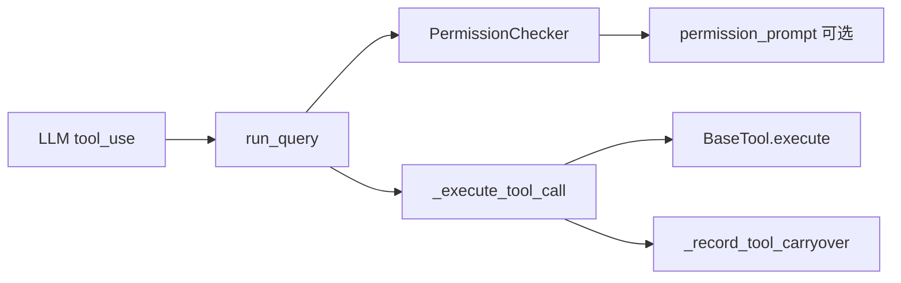
```mermaid
flowchart LR
    LLM[LLM tool_use] --> RQ[run_query]
    RQ --> PC[PermissionChecker]
    PC --> PP[permission_prompt 可选]
    RQ --> EX[_execute_tool_call]
    EX --> Tool[BaseTool.execute]
    EX --> Carry[_record_tool_carryover]
```

| 步骤 | 位置 | 说明 |
|------|------|------|
| 单 tool | `query.py` | 串行执行，立即 `ToolExecutionCompleted` |
| 多 tool | `query.py` | `asyncio.gather` 并发，再批量发 completed 事件 |
| 元数据携带 | `query.py` `_record_tool_carryover` | 如 `agent` 成功后 `_remember_async_agent_task` |

`permission_prompt` 是 UI 注入的 `async (tool_name, reason) -> bool`，在 `_execute_tool_call` 内 `await`；详见 [ARCHITECTURE_PERMISSIONS_MCP.md](./ARCHITECTURE_PERMISSIONS_MCP.md)。

---

## 3. 工具分类

| 类别 | 代表工具 | 说明 |
|------|----------|------|
| 文件 | `read_file`, `file_write`, `edit_file`, `notebook_edit` | `path` + offset/limit；可选 Docker sandbox 路径校验 |
| 搜索 | `grep`, `glob` | 基于 `rg` / `pathlib` |
| Shell | `bash` | 可经 sandbox 包装 |
| 子 Agent / 任务 | **`agent`**, `task_create`, `task_*`, `send_message` | 见 §4 |
| Swarm 编组 | `team_create`, `team_delete` | team 元数据 |
| Worktree | `enter_worktree`, `exit_worktree` | Git worktree 隔离（可选） |
| 规划 / 待办 | `todo_write`, `enter_plan_mode`, `exit_plan_mode` | |
| MCP | `mcp_*`, 动态 `McpToolAdapter` | 见 PERMISSIONS_MCP 文档 |
| 其他 | `web_fetch`, `web_search`, `skill`, `cron_*`, … | |

**不是** DeerFlow 的阻塞式 `task` 工具；OpenHarness 委派子 Agent 的工具名是 **`agent`**。

---

## 4. 子 Agent 与任务工具

### 4.1 `agent`（产品入口）

**源码**: `tools/agent_tool.py`

| 参数 | 含义 |
|------|------|
| `description` | 短描述（UI / `async_agent_tasks`） |
| `prompt` | 子 Agent 完整任务 |
| `subagent_type` | 查 `coordinator/agent_definitions` |
| `mode` | `local_agent`（默认）、`remote_agent`、`in_process_teammate` |
| `team` | Swarm 编排名 |

**执行路径**（当前实现）：

```python
executor = get_backend_registry().get_executor("subprocess")  # 固定 subprocess
result = await executor.spawn(TeammateSpawnConfig(...))
```

成功后 `_record_tool_carryover` → `_remember_async_agent_task` → `tool_metadata["async_agent_tasks"]`（供 Coordinator drain）。

**注意**：尽管 `mode` 含 `in_process_teammate`，**`AgentTool` 今日仍硬编码 `subprocess`**，以保证 `task_id` 可被 `task_*` 查询。In-process 仅通过 `InProcessBackend` 直接调用，不经 `agent` 工具。

### 4.2 `agent` vs `task_create` vs `task_*`

| 工具 | 路径 | 登记 `async_agent_tasks` |
|------|------|--------------------------|
| **`agent`** | `SubprocessBackend.spawn` → `create_agent_task` | ✅ |
| **`task_create`** | 直接 `BackgroundTaskManager`（`local_bash` / `local_agent`） | ❌ |
| **`task_output`** | `read_task_output`（读 log 尾部） | — |
| **`task_get/list/stop/update`** | TaskManager 元数据 | — |
| **`send_message`** | `write_to_task` 或 Swarm `send_message` | — |

Coordinator **spawn Worker 用 `agent`**，不是 `task_create`。`task_create` 的 `type` 仅为 `local_bash` 或 `local_agent`。

### 4.3 Spawn 底层链路

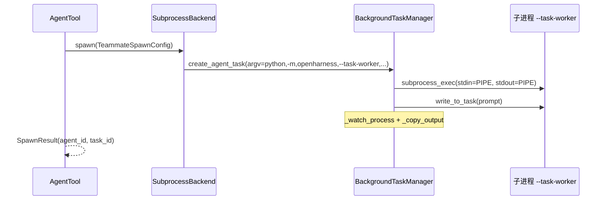
```mermaid
sequenceDiagram
    participant AT as AgentTool
    participant SB as SubprocessBackend
    participant BTM as BackgroundTaskManager
    participant Child as 子进程 --task-worker

    AT->>SB: spawn(TeammateSpawnConfig)
    SB->>BTM: create_agent_task(argv=python,-m,openharness,--task-worker,...)
    BTM->>Child: subprocess_exec(stdin=PIPE, stdout=PIPE)
    BTM->>Child: write_to_task(prompt)
    Note over BTM: _watch_process + _copy_output
    AT-->>AT: SpawnResult(agent_id, task_id)
```

子进程入口：`ui/app.py` → `run_task_worker`（无 TTY headless）。  
stdin 一行 prompt → `handle_line` → `QueryEngine.submit_message` → 完整 ReAct；**one-shot**（一条 prompt 后 `break`）。  
子进程权限：`permission_prompt=_noop_permission`（恒批准 UI 路径）。

### 4.4 主 Agent 如何拿到子 Agent 结果

| 模式 | 机制 |
|------|------|
| **普通** | 主 LLM 主动调 **`task_output`**；引擎 **不** 在 Worker 终态时自动 `submit_message` |
| **Coordinator** | UI 在 `submit_message` 之后调 **`drain_coordinator_async_agents`**（`ui/coordinator_drain.py`）→ `read_task_output` → `submit_message(<task-notification>)` |

详见 [ARCHITECTURE_COORDINATOR.md](./ARCHITECTURE_COORDINATOR.md)。

### 4.5 `send_message` 续聊

`tools/send_message_tool.py`：

- `task_id` 含 `@` → `SubprocessBackend.send_message`（JSON 行写 stdin）
- 否则 → `get_task_manager().write_to_task(task_id, message)`

子进程已退出时 `write_to_task` 可能 **`_restart_agent_task`**（新进程，**上下文不保留**）。

---

## 5. Spawn 分层与 I/O 边界

### 5.1 三层职责

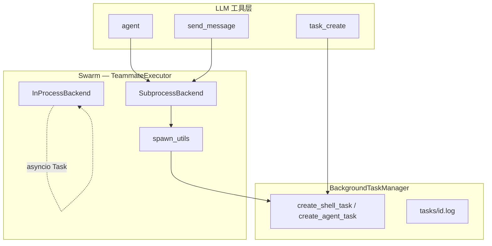
```mermaid
flowchart TB
    subgraph LLM["LLM 工具层"]
        AgentTool[agent]
        TaskCreate[task_create]
        SendMsg[send_message]
    end
    subgraph Swarm["Swarm — TeammateExecutor"]
        SB[SubprocessBackend]
        IP[InProcessBackend]
        SU[spawn_utils]
    end
    subgraph BTM["BackgroundTaskManager"]
        CST[create_shell_task / create_agent_task]
        LOG[tasks/id.log]
    end
    AgentTool --> SB
    SendMsg --> SB
    TaskCreate --> CST
    SB --> SU --> CST
    IP -.->|asyncio Task| IP
```

| 层 | 管什么 | 不管什么 |
|----|--------|----------|
| **BackgroundTaskManager** | 子进程、stdin/log、终态、`TaskRecord` | `agent_id@team`、LLM schema |
| **SubprocessBackend** | `agent_id↔task_id`、argv/env、`send_message` | 工具元数据、Coordinator 列表 |
| **AgentTool** | LLM `agent` 工具、`SUBAGENT_STOP` hook、`async_agent_tasks` | 如何 exec 子进程 |

`create_agent_task` ≈ `create_shell_task` + `write_to_task(prompt)`；**不是**另一种进程类型。
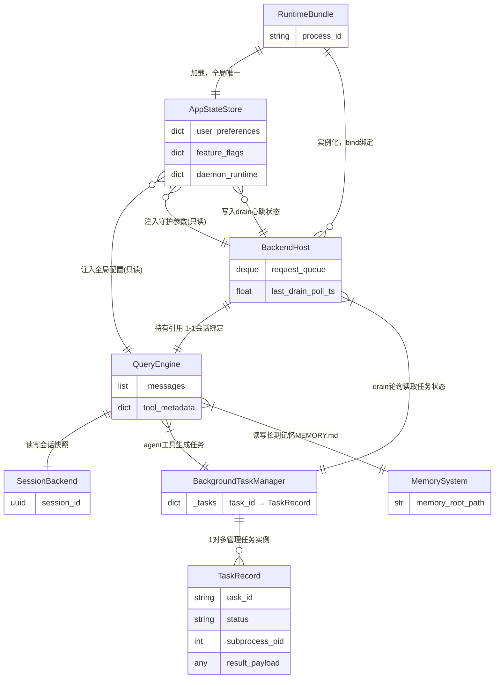
```mermaid
erDiagram

%% ========== 应用层全局单例 ==========
RuntimeBundle {
    string process_id
}
AppStateStore {
    dict user_preferences
    dict feature_flags
    dict daemon_runtime
}

%% ========== 宿主会话层 ==========
BackendHost {
    deque request_queue
    float last_drain_poll_ts
}
QueryEngine {
    list _messages
    dict tool_metadata
}
SessionBackend {
    uuid session_id
}

%% ========== 后台任务子系统 ==========
BackgroundTaskManager {
    dict _tasks "task_id → TaskRecord"
}
TaskRecord {
    string task_id
    string status
    int subprocess_pid
    any result_payload
}

%% ========== 长期记忆子系统 ==========
MemorySystem {
    str memory_root_path
}

%% ===================== 关系定义 =====================
RuntimeBundle ||--|| AppStateStore : "加载，全局唯一"
RuntimeBundle ||--o{ BackendHost : "实例化，bind绑定"

BackendHost ||--|| QueryEngine : "持有引用 1‑1会话绑定"
QueryEngine ||--|| SessionBackend : "读写会话快照"

QueryEngine }|--|| BackgroundTaskManager : "agent工具生成任务"
BackgroundTaskManager ||--o{ TaskRecord : "1对多管理任务实例"

BackendHost }|--|| BackgroundTaskManager : "drain轮询读取任务状态"

QueryEngine }|--|| MemorySystem : "读写长期记忆MEMORY.md"

%% 单向只读数据流
AppStateStore }o--|| QueryEngine : "注入全局配置(只读)"
AppStateStore }o--|| BackendHost : "注入守护参数(只读)"
BackendHost ||--o{ AppStateStore : "写入drain心跳状态"
```
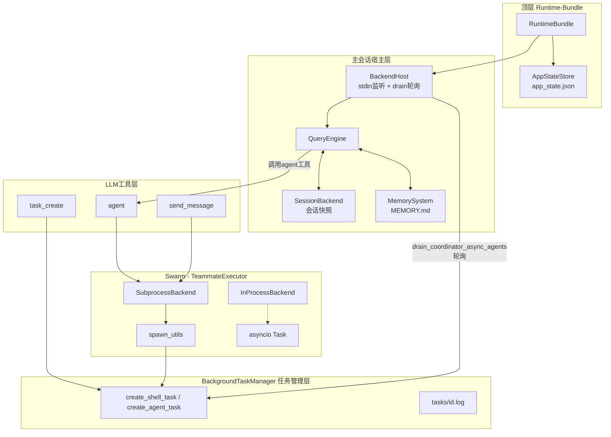
```mermaid
graph TB
   subgraph LLM工具层
      task_create["task_create"]
      agent["agent"]
      send_message["send_message"]
   end

   subgraph Swarm - TeammateExecutor
      SubprocessBackend["SubprocessBackend"]
      spawn_utils["spawn_utils"]
      InProcessBackend["InProcessBackend"]
      asyncioTask["asyncio Task"]
      InProcessBackend -.-> asyncioTask
   end

   subgraph BackgroundTaskManager 任务管理层
      create_task["create_shell_task / create_agent_task"]
      task_log["tasks/id.log"]
   end

%% 子任务调用链路
   task_create --> create_task
   agent --> SubprocessBackend
   send_message --> SubprocessBackend
   SubprocessBackend --> spawn_utils
   spawn_utils --> create_task

%% 上层宿主会话体系
   subgraph 顶层 Runtime-Bundle
      RuntimeBundle["RuntimeBundle"]
      AppStateStore["AppStateStore<br/>app_state.json"]
   end

   subgraph 主会话宿主层
      BackendHost["BackendHost<br/>stdin监听 + drain轮询"]
      QueryEngine["QueryEngine"]
      SessionBackend["SessionBackend<br/>会话快照"]
      MemorySystem["MemorySystem<br/>MEMORY.md"]
   end

   RuntimeBundle --> AppStateStore
   RuntimeBundle --> BackendHost
   BackendHost --> QueryEngine
   QueryEngine <--> SessionBackend
   QueryEngine <--> MemorySystem

   QueryEngine -->|调用agent工具| agent
   BackendHost -->|drain_coordinator_async_agents轮询| create_task
```
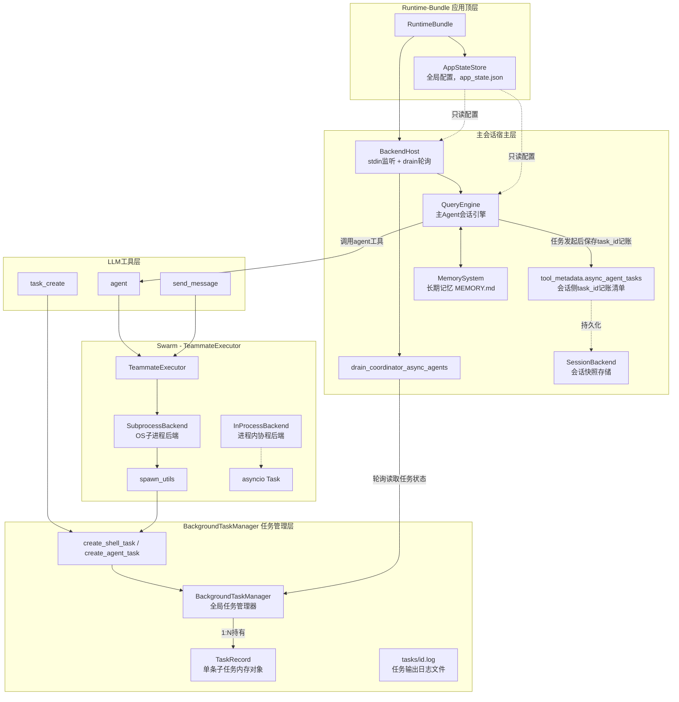
```mermaid
graph TB
    %% ========== 第一层：LLM工具层 ==========
    subgraph LLM工具层
        task_create["task_create"]
        agent["agent"]
        send_message["send_message"]
    end

    %% ========== 第二层：Swarm‑TeammateExecutor 执行后端层（子任务Backend） ==========
    subgraph Swarm - TeammateExecutor
        TeammateExecutor["TeammateExecutor"]
        SubprocessBackend["SubprocessBackend<br/>OS子进程后端"]
        spawn_utils["spawn_utils"]
        InProcessBackend["InProcessBackend<br/>进程内协程后端"]
        asyncioTask["asyncio Task"]
        InProcessBackend -.-> asyncioTask
    end

    %% ========== 第三层：全局任务管理层（全部Task内存实体） ==========
    subgraph BackgroundTaskManager 任务管理层
        BTM[BackgroundTaskManager<br/>全局任务管理器]
        create_task["create_shell_task / create_agent_task"]
        TaskRecord["TaskRecord<br/>单条子任务内存对象"]
        task_log["tasks/id.log<br/>任务输出日志文件"]
    end

    %% ========== 上层主会话 / 应用层完整实体 ==========
    subgraph Runtime-Bundle 应用顶层
        RuntimeBundle["RuntimeBundle"]
        AppStateStore["AppStateStore<br/>全局配置，app_state.json"]
    end

    subgraph 主会话宿主层
        BackendHost["BackendHost<br/>stdin监听 + drain轮询"]
        drain["drain_coordinator_async_agents"]
        QueryEngine["QueryEngine<br/>主Agent会话引擎"]
        SessionBackend["SessionBackend<br/>会话快照存储"]
        async_task_list["tool_metadata.async_agent_tasks<br/>会话侧task_id记账清单"]
        MemorySystem["MemorySystem<br/>长期记忆 MEMORY.md"]
    end

    %% ------------------------ 完整调用链路 ------------------------
    %% 1、主会话发起任务
    RuntimeBundle --> BackendHost
    BackendHost --> QueryEngine
    QueryEngine -->|调用agent工具| agent
    QueryEngine -->|任务发起后保存task_id记账| async_task_list
    async_task_list -.持久化.-> SessionBackend

    %% 2、LLM工具 → Swarm执行后端
    agent --> TeammateExecutor
    send_message --> TeammateExecutor
    task_create --> create_task
    TeammateExecutor --> SubprocessBackend
    SubprocessBackend --> spawn_utils
    spawn_utils --> create_task

    %% 3、任务管理器与TaskRecord实体关系
    create_task --> BTM
    BTM -->|1:N持有| TaskRecord

    %% 4、BackendHost drain轮询任务结果
    BackendHost --> drain
    drain -->|轮询读取任务状态| BTM

    %% 5、全局配置单向数据流
    RuntimeBundle --> AppStateStore
    AppStateStore -.只读配置.-> QueryEngine
    AppStateStore -.只读配置.-> BackendHost

    %% 6、记忆子系统
    QueryEngine <--> MemorySystem
```
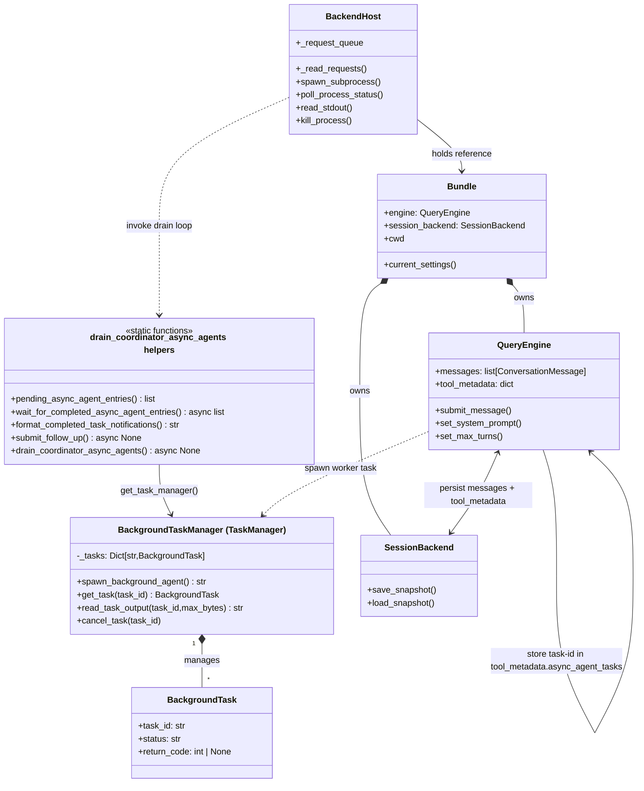
```mermaid
classDiagram
    class Bundle {
        +engine: QueryEngine
        +session_backend: SessionBackend
        +cwd
        +current_settings()
    }
    class QueryEngine {
        +messages: list[ConversationMessage]
        +tool_metadata: dict
        +submit_message()
        +set_system_prompt()
        +set_max_turns()
    }
    class BackgroundTaskManager["BackgroundTaskManager (TaskManager)"] {
        -_tasks: Dict[str,BackgroundTask]
        +spawn_background_agent() str
        +get_task(task_id) BackgroundTask
        +read_task_output(task_id,max_bytes) str
        +cancel_task(task_id)
    }
    class BackgroundTask {
        +task_id: str
        +status: str
        +return_code: int | None
    }
    class BackendHost {
        +_request_queue
        +_read_requests()
        +spawn_subprocess()
        +poll_process_status()
        +read_stdout()
        +kill_process()
    }
    %% 顶层静态工具函数集合，非实例对象
    class DrainHelpers["drain_coordinator_async_agents helpers"]{
        <<static functions>>
        +pending_async_agent_entries() list
        +wait_for_completed_async_agent_entries() async list
        +format_completed_task_notifications() str
        +submit_follow_up() async None
        +drain_coordinator_async_agents() async None
    }
    class SessionBackend {
        +save_snapshot()
        +load_snapshot()
    }

    %% ============ 关联关系 ============
    Bundle *-- QueryEngine : owns
    Bundle *-- SessionBackend : owns

    %% BackendHost持有Bundle，主会话宿主
    BackendHost --> Bundle : holds reference

    %% 任务体系：管理器管理任务实例
    BackgroundTaskManager "1" *-- "*" BackgroundTask : manages

    %% drain函数由BackendHost调用，传入引擎
    BackendHost ..> DrainHelpers : invoke drain loop

    DrainHelpers --> BackgroundTaskManager : get_task_manager()

    %% QueryEngine 任务发起成功后，把task_id写入tool_metadata记账
    QueryEngine ..> BackgroundTaskManager : spawn worker task
    QueryEngine --> QueryEngine : store task‑id in tool_metadata.async_agent_tasks

    %% 会话快照双向读写
    QueryEngine <--> SessionBackend : persist messages + tool_metadata
```

### 5.2 为何需要 `spawn` 而不是直接 `create_agent_task`

| # | `spawn` 增量 | 直接 `create_agent_task` |
|---|-------------|-------------------------|
| 1 | `agent_id = name@team` + `_agent_tasks` 映射 | 仅 `task_id` |
| 2 | `build_inherited_cli_flags` / `build_inherited_env_vars` | 自拼 argv/env |
| 3 | 统一 `SpawnResult` | 仅 `TaskRecord` |
| 4 | 与 `InProcessBackend` 共用协议 | 永远子进程 |

### 5.3 I/O 通道（Subprocess 路径）

| # | 通道 | 介质 |
|---|------|------|
| ① | spawn 工具调用 | 内存，非阻塞返回 `task_id` |
| ② | 父 → 子 | stdin PIPE（`write_to_task` / `send_message`） |
| ③ | 子 → 父 | stdout PIPE（stderr 并入） |
| ④ | 持久化 | `_copy_output` → `~/.openharness/.../tasks/{id}.log` |
| ⑤ | 父读子 | `task_output` / drain **读 log 尾部**，不读实时 pipe |
| ⑥ | LLM | 主、子各独立 HTTPS；**无**主子模型直连 |

**spawn 1 个子 Agent**：OS 进程 **2**（父+子）；父侧持久协程 **2**（`_watch_process` + `_copy_output`）。

完整图见 [ARCHITECTURE_TOOLS_SWARM.md](./ARCHITECTURE_TOOLS_SWARM.md) 深潜 · Spawn IO 拓扑。

---

## 6. Swarm 系统深度分析

Swarm（`swarm/`）对齐 Claude Code Agent Teams 思路：**队友（teammate）** 有统一身份 `name@team`、可 spawn / 发消息 / shutdown，执行方式可换（子进程、同进程协程、未来 tmux 窗格）。

与 **BackgroundTaskManager** 的关系：Swarm 是「编排语义层」；子进程路径最终仍调用 BTM 起 `--task-worker`。与 **Coordinator** 的关系：Coordinator 用 `agent` spawn Worker，drain 收结果；Swarm 不负责 XML notification。

### 6.0 Swarm 速查与易混点

#### 一句话

Swarm = **队友身份**（`name@team`）+ **可替换执行后端**（`TeammateExecutor`）+ **可选磁盘协作设施**（mailbox、team.json）。**不负责** LLM API、不负责 Coordinator 注入 `<task-notification>`。

#### 生产路径速查（2026-06 源码）

| 问题 | 答案 |
|------|------|
| LLM 委派子 Agent 用什么工具？ | **`agent`**（不是 `task_create`，不是 DeerFlow `task`） |
| `agent` 走哪个后端？ | **固定** `SubprocessBackend`（硬编码，非 `detect_backend()`） |
| 子进程如何收 prompt？ | **stdin PIPE**（`write_to_task`），**不是** Mailbox |
| 父进程如何读子输出？ | **log 文件**（`task_output` / drain），**不读**实时 stdout pipe |
| `spawn` vs `create_agent_task`？ | `spawn` 多 `agent_id`、argv/env 遗传、Swarm API；底层仍是 `create_agent_task` |
| 文件读写走 Swarm/BTM 吗？ | **否** — `read_file` 等直接读 `context.cwd` |
| Coordinator 收 Worker 结果？ | **drain** 读 BTM log，**不是** Swarm mailbox |
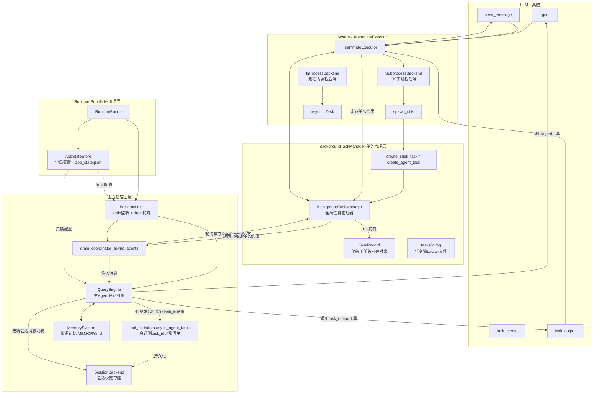
```mermaid
graph TB
    %% ========== 第一层：LLM工具层 ==========
    subgraph LLM工具层
        task_create["task_create"]
        agent["agent"]
        send_message["send_message"]
        task_output["task_output"]
    end
    %% ========== 第二层：Swarm‑TeammateExecutor 执行后端层（子任务Backend） ==========
    subgraph Swarm - TeammateExecutor
        TeammateExecutor["TeammateExecutor"]
        SubprocessBackend["SubprocessBackend<br/>OS子进程后端"]
        spawn_utils["spawn_utils"]
        InProcessBackend["InProcessBackend<br/>进程内协程后端"]
        asyncioTask["asyncio Task"]
        InProcessBackend -.-> asyncioTask
    end
    %% ========== 第三层：全局任务管理层（全部Task内存实体） ==========
    subgraph BackgroundTaskManager 任务管理层
        BTM[BackgroundTaskManager<br/>全局任务管理器]
        create_task["create_shell_task / create_agent_task"]
        TaskRecord["TaskRecord<br/>单条子任务内存对象"]
        task_log["tasks/id.log<br/>任务输出日志文件"]
    end
    %% ========== 上层主会话 / 应用层完整实体 ==========
    subgraph Runtime-Bundle 应用顶层
        RuntimeBundle["RuntimeBundle"]
        AppStateStore["AppStateStore<br/>全局配置，app_state.json"]
    end
    subgraph 主会话宿主层
        BackendHost["BackendHost<br/>stdin监听 + drain轮询"]
        drain["drain_coordinator_async_agents"]
        QueryEngine["QueryEngine<br/>主Agent会话引擎"]
        SessionBackend["SessionBackend<br/>会话快照存储"]
        async_task_list["tool_metadata.async_agent_tasks<br/>会话侧task_id记账清单"]
        MemorySystem["MemorySystem<br/>长期记忆 MEMORY.md"]
    end

    %% ------------------------ 【1.任务创建 正向链路】 ------------------------
    RuntimeBundle --> BackendHost
    BackendHost --> QueryEngine
    QueryEngine -->|调用agent工具| agent
    QueryEngine -->|任务发起后保存task_id记账| async_task_list
    async_task_list -.持久化.-> SessionBackend

    agent --> TeammateExecutor
    send_message --> TeammateExecutor
    TeammateExecutor --> SubprocessBackend
    SubprocessBackend --> spawn_utils
    spawn_utils --> create_task

    create_task --> BTM
    BTM -->|1:N持有| TaskRecord

    %% ------------------------ 【2.任务查询 + 结果回填闭环（新增）】 ------------------------
    BackendHost --> drain
    drain -->|轮询读取TaskRecord状态| BTM
    BTM -->|返回已完成任务结果| drain
    drain -->|注入<task‑notification>消息| QueryEngine
    QueryEngine -->|更新会话消息列表| SessionBackend

    %% 【LLM主动查询worker输出 / 下发消息】双向链路
    QueryEngine -->|调用task_output工具| task_output
    task_output --> TeammateExecutor
    TeammateExecutor -->|读取任务结果| BTM
    send_message <--> TeammateExecutor
    TeammateExecutor <--> BTM

    %% 5、全局配置单向数据流
    RuntimeBundle --> AppStateStore
    AppStateStore -.只读配置.-> QueryEngine
    AppStateStore -.只读配置.-> BackendHost

    %% 6、记忆子系统
    QueryEngine <--> MemorySystem
```


#### 易混点对照

| 易混概念 A | 易混概念 B | 区别 |
|------------|------------|------|
| `detect_backend()` | `AgentTool` 路径 | 前者可 theoretically 选 in_process/tmux；**后者永远 subprocess** |
| `detect_pane_backend()` | `spawn` | 前者给 **tmux/iTerm2 分屏 UI**；与 `agent` spawn **无关** |
| `TeamRegistry`（内存） | `TeamLifecycleManager`（磁盘） | `team_create` 只动内存；`team.json` 给完整 Swarm UI / 清理 |
| `TeammateMailbox` | subprocess stdin | **两条 IPC**：Mailbox 给 in_process/权限库；**生产 spawn 用 stdin** |
| `permission_sync` | `permission_prompt` | 前者库 **未接** `query.py`；后者 UI 注入主 agent |
| `mode=in_process_teammate` | 实际执行 | `AgentTool` **仍 subprocess**；in_process 需直接调 `InProcessBackend` |
| `SUBAGENT_STOP` hook | Coordinator drain | Hook **可观测**；XML 由 **drain** 注入，不由 Hook 写 metadata |

#### 三条 IPC（复习）

| 路径 | 后端 | 父→子 | 子→父 | 读结果 |
|------|------|-------|-------|--------|
| **A stdin + log** | subprocess（默认） | `write_to_task` | stdout→log | `task_output` / drain |
| **B Mailbox 文件** | in_process、permission_sync | inbox JSON | `idle_notification` 等 | 读 inbox |
| **C 内存 queue** | in_process 同进程 | `message_queue` | 无独立 log | 同进程事件流 |

端到端 spawn（Subprocess）：

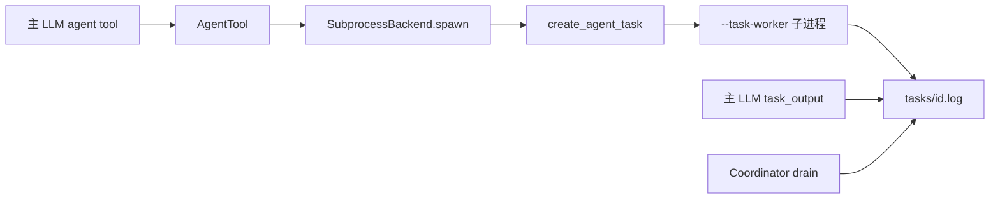
```mermaid
flowchart LR
    LLM[主 LLM agent tool] --> AT[AgentTool]
    AT --> SB[SubprocessBackend.spawn]
    SB --> BTM[create_agent_task]
    BTM --> Child[--task-worker 子进程]
    Child --> Log[tasks/id.log]
    LLM2[主 LLM task_output] --> Log
    Drain[Coordinator drain] --> Log
```

进程/协程数量见本文 **深潜 · Spawn IO 拓扑**。

### 6.1 模块地图与设计目标

```
swarm/
├── types.py              # TeammateExecutor / PaneBackend 协议，SpawnConfig/Result
├── registry.py           # BackendRegistry 单例，detect_backend / detect_pane_backend
├── subprocess_backend.py # 生产 spawn：BTM + agent_id 映射
├── in_process.py         # asyncio Task 队友 + ContextVar 隔离
├── spawn_utils.py        # argv/env/CLI flags 遗传
├── mailbox.py            # ~/.openharness/teams/.../inbox 文件队列
├── team_lifecycle.py     # team.json 持久化、成员 CRUD、会话清理
├── worktree.py           # Git worktree 隔离
├── permission_sync.py    # leader↔worker 权限（文件 + mailbox，未接 query）
├── lockfile.py           # mailbox/team 文件写锁
└── subagent_logging.py   # spawn 结构化日志
```

| 设计目标 | 实现手段 |
|----------|----------|
| 后端可替换 | `TeammateExecutor` 协议 + `BackendRegistry` |
| 队友身份稳定 | `agent_id = f"{name}@{team}"` |
| 跨 tmux 边界遗传配置 | `build_inherited_env_vars` / `build_inherited_cli_flags` |
| 可视化队友（规划） | `PaneBackend`（tmux / iTerm2）独立于 `TeammateExecutor` |
| 权限与消息（规划/部分） | `TeammateMailbox` + `permission_sync` |

### 6.2 类型与协议

**核心协议**（`swarm/types.py`）：

```python
class TeammateExecutor(Protocol):
    type: BackendType  # subprocess | in_process | tmux | iterm2
    def is_available() -> bool: ...
    async def spawn(config: TeammateSpawnConfig) -> SpawnResult: ...
    async def send_message(agent_id: str, message: TeammateMessage) -> None: ...
    async def shutdown(agent_id: str, *, force: bool = False) -> bool: ...
```

**`TeammateSpawnConfig`** 字段（spawn 入参）：

| 字段 | 含义 |
|------|------|
| `name`, `team` | 组成 `agent_id` |
| `prompt`, `cwd` | 初始任务与工作目录 |
| `parent_session_id` | 与主会话关联 |
| `model`, `command` | 模型 / 自定义启动命令 |
| `system_prompt`, `system_prompt_mode` | 子 agent 定义里的 worker prompt |
| `permissions`, `plan_mode_required` | 来自 `agent_definitions` |
| `worktree_path` | 可选 Git 隔离路径 |
| `task_type` | `local_agent` / `remote_agent` / `in_process_teammate`（记入 TaskRecord） |

**`SpawnResult`**：`task_id`、`agent_id`、`backend_type`、`success`、`error`、可选 `pane_id`。

**`PaneBackend`**（另一套协议）：管理 tmux/iTerm2 **窗格**（创建、发命令、边框颜色、hide/show），与「队友是否在子进程跑」解耦——用于 **UI 可视化**，不是当前 `agent` 工具的必经路径。

### 6.3 BackendRegistry 与后端选择

单例：`get_backend_registry()`（`swarm/registry.py`）。

#### 6.3.1 已注册后端（`_register_defaults`）

| Backend | 何时注册 | `TeammateExecutor` 实现 |
|---------|----------|-------------------------|
| **subprocess** | 总是 | `SubprocessBackend` |
| **in_process** | `get_platform_capabilities().supports_swarm_mailbox` | `InProcessBackend` |
| **tmux** | **未注册**（注释：deferred） | — |

#### 6.3.2 `detect_backend()` — 选 TeammateExecutor

优先级（缓存于 `_detected`）：

1. **`_in_process_fallback_active`** → `in_process`（需先 `mark_in_process_fallback()`）
2. **在 tmux 会话内** 且 `tmux` 已注册 → `tmux`
3. **默认** → `subprocess`

**现状**：`mark_in_process_fallback()` **无生产调用方**；`TmuxBackend` **未注册** → 除显式 `get_executor("in_process")` 外，**自动检测恒为 subprocess**。

#### 6.3.3 `get_preferred_backend(config)`

读取 `teammate_mode`：

- 配置 / 环境变量 `OPENHARNESS_TEAMMATE_MODE`：`auto` | `in_process` | `tmux`
- `auto` 时走 `detect_backend()`

#### 6.3.4 `detect_pane_backend()` — 选可视化窗格（非 spawn 主路径）

用于 **tmux/iTerm2 分屏 UI**，优先级：

1. 在 tmux 内 → tmux
2. 在 iTerm2 且 `it2` CLI 可用 → iterm2
3. iTerm2 无 it2 但有 tmux 二进制 → tmux（`needs_setup=True`）
4. 仅 tmux 二进制可用 → tmux external session
5. 否则 `RuntimeError`（附安装说明）

与 `AgentTool`（硬编码 `get_executor("subprocess")`）**独立**。

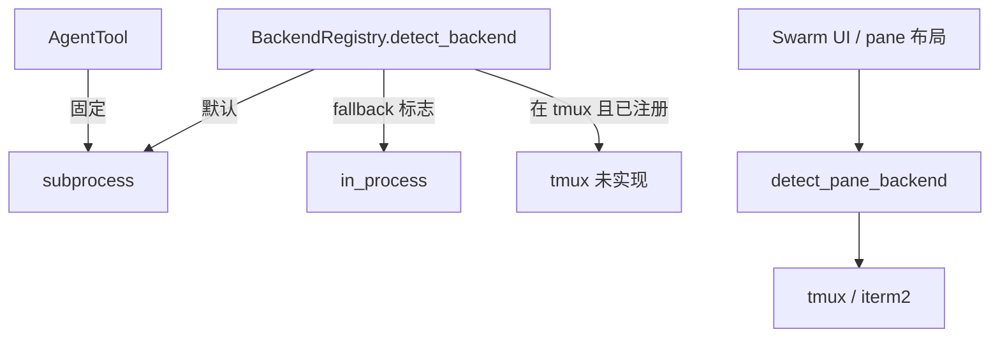
```mermaid
flowchart TD
    AT[AgentTool] -->|固定| SB[subprocess]
    BR[BackendRegistry.detect_backend] -->|fallback 标志| IP[in_process]
    BR -->|在 tmux 且已注册| TMUX[tmux 未实现]
    BR -->|默认| SB
    UI[Swarm UI / pane 布局] --> DPB[detect_pane_backend]
    DPB --> TMUX2[tmux / iterm2]
```

### 6.4 SubprocessBackend（生产路径）

**源码**：`swarm/subprocess_backend.py`

| 职责 | 实现 |
|------|------|
| `spawn` | 拼 argv → `create_agent_task` → 登记 `_agent_tasks[agent_id]=task_id` |
| `send_message` | JSON 行 → `write_to_task` |
| `shutdown` | `stop_task` + 移除映射 |
| `get_task_id` | 查 `agent_id` |

**argv 构建**（`command` 未指定时）：

```text
{get_teammate_command()} -m openharness --task-worker + build_inherited_cli_flags(...)
```

`get_teammate_command()`：优先 `OPENHARNESS_TEAMMATE_COMMAND`，否则 `sys.executable`（保证与父进程同 venv）。

**env**：`build_inherited_env_vars()` 合并进子进程环境，并强制：

- `OPENHARNESS_AGENT_TEAMS=1`
- `CLAUDE_CODE_COORDINATOR_MODE=0`（子 worker 不递归进 Coordinator）

**IPC**：stdin PIPE（输入）+ stdout→log（输出）。**不使用** `TeammateMailbox` 作为主通道。

### 6.5 InProcessBackend

**源码**：`swarm/in_process.py`

| 维度 | 行为 |
|------|------|
| 执行单元 | `asyncio.create_task(start_in_process_teammate(...))` |
| `task_id` | `in_process_{uuid12}` — **TaskManager 不可查** |
| 隔离 | `contextvars`：`TeammateContext` + `TeammateAbortController` |
| `send_message` | 写 `TeammateMailbox` 文件；若可访问 `TeammateContext` 还可推 `message_queue` |
| `shutdown` | graceful `request_cancel` 或 `force` + `Task.cancel()` |

**`start_in_process_teammate` 循环**（当传入 `query_context` 时）：

1. 绑定 `TeammateContext`
2. 跑 `run_query`（与主 agent 相同引擎）
3. 每轮之间 `_drain_mailbox`：把 `user_message` / `shutdown` 注入 `message_queue`
4. 结束时向 leader mailbox 写 `idle_notification`

**未接线状态**：默认 `query_context=None` 时仅为 **stub**（sleep 循环 + 日志），文档与代码注释均标明需后续接入完整 `QueryContext` builder。

**注册条件**：平台 `supports_swarm_mailbox` 为 false 时 **不注册** `InProcessBackend`。

### 6.6 Mailbox 文件 IPC

**源码**：`swarm/mailbox.py`

**目录布局**：

```text
~/.openharness/teams/<team>/
  team.json                    # TeamLifecycleManager
  agents/<agent_id>/inbox/
    <timestamp>_<id>.json       # 单条消息
    .write_lock                # exclusive_file_lock
```

**消息类型**（`MessageType`）：

| type | 用途 |
|------|------|
| `user_message` | 队友续聊 |
| `shutdown` | 请求退出 |
| `idle_notification` | 队友空闲/结束摘要 |
| `permission_request` / `permission_response` | 工具权限（规划） |
| `sandbox_permission_request` / `sandbox_permission_response` | 沙箱网络权限（规划） |

**写入**：先写 `.tmp` 再 `os.replace` 原子落盘；`write()` 在线程池执行并加锁。

**谁在用**：

- **InProcessBackend** `send_message` → 写 inbox
- **permission_sync** mailbox 分支
- **Subprocess 生产路径**：主通道是 stdin，**不用** mailbox 收 prompt

`write_to_mailbox(recipient, message_dict)` 为全局便利函数，解析 JSON `text` 推断消息类型。
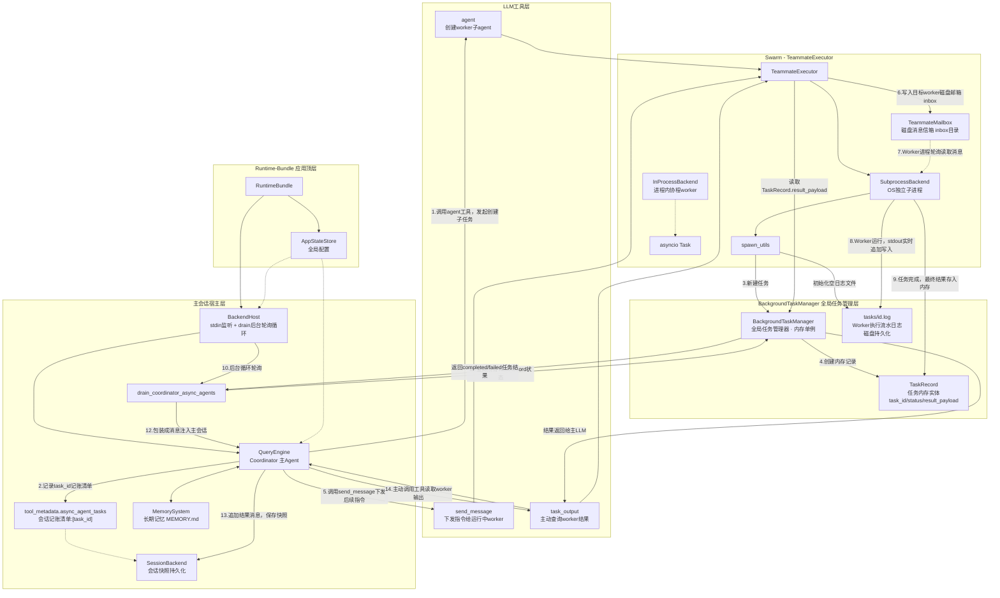
```mermaid
graph TB
   subgraph LLM工具层
      agent["agent<br/>创建worker子agent"]
      send_message["send_message<br/>下发指令给运行中worker"]
      task_output["task_output<br/>主动查询worker结果"]
   end

   subgraph Swarm - TeammateExecutor
      TeammateExecutor["TeammateExecutor"]
      SubprocessBackend["SubprocessBackend<br/>OS独立子进程"]
      spawn_utils["spawn_utils"]
      InProcessBackend["InProcessBackend<br/>进程内协程worker"]
      asyncioTask["asyncio Task"]
      InProcessBackend -.-> asyncioTask
      TeammateMailbox["TeammateMailbox<br/>磁盘消息信箱 inbox目录"]
   end

subgraph BackgroundTaskManager 全局任务管理层
BTM[BackgroundTaskManager<br/>全局任务管理器 · 内存单例]
TaskRecord["TaskRecord<br/>任务内存实体<br/>task_id/status/result_payload"]
task_log["tasks/id.log<br/>Worker执行流水日志<br/>磁盘持久化"]
end

subgraph Runtime-Bundle 应用顶层
RuntimeBundle["RuntimeBundle"]
AppStateStore["AppStateStore<br/>全局配置"]
end

subgraph 主会话宿主层
BackendHost["BackendHost<br/>stdin监听 + drain后台轮询循环"]
drain["drain_coordinator_async_agents"]
QueryEngine["QueryEngine<br/>Coordinator 主Agent"]
SessionBackend["SessionBackend<br/>会话快照持久化"]
async_task_list["tool_metadata.async_agent_tasks<br/>会话记账清单:[task_id]"]
MemorySystem["MemorySystem<br/>长期记忆 MEMORY.md"]
end

%% 链路1：创建子Agent（Spawn）
RuntimeBundle --> BackendHost
BackendHost --> QueryEngine

QueryEngine -->|1.调用agent工具，发起创建子任务| agent
QueryEngine -->|2.记录task_id记账清单| async_task_list
async_task_list -.-> SessionBackend

agent --> TeammateExecutor
TeammateExecutor --> SubprocessBackend
SubprocessBackend --> spawn_utils
spawn_utils -->|3.新建任务| BTM
BTM -->|4.创建内存记录| TaskRecord
spawn_utils -->|初始化空日志文件| task_log

%% 链路2：Mailbox信箱 主下发指令→Worker
QueryEngine -->|5.调用send_message下发后续指令| send_message
send_message --> TeammateExecutor
TeammateExecutor -->|6.写入目标worker磁盘邮箱 inbox| TeammateMailbox
TeammateMailbox -.->|7.Worker进程轮询读取消息| SubprocessBackend

%% 链路3：Worker执行，双路输出：内存结果 + 磁盘流水日志
SubprocessBackend -->|8.Worker运行，stdout实时追加写入| task_log
SubprocessBackend -->|9.任务完成，最终结果存入内存| TaskRecord

%% 链路4‑A：被动自动回填（Drain轮询）
BackendHost -->|10.后台循环轮询| drain
drain -->|11.查询所有TaskRecord状态| BTM
BTM -->|返回completed/failed任务结果| drain
drain -->|12.包装成<task‑notification>消息注入主会话| QueryEngine
QueryEngine -->|13.追加结果消息，保存快照| SessionBackend

%% 链路4‑B：主Agent主动查询结果 task_output
QueryEngine -->|14.主动调用工具读取worker输出| task_output
task_output --> TeammateExecutor
TeammateExecutor -->|读取TaskRecord.result_payload| BTM
BTM -->|结果返回给主LLM| task_output
task_output --> QueryEngine

%% 全局配置数据流
RuntimeBundle --> AppStateStore
AppStateStore -.-> QueryEngine
AppStateStore -.-> BackendHost

QueryEngine <--> MemorySystem
```


### 6.7 spawn_utils 配置遗传

**源码**：`swarm/spawn_utils.py`

**`build_inherited_cli_flags`** 转发项（节选）：

| 类别 | 示例 flag / 行为 |
|------|------------------|
| 权限 | `--dangerously-skip-permissions`、`--permission-mode acceptEdits`（`plan_mode_required` 时抑制 bypass） |
| 模型 | `--model`（非 `inherit`） |
| System prompt | `--system-prompt` / `--append-system-prompt` |
| 插件 | `--plugin-dir` 每个目录 |
| 模式 | `--teammate-mode` |

**`build_inherited_env_vars`** 转发 `_TEAMMATE_ENV_VARS` 列表中已设置的变量（API key、proxy、`OPENHARNESS_*`、CA bundle 等），保证 tmux 新 shell 不丢配置。

### 6.8 Team 双轨：内存 Registry vs 磁盘 Lifecycle

OpenHarness 存在 **两套** team 概念，勿混用：

| 系统 | 位置 | 存储 | 用途 |
|------|------|------|------|
| **`TeamRegistry`** | `coordinator/coordinator_mode.py` | **进程内** dict | `team_create` / `team_delete` 工具；`agent` 指定 `team` 时 `add_agent(team, task_id)` |
| **`TeamLifecycleManager`** | `swarm/team_lifecycle.py` | **`~/.openharness/teams/<name>/team.json`** | 持久化成员元数据、worktree 路径、tmux pane id、allowed_paths |

`TeamFile` / `TeamMember` 字段包括：`backend_type`、`tmux_pane_id`、`worktree_path`、`status`、`is_active` 等——面向 **完整 Swarm UI** 与清理（`cleanup_session_teams` 杀 orphan pane、删 worktree）。

`team_create` 工具 **只** 操作内存 `TeamRegistry`，**不** 写 `team.json`。

### 6.9 Worktree 隔离

**源码**：`swarm/worktree.py` + 工具 `enter_worktree` / `exit_worktree`

- `validate_worktree_slug`：防路径穿越
- 创建独立 git worktree 目录，可选 symlink `node_modules` 等
- `TeammateSpawnConfig.worktree_path` 可把队友 cwd 指到 worktree
- `cleanup_team_directories` 在 team 销毁时 `git worktree remove` 或 `rmtree`

与 spawn **无强绑定**；可在 spawn 前改 `cwd` 或配置 `worktree_path`。

### 6.10 permission_sync（库，未接入主循环）

**源码**：`swarm/permission_sync.py`

两套并行设计（对齐 TS 源码）：

| 方式 | 路径 | 流程 |
|------|------|------|
| **文件目录** | `teams/<team>/permissions/pending|resolved/` | worker 写 pending → leader resolve |
| **Mailbox** | `permission_request` / `permission_response` 消息 | `send_permission_request_via_mailbox` 等 |

依赖环境变量：`CLAUDE_CODE_TEAM_NAME`、`CLAUDE_CODE_AGENT_ID`、`CLAUDE_CODE_AGENT_NAME` 等。

**接入状态**：**未**在 `engine/query.py` `_execute_tool_call` 中调用。当前子 `--task-worker` 使用 `_noop_permission`；主 agent 用 UI `permission_prompt`。

### 6.11 三条 IPC 路径对比

| 路径 | 适用后端 | 父→子输入 | 子→父输出 | 读结果方式 |
|------|----------|-----------|-----------|------------|
| **A. stdin + log** | subprocess（`agent` 默认） | `write_to_task` / PIPE | stdout → `tasks/{id}.log` | `task_output` / drain |
| **B. Mailbox 文件** | in_process、权限库 | `TeammateMailbox.write` | `idle_notification` 等 | 读 inbox / drain mailbox |
| **C. 内存 queue** | in_process（同进程优化） | `TeammateContext.message_queue` | 无独立 log | 同进程 `run_query` 事件流 |

**LLM API**：每条路径下主、子均为 **独立 HTTPS 会话**（无 socket 直连）。

### 6.12 与 Tools / Coordinator 集成点

```mermaid
flowchart LR
    subgraph Tools
        AgentTool[agent]
        SendMsg[send_message]
        TeamCreate[team_create]
    end
    subgraph Swarm
        SB[SubprocessBackend]
        BR[BackendRegistry]
        TR[TeamRegistry 内存]
        TLM[TeamLifecycleManager 磁盘]
    end
    subgraph Other
        BTM[BackgroundTaskManager]
        Drain[coordinator_drain]
    end
    AgentTool -->|get_executor subprocess| SB
    AgentTool -->|team 参数| TR
    SendMsg -->|@ in task_id| SB
    TeamCreate --> TR
    SB --> BTM
    Drain --> BTM
```

| 集成点 | 行为 |
|--------|------|
| `AgentTool.execute` | `SubprocessBackend.spawn`；`SUBAGENT_STOP` completion listener；可选 `team` → `TeamRegistry.add_agent` |
| `SendMessageTool` | `agent_id@team` → `SubprocessBackend.send_message` |
| `_remember_async_agent_task` | spawn 成功后登记，**非** Swarm 模块 |
| `drain_coordinator_async_agents` | 读 BTM log，**非** mailbox；由 `backend_host._process_line`、`run_print_mode`、`textual_app` 在 `handle_line` 后调用（**非** `QueryEngine` 内） |
| Hooks `SUBAGENT_STOP` | 可观测终态，**不**注入 task-notification |

### 6.13 规划中：Pane 可视化后端

| 组件 | 状态 |
|------|------|
| `TmuxBackend` 注册 | 未实现（`registry._register_defaults` 注释 deferred） |
| `PaneBackend` API | 类型与 `detect_pane_backend` 已就绪 |
| `TeamMember.tmux_pane_id` | 字段已预留 |
| `cleanup_session_teams` | 已实现 orphan pane kill（需 pane backend 存在时） |

预期形态：leader 在 tmux 分屏 spawn 可见窗格，队友命令经 `send_command_to_pane`；执行体仍可能是 subprocess 或 in_process，窗格仅 **展示 + 输入路由**。

### 6.14 队友生命周期与状态

#### Subprocess 路径（`BackgroundTaskManager`）

`create_shell_task` / `create_agent_task` 创建时 **`status="running"`**（非 pending）。

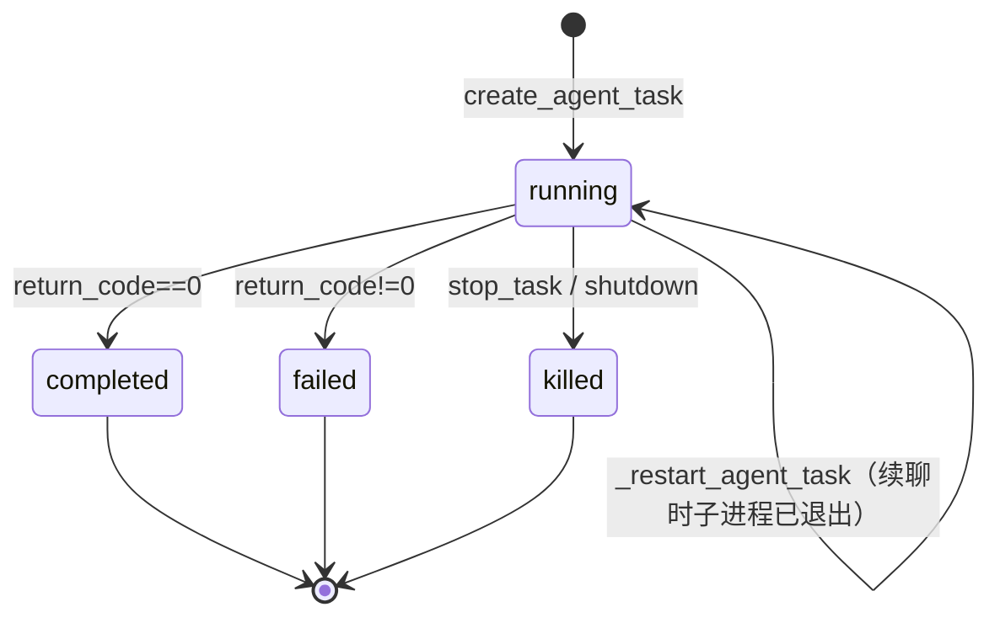
```mermaid
stateDiagram-v2
    [*] --> running: create_agent_task
    running --> completed: return_code==0
    running --> failed: return_code!=0
    running --> killed: stop_task / shutdown
    completed --> [*]
    failed --> [*]
    killed --> [*]
    running --> running: _restart_agent_task（续聊时子进程已退出）
```

| 阶段 | 父进程协程 | 子进程 |
|------|------------|--------|
| spawn 后 | `_watch_process` + `_copy_output` 启动 | `run_task_worker` 读 stdin |
| 一条 prompt | 持续写 log | `submit_message` → `run_query` → one-shot `break` |
| 续聊 | 可能 `_restart_agent_task`（**上下文不保留**） | 新子进程或仍存活进程 |
| 终态 | `_watch_process` 更新 `TaskRecord`、触发 completion listener | 进程退出 |

`AgentTool` 注册的 completion listener → `HookEvent.SUBAGENT_STOP`（**不**写 task-notification）。

#### In-process 路径（`TeammateContext.status`）

| 状态 | 含义 |
|------|------|
| `starting` | `start_in_process_teammate` 入口 |
| `running` | 正在跑 query 循环（或 stub） |
| `idle` | stub 分支短暂空闲 |
| `stopping` | 收到 shutdown / cancel |
| `stopped` | finally 块；写 `idle_notification` 到 leader mailbox |

**`TeammateAbortController`**：

- **graceful**：`request_cancel()` → `cancel_event`；队友在轮次间退出
- **force**：`request_cancel(force=True)` → `force_cancel` + `Task.cancel()`

### 6.15 BTM / 文件工具与 Swarm 边界

Swarm 与「仓库文件 I/O」**无直接关系**：

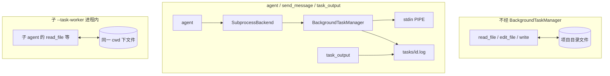
```mermaid
flowchart TB
    subgraph 不经BTM["不经 BackgroundTaskManager"]
        RF[read_file / edit_file / write]
        FS[(项目目录文件)]
        RF <--> FS
    end
    subgraph 经SwarmBTM["agent / send_message / task_output"]
        AT[agent] --> SB[SubprocessBackend]
        SB --> BTM[BackgroundTaskManager]
        BTM --> Pipe[stdin PIPE]
        BTM --> Log[tasks/id.log]
        TO[task_output] --> Log
    end
    subgraph 子进程内["子 --task-worker 进程内"]
        ChildTools[子 agent 的 read_file 等]
        ChildFS[(同一 cwd 下文件)]
        ChildTools <--> ChildFS
    end
```

| 操作 | 执行位置 | 是否经 BTM |
|------|----------|------------|
| 主 agent `read_file` | 父进程工具 | ❌ |
| `agent` spawn | 父进程 → BTM 起子进程 | ✅ |
| `send_message` → stdin | 父进程 → BTM `write_to_task` | ✅ |
| `task_output` | 父进程读 log | ✅（读文件，非 pipe） |
| 子 agent `read_file` | **子进程**内独立工具 | ❌ |
| 子 stdout 文本 | 子进程 → BTM `_copy_output` | ✅（落 log） |
| 主/子 LLM API | 各自进程 `api_client` | ❌ |

### 6.16 已交付 vs 规划中

| 能力 | 状态 | 说明 |
|------|------|------|
| `TeammateExecutor` 协议 | ✅ 已交付 | `types.py` |
| `SubprocessBackend` spawn/send/shutdown | ✅ **生产默认** | `agent` 硬编码 |
| `build_inherited_cli_flags` / env | ✅ 已交付 | `spawn_utils.py` |
| `BackgroundTaskManager` stdin/log | ✅ 已交付 | subprocess IPC |
| `TeammateMailbox` 文件队列 | ✅ 已交付 | in_process / 权限库 |
| `TeamLifecycleManager` + `team.json` | ✅ 已交付 | 磁盘 team 元数据 |
| `TeamRegistry` 内存 | ✅ 已交付 | `team_create`、`agent(team=...)` |
| Git worktree | ✅ 已交付 | `worktree.py` + 工具 |
| `InProcessBackend` 注册 | ✅ 条件注册 | 需 `supports_swarm_mailbox` |
| In-process 完整 `run_query` | ⚠️ 部分 | 默认 `query_context=None` 为 **stub** |
| `permission_sync` 库 | ⚠️ 库存在 | **未接** `query.py` |
| `detect_pane_backend` | ✅ API 就绪 | 供 Swarm UI |
| `TmuxBackend` / `PaneBackend` 实现 | ❌ 未注册 | `registry` 注释 deferred |
| `mark_in_process_fallback` 自动降级 | ❌ 无调用方 | 仅测试/手动 |
| `AgentTool` 走 in_process | ❌ 未实现 | 硬编码 subprocess |
| Mailbox 作为 subprocess 主 IPC | ❌ 非设计 | stdin 为主 |
| `swarm_status` → React `SwarmPanel` | ⚠️ 半交付 | emit API + 前端已实现；Swarm 后端 **未调用** `_emit_swarm_status`（见 [BACKEND_HOST_ARCHITECTURE §7](./BACKEND_HOST_ARCHITECTURE.md#7-swarm-状态推送机制预留-api)） |
| 任务列表 UI | ✅ | `tasks_snapshot`，与 `swarm_status` 无关 |

### 6.17 stdin 与 `send_message` 协议

#### 初始 prompt（`create_agent_task`）

`tasks/manager.py` → `_encode_task_worker_payload`：

- 单行文本（无换行）→ 原样 + `\n`
- 含换行 → `json.dumps({"text": ...})` + `\n`
- 已是 `{"text":...}` JSON → 原样

子进程 `ui/app.py` → `_decode_task_worker_line` 解析为纯文本 prompt。

#### `send_message`（`SubprocessBackend`）

`subprocess_backend.py` 序列化 `TeammateMessage` 为 **单行 JSON**：

```json
{"text":"...","from":"coordinator","timestamp":...,"color":...,"summary":...}
```

经 `write_to_task` 写入 stdin。子 worker 同样走 `_decode_task_worker_line` → `handle_line` → `submit_message`。

#### `send_message`（`SendMessageTool` 路由）

| `task_id` 格式 | 路径 |
|----------------|------|
| 含 `@`（如 `researcher@default`） | `SubprocessBackend.send_message` |
| 纯 task id（如 `a1b2c3d4`） | 直接 `get_task_manager().write_to_task` |

#### In-process `send_message`

写 `TeammateMailbox`（`agents/<agent_name>/inbox/`），消息类型 `user_message`；`_drain_mailbox` 转入 `message_queue`。

### 6.18 如何启动与交互（实操）

> 与 [BACKEND_HOST_ARCHITECTURE §10–§11](./BACKEND_HOST_ARCHITECTURE.md#10-多-agentcoordinator-编排-vs-swarm-基础设施) 对齐。

#### 没有 `oh --swarm`

多 Agent 不是独立 CLI 模式。凡 `oh` 会话内由 **`agent` 工具** spawn；Swarm 指 `swarm/` 库 + BTM，**默认**走 `SubprocessBackend`。

#### 常用启动组合

| 目标 | 命令 / 动作 |
|------|-------------|
| 交互单 Agent | `oh` |
| 单次任务 | `oh -p "..."` |
| Coordinator 编排 + 自动收 Worker | `CLAUDE_CODE_COORDINATOR_MODE=1 oh` 或 `oh -p` |
| spawn 队友 | 会话内 `agent({ description, prompt, subagent_type, team? })` |

#### `agent` 工具要点（`tools/agent_tool.py`）

- **硬编码** `registry.get_executor("subprocess")` — 忽略 `detect_backend()` / `OPENHARNESS_TEAMMATE_MODE`。
- 返回 `task_id`、`agent_id`（`name@team`）。
- Worker 为 `--task-worker` 子进程；续聊用 `send_message(task_id="worker@default", ...)`（stdin JSON 行）。

#### 主 Agent ↔ Worker 交互表

| 动作 | 工具 / 机制 |
|------|-------------|
| 派发 | `agent`（非阻塞） |
| 续聊 | `send_message` |
| 停止（Coordinator） | `task_stop` |
| 查状态/输出 | `task_list`、`task_output` |
| 自动收结果（Coordinator） | `coordinator_drain` → `<task-notification>` |
| UI 任务侧栏 | `tasks_snapshot` |
| Swarm 专用面板 | `swarm_status`（前端 ✅，Python 未 emit） |

#### Coordinator drain 宿主

| 宿主 | 是否 drain |
|------|------------|
| 默认 `oh`（React 子进程 BackendHost） | ✅ `_process_line` 末尾 |
| `oh -p` | ✅ `app.run_print_mode` |
| `oh --backend-only` | ✅ `run_backend_host` |
| `app.run_repl` 父进程（仅 launch React） | ❌ |

#### 勿与默认路径混淆

| 说法 | 实际 |
|------|------|
| Mailbox 是 spawn 默认 IPC | ❌ 默认 stdin + BTM log |
| `mode=in_process_teammate` 经 AgentTool | ❌ AgentTool 仍 subprocess |
| `get_executor("tmux")` 可用 | ❌ 未注册 |
| Worker 完成 idle → Leader Mailbox | 仅 in-process 规划路径 |

Mailbox / in-process / tmux 见 §6.5–6.6、§6.13；自定义集成须直接调 `InProcessBackend` 或等产品接线。

---

## 7. 权限与工具执行策略

### 7.1 执行策略

- **单 `tool_use`**：串行，`await _execute_tool_call`。
- **多 `tool_use`**：`asyncio.gather(..., return_exceptions=True)`，保证每个 `tool_use` 都有 `tool_result`。

### 7.2 权限

1. `PermissionChecker.evaluate`（硬规则：路径、模式等）
2. 若 `requires_confirmation` 且注入了 `permission_prompt` → `await permission_prompt(tool_name, reason)`
3. `tool.execute`

| 宿主 | `permission_prompt` |
|------|----------------------|
| React `backend_host` | stdin/stdout modal IPC |
| Textual | `PermissionScreen` |
| `--task-worker` | `_noop_permission` → 恒 `True` |

子 Agent **不**弹窗；敏感操作仍可能被 `PermissionChecker` 硬拒绝。

---

## 8. 源码索引

### Tools 与 Engine

| 主题 | 路径 |
|------|------|
| 工具注册 | `tools/__init__.py`, `tools/base.py` |
| 工具执行 / carryover | `engine/query.py` |
| `agent` | `tools/agent_tool.py` |
| `task_*` / `send_message` | `tools/task_*_tool.py`, `tools/send_message_tool.py` |
| `team_create` / `team_delete` | `tools/team_create_tool.py`, `tools/team_delete_tool.py` |
| 子进程 worker | `ui/app.py` (`run_task_worker`) |
| Coordinator drain / UI 宿主 | [BACKEND_HOST_ARCHITECTURE.md §5.4–5.6](./BACKEND_HOST_ARCHITECTURE.md#54-apppy-与-backend_hostpy) |
| 文件工具（不经 BTM） | `tools/file_read_tool.py`, `tools/file_edit_tool.py` |

### Swarm

| 主题 | 路径 |
|------|------|
| 协议与类型 | `swarm/types.py` |
| 后端注册与检测 | `swarm/registry.py` |
| Subprocess spawn | `swarm/subprocess_backend.py` |
| In-process 队友 | `swarm/in_process.py` |
| 配置遗传 | `swarm/spawn_utils.py` |
| Mailbox | `swarm/mailbox.py` |
| Team 持久化 | `swarm/team_lifecycle.py` |
| Worktree | `swarm/worktree.py` |
| 权限同步库 | `swarm/permission_sync.py` |
| 文件锁 | `swarm/lockfile.py` |
| 内存 TeamRegistry | `coordinator/coordinator_mode.py` |
| TaskManager | `tasks/manager.py` |

---

*维护：spawn、工具表或后端注册变更时，同步本文与 [ARCHITECTURE_DOCS_SYNC.md](./ARCHITECTURE_DOCS_SYNC.md)。*

---

## 深潜 · Worker 消息传递

> 合并自 `WORKER_MESSAGE_PASSING_DEEP_DIVE.md`（2026-08-05）

> **版本**: v1.1  
> **最后更新**: 2026-06-08  
> **作者**: OpenHarness Community  
> **文档类型**: 技术架构设计(Worker通信专项)

---

## 📋 目录

- [1. 核心问题](#1-核心问题)
- [2. 消息传递架构](#2-消息传递架构)
- [3. SendMessageTool实现](#3-sendmessagetool实现)
- [4. Worker如何接收消息](#4-worker如何接收消息)
- [5. Stop机制详解](#5-stop机制详解)
- [6. 非阻塞设计原理](#6-非阻塞设计原理)
- [7. 完整时序图](#7-完整时序图)
- [8. 关键代码路径](#8-关键代码路径)

---

## 1. 核心问题

**用户疑问**:
> 主Agent发消息给子Agent,子Agent是如何处理的?比如要stop子Agent,但是子Agent有可能正在loop,如何接收消息?

**关键挑战**:
1. **异步执行**: Worker在独立的asyncio Task中运行ReAct循环
2. **阻塞调用**: LLM API调用可能耗时数秒到数十秒
3. **即时响应**: 需要在不中断当前操作的前提下接收停止信号
4. **状态一致性**: 确保消息不丢失、不重复处理

**生产默认方案（2026-06 源码）**: **`SubprocessBackend` + `BackgroundTaskManager`** — 子 Agent 以独立子进程运行（`--task-worker`），Coordinator 通过 **`send_message`** 向子进程 **stdin** 写入 JSON 消息；停止用 **`task_stop`** / task manager 终止进程。

**备选方案**: **`in_process_teammate` + 文件 Mailbox** — 仅 `InProcessBackend` 使用 `swarm/mailbox.py` 轮询；**不是** `AgentTool` / `SendMessageTool` 的默认路径。

下文 §2–§7 详述 Mailbox 机制；阅读时请以上方 **subprocess 主线** 为准。

---

## 2. 消息传递架构

### 2.1 整体架构

```
┌─────────────────────────────────────────────────────────┐
│              Message Passing Architecture                │
├─────────────────────────────────────────────────────────┤
│                                                         │
│  Main Agent (Coordinator)                               │
│  ┌──────────────────────────────┐                      │
│  │ send_message tool            │                      │
│  │ task_id="worker1@team-A"     │                      │
│  │ message="Stop processing"    │                      │
│  └──────────────┬───────────────┘                      │
│                 ↓                                       │
│  ┌──────────────────────────────┐                      │
│  │ InProcessBackend             │                      │
│  │ .send_message()              │                      │
│  └──────────────┬───────────────┘                      │
│                 ↓                                       │
│  ┌──────────────────────────────┐                      │
│  │ TeammateMailbox (File-based) │                      │
│  │ ~/.openharness/teams/        │                      │
│  │   team-A/                    │                      │
│  │     worker1/                 │                      │
│  │       inbox/                 │                      │
│  │         msg_abc123.json  ←───┼── Write message     │
│  └──────────────────────────────┘                      │
│                                                         │
│  Worker Agent (running in asyncio Task)                 │
│  ┌──────────────────────────────┐                      │
│  │ _run_query_loop()            │                      │
│  │   async for event in ...:    │                      │
│  │     # Between events:        │                      │
│  │     _drain_mailbox()  ←──────┼── Poll & read        │
│  │       if shutdown:           │                      │
│  │         abort_controller     │                      │
│  │           .request_cancel()  │                      │
│  └──────────────────────────────┘                      │
│                                                         │
│  Key Design Points:                                     │
│  ✅ File-based mailbox (cross-process safe)            │
│  ✅ Polling between LLM events (non-blocking)          │
│  ✅ AbortController for graceful cancellation          │
│  ✅ Message queue for user messages                    │
└─────────────────────────────────────────────────────────┘
```
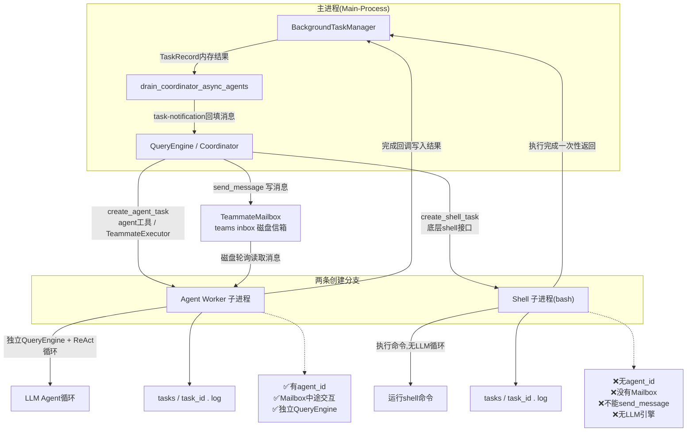
```mermaid
graph TB
   subgraph MainProcess["主进程(Main-Process)"]
      BTM[BackgroundTaskManager]
      drain[drain_coordinator_async_agents]
      QE[QueryEngine / Coordinator]
   end

   subgraph SpawnBranch["两条创建分支"]
      QE -->|create_agent_task<br/>agent工具 / TeammateExecutor| AgentSpawn["Agent Worker 子进程"]
      QE -->|create_shell_task<br/>底层shell接口| ShellSpawn["Shell 子进程(bash)"]
   end

   AgentSpawn -->|独立QueryEngine + ReAct循环| AgentLoop[LLM Agent循环]
   Mailbox["TeammateMailbox<br/>teams inbox 磁盘信箱"]
   QE -->|send_message 写消息| Mailbox
   Mailbox -->|磁盘轮询读取消息| AgentSpawn
   AgentSpawn -->|完成回调写入结果| BTM
   AgentSpawn --> tasks_log1[tasks / task_id . log]

   ShellSpawn -->|执行命令,无LLM循环| CmdRun[运行shell命令]
   ShellSpawn -->|执行完成一次性返回| BTM
   ShellSpawn --> tasks_log2[tasks / task_id . log]

   BTM -->|TaskRecord内存结果| drain
   drain -->|task-notification回填消息| QE

   note1[✅有agent_id<br/>✅Mailbox中途交互<br/>✅独立QueryEngine]
note2[❌无agent_id<br/>❌没有Mailbox<br/>❌不能send_message<br/>❌无LLM引擎]
AgentSpawn -.-> note1
ShellSpawn -.-> note2
```

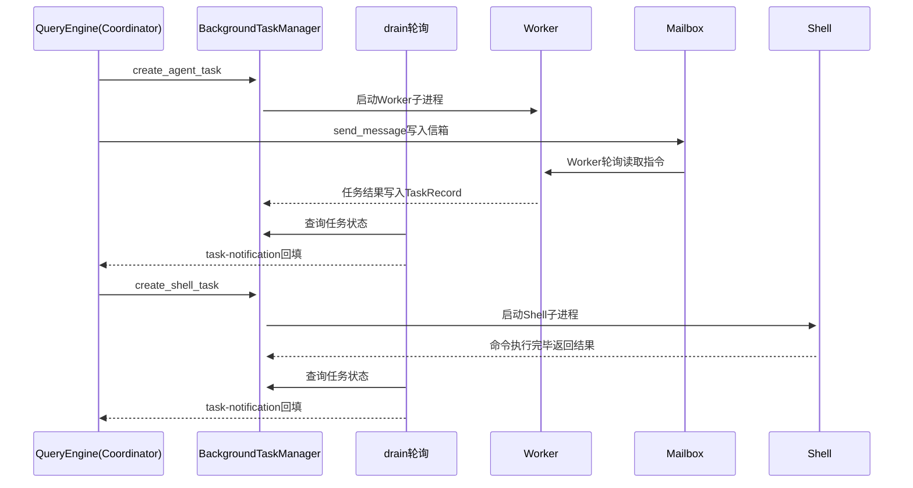
```mermaid
sequenceDiagram
    participant QE as QueryEngine(Coordinator)
    participant BTM as BackgroundTaskManager
    participant drain as drain轮询
    
    QE->>+BTM: create_agent_task
    BTM->>+Worker: 启动Worker子进程
    QE->>Mailbox: send_message写入信箱
    Mailbox->>Worker: Worker轮询读取指令
    Worker-->>BTM: 任务结果写入TaskRecord
    drain->>BTM: 查询任务状态
    drain-->>QE: task-notification回填
    
    QE->>+BTM: create_shell_task
    BTM->>+Shell: 启动Shell子进程
    Shell-->>BTM: 命令执行完毕返回结果
    drain->>BTM: 查询任务状态
    drain-->>QE: task-notification回填
```
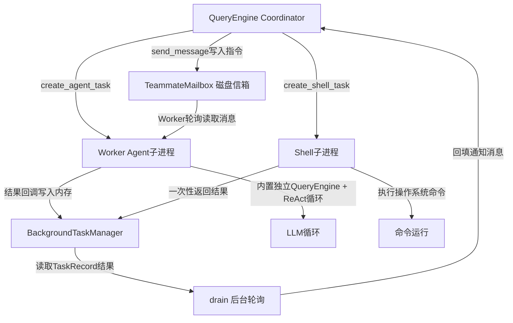
```mermaid
graph TB
    QE[QueryEngine Coordinator]
    BTM[BackgroundTaskManager]

    %% 分支1 Agent Task
    QE -->|create_agent_task| W[Worker Agent子进程]
    W -->|内置独立QueryEngine + ReAct循环| LLM[LLM循环]
    MB[TeammateMailbox 磁盘信箱]
    QE -->|send_message写入指令| MB
    MB -->|Worker轮询读取消息| W
    W -->|结果回调写入内存| BTM

    %% 分支2 Shell Task
    QE -->|create_shell_task| SH[Shell子进程]
    SH -->|执行操作系统命令| CMD[命令运行]
    SH -->|一次性返回结果| BTM

    %% 公共回流
    drain[drain 后台轮询]
    BTM -->|读取TaskRecord结果| drain
    drain -->|回填通知消息| QE
```
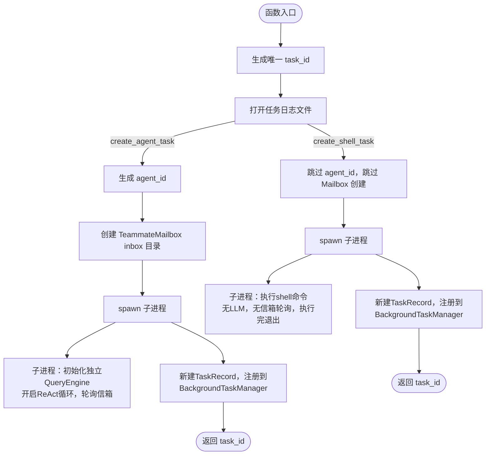
```mermaid
graph TB
    START(["函数入口"])

    S1["生成唯一 task_id"]
    LOG["打开任务日志文件"]

    %% create_agent_task 分支
    A1["生成 agent_id"]
    A2["创建 TeammateMailbox inbox 目录"]
    A3["spawn 子进程"]
    A4["子进程：初始化独立QueryEngine<br/>开启ReAct循环，轮询信箱"]
    A5["新建TaskRecord，注册到BackgroundTaskManager"]
    A_END(["返回 task_id"])

    %% create_shell_task 分支
    B1["跳过 agent_id，跳过 Mailbox 创建"]
    B2["spawn 子进程"]
    B3["子进程：执行shell命令<br/>无LLM，无信箱轮询，执行完退出"]
    B4["新建TaskRecord，注册到BackgroundTaskManager"]
    B_END(["返回 task_id"])


    START --> S1
    S1 --> LOG

    LOG -->|create_agent_task| A1
    A1 --> A2
    A2 --> A3
    A3 --> A4
    A3 --> A5
    A5 --> A_END

    LOG -->|create_shell_task| B1
    B1 --> B2
    B2 --> B3
    B2 --> B4
    B4 --> B_END
```
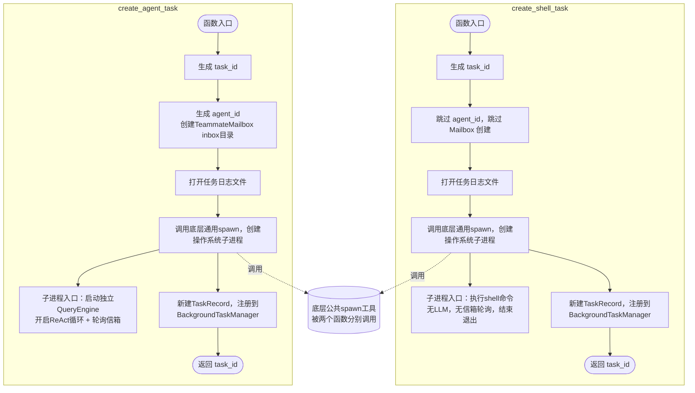
```mermaid
graph TB
%% ========== 左侧：create_shell_task ==========
   subgraph create_shell_task
      S_Start(["函数入口"])
      S1["生成 task_id"]
      S2["跳过 agent_id，跳过 Mailbox 创建"]
      S3["打开任务日志文件"]
      S4["调用底层通用spawn，创建操作系统子进程"]
      S_Child["子进程入口：执行shell命令<br/>无LLM，无信箱轮询，结束退出"]
      S5["新建TaskRecord，注册到BackgroundTaskManager"]
      S_Ret(["返回 task_id"])

      S_Start --> S1
      S1 --> S2
      S2 --> S3
      S3 --> S4
      S4 --> S_Child
      S4 --> S5
      S5 --> S_Ret
   end

%% ========== 右侧：create_agent_task ==========
   subgraph create_agent_task
      A_Start(["函数入口"])
      A1["生成 task_id"]
      A2["生成 agent_id<br/>创建TeammateMailbox inbox目录"]
      A3["打开任务日志文件"]
      A4["调用底层通用spawn，创建操作系统子进程"]
      A_Child["子进程入口：启动独立QueryEngine<br/>开启ReAct循环 + 轮询信箱"]
      A5["新建TaskRecord，注册到BackgroundTaskManager"]
      A_Ret(["返回 task_id"])

      A_Start --> A1
      A1 --> A2
      A2 --> A3
      A3 --> A4
      A4 --> A_Child
      A4 --> A5
      A5 --> A_Ret
   end

%% 标记二者共享的底层公共原语（仅工具，非函数调用）
   Common[("底层公共spawn工具<br/>被两个函数分别调用")]
   S4 -.调用.-> Common
   A4 -.调用.-> Common
```
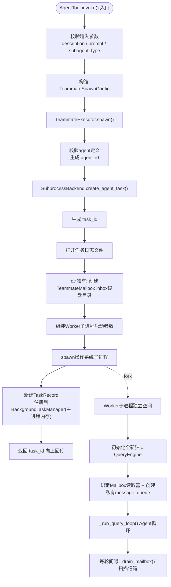
```mermaid
graph TB
    START(["AgentTool.invoke() 入口"])
    S1["校验输入参数<br/>description / prompt / subagent_type"]
    S2["构造 TeammateSpawnConfig"]
    S3["TeammateExecutor.spawn()"]
    S4["校验agent定义<br/>生成 agent_id"]
    S5["SubprocessBackend.create_agent_task()"]

    %% create_agent_task内部
    S6["生成 task_id"]
    S7["打开任务日志文件"]
    S8["👉独有: 创建TeammateMailbox inbox磁盘目录"]
    S9["组装Worker子进程启动参数"]
    S10["spawn操作系统子进程"]
    S11["新建TaskRecord<br/>注册到BackgroundTaskManager(主进程内存)"]
    S12["返回 task_id 向上回传"]

    %% 子进程内部分支
    CHILD["Worker子进程独立空间"]
    C1["初始化全新独立QueryEngine"]
    C2["绑定Mailbox读取器 + 创建私有message_queue"]
    C3["_run_query_loop() Agent循环"]
    C4["每轮间隙 _drain_mailbox() 扫描信箱"]

    START --> S1
    S1 --> S2
    S2 --> S3
    S3 --> S4
    S4 --> S5
    S5 --> S6
    S6 --> S7
    S7 --> S8
    S8 --> S9
    S9 --> S10
    S10 --> S11
    S11 --> S12

    S10 -.fork.-> CHILD
    CHILD --> C1
    C1 --> C2
    C2 --> C3
    C3 --> C4
```
```mermaid
sequenceDiagram
   participant AT as AgentTool.invoke
   participant TE as TeammateExecutor.spawn
   participant SB as SubprocessBackend.create_agent_task
   participant FS as FileSystem
   participant BTM as BackgroundTaskManager
   participant CHILD_OS as OS‑Spawn 子进程创建
   participant W_ENTRY as Worker入口
   participant QL as _run_query_loop
   participant MB_R as MailboxReader
   participant Q as message_queue(Worker私有队列)

   Note over AT,Q: ========= AgentTool.invoke 内部 =========
   AT->>AT: 校验输入参数
   AT->>AT: 构造 TeammateSpawnConfig
   AT->>TE: 调用 spawn

   Note over AT,Q: ========= TeammateExecutor.spawn 内部 =========
   TE->>TE: 读取agent定义
   TE->>TE: 生成唯一 agent_id
   TE->>SB: 调用 create_agent_task

   Note over AT,Q: ========= create_agent_task 内部(主进程侧) =========
   SB->>SB: 生成唯一 task_id
   SB->>FS: 打开task日志文件
   SB->>FS: 创建agent_id对应的 inbox信箱目录
   SB->>SB: 组装Worker子进程启动参数
   SB->>CHILD_OS: spawn操作系统子进程，非阻塞
   SB->>BTM: 创建TaskRecord，注册任务状态=running
   SB-->>TE: return task_id
   TE-->>AT: return task_id
   AT->>AT: 生成Spawn成功文本结果
   AT-->>AT: 返回ToolResult

   Note over AT,Q: ========= 子进程内部，独立内存空间 =========
   CHILD_OS->>W_ENTRY: 启动Worker入口代码
   W_ENTRY->>W_ENTRY: 初始化全新独立QueryEngine实例
   W_ENTRY->>MB_R: 绑定Mailbox读取器
   W_ENTRY->>Q: 创建私有内存消息队列 message_queue
   W_ENTRY->>QL: 进入 _run_query_loop 循环

   loop 每一轮Agent循环
      QL->>MB_R: _drain_mailbox() 读取磁盘inbox
      MB_R-->>QL: 返回未读信箱消息列表
      QL->>Q: 将信箱消息放入本地队列
      QL->>QL: 检查取消标记 abort_controller
   end
```
```python
_run_query_loop:
    1. _drain_mailbox() → 读磁盘消息 → push(message_queue)
    2. 检查shutdown取消标记
    3. await run_query()
        run_query:
            msg = queue.get_nowait()
            messages.append(msg)
            chat(messages) # 新消息才会送入LLM
```
```mermaid
graph TD
    A(["AgentTool.invoke 函数入口"])
    B["校验工具输入参数"]
    C["构造 TeammateSpawnConfig"]
    D["调用 TeammateExecutor.spawn()"]
    E["校验子Agent定义配置"]
    F["生成 agent_id"]
    G["调用 SubprocessBackend.create_agent_task()"]
    H["生成 task_id"]
    I["打开任务日志文件"]
    J["创建 TeammateMailbox inbox 磁盘目录"]
    K["组装Worker子进程启动参数"]
    L["spawn 操作系统子进程<br/>（非阻塞，立刻返回）"]
    M["新建TaskRecord<br/>注册到BackgroundTaskManager"]
    N["逐层向上返回 task_id"]
    O["生成工具返回结果文本"]
    END(["AgentTool.invoke 返回 ToolResult"])

    %% 子进程分支，fork之后独立运行
    subgraph Worker子进程内部空间
        W1["初始化独立 QueryEngine"]
        W2["创建 MailboxReader 信箱读取对象"]
        W3["创建私有 message_queue 内存队列"]
        W4["进入 _run_query_loop() Agent循环"]
        W5["循环间隙执行 _drain_mailbox() 扫描信箱"]
    end

    A --> B
    B --> C
    C --> D
    D --> E
    E --> F
    F --> G
    G --> H
    H --> I
    I --> J
    J --> K
    K --> L
    L --> M
    M --> N
    N --> O
    O --> END

    L -.fork 子进程.-> W1
    W1 --> W2
    W2 --> W3
    W3 --> W4
    W4 --> W5
```
```mermaid
sequenceDiagram
   participant QL as QueryLoop
   participant WK as Worker子进程
   participant CB as CompletionCallback
   participant BTM as BackgroundTaskManager
   participant OS as OperatingSystem

   Note over QL,OS: 正常完成路径
   QL->>QL: 判断任务完成，break跳出while循环
   WK->>CB: 执行任务完成回调
   CB->>BTM: 更新TaskRecord.status = completed
   BTM-->>CB: OK
   WK->>OS: Worker脚本执行结束
   OS->>OS: 子进程自动退出(PID终止)

   Note over QL,OS: 优雅关闭路径 shutdown消息
   QL->>QL: 读到shutdown，触发取消，break循环
   WK->>CB: 回调更新状态 = stopped
   CB->>BTM: TaskRecord.status = stopped
   WK->>OS: 子进程退出

   Note over QL,OS: 崩溃异常路径 僵尸任务
   WK->>OS: 进程直接崩溃，无机会运行回调
   OS->>OS: 子进程终止
   Note over BTM: TaskRecord仍然 = running 僵尸任务
```
```mermaid
graph TD
   A["_run_query_loop 判断任务完成"]
   B["break 退出Agent循环"]
   C["Worker发送完成回调"]
   D["主进程BTM更新TaskRecord: completed"]
   E["Worker脚本执行完毕"]
   F["OS子进程自动停止"]

   A --> B
   B --> C
   C --> D
   D --> E
   E --> F

   A_CRASH["Worker进程崩溃 / 被杀死"]
   A_CRASH --> F
   A_CRASH -.-> D

   NOTE["注意: TaskRecord stuck running，僵尸任务"]
   A_CRASH --> NOTE
```
### 2.2 Mailbox文件系统结构

```
~/.openharness/teams/
└── team-A/                    # Team directory
    └── worker1/               # Agent-specific mailbox
        ├── inbox/             # Incoming messages
        │   ├── msg_001.json   # User message from coordinator
        │   ├── msg_002.json   # Shutdown request
        │   └── .lock          # File lock for atomic writes
        └── outbox/            # Outgoing messages (optional)
            └── msg_003.json   # Response to coordinator
```

**消息文件格式** (`msg_001.json`):
```json
{
  "id": "uuid-abc-123",
  "type": "user_message",
  "sender": "coordinator",
  "recipient": "worker1@team-A",
  "payload": {
    "content": "Please focus on security aspects",
    "color": "blue"
  },
  "timestamp": 1713600000.123,
  "read": false
}
```

---

## 3. SendMessageTool实现

### 3.1 工具定义

**源码**: [`tools/send_message_tool.py`](file:///Users/gqli/work/deepagents/OpenHarness/src/openharness/tools/send_message_tool.py)

```python
class SendMessageToolInput(BaseModel):
    """Arguments for sending a follow-up message to a task."""
    task_id: str = Field(description="Target local agent task id or swarm agent_id (name@team)")
    message: str = Field(description="Message to write to the task stdin")


class SendMessageTool(BaseTool):
    """Send a message to a running local agent task."""
    
    name = "send_message"
    description = "Send a follow-up message to a running local agent task."
    input_model = SendMessageToolInput
    
    async def execute(self, arguments: SendMessageToolInput, context: ToolExecutionContext) -> ToolResult:
        del context
        
        # Swarm agents use agent_id format (name@team); legacy tasks use plain task IDs
        if "@" in arguments.task_id:
            return await self._send_swarm_message(arguments.task_id, arguments.message)
        
        try:
            await get_task_manager().write_to_task(arguments.task_id, arguments.message)
        except ValueError as exc:
            return ToolResult(output=str(exc), is_error=True)
        return ToolResult(output=f"Sent message to task {arguments.task_id}")
    
    async def _send_swarm_message(self, agent_id: str, message: str) -> ToolResult:
        """Route a message to a swarm agent via the backend."""
        registry = get_backend_registry()
        
        # Use subprocess backend to match AgentTool's spawn path.
        executor = registry.get_executor("subprocess")
        
        teammate_msg = TeammateMessage(text=message, from_agent="coordinator")
        try:
            await executor.send_message(agent_id, teammate_msg)
        except ValueError as exc:
            return ToolResult(output=str(exc), is_error=True)
        except Exception as exc:
            logger.error("Failed to send message to %s: %s", agent_id, exc)
            return ToolResult(output=str(exc), is_error=True)
        
        return ToolResult(output=f"Sent message to agent {agent_id}")
```

### 3.2 Backend路由逻辑

**关键点**:
1. **task_id格式判断**: 
   - 包含`@` → Swarm Agent (`worker1@team-A`)
   - 不包含`@` → Legacy Task (`task_abc123`)

2. **Backend选择**: 
   - 默认使用`subprocess` backend
   - 与`AgentTool` spawn时使用的backend保持一致

3. **消息封装**: 
   - 转换为`TeammateMessage`对象
   - 携带`from_agent="coordinator"`标识发送者

---

## 4. Worker如何接收消息

### 4.1 InProcessBackend.send_message

**源码**: [`swarm/in_process.py:496-529`](file:///Users/gqli/work/deepagents/OpenHarness/src/openharness/swarm/in_process.py#L496-L529)

```python
async def send_message(self, agent_id: str, message: TeammateMessage) -> None:
    """Write *message* to the teammate's file-based mailbox."""
    if "@" not in agent_id:
        raise ValueError(f"Invalid agent_id {agent_id!r}: expected 'agentName@teamName'")
    
    agent_name, team_name = agent_id.split("@", 1)
    
    from openharness.swarm.mailbox import MailboxMessage
    
    # Step 1: 创建MailboxMessage
    msg = MailboxMessage(
        id=str(uuid.uuid4()),
        type="user_message",  # ← 普通用户消息
        sender=message.from_agent,
        recipient=agent_id,
        payload={
            "content": message.text,
            **({"color": message.color} if message.color else {}),
        },
        timestamp=message.timestamp and float(message.timestamp) or time.time(),
    )
    
    # Step 2: 写入文件系统
    mailbox = TeammateMailbox(team_name=team_name, agent_id=agent_name)
    await mailbox.write(msg)
    
    logger.debug("[InProcessBackend] sent message to %s", agent_id)
```

### 4.2 TeammateMailbox.write

**源码**: [`swarm/mailbox.py`](file:///Users/gqli/work/deepagents/OpenHarness/src/openharness/swarm/mailbox.py)

```python
async def write(self, message: MailboxMessage) -> None:
    """Write a message to the inbox with exclusive file locking."""
    inbox = self.get_mailbox_dir()
    lock_path = self._lock_path()
    
    def _write():
        # 使用文件锁保证原子性
        with exclusive_file_lock(lock_path):
            msg_path = inbox / f"{message.id}.json"
            tmp_path = msg_path.with_suffix(".json.tmp")
            
            # 写入临时文件
            tmp_path.write_text(
                json.dumps(message.model_dump(), indent=2),
                encoding="utf-8"
            )
            
            # 原子替换(避免部分写入)
            os.replace(tmp_path, msg_path)
    
    # Offload blocking I/O to thread pool
    loop = asyncio.get_event_loop()
    await loop.run_in_executor(None, _write)
```

**关键设计**:
- ✅ **文件锁**: `exclusive_file_lock()`防止并发写入冲突
- ✅ **原子写入**: 先写`.tmp`,再`os.replace()`,避免部分写入
- ✅ **线程池卸载**: `run_in_executor()`避免阻塞事件循环

---

## 5. Stop机制详解

### 5.1 主Agent发起Stop

**方式1: 通过send_message发送shutdown消息**

```python
# Coordinator调用
send_message(task_id="worker1@team-A", message="__SHUTDOWN__")

# Backend识别特殊消息,创建shutdown类型的MailboxMessage
msg = MailboxMessage(
    id=str(uuid.uuid4()),
    type="shutdown",  # ← 关键:类型为shutdown
    sender="coordinator",
    recipient="worker1@team-A",
    payload={},
    timestamp=time.time(),
)
await mailbox.write(msg)
```

**方式2: 直接调用Backend.shutdown()**

```python
# 通过Backend Registry获取executor
registry = get_backend_registry()
executor = registry.get_executor("in_process")

# 发起优雅关闭
await executor.shutdown(agent_id="worker1@team-A", force=False, timeout=10.0)
```

### 5.2 Worker接收Shutdown消息

**源码**: [`swarm/in_process.py:296-333`](file:///Users/gqli/work/deepagents/OpenHarness/src/openharness/swarm/in_process.py#L296-L333)

```python
async def _drain_mailbox(
    mailbox: TeammateMailbox,
    ctx: TeammateContext,
) -> bool:
    """Read pending mailbox messages and handle shutdown / user messages.
    
    Returns:
        True if a shutdown message was received (caller should stop the loop).
    """
    try:
        # Step 1: 读取所有未读消息
        pending = await mailbox.read_all(unread_only=True)
    except Exception:
        pending = []
    
    for msg in pending:
        try:
            await mailbox.mark_read(msg.id)
        except Exception:
            pass
        
        # Step 2: 处理shutdown消息
        if msg.type == "shutdown":
            logger.debug("[in_process] %s: received shutdown message", ctx.agent_id)
            
            # 触发AbortController
            ctx.abort_controller.request_cancel(reason="shutdown message received")
            
            return True  # ← 返回True,通知调用者停止循环
        
        # Step 3: 处理user_message
        elif msg.type == "user_message":
            logger.debug("[in_process] %s: queuing user_message from mailbox", ctx.agent_id)
            content = msg.payload.get("content", "")
            
            teammate_msg = TeammateMessage(
                text=content,
                from_agent=msg.sender,
                color=msg.payload.get("color"),
                timestamp=str(msg.timestamp),
            )
            
            # 加入消息队列,等待下一轮注入
            await ctx.message_queue.put(teammate_msg)
    
    return False
```

### 5.3 AbortController工作原理

**源码**: [`swarm/types.py`](file:///Users/gqli/work/deepagents/OpenHarness/src/openharness/swarm/types.py)

```python
class TeammateAbortController:
    """Thread-safe cancellation controller for teammates."""
    
    def __init__(self):
        self._cancel_requested = False
        self._reason: str | None = None
        self._force = False
        self._lock = threading.Lock()
    
    def request_cancel(self, reason: str = "", force: bool = False) -> None:
        """Request cancellation of the running task."""
        with self._lock:
            self._cancel_requested = True
            self._reason = reason
            self._force = force
    
    @property
    def is_cancelled(self) -> bool:
        """Check if cancellation has been requested."""
        with self._lock:
            return self._cancel_requested
    
    @property
    def reason(self) -> str | None:
        with self._lock:
            return self._reason
    
    @property
    def is_force(self) -> bool:
        with self._lock:
            return self._force
```

**关键特性**:
- ✅ **线程安全**: 使用`threading.Lock()`保护状态
- ✅ **强制模式**: `force=True`立即取消,否则等待当前操作完成
- ✅ **原因记录**: 保存取消原因便于调试

---

## 6. 非阻塞设计原理

### 6.1 核心问题

**挑战**: Worker在执行`run_query()`时,LLM API调用可能阻塞数秒,如何及时响应shutdown?

**错误方案**: ❌ 在LLM调用中间插入检查点
```python
# 不可行: LLM调用是黑盒,无法中断
response = await llm_api.chat(messages)  # 阻塞5-30秒
if should_stop:  # ← 检查太晚,已经等完了
    return
```

**正确方案**: ✅ 在**事件之间**轮询Mailbox

### 6.2 _run_query_loop实现

**源码**: [`swarm/in_process.py:336-396`](file:///Users/gqli/work/deepagents/OpenHarness/src/openharness/swarm/in_process.py#L336-L396)

```python
async def _run_query_loop(
    query_context: Any,
    config: TeammateSpawnConfig,
    ctx: TeammateContext,
    mailbox: TeammateMailbox,
) -> None:
    """Drive run_query until done or cancelled.
    
    Between turns we:
    - Drain the mailbox for shutdown requests and user messages.
    - Inject queued user messages as additional turns.
    - Check the abort controller.
    """
    from openharness.engine.query import run_query
    from openharness.engine.messages import ConversationMessage
    
    messages: list[ConversationMessage] = [
        ConversationMessage.from_user_text(config.prompt)
    ]
    
    # Step 1: 启动ReAct循环(异步生成器)
    async for event, usage in run_query(query_context, messages):
        
        # Step 2: 跟踪Token和工具使用
        if usage is not None:
            ctx.total_tokens += usage.input_tokens + usage.output_tokens
        
        if getattr(event, "type", None) in ("tool_use", "tool_call"):
            ctx.tool_use_count += 1
        
        # Step 3: 检查AbortController(快速路径)
        if ctx.abort_controller.is_cancelled:
            logger.debug("[in_process] %s: abort_controller cancelled", ctx.agent_id)
            return  # ← 立即退出
        
        # Step 4: 轮询Mailbox(关键!)
        should_stop = await _drain_mailbox(mailbox, ctx)
        if should_stop:
            return  # ← 收到shutdown,退出循环
        
        # Step 5: 注入排队的用户消息
        while not ctx.message_queue.empty():
            try:
                queued = ctx.message_queue.get_nowait()
            except asyncio.QueueEmpty:
                break
            
            logger.debug("[in_process] %s: injecting queued message", ctx.agent_id)
            messages.append(ConversationMessage(role="user", content=queued.text))
    
    ctx.status = "idle"
```

### 6.3 为什么这样设计是非阻塞的?

**关键洞察**: `run_query()`是**异步生成器**,每次`yield`一个事件后立即返回控制权

```python
# run_query内部伪代码
async def run_query(context, messages):
    turn = 0
    while turn < max_turns:
        # 1. 调用LLM API (可能阻塞5-30秒)
        response = await llm_api.chat(messages)  # ← 这里确实会阻塞
        
        # 2. 解析响应,yield事件
        for tool_call in response.tool_calls:
            yield ToolUseEvent(...), usage  # ← yield后暂停,返回控制权给调用者
        
        # 3. 执行工具
        result = await execute_tool(tool_call)
        yield ToolResultEvent(...), usage  # ← 再次yield
        
        turn += 1
```

**时间线分析**:

```
Time    Worker Task                          Main Thread
────    ───────────                          ───────────
0s      start _run_query_loop()              
        ├─ call run_query()                  
        │  └─ await llm_api.chat()  ←─────── 阻塞10秒
        │                                    
10s     ├─ yield ToolUseEvent()  ←────────── 恢复,检查mailbox
        ├─ _drain_mailbox()      ←────────── 读取shutdown消息
        ├─ abort_controller.request_cancel() ← 设置标志
        └─ return (exit loop)                ← Worker停止
```

**关键点**:
1. ✅ **yield点是检查点**: 每次LLM返回后都有机会检查mailbox
2. ✅ **快速路径**: `abort_controller.is_cancelled`是内存检查,纳秒级
3. ✅ **慢速路径**: `_drain_mailbox()`读取文件系统,毫秒级
4. ✅ **最坏延迟**: 等于单次LLM调用的时间(通常5-30秒)

### 6.4 对比其他方案

| 方案 | 优点 | 缺点 | 延迟 |
|------|------|------|------|
| **当前: Event间轮询** | ✅ 简单可靠<br>✅ 无需修改LLM库 | ⚠️ 最坏延迟=LLM调用时间 | 5-30秒 |
| **方案2: 后台线程监控** | ✅ 可立即中断 | ❌ 复杂度高<br>❌ 状态不一致风险 | <1秒 |
| **方案3: WebSocket推送** | ✅ 实时性强 | ❌ 需要额外基础设施<br>❌ 跨进程复杂 | <100ms |
| **方案4: Signal处理** | ✅ OS级别支持 | ❌ Unix only<br>❌ 异步环境不安全 | <10ms |

**结论**: 当前方案在**简单性**和**实用性**之间取得最佳平衡。

---

## 7. 完整时序图

### 7.1 Stop Worker时序图

```mermaid
sequenceDiagram
   participant Coord as Coordinator Agent
   participant SMTool as SendMessageTool
   participant HostBackend as InProcessBackend
   participant Mailbox as TeammateMailbox<br/>(File‑System, inbox)
   participant Worker as Worker Task (子进程)
   participant QueryLoop as _run_query_loop (Worker内部)
   participant Abort as Worker‑AbortController
   participant LLM as LLM API
   participant BTM as BackgroundTaskManager(主进程)
   participant MainDrain as drain_coordinator_async_agents(主进程)

   Note over Coord,LLM: Phase 1: Coordinator下发关闭指令

   Coord->>SMTool: send_message(task_id="w1@tA",message="__SHUTDOWN__")
   SMTool->>HostBackend: send_message(task_id, payload)
   HostBackend->>Mailbox: 写入 shutdown 消息 JSON
   Mailbox->>Mailbox: 创建消息文件 teams/tA/w1/inbox/msg_xyz.json
   Mailbox-->>HostBackend: ✓ 文件写入成功
   HostBackend-->>SMTool: OK
   SMTool-->>Coord: Sent message to agent

   Note over Worker,LLM: Phase 2: Worker 当前阻塞在LLM调用 (无法中断)
   QueryLoop->>LLM: await chat(messages)
   Note over LLM: LLM网络请求阻塞，Worker此时不会读取信箱

   Note over Worker,LLM: Phase3: LLM返回后，下一轮循环开始检测信箱
   LLM-->>QueryLoop: LLM响应返回
   QueryLoop->>Worker: worker_drain_mailbox() 读取inbox
   Worker->>Mailbox: read_all(unread_only=True)
   Mailbox-->>Worker: [shutdown消息]
   Worker->>Abort: request_cancel(reason="shutdown")
   Abort->>Abort: _cancel_requested = True
   QueryLoop->>QueryLoop: 检测到取消标记，退出Agent循环
   QueryLoop-->>Worker: Agent循环结束,进程准备退出

   Note over BTM,Coord: Phase 4: Worker完成信号回流至主进程
   Worker-->>BTM: 回调更新TaskRecord.status = stopped
   MainDrain->>BTM: 轮询查询任务状态
   BTM-->>MainDrain: 任务已停止
   MainDrain-->>Coord: TaskNotification(status="stopped")
```

### 7.2 User Message时序图

```mermaid
sequenceDiagram
   participant Coord as Coordinator Agent
   participant SMTool as SendMessageTool
   participant HostBackend as InProcessBackend
   participant Mailbox as TeammateMailbox<br/>(File‑System, inbox)
   participant Worker as Worker Task (子进程)
   participant QueryLoop as _run_query_loop (Worker内部)
   participant Abort as Worker‑AbortController
   participant LLM as LLM API
   participant BTM as BackgroundTaskManager(主进程)
   participant MainDrain as drain_coordinator_async_agents(主进程)

   Note over Coord,LLM: Phase 1: Coordinator下发关闭指令

   Coord->>SMTool: send_message(task_id="w1@tA",message="__SHUTDOWN__")
   SMTool->>HostBackend: send_message(task_id, payload)
   HostBackend->>Mailbox: 写入 shutdown 消息 JSON
   Mailbox->>Mailbox: 创建消息文件 teams/tA/w1/inbox/msg_xyz.json
   Mailbox-->>HostBackend: ✓ 文件写入成功
   HostBackend-->>SMTool: OK
   SMTool-->>Coord: Sent message to agent

   Note over Worker,LLM: Phase 2: Worker 当前阻塞在LLM调用 (无法中断)
   QueryLoop->>LLM: await chat(messages)
   Note over LLM: LLM网络请求阻塞，Worker此时不会读取信箱

   Note over Worker,LLM: Phase3: LLM返回后，下一轮循环开始检测信箱
   LLM-->>QueryLoop: LLM响应返回
   QueryLoop->>Worker: worker_drain_mailbox() 读取inbox
   Worker->>Mailbox: read_all(unread_only=True)
   Mailbox-->>Worker: [shutdown消息]
   Worker->>Abort: request_cancel(reason="shutdown")
   Abort->>Abort: _cancel_requested = True
   QueryLoop->>QueryLoop: 检测到取消标记，退出Agent循环
   QueryLoop-->>Worker: Agent循环结束,进程准备退出

   Note over BTM,Coord: Phase 4: Worker完成信号回流至主进程
   Worker-->>BTM: 回调更新TaskRecord.status = stopped
   MainDrain->>BTM: 轮询查询任务状态
   BTM-->>MainDrain: 任务已停止
   MainDrain-->>Coord: TaskNotification(status="stopped")
```

---

## 8. 关键代码路径

### 8.1 完整调用链

**SendMessage执行路径**:
```
User/Agent calls send_message tool
  ↓
SendMessageTool.execute()
  ↓ tools/send_message_tool.py:31
  ↓
_check if "@" in task_id
  ↓
_send_swarm_message(agent_id, message)
  ↓ tools/send_message_tool.py:42
  ↓
get_backend_registry().get_executor("subprocess")
  ↓ swarm/registry.py
  ↓
SubprocessBackend.send_message(agent_id, TeammateMessage)
  ↓ swarm/subprocess_backend.py:110
  ↓
Create MailboxMessage(type="user_message")
  ↓
TeammateMailbox(team, agent).write(msg)
  ↓ swarm/mailbox.py
  ↓
exclusive_file_lock() + atomic write to inbox/*.json
```

**Worker接收路径**:
```
Worker Task running start_in_process_teammate()
  ↓ swarm/in_process.py:183
  ↓
_run_query_loop(query_context, config, ctx, mailbox)
  ↓ swarm/in_process.py:336
  ↓
async for event, usage in run_query(context, messages):
  ↓ engine/query.py
  ↓
# Between each event yield:
if ctx.abort_controller.is_cancelled:
    return
  ↓
should_stop = await _drain_mailbox(mailbox, ctx)
  ↓ swarm/in_process.py:296
  ↓
pending = await mailbox.read_all(unread_only=True)
  ↓ swarm/mailbox.py
  ↓
for msg in pending:
    if msg.type == "shutdown":
        ctx.abort_controller.request_cancel(reason="shutdown")
        return True  # Signal to stop
    elif msg.type == "user_message":
        await ctx.message_queue.put(teammate_msg)
```

### 8.2 关键文件清单

| 文件 | 职责 | 关键函数/类 |
|------|------|------------|
| [`tools/send_message_tool.py`](file:///Users/gqli/work/deepagents/OpenHarness/src/openharness/tools/send_message_tool.py) | Tool入口 | `SendMessageTool.execute()` |
| [`swarm/in_process.py`](file:///Users/gqli/work/deepagents/OpenHarness/src/openharness/swarm/in_process.py) | InProcess Backend | `InProcessBackend.send_message()`<br>`_drain_mailbox()`<br>`_run_query_loop()` |
| [`swarm/subprocess_backend.py`](file:///Users/gqli/work/deepagents/OpenHarness/src/openharness/swarm/subprocess_backend.py) | Subprocess Backend | `SubprocessBackend.send_message()` |
| [`swarm/mailbox.py`](file:///Users/gqli/work/deepagents/OpenHarness/src/openharness/swarm/mailbox.py) | 文件系统Mailbox | `TeammateMailbox.write()`<br>`TeammateMailbox.read_all()` |
| [`swarm/types.py`](file:///Users/gqli/work/deepagents/OpenHarness/src/openharness/swarm/types.py) | 类型定义 | `TeammateAbortController`<br>`TeammateMessage`<br>`MailboxMessage` |

### 8.3 配置示例

**启用Worker消息传递**:

```python
# 1. Spawn Worker
from openharness.tools.agent_tool import AgentTool

agent_tool = AgentTool()
result = await agent_tool.execute(
    AgentToolInput(
        description="Research OAuth2 implementation",
        prompt="Analyze the current auth module...",
        subagent_type="worker",
    ),
    context
)
# result.metadata["task_id"] = "worker1@team-A"

# 2. Send message to Worker
from openharness.tools.send_message_tool import SendMessageTool

send_tool = SendMessageTool()
result = await send_tool.execute(
    SendMessageToolInput(
        task_id="worker1@team-A",
        message="Please focus on security best practices"
    ),
    context
)

# 3. Stop Worker
result = await send_tool.execute(
    SendMessageToolInput(
        task_id="worker1@team-A",
        message="__SHUTDOWN__"  # Special command
    ),
    context
)
```

---

## 9. 常见问题FAQ

### Q1: 如果Worker正在执行bash命令,能立即停止吗?

**A**: 不能立即停止,但可以标记为待取消:

```python
# Worker正在执行
bash("npm install")  # 可能需要60秒

# Coordinator发送shutdown
send_message(task_id="w1@tA", message="__SHUTDOWN__")

# Worker行为:
# 1. bash命令继续执行(无法中断外部进程)
# 2. 命令完成后,_drain_mailbox()检测到shutdown
# 3. abort_controller.request_cancel()被调用
# 4. 下一轮LLM调用前,检查is_cancelled并退出
```

**改进方案**: 对于长时间运行的命令,使用timeout:
```python
bash("npm install", timeout=30)  # 30秒超时
```

### Q2: 消息会丢失吗?

**A**: 不会,因为:
1. ✅ **持久化存储**: 消息写入文件系统,即使Worker重启也能读取
2. ✅ **已读标记**: `mark_read()`确保不重复处理
3. ✅ **原子写入**: `os.replace()`保证消息完整性

### Q3: 多个Coordinator同时发消息会冲突吗?

**A**: 不会,因为:
1. ✅ **文件锁**: `exclusive_file_lock()`串行化写入
2. ✅ **唯一ID**: 每个消息有UUID,文件名不冲突
3. ✅ **独立收件箱**: 每个Worker有独立的inbox目录

### Q4: 性能开销大吗?

**A**: 开销极小:
- **写入**: ~1-5ms (文件系统+锁)
- **读取**: ~1-10ms (取决于消息数量)
- **频率**: 仅在LLM事件之间(每10-30秒一次)
- **总开销**: <0.1% 的Worker执行时间

---

## 10. Subprocess Backend跨进程通信详解

### 10.1 核心问题

**用户疑问**: 
> 子Agent如果使用subprocess启动,spawn_worker函数生成的mailbox实体在主子agent上如何传输信息的?都不是一个对象了啊

**关键洞察**: Subprocess Backend中,**主Agent和子Agent运行在不同进程**,Mailbox对象确实不是同一个实例!

### 10.2 两种Backend对比

| 维度 | InProcess Backend | Subprocess Backend |
|------|------------------|--------------------|
| **执行环境** | 同一进程的asyncio Task | 独立子进程 |
| **Mailbox类型** | 文件系统Mailbox (共享) | **stdin/stdout管道** |
| **消息传递** | 写入文件 → Worker轮询 | **父进程写stdin → 子进程读stdin** |
| **Shutdown** | Mailbox shutdown消息 | **SIGTERM信号 + stdin关闭** |
| **隔离性** | ContextVar隔离 | **进程级完全隔离** |
| **适用场景** | 轻量级Worker | 需要强隔离的Worker |

### 10.3 Subprocess Backend消息传递架构

```
┌──────────────────────────────────────────────────────────────┐
│            Subprocess Backend Architecture                    │
├──────────────────────────────────────────────────────────────┤
│                                                               │
│  Parent Process (Coordinator)                                │
│  ┌────────────────────────────────────────┐                 │
│  │ SubprocessBackend                      │                 │
│  │ .send_message(agent_id, message)       │                 │
│  └──────────────┬─────────────────────────┘                 │
│                 ↓                                            │
│  ┌────────────────────────────────────────┐                 │
│  │ BackgroundTaskManager                  │                 │
│  │ .write_to_task(task_id, json_line)     │                 │
│  └──────────────┬─────────────────────────┘                 │
│                 ↓                                            │
│  ┌────────────────────────────────────────┐                 │
│  │ asyncio.subprocess.Process             │                 │
│  │ .stdin.write(json.dumps(payload))      │                 │
│  │ .stdin.drain()                         │                 │
│  └──────────────┬─────────────────────────┘                 │
│                 │                                            │
│                 │  stdin pipe (OS-level IPC)                │
│                 ↓                                            │
│  Child Process (Worker Agent)                               │
│  ┌────────────────────────────────────────┐                 │
│  │ run_task_worker()                      │                 │
│  │   while True:                          │                 │
│  │     raw = sys.stdin.readline()  ←──────┼── Read from    │
│  │     if raw == "": break  # EOF         │     stdin      │
│  │     line = _decode_task_worker_line()  │                 │
│  │     await handle_line(bundle, line)    │                 │
│  │     break  # One-shot worker           │                 │
│  └────────────────────────────────────────┘                 │
│                                                               │
│  Key Design Points:                                          │
│  ✅ No shared objects (different processes)                  │
│  ✅ OS-level stdin/stdout pipes for IPC                     │
│  ✅ JSON-serialized messages                                 │
│  ✅ One-shot workers (restart for follow-ups)               │
│  ✅ Auto-resume on BrokenPipeError                           │
└──────────────────────────────────────────────────────────────┘
```

### 10.4 完整调用链

#### Phase 1: Spawn Worker

```python
# 1. Coordinator调用AgentTool
agent_tool.execute(AgentToolInput(
    description="Research OAuth",
    prompt="Analyze auth module...",
    subagent_type="worker"
))

# 2. AgentTool选择SubprocessBackend
registry = get_backend_registry()
executor = registry.get_executor("subprocess")

# 3. SubprocessBackend.spawn()
#    源码: swarm/subprocess_backend.py:51-108
async def spawn(self, config: TeammateSpawnConfig) -> SpawnResult:
    agent_id = f"{config.name}@{config.team}"
    
    # 构建命令: python -m openharness --task-worker
    command = f"{env_prefix} python -m openharness --task-worker"
    
    # 通过BackgroundTaskManager创建子进程
    manager = get_task_manager()
    record = await manager.create_agent_task(
        prompt=config.prompt,
        description=f"Teammate: {agent_id}",
        cwd=config.cwd,
        command=command,
    )
    
    # 记录映射: agent_id -> task_id
    self._agent_tasks[agent_id] = record.id
    return SpawnResult(task_id=record.id, agent_id=agent_id)
```

#### Phase 2: BackgroundTaskManager创建子进程

```python
# 源码: tasks/manager.py:67-92
async def create_agent_task(self, prompt: str, ..., command: str) -> TaskRecord:
    # 1. 创建TaskRecord
    record = TaskRecord(
        id=f"task_{uuid4().hex[:8]}",
        type="local_agent",
        status="running",
        command=command,
        cwd=cwd,
    )
    self._tasks[record.id] = record
    
    # 2. 启动子进程
    process = await asyncio.create_subprocess_shell(
        command,
        stdin=asyncio.subprocess.PIPE,   # ← 关键: 创建stdin管道
        stdout=asyncio.subprocess.PIPE,
        stderr=asyncio.subprocess.STDOUT,
        cwd=cwd,
    )
    self._processes[record.id] = process
    
    # 3. 发送初始prompt到stdin
    process.stdin.write((prompt + "\n").encode("utf-8"))
    await process.stdin.drain()
    process.stdin.close()  # 关闭stdin,触发EOF
    
    # 4. 启动监控协程
    asyncio.create_task(self._watch_process(record.id, process, generation))
    
    return record
```

#### Phase 3: Worker进程接收消息

```python
# 源码: ui/app.py:86-166
async def run_task_worker(...) -> None:
    """Run a stdin-driven headless worker for background agent tasks."""
    
    # 1. 构建Runtime Bundle
    bundle = await build_runtime(
        cwd=cwd,
        model=model,
        system_prompt=system_prompt,
        permission_prompt=_noop_permission,  # 自动允许所有工具
        ask_user_prompt=_noop_ask,           # 无需用户交互
    )
    await start_runtime(bundle)
    
    try:
        # 2. 从stdin读取消息(阻塞等待)
        while True:
            raw = await asyncio.to_thread(sys.stdin.readline)
            if raw == "":  # EOF, parent closed stdin
                break
            
            line = _decode_task_worker_line(raw)
            if not line:
                continue
            
            # 3. 处理消息(进入ReAct循环)
            await handle_line(
                bundle,
                line,
                print_system=_print_system,
                render_event=_render_event,
                clear_output=_clear_output,
            )
            
            # 4. One-shot worker: 处理完一条消息后退出
            break
    finally:
        await close_runtime(bundle)
```

#### Phase 4: Send Message (Follow-up)

```python
# 源码: swarm/subprocess_backend.py:110-132
async def send_message(self, agent_id: str, message: TeammateMessage) -> None:
    """Send a message to a running teammate via its stdin pipe."""
    
    # 1. 查找task_id
    task_id = self._agent_tasks.get(agent_id)
    if task_id is None:
        raise ValueError(f"No active subprocess for agent {agent_id!r}")
    
    # 2. 序列化消息为JSON
    payload = {
        "text": message.text,
        "from": message.from_agent,
        "timestamp": message.timestamp,
    }
    if message.color:
        payload["color"] = message.color
    
    # 3. 写入子进程stdin
    manager = get_task_manager()
    await manager.write_to_task(task_id, json.dumps(payload))
    logger.debug("Sent message to %s (task %s)", agent_id, task_id)
```

#### Phase 5: BackgroundTaskManager.write_to_task

```python
# 源码: tasks/manager.py:148-161
async def write_to_task(self, task_id: str, data: str) -> None:
    """Write one line to task stdin, auto-resuming local agents when needed."""
    task = self._require_task(task_id)
    
    async with self._input_locks[task_id]:
        # 1. 确保进程可写
        process = await self._ensure_writable_process(task)
        
        # 2. 写入一行JSON
        process.stdin.write((data.rstrip("\n") + "\n").encode("utf-8"))
        try:
            await process.stdin.drain()
        except (BrokenPipeError, ConnectionResetError):
            # 3. 如果管道断开,重启子进程
            if task.type in {"local_agent", "remote_agent", "in_process_teammate"}:
                process = await self._restart_agent_task(task)
                process.stdin.write((data.rstrip("\n") + "\n").encode("utf-8"))
                await process.stdin.drain()
```

### 10.5 Shutdown机制

#### 方式1: 正常退出(One-shot)

```python
# Worker处理完初始prompt后自动退出
async def run_task_worker():
    # ... 处理prompt ...
    break  # 退出while循环
finally:
    await close_runtime(bundle)
    # 进程结束,返回exit code 0

# Parent进程检测到退出
async def _watch_process(task_id, process, generation):
    return_code = await process.wait()  # 等待子进程结束
    task.status = "completed" if return_code == 0 else "failed"
    task.ended_at = time.time()
```

#### 方式2: 强制终止

```python
# 源码: swarm/subprocess_backend.py:134-160
async def shutdown(self, agent_id: str, *, force: bool = False) -> bool:
    task_id = self._agent_tasks.get(agent_id)
    if task_id is None:
        return False
    
    manager = get_task_manager()
    try:
        # 发送SIGTERM信号
        await manager.stop_task(task_id)
    except ValueError:
        pass
    finally:
        self._agent_tasks.pop(agent_id, None)
    
    return True
```

```python
# 源码: tasks/manager.py:124-146
async def stop_task(self, task_id: str) -> TaskRecord:
    task = self._require_task(task_id)
    process = self._processes.get(task_id)
    
    if process is None or process.returncode is not None:
        task.status = "killed"
        return task
    
    # Step 1: SIGTERM
    process.terminate()
    try:
        await asyncio.wait_for(process.wait(), timeout=5.0)
    except asyncio.TimeoutError:
        # Step 2: SIGKILL (if not stopped)
        process.kill()
        await process.wait()
    
    await _close_process_stdin(process)
    task.status = "killed"
    task.ended_at = time.time()
    return task
```

### 10.6 为什么不需要Mailbox?

**InProcess Backend使用Mailbox的原因**:
- ✅ 同一进程,多个asyncio Task并发执行
- ✅ 需要异步、非阻塞的消息队列
- ✅ Worker在ReAct循环中轮询Mailbox

**Subprocess Backend不使用Mailbox的原因**:
- ❌ 不同进程,无法共享内存对象
- ❌ 文件系统Mailbox会增加复杂度
- ✅ **OS-level stdin/stdout管道天然支持IPC**
- ✅ **One-shot设计**: 每个消息对应一个新进程

### 10.7 One-shot vs Long-running对比

| 特性 | InProcess (Long-running) | Subprocess (One-shot) |
|------|-------------------------|----------------------|
| **进程生命周期** | 持续运行,直到shutdown | 处理一条消息后退出 |
| **Follow-up消息** | 注入message_queue | **重启新进程** |
| **上下文保持** | ✅ 内存中保持对话历史 | ❌ 每次重启丢失上下文 |
| **资源占用** | 低(线程级) | 高(进程级) |
| **隔离性** | ContextVar隔离 | **进程级完全隔离** |
| **崩溃恢复** | Task异常导致整个进程崩溃 | **子进程崩溃不影响父进程** |
| **实现复杂度** | 中(Mailbox + 轮询) | 低(stdin/stdout) |

### 10.8 关键设计决策

#### Q1: 为什么Subprocess Backend采用One-shot设计?

**A**: 
1. **简化状态管理**: 无需维护长生命周期的进程状态
2. **天然隔离**: 每次重启都是干净的上下文
3. **避免僵尸进程**: 短生命周期减少资源泄漏风险
4. **匹配TaskManager设计**: `create_agent_task`期望一次性任务

#### Q2: Follow-up消息如何处理?

**A**: **重启新进程 + 传递完整上下文**

```python
# BackgroundTaskManager._restart_agent_task()
async def _restart_agent_task(self, task: TaskRecord) -> Process:
    # 1. 等待旧进程结束
    waiter = self._waiters.get(task.id)
    if waiter and not waiter.done():
        await waiter
    
    # 2. 更新元数据
    restart_count = int(task.metadata.get("restart_count", "0")) + 1
    task.metadata["restart_count"] = str(restart_count)
    task.status = "running"
    
    # 3. 重启新进程
    return await self._start_process(task.id)

# 注意: 当前实现中,重启后的进程不会收到之前的对话历史!
# 这是一个已知限制,需要在应用层管理上下文
```

**改进方案**: 在follow-up时传递完整的对话历史

```python
# 伪代码: 改进的send_message
async def send_message_with_context(agent_id: str, message: str, history: list):
    payload = {
        "text": message,
        "from": "coordinator",
        "history": history,  # ← 传递完整对话历史
    }
    await manager.write_to_task(task_id, json.dumps(payload))

# Worker端解析
async def run_task_worker():
    raw = await asyncio.to_thread(sys.stdin.readline)
    data = json.loads(raw)
    
    if "history" in data:
        # 加载历史对话
        bundle.engine.load_messages(data["history"])
    
    # 处理新消息
    await handle_line(bundle, data["text"])
```

#### Q3: 如何实现类似Mailbox的非阻塞检查?

**A**: Subprocess Backend**不需要**非阻塞检查,因为:
1. **One-shot设计**: Worker处理完消息后立即退出,不存在"正在loop"的情况
2. **stdin是阻塞的**: `sys.stdin.readline()`会阻塞直到有数据或EOF
3. **Shutdown通过信号**: 使用`SIGTERM`/`SIGKILL`,而非消息

### 10.9 完整时序图

```mermaid
sequenceDiagram
    participant C as Coordinator
    participant SB as SubprocessBackend
    participant TM as TaskManager
    participant P as Subprocess (Child)
    participant W as Worker Code
    participant LLM as LLM API
    
    Note over C,LLM: Phase 1: Spawn Worker
    
    C->>SB: spawn(config)
    SB->>TM: create_agent_task(command, prompt)
    TM->>P: asyncio.create_subprocess_shell()<br/>stdin=PIPE, stdout=PIPE
    TM->>P: stdin.write(prompt + "\n")
    TM->>P: stdin.close()  # Trigger EOF after initial prompt
    TM->>TM: Start _watch_process()
    TM-->>SB: task_id="task_abc123"
    SB->>SB: _agent_tasks[agent_id] = task_id
    SB-->>C: SpawnResult(task_id, agent_id)
    
    Note over C,LLM: Phase 2: Worker Execution
    
    P->>W: sys.stdin.readline()  # Read initial prompt
    W->>W: handle_line(bundle, prompt)
    W->>LLM: stream_messages(messages)
    LLM-->>W: Tool calls + responses
    W->>W: Execute tools
    W->>P: stdout.write(output)
    W->>W: Exit (one-shot)
    P-->>TM: process.wait() returns exit_code=0
    TM->>TM: task.status = "completed"
    
    Note over C,LLM: Phase 3: Send Follow-up Message
    
    C->>SB: send_message(agent_id, "Fix the bug")
    SB->>SB: task_id = _agent_tasks[agent_id]
    SB->>TM: write_to_task(task_id, json_payload)
    TM->>TM: process = _ensure_writable_process()
    
    alt Process still running
        TM->>P: stdin.write(json_payload)
    else Process exited (one-shot)
        TM->>TM: _restart_agent_task()
        TM->>P: Create NEW subprocess
        TM->>P: stdin.write(json_payload)
    end
    
    P->>W: sys.stdin.readline()  # Read follow-up
    W->>W: handle_line(bundle, message)
    W->>LLM: stream_messages(...)
    Note over W: Process new context...
    
    Note over C,LLM: Phase 4: Shutdown
    
    C->>SB: shutdown(agent_id)
    SB->>TM: stop_task(task_id)
    TM->>P: process.terminate()  # SIGTERM
    
    alt Stops within 5s
        P-->>TM: process.wait() returns
    else Timeout
        TM->>P: process.kill()  # SIGKILL
        P-->>TM: process.wait() returns
    end
    
    TM->>TM: task.status = "killed"
    TM-->>SB: ✓ Stopped
    SB-->>C: ✓ Shut down
```

## 11. 总结

### 11.1 两种Backend的核心差异

**InProcess Backend**:
- ✅ **共享Mailbox**: 基于文件系统的异步消息队列
- ✅ **Long-running**: Worker持续运行,通过轮询接收消息
- ✅ **非阻塞设计**: Event间检查mailbox,最坏延迟=LLM调用时间
- ✅ **上下文保持**: 内存中维护对话历史

**Subprocess Backend**:
- ✅ **stdin/stdout管道**: OS-level IPC,无需共享对象
- ✅ **One-shot**: 每个消息对应一个新进程
- ✅ **完全隔离**: 进程级隔离,崩溃不影响父进程
- ❌ **上下文丢失**: 重启后需要重新传递对话历史

### 11.2 回答核心问题

> **子Agent如果使用subprocess启动,spawn_worker函数生成的mailbox实体在主子agent上如何传输信息的?都不是一个对象了啊**

**答案**: 
1. **Subprocess Backend不使用Mailbox!** 使用**stdin/stdout管道**进行IPC
2. **确实不是同一个对象**: 主进程和子进程有独立的内存空间
3. **消息传递方式**: 
   - Parent: `process.stdin.write(json.dumps(payload))`
   - Child: `sys.stdin.readline()` → `json.loads(raw)`
4. **Shutdown机制**: 通过`SIGTERM`/`SIGKILL`信号,而非mailbox消息
5. **Follow-up处理**: 重启新进程(One-shot设计),而非注入message_queue

### 11.3 关键设计原则

1. **简单优先**: Subprocess Backend利用OS原生IPC机制,避免复杂的状态管理
2. **隔离性**: 进程级隔离提供最强的故障隔离
3. **权衡取舍**: One-shot简化实现,但牺牲了上下文保持能力
4. **适用场景**: 
   - InProcess: 轻量级、频繁交互的Worker
   - Subprocess: 需要强隔离、长时间运行的任务

---

## 📚 相关文档

- [ARCHITECTURE_TOOLS_SWARM.md §4.3](file:///Users/gqli/work/deepagents/OpenHarness/docs/ARCHITECTURE_TOOLS_SWARM.md#43-消息传递机制) - 消息传递机制概述
- [ARCHITECTURE_TOOLS_SWARM.md §4.2](file:///Users/gqli/work/deepagents/OpenHarness/docs/ARCHITECTURE_TOOLS_SWARM.md#42-worker生命周期) - Worker生命周期
- [Swarm模块源码](file:///Users/gqli/work/deepagents/OpenHarness/src/openharness/swarm/) - 完整实现

---

**文档版本**: v1.0 | **最后更新**: 2026-04-20

---

## 深潜 · Spawn IO 拓扑

> 合并自 `SPAWN_SUBAGENT_IO_TOPOLOGY.md`（2026-08-05）

> **版本**: v1.0 · **最后更新**: 2026-06-10  
> **完整上下文**: [ARCHITECTURE_TOOLS_SWARM.md](./ARCHITECTURE_TOOLS_SWARM.md) §4–§5（`agent` 工具、spawn 分层、I/O）  
> **横向对比**: [AGENT_PERMISSION_AND_SUBAGENT_COMMUNICATION.md](../../docs/AGENT_PERMISSION_AND_SUBAGENT_COMMUNICATION.md) §6–§7

本文描述 **Subprocess 路径**（`AgentTool` 默认 `get_executor("subprocess")`）下一次 `agent` spawn 的物理拓扑。`mode=in_process_teammate` 不走子进程，见主文档 §3.3.7。

---

## 数量速查（spawn 1 个子 Agent）

| 资源 | 数量 |
|------|------|
| **OS 进程** | **2**（父 1 + 子 1 `--task-worker`） |
| **父进程持久协程** | **2**（`_watch_process` + `_copy_output`） |
| **stdin PIPE** | 1（父 → 子） |
| **stdout PIPE** | 1（子 → 父，`stderr=STDOUT`） |
| **log 文件** | 1（`~/.openharness/.../tasks/{task_id}.log`） |
| **LLM HTTP 会话** | 2（主、子各一套，**无**主子 LLM 直连） |

**spawn N 个 worker** → 进程 **1+N**，父侧持久协程 **2N**，PIPE / log **各 N 条**。

---

## 进程与协程

### OS 进程

| 进程 | 角色 | 入口 |
|------|------|------|
| **父 ×1** | 主 OpenHarness（REPL / `backend_host` / demo） | `python -m openharness` |
| **子 ×1** | headless worker | `asyncio.create_subprocess_exec(python, -m, openharness, --task-worker, ...)` |

子进程 **argv 直 exec**，不经过 shell。

### 父进程协程（每 1 个子 Agent）

| 协程 | 职责 | 源码 |
|------|------|------|
| `_watch_process` | `process.wait()`，更新 `TaskRecord.status` | `tasks/manager.py` |
| `_copy_output` | `stdout.read(4096)` → 追加 log | `tasks/manager.py` |

`spawn` 本身全程 `await`，**不**额外挂长期协程；持久的是上面两个 Task。

### 子进程协程（处理 1 条 stdin prompt）

| 协程 / 线程 | 职责 |
|-------------|------|
| `run_task_worker` 主循环 | 等 stdin |
| `asyncio.to_thread(stdin.readline)` | 阻塞读 stdin（线程池） |
| `handle_line` → `submit_message` → `run_query` | 子 Agent 完整 ReAct |
| 子进程内 `gather` | 子 LLM 多 tool 并发 |

**one-shot**：一条 prompt 处理完后 `break`；续聊 `send_message` 可能触发 `_restart_agent_task`（新进程，上下文不保留）。

---

## I/O 通道总图

```mermaid
flowchart TB
    subgraph Parent["父进程"]
        User[用户] --> MainQE[主 QueryEngine]
        MainQE <-->|⑥ HTTPS| MainLLM[主 LLM API]
        MainQE -->|① agent tool| BTM[BackgroundTaskManager]
        MainQE -->|⑤ task_output| LogRead[read_task_output]
        BTM -->|② stdin write_to_task| PipeIn[stdin PIPE]
        PipeOut[stdout PIPE] -->|③ _copy_output| BTM
        BTM -->|④ 追加| LogFile["tasks/id.log"]
        LogRead --> LogFile
        Drain[Coordinator drain] --> LogRead
        Drain -->|inject| MainQE
        SM[send_message] -->|② stdin| PipeIn
    end

    subgraph Child["子进程 --task-worker"]
        PipeIn --> Worker[run_task_worker]
        Worker --> ChildQE[子 QueryEngine]
        ChildQE <-->|⑥ HTTPS| ChildLLM[子 LLM API]
        ChildQE --> Stdout[stdout]
        Stdout --> PipeOut
    end
```

### 六条通信路径

| # | 通道 | 方向 | 介质 | 说明 |
|---|------|------|------|------|
| **①** | 工具调用 | 主 LLM → 本地 | 内存 / `await` | spawn **非阻塞**，立即返回 `task_id` |
| **②** | stdin | 父 → 子 | OS pipe | `write_to_task` / `send_message`；JSON 行 + `\n` |
| **③** | stdout | 子 → 父 | OS pipe | 子 Agent 文本；stderr 并入 stdout |
| **④** | log 文件 | 父内部 | 磁盘 | `_copy_output` 持久化 stdout |
| **⑤** | 读结果 | 父读子 | 读 log 尾部 | `task_output` / Coordinator drain；**不读**实时 pipe |
| **⑥** | LLM API | 各自独立 | HTTPS | 主、子各一套；结果经 ③→④→⑤ 或 drain 回主会话 |

**没有**：主子共享内存队列、双向 pipe RPC、子 Agent 直接 `submit_message` 回父 `QueryEngine`。

---

## 普通模式完整时序

```mermaid
sequenceDiagram
    autonumber
    participant User as 用户
    participant MainLLM as 主 LLM API
    participant MainQE as 主 QueryEngine
    participant AT as AgentTool
    participant BTM as BackgroundTaskManager
    participant PipeIn as stdin PIPE
    participant Child as 子进程 task-worker
    participant ChildLLM as 子 LLM API
    participant PipeOut as stdout PIPE
    participant Log as tasks/id.log
    participant TO as task_output

    User->>MainQE: submit_message(用户问题)
    MainQE->>MainLLM: stream_message
    MainLLM-->>MainQE: tool_use: agent(prompt=...)
    MainQE->>AT: _execute_tool_call
    AT->>BTM: spawn → create_agent_task
    BTM->>Child: subprocess_exec(--task-worker)
    BTM->>PipeIn: write_to_task(initial prompt)
    Note over BTM: _watch_process + _copy_output
    AT-->>MainQE: ToolResult(task_id) 立即返回

    PipeIn->>Child: readline → handle_line
    Child->>ChildLLM: 子 run_query
    Child->>PipeOut: stdout
    PipeOut->>BTM: _copy_output
    BTM->>Log: 追加

    MainLLM-->>MainQE: tool_use: task_output(task_id)
    MainQE->>TO: read_task_output
    TO->>Log: 读尾部
    TO-->>MainQE: ToolResult → 主 LLM 汇总
```

---

## 两条旁路

### `send_message`（输入，仍走 ②）

主 LLM → `send_message` → `SubprocessBackend` → `write_to_task` → stdin。子进程已退出则 `_restart_agent_task`。

### Coordinator drain（结果，走 ⑤ + `submit_message`）

`drain_coordinator_async_agents` → poll `TaskRecord.status` → `read_task_output` → `format_task_notification` → `submit_follow_up`。主 LLM **无需**调 `task_output`。

---

## Subprocess vs InProcess

| 维度 | Subprocess（默认） | InProcessBackend |
|------|-------------------|------------------|
| OS 进程 | +1 | 0 |
| 父侧协程 | `_watch` + `_copy_output` | `start_in_process_teammate` Task |
| I/O | PIPE + log | `TeammateMailbox` 内存队列 |
| `task_output` | ✅ | ❌ |

---

## 源码锚点

| 模块 | 路径 |
|------|------|
| spawn | `src/openharness/swarm/subprocess_backend.py` |
| 进程 / log / stdin | `src/openharness/tasks/manager.py` |
| 子进程入口 | `src/openharness/ui/app.py` → `run_task_worker` |
| 读结果 | `src/openharness/tools/task_output_tool.py` |
| 续聊 | `src/openharness/tools/send_message_tool.py` |
| Coordinator drain | `src/openharness/ui/coordinator_drain.py` |

---

*维护：spawn / TaskManager I/O 行为变更时，同步更新本文与 [ARCHITECTURE_TOOLS_SWARM.md](./ARCHITECTURE_TOOLS_SWARM.md) §5、[ARCHITECTURE_DOCS_SYNC.md](./ARCHITECTURE_DOCS_SYNC.md)。*
