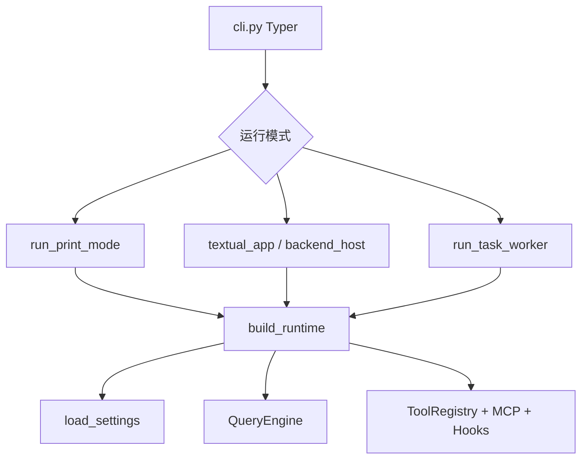

# OpenHarness UI 与配置系统深度分析

> **版本**: v1.0  
> **最后更新**: 2026-06-21  
> **包版本**: 0.1.9 · **同步说明**: [ARCHITECTURE_DOCS_SYNC.md](./ARCHITECTURE_DOCS_SYNC.md)  
> **文档类型**: Config / Settings / CLI 入口 / Runtime 装配 / UI 形态专项

---

## 📋 目录

- [1. 概述](#1-概述)
- [2. 配置系统（Settings）](#2-配置系统settings)
- [3. 配置优先级与文件位置](#3-配置优先级与文件位置)
- [4. Runtime 装配（build_runtime）](#4-runtime-装配build_runtime)
- [5. CLI 入口与运行模式](#5-cli-入口与运行模式)
- [6. UI 形态](#6-ui-形态)
- [7. 与 Prompt 的关系](#7-与-prompt-的关系)
- [8. 相关文档](#8-相关文档)

---

## 1. 概述

OpenHarness 将 **配置**（`config/settings.py`）与 **运行时装配**（`ui/runtime.py`）和 **多种 UI 壳**（Textual、print、React BackendHost）分离：



| 层级 | 关键文件 | 职责 |
|------|----------|------|
| 配置模型 | `config/settings.py` | Pydantic `Settings`、环境变量、JSON 文件 |
| 路径 | `config/paths.py` | 数据目录、项目上下文文件路径 |
| 装配 | `ui/runtime.py` | `build_runtime`、`handle_line`、slash 命令 |
| CLI | `cli.py` | Typer 子命令、`oh` 入口 |
| 前后端 | `ui/backend_host.py` | React TUI 与 Python 后端 |
| Textual | `ui/textual_app.py` | 终端全屏 UI |

前后端协议深读：[BACKEND_HOST_ARCHITECTURE.md](./BACKEND_HOST_ARCHITECTURE.md)。

---

## 2. 配置系统（Settings）

**源码**：`src/openharness/config/settings.py`（Pydantic `BaseModel` 树）。

### 2.1 主要配置块

| 配置类 / 字段 | 说明 |
|---------------|------|
| `PermissionSettings` | `mode`（default / plan / full_auto）、工具白黑名单、路径 glob、`denied_commands` |
| `MemorySettings` | 开关、`max_files`、entrypoint 行数/字节、compact 阈值、auto_extract / dream |
| `SandboxNetworkSettings` | 沙箱允许域名等 |
| `Settings.model` / `profiles` | 多 Provider Profile（Anthropic、OpenAI、Copilot、Ollama 等） |
| `settings.mcp_servers` | MCP 服务列表 |
| `settings.system_prompt` | 用户自定义 system 覆盖 |
| `settings.effort` / `passes` | Reasoning 深度（写入 runtime system） |
| `settings.fast_mode` | 快模式 session 提示 |
| `settings.max_turns` | 单轮 `submit_message` 内 ReAct 上限 |
| `hooks` | Hook 定义列表 |

### 2.2 权限模式与 Prompt

`build_runtime_system_prompt` 注入 `# Current Permission Mode`（`_build_permission_mode_section`）：

- **plan**：只读规划，阻断 mutating 工具（与 PermissionChecker 双层约束）。
- **full_auto**：允许 mutating 工具在必要时执行。
- **default**：只读直接执行，mutating 可能需用户确认。

详见 [ARCHITECTURE_PERMISSIONS_MCP.md](./ARCHITECTURE_PERMISSIONS_MCP.md)。

---

## 3. 配置优先级与文件位置

**优先级**（`settings.py` 文档头，高 → 低）：

1. CLI 参数  
2. 环境变量（如 `ANTHROPIC_API_KEY`、`OPENHARNESS_MODEL`）  
3. 配置文件 `~/.openharness/settings.json`（`get_config_file_path()`）  
4. 默认值  

**加载**：`load_settings()`（`config` 包导出，`ui/runtime.py` 在 `build_runtime` 时调用）。

**项目级文件**（非 settings.json，由 Prompt 装配读取）：

| 文件 | 路径逻辑 | 用途 |
|------|----------|------|
| `CLAUDE.md` | 项目树向上搜索 | 项目指令 |
| `.openharness/rules` 等 | `personalization/rules` | Local rules |
| Issue / PR context | `config/paths.py` | 可选注入 |
| Memory | `memory/paths.py` | L1/L2 记忆 |

---

## 4. Runtime 装配（build_runtime）

**核心**：`ui/runtime.py` 中 `build_runtime()` / `RuntimeBundle`。

典型装配顺序：

1. `load_settings()` + CLI 覆盖  
2. 解析 Provider → `AnthropicApiClient` / `OpenAICompatibleClient` 等  
3. `create_default_tool_registry()` + Plugin + MCP `McpClientManager`  
4. `load_hook_registry` → `HookExecutor`  
5. `PermissionChecker`  
6. `QueryEngine` 实例（同一进程内 `_messages` 连续）  
7. `build_runtime_system_prompt` → `engine.set_system_prompt`（**每条用户消息**重建，见 §7）  
8. `SessionBackend` 快照 / resume  

**Slash 命令**：`commands/registry.py` + `create_default_command_registry()`，在 `handle_line` 中优先于 LLM。

---

## 5. CLI 入口与运行模式

**入口**：`cli.py`（Typer），版本 `0.1.9`。

| 模式 | 触发 | 行为 |
|------|------|------|
| 默认交互 | `oh` | React TUI 或 Textual（见 `react_launcher` / `backend_host`） |
| Print | `oh -p "..."` | `run_print_mode` → 无 TUI，stdout 流式 |
| Task Worker | `--task-worker` | 子进程 Worker 内 `run_task_worker` |
| Coordinator drain | `CLAUDE_CODE_COORDINATOR_MODE=1` | print/TUI 在 `handle_line` 后 drain |

常用子命令（节选）：`auth`、`config`、`skills`、`plugins`、`bridge-*`、`cron`（见 `cli.py` 与 [ARCHITECTURE_MODULE_CATALOG.md §4.20](./ARCHITECTURE_MODULE_CATALOG.md#420-commands命令系统)）。

本地运行：[DEV_SOURCE_RUN.md](./DEV_SOURCE_RUN.md)。

---

## 6. UI 形态

| UI | 文件 | 说明 |
|----|------|------|
| **BackendHost + React** | `backend_host.py`, `frontend/` | 默认 `oh` 路径；stdin/stdout JSON 协议 |
| **Textual** | `textual_app.py` | 全屏终端 UI；Coordinator 时同样 `drain_coordinator_async_agents` |
| **Print REPL** | `app.py` `run_print_mode` / `run_repl` | 轻量 REPL |
| **权限对话框** | `permission_dialog.py` | 异步 `permission_prompt` Future |

**主题 / 快捷键 / Vim**（摘要）：

- 主题：`themes/` — [ARCHITECTURE_MODULE_CATALOG §4.24](./ARCHITECTURE_MODULE_CATALOG.md#424-themes主题系统)  
- 快捷键：`keybindings/` — `load_keybindings()` 在 runtime 加载  
- Vim：`vim/transitions.py` — TUI 编辑模式  

---

## 7. 与 Prompt 的关系

每条用户消息前（`ui/runtime.py`）：

```text
build_runtime_system_prompt(settings, cwd=..., latest_user_prompt=user_line)
→ engine.set_system_prompt(...)
→ engine.submit_message(user_line)
```

Coordinator 模式仍每轮重建 system（含 Memory）；仅 Skills/Delegation 段跳过。

**权威 Prompt 文档**：[ARCHITECTURE_PROMPTS.md](./ARCHITECTURE_PROMPTS.md)。

---

## 8. 相关文档

| 文档 | 内容 |
|------|------|
| [BACKEND_HOST_ARCHITECTURE.md](./BACKEND_HOST_ARCHITECTURE.md) | React ↔ Python 协议 |
| [ARCHITECTURE_ENGINE.md](./ARCHITECTURE_ENGINE.md) | QueryEngine / run_query |
| [ARCHITECTURE_PERMISSIONS_MCP.md](./ARCHITECTURE_PERMISSIONS_MCP.md) | PermissionChecker |
| [OHMO_DESIGN.md](./OHMO_DESIGN.md) | Gateway 部署与多渠道 |
| [DEV_SOURCE_RUN.md](./DEV_SOURCE_RUN.md) | 源码启动 |
