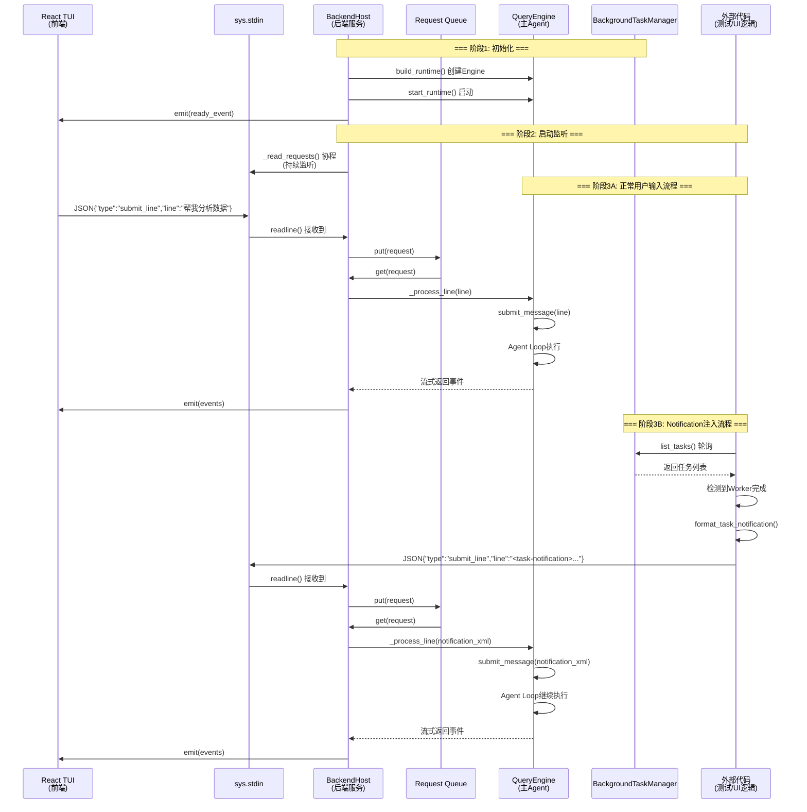
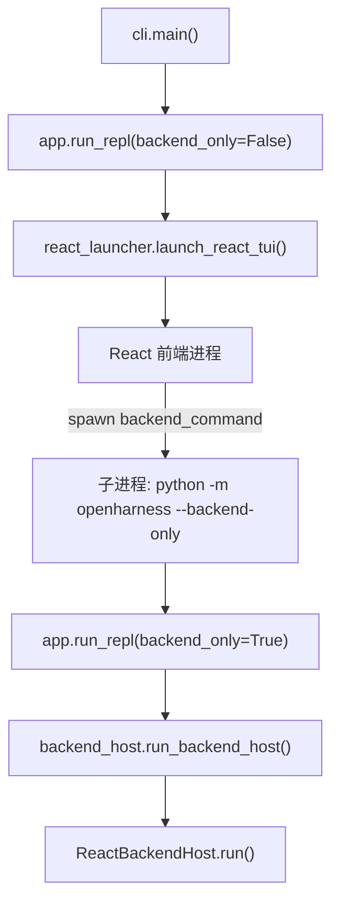
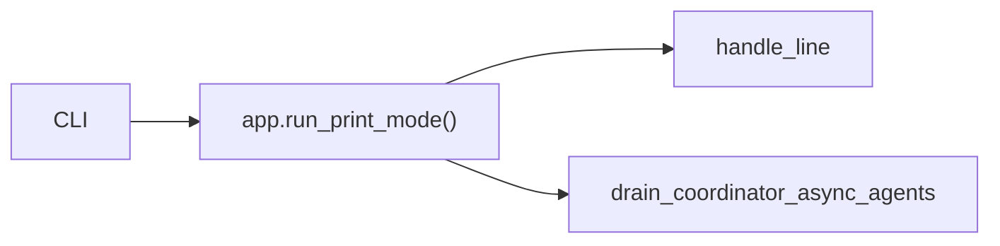
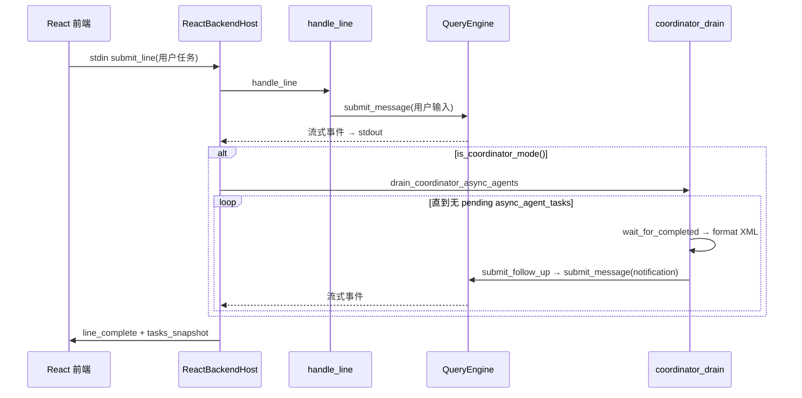
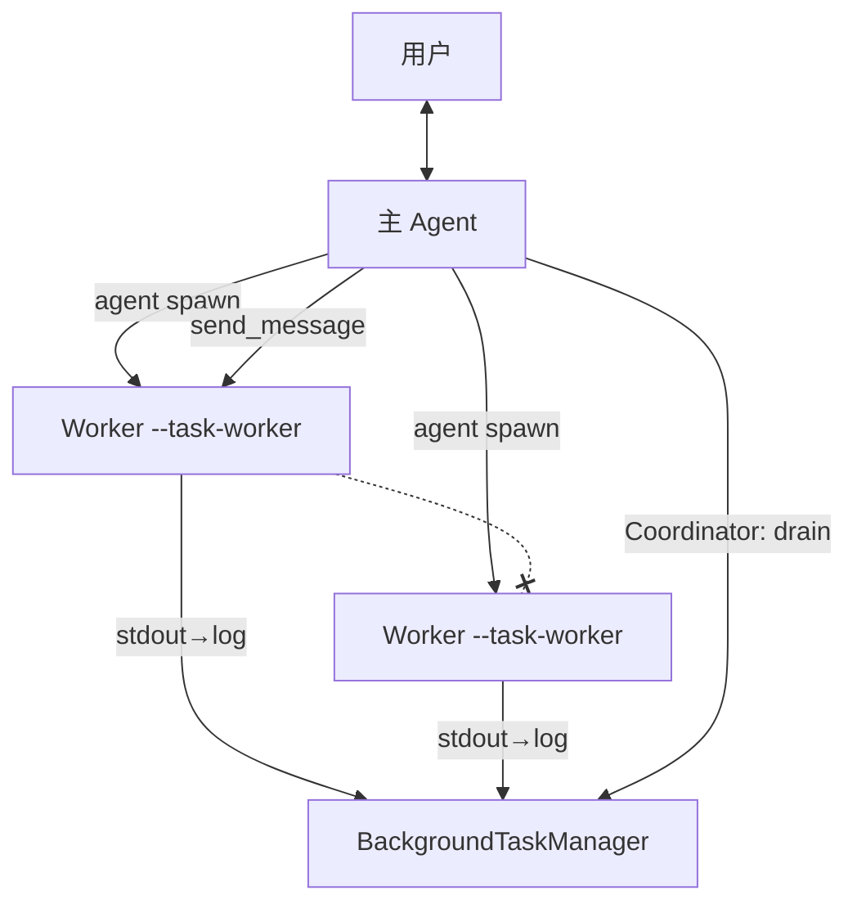
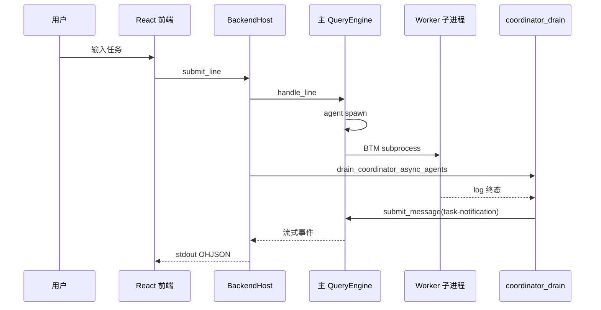

# BackendHost 架构详解

> **本文档详细解释 OpenHarness 中 BackendHost 的设计、启动流程和工作机制**
>
> **版本**: v1.7  
> **最后更新**: 2026-06-10  
> **v1.7 更新内容**:
> - ✅ 补充 `app.py` 与 `backend_host.py` 关系、启动流程、`drain_coordinator_async_agents` 调用链
> - ✅ 纠偏 §5：Coordinator 下 notification 由 `coordinator_drain` 同进程 `submit_message`，非 React 经 stdin 注入
> - ✅ 重写 §9：BackendHost **已集成** Coordinator drain
> - ✅ 勘误 §7：`swarm_status` 前端已消费、Python 未 emit
> - ✅ 重写 §10–§11：Swarm 非独立 CLI 模式；默认 subprocess 路径 vs Mailbox 规划路径
>
> **v1.6 更新内容**:
> - ✅ 新增 Swarm模式启动方式详解(通过`agent`工具动态创建)
> - ✅ 澄清 CLI 与 Swarm 的关系(Swarm不是CLI参数,而是运行时工具调用)
> - ✅ 补充三种多智能体模式的完整对比(Coordinator/Swarm/普通模式)
> - ✅ 新增常见问答(Q&A)章节
>
> **v1.5 更新内容**:
> - ✅ 新增 Swarm模式与Coordinator模式的详细对比说明
> - ✅ 澄清 BackendHost **不包含** Coordinator UI轮询逻辑(与app.py的关键差异)
> - ✅ 说明 React TUI 前端应自行实现Coordinator轮询
> - ✅ 补充架构设计理由和最佳实践
> - ✅ 澄清 `oh` 命令行与 BackendHost 的关系
> - ✅ 说明 BackendHost 是给 React TUI 前端用的后端服务
> - ✅ 补充完整的前后端分离架构图
> - ✅ 新增 Swarm 状态推送机制说明(`_emit_swarm_status()`)
> - ✅ 补充 BackendHost 与 app.py headless模式的差异对比
> - ✅ 说明 BackendHost **不包含** Coordinator UI轮询逻辑
> - ✅ 明确 Coordinator 轮询仅在 `run_repl()` headless模式下可用

---

## 📋 目录

- [1. BackendHost是什么?](#1-backendhost是什么)
- [2. BackendHost运行在哪里?](#2-backendhost运行在哪里)
- [3. BackendHost的启动流程](#3-backendhost的启动流程)
- [4. BackendHost的工作机制](#4-backendhost的工作机制)
- [5. Worker、BackendHost、主Agent的关系](#5-workerbackendhost主agent的关系)
  - [5.4 `app.py` 与 `backend_host.py`](#54-apppy-与-backend_hostpy)
  - [5.5 启动流程（三条主路径）](#55-启动流程三条主路径)
  - [5.6 `drain_coordinator_async_agents` 调用链](#56-drain_coordinator_async_agents-调用链)
  - [5.7 Coordinator 下的 notification 路径](#57-coordinator-下的-notification-路径)
- [6. 常见误解澄清](#6-常见误解澄清)
- [7. Swarm 状态推送机制（预留 API）](#7-swarm-状态推送机制预留-api)
  - [7.0 当前实现状态](#70-当前实现状态源码核对)
  - [7.4 `tasks_snapshot` vs `swarm_status`](#74-tasks_snapshot-vs-swarm_status)
- [8. `oh` 命令行与 BackendHost 的关系](#8-oh-命令行与-backendhost-的关系)
- [9. Coordinator drain 在各 UI 宿主中的分布](#9-coordinator-drain-在各-ui-宿主中的分布)
- [10. 多 Agent：Coordinator 编排 vs Swarm 基础设施](#10-多-agentcoordinator-编排-vs-swarm-基础设施)
- [11. 如何启动多 Agent 与交互（实操）](#11-如何启动多-agent-与交互实操)
- [12. 常见问答(Q&A)](#12-常见问答qa)

---

## 1. BackendHost是什么?

**BackendHost是OpenHarness UI层的后端服务**,负责:

1. **监听stdin/stdout**: 与前端(React TUI)通过JSON-lines协议通信
2. **管理QueryEngine生命周期**: 创建、启动、关闭Engine实例
3. **转发用户输入**: 将前端消息转发给Engine的`submit_message()`
4. **流式返回事件**: 将Engine产生的事件流式返回给前端显示

**代码位置**: `src/openharness/ui/backend_host.py`

**关键特性**:
- ✅ **被动接收**: BackendHost不主动生成消息,只负责转发
- ✅ **消息无关**: 不区分用户消息和notification XML,都当作普通文本
- ✅ **独立进程**: 可以作为独立进程运行(`--backend-only`模式)

---

## 2. BackendHost运行在哪里?

**BackendHost、QueryEngine、BackgroundTaskManager都在同一个父进程中!**

```
┌──────────────────────────────────────────────────────┐
│                  父进程 (Main Process)                │
│                                                      │
│  ┌────────────────────────────────────────────────┐  │
│  │         React TUI (前端, 独立进程)              │  │
│  │  - 显示UI界面                                   │  │
│  │  - 接收用户输入                                 │  │
│  └────────────────┬───────────────────────────────┘  │
│                   │                                  │
│          stdin/stdout (JSON-lines协议)               │
│                   │                                  │
│  ┌────────────────▼───────────────────────────────┐  │
│  │      BackendHost (后端服务)                     │  │
│  │                                                │  │
│  │  职责:                                         │  │
│  │  1. 监听stdin,接收前端消息                      │  │
│  │  2. 创建QueryEngine实例                        │  │
│  │  3. 转发消息给Engine                           │  │
│  │  4. 流式返回事件给前端                          │  │
│  └────────────────┬───────────────────────────────┘  │
│                   │                                  │
│          直接调用 (Python对象)                        │
│                   │                                  │
│  ┌────────────────▼───────────────────────────────┐  │
│  │         QueryEngine (主Agent)                   │  │
│  │                                                │  │
│  │  职责:                                         │  │
│  │  1. 执行Agent Loop                             │  │
│  │  2. 调用LLM API                                │  │
│  │  3. 执行工具                                   │  │
│  │  4. 管理对话历史                               │  │
│  └────────────────┬───────────────────────────────┘  │
│                   │                                  │
│          get_task_manager() (单例)                   │
│                   │                                  │
│  ┌────────────────▼───────────────────────────────┐  │
│  │    BackgroundTaskManager (任务管理器)           │  │
│  │                                                │  │
│  │  职责:                                         │  │
│  │  1. 跟踪所有后台任务状态                        │  │
│  │  2. 监控子进程生命周期                          │  │
│  │  3. 提供查询接口                               │  │
│  └────────────────────────────────────────────────┘  │
└──────────────────────────────────────────────────────┘
                   ▲                ▲
                   │                │
            启动子进程        轮询查询任务状态
                   │                │
┌──────────────────┼────────────────┼──────────────────┐
│                  │                │                  │
│  ┌───────────────▼──────┐  ┌─────▼───────────────┐  │
│  │  Worker Agent 1      │  │  Worker Agent 2     │  │
│  │  (子进程,独立)       │  │  (子进程,独立)      │  │
│  │                      │  │                     │  │
│  │  - 执行分配的任务     │  │  - 执行分配的任务    │  │
│  │  - 完成后退出         │  │  - 完成后退出        │  │
│  └──────────────────────┘  └─────────────────────┘  │
└──────────────────────────────────────────────────────┘
```

**关键点**:
- ✅ **BackendHost、QueryEngine、BackgroundTaskManager都在父进程中**
- ✅ **BackendHost是一个独立的服务,通过stdin/stdout与前端通信**
- ✅ **BackendHost内部管理QueryEngine实例**
- ✅ **Worker是独立的子进程,与BackendHost无直接通信**

---

## 3. BackendHost的启动流程

### 3.1 启动入口

**CLI参数**: `src/openharness/cli.py:1501-1506`

```python
backend_only: bool = typer.Option(
    False,
    "--backend-only",
    help="Run the structured backend host for the React terminal UI",
    hidden=True,
)
```

**启动命令**:
```bash
# 启动BackendHost (作为独立进程)
openharness --backend-only
```

### 3.2 启动流程

```python
# src/openharness/ui/app.py:54-69
async def run_repl(..., backend_only: bool = False, ...):
    if backend_only:
        # ⚡ 启动BackendHost (独立进程模式)
        await run_backend_host(
            cwd=cwd,
            model=model,
            max_turns=max_turns,
            base_url=base_url,
            system_prompt=system_prompt,
            api_key=api_key,
            restore_messages=restore_messages,
            restore_tool_metadata=restore_tool_metadata,
            permission_mode=permission_mode,
        )
        return
    
    # 否则启动完整的React TUI (包含前端+后端)
    exit_code = await launch_react_tui(...)
```

### 3.3 BackendHost初始化

```python
# src/openharness/ui/backend_host.py:738-782
async def run_backend_host(...) -> int:
    """Run the structured React backend host."""
    if cwd:
        os.chdir(cwd)
    
    # Step 1: 创建BackendHost实例
    host = ReactBackendHost(
        BackendHostConfig(
            model=model,
            max_turns=max_turns,
            base_url=base_url,
            system_prompt=system_prompt,
            api_key=api_key,
            cwd=cwd,
            restore_messages=restore_messages,
            restore_tool_metadata=restore_tool_metadata,
            permission_mode=permission_mode,
            ...
        )
    )
    
    # Step 2: 启动BackendHost主循环
    return await host.run()
```

---

## 4. BackendHost的工作机制

### 4.1 核心方法: `ReactBackendHost.run()`

```python
# src/openharness/ui/backend_host.py:81-166
async def run(self) -> int:
    """BackendHost主循环。"""
    
    # ===== 阶段1: 初始化Runtime =====
    self._bundle = await build_runtime(
        model=self._config.model,
        max_turns=self._config.max_turns,
        base_url=self._config.base_url,
        system_prompt=self._config.system_prompt,
        api_key=self._config.api_key,
        cwd=self._config.cwd,
        restore_messages=self._config.restore_messages,
        restore_tool_metadata=self._config.restore_tool_metadata,
        permission_prompt=self._ask_permission,
        ask_user_prompt=self._ask_question,
        ...
    )
    await start_runtime(self._bundle)
    
    # 发送ready事件给前端
    await self._emit(BackendEvent.ready(...))
    
    # ===== 阶段2: 启动stdin监听协程 =====
    reader = asyncio.create_task(self._read_requests())
    
    try:
        # ===== 阶段3: 主循环 - 处理请求队列 =====
        while self._running:
            request = await self._request_queue.get()
            
            if request.type == "shutdown":
                break
            
            if request.type == "submit_line":
                # ⚡ 关键: 处理用户输入或notification
                line = (request.line or "").strip()
                self._busy = True
                try:
                    should_continue = await self._process_line(line)
                finally:
                    self._busy = False
                
                if not should_continue:
                    break
    
    finally:
        reader.cancel()
        await close_runtime(self._bundle)
    
    return 0
```

### 4.2 stdin监听协程

```python
# src/openharness/ui/backend_host.py:168-192
async def _read_requests(self) -> None:
    """持续监听stdin,接收来自前端的请求。"""
    while True:
        # Step 1: 阻塞读取一行
        raw = await asyncio.to_thread(sys.stdin.buffer.readline)
        
        if not raw:
            # stdin关闭,发送shutdown信号
            await self._request_queue.put(FrontendRequest(type="shutdown"))
            return
        
        payload = raw.decode("utf-8").strip()
        if not payload:
            continue
        
        # Step 2: 尝试解析为JSON请求
        try:
            request = FrontendRequest.model_validate_json(payload)
        except Exception as exc:
            # 如果不是合法JSON,返回错误
            await self._emit(BackendEvent(type="error", message=f"Invalid request: {exc}"))
            continue
        
        # Step 3: 处理特殊请求类型
        if request.type == "permission_response":
            # 权限确认响应
            future = self._permission_requests[request.request_id]
            if not future.done():
                future.set_result(bool(request.allowed))
            continue
        
        if request.type == "question_response":
            # 问题回答响应
            future = self._question_requests[request.request_id]
            if not future.done():
                future.set_result(request.answer or "")
            continue
        
        # Step 4: 普通请求放入队列
        await self._request_queue.put(request)
```

### 4.3 消息处理

```python
# src/openharness/ui/backend_host.py:194-312
async def _process_line(self, line: str) -> bool:
    """处理一行输入(用户消息或notification XML)。"""
    assert self._bundle is not None
    
    # Step 1: 显示到UI
    await self._emit(
        BackendEvent(type="transcript_item", 
                    item=TranscriptItem(role="user", text=line))
    )
    
    # Step 2: 定义事件渲染回调
    async def _render_event(event: StreamEvent) -> None:
        if isinstance(event, AssistantTextDelta):
            await self._emit(BackendEvent(type="assistant_delta", message=event.text))
        elif isinstance(event, ToolExecutionStarted):
            await self._emit(BackendEvent(type="tool_started", ...))
        elif isinstance(event, ToolExecutionCompleted):
            await self._emit(BackendEvent(type="tool_completed", ...))
            # 更新任务快照
            await self._emit(BackendEvent.tasks_snapshot(
                get_task_manager().list_tasks()
            ))
        # ... 其他事件类型
    
    # Step 3: ⚡ 关键: 调用handle_line(),最终调用engine.submit_message()
    should_continue = await handle_line(
        self._bundle,
        line,  # ← 这就是用户消息或notification XML
        print_system=_print_system,
        render_event=_render_event,
        clear_output=_clear_output,
    )
    
    return should_continue
```

### 4.4 工作流程图



**关键点**:
1. ✅ **BackendHost启动时创建QueryEngine**
2. ✅ **启动`_read_requests()`协程监听stdin**
3. ✅ **所有消息(用户输入/notification)都通过stdin传入**
4. ✅ **BackendHost将消息放入队列,逐个处理**
5. ✅ **调用`_process_line()` → `engine.submit_message()`**
6. ✅ **Engine执行Agent Loop,流式返回事件**
7. ✅ **BackendHost将事件转发给前端**

---

## 5. Worker、BackendHost、主Agent的关系

### 5.1 完整架构图

```
┌──────────────────────────────────────────────────────────────┐
│                       父进程 (Main Process)                   │
│                                                              │
│  ┌────────────────────────────────────────────────────────┐  │
│  │              React TUI (前端, 独立进程)                 │  │
│  │                                                        │  │
│  │  - 显示UI界面                                           │  │
│  │  - 接收用户键盘输入                                     │  │
│  │  - 显示Engine返回的事件                                 │  │
│  └──────────────────────┬─────────────────────────────────┘  │
│                         │                                    │
│                stdin/stdout (JSON-lines)                     │
│                         │                                    │
│  ┌──────────────────────▼─────────────────────────────────┐  │
│  │              BackendHost (后端服务)                     │  │
│  │                                                        │  │
│  │  职责:                                                 │  │
│  │  1. 监听stdin,接收前端消息                              │  │
│  │  2. 将消息放入请求队列                                  │  │
│  │  3. 从队列取出消息,调用Engine                           │  │
│  │  4. 接收Engine事件,转发给前端                           │  │
│  │                                                        │  │
│  │  关键特性:                                             │  │
│  │  - 被动接收,不主动生成消息                              │  │
│  │  - 不区分用户消息和notification                         │  │
│  │  - 只负责消息转发                                       │  │
│  └──────────────────────┬─────────────────────────────────┘  │
│                         │                                    │
│              直接调用 (Python对象,同一进程)                   │
│                         │                                    │
│  ┌──────────────────────▼─────────────────────────────────┐  │
│  │              QueryEngine (主Agent)                      │  │
│  │                                                        │  │
│  │  职责:                                                 │  │
│  │  1. 维护对话历史 (_messages)                            │  │
│  │  2. 执行Agent Loop (LLM → Tool → Result)              │  │
│  │  3. 管理工具元数据 (_tool_metadata)                     │  │
│  │  4. 跟踪token使用 (_cost_tracker)                       │  │
│  │                                                        │  │
│  │  关键方法:                                             │  │
│  │  - submit_message(prompt): 添加消息并执行循环           │  │
│  │  - continue_pending(): 继续执行中断的循环               │  │
│  └──────────────────────┬─────────────────────────────────┘  │
│                         │                                    │
│              get_task_manager() (单例,全局共享)               │
│                         │                                    │
│  ┌──────────────────────▼─────────────────────────────────┐  │
│  │         BackgroundTaskManager (任务管理器)              │  │
│  │                                                        │  │
│  │  职责:                                                 │  │
│  │  1. 跟踪所有后台任务状态 (_tasks)                       │  │
│  │  2. 监控子进程生命周期 (_watch_process)                 │  │
│  │  3. 提供查询接口 (get_task, list_tasks)                 │  │
│  │                                                        │  │
│  │  关键特性:                                             │  │
│  │  - 只负责任务跟踪,不负责消息传递                        │  │
│  │  - 不提供notification注入功能                           │  │
│  │  - 外部代码通过轮询获取任务状态                         │  │
│  └────────────────────────────────────────────────────────┘  │
└──────────────────────────────────────────────────────────────┘
                         ▲                ▲
                         │                │
                  启动子进程        轮询查询任务状态
                         │                │
┌────────────────────────┼────────────────┼──────────────────┐
│                        │                │                  │
│  ┌─────────────────────▼──────┐  ┌─────▼────────────────┐  │
│  │   Worker Agent 1           │  │  Worker Agent 2      │  │
│  │   (子进程, subprocess)     │  │  (子进程, subprocess)│  │
│  │                            │  │                      │  │
│  │  职责:                     │  │  职责:               │  │
│  │  - 执行分配的任务           │  │  - 执行分配的任务     │  │
│  │  - 可以派生更小的Worker     │  │  - 完成后退出         │  │
│  │  - 完成后退出               │  │                      │  │
│  │                            │  │                      │  │
│  │  通信方式:                 │  │  通信方式:           │  │
│  │  - 通过stdin接收初始prompt  │  │  - 通过stdin接收prompt│  │
│  │  - 通过stdout输出结果       │  │  - 通过stdout输出结果 │  │
│  │  - 不与父进程直接通信       │  │  - 不与父进程直接通信 │  │
│  └────────────────────────────┘  └──────────────────────┘  │
│                                                             │
│  ┌──────────────────────────────────────────────────────┐  │
│  │         外部代码 (测试脚本 / UI逻辑)                   │  │
│  │                                                      │  │
│  │  职责:                                               │  │
│  │  1. 调用engine.submit_message(question)              │  │
│  │  2. 收集本轮派生的task_id                             │  │
│  │  3. 轮询TaskManager.list_tasks()                     │  │
│  │  4. 检测Worker完成                                    │  │
│  │  5. 生成notification XML                              │  │
│  │  6. 再次调用engine.submit_message(xml)               │  │
│  │                                                      │  │
│  │  关键特性:                                           │  │
│  │  - 负责notification的生成和注入                       │  │
│  │  - 使用轮询模式(pull),不是推送模式(push)             │  │
│  │  - 简单可靠,不需要复杂IPC                             │  │
│  └──────────────────────────────────────────────────────┘  │
└──────────────────────────────────────────────────────────────┘
```

### 5.2 消息流向

**用户输入流程**:
```
用户 → React TUI → stdin → BackendHost → Queue → Engine → LLM → Tool → Result
                                                                  ↓
                                                            BackendHost → stdout → React TUI → 用户
```

**Notification 注入（两条路径，勿混用）**:

| 路径 | 适用 | 谁 poll | 谁 `submit_message` | 是否经 stdin |
|------|------|---------|----------------------|--------------|
| **A. Coordinator 自动 drain**（默认） | `CLAUDE_CODE_COORDINATOR_MODE=1` + BackendHost / `run_print_mode` | `coordinator_drain.py` | 同进程 `bundle.engine.submit_message` | ❌ notification 不经 stdin |
| **B. 手动 Pull**（普通模式 / 自建集成） | 无 drain 的宿主或测试脚本 | 外部代码 / 前端 | `engine.submit_message` 或 stdin `submit_line` | 可选 |

路径 A（React TUI + Coordinator）:

```
React → stdin(用户 submit_line) → BackendHost → handle_line → Engine spawn Worker
BackendHost → drain_coordinator_async_agents → poll TaskManager → submit_follow_up
           → Engine.submit_message(XML) → render_event → stdout → React
```

路径 B（普通模式或手动集成）:

```
外部代码 → 轮询 TaskManager → 生成 XML → stdin submit_line → BackendHost → Engine
```

详见 [§5.7](#57-coordinator-下的-notification-路径)。

### 5.3 组件职责对比

| 组件 | 位置 | 职责 | 是否主动发送消息 |
|------|------|------|----------------|
| **React TUI** | 独立进程（默认 `oh` 父进程） | 显示 UI；向 BackendHost 发 **用户** `submit_line` | ✅ 用户输入 |
| **BackendHost** | 子进程（`--backend-only`） | 协议转发 + `handle_line` + Coordinator 时 **内置 drain** | ❌ 不主动发用户消息；Coordinator 下 **主动** `submit_message(notification)` |
| **`coordinator_drain`** | 同 BackendHost / print 进程 | poll 终态、格式化 XML、`submit_follow_up` | ✅（Coordinator 专用） |
| **QueryEngine** | 与 BackendHost 同进程 | Agent Loop | ❌ 被动执行 |
| **BackgroundTaskManager** | 与 BackendHost 同进程 | 任务跟踪 | ❌ 只提供查询 |
| **Worker Agent** | 子进程 `--task-worker` | 执行任务 | ❌ 完成后退出 |
| **外部代码 / 前端轮询** | 可选 | 路径 B：手动 notification | ✅ 仅当未使用 drain |

### 5.4 `app.py` 与 `backend_host.py`

两者 **不是**「父子各调一次 drain」的串联关系，而是 **UI 总入口** 与 **React 专用后端** 的分工；**共用** `ui/coordinator_drain.py` 中的 `drain_coordinator_async_agents`。

| 模块 | 角色 |
|------|------|
| **`ui/app.py`** | CLI 的 UI 分发：`run_repl` / `run_print_mode` / `run_task_worker` |
| **`ui/backend_host.py`** | `ReactBackendHost` + `run_backend_host`：JSON-lines 后端 |
| **`ui/coordinator_drain.py`** | Coordinator 收 Worker 结果的共享实现 |

**谁在哪儿调用 `drain`？**

| 入口 | 调 drain？ | 场景 |
|------|-----------|------|
| `run_repl` → `launch_react_tui` | ❌ app 不调 | 默认 `oh`；drain 在 React 拉起的 BackendHost **子进程** 内 |
| `run_repl` → `run_backend_host` | ✅ `_process_line` 末尾 | `oh --backend-only` 或 React `build_backend_command()` |
| `run_print_mode` | ✅ `app.py` 内直接调 | `oh -p "..."` |
| `run_task_worker` | ❌ | Worker 子进程 |
| `textual_app.py` | ✅ | Textual TUI（若使用） |

`run_repl` 分叉（`app.py`）:

```python
if backend_only:
    await run_backend_host(...)  # 委托给 backend_host，不再启动 React
    return
exit_code = await launch_react_tui(...)  # 父进程只跑 React，不持有 QueryEngine
```

**一次会话不会 app 与 backend_host 各 drain 一遍**；默认交互只有 BackendHost 子进程里 **一个** `QueryEngine` 实例。

### 5.5 启动流程（三条主路径）

#### 路径 A：默认交互 `oh`（React TUI）



1. **父进程**：Node/tsx 跑 React（`frontend/terminal`），**无** `QueryEngine`。
2. React 读取 `OPENHARNESS_FRONTEND_CONFIG`，spawn `python -m openharness --backend-only`（见 `react_launcher.build_backend_command`）。
3. **子进程**：`run_backend_host` → `ReactBackendHost.run()`，持有主 Agent 与 `TaskManager`。

#### 路径 B：非交互 `oh -p "..."`



无 BackendHost、无 React；`app.py` 自己 `build_runtime` 并在 Coordinator 下 drain。

#### 路径 C：仅后端 `oh --backend-only`

与路径 A 中 **BackendHost 子进程** 相同；供调试或自定义前端连 stdin/stdout。

**进程与 Engine 实例**:

| 路径 | 主 Agent `QueryEngine` 所在进程 |
|------|--------------------------------|
| A（默认 `oh`） | BackendHost **子进程**（React 父进程无 Engine） |
| B（`-p`） | 单进程 `run_print_mode` |
| C（`--backend-only`） | 当前 BackendHost 进程 |

### 5.6 `drain_coordinator_async_agents` 调用链

实现：`ui/coordinator_drain.py`。在 `handle_line` **之后**、由 **UI 宿主** 调用（**不在** `QueryEngine` 内部）。

**BackendHost 单条用户消息**:



`backend_host.py` 关键片段:

```python
should_continue = await handle_line(self._bundle, line, ...)
if is_coordinator_mode():
    await drain_coordinator_async_agents(
        self._bundle,
        prompt_seed=line,
        print_system=_print_system,
        render_event=_render_event,
    )
```

`drain_coordinator_async_agents` 内部 `while True`：一批 Worker 终态 → `submit_follow_up` → Coordinator 可能再 spawn → 直至 `async_agent_tasks` 无 pending。

`submit_follow_up` **直接** `bundle.engine.submit_message(message)`，**不**写入 stdin；事件仍经 `render_event` → `_emit` 到前端。

### 5.7 Coordinator 下的 notification 路径

| 问题 | 答案 |
|------|------|
| notification 是 React 发的吗？ | **通常不是**。React 只发 **用户** `submit_line`；notification 由 **BackendHost 内** `coordinator_drain` 注入。 |
| 是普通模式吗？ | **否**。自动 drain 仅在 **Coordinator 模式**（`CLAUDE_CODE_COORDINATOR_MODE=1`）。普通模式需 `task_output` 或路径 B 手动轮询。 |
| loop 在 Engine 里吗？ | **否**。loop 在 `coordinator_drain`（UI 层 poll `TaskManager` + while）。 |
| Worker 会 push 给主 Agent 吗？ | **否**。Worker 写 log 并退出；父进程 poll 后读 log 拼 XML。 |

---

## 6. 常见误解澄清

### ❌ 误解1: Worker 发消息给 BackendHost

**正确理解**: Worker **不直接**回调主 Agent。

- Worker 完成后退出；输出写入 task log（`BackgroundTaskManager`）。
- **Coordinator 模式**：`coordinator_drain` 在同进程 poll → `engine.submit_message(<task-notification>)`。
- **普通模式 / 无 drain**：主 LLM 调 `task_output`，或外部代码手动 poll + inject。

### ❌ 误解2: BackendHost 在 Worker 中运行

**正确理解**: BackendHost 在 **主 Agent 父进程** 中运行（默认 `oh` 下为 `--backend-only` **子进程**），与 Worker 子进程独立。

- BackendHost、`QueryEngine`、`TaskManager` 同进程。
- Worker 是 `--task-worker` 子进程，无法访问 BackendHost 对象。

### ❌ 误解3: BackgroundTaskManager 负责 notification 注入

**正确理解**: TaskManager **只跟踪任务**；notification 由 **`coordinator_drain`** 或外部代码生成并 `submit_message`。

### ❌ 误解4: BackendHost 从不主动 submit

**正确理解**: BackendHost 对用户输入 **被动**（只转发 stdin `submit_line`）。

- **Coordinator 模式**下，`handle_line` 之后会 **主动** 调 `drain_coordinator_async_agents` → `submit_follow_up` → `engine.submit_message(notification)`。
- 该 submit **不经 stdin**；事件仍经 stdout 推给 React。

### ❌ 误解5: `app.py` 与 `backend_host.py` 各 drain 一次

**正确理解**: 默认 `oh` 只有 BackendHost **子进程** drain 一次；`app.run_repl` 走 React 时 **app 不调 drain**。`run_print_mode` 与 BackendHost 是 **并列宿主**，共用 `coordinator_drain.py`，不会串联双 drain。

## 7. Swarm 状态推送机制（预留 API）

> **勘误（2026-06-10）**：`_emit_swarm_status` 与协议 **已就绪**；**React 前端已能处理** `swarm_status`。**缺口在 Python**：`InProcessBackend` / `SubprocessBackend` **尚未调用** emit，故默认 `oh` 下 `SwarmPanel` 通常为空。任务侧栏仍靠 **`tasks_snapshot`**（与 Swarm push 并行、非替代关系）。

### 7.0 当前实现状态（源码核对）

| 层级 | 组件 | 状态 | 说明 |
|------|------|------|------|
| 后端 emit | `ReactBackendHost._emit_swarm_status` | ✅ 已定义 | `ui/backend_host.py`（约 446–452 行） |
| 后端调用方 | `InProcessBackend` / `SubprocessBackend` / swarm 模块 | ❌ **无调用** | 全仓库仅定义，无生产路径触发 |
| 协议 | `BackendEvent.type == "swarm_status"` | ✅ | `ui/protocol.py`（约 109、134–135 行） |
| React 消费 | `useBackendSession.ts` | ✅ 已实现 | 更新 `swarmTeammates` / `swarmNotifications` |
| React UI | `App.tsx` → `SwarmPanel` | ✅ 已实现 | 有数据时显示 Swarm 面板 |
| 任务列表（通用） | `tasks_snapshot` | ✅ 已用 | 工具完成、`assistant_complete` 等触发；**不**依赖 `swarm_status` |

**用户今日可见**：

```text
agent spawn (subprocess，默认路径)
  → tasks_snapshot 更新 ✅（任务侧栏 / 列表）
  → swarm_status 事件 ❌（无人 _emit_swarm_status）
  → SwarmPanel 通常不显示

Coordinator + drain
  → <task-notification> → 主 Agent 续聊 ✅
  → 与 swarm_status 无关
```

### 7.1 设计目标

`ReactBackendHost._emit_swarm_status()` 用于向 React TUI **推送** Swarm 队友快照与通知队列（stdout `OHJSON:` 协议），与 Coordinator 的 **pull + `submit_message`** 互补。

**设计意图**（接通后）：

- Leader / Swarm 后端在队友状态变化时 **主动 emit**
- `SwarmPanel` 用 push 更新，无需为 Swarm 专用字段再 poll
- **不取代** `tasks_snapshot`：通用后台任务列表仍用现有 snapshot 事件

### 7.2 API 定义

**源码**：`src/openharness/ui/backend_host.py`（`ReactBackendHost._emit_swarm_status`，约 **446–452** 行）

```python
def _emit_swarm_status(self, teammates: list[dict], notifications: list[dict] | None = None) -> None:
    """Emit a swarm_status event synchronously (schedule as coroutine)."""
    import asyncio
    loop = asyncio.get_event_loop()
    loop.create_task(
        self._emit(BackendEvent(type="swarm_status", swarm_teammates=teammates, swarm_notifications=notifications))
    )
```

| 特性 | 说明 |
|------|------|
| 同步入口、异步发送 | `loop.create_task(self._emit(...))`，便于从同步回调调用 |
| 非阻塞 | 不 await `_emit`，下一事件循环迭代写 stdout |
| 协议字段 | `swarm_teammates`、`swarm_notifications` |

### 7.3 协议与前端（已交付）

**协议**：`src/openharness/ui/protocol.py` — `BackendEvent.type` 含 `"swarm_status"`；字段 `swarm_teammates`、`swarm_notifications`。

**React 前端（已实现，非待办）**：

| 文件 | 行为 |
|------|------|
| `frontend/terminal/src/hooks/useBackendSession.ts` | `event.type === 'swarm_status'` 时 `setSwarmTeammates` / `setSwarmNotifications` |
| `frontend/terminal/src/App.tsx` | `SwarmPanel` 展示队友与通知 |
| `frontend/terminal/src/types.ts` | `SwarmTeammateSnapshot` 等类型 |

缺的是 **BackendHost 子进程里谁调用 `_emit_swarm_status`**，不是前端不会收。

### 7.4 `tasks_snapshot` vs `swarm_status`

| 事件 | 来源 | 前端用途 | 今日 subprocess spawn |
|------|------|----------|------------------------|
| **`tasks_snapshot`** | `tool_completed`、`assistant_complete`、`ready` 等 | 通用 **任务列表** / 侧栏 | ✅ 有数据 |
| **`swarm_status`** | 仅 `_emit_swarm_status` | **SwarmPanel** 队友/通知 | ❌ 通常无事件 |

勿写「Swarm 完全避免前端轮询」：任务状态仍靠 **snapshot 拉取式更新**；仅 **Swarm 专用 UI** 设计为 push。

### 7.5 预期集成场景（伪代码，未接线）

以下 **不是** 当前默认 `oh` 路径（今日 `AgentTool` → `SubprocessBackend`）。Mailbox / in-process 与 BackendHost 之间 **尚无** 现成 wiring。

#### 场景 1：InProcessBackend 推送队友状态

```python
# 伪代码：需将 ReactBackendHost 引用注入 InProcessBackend
self._backend_host._emit_swarm_status(teammates=[...])
```

#### 场景 2：Leader 读 Mailbox 后推送 idle 通知

```python
# 伪代码：TeammateMailbox.read_all(unread_only=True)  API 已存在于 mailbox.py
messages = await leader_mailbox.read_all(unread_only=True)
# ... 格式化为 notifications ...
self._backend_host._emit_swarm_status(teammates=[], notifications=notifications)
```

适用于 **in-process + Mailbox** 叙事；与 subprocess Coordinator 生产路径不同。

### 7.6 与 Coordinator drain 的对比

| 维度 | Coordinator drain | Swarm `swarm_status` push |
|------|---------------------|---------------------------|
| 实现 | `coordinator_drain.py` | `_emit_swarm_status()` |
| 宿主 | BackendHost、`run_print_mode`、textual | 计划：Swarm 后端 / 主循环钩子 |
| 方向 | Pull（poll `TaskManager`） | Push（stdout 事件） |
| 主 Agent 续聊 | 同进程 `engine.submit_message(XML)` | 不注入对话；仅 UI 状态 |
| 当前状态 | ✅ BackendHost 已集成 | 🔧 emit API 有、**调用方无** |

### 7.7 为什么是「预留」、待办清单

**预留原因**：

1. BackendHost 不硬依赖 Swarm 实现，避免与 `SubprocessBackend` 默认路径纠缠
2. 不同后端（in_process / subprocess / 未来 tmux）自行决定何时 emit
3. 前端与协议先落地，Python 侧逐步接线

**待办（2026-06-10）**：

- [ ] `InProcessBackend` spawn / 状态变化时调用 `_emit_swarm_status`（需 BackendHost 引用或全局钩子）
- [ ] `SubprocessBackend` 或 BTM completion 路径映射为 `swarm_teammates` 快照（可选与 snapshot 去重）
- [x] React TUI 处理 `swarm_status`（`useBackendSession` + `SwarmPanel`）
- [ ] 配置项：是否启用 Swarm push、与 `tasks_snapshot` 的职责边界

### 7.8 技术细节

#### 为何 `create_task` 而非直接 `await _emit`？

`_emit_swarm_status` 可能从同步上下文（如工具回调）调用；`create_task` 避免阻塞当前协程。

#### `_emit` 并发安全

`async def _emit` 使用 `async with self._write_lock`（约 846 行），多个 `create_task(_emit(...))` 不会交叉写 stdout。

---

## 8. `oh` 命令行与 BackendHost 的关系

### 8.1 CLI入口分析

**源码位置**: [`cli.py:1333-1656`](file:///Users/gqli/work/deepagents/OpenHarness/src/openharness/cli.py#L1333-L1656)

当用户执行 `oh "prompt"` 时,CLI的调用链如下:

```python
# cli.py:1643-1656
asyncio.run(
    run_repl(
        prompt=None,
        cwd=cwd,
        model=model,
        max_turns=max_turns,
        backend_only=False,  # ← 关键参数!
        base_url=base_url,
        system_prompt=system_prompt,
        api_key=api_key,
        api_format=api_format,
        permission_mode=permission_mode,
    )
)
```

### 8.2 `run_repl()` 的分发逻辑

**源码位置**: [`app.py:54-69`](file:///Users/gqli/work/deepagents/OpenHarness/src/openharness/ui/app.py#L54-L69)

```python
async def run_repl(..., backend_only: bool = False, ...):
    if backend_only:
        # ⚡ 启动BackendHost (独立进程模式)
        await run_backend_host(
            cwd=cwd,
            model=model,
            max_turns=max_turns,
            ...
        )
        return
    
    # ✅ 否则启动完整的React TUI (包含前端+后端)
    exit_code = await launch_react_tui(
        cwd=cwd,
        model=model,
        max_turns=max_turns,
        ...
    )
```

### 8.3 两种运行模式对比

| 命令 | 调用链 | `backend_only` | 说明 |
|------|--------|---------------|------|
| `oh "prompt"` | `cli.py` → `run_repl(False)` → `launch_react_tui()` | `False` | **启动完整React TUI**(前端+BackendHost子进程) |
| `oh --backend-only` | `cli.py` → `run_repl(True)` → `run_backend_host()` | `True` | **仅启动BackendHost**(供外部前端连接) |
| `oh -p "prompt"` | `cli.py` → `run_print_mode()` | N/A | **单次输出模式**,无UI |
| `oh --task-worker` | `cli.py` → `run_task_worker()` | N/A | **后台任务Worker模式** |

### 8.4 BackendHost的核心用途

**BackendHost是 React TUI 前端的后端服务**,通过 **JSON-lines协议** 与前端通信:

```
┌─────────────────────┐         JSON-lines          ┌──────────────────┐
│   React TUI 前端     │ ◄══════════════════════►  │   BackendHost    │
│   (TypeScript/JS)    │      stdin/stdout         │   (Python)       │
│                     │                             │                  │
│ - 显示UI界面         │                             │ - 监听stdin      │
│ - 接收用户输入       │                             │ - 管理Engine     │
│ - 渲染事件流         │                             │ - 转发消息       │
└─────────────────────┘                             └──────────────────┘
                                                             │
                                                             │ 直接调用
                                                             ▼
                                                    ┌──────────────────┐
                                                    │  QueryEngine     │
                                                    │  (主Agent)       │
                                                    └──────────────────┘
```

### 8.5 完整架构图

#### **场景1: React TUI正常启动 (`oh "prompt"`)**

```
用户执行: oh "帮我分析代码"
         │
         ▼
┌────────────────────────────────────────────────────────┐
│                    CLI (cli.py)                         │
│                                                         │
│  main() → run_repl(backend_only=False)                 │
└────────────────────┬───────────────────────────────────┘
                     │
                     ▼
┌────────────────────────────────────────────────────────┐
│              launch_react_tui()                         │
│                                                         │
│  Step 1: 启动子进程: oh --backend-only                  │
│          ↓                                              │
│          ┌──────────────────────────────────┐          │
│          │   BackendHost (子进程)            │          │
│          │                                  │          │
│          │  - 创建QueryEngine               │          │
│          │  - 监听stdin                     │          │
│          │  - 转发消息给Engine              │          │
│          │  - 流式返回事件到stdout          │          │
│          └──────────┬───────────────────────┘          │
│                     │                                  │
│          stdin/stdout (JSON-lines协议)                  │
│                     │                                  │
│          ┌──────────▼───────────────────────┐          │
│          │   React TUI 前端 (父进程)         │          │
│          │                                  │          │
│          │  - 显示UI                        │          │
│          │  - 接收键盘输入                  │          │
│          │  - 发送消息到BackendHost         │          │
│          │  - 渲染BackendHost返回的事件     │          │
│          └──────────────────────────────────┘          │
└────────────────────────────────────────────────────────┘
```

#### **场景2: 手动启动BackendHost (`oh --backend-only`)**

```bash
# 单独启动BackendHost (通常用于调试或自定义前端)
oh --backend-only
```

这会启动BackendHost作为独立进程,**等待前端通过stdin/stdout连接**。

### 8.6 为什么需要BackendHost?

**设计理由**:

1. **进程隔离**: 前端(React/Node.js)和后端(Python)运行在不同进程
2. **协议标准化**: 通过JSON-lines协议解耦前后端
3. **独立生命周期**: BackendHost可以独立于前端重启
4. **调试友好**: 可以单独测试后端逻辑
5. **语言无关**: 理论上可以用任何语言实现前端,只要遵循JSON-lines协议

### 8.7 BackendHost vs 其他模式

| 模式 | 入口函数 | 用途 | 是否有UI | 适用场景 |
|------|---------|------|---------|----------|
| **React TUI** | `launch_react_tui()` | 完整交互式UI | ✅ 是 | 日常使用 |
| **BackendHost** | `run_backend_host()` | React TUI的后端 | ❌ 否(纯后端) | 被前端调用 |
| **Print Mode** | `run_print_mode()` | `-p "prompt"` 单次输出 | ❌ 否 | 脚本自动化 |
| **Task Worker** | `run_task_worker()` | `--task-worker` 后台任务 | ❌ 否 | Swarm子Agent |

---

## 9. Coordinator drain 在各 UI 宿主中的分布

> **同步**: [ARCHITECTURE_COORDINATOR.md](./ARCHITECTURE_COORDINATOR.md) · 实现：`ui/coordinator_drain.py`

### 9.1 核心结论（v1.7 纠偏）

| 陈述 | 是否正确 |
|------|----------|
| BackendHost **不包含** Coordinator drain | ❌ **已过时** — `backend_host._process_line` 在 `is_coordinator_mode()` 下调用 `drain_coordinator_async_agents` |
| React 前端负责 poll 并 stdin 注入 notification | ❌ **非默认路径** — 当前由 BackendHost / print 进程内 drain **直接** `engine.submit_message` |
| `app.run_repl`（React 分支）会 drain | ❌ — 仅 `launch_react_tui`；drain 在子进程 BackendHost |
| `run_print_mode` 会 drain | ✅ — `app.py` 在 `handle_line` 后调用 |

### 9.2 各入口对比

| 入口 | 文件 | Coordinator drain | 持有 QueryEngine |
|------|------|-------------------|------------------|
| 默认 `oh` | `app.run_repl` → `launch_react_tui` | ❌（子进程内 ✅） | React 父进程 ❌ / BackendHost 子进程 ✅ |
| `oh --backend-only` | `run_backend_host` | ✅ | ✅ |
| `oh -p "..."` | `run_print_mode` | ✅ | ✅ |
| `--task-worker` | `run_task_worker` | ❌ | Worker 子进程各自独立 |
| Textual TUI | `textual_app.py` | ✅ | ✅ |

### 9.3 源码锚点

**`run_print_mode`**（`app.py`）:

```python
await handle_line(bundle, prompt, ...)
if is_coordinator_mode():
    await drain_coordinator_async_agents(
        bundle, prompt_seed=prompt, print_system=..., render_event=...,
    )
```

**`ReactBackendHost._process_line`**（`backend_host.py`）:

```python
should_continue = await handle_line(self._bundle, line, ...)
if is_coordinator_mode():
    await drain_coordinator_async_agents(
        self._bundle, prompt_seed=line, print_system=..., render_event=...,
    )
```

**`drain_coordinator_async_agents`**（`coordinator_drain.py`）:

1. `while True` 直到 `async_agent_tasks` 无 pending
2. `wait_for_completed_async_agent_entries`（默认 0.1s poll）
3. `format_completed_task_notifications` → XML
4. `submit_follow_up` → `bundle.engine.submit_message(notification)`

### 9.4 与「前端轮询 + stdin 注入」的关系

§5.2 **路径 B** 仍有效，适用于：

- **普通模式**（无自动 drain）
- 未集成 `coordinator_drain` 的自定义前端
- 测试脚本直接 `engine.submit_message(xml)`

**当前 React TUI 默认链路**（路径 A）**不需要**前端再发 `<task-notification>` `submit_line`；前端只需发用户消息，并消费 stdout 上 drain 触发的后续 assistant 事件。

可选：前端监听 `tasks_snapshot` 做 **UI 展示**（进度条、任务列表），与 notification 注入无关。

### 9.5 架构决策（更新）

| 决策 | 理由 |
|------|------|
| drain 放在 **UI 宿主** 而非 `QueryEngine` | Engine 保持通用；Coordinator 是应用层编排契约 |
| `coordinator_drain.py` **共享** | `run_print_mode` 与 BackendHost 同一逻辑，避免重复 |
| BackendHost 内置 drain | React 无需实现 notification 协议；stdout 流式事件即可 |
| 保留 stdin `submit_line` 注入能力 | 普通模式、测试、自定义集成仍可用路径 B |
| `_emit_swarm_status()` 预留 | Swarm 实时 UI 推送（与 Coordinator drain 互补） |

### 9.6 最佳实践

| 场景 | 推荐 |
|------|------|
| CLI 单次任务 + Coordinator | `CLAUDE_CODE_COORDINATOR_MODE=1 oh -p "..."`（`run_print_mode` 内置 drain） |
| 交互 TUI + Coordinator | 默认 `oh` + 环境变量；无需前端手写 drain |
| 普通模式多 Worker | 主 Agent `task_output` 或自建 poll |
| 嵌入自有服务 | 复用 `coordinator_drain` 或等价 `submit_follow_up` 逻辑 |

---

## 10. 多 Agent：Coordinator 编排 vs Swarm 基础设施

> **勘误（2026-06-10）**：勿把「Swarm 模式」理解成与 Coordinator **互斥的第二种 CLI 产品**。  
> - **Coordinator** = 应用层 **编排**（环境变量 + drain）。  
> - **Swarm（`swarm/`）** = spawn / IPC / Mailbox 等 **基础设施**；日常多 agent 走 **`agent` → SubprocessBackend**。  
> 权威细节见 [ARCHITECTURE_TOOLS_SWARM.md §6](./ARCHITECTURE_TOOLS_SWARM.md#6-swarm-系统深度分析)。

### 10.0 术语：三个层次别混

| 层次 | 是什么 | 如何「启动」 |
|------|--------|------------|
| **Coordinator 编排** | `CLAUDE_CODE_COORDINATOR_MODE=1` + `coordinator_drain` | 环境变量 + 普通 `oh` / `oh -p` |
| **多队友 spawn** | 主 Agent 调 **`agent` 工具** | 对话中工具调用；**无** `oh --swarm` |
| **Swarm 库能力** | Mailbox、`team.json`、in_process、规划 tmux | 库/API；**默认 `agent` 不用 Mailbox** |

**没有** `oh --swarm`。文档旧称「Swarm 模式」多指 **运行时 `agent` spawn** 或 **Mailbox 叙事**；二者默认 **不是同一条路**。

### 10.1 今天默认生产路径（subprocess + 星型 IPC）



| 步骤 | 机制 |
|------|------|
| spawn | `AgentTool` **硬编码** `get_executor("subprocess")` |
| 父→子 | stdin `write_to_task(prompt)` |
| 子→父 | stdout → `tasks/{id}.log`（**非**实时 pipe 给主 LLM） |
| Coordinator 收结果 | `drain_coordinator_async_agents` → `<task-notification>` → `engine.submit_message` |
| 普通模式收结果 | 主 Agent `task_output` 或 UI `tasks_snapshot` |
| Worker 互聊 | **无**（星型：只与主 Agent 通信） |

`mode=in_process_teammate` 在 `AgentTool` 内 **仍走 subprocess**（见 `tools/agent_tool.py`）。

### 10.2 Coordinator 编排（应用层）

```
┌─────────────────────────────────────┐
│   主 Agent（Coordinator Prompt）     │
│   spawn / send_message / task_stop   │
└──────────┬──────────────────────────┘
           │ drain：poll TaskManager → XML
    ┌──────┼──────┬──────────┐
    ▼      ▼      ▼          ▼
 Worker  Worker  Worker   ...（子进程）
```

- **触发**：`export CLAUDE_CODE_COORDINATOR_MODE=1`
- **通信**：`<task-notification>` XML；由 **`coordinator_drain`** 注入，非 Worker push
- **与 Swarm 关系**：spawn 仍用 **`SubprocessBackend`**（Swarm 包的一种后端），**可同时使用**

### 10.3 Mailbox / in-process 路径（库能力，非默认 `agent`）

```
┌─────────────────────────────────────────────┐
│  team: "research-team"（磁盘 mailbox 叙事）  │
│  Leader mailbox ◄── idle_notification         │
│  worker-A inbox ◄── user_message（规划）      │
└─────────────────────────────────────────────┘
```

| 能力 | 状态 |
|------|------|
| `TeammateMailbox`（`~/.openharness/teams/.../inbox/`） | ✅ 库已实现 |
| `InProcessBackend` 注册在 `BackendRegistry` | ✅ 条件注册 |
| **`AgentTool` 使用 in_process / Mailbox** | ❌ **固定 subprocess** |
| in-process 完整 Agent 循环 | ⚠️ 默认 **stub**（无 `query_context`） |
| idle → leader mailbox | 主要在 in-process `finally` |
| `SubprocessBackend` 使用 Mailbox | ❌ **不用** |
| `TmuxBackend` / iTerm2 | ❌ **未注册**（`registry.py` deferred） |
| `permission_sync` Leader 审批 | ⚠️ 库存在，**未接** `query.py` |

**勿将 §11 旧版「并行后走 Mailbox」当作默认 `oh` 行为**——那是 in-process 设计叙事。

### 10.4 通信机制对照

#### Coordinator：`task-notification`（默认 subprocess 收结果）

注入流程见 [§5.7 路径 A](#57-coordinator-下的-notification-路径) 与 [§9](#9-coordinator-drain-在各-ui-宿主中的分布)。

#### Subprocess spawn（与 Coordinator 常一起用）

- 工具：`agent`、`send_message`（`agent_id@team`）
- 续聊：JSON 行写 stdin（`send_message_tool`）
- UI 任务列表：`tasks_snapshot`（**非** `swarm_status`）

#### Mailbox（仅 in-process / 规划路径）

```json
// ~/.openharness/teams/<team>/agents/<agent>/inbox/<id>.json
{
  "type": "user_message",
  "sender": "leader@team",
  "recipient": "worker@team",
  "payload": { "text": "..." }
}
```

Leader 读 inbox、in-process 写 `idle_notification` 见 `swarm/mailbox.py`、`swarm/in_process.py`——**不经** 今日 `AgentTool` 默认链。

### 10.5 对比表（编排 vs 默认 spawn vs Mailbox 规划）

| 维度 | Coordinator 编排 | 默认 `agent` spawn | Mailbox / in-process（规划） |
|------|------------------|-------------------|------------------------------|
| **启动** | 环境变量 | 工具调用 | 直接 `InProcessBackend.spawn` 等 |
| **后端** | SubprocessBackend | SubprocessBackend（硬编码） | InProcessBackend |
| **父↔子 IPC** | stdin + log | stdin + log | Mailbox 文件 / 内存 queue |
| **收 Worker 结果** | drain → XML | `task_output` / drain | 读 leader inbox |
| **Worker↔Worker** | ❌ | ❌ | ❌（非对等群聊） |
| **UI** | 流式 + `tasks_snapshot` | 同左 | `swarm_status` 预留（emit 未接） |
| **今日默认 `oh`** | 可选叠加 | ✅ 始终经此 spawn | ❌ 未接通 |

### 10.6 如何选择（2026-06 实操）

| 你想做的事 | 推荐 |
|------------|------|
| 交互式多 Worker + 自动汇总 | `CLAUDE_CODE_COORDINATOR_MODE=1` + `oh` |
| 脚本一次性多 Worker | 同上 + `oh -p "..."` |
| 单次 spawn、手动看 log | 普通 `oh`，主 Agent `task_output` |
| Mailbox 群聊 / tmux 分屏 | **未作为默认产品路径**；见 [ARCHITECTURE_TOOLS_SWARM §6.13](./ARCHITECTURE_TOOLS_SWARM.md#613-规划中pane-可视化后端) |

---

## 11. 如何启动多 Agent 与交互（实操）

### 11.1 没有 Swarm 专用 CLI

| 你想用的能力 | 启动方式 |
|--------------|----------|
| 单 Agent 交互 | `oh` |
| 单次 prompt | `oh -p "..."` |
| 多 Worker + 自动收结果 | `export CLAUDE_CODE_COORDINATOR_MODE=1` 后 `oh` 或 `oh -p` |
| spawn 队友 | 会话内主 Agent 调 **`agent`**（非 CLI 参数） |

### 11.2 推荐：Coordinator + `agent`

```bash
export CLAUDE_CODE_COORDINATOR_MODE=1
oh
# 或
oh -p "并行 Explore auth 与 tests，再 worker 实现并验证"
```

对话示例（由 Coordinator Prompt 驱动，非固定 API）：

```text
并行 spawn 两个 Explore worker 调研 src/auth/ 与 tests/auth/，
汇总后 spawn worker 修复，最后 verification 验收。
```

### 11.3 `agent` 工具参数（spawn 队友）

```python
agent({
    "description": "调研 auth 模块",
    "prompt": "只读探索 src/auth/，报告路径与风险点...",
    "subagent_type": "Explore",   # Explore / Plan / worker / verification 等
    "team": "security-team",      # 可选，默认 default → agent_id=Explore@security-team
    "mode": "local_agent",        # 注意：AgentTool 仍走 SubprocessBackend
})
```

**源码**：`tools/agent_tool.py` — `executor = registry.get_executor("subprocess")`（**忽略** `detect_backend()` 与 `mode=in_process_teammate` 的直觉）。

spawn 返回：`task_id`、`agent_id`（`name@team`）。

### 11.4 主 Agent 与 Worker 如何交互

| 动作 | 工具 / 机制 | 说明 |
|------|-------------|------|
| 派发 | `agent` | 非阻塞；Worker 为 `--task-worker` 子进程 |
| 续聊 | `send_message(task_id="worker@default", message="...")` | JSON 行写 stdin；进程已退出会 restart（**上下文不保留**） |
| 停止 | `task_stop` | Coordinator 专用工具集 |
| 看状态/输出（普通模式） | `task_output`、`task_list` | 读 BTM log |
| 收结果（Coordinator） | `coordinator_drain` | 自动 `<task-notification>`，见 §9 |
| UI 任务侧栏 | `tasks_snapshot` | React 收 BackendHost 事件 |
| Swarm 专用面板 | `swarm_status` | 前端已实现；**Python 未 emit**（§7） |
| 内存编组 | `team_create` / `team` 参数 | 与磁盘 `team.json` **未完全打通** |

**Worker 之间不直接通信**；并行靠任务拆分 + 共享工作区/scratchpad + Coordinator 汇总。

### 11.5 默认路径完整时序（Coordinator + React TUI）



### 11.6 规划路径（勿与默认混淆）

以下 **不是** 当前 `oh` + `agent` 默认行为：

| 文档旧说法 | 实际情况 |
|------------|----------|
| 并行 Teammate 通过 Mailbox 互聊 | 默认 subprocess **不用** Mailbox |
| Worker 完成 idle notification 给 Leader | subprocess：**drain** 或 `task_output` |
| `get_executor("tmux")` 可视化 | **未注册**，调用会失败 |
| `mode=in_process_teammate` 走 in-process | **AgentTool 仍 subprocess** |

若需 Mailbox / in-process，须直接调用 `InProcessBackend` 或等产品接线；见 [ARCHITECTURE_TOOLS_SWARM.md §6.5–6.6](./ARCHITECTURE_TOOLS_SWARM.md#65-inprocessbackend)。

### 11.7 `BackendRegistry` 实际注册的后端

`swarm/registry.py` `_register_defaults()`：

- ✅ **`subprocess`** — `AgentTool` 使用
- ✅ **`in_process`** — 仅当 `supports_swarm_mailbox`（平台能力）
- ❌ **tmux / iterm2** — 未注册（注释 deferred）

`detect_backend()` / `OPENHARNESS_TEAMMATE_MODE` 影响 **直接** `registry.get_executor()` 的调用方，**不影响** `AgentTool`。

---

## 12. 常见问答(Q&A)

### Q1: CLI 只能启动 Coordinator 和普通模式吗？「Swarm」怎么启动？

**A**: 凡 `oh` 都经 `cli.py`；多 agent **没有** 单独 Swarm CLI。

| 能力 | 启动 |
|------|------|
| 单 Agent 交互 | `oh` |
| 单次任务 | `oh -p "..."` |
| Coordinator 自动收 Worker | `CLAUDE_CODE_COORDINATOR_MODE=1` + 上两者 |
| spawn 队友 | 会话内 **`agent` 工具**（Swarm 库 + BTM；**非** Mailbox 默认路径） |

Coordinator 是 **编排开关**；`agent` spawn 是 **运行时动作**——日常 **可同时使用**（见 [§10](#10-多-agentcoordinator-编排-vs-swarm-基础设施)）。

### Q2: `app.py` 和 `backend_host.py` 都会调 `drain_coordinator_async_agents` 吗？关系是什么？

**A**: 共用 **`ui/coordinator_drain.py`**，但 **不会在一次会话里各 drain 一遍**：

- 默认 `oh`：`app.run_repl` 只 `launch_react_tui`（**不调 drain**）；React 子进程跑 `run_backend_host`，在 `_process_line` 末尾 drain。
- `oh -p`：`run_print_mode` 在 `app.py` 内 drain（无 BackendHost）。
- `oh --backend-only`：仅 `run_backend_host` drain。

详见本文 [§5.4–5.6](#54-apppy-与-backend_hostpy)。

### Q3: BackendHost 支持 Swarm 模式吗？

**A**: **协议 + 前端已就绪，Python emit 未接线**：

| 部分 | 状态 |
|------|------|
| `_emit_swarm_status()` | ✅ `backend_host.py` 已定义 |
| `BackendEvent` / `swarm_status` | ✅ `protocol.py` |
| React `useBackendSession` + `SwarmPanel` | ✅ 已实现 |
| `InProcessBackend` / `SubprocessBackend` 调用 emit | ❌ 无 |
| 任务侧栏 | ✅ 靠 `tasks_snapshot`，与 Swarm 面板无关 |

**待办**：在 Swarm 后端或 BTM 完成路径调用 `_emit_swarm_status`（见 [§7.7](#77-为什么是预留待办清单)）。

### Q4: Coordinator 和 `agent` spawn（Swarm 基础设施）可以同时使用吗？

**A**: ✅ **可以，且是推荐日常组合**：

- `CLAUDE_CODE_COORDINATOR_MODE=1` 打开 **编排 Prompt + drain + task_stop** 等 Coordinator 能力。
- 会话内仍用 **`agent` 工具** spawn Worker（走 `SubprocessBackend` + BTM）。
- Worker 完成后由 **`coordinator_drain`** 注入 `<task-notification>`，**不是** Mailbox idle 消息。

**勿混淆**：「Swarm 基础设施」里的 **Mailbox / in-process / tmux** 规划路径与默认 `agent` 工具路径 **不是同一套**；见 [§10](#10-多-agentcoordinator-编排-vs-swarm-基础设施)、[§11.6](#116-规划路径勿与默认混淆)。

### Q5: 在 React TUI 里如何看多 Agent / Swarm 状态？

**A**:

| 需求 | 机制 | 状态 |
|------|------|------|
| 任务列表、Worker 输出 | `tasks_snapshot` + 侧栏 | ✅ 默认可用 |
| 专用 Swarm 面板 | `swarm_status` 事件 | 前端 ✅；Python **未 emit** |

```typescript
// 当前可用：tasks_snapshot
backendHost.on('tasks_snapshot', (tasks) => {
  const workers = tasks.filter((t) => t.metadata?.team || t.metadata?.subagent_type);
  updateTaskUI(workers);
});

// 预留：swarm_status（待 Python 接线后）
backendHost.on('swarm_status', (data) => {
  updateSwarmPanel(data.swarm_teammates, data.swarm_notifications);
});
```

### Q6: Worker 完成后如何通知主 Agent？

**A**: **取决于路径**：

| 路径 | 通知机制 |
|------|----------|
| **默认**（`agent` → subprocess） | `coordinator_drain` poll BTM log → `format_task_notification` → `bundle.engine.submit_message`；或主 Agent 调 `task_output` |
| **规划**（in-process + Mailbox） | Worker 写 idle notification 到 Leader Mailbox（`in_process.py`）；**非** `AgentTool` 默认行为 |

### Q7: 何时开 Coordinator？何时只 spawn Worker？

**A**:

| 场景 | 建议 |
|------|------|
| 要自动收 Worker 结果、并行编排 | `CLAUDE_CODE_COORDINATOR_MODE=1` + `agent` spawn |
| 单次子任务、手动 `task_output` | 默认模式 + `agent` |
| Mailbox 对等通信、tmux 可视化 | 库能力存在，**未**接默认 CLI；需自定义集成 |

详见 [§11](#11-如何启动多-agent-与交互实操) 与 [ARCHITECTURE_TOOLS_SWARM.md §6.18](./ARCHITECTURE_TOOLS_SWARM.md#618-如何启动与交互实操)。

---

## 🎯 核心设计哲学

1. **关注点分离**
   - BackendHost：stdin/stdout 转发与事件流
   - QueryEngine：Agent Loop
   - BackgroundTaskManager：子进程任务与 log
   - `coordinator_drain`：Coordinator 下 Worker 终态 → `submit_message`
   - Swarm 库：spawn 后端、Mailbox（规划/库路径）
   - `_emit_swarm_status`：Swarm UI 推送（**预留**，未接线）

2. **默认多 Agent 路径简单可靠**：`agent` → `SubprocessBackend` → BTM 子进程；Worker 间 **不** 直接通信。

3. **Coordinator drain 是 pull**：`coordinator_drain` poll TaskManager，而非 TaskManager push。

4. **推送预留**：`swarm_status` 与 `tasks_snapshot` 分工——任务侧栏已用 snapshot；专用 Swarm 面板待 emit。

5. **传输简单**：React TUI 与 BackendHost 用 JSON-lines stdin/stdout，易调试。

---

## 📚 相关文档

- [ARCHITECTURE_ENGINE.md](ARCHITECTURE_ENGINE.md) - Engine核心架构
- [ARCHITECTURE_OVERVIEW.md](ARCHITECTURE_OVERVIEW.md) - 整体架构概览
- [ARCHITECTURE_TOOLS_SWARM.md](ARCHITECTURE_TOOLS_SWARM.md) - Tools和Swarm系统
- [ARCHITECTURE_COORDINATOR.md](ARCHITECTURE_COORDINATOR.md) - Coordinator 模式与 drain
- [ARCHITECTURE_COORDINATOR.md](ARCHITECTURE_COORDINATOR.md) - 历史/UI 时序参考（实现以 `coordinator_drain.py` 为准）
- [ARCHITECTURE_SWARM_MAILBOX.md](ARCHITECTURE_SWARM_MAILBOX.md) - **新增** Swarm Mailbox文件系统通信机制
- [SWARM_LEADER_NOTIFICATION.md](SWARM_LEADER_NOTIFICATION.md) - **新增** Leader Agent通知推送机制(预留API)

---

**文档作者**: OpenHarness Community  
**参考来源**: OpenHarness源码分析  
**最后更新**: 2026-06-10
