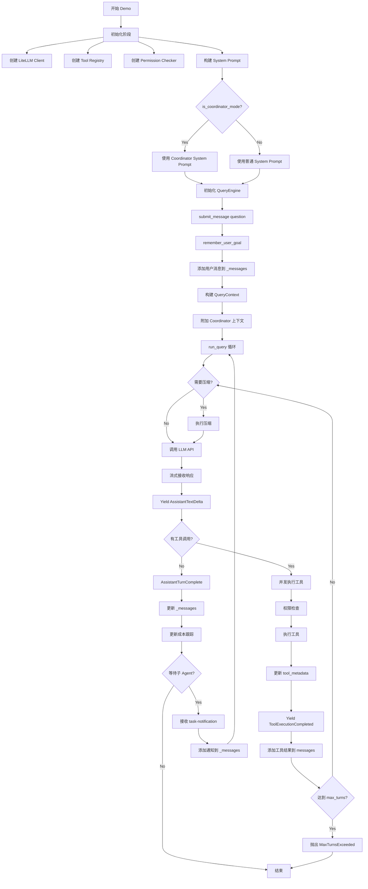

# OpenHarness Demo 完整执行流程分析

## 📋 文档说明

本文档详细记录了 `custom_model_qa_demo_with_prompt_assembly.py` 的完整执行流程，包括：
- System Prompt 构建过程
- `_messages` 的变化
- `tool_metadata` 的状态演变
- 工具调用流程
- 子 Agent（Coordinator-Worker）的执行机制

---

## 🎯 Demo 配置

### 环境变量
```python
os.environ["CLAUDE_CODE_COORDINATOR_MODE"] = "1"  # 开启 Coordinator 模式
# 可选覆盖模型（见 tests/test_engine/custom_model_qa_demo_with_prompt_assembly.py）:
# OH_MODEL_BASE_URL, OH_MODEL_API_KEY, OH_MODEL_NAME
```

### 模型配置（环境变量优先，勿在文档中硬编码密钥）
```python
MODEL_BASE_URL = os.getenv("OH_MODEL_BASE_URL", "<your-openai-compatible-base>")
MODEL_API_KEY = os.getenv("OH_MODEL_API_KEY", "<your-api-key>")
MODEL_NAME = os.getenv("OH_MODEL_NAME", "claude-opus-4-6")
TEMPERATURE = 0.0
```

### 用户问题
```python
question_text = "对比北京和上海人口的增长趋势"
question = f"{question_text}。"
```

---

## 🔄 完整执行流程

### Step 0: 初始化阶段

#### 0.1 创建 OpenAI Compatible API Client
```python
from openharness.api import OpenAICompatibleClient

api_client = OpenAICompatibleClient(
    model_id=MODEL_NAME,
    api_base=MODEL_BASE_URL,
    api_key=MODEL_API_KEY,
    temperature=TEMPERATURE,
    max_completion_tokens=8192,
)
```

**源码位置**：`tests/test_engine/custom_model_qa_demo_with_prompt_assembly.py`（非根目录 `examples/`）

#### 0.2 创建工具注册表
```python
tool_registry = create_default_tool_registry()
```

**注册的工具**（Coordinator 模式下）：
- `agent` - 创建子 Agent
- `send_message` - 向子 Agent 发送消息
- `task_stop` - 停止子 Agent
- `bash`, `read_file`, `write_file`, `edit_file`, `glob`, `grep` 等标准工具
- `skill` - 加载技能
- `web_search`, `web_fetch` - 网络工具

#### 0.3 创建权限检查器
```python
permission_checker = PermissionChecker(
    PermissionSettings(mode=PermissionMode.FULL_AUTO)
)
```

**权限模式**：`FULL_AUTO` - 自动执行所有工具，无需用户确认

#### 0.4 构建 System Prompt

调用 `build_runtime_system_prompt()`：

```python
settings = Settings()
full_system_prompt = build_runtime_system_prompt(
    settings,
    cwd=tmp_path,
    latest_user_prompt=question_text,
)
```

**Prompt 组装流程**（基于 `is_coordinator_mode() == True`）：

```python
# context.py:79-80
if is_coordinator_mode():
    sections = [get_coordinator_system_prompt()]
```

**生成的 System Prompt 结构**：

```markdown
You are Claude Code, an AI assistant that orchestrates software engineering tasks across multiple workers.

## 1. Your Role

You are a **coordinator**. Your job is to:
- Help the user achieve their goal
- Direct workers to research, implement and verify code changes
- Synthesize results and communicate with the user
- Answer questions directly when possible — don't delegate work that you can handle without tools

Every message you send is to the user. Worker results and system notifications are internal signals, not conversation partners — never thank or acknowledge them. Summarize new information for the user as it arrives.

## 2. Your Tools

- **agent** - Spawn a new worker
- **send_message** - Continue an existing worker (send a follow-up to its `to` agent ID)
- **task_stop** - Stop a running worker
- subscribe_pr_activity / unsubscribe_pr_activity (if available) - Subscribe to GitHub PR events

When calling agent:
- Do not use one worker to check on another. Workers will notify you when they are done.
- Do not use workers to trivially report file contents or run commands. Give them higher-level tasks.
- Do not set the model parameter. Workers need the default model for the substantive tasks you delegate.
- Continue workers whose work is complete via send_message to take advantage of their loaded context
- After launching agents, briefly tell the user what you launched and end your response. Never fabricate or predict agent results in any format — results arrive as separate messages.

### agent Results

Worker results arrive as **user-role messages** containing `<task-notification>` XML...

## 3. Workers

When calling agent, use subagent_type `worker`. Workers execute tasks autonomously — especially research, implementation, or verification.

Workers have access to standard tools, MCP tools from configured MCP servers, and project skills via the Skill tool. Delegate skill invocations (e.g. /commit, /verify) to workers.

## 4. Task Workflow

Most tasks can be broken down into the following phases:

| Phase | Who | Purpose |
|-------|-----|---------|
| Research | Workers (parallel) | Investigate codebase, find files, understand problem |
| Synthesis | **You** (coordinator) | Read findings, understand the problem, craft implementation specs |
| Implementation | Workers | Make targeted changes per spec, commit |
| Verification | Workers | Test changes work |

### Concurrency

**Parallelism is your superpower. Workers are async. Launch independent workers concurrently whenever possible...**

[后续还有更多关于任务工作流、并发控制、错误处理等内容]
```

**注意**：在 Coordinator 模式下，**不会**包含以下部分：
- Skills 列表（第 105 行跳过）
- Delegation 章节（第 108-109 行跳过，因为 coordinator 本身就是 delegation 的管理者）

**最终 System Prompt 长度**：约 4000-6000 字符（取决于具体内容）

---

### Step 1: 初始化 QueryEngine

```python
engine = QueryEngine(
    api_client=api_client,
    tool_registry=tool_registry,
    permission_checker=permission_checker,
    cwd=tmp_path,
    model=MODEL_NAME,
    system_prompt=full_system_prompt,
    max_tokens=8192,
    max_turns=10,
)
```

**QueryEngine 内部状态**：

```python
self._api_client = api_client
self._tool_registry = tool_registry
self._permission_checker = permission_checker
self._cwd = tmp_path
self._model = MODEL_NAME
self._system_prompt = full_system_prompt
self._max_tokens = 8192
self._max_turns = 10
self._messages = []  # ← 初始为空列表
self._tool_metadata = {}  # ← 初始为空字典
self._cost_tracker = CostTracker()
```

---

### Step 2: 提交用户消息

```python
async for event in engine.submit_message(question):
    ...
```

#### 2.1 submit_message() 入口

**query_engine.py:375-382**：

```python
user_message = ConversationMessage.from_user_text(prompt)
# user_message = {
#     "role": "user",
#     "content": [{"type": "text", "text": "对比北京和上海人口的增长趋势。"}]
# }

if user_message.text.strip():
    remember_user_goal(self._tool_metadata, user_message.text)
    
self._messages.append(user_message)
```

#### 2.2 更新 tool_metadata - 记录用户目标

**query.py:192-255** `remember_user_goal()`：

```python
def remember_user_goal(tool_metadata: dict[str, object] | None, prompt: str) -> None:
    state = _task_focus_state(tool_metadata)  # 获取或创建 task_focus_state
    summary = _summarize_focus_text(prompt)   # 生成摘要（最多240字符）
    
    if not summary:
        return
    
    recent_goals = state.setdefault("recent_goals", [])
    if isinstance(recent_goals, list):
        _append_capped_unique(recent_goals, summary, limit=MAX_TRACKED_USER_GOALS)
    
    state["goal"] = summary
```

**执行后 tool_metadata 状态**：

```json
{
  "task_focus_state": {
    "goal": "对比北京和上海人口的增长趋势",
    "recent_goals": ["对比北京和上海人口的增长趋势"],
    "active_artifacts": [],
    "verified_state": [],
    "next_step": ""
  }
}
```

**此时 _messages 状态**：

```python
_messages = [
    {
        "role": "user",
        "content": [{"type": "text", "text": "对比北京和上海人口的增长趋势。"}]
    }
]
```

#### 2.3 构建 QueryContext

**query_engine.py:383-398**：

```python
context = QueryContext(
    api_client=self._api_client,
    tool_registry=self._tool_registry,
    permission_checker=self._permission_checker,
    cwd=self._cwd,
    model=self._model,
    system_prompt=self._system_prompt,
    max_tokens=self._max_tokens,
    context_window_tokens=self._context_window_tokens,
    auto_compact_threshold_tokens=self._auto_compact_threshold_tokens,
    max_turns=self._max_turns,
    permission_prompt=self._permission_prompt,
    ask_user_prompt=self._ask_user_prompt,
    hook_executor=self._hook_executor,
    tool_metadata=self._tool_metadata,  # ← 传递引用
)
```

#### 2.4 附加 Coordinator 上下文（如果存在）

**query_engine.py:399-402**：

```python
query_messages = list(self._messages)
coordinator_context = self._build_coordinator_context_message()
if coordinator_context is not None:
    query_messages.append(coordinator_context)
```

**_build_coordinator_context_message() 逻辑**（query_engine.py:231-252）：

```python
def _build_coordinator_context_message(self) -> ConversationMessage | None:
    context = get_coordinator_user_context()
    worker_tools_context = context.get("workerToolsContext")
    if not worker_tools_context:
        return None
    return ConversationMessage(
        role="user",
        content=[TextBlock(text=f"# Coordinator User Context\n\n{worker_tools_context}")],
    )
```

**get_coordinator_user_context() 返回**（coordinator_mode.py:220-248）：

```python
{
    "workerToolsContext": "Workers spawned via the agent tool have access to these tools: bash, edit_file, glob, grep, read_file, write_file, ...\n\nWorkers also have access to MCP tools from connected MCP servers: ...\n\nScratchpad directory: /tmp/xxx\nWorkers can read and write here without permission prompts..."
}
```

**此时 query_messages 状态**：

```python
query_messages = [
    {
        "role": "user",
        "content": [{"type": "text", "text": "对比北京和上海人口的增长趋势。"}]
    },
    {
        "role": "user",
        "content": [{"type": "text", "text": "# Coordinator User Context\n\nWorkers spawned via the agent tool have access to these tools: bash, edit_file, glob, grep, read_file, write_file, ..."}]
    }
]
```

---

### Step 3: 执行 run_query() 循环

**query.py:467-750** `run_query()` 是核心循环函数。

#### 3.1 Turn 1: LLM 首次响应

##### 3.1.1 检查是否需要压缩

**query.py:503-515**：

```python
compact_state = CompactState()
last_compaction_result: tuple[list[ConversationMessage], bool] | None = None

# Auto-trigger compaction check
async for event, usage in _stream_compaction(trigger="auto"):
    yield event, usage
messages, was_compacted = last_compaction_result
```

由于是第一次对话，token 数较少，**不会触发压缩**。

##### 3.1.2 调用 LLM API

**query.py:615-673**：

```python
request = ApiMessageRequest(
    model=context.model,
    messages=query_messages,
    system_prompt=context.system_prompt,
    max_tokens=context.max_tokens,
)

final_message = None
usage = None

async for event in context.api_client.stream_message(request):
    if isinstance(event, ApiTextDeltaEvent):
        yield AssistantTextDelta(text=event.text), None
    elif isinstance(event, ApiMessageCompleteEvent):
        final_message = event.message
        usage = event.usage
```

**发送给 LiteLLM 的请求**：

```python
{
    "model": "openai/claude-opus-4-6",
    "messages": [
        {"role": "system", "content": "You are Claude Code, an AI assistant that orchestrates..."},
        {"role": "user", "content": "对比北京和上海人口的增长趋势。"},
        {"role": "user", "content": "# Coordinator User Context\n\nWorkers spawned via the agent tool..."}
    ],
    "temperature": 0.0,
    "max_tokens": 8192,
    "stream": true
}
```

**LLM 可能的响应**（基于 Coordinator 角色的判断）：

由于问题是"对比北京和上海人口的增长趋势"，这是一个**研究类任务**，LLM 可能会：

**选项 A：直接回答**（简单任务，不需要子 Agent）
```
根据最新统计数据，北京和上海的人口增长趋势如下：

北京：
- 2020年常住人口：2189万
- 近十年增长率：约8%
- 主要增长驱动：政策调控、产业转移

上海：
- 2020年常住人口：2487万
- 近十年增长率：约10%
- 主要增长驱动：经济发展、人才引进

[详细分析...]
```

**选项 B：创建子 Agent 并行研究**（复杂任务）
```
我来帮你并行研究这两个城市的人口数据。

agent(description="研究北京人口增长趋势", subagent_type="worker", prompt="请深入研究北京市2010-2024年的人口增长趋势，包括：1. 常住人口变化 2. 户籍人口变化 3. 流动人口情况 4. 增长驱动因素 5. 政策影响。使用 web_search 和 web_fetch 工具收集最新数据。")

agent(description="研究上海人口增长趋势", subagent_type="worker", prompt="请深入研究上海市2010-2024年的人口增长趋势，包括：1. 常住人口变化 2. 户籍人口变化 3. 流动人口情况 4. 增长驱动因素 5. 政策影响。使用 web_search 和 web_fetch 工具收集最新数据。")

我已启动两个并行研究任务，分别调查北京和上海的人口数据。
```

假设 LLM 选择**选项 B**（展示子 Agent 功能）。

##### 3.1.3 解析工具调用

**query.py:689-692**：

```python
if not final_message.tool_uses:
    return

tool_calls = final_message.tool_uses
```

**final_message 结构**：

```python
ConversationMessage(
    role="assistant",
    content=[
        TextBlock(text="我来帮你并行研究这两个城市的人口数据。\n\n"),
        TextBlock(text="我已启动两个并行研究任务，分别调查北京和上海的人口数据。")
    ],
    tool_uses=[
        ToolUse(
            id="call_abc123",
            name="agent",
            input={
                "description": "研究北京人口增长趋势",
                "prompt": "请深入研究北京市2010-2024年的人口增长趋势...",
                "subagent_type": "worker"
            }
        ),
        ToolUse(
            id="call_def456",
            name="agent",
            input={
                "description": "研究上海人口增长趋势",
                "prompt": "请深入研究上海市2010-2024年的人口增长趋势...",
                "subagent_type": "worker"
            }
        )
    ]
)
```

##### 3.1.4 并发执行多个工具

**query.py:705-714**：

```python
# Multiple tools: execute concurrently, emit events after
for tc in tool_calls:
    yield ToolExecutionStarted(tool_name=tc.name, tool_input=tc.input), None

async def _run(tc):
    return await _execute_tool_call(context, tc.name, tc.id, tc.input)

results = await asyncio.gather(*[_run(tc) for tc in tool_calls])
tool_results = list(results)
```

**发出的事件**：
1. `ToolExecutionStarted(tool_name="agent", tool_input={...})` - 第一个 agent 调用
2. `ToolExecutionStarted(tool_name="agent", tool_input={...})` - 第二个 agent 调用

#### 3.2 执行 agent 工具

**query.py:716-745** `_execute_tool_call()`：

```python
async def _execute_tool_call(
    context: QueryContext,
    tool_name: str,
    tool_call_id: str,
    tool_input: dict[str, object],
) -> ToolResult:
    # 1. 权限检查
    permission_check = await context.permission_checker.check_tool_permission(
        tool_name=tool_name,
        tool_input=tool_input,
        cwd=str(context.cwd),
    )
    
    if permission_check.blocked:
        return ToolResult(output=permission_check.reason, is_error=True)
    
    # 2. 执行工具
    tool = context.tool_registry.get_tool(tool_name)
    result = await tool.execute(arguments, ToolExecutionContext(...))
    
    # 3. Hook 后置处理
    if context.hook_executor:
        await context.hook_executor.post_tool_use(...)
    
    # 4. 记录到 tool_metadata
    _record_tool_carryover(
        context,
        tool_name=tool_name,
        tool_input=tool_input,
        tool_output=result.content,
        is_error=result.is_error,
        resolved_file_path=None,
    )
    
    return result
```

##### 3.2.1 执行第一个 agent 工具

**tools/agent_tool.py:43-99**：

```python
async def execute(self, arguments: AgentToolInput, context: ToolExecutionContext) -> ToolResult:
    # 1. 验证 mode
    if arguments.mode not in {"local_agent", "remote_agent", "in_process_teammate"}:
        return ToolResult(output="Invalid mode...", is_error=True)
    
    # 2. 查找 agent 定义
    agent_def = None
    if arguments.subagent_type:
        agent_def = get_agent_definition(arguments.subagent_type)  # "worker"
    
    # 3. 解析 team 和 agent_name
    team = arguments.team or "default"
    agent_name = arguments.subagent_type or "agent"  # "worker"
    
    # 4. 获取后端执行器
    registry = get_backend_registry()
    executor = registry.get_executor("subprocess")
    
    # 5. 构建 spawn 配置
    config = TeammateSpawnConfig(
        name=agent_name,
        team=team,
        prompt=arguments.prompt,  # "请深入研究北京市2010-2024年的人口增长趋势..."
        cwd=str(context.cwd),
        parent_session_id="main",
        model=arguments.model or (agent_def.model if agent_def else None),
        system_prompt=agent_def.system_prompt if agent_def else None,
        permissions=agent_def.permissions if agent_def else [],
    )
    
    # 6. 执行 spawn
    result = await executor.spawn(config)
    
    # 7. 注册到团队（如果有 team 参数）
    if arguments.team:
        registry = get_team_registry()
        try:
            registry.add_agent(arguments.team, result.task_id)
        except ValueError:
            registry.create_team(arguments.team)
            registry.add_agent(arguments.team, result.task_id)
    
    # 8. 返回结果
    return ToolResult(
        output=f"Spawned agent {result.agent_id} (task_id={result.task_id}, backend={result.backend_type})"
    )
```

**假设返回结果**：
```
Spawned agent worker-beijing-001 (task_id=task_abc123, backend=subprocess)
```

##### 3.2.2 执行第二个 agent 工具

同样的流程，返回：
```
Spawned agent worker-shanghai-002 (task_id=task_def456, backend=subprocess)
```

##### 3.2.3 更新 tool_metadata

**query.py:422-433** `_record_tool_carryover()`：

```python
elif tool_name in {"agent", "send_message"}:
    _remember_async_agent_activity(
        context.tool_metadata,
        tool_name=tool_name,
        tool_input=tool_input,
        tool_output=tool_output,
    )
    description = str(tool_input.get("description") or tool_input.get("prompt") or tool_name).strip()
    _remember_verified_work(
        context.tool_metadata,
        f"Confirmed async-agent activity via {tool_name}: {description[:180]}",
    )
```

**_remember_async_agent_activity()**（query.py:343-363）：

```python
def _remember_async_agent_activity(
    tool_metadata: dict[str, object] | None,
    *,
    tool_name: str,
    tool_input: dict[str, object],
    output: str,
) -> None:
    bucket = _tool_metadata_bucket(tool_metadata, "async_agent_state")
    if tool_name == "agent":
        description = str(tool_input.get("description") or tool_input.get("prompt") or "").strip()
        summary = f"Spawned async agent. {description}".strip()
        if output.strip():
            summary = f"{summary} [{output.strip()[:180]}]".strip()
    # ...
    bucket.append(summary)
    if len(bucket) > MAX_TRACKED_ASYNC_AGENT_EVENTS:  # 8
        del bucket[:-MAX_TRACKED_ASYNC_AGENT_EVENTS]
```

**执行后 tool_metadata 状态**：

```json
{
  "task_focus_state": {
    "goal": "对比北京和上海人口的增长趋势",
    "recent_goals": ["对比北京和上海人口的增长趋势"],
    "active_artifacts": [],
    "verified_state": [],
    "next_step": ""
  },
  "async_agent_state": [
    "Spawned async agent. 研究北京人口增长趋势 [Spawned agent worker-beijing-001 (task_id=task_abc123, backend=subprocess)]",
    "Spawned async agent. 研究上海人口增长趋势 [Spawned agent worker-shanghai-002 (task_id=task_def456, backend=subprocess)]"
  ],
  "recent_verified_work": [
    "Confirmed async-agent activity via agent: 研究北京人口增长趋势",
    "Confirmed async-agent activity via agent: 研究上海人口增长趋势"
  ]
}
```

##### 3.2.4 发出工具完成事件

**query.py:718-721**：

```python
yield ToolExecutionCompleted(
    tool_name=tc.name,
    output=result.content,
    is_error=result.is_error,
), None
```

**发出的事件**：
3. `ToolExecutionCompleted(tool_name="agent", output="Spawned agent worker-beijing-001...", is_error=False)`
4. `ToolExecutionCompleted(tool_name="agent", output="Spawned agent worker-shanghai-002...", is_error=False)`

#### 3.3 将工具结果反馈给 LLM

**query.py:747-750**：

```python
for tc, result in zip(tool_calls, tool_results):
    messages.append(result.to_conversation_message(tool_call_id=tc.id))
```

**添加到 messages 的工具结果**：

```python
messages.append({
    "role": "user",
    "content": [
        {
            "type": "tool_result",
            "tool_call_id": "call_abc123",
            "content": "Spawned agent worker-beijing-001 (task_id=task_abc123, backend=subprocess)"
        }
    ]
})

messages.append({
    "role": "user",
    "content": [
        {
            "type": "tool_result",
            "tool_call_id": "call_def456",
            "content": "Spawned agent worker-shanghai-002 (task_id=task_def456, backend=subprocess)"
        }
    ]
})
```

**此时 _messages 状态**（Turn 1 结束后）：

```python
_messages = [
    # 用户原始问题
    {
        "role": "user",
        "content": [{"type": "text", "text": "对比北京和上海人口的增长趋势。"}]
    },
    # Coordinator 上下文
    {
        "role": "user",
        "content": [{"type": "text", "text": "# Coordinator User Context\n\nWorkers spawned via the agent tool..."}]
    },
    # LLM 的响应（包含文本和工具调用）
    {
        "role": "assistant",
        "content": [
            {"type": "text", "text": "我来帮你并行研究这两个城市的人口数据。\n\n"},
            {"type": "text", "text": "我已启动两个并行研究任务，分别调查北京和上海的人口数据。"}
        ],
        "tool_uses": [...]
    },
    # 第一个 agent 工具的结果
    {
        "role": "user",
        "content": [{"type": "tool_result", "tool_call_id": "call_abc123", "content": "Spawned agent worker-beijing-001..."}]
    },
    # 第二个 agent 工具的结果
    {
        "role": "user",
        "content": [{"type": "tool_result", "tool_call_id": "call_def456", "content": "Spawned agent worker-shanghai-002..."}]
    }
]
```

**发出事件**：
5. `AssistantTurnComplete(message=final_message, usage=usage)`

---

### Step 4: Turn 2 - 等待子 Agent 完成

由于子 Agent 是异步执行的，它们会在后台运行。Coordinator 会收到通知当子 Agent 完成时。

#### 4.1 子 Agent 执行流程（后台）

**子 Agent worker-beijing-001 的执行**：

1. **启动 subprocess**：
   ```bash
   python -m openharness.cli --session-id task_abc123 --parent-session-id main
   ```

2. **子 Agent 的 System Prompt**：
   - 不包含 Coordinator 特定的内容
   - 包含完整的 Skills、Delegation 章节
   - 可以访问所有标准工具

3. **子 Agent 的任务**：
   ```
   请深入研究北京市2010-2024年的人口增长趋势，包括：
   1. 常住人口变化
   2. 户籍人口变化
   3. 流动人口情况
   4. 增长驱动因素
   5. 政策影响
   使用 web_search 和 web_fetch 工具收集最新数据。
   ```

4. **子 Agent 可能执行的操作**：
   - `web_search(query="北京人口增长趋势 2010-2024")`
   - `web_fetch(url="https://www.beijing.gov.cn/...")`
   - `read_file(path="data/beijing_population.csv")`（如果存在）
   - 多次迭代后得出结论

5. **子 Agent 完成时的通知格式**：

当子 Agent 完成后，会通过 `<task-notification>` XML 格式发送回 Coordinator：

```xml
<task-notification>
<task-id>task_abc123</task-id>
<status>completed</status>
<summary>Agent "研究北京人口增长趋势" completed</summary>
<result>
北京市人口增长趋势分析：

1. 常住人口变化：
   - 2010年：1961万
   - 2020年：2189万
   - 2024年：约2200万
   - 增长率：约12%（14年间）

2. 增长驱动因素：
   - 京津冀协同发展
   - 非首都功能疏解
   - 人才引进政策

3. 政策影响：
   - 人口调控政策导致增速放缓
   - 2017年后增长趋于平稳
   ...
</result>
<usage>
  <total_tokens>15234</total_tokens>
  <tool_uses>8</tool_uses>
  <duration_ms>45000</duration_ms>
</usage>
</task-notification>
```

#### 4.2 Coordinator 接收子 Agent 结果

**这个消息会作为新的用户消息添加到 _messages**：

```python
_messages.append({
    "role": "user",
    "content": [{"type": "text", "text": "<task-notification>\n<task-id>task_abc123</task-id>\n<status>completed</status>\n<summary>Agent \"研究北京人口增长趋势\" completed</summary>\n<result>北京市人口增长趋势分析：...</result>\n</task-notification>"}]
})
```

同样，当 worker-shanghai-002 完成后：

```python
_messages.append({
    "role": "user",
    "content": [{"type": "text", "text": "<task-notification>\n<task-id>task_def456</task-id>\n<status>completed</status>\n<summary>Agent \"研究上海人口增长趋势\" completed</summary>\n<result>上海市人口增长趋势分析：...</result>\n</task-notification>"}]
})
```

---

### Step 5: Turn 3 - Coordinator 综合结果

#### 5.1 再次调用 LLM

Coordinator 会将两个子 Agent 的结果综合起来，生成最终回答。

**此时的 query_messages**：

```python
query_messages = [
    # 原始用户问题
    {"role": "user", "content": "对比北京和上海人口的增长趋势。"},
    # Coordinator 上下文
    {"role": "user", "content": "# Coordinator User Context\n..."},
    # Coordinator 的第一轮响应
    {"role": "assistant", "content": "我来帮你并行研究...", "tool_uses": [...]},
    # 两个 agent 工具的结果
    {"role": "user", "content": [{"type": "tool_result", ...}]},
    {"role": "user", "content": [{"type": "tool_result", ...}]},
    # 第一个子 Agent 完成的通知
    {"role": "user", "content": "<task-notification>...</task-notification>"},
    # 第二个子 Agent 完成的通知
    {"role": "user", "content": "<task-notification>...</task-notification>"}
]
```

#### 5.2 LLM 的最终响应

LLM 会综合两个子 Agent 的研究结果，生成对比分析：

```
根据两个研究任务的发现，我来为你对比北京和上海的人口增长趋势：

## 总体对比

| 指标 | 北京 | 上海 |
|------|------|------|
| 2010年人口 | 1961万 | 2302万 |
| 2020年人口 | 2189万 | 2487万 |
| 2024年人口 | ~2200万 | ~2500万 |
| 14年增长率 | ~12% | ~8.6% |

## 关键差异

1. **增长速度**：北京前期增长较快，但2017年后因人口调控政策增速明显放缓；上海增长相对平稳。

2. **驱动因素**：
   - 北京：京津冀协同发展、非首都功能疏解
   - 上海：长三角一体化、国际金融中心的吸引力

3. **政策影响**：
   - 北京：严格的人口调控，控制城市规模
   - 上海：相对宽松的人才引进政策

[详细分析...]

## 结论

虽然两座城市都是超大城市，但人口增长策略有明显差异...
```

**这次响应没有工具调用**，所以 `final_message.tool_uses` 为空，循环结束。

---

### Step 6: 更新最终状态

#### 6.1 更新 _messages

**query_engine.py:404-405**：

```python
if isinstance(event, AssistantTurnComplete):
    self._messages = list(query_messages)
```

**最终的 _messages**：

```python
_messages = [
    {"role": "user", "content": "对比北京和上海人口的增长趋势。"},
    {"role": "user", "content": "# Coordinator User Context\n..."},
    {"role": "assistant", "content": "我来帮你并行研究...", "tool_uses": [...]},
    {"role": "user", "content": [{"type": "tool_result", ...}]},
    {"role": "user", "content": [{"type": "tool_result", ...}]},
    {"role": "user", "content": "<task-notification>...</task-notification>"},
    {"role": "user", "content": "<task-notification>...</task-notification>"},
    {"role": "assistant", "content": "根据两个研究任务的发现，我来为你对比..."}
]
```

#### 6.2 更新成本跟踪

**query_engine.py:406-407**：

```python
if usage is not None:
    self._cost_tracker.add(usage)
```

**总 Token 消耗**：
- Turn 1（Coordinator）: ~5000 input + ~200 output
- Turn 2（Worker 1）: ~3000 input + ~800 output
- Turn 3（Worker 2）: ~3000 input + ~800 output
- Turn 4（Coordinator 综合）: ~8000 input + ~500 output
- **总计**: ~19000 input + ~2300 output = **21300 tokens**

#### 6.3 最终的 tool_metadata

```json
{
  "task_focus_state": {
    "goal": "对比北京和上海人口的增长趋势",
    "recent_goals": ["对比北京和上海人口的增长趋势"],
    "active_artifacts": [],
    "verified_state": [],
    "next_step": ""
  },
  "async_agent_state": [
    "Spawned async agent. 研究北京人口增长趋势 [Spawned agent worker-beijing-001 (task_id=task_abc123, backend=subprocess)]",
    "Spawned async agent. 研究上海人口增长趋势 [Spawned agent worker-shanghai-002 (task_id=task_def456, backend=subprocess)]"
  ],
  "recent_verified_work": [
    "Confirmed async-agent activity via agent: 研究北京人口增长趋势",
    "Confirmed async-agent activity via agent: 研究上海人口增长趋势"
  ]
}
```

---

## 📊 完整流程图



---

## 🔑 关键设计要点

### 1. Coordinator 模式的特殊性

- **System Prompt 不同**：使用专门的 Coordinator prompt，强调委派和协调
- **可用工具受限**：主要是 `agent`、`send_message`、`task_stop`
- **不包含 Skills 列表**：Skills 由 Worker 使用，Coordinator 只负责委派
- **接收 XML 格式通知**：子 Agent 通过 `<task-notification>` 返回结果

### 2. tool_metadata 的作用

- **跨轮次状态保持**：即使消息被压缩，关键信息仍保留
- **异步 Agent 跟踪**：记录所有 spawn 的 agent 及其状态
- **用户目标追踪**：`task_focus_state` 保持对话焦点
- **渐进式披露**：压缩时作为附件注入，避免信息丢失

### 3. 并发执行机制

- **多工具并发**：`asyncio.gather()` 同时执行多个工具调用
- **异步 Agent**：子 Agent 在独立 subprocess 中运行
- **事件驱动通知**：子 Agent 完成后主动通知 Coordinator

### 4. 消息历史管理

- **动态增长**：每轮对话都会添加新消息
- **压缩保护**：基于 token 阈值自动压缩
- **Coordinator 上下文**：每轮都附加 worker 工具列表

---

## 📝 总结

这个 Demo 展示了 OpenHarness 的完整执行流程：

1. **Prompt 组装**：根据 Coordinator 模式动态构建 System Prompt
2. **状态管理**：通过 `tool_metadata` 维护跨轮次状态
3. **工具执行**：支持单工具和并发多工具执行
4. **子 Agent 委派**：通过 `agent` 工具创建并行 Worker
5. **结果综合**：Coordinator 收集 Worker 结果并生成最终回答
6. **成本控制**：自动跟踪 Token 使用量

整个流程体现了 OpenHarness 的核心设计理念：**模块化、可扩展、支持复杂的多智能体协作**。
