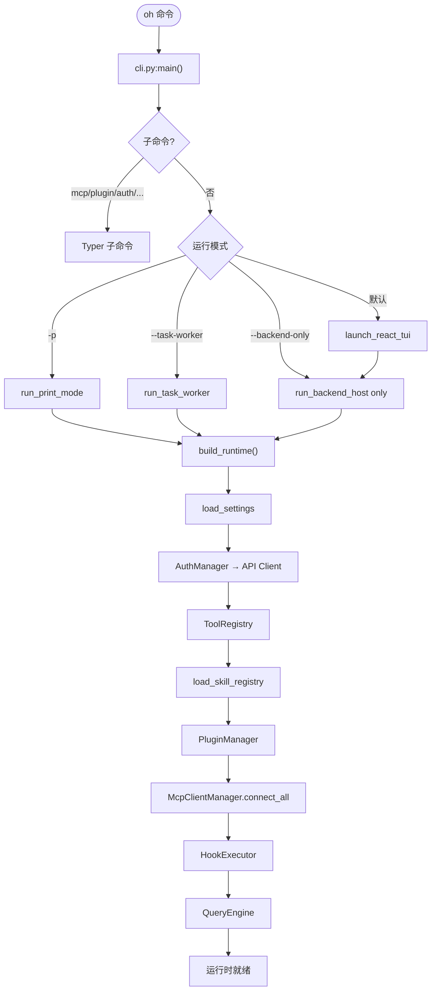
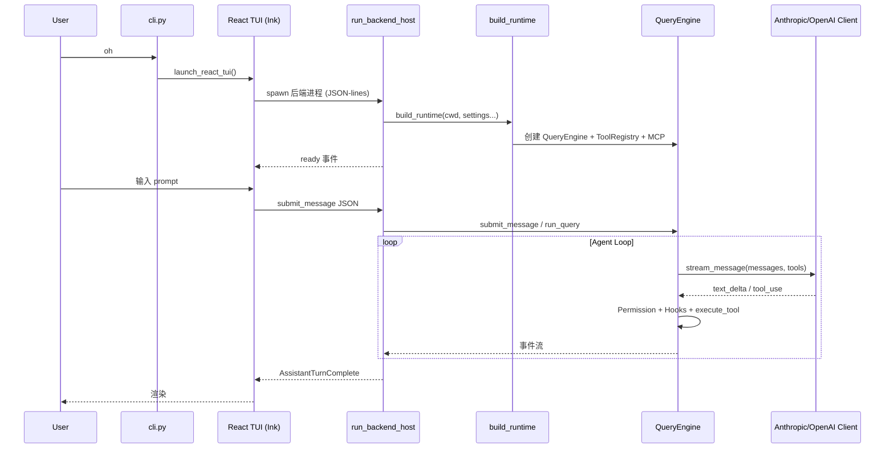
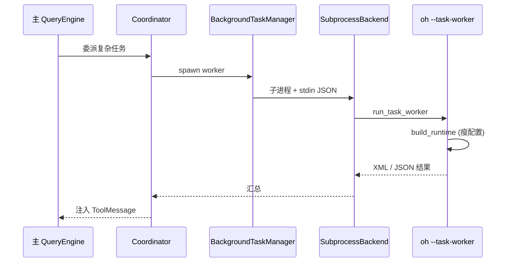

# OpenHarness 源码运行与启动架构

> **版本**: 1.0（完整版，非操作摘要）  
> **包版本**: `openharness-ai` 0.1.9（`pyproject.toml`）  
> **入口**: `openharness` / `oh` / `openh` / `ohmo`  
> **深度参考**: [ARCHITECTURE.md §5.1](ARCHITECTURE.md#51-完整执行流程图)

---

## 1. 运行模式一览

| 模式 | 命令 | 进程模型 | 适用场景 |
|------|------|----------|----------|
| **TUI（默认）** | `oh` | React/Ink 前端 + `run_backend_host` 子进程 | 日常交互开发 |
| **Print** | `oh -p "prompt"` | 单进程 `run_print_mode` | CI / 脚本 |
| **Task Worker** | `oh --task-worker` | stdin JSON 驱动子进程 | Coordinator 子 Agent |
| **Backend only** | `oh --backend-only` | 仅 JSON-lines 协议 | 前端/TUI 连接调试 |
| **Ohmo Gateway** | `ohmo` | 长期 Gateway 服务 | IM 多渠道 |

---

## 2. 启动架构总图



---

## 3. TUI + BackendHost 时序



**关键源码**：

| 符号 | 文件 |
|------|------|
| `main()` | `src/openharness/cli.py` |
| `launch_react_tui` | `src/openharness/ui/` |
| `run_backend_host` | `src/openharness/ui/app.py` |
| `build_runtime` | `src/openharness/ui/runtime.py` |
| `QueryEngine` | `src/openharness/engine/query_engine.py` |
| `run_query` | `src/openharness/engine/query.py` |

---

## 4. Coordinator / 子 Agent 路径



环境变量：

```bash
export CLAUDE_CODE_COORDINATOR_MODE=1
export OPENHARNESS_CONFIG_DIR=~/.openharness
```

- **默认**：`SubprocessBackend` + stdin JSON（**非** mailbox 文件轮询为主路径）
- **`in_process_teammate`**：才使用 `swarm/mailbox.py` 文件邮箱

详见 [ARCHITECTURE_TOOLS_SWARM.md](ARCHITECTURE_TOOLS_SWARM.md)。

---

## 5. 安装与常用命令

```bash
cd OpenHarness
uv pip install -e ".[dev]"

oh --help
oh -p "Explain this repo"
oh --backend-only   # 仅协议后端
oh mcp list
oh plugin list
oh auth status
```

### 测试

```bash
pytest tests/ -x -q
pytest tests/test_engine/ -q
```

Demo：`tests/test_engine/custom_model_qa_demo_with_prompt_assembly.py`

---

## 6. 相关文档

| 文档 | 内容 |
|------|------|
| [ARCHITECTURE.md §5](ARCHITECTURE.md#51-完整执行流程图) | Agent Loop 完整 sequence |
| [OPENHARNESS_SKILLS_RUNTIME.md](OPENHARNESS_SKILLS_RUNTIME.md) | Skills 加载与 prompt 注入 |
| [DEMO_EXECUTION_FLOW.md](DEMO_EXECUTION_FLOW.md) | Prompt 组装 Demo |
| [OHMO_DESIGN.md](OHMO_DESIGN.md) | Gateway / IM 渠道 |

---

**最后更新**: 2026-06-01
