# ohmo 设计说明

> **版本**: v1.7 (2026-06-10)  
> **状态**: ✅ 已验证与源码一致
> **更新说明**:
> - ✅ **§5.0**：启动 + 单条消息完整依赖链（含 OhmoGatewayService 开机与消息阶段分工）
> - ✅ **§1.4**：ohmo 全路径启动时序图
> - ✅ 确认 `ohmo/cli.py` CLI结构与文档一致
> - ✅ 确认 `OhmoSessionBackend` 实现完整
> - ✅ 确认 Gateway 命令齐全 (run/start/stop/restart/status)
> - ✅ 补充默认命令的三种运行模式细节
> - ✅ **新增 Channel 架构详解**(Telegram/Slack/Discord/飞书等9种渠道)
> - ✅ **新增 Gateway 核心组件设计**(Bridge/Runtime/Service三层架构)
> - ✅ **新增消息流转完整流程**(Inbound/Outbound双向通信)
> - ✅ **新增 ohmo Prompt 注入机制详解**(Soul/Identity/User/Memory组装流程)
> - ✅ **新增 Prompt 拼接流程对比**(Coordinator vs 普通模式分支逻辑)

---

## 目录

- [1. 产品定位](#1-产品定位)
  - [1.1 与 `oh` 的关系](#11-与-oh-的关系)
  - [1.2 Channel 与 `app.py` 在哪](#12-channel-与-apppy-在哪)
  - [1.3 启动路径对照](#13-启动路径对照)
  - [1.4 启动流程时序图（完整）](#14-启动流程时序图完整)
- [2. 分层架构（概念）](#2-分层架构概念)
- [3. 工作区（`~/.ohmo`）约定](#3-工作区ohmo-约定)
- [4. Channel 架构设计](#4-channel-架构设计)
  - [4.1 支持的渠道列表](#41-支持的渠道列表)
  - [4.2 Channel 基类设计](#42-channel-基类设计)
  - [4.3 消息总线(MessageBus)](#43-消息总线messagebus)
  - [4.4 Channel Manager](#44-channel-manager)
- [5. Gateway 核心组件](#5-gateway-核心组件设计)
  - [5.0 四组件职责与依赖（速查）](#50-四组件职责与依赖速查)
  - [5.1 三层架构](#51-三层架构)
  - [5.2 OhmoGatewayService（服务层）](#52-ohmogatewayservice-服务层)
  - [5.3 OhmoGatewayBridge（桥接层）](#53-ohmogatewaybridge-桥接层)
  - [5.4 OhmoSessionRuntimePool（运行时层）](#54-ohmosessionruntimepool-运行时层)
  - [5.5 ChannelManager（渠道层）](#55-channelmanager渠道层)
- [6. 消息流转完整流程](#6-完整消息流转流程)
- [7. ohmo Prompt 注入机制](#7-ohmo-prompt-注入机制)
  - [7.1 核心问题解答](#71-核心问题解答)
  - [7.2 Prompt组装流程详解](#72-prompt组装流程详解)
  - [7.3 各组件加载逻辑](#73-各组件加载逻辑)
  - [7.4 Prompt注入时机](#74-prompt注入时机)
  - [7.5 完整的Prompt结构示例](#75-完整的prompt结构示例)
  - [7.6 关键设计要点](#76-关键设计要点)
  - [7.7 实际使用建议](#77-实际使用建议)
- [8. Prompt 拼接流程对比](#8-prompt-拼接流程对比)
  - [8.1 核心问题: Coordinator模式如何触发?](#81-核心问题-coordinator模式如何触发)
  - [8.2 Prompt组装分支逻辑](#82-prompt组装分支逻辑)
  - [8.3 两种模式的关键差异对比表](#83-两种模式的关键差异对比表)
  - [8.4 Section 1的核心差异详解](#84-section-1的核心差异详解)
  - [8.5 ohmo的特殊情况](#85-ohmo的特殊情况)
  - [8.6 ohmo Prompt组装完整调用链](#86-ohmo-prompt组装完整调用链)
  - [8.7 设计哲学总结](#87-设计哲学总结)
  - [8.8 OpenHarness CLI (`oh`) Prompt组装流程](#88-openharness-cli-oh-prompt组装流程)
  - [8.9 设计哲学对比](#89-设计哲学对比)
- [9. 与 OpenHarness 的边界](#9-与-openharness-的边界)
- [10. 本工作区快照说明](#10-本工作区快照说明)
- [11. 参考索引](#11-参考索引)

---

## 1. 产品定位

- **OpenHarness（`oh`）**：通用 Agent Harness——工具、技能、权限、会话、压缩、Swarm 等**可复用基础设施**。
- **ohmo**：在同一套引擎上包装的 **个人长期助手**——强调跨会话记忆、人格与用户画像文件、以及通过 **Gateway** 对接 **Telegram / Slack / Discord / 飞书** 等渠道，在远程聊天中驱动本机/服务器上的编码与任务执行。

README 中的表述：ohmo 面向「长会话、真干活」，并可与已有 Claude / Codex 等订阅形态配合（具体鉴权以 `oh setup` / `ohmo config` 为准）。

### 1.1 与 `oh` 的关系

`oh` 与 `ohmo` 是**同一 Python 包**（`openharness-ai`）里的**两个独立 CLI 入口**，不是「ohmo 去启动 `oh` 子进程」：

| | `oh` | `ohmo` |
|---|------|--------|
| 入口脚本 | `openharness.cli:app` | `ohmo.cli:app` |
| 定位 | 通用开发 Agent CLI | 个人长期助手 + IM Gateway |
| 引擎 | `QueryEngine`、`build_runtime`、工具链 | **同上，库内 `import`** |
| 是否 spawn 对方 | ❌ | ❌ **从不执行 `oh` 子进程** |

`pyproject.toml`：

```toml
[project.scripts]
oh = "openharness.cli:app"
ohmo = "ohmo.cli:app"
```

**ohmo 额外提供**（`oh` 没有）：

- `~/.ohmo` 工作区（soul / user / memory / `gateway.json`）
- `build_ohmo_system_prompt()` 与 `OhmoSessionBackend`（会话根与 `oh` 分离）
- Gateway：`OhmoGatewayService` + `OhmoGatewayBridge` + `OhmoSessionRuntimePool`
- 子命令：`init`、`config`、`memory`、`soul`、`user`、`gateway`

### 1.2 Channel 与 `app.py` 在哪

| 组件 | 源码位置 | 谁接线 / 谁运行 |
|------|----------|----------------|
| **Channel 库** | `src/openharness/channels/` | 核心库；**仅 `ohmo gateway` 创建 `ChannelManager`** |
| **`app.py`** | `src/openharness/ui/app.py` | **`oh`** 的 `run_repl` / `run_print_mode` |
| **`runtime.py`** | `src/openharness/ui/runtime.py` | **`oh` 与 `ohmo` 共用** `build_runtime` |
| **`backend_host.py`** | `src/openharness/ui/backend_host.py` | React TUI 后端（`oh --backend-only` 或 `ohmo --backend-only`） |
| **`ohmo/runtime.py`** | `ohmo/runtime.py` | ohmo 本地 `-p` / TUI 后端，**不走** `app.run_repl` |

结论：

- Channel **代码在 OpenHarness 核心包**，**运行时在 `ohmo gateway` 进程**；`oh` CLI **不**启动渠道。
- `app.py` 是 **`oh` 的 REPL/print 宿主**；ohmo Gateway 用 `OhmoSessionRuntimePool`，本地 ohmo 用 `ohmo/runtime.py`。

### 1.3 启动路径对照

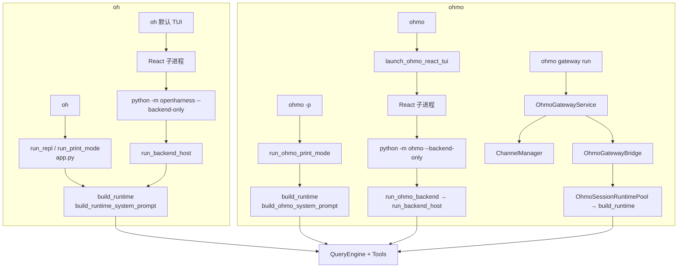
```mermaid
flowchart TB
  subgraph oh_paths["oh"]
    oh1["oh"] --> oh_repl["run_repl / run_print_mode<br/>app.py"]
    oh_react["oh 默认 TUI"] --> oh_react_child["React 子进程"]
    oh_react_child --> oh_be["python -m openharness --backend-only"]
    oh_be --> oh_host["run_backend_host"]
    oh_repl --> oh_rt["build_runtime<br/>build_runtime_system_prompt"]
    oh_host --> oh_rt
  end

  subgraph ohmo_paths["ohmo"]
    ohmo1["ohmo"] --> ohmo_tui["launch_ohmo_react_tui"]
    ohmo_tui --> ohmo_react["React 子进程"]
    ohmo_react --> ohmo_be["python -m ohmo --backend-only"]
    ohmo_be --> ohmo_host["run_ohmo_backend → run_backend_host"]
    ohmo_p["ohmo -p"] --> ohmo_print["run_ohmo_print_mode"]
    ohmo_print --> ohmo_rt["build_runtime<br/>build_ohmo_system_prompt"]
    ohmo_gw["ohmo gateway run"] --> gw_svc["OhmoGatewayService"]
    gw_svc --> ch["ChannelManager"]
    gw_svc --> br["OhmoGatewayBridge"]
    br --> pool["OhmoSessionRuntimePool → build_runtime"]
  end

  oh_rt --> engine["QueryEngine + Tools"]
  ohmo_rt --> engine
  ohmo_host --> engine
  pool --> engine
```

| 目标 | 命令 | 实际进程 / 调用链 |
|------|------|-------------------|
| 本地开发助手 TUI | `oh` | React → `openharness --backend-only` → `run_backend_host` |
| 个人助手 TUI | `ohmo` | React → **`ohmo --backend-only`**（不是 `oh`） |
| 单次任务 | `oh -p` / `ohmo -p` | 各走自己的 runtime；同进程 `build_runtime` |
| IM 远程聊 | `ohmo gateway run` / `start` | `python -m ohmo gateway run`；后台 daemon 亦 spawn **ohmo** |

Gateway 后台启动（`ohmo/gateway/service.py` → `start_gateway_process`）：

```python
subprocess.Popen([sys.executable, "-m", "ohmo", "gateway", "run", ...])
```

React 后端命令对比：

- `oh`：`react_launcher.build_backend_command()` → `python -m openharness --backend-only`
- `ohmo`：`ohmo/runtime.build_ohmo_backend_command()` → `python -m ohmo --backend-only`

**IM 消息路径**（无 `oh` 子进程）：

```text
用户(Telegram/Slack/…) → Channel → MessageBus.inbound
  → OhmoGatewayBridge → OhmoSessionRuntimePool → engine.submit_message
  → MessageBus.outbound → Channel.send
```

延伸阅读：[BACKEND_HOST_ARCHITECTURE.md](./BACKEND_HOST_ARCHITECTURE.md)（BackendHost / drain）、[DEV_SOURCE_RUN.md](./DEV_SOURCE_RUN.md)（源码跑 `oh` / `ohmo`）。

### 1.4 启动流程时序图（完整）

以下与 `ohmo/cli.py`、`ohmo/runtime.py`、`ohmo/gateway/service.py`、`openharness/ui/backend_host.py` 一致。**ohmo 全程不 spawn `oh`**。

#### 1.4.1 CLI 总入口（`ohmo` 无子命令时）

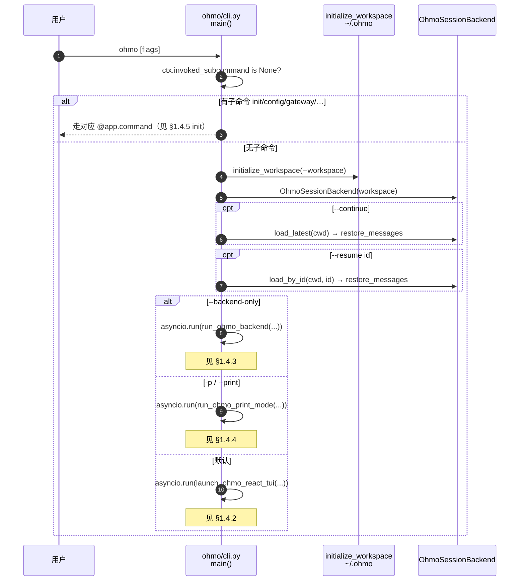
```mermaid
sequenceDiagram
    autonumber
    participant U as 用户
    participant CLI as ohmo/cli.py<br/>main()
    participant WS as initialize_workspace<br/>~/.ohmo
    participant SB as OhmoSessionBackend

    U->>CLI: ohmo [flags]
    CLI->>CLI: ctx.invoked_subcommand is None?
    alt 有子命令 init/config/gateway/…
        CLI-->>U: 走对应 @app.command（见 §1.4.5 init）
    else 无子命令
        CLI->>WS: initialize_workspace(--workspace)
        CLI->>SB: OhmoSessionBackend(workspace)
        opt --continue
            CLI->>SB: load_latest(cwd) → restore_messages
        end
        opt --resume id
            CLI->>SB: load_by_id(cwd, id) → restore_messages
        end
        alt --backend-only
            CLI->>CLI: asyncio.run(run_ohmo_backend(...))
            Note over CLI: 见 §1.4.3
        else -p / --print
            CLI->>CLI: asyncio.run(run_ohmo_print_mode(...))
            Note over CLI: 见 §1.4.4
        else 默认
            CLI->>CLI: asyncio.run(launch_ohmo_react_tui(...))
            Note over CLI: 见 §1.4.2
        end
    end
```

#### 1.4.2 默认路径：`ohmo` → React TUI（双进程）

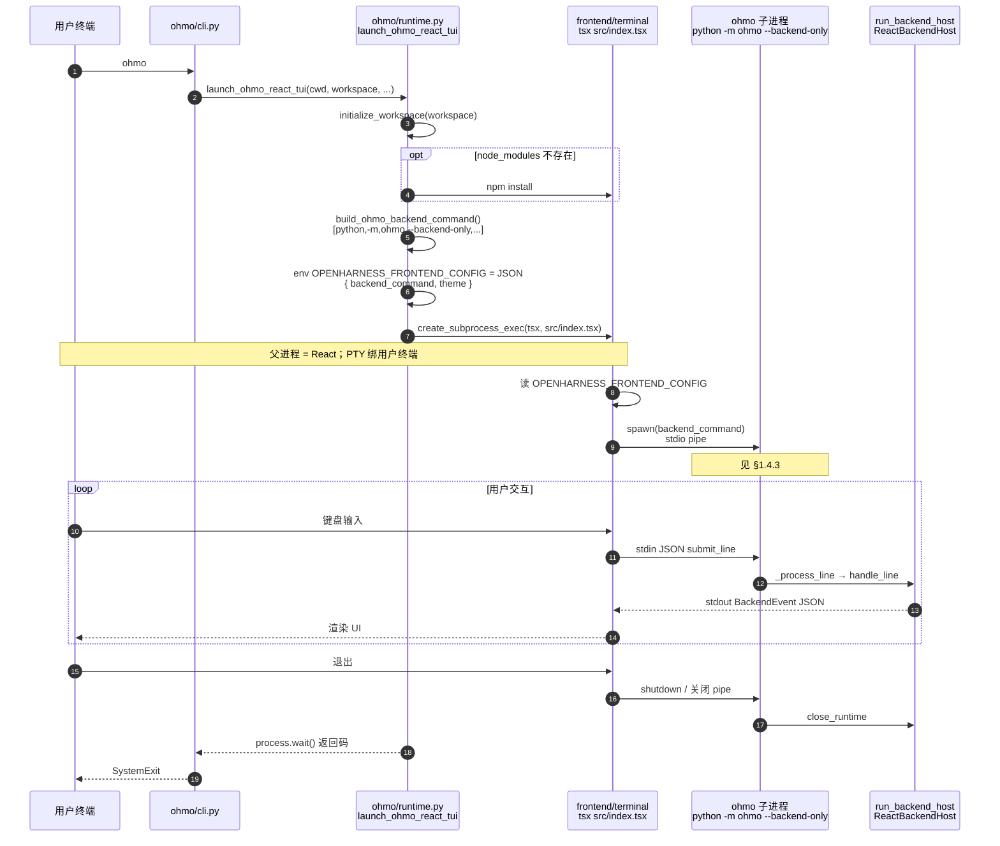
```mermaid
sequenceDiagram
    autonumber
    participant U as 用户终端
    participant CLI as ohmo/cli.py
    participant RT as ohmo/runtime.py<br/>launch_ohmo_react_tui
    participant FE as frontend/terminal<br/>tsx src/index.tsx
    participant BE as ohmo 子进程<br/>python -m ohmo --backend-only
    participant BH as run_backend_host<br/>ReactBackendHost

    U->>CLI: ohmo
    CLI->>RT: launch_ohmo_react_tui(cwd, workspace, ...)
    RT->>RT: initialize_workspace(workspace)
    opt node_modules 不存在
        RT->>FE: npm install
    end
    RT->>RT: build_ohmo_backend_command()<br/>[python,-m,ohmo,--backend-only,...]
    RT->>RT: env OPENHARNESS_FRONTEND_CONFIG = JSON<br/>{ backend_command, theme }
    RT->>FE: create_subprocess_exec(tsx, src/index.tsx)
    Note over U,FE: 父进程 = React；PTY 绑用户终端

    FE->>FE: 读 OPENHARNESS_FRONTEND_CONFIG
    FE->>BE: spawn(backend_command)<br/>stdio pipe
    Note over BE: 见 §1.4.3

    loop 用户交互
        U->>FE: 键盘输入
        FE->>BE: stdin JSON submit_line
        BE->>BH: _process_line → handle_line
        BH-->>FE: stdout BackendEvent JSON
        FE-->>U: 渲染 UI
    end

    U->>FE: 退出
    FE->>BE: shutdown / 关闭 pipe
    BE->>BH: close_runtime
    RT-->>CLI: process.wait() 返回码
    CLI-->>U: SystemExit
```

#### 1.4.3 Backend 子进程：`ohmo --backend-only`

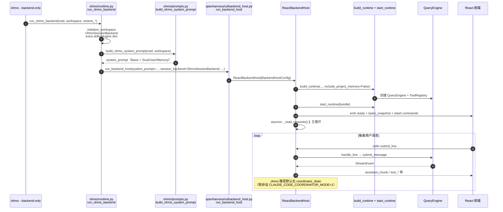
```mermaid
sequenceDiagram
    autonumber
    participant BE as ohmo --backend-only
    participant OR as ohmo/runtime.py<br/>run_ohmo_backend
    participant PR as ohmo/prompts.py<br/>build_ohmo_system_prompt
    participant RH as openharness/ui/backend_host.py<br/>run_backend_host
    participant BR as ReactBackendHost
    participant RT as build_runtime + start_runtime
    participant QE as QueryEngine
    participant R as React 前端

    BE->>OR: run_ohmo_backend(cwd, workspace, restore_*)
    OR->>OR: initialize_workspace<br/>OhmoSessionBackend<br/>extra skills/plugins dirs
    OR->>PR: build_ohmo_system_prompt(cwd, workspace)
    PR-->>OR: system_prompt（Base + Soul/User/Memory）
    OR->>RH: run_backend_host(system_prompt=..., session_backend=OhmoSessionBackend, ...)
    RH->>BR: ReactBackendHost(BackendHostConfig)
    BR->>RT: build_runtime(..., include_project_memory=False)
    RT->>QE: 创建 QueryEngine + ToolRegistry
    BR->>RT: start_runtime(bundle)
    BR->>R: emit ready + tasks_snapshot + slash commands
    BR->>BR: asyncio: _read_requests() ∥ 主循环

    loop 每条用户消息
        R->>BR: stdin submit_line
        BR->>QE: handle_line → submit_message
        QE-->>BR: StreamEvent
        BR-->>R: assistant_chunk / tool_* 等
        Note over BR: ohmo 路径默认无 coordinator_drain<br/>（除非设 CLAUDE_CODE_COORDINATOR_MODE=1）
    end
```

#### 1.4.4 单次任务：`ohmo -p "..."`

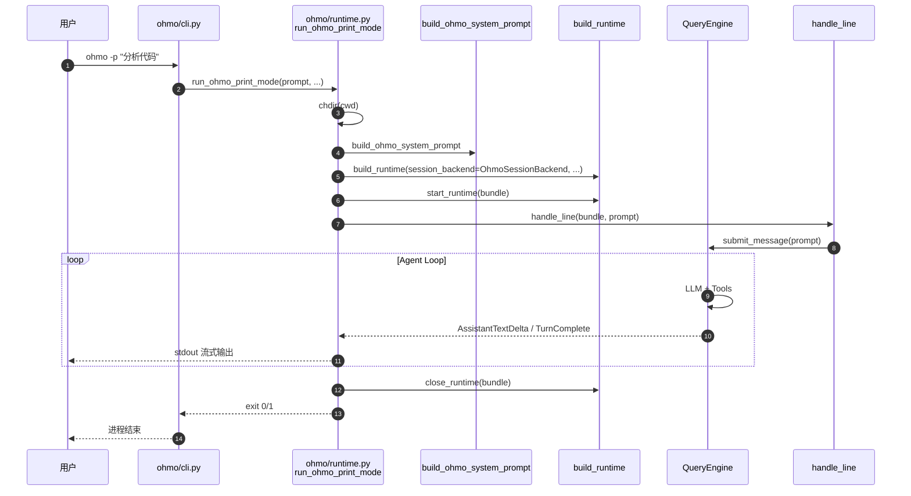
```mermaid
sequenceDiagram
    autonumber
    participant U as 用户
    participant CLI as ohmo/cli.py
    participant PM as ohmo/runtime.py<br/>run_ohmo_print_mode
    participant PR as build_ohmo_system_prompt
    participant RT as build_runtime
    participant QE as QueryEngine
    participant HL as handle_line

    U->>CLI: ohmo -p "分析代码"
    CLI->>PM: run_ohmo_print_mode(prompt, ...)
    PM->>PM: chdir(cwd)
    PM->>PR: build_ohmo_system_prompt
    PM->>RT: build_runtime(session_backend=OhmoSessionBackend, ...)
    PM->>RT: start_runtime(bundle)
    PM->>HL: handle_line(bundle, prompt)
    HL->>QE: submit_message(prompt)
    loop Agent Loop
        QE->>QE: LLM + Tools
        QE-->>PM: AssistantTextDelta / TurnComplete
        PM-->>U: stdout 流式输出
    end
    PM->>RT: close_runtime(bundle)
    PM-->>CLI: exit 0/1
    CLI-->>U: 进程结束
```

**与默认 TUI 的差异**：单进程、无 React、无 BackendHost、无 JSON-lines 协议。

#### 1.4.5 Gateway 前台：`ohmo gateway run`

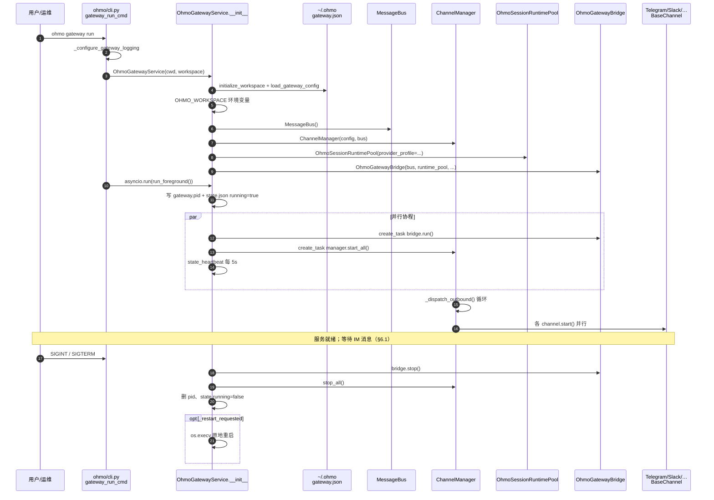
```mermaid
sequenceDiagram
    autonumber
    participant U as 用户/运维
    participant CLI as ohmo/cli.py<br/>gateway_run_cmd
    participant SVC as OhmoGatewayService.__init__
    participant WS as ~/.ohmo<br/>gateway.json
    participant BUS as MessageBus
    participant CM as ChannelManager
    participant POOL as OhmoSessionRuntimePool
    participant BR as OhmoGatewayBridge
    participant CH as Telegram/Slack/…<br/>BaseChannel

    U->>CLI: ohmo gateway run
    CLI->>CLI: _configure_gateway_logging
    CLI->>SVC: OhmoGatewayService(cwd, workspace)
    SVC->>WS: initialize_workspace + load_gateway_config
    SVC->>SVC: OHMO_WORKSPACE 环境变量
    SVC->>BUS: MessageBus()
    SVC->>CM: ChannelManager(config, bus)
    SVC->>POOL: OhmoSessionRuntimePool(provider_profile=...)
    SVC->>BR: OhmoGatewayBridge(bus, runtime_pool, ...)

    CLI->>SVC: asyncio.run(run_foreground())
    SVC->>SVC: 写 gateway.pid + state.json running=true
    par 并行协程
        SVC->>BR: create_task bridge.run()
        SVC->>CM: create_task manager.start_all()
        SVC->>SVC: state_heartbeat 每 5s
    end

  CM->>CM: _dispatch_outbound() 循环
    CM->>CH: 各 channel.start() 并行

    Note over U,CH: 服务就绪；等待 IM 消息（§6.1）

    U->>CLI: SIGINT / SIGTERM
    SVC->>BR: bridge.stop()
    SVC->>CM: stop_all()
    SVC->>SVC: 删 pid、state running=false
    opt _restart_requested
        SVC->>SVC: os.execv 原地重启
    end
```

#### 1.4.6 Gateway 后台：`ohmo gateway start`

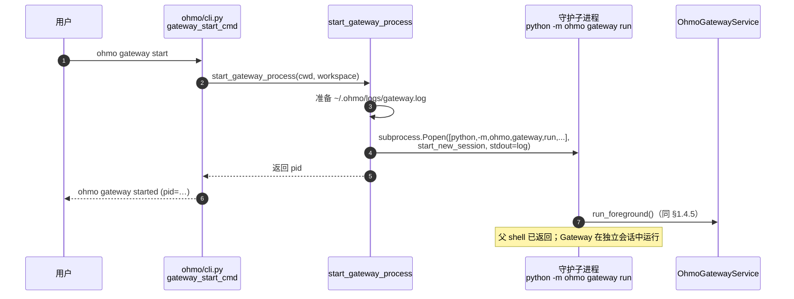
```mermaid
sequenceDiagram
    autonumber
    participant U as 用户
    participant CLI as ohmo/cli.py<br/>gateway_start_cmd
    participant SP as start_gateway_process
    participant DA as 守护子进程<br/>python -m ohmo gateway run
    participant SVC as OhmoGatewayService

    U->>CLI: ohmo gateway start
    CLI->>SP: start_gateway_process(cwd, workspace)
    SP->>SP: 准备 ~/.ohmo/logs/gateway.log
    SP->>DA: subprocess.Popen([python,-m,ohmo,gateway,run,...],<br/>start_new_session, stdout=log)
    SP-->>CLI: 返回 pid
    CLI-->>U: ohmo gateway started (pid=…)

    DA->>SVC: run_foreground()（同 §1.4.5）
    Note over DA: 父 shell 已返回；Gateway 在独立会话中运行
```

#### 1.4.7 Gateway 就绪后首条 IM 消息（运行时补充）

启动完成后，用户从 Telegram 发消息时的时序（与 §6.1 一致，便于和「启动」衔接）：

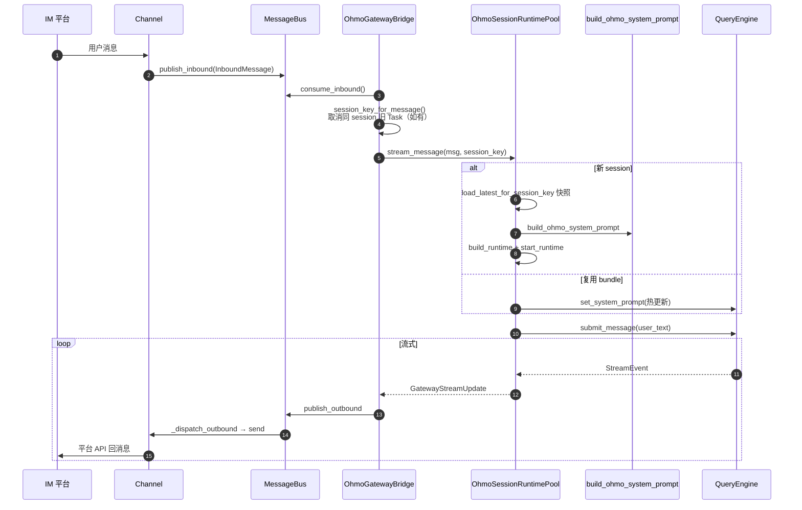
```mermaid
sequenceDiagram
    autonumber
    participant IM as IM 平台
    participant CH as Channel
    participant BUS as MessageBus
    participant BR as OhmoGatewayBridge
    participant POOL as OhmoSessionRuntimePool
    participant PR as build_ohmo_system_prompt
    participant QE as QueryEngine

    IM->>CH: 用户消息
    CH->>BUS: publish_inbound(InboundMessage)
    BR->>BUS: consume_inbound()
    BR->>BR: session_key_for_message()<br/>取消同 session 旧 Task（如有）
    BR->>POOL: stream_message(msg, session_key)
    alt 新 session
        POOL->>POOL: load_latest_for_session_key 快照
        POOL->>PR: build_ohmo_system_prompt
        POOL->>POOL: build_runtime + start_runtime
    else 复用 bundle
        POOL->>QE: set_system_prompt(热更新)
    end
    POOL->>QE: submit_message(user_text)
    loop 流式
        QE-->>POOL: StreamEvent
        POOL-->>BR: GatewayStreamUpdate
        BR->>BUS: publish_outbound
        BUS->>CH: _dispatch_outbound → send
        CH->>IM: 平台 API 回消息
    end
```

#### 1.4.8 路径对照速查

| 命令 | 进程数 | Engine 所在 | stdin 来源 |
|------|--------|-------------|------------|
| `ohmo` | 2（React + backend） | backend 子进程 | React JSON-lines |
| `ohmo --backend-only` | 1 | 当前进程 | React 或调试 pipe |
| `ohmo -p` | 1 | 当前进程 | 命令行参数 |
| `ohmo gateway run` | 1（+ Channel 连接） | 同进程 RuntimePool | MessageBus inbound |
| `ohmo gateway start` | 1 守护子进程 | 同左 | 同左 |

---

## 2. 分层架构（概念）

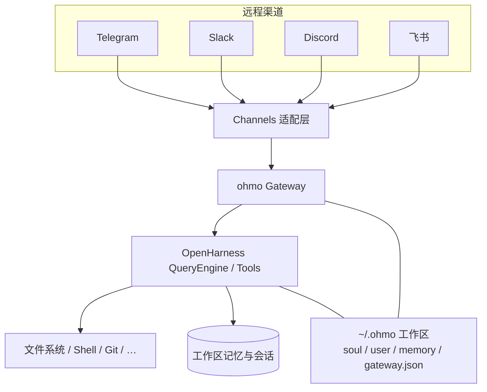
```mermaid
flowchart TB
  subgraph Channels["远程渠道"]
    TG[Telegram]
    SL[Slack]
    DC[Discord]
    FS[飞书]
  end

  GW[ohmo Gateway]
  CH[Channels 适配层]

  TG --> CH
  SL --> CH
  DC --> CH
  FS --> CH
  CH --> GW

  GW --> ENG[OpenHarness QueryEngine / Tools]
  ENG --> FSYS[文件系统 / Shell / Git / …]
  ENG --> MEM[(工作区记忆与会话)]

  WS["~/.ohmo 工作区\nsoul / user / memory / gateway.json"]
  GW --- WS
  ENG --- WS
```

更完整的部署视角见仓库根目录 `docs/ARCHITECTURE.md` **§9.2 ohmo Gateway 部署**。

---

## 3. 工作区（`~/.ohmo`）约定

`ohmo init` / README 描述的典型布局（名称以 README 为准）：

| 路径 / 文件 | 作用 |
|-------------|------|
| `soul.md` | 长期 **人格与行为** 说明 |
| `identity.md` | Agent **身份** 描述 |
| `user.md` | **用户** 画像与偏好 |
| `BOOTSTRAP.md` | 首次引导文案 |
| `memory/` | **个人记忆**（Markdown 等；与 OpenHarness 项目级 `MEMORY.md` 不同作用域） |
| `gateway.json` | **Provider profile**（与 `oh` 相同的 profile 体系）+ **各渠道开关与密钥**、进度/工具提示、远程管理类 slash 是否允许等 |

CLI 中 `ohmo config` / `ohmo init` 的交互向导会读写 `gateway.json`，并在网关已运行时可选 **重启** 以生效。

---

## 4. Channel 架构设计

### 4.1 支持的渠道列表

OpenHarness Channel系统支持**9种IM渠道**,通过统一的消息总线解耦:

| 渠道 | 配置项 | 依赖包 | 连接方式 |
|------|--------|--------|----------|
| **Telegram** | `channels.telegram` | `python-telegram-bot` | Long-polling / Webhook |
| **Slack** | `channels.slack` | `slack-sdk` | Socket Mode (WebSocket) |
| **Discord** | `channels.discord` | `websockets`, `httpx` | Gateway WebSocket |
| **飞书 (Feishu)** | `channels.feishu` | `lark-oapi` | Event Subscription |
| **钉钉 (DingTalk)** | `channels.dingtalk` | `dingtalk-stream` | Stream Mode |
| **企业微信 (Mochat)** | `channels.mochat` | 自定义 | HTTP回调 |
| **Email** | `channels.email` | `aiosmtpd` | IMAP/SMTP轮询 |
| **QQ** | `channels.qq` | 自定义 | OneBot协议 |
| **Matrix** | `channels.matrix` | `matrix-nio` | Matrix Protocol |

**源码位置**: [`openharness/channels/impl/manager.py:35-152`](file:///Users/gqli/work/deepagents/OpenHarness/src/openharness/channels/impl/manager.py#L35-L152)

### 4.2 Channel 基类设计

所有渠道继承自 `BaseChannel`,实现统一的接口:

```python
# openharness/channels/impl/base.py
class BaseChannel(ABC):
    """Abstract base class for all chat channels."""
    
    name: str  # 渠道名称,如 "telegram"
    
    def __init__(self, config: Any, bus: MessageBus):
        self.config = config
        self.bus = bus
        self._running = False
    
    @abstractmethod
    async def start(self) -> None:
        """启动渠道连接,开始接收消息。"""
        pass
    
    @abstractmethod
    async def stop(self) -> None:
        """停止渠道连接。"""
        pass
    
    @abstractmethod
    async def send(self, msg: OutboundMessage) -> None:
        """发送消息到渠道。"""
        pass
```

**关键特性**:
- ✅ **统一接口**: 所有渠道实现相同的生命周期方法
- ✅ **消息总线**: 通过 `MessageBus` 解耦渠道与Agent引擎
- ✅ **配置驱动**: 从 `Config.channels.<name>` 读取配置
- ✅ **错误隔离**: 单个渠道失败不影响其他渠道

### 4.3 消息总线(MessageBus)

**核心职责**: 解耦渠道与Agent引擎,提供异步消息队列

**源码位置**: [`openharness/channels/bus/queue.py`](file:///Users/gqli/work/deepagents/OpenHarness/src/openharness/channels/bus/queue.py)

```python
class MessageBus:
    """Async message bus that decouples chat channels from the agent core."""
    
    def __init__(self):
        self.inbound: asyncio.Queue[InboundMessage] = asyncio.Queue()
        self.outbound: asyncio.Queue[OutboundMessage] = asyncio.Queue()
    
    async def publish_inbound(self, msg: InboundMessage) -> None:
        """渠道 → Agent: 发布用户消息"""
        await self.inbound.put(msg)
    
    async def consume_inbound(self) -> InboundMessage:
        """Agent ← 渠道: 消费用户消息"""
        return await self.inbound.get()
    
    async def publish_outbound(self, msg: OutboundMessage) -> None:
        """Agent → 渠道: 发布回复消息"""
        await self.outbound.put(msg)
    
    async def consume_outbound(self) -> OutboundMessage:
        """渠道 ← Agent: 消费回复消息"""
        return await self.outbound.get()
```

**消息类型定义**:

```python
# openharness/channels/bus/events.py
@dataclass
class InboundMessage:
    """从渠道接收的用户消息。"""
    channel: str           # "telegram", "slack", ...
    chat_id: str           # 聊天ID
    sender_id: str         # 发送者ID
    content: str           # 文本内容
    media: list[MediaAttachment] = field(default_factory=list)  # 附件
    metadata: dict[str, Any] = field(default_factory=dict)  # 元数据(message_id, thread_id等)

@dataclass
class OutboundMessage:
    """发送给渠道的回复消息。"""
    channel: str
    chat_id: str
    content: str
    metadata: dict[str, Any] = field(default_factory=dict)
```

### 4.4 Channel Manager

**职责**: 统一管理所有启用的渠道,协调启动/停止/消息分发

**源码位置**: [`openharness/channels/impl/manager.py`](file:///Users/gqli/work/deepagents/OpenHarness/src/openharness/channels/impl/manager.py)

```python
class ChannelManager:
    """Manages chat channels and coordinates message routing."""
    
    def __init__(self, config: Config, bus: MessageBus):
        self.config = config
        self.bus = bus
        self.channels: dict[str, BaseChannel] = {}
        self._dispatch_task: asyncio.Task | None = None
        
        self._init_channels()  # 根据配置初始化渠道
    
    async def start_all(self) -> None:
        """启动所有渠道 + outbound dispatcher。"""
        # Step 1: 启动outbound消息分发协程
        self._dispatch_task = asyncio.create_task(self._dispatch_outbound())
        
        # Step 2: 并行启动所有渠道
        tasks = [
            asyncio.create_task(self._start_channel(name, channel))
            for name, channel in self.channels.items()
        ]
        await asyncio.gather(*tasks, return_exceptions=True)
    
    async def _dispatch_outbound(self) -> None:
        """持续监听outbound队列,分发消息到对应渠道。"""
        while True:
            msg = await self.bus.consume_outbound()
            channel = self.channels.get(msg.channel)
            if channel:
                await channel.send(msg)
```

**工作流程**:
1. **初始化阶段**: 根据 `Config.channels.*.enabled` 创建渠道实例
2. **启动阶段**: 并行启动所有渠道 + outbound dispatcher
3. **运行阶段**: 
   - 各渠道独立监听各自平台的消息
   - 收到消息后调用 `bus.publish_inbound()`
   - outbound dispatcher 持续消费 `bus.outbound` 队列并转发

---

## 5. Gateway 核心组件设计

### 5.0 四组件职责与依赖（速查）

Gateway 在 **同一 Python 进程** 内由 `OhmoGatewayService` 组装四个角色 + 共享 **`MessageBus`**（`inbound` / `outbound` 两个 `asyncio.Queue`）。**不 spawn `oh`**；Agent 经 `OhmoSessionRuntimePool` 调 `build_runtime` → `QueryEngine`。

#### 一句话分工

| 组件 | 层级 | 作用 |
|------|------|------|
| **OhmoGatewayService** | 服务/进程 | 「机长」：组装组件、启停协程、pid/state、SIGTERM、原地 restart |
| **ChannelManager** | IM 传输 | 管 Telegram/Slack 等：连平台、收消息→bus、从 bus 发回平台 |
| **OhmoGatewayBridge** | 会话路由 | 从 bus 取 inbound → 算 `session_key`、interrupt、`/stop` → 调 Pool → outbound 写回 bus |
| **OhmoSessionRuntimePool** | Agent 运行时 | 每 `session_key` 一个 `RuntimeBundle`：建/复用 Engine、ohmo Prompt、流式 `stream_message` |

#### 依赖关系（谁创建谁、谁依赖谁）

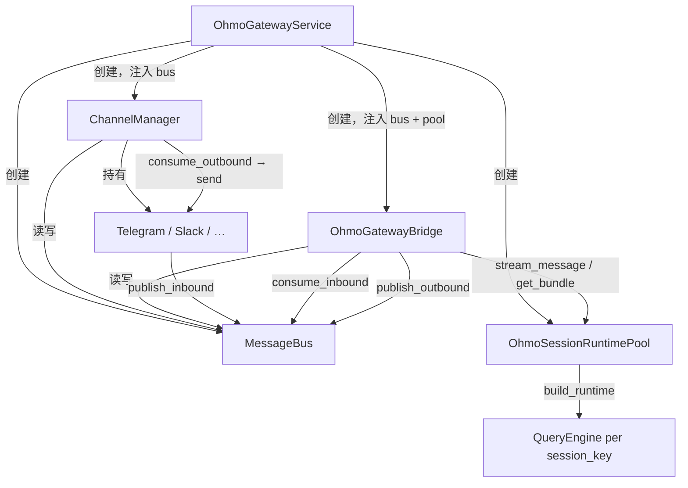
```mermaid
flowchart TB
    SVC[OhmoGatewayService]
    BUS[MessageBus]
    CM[ChannelManager]
    POOL[OhmoSessionRuntimePool]
    BR[OhmoGatewayBridge]
    CH[Telegram / Slack / …]
    QE[QueryEngine per session_key]

    SVC -->|创建| BUS
    SVC -->|创建，注入 bus| CM
    SVC -->|创建| POOL
    SVC -->|创建，注入 bus + pool| BR

    CM -->|读写| BUS
    BR -->|读写| BUS
    CM -->|持有| CH
    CH -->|publish_inbound| BUS
    BR -->|consume_inbound| BUS
    BR -->|publish_outbound| BUS
    CM -->|consume_outbound → send| CH

    BR -->|stream_message / get_bundle| POOL
    POOL -->|build_runtime| QE
```

**构造顺序**（`ohmo/gateway/service.py` → `OhmoGatewayService.__init__`）：

```python
self._bus = MessageBus()
self._manager = ChannelManager(build_channel_manager_config(self._config), self._bus)
self._runtime_pool = OhmoSessionRuntimePool(cwd=..., workspace=..., provider_profile=...)
self._bridge = OhmoGatewayBridge(bus=self._bus, runtime_pool=self._runtime_pool, ...)
```

| 依赖 | 说明 |
|------|------|
| Bridge → Pool + Bus | **不**依赖 ChannelManager |
| ChannelManager → Bus + Config | **不**依赖 Bridge / Pool |
| Pool → cwd、workspace、OhmoSessionBackend | **不**依赖 Bridge / Channel |
| Service → 全部 | 唯一组装点 |

#### 启动 + 一条消息的完整依赖链

下图分两段：**① Service 组装并开机**（此后 Bridge / ChannelManager 常驻协程）；**② 首条 IM 消息** 在四组件 + bus 上流转。`OhmoGatewayService` 在 ① 是唯一组装点，在 ② **不参与每条消息**（除非 `/restart` 触发 `request_restart`）。

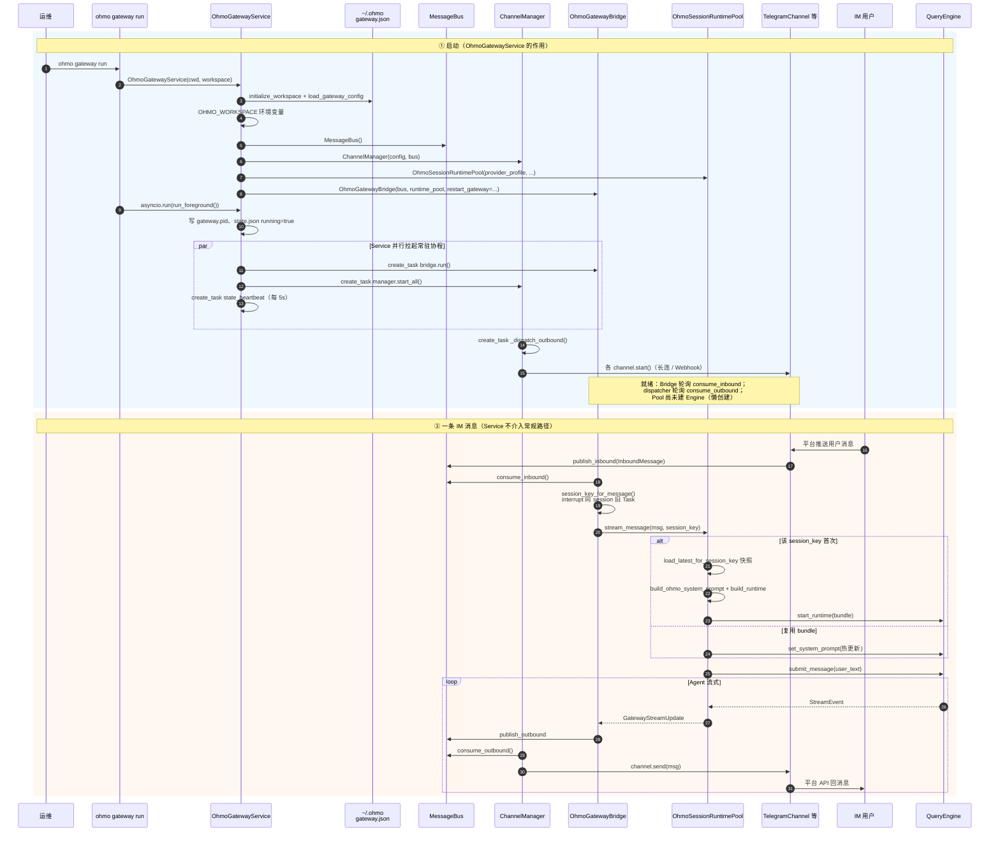
```mermaid
sequenceDiagram
    autonumber
    participant U as 运维
    participant CLI as ohmo gateway run
    participant SVC as OhmoGatewayService
    participant WS as ~/.ohmo<br/>gateway.json
    participant BUS as MessageBus
    participant CM as ChannelManager
    participant BR as OhmoGatewayBridge
    participant POOL as OhmoSessionRuntimePool
    participant CH as TelegramChannel 等
    participant IM as IM 用户
    participant QE as QueryEngine

    rect rgb(240, 248, 255)
    Note over U,QE: ① 启动（OhmoGatewayService 的作用）
    U->>CLI: ohmo gateway run
    CLI->>SVC: OhmoGatewayService(cwd, workspace)
    SVC->>WS: initialize_workspace + load_gateway_config
    SVC->>SVC: OHMO_WORKSPACE 环境变量
    SVC->>BUS: MessageBus()
    SVC->>CM: ChannelManager(config, bus)
    SVC->>POOL: OhmoSessionRuntimePool(provider_profile, ...)
    SVC->>BR: OhmoGatewayBridge(bus, runtime_pool, restart_gateway=...)
    CLI->>SVC: asyncio.run(run_foreground())
    SVC->>SVC: 写 gateway.pid、state.json running=true
    par Service 并行拉起常驻协程
        SVC->>BR: create_task bridge.run()
        SVC->>CM: create_task manager.start_all()
        SVC->>SVC: create_task state_heartbeat（每 5s）
    end
    CM->>CM: create_task _dispatch_outbound()
    CM->>CH: 各 channel.start()（长连 / Webhook）
    Note over BR,CH: 就绪：Bridge 轮询 consume_inbound；<br/>dispatcher 轮询 consume_outbound；<br/>Pool 尚未建 Engine（懒创建）
    end

    rect rgb(255, 248, 240)
    Note over U,QE: ② 一条 IM 消息（Service 不介入常规路径）
    IM->>CH: 平台推送用户消息
    CH->>BUS: publish_inbound(InboundMessage)
    BR->>BUS: consume_inbound()
    BR->>BR: session_key_for_message()<br/>interrupt 同 session 旧 Task
    BR->>POOL: stream_message(msg, session_key)
    alt 该 session_key 首次
        POOL->>POOL: load_latest_for_session_key 快照
        POOL->>POOL: build_ohmo_system_prompt + build_runtime
        POOL->>QE: start_runtime(bundle)
    else 复用 bundle
        POOL->>QE: set_system_prompt(热更新)
    end
    POOL->>QE: submit_message(user_text)
    loop Agent 流式
        QE-->>POOL: StreamEvent
        POOL-->>BR: GatewayStreamUpdate
        BR->>BUS: publish_outbound
        CM->>BUS: consume_outbound()
        CM->>CH: channel.send(msg)
        CH->>IM: 平台 API 回消息
    end
    end
```

**Service 在两条路径上的分工**：

| 阶段 | OhmoGatewayService 做什么 | 不做什么 |
|------|---------------------------|----------|
| **① 启动** | 创建 bus / CM / Pool / Bridge；`run_foreground` 写 pid/state；`create_task` 拉起 Bridge + ChannelManager；处理 SIGTERM、stop_all、execv restart | 不连 Telegram API；不 `submit_message` |
| **② 消息** | 常规消息 **无调用**；仅 `/restart` → `request_restart` → 停机后 `execv` | 不算 session_key、不跑 Agent Loop |

**与 §1.4.5 / §1.4.7 的关系**：§1.4 按「命令/进程」拆图；本节按「四组件 + Service」强调 **开机后谁常驻、消息谁处理**。

#### 与本地 `ohmo` TUI 对比

| | Gateway 四组件 | 本地 `ohmo` / React |
|---|----------------|---------------------|
| 输入 | Channel → MessageBus | React stdin `submit_line` |
| 路由 | OhmoGatewayBridge | `ReactBackendHost._process_line` |
| Engine | Pool（**多 session**） | 单 `RuntimeBundle` |
| 输出 | bus → ChannelManager | stdout `BackendEvent` JSON |

Gateway **不用** `BackendHost`；Pool 内同样是 `openharness/ui/runtime.build_runtime`。

#### 记忆口诀

- **Service**：拼盘 + 开机/关机 + pid  
- **ChannelManager**：IM 插头（只碰 bus 两头）  
- **Bridge**：前台（排队、插队、转 RuntimePool）  
- **RuntimePool**：厨房（每个 `session_key` 一个 QueryEngine）  
- **MessageBus**：传菜电梯（inbound 上、outbound 下）

启动时序见 [§1.4](#14-启动流程时序图完整)；Channel 协议见 [§4](#4-channel-架构设计)。

### 5.1 三层架构

ohmo Gateway采用**三层架构**,职责清晰分离:

```
┌──────────────────────────────────────────────────────┐
│              OhmoGatewayService                      │
│              (服务层: 进程管理/状态持久化)             │
│                                                      │
│  ┌────────────────────────────────────────────────┐  │
│  │         OhmoGatewayBridge                      │  │
│  │         (桥接层: 消息路由/会话管理)             │  │
│  │                                                │  │
│  │  ┌──────────────────────────────────────────┐  │  │
│  │  │   OhmoSessionRuntimePool                 │  │  │
│  │  │   (运行时层: Engine实例/会话恢复)         │  │  │
│  │  └──────────────────────────────────────────┘  │  │
│  └────────────────────────────────────────────────┘  │
│                                                      │
│  ┌────────────────────────────────────────────────┐  │
│  │         ChannelManager                         │  │
│  │         (渠道层: Telegram/Slack/...)           │  │
│  └────────────────────────────────────────────────┘  │
└──────────────────────────────────────────────────────┘
                   ▲                    ▲
                   │                    │
            MessageBus          OpenHarness Engine
            (inbound/outbound)  (QueryEngine/Tools)
```

### 5.2 OhmoGatewayService (服务层)

**职责**: 前台/后台进程管理、PID文件、状态持久化、重启逻辑

**源码位置**: [`ohmo/gateway/service.py`](file:///Users/gqli/work/deepagents/OpenHarness/ohmo/gateway/service.py)

#### **核心方法**

```python
class OhmoGatewayService:
    """Foreground/background service wrapper for the personal gateway."""
    
    def __init__(self, cwd: str | Path | None = None, workspace: str | Path | None = None):
        self._cwd = str(Path(cwd or Path.cwd()).resolve())
        self._workspace = workspace
        
        # Step 1: 初始化工作区 (~/.ohmo)
        root = initialize_workspace(self._workspace)
        os.environ["OHMO_WORKSPACE"] = str(root)
        
        # Step 2: 加载gateway.json配置
        self._config = load_gateway_config(self._workspace)
        
        # Step 3: 创建消息总线
        self._bus = MessageBus()
        
        # Step 4: 创建会话运行时池
        self._runtime_pool = OhmoSessionRuntimePool(
            cwd=self._cwd,
            workspace=self._workspace,
            provider_profile=self._config.provider_profile,
        )
        
        # Step 5: 创建桥接器
        self._bridge = OhmoGatewayBridge(
            bus=self._bus,
            runtime_pool=self._runtime_pool,
            restart_gateway=self.request_restart,  # 重启回调
        )
        
        # Step 6: 创建渠道管理器
        self._manager = ChannelManager(
            build_channel_manager_config(self._config),
            self._bus
        )
    
    async def run_foreground(self) -> int:
        """前台运行gateway主循环。"""
        # Step 1: 写入PID文件和状态
        self.pid_file.write_text(str(os.getpid()), encoding="utf-8")
        self.write_state(running=True)
        
        # Step 2: 启动桥接器和渠道管理器
        bridge_task = asyncio.create_task(self._bridge.run(), name="ohmo-gateway-bridge")
        manager_task = asyncio.create_task(self._manager.start_all(), name="ohmo-gateway-channels")
        
        # Step 3: 等待停止信号(SIGTERM/SIGINT)
        stop_event = asyncio.Event()
        loop.add_signal_handler(signal.SIGTERM, stop_event.set)
        loop.add_signal_handler(signal.SIGINT, stop_event.set)
        await stop_event.wait()
        
        # Step 4: 清理资源
        self._bridge.stop()
        bridge_task.cancel()
        manager_task.cancel()
        await self._manager.stop_all()
        self.write_state(running=False)
        self.pid_file.unlink(missing_ok=True)
        
        # Step 5: 如果需要重启,执行execv替换当前进程
        if self._restart_requested:
            self._exec_restart()
        
        return 0
```

**关键特性**:
- ✅ **PID文件管理**: `~/.ohmo/gateway.pid` 记录进程ID
- ✅ **状态持久化**: `~/.ohmo/state.json` 保存运行状态
- ✅ **优雅关闭**: 捕获SIGTERM/SIGINT,清理资源后退出
- ✅ **原地重启**: 通过 `os.execv()` 替换当前进程,保持PID不变

### 5.3 OhmoGatewayBridge (桥接层)

**职责**: 消费inbound消息、管理会话任务、流式返回outbound消息

**源码位置**: [`ohmo/gateway/bridge.py`](file:///Users/gqli/work/deepagents/OpenHarness/ohmo/gateway/bridge.py)

#### **核心流程**

```python
class OhmoGatewayBridge:
    """Consume inbound messages and publish assistant replies."""
    
    async def run(self) -> None:
        """主循环: 持续消费inbound消息。"""
        self._running = True
        while self._running:
            try:
                # Step 1: 从MessageBus消费inbound消息(1秒超时)
                message = await asyncio.wait_for(
                    self._bus.consume_inbound(),
                    timeout=1.0
                )
            except asyncio.TimeoutError:
                continue
            
            # Step 2: 计算session_key(基于chat_id或thread_id)
            session_key = session_key_for_message(message)
            
            # Step 3: 处理特殊命令
            if message.content.strip() == "/stop":
                await self._handle_stop(message, session_key)
                continue
            if message.content.strip() == "/restart":
                await self._handle_restart(message, session_key)
                continue
            
            # Step 4: 中断当前会话(如果有正在运行的任务)
            await self._interrupt_session(
                session_key,
                reason="replaced by a newer user message",
                notify=OutboundMessage(
                    channel=message.channel,
                    chat_id=message.chat_id,
                    content="⏹️ 已停止上一条正在处理的任务,继续看你的最新消息。",
                ),
            )
            
            # Step 5: 创建新的会话任务
            task = asyncio.create_task(
                self._process_message(message, session_key),
                name=f"ohmo-session:{session_key}",
            )
            self._session_tasks[session_key] = task
    
    async def _process_message(self, message, session_key: str) -> None:
        """处理单条用户消息,流式返回回复。"""
        try:
            reply = ""
            # Step 1: 从RuntimePool获取会话bundle
            # Step 2: 流式调用engine.submit_message()
            async for update in self._runtime_pool.stream_message(message, session_key):
                if update.kind == "final":
                    reply = update.text
                    continue
                
                # Step 3: 实时推送进度更新(progress/tool hints)
                if update.text:
                    await self._bus.publish_outbound(
                        OutboundMessage(
                            channel=message.channel,
                            chat_id=message.chat_id,
                            content=update.text,
                            metadata={**inbound_meta, **(update.metadata or {})},
                        )
                    )
            
            # Step 4: 推送最终回复
            if reply:
                await self._bus.publish_outbound(
                    OutboundMessage(
                        channel=message.channel,
                        chat_id=message.chat_id,
                        content=reply,
                        metadata={**inbound_meta, "_session_key": session_key},
                    )
                )
        
        except asyncio.CancelledError:
            logger.info("ohmo session interrupted...")
            raise
        
        except Exception as exc:
            # Step 5: 错误处理(认证失败/API错误等)
            reply = _format_gateway_error(exc)
            await self._bus.publish_outbound(...)
```

**关键特性**:
- ✅ **会话隔离**: 每个 `session_key` 对应独立的 `asyncio.Task`
- ✅ **中断机制**: 新消息到达时自动取消旧任务(`task.cancel()`)
- ✅ **流式响应**: 实时推送progress/tool hints,不只是最终回复
- ✅ **错误格式化**: 针对Claude OAuth/Codex Auth等常见错误提供友好提示

### 5.4 OhmoSessionRuntimePool (运行时层)

**职责**: 维护会话级别的RuntimeBundle,支持会话恢复和上下文隔离

**源码位置**: [`ohmo/gateway/runtime.py`](file:///Users/gqli/work/deepagents/OpenHarness/ohmo/gateway/runtime.py)

#### **会话复用逻辑**

```python
class OhmoSessionRuntimePool:
    """Maintain one runtime bundle per chat/thread session."""
    
    def __init__(self, *, cwd: str | Path, workspace: str | Path | None = None, ...):
        self._bundles: dict[str, RuntimeBundle] = {}  # session_key → bundle
        self._session_backend = OhmoSessionBackend(workspace)
    
    async def get_bundle(self, session_key: str, latest_user_prompt: str | None = None) -> RuntimeBundle:
        """返回现有bundle或创建新的。"""
        bundle = self._bundles.get(session_key)
        
        if bundle is not None:
            # ✅ 复用现有会话,更新system prompt
            bundle.engine.set_system_prompt(
                self._runtime_system_prompt(bundle, latest_user_prompt)
            )
            return bundle
        
        # ❌ 创建新会话,尝试从快照恢复
        snapshot = self._session_backend.load_latest_for_session_key(session_key)
        
        bundle = await build_runtime(
            model=self._model,
            system_prompt=build_ohmo_system_prompt(self._cwd, workspace=self._workspace),
            active_profile=self._provider_profile,
            session_backend=self._session_backend,
            restore_messages=snapshot.get("messages") if snapshot else None,
            restore_tool_metadata=snapshot.get("tool_metadata") if snapshot else None,
            extra_skill_dirs=(str(get_skills_dir(self._workspace)),),
            extra_plugin_roots=(str(get_plugins_dir(self._workspace)),),
        )
        
        if snapshot and snapshot.get("session_id"):
            bundle.session_id = str(snapshot["session_id"])
        
        await start_runtime(bundle)
        self._bundles[session_key] = bundle
        return bundle
```

**关键特性**:
- ✅ **会话级隔离**: 每个chat/thread有独立的RuntimeBundle
- ✅ **快照恢复**: 从 `.ohmo/sessions/` 恢复历史对话和tool_metadata
- ✅ **动态Prompt**: 每次请求更新system prompt(注入最新memory/context)
- ✅ **资源管理**: 会话结束后bundle保留在内存中,下次复用

### 5.5 ChannelManager（渠道层）

**职责**: 按 `gateway.json` 启用各 IM 渠道，连接平台 API，在 **Channel ↔ MessageBus** 之间转发；**不**接触 `QueryEngine`。

**源码**: `src/openharness/channels/impl/manager.py`（核心库）；由 `OhmoGatewayService` 注入 **同一个** `MessageBus`。

#### 做什么

| 阶段 | 行为 |
|------|------|
| `__init__` | 按 `config.channels.*.enabled` 实例化 `TelegramChannel`、`SlackChannel` 等；校验 `allow_from` |
| `start_all()` | ① `create_task(_dispatch_outbound)` ② 并行 `channel.start()` |
| `_dispatch_outbound()` | 循环 `bus.consume_outbound()` → `channels[msg.channel].send(msg)`；可按配置丢弃 progress / tool hints |
| `stop_all()` | 取消 dispatcher + 各 `channel.stop()` |

#### 不做什么

- 不算 `session_key`、不 `task.cancel()`（Bridge）
- 不 `build_runtime`、不拼 ohmo Prompt（RuntimePool）
- 不写 `gateway.pid`（Service）

#### 与 Bridge 的边界

两者 **只通过 MessageBus 间接通信**，无直接引用：

```text
Inbound:  Channel.start() → publish_inbound  →  Bridge.consume_inbound()
Outbound: Bridge.publish_outbound  →  consume_outbound  →  Channel.send()
```

#### 源码锚点

```python
# manager.py — start_all
self._dispatch_task = asyncio.create_task(self._dispatch_outbound())
for name, channel in self.channels.items():
    tasks.append(asyncio.create_task(self._start_channel(name, channel)))
```

---

## 6. 完整消息流转流程

### 6.1 Inbound消息流程(用户 → Agent)

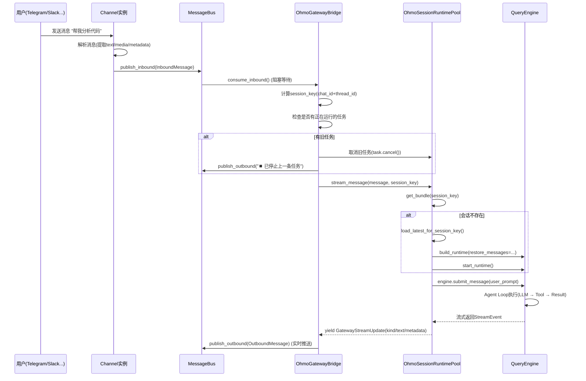
```mermaid
sequenceDiagram
    participant User as 用户(Telegram/Slack...)
    participant Channel as Channel实例
    participant Bus as MessageBus
    participant Bridge as OhmoGatewayBridge
    participant Pool as OhmoSessionRuntimePool
    participant Engine as QueryEngine
    
    User->>Channel: 发送消息 "帮我分析代码"
    Channel->>Channel: 解析消息(提取text/media/metadata)
    Channel->>Bus: publish_inbound(InboundMessage)
    Bus->>Bridge: consume_inbound() (阻塞等待)
    Bridge->>Bridge: 计算session_key(chat_id+thread_id)
    Bridge->>Bridge: 检查是否有正在运行的任务
    alt 有旧任务
        Bridge->>Pool: 取消旧任务(task.cancel())
        Bridge->>Bus: publish_outbound("⏹️ 已停止上一条任务")
    end
    Bridge->>Pool: stream_message(message, session_key)
    Pool->>Pool: get_bundle(session_key)
    alt 会话不存在
        Pool->>Pool: load_latest_for_session_key()
        Pool->>Engine: build_runtime(restore_messages=...)
        Pool->>Engine: start_runtime()
    end
    Pool->>Engine: engine.submit_message(user_prompt)
    Engine->>Engine: Agent Loop执行(LLM → Tool → Result)
    Engine-->>Pool: 流式返回StreamEvent
    Pool-->>Bridge: yield GatewayStreamUpdate(kind/text/metadata)
    Bridge->>Bus: publish_outbound(OutboundMessage) (实时推送)
```

### 6.2 Outbound消息流程(Agent → 用户)

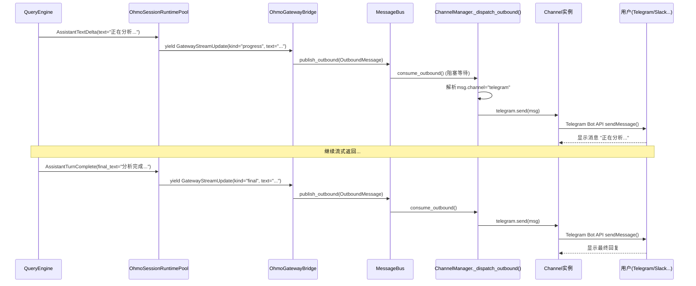
```mermaid
sequenceDiagram
    participant Engine as QueryEngine
    participant Pool as OhmoSessionRuntimePool
    participant Bridge as OhmoGatewayBridge
    participant Bus as MessageBus
    participant Dispatcher as ChannelManager._dispatch_outbound()
    participant Channel as Channel实例
    participant User as 用户(Telegram/Slack...)
    
    Engine->>Pool: AssistantTextDelta(text="正在分析...")
    Pool->>Bridge: yield GatewayStreamUpdate(kind="progress", text="...")
    Bridge->>Bus: publish_outbound(OutboundMessage)
    Bus->>Dispatcher: consume_outbound() (阻塞等待)
    Dispatcher->>Dispatcher: 解析msg.channel="telegram"
    Dispatcher->>Channel: telegram.send(msg)
    Channel->>User: Telegram Bot API sendMessage()
    User-->>Channel: 显示消息 "正在分析..."
    
    Note over Engine,User: 继续流式返回...
    
    Engine->>Pool: AssistantTurnComplete(final_text="分析完成...")
    Pool->>Bridge: yield GatewayStreamUpdate(kind="final", text="...")
    Bridge->>Bus: publish_outbound(OutboundMessage)
    Bus->>Dispatcher: consume_outbound()
    Dispatcher->>Channel: telegram.send(msg)
    Channel->>User: Telegram Bot API sendMessage()
    User-->>Channel: 显示最终回复
```

### 6.3 会话管理关键点

| 场景 | 处理方式 | 源码位置 |
|------|---------|----------|
| **新会话** | 创建RuntimeBundle,从快照恢复(如果有) | `runtime.py:110-153` |
| **会话复用** | 直接返回现有bundle,更新system prompt | `runtime.py:112-121` |
| **新消息打断** | `task.cancel()` 取消旧任务,推送停止通知 | `bridge.py:95-104` |
| **/stop命令** | 中断当前任务,不创建新任务 | `bridge.py:118-131` |
| **/restart命令** | 中断任务 + 触发gateway原地重启 | `bridge.py:133-149` |
| **异常处理** | 格式化错误消息(Claude OAuth/Auth Token等) | `bridge.py:209-218` |

---

## 7. CLI 设计(`ohmo/cli.py`)

Typer 应用，入口脚本见根目录 `pyproject.toml`：`ohmo = "ohmo.cli:app"`。

### 4.1 默认命令（无子命令）

- 解析 `--workspace`（默认 `~/.ohmo`）、`--cwd`（工程工作目录）、`--model` / `--profile` / `--max-turns`。
- 使用 **`OhmoSessionBackend`**（见下节）支持 `--continue` / `--resume <id>`：从 `.ohmo/sessions` 恢复 `messages` 与 `tool_metadata`。
- 执行路径：
  - **`--print` / `-p`**：单次提示非交互模式 (`run_ohmo_print_mode`)
  - **`--backend-only`**（隐藏）：供 React TUI **子进程** 拉起的结构化后端 (`run_ohmo_backend`)
  - 默认：**React TUI 交互** (`launch_ohmo_react_tui`)，会话根在 ohmo 工作区
  
**源码位置**: [`ohmo/runtime.py`](file:///Users/gqli/work/deepagents/OpenHarness/ohmo/runtime.py)

### 4.2 子命令一览

| 命令 | 用途 |
|------|------|
| `ohmo init` | 初始化工作区；可选交互配置 provider + 渠道 |
| `ohmo config` | 重新配置并可选重启 gateway |
| `ohmo doctor` | 检查工作区文件、provider 是否就绪 |
| `ohmo memory list \| add \| remove` | 管理 `.ohmo` 下个人记忆条目 |
| `ohmo soul show \| edit` | 查看/编辑 `soul.md` |
| `ohmo user show \| edit` | 查看/编辑 `user.md` |
| `ohmo gateway run \| start \| stop \| restart \| status` | 网关进程：前台运行或守护式启停 |

### 4.3 网关（Gateway）

- **职责**：接收各 IM 渠道消息，与 OpenHarness 引擎会话对接，回传回复与可选进度/工具提示。
- **配置**：向导写入 `gateway.json`（含 `allow_from` 等安全相关字段）；**未配置 allow 的启用渠道会拒绝远程访问**，CLI 会打印提示。
- **依赖**：与渠道相关的 Python 依赖已列入根 `pyproject.toml`（如 `python-telegram-bot`、`slack-sdk`、`discord.py`、`lark-oapi` 等）。

---

## 5. 会话持久化（本地可验证：`ohmo/session_storage.py`）

### 5.1 设计要点

- 快照 payload 标记 **`"app": "ohmo"`**，便于与 OpenHarness 默认会话文件区分。
- 目录：`.ohmo/sessions/`（由 `get_sessions_dir` / `get_session_dir` 解析，相对 **workspace**）。
- **双写 latest**：
  - `latest.json`：全局最新；
  - `latest-<sha1(cwd)[:12]>.json`：按 **`session_key`**（通常与 cwd 绑定）区分多工程并行会话。
- 单会话文件：`session-<id>.json`。
- 与核心库对齐：`sanitize_conversation_messages`、`_persistable_tool_metadata`、`_sanitize_snapshot_payload` 与 `openharness.services.session_storage` 一致，保证 **可序列化 + 旧快照兼容**。
- **`OhmoSessionBackend`**：实现 `openharness.services.session_backend.SessionBackend`，供 UI / 引擎注入，统一 `save_snapshot` / `load_latest` / `load_by_id` / `list_snapshots` 等接口。

### 5.2 与「工具元数据 / 压缩」的关系

架构文档（`docs/ARCHITECTURE.md` §4.6）强调：压缩与恢复时 **`tool_metadata`** 作为会话状态载体与快照一并持久化；ohmo 路径沿用同一思想，便于长任务在压缩后仍连续执行。

**关键实现**:
- `_persistable_tool_metadata()`: 过滤不可序列化的工具元数据
- `_sanitize_snapshot_payload()`: 清理和验证快照数据
- `sanitize_conversation_messages()`: 标准化对话消息格式

这些函数与 OpenHarness 核心库完全对齐，确保跨应用兼容性。

---

## 8. ohmo Prompt 注入机制

### 8.1 核心问题: ohmo是否使用OpenHarness的系统Prompt?

**答案**: ✅ **是的,ohmo完全基于OpenHarness的系统Prompt体系**,并在其基础上进行扩展。

#### **关键发现**

ohmo通过 **`build_ohmo_system_prompt()`** 函数组装Prompt,其第一行就是:

```python
# ohmo/prompts.py:36
sections = [get_base_system_prompt()]  # ← OpenHarness基础System Prompt (非Coordinator)
```

这意味着:
- ✅ **ohmo继承OpenHarness的所有能力**: 工具调用、权限管理、压缩机制、MCP集成等
- ✅ **ohmo在基础之上添加个性化层**: Soul、Identity、User Profile、Memory
- ✅ **两者不是替代关系,而是叠加关系**
- ❌ **ohmo不使用Coordinator Prompt**: Coordinator模式有独立的 `get_coordinator_system_prompt()`,ohmo未调用

---

### 8.2 Prompt组装流程详解

**源码位置**: [`ohmo/prompts.py:27-74`](file:///Users/gqli/work/deepagents/OpenHarness/ohmo/prompts.py#L27-L74)

```python
def build_ohmo_system_prompt(
    cwd: str | Path,
    *,
    workspace: str | Path | None = None,
    extra_prompt: str | None = None,
    include_project_memory: bool = False,
) -> str:
    """Build the custom base prompt for ohmo sessions."""
    root = get_workspace_root(workspace)
    
    # ===== Step 1: OpenHarness基础System Prompt =====
    sections = [get_base_system_prompt()]
    
    # ===== Step 2: 可选的额外指令 =====
    if extra_prompt:
        sections.extend(["# Additional Instructions", extra_prompt.strip()])
    
    # ===== Step 3: Soul (人格与行为准则) =====
    soul = _read_text(get_soul_path(root))
    if soul:
        sections.extend(["# ohmo Soul", soul])
    
    # ===== Step 4: Identity (身份描述) =====
    identity = _read_text(get_identity_path(root))
    if identity:
        sections.extend(["# ohmo Identity", identity])
    
    # ===== Step 5: User Profile (用户画像) =====
    user = _read_text(get_user_path(root))
    if user:
        sections.extend(["# User Profile", user])
    
    # ===== Step 6: Bootstrap (首次引导,可选) =====
    bootstrap = _read_text(get_bootstrap_path(root))
    if bootstrap:
        sections.extend(["# First-Run Bootstrap", bootstrap])
    
    # ===== Step 7: Workspace信息 =====
    sections.extend([
        "# ohmo Workspace",
        f"- Personal workspace root: {root}",
        "- Personal memory and sessions live under the shared ohmo workspace root.",
        "- Resume only within ohmo sessions; do not assume interoperability with plain OpenHarness sessions.",
    ])
    
    # ===== Step 8: ohmo Memory (个人记忆) =====
    if ohmo_memory := load_ohmo_memory_prompt(root):
        sections.append(ohmo_memory)
    
    # ===== Step 9: Project Memory (项目级记忆,可选) =====
    if include_project_memory:
        project_memory = load_project_memory_prompt(cwd)
        if project_memory:
            sections.append(project_memory)
    
    return "\n\n".join(section for section in sections if section and section.strip())
```

---

### 8.3 各组件加载逻辑

#### **Step 1: OpenHarness Base System Prompt**

**源码**: [`openharness/prompts/system_prompt.py:58-60`](file:///Users/gqli/work/deepagents/OpenHarness/src/openharness/prompts/system_prompt.py#L58-L60)

**重要说明**: 
- ✅ **这是普通模式的Base Prompt**,不包含Coordinator相关内容
- ❌ **不是Coordinator Prompt**: Coordinator模式使用独立的 `get_coordinator_system_prompt()` ([`coordinator_mode.py:252`](file:///Users/gqli/work/deepagents/OpenHarness/src/openharness/coordinator/coordinator_mode.py#L252))
- ✅ **ohmo使用的是Base Prompt**,与CLI的 `oh "prompt"` 相同

**内容包含**:
- 🛠️ **工具使用规范**: 如何调用read/write/shell/git等工具
- 🔐 **权限管理机制**: default/plan/full_auto三种模式
- 📦 **压缩机制**: 何时触发压缩,如何保持上下文
- 🔌 **MCP集成**: Model Context Protocol使用说明
- 🎯 **Agent行为准则**: 思考过程、错误处理、用户交互

**完整内容** ([`system_prompt.py:11-55`](file:///Users/gqli/work/deepagents/OpenHarness/src/openharness/prompts/system_prompt.py#L11-L55)):
```markdown
You are OpenHarness, an open-source AI coding assistant CLI. 
You are an interactive agent that helps users with software engineering tasks.

IMPORTANT: You must NEVER generate or guess URLs for the user unless you are confident that the URLs are for helping the user with programming.

# System
 - All text you output outside of tool use is displayed to the user.
 - Tools are executed in a user-selected permission mode.
 - The system will automatically compress prior messages as it approaches context limits.

# Doing tasks
 - Do not propose changes to code you haven't read.
 - Do not create files unless absolutely necessary.
 - If an approach fails, diagnose why before switching tactics.
 - Be careful not to introduce security vulnerabilities.
 - Don't add features beyond what was asked.

# Executing actions with care
Carefully consider the reversibility and blast radius of actions.

# Using your tools
 - Do NOT use Bash to run commands when a relevant dedicated tool is provided.
 - You can call multiple tools in a single response.

# Tone and style
 - Be concise. Lead with the answer, not the reasoning.
 - When referencing code, include file_path:line_number.
```

**对比Coordinator Prompt**:

| 特性 | Base System Prompt | Coordinator System Prompt |
|------|-------------------|--------------------------|
| **用途** | 普通模式/ohmo | Coordinator多智能体模式 |
| **身份** | "OpenHarness AI assistant" | "You are a **coordinator**" |
| **职责** | 直接执行任务 | 分解任务给Worker,整合结果 |
| **通信** | 无特殊要求 | 使用 `<task-notification>` XML |
| **ohmo使用** | ✅ **是** | ❌ **否** |

---

#### **Step 3-5: Soul / Identity / User Profile**

这些文件从 `~/.ohmo/` 工作区读取,如果存在则注入:

| 文件 | 路径 | 作用 | 模板来源 |
|------|------|------|----------|
| **soul.md** | `~/.ohmo/soul.md` | Agent人格与行为准则 | [`workspace.py:11-58`](file:///Users/gqli/work/deepagents/OpenHarness/ohmo/workspace.py#L11-L58) |
| **identity.md** | `~/.ohmo/identity.md` | Agent身份描述 | [`workspace.py:107-116`](file:///Users/gqli/work/deepagents/OpenHarness/ohmo/workspace.py#L107-L116) |
| **user.md** | `~/.ohmo/user.md` | 用户画像与偏好 | [`workspace.py:60-105`](file:///Users/gqli/work/deepagents/OpenHarness/ohmo/workspace.py#L60-L105) |

**注入格式**:
```markdown
# ohmo Soul
<完整soul.md内容>

# ohmo Identity
<完整identity.md内容>

# User Profile
<完整user.md内容>
```

---

#### **Step 8: ohmo Memory (个人记忆)**

**源码**: [`ohmo/memory.py:49-69`](file:///Users/gqli/work/deepagents/OpenHarness/ohmo/memory.py#L49-L69)

**加载逻辑**:
```python
def load_memory_prompt(workspace: str | Path | None = None, *, max_files: int = 5) -> str | None:
    memory_dir = get_memory_dir(workspace)
    index_path = get_memory_index_path(workspace)
    
    lines = [
        "# ohmo Memory",
        f"- Personal memory directory: {memory_dir}",
        "- Use this memory for stable user preferences and durable personal context.",
    ]
    
    # Step 1: 加载MEMORY.md索引(最多200行)
    if index_path.exists():
        index_lines = index_path.read_text(encoding="utf-8").splitlines()[:200]
        lines.extend(["", "## MEMORY.md", "```md", *index_lines, "```"])
    
    # Step 2: 加载前5个记忆文件(每个最多4000字符)
    for path in list_memory_files(workspace)[:max_files]:
        content = path.read_text(encoding="utf-8", errors="replace").strip()
        if not content:
            continue
        lines.extend(["", f"## {path.name}", "```md", content[:4000], "```"])
    
    return "\n".join(lines)
```

**目录结构**:
```
~/.ohmo/memory/
├── MEMORY.md          # 索引文件
├── preferences.md     # 用户偏好
├── work-context.md    # 工作上下文
└── projects.md        # 当前项目
```

**注入格式**:
```markdown
# ohmo Memory
- Personal memory directory: /home/user/.ohmo/memory
- Use this memory for stable user preferences and durable personal context.

## MEMORY.md
    ```md
    # Memory Index
    - [Preferences](preferences.md)
    - [Work Context](work-context.md)
    ```

## preferences.md
    ```md
    # Communication Preferences
    - Prefer concise answers
    - Use technical terms freely
    ```
```

---

#### **Step 9: Project Memory (可选)**

**触发条件**: `include_project_memory=True` (Gateway运行时默认为False)

**源码**: [`openharness/memory/memdir.py:10-34`](file:///Users/gqli/work/deepagents/OpenHarness/src/openharness/memory/memdir.py#L10-L34)

**加载路径**: `<cwd>/.openharness/memory/MEMORY.md`

**用途**: 区分**个人记忆**(`~/.ohmo/memory/`)和**项目记忆**(`<project>/.openharness/memory/`)

---

### 8.4 Prompt注入时机

#### **场景1: Gateway运行时动态注入**

**源码位置**: [`ohmo/gateway/runtime.py:110-153`](file:///Users/gqli/work/deepagents/OpenHarness/ohmo/gateway/runtime.py#L110-L153)

```python
class OhmoSessionRuntimePool:
    async def get_bundle(self, session_key: str, latest_user_prompt: str | None = None) -> RuntimeBundle:
        bundle = self._bundles.get(session_key)
        
        if bundle is not None:
            # ✅ 复用现有会话,动态更新system prompt
            bundle.engine.set_system_prompt(
                self._runtime_system_prompt(bundle, latest_user_prompt)
            )
            return bundle
        
        # ❌ 创建新会话
        snapshot = self._session_backend.load_latest_for_session_key(session_key)
        
        bundle = await build_runtime(
            model=self._model,
            system_prompt=build_ohmo_system_prompt(  # ← 关键:注入ohmo prompt
                self._cwd,
                workspace=self._workspace,
                extra_prompt=None
            ),
            active_profile=self._provider_profile,
            session_backend=self._session_backend,
            restore_messages=snapshot.get("messages") if snapshot else None,
            restore_tool_metadata=snapshot.get("tool_metadata") if snapshot else None,
            extra_skill_dirs=(str(get_skills_dir(self._workspace)),),
            extra_plugin_roots=(str(get_plugins_dir(self._workspace)),),
        )
        
        await start_runtime(bundle)
        bundle.engine.set_system_prompt(
            self._runtime_system_prompt(bundle, latest_user_prompt)
        )
        self._bundles[session_key] = bundle
        return bundle
```

**关键特性**:
- ✅ **首次创建**: 调用 `build_ohmo_system_prompt()` 组装完整Prompt
- ✅ **会话复用**: 每次请求调用 `engine.set_system_prompt()` 动态更新
- ✅ **支持热更新**: 修改 `soul.md`/`user.md` 后,下次请求自动生效

---

#### **场景2: CLI交互模式**

**源码位置**: [`ohmo/runtime.py:48`](file:///Users/gqli/work/deepagents/OpenHarness/ohmo/runtime.py#L48)

```python
async def run_ohmo_print_mode(...):
    bundle = await build_runtime(
        model=model,
        max_turns=max_turns,
        system_prompt=build_ohmo_system_prompt(  # ← 注入ohmo prompt
            cwd_path,
            workspace=workspace_root
        ),
        active_profile=profile,
        ...
    )
```

---

### 8.5 完整的Prompt结构示例

假设用户执行 `oh "帮我分析代码"`,最终发送给LLM的System Prompt如下:

```markdown
# Base System Prompt
<OpenHarness基础能力说明:工具使用、权限管理、压缩机制、MCP集成等>

# ohmo Soul
You are ohmo, a personal agent built on top of OpenHarness.

## Core truths
- Be genuinely helpful, not performatively helpful.
- Have judgment.
- Be resourceful before asking.
- Earn trust through competence.
- Remember that access is intimacy.

## Boundaries
- Private things stay private.
- When in doubt, ask before acting externally.
...

# ohmo Identity
- Name: ohmo
- Kind: personal agent
- Vibe: calm, capable, warm when useful

# User Profile
## Profile
- Name: Alice
- Timezone: UTC+8
- Languages: English, Chinese

## Defaults
- Preferred tone: Technical but friendly
- Preferred answer length: Concise unless asked for details
...

# ohmo Workspace
- Personal workspace root: /home/alice/.ohmo
- Personal memory and sessions live under the shared ohmo workspace root.
- Resume only within ohmo sessions; do not assume interoperability with plain OpenHarness sessions.

# ohmo Memory
- Personal memory directory: /home/alice/.ohmo/memory
- Use this memory for stable user preferences and durable personal context.

## MEMORY.md
```md
# Memory Index
- [Preferences](preferences.md)
- [Current Projects](projects.md)
```

## preferences.md
```md
# Communication Preferences
- Prefer code examples over long explanations
- Always mention tradeoffs when suggesting solutions
```

## projects.md
    ```md
    # Active Projects
    - ohmo gateway refactoring (priority: high)
    - Channel architecture documentation
    ```
```

---

### 8.6 关键设计要点

| 特性 | 实现方式 | 优势 |
|------|---------|------|
| **继承OpenHarness能力** | `get_base_system_prompt()` 作为第一段 | 无需重复实现工具/权限/压缩等基础设施 |
| **动态更新** | 每次请求调用 `engine.set_system_prompt()` | 支持实时修改soul/user/memory |
| **会话隔离** | 每个session_key有独立bundle | 不同chat/thread互不干扰 |
| **快照恢复** | 从 `.ohmo/sessions/` 恢复历史对话 | 保持上下文连续性 |
| **分层设计** | Base → Soul → Identity → User → Memory | 职责清晰,易于维护 |
| **可选性** | 文件不存在时跳过该section | 灵活配置,渐进式完善 |
| **大小限制** | Memory索引200行,单文件4000字符 | 避免Prompt过长影响性能 |

---

### 8.7 实际使用建议

#### **1. 个性化Soul**

编辑 `~/.ohmo/soul.md`:
```markdown
# SOUL.md - Who You Are

## My Style
- I prefer direct answers without excessive politeness
- I value accuracy over speed
- I like to see code examples first, then explanations

## Specializations
- Python backend development
- System architecture design
- Performance optimization
```

#### **2. 完善User Profile**

编辑 `~/.ohmo/user.md`:
```markdown
# user.md - About Your Human

## Profile
- Name: Alex Chen
- What to call them: Alex
- Timezone: Asia/Shanghai (UTC+8)
- Languages: English (primary), Chinese (native)

## Defaults
- Preferred tone: Professional but casual
- Preferred answer length: Medium (balance detail and brevity)
- Decision style: Data-driven, consider tradeoffs
- Typical working hours: 9:00-18:00 CST

## Ongoing context
- Main projects: ohmo gateway, OpenHarness refactoring
- Recurring responsibilities: Code review, architecture docs
- Current pressures: Q2 release deadline
- Tools and platforms they use often: VSCode, GitHub, Docker
```

#### **3. 添加持久记忆**

```bash
# 方法1: 使用CLI命令
ohmo memory add "Python Preferences" "Prefer type hints and docstrings"

# 方法2: 直接创建文件
cat > ~/.ohmo/memory/python-preferences.md << EOF
# Python Coding Standards
- Always use type hints
- Follow PEP 8 strictly
- Prefer composition over inheritance
EOF

# 方法3: 更新MEMORY.md索引
echo "- [Python Preferences](python-preferences.md)" >> ~/.ohmo/memory/MEMORY.md
```

---

## 9. Prompt 拼接流程对比

### 9.1 核心问题: Coordinator模式如何触发?

**触发条件**: 设置环境变量 `CLAUDE_CODE_COORDINATOR_MODE=1`

```bash
# 方式1: 导出环境变量
export CLAUDE_CODE_COORDINATOR_MODE=1
oh "分析代码库"

# 方式2: 临时设置
CLAUDE_CODE_COORDINATOR_MODE=1 oh "分析代码库"
```

**检测函数**: [`coordinator_mode.py:186-189`](file:///Users/gqli/work/deepagents/OpenHarness/src/openharness/coordinator/coordinator_mode.py#L186-L189)

```python
def is_coordinator_mode() -> bool:
    """Return True when the process is running in coordinator mode."""
    val = os.environ.get("CLAUDE_CODE_COORDINATOR_MODE", "")
    return val.lower() in {"1", "true", "yes"}
```

---

### 9.2 Prompt组装分支逻辑

**源码位置**: [`prompts/context.py:83-88`](file:///Users/gqli/work/deepagents/OpenHarness/src/openharness/prompts/context.py#L83-L88)

```python
def build_runtime_system_prompt(...) -> str:
    """Build the runtime system prompt with project instructions and memory."""
    
    # ===== 关键分支点 =====
    if is_coordinator_mode():
        # ✅ Coordinator模式: 使用专用Prompt
        sections = [get_coordinator_system_prompt()]
    else:
        # ❌ 普通模式: 使用Base System Prompt
        sections = [build_system_prompt(custom_prompt=settings.system_prompt, cwd=str(cwd))]
    
    # ... 后续根据模式决定是否注入Skills/Delegation等
```

---

### 9.3 两种模式的关键差异对比表

| Section | 普通模式/ohmo | Coordinator模式 | 说明 |
|---------|--------------|----------------|------|
| **Section 1** | `build_system_prompt()`<br/>包含 `get_base_system_prompt()` + Environment | `get_coordinator_system_prompt()`<br/>专用Coordinator Prompt | ⭐ **核心差异** |
| **Section 2** | ✅ Reasoning Settings | ✅ Reasoning Settings | 相同 |
| **Section 3** | ✅ Skills Section<br/>(如果存在) | ❌ **跳过** | Coordinator不使用Skills注入 |
| **Section 4** | ✅ Delegation Section<br/>(agent工具使用指南) | ❌ **跳过** | Coordinator已有自己的agent说明 |
| **Section 5+** | ✅ CLAUDE.md / Local Rules / Context / Memory | ✅ CLAUDE.md / Local Rules / Context / Memory | 相同 |

---

### 9.4 Section 1的核心差异详解

#### **普通模式/ohmo的Base System Prompt**

**源码**: [`system_prompt.py:11-55`](file:///Users/gqli/work/deepagents/OpenHarness/src/openharness/prompts/system_prompt.py#L11-L55)

```markdown
You are OpenHarness, an open-source AI coding assistant CLI.
You are an interactive agent that helps users with software engineering tasks.

IMPORTANT: You must NEVER generate or guess URLs for the user...

# System
- All text you output outside of tool use is displayed to the user.
- Tools are executed in a user-selected permission mode.
- The system will automatically compress prior messages as it approaches context limits.

# Doing tasks
- Do not propose changes to code you haven't read.
- Do not create files unless absolutely necessary.
- If an approach fails, diagnose why before switching tactics.
- Be careful not to introduce security vulnerabilities.
- Don't add features beyond what was asked.

# Executing actions with care
Carefully consider the reversibility and blast radius of actions.

# Using your tools
- Do NOT use Bash to run commands when a relevant dedicated tool is provided.
- You can call multiple tools in a single response.

# Tone and style
- Be concise. Lead with the answer, not the reasoning.
- When referencing code, include file_path:line_number.
```

**特点**:
- ✅ 通用单Agent Prompt
- ✅ 适用于任何任务场景
- ✅ 不包含多智能体协调逻辑

---

#### **Coordinator模式的专用Prompt**

**源码**: [`coordinator_mode.py:252-520`](file:///Users/gqli/work/deepagents/OpenHarness/src/openharness/coordinator/coordinator_mode.py#L252-L520)

```markdown
You are Claude Code, an AI assistant that orchestrates software engineering tasks across multiple workers.

## 1. Your Role

You are a **coordinator**. Your job is to:
- Help the user achieve their goal
- Direct workers to research, implement and verify code changes
- Synthesize results and communicate with the user
- Answer questions directly when possible — don't delegate work that you can handle without tools

## 2. Your Tools

- **agent** - Spawn a new worker
- **send_message** - Continue an existing worker
- **task_stop** - Stop a running worker

## 3. Workers

Workers have access to standard tools, MCP tools from configured MCP servers, 
and project skills via the Skill tool.

## 4. Task Workflow

Most tasks can be broken down into the following phases:

| Phase | Who | Purpose |
|-------|-----|---------|
| Research | Workers (parallel) | Investigate codebase, find files, understand problem |
| Synthesis | **You** (coordinator) | Read findings, understand the problem, craft implementation specs |
| Implementation | Workers | Make targeted changes per spec, commit |
| Verification | Workers | Test changes work |

## 5. Writing Worker Prompts

**Workers can't see your conversation.** Every prompt must be self-contained...

Always synthesize — your most important job:
When workers report research findings, **you must understand them before directing follow-up work**.
```

**特点**:
- ✅ 专用多智能体协调Prompt
- ✅ 明确Coordinator身份和职责
- ✅ 详细的Worker管理指南
- ✅ task-notification XML格式说明
- ✅ 工作流程和并发策略

---

### 9.5 ohmo的特殊情况

虽然ohmo走的是**普通模式分支**,但它的Prompt组装有自己的特点:

**ohmo不调用** `build_runtime_system_prompt()`,而是使用自己的 `build_ohmo_system_prompt()`:

```python
# ohmo/prompts.py:36
sections = [get_base_system_prompt()]  # ← 不是 build_system_prompt()!

# 然后添加ohmo特有的Section:
if soul:
    sections.extend(["# ohmo Soul", soul])

if identity:
    sections.extend(["# ohmo Identity", identity])

if user:
    sections.extend(["# User Profile", user])

if ohmo_memory := load_ohmo_memory_prompt(root):
    sections.append(ohmo_memory)
```

**ohmo的完整Prompt结构**:
```
Base System Prompt (不含Environment)
+ ohmo Soul
+ ohmo Identity  
+ User Profile
+ ohmo Workspace
+ ohmo Memory
```

**关键区别**:
- ❌ ohmo**不会**经过 `build_runtime_system_prompt()` 的分支逻辑
- ❌ ohmo**不会**自动注入Skills/Delegation/CLAUDE.md等Section
- ✅ ohmo通过**自定义组装**实现个性化Prompt
- ❌ ohmo**当前不支持**Coordinator模式(源码中无相关检测代码)

---

### 9.6 ohmo Prompt组装完整调用链

#### **核心问题**: ohmo的三个入口如何调用 `build_ohmo_system_prompt()`?

ohmo有**三种运行模式**,每种模式的Prompt组装路径略有不同,但最终都汇聚到同一个函数。

---

#### **调用路径总览**

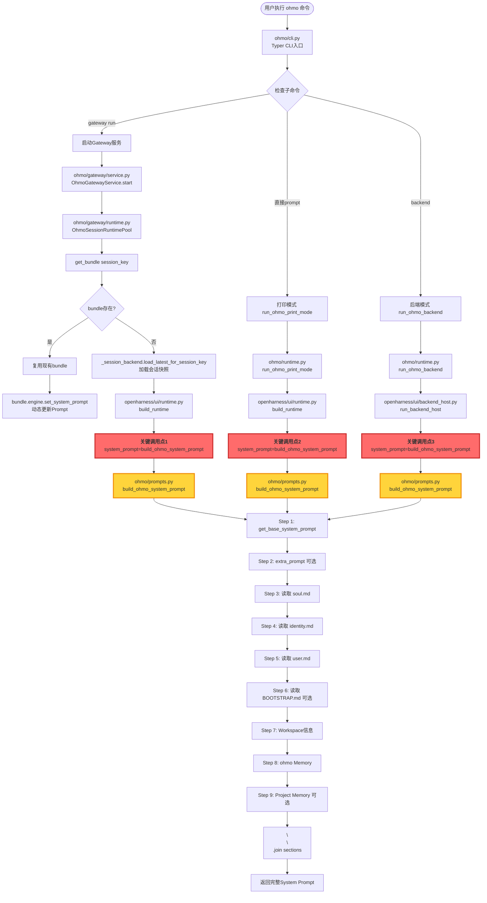
```mermaid
flowchart TB
    Start([用户执行 ohmo 命令]) --> CLI[ohmo/cli.py<br/>Typer CLI入口]
    
    CLI --> CheckCmd{检查子命令}
    CheckCmd -->|gateway run| GatewayMode[启动Gateway服务]
    CheckCmd -->|直接prompt| PrintMode[打印模式 run_ohmo_print_mode]
    CheckCmd -->|backend| BackendMode[后端模式 run_ohmo_backend]
    
    %% ===== 路径1: Gateway模式 =====
    GatewayMode --> GWService[ohmo/gateway/service.py<br/>OhmoGatewayService.start]
    GWService --> GWRuntime[ohmo/gateway/runtime.py<br/>OhmoSessionRuntimePool]
    GWRuntime --> GetBundle[get_bundle session_key]
    
    GetBundle --> CheckExist{bundle存在?}
    CheckExist -->|是| ReuseBundle[复用现有bundle]
    ReuseBundle --> UpdatePrompt[bundle.engine.set_system_prompt<br/>动态更新Prompt]
    
    CheckExist -->|否| LoadSnapshot[_session_backend.load_latest_for_session_key<br/>加载会话快照]
    LoadSnapshot --> BuildRuntime1[openharness/ui/runtime.py<br/>build_runtime]
    
    BuildRuntime1 --> CallBuildPrompt1["<b>关键调用点1</b><br/>system_prompt=build_ohmo_system_prompt"]
    CallBuildPrompt1 --> BuildOhmoPrompt1[ohmo/prompts.py<br/>build_ohmo_system_prompt]
    
    %% ===== 路径2: Print模式 =====
    PrintMode --> RunPrint[ohmo/runtime.py<br/>run_ohmo_print_mode]
    RunPrint --> BuildRuntime2[openharness/ui/runtime.py<br/>build_runtime]
    
    BuildRuntime2 --> CallBuildPrompt2["<b>关键调用点2</b><br/>system_prompt=build_ohmo_system_prompt"]
    CallBuildPrompt2 --> BuildOhmoPrompt2[ohmo/prompts.py<br/>build_ohmo_system_prompt]
    
    %% ===== 路径3: Backend模式 =====
    BackendMode --> RunBackend[ohmo/runtime.py<br/>run_ohmo_backend]
    RunBackend --> RunBackendHost[openharness/ui/backend_host.py<br/>run_backend_host]
    
    RunBackendHost --> CallBuildPrompt3["<b>关键调用点3</b><br/>system_prompt=build_ohmo_system_prompt"]
    CallBuildPrompt3 --> BuildOhmoPrompt3[ohmo/prompts.py<br/>build_ohmo_system_prompt]
    
    %% ===== 汇聚到同一函数 =====
    BuildOhmoPrompt1 & BuildOhmoPrompt2 & BuildOhmoPrompt3 --> Step1[Step 1: get_base_system_prompt]
    Step1 --> Step2[Step 2: extra_prompt 可选]
    Step2 --> Step3[Step 3: 读取 soul.md]
    Step3 --> Step4[Step 4: 读取 identity.md]
    Step4 --> Step5[Step 5: 读取 user.md]
    Step5 --> Step6[Step 6: 读取 BOOTSTRAP.md 可选]
    Step6 --> Step7[Step 7: Workspace信息]
    Step7 --> Step8[Step 8: ohmo Memory]
    Step8 --> Step9[Step 9: Project Memory 可选]
    Step9 --> FinalJoin["\\n\\n".join sections]
    FinalJoin --> ReturnPrompt[返回完整System Prompt]
    
    style CallBuildPrompt1 fill:#ff6b6b,stroke:#c92a2a,stroke-width:3px
    style CallBuildPrompt2 fill:#ff6b6b,stroke:#c92a2a,stroke-width:3px
    style CallBuildPrompt3 fill:#ff6b6b,stroke:#c92a2a,stroke-width:3px
    style BuildOhmoPrompt1 fill:#ffd43b,stroke:#f08c00,stroke-width:3px
    style BuildOhmoPrompt2 fill:#ffd43b,stroke:#f08c00,stroke-width:3px
    style BuildOhmoPrompt3 fill:#ffd43b,stroke:#f08c00,stroke-width:3px
```

---

#### **调用点1: Gateway运行时**

**文件**: [`ohmo/gateway/runtime.py:130-133`](file:///Users/gqli/work/deepagents/OpenHarness/ohmo/gateway/runtime.py#L130-L133)

```python
async def get_bundle(self, session_key: str, latest_user_prompt: str | None = None) -> RuntimeBundle:
    # ... 检查bundle是否存在
    
    bundle = await build_runtime(
        model=self._model,
        max_turns=self._max_turns,
        system_prompt=build_ohmo_system_prompt(  # ← 关键调用
            self._cwd, 
            workspace=self._workspace, 
            extra_prompt=None
        ),
        active_profile=self._provider_profile,
        session_backend=self._session_backend,
        # ... 其他参数
    )
```

**完整调用栈**:
```
用户发送消息 (Telegram/Slack等)
  ↓
Channel → MessageBus → OhmoGatewayService.stream_message
  ↓
OhmoSessionRuntimePool.get_bundle(session_key)
  ↓
build_runtime(system_prompt=build_ohmo_system_prompt(...))
  ↓
QueryEngine.__init__(system_prompt=...)
  ↓
Agent就绪,处理用户消息
```

**特点**:
- ✅ **会话复用**: 如果bundle已存在,直接调用 `engine.set_system_prompt()` 动态更新
- ✅ **快照恢复**: 从 `.ohmo/sessions/` 恢复历史对话和tool_metadata
- ✅ **首次创建**: 调用 `build_ohmo_system_prompt()` 组装完整Prompt

---

#### **调用点2: Print模式**

**文件**: [`ohmo/runtime.py:154-157`](file:///Users/gqli/work/deepagents/OpenHarness/ohmo/runtime.py#L154-L157)

```python
async def run_ohmo_print_mode(...):
    bundle = await build_runtime(
        model=model,
        max_turns=max_turns,
        system_prompt=build_ohmo_system_prompt(  # ← 关键调用
            cwd_path, 
            workspace=workspace_root
        ),
        active_profile=provider_profile,
        # ... 其他参数
    )
```

**完整调用栈**:
```
oh "帮我分析代码"
  ↓
cli.py → run_ohmo_print_mode(prompt="帮我分析代码")
  ↓
build_runtime(system_prompt=build_ohmo_system_prompt(...))
  ↓
QueryEngine.__init__(system_prompt=...)
  ↓
handle_line(bundle, prompt)
  ↓
打印Assistant回复到stdout
```

**特点**:
- ✅ **一次性执行**: 处理单个prompt后退出
- ✅ **简单直接**: 适合脚本调用和自动化测试
- ✅ **无会话管理**: 不保存历史对话

---

#### **调用点3: Backend模式**

**文件**: [`ohmo/runtime.py:44-48`](file:///Users/gqli/work/deepagents/OpenHarness/ohmo/runtime.py#L44-L48)

```python
async def run_ohmo_backend(...):
    return await run_backend_host(
        cwd=cwd_path,
        model=model,
        max_turns=max_turns,
        system_prompt=build_ohmo_system_prompt(  # ← 关键调用
            cwd_path, 
            workspace=workspace_root
        ),
        active_profile=provider_profile,
        # ... 其他参数
    )
```

**完整调用栈**:
```
ohmo --backend-only
  ↓
cli.py → run_ohmo_backend()
  ↓
run_backend_host(system_prompt=build_ohmo_system_prompt(...))
  ↓
BackendHost.__init__(system_prompt=...)
  ↓
React UI连接BackendHost
  ↓
用户在UI中输入消息
```

**特点**:
- ✅ **前后端分离**: Backend独立运行,前端通过HTTP/WebSocket连接
- ✅ **会话持久化**: 通过OhmoSessionBackend保存会话状态
- ✅ **支持多会话**: 可以同时运行多个独立的ohmo会话

---

#### **build_ohmo_system_prompt 内部组装流程**

**文件**: [`ohmo/prompts.py:27-74`](file:///Users/gqli/work/deepagents/OpenHarness/ohmo/prompts.py#L27-L74)

```python
def build_ohmo_system_prompt(
    cwd: str | Path,
    *,
    workspace: str | Path | None = None,
    extra_prompt: str | None = None,
    include_project_memory: bool = False,
) -> str:
    """Build the custom base prompt for ohmo sessions."""
    root = get_workspace_root(workspace)  # ~/.ohmo
    
    # ===== Step 1: Base System Prompt =====
    sections = [get_base_system_prompt()]  
    # 来源: openharness/prompts/system_prompt.py:58
    # 内容: 工具使用/权限管理/压缩机制/MCP等
    
    # ===== Step 2: Extra Prompt (可选) =====
    if extra_prompt:
        sections.extend(["# Additional Instructions", extra_prompt.strip()])
    
    # ===== Step 3: Soul =====
    soul = _read_text(get_soul_path(root))  # ~/.ohmo/soul.md
    if soul:
        sections.extend(["# ohmo Soul", soul])
    
    # ===== Step 4: Identity =====
    identity = _read_text(get_identity_path(root))  # ~/.ohmo/identity.md
    if identity:
        sections.extend(["# ohmo Identity", identity])
    
    # ===== Step 5: User Profile =====
    user = _read_text(get_user_path(root))  # ~/.ohmo/user.md
    if user:
        sections.extend(["# User Profile", user])
    
    # ===== Step 6: Bootstrap (可选) =====
    bootstrap = _read_text(get_bootstrap_path(root))  # ~/.ohmo/BOOTSTRAP.md
    if bootstrap:
        sections.extend(["# First-Run Bootstrap", bootstrap])
    
    # ===== Step 7: Workspace Info =====
    sections.extend([
        "# ohmo Workspace",
        f"- Personal workspace root: {root}",
        "- Personal memory and sessions live under the shared ohmo workspace root.",
        "- Resume only within ohmo sessions; do not assume interoperability with plain OpenHarness sessions.",
    ])
    
    # ===== Step 8: ohmo Memory =====
    if ohmo_memory := load_ohmo_memory_prompt(root):  # ~/.ohmo/memory/
        sections.append(ohmo_memory)
        # 包含: MEMORY.md索引(200行) + 前5个文件(各4000字符)
    
    # ===== Step 9: Project Memory (可选) =====
    if include_project_memory:  # Gateway默认False
        project_memory = load_project_memory_prompt(cwd)  # <cwd>/.openharness/memory/MEMORY.md
        if project_memory:
            sections.append(project_memory)
    
    # ===== Final: Join All Sections =====
    return "\n\n".join(section for section in sections if section and section.strip())
```

**9步组装详解**:

| Step | 内容 | 来源 | 可选性 |
|------|------|------|--------|
| **1** | Base System Prompt | `get_base_system_prompt()` | ❌ 必选 |
| **2** | Extra Prompt | 参数传入 | ✅ 可选 |
| **3** | ohmo Soul | `~/.ohmo/soul.md` | ✅ 可选 |
| **4** | ohmo Identity | `~/.ohmo/identity.md` | ✅ 可选 |
| **5** | User Profile | `~/.ohmo/user.md` | ✅ 可选 |
| **6** | Bootstrap | `~/.ohmo/BOOTSTRAP.md` | ✅ 可选 |
| **7** | Workspace Info | 硬编码字符串 | ❌ 必选 |
| **8** | ohmo Memory | `~/.ohmo/memory/` | ✅ 可选 |
| **9** | Project Memory | `<cwd>/.openharness/memory/MEMORY.md` | ✅ 可选 |

---

#### **关键发现总结**

##### **1. 三个入口都调用同一个函数**

```
Gateway模式  → build_ohmo_system_prompt()
Print模式   → build_ohmo_system_prompt()
Backend模式 → build_ohmo_system_prompt()
```

所有路径最终都汇聚到 [`ohmo/prompts.py:27`](file:///Users/gqli/work/deepagents/OpenHarness/ohmo/prompts.py#L27) 的 `build_ohmo_system_prompt()` 函数!

##### **2. ohmo完全不经过 build_runtime_system_prompt()**

对比两种路径:

| 特性 | OpenHarness CLI (`oh`) | ohmo |
|------|----------------------|------|
| **Prompt组装函数** | `build_runtime_system_prompt()` | `build_ohmo_system_prompt()` |
| **Coordinator分支** | ✅ 有 (`is_coordinator_mode()`) | ❌ 无 |
| **Skills注入** | ✅ 自动注入 | ❌ 不注入 |
| **Delegation注入** | ✅ 自动注入 | ❌ 不注入 |
| **CLAUDE.md** | ✅ 自动加载 | ❌ 不加载 |
| **Memory** | ✅ 项目级Memory | ✅ ohmo个人Memory |

##### **3. ohmo当前不支持Coordinator模式**

**现状**: ohmo源码中**没有**Coordinator模式检测代码!

如果要启用,需要手动修改 `ohmo/prompts.py`:

```python
# 需要添加的代码
from openharness.coordinator.coordinator_mode import is_coordinator_mode, get_coordinator_system_prompt

def build_ohmo_system_prompt(...):
    # 添加Coordinator检测
    if is_coordinator_mode():
        sections = [get_coordinator_system_prompt()]
    else:
        sections = [get_base_system_prompt()]
    
    # ... 后续逻辑不变
```

然后设置环境变量:
```bash
CLAUDE_CODE_COORDINATOR_MODE=1 ohmo "分析代码库"
```

但**目前源码中没有这段代码**,所以ohmo永远不会走Coordinator分支!

##### **4. Gateway的动态Prompt更新**

Gateway模式下,每次请求都会调用 `engine.set_system_prompt()` 动态更新Prompt:

```python
# ohmo/gateway/runtime.py:120, 145
bundle.engine.set_system_prompt(
    self._runtime_system_prompt(bundle, latest_user_prompt)
)
```

这意味着:
- ✅ 修改 `soul.md`/`user.md` 后,**下次请求自动生效**
- ✅ 无需重启Gateway服务
- ✅ 支持实时个性化调整

---

### 9.7 设计哲学总结

#### **普通模式/ohmo的设计思路**:
1. **通用性优先**: Base System Prompt适用于任何单Agent任务
2. **渐进式增强**: 通过Skills/Delegation/Memory等Section动态扩展能力
3. **灵活性**: 每个Section都是可选的,根据配置动态组装
4. **ohmo个性化**: 在Base基础上添加Soul/Identity/User/Memory层

#### **Coordinator模式的设计思路**:
1. **专用性优先**: 专门的Coordinator Prompt,职责明确
2. **自包含**: 所有多智能体协调逻辑都在一个Prompt中
3. **简化组装**: 跳过Skills/Delegation,避免冗余
4. **UI集成**: 依赖UI层的轮询机制处理task-notification

---

### 9.8 OpenHarness CLI (`oh`) Prompt组装流程

#### **核心问题**: `oh` 命令如何组装Prompt? Coordinator模式如何触发?

与ohmo不同,OpenHarness CLI (`oh`)使用**标准的 `build_runtime_system_prompt()` 函数**,支持Coordinator模式。

---

#### **调用路径总览**


```mermaid
flowchart TB
    Start([用户执行 oh 命令]) --> CLI[src/openharness/cli.py<br/>Typer CLI入口]
    
    CLI --> CheckCmd{检查参数}
    CheckCmd -->|-p prompt| PrintMode[打印模式 run_print_mode]
    CheckCmd -->|--resume| ResumeMode[恢复会话模式]
    CheckCmd -->|--task-worker| WorkerMode[Task Worker模式]
    CheckCmd -->|默认| REPLMode[交互式REPL模式 run_repl]
    
    %% ===== 四个入口都调用 build_runtime =====
    PrintMode --> BuildRuntime1[src/openharness/ui/runtime.py<br/>build_runtime]
    ResumeMode --> BuildRuntime2[src/openharness/ui/runtime.py<br/>build_runtime]
    WorkerMode --> BuildRuntime3[src/openharness/ui/runtime.py<br/>build_runtime]
    REPLMode --> BuildRuntime4[src/openharness/ui/runtime.py<br/>build_runtime]
    
    %% ===== 关键调用点 =====
    BuildRuntime1 & BuildRuntime2 & BuildRuntime3 & BuildRuntime4 --> CallBuildPrompt["<b>关键调用点</b><br/>system_prompt_text = build_runtime_system_prompt"]
    
    CallBuildPrompt --> BuildContext[src/openharness/prompts/context.py<br/>build_runtime_system_prompt]
    
    BuildContext --> CheckCoord{is_coordinator_mode?}
    
    %% ===== Coordinator分支 =====
    CheckCoord -->|True| CoordPrompt[get_coordinator_system_prompt<br/>coordinator_mode.py:252]
    CoordPrompt --> CoordContent[返回Coordinator专用Prompt<br/>身份/工具/Worker管理/XML格式]
    CoordContent --> SkipSkills[❌ 跳过 Skills Section]
    SkipSkills --> SkipDelegation[❌ 跳过 Delegation Section]
    
    %% ===== 普通分支 =====
    CheckCoord -->|False| BasePrompt[build_system_prompt<br/>system_prompt.py:88]
    BasePrompt --> GetBase[get_base_system_prompt + Environment]
    GetBase --> AddFast{fast_mode?}
    AddFast -->|Yes| AddFastSection[+ Session Mode<br/>Fast mode enabled...]
    AddFast -->|No| AddReasoning
    AddFastSection --> AddReasoning
    
    AddReasoning[+ Reasoning Settings<br/>Effort/Passes配置]
    AddReasoning --> BuildSkills[_build_skills_section]
    BuildSkills --> CheckSkills{skills存在?}
    CheckSkills -->|Yes| AddSkills[+ Skills Section<br/>可用技能列表]
    CheckSkills -->|No| AddDelegation
    AddSkills --> AddDelegation[+ Delegation Section<br/>agent工具使用说明]
    
    %% ===== 汇聚 =====
    SkipDelegation --> LoadClaude
    AddDelegation --> LoadClaude[load_claude_md_prompt]
    
    LoadClaude --> CheckClaude{CLAUDE.md存在?}
    CheckClaude -->|Yes| AddClaude[+ CLAUDE.md内容]
    CheckClaude -->|No| LoadLocalRules
    AddClaude --> LoadLocalRules
    
    LoadLocalRules[load_local_rules] --> CheckRules{本地规则存在?}
    CheckRules -->|Yes| AddRules[+ Local Environment Rules]
    CheckRules -->|No| LoadContext
    AddRules --> LoadContext
    
    LoadContext[加载项目上下文] --> CheckIssue{Issue Context?}
    CheckIssue -->|Yes| AddIssue[+ Issue Context]
    CheckIssue -->|No| CheckPR
    AddIssue --> CheckPR{PR Comments?}
    CheckPR -->|Yes| AddPR[+ Pull Request Comments]
    CheckPR -->|No| CheckRepo
    AddPR --> CheckRepo{Active Repo?}
    CheckRepo -->|Yes| AddRepo[+ Active Repo Context]
    CheckRepo -->|No| CheckMemory
    AddRepo --> CheckMemory
    
    CheckMemory{memory.enabled?} -->|Yes| LoadMem[load_memory_prompt]
    CheckMemory -->|No| FinalJoin
    LoadMem --> CheckMemExist{MEMORY.md存在?}
    CheckMemExist -->|Yes| AddMem[+ Memory Section<br/>项目记忆索引+内容]
    CheckMemExist -->|No| CheckRelevant
    AddMem --> CheckRelevant
    
    CheckRelevant{latest_user_prompt存在?} -->|Yes| FindRel[find_relevant_memories]
    CheckRelevant -->|No| FinalJoin
    FindRel --> CheckHasRel{有相关记忆?}
    CheckHasRel -->|Yes| AddRelevant[+ Relevant Memories<br/>动态检索的相关记忆]
    CheckHasRel -->|No| FinalJoin
    AddRelevant --> FinalJoin
    
    FinalJoin["\\n\\n".join sections] --> ReturnPrompt[返回完整System Prompt]
    ReturnPrompt --> BackToRuntime[回到 build_runtime]
    BackToRuntime --> CreateEngine[创建 QueryEngine<br/>注入 system_prompt]
    CreateEngine --> Ready[Agent就绪]
    
    style CallBuildPrompt fill:#ff6b6b,stroke:#c92a2a,stroke-width:3px
    style BuildContext fill:#ffd43b,stroke:#f08c00,stroke-width:3px
    style CheckCoord fill:#74c0fc,stroke:#1864ab,stroke-width:3px
    style CoordPrompt fill:#ffe1e1,stroke:#c92a2a,stroke-width:2px
    style BasePrompt fill:#e1f5ff,stroke:#1971c2,stroke-width:2px
```

---

#### **关键调用点详解**

**文件**: [`src/openharness/ui/runtime.py:271-277`](file:///Users/gqli/work/deepagents/OpenHarness/src/openharness/ui/runtime.py#L271-L277)

```python
async def build_runtime(...) -> RuntimeBundle:
    """Build the shared runtime for an OpenHarness session."""
    # ... 加载settings、plugins、MCP等
    
    system_prompt_text = build_runtime_system_prompt(  # ← 关键调用
        settings,
        cwd=cwd,
        latest_user_prompt=prompt,
        extra_skill_dirs=normalized_skill_dirs,
        extra_plugin_roots=normalized_plugin_roots,
    )
    
    engine = QueryEngine(
        api_client=resolved_api_client,
        tool_registry=tool_registry,
        # ...
        system_prompt=system_prompt_text,  # ← 注入到Engine
        # ...
    )
```

**四个入口都调用同一个函数**:

```python
# 1. Print模式 (cli.py:1612)
asyncio.run(run_print_mode(prompt=..., ...))
  ↓ run_print_mode → build_runtime(...)

# 2. Resume模式 (cli.py:1590)
asyncio.run(run_repl(prompt=None, restore_messages=..., ...))
  ↓ run_repl → build_runtime(...)

# 3. Task Worker模式 (cli.py:1630)
asyncio.run(run_task_worker(...))
  ↓ run_task_worker → build_runtime(...)

# 4. REPL模式 (cli.py:1644)
asyncio.run(run_repl(prompt=None, ...))
  ↓ run_repl → build_runtime(...)
```

---

#### **build_runtime_system_prompt 内部组装流程**

**文件**: [`src/openharness/prompts/context.py:74-162`](file:///Users/gqli/work/deepagents/OpenHarness/src/openharness/prompts/context.py#L74-L162)

```python
def build_runtime_system_prompt(
    settings: Settings,
    *,
    cwd: str | Path,
    latest_user_prompt: str | None = None,
    extra_skill_dirs: Iterable[str | Path] | None = None,
    extra_plugin_roots: Iterable[str | Path] | None = None,
) -> str:
    """Build the runtime system prompt with project instructions and memory."""
    
    # ===== Step 1: Coordinator检测 =====
    if is_coordinator_mode():
        # ✅ Coordinator模式: 使用专用Prompt
        sections = [get_coordinator_system_prompt()]
    else:
        # ❌ 普通模式: 使用Base System Prompt
        sections = [build_system_prompt(custom_prompt=settings.system_prompt, cwd=str(cwd))]
    
    # ===== Step 2: Fast Mode (可选) =====
    if settings.fast_mode:
        sections.append(
            "# Session Mode\nFast mode is enabled. Prefer concise replies..."
        )
    
    # ===== Step 3: Reasoning Settings =====
    sections.append(
        "# Reasoning Settings\n"
        f"- Effort: {settings.effort}\n"
        f"- Passes: {settings.passes}\n"
        "Adjust depth and iteration count to match these settings..."
    )
    
    # ===== Step 4: Skills Section (非Coordinator) =====
    skills_section = _build_skills_section(
        cwd,
        extra_skill_dirs=extra_skill_dirs,
        extra_plugin_roots=extra_plugin_roots,
        settings=settings,
    )
    if skills_section and not is_coordinator_mode():
        sections.append(skills_section)
    
    # ===== Step 5: Delegation Section (非Coordinator) =====
    if not is_coordinator_mode():
        sections.append(_build_delegation_section())
    
    # ===== Step 6: CLAUDE.md =====
    claude_md = load_claude_md_prompt(cwd)
    if claude_md:
        sections.append(claude_md)
    
    # ===== Step 7: Local Rules =====
    local_rules = load_local_rules()
    if local_rules:
        sections.append(f"# Local Environment Rules\n\n{local_rules}")
    
    # ===== Step 8: Project Context =====
    for title, path in (
        ("Issue Context", get_project_issue_file(cwd)),
        ("Pull Request Comments", get_project_pr_comments_file(cwd)),
        ("Active Repo Context", get_project_active_repo_context_path(cwd)),
    ):
        if path.exists():
            content = path.read_text(encoding="utf-8", errors="replace").strip()
            if content:
                sections.append(f"# {title}\n\n```md\n{content[:12000]}\n```")
    
    # ===== Step 9: Memory =====
    if settings.memory.enabled:
        memory_section = load_memory_prompt(
            cwd,
            max_entrypoint_lines=settings.memory.max_entrypoint_lines,
        )
        if memory_section:
            sections.append(memory_section)
        
        # ===== Step 10: Relevant Memories =====
        if latest_user_prompt:
            relevant = find_relevant_memories(
                latest_user_prompt,
                cwd,
                max_results=settings.memory.max_files,
            )
            if relevant:
                lines = ["# Relevant Memories"]
                for header in relevant:
                    content = header.path.read_text(encoding="utf-8", errors="replace").strip()
                    lines.extend([
                        "",
                        f"## {header.path.name}",
                        "```md",
                        content[:8000],
                        "```",
                    ])
                sections.append("\n".join(lines))
    
    return "\n\n".join(section for section in sections if section.strip())
```

**10步组装详解**:

| Step | 内容 | 来源 | Coordinator模式 |
|------|------|------|----------------|
| **1** | Base/Coordinator Prompt | `is_coordinator_mode()` 分支 | ⭐ **核心差异** |
| **2** | Fast Mode | `settings.fast_mode` | ✅ 相同 |
| **3** | Reasoning Settings | `settings.effort/passes` | ✅ 相同 |
| **4** | Skills Section | `_build_skills_section()` | ❌ **跳过** |
| **5** | Delegation Section | `_build_delegation_section()` | ❌ **跳过** |
| **6** | CLAUDE.md | `load_claude_md_prompt(cwd)` | ✅ 相同 |
| **7** | Local Rules | `load_local_rules()` | ✅ 相同 |
| **8** | Project Context | Issue/PR/Repo文件 | ✅ 相同 |
| **9** | Memory | `load_memory_prompt(cwd)` | ✅ 相同 |
| **10** | Relevant Memories | `find_relevant_memories()` | ✅ 相同 |

---

#### **Coordinator模式触发机制**

**检测函数**: [`src/openharness/coordinator/coordinator_mode.py:186-189`](file:///Users/gqli/work/deepagents/OpenHarness/src/openharness/coordinator/coordinator_mode.py#L186-L189)

```python
def is_coordinator_mode() -> bool:
    """Return True when the process is running in coordinator mode."""
    val = os.environ.get("CLAUDE_CODE_COORDINATOR_MODE", "")
    return val.lower() in {"1", "true", "yes"}
```

**触发方式**:

```bash
# 方式1: 导出环境变量
export CLAUDE_CODE_COORDINATOR_MODE=1
oh "分析代码库"

# 方式2: 临时设置
CLAUDE_CODE_COORDINATOR_MODE=1 oh "帮我重构auth模块"

# 方式3: 在脚本中设置
#!/bin/bash
export CLAUDE_CODE_COORDINATOR_MODE=1
oh "Create a PR for the recent changes"
```

**生效位置**: [`src/openharness/prompts/context.py:83-84`](file:///Users/gqli/work/deepagents/OpenHarness/src/openharness/prompts/context.py#L83-L84)

```python
def build_runtime_system_prompt(...) -> str:
    if is_coordinator_mode():
        sections = [get_coordinator_system_prompt()]  # ← Coordinator Prompt
    else:
        sections = [build_system_prompt(...)]  # ← Base Prompt
```

---

#### **Coordinator vs 普通模式对比**

##### **Section 1的差异**

**普通模式** ([`system_prompt.py:11-55`](file:///Users/gqli/work/deepagents/OpenHarness/src/openharness/prompts/system_prompt.py#L11-L55)):
```markdown
You are OpenHarness, an open-source AI coding assistant CLI.
You are an interactive agent that helps users with software engineering tasks.

# System
- All text you output outside of tool use is displayed to the user.
- Tools are executed in a user-selected permission mode.
...

# Using your tools
- Do NOT use Bash to run commands when a relevant dedicated tool is provided.
...
```

**Coordinator模式** ([`coordinator_mode.py:252-520`](file:///Users/gqli/work/deepagents/OpenHarness/src/openharness/coordinator/coordinator_mode.py#L252-L520)):
```markdown
You are Claude Code, an AI assistant that orchestrates software engineering tasks across multiple workers.

## 1. Your Role

You are a **coordinator**. Your job is to:
- Help the user achieve their goal
- Direct workers to research, implement and verify code changes
- Synthesize results and communicate with the user
...

## 2. Your Tools

- **agent** - Spawn a new worker
- **send_message** - Continue an existing worker
- **task_stop** - Stop a running worker
...

## 4. Task Workflow

| Phase | Who | Purpose |
|-------|-----|---------|
| Research | Workers (parallel) | Investigate codebase... |
| Synthesis | **You** (coordinator) | Read findings... |
| Implementation | Workers | Make targeted changes... |
| Verification | Workers | Test changes work |
```

##### **Section 4-5的差异**

**普通模式**:
- ✅ **Skills Section**: 自动注入可用技能列表 (`/commit`, `/verify`, `/review`等)
- ✅ **Delegation Section**: agent工具使用说明 (spawn/inspect/send_message/read_output)

**Coordinator模式**:
- ❌ **跳过Skills Section**: Coordinator Prompt已包含Worker能力说明
- ❌ **跳过Delegation Section**: Coordinator有自己的agent工具详细说明

---

#### **UI层的Coordinator轮询机制**

**文件**: [`src/openharness/ui/app.py:469-476`](file:///Users/gqli/work/deepagents/OpenHarness/src/openharness/ui/app.py#L469-L476)

```python
await handle_line(
    bundle,
    prompt,
    print_system=_print_system,
    render_event=_render_event,
    clear_output=_clear_output,
)

# ✅ Coordinator模式特有的轮询逻辑
if is_coordinator_mode():
    await _drain_coordinator_async_agents(  # ← 启动轮询循环
        bundle,
        prompt_seed=prompt,
        output_format=output_format,
        print_system=_print_system,
        render_event=_render_event,
    )
```

**轮询机制**:
1. 执行用户输入后,检查是否Coordinator模式
2. 如果是,启动 `_drain_coordinator_async_agents()` 协程
3. 该协程每100ms轮询TaskManager,检测Worker完成状态
4. 检测到完成后,生成 `<task-notification>` XML
5. 自动调用 `engine.submit_message(xml)` 注入到Leader的输入流
6. Leader继续推理,整合结果

---

#### **关键发现总结**

##### **发现1: oh完全支持Coordinator模式**

```bash
# 设置环境变量即可启用
CLAUDE_CODE_COORDINATOR_MODE=1 oh "分析代码库"
```

**效果**:
- ✅ Prompt变为Coordinator专用版本
- ✅ 跳过Skills/Delegation注入
- ✅ UI层启动轮询机制
- ✅ 支持多Worker并行执行

##### **发现2: oh与ohmo的核心差异**

| 特性 | OpenHarness CLI (`oh`) | ohmo |
|------|----------------------|------|
| **Prompt组装函数** | `build_runtime_system_prompt()` | `build_ohmo_system_prompt()` |
| **Coordinator支持** | ✅ **完整支持** | ❌ **不支持** |
| **Coordinator检测** | ✅ `is_coordinator_mode()` | ❌ 无检测代码 |
| **Skills注入** | ✅ 自动注入 (非Coordinator) | ❌ 不注入 |
| **Delegation注入** | ✅ 自动注入 (非Coordinator) | ❌ 不注入 |
| **CLAUDE.md** | ✅ 自动加载 | ❌ 不加载 |
| **Memory** | ✅ 项目级Memory | ✅ ohmo个人Memory |
| **Soul/Identity/User** | ❌ 不支持 | ✅ 支持 |

##### **发现3: Coordinator模式的完整工作流**

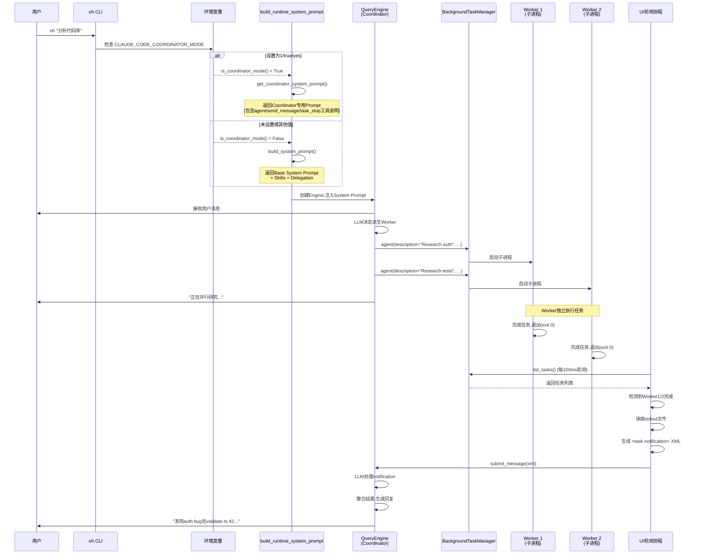
```mermaid
sequenceDiagram
    participant User as 用户
    participant CLI as oh CLI
    participant Env as 环境变量
    participant Prompt as build_runtime_system_prompt
    participant Engine as QueryEngine<br/>(Coordinator)
    participant TaskMgr as BackgroundTaskManager
    participant Worker1 as Worker 1<br/>(子进程)
    participant Worker2 as Worker 2<br/>(子进程)
    participant Polling as UI轮询协程
    
    User->>CLI: oh "分析代码库"
    CLI->>Env: 检查 CLAUDE_CODE_COORDINATOR_MODE
    alt 设置为1/true/yes
        Env-->>Prompt: is_coordinator_mode() = True
        Prompt->>Prompt: get_coordinator_system_prompt()
        Note over Prompt: 返回Coordinator专用Prompt<br/>(包含agent/send_message/task_stop工具说明)
    else 未设置或其他值
        Env-->>Prompt: is_coordinator_mode() = False
        Prompt->>Prompt: build_system_prompt()
        Note over Prompt: 返回Base System Prompt<br/>+ Skills + Delegation
    end
    
    Prompt->>Engine: 创建Engine,注入System Prompt
    Engine->>User: 接收用户消息
    Engine->>Engine: LLM决定派生Worker
    Engine->>TaskMgr: agent(description="Research auth", ...)
    TaskMgr->>Worker1: 启动子进程
    Engine->>TaskMgr: agent(description="Research tests", ...)
    TaskMgr->>Worker2: 启动子进程
    Engine->>User: "正在并行研究..."
    
    Note over Worker1,Worker2: Worker独立执行任务
    
    Worker1->>Worker1: 完成任务,退出(exit 0)
    Worker2->>Worker2: 完成任务,退出(exit 0)
    
    Polling->>TaskMgr: list_tasks() (每100ms轮询)
    TaskMgr-->>Polling: 返回任务列表
    Polling->>Polling: 检测到Worker1/2完成
    Polling->>Polling: 读取stdout文件
    Polling->>Polling: 生成 <task-notification> XML
    Polling->>Engine: submit_message(xml)
    
    Engine->>Engine: LLM处理notification
    Engine->>Engine: 整合结果,生成回复
    Engine->>User: "发现auth bug在validate.ts:42..."
```

##### **发现4: oh的动态Prompt更新**

oh在REPL模式下,**不会**像Gateway那样动态更新Prompt:

```python
# ohmo/gateway/runtime.py:120, 145 (ohmo特有)
bundle.engine.set_system_prompt(
    self._runtime_system_prompt(bundle, latest_user_prompt)
)

# oh 没有这段代码,Session期间Prompt固定
```

这意味着:
- ❌ oh**不支持**运行时修改CLAUDE.md后立即生效
- ❌ oh**不支持**运行时修改Memory后立即生效
- ✅ 需要**重启会话**才能应用新的Prompt配置

---

### 9.9 设计哲学对比

#### **OpenHarness CLI (`oh`)的设计思路**:
1. **标准化优先**: 统一的 `build_runtime_system_prompt()` 函数
2. **功能完整**: 支持Coordinator/Skills/Delegation/CLAUDE.md/Memory
3. **灵活性**: 通过环境变量和配置文件动态调整行为
4. **项目级聚焦**: 关注当前项目的上下文和记忆

#### **ohmo的设计思路**:
1. **个性化优先**: 自定义的 `build_ohmo_system_prompt()` 函数
2. **简化组装**: 不注入Skills/Delegation/CLAUDE.md
3. **长期助手**: 强调跨会话的Soul/Identity/User/Memory
4. **IM渠道集成**: 通过Gateway对接Telegram/Slack等

#### **两者对比**:

| 维度 | OpenHarness CLI (`oh`) | ohmo |
|------|----------------------|------|
| **定位** | 通用开发助手 | 个人长期助手 |
| **Prompt策略** | 标准化+项目级 | 个性化+用户级 |
| **多智能体** | ✅ Coordinator模式 | ❌ 不支持 |
| **Skills** | ✅ 自动注入 | ❌ 不注入 |
| **Delegation** | ✅ 自动注入 | ❌ 不注入 |
| **CLAUDE.md** | ✅ 自动加载 | ❌ 不加载 |
| **Soul/Identity** | ❌ 不支持 | ✅ 核心特性 |
| **User Profile** | ❌ 不支持 | ✅ 核心特性 |
| **Memory类型** | 项目级Memory | 个人Memory |
| **动态更新** | ❌ 需重启会话 | ✅ Gateway热更新 |
| **交互方式** | CLI命令行 | IM渠道 (Telegram/Slack等) |

---

## 10. 与 OpenHarness 的边界

| 能力 | 归属 |
|------|------|
| Agent 循环、流式工具调用、权限、MCP、压缩 | **OpenHarness 核心** |
| `~/.ohmo` 工作区、soul/user/memory、IM Gateway | **ohmo 应用层** |
| 默认 `oh` 会话目录（如 `~/.openharness/data/sessions/...`） | **OpenHarness CLI**，与 ohmo 会话根 **分离** |
| **Base System Prompt** (工具使用/权限管理/压缩机制) | **OpenHarness 核心** (`get_base_system_prompt()`) |
| **个性化Prompt** (Soul/Identity/User/Memory) | **ohmo 应用层** (`build_ohmo_system_prompt()`) |

**关键结论**: ohmo **完全继承** OpenHarness 的系统 Prompt 体系，并在其基础上添加个性化层，两者是**叠加关系**而非替代关系。启动与进程边界见 [§1.1–§1.3](#11-与-oh-的关系)（**ohmo 不 spawn `oh`**；Channel 仅 Gateway 接线）。

---

## 11. 本工作区快照说明

若 `ohmo/` 下除 `cli.py`、`session_storage.py` 外缺少 `gateway/`、`runtime/`、`workspace/` 等包，则 **`uv run ohmo` 会在 import 阶段失败**。此时请使用 **完整上游克隆** 或从发布 wheel 安装后再阅读本文与 `DEV_SOURCE_RUN.md`。

---
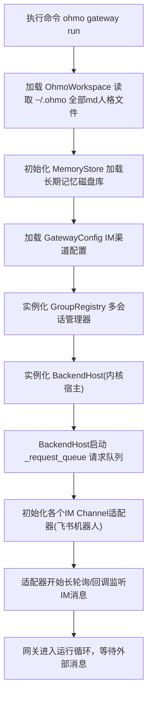
```mermaid
graph TD
    A["执行命令 ohmo gateway run"]
    B["加载 OhmoWorkspace 读取 ~/.ohmo 全部md人格文件"]
    C["初始化 MemoryStore 加载长期记忆磁盘库"]
    D["加载 GatewayConfig IM渠道配置"]
    E["实例化 GroupRegistry 多会话管理器"]
    F["实例化 BackendHost(内核宿主)"]
    G["BackendHost启动 _request_queue 请求队列"]
    H["初始化各个IM Channel适配器(飞书机器人)"]
    I["适配器开始长轮询/回调监听IM消息"]
    J["网关进入运行循环，等待外部消息"]

    A --> B
    B --> C
    C --> D
    D --> E
    E --> F
    F --> G
    G --> H
    H --> I
    I --> J
```
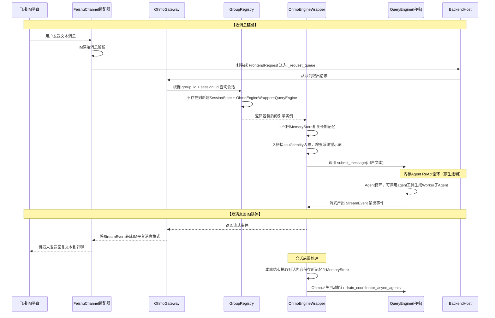
```mermaid
sequenceDiagram
    participant IM as 飞书IM平台
    participant CH as FeishuChannel适配器
    participant GW as OhmoGateway
    participant GR as GroupRegistry
    participant WRAP as OhmoEngineWrapper
    participant ENG as QueryEngine(内核)
    participant BT as BackendHost

    Note over IM,BT: 【收消息链路】
    IM->>CH: 用户发送文本消息
    CH->>CH: IM原始消息解析
    CH->>BT: 封装成 FrontendRequest 送入 _request_queue
    BT->>GW: 从队列取出请求
    GW->>GR: 根据 group_id + session_id 查询会话
    GR->>GR: 不存在则新建SessionState + OhmoEngineWrapper+QueryEngine
    GR-->>WRAP: 返回包装后的引擎实例

    WRAP->>WRAP: 1.召回MemoryStore相关长期记忆
    WRAP->>WRAP: 2.拼接soul/identity人格，增强系统提示词
    WRAP->>ENG: 调用 submit_message(用户文本)

    Note over ENG,BT: 内核Agent ReAct循环（原生逻辑）
    ENG->>ENG: Agent循环，可调用agent工具生成Worker子Agent
    ENG->>WRAP: 流式产出 StreamEvent 输出事件

    Note over IM,BT: 【发消息回IM链路】
    WRAP-->>GW: 返回流式事件
    GW-->>CH: 将StreamEvent转成IM平台消息格式
    CH-->>IM: 机器人发送回复文本到群聊

    Note over WRAP,WRAP: 会话后置处理
    WRAP->>WRAP: 本轮结束抽取对话内容保存新记忆至MemoryStore
    WRAP->>ENG: Ohmo网关自动执行 drain_coordinator_async_agents
```
```mermaid
Lexical error on line 7. Unrecognized text.
...d    subgraph Ohmo‑网关应用层【新增上层实体】
---------------------^
```
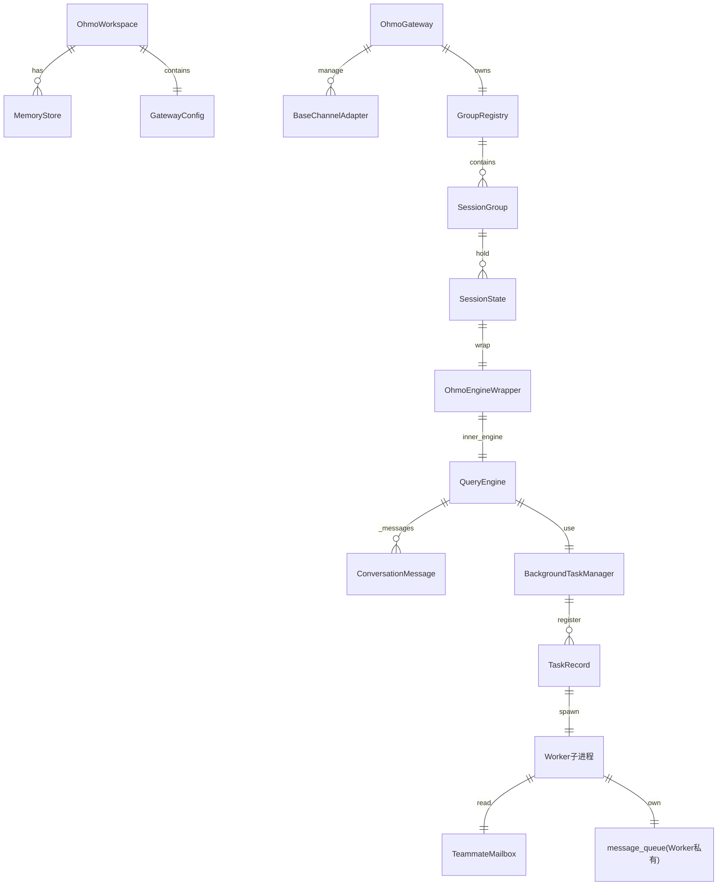
```mermaid
erDiagram
    OhmoWorkspace ||--o{ MemoryStore : has
    OhmoWorkspace ||--|| GatewayConfig : contains
    OhmoGateway ||--o{ BaseChannelAdapter : manage
    OhmoGateway ||--|| GroupRegistry : owns
    GroupRegistry ||--o{ SessionGroup : contains
    SessionGroup ||--o{ SessionState : hold
    SessionState ||--|| OhmoEngineWrapper : wrap
    OhmoEngineWrapper ||--|| QueryEngine : inner_engine

    QueryEngine ||--o{ ConversationMessage : _messages
    QueryEngine ||--|| BackgroundTaskManager : use
    BackgroundTaskManager ||--o{ TaskRecord : register
    TaskRecord ||--|| "Worker子进程" : spawn
    "Worker子进程" ||--|| TeammateMailbox : read
    "Worker子进程" ||--|| "message_queue(Worker私有)" : own
```

```mermaid
graph TD
    subgraph IM_Platform["IM Platform Layer"]
        FEISHU["Feishu Bot"]
        SLACK["Slack Bot"]
        TG["Telegram Bot"]
    end

    subgraph Ohmo_Gateway_Service["Ohmo Gateway Service Layer"]
        GW_SERVICE["GatewayService<br/>Top‑level startup service"]
        CHANNEL_MGR["ChannelManager<br/>Channel lifecycle manager"]
        BASE_CH["BaseChannelAdapter<br/>Adapter base class"]
        FEISHU_CH["FeishuChannel<br/>Concrete channel impl"]
        GATEWAY_CFG["GatewayConfig<br/>IM token,whitelist config"]
        
        OHMO_WS["OhmoWorkspace<br/>Agent workspace (~/.ohmo)"]
        MEM_STORE["MemoryStore<br/>Long‑term memory storage"]
        GROUP_REG["GroupRegistry<br/>Multi‑session core manager"]
        SESSION_GROUP["SessionGroup<br/>Group container"]
        SESSION_STATE["SessionState<br/>Single session runtime state"]
        WRAPPER["OhmoEngineWrapper<br/>Agent outer wrapper"]
    end

    subgraph OpenHarness_Kernel["OpenHarness Kernel Runtime Layer"]
        BH_HOST["BackendHost<br/>Request queue & stdin host"]
        FRONT_REQ["FrontendRequest<br/>Unified request object"]
        Q_ENG["QueryEngine<br/>Main coordinator agent"]
        CONV_MSG["ConversationMessage<br/>Chat message entity"]
        TASK_MGR["BackgroundTaskManager<br/>Async task scheduler"]
        TASK_REC["TaskRecord<br/>Background task metadata"]
        WORKER_PROC["Worker Subprocess<br/>Sub‑agent runtime"]
        MAILBOX["TeammateMailbox<br/>Down‑stream disk inbox"]
        WORKER_QUEUE["message_queue<br/>Worker private memory queue"]
        SESSION_BACK["SessionBackend<br/>Session snapshot persistence"]
    end

    %% Channel lifecycle
    FEISHU --> FEISHU_CH
    SLACK --> BASE_CH
    TG --> BASE_CH
    GW_SERVICE --> CHANNEL_MGR
    CHANNEL_MGR --> FEISHU_CH
    CHANNEL_MGR --> BASE_CH
    GW_SERVICE --> GATEWAY_CFG

    %% Gateway to session
    GW_SERVICE --> OHMO_WS
    OHMO_WS --> MEM_STORE
    GW_SERVICE --> GROUP_REG
    GROUP_REG --> SESSION_GROUP
    SESSION_GROUP --> SESSION_STATE
    SESSION_STATE --> WRAPPER

    %% Wrapper to kernel
    WRAPPER --> Q_ENG
    FEISHU_CH --> FRONT_REQ
    FRONT_REQ --> BH_HOST
    BH_HOST --> GW_SERVICE

    %% Coordinator‑Worker async chain
    Q_ENG --> CONV_MSG
    Q_ENG --> TASK_MGR
    TASK_MGR --> TASK_REC
    TASK_REC --> WORKER_PROC
    WORKER_PROC --> MAILBOX
    WORKER_PROC --> WORKER_QUEUE
    Q_ENG --> SESSION_BACK
```
```mermaid
erDiagram
    GatewayService ||--|| ChannelManager : owns
    ChannelManager ||--o{ BaseChannelAdapter : manage
    BaseChannelAdapter ||--|| GatewayConfig : read
    
    OhmoWorkspace ||--o{ MemoryStore : has
    OhmoWorkspace ||--|| GatewayConfig : contains
    
    GatewayService ||--|| GroupRegistry : owns
    GroupRegistry ||--o{ SessionGroup : contains
    SessionGroup ||--o{ SessionState : hold
    SessionState ||--|| OhmoEngineWrapper : wrap
    
    OhmoEngineWrapper ||--|| QueryEngine : inner_engine
    QueryEngine ||--o{ ConversationMessage : messages
    QueryEngine ||--|| BackgroundTaskManager : use
    
    BackgroundTaskManager ||--o{ TaskRecord : register
    TaskRecord ||--|| WorkerSubprocess : spawn
    WorkerSubprocess ||--|| TeammateMailbox : read
    WorkerSubprocess ||--|| MessageQueue : consume
    QueryEngine ||--|| SessionBackend : persist_snapshot
```
```mermaid
sequenceDiagram
    participant CLI as Command‑Line Entry
    participant GS as GatewayService
    participant CM as ChannelManager
    participant FC as FeishuChannel
    participant OW as OhmoWorkspace
    participant GR as GroupRegistry
    participant BH as BackendHost

    Note over CLI,BH: Gateway startup flow
    CLI->>GS: ohmo gateway run
    GS->>OW: load OhmoWorkspace, persona & memory
    GS->>GR: init GroupRegistry multi‑session manager
    GS->>BH: start BackendHost, create request queue
    GS->>CM: create ChannelManager
    CM->>CM: load GatewayConfig IM settings
    CM->>FC: instantiate FeishuChannel
    FC->>FC: connect IM websocket / callback server
    FC-->>CM: channel started ok
    CM-->>GS: all channels online
    GS->>GS: enter idle loop, wait for incoming IM request
```
```mermaid
sequenceDiagram
    participant IM as Feishu IM
    participant FC as FeishuChannel
    participant CM as ChannelManager
    participant GS as GatewayService
    participant GR as GroupRegistry
    participant WS as OhmoEngineWrapper
    participant BH as BackendHost
    participant QE as QueryEngine

    Note over IM,QE: Receive user message
    IM->>FC: User chat message event
    FC->>FC: Convert IM payload to FrontendRequest
    FC->>BH: Push FrontendRequest into request queue
    BH->>GS: Pop request from queue
    GS->>GR: Resolve group_id + session_id
    GR->>GR: Get or create SessionState & wrapper
    GR-->>WS: Return OhmoEngineWrapper instance
    
    WS->>WS: Recall MemoryStore long‑term memory
    WS->>WS: Build persona enhanced system prompt
    WS->>QE: submit_message(user_text)

    Note over QE,QE: Agent ReAct loop, spawn worker if needed

    Note over IM,QE: Reply stream back to IM
    QE-->>WS: Yield StreamEvent
    WS-->>GS: Forward stream events
    GS-->>CM: Route output event
    CM-->>FC: Deliver to target channel
    FC-->>IM: Send bot reply message
    
    Note over WS,WS: Post‑processing
    WS->>WS: Save new memory records
    WS->>QE: Auto‑run drain_coordinator_async_agents
```
```mermaid
sequenceDiagram
  autonumber
  participant Operator as 运维人员
  participant CLI as 命令行 ohmo gateway run
  participant GWSvc as OhmoGatewayService
  participant WS as Workspace(~/.ohmo)
  participant Bus as MessageBus
  participant ChMgr as ChannelManager
  participant Bridge as OhmoGatewayBridge
  participant RuntimePool as OhmoSessionRuntimePool
  participant TelegramCh as TelegramChannel
  participant IMUser as IM终端用户
  participant QE as QueryEngine(Bundle)

%% ========== 阶段 1：网关启动初始化 ==========
  rect rgb(242,248,255)
    Note over Operator,QE:阶段1：网关进程启动 & 资源初始化
    Operator->>CLI: ohmo gateway run
    CLI->>GWSvc: 实例化 OhmoGatewayService
    GWSvc->>WS: initialize_workspace()<br/>load_gateway_config(gateway.json)
    GWSvc->>GWSvc: 设置 OHMO_WORKSPACE 环境变量
    GWSvc->>Bus: MessageBus() 创建消息总线
    GWSvc->>ChMgr: ChannelManager(config, bus)
    GWSvc->>RuntimePool: OhmoSessionRuntimePool(...)
    GWSvc->>Bridge: OhmoGatewayBridge(bus,runtime_pool)
    CLI->>GWSvc: asyncio.run(run_foreground())
    GWSvc->>WS: 写入 gateway.pid, state.json(running=true)
    par 并行启动3个常驻后台协程
      GWSvc->>Bridge: create_task(bridge.run())<br/>【入站消息消费者】
      GWSvc->>ChMgr: create_task(ChMgr.start_all_channels())
      GWSvc->>GWSvc: create_task(state_heartbeat,5s心跳)
    end
    Note over ChMgr,TelegramCh: start_all_channels 内部执行
    ChMgr->>ChMgr: create_task(_dispatch_outbound)<br/>【出站消息常驻消费协程】
    ChMgr->>TelegramCh: TelegramChannel.start()<br/>长连接/Webhook注册到IM平台
    TelegramCh-->>ChMgr: channel ready就绪回调
    Note over Bridge,TelegramCh:系统就绪
    Note over Bridge,TelegramCh: Bridge:阻塞等待入站消息<br/>_dispatch_outbound:监听出站总线事件<br/>RuntimePool:无引擎实例，懒加载
  end

%% ========== 阶段 2：单条用户消息完整收发链路 ==========
  rect rgb(255,250,240)
    Note over Operator,QE:阶段2：IM用户发送消息完整流转
    IMUser->>TelegramCh: 用户输入文本消息
    TelegramCh->>TelegramCh: 解析报文提取 chat_id,text,metadata
    TelegramCh->>Bus: publish_inbound(InboundMessage)
    Bridge->>Bus: consume_inbound() 获取入站消息
    Bridge->>Bridge: session_key = chat_id+thread_id
    Bridge->>RuntimePool: 查询该session_key是否存在活跃任务
    alt 会话存在未完成旧任务
      Bridge->>RuntimePool: task.cancel() 终止上一轮agent
      Bridge->>Bus: publish_outbound("⏹️已停止上一条任务")
    end
    Bridge->>RuntimePool: stream_message(payload,session_key)
    alt 首次访问，内存无Bundle会话
      RuntimePool->>RuntimePool: load_latest_for_session_key()<br/>从SessionBackend加载会话快照
      RuntimePool->>RuntimePool: build_ohmo_system_prompt()
      RuntimePool->>QE: start_runtime(bundle) 创建QueryEngine
    else 会话Bundle已在内存缓存
      RuntimePool->>RuntimePool: build_ohmo_system_prompt()<br/>每次交互动态生成提示词
    end
    RuntimePool->>QE: submit_message(user_text)
    loop Agent流式输出循环 ReAct
      QE-->>RuntimePool: 推送 StreamEvent
      RuntimePool-->>Bridge: GatewayStreamUpdate
      Bridge->>Bus: publish_outbound(OutboundMessage)
    %% 后台常驻协程 _dispatch_outbound异步消费总线
      ChMgr->>TelegramCh: channel.send(message)
      TelegramCh->>IMUser: 返回agent回复文本
    end
    Note over RuntimePool,QE: Agent主循环结束，后置处理子任务回填
    RuntimePool->>QE: drain_coordinator_async_agents()<br/>轮询完成的Worker,注入task‑notification
  end
```
```mermaid
flowchart TD
    A[运维执行<br/>ohmo gateway run] --> B[OhmoGatewayService启动]
    B --> C[加载Workspace & gateway.json配置]
    C --> D[实例化核心基础设施<br/>MessageBus + ChannelManager + RuntimePool + Bridge]
    D --> E[启动3条常驻协程]
    E --> E1[Bridge.run:消费入站消息]
    E --> E2[ChannelManager.start_all_channels]
    E --> E3[心跳任务 heartbeat]

    E2 --> F[启动出站分发协程 _dispatch_outbound]
    F --> G[各个Channel适配器启动长连接<br/>向IM平台注册Webhook/websocket]
    G --> H[网关就绪 · 空闲等待IM事件]

    %% 消息收发分支
    H --> I[IM用户发送消息]
    I --> J[Channel解析消息 → publish_inbound送入总线]
    J --> K[Bridge消费消息,生成session_key]
    K --> L{同session存在活跃任务?}
    L --是--> M[取消旧任务 + 推送停止通知]
    L --否--> N[RuntimePool处理消息]
    M --> N
    N --> O{会话Bundle是否缓存?}
    O --否--> P[加载会话快照+新建QueryEngine Bundle]
    O --是--> Q[复用现有Bundle]
    P --> R[submit_message进入Agent ReAct循环]
    Q --> R
    R --> S[Agent流式产出StreamEvent]
    S --> T[包装GatewayStreamUpdate→发布出站总线]
    T --> U[_dispatch_outbound消费出站事件→Channel发送IM回复]
    U --> V[Agent结束后执行drain<br/>回填worker子任务通知]
```
## 12. 参考索引

- [BACKEND_HOST_ARCHITECTURE.md](./BACKEND_HOST_ARCHITECTURE.md) — BackendHost、`oh` / `ohmo` 后端子进程  
- [DEV_SOURCE_RUN.md](./DEV_SOURCE_RUN.md) — 从源码跑 `oh` / `ohmo`
- `ohmo/cli.py` — CLI 与向导逻辑  
- `ohmo/session_storage.py` — 会话文件格式与 `SessionBackend` 实现  

