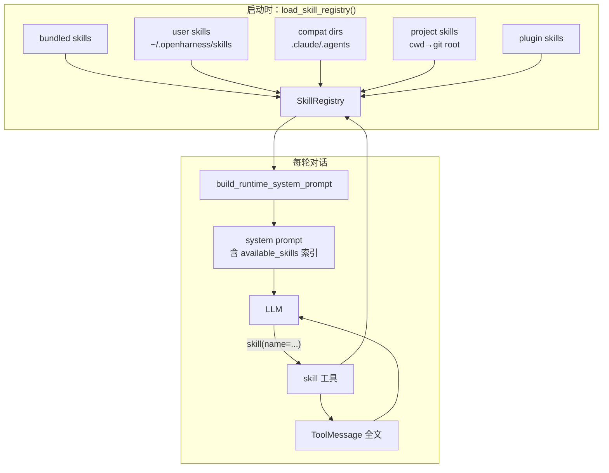
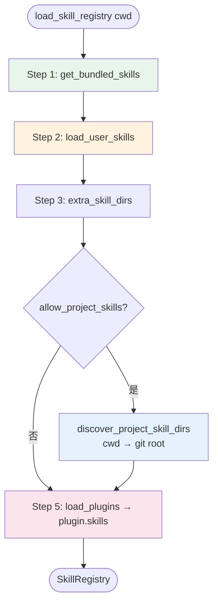
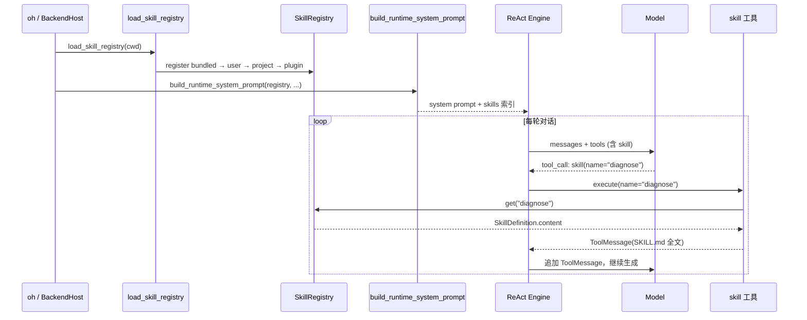

# OpenHarness Skills 运行时（源码级完整版）

> **版本**: 1.0（非摘要）  
> **包版本**: `openharness-ai` 0.1.9  
> **注意**：[guides/deepagents-skills.md](./guides/deepagents-skills.md) 描述 **DeepAgents** `SkillsMiddleware`，**不是** OpenHarness。

> **设计原则**：OpenHarness **没有** LangChain 式 `SkillsMiddleware`。Skills 通过 **Prompt 索引 + `skill` 工具按需加载** 实现，避免每次把全部 SKILL.md 塞进 system prompt。

---

## 📋 目录

1. [架构概览](#1-架构概览)
2. [Skill 加载管线](#2-skill-加载管线)
3. [Prompt 注入机制](#3-prompt-注入机制)
4. [运行时执行时序](#4-运行时执行时序)
5. [与 DeepAgents 对比](#5-与-deepagents-对比)
6. [源码索引](#6-源码索引)

---

## 1. 架构概览



| 阶段 | 组件 | 职责 |
|------|------|------|
| 启动 | `load_skill_registry()` | 扫描多来源，构建 `SkillRegistry` |
| Prompt 组装 | `build_runtime_system_prompt()` | 注入 `<available_skills>` XML 索引（仅 name + description） |
| 按需加载 | `skill` 工具（`tools/skill_tool.py`） | 模型调用时读取 SKILL.md **全文** |
| 后续轮次 | ToolMessage | skill 内容进入对话历史，供模型执行 |

---

## 2. Skill 加载管线

**入口**: `src/openharness/skills/loader.py` → `load_skill_registry()`

### 2.1 加载顺序与覆盖规则



**后注册覆盖先注册**（同名 skill 静默覆盖，无警告）：

| 顺序 | 来源 | 路径 | `source` 标签 |
|------|------|------|---------------|
| 1 | Bundled | `src/openharness/skills/bundled/` | `bundled` |
| 2 | User | `get_user_skills_dir()` → `{config_dir}/skills/` | `user` |
| 3 | 兼容目录 | `~/.claude/skills`, `~/.agents/skills` | `user` |
| 4 | Extra dirs | CLI `--skill-dir` 等 | `user` |
| 5 | Project | 从 `cwd` 向上到 git root：`.openharness/skills` 等 | `project` |
| 6 | Plugin | 已启用 plugin 的 `plugin.skills` | `plugin` |

> **路径纠正**：用户 skills 目录为 `get_config_dir() / "skills"`（默认 `~/.openharness/skills`），**不是** `~/.openharness/config/skills/`。

### 2.2 `discover_project_skill_dirs` 逻辑

```python
# loader.py — 从 cwd 向上遍历到 git root（或 home 边界）
_DEFAULT_PROJECT_SKILL_DIRS = (
    ".openharness/skills",
    ".agents/skills",
    ".claude/skills",
)
```

- 目录按 **least-specific → most-specific** 排序，后加载覆盖先加载
- 仅注册**已存在**的目录（`create_missing=False`）

### 2.3 `SkillRegistry`

**位置**: `skills/registry.py`

```python
class SkillRegistry:
    def __init__(self) -> None:
        self._skills: dict[str, SkillDefinition] = {}

    def register(self, skill: SkillDefinition) -> None:
        self._skills[skill.name] = skill  # 同名覆盖

    def get(self, name: str) -> SkillDefinition | None: ...
    def list_skills(self) -> list[SkillDefinition]: ...  # 按 name 排序
```

### 2.4 `SkillDefinition` 元数据解析

**位置**: `skills/_frontmatter.py`

1. **YAML frontmatter 优先**（`---` 块中的 `name` / `description`）
2. **降级**：第一个 `# Heading` 作 name，第一段正文作 description（≤200 字符）
3. 解析失败不抛错，使用目录名作默认 name

---

## 3. Prompt 注入机制

**位置**: `prompts/context.py` → `build_runtime_system_prompt()`

### 3.1 索引 vs 全文

| 内容 | 注入时机 | 大小 |
|------|----------|------|
| Skill **索引**（name + description） | 每轮 system prompt | O(skills 数量) |
| Skill **全文**（SKILL.md body） | 模型调用 `skill` 工具后 | 仅被请求的 skill |

### 3.2 `<available_skills>` XML 结构（示意）

```xml
<available_skills>
  <skill>
    <name>python-testing</name>
    <description>Best practices for pytest and unit tests</description>
  </skill>
  <skill>
    <name>diagnose</name>
    <description>Diagnose agent run failures</description>
  </skill>
  ...
</available_skills>
```

模型根据任务选择 `skill(name="python-testing")` 加载完整工作流说明。

### 3.3 与 Plugin / MCP 的共存

`build_runtime_system_prompt()` 同时组装：
- 系统指令
- 可用 skills 索引
- Plugin 提供的额外 context
- 工作目录 / 环境信息

（完整字段列表见 `ARCHITECTURE_SKILLS_PLUGINS.md` §4 与 `ARCHITECTURE_PROMPTS.md`）

---

## 4. 运行时执行时序



### 4.1 `skill` 工具行为

**位置**: `tools/skill_tool.py`

| 输入 | 行为 |
|------|------|
| `name` | 从 `SkillRegistry` 查找 |
| 找到 | 返回 SKILL.md 完整内容（含 frontmatter 后的正文） |
| 未找到 | 返回错误 ToolMessage，列出可用 skill 名 |

### 4.2 典型调用链（Coordinator 模式）

```text
oh --backend-only 或 TUI
  → BackendHost 初始化
  → load_skill_registry(cwd=project_root)
  → Engine 绑定 tools（含 skill）
  → 用户输入
  → build_runtime_system_prompt() 每轮或首轮
  → LLM 可能 multi-step：先 skill() 读说明，再 bash/read/write 执行
```

---

## 5. 与 DeepAgents 对比

| 维度 | OpenHarness | DeepAgents |
|------|-------------|------------|
| 注入方式 | Prompt **索引** + `skill` 工具**按需**读全文 | `SkillsMiddleware.before_agent` 把 skills 列表/内容注入 system |
| 中间件 | **无** SkillsMiddleware | `SkillsMiddleware` 在 middleware 链中 |
| 存储路径 | `~/.openharness/skills` + project dirs | `backend` + `sources` 参数 |
| Token 策略 | 默认省 token（仅索引在 system） | 可配置全量或摘要注入 |
| 工具名 | `skill` | 无独立工具；内容在 middleware 阶段注入 |

---

## 6. 源码索引

| 符号 | 文件 | 说明 |
|------|------|------|
| `load_skill_registry` | `skills/loader.py` | 主加载入口 |
| `get_user_skills_dir` | `skills/loader.py` | `get_config_dir()/skills` |
| `discover_project_skill_dirs` | `skills/loader.py` | 项目目录发现 |
| `get_bundled_skills` | `skills/bundled/__init__.py` | 内置 skills |
| `SkillRegistry` | `skills/registry.py` | 注册表 |
| `SkillDefinition` | `skills/types.py` | 数据结构 |
| `parse_skill_frontmatter` | `skills/_frontmatter.py` | 元数据解析 |
| `build_runtime_system_prompt` | `prompts/context.py` | Prompt 组装 |
| `skill` 工具 | `tools/skill_tool.py` | 按需加载 |

**延伸阅读**（更长的插件/MCP/权限设计）：
- [ARCHITECTURE_SKILLS_PLUGINS.md](./ARCHITECTURE_SKILLS_PLUGINS.md)（2300+ 行）
- [ARCHITECTURE_PROMPTS.md](./ARCHITECTURE_PROMPTS.md) §4 动态注入

---

**最后更新**: 2026-06-01
