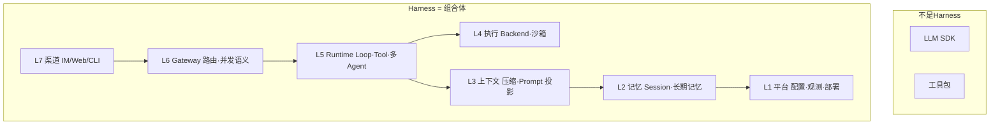
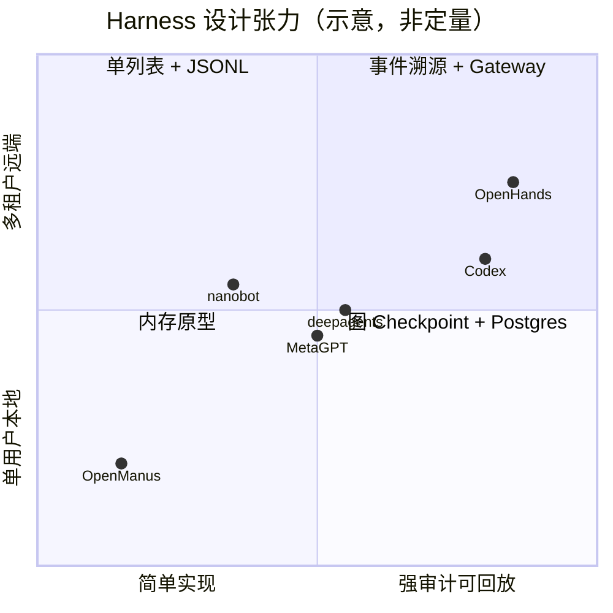
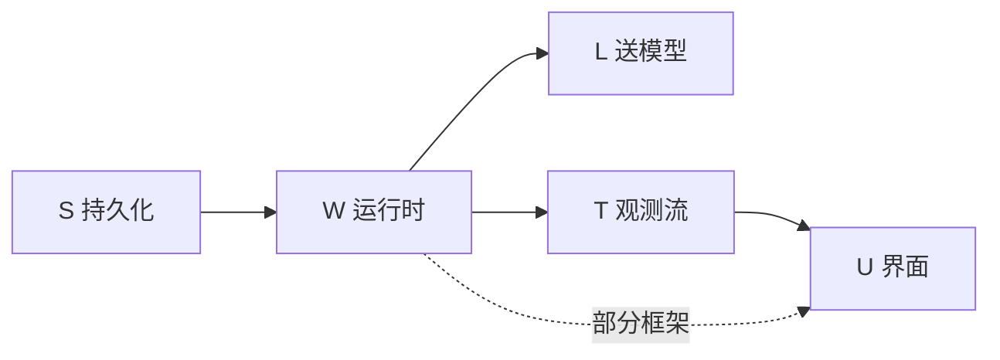
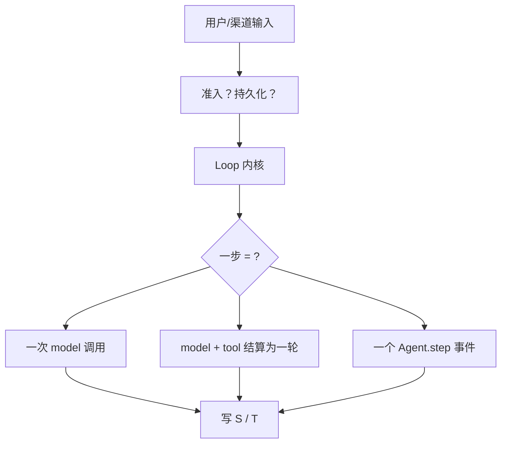
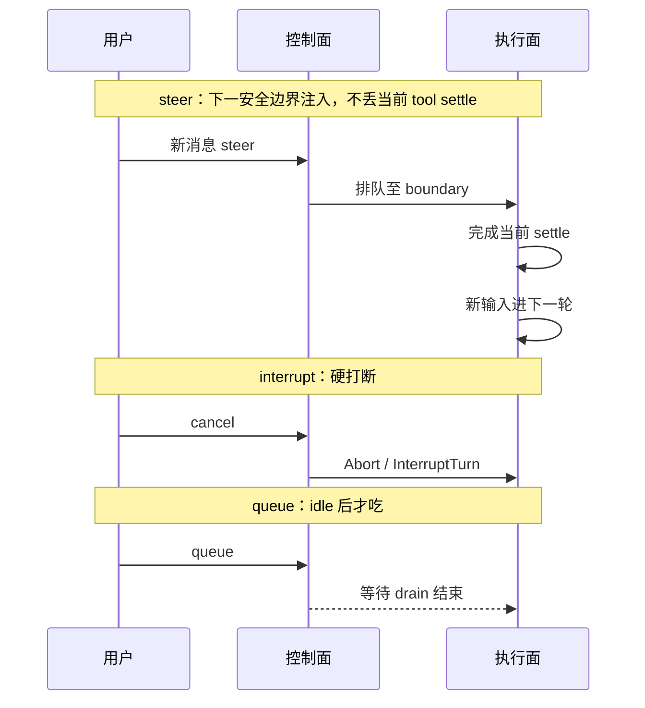
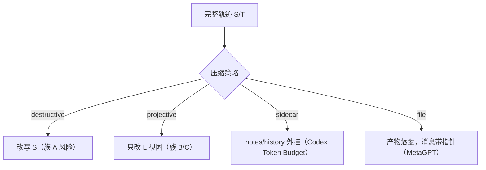
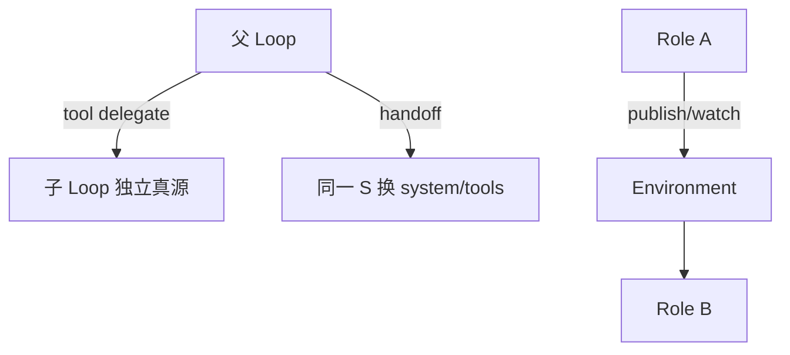

# Harness 设计思想导读

> **阅读方式**：先读本导读（~45 分钟）→ [HARNESS-SPECTRUM.md](./HARNESS-SPECTRUM.md) → 按需跳专题  
> **写法标准**：[PROGRESSIVE_ARCH_DOC_METHODOLOGY](../../agent-doc-template/PROGRESSIVE_ARCH_DOC_METHODOLOGY.md) · [Pi 导读](../../../pi/docs/DESIGN_THINKING_SERIES.md)  
> **本目录定位**：对比各 Agent **Harness 的设计取舍**，不是罗列仓库路径。

---

## 先回答：Harness 到底是什么

**一句话**：Harness = 把「模型 + 工具 + 记忆 + 权限 + 渠道」粘成 **可长期运行、可恢复、可接入多终端** 的产品内核。

它不是下面任何一项单独存在：

| 概念 | 只管什么 | 典型缺口 |
|------|----------|----------|
| **LLM SDK** | 调模型、流式 | 无会话、无工具治理 |
| **Tool 库** | 单次副作用 | 无 loop、无持久化 |
| **Agent 框架** | 一轮 loop 或图 | 常无 Gateway、无渠道 |
| **Harness** | 端到端 **运行契约** | 你要自己定义范围 |



**校正**：很多项目 **名字叫 framework**，但选型时要问的是——它覆盖了 Harness 的哪几层、哪几层留给你自己做。

---

## 第 1 步：五个设计张力（所有 Harness 都在权衡）

任何架构选择，几乎都可以还原成下面五组张力：



| 张力 | 左端 | 右端 | 选错的症状 |
|------|------|------|------------|
| **真源复杂度** | 一条 messages 列表 | append-only 事件流 | 压缩后无法审计；或实现拖死 |
| **投影分离度** | UI = 模型所见 | L / T / U 显式分裂 | token 爆炸；或 UI 与模型互相污染 |
| **控制 vs 执行** | 同进程同函数 | 准入与 Drain 分离 | steer 丢消息；或恢复困难 |
| **自主 vs 可控** | 全自动 loop | 多层 HITL + 沙箱 | 误删仓库；或产品难用 |
| **编排形态** | 单 brain ReAct | 多 Role / 图 / 公司 | 简单任务过重；或复杂任务编排不动 |

导读后文按 **真源 → 运行时 → 并发 → 多 Agent → 安全** 展开；各框架落在哪一格见 [HARNESS-SPECTRUM.md](./HARNESS-SPECTRUM.md)。

---

## 第 2 步：五平面 — 同一条对话的五种「真相」

> 展开版：[21-session-message-architecture.md](./21-session-message-architecture.md)（本篇已去掉路径堆砌，保留设计骨架）

用户说「session、message、送给模型的、loop 记录、UI」——在工程里是 **五个平面**，不是一层。

| 平面 | 代号 | 问什么 |
|------|------|--------|
| **持久化 Session** | **S** | 崩溃后恢复什么 |
| **运行时 Working** | **W** | 本轮 loop 内存里握着什么 |
| **LLM 投影** | **L** | API 请求体里的 messages |
| **Loop / Trace** | **T** | 每步 tool、token、耗时 |
| **UI 展示** | **U** | 用户屏幕上看到什么 |



**Harness 设计的第一条铁律**：

> **S 是（或之一是）权威；L 是投影，不是 copy-paste S；T/U 可以比 L 更丰富。**

### 六族真源范式（选型用，不是项目清单）

| 族 | 真源形态 | 设计动机 | 代价 |
|----|----------|----------|------|
| **A 单列表** | `messages[]` / 表行 | 快、好懂 | 压缩改写 S 时丢审计 |
| **B 事件溯源** | append-only Event | Coding Agent 要逐步复盘 | 存储 + View 层成本 |
| **C 图 Checkpoint** | graph state blob | 与 LangGraph 生态一体 | S 与 L 易纠缠 |
| **D 双平面** | 控制面 SQL + 执行面 Event | SaaS 多租户 | 部署与一致性复杂 |
| **E CLI 黑盒** | 厂商 CLI 内会话 | 能力随厂商升级 | 不可自托管透明 |
| **F 流式事件优先** | AgentEvent 一等 | 交互式 UI、确认流 | Msg 与 Event 两套模型 |

**易错**：把「我们也有 messages 表」当成和 Codex Rollout 同一种设计——要问 **压缩改的是 S 还是只改 L 的视图**。

---

## 第 3 步：运行时 — Loop 是「一步」的契约

Loop 不是 `while True`，而是 **一步的边界** 决定了整个 Harness 的性格。



| Loop 哲学 | 一步的含义 | 适合的任务 | 代表气质 |
|-----------|------------|------------|----------|
| **Provider Turn** | 一次 API 调用 + 工具 settle 后再决定续跑 | 长 coding、要强审计 | Codex、OpenCode V2 |
| **ReAct 步** | think → act 为一 step | 原型、教学 | OpenManus、smolagents |
| **Middleware 超步** | 图上的 model 节点 + ToolNode | 可组合中间件 | deepagents、deer-flow |
| **Event Step** | Action → Observation | 环境交互仿真 | OpenHands |
| **外环 + 内环** | 外层 follow-up；内层 tool | 可 steer 的 CLI | Pi、Prime |

### 控制面 vs 执行面（现代 Harness 分水岭）

| | 控制面 | 执行面 |
|--|--------|--------|
| **职责** | 收输入、排队、点火、中断 | 采样、工具、压缩 |
| **典型** | Codex `submission_loop`、OpenCode admit、Pi `Agent` | `run_turn`、`Session Drain`、`runAgentLoop` |
| **为何分开** | 崩溃可恢复 inbox；并发语义清晰 |

**没有分开时**（经典 ReAct 单函数）：实现快，但 **steer / 多客户端 / 精确重试** 后期成本高。

→ 专题：[03-runtime-loop-queue.md](./03-runtime-loop-queue.md)（旧文含实现表，读 **§1–§2、§10 设计法则** 即可）  
→ 插队语义：[14-loop-interjection.md](./14-loop-interjection.md)

---

## 第 4 步：中途输入 — steer / queue / interrupt 不是同义词

Harness 产品感的 **一半** 在于：用户能在运行中改道吗？怎么改？



| 语义 | 用户期望 | 设计要点 |
|------|----------|----------|
| **steer** | 「插一句，但别乱刀当前工具」 | 安全边界 + 持久化 inbox |
| **queue** | 「等这轮完再说」 | idle 检测 + 单条推广 |
| **follow-up** | 「停了之后自动续」 | 外环队列（Pi followUpQueue） |
| **interrupt** | 「立刻停」 | ActiveTurn / generation 取消 |

对比时 **不要** 只看「能不能发第二条消息」——要看 **进的是 W、S 还是仅 T**。

---

## 第 5 步：上下文 — 压缩是策略，不是函数名

压缩在 Harness 里要解决三件事（常混为一谈）：

| 问题 | 手段 | 设计问题 |
|------|------|----------|
| **塞不进窗口** | 摘要 / 滑窗 / fresh window | 改 S 还是只改 L？ |
| **成本** | token budget、notes 外挂 | 模型可见 vs 磁盘存档 |
| **长期任务** | 分层记忆、history 归档 | 哪一层是第二知识源 |



→ 矩阵（实现向）：[07-compression.md](./07-compression.md) §1–§2  
→ 六层模型：[COMPRESSION_SCHEMES_COMPARISON.md](./COMPRESSION_SCHEMES_COMPARISON.md)

---

## 第 6 步：多 Agent — 四种协作哲学

| 模式 | 隐喻 | 状态谁持 | 典型代价 |
|------|------|----------|----------|
| **工具委托** | 父调 `task` 子 | 子独立 S/checkpoint | 回传摘要、文件锁 |
| **Handoff** | 换 brain | 会话链转移 | 上下文断裂需设计 |
| **角色公司** | PM→架构→工程 | 消息总线 + 文件 | 慢、难调试 |
| **固定图** | 节点即 Agent | 图 state | 改流程要改图 |



**硬规则（产品级）**：

1. 子 Agent **独立真源** 或明确子树，避免父子共用一个 W。  
2. 子结果 **压缩后** 回父，防 context 爆炸。  
3. 父 **规划权威** 不与子 todos 自动合并（deepagents 实证）。  
4. 子并发 **有上限**（~3），防成本与锁竞争。

→ [04-multi-agent.md](./04-multi-agent.md) 读 **范式表 + 设计规则**，跳过路径列。

---

## 第 7 步：安全 — Harness 管「动手」，不保证「看不见」

与 [Codex 安全导读](../../codex-architecture/SECURITY_ARCHITECTURE.md) 同构：

| 面 | 手段 |
|----|------|
| **控制面** | 沙箱、审批、ExecPolicy、工具面裁剪 |
| **数据面** | 有界注入、Hook、Plan 只读模式 |
| **扩展面** | MCP 安装门、Deferred 工具发现 |

**成熟度光谱**：`AskHuman` only（OpenManus）→ 四层管道（Codex）→ 事件溯源 + 远端沙箱（OpenHands）。

→ [02-harness-blueprint.md](./02-harness-blueprint.md) §10

---

## 第 8 步：七层蓝图 — 自建 Harness 时怎么拼

完整七层图见 [02-harness-blueprint.md](./02-harness-blueprint.md) §2。自建时推荐 **先定 S 族 + Loop 哲学 + 并发语义**，再选技术栈。

| 档位 | 真源 | Gateway | 适用 |
|------|------|---------|------|
| **A 个人本地** | JSONL / SQLite 单列表 | 无 | CLI、原型 |
| **B 团队远端** | Postgres + per-session 锁 | 必选 | 多用户 IM |
| **C 企业审计** | EventLog + 控制面 | + 沙箱池 | Coding Agent SaaS |

**反模式（设计级）**：

- 把 **L 当 S** — UI 列表直接喂模型  
- **无投影层** 做压缩 — 丢审计  
- **多副本 SQLite** 当 SessionDB  
- 默认 **全 shell** Backend  
- 子 Agent **共 W** 且无锁  

---

## 第 9 步：十条 Harness 设计原则（总结）

1. **先定五平面** — 弄清 S/W/L/T/U 谁权威，再写代码。  
2. **L 是投影** — 压缩、游标、system 块都是投影策略。  
3. **控制面与执行面分离** — 长期产品几乎必然走向分离。  
4. **一步的语义要写清** — Provider Turn vs ReAct step vs Event step。  
5. **中途输入是产品契约** — steer/queue/interrupt 要可解释。  
6. **多 Agent 先定真源边界** — 委托 vs handoff vs 公司总线。  
7. **安全默认 fail closed** — 工具副作用走硬门，不赌模型自觉。  
8. **扩展是供应链** — Skill/MCP 注册 ≠ 可见 ≠ 信任。  
9. **渠道在 L7** — Gateway 管并发，Loop 不管 IM 路由。  
10. **选型看族谱，不看 star 数** — 见 [HARNESS-SPECTRUM.md](./HARNESS-SPECTRUM.md)。

---

## 阅读路径（重组后）

```text
00 本文（设计思想）
  → HARNESS-SPECTRUM（框架落在哪一格）
  → 21 五平面 + 六族范式（持久化专题）
  → 02 七层蓝图（自建清单）
  → 03/04/05/22/06/07/14 专题（只读「横向对比」「设计法则」节）
  → 01/12/13 实现索引（改代码、查路径时再开）
```

---

## 相关文档

| 文档 | 何时读 |
|------|--------|
| [HARNESS-SPECTRUM.md](./HARNESS-SPECTRUM.md) | 框架族谱一张表 |
| [21-session-message-architecture.md](./21-session-message-architecture.md) | 五平面深潜 |
| [02-harness-blueprint.md](./02-harness-blueprint.md) | 自建模块清单 |
| [CROSS_AGENT_DESIGN_INDEX.md](../../CROSS_AGENT_DESIGN_INDEX.md) | 单项目循序渐进导读 |
