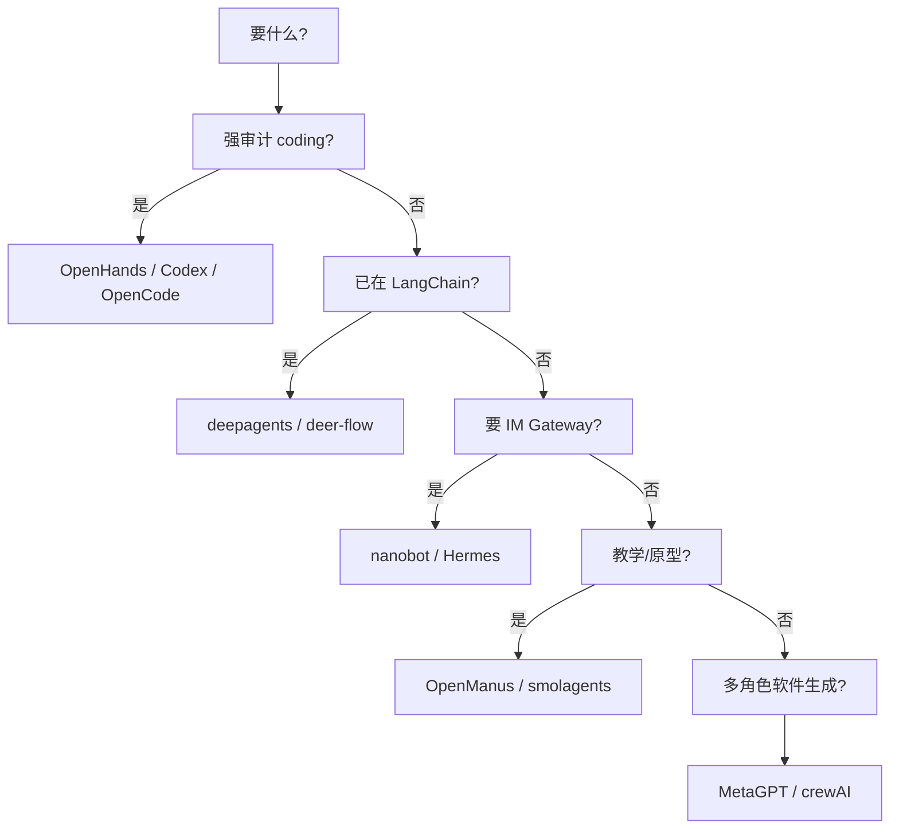

# 总览与选型

> **设计导读** · 实现级大矩阵与路径画像：[_archive/01-overview.md](./_archive/01-overview.md)  
> **应先读**：[00-HARNESS-DESIGN-PHILOSOPHY](./00-HARNESS-DESIGN-PHILOSOPHY.md) · [HARNESS-SPECTRUM](./HARNESS-SPECTRUM.md)

---

## 1. 本文档回答什么

| 读本文 | 不读本文 |
|--------|----------|
| Tier 1/2 **有哪些** | 函数在哪个 `.py` |
| **12 维设计矩阵** 一眼对照 | §13 逐项目画像 |
| **选型决策树** | 源码 walkthrough |

---

## 2. Tier 1 — 完整 Agent Harness（有明确 loop）

| 项目 | 编排气质 | 真源族 | 一句话 |
|------|----------|--------|--------|
| **Codex** | Provider Turn | B Rollout | 准入/Drain 分离，四层安全 |
| **OpenCode** | Provider Turn | B SQLite Event | Context Epoch |
| **Pi** | 双环 Agent/Loop | A/C JSONL | steering/follow-up |
| **Prime** | IPython 单工具 | A JSONL 树 | Daemon/Worker |
| **deepagents** | Middleware 图 | C checkpoint | `task` 子 Agent |
| **deer-flow** | 重 middleware | C + 目录 | memory.json |
| **OpenHarness** | ReAct QueryEngine | A session | 四层 compact |
| **Hermes** | ReAct + Gateway | A SQLite | 三层 MD |
| **nanobot** | Bus→Runner | A JSONL | Consolidator |
| **OpenHands** | Event step | B + D 双平面 | Condenser |
| **AgentScope v2** | ReAct + 事件 | F 事件优先 | 确认流 |
| **OpenManus** | ReAct / Flow | A 内存 | 教学内核 |
| **MetaGPT** | SOP 多 Role | A+文件 | 消息总线 |
| **OpenAI Agents SDK** | Turn + handoff | A run items | 轻量 SDK |
| **Claude Agent SDK** | CLI 黑盒 | E | 遥控 Claude Code |
| **crewAI** | Crew Task | A + Lance | 角色任务 |
| **smolagents** | 轻量 ReAct | 无 | 最小 loop |
| **AutoGen** | GroupChat | 共享 thread | 路由发言 |
| **Letta** | block 中心 | DB blocks | 记忆研究 |
| **LangGraph** | 图库 | C 可选 | 非开箱 harness |

### Tier 2（领域/较小）

TradingAgents、FastAgent、GenericAgent、DeepTutor、grok-build、openhuman、agentmemory 等 — 见 [HARNESS-SPECTRUM](./HARNESS-SPECTRUM.md) 或归档 §2.2。

---

## 3. 十二维设计矩阵（Tier 1 摘要）

| 维度 | 问什么 |
|------|--------|
| **D1 编排** | 图 / ReAct / Event / Bus |
| **D2 真源族** | A–F（见 [21](./21-session-message-architecture.md)） |
| **D3 控制/执行** | 是否 admit/Drain 分离 |
| **D4 压缩** | L1 策略（见 [07](./07-compression.md)） |
| **D5 Memory** | M1–M5 覆盖（见 [06](./06-memory.md)） |
| **D6 Plan** | ①②③ 哪条（见 [05](./05-plan-mode.md)） |
| **D6b Goal** | G1–G4 哪条（见 [22](./22-goal-mode.md)） |
| **D7 多 Agent** | MA1–MA8（见 [04](./04-multi-agent.md)） |
| **D8 工具/MCP** | 见 [08](./08-mcp.md) |
| **D9 沙箱** | 无/本地/Docker/远端 |
| **D10 安全/HITL** | 审批层数 |
| **D11 渠道** | 无/Gateway/内置 |
| **D12 部署** | 单进程/多 Worker/SaaS |

### 速览表（节选）

| 项目 | D1 | D2 | D3 | D7 | D11 |
|------|----|----|----|----|-----|
| Codex | Turn | B | ✅ | spawn | 部分 |
| Pi | 双环 | A/C | ✅ | subagent | CLI |
| deepagents | Graph | C | 图内 | task | 自建 |
| nanobot | Bus | A | Gateway | subagent | ✅ |
| OpenManus | ReAct | A | ❌ | Flow | ❌ |
| MetaGPT | SOP | A+文件 | env 轮 | 角色 | ❌ |

完整单元格见 [_archive/01-overview.md §4](./_archive/01-overview.md)。

---

## 4. 三种 Plan 不要混谈

| 轨 | 含义 | 代表 |
|----|------|------|
| ① | Plan-and-Execute 外环 | OpenManus、crewAI |
| ② | Todo 交织 | deepagents、Hermes |
| ③ | 权限型只读 Plan | Codex、OpenHarness、Grok |

→ [05-plan-mode](./05-plan-mode.md)

---

## 4.1 Goal 不要和 Plan 混谈

| 轨 | 含义 | 代表 |
|----|------|------|
| G1 | 跨 Turn 注入 GoalState | Prime `/goal` |
| G2 | 目标仍 active 则自治续跑 | Prime Autonomous |
| G3 | 持久看板 / 多任务 | Hermes Durable Kanban |
| G4 | 角色 prompt 的 goal 字段 | crewAI `Agent.goal` |

→ [22-goal-mode](./22-goal-mode.md)

---

## 5. 选型决策树

---

## 6. 专题索引

| 主题 | 设计章 |
|------|--------|
| 运行时 | [03](./03-runtime-loop-queue.md) |
| 多 Agent | [04](./04-multi-agent.md) |
| Plan | [05](./05-plan-mode.md) |
| Goal | [22](./22-goal-mode.md) |
| Memory | [06](./06-memory.md) |
| 压缩 | [07](./07-compression.md) |
| MCP | [08](./08-mcp.md) |
| 渠道 | [09](./09-channels.md) |
| 插队 | [14](./14-loop-interjection.md) |
| 五平面 | [21](./21-session-message-architecture.md) |

---

## 7. 深潜

实现路径、§13–§14 项目画像 → [_archive/01-overview.md](./_archive/01-overview.md)
