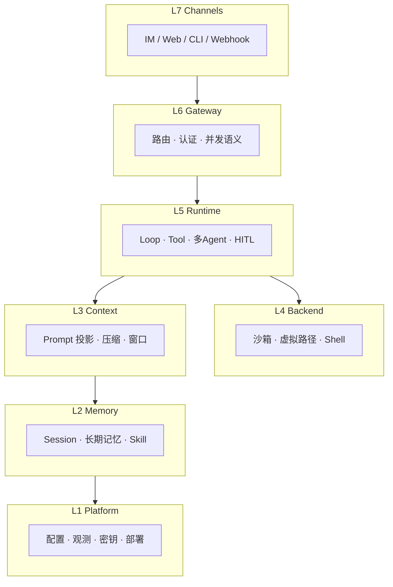

# 自建 Harness 蓝图

> **设计导读** · 实现级模块清单与抄作业表：[_archive/02-harness-blueprint.md](./_archive/02-harness-blueprint.md)  
> **应先读**：[00-HARNESS-DESIGN-PHILOSOPHY](./00-HARNESS-DESIGN-PHILOSOPHY.md) · [HARNESS-SPECTRUM](./HARNESS-SPECTRUM.md)

---

## 1. 一句话

Harness = 七层 **组合体**；SDK 常只覆盖 L3–L5，**产品级** Harness 必须补齐 L6–L7 与 L2 全链。

---

## 2. 七层参考架构



| 层 | 设计问题 | 常见缺口 |
|----|----------|----------|
| **L7** | 用户从哪进 | SDK 无渠道 |
| **L6** | 多用户/session_key | 单机脚本 |
| **L5** | Loop 范式与门控 | 只有 `while` |
| **L4** | 副作用落哪 | 本机裸跑 |
| **L3** | L/T 分裂 | UI=模型所见 |
| **L2** | 真源族选型 | 内存 list |
| **L1** | 可运维 | 无观测 |

---

## 3. 三档位（A / B / C）

| 档位 | 目标 | 典型栈 | 代表气质 |
|------|------|--------|----------|
| **A 个人本地** | 单用户、快迭代 | JSONL + 本地沙箱 + CLI | Pi、smolagents |
| **B 团队 Gateway** | IM + 多 session + 共享部署 | Gateway + PG/SQLite + Docker | nanobot、deer-flow |
| **C 企业审计** | 回放、多租户、远端执行 | 事件流 + 控制/执行分离 + Lease | OpenHands、Codex |

**选型法则**：先定 **真源族 + 并发语义**，再选档位；不要从「用不用 LangGraph」起手。

---

## 4. L5 运行时五柱（与 03 对齐）

```text
[A] Loop 驱动  →  [B] 多 Agent  →  [C] Backend  →  [D] HITL  →  [E] 权限
```

→ 详：[03-runtime-loop-queue](./03-runtime-loop-queue.md)

---

## 5. 四条记忆管线

| 管线 | 存什么 | 设计要点 |
|------|--------|----------|
| **Session transcript** | 对话真源 | 族 A–F 选型见 [21](./21-session-message-architecture.md) |
| **长期记忆** | 跨 session 事实 | M1–M5 见 [06](./06-memory.md) |
| **工作区文件** | 代码/产物 | 与 sandbox 路径绑定 |
| **Skill / 规则** | 可版本化能力 | 与 MCP 分工见 [20](./20-skill-mcp-modules.md) |

---

## 6. 压缩与 Prompt（L3）

- **六层压缩模型** → [07-compression](./07-compression.md)  
- **Prompt 模板模式** → [16-prompt-templates](./16-prompt-templates.md)  
- **原则**：压缩改 **L 投影**，不静默改 **W 真源**（除非产品明确 fork）

---

## 7. 三种交互模式（产品层）

| 模式 | 用户意图 | 与 Plan 轨关系 |
|------|----------|----------------|
| **Plan** | 先想清楚 | 多为 ②③（见 [05](./05-plan-mode.md)） |
| **Agent** | 直接干 | 全工具面 |
| **Multi** | 并行/委托 | MA1–MA8（见 [04](./04-multi-agent.md)） |

---

## 8. Gateway 与远端 CLI

| 能力 | 设计选择 |
|------|----------|
| **session_key** | `{channel}:{chat_id}` 等 |
| **同 key 串行** | 防竞态 |
| **并发语义** | reject / queue / steer / interrupt → [14](./14-loop-interjection.md) |
| **Codex 式远端 CLI** | 薄客户端 + 服务端 Loop → [17](./17-deployment.md) |

---

## 9. 反模式清单

| 反模式 | 为什么错 |
|--------|----------|
| Loop 里直接调 IM API | L5 污染 L7 |
| 多副本 + 本地 SQLite session | 失忆 |
| 把 `interrupt_on` 当 chat 插队 | HITL ≠ L1 并发 |
| 无界 tools/list 进 context | token + 注入面 |
| 子 Agent 结果全文 merge 父 L | 爆炸 + 污染 |
| 「选了框架 = 有 Harness」 | 常缺 L6/L7 |

---

## 10. 专题索引

| 主题 | 章 |
|------|-----|
| 运行时 | [03](./03-runtime-loop-queue.md) |
| 多 Agent | [04](./04-multi-agent.md) |
| 渠道 | [09](./09-channels.md) |
| 部署 | [17](./17-deployment.md) |
| 五平面 | [21](./21-session-message-architecture.md) |

---

## 11. 深潜

模块清单、档位 B 配置参考、monorepo 抄作业表 → [_archive/02-harness-blueprint.md](./_archive/02-harness-blueprint.md)
