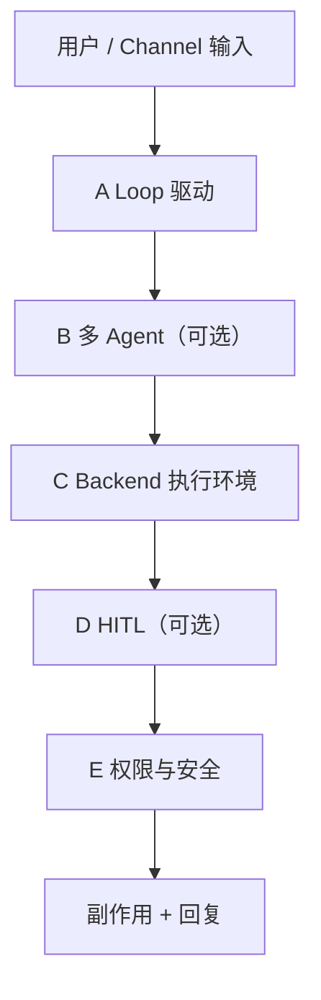
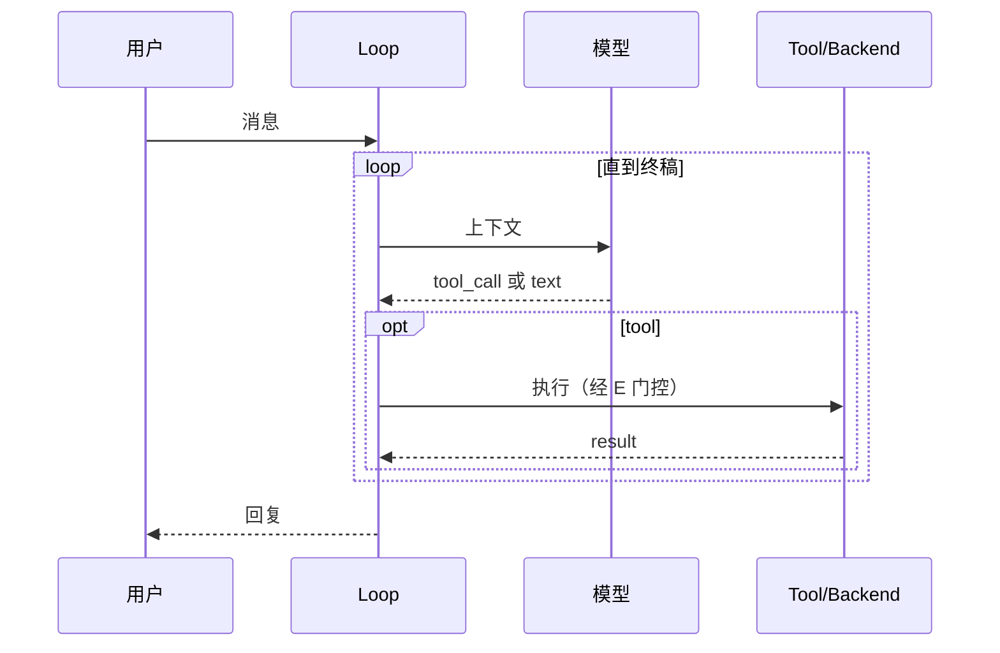

# 运行时 · Loop · 队列

> **设计导读** · P01–P11 实现表与路径索引：[_archive/03-runtime-loop-queue.md](./_archive/03-runtime-loop-queue.md)  
> **应先读**：[00-HARNESS-DESIGN-PHILOSOPHY](./00-HARNESS-DESIGN-PHILOSOPHY.md) §第 3–4 步

---

## 1. 一句话

**运行时**回答五步：谁驱动 Loop、多 Agent 怎么分、在哪执行、何时等人、默认允许什么——与 **压缩（L3）**、**插队（L1 并发）** 必须分开设计。

---

## 2. 五柱模型

| 柱 | 问什么 | 易混概念 |
|----|--------|----------|
| **A Loop** | 一步 = model / tool / event？ | ≠ Bus 排队 |
| **B 多 Agent** | 委托 / handoff / 图 | ≠ Loop 本身 |
| **C Backend** | Docker / 远端 / 本机 | ≠ 权限 |
| **D HITL** | 何时暂停等人 | ≠ chat 插队 |
| **E 权限** | 默认允许集 | `Plan` 模式属 E |

---

## 3. Loop 范式（A 柱）

| 范式 | 驱动方式 | 代表 |
|------|----------|------|
| **ReAct** | model ↔ tool 直到停 | OpenManus、Hermes |
| **Provider Turn** | 外层 turn + 内层 drain | Codex、OpenCode |
| **Event Step** | 一步一 event append | OpenHands SDK |
| **Middleware 图** | LangGraph 节点 | deepagents |
| **Bus → Runner** | Gateway 归一后进 Runner | nanobot |
| **SOP 轮次** | Role 环境轮 | MetaGPT |

---

## 4. 控制面 vs 执行面（Turn 气质）

| 气质 | 特征 | 好处 |
|------|------|------|
| **合一** | admit 与 drain 同函数 | 实现快 |
| **分离** | 准入队列 + 独立 drain | steer/interrupt 语义清晰 |

→ 插队策略：[14-loop-interjection](./14-loop-interjection.md)

---

## 5. B 柱：多 Agent 速览

| 模式 | 机制 | 代表 |
|------|------|------|
| MA1 工具委托 | `task` / delegate | deepagents、nanobot |
| MA2 子进程 | Coordinator worker | OpenHarness |
| MA3 Handoff | 换 active agent | OpenAI Agents |
| MA4 Crew/SOP | 声明式依赖 | crewAI、MetaGPT |

→ 详：[04-multi-agent](./04-multi-agent.md)

---

## 6. C 柱：Backend 隔离级别

| 级别 | 隔离 | 延迟 | 适合 |
|------|------|------|------|
| 无 | 本机用户权限 | 最低 | 原型 |
| 容器 | 文件/网络边界 | 中 | 团队 |
| 远端 VM | 强隔离 | 高 | 企业 coding |

---

## 7. D/E 柱：HITL 与权限

| 层 | 触发点 | 例子 |
|----|--------|------|
| **工具前审批** | tool_call 前 | LangGraph `interrupt_on` |
| **协作模式** | 整段只读 | Plan 模式（[05](./05-plan-mode.md)） |
| **沙箱策略** | 路径/命令类 | Codex 四层安全 |

---

## 8. Tier 1 五柱速览

| 项目 | A | B | C | D | E |
|------|---|---|---|---|---|
| Codex | Turn | spawn | 远端 | ✅ | 强 |
| deepagents | Graph | task | 可配 | middleware | 可配 |
| nanobot | Bus→Runner | subagent | 本地 | Gateway | 中 |
| OpenHands | Event | delegate | workspace | 可配 | 中 |
| OpenManus | ReAct | Flow | 弱 | 少 | 弱 |
| MetaGPT | SOP | 角色 | 文件 | env | 弱 |

完整矩阵 → [_archive/03-runtime-loop-queue.md §8](./_archive/03-runtime-loop-queue.md)

---

## 9. 六条设计法则

1. **五柱分开选型** — 不要「选了图 = 有沙箱」。  
2. **同 session 定义串行边界** — 与 L6 并发语义一致。  
3. **HITL ≠ 插队** — 审批在 tool 节点；chat 在 L1。  
4. **子 Agent 默认 compact 回父** — 全文 merge 是反模式。  
5. **Backend 失败要可恢复** — checkpoint 在 Loop 层。  
6. **权限默认拒绝** — 白名单工具 + 路径。

---

## 10. 常见陷阱

| 陷阱 | 后果 |
|------|------|
| crewAI 当 coding harness | 无统一 sandbox/loop |
| 单 `invoke` 无 session | 无法 steer/恢复 |
| Gateway 与 Loop 同锁全局 | 跨 session 假死 |

---

## 11. 深潜

P01–P11 路径表、逐项目 walkthrough → [_archive/03-runtime-loop-queue.md](./_archive/03-runtime-loop-queue.md)
