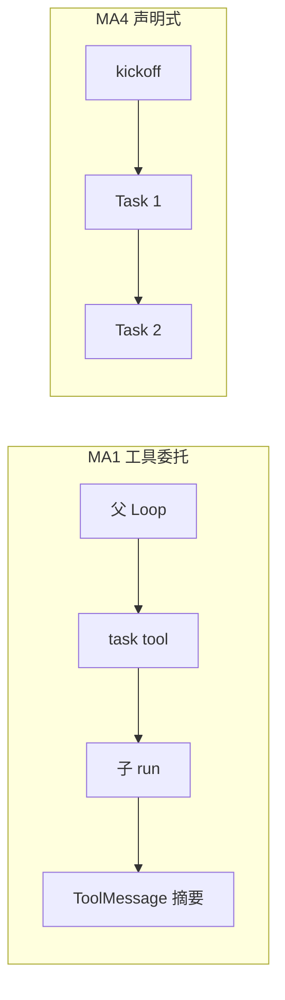
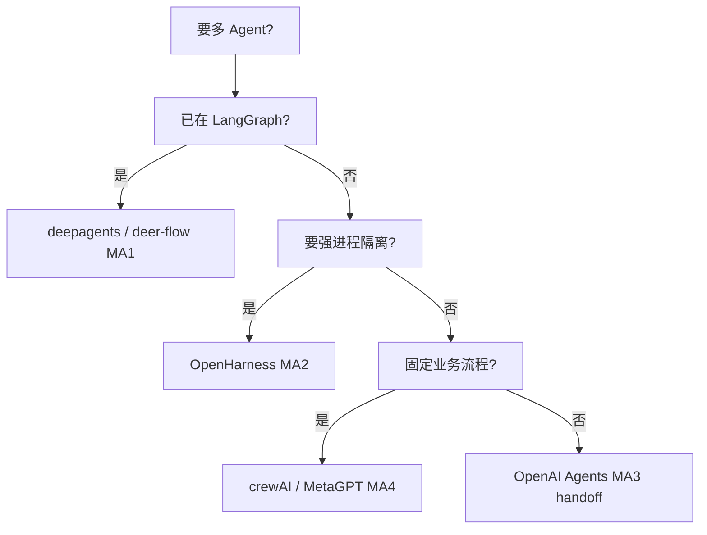

# 多 Agent 协作

> **设计导读** · 逐项目实现与路径：[_archive/04-multi-agent.md](./_archive/04-multi-agent.md)  
> **关联**：[00-HARNESS-DESIGN-PHILOSOPHY](./00-HARNESS-DESIGN-PHILOSOPHY.md) · [05-plan-mode](./05-plan-mode.md) · [06-memory](./06-memory.md)

---

## 1. 一句话

「多 Agent」在 Harness 里至少有 **八种机制**——先分类（MA1–MA8），再谈并发、隔离与 **父可见什么**。

---

## 2. 协作模式 taxonomy

| ID | 名称 | 机制 | 父 Agent 可见什么 |
|----|------|------|-------------------|
| **MA1** | 工具委托 | `task` / delegate 子 run | compact tool result |
| **MA2** | 子进程 Worker | Coordinator fork | 结构化 JSON + metadata |
| **MA3** | Handoff | 切换 active agent | 下一 agent 接管 thread |
| **MA4** | Crew / SOP | 声明式 Task 链 | Task output 传递 |
| **MA5** | GroupChat | 路由选人发言 | 共享 thread |
| **MA6** | 固定图节点 | LangGraph 拓扑 | 共享 graph state |
| **MA7** | Orchestrator + Archetype | spawn 专角色 | compact only，历史不回流 |
| **MA8** | Kanban 工作流 | 卡片状态机 | 卡片 artifact |

---

## 3. 对比四维

| 维度 | 设计问题 |
|------|----------|
| **触发** | tool / Flow / 图边 / 规则 |
| **并发** | 串行 / 限流 / 无限 |
| **状态隔离** | 独立 thread vs 共享 state |
| **结果合并** | 仅 string？merge todos？ |
| **权限** | 子集工具 / readonly sandbox |

---

## 4. Tier 1 总览

| 项目 | 主模式 | 并发 | 父见子 todos |
|------|--------|------|--------------|
| deepagents | MA1 | 可配置 | ❌ |
| deer-flow | MA1 | max 3 | ❌ |
| OpenHarness | MA2 | BackgroundTask | metadata |
| Hermes | MA1 + kanban | configurable | N/A |
| OpenManus | Flow executor | 1 | Flow 内顺序 |
| OpenAI Agents | MA3 | handoff 串行 | — |
| crewAI | MA4 | Process 定义 | — |
| MetaGPT | MA4 | SOP 流水线 | 产物文件 |
| AutoGen | MA5 | 路由策略 | 共享 |
| nanobot | MA1 | max_concurrent | pending inject |
| LangGraph | MA6 | 图定义 | checkpointer |

---

## 5. 设计取舍

### MA1 vs MA2

| | MA1 同进程子 run | MA2 子进程 |
|--|------------------|------------|
| **隔离** | thread/checkpoint | OS 进程 |
| **延迟** | 低 | 启动成本 |
| **适合** | research 并行 | 强权限 Plan worker |

### MA4 vs 单 ReAct

| | Crew/SOP | 单 Loop + task |
|--|----------|----------------|
| **编排** | 人写流程 | 模型即兴 |
| **可预测** | 高 | 低 |
| **coding agent** | 弱 | 强 |

---

## 6. 并发与隔离法则

1. **默认不 merge 子 todos 到父** — 防状态漂移。  
2. **子 sandbox 可更严** — 父宽、子窄。  
3. **并行要有硬上限** — deer-flow `MAX_CONCURRENT_SUBAGENTS`。  
4. **子结果走 compact 通道** — 摘要进父 L，非全文。  
5. **子完成语义要定义** — inject 父 turn vs 下轮新 turn（见 [14](./14-loop-interjection.md)）。

---

## 7. 选型决策树

---

## 8. Tier 2 速览

| 项目 | 模式 | 备注 |
|------|------|------|
| TradingAgents | MA6 固定辩论图 | 金融领域 |
| FastAgent | MA8 Kanban | GUI 自动化 |
| openhuman | MA7 Archetype | Rust harness |
| DeepTutor | 单 capability 多 stage | 非独立进程 |

---

## 9. 深潜

逐项目路径、代码 walkthrough → [_archive/04-multi-agent.md](./_archive/04-multi-agent.md)
