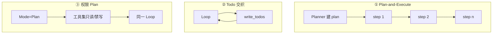
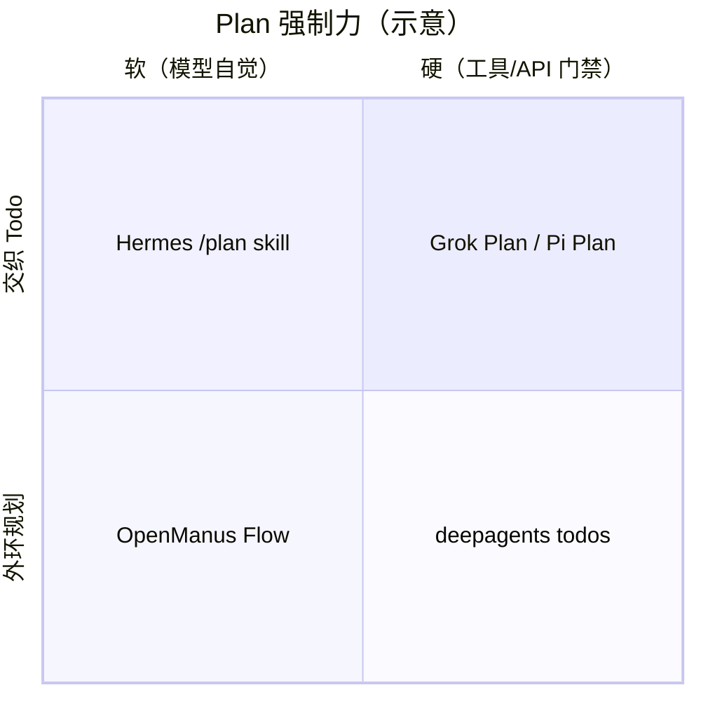
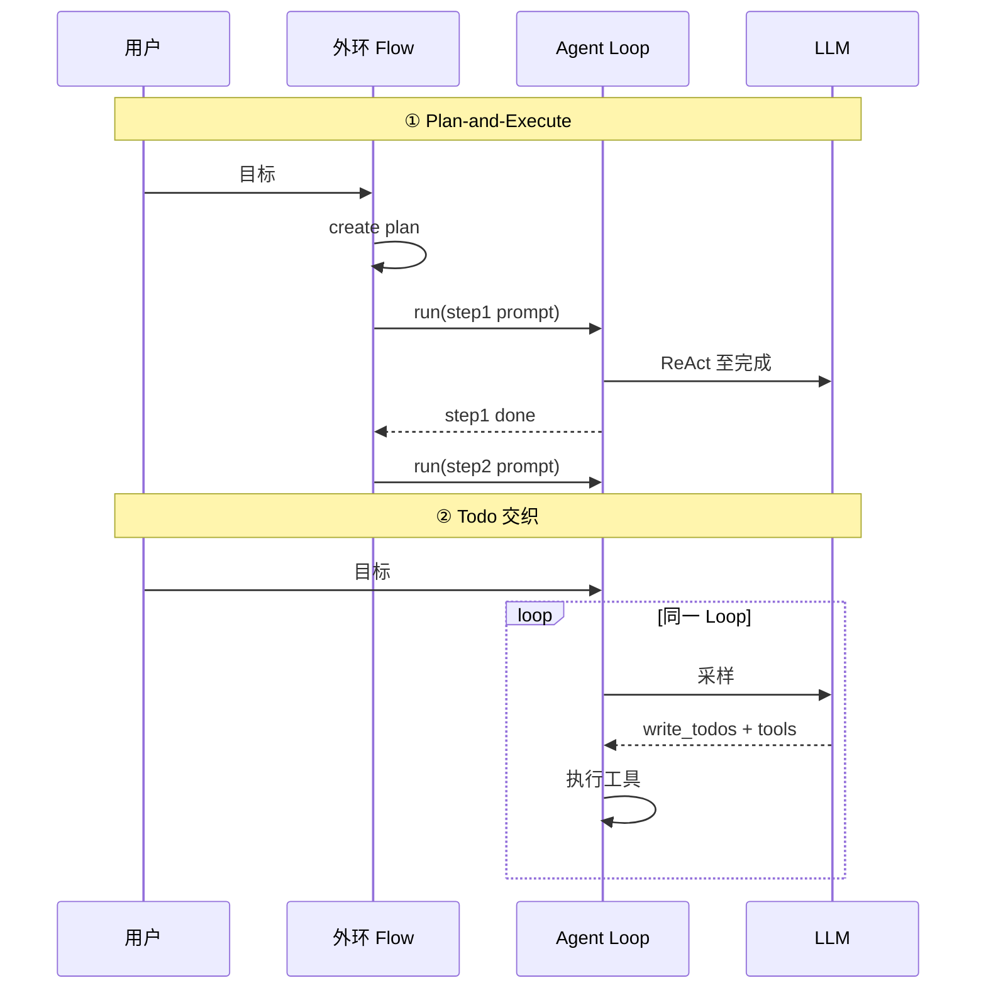
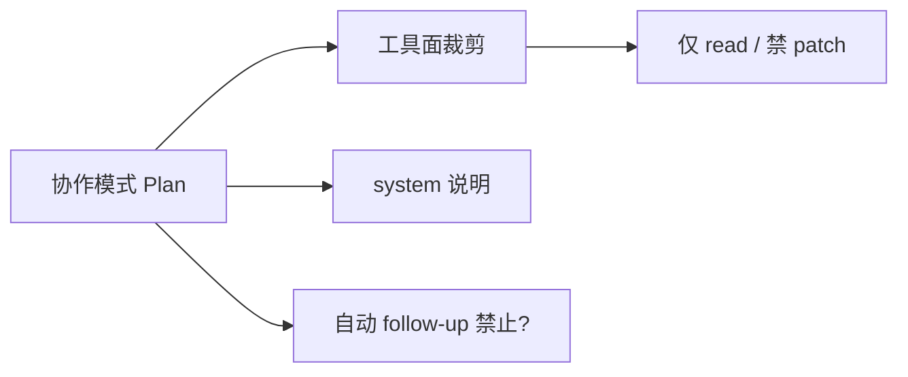
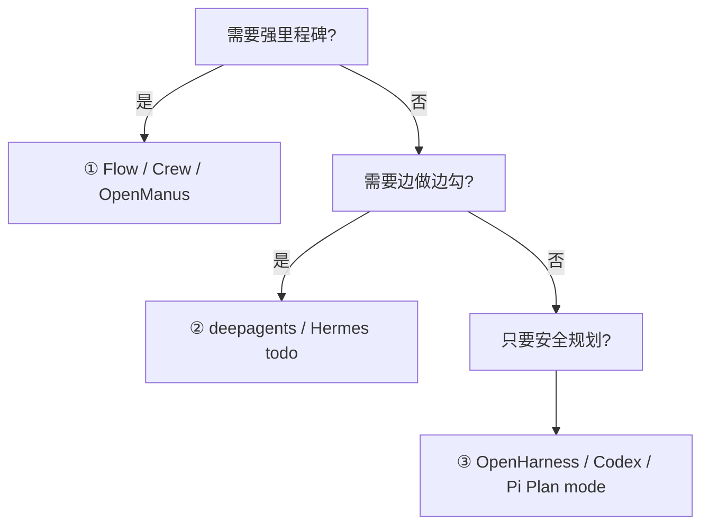

# Plan 模式与编排

> **设计导读** · 实现归档：[_archive/05-plan-mode.md](./_archive/05-plan-mode.md)  
> **总览**：[00-HARNESS-DESIGN-PHILOSOPHY](./00-HARNESS-DESIGN-PHILOSOPHY.md) · 多 Agent：[04-multi-agent](./04-multi-agent.md) · **Goal（跨 Turn 总目标）**：[22-goal-mode](./22-goal-mode.md)

---

## 1. 一句话

各项目的「Plan」**不是同一种东西**——要先分清 **Todo 交织**、**Plan-and-Execute 外环**、**权限型只读 Plan** 三条设计轨，再谈谁「更像 Manus」。

---

## 2. 三种 Plan 语义（必背）

| 轨 | 用户感受 | 编排谁做 | 执行谁做 |
|----|----------|----------|----------|
| **① Plan-and-Execute** | 先出步骤表，再逐步干 | 外层 Flow / Planner | 内层 Agent 每步 `run()` |
| **② Todo 交织** | 边干边勾 todo | 模型 + `write_todos` 工具 | 同一 Loop |
| **③ 权限型 Plan** | 「规划模式」不能乱改盘 | 产品切换协作模式 | 同一 Loop，工具面只读 |

**易错**：把 Codex `update_plan` 当成 OpenManus `PlanningFlow`——前者是 **② 交织 + 协作模式**，后者是 **① 外环**。  
**易错 2**：把 Prime/Hermes `/goal` 当成 Plan——Goal 是跨 Turn 总目标与完成合约，见 [22](./22-goal-mode.md)。

---

## 3. 正交四维（选型用）

| 维度 | 问什么 | 例子 |
|------|--------|------|
| **Plan 形态** | ① / ② / ③ | OpenManus vs deepagents vs OpenHarness |
| **编排者** | 谁推进 step | Flow / 模型 / 用户切模式 |
| **执行单元** | 一步多大 | 整圈 ReAct vs 单次 tool |
| **Execute 门** | 何时允许副作用 | 人批、自动、硬工具门禁 |

---

## 4. 框架设计画像（无路径）

| 框架 | 主轨 | 设计要点 |
|------|------|----------|
| **OpenManus** | ① | `PlanningTool` 内存 plan；每 step 调 executor 完整 ReAct |
| **crewAI** | ① | `planning_config` / Crew planning；Task 链 |
| **deepagents / deer-flow** | ② | Todo middleware 始终挂载；**无**独立 Plan 阶段 |
| **Hermes** | ② + 软③ | `todo` 工具 + `/plan` skill（只规划文案） |
| **OpenHarness** | ③ | `PermissionMode.PLAN` 只读沙箱 |
| **Codex / Pi / Grok** | ③ 硬 | 协作模式 + 禁危险工具 / `update_plan` 规则 |
| **MetaGPT** | ① 变体 | SOP 流水线 ≈ 固定 plan；非用户可见 todo |

---

## 5. 端到端：① vs ②

| | ① | ② |
|--|---|----|
| **plan 存哪** | Flow / PlanningTool / Task 图 | state.todos / 工具回写 |
| **step 边界** | 外层显式 | 模型自定 |
| **适合** | 可分解里程碑 | 探索型 coding |
| **风险** | 计划过时需重规划 | todo 与行动漂移 |

---

## 6. 权限型 Plan（③）设计要素

| 机制 | 目的 |
|------|------|
| **工具面裁剪** | 硬拦副作用，不赌 prompt |
| **Prompt 声明** | 对齐模型行为（软） |
| **follow-up 门** | 防止邮箱里悄悄开干（Codex Plan） |
| **人批再切 Agent** | Grok 式显式批准 |

---

## 7. 设计法则

1. **先分类再对比** — 不说「支持 Plan」，说 ①②③ 哪条。  
2. **外环与内环分离** — ① 的 plan 状态 **不要** 与 ReAct Memory 混表。  
3. **硬门禁优于纯文案** — 长期产品用 ③ 的工具面。  
4. **Todo 不是 Plan** — ② 是进度跟踪，不是里程碑编排。  
5. **子 Agent plan** — 父 todos **不** merge 子（deepagents 规则）。

---

## 8. 选型

---

## 9. 深潜

| 需求 | 读 |
|------|-----|
| 实现路径、§4 源码时序 | [_archive/05-plan-mode.md](./_archive/05-plan-mode.md) |
| OpenManus Flow | [openmanus-architecture DESIGN §6](../../openmanus-architecture/DESIGN_THINKING_SERIES.md) |
| Codex Plan | [codex PLAN_AND_MULTI_AGENT](../../codex-architecture/PLAN_AND_MULTI_AGENT.md) |
