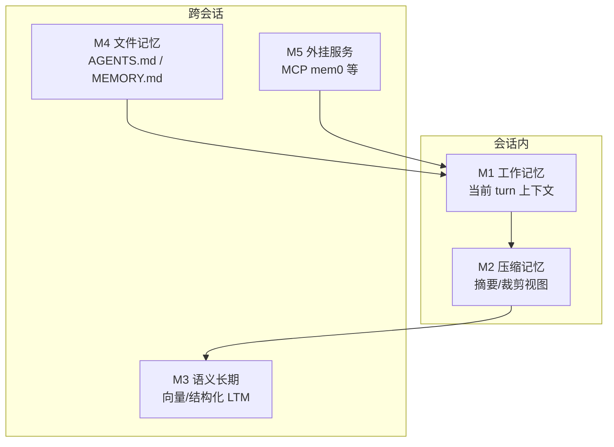
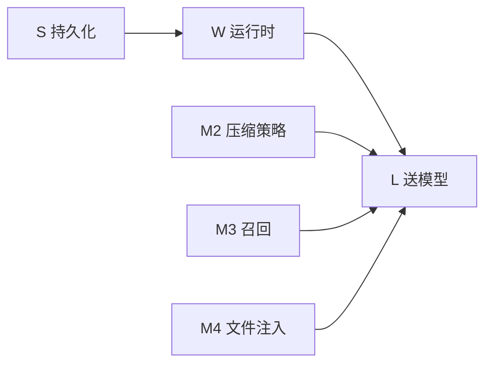
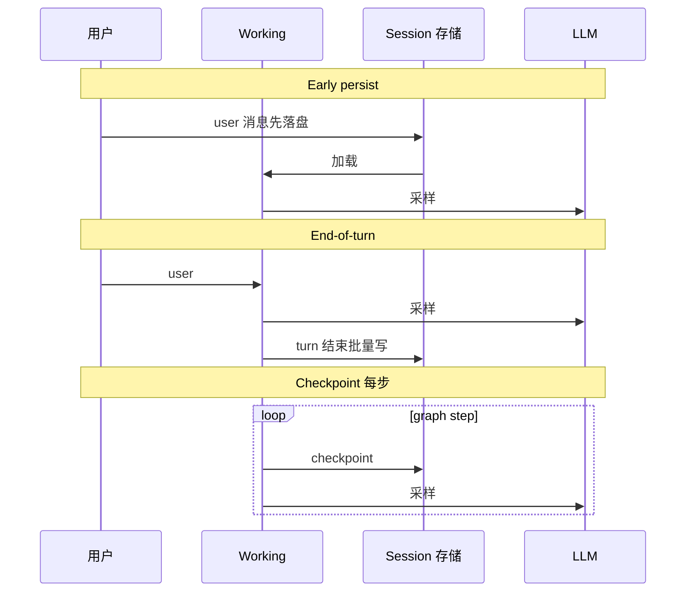

# Memory · Session · 持久化

> **设计导读** · 实现归档：[_archive/06-memory.md](./_archive/06-memory.md)（~8500 行）  
> **五平面**：[21-session-message-architecture](./21-session-message-architecture.md) · **总览**：[00-HARNESS-DESIGN-PHILOSOPHY](./00-HARNESS-DESIGN-PHILOSOPHY.md)

---

## 1. 一句话

Memory 对比要先问 **五层记忆（M1–M5）各覆盖哪几层**，再问 **压缩改的是 S 还是只改 L**——不要用一个「memory」包打天下。

---

## 2. 统一分层 M1–M5

| 层 | LLM 直接见？ | 设计问题 |
|----|-------------|----------|
| **M1** | ✅ | 载体：messages / event view / graph state |
| **M2** | ✅（常伪 user） | 改 S 还是投影？ |
| **M3** | 检索后注入 | 谁写入、何时召回 |
| **M4** | 注入或 read_file | 文件 ≠ 向量库 |
| **M5** | 经 tool | 跨 harness 共享 |

**易错**：`AGENTS.md` 是 **M4**；deer-flow `memory.json` 是 **M3**——不是一类东西。

---

## 3. Memory 与五平面 S/W/L 的关系

| 平面 | Memory 相关 |
|------|-------------|
| **S** | checkpoint / JSONL / EventLog / SQLite |
| **W** | 当前 messages 工作集 |
| **L** | `wrap_model_call` 视图、summary 前缀 |
| **T/U** | 一般不直接等于 M3 |

---

## 4. 框架设计画像

| 框架 | M1 | M2 | M3 | M4 | 持久化气质 |
|------|----|----|----|----|------------|
| **deepagents** | graph messages | SummarizationMiddleware | store 可选 | AGENTS.md | checkpoint |
| **deer-flow** | ThreadState | summary + durable | memory.json | SOUL/skill | checkpoint + 目录 |
| **nanobot** | Session messages | Consolidator | Dream→MD | SOUL/USER/MEMORY | JSONL + git MD |
| **Hermes** | SessionDB | conversation_compression | provider + search | plans/skills | SQLite |
| **OpenHands** | Event→View | Condenser | 应用层 | MEMORY.md | EventLog |
| **Letta** | messages+blocks | compaction | **blocks 核心** | — | DB |
| **OpenManus** | Memory 列表 | 仅尾截断 100 | 无 | workspace | **无** |
| **MetaGPT** | role memory | 弱 | 关键词 | **产物 repo** | 文件 |
| **Codex** | ContextManager | compact / token budget | Memories 旁路 | AGENTS/world | Rollout |
| **Pi / Prime** | harness/jsonl | compaction | 可选 | 项目文件 | JSONL 树 |

---

## 5. 写入时机（设计分水岭）

| 策略 | 优势 | 代价 |
|------|------|------|
| **Early persist** | 崩溃不丢用户句 | 可能写入未完成的 turn |
| **End-of-turn** | 语义完整 | 中途崩溃丢本轮 |
| **Checkpoint** | 图可恢复、HITL | S 与 L 易纠缠 |

---

## 6. 多实例与 Session 存储

| 部署 | 设计选择 |
|------|----------|
| **单用户本地** | JSONL / SQLite 单文件 |
| **多 Worker** | **禁止** 多副本写同一 SQLite |
| **多租户 Gateway** | Postgres + `session_key` 锁 |
| **事件溯源** | 共享对象存储 + lease |

→ 部署专题：[17-deployment](./17-deployment.md)

---

## 7. 设计法则

1. **M4 文件记忆要版本化** — git / snapshot，便于人编辑。  
2. **M3 写入要防抖** — 每轮抽取 facts 成本极高（deer-flow 批处理）。  
3. **压缩区分 S 与 L** — 族 B 事件日志尽量不改文件。  
4. **跨 Agent 默认隔离** — 子 thread / 子 session，除非显式共享 M4。  
5. **OpenManus 级无持久化** — 只适合原型，不是 Harness 对标对象。

---

## 8. 选型

| 目标 | 倾向 |
|------|------|
| 个人助手 + Markdown 人格 | nanobot / Hermes 四层 MD |
| LangGraph 已有 | deepagents + checkpointer |
| 强审计 coding | OpenHands EventLog |
| 块记忆研究 | Letta |
| 教育画像 | DeepTutor L1–L3 |

---

## 9. 深潜

| 需求 | 读 |
|------|-----|
| 路径与逐框架长文 | [_archive/06-memory.md](./_archive/06-memory.md) |
| 五平面六族 | [21-session-message-architecture](./21-session-message-architecture.md) |
| 压缩 | [07-compression](./07-compression.md) |
