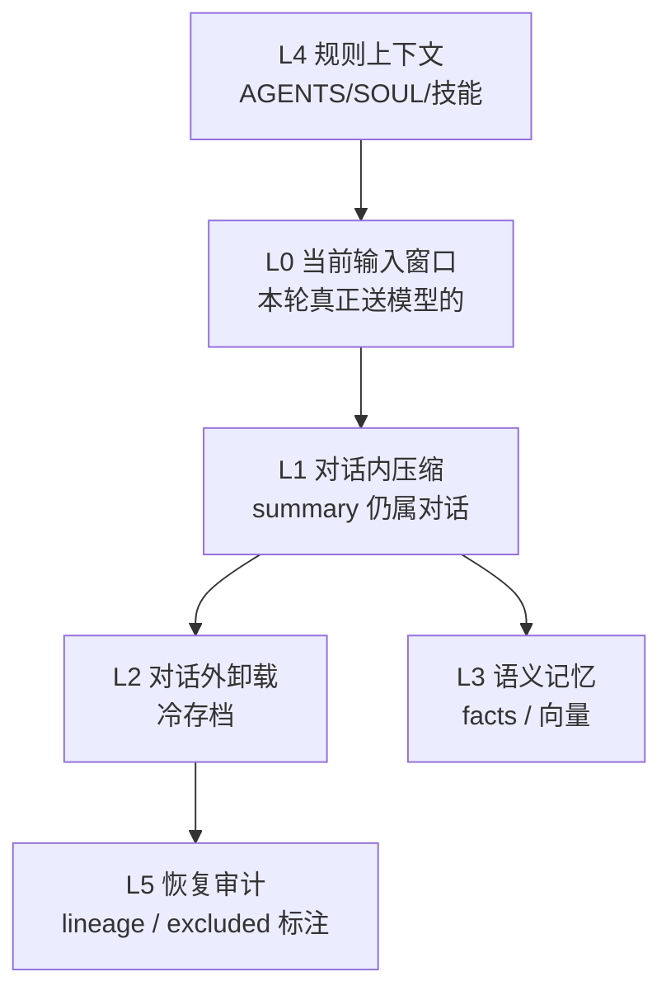
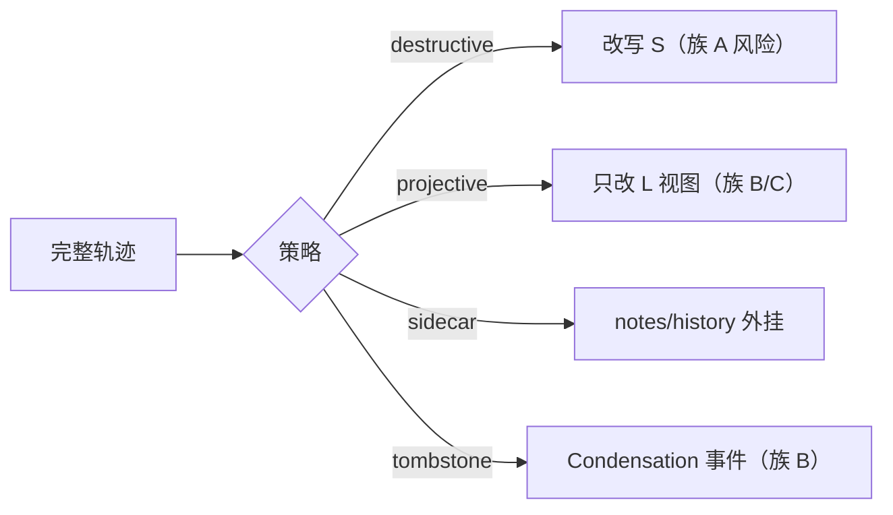
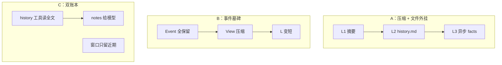
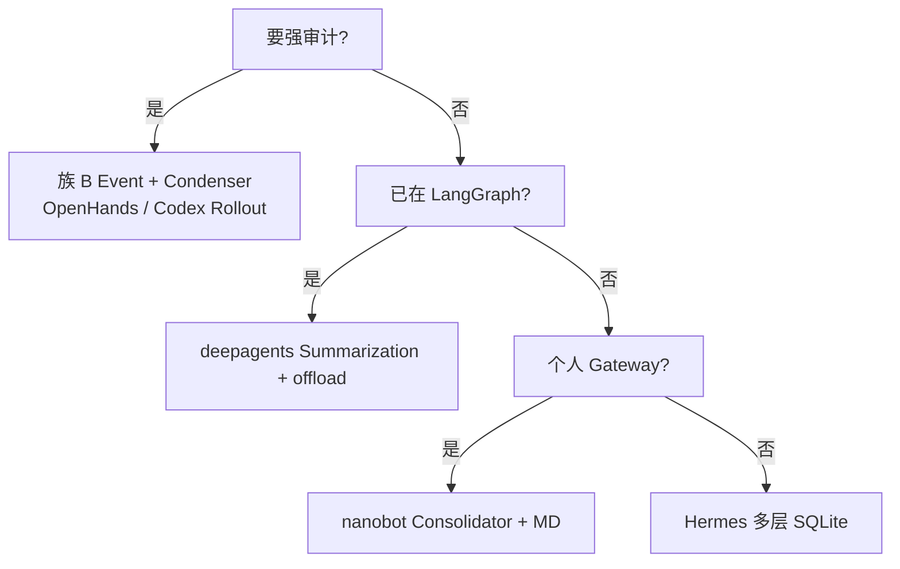

# 上下文压缩

> **设计导读** · 实现归档：[_archive/07-compression.md](./_archive/07-compression.md) · 源码 walkthrough：[_archive/13-compression-source-archive.md](./_archive/13-compression-source-archive.md)  
> **总览**：[00-HARNESS-DESIGN-PHILOSOPHY](./00-HARNESS-DESIGN-PHILOSOPHY.md) §第 5 步 · **Memory**：[06-memory](./06-memory.md)

---

## 1. 一句话

压缩不是「一个 summarization 函数」，而是 **L0–L5 六层管线**——回答「当前窗口塞什么、旧对话去哪、facts 是否沉淀、能否审计」。

---

## 2. 六层模型

| 层 | 核心问题 | 失败症状 |
|----|----------|----------|
| **L0** | 本轮 messages 边界 | token 爆、工具结果撑爆 |
| **L1** | 历史如何在对话内变短 | 丢关键 tool 轨迹 |
| **L2** | 被挤出的原文还在吗 | 无法复盘争议 |
| **L3** | 是否蒸馏 facts | 重复犯同样错 |
| **L4** | 规则与人格谁注入 | 每轮重复读盘 |
| **L5** | 压缩后能否追溯 | 合规失败 |

---

## 3. 三类目标（禁止混谈）

| 目标 | 优化什么 | 典型手段 |
|------|----------|----------|
| **成本** | token 账单 | 摘要、滑窗、microcompact |
| **能力** | 长任务不退化 | notes 外挂、分层记忆 |
| **审计** | 事后可复盘 | EventLog 不删、excluded 标记 |

**好设计不是压得最狠**，而是在三者间取平衡。

---

## 4. 压缩策略族（设计级）

| 策略 | 行为 | 代表气质 |
|------|------|----------|
| **滑窗 / 截断** | 丢头或丢尾 | OpenManus 100 条 |
| **全量摘要** | 旧对话→一段 summary | Hermes、经典 compact |
| **View + Condenser** | S 不变，L 用视图 | OpenHands |
| **Middleware 视图** | checkpoint 内改投影 | deepagents |
| **Token Budget 切窗** | 新窗 + notes/history 工具 | Codex |
| **块压缩** | Letta blocks 合并 | Letta |

---

## 5. 框架覆盖（六层勾选）

| 框架 | L0 | L1 | L2 | L3 | L4 | L5 |
|------|:--:|:--:|:--:|:--:|:--:|:--:|
| **Codex** | ✅ | ✅ budget | ✅ rollout | ✅ Memories | ✅ WorldState | ✅ JSONL |
| **OpenHands** | ✅ | ✅ Condenser | ✅ Event 文件 | 弱 | ✅ skills | ✅ Event |
| **deepagents** | ✅ | ✅ Summarization | ✅ offload 路径 | 可选 store | ✅ AGENTS | checkpoint |
| **deer-flow** | ✅ | ✅ | ✅ | ✅ memory.json | ✅ | ✅ |
| **Hermes** | ✅ | ✅ | ✅ SQLite | ✅ provider | ✅ MD | ✅ |
| **nanobot** | ✅ | ✅ Consolidator | ✅ history.jsonl | ✅ Dream | ✅ SOUL | git |
| **OpenManus** | ✅ | ⚠️ 截断 | ❌ | ❌ | 弱 | ❌ |
| **smolagents** | ✅ | 手动 callback | ❌ | ❌ | ❌ | ❌ |

---

## 6. 三种协同模式

| 模式 | 适合 |
|------|------|
| **A** | 个人 harness（nanobot、deer-flow） |
| **B** | 企业 coding agent |
| **C** | Codex Token Budget |

---

## 7. 七条黄金法则

1. **先定改 S 还是改 L** — 再选算法。  
2. **工具轨迹优先保尾** — 最近 N 次 tool 往往最关键。  
3. **摘要必须可失败关闭** — 无高信号则 no-op。  
4. **L2 卸载要有指针** — 模型或人能找到原文。  
5. **L3 写入要防抖** — 批处理优于每轮抽取。  
6. **L4 与历史分离** — 规则不要每轮重发全文若未变。  
7. **L5 标注 excluded** — 压缩掉的条目可审计（agent-framework 做法）。

---

## 8. 选型决策树

---

## 9. 常见陷阱

| 陷阱 | 后果 | 纠正 |
|------|------|------|
| 摘要幻觉 | 错误「记忆」 | 保留 L2 原文 |
| 压缩进 S 无墓碑 | 无法复盘 | Event 或 excluded |
| 子 Agent 全文回父 | 父窗口爆 | 子结果先摘要 |
| 每轮 facts 抽取 | 成本×N | 防抖队列 |
| 把 MCP mem0 当 M1 | 召回延迟 | 分层标注 M5 |

---

## 10. 深潜

| 需求 | 读 |
|------|-----|
| C01–C22 矩阵、性能数据 | [_archive/07-compression.md](./_archive/07-compression.md) |
| 逐行源码 | [_archive/13-compression-source-archive.md](./_archive/13-compression-source-archive.md) |
| Codex 上下文 | [codex CONTEXT_MANAGEMENT](../../codex-architecture/CONTEXT_MANAGEMENT.md) |
