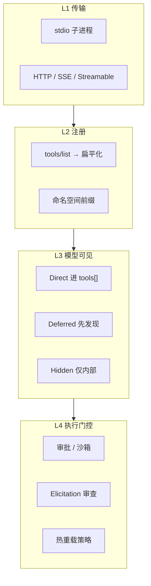
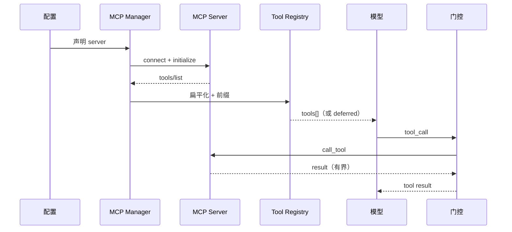

# MCP 集成

> **设计导读** · 实现归档：[_archive/08-mcp.md](./_archive/08-mcp.md)  
> **Skill 边界**：[20-skill-mcp-modules](./20-skill-mcp-modules.md) · **总览**：[00-HARNESS-DESIGN-PHILOSOPHY](./00-HARNESS-DESIGN-PHILOSOPHY.md)

---

## 1. 一句话

MCP 在 Harness 里是 **供应链扩展**——设计要问四层：**传输 → 注册 → 可见性 → 执行门控**，不是「能连上 server」就算做完。

---

## 2. 四层封装模型

| 层 | 设计问题 | 选错后果 |
|----|----------|----------|
| **传输** | 本地 vs 远程、OAuth | 延迟、断连 |
| **注册** | 工具名冲突、schema 大小 | 模型混淆 |
| **可见性** | 一次暴露多少工具 | context 爆炸 |
| **门控** | 谁批准副作用 | 供应链投毒 |

---

## 3. 框架设计气质

| 框架 | 一等公民？ | 可见性策略 | 门控 |
|------|------------|------------|------|
| **OpenCode** | 配置在，V2 注册演进中 | Deferred namespace | 权限 + skill 门 |
| **deer-flow** | MultiServer + mtime 热更 | prefix + deferred | 扩展配置 |
| **OpenHarness** | 专用 Manager | `mcp__srv__tool` | 与 ToolRegistry 统一 |
| **nanobot** | 启动连接 | resource→伪 tool | Gateway |
| **OpenManus** | 客户端+服务端 | 动态 merge | 无统一门 |
| **deepagents** | 经 langchain 适配器 | 应用层 | 同 host 策略 |
| **AgentScope** | MCPClient | 构造时连接 | 确认流分离 |
| **Hermes** | 宿主集成 | 依部署 | 依部署 |

---

## 4. 端到端时序（概念）

---

## 5. Resources / Prompts / Elicitation

| MCP 能力 | Harness 设计选择 |
|----------|------------------|
| **tools** | 默认主路径 |
| **resources** | 伪 tool / 单独 read / 不进 L |
| **prompts** | 模板发现，少见于 coding agent |
| **elicitation** | server 向用户索要输入 → **Guardian 审查**（Codex 气质） |

---

## 6. 与 Skill 的分工

| | Skill | MCP |
|--|-------|-----|
| **信任模型** | 仓库内文本 | 第三方进程 |
| **加载** | 索引 + `skill` 工具读正文 | 连接 + list |
| **热更** | 文件 watch | 配置 mtime / 重启 |
| **见** [20-skill-mcp-modules](./20-skill-mcp-modules.md) | | |

---

## 7. 设计法则

1. **注册 ≠ 可见** — Hidden/Deferred 是 context 治理。  
2. **前缀防冲突** — `server__tool` 是常态。  
3. **schema 有界** — 超大 description 是注入面。  
4. **调用仍走控制面** — MCP 不能绕过沙箱。  
5. **热更要定义语义** — mtime 重连 vs 需重启。

---

## 8. 深潜

[_archive/08-mcp.md](./_archive/08-mcp.md) · [OpenCode 架构](../../opencode-architecture/ARCHITECTURE.md)
