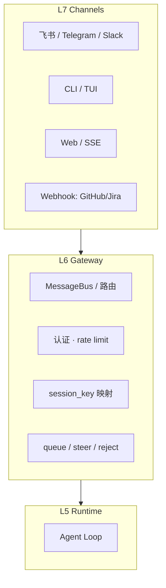
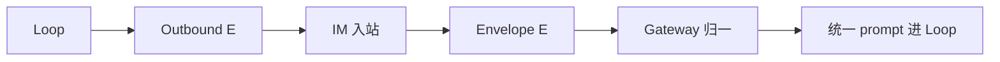

# 渠道与 Gateway（L7）

> **设计导读** · 实现归档：[_archive/09-channels.md](./_archive/09-channels.md)  
> **总览**：[00-HARNESS-DESIGN-PHILOSOPHY](./00-HARNESS-DESIGN-PHILOSOPHY.md) · **部署**：[17-deployment](./17-deployment.md)

---

## 1. 一句话

**L7 渠道** 解决「用户从哪进来」；**L6 Gateway** 解决「多用户、多会话、并发语义」——Loop 不应同时管 IM 路由与 tool 执行。

---

## 2. 七层中的位置

| 层 | 不负责 |
|----|--------|
| **L7** | 不直接调 LLM |
| **L6** | 不执行 tool / 不持 sandbox |
| **L5** | 不知道飞书 chat_id |

---

## 3. 通道 Envelope（E 平面）

与 [21-session-message-architecture](./21-session-message-architecture.md) 的 **E 轨** 对应：

| 字段语义 | 用途 |
|----------|------|
| channel | 来源平台 |
| chat_id / thread | 路由键 |
| attachments | 与 transcript 分离 |
| user_id | 多租户 |

---

## 4. session_key 设计

| Channel | 推荐 key 模式 | 意图 |
|---------|---------------|------|
| IM | `{channel}:{chat_id}` | 单聊串行 |
| Web | `web:{user}:{thread}` | 多 tab |
| 远端 CLI | `cli:{user}:{client}` | Codex 式多终端 |

**硬规则**：同 key **串行**；跨 key **并行**（nanobot 实证）。

---

## 5. 并发语义（与 L6 绑定）

| 策略 | 第二条消息 | 产品感 |
|------|------------|--------|
| **reject** | 拒绝 / 忙 | deer-flow IM |
| **FIFO queue** | turn 后处理 | deepagents-code TUI |
| **steer / inject** | turn 内改道 | hermes / nanobot |
| **interrupt** | 取消当前 turn | ohmo 默认 |

→ 详表：[14-loop-interjection](./14-loop-interjection.md)

---

## 6. 五种接入方案（设计级）

| 方案 | 形态 | 适合 |
|------|------|------|
| **P1 库内 Channel** | harness 内置 adapter | nanobot、Hermes |
| **P2 Gateway 服务** | 独立进程 + Bus | 生产 IM |
| **P3 Webhook 入站** | 无状态 HTTP→队列 | CI/DevOps |
| **P4 远端 CLI 客户端** | 薄终端连 Gateway | Codex 式 |
| **P5 双进程 Bridge** | UI 与 Engine 分离 | OpenHarness ohmo |

---

## 7. 设计法则

1. **Gateway 先于 scale** — 多用户必先 L6。  
2. **Envelope ≠ Message** — 通道元数据不进 L 全文。  
3. **认证在 Gateway** — 不信客户端自报 user_id。  
4. **单 session 串行** — 防文件锁与状态竞态。  
5. **Outbound 可异步** — IM 限速与重试在 L7。

---

## 8. 深潜

[_archive/09-channels.md](./_archive/09-channels.md) · [17-deployment](./17-deployment.md)
