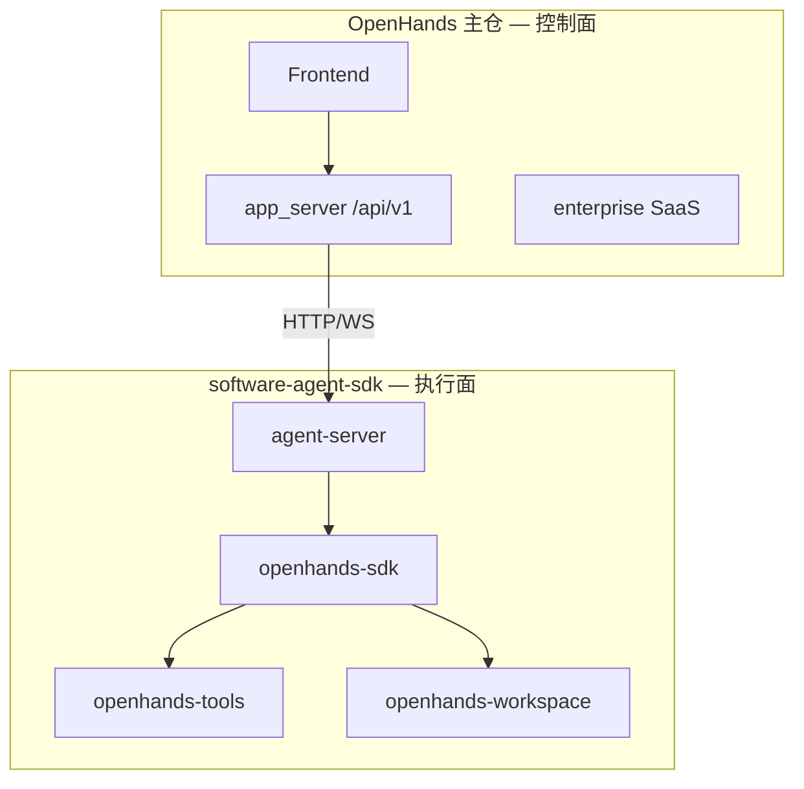
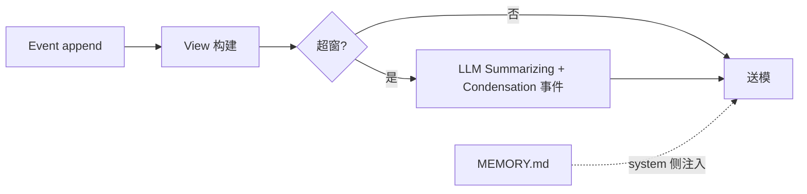

# OpenHands 生态

> **设计导读** · 双仓架构与路径深潜：[_archive/10-openhands.md](./_archive/10-openhands.md)  
> **关联**：[07-compression](./07-compression.md) · [21-session-message-architecture](./21-session-message-architecture.md)

---

## 1. 三句话

1. **Agent 执行在 `software-agent-sdk`**；OpenHands 主仓是 **控制面**（app_server + UI）。  
2. **V0 内嵌 runtime 已移除** — 对比时看 SDK 四包，不是旧 `controller/`。  
3. **记忆分三条线**：事件日志（真源）· Condenser（L 投影）· `MEMORY.md`（跨 session 提示）— **不要混谈**。

---

## 2. 控制面 / 执行面

| 平面 | 负责 | 不负责 |
|------|------|--------|
| **控制面** | 用户、租约、沙箱编排、UI | 内嵌 ReAct loop |
| **执行面** | `LocalConversation`、EventLog、Condenser | IM 路由 |

---

## 3. SDK 四包职责

| 包 | 设计角色 |
|----|----------|
| **openhands-sdk** | Agent、Conversation、Event、Condenser 核心 |
| **openhands-agent-server** | 可独立部署 REST/WS 执行服务 |
| **openhands-tools** | terminal、file_editor、browser、delegate |
| **openhands-workspace** | Local / Docker / K8s 工作区抽象 |

**嵌入 vs 服务**：脚本可直调 `Conversation`；生产常 **app_server → agent-server 容器**。

---

## 4. 真源与压缩（设计对齐）

| 线 | 族 | Harness 层 |
|----|-----|------------|
| **EventLog** | B 事件 append | W 真源 |
| **Condenser** | View + 摘要事件 | L 投影（见 [07](./07-compression.md)） |
| **MEMORY.md** | 文件索引 | M2 长期记忆注入 |

---

## 5. 与其他 Tier 1 的差异

| 维度 | OpenHands | deepagents | Codex |
|------|-----------|------------|-------|
| **真源** | EventLog | Checkpoint 图 | Rollout B |
| **部署** | P5 控制+执行分离 | 库/自托管 | 远端 CLI |
| **压缩** | Condenser 一等公民 | middleware | 多层 compact |
| **审计** | 事件可回放 | 依 checkpointer | 强 |

---

## 6. 设计法则

1. **版本钉扎四包同版** — sdk / agent-server / tools 对齐。  
2. **Condensation 是事件** — 压缩留墓碑，可审计。  
3. **Session 外置才能多副本** — FileStore + 共享存储。  
4. **delegate 是 MA1** — 与 Condenser 无关。  
5. **QueueMode** — SDK 侧会话级并发见 [14](./14-loop-interjection.md)。

---

## 7. 深潜

子包表、API 路径、企业版拓扑 → [_archive/10-openhands.md](./_archive/10-openhands.md) · [OpenHands 官方文档](https://docs.openhands.dev/)
