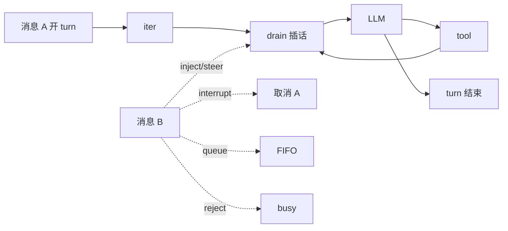

# Loop 过程中的插队

> **设计导读** · 含路径锚点的完整矩阵：[_archive/14-loop-interjection.md](./_archive/14-loop-interjection.md)  
> **关联**：[03-runtime-loop-queue](./03-runtime-loop-queue.md) · [09-channels](./09-channels.md) · [05-plan-mode](./05-plan-mode.md) · [22-goal-mode](./22-goal-mode.md)

---

## 1. 先分清五种「打断」

| 概念 | 层 | 打断什么 |
|------|-----|----------|
| **Loop 插队（本文）** | L1 用户消息 | turn 进行中第二条 chat |
| **Turn interrupt** | L1 产品策略 | 整段 turn 取消 |
| **Mid-turn inject** | L1 turn 内 | 不取消；下 iter 可见 |
| **Interjection** | L1 turn 内 | 独立 synthetic user，下一 iter |
| **HITL / interrupt_on** | 图/tool | 工具执行前暂停 |

> **易错**：`interrupt_on` ≠ IM 里又发了一条。

---

## 2. 检查点模型

| 检查点 | B 何时进模型 | 代表 |
|--------|--------------|------|
| **interrupt** | 新 turn；A 丢弃/标 incomplete | hermes 默认、ohmo |
| **FIFO queue** | A 整段结束后 | deepagents-code TUI |
| **inject** | 当前 iter 结束后 | nanobot |
| **steer** | 并入 steering 通道 | hermes、OpenHuman |
| **interjection** | 下一 iter synthetic user | grok-build |
| **reject** | 不进上下文 | deer-flow IM |

---

## 3. 主矩阵（设计级）

| 项目 | 默认策略 | Abort turn? | B 的形态 |
|------|----------|-------------|----------|
| **nanobot** | Mid-turn inject | 否（`/stop` 除外） | pending_queue → callback |
| **hermes** | **interrupt**（可配 queue/steer） | 默认是 | FIFO / steer 分轨 |
| **grok-build** | Interjection + Prompt FIFO | interjection 否 | synthetic user |
| **openhuman** | QueueMode 五态 | Interrupt 默认是 | Steer/Collect/Followup… |
| **OpenHarness ohmo** | interrupt | 是 | Gateway Bridge |
| **ChannelBridge** | Bus FIFO | 否 | 等第一条处理完 |
| **deepagents-code** | TUI FIFO | Esc 可 interrupt | deque |
| **deer-flow IM** | **reject** | 否 | 第二 run 拒绝 |
| **OpenHands SDK** | 非 mid-turn chat | — | PendingMessage 缓冲 |
| **deepagents SDK** | 无（单次 invoke） | — | 调用方自研 |

---

## 4. 三类 turn 内机制

### 4.1 Injection（nanobot）

- turn **继续**；tool 后 / 终稿前 drain。  
- 子 Agent 结果可走 **同通道** 进父 turn。  
- 未 drain 完可 re-publish 为 **下轮新 turn**。

### 4.2 Steer（hermes / OpenHuman）

| | hermes steer | OpenHuman Steer/Collect |
|--|--------------|-------------------------|
| Abort | 否 | 否 |
| 形态 | 贴 tool 上下文 | 带前缀的 steering 文本 |
| vs queue | queue = turn 后再跑 | Followup = turn 后 drain |

### 4.3 Interjection（grok-build）

- **不 abort**；写入 ChatState 为独立 user。  
- 每 iter 开头 `drain_pending_interjections`。  
- 与 **pending_inputs FIFO** 是两条线。

---

## 5. 与 L6 Gateway 的绑定

| 规则 | 原因 |
|------|------|
| **同 session_key 串行** | 文件锁、状态一致 |
| **策略在 Gateway 配置** | L7 不应猜 Loop 语义 |
| **reject 要用户可感知** | busy 错误 / 排队提示 |

→ [09-channels](./09-channels.md)

---

## 6. 设计法则

1. **产品级默认要显式** — interrupt vs inject 用户体验差很多。  
2. **steer 不是 queue** — 前者 turn 内，后者 turn 后。  
3. **子 Agent 完成语义单独定义** — 是否打断父 iter。  
4. **HITL 与 L1 分文档** — 避免混测试。  
5. **多副本时插队状态要可序列化** — pending 队列落盘或 sticky session。

---

## 7. 深潜

完整矩阵（含实现锚点）、时序细节 → [_archive/14-loop-interjection.md](./_archive/14-loop-interjection.md)
