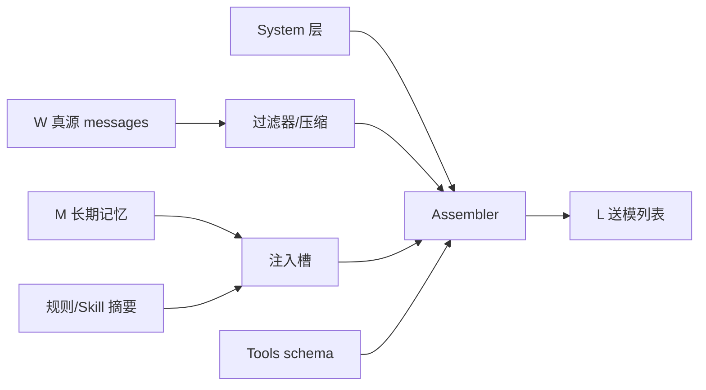

# Prompt 模板与投影

> **设计导读** · 完整模板库与路径：[_archive/16-prompt-templates.md](./_archive/16-prompt-templates.md)  
> **关联**：[21-session-message-architecture](./21-session-message-architecture.md) · [07-compression](./07-compression.md)

---

## 1. 一句话

Prompt 工程在 Harness 里是 **L3 投影问题**——把 W 真源 + M 记忆 + T 工具面 **组装成模型一次所见**，不是「一个大字符串模板」。

---

## 2. 投影流水线

| 阶段 | 设计问题 |
|------|----------|
| **System** | 人设、安全、协作模式 |
| **Memory 注入** | 哪些 block 进 L、哪些仅 UI |
| **Tool 投影** | 全量 vs deferred vs hidden |
| **历史裁剪** | 压缩策略（[07](./07-compression.md)） |

---

## 3. 常见模式对照

| 模式 | 行为 | 代表 |
|------|------|------|
| **静态 system** | 启动时固定 | 早期 ReAct |
| **分层 system** | AGENTS.md + 目录规则 | Pi、Cursor 气质 |
| **Epoch 切换** | 压缩后新 system 代 | OpenCode |
| **Skill 懒加载** | 索引在 L，正文 tool 读 | deepagents、OpenHarness |
| **协作模式切换** | Plan 只读工具面 | Codex、OpenHarness |

---

## 4. 与五平面对齐

| 平面 | Prompt 职责 |
|------|-------------|
| **S** | 极少变动的人设壳 |
| **W** | 不直接等于 L |
| **L** | Assembler 输出 |
| **T** | tools[] + 描述有界 |
| **U** | 不进 L 的 UI 元数据 |

→ [21-session-message-architecture](./21-session-message-architecture.md)

---

## 5. 设计法则

1. **L 有硬上限** — 投影必须可测量 token。  
2. **工具 description 是注入面** — 长度与内容要审。  
3. **System 与 Memory 分槽** — 便于热更 Skill 不动人设。  
4. **模式切换改 T 不改 W** — Plan 模式禁写靠工具面。  
5. **压缩后重建 L** — 不假设 append-only L。

---

## 6. 深潜

各项目模板摘录、Assembler 路径 → [_archive/16-prompt-templates.md](./_archive/16-prompt-templates.md)
