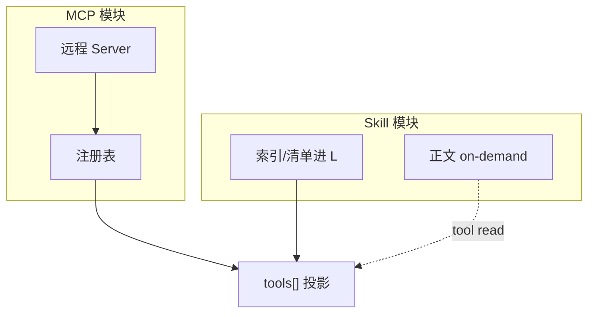

# Skill 与 MCP 模块边界

> **设计导读** · 模块路径与配置详解：[_archive/20-skill-mcp-modules.md](./_archive/20-skill-mcp-modules.md)  
> **关联**：[08-mcp](./08-mcp.md) · [00-HARNESS-DESIGN-PHILOSOPHY](./00-HARNESS-DESIGN-PHILOSOPHY.md)

---

## 1. 一句话

**Skill** = 仓库内可版本化的 **知识与流程文本**；**MCP** = 外部进程的 **工具供应链**——Harness 必须分模块治理，不能混成一个 `tools/` 目录。

---

## 2. 对比表

| 维度 | Skill | MCP |
|------|-------|-----|
| **信任** | 同源仓库、可 code review | 第三方进程 |
| **加载** | 索引 + `skill` 工具读正文 | connect + tools/list |
| **热更** | 文件 watch / projection | mtime 重连 / 重启 |
| **context 成本** | 懒加载正文 | schema 常进 L |
| **门控** | 读路径即可 | 调用走执行门控 |
| **典型 API** | `SKILL.md` + skill.json | `mcp__srv__tool` |

---

## 3. Harness 内模块划分（设计）

| 模块 | 职责 |
|------|------|
| **SkillRegistry** | 发现、版本、投影 manifest |
| **MCPManager** | 传输、list、前缀、重连 |
| **ToolRegistry** | 统一命名、合并 builtin+MCP |
| **VisibilityPolicy** | direct / deferred / hidden |
| **ExecutionGate** | 审批、沙箱、与 L4 对接 |

→ MCP 四层：[08-mcp](./08-mcp.md)

---

## 4. 框架气质

| 项目 | Skill | MCP |
|------|-------|-----|
| OpenHarness | skills_view 投影 | MCPManager |
| deepagents | middleware skills | langchain mcp adapter |
| deer-flow | skills 目录 | MultiServer + 热更 |
| Pi / Cursor 系 | AGENTS.md 规则 | 配置 MCP |
| OpenCode | skill 门 + deferred | V2 演进 |
| nanobot | 轻量 | 启动连接 |

---

## 5. 设计法则

1. **Skill 正文默认不进首屏 L** — 防 token 爆炸。  
2. **MCP 工具必须前缀** — `server__tool`。  
3. **同一 ToolRegistry 出口** — 模型只见一张表。  
4. **Skill 不能绕过沙箱** — 读≠写。  
5. **MCP 断连要降级** — 列表与调用分离失败语义。

---

## 6. 深潜

配置示例、目录结构、路径 → [_archive/20-skill-mcp-modules.md](./_archive/20-skill-mcp-modules.md)
