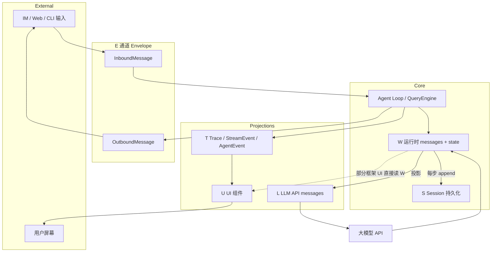
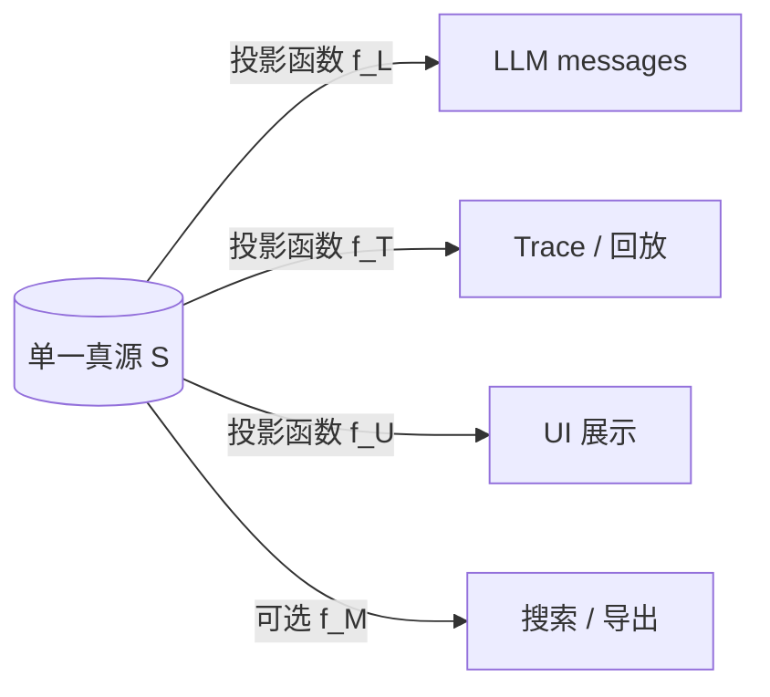
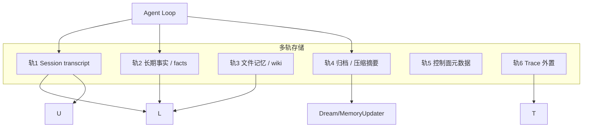

# Session + Message 体系设计对比

> **Harness 设计总览**：[00-HARNESS-DESIGN-PHILOSOPHY.md](./00-HARNESS-DESIGN-PHILOSOPHY.md) §第 2 步（五平面摘要）  
> **姊妹篇**：[19-session-message-model.md](./19-session-message-model.md)（JSON/JSONL 形态、Canonical/Envelope 术语、Tier 1 真源表）  
> **关联**：[06-memory.md](./06-memory.md) · [03-runtime-loop-queue.md](./03-runtime-loop-queue.md) · [14-loop-interjection.md](./14-loop-interjection.md) · [09-channels.md](./09-channels.md) · [agentscope/docs/ARCHITECTURE.md](../../agentscope/docs/ARCHITECTURE.md)

> **最后更新**：2026-08-16

---

## 1. 你要对比的到底是什么

用户说「session、message、送给大模型的 message、loop 记录、UI 展示」——在工程里它们 **不是一层**，而是 **同一条对话在五个平面上的不同投影**。

| 平面 | 代号 | 问什么 | 典型消费者 |
|------|------|--------|------------|
| **持久化 Session** | **S** | 崩溃/续聊后 **恢复什么** | SessionManager、checkpointer、EventLog |
| **运行时 Working** | **W** | Loop 本轮 **内存里** 握着什么 | QueryEngine、`AgentLoop`、graph state |
| **LLM 投影** | **L** | **API 请求体** 里有哪些 messages | `wrap_model_call`、View、Compressor |
| **Loop / Trace** | **T** | 每一步、每次 tool、token、耗时 | LangSmith、StreamEvent、`AgentEvent` |
| **UI / 展示** | **U** | 用户 **屏幕上** 看到什么 | TUI、Web、IM adapter、SSE |

再加两条 **常与 Session 并行、但不等于 transcript** 的轨：

| 轨 | 代号 | 内容 |
|----|------|------|
| **通道 Envelope** | **E** | IM/Gateway 入站/出站（channel、chat_id、附件） |
| **旁路元数据** | **M** | `tool_metadata`、skill 调用记录、artifact 指针（**不进 L**） |

**一句话**：**S 是真源（或真源之一）；W 是运行副本；L 是 W/S 经投影后的子集；T 是观测流（可回放过程）；U 是 T 或 W 的渲染（可与 L 不同步）。**

---

## 2. 端到端：数据如何在平面间流动



**写入时机差异（选型关键）**：

| 时机 | 行为 | 代表 |
|------|------|------|
| **Early persist** | 调 LLM **前** 先落 user 消息 | nanobot SessionManager |
| **Step persist** | 每个 step/event append | OpenHands EventLog |
| **Checkpoint** | 整图 state 快照 | LangGraph |
| **End-of-turn** | 一轮结束写 DB | 部分 Gateway |

---

## 3. 六种体系范式（怎么分、优劣势、为何存在）

在 [19](./19-session-message-model.md) 的 P1–P4（真源形态）之上，按 **S 与 L、T、U 的耦合方式** 再分 **六族**。

### 族 A — 单列表真源（P1）

**结构**：`session.messages`（或 DB 行）= S ≈ W；投影函数产出 L；T/U 从 W 或 loop 边沿衍生。

| 代表 | S/W | L | T | U |
|------|-----|---|---|---|
| **nanobot** | `Session.messages` + JSONL | `get_history()` | bus outbound、runtime events | Channel / WebUI |
| **Hermes** | SessionDB | ContextCompressor | Gateway progress | TUI / IM |
| **OpenHarness** | session + `engine.messages` | `auto_compact` + provider 格式 | `StreamEvent` | Textual TUI |
| **OpenManus** | 内存 `Memory.messages` | 直接 replay | 弱 | CLI |

| 优势 | 劣势 |
|------|------|
| 心智简单；续聊 = 读列表 | 压缩 **改写** S 时丢审计细节 |
| 实现快；调试直观 | 多实例要外置 S（JSONL/DB） |
| 投影层可独立演进（游标、尾窗） | UI 与 L 易混（同一张列表） |

**为何这么设计**：个人助手 / Gateway 产品优先 **交付速度** 与 **可恢复的 transcript**；nanobot 用 `last_consolidated` 把「归档轨」拆开是族 A 的改良。

---

### 族 B — 事件溯源（P2）

**结构**：S = append-only **Event** 文件；W = 内存 event 列表；L = `View(events)` + Condenser；T ≈ Event 流；U 订阅 Server 事件。

| 代表 | 说明 |
|------|------|
| **OpenHands SDK** | `event-NNNNN.json`；Condensation = 新事件类型 |
| **OpenHands 两仓** | app_server（控制面 SQL）+ agent-server（执行面 EventLog） |

| 优势 | 劣势 |
|------|------|
| **审计最强**；压缩不删文件 | 实现与存储成本高 |
| 回放任意 step；多 Agent 调试友好 | View 层必须维护；LLM 格式与 Event 不一致 |
| 适合 coding agent（Action/Observation） | 多实例要 lease + 共享卷或对象存储 |

**为何这么设计**：Coding Agent 需要 **「每一步发生了什么」** 可复盘、可 Condenser 插墓碑；答案对错不够，要 tool 与环境状态。

---

### 族 C — 图 Checkpoint 真源（P3）

**结构**：S = checkpointer blob（含 `messages` + middleware state）；W = graph state；L = middleware 在 `wrap_model_call` 改视图；T = LangSmith / 应用 trace；U = TUI 绑 stream。

| 代表 | 说明 |
|------|------|
| **deepagents** | `SummarizationMiddleware`；`thread_id` |
| **deer-flow** | `ThreadState` + 18 层 middleware |
| **LangGraph** | 库；checkpointer 可选 |
| **TradingAgents** | 固定图 + state |

| 优势 | 劣势 |
|------|------|
| 与 LangChain 生态一体；middleware 扩展 | **S 与 L 纠缠**（压缩直接改 checkpoint） |
| `thread_id` 续聊成熟（配 Postgres） | 裸 messages 不易给人看；UI 需另建 T |
| 子图 / 子 Agent state 可隔离 | 换 checkpointer 要运维 |

**为何这么设计**：团队已在 LangGraph 上堆 **middleware 链**（todo、skills、subagent）；state 一次序列化比自管 EventLog 省事。

---

### 族 D — 双平面（控制面 / 执行面）

**结构**：S 分裂 — 执行面 EventLog + 控制面 SQL/镜像；U 连控制面；L 只在执行面沙箱内。

| 代表 | OpenHands app_server + software-agent-sdk + agent-server |

| 优势 | 劣势 |
|------|------|
| 企业多租户、Webhook、权限在控制面 | 部署复杂；目录勿混（v1_conversations vs SDK path） |
| 执行面可 per-conversation 沙箱 | 跨平面一致性要自己保证 |

**为何这么设计**：**产品** 要 SaaS 元数据与 **执行** 隔离；沙箱生命周期 ≠ 对话元数据生命周期。

---

### 族 E — CLI 黑盒 + Mirror（P1 变体）

**结构**：S 真源在 **CLI 进程内**；Python `SessionStore` = Mirror；L/U/T 均在 CLI；SDK 只解析 stdout JSONL。

| 代表 | Claude Agent SDK + Claude Code |

| 优势 | 劣势 |
|------|------|
| 能力随 Claude Code 升级 | **不可自托管** 多副本 Session |
| Python 侧轻（options + parser） | 体系不透明；难自定义 L 投影 |
| SessionStore 可外置 transcript 备份 | Mirror ≠ 真源 |

**为何这么设计**：厂商把 **session + 压缩 + 工具** 封进 CLI；SDK 是 **遥控面**，不是完整 Harness。

---

### 族 F — 流式事件优先（UI-first）

**结构**：W = `AgentState.context`；L = 压缩后 context + summary；**T = 一等 `AgentEvent`（17+ 类型）**；U 消费 `reply_stream`，与 L **显式分离**。

| 代表 | AgentScope v2 |

| 优势 | 劣势 |
|------|------|
| UI/确认流（`RequireUserConfirmEvent`）干净 | 嵌入模式无统一 Session 服务 |
| Thinking/Text/ToolCall 分块流式 | `memory/`、`session/` 包 v2 未完全迁移 |
| Redis `create_app` 可托管 S | 要理解 Msg vs AgentEvent 两套模型 |

**为何这么设计**：**可观测 + 交互式 UI**（确认、外部执行）比「一个 messages 列表」更重要；[agentscope ARCHITECTURE](../../agentscope/docs/ARCHITECTURE.md) 把 `message` 与 `event` 模块并列。

---

### 范式总表

| 族 | 真源 | 最适合 | 不适合 |
|----|------|--------|--------|
| **A 单列表** | messages 列表/表 | 个人 Gateway、快速产品 | 强审计、逐步回放 |
| **B 事件溯源** | Event append-only | Coding Agent、企业审计 | 极简脚本 |
| **C Checkpoint** | LangGraph state | LC/LG 栈、middleware -heavy | 要裸 transcript 产品 |
| **D 双平面** | Event + SQL | 多租户 SaaS | 单机 demo |
| **E CLI 黑盒** | 厂商 CLI | 最快接 Claude Code | 自建 Harness |
| **F 流式事件** | State + AgentEvent | 流式 UI、人机确认 | 只要 headless API |

---

## 4. Tier 1 — 五平面 + 旁路 对照表

图例：**S** Session · **W** Working · **L** LLM · **T** Trace · **U** UI · **E** Envelope · **M** 旁路元数据

| 项目 | 族 | S | W | L | T | U | E | M |
|------|----|---|---|---|---|---|---|---|
| **nanobot** | A | JSONL `sessions/` | `Session.messages` | `ContextBuilder` | bus events、turn events | Channel/WebUI | MessageBus | memory 文件轨 |
| **Hermes** | A | SQLite SessionDB | DB 加载到内存 | ContextCompressor | Gateway progress | TUI/IM | Gateway adapters | memories/*.md |
| **OpenHarness** | A | session 快照 | `engine.messages` | compact + provider | `StreamEvent` | Textual TUI | channels | `tool_metadata` |
| **deer-flow** | C | checkpoint + thread 目录 | ThreadState | middleware 链 | LangSmith、Gateway | Web/IM（app 层） | `app/channels` | `memory.json` |
| **deepagents** | C | checkpointer / SQLite | graph state | SummarizationMiddleware | LangSmith | deepagents-code TUI | — | `AGENTS.md` |
| **OpenHands** | B+D | EventLog + lease | events 列表 | View+Condenser | Event 即 T | app_server UI | webhook/API | MEMORY.md |
| **AgentScope v2** | F | Redis / JSON dump | `AgentState.context` | summary 伪消息 | **AgentEvent** 流 | reply_stream 消费者 | 应用层 | RAG/Mem0 MW |
| **OpenAI Agents** | A | Session backend | Session items | compaction session | Runner trace | 应用自建 | — | sandbox memory |
| **Claude SDK** | E | CLI session | CLI 内 | CLI 内 | CLI JSONL 解析 | CLI/TUI | — | SessionStore mirror |
| **Letta** | A | Server DB | messages+blocks | blocks 始终在 L | server API | Letta UI | — | memory_blocks |
| **LangGraph** | C | checkpointer | state | 上层定义 | 上层 | 上层 | — | store |
| **smolagents** | A | 无 | step 历史 | 直接 | callback | CLI | — | — |
| **crewAI** | A | 弱 | Task context | Executor | 有限 | — | — | LanceDB Memory |

---

## 5. 同一轮对话：各层长什么样（nanobot vs OpenHands vs deer-flow）

### 5.1 nanobot（族 A + E）

```text
用户 Telegram 消息
  → E: InboundMessage(channel, chat_id, content)
  → W: Session.add_message(user)     # Early persist → S JSONL
  → L: ContextBuilder.build_messages(history, memory, skills)
  → LLM
  → W: append assistant + tool messages
  → T: SessionTurnStarted / Persisted；OutboundMessage
  → U: Channel 渲染 outbound 文本
  → S: 整 session 原子写 JSONL

压缩时：W/S 游标 last_consolidated++；摘要进 memory/history.jsonl（**非 S**）
```

### 5.2 OpenHands（族 B）

```text
用户 API 请求
  → W: 新 step 调度
  → S: append event-00042.json (Action)
  → 环境执行
  → S: append event-00043.json (Observation)
  → L: View.from_events(all) → Condenser 可能 append Condensation event
  → LLM
  → T: 每个 event 文件 + webhook
  → U: app_server 读镜像 / SSE
```

### 5.3 deer-flow（族 C + E）

```text
IM 消息
  → E: channel → Gateway 映射 thread_id
  → W/S: LangGraph invoke 加载 checkpoint
  → L: middleware 改 ThreadState.messages 视图 + system 注入 memory.json
  → LLM → tools → checkpoint 更新
  → T: LangSmith trace
  → U: Gateway Web/飞书（常与 T 同源）
```

---

## 6. UI 数据 ≠ LLM 数据（常见模式）

| 模式 | 说明 | 例子 |
|------|------|------|
| **同源渲染** | U 直接展示 W 中 user/assistant 文本 | 简单 CLI |
| **事件流渲染** | U 只消费 T（delta、tool 卡片） | AgentScope `TextBlockDelta`、OpenHarness `AssistantTextDelta` |
| **裁剪展示** | U 显示全文；L 已压缩 | Hermes 压缩后 UI 仍可从 DB 拉全量 |
| **进度旁路** | T 含 tool 进度；不进 L | Hermes Gateway、`StatusEvent` |
| **镜像延迟** | U 读控制面；L 在执行面 | OpenHands 两仓 |

**OpenHarness `StreamEvent` 与 `ConversationMessage` 分离**（`engine/stream_events.py`）：

- `ConversationMessage` → W/S（对话真源）
- `AssistantTextDelta` / `ToolExecutionStarted` → T → U（**不必**写回 messages 列表）

---

## 7. Loop 记录 / Trace 放哪

| 项目 | T 存什么 | 与 S 关系 |
|------|----------|-----------|
| **LangSmith** | 跨框架 trace；steps、tool、tokens | 外置；非 S |
| **nanobot** | bus runtime events | 可选；S 仍为 JSONL |
| **OpenHands** | Event 文件 **即** 主审计轨 | T ⊆ S |
| **AgentScope** | `AgentEvent` 17+ 类型 | 流式；S 为 state dump |
| **OpenHarness** | `StreamEvent` + hooks | 旁路 |
| **Hermes** | FTS + session 搜索 | SessionDB 可搜 transcript |

**评测 / 对比模型**时应用 **T**（trace）分析 tool 链；**续聊**用 **S**；**调 prompt** 看 **L** 投影。

---

## 8. 为什么这么设计（工程动机汇总）

| 动机 | 倾向族 | 一句话 |
|------|--------|--------|
| 最快做出 Gateway 助手 | A | 一个 messages 列表够用 |
| 要 LangGraph middleware 生态 | C | checkpoint 一把梭 |
| Coding / 审计 / 企业合规 | B、D | Event 不可删 |
| 流式 UI + 人机确认 | F | AgentEvent 独立于 Msg |
| 不想维护 Harness | E | 委托 CLI |
| IM 与 Loop 解耦 | A/C + E | Bus 或 Gateway 映射 thread |
| 压缩但不丢档案 | A+归档轨、B 墓碑 | nanobot history.jsonl、Condensation event |
| 多副本 API | S 外置 Postgres/Redis | 与族无关，见 [17-deployment.md](./17-deployment.md) |

**没有「唯一正确」**：族 A 不是「简陋」，族 B 不是「总是更好」——**产品阶段、审计要求、是否已押 LangGraph** 决定取舍。

---

## 9. 选型决策（简树）

```text
要强审计 / 逐步回放？
  ├─ 是 → 族 B（OpenHands）或 族 D（企业 OpenHands）
  └─ 否 ↓

已全栈 LangGraph / deepagents？
  ├─ 是 → 族 C；UI 自建 T 流
  └─ 否 ↓

要流式 UI + 工具确认？
  ├─ 是 → 族 F（AgentScope）或 OpenHarness StreamEvent
  └─ 否 ↓

个人 Gateway / 飞书 Bot？
  ├─ 是 → 族 A（nanobot / Hermes / deer-flow Gateway）
  └─ 否 ↓

只接 Claude Code？
  └─ 族 E
```

---

## 10. 与 Memory 的边界（再次强调）

| 属于 Session/Message 体系 | 属于 Memory（见 [06](./06-memory.md)） |
|---------------------------|----------------------------------------|
| user/assistant/tool **transcript** | `memory.json` facts |
| EventLog / checkpoint | SOUL.md、MEMORY.md |
| `get_history()` 投影 | mem0、memory_blocks |
| UI 聊天气泡 | Dream 巩固、LTM 检索注入 **L** 的 system 段 |

**deer-flow** 是教科书级分离：checkpoint messages（S/W/L 轨）与 `memory.json`（M3 轨）**正交**；Summarization 动前者，MemoryUpdater 动后者。

---

## 12. 一份数据多投影 vs 多份数据分用途（专题）

这是 Session/Message 体系里 **最常被问的两条路**：要么 **一个真源、多种读法（投影）**；要么 **多条存储、各管一事（多轨）**。多数成熟 Agent **两者混用**。

### 12.1 策略 A — 一份数据，多种投影

**定义**：**单一 Canonical 真源 S**（或 S≈W）保存「完整对话事实」；**L / T / U 都是读同一真源的不同视图**，不各自维护第二份 transcript。



| 投影 | 典型操作 | 目的 |
|------|----------|------|
| **f_L** | 尾窗、token 预算、去 orphan tool、摘要替换、删 tool schema | **省 token、合法 tool 链** |
| **f_T** | 原样或加 step 元数据 | **观测、评测、调试** |
| **f_U** | 流式 delta、折叠 tool、进度条 | **体验**；可与 L 不同步 |
| **f_M** | FTS、SessionStore mirror | **搜索、合规导出** |

**Tier 1 谁主要走「一份数据多投影」**

| 项目 | 真源 S | f_L（给模型） | f_T / f_U（观测/UI） | 备注 |
|------|--------|---------------|----------------------|------|
| **OpenHands** | EventLog append-only | `View.from_events` + Condenser | Event ≈ T；U 订 webhook/SSE | **教科书级**：Event≠LLM 格式，L 纯投影 |
| **Hermes** | SessionDB 全量 rows | `ContextCompressor` | Gateway progress；DB FTS 搜 **全量** | 压缩改 **当轮 L**；库内仍全量 |
| **nanobot** | `Session.messages` + JSONL | `get_history()` 游标+尾窗 | Bus outbound、`SessionTurn*` events | 归档用 **另一文件**（见 12.2） |
| **OpenHarness** | `engine.messages` | `auto_compact` + provider 格式 | `StreamEvent` → TUI | `tool_metadata` **不进** messages |
| **AgentScope v2** | `AgentState.context` | 删头 + `summary` 伪消息 | **AgentEvent** 流（与 Msg 模块并列） | 真源一个 state；UI 走事件轨 |
| **OpenAI Agents** | Session items | `CompactionSession` wrapper | Runner trace | compaction 是 Session 的 **一种读法** |
| **Letta** | DB messages | compaction 后列表 | Server API / UI | blocks 另轨（见下） |
| **OpenManus** | 内存 messages | 直接 replay（弱投影） | CLI | 几乎无投影层 |
| **smolagents** | step 历史 | 直接 | callback | 极简 |

**优势**：真源唯一 → 续聊、审计口径一致；换 UI 不必 duplicate transcript。  
**劣势**：投影层要维护（View、Compressor、get_history）；**压缩若写回 S** 则「多投影」退化成「改真源」（族 C checkpoint 常见）。

**典型代码路径**

```text
OpenHands:  events/*.json  →  View.from_events()  →  model messages
Hermes:     SessionDB load →  ContextCompressor   →  chat.completions messages
nanobot:    Session.messages → get_history()       →  runner messages
OpenHarness: engine.messages → auto_compact_if_needed → LLM call
```

---

### 12.2 策略 B — 多份数据，各管不同用途

**定义**：**不存在单一 transcript 真源**；按 **用途** 拆成多条 **正交存储轨**，各轨有自己的写入者与消费者。



**常见分轨（与 [06-memory.md](./06-memory.md) 四条线对齐）**

| 轨 | 存什么 | 谁写 | 谁读（进 L 还是旁路） |
|----|--------|------|------------------------|
| **Session transcript** | 多轮 user/assistant/tool | Loop 每 turn | 投影 → **L** |
| **LTM facts** | `memory.json`、mem0、blocks | MemoryUpdater / 工具 | 注入 **system**，非 messages 列表 |
| **文件记忆** | SOUL、MEMORY.md、AGENTS.md | Dream、skill、用户 | system 或 read_file |
| **归档轨** | `history.jsonl`、Condensation event | Consolidator | Dream / Recent History；**不进** Session replay |
| **控制面** | 对话标题、租户、lease | app_server | **U**、运维；不进 L |
| **外置 Trace** | LangSmith、OpenTelemetry | SDK | **T**；通常不回写 S |

**Tier 1 谁主要走「多份数据分用途」**

| 项目 | 轨数 & 典型拆分 | 设计标签 |
|------|-----------------|----------|
| **nanobot** | ① `sessions/*.jsonl` ② `SOUL/USER/MEMORY.md` ③ `memory/history.jsonl` ④ Dream 游标 | **族 A + 多轨**；Session 与归档、长期 **三分** |
| **deer-flow** | ① checkpoint `messages` ② per-user `memory.json` ③ `SOUL.md` ④ `threads/.../user-data/` | **族 C + 多轨**；facts 与 messages **正交** |
| **Hermes** | ① SessionDB ② `~/.hermes/memories/*.md` ③ 可选 mem0/Honcho ④ `.hermes/plans/` | transcript vs LTM vs Plan 文件 |
| **deepagents** | ① checkpointer messages ② `AGENTS.md` inject ③ optional LangGraph `store` | middleware 各管一条轨 |
| **OpenHands** | ① EventLog ② `MEMORY.md` ③ app_server SQL ④ 可选 S3 镜像 | **族 B+D 多轨** |
| **OpenHuman** | ① chat JSONL ② Memory Tree wiki ③ SQLite session_db | 对话 vs 知识页 |
| **crewAI** | ① Task/Executor messages ② LanceDB **Memory** ③ Chroma **Knowledge** | 三者 **语义不同** |
| **Letta** | ① messages ② memory_blocks（archival/recall） | blocks **始终在 L**；与 messages 并列 DB |
| **OpenAI Agents** | ① Session backend ② sandbox `MEMORY.md` 管线 | Session 与 sandbox 记忆 **独立配置** |
| **Claude SDK** | ① CLI 内 session ② SessionStore mirror | mirror **≠** 真源 |
| **AgentScope** | ① `context` ② 可选 Mem0/ReMe Middleware ③ RAG KB | 嵌入时应用拼轨 |
| **TradingAgents** | ① LangGraph state ② 决策 log Markdown | 领域专用 |

**优势**：各轨生命周期、压缩、合规策略 **独立**；LTM 更新不必动 transcript。  
**劣势**：一致性难（「模型记得但 Session 里没有」）；要写清 **哪轨进 L**；运维多条存储。

---

### 12.3 对照：谁偏哪种？谁混合？

| 模式 | 含义 | 代表 |
|------|------|------|
| **纯投影** | 几乎只有 S + f_L/f_U；无独立 LTM 轨 | OpenManus、smolagents |
| **投影为主 + 旁路 T/U** | 一个 transcript；UI/Trace 另消费 | OpenHarness、OpenAI Agents compaction |
| **投影 + 强 View** | S 与 L **格式不同**；S 永不按 LLM 形状存 | **OpenHands** |
| **多轨为主** | Session、facts、文件 **分开文件/表** | **deer-flow、nanobot、Hermes** |
| **多轨 + 投影** | 每轨内部仍可投影（Session 全量→Compressor→L） | Hermes、nanobot、deer-flow |
| **双平面多轨** | 执行面 Event + 控制面 SQL + MEMORY 文件 | OpenHands 企业 |
| **黑盒** | 轨在 CLI 内不可见 | Claude SDK |

**一张总表（Tier 1）**

| 项目 | 一份数据多投影（强度） | 多份数据分用途（轨） |
|------|------------------------|---------------------|
| **OpenHands** | ★★★★★ View/Condenser | Event + MEMORY + SQL |
| **Hermes** | ★★★★ Compressor | SessionDB + memories + provider + plans |
| **nanobot** | ★★★ get_history | session + memory md + history.jsonl |
| **deer-flow** | ★★★ middleware 改 checkpoint | messages + memory.json + SOUL + artifacts |
| **OpenHarness** | ★★★ compact | messages + tool_metadata + MEMORY 检索 |
| **AgentScope** | ★★★ context→summary | context + AgentEvent + 可选 Mem0/RAG |
| **deepagents** | ★★ Summarization 写回 checkpoint | messages + AGENTS.md + store |
| **Letta** | ★★ compaction | messages + blocks |
| **crewAI** | ★ 弱 Session | Task msgs + Memory + Knowledge |
| **Claude SDK** | ？（CLI 内） | CLI session + mirror |
| **OpenManus** | ★ 几乎无 | 仅内存 messages |
| **LangGraph** | ★★ 取决于上层 | checkpointer + store（可选） |

★ 越多 = **越依赖「同一真源的不同读法」**；多轨列 = **独立存储条数（典型）**。

---

### 12.4 为什么有的选投影、有的选多轨

| 需求 | 更倾向 | 原因 |
|------|--------|------|
| 续聊 = 读一份 transcript | 单真源 + f_L | 实现简单 |
| 压缩但不丢原始 step | 投影（OpenHands 墓碑）或 **归档轨**（nanobot history） | 不能改 S 或 S 不可删 |
| 用户 facts 跨 session | **多轨** `memory.json` / mem0 | facts **不是** chat 行 |
| 流式 UI、tool 卡片 | 投影 T/U **旁路** S，或 AgentEvent | L 不必含 delta |
| LangGraph middleware | checkpoint **一坨** 或 messages+facts **拆开** | deer-flow 选拆开 |
| 企业审计 | Event 真源 + SQL 元数据 | 控制面不进沙箱 |
| 评测对比模型 | 固定 S + 换 f_L 或固定轨 + 换模型 | 见 libs/evals |

---

### 12.5 自建时怎么选

```text
只有「聊天续聊」？
  → 先单轨 S + get_history/compaction（策略 A）

还要「用户偏好跨月记住」？
  → 加 LTM 轨（memory.json / MEMORY.md），**不要**塞进 messages 列表（策略 B）

还要「逐步回放 tool」？
  → Event 真源 + View（OpenHands 路线）或 Session + 归档 JSONL（nanobot 路线）

已用 LangGraph？
  → messages 在 checkpoint；facts 建议 **第二轨**（deer-flow 做法），避免 Summarization 擦掉 facts 来源

要强 UI 流式？
  → T/U 旁路（StreamEvent / AgentEvent），勿把 delta 写入 S
```

---

## 11. 文档索引

| 需求 | 文档 |
|------|------|
| JSON/JSONL 字段、Canonical 术语 | [19-session-message-model.md](./19-session-message-model.md) |
| Session 后端、多实例 | [06-memory.md](./06-memory.md) §Session |
| §4 矩阵 Session/Message/Memory 分列 | [01-overview.md](./01-overview.md) §4 |
| 运行中第二条消息 | [14-loop-interjection.md](./14-loop-interjection.md) |
| AgentScope Msg vs Event | [agentscope/docs/ARCHITECTURE.md](../../agentscope/docs/ARCHITECTURE.md) |
| OpenHands 两仓 | [10-openhands.md](./10-openhands.md) |

**维护者**: OpenHarness framework-comparison
