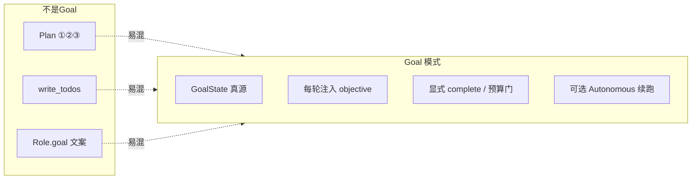
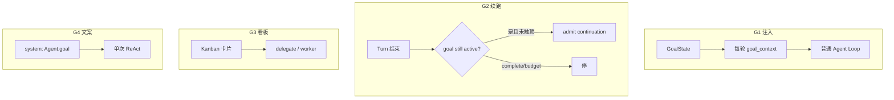
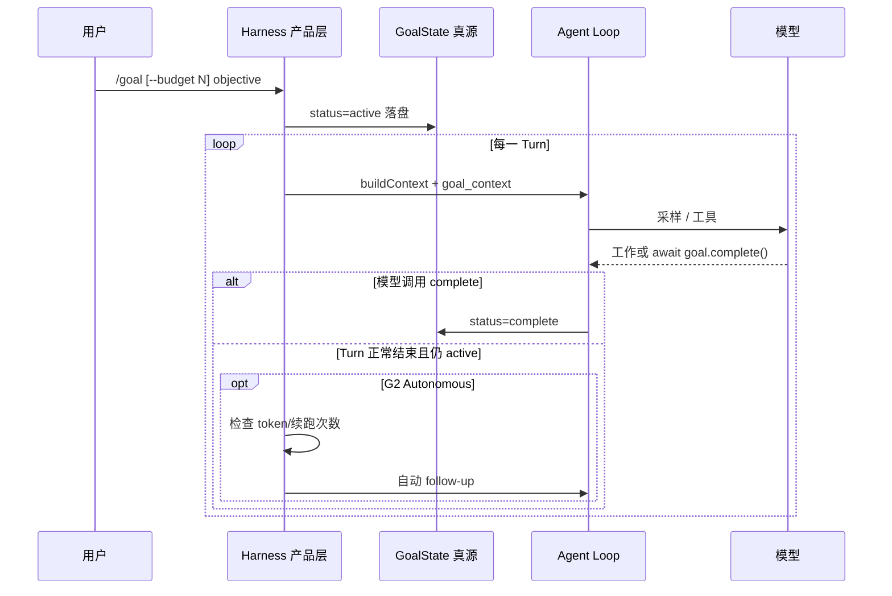
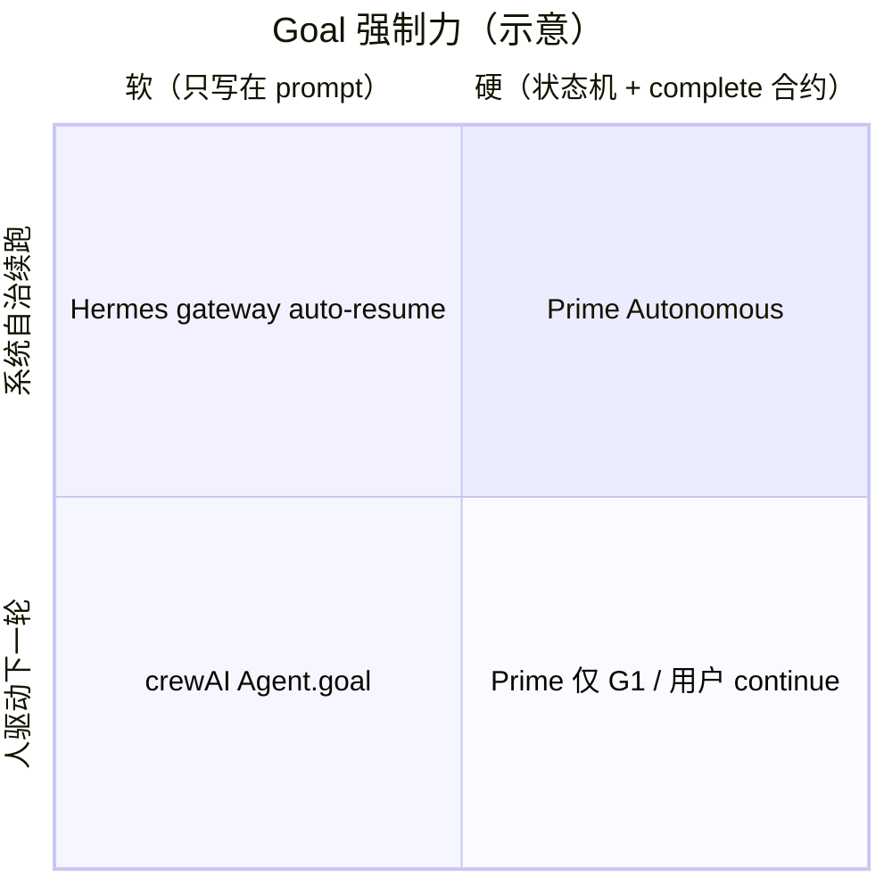
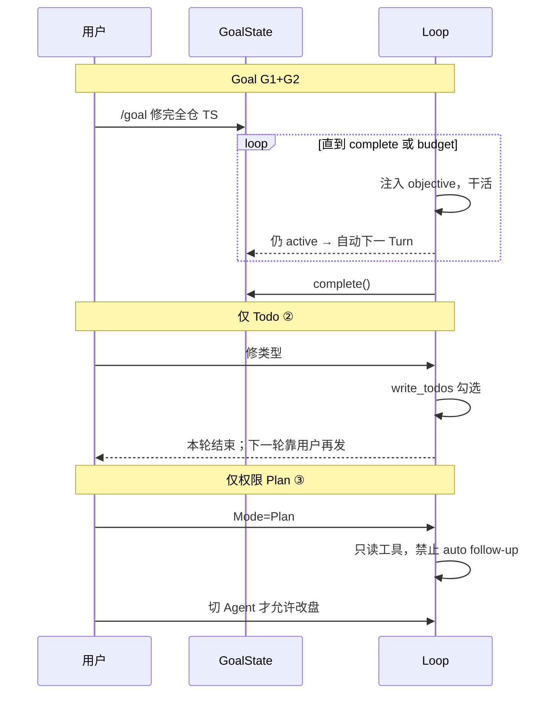
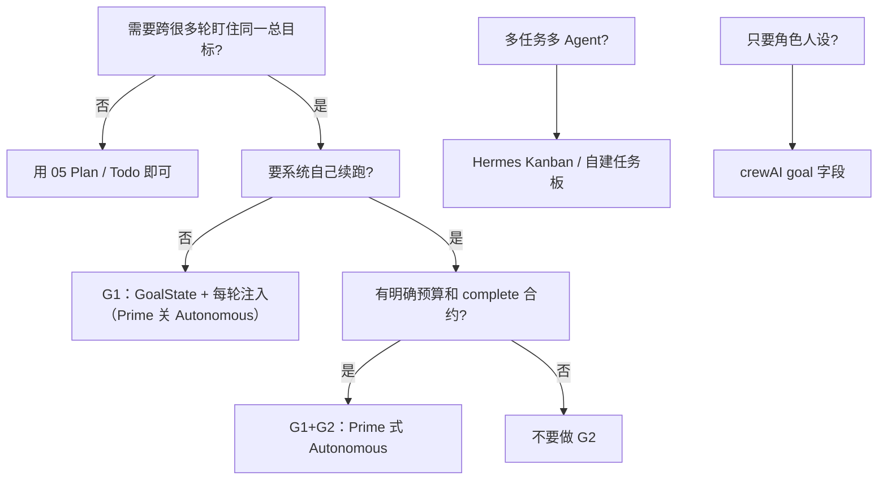

# Goal 模式：跨 Turn 总目标

> **设计导读**（本专题无独立 `_archive/` 长文）  
> **总览**：[00-HARNESS-DESIGN-PHILOSOPHY](./00-HARNESS-DESIGN-PHILOSOPHY.md) · Plan：[05-plan-mode](./05-plan-mode.md) · 插队：[14-loop-interjection](./14-loop-interjection.md)  
> **深潜**：[Prime GOALS_AND_REFINE](../../prime-agent-architecture/GOALS_AND_REFINE.md) · [Hermes FEATURE_DESIGN_CATALOG](../../hermes-agent-architecture/FEATURE_DESIGN_CATALOG.md)

---

## 1. 一句话

各项目的「Goal」**不是同一种东西**——更不是 [05 Plan](./05-plan-mode.md)。  
Plan 回答 **这一轮怎么拆、能不能改盘**；Goal 回答 **跨很多轮还在追哪一件事、谁宣布完成、预算用尽怎么办**。

用户说「goal 模式」时，要先拆成：**持久目标注入**、**自治续跑**、**看板任务**、**角色 prompt 里的 goal 字段**。混谈会把 crewAI 的 `Agent.goal=` 当成 Prime 的 `/goal`。

---

## 2. 先和 Plan / Todo 切开

| 机制 | 用户感受 | 生命周期 | 副作用 |
|------|----------|----------|--------|
| **Plan ① 外环** | 先出步骤表再逐步干 | 一次 Flow | 逐步放开 |
| **Plan ② Todo** | 边干边勾 | 同一 Loop | 立刻有 |
| **Plan ③ 权限 Plan** | 规划模式不能乱写 | 协作模式开关 | **硬禁写** |
| **Goal（本文）** | 「总任务还没完，下一轮别忘」 | **跨 Turn / 可恢复** | **通常要继续干** |

**易错**：

- Codex / OpenHarness 的 **Plan mode** 是权限轨，且 Plan 下 **禁止悄悄 auto follow-up**——和 Goal 的「自动续跑直到完成」方向相反。  
- `write_todos` 是进度勾选，**压缩或新 session 后不一定还是同一总目标**。  
- crewAI / MetaGPT 的 `goal=` 是 **人设字符串**，没有 `complete()` 合约，也没有跨 Turn 预算。

---

## 3. 四种 Goal 语义（必背）

| 轨 | 用户感受 | 真源 | 结束条件 |
|----|----------|------|----------|
| **G1 状态注入** | `/goal 修完类型错误` 之后每轮都记得 | Session `GoalState` / custom entry | `goal.complete()` 或用户 clear |
| **G2 自治续跑** | 本轮结束但目标仍 active → 系统自己再开一轮 | 同 G1 + continuation 计数 | complete / budget / pause / error |
| **G3 看板** | 多任务卡片跨会话、可派给子 Agent | Kanban / tasks DB | 卡片 Done |
| **G4 角色目标** | 「你是研究员，goal=把报告写完」 | 静态 prompt | 模型自己停；无硬合约 |

**G1 可以单独存在**（用户每轮手动回车「继续」）。  
**G2 以 G1 为前提**：没有持久 objective，续跑只是「再聊一句」，不是 goal 模式。

---

## 4. 实现原理（G1+G2 核心回路）

这是 Prime `/goal` 的标准机械结构；其它 harness 若自称 Goal 模式，应对齐这张图缺了哪一块。

| 零件 | 作用 | 缺了会怎样 |
|------|------|------------|
| **持久 GoalState** | 压缩、重启、换 turn 仍在 | 变成普通聊天，模型忘掉总目标 |
| **每轮注入** | objective 进 L 平面，不依赖聊天里那句 `/goal` | 历史一切就丢目标 |
| **显式完成 API** | 对照 objective 审计，禁止「感觉做完」 | 自治续跑停不下来 |
| **预算** | token / 续跑次数 / wall-clock | 烧穿额度 |
| **Autonomous 门** | 仅 goal active 且非 Plan 才续跑 | 与权限 Plan、steer 冲突 |
| **pause / resume / clear** | 人控 | 只能杀进程 |

Prime 把这套放在 **`AgentSession` 产品层**，**不放进** `pi-agent-core`：Loop 心脏不知道 Goal；Goal 是「每轮多喂一块上下文 + turn 结束后要不要再 admit」。

---

## 5. 正交四维（选型用）

| 维度 | 问什么 | 例子 |
|------|--------|------|
| **语义轨** | G1 / G2 / G3 / G4 | Prime vs Hermes Kanban vs crewAI |
| **完成权** | 模型 API / 用户 slash / 卡片 Done | `goal.complete()` vs `/goal clear` |
| **续跑权** | 人回车 vs harness admit | Prime Autonomous vs 纯 G1 |
| **与 Plan 的关系** | 互斥还是可叠加 | Codex Plan **禁** auto follow-up；Goal **要**副作用 |

---

## 6. 框架设计画像

| 框架 | 主轨 | 设计要点 |
|------|------|----------|
| **Prime** | **G1 + G2** | `/goal` → JSONL `thread_goal_state`；每轮 `<goal_context>`；ipython `await goal.complete()`；Autonomous 按预算 follow-up；与 `/refine`（改 Harness）正交 |
| **Hermes** | **G1 弱 + G3** | `/goal` 目标追踪；**Durable Kanban** 才是跨 Agent 持久工作项；Gateway auto-resume 更像会话续跑而非 GoalState 机 |
| **Codex** | **无产品 /goal**；有 follow-up / `goals.db` 投影 | 协作 **Plan** 与自动 follow-up **互斥**；续跑是 Turn 邮箱语义，不是「对照 objective 完成」 |
| **OpenHarness / ohmo** | **无 GoalState** | 有 `PermissionMode.PLAN`（见 [05](./05-plan-mode.md) 轨 ③）；长任务靠用户续聊或 Coordinator/Swarm，没有 complete 合约 |
| **deepagents / deer-flow** | **② Todo，非 Goal** | middleware `write_todos` 同 Loop；无跨 turn GoalState |
| **OpenManus / crewAI** | **G4 或 Plan ①** | `Agent.goal` / Crew planning；无预算状态机 |
| **MetaGPT** | **G4 变体** | SOP 角色职责 ≈ 固定 goal 文案 |
| **nanobot** | **插队续跑 ≠ Goal** | mid-turn inject；文档/生成稿里出现过 Sustained Goals 设计，**不能**与当前默认 loop 混称为已交付 Goal 模式 |
| **OpenHands** | **无** | Event step + Condenser；任务边界在 Conversation，不是 GoalState |
| **Pi core** | **无** | 双环不知道 goal；Prime 在 core **之上**加 |
| **Letta** | **记忆块可写目标** | block 可持久，但不是 slash Goal 模式 |
| **LangGraph** | **图状态可自造** | checkpoint 里放 `goal` 字段是应用层，框架不提供模式 |

---

## 7. 端到端：有 Goal vs 只有 Todo vs 只有 Plan

| | Goal G1+G2 | Todo ② | 权限 Plan ③ |
|--|------------|---------|---------------|
| **跨 turn 记得总目标** | 状态机保证 | 弱（在 messages/todos 里） | 不追求做完 |
| **谁开下一轮** | 可选 Autonomous | 用户 | 用户批准后切模式 |
| **适合** | 长程收口（全仓 check） | 探索型 coding | 先想清楚再动手 |
| **风险** | 完成函数被滥用；续跑烧钱 | 目标漂移 | 与 Goal 同时开会语义打架 |

---

## 8. 与 Compaction / Refine / 插队 的分工

Prime 的三分法可推广为设计检查表（其它项目应对号入座）：

| 机制 | 问什么 | 典型存哪 |
|------|--------|----------|
| **Compaction** | 历史太长？ | 压缩节点 / summary |
| **Refine / Memory** | 以后怎么更聪明？ | Harness / MEMORY.md |
| **Goal** | **这件事**还没办完？ | GoalState |
| **Steer / 插队** | 当前 turn 用户插话？ | pending / steering 通道 |
| **Kanban** | 多件事、多人/多 Agent？ | 看板真源 |

Goal **不应**靠「把 objective 写进 compaction summary」来活——summary 会被再压；objective 要有独立真源。

---

## 9. 设计法则

1. **先分类再对比** — 不说「支持 Goal」，说 G1–G4 哪条。  
2. **Goal ≠ Plan ≠ Todo** — ③ 禁副作用；Goal 要副作用；Todo 无完成合约。  
3. **完成必须可审计** — 模型调用 `complete` 或人 clear；不要用「助手说做完了」。  
4. **续跑与 Plan 互斥** — 规划模式禁止 auto follow-up（Codex 已证明这是安全设计）。  
5. **Goal 放产品层** — Loop 内核保持「跑完一轮就停」；G2 在 admit 边界。  
6. **预算是一等公民** — 无 token/次数上限的 G2 不是模式，是事故。  
7. **多目标用看板** — 单 session 一个 active Goal（G1）；并行工作项走 G3，避免多个 Autonomous 抢同一 Loop。

---

## 10. 选型

自建最小集：**GoalState（active/paused/complete/budget_limited）+ 注入 + complete + 预算**；Autonomous 后做。  
OpenHarness 若要补 Goal 模式：不要改 `PermissionMode.PLAN`，应在 QueryEngine **turn 结束 admit** 处加 G1/G2，并与 PLAN 互斥。

---

## 11. 深潜

| 需求 | 读 |
|------|-----|
| Prime `/goal` 字段、complete、与 refine 对照 | [GOALS_AND_REFINE.md](../../prime-agent-architecture/GOALS_AND_REFINE.md) |
| Prime Goals × Autonomous 流程图 | [ARCHITECTURE_GUIDE §6.7](../../prime-agent-architecture/ARCHITECTURE_GUIDE.md) |
| Hermes `/goal` 与 Durable Kanban | [FEATURE_DESIGN_CATALOG](../../hermes-agent-architecture/FEATURE_DESIGN_CATALOG.md) |
| Codex Plan 禁 follow-up | [SECURITY_ARCHITECTURE](../../codex-architecture/SECURITY_ARCHITECTURE.md) · [05-plan-mode](./05-plan-mode.md) |
| Turn 插队 vs 续跑 | [14-loop-interjection](./14-loop-interjection.md) |
