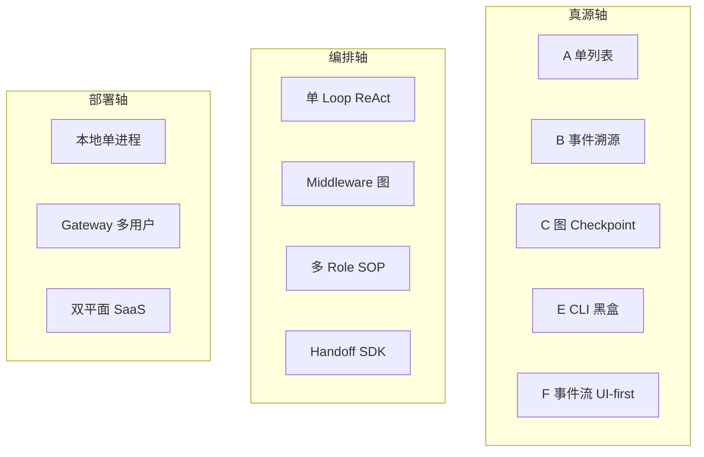
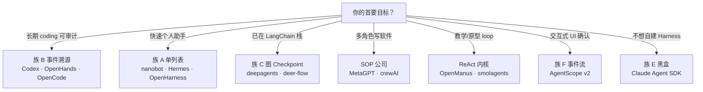
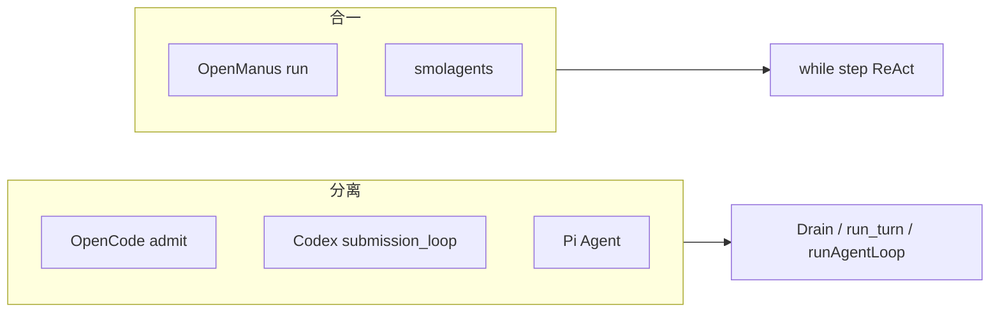

# Harness 设计光谱：框架落在哪一格

> **定位**：用 **设计轴** 对比框架，不列仓库路径。  
> **前置**：[00-HARNESS-DESIGN-PHILOSOPHY.md](./00-HARNESS-DESIGN-PHILOSOPHY.md)  
> **单项目深潜**：[CROSS_AGENT_DESIGN_INDEX.md](../../CROSS_AGENT_DESIGN_INDEX.md)

---

## 1. 三维坐标（先想族谱，再想名字）

选型时 **各轴独立打分**，不要「因为用 LangGraph 就连 Gateway 一起上」。

---

## 2. Tier 1 框架 — 设计画像（无路径）

| 框架 | 真源族 | Loop 哲学 | 控制/执行 | 中途输入 | 多 Agent | 安全成熟度 |
|------|--------|-----------|-----------|----------|----------|------------|
| **Codex** | B 事件 Rollout + 内存 history | Provider Turn / Step | ✅ 分离 | steer / mailbox | spawn 子 Thread | 四层 + Guardian |
| **OpenCode** | B SQLite EventV2 | Provider Turn | ✅ admit / Drain | steer / queue | subagent 配置 | 权限 + 沙箱 |
| **Pi** | A/C JSONL 树 | 双环 Agent/Loop | ✅ Agent vs Loop | steering / follow-up | subagent lane | 扩展 + 工具策略 |
| **Prime** | A JSONL 树 | IPython 单工具 | Daemon/Worker | steer | `rlm.run` 子 Session | host 策略 |
| **deepagents** | C graph checkpoint | Middleware 超步 | 图内 | checkpointer interrupt | SubAgent middleware | backend 可插拔 |
| **deer-flow** | C + 重 middleware | 同左 | 同左 | 队列式产品 | 子 agent | MCP deferred |
| **OpenHands** | B EventLog | Event step | 双平面 D2 | server 事件 | 插件式 | 远端沙箱 |
| **nanobot** | A JSONL + consolidate | Bus → Runner | Gateway 清晰 | per-session 锁 | 弱 | Gateway 认证 |
| **Hermes** | A SessionDB | ReAct while | Gateway | progress 流 | 弱 | TUI + 策略 |
| **OpenHarness** | A session + engine | ReAct QueryEngine | 单进程 | 有限 | task worker | Textual + 策略 |
| **OpenManus** | A 内存 only | ReAct step | ❌ 合一 | 无 | PlanningFlow 步骤 | AskHuman |
| **MetaGPT** | A 消息 + 文件产物 | Role tick 并行 | env.run 轮 | env 消息 | 公司 SOP | ask_human |
| **OpenAI Agents SDK** | A run items | Turn loop | Runner | 有限 | handoff | guardrails 可选 |
| **Claude Agent SDK** | E CLI 黑盒 | 不透明 | 客户端薄 | 随 CLI | 随 CLI | 厂商 |
| **crewAI** | A + 实体 memory | Crew 任务 | 编排器 | 任务级 | Crew 原生 | 工具级 |
| **AgentScope v2** | F AgentEvent | ReAct + 事件 | 可 Redis 托管 | 确认事件 | pipeline | 确认流 |
| **DeepTutor** | A SQLite 多投影 | Capability 路由 | TRM / Orchestrator | ask_user | subagent cap | 教育场景 |
| **Letta** | 块记忆中心 | step + block | 服务化 | API | 弱 | 托管 |

---

## 3. 按「你要做什么」选族谱

---

## 4. 关键差异 — 三张对照图

### 4.1 持久化：六族一览

| 族 | 崩溃后恢复什么 | 压缩时谁被改写 | 代表气质 |
|----|----------------|----------------|----------|
| **A** | messages 列表 | 常改 S | 简单 Gateway |
| **B** | Event 流 + View | 多改 L/Condenser | Coding 审计 |
| **C** | checkpoint blob | checkpoint 内 messages | Middleware 生态 |
| **D** | 控制面元数据 + 执行 Event | 分平面 | SaaS |
| **E** | 厂商 CLI 内 | 不透明 | 最快上线 |
| **F** | 事件 + 可选 Redis | context 摘要 | UI 产品 |

### 4.2 运行时：控制面是否分离

### 4.3 多 Agent：四种模式速查

| 模式 | 何时选 | 勿用场景 |
|------|--------|----------|
| **tool delegate** | 父编排、子干活 | 需要强一致共享 W |
| **handoff** | 换人说话 | 子要长期独立进化 |
| **SOP 公司** | 文档流水线 | 低延迟对话 |
| **固定图** | 流程稳定 | 频繁改角色 |

---

## 5. 与单项目「循序渐进导读」的衔接

| 想深入某一家的 **设计** | 读 |
|-------------------------|-----|
| Codex | [DESIGN_THINKING_SERIES](../../codex-architecture/DESIGN_THINKING_SERIES.md) |
| Pi | [pi/docs/DESIGN_THINKING_SERIES](../../../pi/docs/DESIGN_THINKING_SERIES.md) |
| OpenCode | [opencode-architecture/ARCHITECTURE.md](../../opencode-architecture/ARCHITECTURE.md) |
| OpenManus | [openmanus-architecture](../../openmanus-architecture/DESIGN_THINKING_SERIES.md) |
| MetaGPT | [metagpt-architecture/ARCHITECTURE.md](../../metagpt-architecture/ARCHITECTURE.md) |
| DeepTutor | [deeptutor-architecture](../../deeptutor-architecture/DESIGN_THINKING_SERIES.md) |
| Prime | [prime-agent-architecture](../../prime-agent-architecture/DESIGN_THINKING_SERIES.md) |

本光谱回答 **「像谁」**；单项目导读回答 **「怎么跑一圈」**。

---

## 6. 本目录旧文档怎么用

| 旧文档 | 建议用法 |
|--------|----------|
| **01-overview** | 仅 §4 矩阵、§15 决策树；画像节当索引 |
| **03–07, 14** | 只读「横向对比」「设计法则」 |
| **12, 13** | **实现归档**，查路径时用 |
| **19** | JSON/术语对照 |
| **21** | 五平面深潜（设计质量好，保留） |

---

## 7. 心智模型（五句）

1. **Harness = 七层组合**，不是某个 `while`。  
2. **先选真源族**，再选框架名字。  
3. **L 不是 S** — 对比时问投影策略。  
4. **控制/执行分离** 是长期产品的分水岭。  
5. **多 Agent 先画真源边界**，再画协作箭头。
