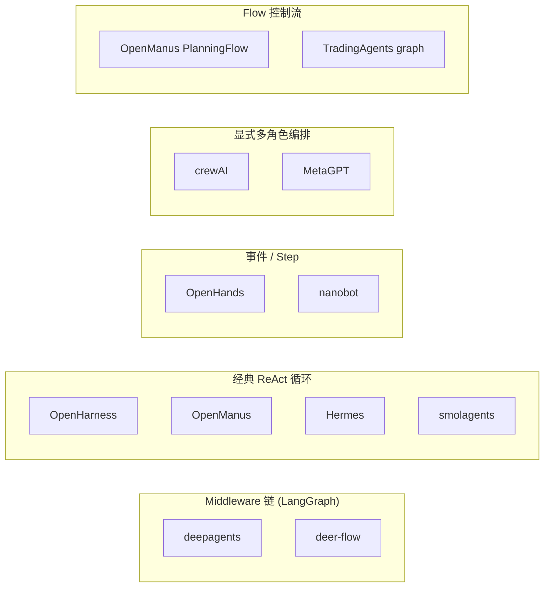
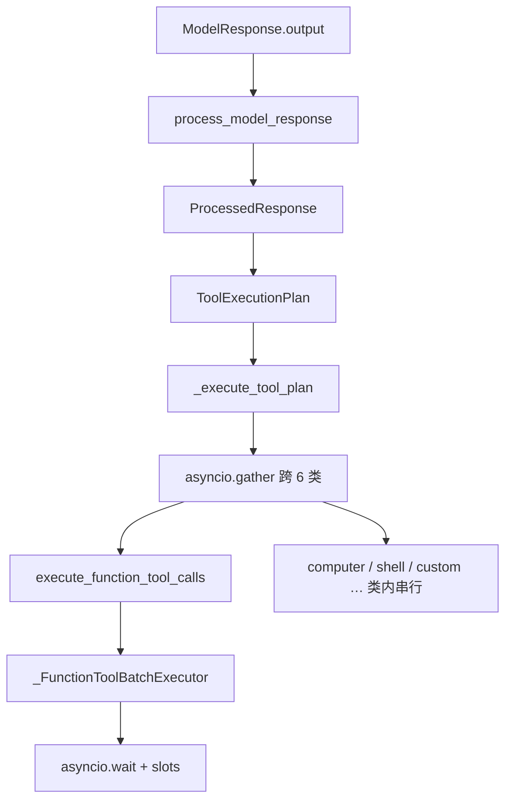

# 总览与选型

> **设计思想（推荐先读）**：[00-HARNESS-DESIGN-PHILOSOPHY.md](./00-HARNESS-DESIGN-PHILOSOPHY.md) · [HARNESS-SPECTRUM.md](./HARNESS-SPECTRUM.md)  
> **本文档定位**：Tier 1/2 清单 + **实现级**大矩阵与项目画像（含路径）；对比 **设计差异** 请读 00，不要从本文 §13 开始。

> **合并说明**：由以下文档去重合并（2026-08-04）。

---


---

## 全工程总对比

> **范围**: `/Users/gqli/work/deepagents` 工作区内 **全部 Agent 相关项目**（截至 2026-06-08）  
> **方法**: README + 核心入口源码 + 本仓库已有架构文档交叉验证；**非**营销文案复述  

---

## 目录

- [1. 如何使用本文档](#1-如何使用本文档)
- [2. 项目分级与清单](#2-项目分级与清单)
- [3. 统一对比维度](#3-统一对比维度)
- [4. 总览矩阵（Tier 1）](#4-总览矩阵tier-1)
- [5. 编排与核心循环（由浅入深）](#5-编排与核心循环由浅入深)
- [6. Memory 实现对比](#6-memory-实现对比)
- [7. Plan / 规划模式对比](#7-plan--规划模式对比)
- [8. Tool / Skill / MCP 对比](#8-tool--skill--mcp-对比)
- [9. Sandbox 与执行环境](#9-sandbox-与执行环境)
- [10. 多 Agent 协作](#10-多-agent-协作)
- [11. Prompt 与上下文组装](#11-prompt-与上下文组装)
- [12. 持久化与会话](#12-持久化与会话)
- [12b. 消息 Loop 通道与运行中并发](#12b-消息-loop-通道与运行中并发)
- [13. Tier 1 项目实现画像](#13-tier-1-项目实现画像)
- [14. Tier 2 项目实现画像](#14-tier-2-项目实现画像)
- [15. 选型决策树](#15-选型决策树)
- [16. 专题文档索引](#16-专题文档索引)

---

## 1. 如何使用本文档

### 1.1 阅读路径

| 你的问题 | 建议阅读顺序 |
|----------|--------------|
| 「有哪些 Agent 项目？」 | §2 清单 |
| 「一眼看出差别」 | §4 总览矩阵（Session / Message / Memory 分列） |
| 「循环怎么跑起来的？」 | §5 → §13 对应项目 · [运行时五柱总览](./AGENT_RUNTIME_FRAMEWORK_COMPARISON.md) |
| 「记忆 / Plan / MCP 怎么做的？」 | §6–§8 + [Memory](./06-memory.md) / [Plan](./05-plan-mode.md) / [MCP](./08-mcp.md) / [Skill·MCP 模块](./20-skill-mcp-modules.md) |
| 「Session / JSON / 消息投影？」 | [21-session-message-architecture.md](./21-session-message-architecture.md) → [19](./19-session-message-model.md) |
| 「多 Agent 怎么协作？」 | §10 + [Multi-Agent 专题](./04-multi-agent.md) |
| 「谁支持飞书/Telegram/IM 对接？」 | [Channel 平台对接专题](./09-channels.md) |
| 「能否远端部署、多实例、多用户同时用？」 | [17-deployment.md](./17-deployment.md) |
| 「量化/股票 Agent 开源项目？」 | [18-quant-stock-agents.md](./18-quant-stock-agents.md) |
| 「Tier 2 小项目细节？」 | §14 深度画像 |
| 「我该选哪个？」 | §15 决策树 |

### 1.2 三种「Plan」不要混谈

详见 [05-plan-mode.md](./05-plan-mode.md) §1。本文 §7 仅摘要。

### 1.3 源码可得性说明

| 标记 | 含义 |
|------|------|
| **【源码】** | 本 workspace 有完整或可读的实现目录 |
| **【文档】** | 仅有 `docs/` 或子目录 README，实现需对照上游仓库 |
| **【库】** | 编排基础设施，非开箱 Agent 应用 |

---

## 2. 项目分级与清单

### 2.1 Tier 1 — 完整 Agent 框架（有明确 agent loop）

| 项目 | 路径 | 编排标签 |
|------|------|----------|
| **deepagents** (SDK) | `libs/deepagents/` | middleware + LangGraph |
| **deepagents-code** | `libs/code/` | SDK + Textual TUI |
| **deer-flow** | `deer-flow/` | LangGraph + middleware 链 |
| **OpenHarness** | `OpenHarness/` | ReAct QueryEngine |
| **AgentScope** | `agentscope/` | ReAct + middleware |
| **OpenManus** | `OpenManus/` | ReAct + 可选 PlanningFlow |
| **Hermes Agent** | `hermes-dev/hermes-agent/` | 命令式 ReAct while-loop |
| **OpenHands** | `OpenHands/` + `software-agent-sdk/` | 事件驱动 step |
| **OpenAI Agents SDK** | `openai-agents-python/` | Turn loop + handoffs |
| **Claude Agent SDK** | `claude-agent-sdk-python/` | 委托 Claude Code CLI |
| **crewAI** | `crewAI/` | Crew 任务编排 |
| **smolagents** | `smolagents/` | 轻量 Code/ReAct |
| **MetaGPT** | `MetaGPT/` | SOP 多角色流水线 |
| **AutoGen** | `autogen/` | 事件流 AgentChat |
| **Letta** | `letta/` | Memory-block 中心 step |
| **nanobot** | `nanobot/` | MessageBus + ReAct runner |
| **LangGraph** | `langgraph/` | StateGraph / Pregel【库】 |

### 2.2 Tier 2 — 领域专项 / 较小 / 非通用框架

| 项目 | 路径 | 说明 |
|------|------|------|
| TradingAgents | `TradingAgents/` | 金融多角色 LangGraph |
| FastAgent | `FastAgent/` | WorkflowEngine 协调多后端 |
| GenericAgent | `GenericAgent/` | 极简 ReAct + 技能自进化 |
| FM-Agent | `FM-Agent/` | 形式化证明流水线，非通用 loop |
| DeepTutor | `DeepTutor/` | Capability 编排（chat/research/solve） |
| **grok-build** | `grok-build/` | Rust SessionActor；Plan mode / Goal harness / `task` 子 Session（见 [05-plan-mode.md](./05-plan-mode.md) §18） |
| **pi** | `pi/` | 扩展式 Agent 运行时；扩展 Plan 硬工具门禁（见 [05-plan-mode.md](./05-plan-mode.md) §10.8、`pi/docs/ARCHITECTURE.md`) |
| openhuman | `openhuman/` | Tauri 桌面 personal harness |
| agentmemory | `agentmemory/` | 跨 Agent 记忆 MCP 服务 |
| agency-agents | `agency-agents/` | 角色 prompt 资产库，无运行时 |
| libs/cli | `libs/cli/` | deploy/init/dev，无交互 loop |
| libs/acp | `libs/acp/` | ACP 协议包 |
| libs/evals | `libs/evals/` | 评测与 Harbor |
| examples/* | `examples/` | deepagents 官方示例，非独立框架 |

### 2.3 非 Agent 框架（本对比不展开）

`GitNexus`, `MinerU`, `RAG-Anything`, `VibeVoice`, `OpenSpec`, `skills/`, `docs/` 等。

---

## 3. 统一对比维度

| 维度 ID | 名称 | 回答的问题 |
|---------|------|------------|
| **D1** | 编排范式 | 谁驱动下一步？图 / 循环 / 事件 / Crew？ |
| **D2** | 核心入口 | 从用户输入到第一次 tool call 的代码路径 |
| **D3** | **Message 模型 / 投影** | 真源（列表 / 事件 / checkpoint messages）、投影给 LLM、Envelope；见 [19-session-message-model.md](./19-session-message-model.md) |
| **D4** | **Memory** | **长期记忆 + 压缩**（facts、MEMORY.md、向量）；**不含** Session transcript 本身；见 [06-memory.md](./06-memory.md) |
| **D5** | Plan | Todo / 只读规划 / Flow 分阶段 / 无？ |
| **D6** | Tool & Skill | 注册、分组、渐进加载 |
| **D7** | MCP | 一等公民？命名、热更新、deferred？ |
| **D8** | Sandbox | 隔离级别、虚拟路径 |
| **D9** | 多 Agent | 子 Agent、handoff、Crew、邮箱 |
| **D10** | Prompt | system 从哪来、何时重建 |
| **D11** | **Session 持久化** | 会话键、`thread_id`、checkpoint / JSONL / SQLite；见 [06-memory.md](./06-memory.md) §Session、[19](./19-session-message-model.md) §Canonical |
| **D12** | 部署形态 | CLI / TUI / Web / Gateway / 库 |
| **D13** | 消息通道与运行中并发 | Bus/Queue？同 session 第二条：queue / reject / interrupt / inject |
| **D14** | 远端部署与多租户 | 远端 Gateway？多副本 Session 外置？多用户并发 CLI？见 [17-deployment.md](./17-deployment.md) |

**Session · Message · Memory 不要混谈**（§4 矩阵三列）：

| 列 | 问什么 | 典型反例（混谈） |
|----|--------|------------------|
| **Session** | 对话存在哪、用什么键续聊 | 把 checkpoint 说成「记忆」 |
| **Message** | LLM 吃的消息从哪投影出来 | 把 `memory.json` 当成 messages |
| **Memory** | 跨 turn/跨会话 facts、压缩、文件记忆 | 把 EventLog 当成 LTM |

---

## 4. 总览矩阵（Tier 1）

> **Session / Message / Memory 分列**：Session = 会话持久化与键；Message = 真源与投影（给 LLM 的上下文从哪来）；Memory = 长期事实、压缩、文件记忆（**≠** transcript）。详见 [19-session-message-model.md](./19-session-message-model.md)、[06-memory.md](./06-memory.md)。

| 项目 | D1 编排 | Session（D11） | Message（D3） | Memory（D4） | D5 Plan | D7 MCP | D8 Sandbox | D9 多 Agent | D14 部署 |
|------|---------|----------------|---------------|--------------|---------|--------|------------|-------------|----------|
| **deepagents** | middleware+Graph | checkpointer; `thread_id`; code TUI SQLite | graph `messages`; Summarization 投影 | `AGENTS.md` inject; Summarization; optional `store` | `write_todos` 始终 on | 经 adapters | backend 可插拔 | SubAgent middleware | ⚠️ 自建 API；PG 多副本 |
| **deepagents-code** | 同上+TUI | 同 SDK | 同 SDK | 同 SDK | 交互审批 todo prompt | 同 SDK | partner sandbox | 同 SDK | 🔒 单用户 TUI |
| **deer-flow** | middleware 链(18层) | checkpoint + thread 目录; IM→`channel:chat_id` | `ThreadState.messages`; SummarizationMiddleware | `memory.json` facts + SOUL; Summarization ∥ MemoryUpdater | `is_plan_mode` 开关 | 一等+deferred | Local/Docker AIO | `task` 子 Agent | ✅ Gateway+PG 多 worker |
| **OpenHarness** | ReAct QueryEngine | session JSON 快照; `session_id` | messages + `tool_metadata`; `auto_compact` | MEMORY.md / 项目 md 检索; 四层漏斗 | **权限 PLAN** 只读 | McpClientManager | harness 沙箱 | Coordinator 子进程 | ✅ ohmo Gateway；远端 CLI |
| **AgentScope v2** | ReAct Agent | `AgentState` JSON; app `RedisStorage` | `context` + `summary` 伪消息; LTM 删头 | Mem0/ReMe 可选; RAG KB | Skill+文件+Task | MCPClient | Workspace Docker/E2B | Agent Team 服务 | ✅ Redis app 多副本 |
| **OpenManus** | ReAct / PlanningFlow | 内存 | `Memory.messages` 列表 | 无内置压缩（100 条截断） | Flow 先 plan 后 execute | MCPAgent | SandboxManus | Flow 内单 executor | 🔒 实验脚本 |
| **Hermes** | while ReAct | SQLite SessionDB; `session_key` | DB rows→Compressor 投影; todo re-inject | `memories/*.md` + mem0 等; compression + provider | `todo` + `/plan` skill | 一等 | 多 backend 终端 | delegate_task/kanban | ✅ gateway daemon |
| **OpenHands** | Event step | EventLog + `conversation_id`; lease | event JSON→`View`+Condenser | `MEMORY.md` 文件; **不进** EventLog | planning preset | FastMCP | Docker/K8s | 插件/单会话为主 | ✅ agent-server 远端 |
| **OpenAI Agents** | Runner turn | Session backend; `session_id` | `TResponseInputItem[]`; compaction session | sandbox MEMORY.md 管线 | 无内置 | 支持 | Sandbox Agents | handoffs | ⚠️ Redis Session DIY |
| **Claude SDK** | 委托 CLI | CLI session; SessionStore mirror | stdout JSONL→Message 类型 | CLI 内部（Python 无 Memory 类） | Claude Code 内置 | 经 CLI | 经 CLI | 经 CLI | ❌ 非自托管服务 |
| **crewAI** | Crew.kickoff | 弱/内存 | Task context 链 | LanceDB recall; **≠** chat session | **三路径**（[PLAN §4](./05-plan-mode.md#4-源码级流程总览与对比plan--todo--execute)） | 生态可选 | 无统一 | **原生多 Agent** | — 批任务 |
| **smolagents** | MultiStepAgent | 内存 | 步进历史 | 无 | 无 | from_mcp | Blaxel/E2B 等 | managed agents | — |
| **MetaGPT** | Team SOP | 项目级产物 repo | 角色消息流 | 关键词 Memory + repo 文件 | SOP 即 plan | 非核心 | 无统一 | **公司角色** | — |
| **AutoGen** | 流式 messages | 内存; samples DIY persist | `BaseChatMessage` 流 | 团队共享 context | 无 | McpWorkbench | CodeExecutor | GroupChat | ⚠️ DIY |
| **Letta** | AgentLoop step | Server DB | messages + blocks 同 context | **memory_blocks** archival/recall 核心 | 无 | 弱 | modal 等 | Sleeptime multi | ✅ Letta Server |
| **nanobot** | MessageBus→AgentLoop | `sessions/*.jsonl`; `channel:chat_id` | P1 列表 + Bus Envelope; `get_history` | SOUL/USER/MEMORY; Consolidator→`history.jsonl`; Dream | 无独立 Plan mode | 一等 | shell sandbox | Subagent / pending inject | ✅ Gateway；共享卷 |
| **LangGraph** | StateGraph | checkpointer; `thread_id` | state.messages（上层定义） | `store` 抽象 | 无 | 需上层 | 无 | 图多节点 | ⚠️ checkpointer 选型 |
| **browser-use** | Agent `run/step` | Cloud task session | `agent_history`; compaction | compaction 字段 | plan 字段 | mcp/ | Cloud Browser | Beta sub-agent | ✅ `@sandbox` / Cloud API |

---

## 5. 编排与核心循环（由浅入深）

### 5.1 五种编排范式



### 5.2 核心入口对照（实现路径）

| 项目 | 用户入口 | 核心函数 | 一次「步」的含义 |
|------|----------|----------|------------------|
| deepagents | `create_deep_agent()` | LangGraph `invoke/astream` | model → tools → state update |
| deer-flow | `make_lead_agent(config)` | `run_agent()` worker | middleware 包裹的 ReAct step |
| OpenHarness | `oh` / TUI | `QueryEngine.run_query()` | LLM + tool + permission check |
| AgentScope | `await agent(msg)` | `Agent._reply_impl()` | reasoning ↔ acting 迭代 |
| OpenManus | `main.py` / `run_flow.py` | `BaseAgent.run()` / `PlanningFlow.execute()` | step() 或 flow 一步 |
| Hermes | `hermes chat` | `AIAgent.run_conversation()` | while 内 completion + tools |
| OpenHands | SDK / App | `Agent.step()` | 单 step 产 Action/Observation |
| crewAI | `Crew.kickoff()` | Task 顺序/层次执行 | 一个 Task 的 agent 运行 |
| smolagents | `agent.run()` | `MultiStepAgent` 内循环 | 一步 tool/code |
| Letta | API / CLI | `AgentLoop.step()` | memory 感知的一步 |
| LangGraph | `graph.invoke()` | Pregel superstep | 图节点推进 |

### 5.3 deepagents：Middleware 链 + LangGraph（代表实现）

```711:714:libs/deepagents/deepagents/graph.py
    deepagent_middleware: list[AgentMiddleware[Any, Any, Any]] = [
        TodoListMiddleware(),
    ]
```

典型链（主 Agent）：`TodoList → Skills → Filesystem → SubAgent → Summarization → … → PatchToolCalls`

- **控制流**：LangGraph 编译图；middleware 在 model 调用前后拦截。
- **扩展点**：新增 `AgentMiddleware`，不改 graph 拓扑。
- **与 deer-flow 同族**：均基于 LangChain `create_agent` + middleware；deer-flow 链更长且大量运行时 configurable。

### 5.4 OpenHarness：QueryEngine ReAct

```text
cli.main → ui.app → QueryEngine → query.run_query()
  → PermissionChecker.evaluate()  # 每 tool 前
  → HookExecutor                  # pre/post tool
  → 追加 messages → 下一轮 LLM
```

- **特点**：不绑 LangGraph；权限与 hook 与 loop 同层。
- **Plan 语义**：`PermissionMode.PLAN` = 只读沙箱（见 §7）。

### 5.5 Hermes：显式 while 循环

```text
run_conversation():
  while api_call_count < max_iterations:
    response = client.chat.completions.create(...)
    if tool_calls: handle_function_call()  # todo 在此拦截
    else: return
```

- **特点**：无图编译；插件 hook、压缩、todo 注入均在 Python 循环内。
- **代价**：跨切面能力靠约定与拦截器，非统一 middleware 接口。

### 5.6 OpenManus：双模式

| 模式 | 入口 | 规划与执行 |
|------|------|------------|
| 默认 | `main.py` → `Manus.run()` | 单 Agent ReAct，模型自选时机 |
| Planning | `run_flow.py` → `PlanningFlow` | **先** `planning create` **再** while 逐步 execute |

### 5.7 crewAI / MetaGPT：编排优先于单循环

- **crewAI**：开发者声明 `Agent` + `Task` + `Process`；`kickoff()` 按依赖跑任务链。
- **MetaGPT**：`Team.run_project()` 按 SOP 驱动 PM/Architect/Engineer 等角色；产物是代码库而非单条对话。

---

## 6. Memory 实现对比

> **完整版**：[06-memory.md](./06-memory.md)（分层模型、压缩策略 S1–S7、Tier 2、选型）  
> **Session / Message / Memory 分列速览**：§4 总览矩阵；消息投影见 [19-session-message-model.md](./19-session-message-model.md)  
> AgentScope 权威：[agentscope MEMORY_SYSTEM.md](../../agentscope/docs/MEMORY_SYSTEM.md)

### 6.1 分层模型（统一语言）

| 层级 | 含义 | 对应 §4 列 | 典型实现 |
|------|------|------------|----------|
| **工作记忆** | 当前 turn LLM 可见上下文（**投影结果**） | **Message（D3）** | messages / context / View |
| **Session transcript** | 可恢复的对话真源 | **Session（D11）** | checkpoint / JSONL / EventLog |
| **压缩记忆** | 超长时摘要或裁剪 | **Memory（D4）** | summary / Condenser / middleware |
| **长期记忆** | 跨会话事实/偏好 | **Memory（D4）** | memory.json / mem0 / memory_blocks |
| **文件记忆** | 显式文档 | **Memory（D4）** | AGENTS.md / MEMORY.md / task_plan.md |

### 6.2 Tier 1 对照表

| 项目 | 工作记忆 | 压缩 | 长期 | 文件记忆 |
|------|----------|------|------|----------|
| deepagents | graph messages | SummarizationMiddleware | store 可选 | `AGENTS.md` via MemoryMiddleware |
| deer-flow | ThreadState.messages | SummarizationMiddleware | memory.json + 注入 `<memory>` | SOUL.md |
| OpenHarness | session messages | 应用层 | 4-layer 模型（文档） | skills / plugins |
| AgentScope v2 | `AgentState.context` | `summary`+压缩删除头部 | ❌ 内置 | 应用层文件 |
| Hermes | SQLite SessionDB | conversation_compression | mem0/Honcho 等 provider | skills, `.hermes/plans/` |
| OpenHands | SDK EventLog → View | LLMSummarizingCondenser（SDK） | 应用层；`MEMORY.md` | skills + MEMORY.md |
| Letta | 消息 + blocks | compaction | **archival/recall 核心** | — |
| nanobot | SessionManager messages | Consolidator 摘要/归档 | Dream 更新 SOUL/USER/MEMORY.md | Markdown memory files |
| crewAI | task context | 有限 | 外部 | — |
| smolagents | 步进历史 | 手动 callback | 无 | — |

### 6.3 压缩策略差异（关键）

| 策略 | 采用方 |
|------|--------|
| **去头压 summary + 保尾 context** | AgentScope v2 |
| **Middleware 摘要 + 删旧消息** | deepagents, deer-flow (LangChain) |
| **Condenser 可插拔** | OpenHands |
| **Todo 压缩后 re-inject** | Hermes `format_for_injection()` |
| **memory block 整理** | Letta compaction |

详见 `docs/框架对比/上下文压缩与记忆机制深度对比.md`。

---

## 7. Plan / 规划模式对比

> 完整版：[05-plan-mode.md](./05-plan-mode.md)

| 范式 | 项目 | 机制 | 开关 |
|------|------|------|------|
| **Todo 跟踪** | deepagents, deer-flow, Hermes `todo` | `write_todos` / TodoListMiddleware / todo 工具 | deepagents 始终 on；deer-flow `is_plan_mode` |
| **只读规划** | OpenHarness, Hermes `/plan` skill | 禁写工具 / Skill 禁止改代码 | `/plan on`, `/plan` |
| **Flow 分阶段** | OpenManus、crewAI `planning_config` | `PlanningFlow` / `AgentExecutor` Plan-and-Execute + Observer | `run_flow.py` / `PlanningConfig` |
| **Crew 预规划 + Process** | crewAI | `Crew.planning` enrich + Task 图 / Manager 委托 | `Crew(planning=True)`、`process=` |
| **组合式** | AgentScope v2 | Skill + `task_plan.md` + Task | 应用定义 |
| **Preset** | OpenHands | `planning` preset + TaskTracker | 选 preset |

**易错点**：OpenHarness 的 Plan ≠ deer-flow 的 Plan Mode。

---

## 8. Tool / Skill / MCP 对比

> MCP 专题：[08-mcp.md](./08-mcp.md)

### 8.1 Tool 注册模型

| 项目 | 注册方式 | 分组 |
|------|----------|------|
| deepagents | middleware 注入 + `tools=[]` | 无正式 group；skills 目录 |
| deer-flow | `get_available_tools()` 组装 | config tool_groups + deferred MCP |
| OpenHarness | ToolRegistry | bash/read/... + MCP adapter |
| AgentScope | `Toolkit.register_tool_function` | **ToolGroup** + ResetTools |
| Hermes | `registry.register` + toolsets | `enabled_toolsets` / disabled |
| OpenHands | Tool 类 + preset | planning/default/gemini |
| smolagents | `@tool` / Tool 类 | 轻量 |
| crewAI | Agent.tools 列表 | 每 Agent 独立 |

### 8.2 Skill 系统

| 项目 | 格式 | 加载策略 |
|------|------|----------|
| deepagents | `SKILL.md` | SkillsMiddleware 按需 |
| deer-flow | `skills/{public,custom}/SKILL.md` | extensions_config + prompt 列表 |
| OpenHarness | anthropics 兼容 + plugins | manifest + oh skills |
| Hermes | hub + bundled + optional-skills | 渐进 + curator 生命周期 |
| AgentScope | Skill + SkillViewer | 应用层 |

### 8.3 MCP 一句话差异

| 项目 | 特点 |
|------|------|
| OpenHarness | `McpClientManager` + `mcp__server__tool` + 资源工具 |
| deer-flow | mtime 缓存 + **DeferredToolFilter** 减 schema 体积 |
| AgentScope | 有状态 MCP 须 `connect()` |
| deepagents | 无内置；langchain-mcp-adapters |
| Hermes | gateway 动态注册 + ACP |

---

## 9. Sandbox 与执行环境

| 项目 | 实现 | 虚拟路径 | 备注 |
|------|------|----------|------|
| deer-flow | LocalSandbox / AIO Docker | `/mnt/user-data/{workspace,uploads,outputs}` | 每 thread 隔离 |
| deepagents | Backend protocol | 依 backend | Daytona/Modal 等 partner |
| OpenHarness | subprocess + 权限 | 工作区根 | dry-run 预览 |
| AgentScope | Local/Docker/E2B Workspace | 可配置 | Offloader 落盘 |
| Hermes | local/docker/ssh/modal/daytona | `terminal.cwd` | 多 backend |
| OpenHands | Docker/K8s/Process | runtime 映射 | 企业级 |
| smolagents | E2B/Modal/Docker/Blaxel | — | 教学友好 |
| OpenManus | Docker sandbox + Daytona | — | SandboxManus agent |
| nanobot | shell sandbox backends | — | 强调生产隔离 |
| crewAI / MetaGPT | 无统一 sandbox | — | 靠 tool 自行执行 |

---

## 10. 多 Agent 协作

> **完整版**：[04-multi-agent.md](./04-multi-agent.md)（MA1–MA8 模式、并发隔离、Tier 2）

### 10.1 模式分类

| 模式 | 机制 | 代表 |
|------|------|------|
| **工具委托** | 主 Agent 调 `task`/`delegate_task` | deer-flow, deepagents, Hermes |
| **子进程 Worker** | Coordinator 起子进程 | OpenHarness |
| **Handoff** | 切换 active agent | OpenAI Agents SDK |
| **Crew/Task** | 声明式任务图 | crewAI, MetaGPT |
| **GroupChat** | 路由发言权 | AutoGen |
| **邮箱/消息** | MsgHub / Mailbox（v0.x） | AgentScope 文档；deer-flow 偏 thread |
| **LangGraph 多节点** | 图拓扑 | LangGraph, TradingAgents |

### 10.2 并发与隔离

| 项目 | 并发上限 | 状态隔离 |
|------|----------|----------|
| deer-flow | `MAX_CONCURRENT_SUBAGENTS=3` | 独立 thread + SubagentLimitMiddleware |
| deepagents | 可配置 subagent | `todos` 不 merge 回父线程 |
| Hermes | `delegation.max_concurrent_children` | 子 Agent 独立 terminal |
| OpenHarness | BackgroundTaskManager | 子进程 `--task-worker` |
| crewAI | Process 定义 | Task 输出传递 |

---

## 11. Prompt 与上下文组装

| 项目 | system 来源 | 动态段 | 重建时机 |
|------|-------------|--------|----------|
| deepagents | 参数 + middleware | skills, memory(AGENTS.md), todo 规则 | 每 model call 由 middleware 注入 |
| deer-flow | `apply_prompt_template()` | skills, memory, subagent 说明, todo XML | 每 run；middleware 可改 |
| OpenHarness | `build_runtime_system_prompt()` | permission_mode, skills, plugins | **切换 /plan 时整段重建** |
| AgentScope | `Agent(system_prompt=)` | summary 作伪 UserMsg | 压缩后 summary 覆盖 |
| Hermes | config + skills 加载 | 压缩后 todo 注入；memory provider prefetch | skills 变更需新 session（缓存策略） |
| OpenHands | `.j2` 模板 | preset 切换整套 | planning vs default preset |
| crewAI | Agent backstory/role | Task description 拼接 | 每 Task |

---

## 12. 持久化与会话

> **§4 已分列 Session / Message / Memory**；本节仅 **Session 持久化 + 跨进程** 摘要。  
> **完整矩阵（存储 + 多实例）**: [06-memory.md](./06-memory.md) §Session 存储 · [19-session-message-model.md](./19-session-message-model.md)

| 项目 | 机制 | 跨进程 | 备注 |
|------|------|--------|------|
| deepagents | LangGraph checkpointer | ✅ | thread_id |
| deer-flow | LangGraph + 本地 thread 目录 | ✅ | `.deer-flow/users/.../threads/` |
| Hermes | SQLite `hermes_state.db` | ✅ | FTS5 搜索历史 |
| OpenHands | SDK EventLog + Agent Server lease | ✅（需共享卷/沙箱策略） | 见 [10-openhands.md](./10-openhands.md) |
| OpenAI Agents SDK | Session 协议（Redis/SQL/OpenAI Conversations） | ✅（禁多 Pod 本地 SQLite） | 见 [06-memory.md](./06-memory.md) 深潜 · OpenAI Agents |
| AgentScope v2 | `AgentState.model_dump_json()` 或 `RedisStorage` | 嵌入手动；`create_app` 用 Redis | 见 [06-memory.md](./06-memory.md) 深潜 · AgentScope |
| Letta | DB + memory blocks | ✅ | 服务端一等 |
| nanobot | SessionManager + history.jsonl + git-tracked memory files | ✅ | Consolidator 压缩，Dream 巩固 |
| OpenHarness | session + tool_metadata | 依部署 | — |
| smolagents / GenericAgent | 内存为主 | ❌ | 实验型 |

---

## 12b. 消息 Loop 通道与运行中并发

> **专题全文**: [03-runtime-loop-queue.md](./03-runtime-loop-queue.md)

| 项目 | Bus/Queue 作 loop 通道？ | 前一条还在 loop 时，新用户消息 |
|------|--------------------------|------------------------------|
| **nanobot** | ✅ `MessageBus` | **Mid-turn inject**（`_pending_queues` + Runner `injection_callback`）；未消费则 re-publish |
| **deer-flow** (IM) | ✅ `MessageBus` | LangGraph **`multitask_strategy=reject`** → busy 提示 |
| **hermes** | ⚠️ adapter 层 pending | **`busy_input_mode`**: interrupt / queue / **steer**（mid-turn） |
| **deepagents-code** | ⚠️ `deque` FIFO | 排队；Esc interrupt |
| **deepagents SDK** | ❌ | 调用方负责 |
| **OpenHarness** | ✅（依入口） | ChannelBridge FIFO 串行 / ohmo interrupt |
| **OpenManus** | ❌ | 状态机 reject |
| **OpenAI / Claude SDK** | ❌ | 无内置；cancel/interrupt 视 API |

---

## 13. Tier 1 项目实现画像

以下每节：**定位 → 入口 → 数据流 → 差异化 → 适用场景**。

### 13.1 deepagents（SDK）【源码】

- **定位**：LangChain 官方「Deep Agent」SDK；middleware 可组合。
- **入口**：`create_deep_agent()` → `CompiledStateGraph`。
- **数据流**：`TodoList → Skills → Filesystem → SubAgent → … → model → ToolNode`。
- **差异化**：Memory/Skills/SubAgent 均 middleware 一等；无 `is_plan_mode` 开关。
- **场景**：嵌入产品的 LangGraph Agent；需与 LangSmith checkpoint 一体。

### 13.2 deepagents-code【源码】

- **定位**：交互式 Textual CLI（`deepagents-code`）。
- **入口**：`deepagents_code/main.py` → `textual_adapter` → `agent.astream()`。
- **差异化**：交互模式要求用户确认 todo plan；headless 相反。
- **场景**：本地 coding agent 终端。

### 13.3 deer-flow【文档+部分源码】

- **定位**：LangGraph 超级 Agent + Gateway + 沙箱产品。
- **入口**：`make_lead_agent` / `run_agent`。
- **差异化**：最长 middleware 链；`is_plan_mode`；deferred MCP；per-user 隔离路径。
- **场景**：可部署的多租户 Agent 服务；IM 渠道 + Web UI。

### 13.4 OpenHarness【文档】

- **定位**：Harness + ohmo 个人助理；权限与评估导向。
- **入口**：`QueryEngine.run_query()`。
- **差异化**：`PermissionMode` 三态；Coordinator 子进程；React TUI。
- **场景**：需要强权限模型与 dry-run 的本地/团队助手。

### 13.5 AgentScope v2【文档】

- **定位**：阿里通义生产级 Agent SDK。
- **入口**：`Agent.reply()` / `reply_stream()`。
- **差异化**：`ToolGroup` 分阶段；Workspace sandbox；v2 无 plan/memory 子包，靠组合。
- **场景**：多模态 + 沙箱 + 中国模型生态。

### 13.6 OpenManus【源码】

- **定位**：开源 Manus 类单/多 Agent 实验框架。
- **入口**：`Manus` / `PlanningFlow`。
- **差异化**：PlanningFlow 显式两阶段；MCPAgent 变体。
- **场景**：学习 Flow 编排；快速原型。

### 13.7 Hermes Agent【源码】

- **定位**：长期运行个人助手 + Gateway 多平台。
- **入口**：`AIAgent.run_conversation()`。
- **差异化**：插件生态最大（memory provider、kanban、cron）；todo 不污染 system prompt。
- **场景**：个人助理、消息渠道、多 profile。

### 13.8 OpenHands【文档+SDK】

- **定位**：企业软件工程 Agent **平台**（控制面）+ 独立 **software-agent-sdk**（执行面）。
- **两仓**：`OpenHands/`（`app_server`、frontend、enterprise）+ `software-agent-sdk/`（`openhands-sdk`、`openhands-agent-server`、`openhands-tools`、`openhands-workspace`）。
- **入口**：沙箱内 `openhands-agent-server` → SDK `LocalConversation`；嵌入场景可直接 `Conversation(...)`。
- **记忆**：EventLog（M1）+ Condenser/View（M2）+ `MEMORY.md`（M4）；**V0 `openhands/memory` 已移除**。
- **持久化**：SDK `FileStore` + Agent Server `conversations_path` + `ConversationLease`；app_server SQL/事件镜像另层。
- **架构文档**：[10-openhands.md](./10-openhands.md) · [06-memory.md](06-memory.md) 深潜 · OpenHands
- **场景**：企业级 coding agent、SWE-bench、多沙箱编排。

### 13.9 OpenAI Agents SDK【源码】

- **定位**：OpenAI 官方轻量 agent 运行时。
- **入口**：`Runner.run()` + 可选 `session=`。
- **记忆**：`Session` 协议（`TResponseInputItem[]`）；默认 SQLite 内存库；生产多实例用 `RedisSession`/SQL/OpenAI Conversations。
- **差异化**：handoffs、guardrails、tracing、sandbox memory 子系统。
- **深潜**：[06-memory.md](./06-memory.md) 深潜 · OpenAI Agents
- **场景**：OpenAI 模型为主的多 agent 应用。

### 13.10 Claude Agent SDK【源码】

- **定位**：Claude Code CLI 的 Python 控制面，不是在 Python 内自建 agent loop。
- **入口**：`query()` → `InternalClient.process_query()`；状态式用 `ClaudeSDKClient.connect()` / `query()` / `receive_messages()`。
- **核心流程**：`ClaudeSDKClient.connect()` 构造 `SubprocessCLITransport`，把 `ClaudeAgentOptions` 映射成 CLI 参数，启动 `claude --input-format stream-json`，之后通过 stdin/stdout JSONL 写入 user message、读取 assistant/tool/system/result events。
- **session**：通过 CLI `--continue/--resume/--session-id/--fork-session` 使用 Claude Code 原生 session；`SessionStore` 只是 transcript mirror，并可在 resume 前 materialize 到临时 `CLAUDE_CONFIG_DIR`。
- **memory/压缩**：SDK 无 `Memory`、无 summarizer、无 token 压缩；上下文管理和压缩边界在 Claude Code CLI 内部。
- **差异化**：Python 侧控制权限、MCP、hooks、skills、subagents、session mirror；能力边界由 Claude Code 决定。
- **深度导读**：[CLAUDE_AGENT_SDK_IMPLEMENTATION_DEEP_DIVE.md](./CLAUDE_AGENT_SDK_IMPLEMENTATION_DEEP_DIVE.md)。

### 13.11 crewAI【源码】

- **定位**：Crew 编排框架。
- **入口**：`Crew.kickoff()`。
- **差异化**：角色+任务+流程声明式；非单 ReAct。
- **场景**：业务流程自动化、内容流水线。

### 13.12 smolagents【源码】

- **定位**：HF 极简 agent（~1k 行核心）。
- **入口**：`CodeAgent` / `ToolCallingAgent`。
- **差异化**：代码即 action；教学友好。
- **场景**：教学、轻量实验、HF 生态。

### 13.13 MetaGPT【源码】

- **定位**：「软件公司」多角色 SOP。
- **入口**：`Team.run()`。
- **差异化**：固定角色分工；产出完整 repo。
- **场景**：从需求生成项目的演示/研究。

### 13.14 AutoGen【源码】

- **定位**：微软多 Agent 对话（维护模式）。
- **入口**：`AssistantAgent.on_messages_stream()`。
- **差异化**：GroupChat 路由；Successor 为 MS Agent Framework。
- **场景**：遗留 AutoGen 项目；团队对话模拟。

### 13.15 Letta【源码】

- **定位**：MemGPT 风格有状态 Agent 服务。
- **入口**：`AgentLoop.step()`。
- **差异化**：memory_blocks 一等；服务端持久化。
- **场景**：长期陪伴型 agent、记忆研究。

### 13.16 nanobot【源码】

- **定位**：轻量但完整的个人 Agent 服务框架，核心链路是 `MessageBus → AgentLoop → AgentRunner → ToolRegistry → Session/Memory`。
- **入口**：channel 写入 `MessageBus.inbound`；`AgentLoop.run()` 消费消息；`AgentLoop._dispatch()` 做 session 串行、pending queue 注入；`AgentRunner._run_core()` 执行真正 LLM/tool loop。
- **核心 loop**：Runner 每轮先做 context governance（drop orphan tool results、backfill、microcompact、tool result budget、snip history），再请求 provider；若有 tool calls，append assistant/tool messages 并 checkpoint；否则处理空响应、length recovery、mid-turn injection 后产出 final assistant message。
- **session**：`SessionManager` 管 per-session messages/metadata；同一 session 加锁串行，跨 session 并发；取消时可从 runtime checkpoint 恢复部分上下文。
- **memory/压缩**：`MemoryStore` 管 `SOUL.md`、`USER.md`、`memory/MEMORY.md`、`memory/history.jsonl`；`Consolidator` 按 token 阈值把旧 turn 摘要/原文归档到 history；Dream 后台/手动读取 history 并用 file-edit tools 外科式更新长期 Markdown 记忆，GitStore 记录可回滚。
- **差异化**：MessageBus 多渠道解耦、session 级并发控制、Consolidator + Dream 两层记忆、文件化长期记忆。
- **深度导读**：[11-product-deep-dives.md](11-product-deep-dives.md)（nanobot 章节）。

### 13.17 LangGraph【库】

- **定位**：低层有状态编排；deepagents/deer-flow 底座。
- **入口**：`StateGraph.compile().invoke()`。
- **差异化**：checkpointer + store 抽象；无 opinionated agent。
- **场景**：自建图工作流。

---

## 14. Tier 2 项目实现画像

以下与 §13 同结构：**定位 → 入口 → 数据流 → 差异化 → 适用场景**。

### 14.1 TradingAgents【源码】

- **定位**：金融多角色 LangGraph 流水线；非通用 Agent SDK。
- **入口**：`cli/main.py` → `TradingAgentsGraph.propagate()` → `graph.stream()`。
- **数据流**：可选 Analyst 链 → Bull/Bear 辩论 → Research Manager → Trader → Risk 三方辩论 → Portfolio Manager → `END`。
- **差异化**：固定 DAG 拓扑；`TradingMemoryLog` 决策日志 + `Reflector` 事后反思；checkpoint 可按 ticker+date 续跑。
- **场景**：多分析师辩论式投研 demo；学习 LangGraph 多节点协作。

### 14.2 FastAgent【源码】

- **定位**：Kanban 驱动的桌面/GUI 自动化协调器。
- **入口**：`fastagent/__main__.py` → `FastAgent.run()` → `WorkflowEngine` 轮询。
- **数据流**：HostAgent 分解任务 → Kanban 卡片 → GroundingAgent（gui/shell/mcp/web/system）→ 可选 EvalAgent。
- **差异化**：**MA8 看板规则引擎**；`StorageManager` + `ContextManager` 跨卡片上下文；GUI grounding 一等公民。
- **场景**：需要屏幕操作 + 任务看板的自动化，而非纯 coding agent。

### 14.3 GenericAgent【源码】

- **定位**：~3K 行零框架 ReAct + **自演化记忆**实验床。
- **入口**：`agentmain.py` → `GenericAgent.run()` → `agent_loop.agent_runner_loop()`。
- **数据流**：LLM → `GenericAgentHandler.dispatch()` → 9 原子工具 → 任务结束 `start_long_term_update` 结晶到 L0–L4 文件。
- **差异化**：L0 Meta / L1 Insight / L2 Global Facts / L3 Task SOPs / L4 Session Archive；`/btw` 侧 agent；真实浏览器/ADB。
- **场景**：研究 skill 自进化、极简 loop 对照 Hermes/OpenManus。

### 14.4 FM-Agent【源码】

- **定位**：存量代码库 → 形式化 spec 的 **5 阶段批处理 pipeline**。
- **入口**：`main.py` → `run_pipeline(proj_dir)`。
- **数据流**：OpenCode init → 抽取规划 → `extract.py` → topdown layers → spec 生成 + `streaming_reasoner` 验证。
- **差异化**：Agent 执行器是 **外部 OpenCode CLI**（`run_opencode_traced`），非内嵌 ReAct；输出在 `proj_dir/fm_agent/`。
- **场景**：形式化验证/规格逆向；非对话式 assistant。

### 14.5 DeepTutor【源码】

- **定位**：教育 tutoring 的 **Tool + Capability 双层**编排器。
- **入口**：`deeptutor_cli/main.py` → `ChatOrchestrator.handle()` → `capability.run()`。
- **数据流**：Level-1 ToolRegistry（rag, web_search, code_execution…）→ Level-2 Capability（chat, deep_solve, deep_research…）→ `run_agentic_loop()` + Label 协议（THINK/TOOL/FINISH）。
- **差异化**：`LoopHost` 分离通用 loop 与 capability 逻辑；`StreamBus` 统一 CLI/WebSocket/SDK 事件。
- **场景**：教育产品 backend；结构化 label loop 而非裸 ReAct。

### 14.6 openhuman【源码】

- **定位**：Rust **桌面个人 Agent Harness**（Tauri + 渠道集成）。
- **入口**：`src/main.rs` → `Agent::turn()` → `run_turn_engine()`。
- **数据流**：trigger triage → tool-call loop（max_tool_iterations）→ post-turn hooks（archivist, episodic memory）→ Orchestrator spawn archetypes。
- **差异化**：Memory Tree（wiki 式）；安全 tier（readonly/supervised/full）；**子 agent 历史不回流 parent**；skills 已 metadata-only。
- **场景**：自托管桌面助理；要强安全 tier 与 Obsidian 式记忆树。

### 14.7 agentmemory【源码】

- **定位**：跨 Agent **MCP 记忆微服务**（非 agent loop）。
- **入口**：`src/index.ts` `registerWorker()` + `src/mcp/server.ts` HTTP MCP。
- **数据流**：iii-engine Worker → SQLite StateModule + VectorIndex + HybridSearch → 53 MCP tools（默认 8 visible）。
- **差异化**：`mem::remember/search/consolidate/crystallize`；agent 隔离搜索；hooks 接 Claude/Codex/OpenHuman。
- **场景**：任意框架外挂 LTM；团队共享 memory graph。

### 14.8 agency-agents【资产库】

- **定位**：50+ **角色 persona Markdown 库**，零 runtime。
- **入口**：`scripts/install.sh --tool claude-code` → `~/.claude/agents/`。
- **数据流**：宿主（Claude Code/Cursor/OpenCode）加载 persona → 用户对话。
- **差异化**：15 个 division（engineering, design, marketing…）；`convert.sh` 多工具格式。
- **场景**：快速换「专家人格」；不提供 graph/tools/sandbox。

### 14.9 examples（Deep Agents 官方示例）【源码】

- **定位**：`create_deep_agent` + LangGraph 的 **模式 cookbook**，非独立框架。
- **入口**：依示例，`examples/README.md` 索引。
- **关键模式**：
  - **llm-wiki**：`raw/` 只读 + `wiki/` 可写 + ingest/query/lint — **标准 LLM Wiki**
  - **ralph_mode**：外层 autonomous loop，filesystem 作 memory
  - **repl_swarm / deep_research**：并行 subagent
  - **async-subagent-server**：FastAPI Agent Protocol
  - **deploy-***：LangGraph Platform 部署
- **场景**：复制 deepagents 组合模式到产品。

### 14.10 libs/cli · libs/acp · libs/evals【工具包】

| 包 | 定位 | 与 Agent loop 关系 |
|----|------|-------------------|
| **libs/cli** | `init` / `dev` / `deploy` | 无交互 loop；部署 deepagents 项目 |
| **libs/acp** | Agent Context Protocol | 协议包，非运行时 |
| **libs/evals** | Harbor 评测 | 测 agent，非建 agent |

### 14.11 Tier 2 总览矩阵

| 项目 | D1 编排 | D4 Memory | D9 多 Agent | 核心差异 |
|------|---------|-----------|-------------|----------|
| TradingAgents | LangGraph DAG | 决策 log + reflection | 固定 10+ 角色节点 | 金融专用 |
| FastAgent | Kanban WorkflowEngine | StorageManager | Host/Ground/Eval | GUI grounding |
| GenericAgent | 手写 ReAct | L0–L4 自演化 | /btw side-agent | 极小 + 结晶 |
| FM-Agent | 5-stage pipeline | artifacts 非 memory | 无 | OpenCode + formal spec |
| DeepTutor | Capability + label loop | write_memory 工具 | stage pipeline | 教育双层插件 |
| openhuman | Rust harness loop | Memory Tree | Orchestrator archetypes | 桌面 + 安全 tier |
| agentmemory | N/A | **纯 M3 服务** | agent 隔离 | MCP 53 tools |
| agency-agents | N/A | N/A | persona 库 | 零 runtime |
| examples | LangGraph 样例 | 依示例 | subagent/swarm | SDK cookbook |

---

## 15. 选型决策树

```text
需要可部署的多租户 Agent 服务？
  ├─ 是 → deer-flow（Gateway+沙箱+memory）或 OpenHands（企业 SE）或 档位 B Harness（见 [17-deployment.md](./17-deployment.md)）
  └─ 否 ↓

要远端 Gateway + 多用户同时用 CLI（Codex 式）？
  ├─ 是 → OpenHarness ohmo 或 档位 B（Gateway + CLI server + RuntimePool）
  └─ 否 ↓

已有 LangGraph / LangChain 栈？
  ├─ 是 → deepagents（middleware SDK）或直接用 LangGraph 自建
  └─ 否 ↓

要多角色声明式工作流（非单 ReAct）？
  ├─ 是 → crewAI 或 MetaGPT
  └─ 否 ↓

记忆是核心卖点？
  ├─ 是 → Letta 或 Hermes（多 provider）或 agentmemory（外挂）
  └─ 否 ↓

要本地强权限 + 只读 Plan？
  ├─ 是 → OpenHarness
  └─ 否 ↓

要极简/教学？
  ├─ 是 → smolagents 或 GenericAgent
  └─ 否 ↓

要个人助手 + 全渠道消息？
  └─ Hermes 或 nanobot

已 all-in Claude Code？
  └─ Claude Agent SDK

已 all-in OpenAI？
  └─ OpenAI Agents SDK

要中国模型 + ToolGroup + 沙箱 SDK？
  └─ AgentScope v2

--- Tier 2 分支 ---

要金融多角色 LangGraph 辩论图参考？
  └─ TradingAgents

要 GUI/桌面 Kanban 自动化？
  └─ FastAgent

要零依赖 + 任务后 skill 自进化？
  └─ GenericAgent

要教育 Capability 双层 + Label loop？
  └─ DeepTutor

要 Rust 桌面 harness + Memory Tree？
  └─ openhuman

要跨框架 MCP 记忆服务？
  └─ agentmemory

要 LLM Wiki 文件记忆范例？
  └─ examples/llm-wiki

只要专家 persona 资产？
  └─ agency-agents
```

---

## 16. 专题文档索引

### 16.1 本目录（`OpenHarness/docs/framework-comparison/`）

| 编号 | 文档 | 内容 |
|------|------|------|
| — | [README.md](./README.md) | **导航入口**、阅读顺序、完整大纲 |
| **01** | **本文** | Tier 清单、12 维矩阵、选型决策树、速览矩阵 |
| **02** | [02-harness-blueprint.md](./02-harness-blueprint.md) | 自建 Harness 七层蓝图 |
| **03** | [03-runtime-loop-queue.md](./03-runtime-loop-queue.md) | Loop 五柱、Bus/Queue |
| **04** | [04-multi-agent.md](./04-multi-agent.md) | 多 Agent 横向对比 |
| **05** | [05-plan-mode.md](./05-plan-mode.md) | Plan / Todo / Flow |
| **06** | [06-memory.md](./06-memory.md) | Memory 横向 + 各框架深潜 |
| **07** | [07-compression.md](./07-compression.md) | 压缩六层 C01–C22 + 深潜 |
| **08** | [08-mcp.md](./08-mcp.md) | MCP 横向 + 四框架封装链路 |
| **09** | [09-channels.md](./09-channels.md) | IM/Dev 渠道对接 |
| **10** | [10-openhands.md](./10-openhands.md) | OpenHands 两仓 + Condenser |
| **11** | [11-product-deep-dives.md](./11-product-deep-dives.md) | Claude SDK · nanobot · AgentScope |
| **12** | [12-modules-reference.md](./12-modules-reference.md) | 模块深度参考（恢复单体） |
| **13** | [13-compression-source-archive.md](./13-compression-source-archive.md) | 压缩源码归档（恢复） |
| **14** | [14-loop-interjection.md](./14-loop-interjection.md) | Loop 进行中插队 |
| **16** | [16-prompt-templates.md](./16-prompt-templates.md) | Prompt 最佳实践模板 |
| **17** | [17-deployment.md](./17-deployment.md) | 远端部署、多实例、多用户并发 |
| **18** | [18-quant-stock-agents.md](./18-quant-stock-agents.md) | 量化/股票 Agent 开源整理 |
| **19** | [19-session-message-model.md](./19-session-message-model.md) | JSON/JSONL、Canonical、Envelope |
| **20** | [20-skill-mcp-modules.md](./20-skill-mcp-modules.md) | Skill · MCP 模块设计 |
| **21** | [21-session-message-architecture.md](./21-session-message-architecture.md) | Session+Message **五平面体系**、六族范式、优劣势 |

### 16.2 仓库 `docs/` 长文

| 文档 | 内容 |
|------|------|
| [AI_AGENT_FRAMEWORK_COMPREHENSIVE_COMPARISON.md](../../docs/AI_AGENT_FRAMEWORK_COMPREHENSIVE_COMPARISON.md) | 历史综合对比（部分 dated） |
| [AGENT_FRAMEWORK_COMPARISON.md](../../docs/AGENT_FRAMEWORK_COMPARISON.md) | OpenHands/OpenHarness/AgentScope/Hermes 四项目 |
| [框架对比/上下文压缩与记忆机制深度对比.md](../../docs/框架对比/上下文压缩与记忆机制深度对比.md) | Memory 压缩 |
| [DEEPAGENTS_FRAMEWORK_COMPLETE_DESIGN.md](../../docs/DEEPAGENTS_FRAMEWORK_COMPLETE_DESIGN.md) | deepagents 设计 |
| [OPENHANDS_SDK_ARCHITECTURE_DEEP_DIVE.md](../../OpenHands/docs/OPENHANDS_SDK_ARCHITECTURE_DEEP_DIVE.md) | OpenHands SDK（⚠️ 版本偏旧，优先 [10-openhands.md](./10-openhands.md)） |

### 16.3 各项目自有文档

| 项目 | 入口 |
|------|------|
| AgentScope | [agentscope/docs/README.md](../../agentscope/docs/README.md) |
| deer-flow | [deer-flow/backend/docs/README.md](../../deer-flow/backend/docs/README.md) |
| OpenHarness | [OpenHarness/docs/README.md](README.md) |
| Hermes | [hermes-dev/hermes-agent/AGENTS.md](../../hermes-dev/hermes-agent/AGENTS.md) |

---

## 附录 A：编排范式 × 项目 速查

|  | middleware+Graph | ReAct loop | Event step | Crew/SOP | Flow while |
|--|----------------|------------|------------|----------|------------|
| deepagents | ● | ○ | | | |
| deer-flow | ● | ○ | | | |
| OpenHarness | | ● | | | |
| AgentScope | ○ | ● | ○ | | |
| Hermes | | ● | | | |
| OpenManus | ○ | ● | | | ● |
| OpenHands | | | ● | | |
| crewAI | | | | ● | |
| MetaGPT | | | | ● | |
| LangGraph | ● | ○ | | | ○ |

● = 主范式　○ = 部分使用

---

**最后更新**: 2026-06-08（v1.1：Tier 2 深度画像 + Memory/Multi-Agent 专题）


---

## 速览矩阵与 Skill/MCP 扩展

> 与 [主入口 `FRAMEWORK_MODULES_COMPARISON.md`](../FRAMEWORK_MODULES_COMPARISON.md) 配套；专题深度见本目录 **02–11** 编号文档（[README](./README.md)）。
>
> **v4.1 (2026-06-10)**：§8.3 补充 OpenAI Agents SDK「分类 + 并发池」源码级实现（`process_model_response` / `_FunctionToolBatchExecutor`）。

**专题深潜**：token 经济 / 上下文压缩 → [`07-compression.md`](07-compression.md)（含图表与深潜，**v2.0，核对 2026-06-10**）

---

## 1. 对比目的

在 **同一套维度** 下看清各框架的 **编排内核、状态与记忆、扩展面（Skills/MCP/Sandbox）、多智能体形态**，避免「只熟一个仓库」带来的概念漂移。

---

## 2. 维度全集（对比列）

下列列可视作 **Hermes · deer-flow · CrewAI · OpenManus** 等项目模块的 **并集抽象**（一行不必全填满）。

| 维度 | 关注点 |
|------|--------|
| **编排内核** | 是否有向图 / ReAct 循环 / Flow；是否 LangGraph |
| **会话状态** | messages、thread、checkpoint、是否可恢复 |
| **长期记忆** | 文件 JSON、SQLite、向量、外部 Provider；注入时机 |
| **角色 / 人设** | `SOUL.md`、`AGENTS.md`、system 块 |
| **计划与待办** | Todo、Plan、**编排者**、**执行单元**（X1–X6）；术语见 [PLAN §1.5](05-plan-mode.md#15-正交四维plan--编排者--执行单元--execute)；**源码流程图**见 **§4** |
| **子代理 / 多智能体** | Sub-agent vs Crew/GroupChat；隔离与聚合 |
| **Skills** | 发现、渐进加载、与 tool schema 关系 |
| **Skill 引用与脚本** | SKILL.md 内引用文档/脚本的发现、路径解析、读取与执行机制；见 [§4b](#4b-skill-引用与脚本处理机制对比) |
| **MCP** | 客户端形态、传输（stdio/SSE/HTTP） |
| **MCP 实现原理**（扩展） | 客户端承载（谁持会话）、传输、**Tool 桥接**（list→适配器）、Resources/Prompts、认证；详见 [`08-mcp.md`](08-mcp.md) |
| **Tool 执行流程** | 调度策略（串行/并行）、并发机制、冲突检测、结果处理；见 [§8](#8-tool-执行逻辑流程跨框架对比) |
| **Sandbox / 执行** | 本地、Docker、远程；与工具边界 |
| **Gateway / Channels** | HTTP 网关、IM 适配（属 **App 层** 时常与 harness 包分离）；详见 [`09-channels.md`](09-channels.md) |
| **消息 Loop 通道 / 运行中并发** | 是否 MessageBus/Queue；前一条还在 loop 时新消息：queue / reject / interrupt / mid-turn inject；见 [03-runtime-loop-queue.md](03-runtime-loop-queue.md) |
| **权限 / Guardrails** | 工具前置审批、人类在环 |
| **可观测性** | trace、metrics、会话导出 |
| **技能自演进** | 是否具备从执行中提炼/修复技能（如 OpenSpace 类引擎；与「静态 SKILL」区分） |
| **外挂记忆框架** | mem0、Graphiti、Letta、Cognee 等独立层；**接入点**多为工具/MCP/中间件 |

---

## 3. 主矩阵（核心框架速览）

**图例**：✅ 一阶支持 · ⚠️ 部分 / 配置项 · ❌ 非核心或需自研 · — 不适用

| 维度 | OpenHarness | deepagents | deer-flow (`deerflow` + 产品) | hermes-agent | CrewAI | OpenManus |
|------|-------------|------------|-------------------------------|--------------|--------|-----------|
| 编排内核 | ReAct + `run_query` 循环 | LangGraph `create_deep_agent` | LangGraph `make_lead_agent` | 自有主循环 + 工具迭代 | Crew/Flow/Task | Planning + 工具（偏单主线） |
| 会话状态 | sessions JSON | state + checkpointer | ThreadState + checkpoint | SessionDB / messages | Flow/Memory | 内存为主 |
| 长期记忆 | MEMORY.md 等 | AGENTS.md + 可选 store | `memory.json` + 异步队列 + `SOUL.md` | MEMORY.md/USER.md + 外部 Provider | Entity/长期 memory 等 | 较弱 |
| 计划 / Todo | `PermissionMode.PLAN` 只读 | `write_todos` 始终 on | `is_plan_mode` 可选 | `todo` + `/plan` skill | 三路径（[PLAN §4](05-plan-mode.md#4-源码级流程总览与对比plan--todo--execute)） | `PlanningFlow` |
| Skills | skill 工具读全文 | 渐进 + `read_file` | Skills 目录 + prompt 索引 | skill 列表 + 自演进能力 | 非同一套 SKILL 语义 | 视版本 |
| MCP（概览） | 客户端 | 支持 | Gateway 扩展 | 支持 | 可接 | 视版本 |
| MCP 实现原理 | [维度说明](08-mcp.md)：OH 一等 `McpClientManager` + 适配器 | LangChain 适配层常见 | 依分支（如 `mcp_tool`） | 运行时集成 | 自定义 Tool 包装 | 项目相关 |
| Sandbox | 有抽象 | execute/沙箱策略 | SandboxProvider 重度 | 多后端 | — | 视工具 |
| Gateway/Channels | **channels 产品化** | ❌ | **`app/` 层飞书/Slack/Telegram 等**（非 `deerflow` 包内） | Messaging Gateway | ❌ | ❌ |
| 技能自演进 | — | — | — | 强（生态相关） | — | — |
| 外挂记忆 | 少 | LangChain 生态 | 可自建 | **mem0 等插件** | 可自建 | 可自建 |

**说明**

- **deer-flow**：对比 **harness 包** 与 **`app/`（Gateway、channels）** 必分开；主矩阵「Gateway/Channels」指 **完整产品**，不单指 Py 包。
- **OpenManus**：仓库迭代快，矩阵行为 **快照**，更新时请对照上游 README。
- **计划 / Todo / 编排者 / 执行单元**：Plan（做什么）、编排者（谁定下一跳）、执行单元（父/子/Task/人，X1–X6）与具体 tool 四层正交；见 [PLAN §1.5](05-plan-mode.md#15-正交四维plan--编排者--执行单元--execute)；**源码级流程图**见 **§4**。
- **技能自演进**：独立产品（如 OpenSpace）通常以 **MCP + 宿主 Skills 目录** 接入，见主入口「扩展阅读」。

---

## 4. 外部记忆框架（独立层）

下列 **不作为** 各 harness 内置能力比较，而作为 **可选加固层**；接入模式通常为：**中间件注入**、**独立 Tool/MCP**、或 **会话前 `search`**。

| 项目 | 典型用途 |
|------|----------|
| mem0 | 用户级事实、语义检索 |
| Graphiti（Zep 生态等） | 动态知识图、关系推理 |
| Letta | 状态化 Agent、记忆块工具化 |
| Memary | 实体流 + 图路由检索 |
| Cognee | ECL 管道、非结构化→可检索知识 |

详见全文归档中 Hermes 与 mem0 的长章节；后续可在本文件扩展 **「对接 deer-flow / deepagents 的推荐挂载点」**。

---

## 4b. Skill 引用与脚本处理机制对比

> **核心问题**: 当 SKILL.md 中包含引用文档 (`references/`) 和脚本 (`scripts/`) 时，Agent 如何发现、读取、执行这些关联资源？

### 4b.1 Hermes Agent：渐进披露 + 二次调用

Hermes 的 Skill 处理是**三层渐进披露**架构，引用和脚本**不会自动内联**到 prompt 中：

```
阶段 1: System Prompt 索引（仅 name + description，~30 tokens/skill）
   ↓ 模型匹配到相关 skill
阶段 2: skill_view(name) → 返回 SKILL.md 全文 + linked_files 列表 + skill_dir 绝对路径
   ↓ 模型发现需要 references/scripts
阶段 3: skill_view(name, file_path="references/api.md") → 返回引用文件全文
   或: terminal(command="python /abs/path/scripts/analyze.py") → 直接执行脚本
```

**关键机制**:

| 环节 | 实现方式 | 源码位置 |
|------|---------|---------|
| **索引构建** | `build_skills_system_prompt()` 遍历 skills 目录，提取 frontmatter 中 name + description，按 category 分组生成紧凑索引 | `agent/prompt_builder.py` |
| **强制指令** | System Prompt 中注入 `## Skills (mandatory)` 指令：「扫描下面的技能列表，匹配到就**必须**用 skill_view 加载」 | `agent/prompt_builder.py` |
| **引用发现** | `skill_view` 返回 JSON 中的 `linked_files` 字段，按 `references/`、`templates/`、`scripts/`、`assets/` 分类列出**相对路径** | `tools/skills_tool.py` |
| **路径锚定** | 返回 `skill_dir`（绝对路径）+ `usage_hint`：「用 skill_view(name, file_path=...) 读取引用，或用绝对路径执行脚本」 | `tools/skills_tool.py` |
| **引用读取** | 模型二次调用 `skill_view(name, file_path="references/api.md")`，工具通过 `skill_dir / file_path` 解析，带 `validate_within_dir` 防目录穿越 | `tools/skills_tool.py` |
| **脚本执行** | 模型用 `terminal` 工具直接执行 `python {skill_dir}/scripts/analyze.py`，skill_dir 提供绝对路径 | `tools/skills_tool.py` → `skill_commands.py` |
| **预处理** | SKILL.md 中 `${HERMES_SKILL_DIR}` 模板变量在加载时替换为绝对路径；`!`\`cmd\`` 内联 shell 在加载时执行 | `agent/skill_preprocessing.py` |

**Slash 命令加载（/skill）的增强**: 通过 `/skill` 触发的 Skill 加载会额外注入：
- `[Skill directory: /abs/path/to/skill]` — 明确告知绝对路径
- `Resolve any relative paths ... against that directory, then run them with the terminal tool using the absolute path.` — 执行指引
- `[This skill has supporting files:]` — 列出所有关联文件及其绝对路径（`references/api.md -> /abs/path/references/api.md`）
- `Load any of these with skill_view(name, file_path="<path>"), or run scripts directly by absolute path` — 两种读取方式

**linked_files 扫描规则**:

| 子目录 | 扫描方式 | 文件类型 |
|--------|---------|---------|
| `references/` | `glob("*.md")` 单层 | 仅 Markdown |
| `templates/` | `rglob(ext)` 递归 | `.md`, `.py`, `.yaml`, `.yml`, `.json`, `.tex`, `.sh` |
| `assets/` | `rglob("*")` 递归 | 全部文件（agentskills.io 标准） |
| `scripts/` | `glob(ext)` 单层 | `.py`, `.sh`, `.bash`, `.js`, `.ts`, `.rb` |

### 4b.2 各框架详细分析

#### deer-flow：`read_file` 路径提示 + Sandbox 路径映射

deer-flow 有完整的 SKILL.md 体系，但**没有 `linked_files` 这样的结构化引用发现机制**。

**加载流程**：
1. System Prompt 中的 `<skill_system>` 区块列出每个 Skill 的 name、description 和 `SKILL.md` 的**容器路径**（如 `/mnt/skills/public/bootstrap/SKILL.md`）
2. 模型自行调用 `read_file` 读取 `SKILL.md` 全文
3. SKILL.md 内**人工写明**要读取哪些引用文件（如 `references/conversation-guide.md`）
4. 模型再次调用 `read_file` 读取引用

**关键特点**：
- Skills 路径通过 Sandbox 映射：`/mnt/skills/` → 宿主机 `skills/` 目录
- 没有专用工具，完全依赖通用 `read_file` 和 `bash`
- 子代理（Subagent）会把整个 SKILL.md **全文注入** system message（与主代理的渐进加载不同）
- 上下文压缩时有 "skill rescue" 机制：识别 skill 路径下的 `read_file` 调用，优先保留

```
# deer-flow SKILL.md 示例（bootstrap skill）
Before your first response, read both:
1. references/conversation-guide.md — how to run each phase
2. templates/SOUL.template.md — what you're building toward
```

#### deepagents SDK：`SkillsMiddleware` + `read_file` 渐进加载

deepagents 有 `SkillsMiddleware` 中间件，遵循 agentskills.io 标准。

**加载流程**：
1. `SkillsMiddleware.modify_request()` 在 system message 中注入 Skills 列表（name + description + 文件路径）
2. Prompt 模板中明确指导模型：`Use read_file on the path shown in the skill list above. Pass limit=1000...`
3. 模型调用 `read_file` 读取 `SKILL.md` 全文
4. 模型根据 SKILL.md 内容自行决定读取哪些关联文件

**关键特点**：
- 与 deer-flow 类似，都用 `read_file` 工具，没有专用的 `skill_view`
- 但有明确的 prompt 模板指导模型如何渐进加载
- 支持多来源覆盖：Built-in → User → Project（后者优先）
- Memory（`AGENTS.md`）与 Skills 分开：Memory 始终全文注入，Skills 按需加载

#### Claude Code：`${CLAUDE_SKILL_DIR}` + `!`\`cmd\`` + 内置工具读取

Claude Code 遵循 agentskills.io 标准，有**最丰富的引用处理机制**。

**加载流程**：
1. 启动时只加载 frontmatter 中的 name + description（~100 tokens/skill）
2. 匹配到相关 Skill 后，加载 SKILL.md 全文
3. 引用文件和脚本**不自动内联**，通过 SKILL.md 中的 markdown 链接引导模型按需读取

**关键特点**：
- `${CLAUDE_SKILL_DIR}` 模板变量：加载时替换为 SKILL.md 所在目录的绝对路径
- `!`\`cmd\`` 内联 shell：SKILL.md 加载前执行 shell 命令，输出替换到文档中
- 支持 `context: fork` 在隔离子代理中运行 Skill
- 引用读取：SKILL.md 中用 markdown 链接 `[reference.md](reference.md)` 指向关联文件，Claude 用内置工具读取
- 脚本执行：用 Bash 工具直接执行 `${CLAUDE_SKILL_DIR}/scripts/validate.sh`
- 压缩时保护：compaction 后重新附加最近使用的 skill（前 5000 tokens/skill，共 25000 tokens 预算）

```
# Claude Code SKILL.md 中引用关联文件
## Additional resources
- For complete API details, see [reference.md](reference.md)
- For usage examples, see [examples.md](examples.md)
```

#### Cursor：agentskills.io 标准 + `read_file` 按需加载

Cursor 遵循 agentskills.io 标准，与 Claude Code 兼容。

**加载流程**：
1. 索引阶段：扫描 `~/.cursor/skills/`、`.cursor/skills/`、`.agents/skills/` 目录
2. 匹配阶段：根据 description 匹配用户任务
3. 加载阶段：读取 SKILL.md 全文
4. 引用阶段：通过 `read_file` 按需读取 `references/`、`scripts/` 等子目录

**关键特点**：
- 与 Claude Code 共享 `.agents/skills/` 目录（跨工具兼容）
- 使用自身的 `Read`、`Grep` 等工具读取引用文件
- 支持 `scripts/`、`references/`、`assets/` 目录约定

#### CrewAI：Knowledge 系统（RAG 向量检索），非 SKILL 体系

CrewAI **不使用 SKILL.md 标准**作为知识库载体，而是采用 **Knowledge 子系统**（与 Memory、Skill 三条管线并存）。

**机制**：
1. 开发者通过 Python 代码定义 `KnowledgeSource`（支持 String、PDF、CSV、Web 等来源）
2. 知识内容被 chunk 化后存入**向量数据库**（默认 ChromaDB，collection `knowledge_{name}`）
3. 每个 Task 前：**LLM 改写检索句** → `knowledge.query` → append `task_prompt`
4. 没有 "引用文件" 或 "脚本" 的概念——知识是非结构化的 embedding chunk

**深潜**：[06-memory.md](06-memory.md) v1.0（索引管线、Task 前检索、与 Memory/Skill 对比）。Memory 见 [06-memory.md](06-memory.md)。

```python
# CrewAI 的 Knowledge 注入方式
from crewai.knowledge.source.string_knowledge_source import StringKnowledgeSource
content = "Domain-specific information..."
source = StringKnowledgeSource(content=content)
crew = Crew(knowledge_sources=[source])  # RAG 注入
```

#### OpenManus：可插拔 Skill + Trust Attenuation

OpenManus 有基础的 Skill 系统，但**重点在安全隔离而非引用管理**。

**机制**：
- SKILL.md 文件存储在 skill 目录
- 通过 Python `BaseTool` 扩展执行能力
- 第三方 skill 触发 **Trust Attenuation**：自动降权（剥夺写/执行权限）
- 没有 `linked_files` 或 `skill_view` 这样的引用发现机制

### 4b.3 完整对比矩阵

| 维度 | Hermes | Claude Code | Cursor | deer-flow | deepagents | CrewAI | OpenManus |
|------|--------|-------------|--------|-----------|------------|--------|-----------|
| **Skill 载体** | SKILL.md + 子目录 | SKILL.md + 子目录 | SKILL.md + 子目录 | SKILL.md + 子目录 | SKILL.md + 子目录 | Python KnowledgeSource | SKILL.md |
| **引用发现** | `linked_files` JSON（自动扫描，分类列出） | SKILL.md 中 markdown 链接（人工写明） | SKILL.md 中人工引用 | SKILL.md 中人工写明 | SKILL.md 中人工引用 | N/A（向量检索） | N/A |
| **引用读取工具** | `skill_view(name, file_path=...)` 专用 | 内置 Read/Grep 工具 | 内置 Read/Grep 工具 | `read_file` 通用工具 | `read_file` 通用工具 | RAG 自动检索 | `read_file` |
| **脚本执行** | `terminal` + `skill_dir` 绝对路径 | `Bash` + `${CLAUDE_SKILL_DIR}` | `Shell` 工具 | `bash`（sandbox） | `execute_code` | Code 工具 | Python 执行 |
| **模板变量** | `${HERMES_SKILL_DIR}` | `${CLAUDE_SKILL_DIR}` | ❌ | ❌ | ❌ | ❌ | ❌ |
| **内联 shell** | `!`\`cmd\`` ✅ | `!`\`cmd\`` ✅ | ❌ | ❌ | ❌ | ❌ | ❌ |
| **路径安全** | `validate_within_dir` | 工具权限系统 | 工具权限系统 | Sandbox 路径映射 | `read_file` 校验 | N/A | Trust Attenuation |
| **Token 优化** | 三层渐进 + KV cache 友好 | 三层渐进 + compaction 保护 | 渐进加载 | 两层（主代理）/ 全注入（子代理） | 两层渐进 | 向量检索（固定 chunk） | 一次加载 |
| **子代理处理** | 子代理也有 skills 索引 | `context: fork` 支持 | 子代理继承 | 子代理**全文注入** | 同主代理 | Task 链传递 | — |

### 4b.4 设计流派分析

从这 7 个框架可以看出**三种引用处理流派**：

#### 流派 1：专用工具 + 结构化发现（Hermes）

```
skill_view(name) → 返回 SKILL.md + linked_files JSON → skill_view(name, file_path=...) → 读取引用
```

- **优势**: 引用发现自动化、路径安全校验严格、返回结构化 JSON
- **劣势**: 需要专用工具，生态封闭
- **适合**: 大量 Skill、需要自动化管理的场景

#### 流派 2：通用工具 + 模板变量 + 内联 shell（Claude Code / Hermes）

```
SKILL.md 中写 ${CLAUDE_SKILL_DIR}/scripts/x.sh → 加载时替换 → 模型用 Bash/read 执行
SKILL.md 中写 !`git status` → 加载时执行 → 模型直接看到输出
```

- **优势**: SKILL.md 可移植、路径自动解析、动态上下文注入
- **劣势**: 依赖 shell 环境、有安全考量
- **适合**: DevOps 类 Skill、需要动态数据的场景

#### 流派 3：通用文件工具 + 人工路径引导（deer-flow / deepagents / Cursor）

```
Prompt 中告知: "使用 read_file 读取 Skill 及其引用文件"
SKILL.md 中人工写: "Before starting, read references/guide.md"
```

- **优势**: 实现简单、不依赖专用工具
- **劣势**: 引用发现完全依赖 SKILL.md 作者的编写质量、没有自动扫描
- **适合**: 简单 Skill 生态、引用文件少的场景

#### 流派 4：向量检索（CrewAI）

```
知识 → chunk → embedding → 向量数据库 → 运行时 RAG 检索 → 注入 prompt
```

- **优势**: 自动语义匹配、不需要手动引用管理
- **劣势**: 需要向量基础设施、无法处理脚本/模板、检索精度有限
- **适合**: 非结构化知识、FAQ 类场景

#### 核心差异总结

| | 引用发现 | 路径如何告知模型 | 脚本如何执行 |
|--|---------|-----------------|-------------|
| **Hermes** | 工具自动扫描 → `linked_files` JSON | `skill_dir` 绝对路径 + `${HERMES_SKILL_DIR}` | `terminal(cmd)` + 绝对路径 |
| **Claude Code** | SKILL.md 中 markdown 链接 | `${CLAUDE_SKILL_DIR}` 自动替换 | `Bash` + 模板变量路径 |
| **deer-flow** | SKILL.md 中人工写明 | Prompt 中的容器路径 `/mnt/skills/...` | `bash`（sandbox 路径映射） |
| **deepagents** | Prompt 中列出文件路径 | 绝对路径列在 system prompt | `read_file` + 手动路径 |
| **CrewAI** | RAG 自动语义检索 | 不需要（自动注入） | Python 代码工具 |

---

## 5. 修订记录（v4）

| 日期 | 变更 |
|------|------|
| 2026-05-12 | 新增 §4b Skill 引用与脚本处理机制对比：渐进披露三层架构、linked_files 机制、模板变量、路径解析与安全校验 |
| 2026-08-04 | **全面重组**：同类合并为 01–11 扁平文档；删除 `_archive` 与子目录 |
| 2026-04-26 | 压缩专题并入 [`07-compression.md`](07-compression.md) |
| 2026-04-19 | 增补 **MCP 实现原理**（[`08-mcp.md`](08-mcp.md)、[`MCP_AGENT_AND_TOOLS.md`](../MCP_AGENT_AND_TOOLS.md)、`examples/mcp_stdio_client_demo.py`） |
| 2026-04-18 | v4：总览与专题拆分；主入口换新 |
| 2026-04-17 | v3 单体成文 |
| 2026-04-13 | v3.1（归档）：合并文末重复「综合选型」入 §4；章号统一为 §6 子 Agent / §7 Harness 核心 / §8 Harness 扩展 |

---

## 6. 已知技术债（续写优先级）

1. **章节编号**：**v3.1** 已在归档内合并重复选型并重排 §6–§8；外链若仍写旧 §5 Harness / §6 扩展，请改为 **§7 / §8**。
2. **DeerFlow Channels**：全文某表曾将 deer-flow 标为「无 Channel」— 以 **`app/channels`** 为准，**产品层具备 IM**；harness-only 表述须加脚注。
3. **MCP 表述**：避免「仅 OpenHarness 支持 MCP」的绝对说法；改为 **各项目 MCP 客户端能力与默认预装差异**。
4. **CrewAI / OpenManus** 主矩阵可加脚注链接到归档内详细表。
5. **技能自演进**：增补 OpenSpace 等与 **静态 Skills** 的对照小节（可先链社区文档）。

---

## 7. 文档架构说明（2026-08 重组）

本目录为 **扁平结构**：`README.md` + **01–11** 编号专题，无子目录、无 `_archive` 归档层。

```
framework-comparison/
├── README.md              ← 导航、阅读顺序、完整大纲
├── 01-overview.md         ← 总览与选型（本文前半）
├── 02-harness-blueprint.md
├── 03-runtime-loop-queue.md
├── …
└── 11-product-deep-dives.md
```

- **横向对比**（矩阵、选型表）在各专题文档前半节
- **深潜**（源码路径、长流程）合并进同编号文档后半节（如 **06-memory**、**07-compression**）
- 旧分散文件名（`memory_*`、`CONTEXT_COMPRESSION_*`、`_archive/*`）已删除；**12/13** 为恢复长文；外链见 [FRAMEWORK_MODULES_COMPARISON.md](../FRAMEWORK_MODULES_COMPARISON.md) 对照表

---

## 8. Tool 执行逻辑流程跨框架对比

### 8.1 执行流程总览

所有框架的 Tool 执行都遵循 **LLM 输出 → 解析 → 调度 → 执行 → 结果回填** 的基本模式，但在调度策略、并行机制、错误处理等方面差异显著。

```
通用流程:
  LLM Response ─→ 解析 tool_calls ─→ 安全检查/审批 ─→ 调度(串行/并行) ─→ 执行 ─→ 结果回填 ─→ 下一轮 LLM
```

### 8.2 核心差异矩阵

| 维度 | Hermes Agent | deepagents (LangGraph) | OpenHarness | OpenAI Agents SDK |
|------|-------------|----------------------|-------------|-------------------|
| **解析层** | Transport 抽象: OpenAI/Anthropic/Codex 响应统一 normalize 为 `tool_calls[]` | LangGraph 框架内置: `AIMessage.tool_calls` | 自行解析: `final_message.tool_uses` → `ToolUseBlock` | `process_model_response` → 按类型分桶 |
| **并行判定** | `_should_parallelize_tool_batch()` 四层决策树 | 依赖 LangGraph ToolNode (单 superstep 内并发) | 简单规则: 1 个串行, >1 个 `asyncio.gather` | `asyncio.gather` 跨类别 + 类别内可配并发度 |
| **执行机制** | `ThreadPoolExecutor` (线程池) | LangGraph ToolNode superstep | `asyncio.gather` (协程) | `asyncio.wait` + task slots (协程) |
| **并发上限** | `_MAX_TOOL_WORKERS` (线程数) | 无显式配置 | 无限制 (gather 全部) | `max_function_tool_concurrency` 可配 |
| **结果格式** | `role: "tool"` + `tool_call_id` + `content` | `ToolMessage` (LangChain 标准) | `ToolResultBlock` 打包为 `role: "user"` 消息 | `ToolCallOutputItem` → API input items |
| **大结果处理** | >50K 字符持久化到文件，返回摘要+路径 | `FilesystemMiddleware._intercept_large_tool_result` 卸载到 backend | 有 output offload/metadata | 无内置机制 |
| **超时** | 5s wait 轮询 + 活动心跳 | 无显式超时 | 无显式超时 | `timeout_seconds` per tool + `asyncio.wait_for` |
| **中断** | `_interrupt_requested` → cancel futures | 无 (LangGraph checkpointing) | 无 | 无 |
| **插件/钩子** | `pre_tool_call` / `post_tool_call` 生命周期钩子 | `wrap_tool_call` middleware | `PRE_TOOL_USE` / `POST_TOOL_USE` hooks | `on_tool_start` / `on_tool_end` RunHooks |
| **权限审批** | 无内置 (插件可实现) | `HumanInTheLoopMiddleware` | `permission_checker.evaluate` + prompt | Tool approval + guardrails |
| **错误处理** | 异常 → 错误字符串作为 tool result | 异常 → 字符串 (ToolMessage) | 异常 → `ToolResultBlock(is_error=True)` | `failure_error_function` / `ModelBehaviorError` |

### 8.3 并行决策逻辑对比

#### Hermes: 四层决策树

```python
def _should_parallelize_tool_batch(tool_calls) -> bool:
    # Rule 1: 单个 → 串行
    if len(tool_calls) <= 1: return False
    # Rule 2: clarify 等 → 永不并行
    if any(name in _NEVER_PARALLEL_TOOLS for name in names): return False
    # Rule 3: 路径工具检查冲突 (file_write vs file_read 同路径)
    if _paths_overlap(scoped_path, existing): return False
    # Rule 4: 非白名单工具 → 串行
    if tool_name not in _PARALLEL_SAFE_TOOLS: return False
    return True
```

**特点**: 最细粒度，工具级别的冲突检测（路径重叠检查），安全优先。

#### deepagents: 委托 LangGraph

```
模型决定 → 一次 AIMessage 包含多个 tool_calls → LangGraph ToolNode superstep 内并行执行
```

**特点**: 并行性由模型决定（Prompt 引导模型批量调用），框架不做二次安全检查。

#### OpenHarness: 数量判定

```python
if len(tool_calls) == 1:
    result = await _execute_tool_call(...)       # 串行
else:
    results = await asyncio.gather(*[...])       # 全部并行
```

**特点**: 简单二选一，无冲突检测，依赖模型不发出冲突调用。

#### OpenAI Agents SDK: 分类 + 并发池

**源码锚点**（本 monorepo 内 `openai-agents-python/`，与 PyPI `openai-agents` 同源）：

| 阶段 | 文件 | 符号 |
|------|------|------|
| ① 分类分桶 | `src/agents/run_internal/turn_resolution.py` | `process_model_response()` → `ProcessedResponse` |
| ② 审批 / 计划 | `src/agents/run_internal/tool_planning.py` | `_build_plan_for_fresh_turn()` → `ToolExecutionPlan` |
| ③ 调度执行 | `src/agents/run_internal/tool_planning.py` | `_execute_tool_plan(parallel=True)` |
| Function 并发池 | `src/agents/run_internal/tool_execution.py` | `_FunctionToolBatchExecutor`, `execute_function_tool_calls()` |
| 配置 | `src/agents/run_config.py` | `ToolExecutionConfig.max_function_tool_concurrency` |

**一轮 tool 执行总链**（`execute_tools_and_side_effects()`）：

```text
ModelResponse.output[]
  → process_model_response()        # 按 output 类型分桶
  → _build_plan_for_fresh_turn()    # MCP 审批分区 → ToolExecutionPlan
  → _execute_tool_plan()            # 跨类 gather + 类内策略
  → RunItem / 下一轮 model input
```

##### ① 分类：`process_model_response()`

遍历 `response.output`，按 **`output.type` / Python 类型** 写入 `ProcessedResponse` 不同列表（`run_steps.py`）：

| 桶 | 典型来源 | 执行函数 | 类别内并发 |
|----|----------|----------|------------|
| `functions` | `ResponseFunctionToolCall` → 本地 `FunctionTool` | `execute_function_tool_calls` | **slot 池**（见下） |
| `handoffs` | 与 handoff 工具同名 | handoff 路径 | — |
| `computer_actions` | Computer Use output | `execute_computer_actions` | **串行** |
| `custom_tool_calls` | `CustomTool` | `execute_custom_tool_calls` | **串行** |
| `shell_calls` | `type == "shell_call"` | `execute_shell_calls` | **串行** |
| `apply_patch_calls` | apply_patch 形态 | `execute_apply_patch_calls` | **串行** |
| `local_shell_calls` | `LocalShellTool` | `execute_local_shell_calls` | **串行** |
| `mcp_approval_requests` | Hosted MCP | MCP 审批路径 | — |

要点：

- `shell_call` 在 **hosted 环境** 会跳过本地执行（仅记录 RunItem）。
- `ResponseFunctionToolCall`：handoff 名 → `handoffs`；否则查 `function_map` → `functions`；找不到 → `function_tools_not_found` 或 `ModelBehaviorError`。
- 发现（discovery）、审批（approval）、执行（invocation）三阶段分离 — 见 `.agents/references/tool-execution-lifecycle.md`。

##### ② 跨类别并行：`_execute_tool_plan()`

`parallel=True` 时，**六路执行器** 同时 `asyncio.gather`（Function / Computer / Custom / Shell / ApplyPatch / LocalShell）。  
Shell、Computer 等 **类别内部** 为 `for call in calls: await ...` 串行；只有 **FunctionTool 批次** 使用并发池。

```python
# tool_planning.py — 跨类别并行（节选）
await asyncio.gather(
    execute_function_tool_calls(...),   # → _FunctionToolBatchExecutor
    execute_computer_actions(...),      # 类内串行
    execute_custom_tool_calls(...),
    execute_shell_calls(...),
    execute_apply_patch_calls(...),
    execute_local_shell_calls(...),
)
```

##### ③ FunctionTool 并发池：`_FunctionToolBatchExecutor`

配置：`RunConfig.tool_execution.max_function_tool_concurrency`

- `None`：模型本轮发出的所有本地 Function 调用 **同时** `create_task`（等同无上限 gather）。
- 整数 `N`：最多 **N 个** handler 同时运行。

算法（`tool_execution.py`）：

1. `pending_tool_runs`：`(order, ToolRunFunction)` 队列，保留 **模型顺序**。
2. `_fill_tool_task_slots()`：在 `max_concurrency - len(pending_tasks)` 限制下 `create_task(_run_single_tool)`。
3. `_drain_pending_tasks()`：循环 `asyncio.wait(..., FIRST_COMPLETED)`，完成一个再 fill 下一个 slot。
4. `results_by_tool_run[order]` 写回，**输出顺序与模型顺序一致**（完成时间可乱序）。

```python
# tool_execution.py — slot 填充 + drain（节选）
def _fill_tool_task_slots(self, pending_tool_runs):
    max_concurrency = self.max_function_tool_concurrency
    available_slots = (
        len(pending_tool_runs) if max_concurrency is None
        else max_concurrency - len(self.pending_tasks)
    )
    while available_slots > 0 and pending_tool_runs:
        order, tool_run = pending_tool_runs.pop(0)
        self._create_tool_task(tool_run, order)
        available_slots -= 1

async def _drain_pending_tasks(self, pending_tool_runs):
    while self.pending_tasks:
        done_tasks, self.pending_tasks = await asyncio.wait(
            self.pending_tasks, return_when=asyncio.FIRST_COMPLETED,
        )
        ...
        self._fill_tool_task_slots(pending_tool_runs)
```

##### 与模型侧 `parallel_tool_calls` 的区别

| 配置 | 控制什么 |
|------|----------|
| `ModelSettings.parallel_tool_calls` | **提供商**：单次响应是否允许发出多个 tool call |
| `tool_execution.max_function_tool_concurrency` | **SDK**：模型已发出多个本地 Function 后，**同时跑几个 handler** |

二者独立：模型可一次吐 10 个 function call，SDK 仍可设 `max_function_tool_concurrency=2`。

##### 依赖关系（简图）



**特点**: 类型安全分流 + Function 批次可配并发上限；分类与 slot 逻辑较重，但 Shell/Computer 与 Function 可 **跨类并行** 且互不阻塞。

**深度文档**: `openai-agents-python/docs/OPENAI_AGENTS_SDK_ARCHITECTURE_PART3.md`（`process_model_response` / NextStep）。

### 8.4 执行时序对比

#### Hermes (ThreadPoolExecutor + 线程)

```
┌─ Main Thread ──────────────────────────────────────────────────────┐
│ LLM 响应 → _should_parallelize_tool_batch() 判定                     │
│     ↓                                                               │
│ ThreadPoolExecutor(max_workers=N)                                   │
│     ├─ Thread 1: contextvars.copy_context() → _invoke_tool(A)      │
│     ├─ Thread 2: contextvars.copy_context() → _invoke_tool(B)      │
│     └─ Thread 3: contextvars.copy_context() → _invoke_tool(C)      │
│                                                                     │
│ wait(futures, timeout=5s) ← 心跳轮询, 检查 _interrupt_requested     │
│     ↓                                                               │
│ 按原始顺序收集 results → 追加 tool messages                           │
└─────────────────────────────────────────────────────────────────────┘
```

#### deepagents (LangGraph ToolNode)

```
┌─ LangGraph Execution ──────────────────────────────────────┐
│ AgentNode (model) → AIMessage(tool_calls=[A, B, C])        │
│     ↓                                                       │
│ ToolNode superstep:                                         │
│     ├─ invoke tool A → ToolMessage(A_result)                │
│     ├─ invoke tool B → ToolMessage(B_result)                │
│     └─ invoke tool C → ToolMessage(C_result)                │
│     ↓                                                       │
│ FilesystemMiddleware.wrap_tool_call → 大结果拦截              │
│     ↓                                                       │
│ 回到 AgentNode (下一轮 model 调用)                           │
└─────────────────────────────────────────────────────────────┘
```

#### OpenHarness (asyncio.gather)

```
┌─ Event Loop ──────────────────────────────────────────────────┐
│ stream_message() → final_message.tool_uses = [A, B, C]       │
│     ↓                                                         │
│ asyncio.gather(                                               │
│     _execute_tool_call(A),  ← hooks → registry → validate    │
│     _execute_tool_call(B),     → permission → execute         │
│     _execute_tool_call(C),                                    │
│ )                                                             │
│     ↓ return_exceptions=True (异常不阻断兄弟)                  │
│ tool_results → ConversationMessage(role="user", content=[...])│
└───────────────────────────────────────────────────────────────┘
```

#### OpenAI Agents SDK (asyncio.wait + slots)

```
┌─ Event Loop ─ execute_tools_and_side_effects ─────────────────────┐
│ ModelResponse.output[]                                            │
│     ↓ process_model_response()                                    │
│ ProcessedResponse { functions, shell_calls, computer_actions, … } │
│     ↓ _build_plan_for_fresh_turn() → ToolExecutionPlan            │
│     ↓ _execute_tool_plan(parallel=True)                           │
│   asyncio.gather(  ← 跨类别并行                                    │
│     execute_function_tool_calls  ← _FunctionToolBatchExecutor     │
│       ├─ pending_tool_runs (order 保序)                           │
│       ├─ _fill_tool_task_slots(max_function_tool_concurrency)     │
│       ├─ asyncio.wait(FIRST_COMPLETED)                            │
│       ├─ 完成一个 → fill next slot                                │
│       └─ _build_function_tool_results() 按 order 输出             │
│     execute_computer_actions     ← for 循环串行 await               │
│     execute_shell_calls          ← for 循环串行 await               │
│     execute_custom_tool_calls / apply_patch / local_shell 串行    │
│   )                                                               │
│     ↓ _build_tool_result_items → RunItem                          │
│ 下一轮 model input                                                │
└───────────────────────────────────────────────────────────────────┘
```

### 8.5 错误处理策略对比

| 场景 | Hermes | deepagents | OpenHarness | OpenAI Agents SDK |
|------|--------|-----------|-------------|-------------------|
| **工具不存在** | 自动修复尝试 + 错误 tool message | `ModelBehaviorError` (LangGraph) | 错误 ToolResultBlock | `ModelBehaviorError` + trace |
| **参数 JSON 无效** | 空 `{}` 降级 + 截断修复 + 重试 | Pydantic 验证失败 | Pydantic 验证 → 错误 | `ModelBehaviorError` |
| **执行超时** | 5s wait 轮询 + 300s 总超时 | 无 | 无 | `timeout_seconds` per tool |
| **运行时异常** | catch → 错误字符串作为 result | catch → ToolMessage 错误 | `return_exceptions=True` → 错误 block | `failure_error_function` 自定义 |
| **并行中单个失败** | 其他继续，失败的写入错误 result | 其他继续 | `return_exceptions=True` 隔离 | drain siblings → 可配隔离 |
| **重试** | 内置重试计数器 | 无 (模型自纠) | 无 | 无 (模型自纠) |

### 8.6 设计哲学总结

| 框架 | 设计哲学 | 核心权衡 |
|------|---------|---------|
| **Hermes** | 命令式精细控制 — 自研调度器 + 线程池 + 路径冲突检测 | 最高安全性和可控性，代价是代码复杂度 |
| **deepagents** | 声明式委托 — "配置工具，框架执行" | 最小自研代码，依赖 LangGraph 质量 |
| **OpenHarness** | 实用主义 — asyncio 原生 + hooks 扩展点 | 简洁清晰，但缺乏冲突检测 |
| **OpenAI Agents SDK** | 类型安全分类 — 按工具类型分流 + 可配并发 | 最灵活的策略配置，但分类逻辑较重 |

---

## 9. 深度全文在哪里？

| 主题 | 文档 |
|------|------|
| Harness 蓝图 | [02-harness-blueprint.md](./02-harness-blueprint.md) |
| Memory + 深潜 | [06-memory.md](./06-memory.md) |
| 压缩矩阵 + 深潜 | [07-compression.md](./07-compression.md) |
| **压缩逐行源码** | [13-compression-source-archive.md](./13-compression-source-archive.md) |
| Plan / Grok | [05-plan-mode.md](./05-plan-mode.md) |
| **模块级长论证**（Memory/Prompt/Harness/安全） | [12-modules-reference.md](./12-modules-reference.md) |
| 单产品 | [11-product-deep-dives.md](./11-product-deep-dives.md) |

建议：**先读本页矩阵 → 按需跳转**；模块级 §1–§11 长文见 **12**，压缩源码 walkthrough 见 **13**。

