# 自建 Harness 蓝图

> **设计思想**：[00-HARNESS-DESIGN-PHILOSOPHY.md](./00-HARNESS-DESIGN-PHILOSOPHY.md) · **光谱**：[HARNESS-SPECTRUM.md](./HARNESS-SPECTRUM.md)  
> **本文**：七层模块清单与档位配置（含实现参考，偏「怎么拼」）

> **合并说明**：由以下文档去重合并（2026-08-04）。

---


---

## 七层架构与模块

> **读者**: 要自建或演进 Harness 的架构师 / Tech Lead  
> **v1.2**: §16 三种交互模式（Plan / Agent / Multi）及与 PLAN 范式 A/B/C 的映射  
> **v1.1**: 拆出时序图专册、档位 B 配置参考、deepagents SDK 映射（见 §15）  
> **关联专题**:
> - 压缩 → [`07-compression.md`](07-compression.md)
> - **Prompt 模板** → [`16-prompt-templates.md`](16-prompt-templates.md)
> - 运行时 → [`AGENT_RUNTIME_FRAMEWORK_COMPARISON.md`](03-runtime-loop-queue.md)
> - 渠道 → [`09-channels.md`](09-channels.md)
> - 沉淀 → [`06-memory.md`](06-memory.md)
> - **部署 / 远端 / 多用户并发** → [`17-deployment.md`](17-deployment.md)

---

## 📋 目录

1. [一句话定义](#1-一句话定义)
2. [七层参考架构](#2-七层参考架构)
3. [模块清单与职责](#3-模块清单与职责)
4. [四条记忆与存储管线](#4-四条记忆与存储管线)
5. [压缩策略组合（长程任务）](#5-压缩策略组合长程任务)
6. [人设与项目上下文](#6-人设与项目上下文)
7. [三类任务的场景化配置](#7-三类任务的场景化配置)
8. [外部终端接入（Gateway）](#8-外部终端接入gateway)
8.5. [远端 Gateway 与 Codex 式多用户 CLI](#85-远端-gateway-与-codex-式多用户-cli)
9. [多 Agent 与并行](#9-多-agent-与并行)
10. [权限、HITL 与安全基线](#10-权限hitl-与安全基线)
11. [可观测与运维](#11-可观测与运维)
12. [推荐技术栈组合（三种档位）](#12-推荐技术栈组合三种档位)
13. [从 monorepo 抄什么](#13-从-monorepo-抄什么)
14. [反模式清单](#14-反模式清单)
15. [配套深潜文档（v1.1）](#15-配套深潜文档v11)
16. [三种 Agent 交互模式](#16-三种-agent-交互模式-plan--agent--multi)

---

## 1. 一句话定义

**Harness** = 把「大模型 + 工具 + 记忆 + 权限 + 渠道」粘成 **可长期运行、可恢复、可接入飞书/Telegram/CLI/Web** 的产品内核。

它 **不是** 某一个 `while` 循环，而是下面七层的 **组合体**：

```text
L7  Channels（飞书/Telegram/CLI/Webhook）
L6  Gateway（会话路由、认证、并发语义）
L5  Agent Runtime（Loop、Tool、HITL、多 Agent）
L4  Execution Backend（沙箱、终端、文件虚拟路径）
L3  Context Engine（Prompt 组装、压缩、窗口治理）
L2  Memory & Storage（Session、长期记忆、文件、Skill）
L1  Platform（配置、观测、部署、密钥）
```

**SDK（如 deepagents）** 通常覆盖 L3–L5 的一部分；**产品（如 Hermes、nanobot、deer-flow）** 补齐 L6–L7 与 L2 全链。

---

## 2. 七层参考架构

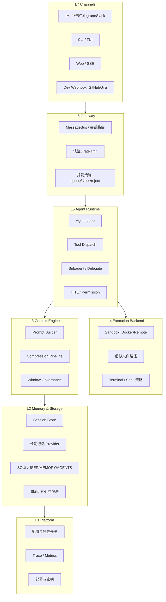

### 2.1 层间边界（必须遵守）

| 边界 | 正确 | 错误 |
|------|------|------|
| Channel ↔ Loop | Channel 只产出 **NormalizedMessage** + `session_key` | Channel 里直接调 LLM |
| 压缩 ↔ 长期记忆 | 压缩管 **当前窗口**；facts 走 **独立队列** | 把摘要塞进向量库当唯一记忆 |
| Session ↔ 人设文件 | Session 是 transcript；`SOUL.md` 是 **跨 session 规则** | 把人设只写在 system 里不落盘 |
| Sandbox ↔ Permission | Sandbox 管 **在哪执行**；Permission 管 **允不允许执行** | 以为 Docker 就等于审批 |
| Todo ↔ Plan 模式 | Todo 是任务列表；PLAN 模式是 **只读权限** | 把所有 Plan 都做成 `write_todos` |

---

## 3. 模块清单与职责

### 3.1 核心模块表（18 个）

| # | 模块 | 职责 | 参考实现 |
|---|------|------|----------|
| M1 | **Channel Adapter** | 平台 SDK → 统一入站/出站消息 | nanobot `channels/`, Hermes `gateway/platforms/` |
| M2 | **MessageBus** | 解耦入站与 Loop；可选 outbound | nanobot, OpenHarness, deer-flow |
| M3 | **Session Router** | `session_key` = f(channel, chat_id, user) | 全 Gateway 产品 |
| M4 | **Concurrency Controller** | queue / steer / interrupt / reject | Hermes `busy_input_mode`, nanobot pending |
| M5 | **Agent Loop** | 驱动 model ↔ tool 直到结束 | Hermes `run_conversation`, deepagents graph |
| M6 | **Tool Registry** | 注册、分组、MCP 桥接 | OpenHarness ToolRegistry, Hermes toolsets |
| M7 | **Tool Dispatcher** | 并行策略、超时、大结果 offload | Hermes 四层并行树, OpenAI Agents plan |
| M8 | **Prompt Builder** | system 静态段 + 动态段组装 | deer-flow `apply_prompt_template`, Hermes `prompt_builder` |
| M9 | **Compression Service** | 渐进压缩管线 | OpenHarness 四层, Hermes 三道防线 |
| M10 | **Session Store** | 完整 transcript 持久化 | Hermes SessionDB, nanobot SessionManager |
| M11 | **Archive / Offload** | 冷存档（history.jsonl, conversation_history） | deepagents offload, nanobot Consolidator |
| M12 | **Memory Provider** | 跨 session 事实（可选插件） | Hermes mem0, deer-flow memory.json |
| M13 | **Persona Files** | SOUL/USER/MEMORY/AGENTS 读写与注入 | 见 §6 |
| M14 | **Skill Index** | 渐进披露：索引 → 全文 → references | Hermes `skill_view`, deer-flow read_file |
| M15 | **Subagent Manager** | 委托、并发上限、结果回注 | deepagents SubAgent, nanobot SubagentManager |
| M16 | **Sandbox Backend** | 隔离执行环境 | deer-flow SandboxProvider, Hermes terminal |
| M17 | **Permission / HITL** | 模式矩阵 + 逐 tool 门 | OpenHarness PermissionChecker, deepagents HITL |
| M18 | **Observability** | trace_id、token、压缩事件 | OpenAI Agents tracing, LangSmith |
| M29 | **Mode Controller** | Plan / Agent / Multi 调度与权限/profile 切换 | OpenHarness PLAN、Hermes `/plan`、见 §16 |

### 3.2 三种交互模式（产品层）

完整 Harness 应支持 **Plan · Agent · Multi** 三模式；详见 [§16](#16-三种-agent-交互模式-plan--agent--multi)。  
**模块是零件，模式是运行策略** — Multi 通常叠加在 Agent 上（`task` 委托），Plan 是 Agent 的受限子态。

### 3.2 模块依赖（推荐）

```text
Channel → Bus → SessionRouter → ConcurrencyController
                                      ↓
                              AgentLoop ← PromptBuilder
                                   ↓    ↑
                            ToolDispatcher  CompressionService
                                   ↓
                            SandboxBackend
                                   ↓
                            SessionStore → Archive
                                   ↓
                            MemoryProvider (async)
```

**Loop 内每 turn 顺序（最佳实践）**：

```text
1. SessionStore.load(session_key)
2. MemoryProvider.prefetch(user_id)          # 可选，异步
3. PromptBuilder.build(static + dynamic)
4. CompressionService.maybe_compact()        # 调用 LLM 前
5. LLM.chat(messages, tools)
6. ToolDispatcher.run(tool_calls)            # Permission 在此
7. SessionStore.append(turn)
8. CompressionService.post_tool_check()      # 精确 token 触发
9. MemoryProvider.sync_turn() / queue.add()  # 防抖
10. 若 idle → Consolidator / Dream job      # 后台
```

---

## 4. 四条记忆与存储管线

与 [`06-memory.md`](06-memory.md) 对齐，Harness **必须** 显式实现四条线：

| 线 | 存什么 | 典型载体 | 谁读 |
|----|--------|----------|------|
| **S1 Session** | 当前对话全文（可压缩前） | SQLite / JSONL / checkpoint | Loop replay |
| **S2 压缩/归档** | 被挤出窗口的摘要或原文冷存 | history.jsonl, offload md | 审计、按需 read |
| **S3 文件记忆** | 跨 session 人格/事实/规则 | SOUL, USER, MEMORY, memory.json | Prompt 注入 / search |
| **S4 Skill** | 可复用 procedure | skills/**/SKILL.md | 渐进披露 |

### 4.1 存储布局（推荐目录）

```text
~/.your-harness/                          # 或项目 .harness/
├── config.yaml
├── hermes_state.db                       # 或 sessions/
├── users/{user_id}/
│   ├── threads/{thread_id}/
│   │   ├── messages.jsonl                # S1 可选镜像
│   │   ├── checkpoint/                   # LangGraph 时
│   │   └── artifacts/
│   ├── memory.json                       # S3 结构化事实（deer-flow 风格）
│   └── memory/
│       ├── SOUL.md                       # 人设 / 价值观
│       ├── USER.md                       # 用户画像
│       ├── MEMORY.md                     # 显式长期笔记
│       └── history.jsonl                 # S2 Consolidator 归档
├── conversation_history/{thread}.md      # S2 offload（deepagents 风格）
└── skills/                               # S4
    ├── public/
    └── custom/
```

### 4.2 写入时机

| 事件 | S1 | S2 | S3 | S4 |
|------|----|----|----|-----|
| 每 turn 结束 | append | — | queue（防抖） | — |
| token 超阈值 | 压缩后仍保留全量 | offload/Consolidator | memory_flush 抢救 | skill rescue |
| session 空闲 TTL | — | auto_compact | Dream / MemoryUpdater | — |
| 用户 `/remember` | — | — | 立即写 MEMORY | — |
| 任务成功结束 | close | 归档 | crystallize facts | skill-curator 可选 |

---

## 5. 压缩策略组合（长程任务）

不要只选一种。参考 [`07-compression.md`](07-compression.md) **C01–C22**，生产 Harness 推荐 **四层漏斗**：

| 阶段 | 策略 | 成本 | 触发 |
|------|------|------|------|
| 0 治理 | drop orphan tools、microcompact、tool budget | $0 | 每 turn 前 |
| 1 结构瘦身 | C04 microcompact（旧 tool 占位符） | $0 | ~70% 窗口 |
| 2 滑动+摘要 | C02 保尾 + C06 LLM 摘要 | $$ | ~85% 窗口 |
| 3 抢救 | C08 memory_flush → memory.json | $ | 摘要前 |
| 4 冷存 | C07 offload / history.jsonl | $0 IO | 与 2 同步 |
| 5 长期 | C09 防抖 facts | $ 低 | turn 后 30s |

**长程任务必做**：

1. **Session 全量与窗口分离** — 压缩只改「送进模型的视图」，DB/JSON 保留原文（OpenHarness、Hermes SessionDB）。
2. **Todo re-inject** — 压缩后从 store 重注入未完成 todo（Hermes C17）。
3. **Skill rescue** — 压缩前识别最近 `read_file` 的 skill 路径（deer-flow）。
4. **Post-tool 精确触发** — 用 API 返回的 `prompt_tokens`，不只客户端估算（Hermes）。

---

## 6. 人设与项目上下文

### 6.1 四类「非历史」上下文

| 类型 | 文件 | 内容 | 注入方式 |
|------|------|------|----------|
| **人设** | `SOUL.md` | 语气、价值观、边界 | 每 turn system 块 |
| **用户** | `USER.md` | 偏好、时区、称呼 | 每 turn 或 prefetch |
| **长期笔记** | `MEMORY.md` | 用户明确要求记住的事 | search + 注入 |
| **项目规则** | `AGENTS.md` / `rules.md` | repo 约束、架构约定 | MemoryMiddleware / 固定段 |

### 6.2 与 Skill 的分工

| | 人设/规则文件 | Skill |
|--|---------------|-------|
| 加载 | 通常 **自动注入** 或短摘要 | **仅索引**在 system，全文按需 |
| 变更频率 | 低，用户/Agent 偶尔改 | 高，任务型 |
| 典型大小 | 数百～数千 token | 单 skill 可达上万 token |

### 6.3 Prompt 组装顺序（推荐）

```text
1. Base system（安全、工具说明）
2. SOUL.md 段
3. USER.md 段
4. AGENTS.md / rules 段
5. <memory-context>（memory.json / provider 检索）
6. Skills 索引（name + description only）
7. Todo / Plan 状态块（压缩后 re-inject）
8. Session messages（已压缩视图）
```

参考：deer-flow 模板块、Hermes `prompt_builder`、deepagents middleware 链。  
**可复制模板集** → [`16-prompt-templates.md`](16-prompt-templates.md)（T0–T8，按 Plan/Agent/Multi/Chat 分套）。

---

## 7. 三类任务的场景化配置

### 7.1 长程任务（50–500+ 轮）

| 维度 | 推荐 |
|------|------|
| Loop | P02 显式 while 或 P01 middleware（便于插压缩钩子） |
| 压缩 | 四层漏斗 + offload |
| 记忆 | memory.json 防抖 + MEMORY.md 用户可编辑 |
| 并发 | queue 或 steer，避免 reject 挫败感 |
| 多 Agent | 有限并行子 research（≤3） |
| HITL | 仅高风险 tool interrupt |

**参考组合**: deer-flow（成本）+ Hermes（精确触发、todo re-inject）

### 7.2 编码任务（SWE / repo 操作）

| 维度 | 推荐 |
|------|------|
| Backend | B2 容器或 B4 独立 cwd；**默认无 B5 宿主机 shell** |
| 权限 | PLAN 模式做架构审查（OpenHarness H06） |
| 工具 | read/grep/bash/edit + MCP LSP |
| 并行 | **路径冲突检测**（Hermes S05），禁止盲目 gather |
| 压缩 | microcompact 优先（tool 输出占大头） |
| 审计 | offload + git diff；事件流（OpenHands）可选 |
| 多 Agent | delegate 独立 terminal cwd（Hermes） |

**参考组合**: OpenHarness（权限）+ deepagents（middleware）+ OpenHands（事件，企业）

### 7.3 研究任务（检索、报告、多源）

| 维度 | 推荐 |
|------|------|
| 多 Agent | 并行 `task` 子 Agent 做子课题（deepagents/deer-flow） |
| 记忆 | facts → memory.json；报告落 `artifacts/` |
| 压缩 | memory_flush + 防抖（防丢引用） |
| Skill | `deep-research` 类 SKILL + references |
| Backend | 网络出网沙箱；大 PDF offload |
| 渠道 | 异步通知（IM 卡片分片） |

**参考组合**: deer-flow + examples/deep_research 模式

### 7.4 场景对照总表

| 维度 | 长程对话 | 编码 | 研究 |
|------|----------|------|------|
| 压缩重心 | LLM 摘要 + facts | microcompact | flush + 子 Agent 摘要 |
| Sandbox | 可选 | **必须** | 出网隔离 |
| 子 Agent | 少 | 中（并行 cwd） | **多（并行检索）** |
| 人设 | 高（SOUL/USER） | 低（AGENTS 为主） | 中 |
| Gateway | steer/queue | CLI/TUI 为主 | IM + 进度推送 |

---

## 8. 外部终端接入（Gateway）

### 8.1 三层分离（必做）

```text
L7 平台 SDK（飞书 lark-oapi、python-telegram-bot…）
L6 统一 Envelope：{ session_key, user_id, text, attachments, reply_to }
L5 AgentLoop（与平台无关）
```

### 8.2 五种接入套路（选自 CHANNEL 专题）

| 套路 | 结构 | 适用 |
|------|------|------|
| **① Bus + Gateway** | Channel ↔ MessageBus ↔ Loop | 多平台、要解耦 |
| **② 内嵌 + HTTP API** | `app/` Gateway 与 Agent API 同进程 | deer-flow 类产品 |
| **③ 直调 Runner** | Platform adapter 直接 call Agent | Hermes 简洁栈 |
| **④ 桌面内嵌** | Channel 在 Tauri/Electron 内 | openhuman |
| **⑤ Dev Webhook** | GitHub/Jira 触发 | OpenHands |

**最佳实践默认选 ①**：nanobot / OpenHarness 已验证。

### 8.3 出站（回复）设计

| 能力 | 说明 |
|------|------|
| **流式分片** | 长回复按平台上限切块 |
| **typing 指示** | 降低 IM 侧焦虑 |
| **卡片/富文本** | 工具结果、diff 摘要 |
| **session 绑定** | 同 `session_key` 串行，跨 session 可并行 |

### 8.4 并发语义（产品必选一项）

| 策略 | 何时用 |
|------|--------|
| **steer / mid-turn inject** | IM 助手、长 tool 链（nanobot） |
| **queue** | 可靠 FIFO、可接受延迟 |
| **interrupt** | 纠错优先、可丢进行中工作 |
| **reject** | LangGraph 重 run 成本高（deer-flow IM） |

配置应 **产品级可切换**（Hermes `busy_input_mode`），不要写死。

### 8.5 远端 Gateway 与 Codex 式多用户 CLI

**目标**（对齐 [17-deployment.md](./17-deployment.md) §7–§8）：

1. **远端部署 Agent**：Gateway + AgentLoop 常驻服务器；客户端（IM / Web / CLI）只连 Channel，不在本机跑完整 Harness。
2. **多实例**：Gateway Worker ×N + **Postgres SessionDB**（禁止多副本 SQLite）。
3. **多用户并发**：每个 `session_key` 独立 runtime；**同 session 串行、跨 session 并行**（nanobot 实证）。
4. **Codex 式 CLI**：多台笔记本上的 `harness cli` 同时连同一 Gateway——轻本地终端、重远端 Loop，类似 Codex CLI + 远端推理 / ohmo `OhmoSessionRuntimePool`。

```text
错误默认：harness chat --thread debug-1   # P1 本地直连 Loop，仅调试
正确产品：harness gateway start           # P3 服务端
           harness cli --gateway https://harness.corp:8787 --user alice
           harness cli --gateway https://harness.corp:8787 --user bob   # 并行
```

**session_key 建议**：

| Channel | `session_key` 模板 |
|---------|-------------------|
| IM | `{channel}:{chat_id}` |
| Web | `web:{user_id}:{thread_id}` |
| **远端 CLI** | `cli:{user_id}:{client_id}` |

**认证**：Gateway `listen` 对外必须 TLS + token/mTLS；`user_id` 来自鉴权，勿信任 CLI 自报。

**与 Codex 产品对照**：

| 维度 | Codex CLI | 档位 B Harness |
|------|-----------|----------------|
| 本地 | 薄 CLI / IDE 插件 | `harness cli` 客户端 |
| 远端 | chatgpt.com Codex API | Gateway + `QueryEngine` / AgentLoop |
| 多用户 | 订阅账号 + 多会话 | 多 `user_id` + RuntimePool |
| 执行环境 | 厂商沙箱 | Docker / remote sandbox 池 |

**参考抄码**：deer-flow 多 worker + Postgres；nanobot Bus + per-session Lock；ohmo `OhmoSessionRuntimePool` + 远端 Channel。

---

## 9. 多 Agent 与并行

### 9.1 默认推荐：MA01 工具委托

```text
Parent Loop
  └─ tool: task(description, type)
        └─ Child Loop（独立 thread / cwd / checkpoint）
              └─ ToolMessage(summary) → Parent
```

### 9.2 硬规则

| 规则 | 原因 |
|------|------|
| 子并发上限 **3** | deer-flow 实证；防成本与文件锁 |
| **父 todos 不 merge 子** | deepagents 设计；父保持规划权威 |
| 子结果 **压缩** 后回父 | 防 context 爆炸 |
| 子 Agent **工具子集** | 减攻击面 |
| 完成路径：**pending injection** 优于直接改父 messages | nanobot 模式 |

### 9.3 何时用子进程（MA02）

- 不可信代码、重 CPU、需 OS 级隔离 → OpenHarness `--task-worker`
- 代价：IPC、部署复杂

---

## 10. 权限、HITL 与安全基线

### 10.1 默认安全 posture（生产）

```text
✅ 默认 Backend = 无 shell（deepagents StateBackend 哲学）
✅ 写/删/执行类 tool 可配置 interrupt 或审批
✅ 路径 virtual_mode + 工作区根
✅ MCP schema 裁剪 / deferred（deer-flow）
✅ Gateway 认证 + per-user rate limit
❌ 禁止默认 LocalShellBackend / shell=True
❌ 禁止无冲突检测的全并行写文件
```

### 10.2 权限模式矩阵（建议实现）

| 模式 | 读 | 写/bash | 典型场景 |
|------|----|---------|----------|
| **DEFAULT** | ✅ | ✅ 可审批 | 日常 |
| **PLAN** | ✅ | ❌ 硬拒绝 | 架构审查 |
| **YOLO** | ✅ | ✅ 无审批 | 仅 dev 容器 |

### 10.3 HITL 分层

| 层 | 机制 |
|----|------|
| 图/工具 | `interrupt_on`（deepagents） |
| 每 tool | PermissionChecker（OpenHarness） |
| 计划 | ToolExecutionPlan（OpenAI Agents） |
| 用户 | TUI 点击（deepagents-code） |

---

## 11. 可观测与运维

| 信号 | 用途 |
|------|------|
| `session_key`, `turn_id`, `trace_id` | 全链路关联 |
| `prompt_tokens` 前后 | 压缩触发是否正确 |
| `compression_event` | 层级、节省 token、是否 offload |
| `tool_latency`, `sandbox_cold_start` | 体验瓶颈 |
| `subagent_id`, `parent_turn` | 多 Agent 调试 |
| `channel`, `platform_message_id` | IM 客诉 |

**告警**：压缩失败降级、413 连续、子 Agent 超时、队列深度 > N。

---

## 12. 推荐技术栈组合（三种档位）

### 档位 A — 最小可生产（小团队）

| 层 | 选择 |
|----|------|
| Loop | deepagents SDK（P01） |
| Gateway | 自建薄层 HTTP + 单 Channel |
| Session | LangGraph checkpointer |
| 压缩 | SummarizationMiddleware + 文件 offload |
| 记忆 | AGENTS.md + 可选 memory.json |
| Sandbox | Docker 单容器 |
| HITL | `interrupt_on` 写/execute |

### 档位 B — 个人助手 / 全渠道（推荐平衡点）

| 层 | 选择 |
|----|------|
| Loop | 显式 while（Hermes 类）或 nanobot Runner |
| Gateway | MessageBus + 多 Channel |
| Session | SQLite SessionDB + JSONL 镜像 |
| 压缩 | 三道防线 + microcompact + todo re-inject |
| 记忆 | SOUL/USER/MEMORY + mem0 插件 + Dream/Consolidator |
| Sandbox | local + docker 可切换 |
| 并发 | steer + 子 Agent ≤3 |
| HITL | 可配置 busy_input_mode + 高风险 tool 审批 |

**这是 nanobot + Hermes + deer-flow 的「合成最佳实践」档位。**

### 档位 C — 企业 SE / 多租户

| 层 | 选择 |
|----|------|
| Loop | OpenHands 事件步或 deer-flow + Gateway |
| Gateway | deer-flow `app/` 多租户 + reject 并发 |
| Session | 事件流 + 审计 |
| 压缩 | Condenser + offload |
| Sandbox | K8s per-session |
| 权限 | 企业 IAM + OpenHarness 式 PLAN |
| 观测 | LangSmith + 自建 audit log |

---

## 13. 从 monorepo 抄什么

| 需求 | 抄谁 | 抄什么 |
|------|------|--------|
| Gateway + Bus | **nanobot** | `MessageBus`, `AgentLoop`, pending injection |
| 压缩漏斗 | **OpenHarness** + **Hermes** | 四层 compact + 三道防线 |
| 长期记忆成本 | **deer-flow** | MemoryUpdateQueue 防抖 |
| 审计 offload | **deepagents** | conversation_history + SummarizationMiddleware |
| 只读 Plan | **OpenHarness** | PermissionMode.PLAN |
| 工具并行安全 | **Hermes** | `_should_parallelize_tool_batch` |
| Tool 审批计划 | **OpenAI Agents** | `ToolExecutionPlan` |
| Skill 渐进披露 | **Hermes** / **deer-flow** | 索引 + skill_view / read_file |
| 文件记忆巩固 | **nanobot** | Consolidator + Dream |
| 多租户 IM | **deer-flow** | channels + multitask reject |
| 威胁模型 | **deepagents** | THREAT_MODEL.md 写法 |
| 桌面+安全策略 | **openhuman** | Rust policy tier |

---

## 14. 反模式清单

| 反模式 | 后果 |
|--------|------|
| 只有一个 `messages[]` 数组走天下 | 无法审计、无法长期记忆 |
| 压缩 = 删库 | 丢 transcript，合规风险 |
| Channel 里写 ReAct 循环 | 每接一个平台重写一遍 |
| 默认宿主机 shell | 提示注入 = RCE |
| 子 Agent 无上限并行 | 成本爆炸、git 锁死 |
| 把人设只放 system 字符串 | 无法跨 session、无法用户编辑 |
| Skill 全文塞进 system | token 爆炸 |
| 混淆 Todo 与 PLAN 权限 | 用户以为在规划其实能改盘 |
| 无 session_key 的多聊 | 串线 |
| 研究任务不用子 Agent | 单 context 塞满检索结果 |

---

## 15. 配套深潜文档（v1.1）

| 文档 | 内容 |
|------|------|
| [**DIAGRAMS.md**](./DIAGRAMS.md) | **11 张 Mermaid 图**：单 turn、Gateway、压缩漏斗、记忆四线、多 Agent、HITL、长程/编码/研究流、部署拓扑 |
| [**TIER_B_REFERENCE.md**](./TIER_B_REFERENCE.md) | **完整目录树** + `harness.yaml` / gateway / compression / memory / sandbox / security **配置样例** + SOUL/USER/MEMORY/AGENTS 模板 + docker-compose |
| [**DEEPAGENTS_SDK_MAPPING.md**](./DEEPAGENTS_SDK_MAPPING.md) | 蓝图 **M1–M18** ↔ deepagents middleware/backend；默认链顺序；档位 A/B **组合配方**；缺口补全清单 |

**推荐阅读顺序（落地实现）**：

```text
本文 §2 七层 + §3 模块
  → DIAGRAMS（看图）
  → TIER_B_REFERENCE（拷贝目录与 YAML）
  → DEEPAGENTS_SDK_MAPPING（选 SDK 或混合栈）
  → CONTEXT_COMPRESSION / AGENT_RUNTIME 专题（细调）
```

---

## 16. 三种 Agent 交互模式（Plan · Agent · Multi）

完整 Harness **应同时支持三种产品级模式**（可 per-session 或 per-message 切换）。它们与 §3 的「模块」正交：**模块是零件，模式是用户可见的运行策略**。

```text
                    ┌─────────────────────────────────────┐
                    │         Harness 模式调度器           │
                    │   ModeController (session + turn)   │
                    └───────────┬────────────┬────────────┘
                                │            │
           ┌────────────────────┼────────────┼────────────────────┐
           ▼                    ▼            ▼                    ▼
    ┌──────────────┐    ┌──────────────┐    ┌──────────────┐    (组合)
    │ PLAN 模式     │    │ AGENT 模式    │    │ MULTI 模式    │
    │ 先想后做      │    │ 单脑 ReAct    │    │ 多脑协作        │
    └──────────────┘    └──────────────┘    └──────────────┘
```

> **状态图**: [`DIAGRAMS.md`](./DIAGRAMS.md) §12  
> **Plan 实现细节**: [`05-plan-mode.md`](05-plan-mode.md)  
> **Multi 实现细节**: [`04-multi-agent.md`](04-multi-agent.md)

### 16.1 三种模式定义（产品层）

| 模式 ID | 用户感知 | 核心问题 | 默认 Loop | 典型入口 |
|---------|--------|----------|-----------|----------|
| **MODE-PLAN** | 「先规划，别乱改」 | 需求是否理清、方案是否可审？ | 单 Agent，**受限工具集** | `/plan`、`PermissionMode.PLAN`、`/plan` skill |
| **MODE-AGENT** | 「去做」 | 如何在约束下完成任务？ | 单 Agent **全量 ReAct** | 默认聊天、`/agent`、关闭 plan |
| **MODE-MULTI** | 「分头干活」 | 子任务谁做、结果怎么并？ | 主 Agent + **子 run / Crew / 子进程** | `task`、`delegate_task`、Crew kickoff |

**关键**：MODE-PLAN 与 MODE-AGENT 是 **同一 Loop 上的权限与 Prompt 切换**；MODE-MULTI 是 **Loop 拓扑变化**（主从），可与前两者叠加（例如在 AGENT 模式下调用 `task`）。

### 16.2 MODE-PLAN：不是只有一种 Plan

文档 [`05-plan-mode.md`](05-plan-mode.md) 的 **A/B/C 范式**应映射进 MODE-PLAN，避免团队各说各话：

| 范式 | 在 MODE-PLAN 中的角色 | 推荐组合 |
|------|----------------------|----------|
| **A. Todo 跟踪** | 规划**清单**（可与执行交织） | AGENT 模式默认开启；PLAN 模式可选「仅更新 todo 不写盘」 |
| **B. 只读规划** | **硬约束**：grep/read 可以，write/bash 不行 | OpenHarness `PermissionMode.PLAN`、hermes plan skill |
| **C. 编排分阶段** | 产品级「先 planning 工具链、再 executor」 | OpenManus Flow；Harness 可选 `plan_phase` 状态机 |

**推荐生产组合（档位 B）**：

```text
MODE-PLAN = B（只读权限）+ A（write_todos 仅内存/plan 文件）+ plan markdown → .hermes/plans/
```

用户说「帮我先设计方案」→ MODE-PLAN；说「按方案开干」→ 切 MODE-AGENT（权限恢复 DEFAULT）。

### 16.3 MODE-AGENT：默认执行态

| 维度 | 行为 |
|------|------|
| Loop | 单 `AgentLoop` / `create_deep_agent` graph |
| 工具 | 在 `security.yaml` 允许列表内全开（可 HITL） |
| Todo | **A 范式**：`todo` / `write_todos` 与工具调用**交织**（deepagents 默认） |
| 压缩 / 记忆 | 完整 §4–§5 管线 |
| 不适合 | 把「Plan」仅做成一个 prompt 开关而无权限差异 — 模型仍会 write |

**与 Cursor「Agent vs Chat」**：Chat 偏问答少工具；Agent 偏 MODE-AGENT。Harness 应用 **模式调度器** 区分 tool 集与 system 段，而非另写一套 loop。

### 16.4 MODE-MULTI：协作拓扑

与 [`04-multi-agent.md`](04-multi-agent.md) **MA01–MA08** 对齐；产品应 **显式支持至少 MA01**，可选 MA02/MA04：

| 子策略 | 机制 | 何时默认 |
|--------|------|----------|
| **MULTI-DELEGATE** | MA01 `task` / `delegate_task` | 研究、并行探索、编码子目录 |
| **MULTI-WORKER** | MA02 子进程 | 不可信代码、重 CPU |
| **MULTI-CREW** | MA04 Task 链 | 固定流水线报告 |
| **MULTI-HANDOFF** | MA03 | 多角色对话产品（OpenAI Agents 风格） |

**硬规则**（与 §9 一致）：

- 子 Agent 并发 ≤3（可配置）
- 父 **todos 不 merge** 子 Agent
- 子结果 **摘要** 回父；完整轨迹在子 thread / 子进程
- MODE-MULTI 下主 session 仍为 **一个** `session_key`；子 thread 内部 ID 单独 checkpoint

### 16.5 模式调度器（建议新增模块 M29）

| 职责 | 说明 |
|------|------|
| **当前模式** | `session.mode ∈ {plan, agent, multi}` — `multi` 常为 agent + 子 Agent 开关 |
| **切换入口** | slash：`/plan on|off`；API：`mode` 字段；自动：意图分类（可选） |
| **切换副作用** | 重建 permission 段（OpenHarness）；刷新 tool allowlist；**不**清 session |
| **与 Gateway** | 同 session 连发时，模式切换遵循 `busy_input_mode` |
| **持久化** | `sessions.mode`、`plan_summary`、`active_subagents` |

```python
# 伪代码
class ModeController:
    def resolve(self, session: Session, user_msg: str) -> RunProfile:
        if session.mode == "plan":
            return RunProfile(
                permission_mode="plan",
                tools=READONLY_TOOLS | {todo, plan_file_write},
                subagents_allowed=False,
            )
        if session.mode == "agent":
            return RunProfile(
                permission_mode="default",
                tools=FULL_TOOLS,
                subagents_allowed=session.multi_enabled,
            )
        # multi 不是第三种 loop，而是 agent + delegation policy
```

### 16.6 三模式 × 三类任务（§7 补充）

| 任务类型 | 推荐模式路径 |
|----------|--------------|
| **长程对话** | AGENT 为主；长讨论前可 PLAN → 再 AGENT |
| **编码** | PLAN（架构/读 repo）→ AGENT（改代码）；大改拆 **MULTI** 子 Agent |
| **研究** | AGENT + **MULTI-DELEGATE** 并行检索 → 父综合 |

### 16.7 monorepo 对照：谁已具备三模式

| 项目 | MODE-PLAN | MODE-AGENT | MODE-MULTI |
|------|-----------|------------|------------|
| **OpenHarness** | ● B 权限 | ● ReAct | ● MA02 子进程 |
| **Hermes** | ● B `/plan` + A todo | ● 默认 | ● delegate + kanban |
| **deepagents** | ◐ A todo only | ● 默认 | ● SubAgent |
| **deer-flow** | ◐ A todo 可开关 | ● | ● task 限 3 |
| **OpenManus** | ● C Flow | ◐ 单 Agent | ○ 单 executor |
| **OpenAI Agents** | ○ | ● Runner | ● handoff |
| **crewAI** | ○ | ◐ Task 内 | ● MA04 原生 |
| **Cursor**（产品） | ● Plan/Ask 类产品态 | ● Agent | ● 多 agent 闭源 |

图例：● 一阶 · ◐ 部分 · ○ 非核心

### 16.8 反模式（模式相关）

| 反模式 | 正确做法 |
|--------|----------|
| 只有一个模式写死 | 提供 Plan/Agent 切换 + Multi 策略配置 |
| Plan = 多写一个 system 段落 | Plan 必须 **权限或工具集** 变化 |
| Multi = 多个独立 Bot | 同一 session_key + 主从汇总 |
| Todo 模式当 Plan 模式卖 | 向用户说明：todo 是 **跟踪**，只读 plan 是 **约束** |
| 子 Agent 无上限 | `max_concurrent_subagents: 3` |

### 16.9 档位 B 配置片段

见 [`TIER_B_REFERENCE.md`](./TIER_B_REFERENCE.md) `agent_modes` 节（v1.1 起）。

---

## 附录 A：端到端数据流（档位 B）

```text
[Telegram 用户] "帮我调研 X 并写进 MEMORY"
    → ChannelAdapter.normalize()
    → MessageBus.publish_inbound()
    → session_key = telegram:chat:123
    → ConcurrencyController: steer 或 queue
    → AgentLoop.run_turn()
         → load SessionDB + prefetch mem0
         → PromptBuilder(SOUL, USER, skills index, memory block)
         → CompressionService.preflight()
         → LLM → tool: web_search, task(sub-research)
         → SubagentManager (max 3) → 子 Loop
         → Permission: bash 在 docker backend
         → post_tool: CompressionService.post_check()
         → MemoryUpdater.queue.add(facts)  # 30s debounce
         → SessionDB.append()
    → ChannelAdapter.reply(chunked markdown)
    → [后台] Dream 更新 MEMORY.md（若配置）
```

---

## 附录 B：模块接口草图（实现时参考）

```python
# 伪代码 — 边界接口，非某一仓库 API

class NormalizedMessage(TypedDict):
    session_key: str
    user_id: str
    text: str
    attachments: list[Attachment]

class Channel(Protocol):
    async def listen(self) -> AsyncIterator[NormalizedMessage]: ...
    async def send(self, session_key: str, content: OutboundContent) -> None: ...

class SessionStore(Protocol):
    async def load(self, session_key: str) -> Session: ...
    async def append(self, session_key: str, turn: Turn) -> None: ...

class CompressionService(Protocol):
    async def preflight(self, session: Session) -> Session: ...
    async def post_tool(self, session: Session, usage: TokenUsage) -> Session: ...

class MemoryProvider(Protocol):
    async def prefetch(self, user_id: str) -> MemoryContext: ...
    async def queue_turn(self, user_id: str, turn: Turn) -> None: ...

class AgentLoop(Protocol):
    async def run_turn(self, session_key: str, user_input: str) -> TurnResult: ...
```

---

## 附录 C：与专题文档映射

| 本文章节 | 深入阅读 |
|----------|----------|
| §4 记忆存储 | [06-memory.md](06-memory.md) |
| §5 压缩 | [07-compression.md](07-compression.md) |
| §7–9 运行时 | [AGENT_RUNTIME_FRAMEWORK_COMPARISON.md](03-runtime-loop-queue.md) |
| §8 Gateway | [09-channels.md](09-channels.md) |
| §9 多 Agent | [04-multi-agent.md](04-multi-agent.md) |
| §10 Plan | [05-plan-mode.md](05-plan-mode.md) |
| §15 图 / 配置 / SDK | [DIAGRAMS](./DIAGRAMS.md) · [TIER_B](./TIER_B_REFERENCE.md) · [DEEPAGENTS映射](./DEEPAGENTS_SDK_MAPPING.md) |
| §16 三模式 | [PLAN_MODE](05-plan-mode.md) · [MULTI_AGENT](04-multi-agent.md) |

---

**维护者**: Deep Agents Community  
**演进**: 新 Tier 1 能力（如统一 HITL 标准）落地后，更新 §12 档位表与 §13 对照表。


---

## 时序图与状态图

> **配套**: [`ARCHITECTURE.md`](./ARCHITECTURE.md)  
> **说明**: Mermaid 图与蓝图章节一一对应；渲染环境需支持 Mermaid。

---

## 目录

1. [七层总览](#1-七层总览)
2. [单 Turn 时序（档位 B）](#2-单-turn-时序档位-b)
3. [Gateway 入站出站](#3-gateway-入站出站)
4. [压缩漏斗](#4-压缩漏斗)
5. [四条记忆管线](#5-四条记忆管线)
6. [多 Agent 委托](#6-多-agent-委托)
7. [HITL 与权限门](#7-hitl-与权限门)
8. [长程任务生命周期](#8-长程任务生命周期)
9. [编码任务流](#9-编码任务流)
10. [研究任务流](#10-研究任务流)
11. [档位 B 部署拓扑](#11-档位-b-部署拓扑)
12. [三种交互模式状态机](#12-三种交互模式状态机-plan--agent--multi)

---

## 1. 七层总览

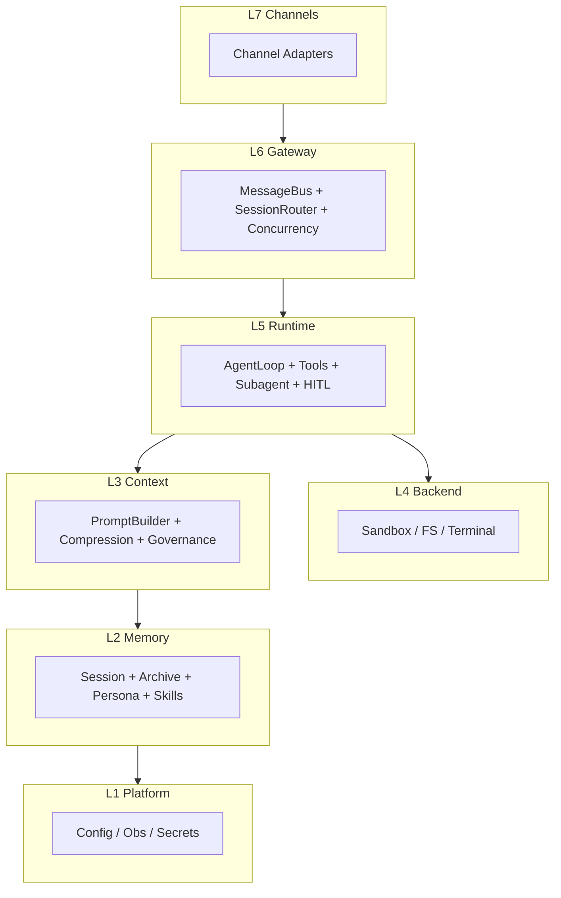

---

## 2. 单 Turn 时序（档位 B）

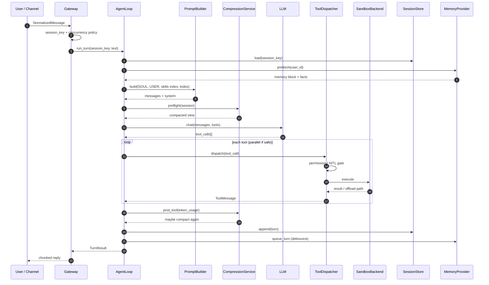

---

## 3. Gateway 入站出站

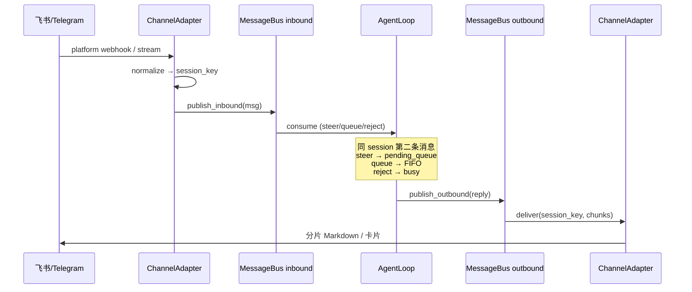

---

## 4. 压缩漏斗

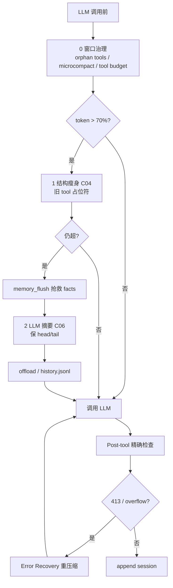

---

## 5. 四条记忆管线

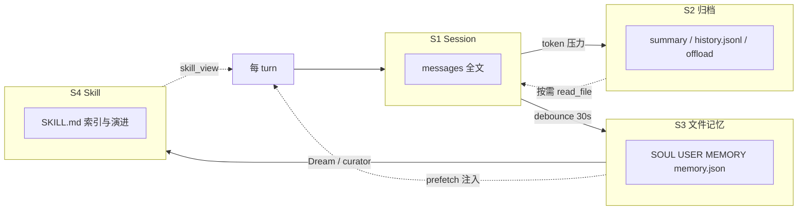

---

## 6. 多 Agent 委托

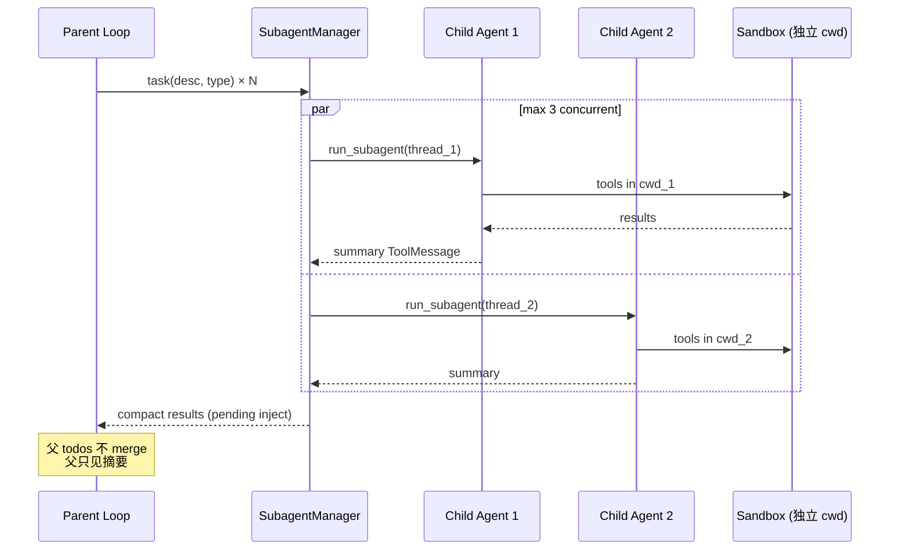

---

## 7. HITL 与权限门

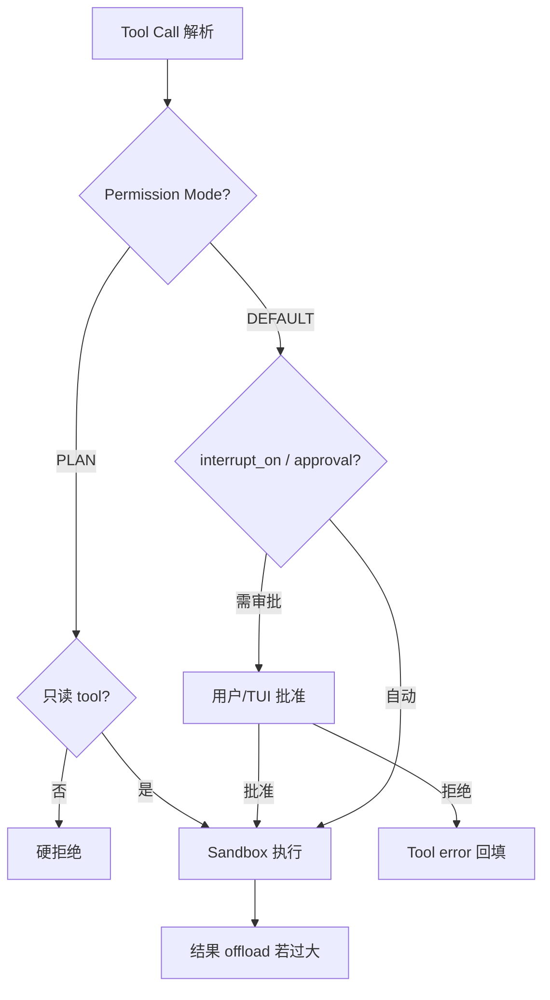

---

## 8. 长程任务生命周期

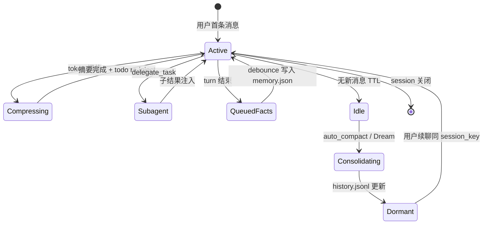

---

## 9. 编码任务流

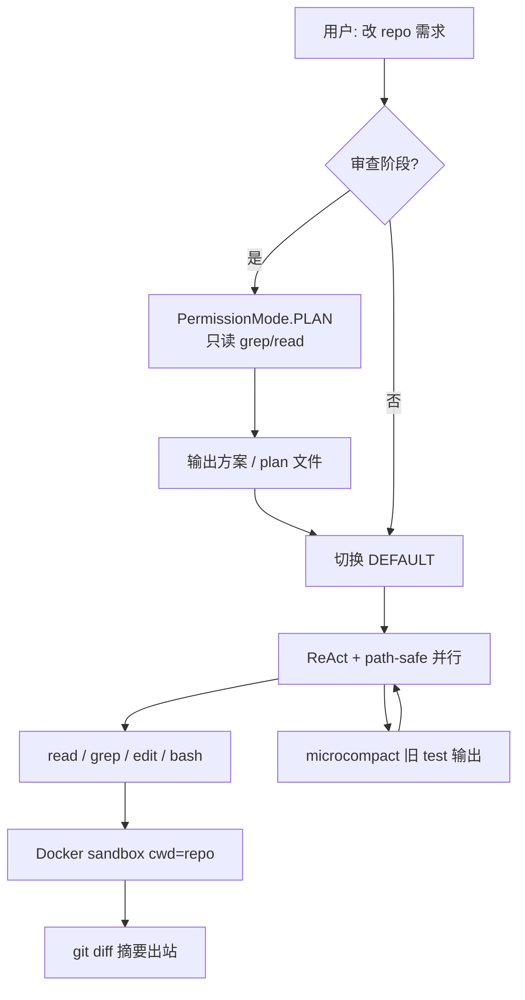

---

## 10. 研究任务流

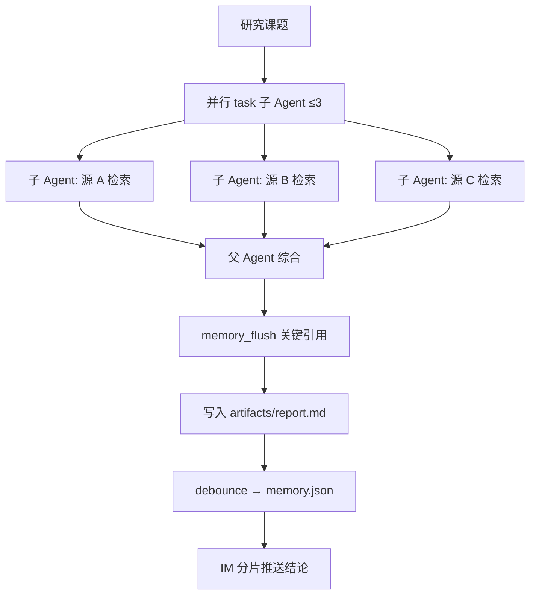

---

## 11. 档位 B 部署拓扑

### 11.1 单机 Gateway（开发 / 小团队）

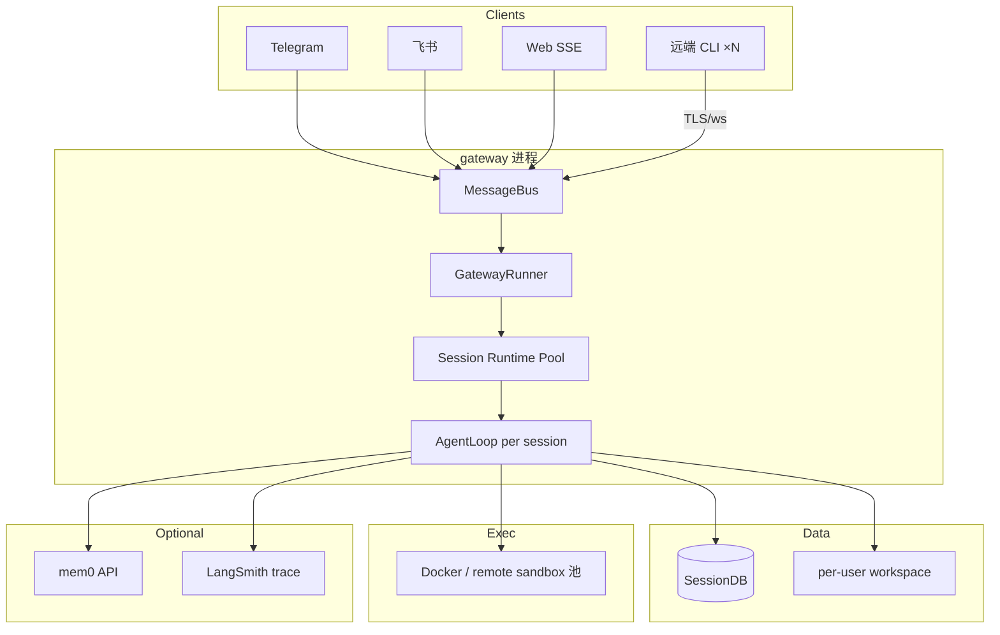

- 开发可用 SQLite SessionDB；**生产多副本必须 Postgres**（见 §11.2）。
- **远端 CLI** 与 IM/Web 同一 Bus，禁止「仅本地 `harness chat`」作为多用户方案。

### 11.2 多实例 + 远端部署（生产）

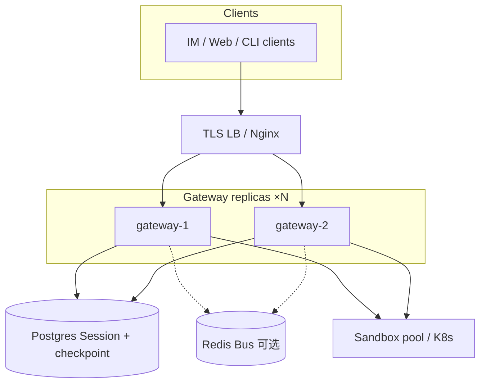

| 组件 | 要求 |
|------|------|
| Session | Postgres（或 Redis Session 服务）；**禁止**多 Pod 各写本地 SQLite |
| Gateway | 无状态副本；`session_id` 路由到共享存储 |
| 沙箱 | 池化 Docker 或 **remote** backend（`sandbox.yaml`） |
| CLI | `channels.cli.mode: server`；客户端 `harness cli --gateway $URL` |
| 并发 | `per_user_max_active_sessions`；`busy_input_mode: steer` |

详见 [17-deployment.md](./17-deployment.md)。

---

## 12. 三种交互模式状态机（Plan · Agent · Multi）

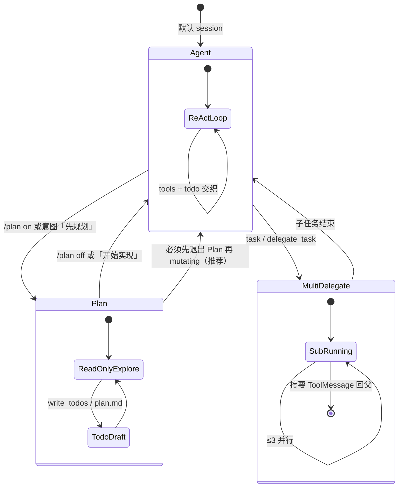

**说明**：`Multi` 不是与 `Plan`/`Agent` 并列的第三种 loop，而是 **Agent 模式下的委托策略**；图中单独画出便于产品沟通。

---

**维护**: 蓝图模块变更时同步更新对应图。详见 [`TIER_B_REFERENCE.md`](./TIER_B_REFERENCE.md)、[`DEEPAGENTS_SDK_MAPPING.md`](./DEEPAGENTS_SDK_MAPPING.md)。


---

## 档位 B 配置参考

> **配套**: [`ARCHITECTURE.md`](./ARCHITECTURE.md) §12 档位 B · [`DIAGRAMS.md`](./DIAGRAMS.md)

---

## 1. 设计目标（档位 B）

| 目标 | 实现 |
|------|------|
| 多 Channel | MessageBus + 独立 Adapter |
| **远端部署** | Gateway `0.0.0.0` + TLS；Agent 不在用户笔记本 |
| **多用户并发 CLI** | CLI Server 模式 + RuntimePool（Codex 式） |
| **多实例** | Postgres SessionDB；Gateway 水平扩展 |
| 长程对话 | 压缩漏斗 + Session 全量分离 |
| 跨 session 记忆 | SOUL/USER/MEMORY + memory.json 防抖 |
| 编码 + 研究 | Docker / **remote** sandbox + 子 Agent ≤3 |
| IM 体验 | `busy_input_mode: steer` |

合成参考：**nanobot**（Bus + Consolidator）+ **Hermes**（SessionDB、压缩、Gateway）+ **deer-flow**（memory.json 防抖）。

---

## 2. 完整目录树

```text
/opt/harness/                              # 或 ~/.harness/
├── config/
│   ├── harness.yaml                       # 主配置（本文 §3）
│   ├── gateway.yaml                       # Channel 与并发（§4）
│   ├── compression.yaml                   # 压缩阈值（§5）
│   ├── memory.yaml                        # 记忆 provider（§6）
│   ├── sandbox.yaml                       # 执行后端（§7）
│   └── security.yaml                      # 权限与 HITL（§8）
├── data/
│   ├── harness.db                         # SQLite SessionDB
│   └── users/
│       └── {user_id}/
│           ├── profile.json               # 显示名、时区、locale
│           ├── memory.json                # 结构化 facts（deer-flow 风格）
│           ├── memory/
│           │   ├── SOUL.md                # §9.1
│           │   ├── USER.md                # §9.2
│           │   ├── MEMORY.md              # §9.3 用户可编辑长期笔记
│           │   └── history.jsonl          # Consolidator 归档（S2）
│           └── threads/
│               └── {thread_id}/
│                   ├── meta.json          # title, created_at, lineage_parent
│                   ├── messages.jsonl     # S1 镜像（可选，DB 为主）
│                   └── artifacts/         # 报告、导出、大 tool 结果
├── conversation_history/                  # 全局 offload（可选，deepagents 风格）
│   └── {thread_id}.md
├── skills/
│   ├── public/                            # 内置 / hub 安装
│   │   └── deep-research/
│   │       ├── SKILL.md
│   │       └── references/
│   └── custom/                            # 用户 / curator 写入
├── logs/
│   ├── gateway.log
│   └── audit.jsonl                        # tool 审批、压缩事件
└── secrets/                               # 不入 git
    ├── .env                               # API keys
    └── channels/
        ├── telegram.token
        └── feishu.credentials.json
```

**工作区（编码任务）** — 与 harness 数据分离：

```text
~/work/{user_id}/{project_slug}/           # sandbox 挂载为 /workspace
├── AGENTS.md                              # 项目规则（S3 项目层）
├── .harness/
│   └── plans/                             # plan skill 只写此处
└── ... repo files ...
```

---

## 3. `config/harness.yaml`（主配置）

```yaml
# 参考 schema — 实现时映射到你的配置加载器
harness:
  version: "1.0"
  env: production

agent:
  default_model: "anthropic/claude-sonnet-4-20250514"
  fallback_model: "openai/gpt-4.1"
  max_iterations: 80
  max_subagent_iterations: 40

paths:
  data_root: "${HOME}/.harness/data"
  skills_root: "${HOME}/.harness/skills"
  workspace_root: "${HOME}/work"
  conversation_history: "${HOME}/.harness/conversation_history"

includes:
  - gateway.yaml
  - compression.yaml
  - memory.yaml
  - sandbox.yaml
  - security.yaml
  - agent_modes.yaml                 # §13 Plan / Agent / Multi

observability:
  trace_backend: langsmith          # 或 otel / none
  log_level: info
  audit_log: "${HOME}/.harness/logs/audit.jsonl"
```

---

## 4. `config/gateway.yaml`

```yaml
gateway:
  listen:
    host: "0.0.0.0"
    port: 8787
    # 可选: unix socket / 仅内网

  message_bus:
    inbound_maxsize: 1000
    outbound_maxsize: 1000

  session:
    # session_key = {channel}:{chat_type}:{chat_id}[:{topic}]
    key_template: "{channel}:{chat_id}"

  concurrency:
    # steer | queue | interrupt | reject
    busy_input_mode: steer
    queue_max_depth: 32
    per_user_max_active_sessions: 5

  channels:
    telegram:
      enabled: true
      token_file: secrets/channels/telegram.token
      allowed_chat_ids: []          # 空 = 需另行鉴权
    feishu:
      enabled: false
      credentials_file: secrets/channels/feishu.credentials.json
    cli:
      enabled: true
      # local_repl | server | remote_client
      mode: server
      # server 模式：Gateway 接受多路远端 CLI（Codex 式多用户）
      server:
        host: "0.0.0.0"
        port: 8788
        max_connections: 64
        auth:
          type: token              # token | mtls
          token_file: secrets/gateway/cli.token
      # remote_client 模式：本机 CLI 连远端 Gateway
      remote_client:
        gateway_url: ""            # harness cli 默认读此或 --gateway
        user_id_from: auth         # 勿信任未鉴权自报 user_id
    web:
      enabled: true
      sse_path: /api/chat-events
      cors_origins:
        - "http://localhost:3000"

  outbound:
    chunk_max_chars: 4000
    typing_indicator: true
    retry_attempts: 3
```

---

## 5. `config/compression.yaml`

```yaml
compression:
  # 与 CONTEXT_COMPRESSION C01–C22 对齐
  enabled: true

  triggers:
    preflight_ratio: 0.70           # 粗估 token / context_limit
    post_tool_ratio: 0.85           # 用 API prompt_tokens（精确）
    error_recovery: true            # 413 / overflow 自动重试

  pipeline:
    governance:
      drop_orphan_tool_results: true
      microcompact_keep_recent_tools: 5
      tool_result_token_budget: 80000

    microcompact:
      enabled: true
      compactable_tools:
        - bash
        - read_file
        - grep
        - web_search

    summarization:
      enabled: true
      model: "${agent.fallback_model}"   # 摘要用便宜模型
      protect_first_turns: 2
      protect_last_turns: 4
      offload_to: "${paths.conversation_history}/{thread_id}.md"

    memory_flush:
      enabled: true
      before_summarization: true       # C08

  todo:
    reinject_after_compact: true       # C17

  skill_rescue:
    enabled: true
    preserve_recent_skill_reads: 3
```

---

## 6. `config/memory.yaml`

```yaml
memory:
  session:
    backend: sqlite
    path: "${paths.data_root}/harness.db"
    fts_enabled: true                  # 历史搜索

  consolidation:
    # nanobot Consolidator 等价
    enabled: true
    idle_ttl_seconds: 3600
    archive_to: "memory/history.jsonl"
    auto_compact_on_idle: true

  long_term:
    # deer-flow memory.json 等价
    facts_file: "memory.json"
    debounce_seconds: 30
    extract_model: "${agent.fallback_model}"

  dream:
    # 可选：空闲时巩固 SOUL/MEMORY
    enabled: false
    schedule: "0 3 * * *"              # cron 或 idle 触发
    max_history_lines: 500

  providers:
    - type: builtin                    # 读 SOUL/USER/MEMORY 文件
      sources:
        - "memory/SOUL.md"
        - "memory/USER.md"
        - "memory/MEMORY.md"
    - type: mem0                       # 可选插件
      enabled: false
      api_key_env: MEM0_API_KEY
      prefetch_top_k: 5

  persona:
    inject_order:
      - soul
      - user
      - memory_block
      - project_agents_md              # 若 cwd 有 AGENTS.md
```

---

## 7. `config/sandbox.yaml`

```yaml
sandbox:
  default: docker                      # local | docker | remote

  local:
  # 仅 dev；生产禁用或配合严格 permission
    allowed_cwd_roots:
      - "${paths.workspace_root}"

  docker:
    image: "harness-sandbox:latest"
    network: bridge
    memory_limit: "2g"
    cpu_quota: 100000
    mount_workspace: "/workspace"
    mount_skills: "/mnt/skills:ro"
    per_user_pool_size: 2
    idle_ttl_minutes: 30

  remote:
  # 可选 Daytona / Modal / E2B
    provider: daytona
    api_key_env: DAYTONA_API_KEY

  tool_output:
    inline_max_chars: 50000
    offload_dir: "threads/{thread_id}/artifacts"
```

---

## 8. `config/security.yaml`

```yaml
security:
  permission_mode: default             # default | plan | yolo（仅 dev）

  plan_mode:
    readonly_tools:
      - read_file
      - grep
      - glob
      - list_dir
      - web_search
    block_mutating: true               # 不可审批绕过

  hitl:
    interrupt_tools:
      - execute
      - write_file
      - edit_file
    auto_approve_readonly: true

  subagent:
    max_concurrent: 3
    inherit_parent_permissions: false
    tool_subset:                       # 子 Agent 可缩减
      - read_file
      - grep
      - web_search
      - write_file

  parallel_tools:
    strategy: conflict_aware         # naive_gather | conflict_aware
    never_parallel:
      - clarify
    path_overlap_check: true

  gateway:
    rate_limit_per_user: "60/minute"
    require_allowlist: false
```

---

## 9. 人设文件模板

### 9.1 `memory/SOUL.md`

```markdown
# Soul

You are a personal assistant named Harness.

## Tone
- Direct, warm, concise.
- Match the user's language (default: 简体中文).

## Boundaries
- Never exfiltrate secrets from secrets/ or .env.
- Ask before destructive git operations.
- Prefer read-only exploration when the user says "先看看" or "plan".
```

### 9.2 `memory/USER.md`

```markdown
# User

- Name: (filled by onboarding)
- Timezone: Asia/Shanghai
- Preferences:
  - Code style: match existing repo
  - Reports: Markdown with bullet summaries
```

### 9.3 `memory/MEMORY.md`

```markdown
# Long-term notes

<!-- User and agent may edit. Curator/Dream may append with attribution. -->

## Facts

- (empty — use /remember or automatic extraction)
```

### 9.4 项目 `AGENTS.md`（工作区内）

```markdown
# Project agents

## Build
- `make test` before claiming done.

## Architecture
- Do not import from legacy/ without approval.

## Plan mode
- Use harness plan permission when user asks for architecture review only.
```

---

## 10. `docker-compose.yml`（Gateway + Sandbox 池）

```yaml
services:
  gateway:
    image: harness-gateway:latest
    ports:
      - "8787:8787"
    volumes:
      - ${HOME}/.harness:/data
      - /var/run/docker.sock:/var/run/docker.sock
    env_file:
      - secrets/.env
    environment:
      HARNESS_CONFIG: /data/config/harness.yaml

  # 可选：mem0 自托管
  # mem0:
  #   image: mem0/mem0-server:latest
```

---

## 11. 启动命令（参考）

```bash
# 初始化目录
harness init --tier b --data-root ~/.harness

# 校验配置
harness config validate

# 启动 Gateway（blocking，远端部署入口）
harness gateway start --config ~/.harness/config/harness.yaml

# 远端多用户 CLI（连已启动的 Gateway，Codex 式）
harness cli --gateway https://harness.corp:8787 --user alice --thread main
harness cli --gateway https://harness.corp:8787 --user bob --thread main

# 本地单会话调试（不经 Bus，仅开发）
harness chat --local --thread debug-1 --user u1

# 触发空闲巩固（可选）
harness memory consolidate --user u1 --idle
```

---

## 12. 与 deepagents 档位 A 的差异

| 项 | 档位 A（SDK） | 档位 B（本文） |
|----|---------------|----------------|
| Gateway | 自建薄 HTTP | 完整 Bus + 多 Channel |
| Session | checkpointer only | SQLite + JSONL 镜像 |
| Persona | AGENTS.md | SOUL + USER + MEMORY |
| 压缩 | SummarizationMiddleware | 完整漏斗 + flush + todo re-inject |
| 并发 | 应用自研 | steer/queue 可配置 |
| 巩固 | 无 | Consolidator + 可选 Dream |
| **三模式** | 仅 AGENT + 可选 MULTI | **Plan / Agent / Multi 显式调度** |

用 deepagents 实现档位 B 核心 Loop 时，见 [`DEEPAGENTS_SDK_MAPPING.md`](./DEEPAGENTS_SDK_MAPPING.md) §5「组合配方」。

---

## 13. `config/agent_modes.yaml`（三模式，v1.1+）

```yaml
agent_modes:
  default: agent                    # plan | agent

  plan:
    # 产品 MODE-PLAN：组合范式 B + 部分 A
    permission_mode: plan             # 映射 security.yaml PLAN
    paradigms:
      readonly: true                  # B：禁止 mutating tools
      todos: true                     # A：允许 write_todos / todo
      plan_file_write: true           # 仅允许写 .hermes/plans/*.md
    allowed_tools:
      - read_file
      - grep
      - glob
      - web_search
      - todo
      - write_plan_file
    subagents_allowed: false
    slash_commands:
      enter: ["/plan", "/plan on"]
      exit: ["/plan off", "/agent"]

  agent:
    # 产品 MODE-AGENT：全量执行
    permission_mode: default
    paradigms:
      todos: true                     # A：与执行交织
    subagents_allowed: true           # 可触发 MODE-MULTI
  multi:
    # 非独立 loop；delegation 策略挂在 agent 下
    max_concurrent_subagents: 3
    delegate_tools:
      - task
      - delegate_task
    result_policy: compact_summary    # 摘要回父 thread
    merge_parent_todos: false

  # 可选：自动意图路由（轻量分类器或规则）
  auto_switch:
    enabled: false
    plan_keywords: ["先规划", "方案", "架构", "别改代码"]
```

---

**维护**: 字段名以实现为准；本文为 **参考 schema**，便于 fork 时统一命名。


---

## deepagents SDK 映射

> **源码锚点**: `libs/deepagents/deepagents/`（`create_deep_agent` @ `graph.py`）  
> **配套**: [`ARCHITECTURE.md`](./ARCHITECTURE.md) · [`TIER_B_REFERENCE.md`](./TIER_B_REFERENCE.md)

---

## 1. 总览：SDK 覆盖哪几层

| 蓝图层 | deepagents SDK | 需自建（档位 B） |
|--------|----------------|------------------|
| L7 Channels | ❌ | Telegram / 飞书 Adapter |
| L6 Gateway | ❌ | MessageBus、并发策略 |
| L5 Agent Runtime | ✅ 核心 | Gateway 胶水、steer |
| L4 Backend | ✅ 协议 + 实现 | Docker 池编排 |
| L3 Context | ✅ 大部分 | todo re-inject、三道防线精细触发 |
| L2 Memory | ⚠️ 部分 | SessionDB、memory.json 防抖、Dream |
| L1 Platform | ⚠️ 依赖 LangGraph/LangSmith | 统一 config、audit |

**结论**: deepagents 是 **档位 A 核心**；升到 **档位 B** 需外包 L6–L7 + 补强 L2/L3。

---

## 2. 蓝图 M1–M18 → SDK 对照

图例：**●** 内置 · **◐** 部分/需配置 · **○** 无 · **＋** 用 LangChain/LangGraph 通用件

| 蓝图模块 | deepagents | 符号 | 实现位置 |
|----------|------------|:----:|----------|
| **M1** Channel Adapter | — | ○ | 自建；参考 nanobot `channels/` |
| **M2** MessageBus | — | ○ | 自建 |
| **M3** Session Router | `thread_id` | ◐ | `graph.invoke(config={"configurable":{"thread_id":...}})` |
| **M4** Concurrency Controller | — | ○ | 自建；deepagents-code `deque` 可参考 |
| **M5** Agent Loop | LangGraph agent | ● | `create_deep_agent()` → `CompiledStateGraph` |
| **M6** Tool Registry | middleware + `tools=[]` | ● | `graph.py` 合并 consumer tools |
| **M7** Tool Dispatcher | LangGraph ToolNode | ◐ | 并行由模型批量 tool_calls；无 Hermes 式路径冲突树 |
| **M8** Prompt Builder | middleware 注入 + `BASE_AGENT_PROMPT` | ● | 各 middleware `wrap_model_call` |
| **M9** Compression Service | SummarizationMiddleware | ◐ | `middleware/summarization.py`；无 OpenHarness 四层渐进 |
| **M10** Session Store | checkpointer | ◐ | LangGraph `MemorySaver` / 外部 checkpointer |
| **M11** Archive / Offload | summarization offload | ● | `conversation_history/{thread_id}.md` + `_message_eviction` |
| **M12** Memory Provider | MemoryMiddleware + store | ◐ | `AGENTS.md` 等；无 memory.json 防抖 |
| **M13** Persona Files | MemoryMiddleware `sources` | ◐ | 文件注入，无 SOUL/USER 分文件约定 |
| **M14** Skill Index | SkillsMiddleware | ● | `middleware/skills.py` 渐进披露 |
| **M15** Subagent Manager | SubAgentMiddleware | ● | `middleware/subagents.py` + `task` tool |
| **M16** Sandbox Backend | BackendProtocol | ● | `backends/*` |
| **M17** Permission / HITL | FilesystemPermission + HITL | ◐ | `FilesystemMiddleware` + `HumanInTheLoopMiddleware` |
| **M18** Observability | LangSmith 等 | ◐ | `LangSmithSandbox`、LangGraph trace |
| **M29** Mode Controller | — | ○ | 自建；见蓝图 §16 `agent_modes.yaml` |

---

## 3. 默认 Middleware 链（主 Agent）

`create_deep_agent()` 组装顺序（`graph.py`，约 712–771 行）：

```text
1.  TodoListMiddleware                    [LangChain]     → M5 todo / 规划
2.  SkillsMiddleware (optional)          [deepagents]    → M14
3.  FilesystemMiddleware                  [deepagents]    → M6/M16/M17
4.  SubAgentMiddleware (optional)        [deepagents]    → M15
5.  SummarizationMiddleware (factory)    [deepagents]    → M9/M11
6.  PatchToolCallsMiddleware             [deepagents]    → tool 配对修复
7.  AsyncSubAgentMiddleware (optional)   [deepagents]    → M15 异步子 Agent
8.  user middleware[]                    [caller]        → 扩展
9.  profile.extra middleware             [harness_profiles]
10. ToolExclusionMiddleware (optional)    [deepagents]
11. AnthropicPromptCachingMiddleware     [LangChain]
12. MemoryMiddleware (optional)          [deepagents]    → M12/M13
13. HumanInTheLoopMiddleware (optional) [LangChain]     → M17 HITL
```


---

## 4. Backend 映射（M16）

| 蓝图 B 层级 | deepagents 类 | 路径 | `execute` tool |
|-------------|---------------|------|----------------|
| B0 无 shell | `StateBackend` | `backends/state.py` | ❌ 过滤掉 |
| B1 工作区 FS | `FilesystemBackend` | `backends/filesystem.py` | 依 virtual_mode |
| B1 复合 | `CompositeBackend` | `backends/composite.py` | 路由组合 |
| B3 远程沙箱 | `LangSmithSandbox` | `backends/langsmith.py` | ✅ 协议实现 |
| B5 宿主机 shell | `LocalShellBackend` | `backends/local_shell.py` | ✅ **高风险** |
| 持久 store | `StoreBackend` | `backends/store.py` | — |

**默认**: `StateBackend` — 安全基线与蓝图 §10 一致。

```python
from deepagents import create_deep_agent
from deepagents.backends import FilesystemBackend, CompositeBackend, StateBackend

# 档位 A 常见：项目目录可读写，无 shell
backend = lambda rt: CompositeBackend(
    default=FilesystemBackend(root_dir="/path/to/project", virtual_mode=True),
    routes={"/memories/": lambda r: StateBackend(r)},
)
```

Partner 包（`libs/partners/daytona` 等）提供额外 B3 实现。

---

## 5. 压缩与存储映射（M9–M12）

| 蓝图能力 | deepagents | 差距 / 补法 |
|----------|------------|-------------|
| microcompact | Summarization 内 truncates tool args | 无独立 C04 层；可调阈值 |
| LLM 摘要 | `SummarizationMiddleware` | ● |
| offload 文件 | `conversation_history/{thread_id}.md` | ● |
| memory_flush | — | 自建 middleware 或 deer-flow 式 hook |
| 防抖 facts | — | 自建 `MemoryUpdateQueue` |
| todo re-inject | TodoListMiddleware 常驻 | 压缩后显式 re-inject 需自建 |
| Session 全量 DB | checkpointer messages | 另写 SQLite 镜像（档位 B） |
| SOUL/USER 分文件 | MemoryMiddleware 多 `sources` | 配置多个路径即可 ◐ |

**大 tool 结果**: `FilesystemMiddleware` + `_message_eviction.py` → 与蓝图 M7 offload 对齐。

---

## 6. 多 Agent 映射（M15）

| 能力 | API | 文件 |
|------|-----|------|
| 同步子 Agent | `SubAgentMiddleware` + `task` tool | `middleware/subagents.py` |
| GP 子 Agent | `GENERAL_PURPOSE_SUBAGENT` | 同上 |
| 异步子 Agent | `AsyncSubAgentMiddleware` | `middleware/async_subagents.py` |
| 子 thread | 独立 `thread_id` / checkpoint | LangGraph configurable |
| 并发上限 | 无硬限 | 自建或抄 deer-flow `SubagentLimitMiddleware` |
| todos 不 merge 回父 | ● 默认行为 | 文档化依赖 |

---

## 7. HITL 与权限映射（M17）

| 蓝图 | deepagents | 用法 |
|------|------------|------|
| H01 图级 interrupt | `HumanInTheLoopMiddleware` | `interrupt_on={"write_file": True, "execute": True}` |
| 文件路径权限 | `FilesystemPermission` | 传给 `FilesystemMiddleware(_permissions=...)` |
| OpenHarness PLAN | — | 无 `PermissionMode`；用 permission rules 模拟只读 ○ |
| Tool 冲突检测 | — | 自建或外包 Hermes 逻辑 ○ |

```python
from langchain.agents.middleware import HumanInTheLoopMiddleware

agent = create_deep_agent(
    model="anthropic/claude-sonnet-4-20250514",
    interrupt_on={
        "write_file": True,
        "edit_file": True,
        "execute": True,
    },
)
```

---

## 8. 蓝图模块 → 应用层补全清单

实现 **档位 B** 时，在 deepagents 外包/旁路：

| 缺失模块 | 推荐抄本 | 集成点 |
|----------|----------|--------|
| M1–M2 Channel/Bus | nanobot | `gateway` 进程，`graph.ainvoke` 作内核 |
| M4 steer/queue | Hermes `busy_input_mode` | Gateway 层，非 middleware |
| M10 SQLite SessionDB | Hermes `SessionDB` | 每 turn 前后写库；graph 仍用 checkpointer |
| memory.json 防抖 | deer-flow `MemoryUpdateQueue` | `after_agent` hook |
| 三道防线压缩 | Hermes `conversation_compression` | 自定义 `AgentMiddleware` 包一层 |
| Consolidator | nanobot | idle job 写 `history.jsonl` |
| PLAN 硬拒绝 | OpenHarness `PermissionChecker` | 自定义 middleware 在 Filesystem 前 |

---

## 9. 组合配方

### 9.1 档位 A — 最小生产（纯 deepagents）

```python
from deepagents import create_deep_agent
from deepagents.backends import FilesystemBackend

agent = create_deep_agent(
    model="anthropic/claude-sonnet-4-20250514",
    backend=FilesystemBackend(root_dir=".", virtual_mode=True),
    memory=["./AGENTS.md"],
    skills=["./skills/"],
    interrupt_on={"execute": True},
)
# thread 持久化
agent.invoke(
    {"messages": [...]},
    config={"configurable": {"thread_id": "user-1-project-a"}},
)
```

### 9.2 档位 B — deepagents 内核 + Gateway 外壳

```text
┌─────────────────────────────────────┐
│ harness-gateway (自建)               │
│  MessageBus · steer · SessionDB      │
└──────────────┬──────────────────────┘
               │ ainvoke(thread_id)
┌──────────────▼──────────────────────┐
│ create_deep_agent()                  │
│  + custom MW: MemoryFlush, TodoReinject│
│  + checkpointer + FilesystemBackend  │
└──────────────┬──────────────────────┘
               │
┌──────────────▼──────────────────────┐
│ Docker sandbox (wrap LocalShell 或   │
│  partner remote backend)               │
└─────────────────────────────────────┘
```

### 9.3 与 deer-flow 的关系

deer-flow **同族** LangChain `create_agent` + middleware，链更长（18 层）、自带 Gateway 与 `memory.json`。  
若已全量 deer-flow，**不必**再嵌 deepagents；两者选型互斥为主、组合为辅。

---

## 10. Middleware 扩展模板（补蓝图缺口）

```python
from typing import Any

from langchain.agents.middleware import AgentMiddleware
from langchain.agents.middleware.types import ModelRequest, ModelResponse


class MemoryFlushMiddleware(AgentMiddleware):
    """压缩前将高价值 messages 写入 memory.json（C08 等价）。"""

    def __init__(self, queue: MemoryUpdateQueue) -> None:
        self._queue = queue

    def wrap_model_call(
        self,
        request: ModelRequest,
        handler: Any,
    ) -> ModelResponse:
        # 在 summarization 已触发或 token 超阈值时：
        # self._queue.add_nowait(request.messages)
        return handler(request)
```

注册：`create_deep_agent(..., middleware=[MemoryFlushMiddleware(queue)])` — 插在 Summarization **之前**（用户 middleware 在 async subagent 之后、memory 之前，按需调整）。

---

## 11. deepagents-code（TUI）额外映射

| 蓝图 | deepagents-code `libs/code/` |
|------|------------------------------|
| M4 queue + interrupt | `DeepAgentsApp` `_pending_messages`、Esc interrupt |
| M5 Loop | 继承 SDK graph + Textual UI |
| H05 TUI 审批 | 交互式 tool 确认 |

Gateway 产品通常 **不用** deepagents-code，而用自建 L6。

---

## 12. 快速查表：我想实现蓝图里的 X

| 需求 | deepagents 做法 |
|------|-----------------|
| 子 Agent 调研 | `SubAgentMiddleware` + `task` |
| 长对话不爆窗 | 默认 `SummarizationMiddleware` |
| 审计全文 | offload 路径 + checkpointer |
| 项目规则注入 | `memory=["AGENTS.md"]` |
| Skills 渐进加载 | `skills=["./skills/"]` |
| 禁用危险 tool | `FilesystemBackend` 无 shell + `interrupt_on` |
| 飞书 Bot | **无** — 自建 Gateway + `ainvoke` |
| Plan/Agent 模式切换 | **无** — `PermissionMode` 需自建 middleware |
| memory.json 防抖 | **无** — deer-flow 模块或自建 |
| MULTI `task` 子 Agent | ● `SubAgentMiddleware` | |

---

## 13. 相关源码索引

| 主题 | 路径 |
|------|------|
| 构图入口 | `libs/deepagents/deepagents/graph.py` |
| Middleware 包 | `libs/deepagents/deepagents/middleware/` |
| Backend 包 | `libs/deepagents/deepagents/backends/` |
| 威胁模型 | `libs/deepagents/THREAT_MODEL.md` |
| Harness profiles | `libs/deepagents/deepagents/profiles/harness/` |
| Partner sandbox | `libs/partners/daytona/` 等 |

---

**维护**: `create_deep_agent` 默认链变更时，同步更新 §3 顺序表与 §2 对照。

