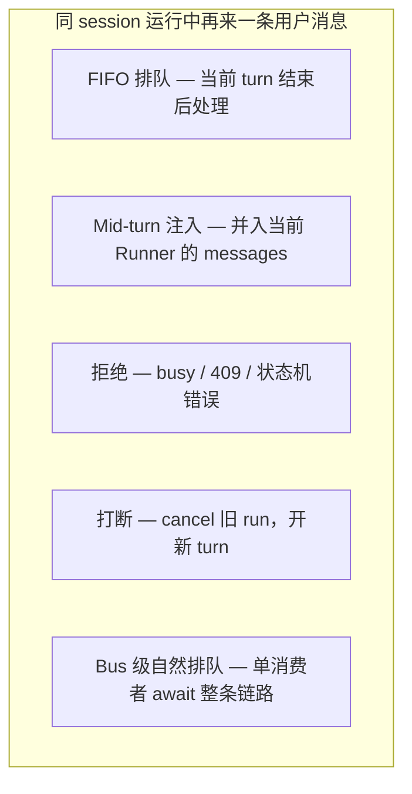

# 运行时 · Loop · 队列

> **设计思想**：[00-HARNESS-DESIGN-PHILOSOPHY.md](./00-HARNESS-DESIGN-PHILOSOPHY.md) §第 3–4 步 · 读本文时优先 **§1–§2、§10 六条设计法则**  
> **本文含**：P01–P11 实现表与路径索引（后读）

> **合并说明**：由以下文档去重合并（2026-08-04）。

---


---

## 运行时五柱

> **合并来源**:
> - [`01-overview.md`](./01-overview.md) §5、§9–§12b
> - [`04-multi-agent.md`](04-multi-agent.md)
> - [`03-runtime-loop-queue.md`](03-runtime-loop-queue.md)
> - [`01-overview.md`](01-overview.md) §8 Tool 执行
> - [`05-plan-mode.md`](05-plan-mode.md)（权限型 Plan）
> - 各项目 `THREAT_MODEL` / gateway / sandbox 文档

---

## 📋 目录

1. [为什么需要五柱分层](#1-为什么需要五柱分层)
2. [五柱运行时模型](#2-五柱运行时模型)
3. [§A Agent Loop](#a-agent-loop-驱动与单步语义)
4. [§B 多 Agent 协作](#b-多-agent-协作)
5. [§C Backend 与执行环境](#c-backend-与执行环境)
6. [§D HITL 人在回路](#d-hitl-人在回路)
7. [§E 权限与安全](#e-权限与安全)
8. [全库项目五柱总矩阵](#8-全库项目五柱总矩阵)
9. [选型决策树](#9-选型决策树)
10. [六条设计法则](#10-六条设计法则)
11. [常见陷阱](#11-常见陷阱)
12. [专题深潜索引](#12-专题深潜索引)

---

## 1. 为什么需要五柱分层

压缩解决「**上下文怎么塞进去**」；运行时解决「**这一步谁驱动、在哪执行、谁批准、多 Agent 怎么分工**」。五者常被混谈：

| 易混概念 | 实际归属 |
|----------|----------|
| `interrupt_on` 暂停图 | **HITL**（图级），不是 chat 插队 |
| `PermissionMode.PLAN` | **权限**（只读沙箱），不是 todo 列表 |
| `task` 子 Agent | **多 Agent**（MA1），不是 loop 本身 |
| Docker sandbox | **Backend**（隔离），不是 loop 编排 |
| MessageBus 排队 | **Loop 通道 + 并发语义**（见 MESSAGE_LOOP 专题） |

**必须分开看**，否则会出现「选了 LangGraph 以为自带 HITL」「选了 crewAI 以为有 sandbox」类选型失误。

### 1.1 生产环境的三重张力

| 张力 | 说明 |
|------|------|
| **自主 vs 可控** | loop 跑得越自动，越需要 HITL / 权限门 |
| **隔离 vs 延迟** | 容器/远程 sandbox 安全但冷启动慢 |
| **并行 vs 一致** | 多 Agent 提速但父状态、todo、文件锁易漂移 |

---

## 2. 五柱运行时模型

```text
用户/Channel 输入
    ↓
[A] Agent Loop        — 谁驱动下一步？一步 = model 还是 tool 还是 event？
    ↓
[B] 多 Agent（可选）   — 子 run / handoff / crew / 图节点
    ↓
[C] Backend           — 命令与文件落在哪？隔离级别？
    ↓
[D] HITL（可选）      — 何时暂停等人批准？
    ↓
[E] 权限与安全        — 默认允许什么？如何防注入与越权？
    ↓
LLM / Tool 执行 → 状态持久化
```

| 柱 | 核心问题 | 典型产物 |
|----|----------|----------|
| **A Loop** | 编排内核与「一步」边界 | middleware 链、while ReAct、Event step、Runner turn |
| **B Multi-Agent** | 几个 brain 如何协作 | `task`、`delegate_task`、handoff、Crew、GroupChat |
| **C Backend** | 执行落点与隔离 | StateBackend、Docker、Daytona、workspace subprocess |
| **D HITL** | 人何时介入 | `interrupt_on`、tool approval、permission prompt |
| **E Security** | 默认信任边界 | PLAN 只读、path virtual_mode、tool 冲突检测、guardrails |

---

## A. Agent Loop（驱动与单步语义）

### A.1 Loop 范式分类（P01–P11）

| ID | 范式 | 一步的含义 | 使用项目 | 核心入口 |
|----|------|------------|----------|----------|
| **P01** | LangGraph + Middleware 链 | model superstep → ToolNode → state update | deepagents、deer-flow、deepagents-code | `create_deep_agent` / `make_lead_agent` |
| **P02** | 经典 ReAct while-loop | `completion` → 解析 tool_calls → 执行 → 追加 messages | Hermes、OpenHarness、smolagents | `run_conversation` / `run_query` |
| **P03** | 事件 Step | 单 step 产 Action → Observation | OpenHands | `Agent.step()` |
| **P04** | Bus → Loop → Runner | Bus 消费消息；Runner 内多轮 LLM+tool | nanobot | `AgentLoop.run` → `AgentRunner._run_core` |
| **P05** | Runner Turn | 一次 `Runner.run` = 一轮 model+tools+handoffs | OpenAI Agents SDK | `Runner.run` |
| **P06** | Crew / Task 链 | 一个 Task 上的 agent 运行 | crewAI | `Crew.kickoff()` |
| **P07** | SOP 角色流水线 | 角色按公司流程推进产物 | MetaGPT | `Team.run_project()` |
| **P08** | GroupChat 路由 | 路由「谁发言」→ 该 agent 一步 | AutoGen | `GroupChat.run` |
| **P09** | Flow 控制流 | Flow 阶段（先 plan 后 execute） | OpenManus `PlanningFlow` | `run_flow.py` |
| **P10** | 委托外部 CLI | Python 包不持有 loop | Claude Agent SDK | `query()` → Claude Code |
| **P11** | 图库（无 opinionated loop） | Pregel superstep | LangGraph | `graph.invoke` |

### A.2 Loop 扩展点对照

| 项目 | 横切注入方式 | Tool 并行策略 | 运行中第二条用户消息 |
|------|--------------|---------------|----------------------|
| **deepagents** | `AgentMiddleware` 链 | ToolNode superstep 内并行 | 库层不管（调用方） |
| **deer-flow** | 18 层 middleware（大量 configurable） | 同 P01 | IM：**reject** busy |
| **Hermes** | 循环内 hook / 插件 | 四层决策树 + 线程池 | interrupt / queue / **steer** |
| **OpenHarness** | `HookExecutor` + PermissionChecker | `asyncio.gather` 全并行 | Bus FIFO / interrupt |
| **nanobot** | Runner governance 管道 | 依 provider | **mid-turn inject** |
| **OpenAI Agents** | RunHooks + guardrails | 分类 + 并发池 | 库层不管 |
| **AgentScope** | ReAct middleware | 应用配置 | 同进程 409 reject |

> **并发语义全文**: [`03-runtime-loop-queue.md`](03-runtime-loop-queue.md)

### A.3 设计哲学（Loop）

| 取向 | 代表 | 适用 |
|------|------|------|
| **可组合 middleware** | deepagents、deer-flow | 已有 LangChain 栈、要快扩展 |
| **显式 Python 循环** | Hermes、OpenHarness | 要细控每行逻辑、Gateway 产品 |
| **事件溯源** | OpenHands | 软件工程、审计、回放 |
| **声明式编排** | crewAI、MetaGPT | 工作流已知、非单聊 |
| **极简** | smolagents | 教学、嵌入小应用 |

---

## B. 多 Agent 协作

### B.1 协作模式（MA01–MA08）

与 [`04-multi-agent.md`](04-multi-agent.md) 对齐：

| ID | 名称 | 父 Agent 可见什么 | 代表项目 |
|----|------|-------------------|----------|
| **MA01** | 工具委托 | 子 run 压缩后的 ToolMessage | deepagents、deer-flow、Hermes、nanobot |
| **MA02** | 子进程 Worker | JSON 结果 + metadata | OpenHarness Coordinator |
| **MA03** | Handoff | 下一 agent 接管对话 | OpenAI Agents SDK |
| **MA04** | Crew / Task 图 | Task output 链式传递 | crewAI、MetaGPT |
| **MA05** | GroupChat 路由 | 共享 thread | AutoGen |
| **MA06** | LangGraph 多节点 | 共享 graph state | LangGraph、TradingAgents |
| **MA07** | Orchestrator + Archetype | compact result only | openhuman |
| **MA08** | Kanban 工作流 | 卡片 artifact | FastAgent |

### B.2 Tier 1 多 Agent 总表

| 项目 | 主模式 | 并发上限 | 状态隔离 | 父 todos 是否 merge |
|------|--------|----------|----------|---------------------|
| **deepagents** | MA01 | 可配置 | 独立 thread checkpoint | ❌ 不 merge |
| **deer-flow** | MA01 | **硬限 3** | 独立 thread + per-user sandbox | ❌ |
| **Hermes** | MA01 + kanban | `max_concurrent_children` | 子 Agent 独立 terminal | 独立 todo 体系 |
| **OpenHarness** | MA02 | BackgroundTaskManager | **子进程** | 依 worker 设计 |
| **nanobot** | MA01 | `max_concurrent_subagents` | pending injection 回父 | — |
| **OpenAI Agents** | MA03 | Runner 管理 | handoff 换 agent | — |
| **crewAI** | MA04 | Process 定义 | Task 链 | — |
| **MetaGPT** | MA04 | SOP 顺序 | 产物文件 | — |
| **AutoGen** | MA05 | 路由策略 | 共享 context | — |
| **OpenManus** | MA09 类 Flow | **1 executor** | Flow 内顺序 | — |
| **OpenHands** | 单会话为主 | 依 preset | EventStream | — |
| **smolagents** | MA01 轻量 | managed agents 有限 | 子历史独立 | — |
| **Letta** | Sleeptime multi | 服务端 | multi-agent 记忆 | — |
| **LangGraph** | MA06 | 图定义 | checkpointer per thread | — |
| **agent-framework** | MA06 可组合 | 宿主配置 | session state | — |

### B.3 长程 + 并发叠加（速查）

| 场景 | 较佳选择 | 易踩坑 |
|------|----------|--------|
| 并行 research 子任务 | deer-flow（限 3）、deepagents | 父看不见子 todos |
| 强隔离重任务后台 | OpenHarness 子进程 | 进程开销、结果合并延迟 |
| IM 插话 + 子 Agent 回报 | nanobot、Hermes steer | deer-flow IM reject |
| 声明式多角色报告 | crewAI、MetaGPT | 非交互式 chat 并发 |

---

## C. Backend 与执行环境

### C.1 隔离层级（B0–B5）

| 层级 | 含义 | 风险 | 代表 |
|------|------|------|------|
| **B0** | 进程内状态 / 无 shell | 低（默认无 `execute`） | deepagents `StateBackend` |
| **B1** | 工作区绑定 subprocess | 中（宿主机用户权限） | OpenHarness、nanobot shell |
| **B2** | 本地容器 | 中低（需镜像维护） | deer-flow AIO Docker、OpenManus |
| **B3** | 远程沙箱 partner | 中低（网络+供应商） | Daytona、Modal、E2B、Blaxel |
| **B4** | 多 backend 终端 | 依 SSH/云配置 | Hermes local/docker/ssh/modal/daytona |
| **B5** | 宿主机 shell 全权限 | **高** | deepagents `LocalShellBackend`（需显式开启 + HITL） |

### C.2 项目 Backend 对照

| 项目 | 默认/主路径 | 虚拟路径 | 线程/会话隔离 |
|------|-------------|----------|---------------|
| **deepagents** | StateBackend（无 shell） | backend 协议 | thread_id + checkpointer |
| **deer-flow** | LocalSandbox / Docker AIO | `/mnt/user-data/...` | per-thread workspace |
| **OpenHarness** | subprocess + 权限 | 工作区根 | session |
| **Hermes** | 可插拔 terminal backend | `terminal.cwd` | 子 Agent 独立 cwd |
| **OpenHands** | Docker/K8s/Process | runtime 映射 | 会话级 runtime |
| **AgentScope** | Local/Docker/E2B Workspace | 可配置 | workspace 实例 |
| **nanobot** | shell sandbox backends | — | session 锁 |
| **OpenManus** | Docker / Daytona | SandboxManus | agent 级 |
| **smolagents** | E2B/Modal/Docker | — | run 级 |
| **crewAI / MetaGPT** | 无统一 sandbox | — | 靠 tool 自行执行 |
| **OpenAI Agents** | Sandbox Agents（产品） | — | run 级 |
| **Claude SDK** | 经 CLI 环境 | — | CLI session |

### C.3 大结果与 offload（与 Backend 交界）

| 项目 | 超大 tool output 处理 |
|------|----------------------|
| **deepagents** | `FilesystemMiddleware` 拦截 → backend 文件 |
| **Hermes** | >50K 字符持久化文件，返回摘要+路径 |
| **OpenHarness** | output offload / tool_metadata |
| **OpenAI Agents** | 无内置；应用层 |

---

## D. HITL 人在回路

### D.1 HITL 模式分类（H01–H10）

| ID | 模式 | 触发点 | 使用项目 |
|----|------|--------|----------|
| **H01** | 图级 `interrupt_on` | 指定 tool 调用前暂停图 | deepagents `HumanInTheLoopMiddleware` |
| **H02** | 每 tool 权限评估 | `PermissionChecker.evaluate` | OpenHarness |
| **H03** | Tool execution plan 审批 | MCP / function 分区审批 | OpenAI Agents SDK |
| **H04** | Guardrails | 输入/输出策略 | OpenAI Agents、Hermes 插件 |
| **H05** | TUI 交互审批 | Textual 弹窗确认 | deepagents-code |
| **H06** | PLAN 只读模式 | 模式切换而非逐 tool 点批准 | OpenHarness `PermissionMode.PLAN` |
| **H07** | MCP approval 路径 | Hosted MCP 工具审批 | OpenAI Agents `mcp_approval_requests` |
| **H08** | Preset 切换 | planning vs default 整套模板 | OpenHands |
| **H09** | CLI 原生确认 | 委托 Claude Code | Claude Agent SDK |
| **H10** | 插件 / 可选 | 非默认开启 | Hermes（插件可实现） |

**区分**：

- **HITL** = 逐步批准**执行**
- **PLAN 模式（H06）** = **禁止** mutating 工具，不是「批准后执行」

### D.2 HITL 成熟度对照

| 项目 | 内置 HITL | 默认开启？ | 粒度 |
|------|-----------|------------|------|
| **deepagents** | ✅ H01 | ❌ 需配置 `interrupt_on` | per-tool 图中断 |
| **OpenHarness** | ✅ H02/H06 | PLAN 需用户切换 | per-tool + 模式矩阵 |
| **OpenAI Agents** | ✅ H03/H04/H07 | 依配置 | plan + guardrails |
| **deepagents-code** | ✅ H05 | TUI 场景 | 用户点击 |
| **deer-flow** | ⚠️ 应用层 | — | Gateway 自定 |
| **Hermes** | ⚠️ H04/H10 | — | 插件 |
| **OpenHands** | ⚠️ 企业 UI | — | 会话/动作级 |
| **nanobot** | ❌ | — | `/stop` 取消 |
| **smolagents** | ⚠️ `interrupt()` | 中止 run | 粗粒度 |
| **crewAI / LangGraph** | ⚠️ 自建 | — | — |

---

## E. 权限与安全

### E.1 安全机制分类（S01–S12）

| ID | 机制 | 说明 | 代表项目 |
|----|------|------|----------|
| **S01** | Permission 模式矩阵 | default / plan / 等模式决定工具类 | OpenHarness |
| **S02** | 路径 virtual_mode | 限制 backend 路径解析、防穿越 | deepagents `FilesystemBackend` |
| **S03** | Tool allowlist / toolsets | 启用子集工具 | Hermes `enabled_toolsets` |
| **S04** | 子 Agent 工具子集 | 委托时缩减权限 | deer-flow subagent、deepagents subagent |
| **S05** | 并行冲突检测 | 同路径 read/write 不并行 | Hermes 四层决策树 |
| **S06** | 简单全并行 | gather 所有 tool_calls | OpenHarness |
| **S07** | 模型侧批量 tool | 无二次冲突检查 | deepagents ToolNode |
| **S08** | MCP deferred / schema 裁剪 | 减 attack surface / token | deer-flow DeferredToolFilter |
| **S09** | Gateway 认证 | 渠道 token、rate limit | Hermes、deer-flow `app/` |
| **S10** | 威胁模型文档 | 显式 TB 分级 | deepagents `THREAT_MODEL.md` |
| **S11** | 策略引擎（Rust） | 审批门、路径 tier | openhuman `security/policy.rs` |
| **S12** | 沙箱默认拒绝 mutating | PLAN 模式硬拒绝写 | OpenHarness Layer 8 |

### E.2 OpenHarness 权限模式（S01 实例）

| 模式 | 只读工具 | 写 / bash |
|------|----------|-----------|
| **DEFAULT** | ✅ | ✅（可审批） |
| **PLAN** | ✅ | ❌ **硬拒绝**（不可审批绕过） |

> 全文：[`05-plan-mode.md`](05-plan-mode.md) §7

### E.3 deepagents 安全默认值（S02/S10）

- **默认** `StateBackend`：**无** `execute` tool（未实现 `SandboxBackendProtocol`）。
- **LocalShellBackend（B5）**：`shell=True`，等同宿主机权限；须显式配置 + 建议 **H01** `interrupt_on={"execute": True}`。
- 详见 `libs/deepagents/THREAT_MODEL.md`。

### E.4 Tool 执行链对比（节选）

| 维度 | Hermes | deepagents | OpenHarness | OpenAI Agents |
|------|--------|------------|-------------|---------------|
| 并行判定 | S05 四层树 | S07 模型决定 | S06 数量二选一 | 分类+slot 池 |
| 权限审批 | H10 插件 | H01 middleware | H02 checker | H03 plan |
| 超时 | 5s 轮询+心跳 | 依 LangGraph | 无内置 | per-tool timeout |
| 中断 | `_interrupt_requested` | checkpoint | 依部署 | 有限 |

> 全文：[`01-overview.md`](01-overview.md) §8

---

## 8. 全库项目五柱总矩阵

**图例**：✅ 一阶 · ⚠️ 部分/可选/应用层 · ❌ 无 · — 不适用

| 项目 | A Loop | B Multi-Agent | C Backend | D HITL | E Security | 主力组合 |
|------|:------:|:-------------:|:---------:|:------:|:----------:|----------|
| **deepagents** | P01 | MA01 | B0→B3 | H01 | S02,S07,S10 | middleware + 可选 sandbox |
| **deepagents-code** | P01 | MA01 | B0→B3 | H05 | 同 SDK | TUI + SDK |
| **deer-flow** | P01 | MA01 | B2 | ⚠️ | S04,S08,S09 | 长 middleware + 限 3 子 Agent |
| **OpenHarness** | P02 | MA02 | B1 | H02,H06 | S01,S06,S12 | 权限+Hook 与 loop 同层 |
| **Hermes** | P02 | MA01 | B1–B4 | H04,H10 | S03,S05,S09 | Gateway 产品全栈 |
| **nanobot** | P04 | MA01 | B1 | ❌ | session 锁 | Bus+inject+Consolidator |
| **OpenHands** | P03 | ⚠️ | B2 | H08 | 企业策略 | 事件+容器 runtime |
| **agent-framework** | P01 类 | MA06 | 宿主 | ⚠️ | MS 生态 | Compaction+storage |
| **OpenAI Agents** | P05 | MA03 | B3 产品 | H03,H04,H07 | guardrails | Runner 一等公民 |
| **Claude SDK** | P10 | CLI | CLI | H09 | CLI 边界 | 委托 Claude Code |
| **AgentScope** | P02 | MA01+Team | B2–B3 | ⚠️ | ToolGroup | SDK+Workspace |
| **OpenManus** | P02/P09 | 单 executor | B2 | ❌ | 状态机 reject | Flow 或单 ReAct |
| **crewAI** | P06 | MA04 | ❌ | ❌ | Agent.tools | 任务链 |
| **MetaGPT** | P07 | MA04 | ❌ | ❌ | SOP | 公司流水线 |
| **AutoGen** | P08 | MA05 | CodeExecutor | ⚠️ | 共享 context | 群聊 |
| **Letta** | step loop | Sleeptime | B3 modal | ⚠️ | block 工具 | 记忆中心 |
| **smolagents** | P02 | MA01 轻 | B3 | interrupt | 极简 | 教学 |
| **LangGraph** | P11 | MA06 | — | — | 上层 | 库 |
| **TradingAgents** | P01/MA06 | 固定图 | ⚠️ | ❌ | 领域 | 金融 DAG |
| **FastAgent** | Workflow | MA08 | ⚠️ | ❌ | Kanban | 工作流 |
| **GenericAgent** | P02 | `/btw` side | B1 | ❌ | 轻量 | 自演化 |
| **openhuman** | P02 | MA07 | 桌面 | ⚠️ | **S11** | Rust policy |
| **agentmemory** | — | — | — | — | MCP 服务 | 外挂记忆 |
| **FM-Agent** | 流水线 | — | ❌ | ❌ | — | 证明管线 |
| **agency-agents** | — | — | — | — | persona 资产 | 无 runtime |

---

## 9. 选型决策树

### 9.1 按运行时诉求

```text
Q1: 编排是否已选 LangGraph/LangChain？
├─ 是 → deepagents（P01+H01）或 deer-flow（长链+Gateway）
└─ 否 → Q2

Q2: 是否需要内置「只读 Plan」权限模式？
├─ 是 → OpenHarness（H06/S12）
└─ 否 → Q3

Q3: 多 Agent 主形态？
├─ 工具委托子 run → deepagents / deer-flow / Hermes / nanobot
├─ Handoff 换 brain → OpenAI Agents（MA03）
├─ 声明式 Crew → crewAI / MetaGPT（MA04）
├─ 子进程强隔离 → OpenHarness（MA02）
└─ 固定 DAG → LangGraph / TradingAgents（MA06）

Q4: 执行环境？
├─ 默认安全（无 shell）→ deepagents B0
├─ 每用户容器 → deer-flow B2、OpenHands B2
├─ 多 cloud backend → Hermes B4
└─ 接受宿主机 shell → B5 + 必须 H01

Q5: HITL 产品化程度？
├─ 图级 per-tool interrupt → deepagents H01
├─ 权限模式 + 每 tool 评估 → OpenHarness H02
├─ MCP+function 审批计划 → OpenAI Agents H03
└─ 自建 → LangGraph / smolagents
```

### 9.2 按场景推荐

| 场景 | 推荐组合 | 理由 |
|------|----------|------|
| 企业 SE Agent + 审计 | OpenHands P03 + B2 | 事件溯源 + 容器 |
| 个人助手 + IM 插话 | nanobot P04 或 Hermes P02 | inject / steer |
| LangGraph 生态 + 子 Agent | deepagents P01 + MA01 | middleware 可扩展 |
| 多租户 SaaS + 拒绝双开 run | deer-flow P01 + reject | LangGraph multitask |
| 审查阶段禁止写盘 | OpenHarness H06 | PLAN 硬拒绝 |
| 高风险 shell | deepagents B5 + H01 | 显式 opt-in + interrupt |
| 跨框架统一审批 UX | OpenAI Agents H03/H07 | ToolExecutionPlan |
| 桌面安全 tier | openhuman S11 | Rust policy |

---

## 10. 六条设计法则

### 法则 1：Loop 与 HITL 分层

不要把 chat 插队（MESSAGE_LOOP）与图中断（HITL）混为一谈。`interrupt_on` 暂停的是 **tool 执行**，不是用户消息队列。

### 法则 2：多 Agent 默认不 merge 父状态

deepagents **todos 不回父**、deer-flow 独立 thread——设计父 Agent 时Assume 只见子结果摘要。

### 法则 3：Backend 默认要「无能执行」

deepagents 默认 B0 是安全基线；升到 B5 必须配 HITL 与威胁模型评审。

### 法则 4：并行需显式策略

Hermes S05、OpenAI 分类池、OpenHarness S06 三种哲学——生产环境必须选定一种并写进 runbook。

### 法则 5：Plan 有三种语义

Todo 列表（A）、只读权限（B）、Flow 先规划（C）——见 [`05-plan-mode.md`](05-plan-mode.md) §1。

### 法则 6：库不管的产品语义要自己建

LangGraph、deepagents SDK、OpenAI Agents 的 **session 并发** 均在应用层；Gateway 产品（nanobot、Hermes、deer-flow）才有完整 L0/L1。

---

## 11. 常见陷阱

| 陷阱 | 表现 | 缓解 |
|------|------|------|
| 以为 LangGraph = HITL | 生产无审批 | 加 `HumanInTheLoopMiddleware` 或应用层 |
| crewAI 长对话 + 多 Agent | 上下文爆 | 外接压缩或缩短 Task 链 |
| OpenHarness 全并行 tools | 模型发出冲突写 | 加固 prompt 或借鉴 Hermes S05 |
| deer-flow IM 连发 | 第二条 busy | 预期行为；或改 multitask 策略 |
| LocalShellBackend 默认开 | 宿主机 RCE 面 | 保持 B0 默认；B5 仅 dev |
| 子 Agent 并行无上限 | 成本/文件锁 | deer-flow 限 3；Hermes `max_concurrent_children` |
| Claude SDK = 全能力 | 压缩/HITL 在 CLI | 读 SDK 边界文档 |

---

## 12. 专题深潜索引

| 主题 | 文档 |
|------|------|
| **总索引** | [`01-overview.md`](./01-overview.md) |
| **上下文压缩** | [`07-compression.md`](07-compression.md) |
| **多 Agent** | [`04-multi-agent.md`](04-multi-agent.md) |
| **消息并发** | [`03-runtime-loop-queue.md`](03-runtime-loop-queue.md) |
| **Plan / 只读规划** | [`05-plan-mode.md`](05-plan-mode.md) |
| **MCP** | [`08-mcp.md`](08-mcp.md) |
| **Channel / Gateway** | [`09-channels.md`](09-channels.md) |
| **Tool 执行矩阵** | [`01-overview.md`](01-overview.md) §8 |
| **nanobot 全栈** | [11-product-deep-dives.md](11-product-deep-dives.md) |
| **Claude SDK 边界** | [`CLAUDE_AGENT_SDK_IMPLEMENTATION_DEEP_DIVE.md`](./CLAUDE_AGENT_SDK_IMPLEMENTATION_DEEP_DIVE.md) |
| **deepagents 威胁模型** | `libs/deepagents/THREAT_MODEL.md` |

---

**维护者**: Deep Agents Community · **下次刷新**: 各 Tier 1 主版本/tag 变更或新增 Gateway/HITL 能力时，同步 §8 矩阵与 P/MA/B/H/S 编号表。


---

## 消息 Loop 与队列

> **核心问题**:
> 1. 哪些项目用 **队列 / Bus** 作为消息进入 Agent loop 的通道？
> 2. 前一个 msg 还在 loop 里时，新来的用户消息如何处理？

**Loop 内插队专题**（inject / steer / interjection / interrupt 检查点对照）：[14-loop-interjection.md](14-loop-interjection.md)

**关联**: [总览矩阵](01-overview.md) · [AGENT 实现对比](./01-overview.md) · [nanobot 深潜](11-product-deep-dives.md)

---

## 1. 先分清两层

| 层 | 含义 | 典型组件 |
|----|------|----------|
| **L0 接入通道** | Channel → 运行时之间的解耦 | `MessageBus`、`asyncio.Queue`、HTTP/WebSocket |
| **L1 并发语义** | 同 session 第二条消息到达时 | queue / reject / interrupt / mid-turn inject |

很多框架 **L0 有队列，L1 仍可能 reject**（deer-flow）；也有 **L0 无全局 bus，但 TUI 自建 FIFO**（deepagents-code）。

---

## 2. 并发策略分类（L1）



| 策略 | 用户感知 | 代表项目 |
|------|----------|----------|
| **Mid-turn inject** | 当前回答可被「插话」改写或续写 | nanobot、hermes `steer` |
| **FIFO queue（应用层）** | 排队，前一条跑完再处理 | deepagents-code、hermes `queue`、nanobot finally re-publish |
| **Bus 单消费者串行** | 第二条在 inbound queue 等第一条 `_handle` 结束 | OpenHarness ChannelBridge（模式） |
| **Reject** | 立即提示「会话忙」 | deer-flow IM、OpenManus 状态机 |
| **Interrupt** | 旧任务被取消，新消息开新 turn | hermes 默认、OpenHarness ohmo（模式） |
| **无内置（库层）** | 由调用方串行/并行 | deepagents SDK、OpenAI Agents SDK |

---

## 3. 主矩阵：队列通道 × 运行中消息行为

**图例**  
- **Bus/Queue**: 是否有专用消息总线或等价 inbound queue  
- **Loop 通道**: 谁从队列取消息驱动 agent  
- **运行中第二条**: 同 session、前一条仍在 loop 时的默认行为  
- **源码**: 本 workspace 是否可直接打开核对

| 项目 | Bus/Queue | Loop 通道类型 | 运行中第二条（同 session） | 关键源码 / 锚点 |
|------|-----------|---------------|---------------------------|-----------------|
| **nanobot** | ✅ `MessageBus` 双 `asyncio.Queue` | `AgentLoop.run()` consume → `_dispatch` | **Mid-turn inject** → `_pending_queues`；未 drain 完 **re-publish** 回 bus | `nanobot/bus/queue.py`, `agent/loop.py`, `agent/runner.py` |
| **deer-flow** (IM) | ✅ `app/channels/message_bus.py` | `ChannelManager._dispatch_loop` → `_handle_message` | **Reject**：LangGraph `multitask_strategy="reject"` → `THREAD_BUSY_MESSAGE` | `channels/message_bus.py`, `channels/manager.py` L950/L1020 |
| **hermes-agent** | ⚠️ 无全局 bus；adapter `_pending_messages` + FIFO | `GatewayRunner` + per-session `AIAgent` | **可配置** `display.busy_input_mode`：`interrupt` / `queue` / `steer` | `gateway/run.py`, `run_agent.py` `steer()` |
| **deepagents-code** | ⚠️ 应用内 `deque[QueuedMessage]` | Textual `DeepAgentsApp` | **FIFO queue**；Esc **interrupt** 弹队列 | `libs/code/deepagents_code/app.py` |
| **deepagents** (SDK) | ❌ | 单次 `graph.invoke/stream` | **无**；调用方负责 | `libs/deepagents/` |
| **OpenHarness** | ✅ `MessageBus`（文档/深潜） | 依入口而异 | **ChannelBridge**: bus FIFO 串行；**ohmo gateway**: **interrupt** 旧 session task | 见 [OPENHARNESS 深潜](06-memory.md)；本 workspace `OpenHarness/` 源码稀疏 |
| **AgentScope** | ✅ `MessageBus` + Redis/进程内 | `ChatService.run()` + `session_run` 锁 | **同进程 reject 409**；跨进程 **锁上排队** | `agentscope/` 本 workspace 稀疏，见专题记忆文档 |
| **OpenManus** | ❌ | `BaseAgent.run()` 状态机 | **Reject**：非 `IDLE` 抛 `RuntimeError` | `OpenManus/` 本 workspace 稀疏 |
| **OpenHands** | ⚠️ `PendingMessageService`（就绪前缓冲） | Event step + agent server HTTP | **非 mid-turn**；主要为 sandbox/会话未就绪排队 | `OpenHands/` 部分文件在 workspace |
| **OpenAI Agents SDK** | ❌ | `Runner.run*` 单次 turn | **无**；一次 run = 一个 loop | `openai-agents-python/` 稀疏 |
| **Claude Agent SDK** | ❌（委托 CLI） | `query()` 流式子进程 | **interrupt/cancel**（CHANGELOG）；无应用层 inject 队列 | `claude-agent-sdk-python/` 仅版本文件 |
| **crewAI** | ❌ | `handle_turn` → `kickoff` | **隐式串行**；`_pending_user_message` 存一轮 | `crewAI/` 稀疏 |
| **smolagents** | ❌ | `MultiStepAgent._run_stream` | **无**；仅 `interrupt()` 中止当前 run | `smolagents/` 稀疏 |
| **MetaGPT** | ✅ per-role `MessageQueue` | `Environment.publish_message` → `Role.run` | **异步 buffer**：`put_message` 入队，下次 `_observe` 消费；**非 chat mid-turn inject** | `MetaGPT/` 稀疏 |
| **AutoGen** | ⚠️ 视 runtime | `on_messages_stream` / team `run` | **单轮 batch**；`UserProxyAgent` 一次一等 input | `autogen/` 稀疏 |
| **LangGraph** | ❌（库） | `StateGraph` invoke | **无**；thread 并发由 Platform `multitask_strategy` 决定 | 被 deer-flow 等上层使用 |

---

## 4. 源码可证：五条代表链路

### 4.1 nanobot — Bus + Mid-turn injection（最完整）

**L0**：Channel `publish_inbound` → `MessageBus.inbound`（`asyncio.Queue`）。

**L1 路由**（`AgentLoop.run`）：

```text
consume_inbound()
  if effective_key in _pending_queues:     # 该 session 有活跃 turn
      put_nowait(msg) → pending_queue      # 不 create_task
      continue
  else:
      create_task(_dispatch(msg))
```

**L1 消费**（`_dispatch` 持有 session lock 期间）：

```text
pending = asyncio.Queue(maxsize=20)
_pending_queues[session_key] = pending
_process_message(..., pending_queue=pending)
  → _run_agent_loop(injection_callback=_drain_pending)
  → AgentRunner 在 tool 后 / 终稿前 _try_drain_injections
```

**兜底**：`_dispatch` `finally` 把队列里**未 drain** 的消息 `publish_inbound` 回 bus，下轮当新 turn 处理。

**子 Agent**：`subagent_announce` 同样 `session_key_override` 进 pending queue；队列空但子任务未结束时 `_drain_pending` 阻塞最多 300s。

详见：`nanobot/docs/NANOBOT_ARCHITECTURE_PART1.md` §4.2.2.1。

---

### 4.2 deer-flow — Bus + LangGraph Reject

**L0**：IM channel → `MessageBus.publish_inbound` → `ChannelManager._dispatch_loop` 单消费者 `get_inbound()`。

**并发模型**：

```text
_dispatch_loop:
  msg = await bus.get_inbound()
  create_task(_handle_message(msg))    # 多条 inbound 可并行 dispatch

_handle_message → runs.wait / runs.stream(..., multitask_strategy="reject")
  ConflictError → THREAD_BUSY_MESSAGE 发给用户
```

要点：

- **Bus 会排队**：第二条消息已在 inbound queue 或已 `create_task`。
- **同 thread 不会并行 run**：LangGraph 层 **拒绝** 第二个 run，不是 mid-turn 合并。
- `RunManager` 等路径可支持 `interrupt`/`rollback`，但 **IM channel 路径硬编码 `reject`**（`manager.py` L950、L1020）。

用户看到：「This conversation is already processing another request...」

---

### 4.3 hermes-agent — 可配置 busy 策略

无 nanobot 式全局 `MessageBus`；Gateway 用 **per-platform adapter** + **per-session 运行中 agent**。

`display.busy_input_mode`（默认 **`interrupt`**）：

| 模式 | 运行中第二条的行为 |
|------|-------------------|
| **`interrupt`** | `agent.interrupt()`，通常开新 turn；有活跃 subagent 时可 **降级为 queue**（#30170） |
| **`queue`** | `_enqueue_fifo`，当前 turn 结束后按 FIFO 处理（上限 32 条） |
| **`steer`** | `running_agent.steer(text)` — **mid-turn**：文本并入下一轮 tool result 上下文，不中断工具 |

`steer()` 实现（`run_agent.py`）：设置 `_pending_steer`，在 tool 循环里 `_drain_pending_steer()` 注入。

与 nanobot 对比：hermes **显式三种产品策略**；nanobot **固定** pending queue + Runner injection，无用户级 `interrupt` 切换。

---

### 4.4 deepagents-code — TUI FIFO（无 MessageBus）

**L0**：Textual 输入 → `DeepAgentsApp._submit_input`。

**L1**：

```text
if _agent_running or _shell_running or _connecting ...:
    _pending_messages.append(QueuedMessage(...))   # deque FIFO
    return
await _process_message(...)
# idle 后 _process_next_from_queue drain
```

**Interrupt**：Esc → `action_interrupt()` — LIFO 弹队列 + cancel agent worker。

纯 SDK（`libs/deepagents`）**没有**这一层；嵌入方自行实现。

---

### 4.5 库 / 无 Gateway 项目

| 项目 | 说明 |
|------|------|
| **OpenAI Agents SDK** | 一次 `Runner.run()` = 一个 loop；并发消息 = 应用层 mutex / 新 task |
| **deepagents SDK** | LangGraph invoke；HITL `interrupt_on` 是图级暂停，不是 chat 插队 |
| **smolagents** | `interrupt()` 设 flag，下一步抛错结束；Gradio 通常等 run 结束 |
| **crewAI** |  conversational `handle_turn` 存 `_pending_user_message` 再 kickoff；REPL 阻塞 |

---

## 5. 场景对照：用户连发两条消息

假设 **同一 chat/session**，消息 B 在消息 A 的 agent loop 尚未结束时到达。

| 框架 | 消息 B 的命运 | 消息 A 是否被打断 | B 何时进入 LLM 上下文 |
|------|---------------|-------------------|------------------------|
| **nanobot** | 进 `pending_queue` | 否（除非 `/stop`） | 当前 turn 的 injection 检查点；或 finally 后新 turn |
| **deer-flow IM** | dispatch 可能已启动，但 LangGraph **reject** | 否 | 不进入；用户收到 busy 提示 |
| **hermes interrupt** | interrupt A，B 开新 turn | **是** | 新 `AIAgent.run` |
| **hermes queue** | FIFO 等待 | 否 | A 结束后下一 turn |
| **hermes steer** | `steer(B)` 注入 | 否 | A 的下一次 tool 迭代可见 B |
| **deepagents-code** | `_pending_messages` FIFO | Esc 可 interrupt | A 结束后 drain |
| **OpenManus** | `run()` 失败 | — | 不进入 |
| **MetaGPT** | `msg_buffer.push` | 否 | 当前 role `run` 周期结束后 `_observe` |

---

## 6. 设计取舍简表

| 取向 | 优点 | 缺点 | 典型用户 |
|------|------|------|----------|
| **Mid-turn inject** | 连贯「插话」、子 Agent 结果可并入同一 turn | 实现复杂；需 injection 上限与 stream 语义 | IM 助手、长工具链 |
| **Reject** | 语义清晰、无状态竞争 | 用户体验差，需手动重发 | 重 run 成本的 LangGraph 产品 |
| **Interrupt** | 始终以最新消息为准 | 丢失进行中工具/子任务进度 | 快速纠错场景 |
| **FIFO queue** | 简单可靠 | 延迟累加 | TUI、Gateway |
| **库层不管** | 灵活 | 每个产品重复造轮子 | SDK 消费者 |

---

## 7. 选型速查

| 你的需求 | 更接近的参考实现 |
|----------|------------------|
| IM Gateway + channel 解耦 + 同 session 插话 | **nanobot**（bus + pending + injection） |
| IM + 明确拒绝并发 run | **deer-flow**（bus + `multitask_strategy=reject`） |
| 可配置 interrupt / queue / steer | **hermes** |
| 终端 TUI 排队 + 打断 | **deepagents-code** |
| 只嵌 SDK、自建并发 | **deepagents / OpenAI Agents** — 自研 L0/L1 |
| 多角色环境消息路由（非单聊插队） | **MetaGPT** `MessageQueue` |

---

## 8. 文档与源码索引

| 项目 | 本目录深潜 | 核心文件（相对 monorepo 根） |
|------|------------|------------------------------|
| nanobot | [11-product-deep-dives.md](11-product-deep-dives.md) | `nanobot/nanobot/agent/loop.py` |
| deer-flow | [06-memory.md](06-memory.md) | `deer-flow/backend/app/channels/` |
| hermes | [06-memory.md](06-memory.md) | `hermes-dev/hermes-agent/gateway/run.py` |
| OpenHarness | [06-memory.md](06-memory.md) | 渠道 bus 见深潜 §MessageBus |
| deepagents-code | [AGENT_FRAMEWORK §13](./01-overview.md) | `libs/code/deepagents_code/app.py` |

**最后更新**: 2026-06-10

