# Plan 模式与编排

> **合并说明**：由以下文档去重合并（2026-08-04）。

---


---

## Plan / Todo / 编排

> **重要前提**: 各项目里的 “Plan” **不是同一种东西**。本文先统一术语（§1：**Plan / Todo / 编排者 / 执行单元**），再看总览表（§3），**源码级流程与时序图见 §4**，再逐项目展开（§5–§13、**§18 Grok**）。  
> **1.6 增补**: Grok Build **Plan mode**（硬 edit gate + 人批）、**Goal harness**（`/goal` 自动验收）、**`task` 子 Session 委派**；三者正交，勿混。  
> **1.7 增补**: **Hermes `/plan`（软）vs Grok Plan（硬闸）vs Pi 扩展 Plan（硬闸）**；Hermes `todo` 调用时机；③ 内「软/硬」强制力分级（§10.8、§18.5）。

---

## 目录

- [1. 先澄清：Plan、Todo 与「先规划再执行」](#1-先澄清plantodo-与先规划再执行)
  - [1.1 概念关系（你关心的点）](#11-概念关系你关心的点)
  - [1.2 两种控制流（比「三种 Plan」更根本）](#12-两种控制流比三种-plan更根本)
  - [1.3 范式速查表（与 §3 总览对照）](#13-范式速查表与-3-总览对照)
  - [1.4 编排者（Orchestrator）— 五种实现形态](#14-编排者orchestrator-五种实现形态)
  - [1.5 正交四维：Plan · 编排者 · 执行单元 · Execute](#15-正交四维plan-编排者-执行单元-execute)
- [2. 对比维度定义](#2-对比维度定义)
- [3. 总览对照表](#3-总览对照表)
- [4. 源码级流程总览与对比（Plan → Todo → Execute）](#4-源码级流程总览与对比plan-todo-execute)
  - [4.1 总览：决策点与推进点](#41-总览决策点与推进点)
  - [4.2 六类形态总图](#42-六类形态总图)
  - [4.3 deepagents — ② 交织](#43-deepagents-②-交织)
  - [4.4 deer-flow — ② 交织 + 增强](#44-deer-flow-②-交织-增强)
  - [4.5 Hermes — `todo` 与 `/plan`](#45-hermes-todo-与-plan)
  - [4.6 OpenHarness — ③ 只读 PLAN](#46-openharness-③-只读-plan)
  - [4.7 OpenManus — ① Plan-and-Execute](#47-openmanus-①-plan-and-execute)
  - [4.8 crewAI — `planning_config`（AgentExecutor Flow）](#48-crewai-planning_configagentexecutor-flow)
  - [4.9 crewAI — `Crew.planning`](#49-crewai-crewplanning)
  - [4.10 横向对比：① vs ② 时序](#410-横向对比①-vs-②-时序)
  - [4.11 编排者入口与职责拆分（O1–O5 × X1–X6）](#411-编排者入口与职责拆分o1o5-x1x6)
  - [4.12 源码阅读顺序](#412-源码阅读顺序)
- [5. deepagents（SDK）— Todo 始终挂载](#5-deepagentssdk-todo-始终挂载)
  - [5.1 由浅入深：用户视角](#51-由浅入深用户视角)
  - [5.2 机制：LangChain `TodoListMiddleware`](#52-机制langchain-todolistmiddleware)
  - [5.3 Prompt 注入（两层）](#53-prompt-注入两层)
  - [5.4 状态与隔离](#54-状态与隔离)
  - [5.5 数据流](#55-数据流)
  - [5.6 配置示例](#56-配置示例)
  - [5.7 与 deer-flow 的关键差异](#57-与-deer-flow-的关键差异)
  - [5.8 实现深潜：有没有 Plan 阶段？谁决定要不要 plan？怎么 execute？](#58-实现深潜有没有-plan-阶段谁决定要不要-plan怎么-execute)
- [6. deepagents-code — 同一 Todo + 交互审批](#6-deepagents-code-同一-todo-交互审批)
  - [6.1 继承关系](#61-继承关系)
  - [6.2 UI 层](#62-ui-层)
- [7. deer-flow — 运行时开关的 Todo](#7-deer-flow-运行时开关的-todo)
  - [7.1 由浅入深：用户视角](#71-由浅入深用户视角)
  - [7.2 启用入口](#72-启用入口)
  - [7.3 装配流程](#73-装配流程)
  - [7.4 状态：`ThreadState.todos`](#74-状态threadstatetodos)
  - [7.5 DeerFlow 定制 Prompt](#75-deerflow-定制-prompt)
  - [7.6 数据流](#76-数据流)
  - [7.7 子 Agent](#77-子-agent)
- [8. OpenHarness — 权限型 Plan（只读沙箱）](#8-openharness-权限型-plan只读沙箱)
  - [8.1 由浅入深：用户视角](#81-由浅入深用户视角)
  - [8.2 权限枚举](#82-权限枚举)
  - [8.3 `PermissionChecker` 评估顺序（节选）](#83-permissionchecker-评估顺序节选)
  - [8.4 Prompt 动态注入](#84-prompt-动态注入)
  - [8.5 状态存储](#85-状态存储)
  - [8.6 数据流](#86-数据流)
- [9. OpenManus — Flow 编排：先 Plan 后 Execute](#9-openmanus-flow-编排先-plan-后-execute)
  - [9.1 由浅入深：用户视角](#91-由浅入深用户视角)
  - [9.2 核心类](#92-核心类)
  - [9.3 状态：进程内字典](#93-状态进程内字典)
  - [9.4 执行循环（源码结构）](#94-执行循环源码结构)
  - [9.5 数据流](#95-数据流)
  - [9.6 与 Todo 型对比](#96-与-todo-型对比)
- [10. hermes-agent — 双轨：Todo 工具 + Plan Skill](#10-hermes-agent-双轨todo-工具-plan-skill)
  - [10.1 轨道 A：`todo` 工具（日常任务跟踪）](#101-轨道-atodo-工具日常任务跟踪)
  - [10.2 轨道 B：`/plan` Skill（只规划、不实现）](#102-轨道-bplan-skill只规划不实现)
  - [10.3 对比表](#103-对比表)
  - [10.4 端到端：`todo` 轨道（② 交织）](#104-端到端todo-轨道②-交织)
  - [10.5 端到端：`/plan` 轨道（③ 只读）](#105-端到端plan-轨道③-只读)
  - [10.6 与 deer-flow / OpenHarness 对照](#106-与-deer-flow-openharness-对照)
  - [10.7 源码索引](#107-源码索引)
  - [10.8 Hermes `/plan` vs Grok Plan vs Pi Plan（强制力）](#108-hermes-plan-vs-grok-plan-vs-pi-plan强制力)
  - [10.9 Hermes `todo`：何时调用 · 详解](#109-hermes-todo何时调用--详解)
- [11. agentscope v2 — 无内置 Plan 类，组合式实现](#11-agentscope-v2-无内置-plan-类组合式实现)
  - [11.1 官方立场](#111-官方立场)
  - [11.2 可用构件（由浅入深）](#112-可用构件由浅入深)
  - [11.3 推荐三种模式（文档 §7.7）](#113-推荐三种模式文档-77)
  - [11.4 与 Todo 型差异](#114-与-todo-型差异)
- [12. OpenHands — Preset + TaskTracker（文档级）](#12-openhands-preset-tasktracker文档级)
  - [12.1 入口](#121-入口)
  - [12.2 Prompt 体系](#122-prompt-体系)
  - [12.3 状态](#123-状态)
  - [12.4 执行流](#124-执行流)
- [13. crewAI — 三路径规划（无 `write_todos`）](#13-crewai-三路径规划无-write_todos)
  - [13.1 路径 ① — Crew 级预规划](#131-路径-①-crew-级预规划)
  - [13.2 路径 ② — Agent Plan-and-Execute（`planning_config`）](#132-路径-②-agent-plan-and-executeplanning_config)
  - [13.3 路径 ③ — Process 编排（隐式计划）](#133-路径-③-process-编排隐式计划)
  - [13.4 三路径对比](#134-三路径对比)
  - [13.5 与其他框架对照](#135-与其他框架对照)
  - [13.6 选型（CrewAI 内）](#136-选型crewai-内)
  - [13.7 源码索引](#137-源码索引)
- [14. 设计范式归纳](#14-设计范式归纳)
- [15. 选型建议](#15-选型建议)
- [16. 常见误解](#16-常见误解)
- [17. 相关文档](#17-相关文档)
- [18. Grok Build — Plan mode · Goal harness · `task`（三轨正交）](#18-grok-build-plan-mode-goal-harness-task三轨正交)
  - [18.1 Plan mode（③ 硬闸 + 人批）](#181-plan-mode③-硬闸-人批)
  - [18.2 Goal harness（①′ `/goal` 自动驾驶验收）](#182-goal-harness①-goal-自动驾驶验收)
  - [18.3 `task` 工具（X2 主→子 Session）](#183-task-工具x2-主子-session)
  - [18.4 三轨选型速查](#184-三轨选型速查)
  - [18.5 与 Hermes / OpenHarness / Pi 对照（补强）](#185-与-hermes-openharness-pi-对照补强)

## 1. 先澄清：Plan、Todo 与「先规划再执行」

### 1.1 概念关系（你关心的点）

| 概念 | 含义 | 典型形态 |
|------|------|----------|
| **Plan（规划）** | 在动手改环境之前，把目标拆成可执行步骤的**思考/产物** | 自然语言计划、`plan.md`、`state.plan`、Task 图 |
| **Todo（待办）** | 规划的**结构化、可跟踪**表达：每步有状态（pending / in_progress / completed） | `write_todos` 列表、`TodoList`、`TodoStore` |
| **Execute（执行）** | 按步骤调用工具、改文件、跑命令 | ReAct tool loop、`StepExecutor`、Task `kickoff` |
| **编排者（Orchestrator）** | **谁决定「下一步干什么」**——推进控制流，而不是写计划正文 | LangGraph 循环、Python `while`、`Flow` 路由、`Crew` Process、Manager 委托 |
| **执行单元（Execution Unit）** | **这一步由谁来做**——父 Agent 直调 tool、子 Agent、Crew Task、人类审批等 | 见 §1.5 |

三者关系（不要混成「Plan 模式」一个词）：

```text
编排者：  「现在进入规划？执行第 3 步？还是调子 Agent？」  → 控制流
Plan：    「要做哪几步、顺序与依赖是什么？」              → 内容/产物
Todo：    Plan 的结构化清单（有状态）                     → 可跟踪数据
执行单元：「这一步父自己做、派子 Agent、还是 kickoff Task？」 → 执行载体
Execute： 「具体调哪个 tool / 写哪条命令」                → 副作用
```

在 **② 交织** 型里，**编排者与 Planner 常常是同一个 LLM**：模型既决定下一 tool，又可能顺便 `write_todos`。  
在 **① Plan-and-Execute** 里，**编排者通常是代码/Flow**（`while`、 `@router`），Planner 是一次或多次 LLM 调用，Executor 是每步的 Agent/`StepExecutor`。

多 Agent 时还有 **两层编排**（详见 [04-multi-agent.md](04-multi-agent.md)）：

| 层级 | 编排者 | 例子 |
|------|--------|------|
| **外层** | 主循环 / Crew / Flow | `conversation_loop`、`Crew.kickoff()`、`PlanningFlow` |
| **内层** | 子 Agent 自己的 loop | `task` 子 graph、`delegate_task` 子 terminal、`StepExecutor` 单步 |

父 Agent 的 **todos 通常不 merge 回子**（deepagents `_EXCLUDED_STATE_KEYS`）——外层编排者只见子 run 的**摘要**，不见子内部 plan/todo。

在 **真正的「先规划再执行」（Plan-and-Execute）** 里，关系通常是：

```text
Plan（LLM 推理 / Flow 强制） → Todo / Steps（规划结果） → Execute（逐步推进状态）
```

也就是说：**Todo 往往是 Plan 的机器可读版本**，不是与 Plan 并列的另一种东西。

文档后文仍用「Todo 型」「Plan-and-Execute 型」标签，指的是 **控制流**不同，不是否认 Todo 来源于 Plan。

### 1.2 两种控制流（比「三种 Plan」更根本）

| 控制流 | 含义 | Todo 何时出现 | 代表 |
|--------|------|---------------|------|
| **① 先规划再执行** | 框架或 Flow **强制**先产出计划，再按步执行；执行阶段主要**推进** todo，而不是随时重写全盘计划 | Plan 阶段结束 → 生成 Todo/Steps | OpenManus `PlanningFlow`、crewAI `planning_config`、crewAI `Crew.planning`（plan 进 description 后再跑 Task） |
| **② 规划与执行交织** | 同一 ReAct 循环里，模型**随时**可 `write_todos`，边做边改列表；没有独立的「规划阶段」门禁 | Todo 可在任意 turn 创建/覆盖 | deepagents、deer-flow `is_plan_mode`、Hermes `todo` |
| **③ 只规划不执行** | 先想清楚，**禁止** mutating 工具（**硬或软**见下） | 可无 Todo，只有 plan 文档 | OpenHarness `PermissionMode.PLAN`（硬）、**Grok Plan mode**（硬 edit gate + 人批）、Hermes `/plan` skill（**软** SOP）、Pi **扩展** plan（硬工具门禁；**核心无** plan） |
| **①′ 自动验收闭环** | 先写验收契约，再由 harness **自动**实现→对抗验证→（卡住）改 HOW；**禁止追问用户** | `goal/plan.md` 给人几乎不看 | **Grok Goal harness**（`/goal`；与 ③ Plan mode 正交） |
| **④ 结构即计划** | 「计划」是 Task 图 / SOP，不是运行时 todo | Task 链代替 todo | crewAI `Process`、MetaGPT、crewAI Task 顺序 |

> **③ 内再分强制力**：同叫「只规划」，实现差一级——**硬闸**（拦工具/写路径）vs **软约束**（prompt/skill 嘱咐）。Hermes `/plan` 与 Grok/OpenHarness/Pi 扩展 **产品目标相近，原理不同**（§10.8、§18.5）。

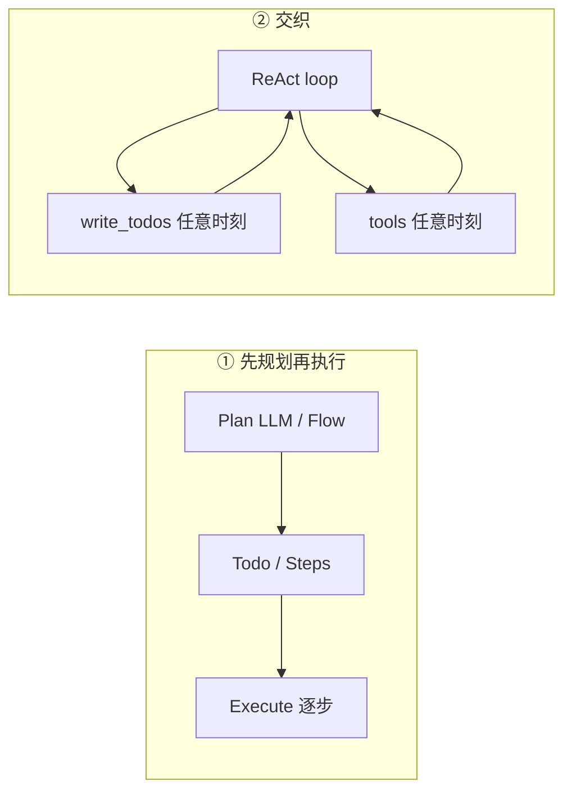

**易混点**：deer-flow 产品名叫 **Plan Mode**，但实现是 **② 交织**（`write_todos` 与 `read_file`/`bash` 同一循环），**不是** OpenManus 那种硬两阶段。名称叫 plan，语义是「允许用 todo 跟踪」，不是「必须先 plan 才能 execute」。

### 1.3 范式速查表（与 §3 总览对照）

| 范式 | 控制流 | 代表项目 | Plan 产物 | Todo 是否规划结果 |
|------|--------|----------|-----------|-------------------|
| **Plan-and-Execute** | ① | OpenManus、crewAI `planning_config` | `plans` dict / `state.plan` + steps | ✅ Todo 由 `PlanStep` 生成 |
| **Crew 预规划** | ①（仅 kickoff 前） | crewAI `Crew.planning` | 文本 append 到 `task.description` | ⚠️ 无独立 Todo；plan 是自然语言 |
| **交织 Todo** | ② | deepagents、deer-flow、Hermes `todo` | 常无独立 `plan` 字段 | ⚠️ Todo **是**拆步结果，但与执行**同循环**、可随时覆盖 |
| **只读规划** | ③ | OpenHarness PLAN、Hermes `/plan`、**Grok Plan mode** | `plan.md` / `plan_summary` / session `plan.md` | 通常**无** Todo；Grok 有人批 exit |
| **Goal 自动验收** | ①′ | **Grok `/goal`** | `<session>/goal/plan.md` 验收契约 | Implementer 可用 todo 辅助；完成靠 Verifier |
| **Process / SOP** | ④ | crewAI Process、MetaGPT | Task 图 | Task 代替 Todo |

**agentscope v2** 与 **OpenHands** 无单一开关：可用 ①（`task_plan.md` + Task）或 ②（自注册 todo 工具）组合，见 §11、§12。

**crewAI** 同时有 ①（`planning_config`、`Crew.planning`）与 ④（`Process`），源码流程见 §4.8–§4.9，展开见 §13。

### 1.4 编排者（Orchestrator）— 五种实现形态

**编排者**回答的是：**谁有权决定「下一跳」**，与 Plan 回答的「跳什么内容」正交。

| 形态 ID | 名称 | 下一跳由谁定 | 典型「一步」 | 代表 |
|---------|------|--------------|--------------|------|
| **O1** | **模型自编排 ReAct** | **LLM** 选 tool / 结束 | model → tool_calls → model | deepagents、deer-flow、Hermes、OpenManus `Manus.run()` |
| **O2** | **代码 Flow 路由** | **Python + `@router` 返回值** | Flow 方法 → 事件名 → 下一 listener | crewAI `AgentExecutor`、`OpenManus PlanningFlow`、用户级 `crewai.flow.Flow` |
| **O3** | **声明式任务图** | **用户写的 Task/Process 拓扑** | 一个 Task 完成 → 下一 Task | crewAI `Crew`+`Process`、MetaGPT `Team` |
| **O4** | **Manager / 路由模型** | **专职 Manager LLM** 委托 Worker | Manager tool → Worker Agent | crewAI `Process.hierarchical`、AutoGen GroupChat |
| **O5** | **权限门控 ReAct** | LLM 选 tool，**PermissionChecker 过滤** | 同 O1，但 mutating 被挡 | OpenHarness `QueryEngine` + `PLAN` 模式 |

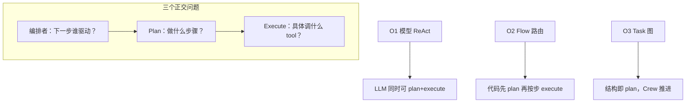

#### Plan 控制流 × 编排者（交叉矩阵）

| | **O1 模型 ReAct** | **O2 Flow 路由** | **O3 Task 图** | **O4 Manager** |
|--|-------------------|------------------|----------------|----------------|
| **② 交织 Todo** | deepagents、deer-flow、Hermes `todo` | — | — | — |
| **① Plan-and-Execute** | — | OpenManus、crewAI `planning_config` | — | — |
| **① kickoff 前 enrich** | — | — | crewAI `Crew.planning` + Process | crewAI hierarchical |
| **③ 只读 plan** | OpenHarness PLAN（O5 门控） | — | — | — |
| **④ 结构即计划** | — | — | crewAI sequential、MetaGPT | crewAI hierarchical |

**读源码时**：先找 **编排者入口**（§4.11），再找 **Plan 产物存在哪**（§4.1），最后看 **Execute 落在哪个 tool/Agent**。

与 [01-overview.md](./01-overview.md) §5.1「五种编排范式」对齐：Middleware 链 / ReAct / Event step / Crew / Flow 是**编排内核**标签；本节 **O1–O5** 是**谁握调度权**的标签。

### 1.5 正交四维：Plan · 编排者 · 执行单元 · Execute

很多人把「编排者」理解成 **拆任务 → 调子 Agent**。这只对了一半——**子 Agent 只是执行单元的一种**，不是编排者的全部，更不是 Plan。

#### 1.5.1 四个概念各答什么

| 概念 | 回答的问题 | 典型产物 / 机制 |
|------|------------|-----------------|
| **Plan** | **做什么**——步骤、依赖、顺序 | `plan.md`、`state.plan`、Task 图、自然语言计划 |
| **编排者** | **谁决定下一跳**——plan？execute 第 k 步？换执行单元？ | LangGraph、`while`、`@router`、Crew Process、Manager |
| **执行单元** | **这一步由谁来做**——父、子、专职角色、人 | 见下表 X1–X6 |
| **Execute** | **具体动作**——哪一个 tool、哪条命令 | `bash`、`edit`、`StepExecutor`、Worker `kickoff` |

```text
Plan：          「要改 auth、加测试、更新文档」              → 内容
编排者：        「现在执行第 1 步」还是「换执行单元」？       → 调度权
执行单元：      「父 Agent 自己 grep」还是「派 researcher」？ → 载体选择
Execute：       「grep -r auth .」或子 Agent 内部 tool 链     → 副作用
```

#### 1.5.2 执行单元 taxonomy（X1–X6）

与 [04-multi-agent.md](04-multi-agent.md) 的 MA1–MA8 **对齐但视角不同**：MA 文档按「协作模式」分类；这里按 **单步由谁承载** 分类。

| ID | 名称 | 机制 | 父层通常可见 | 代表 |
|----|------|------|--------------|------|
| **X1** | **父 Agent 直调 tool** | 同一 loop 内 tool_calls | 完整 tool I/O | deepagents 默认、`grep`/`edit`、Hermes 多数步 |
| **X2** | **子 Agent 委托**（MA1） | `task` / `delegate_task` spawn 子 run | **压缩后的** tool result | deepagents `task`、deer-flow、Hermes `delegate_task` |
| **X3** | **声明式 Task / 角色**（MA4） | `Task.kickoff()`、SOP 角色流水线 | 上一 Task `output` | crewAI Process、MetaGPT `Team` |
| **X4** | **Handoff 切换**（MA3） | active agent 换人，对话延续 | 下一 agent 的回复 | OpenAI Agents SDK handoffs |
| **X5** | **人类在环** | 审批 / `ask_user` 后才执行 | 用户确认或拒绝 | deepagents-code 审批、OpenHarness guardrails |
| **X6** | **子进程 Worker**（MA2） | Coordinator fork，IPC 回传 | 结构化 result + metadata | OpenHarness `--task-worker` |

**子 Agent（X2）≠ Plan**：父可以无 todo、无 plan，仅凭模型判断「这步太复杂」就 `task`。子 run 内部可再 `write_todos`，但父 state **通常不 merge 子 todos**（deepagents `_EXCLUDED_STATE_KEYS`）。

**crewAI hierarchical 拆解**（四层都出现）：

| 维度 | 对应物 |
|------|--------|
| Plan | Task 图 + `description`（+ 可选 `Crew.planning` enrich） |
| 编排者 | Manager Agent（O4）决定委托给谁 |
| 执行单元 | Worker Agent kickoff（X3，经 Manager 路由） |
| Execute | Worker 内部 tool / LLM 调用 |

#### 1.5.3 Plan × 执行单元（正交组合）

| | **X1 父直调** | **X2 子 Agent** | **X3 Task/角色** |
|--|---------------|-----------------|------------------|
| **有 Plan（①）** | OpenManus 每步同一 `BaseAgent` | 少见（可扩展） | crewAI Manager → Worker |
| **无 Plan（②）** | deepagents 直接改文件 | deepagents `task` 随时派子 | — |
| **结构即计划（④）** | — | — | crewAI sequential Task 链 |

**读源码顺序**：编排者入口 → Plan 存哪 → **本步走 X几** → 具体 tool。

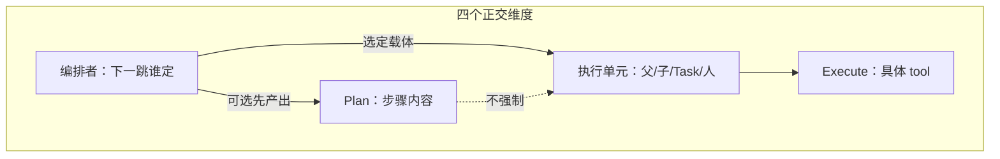

#### 1.5.4 各项目默认执行单元（速查）

| 项目 | 默认执行单元 | Plan 关系 | 备注 |
|------|--------------|-----------|------|
| **deepagents** | X1；复杂时 X2 | ② 交织，plan 非必须 | `SubAgentMiddleware` + `task` |
| **deer-flow** | 同 deepagents | ② `is_plan_mode` | 子 Agent 并发上限 middleware |
| **Hermes** | X1 + X2 `delegate_task` | todo 交织；`/plan` 只读 | 子 Agent 独立 terminal |
| **Grok Build** | X1 + X2 `task`（新 Session） | Plan=③ gate；Goal=①′ harness | 父单 `running_task`；并行=多子 Session |
| **OpenHarness** | X1（PLAN 下只读 tool）；MA2 可选 | ③ PLAN 门控 | Coordinator 走 X6 |
| **OpenManus** | X1 单 `BaseAgent` | ① 先 plan 再按步 | Flow 内顺序，非子 Agent |
| **crewAI Process** | X3 Task | ④ Task 图 = 计划 | hierarchical 时 Manager 选 Worker |
| **crewAI `planning_config`** | X1 `StepExecutor` | ① Plan → Todo → step | 单 Agent 内 PAE，非 MA1 |
| **AutoGen** | X4/X5 路由发言 | 视对话 | GroupChat 选人 |
| **OpenHands** | X1 preset tools | 视 preset | 非核心 subagent |

---

## 2. 对比维度定义

| 子维度 | 含义 |
|--------|------|
| **启用入口** | CLI 开关、API 字段、slash 命令、Flow 类型 |
| **核心机制** | Middleware / Tool / Permission / Flow / Skill |
| **状态载体** | graph state、内存 dict、文件、metadata |
| **Prompt 注入** | system 段、工具 description、XML 块、无注入 |
| **规划 vs 执行** | **先 plan 后 execute** / **交织** / **只读不 execute** / **结构即计划** |
| **持久化** | checkpoint、JSON 文件、进程内、无 |
| **编排者** | O1–O5 谁驱动下一跳（§1.4） |
| **执行单元** | X1–X6 单步由谁承载（§1.5.2） |

---

## 3. 总览对照表

| 项目 | 控制流 | 编排者 | 典型执行单元 | 默认是否开启 | 启用方式 | 核心 API / 工具 | Plan → Todo？ | 状态存储 |
|------|--------|--------|--------------|--------------|----------|-----------------|---------------|----------|
| **deepagents** | ② 交织 | **O1** LangGraph | **X1** / X2 `task` | ✅ 始终 on | `create_deep_agent()` 即带 | `write_todos` + `TodoListMiddleware` | Todo 随时可写，无独立 Plan 阶段 | `AgentState.todos` |
| **deepagents-code** | ② + 审批 prompt | **O1** | X1 / X2；**X5** 审批 | ✅ 继承 SDK | 同 SDK；交互/headless 不同 prompt | 同上 + `{todo_guidance}` | 同上 | 同上 |
| **deer-flow** | ② 交织 | **O1** + middleware | X1 / X2 | ❌ 默认 off | `configurable.is_plan_mode` | `write_todos` + `TodoMiddleware` | 同上（产品名 Plan Mode） | `ThreadState.todos` |
| **OpenHarness** | ③ 只读 | **O5** QueryEngine + PLAN | X1 只读；可选 **X6** | ❌ 手动进入 | `/plan on`、`enter_plan_mode` | `PermissionChecker` PLAN | Plan 文档，通常无 Todo | `tool_metadata.plan_summary` |
| **agentscope v2** | 组合 | **O1** Agent loop + 应用 Flow | X1 / 应用自定 MA | — | Skill + 文件 + `Task` | `ToolGroup` / `Task` / `SKILL.md` | 应用自定 | `context` / `task_plan.md` |
| **OpenManus** | ① Plan-and-Execute | **O2** `PlanningFlow` | **X1** 单 executor | ✅ `run_flow.py` | `FlowType.PLANNING` | `PlanningFlow` + `planning` tool | ✅ `planning create` → steps | 内存 `plans` dict |
| **hermes-agent** | ② + ③ 双轨 | **O1** `conversation_loop` | X1 / **X2** `delegate_task` | todo 默认 on；plan skill 手动 | `todo` 工具；`/plan` skill | `todo` + `software-development/plan` | todo：交织；`/plan`：仅 plan md | `TodoStore`；`.hermes/plans/*.md` |
| **Grok Plan mode** | ③ 硬闸 | **O1** + `PlanModeTracker` | X1；鼓励 X2 `explore` | ❌ 手动 | Shift+Tab / `enter_plan_mode` | edit gate + `exit_plan_mode` 人批 | 无 Todo 门禁 | `<session>/plan.md` |
| **Grok Goal** | ①′ 自动验收 | **O-harness** `SessionActor` | Implementer=父；P/V/S=spawn | ❌ `/goal` | `/goal <obj> [--budget]` | Planner→Implementer→Verifier→Strategist | `goal/plan.md`；todo 纪律 | `<session>/goal/` |
| **OpenHands** | Preset | **O1** Event step | X1 | 选 preset 时 | `planning` tool preset | `TaskTrackerTool` + j2 prompt | 视 preset | `ConversationState` 事件流 |
| **crewAI**（Crew 预规划） | ① 前置 enrich | **O3** Process | **X3** Task | ❌ 默认 off | `Crew(planning=True)` | `CrewPlanner` + Planner Agent | Plan 文本 → `task.description`（无 Todo） | description append |
| **crewAI**（Agent PAE） | ① Plan-and-Execute | **O2** `AgentExecutor` Flow | **X1** `StepExecutor` | ❌ 默认 off | `Agent(planning_config=...)` | `AgentReasoning` + `AgentExecutor` Flow | ✅ `PlanStep` → `TodoList` | `ExecutorState.plan` + `TodoList` |
| **crewAI**（Process） | ④ 结构即计划 | **O3** / **O4** hierarchical | **X3** Worker | ✅ 随 Crew 定义 | `process=sequential/...` | Task 图 + Manager 委托 | Task 代替 Todo | Task output 链 |

**下一节 §4** 为各项目 **源码调用链 + 流程图 + 时序图** 总览；§5–§13 逐项目；**§18 Grok**（Plan / Goal / `task`）。

---

## 4. 源码级流程总览与对比（Plan → Todo → Execute）

本节回答五个问题：**编排者是谁？Plan 在哪？谁决定要不要 plan？本步执行单元是 X几？具体 execute 落在哪？**

### 4.1 总览：决策点与推进点

| 项目 | 控制流 | **编排者** | **执行单元** | **谁决定「要不要 plan」** | Plan 产物 | Todo 形态 | **谁推进 Execute** | 关键源码（真源路径） |
|------|--------|------------|--------------|---------------------------|-----------|-----------|---------------------|----------------------|
| **deepagents** | ② 交织 | **O1** LangGraph loop | **X1** / X2 | **LLM**（system + tool description）；**无代码门禁** | 常无 `plan` 字段 | `state.todos` via `write_todos` | O1 选 X1 或 `task`→X2 | `libs/deepagents/deepagents/graph.py` → `middleware/subagent.py` |
| **deer-flow** | ② 交织 | **O1** + middleware | X1 / X2 | 同 deepagents；`is_plan_mode=False` 时**无** `write_todos` | 同左 | `ThreadState.todos` | 同左 | `deer-flow/.../lead_agent/agent.py` → `middlewares/todo_middleware.py` |
| **Hermes `todo`** | ② 交织 | **O1** `conversation_loop` | X1 / X2 | **LLM**（仅 tool description；**不改 system**） | 无 | `TodoStore` 内存 | loop → `tool_executor` | `hermes-agent/tools/todo_tool.py`；`delegate_task` |
| **Hermes `/plan`** | ③ 只读 | **O1**（skill 约束） | X1 只读类 tool | **Skill SOP** + 用户 `/plan` | `.hermes/plans/*.md` | 通常无 | 用户 turn 后再 X1 | `skills/.../plan/SKILL.md` |
| **Grok Plan mode** | ③ 硬闸 | **O1** + gate | X1；X2 `explore` | 用户/模型进 Plan | `<session>/plan.md` | 无强制 Todo | Approve → 同 turn 续写 | `plan_mode.rs` + `tool_calls.rs` |
| **Grok Goal** | ①′ | **SessionActor harness** | 父 Implementer；spawn P/V/S | `/goal` | `goal/plan.md` | todo 辅助 | Verifier 未证伪 → Complete | `goal_tracker.rs` + `goal.rs` |
| **OpenHarness** | ③ 只读 | **O5** QueryEngine | X1 / X6 | **用户** `/plan on` | `plan_summary` 等 | 无 | PLAN 下 X1 只读 | `openharness/permissions/checker.py` |
| **OpenManus** | ① PAE | **O2** `PlanningFlow` | **X1** | **Python Flow** 固定先 plan | `PlanningTool.plans` | plan 内 steps | Flow while → X1 | `OpenManus/app/flow/planning.py` |
| **crewAI `planning_config`** | ① PAE | **O2** `AgentExecutor` | **X1** `StepExecutor` | **Flow 强制** `generate_plan` | `state.plan` + steps | `TodoList` | `@router` → X1 | `crewai/experimental/agent_executor.py` |
| **crewAI `Crew.planning`** | ① 前置 | **O3** Process | **X3** | kickoff 前 `CrewPlanner` | append `description` | 无 | Process → X3 | `utilities/planning_handler.py` |
| **crewAI `Process`** | ④ 结构 | **O3** / **O4** | **X3** Worker | **用户 Task 图** | Task 链 | Task 代替 Todo | Manager→X3 或顺序 X3 | `crew.py` |

### 4.2 六类形态总图

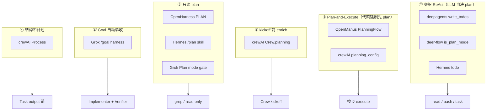

### 4.3 deepagents — ② 交织

```text
create_deep_agent() → create_agent(middleware=[TodoListMiddleware(), ...])
LangGraph: model ↔ tools
  wrap_model_call  → 注入 WRITE_TODOS_SYSTEM_PROMPT
  after_model      → 禁止并行 write_todos
  write_todos      → Command(update={todos, ToolMessage})
```

**要不要 plan**：仅 **LLM**（≥3 步 / 复杂 / 用户要求等，见 tool description）。**无**「未 plan 禁止 execute」。

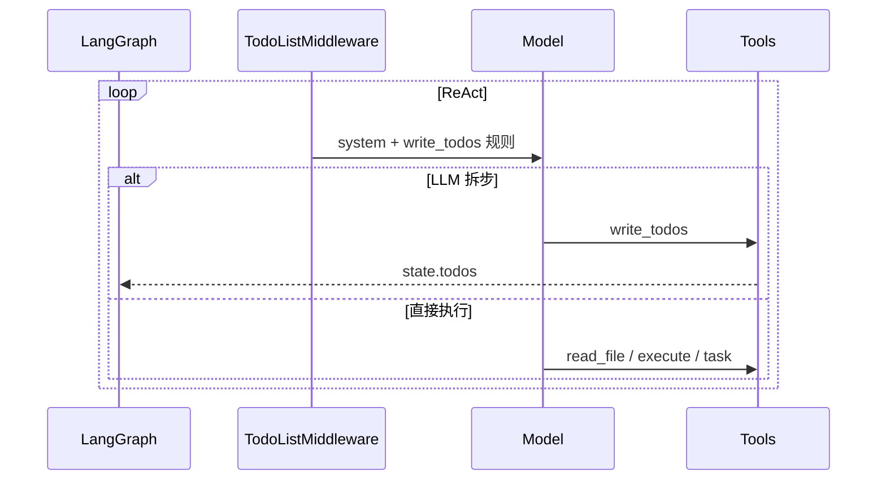

### 4.4 deer-flow — ② 交织 + 增强

```text
make_lead_agent → if is_plan_mode: TodoMiddleware
  before_model      → 摘要丢 todo 时 todo_reminder
  wrap_model_call   → 未完成 todo 时禁止纯文本结束
  after_model       → 禁止并行 write_todos
```

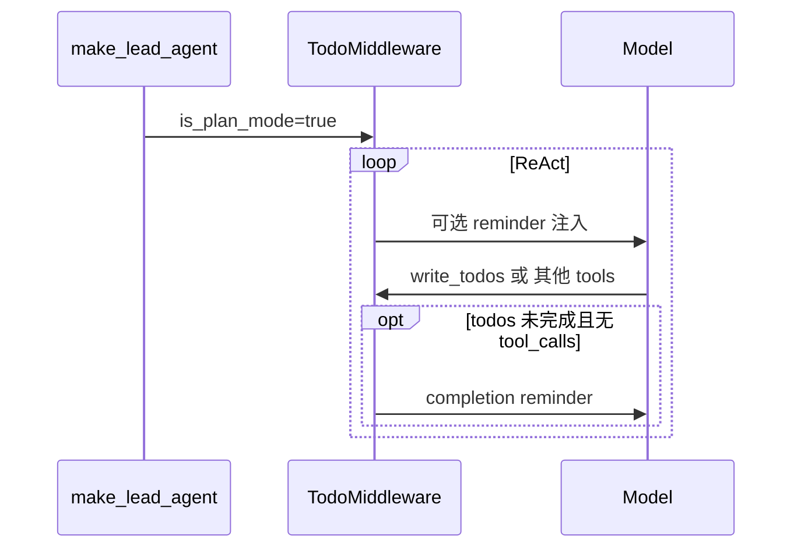

### 4.5 Hermes — `todo` 与 `/plan`

```text
todo:  run_conversation while → tool_executor: function_name=="todo" → TodoStore
       压缩后 conversation_compression.format_for_injection()
       （运行时从不强制调 todo；≥3 步时靠 schema 启发 LLM）
/plan: Skill 软约束只写 .hermes/plans/*.md；无 plan_mode 标志、无 edit gate（§10.8）
```

```mermaid
sequenceDiagram
    participant L as conversation_loop
    participant M as Model
    participant TE as tool_executor
    participant TS as TodoStore

    loop while iterations
        L->>M: completion
        opt todo tool
            M->>TE: todo
            TE->>TS: write/read
        else 其他 tools
            M->>TE: terminal / read
        end
    end
```

### 4.6 OpenHarness — ③ 只读 PLAN

```text
/plan on → PermissionMode.PLAN
PermissionChecker.evaluate: read_only→allow; PLAN+mutating→deny
```

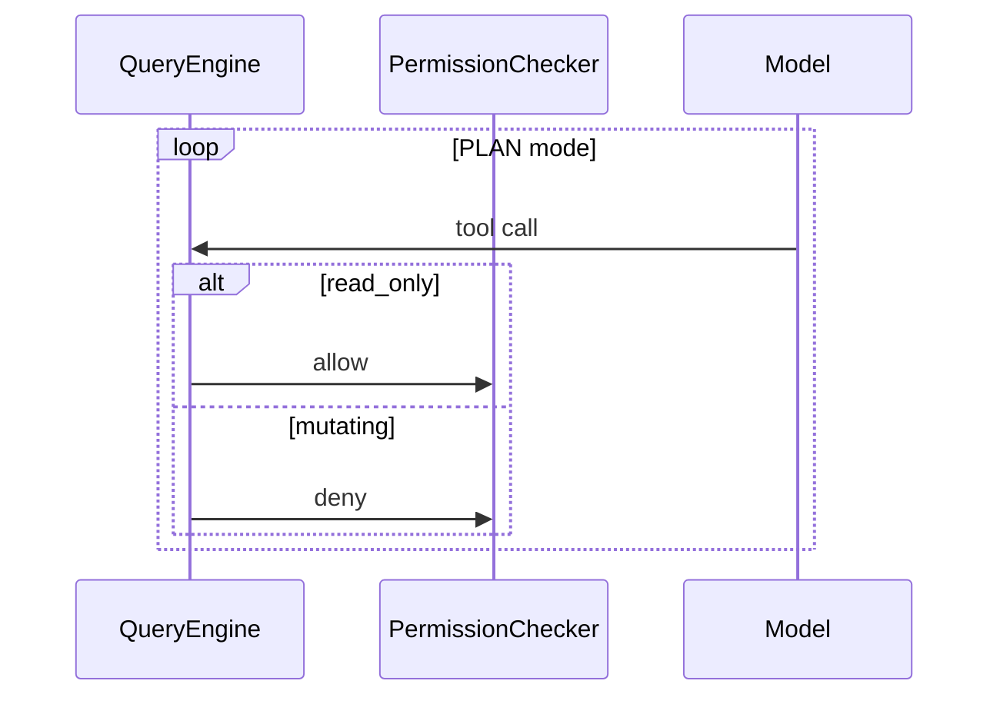

### 4.7 OpenManus — ① Plan-and-Execute

```text
PlanningFlow.execute
  → _create_initial_plan (LLM + planning create)
  → while: _get_current_step_info → _execute_step → mark_step
```

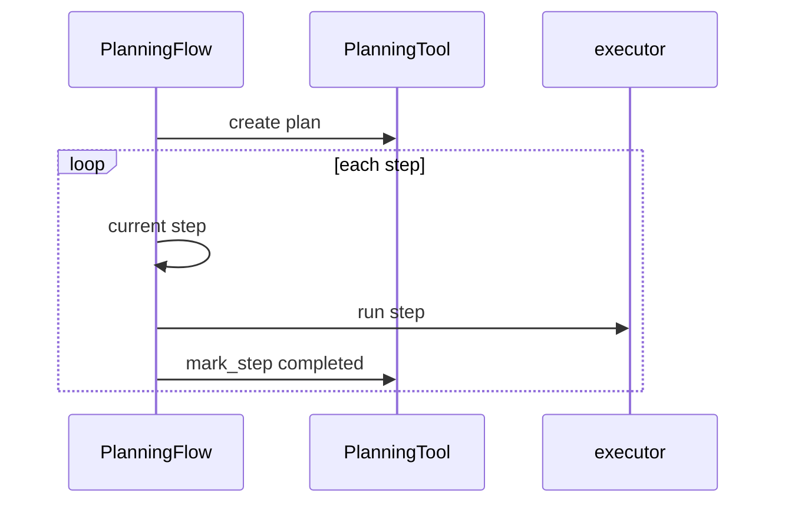

### 4.8 crewAI — `planning_config`（AgentExecutor Flow）

```text
@start generate_plan → AgentReasoning → TodoList
@router get_ready_todos → StepExecutor → PlannerObserver
  → continue | replan_now | refine | goal_achieved
```

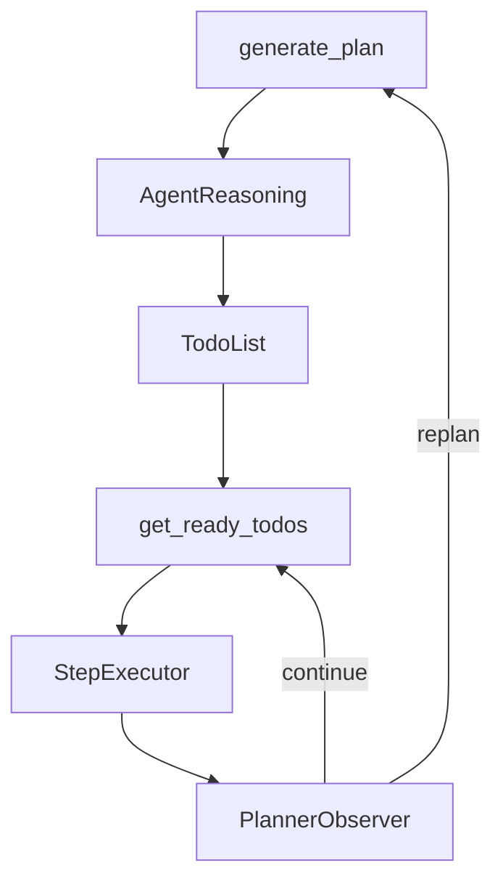

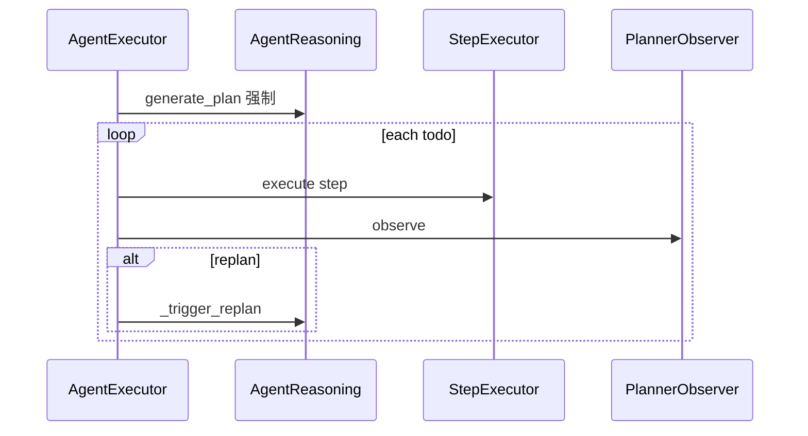

### 4.9 crewAI — `Crew.planning`

```text
kickoff 准备: if crew.planning → CrewPlanner → task.description += plan
→ Crew Process（无运行时 replan）
```

### 4.10 横向对比：① vs ② 时序

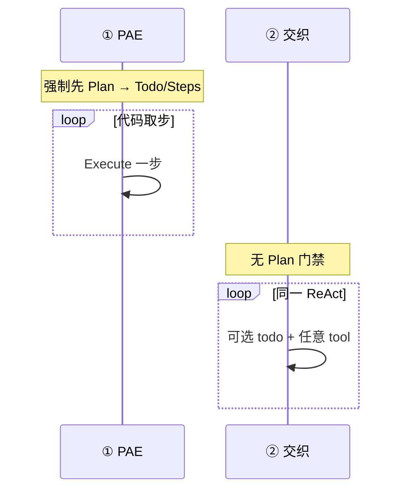

### 4.11 编排者入口与职责拆分（O1–O5 × X1–X6）

**编排者** = 控制流引擎；**Planner** = 产出步骤内容；**执行单元** = 单步由谁承载（§1.5.2）；**Execute** = 具体 tool 副作用。

| 形态 | 编排者入口（先读这个） | 典型执行单元 | Planner | 与 Plan/Todo 关系 |
|------|------------------------|--------------|---------|-------------------|
| **O1** | `create_agent` / `conversation_loop` | **X1**；可选 **X2** `task` | 常为**同一 LLM** | Plan 可选；Todo 交织 |
| **O2** | `Flow.kickoff` / `@router` | **X1** `StepExecutor` | `generate_plan` / `_create_initial_plan` | 强制 Plan → 按步 X1 |
| **O3** | `Crew.kickoff` / `Process` | **X3** Task / Worker | `CrewPlanner` 或 Task 描述 | Task 图 = 结构计划 |
| **O4** | Manager + 委托 tool | **X3** Worker（经 Manager） | Manager LLM | 委托边界 = 子编排者 |
| **O5** | `QueryEngine.run_query` | **X1** 只读；可选 **X6** | 用户 + plan md | PLAN 挡 mutating |

```mermaid
flowchart LR
    subgraph O1["O1 模型自编排"]
        M1[LLM] -->|tool| T1[tools]
        T1 --> M1
    end

    subgraph O2["O2 Flow 路由"]
        R[@router] --> PL[generate_plan]
        PL --> ST[StepExecutor]
        ST --> R
    end

    subgraph O3["O3 Task 图"]
        C[Crew.kickoff] --> T2[Task 1]
        T2 --> T3[Task 2]
    end
```

**deepagents 子 Agent**：外层 O1 LangGraph 调 `task` tool → 内层再跑一套 O1；外层 **不继承** 内层 `todos`（编排边界在 middleware state merge）。

**crewAI 双引擎**：用户写的 `crewai.flow.Flow`（应用工作流）与 `AgentExecutor(Flow)`（单 Agent PAE）**共用 Flow 运行时**，但前者编排 Crew/业务，后者编排 plan→todo→step。

### 4.12 源码阅读顺序

| 控制流 | 编排者 | 执行单元 | 项目 | 阅读顺序 |
|--------|--------|----------|------|----------|
| ② | O1 | X1/X2 | deepagents | `graph.py` → `middleware/todo.py` → `middleware/subagent.py` |
| ② | O1 | X1/X2 | deer-flow | `lead_agent/agent.py` → `todo_middleware.py` |
| ② | O1 | X1/X2 | Hermes | `conversation_loop.py` → `todo_tool.py` → `delegate_task` |
| ③ | O5 | X1/X6 | OpenHarness | `engine/query.py` → `permissions/checker.py` |
| ① | O2 | X1 | OpenManus | `flow/planning.py` → `tool/planning.py` |
| ① | O2 | X1 | crewAI Agent | `agent_executor.py` → `reasoning_handler.py` |
| ①/④ | O3/O4 | X3 | crewAI Crew | `crew.py` → `planning_handler.py` |

---

## 5. deepagents（SDK）— Todo 始终挂载

> **源码流程图**：§4.3。**实现深潜**（谁决策 plan、如何 execute）：§5.8（与 §4.3 互补，本节偏配置与 middleware 细节）。

### 5.1 由浅入深：用户视角

1. 调用 `create_deep_agent()` 创建 Agent。
2. 复杂任务时，模型**可能**调用 `write_todos` 列出步骤并更新 `pending` / `in_progress` / `completed`。
3. **没有** “打开 Plan 模式” 的开关；简单任务文档建议直接执行，不建 todo。

### 5.2 机制：LangChain `TodoListMiddleware`

中间件在 `create_deep_agent` 时**硬编码**为链首：

```711:714:libs/deepagents/deepagents/graph.py
    deepagent_middleware: list[AgentMiddleware[Any, Any, Any]] = [
        TodoListMiddleware(),
    ]
```

| 组件 | 作用 |
|------|------|
| `TodoListMiddleware` | 注册 `write_todos`；在 `wrap_model_call` 注入 system 规则 |
| `write_todos` | 模型写入/覆盖 todo 列表 |
| `AgentState.todos` | LangGraph checkpoint 持久化 |

### 5.3 Prompt 注入（两层）

1. **System 段**：`## write_todos` 规则（何时用、禁止并行多次调用等）。
2. **工具 description**：`WRITE_TODOS_TOOL_DESCRIPTION`（独立长文本）。

模型在同一 ReAct 循环里既可 `write_todos` 也可 `read_file` / `task` — **规划与执行交织**，无独立 planner Agent。

### 5.4 状态与隔离

- 主线程：`state.todos` 随 checkpoint 持久化。
- 子 Agent：`todos` 在 `_EXCLUDED_STATE_KEYS` 中，**不 merge 回父线程**（子任务自有上下文）。

### 5.5 数据流

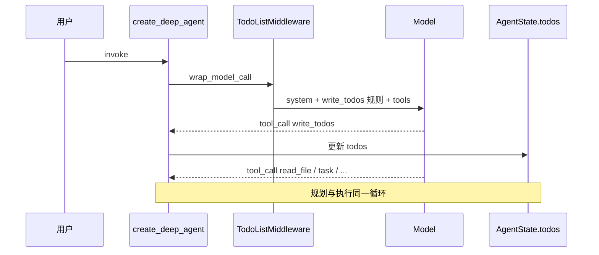

### 5.6 配置示例

```python
from deepagents import create_deep_agent

agent = create_deep_agent(
    model="anthropic:claude-sonnet-4-6",
    system_prompt="You are a coding agent.",
    # 无需 is_plan_mode；TodoListMiddleware 已内置
)
```

### 5.7 与 deer-flow 的关键差异

| 维度 | deepagents | deer-flow |
|------|------------|-----------|
| 默认 | Todo **on** | Todo **off** |
| 开关 | 无 | `is_plan_mode` |
| 定制 | LangChain 默认 prompt | `TodoMiddleware` + `<todo_list_system>` |

### 5.8 实现深潜：有没有 Plan 阶段？谁决定要不要 plan？怎么 execute？

> 对照 §1.2：**deepagents 属于 ② 规划与执行交织**。§4.3 已有流程图；本节保留文字细节，避免与 §4 重复时可只看 §4.3。

#### 5.8.1 有没有独立的 `plan`？

**没有。** 框架层只有：

| 状态 | 字段 | 说明 |
|------|------|------|
| 结构化拆步 | `state.todos` | `{content, status: pending\|in_progress\|completed}[]` |
| 自然语言计划 | ❌ 无 `state.plan` | 若模型要文字计划，只能写在 assistant 消息里 |

`write_todos` 的每次调用 **全量替换** 整个列表（不是 merge 单条）。语义上 Todo 列表就是「可执行的 plan」，但没有单独的 Plan 生成阶段。

实现来自 LangChain `TodoListMiddleware`（`langchain.agents.middleware.todo`），deepagents 在 `create_deep_agent()` 里**无条件**链首挂载。

#### 5.8.2 本步「要不要 plan」——谁决策？

**框架不做复杂度检测，没有 `if need_plan()` 代码路径。** 决策完全交给 **LLM + Prompt**，分两层：

**System 段**（`WRITE_TODOS_SYSTEM_PROMPT`，经 `wrap_model_call` 追加）：

- 复杂多步目标 → 用 `write_todos`
- 简单、几步能做完 → **不要**用，直接干

**工具 description**（`WRITE_TODOS_TOOL_DESCRIPTION`）更细，写明：

| 应该用 | 不应该用 |
|--------|----------|
| ≥3 个 distinct 步骤 | 单一、直白任务 |
| 非平凡、需仔细规划 | <3 个 trivial 步 |
| 用户明确要求 todo | 纯对话/问答 |
| 用户给多任务列表 | |
| 计划可能随前几步结果修订 | |

因此：**任意 model turn** 模型都可以选择：

- 直接 `read_file` / `execute` / `task`（不 plan）
- 先 `write_todos` 再干别的（plan）
- 干了几步后再 `write_todos` 修订列表（re-plan）

没有门禁阻止「未 write_todos 就不能调其他工具」。

#### 5.8.3 Middleware 硬规则（非「要不要 plan」，而是「怎么写 todo」）

| 钩子 | 行为 |
|------|------|
| `wrap_model_call` | 每次调模型前注入 `## write_todos` system 段 |
| `after_model` | 同一 AIMessage 里 **禁止并行** 多次 `write_todos`；违规则返回 error `ToolMessage` |
| `write_todos` 工具 | `Command(update={todos, messages: [ToolMessage(...)]})` |

#### 5.8.4 Plan 之后如何 Execute？

**没有单独的 Execute 子图或 Flow 路由。** 执行就是 **同一个 LangGraph ReAct 循环**：

```text
create_agent (LangGraph)
  loop:
    model  ← system(+write_todos 段) + messages 历史
    → tool_calls?
         write_todos  → 更新 state.todos + ToolMessage("Updated todo list to ...")
         read_file / edit_file / execute / task / ...
    → 回到 model
```

要点：

1. **谁推进步骤**：模型自己。Prompt 要求：开工前把项标 `in_progress`，做完立刻标 `completed`，可修订列表。
2. **模型如何「看见」当前 plan**：主要靠 **消息历史**里上一次 `write_todos` 的 `ToolMessage`（含完整列表）；`state.todos` 用于 checkpoint/UI/测试，**不会**每轮自动注入新 HumanMessage（与 Hermes 压缩后 `format_for_injection` 不同）。
3. **与工具交织**：同一 turn 里模型通常只调一批 tools；可以先 `write_todos`，下一轮再 `read_file`；也可跳过 todo 直接改文件。
4. **收尾**：system 要求最终答案在 **最后一次 `write_todos` 之后的一轮** 纯文本回复里给出，不要与 `write_todos` 同 turn。

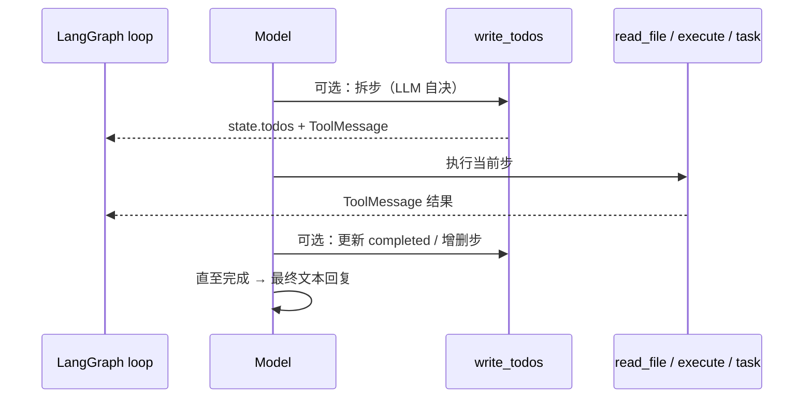

#### 5.8.5 子 Agent 与压缩

- **`task` 子 Agent**：子图有独立 `TodoListMiddleware` 时可有自有 `todos`；`_EXCLUDED_STATE_KEYS` 含 `todos`，**不 merge 回父**。
- **SummarizationMiddleware**：压缩 messages 时，todo 是否保留取决于摘要策略；无 crewAI 式 Observer/replan 管线。

#### 5.8.6 与「先规划再执行」对照

| | deepagents | OpenManus / crewAI `planning_config` |
|--|------------|--------------------------------------|
| Plan 阶段 | ❌ 无强制阶段 | ✅ Flow 先 `create` / `generate_plan` |
| 决策 | LLM + prompt 启发式 | 代码路由 `get_ready_todos` |
| Execute | 同循环任意 tool | 按步 `StepExecutor` / Flow 取 current step |
| Todo 与 Plan | Todo **即** plan 的唯一结构化形态 | Plan → Todo 两步 |

---

## 6. deepagents-code — 同一 Todo + 交互审批

### 6.1 继承关系

`libs/code` **不实现**独立 plan middleware，完全继承 SDK 的 `TodoListMiddleware`。

增量在 **`get_system_prompt()` 的 `{todo_guidance}`**：

**交互模式（TUI）** — 创建 todo 后须等用户确认再 `in_progress`：

```698:705:libs/code/deepagents_code/agent.py
        todo_guidance = (
            "6. When first creating a todo list for a task, ALWAYS ask the user if "
            "the plan looks good before starting work\n"
            ...
            "   - Wait for the user's response before marking the first todo as "
            "in_progress\n"
```

**Headless 模式** — 禁止等待用户，创建后立即开工：

```729:735:libs/code/deepagents_code/agent.py
        todo_guidance = (
            "6. There is no human operator in this mode — do NOT ask the user to "
            "approve your plan or wait for a reply.\n"
            "   After you create todos for a multi-step task, mark the first item "
            "`in_progress` immediately and start work.\n"
```

### 6.2 UI 层

- `widgets/messages.py`：将 `write_todos` 渲染为 checklist。
- `tool_display.py`：展示 todo 数量。

这是 **prompt 软门禁 + UI 展示**，不是 middleware 硬拦截。

---

## 7. deer-flow — 运行时开关的 Todo

> **源码流程图**：§4.4。

> 源码路径（文档引用）：`packages/harness/deerflow/agents/lead_agent/agent.py`  
> 本 workspace 以 `deer-flow/backend/docs/` 为准。

### 7.1 由浅入深：用户视角

1. 前端或 API 在创建 run 时传 `config.configurable.is_plan_mode: true`。
2. Lead Agent 中间件链**追加** `TodoListMiddleware`（DeerFlow 定制为 `TodoMiddleware`）。
3. 模型获得 `write_todos`；复杂任务拆步跟踪。
4. 关闭 plan mode 时，中间件不入链，**无** `write_todos` 工具。

### 7.2 启用入口

```python
from langchain_core.runnables import RunnableConfig
from deerflow.agents.lead_agent.agent import make_lead_agent

config = RunnableConfig(
    configurable={
        "thread_id": "t-1",
        "is_plan_mode": True,  # 关键开关
    }
)
agent = make_lead_agent(config)
```

API：`POST /api/threads/{id}/runs` 的 `config.configurable.is_plan_mode`。

### 7.3 装配流程

```text
make_lead_agent(config)
  ├─ is_plan_mode = config.configurable.get("is_plan_mode", False)
  └─ _build_middlewares(config)
        ├─ ThreadDataMiddleware
        ├─ SandboxMiddleware
        ├─ SummarizationMiddleware (可选)
        ├─ TodoListMiddleware      ← 仅 is_plan_mode=True
        ├─ TitleMiddleware
        └─ ClarificationMiddleware
```

### 7.4 状态：`ThreadState.todos`

`ThreadState` 扩展 LangGraph `AgentState`，含 `todos` 字段，与 checkpoint 一并持久化。Agent 实例缓存键包含 `is_plan_mode`（切换模式需重建 agent）。

### 7.5 DeerFlow 定制 Prompt

- System：XML 包裹的 `<todo_list_system>...</todo_list_system>`，与主 system prompt 风格一致。
- Tool description：强调「简单任务不要用」、状态定义、完成前须验证。
- `before_model` 可注入 `todo_reminder` HumanMessage。

### 7.6 数据流

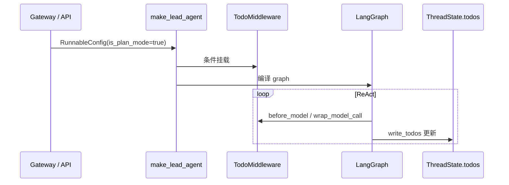

### 7.7 子 Agent

文档明确：**子 Agent 中间件链不含 Todo**。只有 Lead Agent 做全局任务跟踪。

详见 [deer-flow plan_mode_usage.md](../../deer-flow/backend/docs/plan_mode_usage.md)。

---

## 8. OpenHarness — 权限型 Plan（只读沙箱）

> **源码流程图**：§4.6。

> **注意**：OpenHarness 的 Plan **不是** `write_todos`。它是 **`PermissionMode.PLAN`**：阻止一切 mutating 工具，只允许只读探索与规划。

### 8.1 由浅入深：用户视角

1. 用户执行 `/plan on` 或 `/permissions plan`，或模型调用 `enter_plan_mode`。
2. 此后 `read_file` / `grep` / `glob` 等只读工具可用；`write_file` / `bash` 等**一律拒绝**。
3. Agent 输出规划文本；摘要可写入 `tool_metadata.plan_summary`。
4. `/exit_plan_mode` 后恢复 DEFAULT，方可改文件、执行命令。

### 8.2 权限枚举

```python
class PermissionMode(str, Enum):
    DEFAULT = "default"      # 写操作询问
    PLAN = "plan"            # 阻止所有修改
    FULL_AUTO = "full_auto"  # 全自动
```

| 模式 | 只读工具 | 写工具 / Bash |
|------|----------|---------------|
| DEFAULT | ✅ 自动 | ⚠️ 需确认 |
| **PLAN** | ✅ 自动 | ❌ **阻止**（不可审批绕过） |
| FULL_AUTO | ✅ | ✅ |

### 8.3 `PermissionChecker` 评估顺序（节选）

PLAN 模式在 Layer 8：mutating 工具直接 `allowed=False`，必须切换模式而非点「批准」。

```text
Layer 7: is_read_only → 允许
Layer 8: PLAN 模式 → 非只读工具拒绝
Layer 9: DEFAULT → requires_confirmation
```

（历史文档中的 per-tool 白名单伪代码以 `ARCHITECTURE_PERMISSIONS_MCP.md` 源码表为准；核心是 **阻止 mutating**。）

### 8.4 Prompt 动态注入

- `build_runtime_system_prompt()` → `_build_permission_mode_section()` 追加当前模式说明。
- `/plan on` 触发 `refresh_runtime_client`：**重建** `PermissionChecker` 与 **整段 system prompt**，下一轮 ReAct 立即感知。

### 8.5 状态存储

```text
tool_metadata:
  permission_mode: "plan" | "default" | ...
  plan_summary: "..."        # 规划摘要，压缩后可 attachment 再注入
```

另有 `plan` **Skill**（任务分解最佳实践），与权限 Plan 模式**互补**：Skill 教怎么写计划，权限模式限制能不能改仓库。

### 8.6 数据流

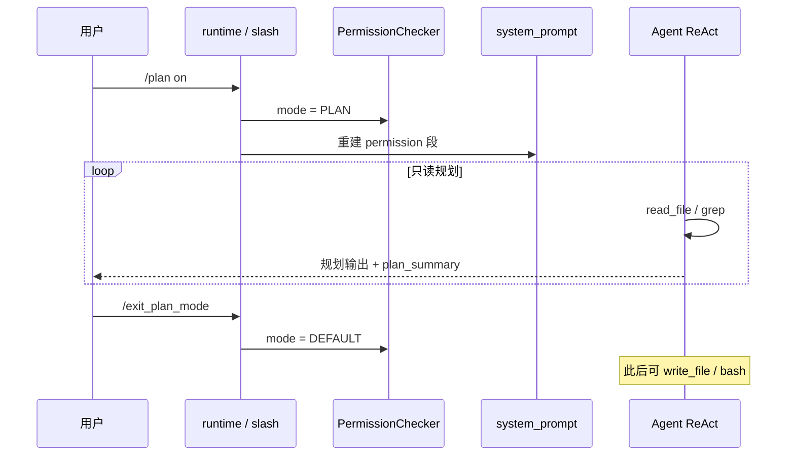

详见 [ARCHITECTURE_PERMISSIONS_MCP.md](../ARCHITECTURE_PERMISSIONS_MCP.md) §4.2。

---

## 9. OpenManus — Flow 编排：先 Plan 后 Execute

> **源码流程图**：§4.7。

### 9.1 由浅入深：用户视角

1. `python run_flow.py`（默认 `FlowType.PLANNING`），而非 `main.py` 单 Agent。
2. Flow 先用独立 LLM 调用 `planning` 工具 **create** 多步计划。
3. **while 循环**：取当前未完成步骤 → 派给 `Manus` 等 executor → `mark_step completed`。
4. 全部完成后 `_finalize_plan()` 总结。

规划与执行由 **Python 控制流** 分离，不是模型自选时机。

### 9.2 核心类

| 类 | 文件 | 职责 |
|----|------|------|
| `PlanningFlow` | `app/flow/planning.py` | 编排 create → execute loop → finalize |
| `PlanningTool` | `app/tool/planning.py` | `create/update/list/get/mark_step/...` |
| `PlanStepStatus` | 同上 | `not_started` / `in_progress` / `completed` / `blocked` |

### 9.3 状态：进程内字典

```python
# app/tool/planning.py
plans: dict = {}  # plan_id → {title, steps[], step_statuses[], step_notes[]}
```

**不**走 LangGraph checkpoint；进程结束即失（除非应用层自行持久化）。

### 9.4 执行循环（源码结构）

```94:119:OpenManus/app/flow/planning.py
    async def execute(self, input_text: str) -> str:
        ...
            if input_text:
                await self._create_initial_plan(input_text)
            ...
            while True:
                self.current_step_index, step_info = await self._get_current_step_info()
                if self.current_step_index is None:
                    result += await self._finalize_plan()
                    break
                # → _execute_step(agent) → _mark_step_completed()
```

每步向 executor 注入 `CURRENT PLAN STATUS` + `YOUR CURRENT TASK`。

### 9.5 数据流

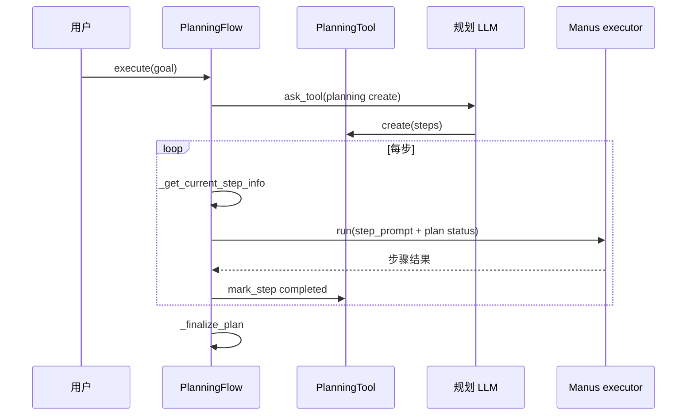

### 9.6 与 Todo 型对比

| 维度 | OpenManus | deepagents / deer-flow |
|------|-----------|------------------------|
| 谁决定「何时规划」 | Flow 代码固定先 create | 模型在 ReAct 中自选 |
| 谁决定「执行哪一步」 | Flow 取 current step | 模型自行推进 todo |
| 状态 | 内存 `plans` | graph `todos` |

---

## 10. hermes-agent — 双轨：Todo 工具 + Plan Skill

> **源码流程图**：§4.5（`todo`）；`/plan` skill 为 §10.2（③ 只读，无 Todo）。

### 10.1 轨道 A：`todo` 工具（日常任务跟踪）

**设计原则**（`tools/todo_tool.py` 文件头）：

- 单工具 `todo`：传 `todos` 写入，省略则读取。
- **不修改 system prompt**；行为指引全在 tool schema description。
- 状态：`TodoStore`，**每 `AIAgent` 实例一个**，内存列表。

```python
VALID_STATUSES = {"pending", "in_progress", "completed", "cancelled"}
# merge=False 全量替换；merge=True 按 id 更新
```

**压缩后恢复**：`conversation_compression.py` 的 `format_for_injection()` 把 active todos 作为 `user` 消息重新注入（因 todo 不进 checkpoint 的固定字段）。

**拦截路径**：`run_agent.py` 在 `handle_function_call` 前处理 `function_name == "todo"`。

### 10.2 轨道 B：`/plan` Skill（只规划、不实现）

- Skill：`software-development/plan`（bundled）。
- 用户 `/plan` → 加载 Skill SOP。
- 约束：**不写项目代码**；交付物为 `.hermes/plans/YYYY-MM-DD_HHMMSS-<slug>.md`。
- 允许只读 terminal / read；规划完成后等用户新 turn 再实现。

这与 OpenHarness / Grok Plan **语义相近**（先想清楚），但 Hermes 靠 **Skill 指令（软）**，**没有** `plan_mode` 运行时标志，也 **没有** `PermissionChecker` / edit gate。模型若无视 skill，仍可能调 mutating 工具。

**没有** DeerFlow / OpenManus 式「Plan 阶段 → 确认 → Execute 阶段」的内核状态机；`/plan` 只是本 turn 的 SOP。同会话边干边跟进度用 **`todo`**（轨道 A），不是 plan skill。

### 10.3 对比表

| 维度 | Hermes `todo` | Hermes `/plan` skill | deepagents `write_todos` |
|------|---------------|----------------------|--------------------------|
| 目的 | 长任务拆步跟踪 | 产出 plan 文档 | 拆步 + 可立即执行 |
| System 注入 | 无 | Skill 内容 | TodoListMiddleware |
| 存储 | `TodoStore` 内存 | `.hermes/plans/*.md` | `AgentState.todos` |
| 执行代码 | 允许 | Skill 禁止 | 允许 |

### 10.4 端到端：`todo` 轨道（② 交织）

```text
conversation_loop.run_conversation()
  loop:
    model completion
    → tool_executor: function_name == "todo"
         → todo_tool(todos=..., store=agent._todo_store)
    → 同轮可 terminal / read_file / delegate_task …
```

**编排者**：O1 `conversation_loop`（`agent/conversation_loop.py`）。**无**「未 todo 禁止 execute」代码门禁；是否拆步由 **tool schema description** 启发 LLM。

**状态恢复**：

| 场景 | 机制 |
|------|------|
| Session 重启 | `run_agent._hydrate_todo_store()` 从历史最后合法 `todo` tool result 重建 |
| Context 压缩 | `conversation_compression` 完成后 `TodoStore.format_for_injection()` → synthetic `user` 消息 |

**与 deepagents 差异**：Hermes **不注入 system**；deepagents `TodoListMiddleware` 链首挂载 + system 段。

### 10.5 端到端：`/plan` 轨道（③ 只读）

```text
用户: /plan refactor auth
  → Skill 斜杠命令 → 加载 software-development/plan（PROTECTED_BUILTIN_SKILLS）
  → skill 正文进入当前 turn 上下文
  → LLM：只读探索 + write_file → .hermes/plans/YYYY-MM-DD_HHMMSS-<slug>.md
  → 用户新 turn 再实现（Skill 禁止 mutating terminal / 项目代码）
```

**约束方式**：Skill SOP **软约束**（非 OpenHarness `PermissionChecker` 硬拦截）。

### 10.6 与 deer-flow / OpenHarness 对照

| 维度 | Hermes `todo` | Hermes `/plan` | deer-flow `is_plan_mode` | OpenHarness PLAN |
|------|---------------|----------------|--------------------------|------------------|
| 控制流 | ② 交织 | ③ 只读 | ② 交织 | ③ 只读 |
| 开关 | 默认在 agent loop；可 `disabled_toolsets` | 用户 `/plan` | per-request `is_plan_mode` | `/plan on` |
| System 注入 | 无 | Skill 内容 | `TodoMiddleware` XML | permission 段重建 |
| 产物 | `TodoStore` | `.hermes/plans/*.md` | `ThreadState.todos` | `plan_summary` |
| 执行代码 | ✅ 同轮 | ❌ 等下轮 | ✅ 同轮 | ❌ 需 exit plan |

### 10.7 源码索引

| 组件 | 路径 |
|------|------|
| `todo` 工具 | `hermes-agent/tools/todo_tool.py` |
| 执行拦截 | `hermes-agent/agent/tool_executor.py`（`function_name == "todo"`） |
| 压缩重注入 | `hermes-agent/agent/conversation_compression.py` |
| 历史恢复 | `hermes-agent/run_agent.py` `_hydrate_todo_store` |
| `/plan` Skill | `hermes-agent/skills/software-development/plan/SKILL.md` |
| 主循环 | `hermes-agent/agent/conversation_loop.py` |
| 子 Agent | `hermes-agent/tools/delegate_tool.py` `delegate_task` |

### 10.8 Hermes `/plan` vs Grok Plan vs Pi Plan（强制力）

产品都像「先想清楚再动手」，**强制力与接线不同**：

| | **Hermes `/plan`** | **Grok Plan mode** | **Pi** |
|--|--|--|--|
| **内置？** | ✅ bundled `plan` skill | ✅ Build 内置 | ❌ **核心故意无** plan；靠扩展（如 `pi-plan-mode`、`@pi-vault/pi-plan`） |
| **原理** | **软约束**：注入 SKILL，「本 turn 别改代码，只写 `.hermes/plans/*.md`」 | **硬闸**：`PlanModeTracker` + **edit gate**；非 `plan.md` 的 Edit **拒**（YOLO 也拦） | 扩展：**硬**换工具集 / 拦 `write`·`edit`、bash 只读白名单 |
| **运行时标志** | **无** `plan_mode` | `Inactive→Pending→Active→ExitPending` | 扩展有 `/plan` toggle |
| **计划文件** | `.hermes/plans/时间戳-slug.md` | `<session>/plan.md` | 对话 `Plan:` / `<proposed_plan>` + session 状态 |
| **退出 / 开写** | 用户 **新 turn** 自己说去做 | `exit_plan_mode` → **人批** → 常 **同 turn** 续写 | 扩展：人批 Implement → 恢复全工具 + 进度（如 `[DONE:n]`） |
| **写坏代码** | 模型无视 skill 仍可能写 | Edit gate 拒绝非 plan 路径 | 扩展拒绝 mutating 工具 |

```text
Hermes:  /plan → 模型「被嘱咐」只写 plans/*.md → 用户再开新 turn 执行
Grok:    进 Plan → 只能写 plan.md → exit 等人批 → 放行后再改代码
Pi 扩展: /plan → 工具面缩成只读 → 产出计划 → 批准后恢复全工具
Pi 核心: 无 plan mode（官方 skip；可自装扩展）
```

**别和 Grok Goal 混**：Plan = `session/plan.md` + 人批；Goal = `session/goal/plan.md` + Verifier 自动闭环。Hermes **无**对等 Goal harness。详见 §18。

**`todo` 何时调**（与 `/plan` 正交）：运行时**从不强制**；schema 启发「≥3 步 / 多任务」时模型自愿调用。简单问答常不调。压缩后由 `format_for_injection` 回灌，不经 tool。

架构备忘：`hermes-agent/docs/AGENT_LOOP_ARCHITECTURE.md` §6.4–6.5。

### 10.9 Hermes `todo`：何时调用 · 详解

**运行时从不强制调用。** 时机靠 schema 文案 + 模型判断：

| 时机 | 谁决定 | 说明 |
|------|--------|------|
| 复杂任务 **≥3 步** | 模型 | schema：`Use for complex tasks with 3+ steps` |
| 用户一次多个任务 | 模型 | 同上 |
| 开干前写整表 | 模型 | `merge=false` 替换 |
| 做完一步改状态 | 模型 | `merge=true`；`completed` / 换 `in_progress` |
| 只读当前板 | 模型 | 无参 `todo()` |
| 压缩之后 | **运行时** | **不**调 tool；`format_for_injection()` 注入活跃项 |

简单一问一答 → **常常从不调** `todo`。

**API**：`todo(todos=?)` 写或读；项 `{id,content,status}`；同时一个 `in_progress`。  
**生命周期**：`TodoStore`（每 AIAgent）→ hydrate 自历史成对 tool result → 压缩回灌。  
**≠** `/plan` 文件、≠ `MEMORY.md`、≠ Kanban。

---

## 11. agentscope v2 — 无内置 Plan 类，组合式实现

### 11.1 官方立场

v2 **已移除** `src/agentscope/plan/`（旧版 `PlanNotebook` / `PlanStorage`）。Plan 是 **上层协议**，不是强制抽象。

### 11.2 可用构件（由浅入深）

| 层级 | 构件 | 用途 |
|------|------|------|
| 对话内短计划 | `AgentState.context` | 模型直接输出 plan 文本 |
| 长计划落盘 | `task_plan.md` / `progress.md` | 可 git diff、可恢复 |
| 子步骤委派 | `Task` 工具 + `tasks_context` | 独立子 Agent 跑一步 |
| 分阶段工具 | `ToolGroup` + `ResetTools` | 规划阶段只开 research，实现阶段开 coding |
| 流程 SOP | `SKILL.md`（name: plan） | 规定先规划再执行的话术 |
| 观测 | `MiddlewareBase` | 记录计划完成度 |

### 11.3 推荐三种模式（文档 §7.7）

**模式 A — 轻量**：纯 Skill，计划留在 `context`。

**模式 B — 文件化（推荐）**：

```text
task_plan.md     # 目标、阶段、验收
progress.md      # 会话日志
Agent 恢复时先 read 再 continue
```

**模式 C — 产品级**：外部 Plan 服务 + MCP + Middleware。

### 11.4 与 Todo 型差异

agentscope **没有** `write_todos` / `is_plan_mode`。若需要同等能力，应用层自行注册 todo 工具或写 Skill 要求使用 `write_file` 维护 `task_plan.md`。

详见 [agentscope ARCHITECTURE_PART2.md §7](../../agentscope/docs/ARCHITECTURE_PART2.md#第7章plan-模式与-rag-扩展边界v2-源码级)。

---

## 12. OpenHands — Preset + TaskTracker（文档级）

> 本 workspace **无** `openhands-sdk` 源码；以下来自 `docs/OPENHANDS_SDK_ARCHITECTURE_DEEP_DIVE.md`。

### 12.1 入口

选择 **`planning` tool preset**（与 `default` / `gemini` / `gpt5` 并列），绑定：

- `TaskTrackerTool` — 步骤跟踪
- `planning_file_editor` — 规划专用文件编辑
- `system_prompt_planning.j2` — 四阶段规划工作流

### 12.2 Prompt 体系

```text
agent/prompts/
├── system_prompt.j2                 # 默认五阶段问题解决
├── system_prompt_planning.j2        # 规划专用
├── system_prompt_long_horizon.j2    # 长任务
```

默认 prompt 含 `<PROBLEM_SOLVING_WORKFLOW>`；planning 变体为**独立模板**，换 preset 即换人格与工具集。

### 12.3 状态

- **事件溯源**：`ConversationState` + EventStream，非 LangGraph `todos` 字段。
- TaskTracker 负责 plan 步骤在对话生命周期内的跟踪。

### 12.4 执行流

仍在 **ReAct 循环**内，但工具集与 system prompt 由 preset 预置 — 介于 deepagents（始终 todo）与 OpenManus（硬编码两阶段）之间。

---

## 13. crewAI — 三路径规划（无 `write_todos`）

> **源码流程图**：§4.8–§4.9；用户级 `crewai.flow.Flow` 编排见架构文档 §11.2（与 Agent 内 `AgentExecutor` Flow 同引擎）。

CrewAI **没有** deepagents / deer-flow 式的 `write_todos` + Middleware。其 “Plan” 分 **三条独立路径**，常被混为一谈：

| 路径 | 开关 | 机制 | 产物 |
|------|------|------|------|
| **① Crew 预规划** | `Crew(planning=True)` | kickoff 前 `CrewPlanner` 跑独立 Planner Agent | 每 Task 的 `description` **追加** plan 文本 |
| **② Agent Plan-and-Execute** | `Agent(planning_config=PlanningConfig(...))` | `AgentExecutor` Flow：`generate_plan` → Todo → StepExecutor → Observer → replan | `state.plan` + `TodoList` |
| **③ Process 编排** | `process=sequential/hierarchical/parallel` | Task 图；Hierarchical 时 Manager **运行时**委托 | Task output / context 链（**计划即 Task 定义**） |

三条路径 **可叠加**（例如 `Crew.planning=True` enrich 描述后，带 `planning_config` 的 Agent 再生成自己的 TodoList）。

### 13.1 路径 ① — Crew 级预规划

#### 用户视角

1. 定义 `Crew(agents=..., tasks=..., planning=True)`。
2. `kickoff()` 准备阶段，在跑 Task **之前**调用 `_handle_crew_planning()`。
3. 临时 Agent `role="Task Execution Planner"` 根据所有 Task 摘要生成逐步计划。
4. 计划文本 **append** 到对应 `task.description`；之后走正常 Sequential / Hierarchical 执行。
5. **执行中不自动 replan**（一次性 enrich）。

#### 装配入口

```377:378:crewAI/lib/crewai/src/crewai/crews/utils.py
    if crew.planning:
        crew._handle_crew_planning()
```

#### 核心类：`CrewPlanner`

| 步骤 | 实现 |
|------|------|
| 汇总 Task | `_create_tasks_summary()`：description、expected_output、agent 角色/目标、tools、knowledge |
| 创建 Planner Agent | `_create_planning_agent()`，`llm=planning_llm` 或默认 `gpt-5.4-mini` |
| 执行 Planner Task | `output_pydantic=PlannerTaskPydanticOutput` |
| 写回 Task | `task.description += plan_map[task_number]` |

```1447:1450:crewAI/lib/crewai/src/crewai/crew.py
        for idx, task in enumerate(self.tasks):
            task_number = idx + 1
            if task_number in plan_map:
                task.description += plan_map[task_number]
```

#### 配置示例

```python
from crewai import Crew, Agent, Task, Process

crew = Crew(
    agents=[researcher, writer],
    tasks=[research_task, write_task],
    process=Process.sequential,
    planning=True,
    planning_llm="gpt-5.4-mini",  # 可选
)
crew.kickoff()
```

#### 数据流

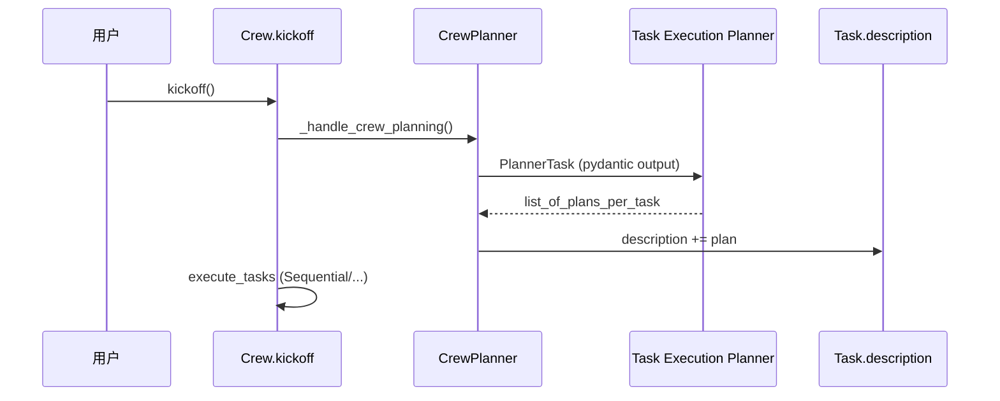

---

### 13.2 路径 ② — Agent Plan-and-Execute（`planning_config`）

#### 用户视角

1. 在 `Agent` 上设置 `planning_config=PlanningConfig(...)`（旧字段 `planning=True` / `reasoning=True` 已 deprecated）。
2. `AgentExecutor` Flow 入口 `@start generate_plan` 在 ReAct 前调用 `AgentReasoning`。
3. LLM function call `create_reasoning_plan` → `{plan, steps[], ready}`；`PlanStep` 转为 `TodoItem`。
4. Flow 按 `depends_on` 取 **ready todos**，`StepExecutor` **隔离执行**每一步。
5. 每步后 `PlannerObserver` 观察；按 `reasoning_effort` 决定 refine / replan / 提前结束。

#### 启用与配置

```python
from crewai import Agent
from crewai.agent.planning_config import PlanningConfig

agent = Agent(
    role="Researcher",
    goal="Research a topic",
    backstory="...",
    planning_config=PlanningConfig(
        reasoning_effort="medium",  # low | medium | high
        max_attempts=3,             # 初始 plan 精炼轮次
        max_steps=20,
        max_replans=3,              # 执行中全量重规划上限
        observe_steps=None,         # None = 按 effort 决定
        llm=None,                   # None = 用 agent.llm
    ),
)
```

`Agent.planning_enabled`（property）：`planning_config is not None or planning`。

#### 阶段 A — 生成计划（`AgentReasoning`）

| 方法 | 职责 |
|------|------|
| `_create_initial_plan()` | LLM `create_reasoning_plan` → `plan` + `steps[]` + `ready` |
| `_refine_plan_if_needed()` | `ready=False` 时循环 refine，直到 `ready` 或 `max_attempts` |
| `_create_todos_from_plan()` | `PlanStep` → `TodoItem`（含 `depends_on`、`tool_to_use`） |

```337:370:crewAI/lib/crewai/src/crewai/experimental/agent_executor.py
    @start()
    def generate_plan(self) -> None:
        if not getattr(self.agent, "planning_enabled", False):
            return
        planning_handler = AgentReasoning(agent=self.agent, task=self.task)
        output = planning_handler.handle_agent_reasoning()
        self.state.plan = output.plan.plan
        if self.state.plan_ready and output.plan.steps:
            self._create_todos_from_plan(output.plan.steps)
```

**注意**：plan **不** mutate 共享的 `task.description`（避免 re-invoke 累积）；存在 `ExecutorState.plan` / `state.todos`。

#### 阶段 B — 按 Todo 执行

```text
generate_plan
  → check_todos_available → has_todos | no_todos | planning_disabled
  → get_ready_todos_method
        single_todo_ready   → execute_todo_sequential (StepExecutor)
        multiple_todos_ready → 并行 ready 步
        needs_replan        → 依赖死锁等
  → check_todo_completion → mark_todo_complete
```

`TodoList.get_ready_todos()`：pending 且 `depends_on` 中依赖已进入 terminal（completed/failed）。

#### 阶段 C — 每步观察（`PlannerObserver`）

`StepObservation`（PLAN-AND-ACT §3.3）关键字段：

| 字段 | 含义 |
|------|------|
| `key_information_learned` | 本步揭示的新信息 |
| `remaining_plan_still_valid` | 剩余 pending 是否仍合理 |
| `suggested_refinements` | 就地更新 pending 步描述（**无第二次 LLM**） |
| `needs_full_replan` | 剩余计划根本错误 → `_trigger_replan()` |
| `goal_already_achieved` | 提前结束，跳过剩余 todos |

`reasoning_effort` 路由（`observe_step_result`）：

| effort | 观察 | 失败后 | 成功后 |
|--------|------|--------|--------|
| **low** | 启发式，无额外 LLM | 标记完成继续 | 同左 |
| **medium** | LLM `StepObservation` | `needs_full_replan` → replan | 继续，不 refine |
| **high** | 完整 decide 管线 | replan / refine / 提前 goal | 可 `suggested_refinements` |

#### 阶段 D — 重规划

- `replan_count < PlanningConfig.max_replans`（默认 3）
- `_trigger_replan()`：`AgentReasoning` + `_build_replan_context()`（已完成/失败步、历史 replan 原因）
- `TodoList.replace_pending_todos()`：保留 completed/failed/running，只替换 pending

#### 数据流

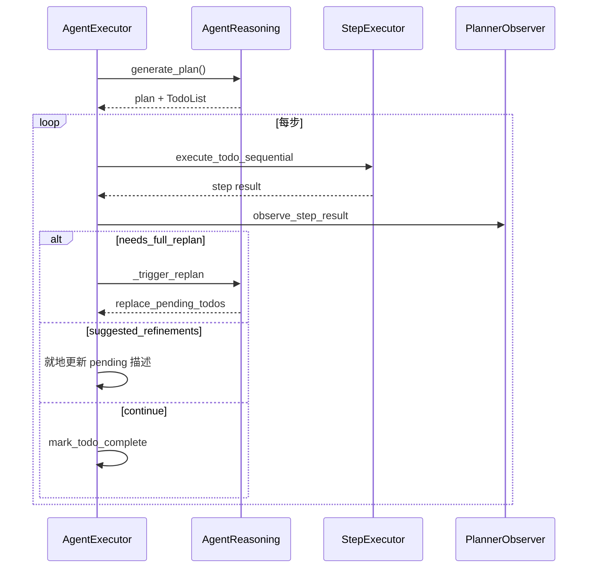

#### 核心类型（`planning_types.py`）

| 类型 | 用途 |
|------|------|
| `PlanStep` | 规划 LLM 输出的单步（number、description、tool、depends_on） |
| `TodoItem` / `TodoList` | 执行期状态：`pending/running/completed/failed` |
| `StepObservation` | 每步观察结果 |
| `StepRefinement` | 单步描述就地更新 |

#### 配置类（`PlanningConfig`）要点

| 字段 | 默认 | 说明 |
|------|------|------|
| `reasoning_effort` | `"medium"` | 观察与 replan 深度 |
| `max_attempts` | `None` | 初始 plan refine 上限；`None` = 直到 `ready` |
| `max_steps` | `20` | 计划最大步数 |
| `max_replans` | `3` | 执行中全量 replan 上限 |
| `max_step_iterations` | `15` | 单步 StepExecutor 内 LLM 迭代上限 |
| `step_timeout` | `None` | 单步墙钟超时（秒） |

---

### 13.3 路径 ③ — Process 编排（隐式计划）

CrewAI 多 Agent 场景的默认「计划」是 **Task 图**，无统一 Plan 开关。

| Process | 逻辑 | 「计划」载体 |
|---------|------|-------------|
| **Sequential** | Task1 → Task2 → Task3；上步 output 作下步 context | 用户定义的 Task 顺序 + description |
| **Hierarchical** | `_create_manager_agent()`；Manager `allow_delegation=True`，运行时委托 Worker | Manager prompt + Task 列表（**非** kickoff 前 `plan_tasks()`） |
| **Parallel** | 多 Task 并行后汇总 | Task 定义 |

Manager 通过 `AgentTools(agents=self.agents).tools()` 获得委托工具；**不应**自带业务 tools。

这与路径 ①② 正交：Process 管 **谁跑哪个 Task**；`planning_config` 管 **单个 Agent 内如何拆步执行**。

---

### 13.4 三路径对比

| 维度 | ① Crew `planning` | ② `planning_config` | ③ Process |
|------|-------------------|---------------------|-----------|
| 粒度 | 每个 Task 一份子计划 | 单 Agent 内多步 Todo | 多 Agent / 多 Task |
| 时机 | kickoff **前** 一次 | 执行 **前** + 步间观察 | 结构由代码定义 |
| 状态 | `task.description` 文本 | `ExecutorState.todos` | Task output 链 |
| replan | ❌ | ✅（Observer + `max_replans`） | ❌（除非 Agent ② 开启） |
| 最接近 | MetaGPT 前置 SOP  enrich | OpenManus `PlanningFlow` + 观察环 | crewAI 原生多角色 |

### 13.5 与其他框架对照

| 框架 | CrewAI 对应 |
|------|-------------|
| deepagents `write_todos` | 仅路径 ② 的 TodoList **形似**；CrewAI **Flow 强控**步骤顺序与观察 |
| deer-flow `is_plan_mode` | 路径 ② 开关语义相近；Crew 另有路径 ① |
| OpenManus `PlanningFlow` | 路径 ② 最接近（CrewAI 多 `PlannerObserver` + replan） |
| OpenHarness PLAN 权限 | **无**；CrewAI 不阻止写文件 |
| Hermes `/plan` skill | 路径 ① 类似 enrich prompt；Hermes plan skill 产出独立 md 且禁止改代码 |

### 13.6 选型（CrewAI 内）

| 场景 | 用法 |
|------|------|
| 多 Agent 流水线，每步前要详细子计划 | `Crew(planning=True)` + `Process.sequential` |
| 单 Agent 复杂任务，依赖图 + 失败重规划 | `planning_config=PlanningConfig(reasoning_effort="high")` |
| 固定 Researcher→Writer | 只定义 Task + Process，**不必**开 planning |
| Manager 动态分工 | `Process.hierarchical` + `manager_llm` |
| 要少 LLM 调用 | `reasoning_effort="low"` |
| 执行中发现信息需调整后续步 | `reasoning_effort="high"` |

### 13.7 源码索引

| 模块 | 路径 |
|------|------|
| Crew 预规划 | `utilities/planning_handler.py` → `crew.py::_handle_crew_planning` |
| Agent 推理 | `utilities/reasoning_handler.py` → `AgentReasoning` |
| 执行状态机 | `experimental/agent_executor.py` |
| 类型 | `utilities/planning_types.py` |
| 配置 | `agent/planning_config.py` |
| 每步观察 | `agents/planner_observer.py` |
| Process | `crew.py::_run_hierarchical_process`、`_execute_tasks` |

---

## 14. 设计范式归纳

```mermaid
graph TB
    subgraph A["A. Middleware + write_todos"]
        DA[deepagents]
        DF[deer-flow]
    end

    subgraph B["B. 只读 / 先规划"]
        OH[OpenHarness PLAN permission]
        HM[hermes /plan skill]
    end

    subgraph C["C. 编排器"]
        OM[OpenManus PlanningFlow]
        CR2[crewAI planning_config]
    end

    subgraph D["D. 组合 / Preset"]
        AS[agentscope Skill+Task+文件]
        OHS[OpenHands planning preset]
    end

    subgraph E["E. 轻量 Todo 无 system 注入"]
        HE[hermes todo tool]
    end

    subgraph F["F. Process / Crew 预规划"]
        CR1[crewAI Crew.planning]
        CR3[crewAI Process]
        MG[MetaGPT SOP]
    end
```

| 范式 | 优点 | 代价 |
|------|------|------|
| A Middleware Todo | 与 LangGraph 一体、checkpoint 自然 | deepagents 无法关闭；deferred 需自研 |
| B 只读 Plan | 强约束「先想后做」 | 需二次切换模式才能执行 |
| C Flow 编排 | 步骤顺序可控、易测 | 灵活性低、状态常不在 checkpoint |
| C+ Observer（crewAI ②） | Plan-and-Execute + 步间观察/replan | 多 LLM 调用；仅单 Agent Executor |
| D 组合式 | 框架轻、策略可换 | 一致性靠应用 discipline |
| E Hermes todo | 不污染 system cache | 压缩后需手动 re-inject |
| F Process / Crew enrich | 多角色天然支持 | 无运行时 todo；Crew 预规划不 replan |

---

## 15. 选型建议

| 场景 | 倾向 |
|------|------|
| LangGraph 产品、每请求可选是否显示 todo | **deer-flow**（`is_plan_mode`） |
| SDK 默认带规划、最少配置 | **deepagents**（始终 `TodoListMiddleware`） |
| CLI 要先给用户看 plan 再动手 | **deepagents-code** 交互 `{todo_guidance}` |
| 审查/架构阶段禁止改仓库 | **OpenHarness** `PermissionMode.PLAN` |
| 严格「Planner LLM → Executor Agent」流水线 | **OpenManus** `PlanningFlow`；或 **crewAI** `planning_config`（带 Observer/replan） |
| 多 Agent 流水线 + kickoff 前 enrich 每 Task | **crewAI** `Crew(planning=True)` + `Process.sequential` |
| 多角色固定分工（Researcher→Writer） | **crewAI** `Process` + Task 定义（不必开 planning） |
| Manager 运行时委托 | **crewAI** `Process.hierarchical` |
| 框架无关、文件化 plan + git | **agentscope 模式 B** 或任意 Agent + `task_plan.md` |
| 不碰 system prompt、但要 todo | **hermes** `todo` 工具 |
| 只产出 plan markdown、下一轮再写代码 | **hermes** `/plan` skill |
| IDE/ACP 硬禁止改仓库、人批后再写 | **Grok Plan mode**（edit gate + Approve 同 turn 开写） |
| 「一直做到完」自动对抗验收、禁止追问 | **Grok Goal** `/goal`（勿与 Plan mode 混） |
| 主线程并行只读摸代码 / 派可写工人 | **Grok `task`**（`explore` / `general-purpose`；新 Session） |
| 企业 SDK、换 preset 换工作流 | **OpenHands** `planning` preset |

---

## 16. 常见误解

| 误解 | 事实 |
|------|------|
| 「所有 Plan Mode = write_todos」 | OpenHarness / hermes plan skill 是**只读规划**，常无 todo；且 `write_todos` 多是**交织跟踪**，不是先规划再执行 |
| 「Todo 不是 Plan 的结果」 | 在 **Plan-and-Execute**（OpenManus、crewAI `planning_config`）里 Todo **就是** Plan 的结构化输出；在 **交织型**里 Todo 仍是拆步结果，但与执行**无阶段隔离** |
| 「deer-flow Plan Mode = 先规划再执行」 | deer-flow 是 **② 交织**；名称误导，实为「开启 todo 工具」 |
| 「deer-flow 和 deepagents 一样」 | 前者 **默认关**、可 per-request；后者 **始终 on**；二者都是交织 Todo，都不是硬 Plan-and-Execute |
| 「agentscope 有 PlanNotebook」 | v2 **已移除**；用 Skill + 文件 + Task 替代 |
| 「OpenManus 和 deepagents 一样用 todo」 | OpenManus 是 **Flow 先 create plan 再逐步 execute** |
| 「crewAI Plan = write_todos」 | crewAI **无** TodoListMiddleware；是 **Crew 预规划 / planning_config Flow / Process** 三路径 |
| 「crewAI planning=True 会 replan」 | `Crew.planning` 仅 kickoff 前 enrich `task.description`；replan 在 **`planning_config`** 路径 |
| 「crewAI Hierarchical 会先 plan_tasks」 | Manager **运行时委托**；无 kickoff 前 `plan_tasks()` 子任务列表 |
| 「Plan 模式 = 长期记忆」 | 本文讨论的均是**任务级规划**；跨会话记忆见各项目 Memory 文档 |
| 「Grok Plan = Grok Goal」 | Plan=`<session>/plan.md` + 人批；Goal=`goal/plan.md` + Verifier；文件与状态机均不同 |
| 「Hermes `/plan` = Grok Plan / OpenHarness PLAN」 | 都是「先想再改」语义；Hermes 是 **skill 软约束**，后两者是 **权限/edit 硬闸** |
| 「Hermes `/plan` = Pi plan」 | Pi **核心无** plan；社区扩展才是硬只读。Hermes 是 soft skill，与 Pi 扩展 **原理不同**（同叫 `/plan`） |
| 「Hermes 有 DeerFlow 式先 plan 再 execute」 | **无**内核两阶段状态机；`/plan` 本 turn SOP；执行靠用户下一 turn 或别的 skill |
| 「Hermes `todo` = `/plan`」 | `todo` = session 内 checklist（② 交织）；`/plan` = 落盘实现方案（③ 软只读） |
| 「Grok 批准后必须再发『请执行』」 | 正常 Approve：**同 turn** tool result 续写；仅 resume/断线才合成 implement 句 |
| 「Grok `task` 默认带着父对话」 | 模型 `task` 默认 `fork_context=false`（空历史）；fork 是 harness/Goal 内部路径 |
| 「父在 Plan 则子也不能改仓库」 | **否**：子 Session 独立 tracker，默认 Agent；`general-purpose` 可逃逸父 edit gate |

---

## 17. 相关文档

| 文档 | 内容 |
|------|------|
| [08-mcp.md](08-mcp.md) | 同目录 MCP 对比 |
| [deer-flow plan_mode_usage.md](../../deer-flow/backend/docs/plan_mode_usage.md) | DeerFlow Todo 开关 |
| [deer-flow middleware-execution-flow.md](../../deer-flow/backend/docs/middleware-execution-flow.md) | 中间件顺序 |
| [OpenHarness ARCHITECTURE_PERMISSIONS_MCP.md](../ARCHITECTURE_PERMISSIONS_MCP.md) | PLAN 权限模式 |
| [agentscope ARCHITECTURE_PART2.md §7](../../agentscope/docs/ARCHITECTURE_PART2.md) | v2 Plan 组合边界 |
| [agentscope MEMORY_SYSTEM.md](../../agentscope/docs/MEMORY_SYSTEM.md) | Memory（与 Plan 正交） |
| [docs/OPENHANDS_SDK_ARCHITECTURE_DEEP_DIVE.md](../../docs/OPENHANDS_SDK_ARCHITECTURE_DEEP_DIVE.md) | OpenHands preset |
| [CREWAI_ARCHITECTURE_ANALYSIS.md](../../crewAI/docs/CREWAI_ARCHITECTURE_ANALYSIS.md) | CrewAI §0.7 Planning、§0.10.1 Knowledge、Process、Flow |
| [06-memory.md](06-memory.md) | CrewAI Knowledge RAG 索引与检索 |
| [hermes-agent AGENT_LOOP_ARCHITECTURE.md](../../hermes-dev/hermes-agent/docs/AGENT_LOOP_ARCHITECTURE.md) §6.4–6.5 | Hermes `todo` / `/plan` skill（软约束） |
| [grok-build/doc-cn/ARCHITECTURE.md](../../grok-build/doc-cn/ARCHITECTURE.md) §II.4 | Grok Memory / Plan / 多 Agent 产品因果 |
| [GROK_RUNTIME_PROMPTS.md](../../grok-build/doc-cn/GROK_RUNTIME_PROMPTS.md) | Grok Plan/Goal 运行时 Prompt 中文 |


---

## 18. Grok Build — Plan mode · Goal harness · `task`（三轨正交）

> **源码根**: `grok-build/crates/codegen/xai-grok-shell/`、`xai-grok-tools/.../grok_build/task/`  
> **中文旁注**: `grok-build/doc-cn/ARCHITECTURE.md` §II.4、`GROK_RUNTIME_PROMPTS.md`  
> **前提**: 「Plan / Goal / task」是三条产品轨，**文件路径与状态机互不替代**。

```text
┌────────────────────┐  ┌─────────────────────────────┐  ┌──────────────────────┐
│ Plan mode（③）     │  │ Goal harness（①′）          │  │ task 工具（X2）       │
│ 用户批准先规划     │  │ 编排器自动实现+对抗验收     │  │ 显式委派子 Session    │
│ <session>/plan.md  │  │ <session>/goal/plan.md      │  │ explore / gp / plan…  │
│ 鼓励 ask_user      │  │ 禁止追问；父=Implementer    │  │ 结果塌回 tool_result  │
└────────────────────┘  └─────────────────────────────┘  └──────────────────────┘
```

---

### 18.1 Plan mode（③ 硬闸 + 人批）

#### 控制流与关键符号

| 层 | 符号 | 路径 |
|----|------|------|
| 状态 | `PlanModeState::{Inactive,Pending,Active,ExitPending}` | `session/plan_mode.rs` → `PlanModeTracker` |
| 闸 | `plan_mode_edit_gate` | `acp_session_impl/tool_calls.rs` |
| 进入工具 | `EnterPlanModeTool` | `xai-grok-tools` |
| 退出审批 | `should_intercept_exit_plan_approval` + ACP `x.ai/exit_plan_mode` | 同上 + bridge |

计划文件：`<session_dir>/plan.md`（**不是** `goal/plan.md`）。

#### 状态机（白话）

```text
Inactive
  → Shift+Tab / mode=plan → Pending（gate 尚未生效）
  → 下条 prompt / mid-turn / enter_plan_mode → Active
Active: 非 plan 文件的 AccessKind::Edit → RejectNonPlanFile（YOLO 也拦）
  → exit_plan_mode 拦截 → 人批
       ├─ approved → 执行 Exit 工具 → Agent mode；同 turn 续写
       ├─ cancelled / revise → 留 Active
       └─ abandoned → 出 Plan，不实现
```

#### Edit gate 细则（影响面）

| 调用 | Active 时 |
|------|-----------|
| Edit 路径 ≠ `plan.md` | **拒**（含 `apply_patch` 占位路径） |
| Edit = `plan.md` | 放行并常 auto-approve |
| Read / Search / Ask / EnterPlan / ExitPlan | 放行 |
| **Bash / MCP / web** | **不拦**（故意；YOLO 下仍可能改环境） |

`PermissionManager` YOLO **不知道** Plan；强制力在 **edit gate**，不在权限快路径。

#### 进入后模型契约（六步）

`EnterPlanModeOutput::to_prompt_format`：探索 → 权衡 → `ask_user_question` → 策略 → 写 plan 文件 → `exit_plan_mode`。  
若注册了 `task`：加一句可用 `task` + `subagent_type="explore"` 并行摸代码。  
**每 turn full reminder 不含** subagent 句；explore 提示只在 enter 工具结果里。

#### 批准后如何执行（影响「是否再次触发」）

| 路径 | 行为 |
|------|------|
| **同 turn Approve（主路径）** | `deactivate_approved` → `PromptMode::Agent` → 工具结果含 `"start coding"` + `## Plan` 全文 → **同一 SessionActor 工具循环继续**；**不**新开 user turn |
| **断线 resume** | `PLAN_APPROVED_IMPLEMENT_MESSAGE` = `"The user approved the plan. Implement the plan in plan.md."` → 合成 user turn |
| Request changes | 留 Plan；不执行 |
| Abandoned | 出 Plan；不执行 |

> 与 Hermes `/plan`（写完等**用户新 turn**）不同：Grok 的执行开关是 **Approve**，多数情况**不是**再发「请执行」。

#### 与多 Agent 的耦合影响

- Plan 期内 **鼓励** `task`+`explore`（只读）。  
- 子 Session **独立** `PlanModeTracker`（默认 Inactive），且子 `PromptMode` **硬编码 Agent**。  
- 父 Active 时开 `general-purpose` → 子可写仓库并共享 hunk tracker → **绕过父 edit gate**（已知坑）。

---

### 18.2 Goal harness（①′ `/goal` 自动驾驶验收）

#### 一句话

`/goal <objective> [--budget N]`：在**同一父 SessionActor** 上跑  
**Planner（spawn 写验收契约）→ Implementer（父本体）→ Hidden Evaluator → Verifier 面板 →（卡住）Strategist**；通过则 Summarizer。

状态：`GoalTracker`（`goal_tracker.rs`）；编排：`acp_session_impl/goal.rs` + `goal_support.rs`。

#### Feature flags（摘）

主开关 `GROK_GOAL` / config（默认 ON）；另有 classifier / planner / summary / max runs / strategist every / reverify after / use_current_model_only。

#### Slash

| 命令 | 行为 |
|------|------|
| `/goal <obj> [--budget N]` | `setup_goal` → reminder → **继续本 turn 采样** |
| `/goal status\|pause\|resume\|clear` | 查询 / 暂停 / 恢复 / 清除 |

#### 角色与执行位置

| 角色 | 在哪跑 | 模板 | 何时 |
|------|--------|------|------|
| **Planner** | spawn `general-purpose`（verbatim fork） | `goal_planner_prompt.md` | 创建/resume 尚无 plan |
| **Implementer** | **父会话本体** | `goal_rules.md` + discipline + plan_block；续跑 continuation | 每轮主 agent |
| **Evaluator** | 父内短采样 | `goal_evaluator.rs` | 每轮结束 |
| **Verifier** | spawn 1–5 skeptic | `goal_verifier_prompt.md` | CandidateComplete |
| **Strategist** | spawn | `goal_strategist_prompt.md` | 连续 NotAchieved 达 N 倍 |
| **Summarizer** | spawn | `goal_summarizer_prompt.md` | Achieved 后 |

`GOAL_ROLE_SUBAGENT_TYPE = "general-purpose"`。Goal 内部 spawn **复用** task/subagent 通道，但 `surface_completion` 常关、属 harness，**不是**用户点的可见 task。

#### 文件（与 Plan mode 必须区分）

| 路径 | 用途 |
|------|------|
| `<session>/goal/plan.md` | 验收契约（用户几乎不看） |
| `goal/plan.baseline.md` | Planner 首次成功拷贝，不覆写 |
| `goal/strategy.md` | Strategist 只改 HOW；禁改 plan |
| scratch 目录 | implementer/skeptic 证据；goal 结束删 |

#### Status 机（摘）

`Active` ↔ paused 族（User / BackOff / NoProgress / Infra / Blocked）↔ `Complete` / `BudgetLimited`。  
`BudgetLimited` / `Complete` 不可简单 resume 成自驾（须 clear 或新 objective）。

#### Verifier 影响

- 默认 **证伪**；不确定倾向 `refuted`。  
- `blocking`: `none` | `contradiction` | `unverifiable`。  
- `NotAchieved` → gaps 进 continuation；stall fingerprint → NoProgress；触顶 → BackOff；每 N 次 → Strategist。  
- `Achieved` → Complete → Summarizer。

#### 端到端 ASCII

```text
/goal "…"
  → create_goal → (Planner) write goal/plan.md
  → 父 Implementer 干活（可用 todo；禁追问）
  → Evaluator: Continue | CandidateComplete | Blocked×3
  → Verifier panel
       Achieved → Summarizer → 结束
       NotAchieved → gaps / Strategist / pause
  → /goal pause|resume|clear|status
```

#### 与 Plan / task

- **正交于 Plan mode**：不问用户批 `plan.md`；不问 ask_user。  
- **内部用 spawn**，但是 harness 驱动；用户日常委派仍走显式 `task`。  
- Implementer 纪律要求用 todo 跟踪 —— 那是执行辅助，**不是** Plan mode。

---

### 18.3 `task` 工具（X2 主→子 Session）

#### 一句话

`task` **不是**同 SessionActor 第二个 `running_task`，而是 `TaskTool` → `ChannelBackend` → `SubagentCoordinator` → `ShellChildRunner` → **`spawn_session_on_thread`** 新 OS 线程 Session。

#### 调用链（模型路径）

```text
TaskTool::run
  → depth check（默认 MAX_SUBAGENT_DEPTH=1）
  → validate_type(subagent_type)
  → SubagentRequest { fork_context: false, … }   // 模型调用强制 false
  → ChannelBackend::spawn → Coordinator
  → ShellChildRunner::run_shell_child
       resolve AgentDefinition
       apply_child_tool_policy（深度到顶剥 Task）
       bootstrap_initial_context → New 空历史
       spawn_session_on_thread(is_subagent=true)
       PromptMode::Agent + prompt=task.prompt
  → SubagentResult → 阻塞回父 / 或背景 + get_task_output / reminder
```

#### `subagent_type`（内置）

| 名 | 倾向 | 典型场景 |
|----|------|----------|
| `general-purpose`（默认） | 可写 | 派可改仓库的活 |
| `explore` | 只读 | Plan 期内并行摸代码 |
| `plan` | 只读 + 方案 | 架构讨论 |

#### 上下文（易错）

| 路径 | `fork_context` | 子初始历史 |
|------|----------------|------------|
| **模型 `task`** | **false** | **空**；任务只在 Prompt user |
| Harness / Goal 内部 | 可 true | `<background_context>`（近 turn 原文 + 更早摘要） |
| `resume_from` | — | 拷源子 transcript（fail-closed）；**不**拷 plan_mode |

旧文档若写「`task` 总是带 background_context」——仅 **fork 轨**成立。

#### 默认背景跑

`run_in_background` 默认 **true** → 立刻返回 task_id；完成经 Completions / `get_task_output`。  
要阻塞等结果须显式 `run_in_background=false`（另有前台 await budget，超时转背景）。

#### 深度与并行

- 默认 max depth=1：子不能再 `task`（工具拒 + 剥工具）。  
- 父 **永远一个** `running_task`；并行 = 多个子 Session。

#### 与 Plan gate

子强制 Agent + 独立 tracker → **父 Plan 不罩子编辑**（见 §18.1）。

#### 关键源文件

- `xai-grok-tools/.../task/{mod,types,backend,coordinator}.rs`  
- `xai-grok-shell/.../agent/subagent/`、`mvp_agent/subagent_coordinator.rs`  
- `xai-grok-subagent-resolution/src/context.rs`（fork 时 `normalize_forked_context`）

---

### 18.4 三轨选型速查

| 场景 | 走哪条 |
|------|--------|
| 方案不清、要人拍板后再改仓库 | **Plan mode** |
| 「一直做到完」、自动对抗验收 | **Goal `/goal`** |
| 并行只读摸代码 | **`task` + explore** |
| 派一块可写实现 | **`task` + general-purpose**（避开父仍 Plan 时） |

### 18.5 与 Hermes / OpenHarness / Pi 对照（补强）

| 维度 | Grok Plan | Hermes `/plan` | OpenHarness PLAN | Pi（核心 / 扩展） | Grok Goal |
|------|-----------|----------------|------------------|-------------------|-----------|
| 强制力 | **代码 edit gate** | Skill **软**约束 | **PermissionChecker** | 核心无；扩展 **硬**工具门禁 | harness 相位 |
| 计划路径 | `plan.md` | `.hermes/plans/*` | plan_summary 等 | 扩展：对话块 / session | `goal/plan.md` |
| 开写 | **Approve 同 turn** | 用户 **新 turn** | 退出 PLAN 模式 | 扩展：人批后恢复工具 | Verifier 驱动续跑 |
| 运行时态 | `PlanModeTracker` | **无** `plan_mode` | `PermissionMode.PLAN` | 扩展自管 | Goal status 机 |
| 多 Agent | 鼓励 explore | 事后 SDD+`delegate_task` | 视工具面 | 视扩展 | 内部 spawn 角色 |

**流程感（③ 只读族）**：

```text
Hermes:  /plan → 嘱咐只写 plans/*.md → 用户新 turn 执行
Grok:    Active → 只能 edit plan.md → exit 人批 → 同 turn 续写
OH:      /plan on → mutating deny → exit plan → 可写
Pi 扩展: 缩工具面 → 产出计划 → Implement → 全工具 + 进度
```

**选型一句话**：要拦写用 Grok / OpenHarness / Pi 扩展；只要「提醒模型先写方案」用 Hermes `/plan`；要自动驾驶验收用 Grok `/goal`（与 Plan 正交）。

---

**最后更新**: 2026-07-31

