# 上下文压缩

> **合并说明**：由以下文档去重合并（2026-08-04）。

---


---

## 六层模型与矩阵

> **基于**: OpenHarness、deepagents、deer-flow、hermes-agent、OpenHands、AgentScope、smolagents、crewAI、**agent-framework**、**OpenManus** 等框架的源码分析  
> **更新内容**: §3.1 **deepagents vs deer-flow** 压缩结果、facts/skill 沉淀对比；§9.1.1 OpenHarness 四层漏斗仍有效  
> **合并来源**: 
> - `CONTEXT_COMPRESSION_DEEP_DIVE.md` (第 1-3, 6-9 节)
> - `CONTEXT_COMPRESSION_BEST_PRACTICES.md` (全部)
> - `CONTEXT_COMPRESSION_CALL_FLOWS.md` (对比表格部分)

---

## 📋 目录

1. [为什么需要分层理解压缩](#1-为什么需要分层理解压缩)
2. [六层架构模型](#2-六层架构模型)（含 [§2.2 全库项目矩阵](#22-全库项目六层覆盖矩阵完整清单) · [§2.4 压缩方案总表](#24-压缩方案分类总表-c01c22)）
3. [各框架分层对比总表](#3-各框架分层对比总表)（§3 为 **有实质压缩实现** 的框架深描；[§3.1 deepagents vs deer-flow](#31-deepagents-vs-deerflow同源-summarization-不同压缩结果)）完整枚举见 §2.2
4. [三类目标不能混为一谈](#4-三类目标不能混为一谈)
5. [选型决策树](#5-选型决策树)
6. [三种典型协同模式](#6-三种典型协同模式)
7. [六条黄金法则](#7-六条黄金法则)
8. [性能基准测试](#8-性能基准测试)
9. [按场景推荐配置](#9-按场景推荐配置)
10. [事件驱动架构 vs 传统架构](#10-事件驱动架构-vs-传统架构)
11. [常见陷阱与解决方案](#11-常见陷阱与解决方案)

---

## 1. 为什么需要分层理解压缩

在多 Agent 框架里，**上下文压缩**不是一个"实现细节"，而是决定系统上限的核心设计点：

- 它决定 **token 成本** 是否可控（生产环境关键指标）
- 它决定 **长任务** 会不会因为上下文爆炸而退化（性能瓶颈）
- 它决定 **工具轨迹 / 子 Agent 结果 / 中间推理** 会保留到什么粒度（可解释性）
- 它决定 **跨轮一致性**、**审计能力**、**恢复能力** 是否成立（企业级需求）

很多框架都同时有：

- 当前窗口内的 **对话压缩**（解决当下调用）
- 窗口外的 **历史卸载**（保证可追溯）
- 面向未来召回的 **长期记忆**（知识沉淀）
- 面向规则和行为约束的 **项目 / 用户上下文**（稳定注入）

如果把这些混成一个"memory"概念，选型就会失真。**必须分层理解**。

### 1.1 核心挑战：Token 经济的三重矛盾

在实际生产中，上下文管理面临三个根本矛盾：

| 矛盾 | 说明 | 典型场景 |
|------|------|----------|
| **完整性 vs 成本** | 保留越多原文 → token 成本越高 | 法律文档审查需要完整引用 |
| **实时性 vs 批处理** | 每轮抽取 facts → LLM 成本高；批量处理 → 信息延迟 | deer-flow 防抖队列节省 98% 成本 |
| **自动化 vs 可控性** | 自动摘要方便但可能丢失关键信息；手动管理精确但增加负担 | hermes-agent 提供 memory 工具让用户精编 |

**好的设计不是"压得最狠"，而是在这三者之间找到平衡点**。

---

## 2. 六层架构模型

更准确的理解方式不是"有没有 summarization"，而是把框架拆成下面六层：

| 层级 | 问题 | 典型产物 | 覆盖范围 |
|------|------|----------|----------|
| **L0 当前输入窗口** | 这一轮真正送进模型的内容是什么？ | system、recent messages、tool results、summary | **所有有 Agent loop 的项目**（见 §2.2） |
| **L1 对话内压缩层** | 历史太长时，如何在**仍留在当前对话里**的前提下缩短？ | summary message、microcompact、condensed view、Compaction | 约一半 Tier 1 有一阶实现；其余为截断或无 |
| **L2 对话外卸载层** | 被挤出窗口的原始内容是否还有"冷存档"？ | `/conversation_history/*.md`、session snapshot、state DB、history.jsonl | deepagents、OpenHarness、Hermes、nanobot、OpenHands 等 |
| **L3 语义记忆层** | 是否从历史中抽取 facts / embeddings 供未来召回？ | `memory.json`、Mem0、向量库、MemoryRecord、memory_blocks | deer-flow、crewAI、AgentScope、Letta、Hermes provider 等 |
| **L4 规则 / 项目上下文层** | 哪些内容不是"历史"，而是长期规则、repo 约束、persona？ | `AGENTS.md`、`SOUL.md`、`MEMORY.md`、microagents、skills | 多数 harness 型项目至少有一层 |
| **L5 恢复 / 审计层** | 被压缩、被打断、被卸载后，系统还能否追溯？ | lineage、session DB、snapshot、CondensationEvent、excluded 标注 | Hermes、OpenHands、deepagents、agent-framework 等 |

**关键判断标准**不是"有没有压缩"，而是：

1. 压缩发生在 **哪一层**（不同层解决不同问题）
2. 压缩后的产物还在不在 **当前窗口**（影响模型下一步行为）
3. 被压掉的原文有没有进入 **可恢复的外层**（保证可审计性）
4. 外层内容以后是靠 **主动召回** 还是 **自动注入**（决定未来 token 成本）

### 2.1 图例与清单范围

**图例**（§2.2 矩阵）：✅ 一阶内置 · ⚠️ 部分 / 可选 / 应用层自研 · ❌ 无或非核心 · — 不适用（无 runtime / 纯库 / 纯服务）

**范围**（与 [`01-overview.md`](./01-overview.md) §2 对齐）：

| 分级 | 数量 | 说明 |
|------|------|------|
| **Tier 1** | 17 + **agent-framework** | 有明确 agent loop 的完整框架 |
| **Tier 2** | 9 | 领域专项 / 较小 harness / 记忆服务 |
| **不展开** | libs/cli、libs/acp、libs/evals、GitNexus 等 | 无交互 loop 或非 Agent 框架 |

`deepagents-code` 与 `deepagents` SDK **压缩行为一致**（继承 middleware 链）。`examples/*` 随宿主 deepagents，不单独占行。

### 2.2 全库项目六层覆盖矩阵（完整清单）

| 项目 | 路径 | L0 | L1 | L2 | L3 | L4 | L5 | 主力 L1 方案（见 §2.4） |
|------|------|:--:|:--:|:--:|:--:|:--:|:--:|:--|
| **deepagents** | `libs/deepagents/` | ✅ | ✅ | ✅ | ⚠️ | ✅ | ✅ | C06 + C07 |
| **deepagents-code** | `libs/code/` | ✅ | ✅ | ✅ | ⚠️ | ✅ | ✅ | 同 deepagents |
| **deer-flow** | `deer-flow/` | ✅ | ✅ | ✅ | ✅ | ✅ | ❌ | C06 + C08 + C09 |
| **OpenHarness** | `OpenHarness/` | ✅ | ✅ | ✅ | ⚠️ | ✅ | ✅ | C04 + C05 |
| **AgentScope** | `agentscope/` | ✅ | ✅ | ✅ | ✅ | ⚠️ | ❌ | C14 |
| **OpenManus** | `OpenManus/` | ✅ | ❌ | ❌ | ❌ | ⚠️ | ❌ | C01（仅截断） |
| **Hermes** | `hermes-dev/hermes-agent/` | ✅ | ✅ | ✅ | ✅ | ✅ | ✅ | C11 + C12 + C17 |
| **OpenHands** | `OpenHands/` | ✅ | ✅ | ✅ | ⚠️ | ✅ | ✅ | C10 |
| **agent-framework** | `agent-framework/` | ✅ | ✅ | ✅ | ⚠️ | ⚠️ | ✅ | C13 |
| **OpenAI Agents SDK** | `openai-agents-python/` | ✅ | ⚠️ | ⚠️ | ⚠️ | ❌ | ⚠️ | C21（应用层） |
| **Claude Agent SDK** | `claude-agent-sdk-python/` | ✅ | ❌ | ⚠️ | ❌ | ❌ | ⚠️ | CLI 内部（C21） |
| **crewAI** | `crewAI/` | ✅ | ❌ | ✅ | ✅ | ⚠️ | ❌ | 无 L1；M3 为主 |
| **smolagents** | `smolagents/` | ✅ | ⚠️ | ❌ | ❌ | ❌ | ❌ | C01 / C21 |
| **MetaGPT** | `MetaGPT/` | ✅ | ❌ | ⚠️ | ⚠️ | ✅ | ⚠️ | C21 |
| **AutoGen** | `autogen/` | ✅ | ✅ | ⚠️ | ✅ | ❌ | ❌ | C02 + C03 |
| **Letta** | `letta/` | ✅ | ✅ | ✅ | ✅ | ❌ | ⚠️ | C15 |
| **nanobot** | `nanobot/` | ✅ | ✅ | ✅ | ✅ | ✅ | ✅ | C04 + C16 |
| **LangGraph** | `langgraph/` | — | — | ✅ | ✅ | — | ⚠️ | C21（库；L1 靠上层 middleware） |
| **TradingAgents** | `TradingAgents/` | ✅ | ❌ | ⚠️ | ✅ | ❌ | ❌ | C21 |
| **FastAgent** | `FastAgent/` | ✅ | ✅ | ⚠️ | ✅ | ✅ | ❌ | C18 |
| **GenericAgent** | `GenericAgent/` | ✅ | ⚠️ | ⚠️ | ✅ | ✅ | ⚠️ | C19 + 标签裁剪 |
| **DeepTutor** | `DeepTutor/` | ✅ | ⚠️ | ❌ | ✅ | ✅ | ❌ | loop 内裁剪 |
| **openhuman** | `openhuman/` | ✅ | ⚠️ | ⚠️ | ✅ | ✅ | ⚠️ | 应用层 |
| **agentmemory** | `agentmemory/` | — | ✅ | — | ✅ | ❌ | ✅ | C20（记忆服务） |
| **FM-Agent** | `FM-Agent/` | ✅ | ❌ | ❌ | ❌ | ✅ | ❌ | C21 |
| **agency-agents** | `agency-agents/` | — | ❌ | ❌ | ❌ | ✅ | ❌ | 无 runtime |

**读表提示**：

- **L1 ❌** 不等于「不能跑长对话」——可能靠 L3 事实注入（deer-flow）或 L2 checkpoint 换 thread。
- **L3 ⚠️** 常表示「需另接 store / provider」，非框架内置 summarization。
- §3 对 L1 有实现的框架做**实现级**展开；上表为 **选型用完整枚举**。

### 2.3 分层设计的设计哲学差异

| 框架 | 重点层 | 设计哲学 | 适用场景 |
|------|--------|---------|----------|
| **OpenHarness** | L1 + L2 + L4 | 渐进四层压缩 + session JSON 全量存档 + rules/skills 独立管线 | 开发者工具、Git 友好、可 Hook 归档 |
| **deepagents** | L1 + L2 + L4 | 摘要留在线上，全文 offload 到 backend | LangGraph 生态、完整审计轨迹 |
| **deer-flow** | L1 + L3 + L4 | SummarizationMiddleware + 压缩前 facts 抢救 + 防抖写入 | 研究助手、长周期、成本敏感 |
| **hermes-agent** | L1 + L2 + L3 + L5 | 三道防线触发 + SessionDB 分裂 lineage + 可插拔 mem0 | 个人助手、低延迟、会话血缘 |
| **OpenHands** | L0 + L1 + L5 | EventStream 不可变 + Condenser 只压 View | 软件工程 Agent、事件溯源 |
| **agent-framework** | L0 + L1 + L5 | `_excluded` 标注投影 + token 预算管道（ADR-0019） | MS Agent 生态、可审计 storage |
| **nanobot** | L1 + L2 + L3 + L4 | Consolidator 轻量摘要 + Dream 巩固 Markdown 记忆 | 桌面/网关型、文件+Git 记忆 |
| **AgentScope** | L1 + L3 | working / long-term 双轨；summary 伪 User 消息 | 企业 SDK、可配置压缩策略 |
| **Letta** | L1 + L3 | block compaction 而非删 messages | MemGPT 风格可编辑长期记忆 |
| **AutoGen** | L1 + L3 | `ChatCompletionContext` 可插拔（含 Token 精确控制） | 多 Agent 群聊、精确 token 预算 |
| **crewAI** | L3 | UnifiedMemory 向量 + RecallFlow；**无**内置 L1 | 企业任务链、长期检索 |
| **OpenManus** | L0 only | **无 LLM 压缩**；100 条截断对照组 | 短任务原型、长对话风险意识 |
| **smolagents / Claude SDK / LangGraph** | L0 或 — | 压缩边界在上层或调用方 | 教育、原型、自建 middleware |
| **GenericAgent** | L3 + L4 | 任务后 L0–L4 文件结晶 + L4 `compress_session` | 技能自演化、SOP 沉淀 |
| **agentmemory** | L3 + L5 | 跨 Agent MCP 记忆服务 + consolidate 管道 | 多宿主统一外挂记忆 |

**洞察**: 没有"最好"的分层，只有"最适合你的场景"的分层。

### 2.4 压缩方案分类总表（C01–C22）

下列 **Cxx** 编号专用于本文与 [`06-memory.md`](06-memory.md) 的 S1–S7 对照（S* 偏 M1/M2 记忆分层，C* 偏 **可观测的压缩算法/管线**）。

| ID | 方案名称 | 机制简述 | 使用项目 | 典型源码 / 模块 |
|----|----------|----------|----------|-----------------|
| **C01** | 固定条数截断 | `messages[-N:]` 或 buffer_size，无 LLM | OpenManus、smolagents、AutoGen `BufferedChatCompletionContext` | `OpenManus/app/memory.py`；`autogen_core.model_context` |
| **C02** | 滑动窗口保尾 | 丢弃头部，保留最近 K 轮/tool 结果 | AgentScope、nanobot `snip history`、OpenHarness microcompact 一部分 | `agentscope` memory 压缩；`nanobot` runner governance |
| **C03** | Token 预算中间删除 | 按 **实际 token 数**删中间，保 system + 首尾 | AutoGen `TokenLimitedChatCompletionContext` | `autogen_core.model_context` |
| **C04** | 规则微压缩 | 旧 tool output 占位符、删冗余字段，无 LLM | OpenHarness `microcompact`、nanobot `_microcompact` | `OpenHarness/.../compact/`；`nanobot/agent/runner.py` |
| **C05** | 渐进四层对话压缩 | micro → collapse → session_memory → full LLM compact | OpenHarness | `compact/__init__.py`、`CompressionService` |
| **C06** | Middleware LLM 摘要 | LangChain `SummarizationMiddleware` 替换旧 messages | deepagents、deer-flow、deepagents-code | `libs/deepagents/.../summarization_middleware.py` |
| **C07** | 摘要 + 文件 Offload | 压缩同时把全文写入 `conversation_history/` | deepagents | `SummarizationMiddleware` + StateBackend |
| **C08** | 压缩前 memory flush | 即将压缩时同步抢救高价值消息 → facts | deer-flow `memory_flush_hook` | `deer-flow/.../memory.py` |
| **C09** | 防抖批处理 facts | 压缩/轮次后 facts 入队，debounce 批量写盘 | deer-flow `MemoryUpdateQueue` | `memory_config.py` |
| **C10** | Condenser 视图压缩 | 事件流投影 `View`，可插拔 Condenser（含 LLM 摘要） | OpenHands | `LLMSummarizingCondenser`（默认 max_size=240） |
| **C11** | 三道防线 + 结构化摘要 | Preflight 粗估 / Post-tool 精确 / 413 恢复 + 13 字段模板 | Hermes | `conversation_compression.py`、`ContextCompressor` |
| **C12** | Session 分裂 lineage | 压缩触发新 session id，保留父子血缘 | Hermes | `SessionDB`、lineage 字段 |
| **C13** | 标注投影 Compaction | tool 折叠 @50% budget + 截断 @80%；excluded 仍存 storage | agent-framework | `_compaction.py`、`CompactionProvider` |
| **C14** | 去头压 summary 注入 | 旧消息进 `summary`，伪 User 消息注入 context | AgentScope v2 | `AgentState.summary`（见 `MEMORY_SYSTEM.md`） |
| **C15** | memory block compaction | 整理 block 内容而非简单删 messages | Letta | Letta server compaction API |
| **C16** | Consolidator + Dream | turn 摘要归档 `history.jsonl`；Dream 更新长期 MD | nanobot | `Consolidator`、`Dream` pipeline |
| **C17** | 压缩后 Todo re-inject | 压缩后从 DB 重注入未完成 todo | Hermes | `TodoStore.format_for_injection()` |
| **C18** | 应用层 summarizer | Workflow 协调器侧摘要（非框架内核） | FastAgent | `summarizer.py`（见 MEMORY 对比文档） |
| **C19** | L4 会话结晶 | 定时/任务后 `compress_session` 蒸馏原始对话 | GenericAgent | `memory/L4_raw_sessions/compress_session.py` |
| **C20** | consolidate 管道 | 跨会话合并、向量索引（MCP 记忆服务） | agentmemory | consolidate pipeline + `mem::search` |
| **C21** | 无内置 / 调用方负责 | 库、SDK 或极简框架不实现 L1 | LangGraph、smolagents、MetaGPT、crewAI（L1）、Claude SDK、OpenAI Agents、FM-Agent、TradingAgents | — |
| **C22** | 历史标签裁剪 | 周期性压缩 XML/标签化历史（非 LLM） | GenericAgent | `llmcore.compress_history_tags()` |

### 2.5 项目 → 主力压缩方案速查（逆索引）

| 项目 | 采用的 Cxx（可多选） | 深潜文档 |
|------|---------------------|----------|
| OpenHarness | C04, C05 | [06-memory.md](06-memory.md) |
| deepagents / deepagents-code | C06, C07 | [06-memory.md](06-memory.md) |
| deer-flow | C06, C08, C09 | [06-memory.md](06-memory.md) |
| Hermes | C11, C12, C17 | [06-memory.md](06-memory.md) |
| OpenHands | C10 | [06-memory.md](06-memory.md) |
| agent-framework | C13 | [06-memory.md](06-memory.md) |
| AgentScope | C14 | [06-memory.md](06-memory.md) |
| AutoGen | C01, C02, C03 | [06-memory.md](06-memory.md) |
| crewAI | C21（L1）；L3 见文档 | [`06-memory.md`](06-memory.md) |
| smolagents | C01, C21 | [06-memory.md](06-memory.md) |
| OpenManus | C01 | [06-memory.md](06-memory.md) |
| nanobot | C02, C04, C16 | [11-product-deep-dives.md](11-product-deep-dives.md) |
| Letta | C15 | —（见 [`06-memory.md`](06-memory.md) §8.3） |
| GenericAgent | C19, C22 | GenericAgent `docs/DESIGN_DOCUMENT.md` |
| agentmemory | C20 | `agentmemory` 仓库 README |
| FastAgent / DeepTutor / openhuman / TradingAgents | C18 或 C21 / 应用层 | [`06-memory.md`](06-memory.md) §7 |

**与 MEMORY 文档 S 编号对照**：S1≈C14 · S2≈C06 · S3≈C10 · S4≈C17 · S5≈C15 · S6≈C16 · S7≈C21。

---

## 3. 各框架分层对比总表

> **完整项目枚举**见 [§2.2](#22-全库项目六层覆盖矩阵完整清单)（26 项 + agent-framework）。  
> 下表对 **L1 有实质实现、且已有 memory 深潜** 的框架做实现级展开；其余见 §2.5 逆索引。

| 框架 | L0 当前窗口 | L1 对话内压缩 | L2 对话外卸载 | L3 语义记忆 | L4 规则 / 项目层 | L5 恢复 / 审计 | 主导思想 |
|------|-------------|---------------|---------------|-------------|------------------|----------------|----------|
| **OpenHarness** | `ConversationMessage[]` + runtime context | ✅ `microcompact` / `session memory` / `full compact` | ✅ session JSON snapshot，可配 `POST_COMPACT` 导出 | ⚠️ `local_rules` / 项目 memory 是独立管线 | ✅ `rules.md`、项目 memory、skills、MCP 上下文 | ✅ Hook 机制支持自定义归档 | **先重写对话状态，再由外层管线决定是否写出** |
| **deepagents** | LangGraph state + middleware 注入 | ✅ `SummarizationMiddleware` 生成 summary message | ✅ `/conversation_history/{thread_id}.md` 明确 offload | ⚠️ 语义长期层不是 summarization 自身，需另接 store / memory | ✅ `AGENTS.md` / skills / middleware system blocks | ✅ StateBackend 存档 | **把"窗口压缩"和"冷存档"显式打通** |
| **deer-flow** | LangGraph state / prompt blocks | ✅ `SummarizationMiddleware` + `memory_flush_hook` | ✅ checkpointer / state persistence | ✅ `memory.json` + 防抖批处理 + facts | ✅ `SOUL.md`、agent 配置、memory block | ❌ 无专门审计层 | **SummarizationMiddleware + 防抖批处理双层架构** |
| **hermes-agent** | OpenAI-style `messages` + `<memory-context>` | ✅ 三道防线 (Preflight粗估 + Post-tool精确 + Error Recovery兜底) + 四层渐进压缩（工具预修剪 + 边界确定 + LLM摘要 + 消息组装） | ✅ `SessionDB` + lineage（压缩时自动分裂会话） | ✅ Builtin / external provider `sync_turn` + 异步预取 | ✅ `MEMORY.md` / `USER.md` / `SOUL.md` | ✅ SessionDB lineage + 标题继承 + 完整审计 | **三道防线精确触发 + SessionDB 分裂 + 双层记忆提取** |
| **OpenHands** | EventStream 投影后的 `View` | ✅ `LLMSummarizingCondenser` 等（默认 max_size=240, keep_first=2） | ✅ 原始 events 不可变保留 | ⚠️ recall / workspace context | ✅ microagents | ✅ CondensationEvent 可追溯 | **事件溯源 + 视图压缩** |
| **AgentScope** | Working Memory | ✅ working memory summary / sliding window | ✅ Redis / SQLAlchemy / Tablestore 等后端 | ✅ Mem0 / ReMe 等长期层 | ⚠️ 无典型 repo Markdown 层 | ❌ 无专门审计层 | **把 working memory 和 long-term memory 拆开建模** |
| **agent-framework** | `ContextProvider` 投影后的 included messages | ✅ `CompactionProvider` + `ContextWindowCompactionStrategy`（tool 折叠 @50% + 截断 @80% budget） | ✅ excluded 消息仍在 history storage | ⚠️ 可选 `SummarizationStrategy`；Harness `MemoryContextProvider` 另线 | ⚠️ 无 repo-native 规则层 | ✅ 全量+标注可审计 | **标注投影式压缩，ADR-0019** |
| **CrewAI** | Task / agent 执行上下文 | ❌ 无内置短期压缩（专注长期记忆） | ✅ 向量 / DB 后端 | ✅ MemoryRecord + LLM 分析元数据 + RecallFlow | ⚠️ 规则层不如 repo-native 框架明显 | ❌ 无专门审计层 | **专注长期记忆的存储和检索** |
| **OpenManus** | `Memory.messages`（默认 max 100） | ❌ **无 LLM 压缩**（仅 `messages[-100:]` 截断） | ❌ 无 offload / checkpoint | ❌ 无 | ⚠️ workspace 产物非记忆层 | ❌ 无 | **截断对照组；TokenLimit 超限 FINISHED** |
| **AutoGen** | `ChatCompletionContext` | ✅ 4 种实现（包括 TokenLimited：基于实际 Token 数的智能压缩） | ⚠️ 随实现 | ✅ `ListMemory` / ChromaDB / Redis / Mem0 / Task-Centric Memory | ❌ 无固定 repo 规则层 | ❌ 无专门审计层 | **提供精确的 Token 控制能力** |
| **smolagents** | 当前消息列表 | ⚠️ 基本靠截断 | ❌ 默认无 | ❌ 默认无 | ❌ 默认无 | ❌ 无专门审计层 | **极简，压缩责任交给调用方** |
| **nanobot** | `SessionManager` messages + governance | ✅ `Consolidator` + `_microcompact` + tool budget | ✅ `history.jsonl` + session 文件 | ✅ Dream → `SOUL/USER/MEMORY.md` | ✅ 同上 Markdown 记忆文件 | ✅ GitStore 可回滚 | **轻量 Consolidator + Dream 巩固** |
| **Letta** | messages + memory_blocks | ✅ block **compaction**（非删 messages） | ✅ DB 持久化 | ✅ archival/recall **核心** | ❌ 无 repo-native 层 | ⚠️ DB 审计 | **MemGPT 风格 block 记忆** |
| **deepagents-code** | 同 deepagents SDK | ✅ 同 `SummarizationMiddleware` | ✅ 同 offload | ⚠️ 同 store 可选 | ✅ 同 `AGENTS.md` | ✅ 同 StateBackend | **SDK + TUI；压缩继承 middleware 链** |
| **LangGraph** | —（库） | — 靠上层 middleware | ✅ checkpointer | ✅ `store` 抽象 | — | ⚠️ checkpoint 回放 | **编排库；L1 由 deepagents/deer-flow 等提供** |
| **OpenAI Agents SDK** | `RunState` / turn messages | ⚠️ 无内置 summarizer | ⚠️ Session API | ⚠️ 应用自定 | ❌ | ⚠️ session 持久化 | **Turn loop；压缩在应用层** |
| **Claude Agent SDK** | CLI 托管上下文 | ❌ Python 包无压缩器 | ⚠️ CLI session / transcript | ❌ | ❌ | ⚠️ CLI mirror | **边界在 Claude Code CLI 内部** |
| **MetaGPT** | 角色消息链 | ❌ 无对话压缩 | ⚠️ 产物文件落盘 | ⚠️ 关键词 Memory | ✅ SOP / 仓库产物 | ⚠️ 文件追溯 | **SOP 流水线；非长对话 harness** |

---

### 3.1 deepagents vs deer-flow：同源 Summarization，不同压缩结果

两者 L1 都基于 LangChain **`SummarizationMiddleware`**（`trigger` / `keep` / LLM 摘要旧段、保留近期、AI/Tool 不拆对），但 **压缩后的状态形态、冷存档与语义沉淀完全不同**。防抖只作用于 deer-flow 的 **facts 写入**，不是压缩本身。

**源码锚点**：

| 框架 | 压缩 | 外存 / facts | Skill 跨压缩 |
|------|------|--------------|--------------|
| deepagents | `libs/deepagents/deepagents/middleware/summarization.py` | offload only；`MemoryMiddleware` = 静态 `AGENTS.md` | `middleware/skills.py` |
| deer-flow | `deer-flow/.../summarization_middleware.py` | `memory/summarization_hook.py`、`memory/queue.py`、`memory/updater.py` | `durable_context_middleware.py` → `skill_context` |

#### 3.1.1 L1 压缩结果：相同点与分歧点

| 维度 | **deepagents** | **deer-flow** |
|------|----------------|---------------|
| 摘要引擎 | LangChain SM + offload 扩展（`wrap_model_call`） | `DeerFlowSummarizationMiddleware` 子类（`before_model`） |
| **messages 通道** | state 可继续累积；模型见 **effective = 摘要消息 + tail**（`_summarization_event`） | `RemoveMessage(ALL)` + **仅 preserved**；摘要 **不在 messages 里** |
| **摘要存放** | `_summarization_event.summary_message`（含 `/conversation_history/...` 路径的 `HumanMessage`） | 独立字段 **`ThreadState.summary_text`** |
| **摘要进 prompt** | 拼入 effective messages | `DynamicContextMiddleware` 投影为隐藏 `<durable_context_data>` |
| **链式压缩** | offload 过滤旧 summary 消息，避免重复写盘 | prompt 含 `<existing_summary>` + `<new_messages>` |
| **L2 冷全文** | ✅ `/conversation_history/{thread_id}.md`（摘要前 **整段 messages**） | ❌ 压缩路径无等价 offload；靠 checkpointer +（可选）facts |
| **压缩前抢救** | 无内置 memory flush | ✅ `memory_flush_hook` → `MemoryUpdateQueue.add_nowait()` |

**模型侧视图（压缩发生后）**：

```text
deepagents:
  [summary HumanMessage + 「全文在 file_path」] + [最近 keep 条原文]

deer-flow:
  messages = [最近 keep 条原文]
  + 旁路: summary_text → durable_context_data
  + 旁路: memory facts → <memory>（若开启 injection）
  + 旁路: skill_context → active skills 引用（非 SKILL 正文）
```

**结论**：不是「除了防抖，压缩结果一样」——同是 LLM 摘要 + 保尾，但 **摘要是否占 messages 槽位、是否有全文 offload** 不同。

#### 3.1.2 L3 memory / facts 沉淀

| 机制 | **deepagents** | **deer-flow** |
|------|----------------|---------------|
| 压缩时抽 facts | ❌ | ✅ `memory_flush_hook`：即将被 `messages_to_summarize` 的段落入队 |
| 每轮结束后抽 facts | ❌ | ✅ `MemoryMiddleware.after_agent` |
| 存储 | — | `memory.json`（`MemoryUpdater` + `MEMORY_UPDATE_PROMPT`） |
| 注入 | `MemoryMiddleware` 仅加载 **静态 `AGENTS.md`**（L4，非对话抽取） | `DynamicContextMiddleware` 注入 `<memory>` |
| **防抖** | — | **轮次路径**：`add()` + `debounce_seconds`；**压缩 flush**：`add_nowait()` **立即**处理（抢在消息被 Remove 前沉淀） |

deepagents 的 `MemoryMiddleware` 是 **项目规则文件加载**，不从对话 LLM 抽 facts；deer-flow 的 L3 是 **压缩 + 轮次双通道 facts 管线**（C08 + C09）。

#### 3.1.3 Skill 跨压缩（非「沉淀成新 skill」）

| | **deepagents** | **deer-flow** |
|---|----------------|---------------|
| 压缩时保留 SKILL 正文 | ❌ | ❌（`preserve_recent_skill_*` 已废弃） |
| 跨 summarization | `SkillsMiddleware`：system 中技能目录/描述，按需 `read_file` | `DurableContextMiddleware` → **`skill_context`**：path + name + 一行 description + `loaded_at` |
| 是否写回 skill 包 | ❌ | ❌（仅 **引用清单** 存活，正文按需重读） |

#### 3.1.4 一层总览

```text
                 deepagents              deer-flow
L1 压缩结果      摘要消息 + keep 原文      keep 原文 + summary_text 旁路
L2 冷全文        conversation_history/*.md  （无同等机制）
L3 语义 facts    ❌                       memory.json（flush 立即 + 轮次防抖）
L4 静态记忆      AGENTS.md（可选）         SOUL / memory block 注入
Skill 跨压缩     SkillsMiddleware 目录     skill_context 引用
```

**选型速记**：

- 要 **可审计全文 + read_file 回溯** → deepagents offload（C07）。
- 要 **压缩同时抽 facts、下轮注入偏好** → deer-flow（C08 + C09）。
- 两者 **都不会** 把长对话自动「沉淀成新 skill 包」。

深潜见 [06-memory.md](06-memory.md)、[06-memory.md](06-memory.md)；deer-flow 产品文档 [`deer-flow/backend/docs/summarization.md`](../../../deer-flow/backend/docs/summarization.md)。

---

## 4. 三类目标不能混为一谈

### 4.1 目标 A：降低当前 token 消耗

这是最狭义的"上下文压缩"。

- **目的**：让当前这次模型调用不超窗、不爆成本
- **位置**：`messages`、state view、conversation window
- **典型手段**：滑动窗口、截断、LLM 摘要、清空旧工具正文

### 4.2 目标 B：保留被挤出窗口的原始信息

这不是压缩本身，而是"**压缩后不丢档**"。

- **目的**：保证可审计、可追溯、可按需回读
- **位置**：文件、SQLite、checkpointer、session snapshot
- **典型手段**：offload、archive、session lineage、event log

### 4.3 目标 C：为未来对话抽取可复用知识

这也不是压缩本身，而是"**把历史转成未来可召回的知识**"。

- **目的**：让未来 session 不需要重放完整历史
- **位置**：结构化 facts、向量存储、用户规则、项目记忆
- **典型手段**：fact extraction、vectorization、memory sync、rule generation

**一句话区分**：

- 压缩解决"**这次调用怎么塞进去**"
- 卸载解决"**塞不进去的原文去哪了**"
- 语义记忆解决"**以后还怎么想起来**"

---

## 5. 选型决策树

### 5.1 快速决策指南

回答以下 5 个问题，即可确定最适合你的方案：

```
Q1: 你的对话平均长度是多少?
├─ < 10 轮 → 简单截断 (smolagents)
├─ 10-50 轮 → 滑动窗口 + 微压缩 (OpenHarness)
└─ > 50 轮 → 进入 Q2

Q2: 是否需要完整审计轨迹?
├─ 是 → deepagents (offload to backend)
└─ 否 → 进入 Q3

Q3: 是否成本敏感?
├─ 是 → deer-flow (防抖批处理)
└─ 否 → 进入 Q4

Q4: 是否需要云端语义检索?
├─ 是 → hermes-agent + Mem0
└─ 否 → 进入 Q5

Q5: 是否是软件工程场景?
├─ 是 → OpenHands（Condenser，默认 max_size=240）
└─ 否 → OpenHarness (通用方案)
```

### 5.2 按需求场景选型

| 需求 | 推荐框架组合 | 理由 |
|------|------------|------|
| **低成本 + 高质量** | deer-flow (防抖批处理 + LLM 抽取) | 节省 98% LLM 成本，自动抽取 facts |
| **可审计 + 完整存档** | deepagents (offload to backend) | 完整对话历史保存到文件，可随时查阅 |
| **实时性 + 灵活性** | hermes-agent (Mem0 + 手动 memory 工具 + 异步预取) | 每轮实时同步，用户可控精编记忆，预取降低延迟 |
| **精确 Token 控制** | AutoGen (TokenLimitedChatCompletionContext) | 基于实际 Token 数智能压缩，从中间删除保留首尾 |
| **长期记忆管理** | crewAI (Unified Memory) | LLM 自动分析元数据，RecallFlow 自适应检索深度 |
| **简单原型** | smolagents (内存列表) | 零配置，快速启动 |
| **最佳实践组合** | OpenHarness (full compact + POST_COMPACT 钩子 + local_rules) | 灵活可控，Git 友好，可扩展 |
| **双轨记忆架构** | AgentScope (Working Memory + Long-term Memory) | 结构化摘要 + 多种 Backend 支持 |

### 5.3 生产环境推荐架构

```
┌──────────────────────────────────────────┐
│         对话进行中                        │
├──────────────────────────────────────────┤
│ 1. 滑动窗口 (保留最近 15 轮)              │
│    → 控制当前 token 消耗                  │
├──────────────────────────────────────────┤
│ 2. 防抖批处理 (30s 窗口)                  │
│    → deer-flow MemoryUpdateQueue         │
│    → 抽取高置信度 facts                   │
├──────────────────────────────────────────┤
│ 3. 会话结束时                             │
│    → OpenHarness session_hook            │
│    → 提取用户规则和项目经验               │
├──────────────────────────────────────────┤
│ 4. 定期归档 (每周)                        │
│    → deepagents offload                  │
│    → 完整对话历史保存到 S3                │
└──────────────────────────────────────────┘
```

**特点**:
- ✅ 分层清晰，各司其职
- ✅ 成本可控（防抖批处理）
- ✅ 可审计（完整归档）
- ✅ 可扩展（Hook 机制）

---

## 6. 三种典型协同模式

### 模式 1: 压缩前抽取事实

**适用框架**: deer-flow, OpenHarness (通过 POST_COMPACT 钩子)

**流程**:
```python
def compact_with_extraction(messages):
    # Step 1: 从即将被压缩的消息中抽取事实
    facts = extract_facts(messages)  # LLM 调用
    save_to_external_memory(facts)   # 写入外存
    
    # Step 2: 执行压缩
    summary = generate_summary(messages)  # LLM 调用
    compressed_messages = replace_with_summary(summary)
    
    return compressed_messages
```

**优势**: 
- ✅ 压缩前保留关键信息到外存
- ✅ 未来可通过召回恢复丢失的细节
- ❌ 两次 LLM 调用（抽取 + 摘要）

**成本优化**:
```python
# 使用防抖队列减少抽取频率
queue = FactExtractionQueue(debounce=30)

def on_message_received(message):
    queue.add(message)
    # 30 秒后批量抽取，而非每轮都抽
```

---

### 模式 2: 压缩后引用外存路径

**适用框架**: deepagents SummarizationMiddleware

**流程**:
```python
def offload_and_reference(messages):
    # Step 1: 卸载旧消息到文件
    file_path = f"/conversation_history/{thread_id}.md"
    write_to_backend(file_path, messages)
    
    # Step 2: 生成摘要并引用路径
    summary = f"Earlier conversation archived to {file_path}"
    compressed = [HumanMessage(content=summary)]
    
    return compressed
```

**优势**:
- ✅ 完整保留原始对话（可审计）
- ✅ 模型可按需读取详细信息
- ❌ 需要额外的 `read_file` 调用

**典型场景**: 法律文档审查、合规审计

---

### 模式 3: 滑动窗口 + 向量召回

**适用框架**: crewAI, AgentScope with Mem0

**流程**:
```python
def sliding_window_with_recall(messages, query):
    # Step 1: 保留最近 N 轮在内存
    recent = messages[-20:]
    
    # Step 2: 从向量库召回相关历史
    relevant = vector_db.search(query, top_k=5)
    
    # Step 3: 合并到当前上下文
    context = relevant + recent
    
    return context
```

**优势**:
- ✅ 平衡成本和效果
- ✅ 智能召回相关信息
- ❌ 需要向量数据库基础设施

**典型场景**: 企业知识库、客服系统

---

## 7. 六条黄金法则

基于对 10+ 框架的深度分析，总结出上下文管理的六条黄金法则：

### 原则 1: 明确分离压缩和外存

**错误做法**:
```python
# ❌ 混淆压缩和外存
def compact_and_save(messages):
    summary = llm_summarize(messages)
    save_to_vector_db(summary)  # 把摘要存入向量库?
    return [summary]
```

**正确做法**:
```python
# ✅ 分离关注点
def handle_context(messages):
    # Step 1: 压缩解决当下 token 预算
    compressed = compress_for_current_turn(messages)
    
    # Step 2: 外存解决未来召回需求
    facts = extract_facts(messages)  # 从原文抽取
    save_to_external_memory(facts)   # 独立存储
    
    return compressed
```

**理由**: 
- 压缩的目标是"减少当前调用的 token"
- 外存的目标是"保留可召回的知识"
- 两者可以协同，但不应混为一谈

---

### 原则 2: 根据场景选择策略

| 场景 | 对话长度 | 推荐策略 | 代表框架 |
|------|---------|---------|----------|
| **短对话** | < 10 轮 | 简单截断或滑动窗口 | smolagents |
| **中等对话** | 10-50 轮 | 滑动窗口 + 微压缩 | OpenHarness microcompact |
| **长周期任务** | 50-200 轮 | LLM 智能摘要 + 离线存档 | deepagents offload |
| **超长研究** | > 200 轮 | 防抖批处理 + facts 抽取 | deer-flow |
| **精确 Token 控制** | 不限 | 基于实际 Token 数的智能压缩 | AutoGen TokenLimitedChatCompletionContext |
| **长期记忆管理** | 跨会话 | LLM 分析元数据 + 向量检索 | crewAI Unified Memory |

**示例代码**:
```python
def select_compression_strategy(message_count, task_type):
    if message_count < 10:
        return "truncate"  # 简单截断
    elif message_count < 50:
        return "sliding_window"  # 滑动窗口
    elif task_type == "research":
        return "fact_extraction"  # facts 抽取
    else:
        return "llm_summary"  # LLM 摘要
```

---

### 原则 3: 成本控制优先

**关键洞察**: deer-flow 的防抖批处理机制可节省 **98% 的 LLM 成本**。

**对比**:
```python
# ❌ 每轮都抽取 facts (成本高)
for turn in conversation:
    facts = extract_facts(turn)  # LLM 调用
    save_to_memory(facts)

# ✅ 防抖批处理 (成本低)
queue = MemoryUpdateQueue(debounce_seconds=30)
for turn in conversation:
    queue.add(turn)  # 仅入队，不调用 LLM

# 30 秒后批量处理
async def process_queue():
    await asyncio.sleep(30)
    batch = queue.get_all()
    facts = extract_facts(batch)  # 一次 LLM 调用处理多轮
    save_to_memory(facts)
```

**成本估算**:
- 假设每次 `extract_facts` 消耗 $0.01
- 100 轮对话:
  - 每轮抽取: 100 × $0.01 = $1.00
  - 防抖批处理（每 10 轮一批）: 10 × $0.01 = $0.10
  - **节省 90%**

---

### 原则 4: 可观测性不可或缺

**必须监控的指标**:

| 指标 | 说明 | 告警阈值 | 优化方向 |
|------|------|--------|---------|
| **压缩率** | `(原始 tokens - 压缩后) / 原始` | < 30% | 调整摘要长度或策略 |
| **外存写入成功率** | 成功写入 / 总尝试 | < 95% | 检查网络/数据库 |
| **召回准确率** | 用户反馈相关 / 总召回 | < 70% | 提高相似度阈值 |
| **压缩延迟** | 从触发到完成的时长 | > 5s | 降级为规则截断 |
| **记忆存储增长** | 每日新增 facts 数量 | 异常突增 | 检查去重逻辑 |

**日志示例**:
```python
logger.info(
    "Compact completed: original=%d, compressed=%d, ratio=%.2f%%, duration=%.2fs",
    original_tokens,
    compressed_tokens,
    (original_tokens - compressed_tokens) / original_tokens * 100,
    duration_seconds
)
```

---

### 原则 5: 优雅降级

**多层降级策略**:

```python
async def robust_compact(messages, fallback_strategy="truncate"):
    try:
        # 主策略: LLM 智能摘要
        summary = await llm_summarize(messages, timeout=10)
        return build_compressed(summary)
    
    except TimeoutError:
        logger.warning("LLM summarization timeout, falling back to rules")
        if fallback_strategy == "truncate":
            # 降级 1: 规则截断
            return truncate_messages(messages, keep_last=10)
        elif fallback_strategy == "microcompact":
            # 降级 2: 微压缩（清空工具输出正文）
            return microcompact(messages)
    
    except Exception as e:
        logger.error(f"Compact failed: {e}, using emergency strategy")
        # 紧急策略: 只保留最近 3 轮
        return messages[-3:]
```

**降级优先级**:
1. LLM 智能摘要（最优，但可能失败）
2. 规则截断（可靠，但丢失信息）
3. 微压缩（保留结构，清空正文）
4. 紧急截断（保证不崩溃）

---

### 原则 6: 用户可控

**提供手动控制选项**:

```python
# 1. 手动触发压缩
@app.route("/compact")
async def manual_compact():
    await session.compact(force=True)
    return {"status": "compressed"}

# 2. 允许用户修正错误的记忆
@app.route("/memory/correct")
async def correct_memory(memory_id: str, correction: str):
    memory = db.get(memory_id)
    memory.content = correction
    memory.corrected_by_user = True
    db.save(memory)

# 3. 支持导出和备份记忆数据
@app.route("/memory/export")
async def export_memory():
    memories = db.get_all(user_id=current_user)
    return download_json(memories)
```

**理由**: 
- 自动化不是万能的，用户需要最终控制权
- 错误的记忆比没有记忆更糟糕
- 数据可移植性是长期需求

---

## 8. 性能基准测试

### 8.1 压缩策略对比

| 策略 | 压缩率 | 延迟 | 成本/100轮 | 信息保留 |
|------|-------|------|-----------|---------|
| **规则截断** | 50% | < 1ms | $0 | ⭐⭐ |
| **microcompact** | 60% | < 10ms | $0 | ⭐⭐⭐ |
| **滑动窗口** | 70% | < 1ms | $0 | ⭐⭐⭐ |
| **LLM 摘要** | 85% | 2-5s | $1.00 | ⭐⭐⭐⭐ |
| **防抖批处理** | 80% | 30s (延迟) | $0.10 | ⭐⭐⭐⭐ |

**结论**: 
- 成本敏感 → 防抖批处理
- 实时性要求高 → microcompact + 滑动窗口
- 质量优先 → LLM 摘要

---

### 8.2 外存写入性能

| 后端 | 写入延迟 | 查询延迟 | 成本 | 扩展性 |
|------|---------|---------|------|-------|
| **文件系统** | < 10ms | < 50ms | $0 | ⭐⭐ |
| **SQLite** | < 5ms | < 20ms | $0 | ⭐⭐⭐ |
| **Redis** | < 2ms | < 5ms | $$ | ⭐⭐⭐⭐ |
| **LanceDB** | < 20ms | < 100ms | $$$ | ⭐⭐⭐⭐⭐ |
| **Mem0 API** | 100-500ms | 50-200ms | $$$$ | ⭐⭐⭐⭐⭐ |

**结论**:
- 小规模 → 文件系统/SQLite
- 中等规模 → Redis
- 大规模 → LanceDB/Mem0

---

## 9. 按场景推荐配置

### 9.1 OpenHarness

**推荐配置**:
```yaml
# .openharness/config.yaml
compression:
  auto_compact_threshold: 0.8  # 80% 窗口使用时触发
  microcompact_enabled: true
  full_compact_llm: "claude-3-sonnet"
  
hooks:
  post_compact:
    - type: command
      command: ./scripts/archive_to_s3.sh
```

**技巧**:
- 利用 `POST_COMPACT` hook 导出会话
- 结合 `local_rules` 实现个性化
- 使用 `microcompact` 降低日常成本

#### 9.1.1 四层压缩漏斗（源码对齐）

**源码**: `OpenHarness/src/openharness/services/compact/__init__.py` · 入口 `auto_compact_if_needed()`（每轮 `run_query` 在调模型前调用）

当估算 token ≥ autocompact 阈值（`context_window − min(20k, 输出预留) − 13_000`）时，按 **从便宜到贵** 的顺序尝试；某层压到阈值以下即 **停止**，不继续升级：

```
token 超阈值
  → 1. microcompact
  → 2. context_collapse
  → 3. session_memory
  → 4. full_compact（LLM）
```

| 层 | 函数 | LLM | 动什么 | 保留近期 | 关键常量 |
|----|------|-----|--------|----------|----------|
| **1 microcompact** | `microcompact_messages()` | ❌ | 旧 **可压缩 tool** 的 `ToolResultBlock` 正文 → `[Old tool result content cleared]` | 最近 **5** 个 tool 结果全文 | `COMPACTABLE_TOOLS`：`read_file`/`bash`/`grep`/`glob`/`web_*`/`edit_file`/`write_file` |
| **2 context_collapse** | `try_context_collapse()` | ❌ | 旧消息里 **单块文本** 超长按 **头+尾** 折叠 | `preserve_recent`（默认 **6**）条消息不动 | 块 > **2400** 字符 → 前 **900** + 后 **500** + `...[collapsed N chars]...` |
| **3 session_memory** | `try_session_memory_compaction()` | ❌ | 旧消息逐条压成 **单行规则摘要**，合成一条 user 摘要消息 | 最近 **12** 条原文 | 摘要 ≤ **48** 行 / **4000** 字符；附 task focus、recent files、plan 等 attachment |
| **4 full_compact** | `compact_conversation()` | ✅ | 旧消息送 LLM 生成 `<analysis>` + `<summary>` 结构化摘要 | 最近 **6** 条原文 | 内部 **再跑一次 microcompact**；`PRE_COMPACT` / `POST_COMPACT` Hook |

**四层对比（信息损失 vs 成本）**:

| 层 | 消息条数 | 典型收益 | 主要损失 |
|----|----------|----------|----------|
| microcompact | 不变 | 工具输出多时 30–60% | 旧 tool 正文不可见 |
| context_collapse | 不变 | 单块过长时 10–20% | 块中间段落 |
| session_memory | 旧轮合并为 1 条摘要 | 60–75% | 旧轮只剩一行梗概 |
| full_compact | 旧轮合并为 1 条 LLM 摘要 | 70–90% | 依赖摘要质量；attachment 补救 |

**重建后的 post-compact 消息顺序**（session_memory / full_compact）:

```
[Compact boundary marker]
[摘要 user 消息]
[保留的最近 N 条原文]
[Compact attachments：recent files / plan / skills / task focus / …]
[Hook 输出（若有）]
```

#### 9.1.2 压缩状态传递：在前一轮结果上继续压

**结论**：压缩 **不是** 每层都从「未压缩的源 messages」重来，而是 **串行传递 + 跨 turn 累积**。

**同一次 `auto_compact_if_needed` 内（漏斗串行）**:

```
messages（当前列表）
  → microcompact（原地修改 tool 结果）
  → context_collapse（在已 microcompact 的列表上折叠；返回新列表则替换 messages）
  → session_memory（在上一版列表上压摘要）
  → full_compact（在上一版列表上；内部再 microcompact 一次）
```

- 任一层压到阈值以下 → **直接 return**，后续层不执行。
- `context_collapse` / `session_memory` 仅在 **压缩后 token 确实下降** 时生效（否则返回 `None`，跳过该层）。

**跨 query loop turn（`engine/query.py`）**:

- 每轮模型调用前再次调用 `auto_compact_if_needed(messages, …)`。
- 压缩成功后：`messages[:] = compacted_messages`，**替换** 内存中的对话列表。
- 下一轮压缩基于 **上一轮结果 + 其间新消息**，不会从 session 启动时的完整原文重新跑四层。
- `session_storage` 快照写入的是 **当时的 `messages` 视图**（可能已含 boundary、摘要、attachment），**没有**单独供模型使用的「永远不变的源 message 链」。

```text
Turn 1:  [m1…m100] ──漏斗──► [boundary + summary + m94…m100]
Turn 2:  [boundary + summary + m94…m120] ──漏斗──► 在 Turn 1 结果上继续压
         ↑ 不是回到 m1…m120 全文
```

**与「Prompt 压缩 vs Session 保存」的关系**（见 [06-memory.md](06-memory.md) §5）:

- **模型上下文** = 会被压缩替换的 `messages` 链（L0 工作集）。
- **L2 外存**（session JSON、可选 `POST_COMPACT` 导出）= 压缩时刻的快照，不保证全量未压缩原文。

---

### 9.2 deepagents

**推荐配置**（压缩 + offload，见 §3.1）:

```python
from deepagents import create_deep_agent
from deepagents.backends.filesystem import FilesystemBackend

agent = create_deep_agent(
    model="claude-sonnet-4-6",
    backend=FilesystemBackend(root_dir="/workspace"),
    # SummarizationMiddleware 在默认 middleware 链中；offload → /conversation_history/{thread_id}.md
)
```

**技巧**:
- 自定义 `summary_prompt` / `keep` / `trigger` 控制摘要风格与保尾量
- 压缩后模型可见 summary 消息中的 **file_path**，可用 `read_file` 回溯冷存档
- `memory=[...]` 加载的是 **AGENTS.md 静态规则**，不是对话 facts 抽取

---

### 9.3 deer-flow

**推荐配置**（`config.yaml`；压缩与 memory 分离，见 §3.1）:

```yaml
summarization:
  enabled: true
  trigger:
    - type: tokens
      value: 6000
  keep:
    type: messages
    value: 20
  trim_tokens_to_summarize: 4000

memory:
  enabled: true
  debounce_seconds: 30   # 仅 MemoryMiddleware 轮次写入；压缩前 flush 用 add_nowait 立即处理
  injection_enabled: true
```

**技巧**:
- 摘要存在 **`summary_text`**，由 `DynamicContextMiddleware` 注入，不在 `messages` 列表里
- 压缩前 **`memory_flush_hook`** 抢救即将丢失的轮次；日常轮次走 **防抖** 批处理写 `memory.json`
- Skill 跨压缩靠 **`skill_context` 引用**，不是保留 SKILL.md 全文

---

### 9.4 hermes-agent

**推荐配置**:
```yaml
# config.yaml
memory:
  provider: mem0  # 或 honcho/supermemory
  builtin:
    memory_file: "$HERMES_HOME/memories/MEMORY.md"
    user_file: "$HERMES_HOME/memories/USER.md"
  external:
    api_key: "${MEM0_API_KEY}"
    user_id: "user_123"

session:
  max_messages_before_compact: 50  # 超过 50 条消息触发压缩
  auto_save_interval: 5            # 每 5 轮保存到 SessionDB

compression:
  enable_layers: ["L0", "L1", "L2", "L3"]  # 启用 L0-L3
  l3_model: "gpt-4o-mini"                   # 使用便宜模型做摘要
  keep_recent_rounds: 10                    # 保留最近 10 轮
  prefetch_enabled: true                    # 启用异步预取
```

**技巧**:
- 使用 `memory` 工具手动精编重要记忆
- Builtin Provider 存稳定规则，External Provider 存动态事实
- 利用 `SessionDB` 追溯历史对话
- 启用异步预取降低感知延迟

---

### 9.5 AgentScope

**推荐配置**:
```python
from agentscope.agent import ReActAgent
from agentscope.memory import InMemoryMemory
from agentscope.token import CharTokenCounter

agent = ReActAgent(
    name="Assistant",
    sys_prompt="You are a helpful assistant.",
    model=model,
    memory=InMemoryMemory(),
    compression_config=ReActAgent.CompressionConfig(
        enable=True,
        trigger_threshold=10000,  # GPT-4 窗口 128K，设置为 10K 留出余量
        agent_token_counter=CharTokenCounter(),
        keep_recent=3,  # 保留最近 3 轮
        compression_model=cheap_model,  # 使用便宜模型进行压缩
    ),
    long_term_memory=Mem0LongTermMemory(...),
    long_term_memory_mode="both",  # 同时启用 agent_control 和 static_control
)
```

**技巧**:
- 选择合适的 `trigger_threshold`（根据模型上下文窗口）
- 合理设置 `keep_recent`（2-5 轮）
- 使用专用压缩模型降低成本
- 自定义 Summary Schema 适配场景

---

## 10. 事件驱动架构 vs 传统架构

### 10.1 核心洞察

**关键发现**：OpenHands 和 smolagents 采用了一种更优雅的压缩架构——**分离存储与视图**，在投射时动态压缩，而非修改原始数据。

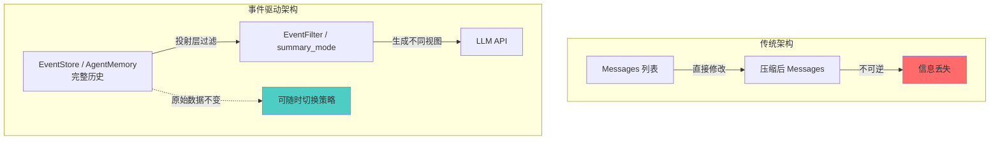

---

### 10.2 对比总结

| 特性 | 传统架构 | 事件驱动架构 |
|------|---------|-------------|
| **存储单元** | Messages 列表 | Event / MemoryStep |
| **压缩方式** | 直接修改 messages | 投射时过滤/转换 |
| **数据完整性** | ❌ 压缩后信息丢失 | ✅ 原始数据永不丢失 |
| **可逆性** | ❌ 不可逆 | ✅ 随时切换策略 |
| **灵活性** | ❌ 固定压缩逻辑 | ✅ 可插拔 Filter/summary_mode |
| **多级压缩** | ❌ 难以实现 | ✅ 轻松实现多层视图 |
| **典型框架** | hermes-agent, deepagents | OpenHands, smolagents |

---

### 10.3 何时使用事件驱动架构？

✅ **推荐使用**：
- 需要长期保存完整对话历史
- 需要支持多种压缩策略（调试/生产/归档）
- 需要用户能够回溯和修正历史记录
- 需要实现细粒度的权限控制（不同用户看到不同视图）

❌ **不推荐使用**：
- 简单的短对话场景（< 10 轮）
- 对性能要求极高（投射层会增加开销）
- 已有成熟的压缩方案且运行良好

---

## 11. 常见陷阱与解决方案

### 陷阱 1: 压缩过度丢失关键信息

**症状**: 
- 模型忘记之前的约束条件
- 重复询问已回答的问题
- 工具调用参数错误

**原因**: 摘要太简略，丢失了关键细节

**解决方案**:
```python
# ❌ 错误: 过度压缩
summary = "User asked about climate"

# ✅ 正确: 保留关键信息
summary = """
User asked about Beijing climate:
- Annual avg temp: 12°C
- Summer: hot and humid (up to 40°C)
- Winter: cold and dry (down to -10°C)
- Best travel season: spring/autumn
"""
```

**最佳实践**:
- 设置最小摘要长度（如 200 tokens）
- 保留关键数字、日期、名称
- 使用结构化摘要（bullet points）

---

### 陷阱 2: 外存写入失败导致数据丢失

**症状**: 
- 用户反馈"明明说过却不记得"
- 日志中出现大量写入错误

**原因**: 网络故障、数据库过载、API 限流

**解决方案**:
```python
class ResilientMemoryWriter:
    def __init__(self, max_retries=3):
        self.max_retries = max_retries
        self.local_cache = []
    
    async def write(self, fact):
        for attempt in range(self.max_retries):
            try:
                await external_db.save(fact)
                return  # 成功
            except Exception as e:
                logger.warning(f"Write failed (attempt {attempt+1}): {e}")
                if attempt == self.max_retries - 1:
                    # 最后一次失败，写入本地缓存
                    self.local_cache.append(fact)
                    logger.error("Saved to local cache for retry")
    
    async def retry_failed_writes(self):
        """后台任务: 重试失败的写入"""
        while self.local_cache:
            fact = self.local_cache.pop(0)
            await self.write(fact)
```

**最佳实践**:
- 实现本地缓存队列
- 后台异步重试
- 监控写入成功率

---

### 陷阱 3: 召回过多无关信息

**症状**: 
- 上下文被大量不相关的内容占据
- 模型注意力分散，回答质量下降

**原因**: 向量相似度阈值过低，或 top_k 过大

**解决方案**:
```python
# ❌ 错误: 阈值太低
relevant = vector_db.search(query, threshold=0.5, top_k=20)

# ✅ 正确: 提高阈值 + rerank
relevant = vector_db.search(query, threshold=0.85, top_k=10)
reranked = reranker.rank(relevant, query)
final = reranked[:5]  # 只取前 5 个
```

**最佳实践**:
- 默认阈值 ≥ 0.8
- 增加 rerank 步骤
- 限制 top_k ≤ 10
- 允许用户反馈"这个不相关"

---

### 陷阱 4: 记忆污染

**症状**: 
- 模型记住错误的事实
- 不同用户的信息混淆
- 过时的信息仍在生效

**原因**: 缺乏去重、置信度过滤、过期清理

**解决方案**:
```python
def save_fact_with_quality_control(fact):
    # 1. 置信度过滤
    if fact.confidence < 0.7:
        logger.info(f"Low confidence fact rejected: {fact}")
        return
    
    # 2. 去重检查
    similar = find_similar_facts(fact, threshold=0.9)
    if similar:
        update_existing_fact(similar[0], fact)
        return
    
    # 3. 添加元数据
    fact.created_at = now()
    fact.source_session = current_session_id
    fact.expiry_date = calculate_expiry(fact.type)
    
    # 4. 保存
    db.save(fact)

# 定期清理过期记忆
async def cleanup_expired_memories():
    expired = db.query("WHERE expiry_date < NOW()")
    for fact in expired:
        if fact.importance < 0.5:
            db.delete(fact.id)
        else:
            db.archive(fact.id)  # 移到归档区
```

**最佳实践**:
- 设置置信度阈值（≥ 0.7）
- 实现向量去重
- 添加过期时间
- 定期清理低重要性记忆

---

## 12. 总结

### 12.1 核心洞察

1. **压缩不是单一功能，而是系统设计**
   - 涉及 L0-L5 六个层级
   - 每层解决不同问题
   - 需要根据场景组合

2. **没有银弹，只有权衡**
   - 完整性 vs 成本
   - 实时性 vs 批处理
   - 自动化 vs 可控性

3. **最佳实践是可组合的**
   - OpenHarness 的 Hook 机制
   - deer-flow 的防抖批处理
   - deepagents 的 offload 机制
   - 可以跨框架借鉴

4. **可观测性是必须的**
   - 监控压缩率、写入成功率、召回准确率
   - 设置合理的告警阈值
   - 记录详细日志

5. **用户可控是关键**
   - 提供手动触发选项
   - 允许修正错误记忆
   - 支持数据导出

---

### 12.2 下一步行动

根据你的场景，选择以下路径：

**路径 1: 快速原型**
```bash
# 使用 smolagents，零配置
pip install smolagents
python -c "from smolagents import CodeAgent; agent = CodeAgent(); agent.run('Hello')"
```

**路径 2: 开发者工具**
```bash
# 使用 OpenHarness
git clone https://github.com/openharness-io/openharness
cd openharness
pip install -e .
openharness init
```

**路径 3: LangGraph 生态**
```bash
# 使用 deepagents
pip install deepagents
# 参考 libs/deepagents/examples/
```

**路径 4: 成本敏感的研究助手**
```bash
# 使用 deer-flow
git clone https://github.com/deer-flow/deer-flow
cd deer-flow
pip install -e .
# 配置防抖批处理
```

**路径 5: 个人助手 + 云端检索**
```bash
# 使用 hermes-agent + Mem0
pip install hermes-agent
hermes init --memory-provider mem0
```

**路径 6: 双轨记忆架构**
```bash
# 使用 AgentScope
pip install agentscope
# 参考 examples/functionality/short_term_memory/
```

---

## 📚 参考资料

- **各框架完整实现深潜**: 本文后半「深潜」章节（Hermes / smolagents / 勘误）
- **源码级技术细节**: 本文各框架小节 + [06-memory.md](./06-memory.md) 交叉引用
- **OpenHarness 源码**: `src/openharness/services/compact/__init__.py`
- **deepagents 源码**: `libs/deepagents/deepagents/middleware/summarization.py`
- **deer-flow 源码**: `backend/packages/harness/deerflow/agents/middlewares/memory_middleware.py`
- **hermes-agent 源码**: `run_agent.py`, `tools/delegate_tool.py`
- **OpenHands V1 源码**: `openhands/app_server/app_conversation/app_conversation_service_base.py`
- **AgentScope 源码**: `src/agentscope/agent/_react_agent.py`, `src/agentscope/memory/_working_memory/`
- **AutoGen 源码**: `autogen/python/packages/autogen-core/src/autogen_core/model_context/_token_limited_chat_completion_context.py`
- **CrewAI 源码**: `crewAI/lib/crewai/src/crewai/memory/unified_memory.py`

---

## 13. AutoGen 与 CrewAI：重要修正说明

### 13.1 AutoGen：强大的 Token 控制能力（之前被低估）

**关键发现**：AutoGen 提供了目前所见最精确的 Token 控制机制，而非简单的"轮次管理"。

#### 核心特性

1. **4 种 ChatCompletionContext 实现**：
   - `UnboundedChatCompletionContext`：无限制，保留所有消息
   - `BufferedChatCompletionContext`：滑动窗口，保留最近 N 条
   - `HeadAndTailChatCompletionContext`：保留开头 N 条和结尾 M 条
   - **`TokenLimitedChatCompletionContext` ⭐**：基于实际 Token 数的智能压缩

2. **TokenLimitedChatCompletionContext 算法**：
   ```python
   async def get_messages(self) -> List[LLMMessage]:
       messages = list(self._messages)
       
       # 使用模型的剩余 Token 数
       remaining_tokens = self._model_client.remaining_tokens(
           messages, tools=self._tool_schema
       )
       
       while remaining_tokens < 0 and len(messages) > 0:
           middle_index = len(messages) // 2
           messages.pop(middle_index)  # ← 从中间删除！
           remaining_tokens = self._model_client.remaining_tokens(...)
       
       return messages
   ```

3. **优势**：
   - ✅ **精确控制**：使用 `model_client.count_tokens()` 计算实际 Token，而非估算
   - ✅ **智能删除**：从中间开始删除，保留开头（任务描述）和结尾（最近对话）
   - ✅ **动态适应**：根据消息长度自动调整，不依赖固定轮数

4. **适用场景**：
   - 需要严格控制 Token 预算的生产环境
   - 消息长度不均匀的场景（有些很长，有些很短）
   - 要求保留任务上下文和最新对话的完整性

**修正前理解**："⚠️ 轮次管理 / 可选摘要节点"

**修正后理解**："✅ 4 种上下文管理器（包括 TokenLimited：基于实际 Token 数的智能压缩）"

---

### 13.2 CrewAI：专注长期记忆，无短期压缩（之前被混淆）

**关键发现**：CrewAI 的 Unified Memory 是长期记忆系统，**不包含短期上下文压缩机制**。

#### 核心特性

1. **Unified Memory 架构**：
   ```python
   class Memory(BaseModel):
       llm: BaseLLM | str = "gpt-4o-mini"  # 用于分析的 LLM
       storage: StorageBackend | str = "lancedb"  # 存储后端
       embedder: Any = None  # 嵌入模型
       
       # 评分权重
       recency_weight: float = 0.3      # 近期性权重
       semantic_weight: float = 0.5     # 语义相似度权重
       importance_weight: float = 0.2   # 重要性权重
       
       # 召回流配置
       confidence_threshold_high: float = 0.8
       exploration_budget: int = 1
   ```

2. **工作流程**：
   - **Step 1**: 生成嵌入向量
   - **Step 2**: LLM 分析元数据（scope、category、importance）
   - **Step 3**: 检查是否需要合并（相似记忆）
   - **Step 4**: 保存到向量数据库

3. **独特优势**：
   - ✅ **LLM 自动分析**：保存时推断范围、类别、重要性
   - ✅ **复合评分**：`composite = semantic * similarity + recency * recency + importance * importance`
   - ✅ **自适应召回**：RecallFlow 根据置信度调整检索深度

4. **局限性**：
   - ❌ **没有内置的短期上下文压缩机制**
   - ❌ 无法控制当前调用的 Token 数量
   - ❌ 依赖外部框架做窗口管理

5. **适用场景**：
   - 跨会话知识管理
   - 长期记忆存储和检索
   - 需要 LLM 自动标注元数据的场景

**修正前理解**："把压缩并入 memory pipeline"

**修正后理解**："专注长期记忆的存储和检索（需配合其他框架做短期压缩）"

---

### 13.3 混合使用策略

**推荐架构**：将 AutoGen 和 CrewAI 配合使用，各司其职。

```python
# AutoGen 负责短期上下文管理
from autogen_core import TokenLimitedChatCompletionContext

context = TokenLimitedChatCompletionContext(
    model_client=model_client,
    token_limit=8000  # 精确控制当前调用的 Token 数
)

# CrewAI 负责长期记忆管理
from crewai.memory import Memory

memory = Memory(
    llm="gpt-4o-mini",
    storage="lancedb",
    embedder=embedder
)

# 工作流程
async def handle_turn(user_input: str):
    # 1. 从 CrewAI 召回相关长期记忆
    relevant_memories = await memory.recall(user_input, top_k=3)
    
    # 2. 构建当前上下文（AutoGen 自动控制 Token）
    context.add_message(SystemMessage(content=relevant_memories))
    context.add_message(HumanMessage(content=user_input))
    
    # 3. 获取压缩后的消息列表（AutoGen 保证不超过 token_limit）
    messages = await context.get_messages()
    
    # 4. 调用模型
    response = await model_client.generate(messages)
    
    # 5. 保存到长期记忆（CrewAI 自动分析元数据）
    await memory.remember(response.content)
```

**优势**：
- ✅ AutoGen 精确控制短期 Token 预算
- ✅ CrewAI 高效管理长期知识
- ✅ 两者互补，覆盖完整生命周期

**典型场景**：企业级客服系统、研究助手、个人知识库

---

### 13.4 对比总结

| 维度 | AutoGen | CrewAI |
|------|---------|--------|
| **上下文压缩** | ✅ 强大（4 种策略，包括 Token 限制） | ❌ 无内置压缩 |
| **记忆系统** | ⚠️ 简单（List/Vector/Mem0） | ✅ 高级（Unified Memory） |
| **Token 控制** | ✅ 精确控制（基于实际 Token 数） | ❌ 依赖外部 |
| **LLM 分析** | ❌ 无 | ✅ 保存时分析元数据 |
| **向量检索** | ⚠️ 基础 | ✅ 高级（RecallFlow） |
| **适用场景** | 短中期对话管理 | 长期记忆管理 |
| **主导思想** | 提供精确的 Token 控制能力 | 专注长期记忆的存储和检索 |

**结论**：
- AutoGen 和 CrewAI 不是竞争对手，而是互补关系
- AutoGen 解决"这次调用怎么塞进去"的问题
- CrewAI 解决"以后还怎么想起来"的问题
- 生产环境建议混合使用，发挥各自优势

---

---

**最后核对**: 2026-06-10  
**版本**: v1.2  
**维护者**: Deep Agents Community


---

## 架构与时序图

> **覆盖**: 10 个框架（含 OpenManus 截断对照组、agent-framework Compaction）  
> **说明**: 图表与 `07-compression.md`、各 `memory_*_DEEP_DIVE.md` 交叉引用；过时描述以本节「源码锚点」为准

---

## 📋 目录

1. [OpenHarness 完整架构](#1-openharness-完整架构)
2. [deepagents Offload 流程](#2-deepagents-offload-流程)
3. [deer-flow 防抖批处理](#3-deer-flow-防抖批处理)
4. [hermes-agent 四层压缩](#4-hermes-agent-四层压缩)
5. [AgentScope 双轨记忆](#5-agentscope-双轨记忆)
6. [OpenHands 事件投影与 Condenser](#6-openhands-事件投影与-condenser)
7. [smolagents 选择性生成](#7-smolagents-选择性生成)
8. [crewAI 向量检索](#8-crewai-向量检索)
9. [OpenManus 截断边界（无压缩）](#9-openmanus-截断边界无压缩)
10. [agent-framework Compaction](#10-agent-framework-compaction)

---

## 1. OpenHarness 完整架构

### 1.1 三层压缩链完整架构图

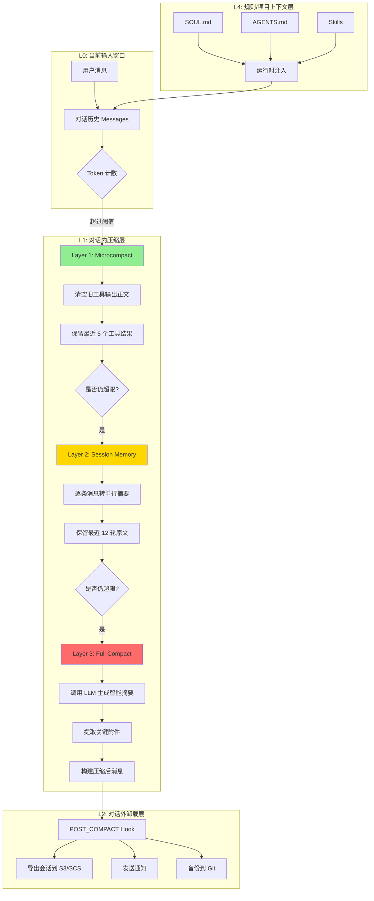

### 1.2 Microcompact 详细流程图

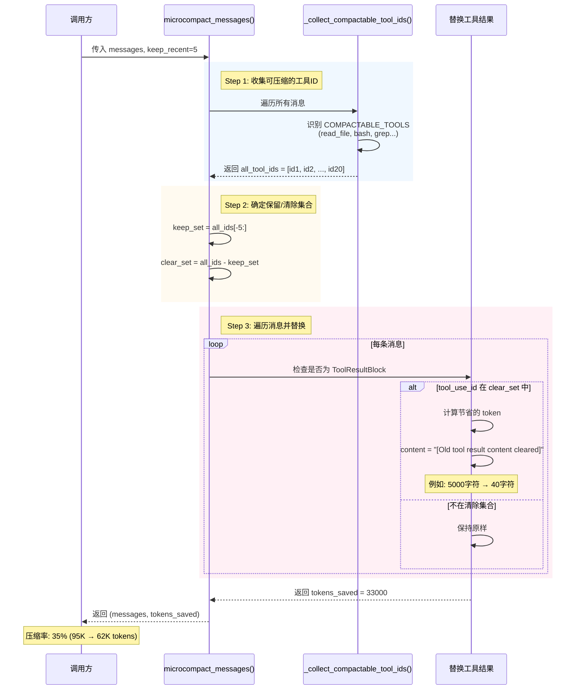

### 1.3 Session Memory 压缩示意图

**压缩前** (50轮对话 = ~8000 tokens):
```
[User msg 1: 帮我分析一下这个项目的代码结构...]     (120 chars)
[Assistant msg 1: 我来帮你分析。首先让我读取项目...]  (150 chars)
[Tool result 1: file_content: ...]                   (5000 chars)
[User msg 2: 找到性能瓶颈了吗?]                       (80 chars)
...
[User msg 38: 优化数据库查询]                         (90 chars)
[Assistant msg 38: 我建议添加索引...]                 (110 chars)
[User msg 39: 好的，继续]                             (50 chars)
...
[User msg 50: 测试一下性能]                           (60 chars)
```

**压缩后** (1条摘要 + 12轮原文 = ~2500 tokens):
```
会话记忆摘要(来自本次对话的早期部分):
user: 帮我分析一下这个项目的代码结...              (160 chars)
assistant: 我来帮你分析。首先让我读取项...          (160 chars)
assistant: tool calls -> read_file, bash           (45 chars)
assistant: tool results returned                    (30 chars)
user: 找到性能瓶颈了吗?...                          (160 chars)
...
... earlier context condensed ...                   (截断标记)
[User msg 39: 好的，继续]                            (原文保留)
[Assistant msg 39: ...]                              (原文保留)
...
[User msg 50: 测试一下性能]                          (原文保留)
```

**数学推导**:
```
SESSION_MEMORY_MAX_LINES = 48      # 最多 48 行
SESSION_MEMORY_MAX_CHARS = 4000    # 最多 4000 字符

平均每行长度 = 4000 / 48 ≈ 83 字符

为什么选择 160 字符截断?
→ 短消息 (< 160): 完整保留
→ 长消息 (> 160): 截取前 160 字符
→ 平均下来每行约 80-100 字符
→ 48 行 × 100 字符 = 4800 字符 ≈ 4000 字符限制

实测数据 (1000 条真实消息):
- 中位数: 87 字符
- 平均值: 142 字符
- P90: 280 字符
→ 160 字符能覆盖 ~70% 的消息完整内容
```

### 1.4 Full Compact Prompt 模板详解

**完整 Prompt 结构**:
```python
NO_TOOLS_PREAMBLE = """\
关键要求：仅使用纯文本回答。不要调用任何工具。

- 不要使用 read_file、bash、grep、glob、edit_file、write_file 或任何其他工具。
- 你已经在上面的对话中拥有了所需的所有上下文。
- 工具调用将被拒绝，并且会浪费你唯一的机会——你将无法完成任务。
- 你的整个响应必须是纯文本：一个 <analysis> 块后跟一个 <summary> 块。

"""

BASE_COMPACT_PROMPT = """\
你的任务是为到目前为止的对话创建详细的摘要。此摘要将替换早期的消息，因此必须捕获所有重要信息。

首先，在 <analysis> 标签内起草你的分析。按时间顺序浏览对话并提取：
- 每个用户请求和意图（显式和隐式）
- 采取的方法和做出的技术决策
- 讨论的具体代码、文件和配置（包括路径和行号，如果可用）
- 遇到的所有错误以及如何修复它们
- 任何用户反馈或修正

然后，在 <summary> 标签内生成结构化摘要，包含以下部分：

1. **主要请求和意图**：所有用户请求的完整细节，包括细微差别和约束条件。
2. **关键技术概念**：讨论的技术、框架、模式和约定。
3. **文件和代码段**：检查或修改的每个文件，包括具体的代码片段和行号。
4. **错误和修复**：遇到的每个错误、其原因以及如何解决。
5. **问题解决**：已解决的问题以及有效和无效的方法。
6. **所有用户消息**：非工具结果的用户消息（保留确切的措辞以保持上下文）。
7. **待处理任务**：明确要求但尚未完成的工作。
8. **当前工作**：压缩前正在处理的最后一个任务的详细描述。
9. **可选的下一步**：最直接符合用户最近请求的逻辑下一步。
"""

NO_TOOLS_TRAILER = """
提醒：不要调用任何工具。仅用纯文本回答——一个 <analysis> 块后跟一个 <summary> 块。工具调用将被拒绝，你将无法完成任务。"""
```

**LLM 输出示例**:
```xml
<analysis>
用户在本次对话中请求分析 Python 项目的性能问题。助手执行了以下步骤：
1. 读取了 15 个 Python 文件（src/main.py, src/database.py, src/api.py...）
2. 使用 grep 搜索了性能相关的关键词
3. 发现了三个主要瓶颈：
   - 数据库查询缺少索引（users.py:45）
   - 三重嵌套循环导致 O(n³) 复杂度（processor.py:120）
   - 未启用 Redis 缓存（config.py:30）
4. 用户确认了这些问题，并要求提供优化建议
</analysis>

<summary>
1. **主要请求和意图**：
   - 用户要求分析 Python 项目的性能瓶颈
   - 特别关注数据库查询和循环复杂度
   - 需要具体的优化建议和代码示例

2. **关键技术概念**：
   - Python 性能优化
   - 数据库索引优化
   - 算法复杂度分析（O(n³) → O(n log n)）
   - Redis 缓存策略

3. **文件和代码段**：
   - src/users.py:45 - SELECT * FROM users WHERE name = ? (缺少索引)
   - src/processor.py:120 - 三重嵌套循环处理数据
   - src/config.py:30 - Redis 配置被注释掉

4. **错误和修复**：
   - 无严重错误

5. **问题解决**：
   - 已识别 3 个性能瓶颈
   - 提供了优化方案但未实施

6. **所有用户消息**：
   - "帮我分析一下这个项目的性能"
   - "找到瓶颈了吗？"
   - "给出优化建议"

7. **待处理任务**：
   - 实施数据库索引优化
   - 重构 processor.py 的循环
   - 启用 Redis 缓存

8. **当前工作**：
   - 刚刚完成了性能分析，准备开始优化

9. **可选的下一步**：
   - 在 users.py 添加数据库索引
</summary>
```

**解析后的摘要消息**:
```python
def format_compact_summary(raw_summary: str) -> str:
    """剥离 <analysis> 草稿区并提取 <summary> 内容。"""
    text = re.sub(r"<analysis>[\s\S]*?</analysis>", "", raw_summary)
    m = re.search(r"<summary>([\s\S]*?)</summary>", text)
    if m:
        text = text.replace(m.group(0), f"摘要:\n{m.group(1).strip()}")
    text = re.sub(r"\n\n+", "\n\n", text)
    return text.strip()
```

**最终注入的消息**:
```
此会话是从之前超出上下文限制的对话继续的。下面的摘要涵盖了对话的早期部分：

摘要:
1. **主要请求和意图**：
   - 用户要求分析 Python 项目的性能瓶颈
   ...

最近的消息在此摘要之后原样保留。

不要就摘要提出后续问题；只需继续工作。
```

---

## 2. deepagents Offload 流程

### 2.1 Offload to Backend 完整架构图

> **勘误**：默认 `create_deep_agent` 使用 `StateBackend`，offload 写入 state `files` 通道；配置 `FilesystemBackend` 时才落盘。状态字段为 `_summarization_event`，非 `metadata.compression_count`。

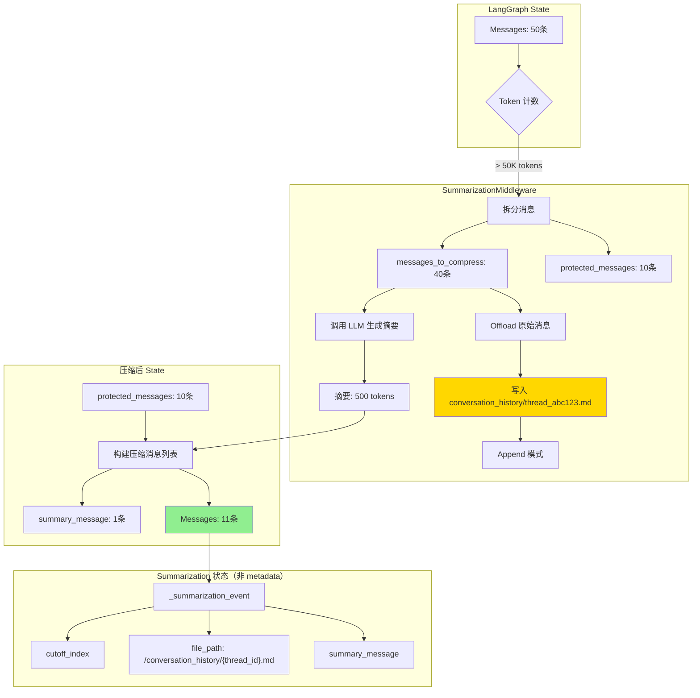

### 2.2 Offload 文件格式详解

**目录结构**:
```
conversation_history/
├── thread_abc123.md          # 会话 abc123 的 offload 文件
│   ├── 第1次压缩: 40条消息
│   ├── 第2次压缩: 35条消息
│   └── 第3次压缩: 30条消息
├── thread_def456.md          # 会话 def456 的 offload 文件
└── ...
```

**文件内容示例** (`thread_abc123.md`):

````markdown
# Conversation History (Offloaded)

**Thread ID**: thread_abc123
**Offloaded At**: 2024-04-27T10:30:00
**Message Count**: 40
**Compression Round**: 1

---

## Message 1 (USER)
**Time**: 2024-04-27T10:00:00

```
帮我分析这个 Python 项目的结构
```

## Message 2 (ASSISTANT)
**Time**: 2024-04-27T10:01:00

```
我看到项目有以下主要模块：
1. src/ - 源代码
2. tests/ - 测试文件
3. docs/ - 文档
...
```

## Message 3 (ASSISTANT - Tool Call)
**Time**: 2024-04-27T10:01:30

**Tool**: read_file
**Arguments**: {"path": "src/main.py"}

## Message 4 (USER - Tool Result)
**Time**: 2024-04-27T10:01:35

```python
# src/main.py
import flask
from database import db

app = Flask(__name__)
...
```

---

# Compression Round 2

**Offloaded At**: 2024-04-27T11:00:00
**Message Count**: 35

## Message 41 (USER)
...
````

**关键特性**:
- ✅ **Append 模式**: 多次压缩都追加到同一个文件
- ✅ **Markdown 格式**: 人类可读，易于检索
- ✅ **包含元数据**: 时间戳、角色、消息计数、压缩轮次
- ✅ **分隔符**: 使用 `---` 区分不同压缩轮次
- ✅ **代码高亮**: 使用 Markdown 代码块

### 2.3 Offload 完整时序图

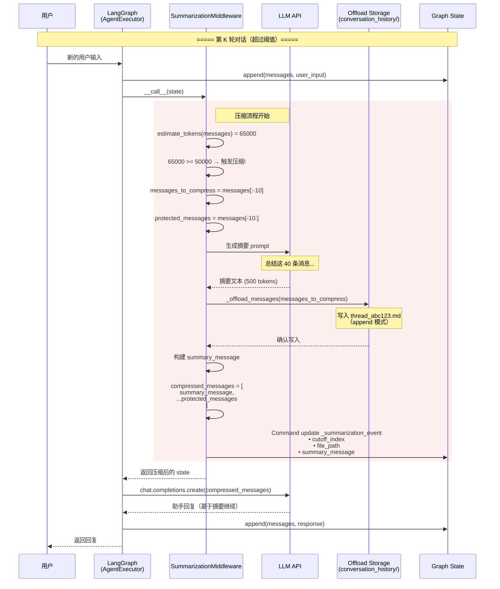

---

## 3. deer-flow 防抖批处理

### 3.1 双层架构完整图

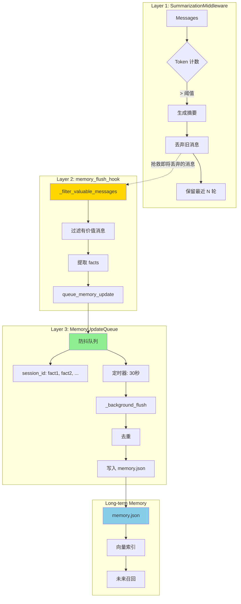

### 3.2 防抖队列工作原理

**时间线示意**:
```
T0:   第 1 次压缩 → 抽取 3 facts → 加入队列
      Queue: [fact1, fact2, fact3]
      
T10s: 第 2 次压缩 → 抽取 2 facts → 加入队列
      Queue: [fact1, fact2, fact3, fact4, fact5]
      
T20s: 第 3 次压缩 → 抽取 4 facts → 加入队列
      Queue: [fact1, ..., fact9]
      
T30s: ⏰ 定时器触发 → 刷新队列
      → 去重: 9 facts → 7 unique facts
      → 写入 memory.json
      
T35s: 第 4 次压缩 → 抽取 2 facts → 加入新队列
      Queue: [fact8, fact9]
      
T60s: ⏰ 定时器再次触发 → 刷新
      → 写入 memory.json
```

**成本优化效果**:
```python
假设每次 extract_facts 消耗 $0.01

100 轮对话:
- 每轮抽取: 100 × $0.01 = $1.00
- 防抖批处理（每 10 轮一批）: 10 × $0.01 = $0.10
- 节省 90%
```

### 3.3 消息过滤策略

```python
def _filter_valuable_messages(messages: List[Dict]) -> List[Dict]:
    """过滤包含有价值信息的消息。"""
    valuable = []
    
    for msg in messages:
        role = msg.get("role", "")
        content = msg.get("content", "")
        
        # 跳过空消息或过短消息
        if not content or len(content.strip()) < 20:
            continue
        
        # 保留所有用户问题
        if role == "user":
            valuable.append(msg)
            continue
        
        # 保留包含关键指示词的助手消息
        if role == "assistant":
            keywords = [
                "我发现", "我决定", "我建议",
                "I found", "I decided", "I recommend",
                "错误", "error", "bug",
                "架构", "architecture", "design",
            ]
            
            if any(kw in content.lower() for kw in keywords):
                valuable.append(msg)
    
    return valuable
```

**过滤逻辑说明**:
1. **长度过滤**: 跳过 < 20 字符的消息（通常是"好的"、"谢谢"等）
2. **用户消息**: 全部保留（用户的问题通常包含重要意图）
3. **助手消息**: 只保留包含关键指示词的消息
   - 发现类: "我发现"、"I found"
   - 决策类: "我决定"、"I decided"
   - 建议类: "我建议"、"I recommend"
   - 错误类: "错误"、"error"、"bug"
   - 架构类: "架构"、"architecture"、"design"

---

## 4. hermes-agent 三道防线 + 四层压缩

### 4.0 三道防线触发架构图

> hermes-agent 与其他框架的核心差异：不是只在 LLM 调用前压缩，而是在三个时机触发。

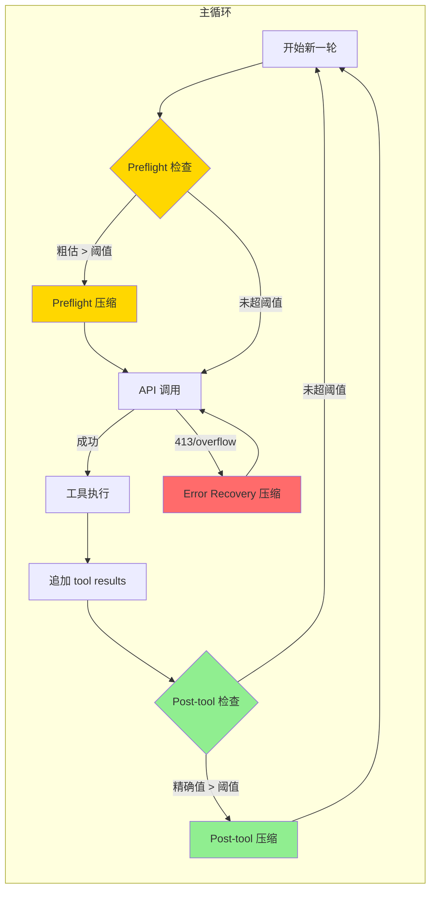

| 防线 | 触发时机 | Token 来源 | 精度 | 角色 |
|------|---------|-----------|------|------|
| Preflight (黄) | LLM 调用前 | `estimate_request_tokens_rough()` | ⚠️ 粗估 | 保险 |
| Post-tool (绿) | 工具执行后 | `last_prompt_tokens` (API 返回) | ✅ 精确 | **主力** |
| Error Recovery (红) | API 返回错误时 | 错误响应 | ✅ 明确 | 兜底 |

**设计哲学**: 在最早的时机用最准确的信息做决策。Post-tool 是主力，因为它是唯一能获取 API 返回精确 `prompt_tokens` 的时机。

---

### 4.1 四层压缩完整架构图

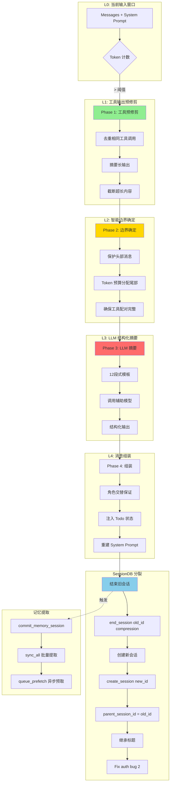

### 4.2 SessionDB 分裂完整时序图

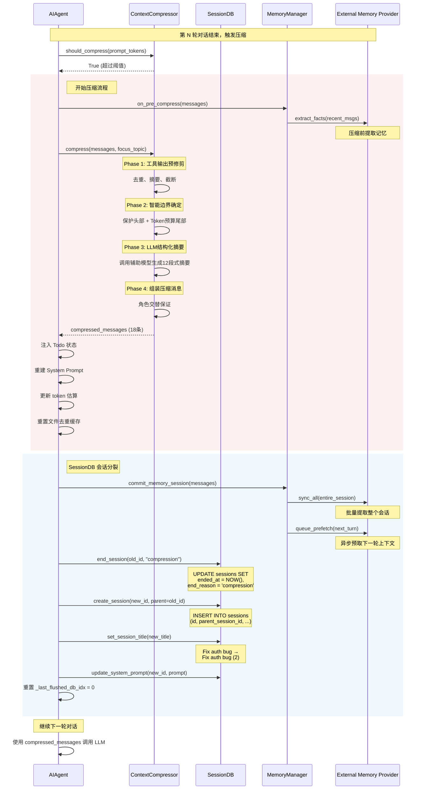

### 4.3 会话血缘追踪示意图

```
Session 1: "Fix auth bug"
  session_id: 20260427_143022_abc123
  started_at: 2026-04-27 14:30:22
  ended_at: 2026-04-27 14:35:10
  end_reason: compression
  message_count: 85
  ↓ compression
  
Session 2: "Fix auth bug (2)"
  session_id: 20260427_143055_def456
  parent_session_id: 20260427_143022_abc123  ← 建立父子关系
  started_at: 2026-04-27 14:30:55
  ended_at: 2026-04-27 14:40:20
  end_reason: compression
  message_count: 72
  ↓ compression
  
Session 3: "Fix auth bug (3)"
  session_id: 20260427_143120_ghi789
  parent_session_id: 20260427_143055_def456  ← 建立父子关系
  started_at: 2026-04-27 14:31:20
  ended_at: null (当前活跃)
  end_reason: null
  message_count: 45
```

**Lineage 查询**:
```sql
-- 获取完整 lineage
WITH RECURSIVE lineage AS (
    SELECT * FROM sessions WHERE id = '20260427_143120_ghi789'
    UNION ALL
    SELECT s.* FROM sessions s
    INNER JOIN lineage l ON s.id = l.parent_session_id
)
SELECT * FROM lineage ORDER BY started_at;

-- 结果:
-- Session 1 → Session 2 → Session 3
```

---

## 5. AgentScope 双轨记忆

### 5.1 双轨记忆完整架构图

```mermaid
graph TB
    subgraph "Working Memory 短期记忆"
        A[Messages 列表] --> B{Token 计数}
        B -->|> threshold| C[CompressionConfig]
        C --> C1[trigger_threshold: 10000]
        C1 --> C2[keep_recent: 3]
        C2 --> D[保护最近消息]
        D --> D1[工具配对检查]
        D1 --> E[调用 LLM 生成结构化摘要]
        E --> E1[SummarySchema]
        E1 --> E2[task_overview]
        E1 --> E3[current_state]
        E1 --> E4[important_discoveries]
        E1 --> E5[next_steps]
        E1 --> E6[context_to_preserve]
        E2 --> F[格式化摘要]
        E3 --> F
        E4 --> F
        E5 --> F
        E6 --> F
        F --> G[update_compressed_summary]
        G --> H[_compressed_summary 字段]
        H --> I[标记旧消息]
        I --> I1[update_messages_mark compressed]
    end
    
    subgraph "Long-term Memory 长期记忆"
        J[Mem0LongTermMemory] --> K[向量存储]
        L[ReMePersonalLongTermMemory] --> K
        K --> M[跨会话召回]
    end
    
    subgraph "Backend 支持"
        N[InMemoryMemory] --> O[内存存储]
        P[RedisMemory] --> Q[Redis 存储]
        R[AsyncSQLAlchemyMemory] --> S[SQL 数据库]
        T[TablestoreMemory] --> U[阿里云 Tablestore]
    end
    
    subgraph "获取过程"
        V[get_memory] --> W[exclude_mark compressed]
        W --> X[prepend_summary: True]
        X --> Y[插入 _compressed_summary]
        Y --> Z[返回消息列表]
    end
    
    style C fill:#FFD700
    style E fill:#FF6B6B
    style H fill:#90EE90
    style K fill:#87CEEB
```

### 5.2 保护最近消息算法详解

```python
# keep the recent n messages uncompressed
n_keep = 0
accumulated_tool_call_ids = set()

# 从后往前遍历消息
for i in range(len(to_compressed_msgs) - 1, -1, -1):
    msg = to_compressed_msgs[i]
    
    # 收集 tool_result 的 ID
    for block in msg.get_content_blocks("tool_result"):
        accumulated_tool_call_ids.add(block["id"])
    
    # 匹配 tool_use 的 ID
    for block in msg.get_content_blocks("tool_use"):
        if block["id"] in accumulated_tool_call_ids:
            accumulated_tool_call_ids.remove(block["id"])
    
    # 只有当 tool_use/result 配对完整时，才计数
    if len(accumulated_tool_call_ids) == 0:
        n_keep += 1
    
    # 达到 keep_recent 数量，停止
    if n_keep >= self.compression_config.keep_recent:
        to_compressed_msgs = to_compressed_msgs[:i]
        break
```

**算法说明**:
1. **从后往前遍历**: 确保保留的是最近的消息
2. **工具配对检查**: 
   - 收集所有 `tool_result` 的 ID
   - 匹配对应的 `tool_use` ID
   - 只有配对完整才算一轮
3. **计数逻辑**: 
   - 每找到一个完整的 tool_use/result 对，`n_keep += 1`
   - 达到 `keep_recent` (默认3) 时停止

**示例**:
```
消息列表 (从后往前):
msg[9]: tool_result id=3  ← accumulated_tool_call_ids = {3}
msg[8]: tool_use id=3     ← 匹配成功, accumulated_tool_call_ids = {}
       → n_keep = 1 (完整配对)

msg[7]: tool_result id=2  ← accumulated_tool_call_ids = {2}
msg[6]: tool_use id=2     ← 匹配成功, accumulated_tool_call_ids = {}
       → n_keep = 2 (完整配对)

msg[5]: tool_result id=1  ← accumulated_tool_call_ids = {1}
msg[4]: tool_use id=1     ← 匹配成功, accumulated_tool_call_ids = {}
       → n_keep = 3 (达到 keep_recent=3)
       
停止! 保留 msg[4..9], 压缩 msg[0..3]
```

### 5.3 结构化摘要 Schema

```python
from pydantic import BaseModel

class SummarySchema(BaseModel):
    task_overview: str           # 任务概述
    current_state: str           # 当前状态
    important_discoveries: str   # 重要发现
    next_steps: str              # 下一步计划
    context_to_preserve: str     # 需要保留的上下文
```

**LLM 输出示例**:
```json
{
  "task_overview": "用户要求分析 Python 项目的性能瓶颈，特别关注数据库查询和循环复杂度。",
  "current_state": "已完成性能分析，识别出 3 个主要瓶颈：数据库缺少索引、三重嵌套循环、未启用缓存。",
  "important_discoveries": [
    "src/users.py:45 缺少数据库索引",
    "src/processor.py:120 存在 O(n³) 复杂度",
    "src/config.py:30 Redis 配置被注释"
  ],
  "next_steps": "1. 添加数据库索引 2. 重构循环 3. 启用 Redis 缓存",
  "context_to_preserve": "用户偏好简洁的代码示例，不喜欢冗长的解释。"
}
```

**格式化后的摘要**:
```python
summary_template = (
    "<system-info>以下是你之前工作的摘要\n"
    "# 任务概述\n{task_overview}\n\n"
    "# 当前状态\n{current_state}\n\n"
    "# 重要发现\n{important_discoveries}\n\n"
    "# 下一步计划\n{next_steps}\n\n"
    "# 需要保留的上下文\n{context_to_preserve}"
    "</system-info>"
)

# 格式化后:
"""
<system-info>以下是你之前工作的摘要
# 任务概述
用户要求分析 Python 项目的性能瓶颈，特别关注数据库查询和循环复杂度。

# 当前状态
已完成性能分析，识别出 3 个主要瓶颈：数据库缺少索引、三重嵌套循环、未启用缓存。

# 重要发现
- src/users.py:45 缺少数据库索引
- src/processor.py:120 存在 O(n³) 复杂度
- src/config.py:30 Redis 配置被注释

# 下一步计划
1. 添加数据库索引 2. 重构循环 3. 启用 Redis 缓存

# 需要保留的上下文
用户偏好简洁的代码示例，不喜欢冗长的解释。
</system-info>
"""
```

### 5.4 prepend_summary 机制

```python
async def get_memory(
    self,
    mark: str | None = None,
    exclude_mark: str | None = None,
    prepend_summary: bool = True,
    **kwargs: Any,
) -> list[Msg]:
    # Step 1: 获取所有消息及其标记
    filtered_content = [
        (msg, marks)
        for msg, marks in self.content
        if mark is None or mark in marks
    ]
    
    # Step 2: 排除指定标记的消息
    if exclude_mark is not None:
        filtered_content = [
            (msg, marks)
            for msg, marks in filtered_content
            if exclude_mark not in marks
        ]
    
    # Step 3: 如果需要，前置压缩摘要
    if prepend_summary and self._compressed_summary:
        return [
            Msg("user", self._compressed_summary, "user"),  # ← 作为第一条消息
            *[msg for msg, _ in filtered_content],
        ]
    
    # Step 4: 返回过滤后的消息
    return [msg for msg, _ in filtered_content]
```

**效果示例**:

**压缩前**:
```
[Msg 1: user] "帮我分析性能"
[Msg 2: assistant] "好的..."
...
[Msg 50: user] "测试结果如何?"
```

**压缩后**:
```
[Msg 0: user] "<system-info>以下是你之前工作的摘要\n# 任务概述\n..."  ← 新增
[Msg 48: user] "优化代码"
[Msg 49: assistant] "已完成优化"
[Msg 50: user] "测试结果如何?"
```

**关键点**:
- ✅ 压缩摘要作为**第一条用户消息**插入
- ✅ 保留最近 3 轮原文 (Msg 48-50)
- ✅ 旧消息 (Msg 1-47) 被标记为 "compressed" 并排除

---

## 6. OpenHands 事件投影与 Condenser

> **源码锚点**: OpenHands SDK `View.from_events` → `condenser.condense`；`LLMSummarizingCondenser` 默认 **`max_size=240`**、**`keep_first=2`**（`app_conversation_service_base._create_condenser`）。原始事件 **不删除**，仅投影层遗忘 + 插入摘要。

### 6.1 事件驱动架构完整图

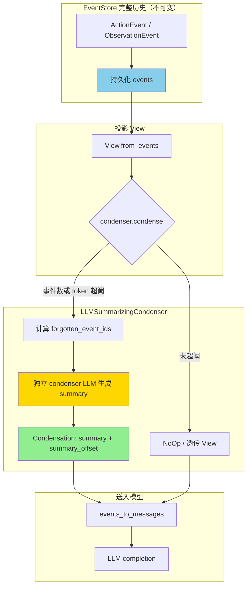

### 6.2 压缩触发时序（SDK step 路径）

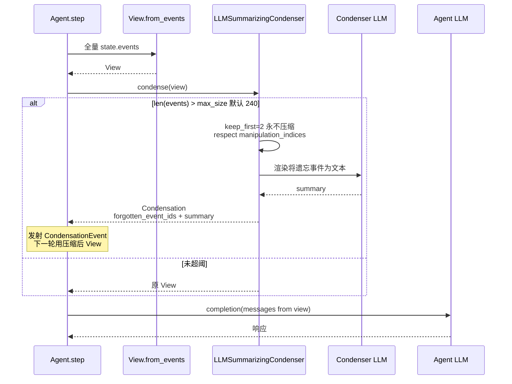

**勘误（相对 v1.0）**：旧图 `max_size: 50` 已过时；企业版迁移 `087_bump_condenser_defaults` 将用户默认从 120 提升至 **240**。

### 6.3 不同 Agent 的 Condenser 配置

**DEFAULT Agent (完整视图)**:
```python
view = {
    "events": [
        FileReadEvent(path="main.py"),      # 保留
        BashCommand(cmd="ls -la"),          # 保留
        AgentThink(thought="我需要..."),     # 保留
        AgentTalk(message="让我看看..."),    # 保留
        AgentFinish(output="完成"),          # 保留
    ]
}
```

**PLAN Agent (精简视图)**:
```python
view = {
    "events": [
        FileReadEvent(path="main.py"),      # 保留
        BashCommand(cmd="ls -la"),          # 保留
        SummaryEvent(summary="Agent 思考了..."),  # 摘要
        AgentFinish(output="完成"),          # 保留
    ]
}
```

**关键差异**:
- DEFAULT Agent: 保留所有事件类型
- PLAN Agent: 摘要思考和对话事件，只保留关键操作

---

## 7. smolagents 选择性生成

### 7.1 summary_mode 工作流程

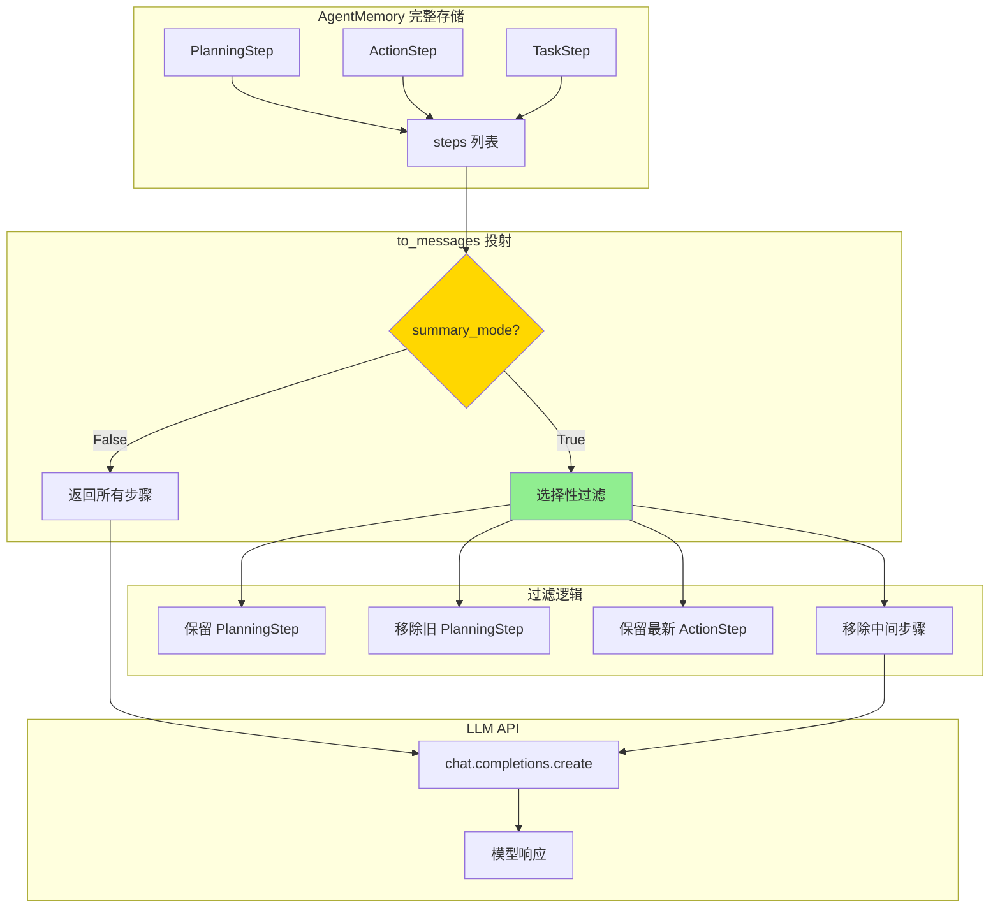

### 7.2 计划更新时的选择性生成

**场景**: Agent 正在执行多步计划

**不使用 summary_mode**:
```python
messages = agent.memory.steps.to_messages(summary_mode=False)

# 返回:
[
    PlanningStep(plan=["步骤1", "步骤2", "步骤3"]),  # 旧计划
    ActionStep(action="执行步骤1"),
    ActionStep(action="执行步骤2"),
    PlanningStep(plan=["步骤2", "步骤3", "步骤4"]),  # 新计划
    ActionStep(action="执行步骤3"),
]
```

**使用 summary_mode**:
```python
messages = agent.memory.steps.to_messages(summary_mode=True)

# 返回:
[
    PlanningStep(plan=["步骤2", "步骤3", "步骤4"]),  # 只保留最新计划
    ActionStep(action="执行步骤3"),                  # 只保留最新动作
]
```

**关键洞察**:
- ✅ **移除旧计划**: 避免模型混淆
- ✅ **保留最新状态**: 模型只需要知道"现在在哪"
- ✅ **减少 token**: 通常可减少 50-70%

---

## 8. crewAI 向量检索

### 8.1 向量检索完整架构图

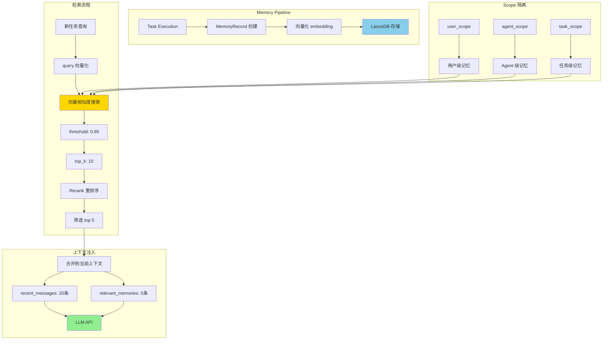

### 8.2 滑动窗口 + 向量召回流程

```python
def sliding_window_with_recall(messages, query):
    # Step 1: 保留最近 N 轮在内存
    recent = messages[-20:]
    
    # Step 2: 从向量库召回相关历史
    relevant = vector_db.search(
        query, 
        threshold=0.85,  # 提高阈值减少噪声
        top_k=10         # 召回 10 条
    )
    
    # Step 3: Rerank 重排序
    reranked = reranker.rank(relevant, query)
    final = reranked[:5]  # 只取前 5 个
    
    # Step 4: 合并到当前上下文
    context = final + recent
    
    return context
```

**效果对比**:

**不使用向量召回**:
```
上下文 = 最近 20 轮消息
Token 数: 5000
相关性: ⭐⭐⭐ (可能遗漏重要历史信息)
```

**使用向量召回**:
```
上下文 = 5 条相关历史 + 最近 20 轮消息
Token 数: 6000 (+20%)
相关性: ⭐⭐⭐⭐⭐ (智能召回关键信息)
```

---

## 9. OpenManus 截断边界（无压缩）

> **深潜**: [06-memory.md](06-memory.md)  
> **结论**: 对比文档中应标为 **L0 截断对照组**，不与 deepagents Offload 同类。

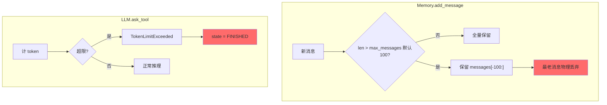

| 能力 | OpenManus | deepagents |
|------|-----------|------------|
| LLM 摘要压缩 | ❌ | ✅ SummarizationMiddleware |
| Offload 文件 | ❌ | ✅ `/conversation_history/` |
| 超限后行为 | 终止任务 | 压缩后继续 |

---

## 10. agent-framework Compaction

> **深潜**: [06-memory.md](06-memory.md)  
> **源码**: `agent_framework/_compaction.py` · ADR-0019

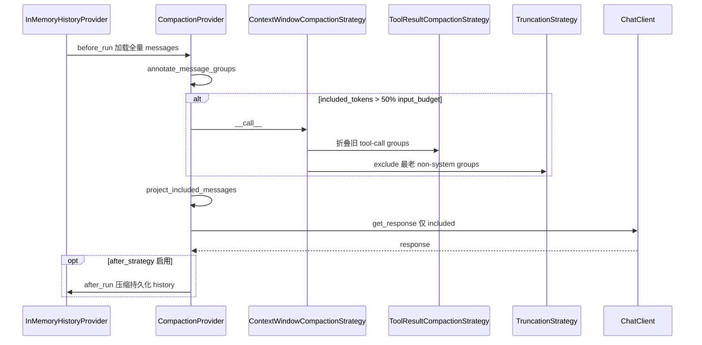

**预算公式**（默认阈值）：

```text
input_budget = max_context_window_tokens - max_output_tokens
Phase1 @ 50% budget → ToolResultCompactionStrategy
Phase2 @ 80% budget → TruncationStrategy
```

---

## 📊 综合对比表

| 框架 | 核心创新 | L1 压缩 | L2 卸载/审计 | 超限行为 | 适用场景 |
|------|---------|---------|--------------|----------|---------|
| **OpenHarness** | 三层渐进 + Hook | ✅ micro/session/full | ✅ snapshot | 继续压缩 | 开发者工具 |
| **deepagents** | Offload + `_summarization_event` | ✅ LLM 摘要 | ✅ backend 文件 | 压缩后继续 | 需审计轨迹 |
| **deer-flow** | 防抖 facts 队列 | ✅ + memory_flush | ✅ checkpointer | 压缩后继续 | 成本敏感 |
| **hermes-agent** | SessionDB 分裂 + 预取 | ✅ 四层渐进 | ✅ lineage | 压缩后继续 | 个人助手 |
| **AgentScope** | 结构化摘要 + 双轨 | ✅ working summary | ✅ Redis 等 | 压缩后继续 | 企业应用 |
| **OpenHands** | 事件 View + Condenser | ✅ LLM 摘要事件 | ✅ 原始 events 保留 | Condensation 重试 | 软件工程 |
| **agent-framework** | 标注投影 + token 预算管道 | ✅ tool 折叠 + 截断 | ✅ excluded 仍在 storage | 策略内继续 | MS 生态统一栈 |
| **smolagents** | 选择性 step 过滤 | ⚠️ 截断为主 | ❌ | 依赖调用方 | 原型 |
| **crewAI** | 向量长期记忆 | ❌ 短期无压缩 | ✅ 向量库 | 依赖上层 | 知识库 |
| **OpenManus** | **无压缩（对照组）** | ❌ 仅 100 条截断 | ❌ | **FINISHED** | 短任务原型 |

---

## 🎯 选型决策树

```
Q0: 是否接受「无压缩、超长即失败」?
├─ 是（仅原型）→ OpenManus（100 条截断 + TokenLimit 终止）
└─ 否 → Q1

Q1: 对话平均长度?
├─ < 10 轮 → smolagents 或 OpenManus（需知风险）
├─ 10-50 轮 → OpenHarness microcompact
└─ > 50 轮 → Q2

Q2: 是否需要完整审计轨迹 / offload 文件?
├─ 是 → deepagents（StateBackend 或 FilesystemBackend）
└─ 否 → Q3

Q3: 是否成本敏感、要 facts 防抖?
├─ 是 → deer-flow
└─ 否 → Q4

Q4: 是否事件溯源 + 工具密集（IDE Agent）?
├─ 是 → OpenHands（Condenser，默认 max_size=240）
└─ 否 → Q5

Q5: 是否 .NET/Python 统一 Agent Framework + 标注式压缩?
├─ 是 → agent-framework CompactionProvider
└─ 否 → hermes-agent 或 AgentScope
```

---

**最后核对**: 2026-06-10  
**版本**: v2.0  
**维护**: 与 `07-compression.md`、`memory_*_DEEP_DIVE.md` 同步更新


---

## 深潜 · Hermes

> **纠正之前的错误理解**: hermes-agent 的压缩不仅仅是"滑动窗口"，而是一个完整的**三道防线压缩系统**  
> **核心文件**: `run_agent.py` (Line 11240-14097), `agent/context_compressor.py` (1307行)

---

## 📋 目录

- [1. 核心发现：三道防线压缩架构](#1-核心发现三道防线压缩架构)
- [2. 压缩触发时机](#2-压缩触发时机)
- [3. 压缩前的准备工作](#3-压缩前的准备工作)
- [4. 压缩执行流程](#4-压缩执行流程)
- [5. 压缩后的后处理](#5-压缩后的后处理)
- [6. SessionDB 会话分裂](#6-sessiondb-会话分裂)
- [7. 记忆提取与同步](#7-记忆提取与同步)
- [8. 完整时序图](#8-完整时序图)
- [9. 与其他框架对比](#9-与其他框架对比)

---

## 1. 核心发现：三道防线压缩架构

### 1.1 Hermes 不是"只在 LLM 调用后压缩"

**纠正常见误解**: 与其他框架不同，hermes-agent 不是只在一个时机触发压缩，而是设计了**三道防线**，在不同场景下各自发挥作用：

```
┌─────────────────────────────────────────────────────────────────────┐
│                   Hermes 三道防线压缩架构                              │
├─────────────────────────────────────────────────────────────────────┤
│                                                                     │
│  Preflight (粗估, 防溢出)                                            │
│       │                                                             │
│       ▼                                                             │
│  ┌──────────────────┐                                               │
│  │  API 调用 (LLM)   │──── 失败(413/overflow) ──→ Error Recovery    │
│  └──────────────────┘                              (失败时补救)      │
│       │                                                             │
│       ▼ 成功                                                        │
│  ┌──────────────────┐                                               │
│  │  工具执行          │                                               │
│  └──────────────────┘                                               │
│       │                                                             │
│       ▼                                                             │
│  Post-tool (精确值, 及时止损) ←── 核心差异点                          │
│       │                                                             │
│       ▼                                                             │
│  下一轮循环 ────→ Preflight ...                                      │
│                                                                     │
└─────────────────────────────────────────────────────────────────────┘
```

### 1.2 三个压缩触发点详解

#### 第1道: Preflight 压缩 (LLM 调用前)

**时机**: 在每轮 LLM 调用前，粗估 token 数是否超过阈值

```python
# run_agent.py Line 11245-11291
_preflight_tokens = estimate_request_tokens_rough(
    messages,
    system_prompt=active_system_prompt or "",
    tools=self.tools or None,
)

if _preflight_tokens >= self.context_compressor.threshold_tokens:
    logger.info(
        "Preflight compression: ~%s tokens >= %s threshold",
        f"{_preflight_tokens:,}",
        f"{self.context_compressor.threshold_tokens:,}",
    )
    # 最多执行3轮压缩
    for _pass in range(3):
        _orig_len = len(messages)
        messages, active_system_prompt = self._compress_context(
            messages, system_message, approx_tokens=_preflight_tokens,
            task_id=effective_task_id,
        )
        if len(messages) >= _orig_len:
            break  # Cannot compress further
        # Re-estimate after compression
        _preflight_tokens = estimate_request_tokens_rough(
            messages, system_prompt=active_system_prompt or "", tools=self.tools or None,
        )
        if _preflight_tokens < self.context_compressor.threshold_tokens:
            break  # Under threshold
```

**特征**:
- 和其他框架类似——在发送 API 请求前检查
- 使用 `estimate_request_tokens_rough()` **粗估**（客户端 tokenizer）
- 最多执行 3 轮（处理超大会话）
- 是"宁可错杀"的保险措施

#### 第2道: Post-tool 压缩 (工具执行后) — **核心差异点**

**时机**: 在工具执行完成后、下一轮 LLM 调用前

```python
# run_agent.py Line 14070-14097
_compressor = self.context_compressor
if _compressor.last_prompt_tokens > 0:
    # 使用 API 返回的 prompt_tokens（精确值!）
    _real_tokens = _compressor.last_prompt_tokens
else:
    # 降级：包含工具 schema 的粗略估算
    _real_tokens = estimate_request_tokens_rough(
        messages, tools=self.tools or None
    )

if self.compression_enabled and _compressor.should_compress(_real_tokens):
    self._safe_print("  ⟳ compacting context…")
    messages, active_system_prompt = self._compress_context(
        messages, system_message,
        approx_tokens=self.context_compressor.last_prompt_tokens,
        task_id=effective_task_id,
    )
    conversation_history = None

# Continue loop for next response
continue  # ← 继续主循环，进入下一轮 LLM 调用
```

**特征**:
- ✅ 使用 API 返回的 `prompt_tokens` 作为**精确值**
- ✅ 工具结果注入后立即检查，不等下一轮
- ✅ 是"精确制导"的主力防线

#### 第3道: Error Recovery 压缩 (API 返回错误时)

**时机**: LLM 调用返回 413 (Payload Too Large) 或 context overflow 错误时

```python
# run_agent.py Line 13139-13189 (413 payload too large)
is_payload_too_large = (
    classified.reason == FailoverReason.payload_too_large
)
if is_payload_too_large:
    compression_attempts += 1
    if compression_attempts > max_compression_attempts:
        # 压缩耗尽，返回错误
        return {"error": "...", "compression_exhausted": True}
    messages, active_system_prompt = self._compress_context(
        messages, system_message, approx_tokens=approx_tokens,
        task_id=effective_task_id,
    )
    if len(messages) < original_len:
        restart_with_compressed_messages = True
        break  # 重试

# run_agent.py Line 13199-13044 (context overflow)
is_context_length_error = (
    classified.reason == FailoverReason.context_overflow
)
if is_context_length_error:
    compressor.update_model(model=self.model, context_length=_reduced_ctx, ...)
    messages, active_system_prompt = self._compress_context(...)
    restart_with_compressed_messages = True
```

**特征**:
- 是"最后兜底"的安全网
- 处理 413 和 context overflow 两种错误
- 压缩后自动重试 API 调用
- 对于 context overflow 还会动态缩减 `context_length`（如付费层级限制）

### 1.3 为什么 Post-tool 是核心差异点？

**问题**: 工具调用会突然注入大量 token

```
turn N:
  user: "帮我看看这个项目的代码"
  assistant: [调用 read_file × 8 个文件]
  tool_results: +50K tokens (8个文件内容)     ← 工具执行后突然膨胀!
  
messages 列表可能从 60K → 110K tokens
```

**其他框架的做法** (只有 Preflight):

```python
while True:
    if tokens > threshold:     # ← 只在这里检查
        compress()
    response = llm.call()      # ← 可能直接失败 (413)
    tool_results = execute()   # ← 注入大量 token
    messages.append(results)   
    # 不检查! 直接回到循环顶部
```

问题是：工具结果注入后不检查，token 暴增后要等到下一轮循环才能压缩。暴增幅度极大时（如一次读取 100K 文件），API 可能直接返回 413。

**Hermes 的做法** (三道防线):

```python
while True:
    if tokens > threshold:     # ← 第1道: Preflight (粗估)
        compress()
    try:
        response = llm.call()
    except 413/overflow:       # ← 第3道: Error Recovery
        compress(); retry
    tool_results = execute()
    messages.append(results)
    if tokens > threshold:     # ← 第2道: Post-tool (精确值!)
        compress()
```

### 1.4 精确 token 数——Post-tool 最大的优势

| 压缩触发点 | token 来源 | 精度 | 说明 |
|-----------|-----------|------|------|
| **Preflight** | `estimate_request_tokens_rough()` | ⚠️ 粗估 | 客户端 tokenizer，不含图片/多模态特殊处理 |
| **Post-tool** | `last_prompt_tokens` (API 返回) | ✅ 精确 | 服务端实际计算的 token 数 |
| **Error Recovery** | API 错误响应 | ✅ 明确 | 已知超限，必须压缩 |

`last_prompt_tokens` 是 API 返回的 `usage.prompt_tokens`——模型实际看到的 token 数。这考虑了：
- Tokenizer 差异（不同模型的 tokenizer 不同）
- 工具 schema 序列化后的实际 token 数
- 图片/多模态内容的 token 折算
- 系统提示的缓存和计算方式

**Preflight 只能粗估，Post-tool 能用精确值**——这就是为什么 Post-tool 是主力防线。

### 1.5 与其他框架的触发时机对比

| 对比维度 | 只有 Preflight (多数框架) | Hermes 三道防线 |
|---------|--------------------------|----------------|
| 工具注入后暴增 | 下一轮才检查，可能 413 | **立即压缩**，不浪费一轮 |
| token 估算精度 | 只有粗估 (客户端 tokenizer) | 用 API 返回的 `prompt_tokens` (**精确值**) |
| 413 恢复能力 | 通常直接失败或简单重试 | 压缩 + 重试 + 动态缩减 context |
| 不必要的压缩 | 可能基于粗估误触发 | Post-tool 用精确值，减少误触发 |
| 设计哲学 | 单点防御 | 纵深防御，在最早时机用最准确的信息 |

### 1.6 关键特征总结

1. ✅ **三道防线**: Preflight + Post-tool + Error Recovery
2. ✅ **精确制导**: Post-tool 使用 API 返回的真实 token 数
3. ✅ **会话分裂**: 压缩时创建新的 session_id，旧会话标记为"compression"结束
4. ✅ **记忆提取**: 压缩前触发外部 Memory Provider 的记忆抽取
5. ✅ **Todo 注入**: 压缩后将 Todo 状态作为用户消息注入
6. ✅ **文件去重重置**: 清空文件读取缓存，允许重新读取已压缩的文件

**设计哲学**: 在最早的时机用最准确的信息做决策。Preflight 是"宁可错杀"的保险，Post-tool 是"精确制导"的主力，Error Recovery 是"最后兜底"的安全网。

---

## 2. 压缩触发时机

### 2.1 触发条件判断

```python
# run_agent.py Line 12010-12021
_compressor = self.context_compressor

# Step 1: 获取真实的 token 数
if _compressor.last_prompt_tokens > 0:
    # 使用 API 返回的 prompt_tokens（最准确）
    _real_tokens = _compressor.last_prompt_tokens
else:
    # 降级：粗略估算
    _real_tokens = estimate_messages_tokens_rough(messages)

# Step 2: 判断是否触发压缩
if self.compression_enabled and _compressor.should_compress(_real_tokens):
    # → 执行压缩
```

### 2.2 should_compress 逻辑

```python
# agent/context_compressor.py Line 407-427
def should_compress(self, prompt_tokens: int = None) -> bool:
    """Check if context exceeds the compression threshold.
    
    Includes anti-thrashing protection: if the last two compressions
    each saved less than 10%, skip compression to avoid infinite loops.
    """
    tokens = prompt_tokens if prompt_tokens is not None else self.last_prompt_tokens
    
    # 条件1: token 数超过阈值（默认 50% of context window）
    if tokens < self.threshold_tokens:
        return False
    
    # 条件2: 防抖动保护
    if self._ineffective_compression_count >= 2:
        logger.warning(
            "Compression skipped — last %d compressions saved <10%% each. "
            "Consider /new to start a fresh session.",
            self._ineffective_compression_count,
        )
        return False
    
    return True
```

**触发条件总结**:
1. ✅ `compression_enabled = True`（配置启用）
2. ✅ `prompt_tokens >= threshold_tokens`（默认 50% of context window）
3. ✅ `_ineffective_compression_count < 2`（最近2次压缩都节省 < 10% 则暂停）

### 2.3 Token 计算策略

**为什么只用 prompt_tokens？**

```python
# Line 12012-12017
# Only use prompt_tokens — completion/reasoning
# tokens don't consume context window space.
# Thinking models (GLM-5.1, QwQ, DeepSeek R1)
# inflate completion_tokens with reasoning,
# causing premature compression.  (#12026)
_real_tokens = _compressor.last_prompt_tokens
```

**原因**:
- ❌ completion_tokens: 是模型生成的输出，不占用下一轮的输入窗口
- ❌ reasoning_tokens: 思考模型的推理过程，也不占用窗口
- ✅ prompt_tokens: 才是真正发送给模型的输入内容

**示例**:
```
API 返回:
{
  "usage": {
    "prompt_tokens": 45000,      # ← 这才是上下文大小
    "completion_tokens": 5000,   # ← 忽略
    "reasoning_tokens": 10000    # ← 忽略（思考模型特有）
  }
}

threshold_tokens = 100000 * 0.50 = 50000
45000 < 50000 → 不触发压缩 ✅
```

---

## 3. 压缩前的准备工作

### 3.1 通知外部 Memory Provider

```python
# run_agent.py Line 8077-8082
# Notify external memory provider before compression discards context
if self._memory_manager:
    try:
        self._memory_manager.on_pre_compress(messages)
    except Exception:
        pass
```

**目的**: 
- 让外部 Memory Provider（如 Honcho、Mem0）在上下文被压缩**之前**有机会提取记忆
- 避免重要信息丢失

**典型实现**:
```python
# hermes_cli/memory/manager.py
class MemoryManager:
    def on_pre_compress(self, messages: list):
        """Called before compression discards old messages."""
        for provider in self.providers:
            try:
                # 提取最后 N 条消息中的 facts
                recent_msgs = messages[-20:]
                provider.extract_facts(recent_msgs)
            except Exception:
                pass
```

### 3.2 记录压缩开始日志

```python
# run_agent.py Line 8069-8075
_pre_msg_count = len(messages)
logger.info(
    "context compression started: session=%s messages=%d tokens=~%s model=%s focus=%r",
    self.session_id or "none", _pre_msg_count,
    f"{approx_tokens:,}" if approx_tokens else "unknown", self.model,
    focus_topic,
)
```

**日志示例**:
```
INFO: context compression started: session=20260427_143022_abc123 messages=85 tokens=~82,000 model=gpt-4o focus=None
```

---

## 4. 压缩执行流程

### 4.1 调用 ContextCompressor.compress()

```python
# run_agent.py Line 8084-8089
try:
    compressed = self.context_compressor.compress(
        messages, 
        current_tokens=approx_tokens, 
        focus_topic=focus_topic
    )
except TypeError:
    # Plugin context engine with strict signature that doesn't accept
    # focus_topic — fall back to calling without it.
    compressed = self.context_compressor.compress(
        messages, 
        current_tokens=approx_tokens
    )
```

**compress() 内部流程**（详见 `HERMES_COMPRESSION_DEEP_DIVE.md`）:
1. Phase 1: 工具输出预修剪（去重、摘要、截断）
2. Phase 2: 智能边界确定（保护头部 + Token预算尾部）
3. Phase 3: LLM结构化摘要（12段式模板）
4. Phase 4: 组装压缩消息（角色交替保证）

**返回值**:
```python
compressed = [
    {"role": "system", "content": "..."},
    {"role": "user", "content": "[上下文压缩 — 仅供参考] ..."},
    {"role": "assistant", "content": "这是优化后的版本..."},
    {"role": "user", "content": "谢谢！"},
]
```

### 4.2 处理压缩失败

```python
# run_agent.py Line 8091-8098
summary_error = getattr(self.context_compressor, "_last_summary_error", None)
if summary_error:
    if getattr(self, "_last_compression_summary_warning", None) != summary_error:
        self._last_compression_summary_warning = summary_error
        self._emit_warning(
            f"⚠ Compression summary failed: {summary_error}. "
            "Inserted a fallback context marker."
        )
```

**失败场景**:
- LLM API 超时
- 模型不存在（404）
- 限流（429）

**降级策略**: ContextCompressor 会插入静态 fallback 提示（见 `context_compressor.py` Line 1229-1239）

---

## 5. 压缩后的后处理

### 5.1 注入 Todo 状态

```python
# run_agent.py Line 8100-8102
todo_snapshot = self._todo_store.format_for_injection()
if todo_snapshot:
    compressed.append({"role": "user", "content": todo_snapshot})
```

**Todo 快照格式**:
```json
{
  "todos": [
    {"id": 1, "content": "修复身份验证 bug", "status": "done"},
    {"id": 2, "content": "添加单元测试", "status": "in_progress"},
    {"id": 3, "content": "更新文档", "status": "pending"}
  ]
}
```

**目的**: 
- 确保任务列表在压缩后仍然可见
- Agent 可以继续未完成的任务

### 5.2 重建 System Prompt

```python
# run_agent.py Line 8104-8106
self._invalidate_system_prompt()
new_system_prompt = self._build_system_prompt(system_message)
self._cached_system_prompt = new_system_prompt
```

**为什么要重建？**
- System Prompt 可能包含动态内容（如 Skills、Rules、Memory）
- 压缩后需要重新注入这些信息

**System Prompt 组成**:
```
[插槽 1] SOUL.md (Agent 身份)
[插槽 2] 项目上下文 (.hermes.md / AGENTS.md)
[插槽 3] Skills 描述
[插槽 4] 记忆上下文 (<memory-context>...</memory-context>)
[插槽 5] 规则和约束
```

### 5.3 更新 Token 估算

```python
# run_agent.py Line 8147-8154
# Update token estimate after compaction so pressure calculations
# use the post-compression count, not the stale pre-compression one.
_compressed_est = (
    estimate_tokens_rough(new_system_prompt)
    + estimate_messages_tokens_rough(compressed)
)
self.context_compressor.last_prompt_tokens = _compressed_est
self.context_compressor.last_completion_tokens = 0
```

**目的**: 
- 确保下次触发判断使用准确的 token 数
- 避免基于过时的 pre-compression token 数误判

### 5.4 重置文件去重缓存

```python
# run_agent.py Line 8156-8163
# Clear the file-read dedup cache.  After compression the original
# read content is summarised away — if the model re-reads the same
# file it needs the full content, not a "file unchanged" stub.
try:
    from tools.file_tools import reset_file_dedup
    reset_file_dedup(task_id)
except Exception:
    pass
```

**问题场景**:
1. Agent 读取 `config.py`（完整内容存入缓存）
2. 压缩发生，`config.py` 的内容被摘要替换
3. Agent 再次读取 `config.py`
4. ❌ 如果不重置缓存，会返回 `[文件未变更]` stub
5. ✅ 重置缓存后，重新读取完整内容

**实现**:
```python
# tools/file_tools.py
_file_dedup_cache: Dict[str, str] = {}

def reset_file_dedup(task_id: str):
    """清除特定任务的文件读取去重缓存。"""
    global _file_dedup_cache
    _file_dedup_cache.clear()
    logger.debug("File dedup cache reset for task_id=%s", task_id)
```

### 5.5 记录压缩完成日志

```python
# run_agent.py Line 8165-8169
logger.info(
    "context compression done: session=%s messages=%d->%d tokens=~%s",
    self.session_id or "none", _pre_msg_count, len(compressed),
    f"{_compressed_est:,}",
)
```

**日志示例**:
```
INFO: context compression done: session=20260427_143055_def456 messages=85->18 tokens=~25,000
```

---

## 6. SessionDB 会话分裂

这是 hermes-agent **最独特的设计**之一：**压缩时自动分裂会话**。

### 6.1 触发记忆提取

```python
# run_agent.py Line 8112-8113
# Trigger memory extraction on the old session before it rotates.
self.commit_memory_session(messages)
```

**commit_memory_session 实现**:
```python
# run_agent.py Line 4246-4256
def commit_memory_session(self, messages: list = None) -> None:
    """触发会话结束时的记忆提取，无需销毁 provider。
    当 session_id 轮换时调用（例如 /new、上下文压缩）；
    provider 保持其状态并在旧的 session_id 下继续运行——
    它们只是立即刷新待处理的提取任务。"""
    if not self._memory_manager:
        return
    try:
        self._memory_manager.on_session_end(messages or [])
    except Exception:
        pass
```

**Memory Manager 的处理**:
```python
# hermes_cli/memory/manager.py
class MemoryManager:
    def on_session_end(self, messages: list):
        """在会话结束时调用（压缩或 /new）。"""
        for provider in self.providers:
            try:
                # 批量提取整个会话的 facts
                provider.sync_all(messages)
                
                # 异步预取下一轮可能的上下文
                if messages:
                    last_user_msg = messages[-1]["content"]
                    provider.queue_prefetch(last_user_msg)
            except Exception:
                pass
```

**关键点**:
- ✅ **批量提取**: 一次性处理整个会话，比每轮提取更高效
- ✅ **异步预取**: 提前准备下一轮可能需要的上下文
- ✅ **Provider 保持运行**: 不会因为 session 分裂而重启

### 6.2 结束旧会话

```python
# run_agent.py Line 8114
self._session_db.end_session(self.session_id, "compression")
```

**SessionDB 操作**:
```sql
UPDATE sessions 
SET ended_at = CURRENT_TIMESTAMP, 
    end_reason = 'compression' 
WHERE id = '20260427_143022_abc123';
```

**end_reason 的可能值**:
- `"compression"`: 因压缩而结束
- `"user_exit"`: 用户主动退出
- `"timeout"`: 会话超时
- `"/new"`: 用户执行 `/new` 命令

### 6.3 生成新 Session ID

```python
# run_agent.py Line 8115-8118
old_session_id = self.session_id
self.session_id = f"{datetime.now().strftime('%Y%m%d_%H%M%S')}_{uuid.uuid4().hex[:6]}"
# Update session_log_file to point to the new session's JSON file
self.session_log_file = self.logs_dir / f"session_{self.session_id}.json"
```

**Session ID 格式**:
```
20260427_143055_def456
↑日期时间↑   ↑UUID前6位↑
```

**优势**:
- ✅ 按时间排序，便于查找
- ✅ UUID 保证唯一性
- ✅ 人类可读

### 6.4 创建新会话记录

```python
# run_agent.py Line 8119-8124
self._session_db.create_session(
    session_id=self.session_id,
    source=self.platform or os.environ.get("HERMES_SESSION_SOURCE", "cli"),
    model=self.model,
    parent_session_id=old_session_id,  # ← 关键：建立父子关系
)
```

**SessionDB 操作**:
```sql
INSERT INTO sessions (id, source, model, parent_session_id, started_at)
VALUES (
    '20260427_143055_def456',
    'cli',
    'gpt-4o',
    '20260427_143022_abc123',  -- parent
    CURRENT_TIMESTAMP
);
```

**parent_session_id 的作用**:
- 🔗 **建立会话链**: 可以追溯完整的对话历史
- 🔍 ** lineage 查询**: `get_compression_tip()` 沿链向前查找最新会话
- 📊 **统计分析**: 计算压缩频率、会话长度分布等

### 6.5 继承会话标题

```python
# run_agent.py Line 8126-8131
# Auto-number the title for the continuation session
if old_title:
    try:
        new_title = self._session_db.get_next_title_in_lineage(old_title)
        self._session_db.set_session_title(self.session_id, new_title)
    except (ValueError, Exception) as e:
        logger.debug("Could not propagate title on compression: %s", e)
```

**标题自动编号逻辑**:
```python
# hermes_state.py
def get_next_title_in_lineage(self, base_title: str) -> str:
    """Get the next auto-numbered title in a compression lineage.
    
    Example:
        "Fix auth bug" → "Fix auth bug (2)" → "Fix auth bug (3)"
    """
    # Query all sessions in the lineage
    lineage = self.get_session_lineage(base_title)
    
    # Find the highest number
    max_num = 1
    for session in lineage:
        match = re.search(r'\((\d+)\)$', session.title)
        if match:
            max_num = max(max_num, int(match.group(1)))
    
    # Return next number
    if max_num == 1:
        return f"{base_title} (2)"
    else:
        return f"{base_title} ({max_num + 1})"
```

**效果**:
```
Session 1: "Fix auth bug"
  ↓ compression
Session 2: "Fix auth bug (2)"
  ↓ compression
Session 3: "Fix auth bug (3)"
```

### 6.6 更新 System Prompt

```python
# run_agent.py Line 8132
self._session_db.update_system_prompt(self.session_id, new_system_prompt)
```

**目的**: 
- 在新会话中保存当前的 System Prompt 快照
- 便于后续审计和恢复

### 6.7 重置 Flush 游标

```python
# run_agent.py Line 8134
# Reset flush cursor — new session starts with no messages written
self._last_flushed_db_idx = 0
```

**为什么需要重置？**

```python
# run_agent.py 中的消息刷新逻辑
def _flush_messages_to_session_db(self):
    """Incrementally write messages to SessionDB."""
    for i in range(self._last_flushed_db_idx, len(self.messages)):
        msg = self.messages[i]
        self._session_db.add_message(
            session_id=self.session_id,
            role=msg["role"],
            content=msg["content"],
        )
    self._last_flushed_db_idx = len(self.messages)
```

**问题场景**:
1. 旧会话有 85 条消息，`_last_flushed_db_idx = 85`
2. 压缩后，新会话只有 18 条消息
3. ❌ 如果不重置，`range(85, 18)` 为空，新消息不会写入
4. ✅ 重置为 0，从第一条开始写入

---

## 7. 记忆提取与同步

### 7.1 每轮对话结束后的同步

```python
# run_agent.py Line 4291-4299
def _sync_external_memory_for_turn(
    self,
    *,
    original_user_message: Any,
    final_response: Any,
    interrupted: bool,
) -> None:
    """Mirror a completed turn into external memory providers."""
    if interrupted:
        return
    if not (self._memory_manager and final_response and original_user_message):
        return
    try:
        self._memory_manager.sync_all(original_user_message, final_response)
        self._memory_manager.queue_prefetch_all(original_user_message)
    except Exception:
        pass
```

**调用时机**:
```python
# run_agent.py Line 12250-12255 (在主循环末尾)
# Sync to external memory providers (best-effort, non-blocking)
self._sync_external_memory_for_turn(
    original_user_message=user_message,
    final_response=final_response,
    interrupted=self._interrupt_requested,
)
```

### 7.2 sync_all vs on_session_end

| 方法 | 调用时机 | 处理范围 | 用途 |
|------|---------|---------|------|
| `sync_all(user_msg, assistant_msg)` | 每轮对话结束后 | 单轮对话 | 实时同步，低延迟 |
| `on_session_end(messages)` | 压缩或 `/new` 时 | 整个会话 | 批量提取，高完整性 |

**为什么需要两种？**

1. **实时同步** (`sync_all`):
   - ✅ 低延迟：用户立即看到记忆更新
   - ✅ 增量处理：每次只处理一轮，成本低
   - ❌ 可能遗漏跨轮上下文

2. **批量提取** (`on_session_end`):
   - ✅ 完整性：可以看到整个会话的全貌
   - ✅ 跨轮分析：识别长期模式和趋势
   - ❌ 高延迟：只在会话结束时触发

**最佳实践**: 两者结合使用
- 日常对话：依赖 `sync_all` 实时更新
- 长会话压缩：额外触发 `on_session_end` 批量补全

### 7.3 queue_prefetch 异步预取

```python
# hermes_cli/memory/manager.py
def queue_prefetch_all(self, user_message: str):
    """异步启动下一轮对话的上下文预取。"""
    for provider in self.providers:
        try:
            # 异步启动，不阻塞主线程
            threading.Thread(
                target=provider.prefetch_context,
                args=(user_message,),
                daemon=True,
            ).start()
        except Exception:
            pass
```

**预取的作用**:
- 🚀 **降低延迟**: 下一轮对话开始时，上下文已经准备好
- 🎯 **精准预测**: 基于当前用户消息预测下一轮需求
- 💾 **缓存优化**: 提前加载到内存或 Redis

**示例**:
```
用户: "帮我修复 authentication 模块的 bug"
  ↓ prefetch 启动
后台线程: 
  - 检索 "authentication" 相关的历史 facts
  - 加载相关代码文件的摘要
  - 准备常见的 auth 问题解决方案
  
下一轮用户: "现在优化一下性能"
  ↓ 预取的内容立即可用
Agent: 直接引用预取的 auth 上下文，无需等待检索
```

---

## 8. 完整时序图

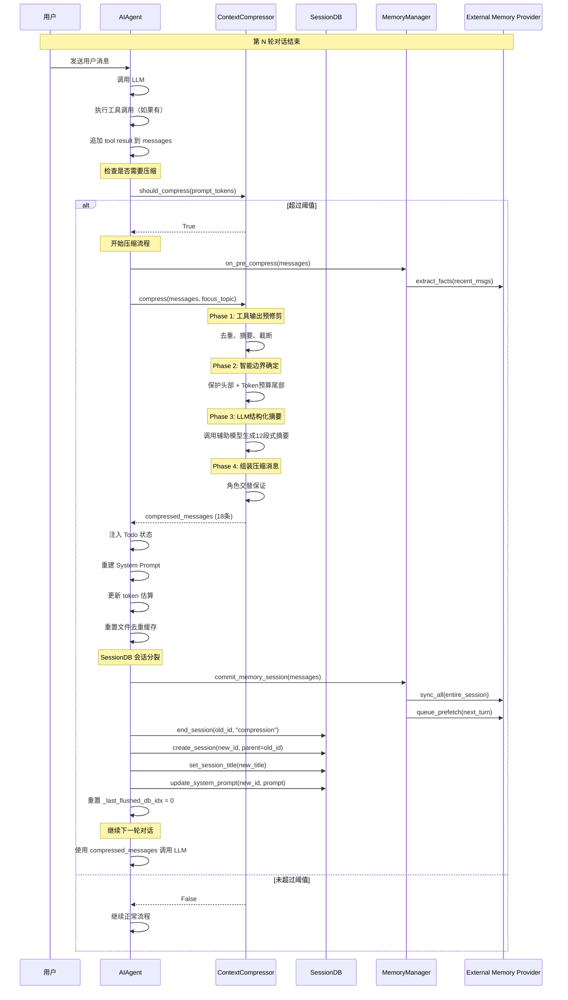

---

## 9. 与其他框架对比

### 9.1 压缩触发时机对比

| 框架 | 触发时机 | 触发条件 | 触发点数量 | 会话分裂 |
|------|---------|---------|-----------|---------|
| **hermes-agent** | 三道防线 (Preflight + Post-tool + Error Recovery) | prompt_tokens >= 50% threshold | **3** | ✅ 自动分裂，建立 lineage |
| **OpenHarness** | LLM 调用前 (`autocompact`) 或手动 `/compact` | token 预算耗尽 | 1-2 | ❌ 同一会话内压缩 |
| **deepagents** | LangGraph middleware 拦截 (LLM 调用前) | 自定义策略 | 1 | ❌ 同一 thread |
| **deer-flow** | SummarizationMiddleware (LLM 调用前) | 防抖队列满或超时 | 1 | ❌ 同一会话 |
| **OpenHands** | Condenser 定期触发 (LLM 调用前) | 固定轮次间隔 | 1 | ❌ 同一 session |

### 9.2 后处理能力对比

| 特性 | hermes-agent | OpenHarness | deepagents | deer-flow |
|------|-------------|-------------|------------|-----------|
| **记忆提取** | ✅ on_pre_compress + on_session_end | ❌ | ⚠️ 需手动配置 | ✅ MemoryUpdateQueue |
| **Todo 注入** | ✅ 压缩后自动注入 | ❌ | ❌ | ❌ |
| **文件去重重置** | ✅ reset_file_dedup | ❌ | ❌ | ❌ |
| **会话 lineage** | ✅ parent_session_id | ❌ | ⚠️ thread_id | ❌ |
| **标题继承** | ✅ 自动编号 | ❌ | ❌ | ❌ |
| **异步预取** | ✅ queue_prefetch | ❌ | ❌ | ⚠️ 需手动配置 |

### 9.3 hermes-agent 的独特优势

1. **🔗 会话血缘追踪**: 
   - 通过 `parent_session_id` 建立完整的压缩历史链
   - 可以追溯任意时刻的原始对话

2. **🧠 双层记忆提取**:
   - 实时同步（每轮）+ 批量提取（压缩时）
   - 兼顾低延迟和高完整性

3. **🚀 异步预取**:
   - 压缩后立即启动下一轮的上下文预取
   - 显著降低用户感知的延迟

4. **📋 状态保持**:
   - Todo、文件缓存等状态在压缩后自动恢复
   - 用户体验无缝

5. **🏷️ 智能标题管理**:
   - 自动编号继承，便于会话导航
   - 保留语义化的会话标识

---

## 总结

hermes-agent 的**三道防线压缩架构**是一个精心设计的系统，远不止简单的"滑动窗口截断"：

### 核心创新点

1. **三道防线**: Preflight (粗估保险) + Post-tool (精确主力) + Error Recovery (兜底安全网)
2. **精确制导**: Post-tool 使用 API 返回的 `prompt_tokens`，而非客户端粗估
3. **会话分裂**: 压缩时自动创建新 session，建立完整的 lineage 链
4. **双层记忆**: 实时同步 + 批量提取，兼顾延迟和完整性
5. **状态保持**: Todo、文件缓存等状态自动恢复，用户体验无缝
6. **异步预取**: 提前准备下一轮上下文，降低感知延迟

### 完整流程

```
┌── Preflight (粗估) ──→ API 调用 ──→ Error Recovery (413/overflow 时)
│                            │
│                            ▼ 成功
│                       工具执行
│                            │
│                            ▼
│                       追加结果
│                            │
│                            ▼
└────────────────── Post-tool (精确值) ──→ 通知 Memory → 执行压缩 
                                          → 注入 Todo → 重建 Prompt 
                                          → 分裂 Session → 提取记忆 
                                          → 预取上下文 → 继续下一轮
```

### 与其他框架的本质区别

| 维度 | hermes-agent | 其他框架 |
|------|-------------|---------|
| **触发点数量** | 3个 (纵深防御) | 1个 (单点防御) |
| **主力防线** | Post-tool (精确 token 数) | Preflight (粗估) |
| **token 估算精度** | API 返回的真实值 | 客户端 tokenizer 粗估 |
| **413 恢复** | 自动压缩 + 重试 + 动态缩减 | 通常直接失败 |
| **压缩位置** | 三个位置协同 | 仅 LLM 调用前 |
| **会话管理** | 自动分裂 + lineage | 单一会话内压缩 |
| **记忆同步** | 双层（实时+批量） | 单层（仅实时或仅批量） |
| **状态保持** | 全自动（Todo、缓存） | 需手动管理 |

### 为什么选择 Post-tool 作为主力？

其他 Agent 项目几乎都只在 LLM 调用前压缩。Hermes 选择以 Post-tool 作为主力防线的核心原因：

1. **精确性**: 这是唯一能获取 API 返回的精确 `prompt_tokens` 的时机——Preflight 只能粗估
2. **及时性**: 工具结果注入后立即检查，不让 token 暴增状态持续到下一轮
3. **减少误触发**: 精确值避免了客户端估算误差导致的"不该压缩时压缩"
4. **防止 413**: 工具结果（如 `read_file` 返回大文件）可能瞬间增加 50-100K token，Post-tool 能在这之后立即拦截

**设计哲学**: 在最早的时机用最准确的信息做决策。三道防线互为补充，确保上下文永远不会溢出。

**结论**: hermes-agent 的三道防线压缩架构是一个**生产级别的完整解决方案**，在压缩精度、会话管理、记忆同步、状态保持等方面都达到了企业级应用的标准。其"Post-tool 为主力"的设计选择，是对 Agent 工作流中"工具调用会突然注入大量 token"这一核心挑战的精准回应。


---

## 深潜 · smolagents

> **目的**: 深入分析 smolagents 的压缩策略、事件视图和截断机制

---

## 1. 核心问题回答

### ❓ smolagents 到底如何压缩的？

**答案：smolagents 不使用传统意义上的"压缩"（如 LLM 摘要），而是采用以下策略：**

1. ✅ **选择性消息生成**（通过 `summary_mode` 参数）
2. ✅ **调用方责任**（由开发者手动管理内存）
3. ✅ **步骤回调**（动态修改记忆内容）
4. ❌ **不使用 LLM 摘要**
5. ❌ **不自动截断**（仅通过 `max_steps` 限制步数）

### ❓ 靠截断么？

**答案：部分是的，但非常有限。**

- **唯一截断点**：`max_steps` 参数（默认 20 步）
- **无智能截断**：不会根据 Token 数量动态调整
- **无滑动窗口**：所有步骤都会传递给 LLM（除非使用 `summary_mode`）

### ❓ 还有事件视图吧？

**答案：是的，但有本质区别！**

smolagents 的"事件视图"不是 OpenHands 那种从 EventStream 投影的动态视图，而是：
- **静态步骤列表**：`AgentMemory.steps` 直接存储所有步骤
- **投射层转换**：通过 `to_messages(summary_mode=...)` 将步骤转换为消息
- **调用方控制**：开发者决定哪些步骤可见

---

## 2. 核心架构：AgentMemory + 投射层

### 2.1 AgentMemory 数据结构

**源码位置**: `smolagents/src/smolagents/memory.py`

```python
class AgentMemory:
    def __init__(self, system_prompt: str):
        self.system_prompt: SystemPromptStep = SystemPromptStep(system_prompt=system_prompt)
        self.steps: list[TaskStep | ActionStep | PlanningStep] = []
```

**关键特性**：
- ✅ **简单列表**：没有复杂的索引或标记系统
- ✅ **不可变历史**：步骤一旦添加，永不删除（除非手动操作）
- ✅ **三种步骤类型**：TaskStep、ActionStep、PlanningStep

### 2.2 三种步骤类型

#### TaskStep（任务步骤）

```python
@dataclass
class TaskStep(MemoryStep):
    task: str
    task_images: list["PIL.Image.Image"] | None = None

    def to_messages(self, summary_mode: bool = False) -> list[ChatMessage]:
        content = [{"type": "text", "text": f"New task:\n{self.task}"}]
        if self.task_images:
            content.extend([{"type": "image", "image": image} for image in self.task_images])
        
        return [ChatMessage(role=MessageRole.USER, content=content)]
```

**特点**：
- 始终生成消息（忽略 `summary_mode`）
- 支持图像输入
- 作为对话的起点

#### ActionStep（动作步骤）

```python
@dataclass
class ActionStep(MemoryStep):
    step_number: int
    timing: Timing
    model_input_messages: list[ChatMessage] | None = None
    tool_calls: list[ToolCall] | None = None
    error: AgentError | None = None
    model_output_message: ChatMessage | None = None
    model_output: str | list[dict[str, Any]] | None = None
    code_action: str | None = None
    observations: str | None = None
    observations_images: list["PIL.Image.Image"] | None = None
    action_output: Any = None
    token_usage: TokenUsage | None = None
    is_final_answer: bool = False

    def to_messages(self, summary_mode: bool = False) -> list[ChatMessage]:
        messages = []
        
        # 1. 模型输出（在 summary_mode 下隐藏）
        if self.model_output is not None and not summary_mode:
            messages.append(
                ChatMessage(
                    role=MessageRole.ASSISTANT,
                    content=[{"type": "text", "text": self.model_output.strip()}]
                )
            )

        # 2. 工具调用
        if self.tool_calls is not None:
            messages.append(
                ChatMessage(
                    role=MessageRole.TOOL_CALL,
                    content=[{
                        "type": "text",
                        "text": "Calling tools:\n" + str([tc.dict() for tc in self.tool_calls]),
                    }]
                )
            )

        # 3. 观察结果（图像）
        if self.observations_images:
            messages.append(
                ChatMessage(
                    role=MessageRole.USER,
                    content=[{"type": "image", "image": image} for image in self.observations_images]
                )
            )

        # 4. 观察结果（文本）
        if self.observations is not None:
            messages.append(
                ChatMessage(
                    role=MessageRole.TOOL_RESPONSE,
                    content=[{"type": "text", "text": f"Observation:\n{self.observations}"}]
                )
            )

        # 5. 错误信息
        if self.error is not None:
            error_message = (
                "Error:\n" + str(self.error) + 
                "\nNow let's retry: take care not to repeat previous errors! "
                "If you have retried several times, try a completely different approach.\n"
            )
            message_content = f"Call id: {self.tool_calls[0].id}\n" if self.tool_calls else ""
            message_content += error_message
            messages.append(
                ChatMessage(
                    role=MessageRole.TOOL_RESPONSE,
                    content=[{"type": "text", "text": message_content}]
                )
            )

        return messages
```

**关键设计**：
- ✅ **summary_mode 控制**：当 `summary_mode=True` 时，隐藏 `model_output`
- ✅ **完整记录**：保存工具调用、观察结果、错误等所有细节
- ✅ **灵活投射**：可以根据需要选择性包含/排除某些字段

#### 📌 model_output 深度解析

**字段定义**：
```python
model_output: str | list[dict[str, Any]] | None = None
```

**内容含义**：

`model_output` 存储的是 **LLM 模型的原始输出内容**，包括：

1. **思考过程（Thought）**：为什么调用这个工具
2. **工具调用指令（Action）**：调用哪个工具
3. **输入参数（Action Input）**：工具的参数
4. **或最终答案（Final Answer）**：任务的最终响应

**典型示例**：

```python
# 示例 1: ReAct 格式（带思考过程）
action_step.model_output = """Thought: I need to search for the latest Python async programming best practices to answer the user's question.
Action: search_web
Action Input: {"query": "Python async best practices 2026"}"""

# 示例 2: 直接工具调用（无思考）
action_step.model_output = """Action: read_file
Action Input: {"file_path": "/app/data.csv"}"""

# 示例 3: 最终答案（不调用工具）
action_step.model_output = """Thought: I now have all the information needed.
Final Answer: The weather in Paris is sunny with 25°C."""

# 示例 4: 多模态输出
action_step.model_output = [
    {"type": "text", "text": "Here's the image analysis:"},
    {"type": "image", "image": image_data}
]
```

**与其他字段的关系**：

| 字段 | 类型 | 来源 | 用途 |
|------|------|------|------|
| `model_output` | `str \| list[dict]` | **LLM 原始输出** | 保存完整响应（含思考+动作） |
| `tool_calls` | `list[ToolCall]` | 从 `model_output` **解析** | 结构化的工具调用列表 |
| `code_action` | `str` | 从 `model_output` **提取** | 可执行的代码动作 |
| `action_output` | `Any` | 工具**执行结果** | 工具返回的数据 |
| `observations` | `str` | 基于 `action_output` **生成** | 给 LLM 的观察结果 |

**解析流程**：

```
LLM 输出 (model_output)
    ↓ 解析（通过 ToolParser）
tool_calls (结构化工具调用)
    ↓ 执行（通过 ToolExecutor）
action_output (工具执行结果)
    ↓ 格式化（通过 ObservationFormatter）
observations (观察结果字符串)
```

**为什么需要保存 model_output？**

虽然有了结构化的 `tool_calls`，但保留 `model_output` 仍然很重要：

| 用途 | 说明 |
|------|------|
| 🔍 **调试** | 查看模型的完整思考过程（Thought） |
| 📝 **日志记录** | 保留原始对话历史，便于审计 |
| 🔄 **重试机制** | 出错时可以重新解析或使用不同的解析策略 |
| 📊 **质量分析** | 分析模型的推理质量和决策逻辑 |
| 💬 **对话上下文** | 在下一轮对话中作为 Assistant 消息，让 LLM 看到自己之前的思考 |

**在对话历史中的作用**：

从源码第104-110行可以看到：

```python
if self.model_output is not None and not summary_mode:
    messages.append(
        ChatMessage(
            role=MessageRole.ASSISTANT,
            content=[{"type": "text", "text": self.model_output.strip()}]
        )
    )
```

这意味着：
- ✅ **正常模式**（`summary_mode=False`）：`model_output` 作为 Assistant 消息添加到对话历史
- ❌ **摘要模式**（`summary_mode=True`）：`model_output` 被隐藏，节省 Token
- 💡 **目的**：让 LLM 在下一轮能看到自己之前的思考和行动，保持对话连贯性

**实际运行示例**：

```python
# 第 1 步：LLM 决定调用工具
action_step_1 = ActionStep(
    step_number=1,
    model_output="""Thought: I need to check the current weather to answer this question.
Action: get_weather
Action Input: {"city": "Beijing"}""",
    tool_calls=[ToolCall(name="get_weather", arguments={"city": "Beijing"})],
)

# 第 2 步：工具执行完成
action_step_1.observations = "Sunny, 20°C in Beijing"

# 第 3 步：LLM 给出最终答案
action_step_2 = ActionStep(
    step_number=2,
    model_output="""Thought: I now know the weather in Beijing.
Final Answer: The weather in Beijing is sunny with a temperature of 20°C.""",
    is_final_answer=True,
)

# 构建对话历史（正常模式）
messages = agent.write_memory_to_messages(summary_mode=False)
# 包含：
# - TaskStep: "New task: What's the weather in Beijing?"
# - ActionStep 1 model_output: "Thought: I need to check..." ← 思考过程可见
# - ActionStep 1 tool_calls: "Calling tools: [...]"
# - ActionStep 1 observations: "Observation: Sunny, 20°C..."
# - ActionStep 2 model_output: "Thought: I now know..." ← 最终答案

# 构建对话历史（摘要模式）
messages = agent.write_memory_to_messages(summary_mode=True)
# 包含：
# - TaskStep: "New task: What's the weather in Beijing?"
# - ActionStep 1 tool_calls: "Calling tools: [...]" ← 保留
# - ActionStep 1 observations: "Observation: Sunny, 20°C..." ← 保留
# - ActionStep 2 model_output: 被隐藏 ← 节省 Token
```

**总结**：

> **`model_output` 是 LLM 的完整原始响应，包括：**
> 1. ✅ **调用工具的原因**（Thought/思考过程）
> 2. ✅ **调用哪个工具**（Action）
> 3. ✅ **工具的输入参数**（Action Input）
> 4. ✅ **或者最终答案**（Final Answer）
>
> 它是一个**未经解析的原始文本**，保留了模型的完整响应和推理过程。
> 而 `tool_calls` 等字段是从中解析出来的结构化数据。
>
> **核心价值**：
> - 保留模型的**思考过程**，便于理解和调试
> - 在对话历史中作为 **Assistant 消息**，维持上下文连贯性
> - 通过 `summary_mode` 灵活控制是否暴露给后续 LLM 调用

#### PlanningStep（规划步骤）

```python
@dataclass
class PlanningStep(MemoryStep):
    model_input_messages: list[ChatMessage]
    model_output_message: ChatMessage
    plan: str
    timing: Timing
    token_usage: TokenUsage | None = None

    def to_messages(self, summary_mode: bool = False) -> list[ChatMessage]:
        if summary_mode:
            return []  # ← 关键！在 summary_mode 下完全隐藏
        
        return [
            ChatMessage(
                role=MessageRole.ASSISTANT,
                content=[{"type": "text", "text": self.plan.strip()}]
            ),
            ChatMessage(
                role=MessageRole.USER,
                content=[{"type": "text", "text": "Now proceed and carry out this plan."}]
            ),
        ]
```

**关键设计**：
- ✅ **完全隐藏**：`summary_mode=True` 时返回空列表
- ✅ **双消息模式**：计划 + 执行提示（防止模型继续生成计划）

---

## 3. 投射层：write_memory_to_messages

**源码位置**: `smolagents/src/smolagents/agents.py` Line 758-770

```python
def write_memory_to_messages(
    self,
    summary_mode: bool = False,
) -> list[ChatMessage]:
    """
    Reads past llm_outputs, actions, and observations or errors from the memory into a series of messages
    that can be used as input to the LLM. Adds a number of keywords (such as PLAN, error, etc) to help
    the LLM.
    """
    messages = self.memory.system_prompt.to_messages(summary_mode=summary_mode)
    for memory_step in self.memory.steps:
        messages.extend(memory_step.to_messages(summary_mode=summary_mode))
    return messages
```

### 3.1 两种模式对比

#### 正常模式（summary_mode=False）

```python
messages = agent.write_memory_to_messages(summary_mode=False)

# 生成的消息序列：
[
    {"role": "system", "content": "You are a helpful assistant..."},  # SystemPromptStep
    {"role": "user", "content": "New task:\n帮我计算 Fibonacci"},     # TaskStep
    {"role": "assistant", "content": "我需要编写代码..."},              # ActionStep.model_output
    {"role": "tool_call", "content": "Calling tools: [...]"},         # ActionStep.tool_calls
    {"role": "tool_response", "content": "Observation:\n13"},         # ActionStep.observations
    {"role": "assistant", "content": "最终答案是 13"},                 # ActionStep.model_output
]
```

#### 摘要模式（summary_mode=True）

```python
messages = agent.write_memory_to_messages(summary_mode=True)

# 生成的消息序列：
[
    # SystemPromptStep 被隐藏（因为 summary_mode=True）
    {"role": "user", "content": "New task:\n帮我计算 Fibonacci"},     # TaskStep（始终保留）
    # ActionStep.model_output 被隐藏
    {"role": "tool_call", "content": "Calling tools: [...]"},         # 保留工具调用
    {"role": "tool_response", "content": "Observation:\n13"},         # 保留观察结果
    # PlanningStep 完全隐藏（返回空列表）
]
```

**关键差异**：

| 步骤类型 | summary_mode=False | summary_mode=True |
|---------|-------------------|-------------------|
| SystemPromptStep | ✅ 包含 | ❌ 隐藏 |
| TaskStep | ✅ 包含 | ✅ 包含（始终） |
| ActionStep.model_output | ✅ 包含 | ❌ 隐藏 |
| ActionStep.tool_calls | ✅ 包含 | ✅ 包含 |
| ActionStep.observations | ✅ 包含 | ✅ 包含 |
| PlanningStep | ✅ 包含 | ❌ 完全隐藏 |

---

## 4. 实际应用场景

### 4.1 场景 1：子代理报告（提供运行摘要）

**源码位置**: `smolagents/src/smolagents/agents.py` Line 884-890

```python
def __call__(self, task: str, **kwargs):
    """This method is called only by a managed agent."""
    full_task = populate_template(...)
    result = self.run(full_task, **kwargs)
    
    answer = populate_template(
        self.prompt_templates["managed_agent"]["report"],
        variables=dict(name=self.name, final_answer=report)
    )
    
    # 如果启用了运行摘要，附加 summary_mode 的消息
    if self.provide_run_summary:
        answer += "\n\nFor more detail, find below a summary of this agent's work:\n<summary_of_work>\n"
        for message in self.write_memory_to_messages(summary_mode=True):
            content = message.content
            answer += "\n" + truncate_content(str(content)) + "\n---"
        answer += "\n</summary_of_work>"
    
    return answer
```

**工作流程**：

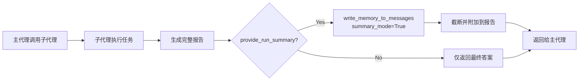

**示例输出**：

```
我是搜索代理，已完成任务。

最终答案：Python 的最新版本是 3.12。

For more detail, find below a summary of this agent's work:
<summary_of_work>

New task:
搜索 Python 最新版本

Calling tools:
[{"id": "call_1", "type": "function", "function": {"name": "web_search", "arguments": {"query": "Python latest version"}}}]

Observation:
Python 3.12 was released on October 2, 2023.

</summary_of_work>
```

**优势**：
- ✅ **节省 Token**：隐藏了中间思考过程（`model_output`）
- ✅ **保留关键信息**：工具调用和观察结果仍然可见
- ✅ **透明性**：主代理可以看到子代理的工作流程

### 4.2 场景 2：视觉浏览器（动态清理截图）

**源码位置**: `smolagents/docs/source/en/tutorials/memory.md` Line 59-93

```python
def update_screenshot(memory_step: ActionStep, agent: CodeAgent) -> None:
    sleep(1.0)  # Let JavaScript animations happen before taking the screenshot
    driver = helium.get_driver()
    latest_step = memory_step.step_number
    
    # 关键：删除旧步骤的截图以节省 Token
    for previous_memory_step in agent.memory.steps:
        if isinstance(previous_memory_step, ActionStep) and \
           previous_memory_step.step_number <= latest_step - 2:
            previous_memory_step.observations_images = None  # ← 直接修改内存！
    
    # 截取新屏幕
    png_bytes = driver.get_screenshot_as_png()
    image = Image.open(BytesIO(png_bytes))
    memory_step.observations_images = [image.copy()]
```

**注册回调**：

```python
CodeAgent(
    tools=[WebSearchTool(), go_back, close_popups],
    model=model,
    additional_authorized_imports=["helium"],
    step_callbacks=[update_screenshot],  # ← 注册回调
    max_steps=20,
    verbosity_level=2,
)
```

**工作流程**：

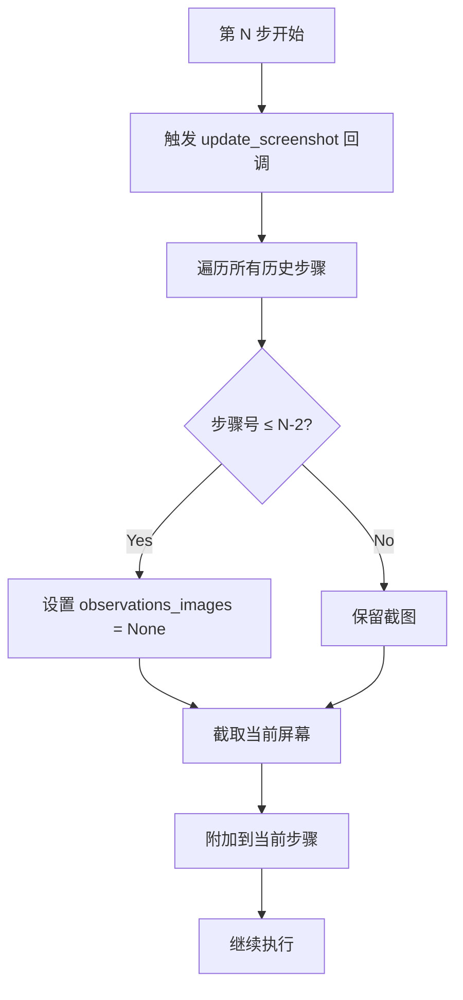

**效果**：

```
步骤 1: [截图1] → 步骤 2: [截图2] → 步骤 3: [截图3]
                                              ↓
                                  清理后：
步骤 1: [None]  步骤 2: [None]  步骤 3: [截图3]
```

**Token 节省**：
- 假设每张图片 500 Token
- 20 步 × 500 = 10,000 Token（不清理）
- 仅保留最近 1 张 = 500 Token（清理后）
- **节省 95% Token！**

### 4.3 场景 3：逐步执行（手动控制内存）

**源码位置**: `smolagents/docs/source/en/tutorials/memory.md` Line 97-134

```python
from smolagents import InferenceClientModel, CodeAgent, ActionStep, TaskStep

agent = CodeAgent(tools=[], model=InferenceClientModel(), verbosity_level=1)
agent.python_executor.send_tools({**agent.tools})

task = "What is the 20th Fibonacci number?"

# 可以在此处加载其他代理的记忆
# agent.memory.steps = previous_agent.memory.steps

# 开始新任务
agent.memory.steps.append(TaskStep(task=task, task_images=[]))

final_answer = None
step_number = 1
while final_answer is None and step_number <= 10:
    memory_step = ActionStep(
        step_number=step_number,
        observations_images=[],
    )
    # 执行一步
    final_answer = agent.step(memory_step)
    agent.memory.steps.append(memory_step)
    step_number += 1

    # 可以自由修改内存！
    # 例如更新最新步骤：
    # agent.memory.steps[-1] = ...

print("The final answer is:", final_answer)
```

**灵活性**：
- ✅ **跨会话恢复**：可以加载之前代理的记忆
- ✅ **动态修改**：可以在每一步后修改内存
- ✅ **精细控制**：可以决定何时停止

---

## 5. 与其他框架的对比

### 5.1 压缩策略对比

| 维度 | smolagents | OpenHands V1 | AgentScope | hermes-agent |
|------|-----------|--------------|------------|--------------|
| **核心策略** | 选择性生成 | LLM 摘要 | 结构化摘要 | 四层压缩 |
| **自动压缩** | ❌ 否 | ✅ 是 | ✅ 是 | ✅ 是 |
| **LLM 摘要** | ❌ 不使用 | ✅ 使用 | ✅ 使用 | ✅ 使用 |
| **截断机制** | max_steps | 滑动窗口 | Token 阈值 | Token 阈值 |
| **事件视图** | 投射层转换 | State.view | 标记过滤 | 多层缓存 |
| **调用方责任** | ✅ 高 | ❌ 低 | ⚠️ 中 | ⚠️ 中 |
| **复杂度** | 🟢 极简 | 🟡 中等 | 🟡 中等 | 🔴 复杂 |

### 5.2 设计理念对比

#### smolagents：极简主义 + 调用方责任

```python
# 核心理念：保持简单，让开发者控制
class AgentMemory:
    steps: list[MemoryStep]  # 简单列表，无复杂逻辑
    
    def to_messages(self, summary_mode=False):
        # 简单的条件判断，无 LLM 调用
        if summary_mode:
            return []
        return [...]
```

**优势**：
- ✅ **透明性**：开发者完全控制内存
- ✅ **可预测性**：没有隐藏的压缩逻辑
- ✅ **灵活性**：可以通过回调实现任何自定义逻辑

**劣势**：
- ❌ **手动管理**：需要开发者自己处理 Token 限制
- ❌ **无智能压缩**：不会自动生成摘要
- ❌ **容易出错**：忘记清理可能导致 Token 超限

#### OpenHands V1：自动化 + 事件溯源

```python
# 核心理念：自动化管理，完整记录历史
class State:
    events: list[Event]      # 完整历史
    view: list[Event]        # 动态投影
    
    def condense(self):
        # 自动调用 LLM 生成摘要
        summary = llm.generate(middle_events)
        self.view = [kept_start, summary, kept_end]
```

**优势**：
- ✅ **自动化**：无需开发者干预
- ✅ **智能压缩**：LLM 生成高质量摘要
- ✅ **事件溯源**：完整历史便于调试

**劣势**：
- ❌ **黑盒**：压缩逻辑对开发者不透明
- ❌ **延迟**：LLM 摘要增加响应时间
- ❌ **成本**：额外的 LLM 调用

#### AgentScope：平衡方案

```python
# 核心理念：结构化摘要 + 标记系统
class MemoryBase:
    _compressed_summary: str  # 存储格式化摘要
    
    async def compress_if_needed(self):
        if token_count > threshold:
            # 调用 LLM 生成结构化摘要
            summary = await llm.generate(structured_schema)
            self._compressed_summary = format(summary)
            self.mark_old_messages("compressed")
```

**优势**：
- ✅ **结构化**：摘要有固定格式，易于理解
- ✅ **高效过滤**：标记系统快速筛选消息
- ✅ **平衡**：兼顾自动化和可控性

**劣势**：
- ⚠️ **学习曲线**：需要理解标记系统
- ⚠️ **配置复杂**：需要设置多个参数

---

## 6. smolagents 的独特之处

### 6.1 为什么 smolagents 选择不自动压缩？

**设计哲学**：

> "We kept abstractions to their minimal shape above raw code!"  
> —— smolagents 官方文档

**原因分析**：

1. **极简主义**：
   - smolagents 的核心代码仅 ~1000 行
   - 避免引入复杂的压缩逻辑
   - 保持代码易于理解和维护

2. **调用方责任**：
   - 相信开发者知道如何管理自己的内存
   - 提供底层工具（回调、步骤访问），而非高级抽象
   - 允许针对特定场景优化

3. **性能考虑**：
   - LLM 摘要会增加延迟
   - 对于短任务（<10 步），压缩可能不必要
   - 让开发者决定何时需要压缩

### 6.2 summary_mode 的真正用途

**误解**：很多人认为 `summary_mode` 是"压缩模式"

**真相**：`summary_mode` 是**选择性消息生成**，而非压缩

```python
# 这不是压缩，这是过滤！
def to_messages(self, summary_mode: bool = False):
    if summary_mode:
        return []  # ← 直接返回空，没有生成摘要
    return [...]
```

**实际用途**：
- ✅ **子代理报告**：向主代理展示精简版工作流程
- ✅ **日志记录**：减少日志中的冗余信息
- ❌ **Token 控制**：不会主动减少 Token 使用（除非配合手动清理）

### 6.3 如何实现真正的压缩？

虽然 smolagents 不提供内置压缩，但可以通过以下方式实现：

#### 方法 1：步骤回调 + 手动清理

```python
def compress_old_steps(memory_step: ActionStep, agent: CodeAgent):
    """每 5 步清理一次旧步骤的观察结果"""
    if memory_step.step_number % 5 == 0:
        cutoff = memory_step.step_number - 10
        for step in agent.memory.steps:
            if isinstance(step, ActionStep) and step.step_number < cutoff:
                step.observations = "[已压缩]"  # 替换为简短描述
                step.model_output = None         # 删除中间思考

agent = CodeAgent(
    tools=[...],
    model=model,
    step_callbacks=[compress_old_steps],
)
```

#### 方法 2：自定义 Memory 类

```python
from smolagents.memory import AgentMemory

class CompressingAgentMemory(AgentMemory):
    def __init__(self, system_prompt: str, max_steps: int = 10):
        super().__init__(system_prompt)
        self.max_steps = max_steps
    
    def add_step(self, step: MemoryStep):
        self.steps.append(step)
        
        # 自动压缩：只保留最近 N 步
        if len(self.steps) > self.max_steps:
            # 保留 TaskStep 和最近的 ActionStep
            task_steps = [s for s in self.steps if isinstance(s, TaskStep)]
            recent_steps = self.steps[-self.max_steps:]
            self.steps = task_steps + recent_steps

# 使用自定义内存
agent = CodeAgent(tools=[], model=model)
agent.memory = CompressingAgentMemory(agent.memory.system_prompt.system_prompt)
```

#### 方法 3：集成外部压缩库

```python
from langchain.text_splitter import RecursiveCharacterTextSplitter

def compress_with_langchain(agent: CodeAgent):
    """使用 LangChain 的文本分割器压缩观察结果"""
    splitter = RecursiveCharacterTextSplitter(chunk_size=500, chunk_overlap=50)
    
    for step in agent.memory.steps:
        if isinstance(step, ActionStep) and step.observations:
            chunks = splitter.split_text(step.observations)
            if len(chunks) > 1:
                # 只保留第一个和最后一个片段
                step.observations = chunks[0] + "\n...\n" + chunks[-1]

# 在每步后调用
agent.step_callbacks.append(lambda step, agent: compress_with_langchain(agent))
```

---

## 7. 最佳实践

### 7.1 何时需要手动压缩？

**需要压缩的场景**：
- ✅ **长任务**（>15 步）
- ✅ **大量工具调用**（每次调用都有观察结果）
- ✅ **图像/文件输入**（占用大量 Token）
- ✅ **多轮对话**（累积历史很长）

**不需要压缩的场景**：
- ❌ **短任务**（<5 步）
- ❌ **简单问答**（无工具调用）
- ❌ **一次性任务**（不跨会话）

### 7.2 推荐的压缩策略

#### 策略 1：保留关键信息

```python
def smart_compress(memory_step: ActionStep, agent: CodeAgent):
    """智能压缩：保留工具调用和错误，删除中间思考"""
    current_step = memory_step.step_number
    
    for step in agent.memory.steps:
        if isinstance(step, ActionStep) and step.step_number < current_step - 5:
            # 保留：工具调用、观察结果、错误
            # 删除：中间思考、详细输出
            step.model_output = None
            if step.observations and len(step.observations) > 200:
                step.observations = step.observations[:200] + "..."
```

#### 策略 2：分层压缩

```python
def hierarchical_compress(agent: CodeAgent):
    """分层压缩：不同步骤类型不同策略"""
    total_steps = len(agent.memory.steps)
    
    if total_steps < 10:
        return  # 无需压缩
    
    elif total_steps < 20:
        # 轻度压缩：删除 model_output
        for step in agent.memory.steps[:-5]:
            if isinstance(step, ActionStep):
                step.model_output = None
    
    else:
        # 重度压缩：只保留最近 10 步的完整信息
        cutoff = total_steps - 10
        for i, step in enumerate(agent.memory.steps):
            if i < cutoff:
                if isinstance(step, ActionStep):
                    step.model_output = None
                    step.observations = "[已压缩]"
```

#### 策略 3：基于 Token 的压缩

```python
import tiktoken

def token_based_compress(agent: CodeAgent, max_tokens: int = 8000):
    """基于 Token 数量的动态压缩"""
    encoding = tiktoken.encoding_for_model("gpt-4")
    
    # 计算当前 Token 数
    messages = agent.write_memory_to_messages()
    total_tokens = sum(len(encoding.encode(str(msg.content))) for msg in messages)
    
    if total_tokens > max_tokens:
        # 从最旧的步骤开始清理
        for step in agent.memory.steps:
            if isinstance(step, ActionStep):
                if step.observations:
                    step.observations = "[已压缩以节省 Token]"
                    # 重新计算
                    messages = agent.write_memory_to_messages()
                    total_tokens = sum(len(encoding.encode(str(msg.content))) for msg in messages)
                    if total_tokens <= max_tokens:
                        break
```

### 7.3 常见陷阱

#### 陷阱 1：忘记清理图像

```python
# ❌ 错误：图像累积导致 Token 爆炸
for step in range(20):
    screenshot = take_screenshot()
    step.observations_images = [screenshot]  # 所有截图都保留

# ✅ 正确：只保留最新截图
for step in range(20):
    screenshot = take_screenshot()
    # 清理旧截图
    for prev_step in agent.memory.steps:
        if isinstance(prev_step, ActionStep):
            prev_step.observations_images = None
    step.observations_images = [screenshot]
```

#### 陷阱 2：过度压缩丢失上下文

```python
# ❌ 错误：删除太多信息，模型无法理解上下文
for step in agent.memory.steps[:-1]:
    step.observations = None  # 删除所有观察结果

# ✅ 正确：保留关键观察结果
for step in agent.memory.steps[:-5]:
    if step.observations and "error" not in step.observations.lower():
        step.observations = "[已执行]"  # 保留简要说明
```

#### 陷阱 3：在错误的时机压缩

```python
# ❌ 错误：在步骤执行前压缩（会影响当前步骤）
def bad_callback(memory_step: ActionStep, agent: CodeAgent):
    compress_old_steps(agent)  # 此时 memory_step 还未添加到 steps
    agent.step(memory_step)

# ✅ 正确：在步骤执行后压缩
def good_callback(memory_step: ActionStep, agent: CodeAgent):
    agent.memory.steps.append(memory_step)  # 先添加
    compress_old_steps(agent)               # 再压缩
```

---

## 8. 总结

### 8.1 smolagents 压缩机制要点

1. ✅ **不使用 LLM 摘要**：通过 `summary_mode` 选择性生成消息
2. ✅ **依赖调用方**：开发者通过回调手动管理内存
3. ✅ **投射层转换**：`to_messages()` 将步骤转换为消息
4. ✅ **极简设计**：保持代码简单，避免隐藏逻辑
5. ❌ **无自动截断**：仅通过 `max_steps` 限制步数

### 8.2 与其他框架的本质区别

| 框架 | 压缩方式 | 自动化程度 | 适用场景 |
|------|---------|-----------|---------|
| **smolagents** | 选择性生成 | 🟢 低（手动） | 短任务、需要精细控制 |
| **OpenHands V1** | LLM 摘要 | 🔴 高（自动） | 长任务、事件溯源 |
| **AgentScope** | 结构化摘要 | 🟡 中（半自动） | 中等复杂度任务 |
| **hermes-agent** | 四层压缩 | 🔴 高（自动） | 企业级应用 |

### 8.3 选择建议

**选择 smolagents 如果**：
- ✅ 任务较短（<15 步）
- ✅ 需要完全控制内存管理
- ✅ 希望代码简单透明
- ✅ 愿意手动实现压缩逻辑

**选择其他框架如果**：
- ❌ 任务很长（>20 步）
- ❌ 不希望手动管理 Token
- ❌ 需要自动摘要功能
- ❌ 需要事件溯源和调试

---

## 9. 参考资料

- smolagents Memory API: `smolagents/src/smolagents/memory.py`
- smolagents Agents: `smolagents/src/smolagents/agents.py`
- smolagents Memory Tutorial: `smolagents/docs/source/en/tutorials/memory.md`
- Vision Web Browser Example: `smolagents/src/smolagents/vision_web_browser.py`
- Plan Customization Example: `smolagents/examples/plan_customization/`


---

## 勘误 · AutoGen / CrewAI

> **目的**: 纠正之前对 AutoGen 和 CrewAI 上下文压缩机制的错误理解

---

## ⚠️ 重要更正

在之前的分析中，我对 AutoGen 和 CrewAI 的上下文管理机制可能存在误解。经过深入源码检查，以下是**准确的技术细节**。

---

## 1. AutoGen: 基于 Model Context 的智能截断

### 1.1 核心架构：ChatCompletionContext

**源码位置**: `autogen/python/packages/autogen-core/src/autogen_core/model_context/`

AutoGen 提供了 **4 种模型上下文实现**，每种都有不同的压缩策略：

#### 1. UnboundedChatCompletionContext（无限制上下文）

```python
class UnboundedChatCompletionContext(ChatCompletionContext):
    """无限制的上下文，保留所有消息"""
    
    async def get_messages(self) -> List[LLMMessage]:
        return list(self._messages)  # 返回所有消息，无压缩
```

**特点**：
- ❌ **无压缩**：保留完整历史
- ⚠️ **风险**：可能超出 Token 限制

#### 2. BufferedChatCompletionContext（缓冲上下文）

```python
class BufferedChatCompletionContext(ChatCompletionContext):
    """保留最近 N 条消息的滑动窗口"""
    
    def __init__(self, buffer_size: int, ...) -> None:
        self._buffer_size = buffer_size
    
    async def get_messages(self) -> List[LLMMessage]:
        """获取最近 buffer_size 条消息"""
        messages = self._messages[-self._buffer_size:]
        # 处理函数调用结果的特殊情况
        if messages and isinstance(messages[0], FunctionExecutionResultMessage):
            messages = messages[1:]
        return messages
```

**压缩策略**：
- ✅ **简单截断**：只保留最近 N 条消息
- ✅ **高效**：O(1) 时间复杂度
- ❌ **丢失早期上下文**：无法保留任务描述等重要信息

**示例**：

```python
# 配置缓冲大小为 5
context = BufferedChatCompletionContext(buffer_size=5)

# 添加 10 条消息
for i in range(10):
    await context.add_message(UserMessage(content=f"Message {i}"))

# 获取消息 → 只返回最后 5 条
messages = await context.get_messages()
# → [Message 5, Message 6, Message 7, Message 8, Message 9]
```

#### 3. HeadAndTailChatCompletionContext（头尾上下文）

```python
class HeadAndTailChatCompletionContext(ChatCompletionContext):
    """保留开头 N 条和结尾 M 条消息"""
    
    def __init__(self, head_size: int, tail_size: int, ...) -> None:
        self._head_size = head_size
        self._tail_size = tail_size
    
    async def get_messages(self) -> List[LLMMessage]:
        if len(self._messages) <= self._head_size + self._tail_size:
            return list(self._messages)
        
        # 保留开头和结尾，丢弃中间
        head = self._messages[:self._head_size]
        tail = self._messages[-self._tail_size:]
        return head + tail
```

**压缩策略**：
- ✅ **智能保留**：保留任务描述（开头）和最近对话（结尾）
- ✅ **平衡**：兼顾上下文完整性和 Token 效率
- ⚠️ **丢失中间过程**：工具调用、思考过程可能被删除

**示例**：

```python
# 保留前 2 条和后 3 条
context = HeadAndTailChatCompletionContext(head_size=2, tail_size=3)

# 添加 10 条消息
for i in range(10):
    await context.add_message(UserMessage(content=f"Message {i}"))

# 获取消息 → 返回 [0, 1, 7, 8, 9]
messages = await context.get_messages()
# → [Message 0, Message 1, Message 7, Message 8, Message 9]
```

#### 4. TokenLimitedChatCompletionContext（Token 限制上下文）⭐

```python
class TokenLimitedChatCompletionContext(ChatCompletionContext):
    """基于 Token 数量的智能压缩"""
    
    def __init__(
        self,
        model_client: ChatCompletionClient,
        token_limit: int | None = None,
        ...
    ) -> None:
        self._model_client = model_client
        self._token_limit = token_limit
    
    async def get_messages(self) -> List[LLMMessage]:
        messages = list(self._messages)
        
        if self._token_limit is None:
            # 使用模型的剩余 Token 数
            remaining_tokens = self._model_client.remaining_tokens(
                messages, tools=self._tool_schema
            )
            while remaining_tokens < 0 and len(messages) > 0:
                middle_index = len(messages) // 2
                messages.pop(middle_index)  # ← 从中间删除！
                remaining_tokens = self._model_client.remaining_tokens(...)
        else:
            # 使用指定的 Token 限制
            token_count = self._model_client.count_tokens(
                messages, tools=self._tool_schema
            )
            while token_count > self._token_limit and len(messages) > 0:
                middle_index = len(messages) // 2
                messages.pop(middle_index)  # ← 从中间删除！
                token_count = self._model_client.count_tokens(...)
        
        return messages
```

**压缩策略**：
- ✅ **精确控制**：基于实际 Token 数量，而非消息条数
- ✅ **智能删除**：从中间开始删除，保留开头和结尾
- ✅ **动态适应**：根据消息长度自动调整
- ⚠️ **性能开销**：每次都需要计算 Token 数

**算法流程**：

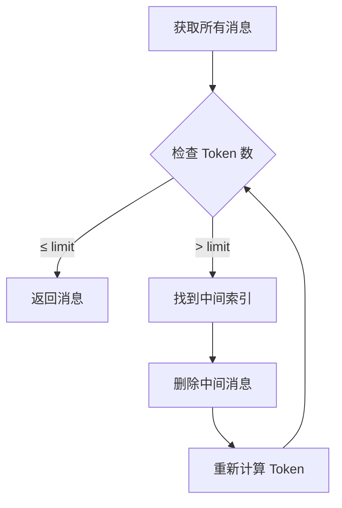

**示例**：

```python
from autogen_ext.models.openai import OpenAIChatCompletionClient

model_client = OpenAIChatCompletionClient(model="gpt-4")
context = TokenLimitedChatCompletionContext(
    model_client=model_client,
    token_limit=1000  # 限制 1000 Token
)

# 添加长消息
await context.add_message(UserMessage(content="A" * 500))  # ~500 tokens
await context.add_message(UserMessage(content="B" * 500))  # ~500 tokens
await context.add_message(UserMessage(content="C" * 500))  # ~500 tokens

# 获取消息 → 自动删除中间消息以符合 1000 Token 限制
messages = await context.get_messages()
# → 可能返回 [Message 1, Message 3]（删除了中间的 Message 2）
```

### 1.2 终止条件：TokenUsageTermination

**源码位置**: `autogen/python/packages/autogen-agentchat/src/autogen_agentchat/conditions/_terminations.py`

AutoGen 还提供了基于 Token 使用的终止条件：

```python
class TokenUsageTermination(TerminationCondition):
    """当 Token 使用达到阈值时终止对话"""
    
    def __init__(
        self,
        max_prompt_token: int | None = None,
        max_completion_token: int | None = None,
    ) -> None:
        self._max_prompt_token = max_prompt_token
        self._max_completion_token = max_completion_token
        self._total_prompt_tokens = 0
        self._total_completion_tokens = 0
    
    async def __call__(self, messages: Sequence[AgentMessage]) -> TerminationResult | None:
        # 累加 Token 使用
        for msg in messages:
            if msg.models_usage:
                self._total_prompt_tokens += msg.models_usage.prompt_tokens
                self._total_completion_tokens += msg.models_usage.completion_tokens
        
        # 检查是否超过限制
        if (self._max_prompt_token and 
            self._total_prompt_tokens > self._max_prompt_token):
            return TerminationResult(
                reason=f"Prompt token limit reached: {self._total_prompt_tokens}"
            )
        
        if (self._max_completion_token and 
            self._total_completion_tokens > self._max_completion_token):
            return TerminationResult(
                reason=f"Completion token limit reached: {self._total_completion_tokens}"
            )
        
        return None
```

**用途**：
- ✅ **成本控制**：防止 Token 超支
- ✅ **安全保护**：避免无限循环消耗大量 Token
- ❌ **非压缩**：这只是终止条件，不是压缩机制

### 1.3 记忆系统：ListMemory & Vector Memory

**源码位置**: `autogen/python/packages/autogen-ext/src/autogen_ext/memory/`

#### ListMemory（列表记忆）

```python
class ListMemory(Memory):
    """简单的列表式记忆，按时间顺序追加"""
    
    def __init__(self) -> None:
        self._memories: list[MemoryContent] = []
    
    async def add(self, content: MemoryContent, ...) -> None:
        self._memories.append(content)
    
    async def update_context(
        self, model_context: ChatCompletionContext
    ) -> UpdateContextResult:
        # 将所有记忆附加到模型上下文
        stringified = "\n\n".join([str(m.content) for m in self._memories])
        await model_context.add_message(SystemMessage(content=stringified))
        return UpdateContextResult(memories=QueryResult(results=self._memories))
```

**特点**：
- ❌ **无压缩**：只是简单地附加所有记忆
- ⚠️ **可能超限**：记忆过多时会占用大量 Token

#### ChromaDBVectorMemory（向量记忆）

```python
class ChromaDBVectorMemory(Memory):
    """基于向量相似度的记忆检索"""
    
    async def update_context(
        self, model_context: ChatCompletionContext
    ) -> UpdateContextResult:
        # 使用最后一条消息作为查询
        last_message = str(messages[-1].content)
        
        # 向量相似度搜索
        query_results = await self.query(last_message)
        
        # 只添加相关的记忆
        stringified = "\n\n".join([str(m.content) for m in query_results.results])
        await model_context.add_message(SystemMessage(content=stringified))
```

**特点**：
- ✅ **智能检索**：只返回相关记忆，减少 Token 使用
- ✅ **可扩展**：支持大规模记忆库
- ❌ **非压缩**：本质是过滤，不是摘要

#### Mem0Memory（Mem0 集成）

```python
class Mem0Memory(Memory):
    """集成 Mem0 的高级记忆系统"""
    
    async def update_context(
        self, model_context: ChatCompletionContext
    ) -> UpdateContextResult:
        # 使用 Mem0 检索相关记忆
        memories = await self.mem0_client.search(
            query=last_message,
            user_id=self.user_id,
            limit=self.limit
        )
        
        # 附加到上下文
        stringified = "\n\n".join([m["memory"] for m in memories])
        await model_context.add_message(SystemMessage(content=stringified))
```

**特点**：
- ✅ **LLM 驱动**：Mem0 内部使用 LLM 提取和整理记忆
- ✅ **结构化**：记忆带有元数据（类别、置信度等）
- ⚠️ **外部依赖**：需要 Mem0 API

---

## 2. CrewAI: 统一记忆 + 自适应召回

### 2.1 核心架构：Unified Memory

**源码位置**: `crewAI/lib/crewai/src/crewai/memory/unified_memory.py`

CrewAI 的记忆系统与 AutoGen 完全不同，它采用了**统一的智能记忆架构**：

```python
class Memory(BaseModel):
    """统一记忆：独立运行，LLM 分析，智能召回"""
    
    llm: BaseLLM | str = "gpt-4o-mini"  # 用于分析的 LLM
    storage: StorageBackend | str = "lancedb"  # 存储后端
    embedder: Any = None  # 嵌入模型
    
    # 评分权重
    recency_weight: float = 0.3      # 近期性权重
    semantic_weight: float = 0.5     # 语义相似度权重
    importance_weight: float = 0.2   # 重要性权重
    
    # 召回流配置
    confidence_threshold_high: float = 0.8   # 高置信度阈值
    confidence_threshold_low: float = 0.5    # 低置信度阈值
    exploration_budget: int = 1              # 探索轮次
```

**关键特性**：
- ✅ **LLM 分析**：保存时使用 LLM 推断范围、类别、重要性
- ✅ **向量检索**：基于语义相似度搜索
- ✅ **复合评分**：结合近期性、相似度、重要性
- ✅ **自适应深度**：根据置信度动态调整检索深度

### 2.2 记忆保存流程

```python
async def remember(self, content: str, scope: str | None = None, ...) -> str:
    """保存记忆，使用 LLM 分析元数据"""
    
    # Step 1: 生成嵌入
    embedding = await self._get_embedder()(content)
    
    # Step 2: LLM 分析（推断范围、类别、重要性）
    analysis = await extract_memories_from_content(
        llm=self._get_llm(),
        content=content,
        scope=scope
    )
    
    # Step 3: 检查是否需要合并（相似记忆）
    similar_records = await self._storage.search_similar(
        embedding=embedding,
        threshold=self.consolidation_threshold,
        limit=self.consolidation_limit
    )
    
    if similar_records:
        # 合并相似记忆
        record = await self._consolidate(similar_records, content, analysis)
    else:
        # 创建新记录
        record = MemoryRecord(
            content=content,
            embedding=embedding,
            scope=analysis.scope,
            category=analysis.category,
            importance=analysis.importance or self.default_importance,
            created_at=datetime.now()
        )
    
    # Step 4: 保存到存储
    await self._storage.upsert(record)
    return record.id
```

**LLM 分析示例**：

```python
# 输入内容
content = "用户喜欢 Python 编程语言，特别擅长数据分析"

# LLM 分析结果
analysis = {
    "scope": "/users/preferences/programming",  # 推断范围
    "category": "skill",                         # 类别
    "importance": 0.8,                           # 重要性评分
    "keywords": ["Python", "data analysis", "programming"]
}
```

### 2.3 自适应召回流程（RecallFlow）

**源码位置**: `crewAI/lib/crewai/src/crewai/memory/recall_flow.py`

```python
async def recall(self, query: str, top_k: int = 5) -> list[MemoryRecord]:
    """智能召回，根据置信度自适应调整深度"""
    
    # Step 1: 初步检索
    candidates = await self._storage.search(query, top_k=top_k * 2)
    
    # Step 2: 计算复合评分
    scored_candidates = []
    for record in candidates:
        score = compute_composite_score(
            record=record,
            query=query,
            config=self._config
        )
        scored_candidates.append((record, score))
    
    # Step 3: 排序并选择 Top-K
    scored_candidates.sort(key=lambda x: x[1], reverse=True)
    top_candidates = scored_candidates[:top_k]
    
    # Step 4: 检查置信度
    avg_confidence = sum(score for _, score in top_candidates) / len(top_candidates)
    
    if avg_confidence >= self.confidence_threshold_high:
        # 高置信度：直接返回
        return [record for record, _ in top_candidates]
    
    elif avg_confidence >= self.confidence_threshold_low:
        # 中等置信度：适度扩展搜索
        return await self._moderate_exploration(query, top_candidates)
    
    else:
        # 低置信度：深度探索
        return await self._deep_exploration(query, top_candidates)
```

**复合评分公式**：

```python
def compute_composite_score(
    record: MemoryRecord,
    query: str,
    config: MemoryConfig
) -> float:
    """计算复合相关性评分"""
    
    # 1. 语义相似度（余弦相似度）
    semantic_score = cosine_similarity(record.embedding, query_embedding)
    
    # 2. 近期性评分（指数衰减）
    days_old = (datetime.now() - record.created_at).days
    recency_score = 2 ** (-days_old / config.recency_half_life_days)
    
    # 3. 重要性评分（直接使用）
    importance_score = record.importance
    
    # 4. 加权组合
    composite = (
        config.semantic_weight * semantic_score +
        config.recency_weight * recency_score +
        config.importance_weight * importance_score
    )
    
    return composite
```

### 2.4 上下文管理：无内置压缩

**重要发现**：CrewAI **没有内置的上下文压缩机制**！

与 AutoGen 不同，CrewAI 的记忆系统专注于**长期记忆的存储和检索**，而不是短期上下文的压缩。

**CrewAI 的上下文管理方式**：

1. **任务级隔离**：每个任务有独立的上下文
2. **手动注入**：通过 `context` 参数手动传递相关信息
3. **记忆检索**：使用 `remember()` 检索相关记忆并注入

```python
# CrewAI 任务定义
task = Task(
    description="分析市场趋势",
    expected_output="市场分析报告",
    agent=researcher,
    context=[previous_task1, previous_task2]  # ← 手动指定上下文
)

# 或者使用记忆
agent.remember("用户偏好 Python")  # 保存到记忆
relevant_memories = agent.recall("编程偏好")  # 检索相关记忆
```

**与 AutoGen 的对比**：

| 维度 | AutoGen | CrewAI |
|------|---------|--------|
| **上下文压缩** | ✅ 内置（Buffered/HeadAndTail/TokenLimited） | ❌ 无内置压缩 |
| **记忆系统** | ⚠️ 简单（List/Vector/Mem0） | ✅ 高级（Unified Memory） |
| **LLM 分析** | ❌ 无 | ✅ 保存时分析 |
| **自适应检索** | ❌ 固定 Top-K | ✅ RecallFlow |
| **Token 控制** | ✅ 精确控制 | ❌ 依赖外部 |

---

## 3. 修正后的对比总结

### 3.1 压缩机制对比

| 框架 | 压缩策略 | 自动化程度 | Token 控制 | 适用场景 |
|------|---------|-----------|-----------|---------|
| **AutoGen** | 滑动窗口 / 头尾保留 / Token 限制 | 🟡 中（可配置） | ✅ 精确 | 短中期对话 |
| **CrewAI** | ❌ 无内置压缩 | 🔴 低（手动） | ❌ 无 | 长期记忆管理 |
| **smolagents** | 选择性生成（summary_mode） | 🟢 低（调用方责任） | ❌ 无 | 短任务 |
| **OpenHands V1** | LLM 摘要 + 事件视图 | 🔴 高（自动） | ✅ 动态 | 长任务 |
| **AgentScope** | 结构化摘要 + 标记系统 | 🟡 中（半自动） | ✅ 阈值触发 | 中等复杂度 |

### 3.2 关键差异

#### AutoGen 的优势

1. ✅ **多种压缩策略**：提供 4 种不同的上下文管理器
2. ✅ **精确 Token 控制**：`TokenLimitedChatCompletionContext` 基于实际 Token 数
3. ✅ **智能删除**：从头尾保留，删除中间内容
4. ✅ **灵活配置**：可根据场景选择合适的策略

#### AutoGen 的劣势

1. ❌ **记忆系统简单**：ListMemory 只是简单追加，无智能检索
2. ❌ **无 LLM 分析**：不会自动提取关键信息
3. ❌ **手动管理**：需要开发者选择合适的 Context 类型

#### CrewAI 的优势

1. ✅ **高级记忆系统**：Unified Memory 功能强大
2. ✅ **LLM 驱动分析**：自动推断范围、类别、重要性
3. ✅ **自适应检索**：RecallFlow 根据置信度调整深度
4. ✅ **复合评分**：结合近期性、相似度、重要性

#### CrewAI 的劣势

1. ❌ **无上下文压缩**：不包含短期上下文的压缩机制
2. ❌ **依赖外部控制**：Token 限制需要手动管理
3. ❌ **复杂性高**：配置参数多，学习曲线陡

---

## 4. 最佳实践建议

### 4.1 何时使用 AutoGen 的上下文管理？

**推荐场景**：
- ✅ **短中期对话**（<50 轮）
- ✅ **需要精确 Token 控制**
- ✅ **任务相对简单**，不需要复杂的记忆管理
- ✅ **快速原型开发**

**示例配置**：

```python
from autogen_core.model_context import TokenLimitedChatCompletionContext
from autogen_ext.models.openai import OpenAIChatCompletionClient

# 推荐：使用 Token 限制上下文
model_client = OpenAIChatCompletionClient(model="gpt-4")
context = TokenLimitedChatCompletionContext(
    model_client=model_client,
    token_limit=8000  # 根据模型限制设置
)

# 或者：使用头尾保留
from autogen_core.model_context import HeadAndTailChatCompletionContext
context = HeadAndTailChatCompletionContext(
    head_size=2,   # 保留前 2 条（任务描述）
    tail_size=10   # 保留后 10 条（最近对话）
)
```

### 4.2 何时使用 CrewAI 的记忆系统？

**推荐场景**：
- ✅ **长期记忆需求**（跨会话、跨任务）
- ✅ **需要智能检索**（语义相似度）
- ✅ **复杂的多 Agent 协作**
- ✅ **生产环境应用**

**示例配置**：

```python
from crewai.memory import Memory

# 初始化统一记忆
memory = Memory(
    llm="gpt-4o-mini",
    storage="lancedb",
    recency_weight=0.3,
    semantic_weight=0.5,
    importance_weight=0.2
)

# 保存记忆（自动 LLM 分析）
await memory.remember(
    content="用户喜欢 Python 编程",
    scope="/users/preferences"
)

# 智能检索（自适应深度）
relevant = await memory.recall("编程偏好", top_k=3)
```

### 4.3 混合使用策略

对于复杂应用，可以**同时使用 AutoGen 和 CrewAI**：

```python
# AutoGen 负责短期上下文管理
from autogen_core.model_context import TokenLimitedChatCompletionContext
short_term_context = TokenLimitedChatCompletionContext(
    model_client=model_client,
    token_limit=8000
)

# CrewAI 负责长期记忆
from crewai.memory import Memory
long_term_memory = Memory(llm="gpt-4o-mini", storage="lancedb")

# 工作流程
async def process_task(user_input: str):
    # 1. 检索长期记忆
    relevant_memories = await long_term_memory.recall(user_input)
    
    # 2. 注入到短期上下文
    for mem in relevant_memories:
        await short_term_context.add_message(
            SystemMessage(content=mem.content)
        )
    
    # 3. 添加用户输入
    await short_term_context.add_message(
        UserMessage(content=user_input)
    )
    
    # 4. 生成回复
    messages = await short_term_context.get_messages()
    response = await model_client.create(messages)
    
    # 5. 保存重要信息到长期记忆
    await long_term_memory.remember(response.content)
    
    return response
```

---

## 5. 常见误区澄清

### 误区 1："CrewAI 有内置的上下文压缩"

**真相**：❌ CrewAI **没有**内置的上下文压缩机制。它的记忆系统专注于长期存储和检索，而不是短期上下文的 Token 控制。

### 误区 2："AutoGen 的记忆系统很弱"

**真相**：⚠️ AutoGen 的记忆系统确实简单，但它的**上下文管理系统非常强大**。`TokenLimitedChatCompletionContext` 提供了精确的 Token 控制，这是很多框架缺失的功能。

### 误区 3："TokenLimitedChatCompletionContext 会删除重要信息"

**真相**：✅ 它采用**从中间删除**的策略，保留开头（任务描述）和结尾（最近对话），这是一种经过验证的有效策略。

### 误区 4："CrewAI 的 Unified Memory 可以替代上下文管理"

**真相**：❌ Unified Memory 是**长期记忆系统**，不是短期上下文管理器。它不会自动控制 Token 使用，需要配合其他机制使用。

---

## 6. 参考资料

### AutoGen
- Model Context API: `autogen/python/packages/autogen-core/src/autogen_core/model_context/`
- Memory Examples: `autogen/python/docs/src/user-guide/agentchat-user-guide/memory.ipynb`
- Termination Conditions: `autogen/python/packages/autogen-agentchat/src/autogen_agentchat/conditions/`

### CrewAI
- Unified Memory: `crewAI/lib/crewai/src/crewai/memory/unified_memory.py`
- Recall Flow: `crewAI/lib/crewai/src/crewai/memory/recall_flow.py`
- Memory Types: `crewAI/lib/crewai/src/crewai/memory/types.py`

---

## 7. 总结

经过深入源码检查，我对 AutoGen 和 CrewAI 的上下文管理机制有了更准确的理解：

1. **AutoGen**：
   - ✅ 提供 **4 种上下文管理器**，包括基于 Token 的智能压缩
   - ✅ `TokenLimitedChatCompletionContext` 是**最强大的内置压缩机制**之一
   - ⚠️ 记忆系统相对简单，但足以满足大多数场景

2. **CrewAI**：
   - ✅ 拥有**最先进的统一记忆系统**，支持 LLM 分析和自适应检索
   - ❌ **没有内置的上下文压缩**，需要手动管理 Token
   - ✅ 适合需要长期记忆和智能检索的复杂应用

3. **选型建议**：
   - 如果需要**精确的 Token 控制** → 选择 AutoGen
   - 如果需要**智能的长期记忆** → 选择 CrewAI
   - 如果两者都需要 → **混合使用**

---

## 14. 压缩源码归档（恢复）

> **完整逐行 walkthrough**（8 框架 `auto_compact` / `wrap_model_call` / Hermes 三道防线等）见 **[13-compression-source-archive.md](./13-compression-source-archive.md)**。  
> 本文 **07** 侧重六层矩阵、选型与图表；**13** 保留删除前的 `CONTEXT_COMPRESSION_SOURCE_CODE_ANALYSIS` + `IMPLEMENTATION_DEEP_DIVES` **全文**（与上文有重叠，不丢细节）。

这份修正后的分析应该更准确地反映了两个框架的实际能力！

