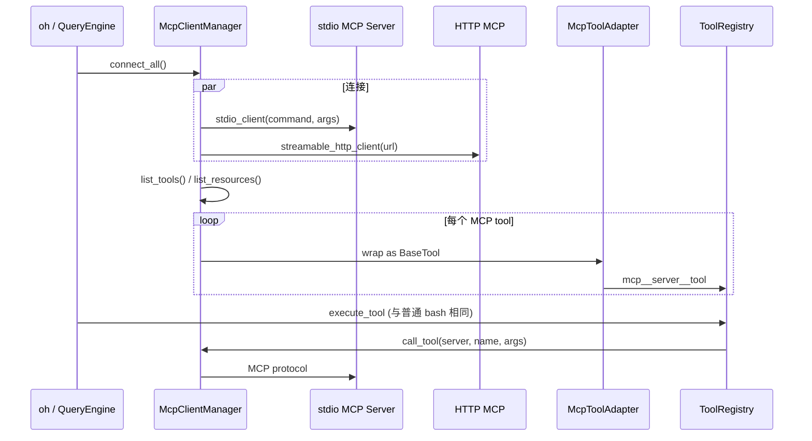
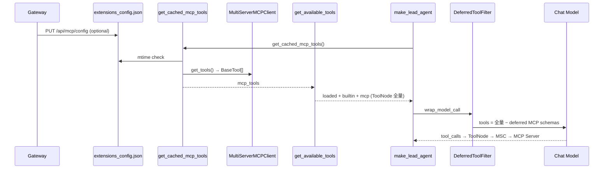
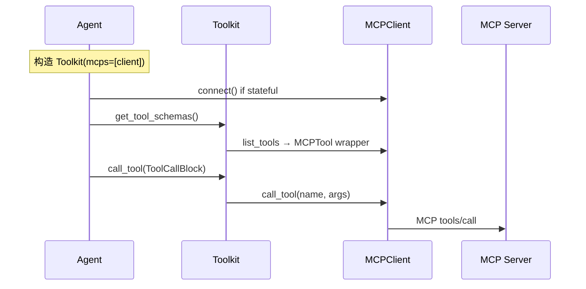
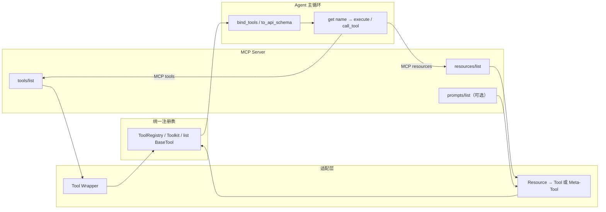
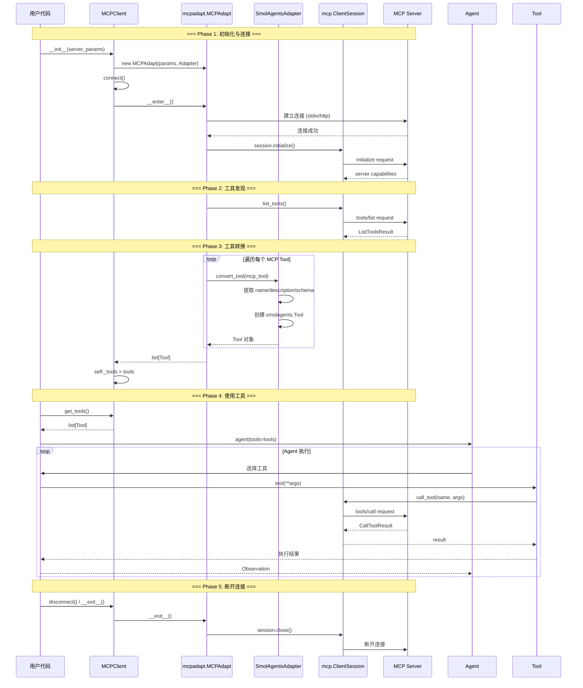
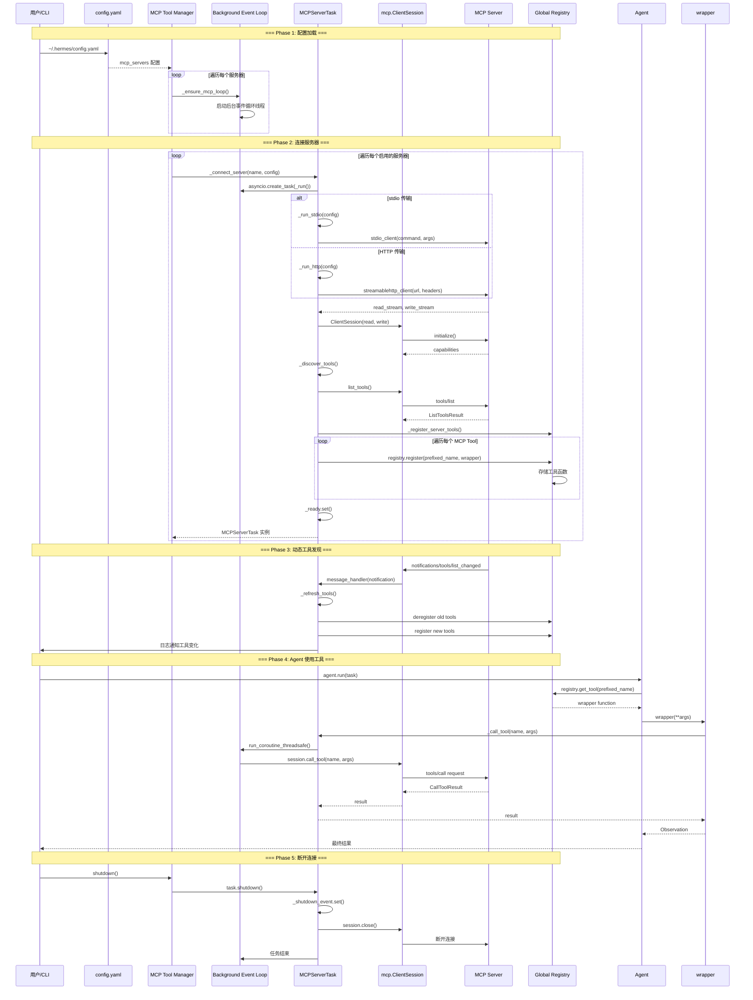
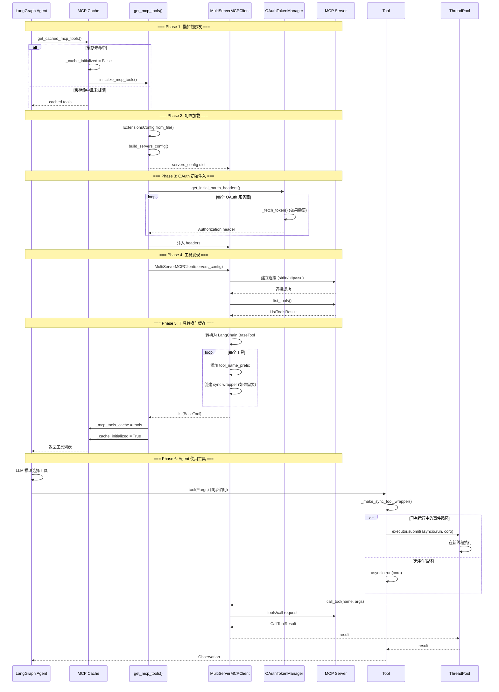
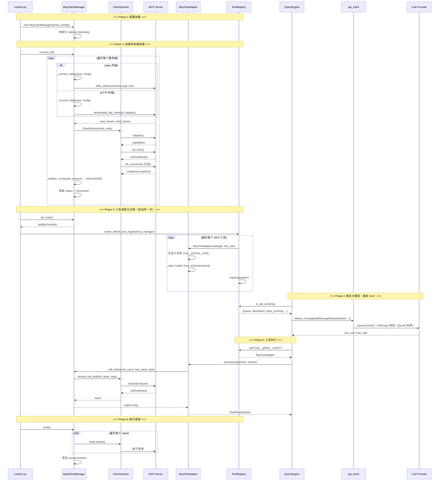

# MCP 集成

> **合并说明**：由以下文档去重合并（2026-08-04）。

---


---

## 横向对比

> **OpenHarness 真源**: `src/openharness/mcp/`  
> **DeerFlow 真源**: `packages/harness/deerflow/mcp/`（文档路径；以仓库为准）  
> **Skill / MCP 模块边界**（注册表、渐进加载、包结构）：[20-skill-mcp-modules.md](./20-skill-mcp-modules.md)

---

## 1. 维度定义

| 子维度 | 含义 |
|--------|------|
| **客户端承载** | 谁持有 `ClientSession`：专用 Manager、LangChain Tool、网关代理 |
| **传输** | stdio / HTTP Streamable / SSE / WebSocket |
| **工具桥接** | `tools/list` → Agent 可见的 name + JSON Schema（前缀、适配器） |
| **Resources / Prompts** | `resources/read`、`prompts/list` 是否进 Agent 上下文 |
| **认证** | OAuth、API Key、`tool_interceptors` |
| **热更新** | 配置变更后是否无需重启重载工具 |

---

## 2. 项目对照表

| 项目 | 客户端 | 传输 | 工具名 | 热更新 | Resources |
|------|--------|------|--------|--------|-----------|
| **OpenHarness** | `McpClientManager` + 官方 `mcp` SDK | stdio · HTTP streamable | `mcp__<server>__<tool>` | `settings` + 插件 manifest | `list_mcp_resources` 工具 |
| **deer-flow** | `MultiServerMCPClient`（langchain-mcp-adapters） | stdio · sse · http | `{server}_{tool}`（`tool_name_prefix=True`） | `extensions_config.json` **mtime** + `get_cached_mcp_tools` | 仅在 tool 返回中解析（`ResourceLink` / `EmbeddedResource`） |
| **deepagents** | 无内置；经 **langchain-mcp-adapters** | 随适配器 | `{server}_{tool}`（适配器 prefix） | 应用层 | 不暴露 resource tool |
| **agentscope v2** | `MCPClient`（`mcp/_mcp_client.py`） | stdio · SSE · streamable HTTP | `mcp__{name}__{tool}` | 构造时连接；有状态须 `connect()` | 未默认暴露 |
| **nanobot** | 官方 `mcp` SDK + `connect_mcp_servers` | stdio · SSE · streamable HTTP | `mcp_{server}_{tool}` | 启动时连接 | 每 resource 注册为只读伪 tool |
| **hermes-agent** | 宿主集成 MCP 客户端 | stdio / 远程 | 依版本 | 依部署 | 依版本 |

> **纠偏**：多数框架 **都能接 MCP**；差异在是否 **一等公民**（专用 Manager、资源工具、插件 manifest、deferred 策略）。

---

## 3. OpenHarness 数据流



**要点**：Agent 主循环 **不区分** MCP 与内置工具；执行时 `McpClientManager.call_tool` 转发到对应 session。

配置：`settings.mcp_servers` + 插件 `.mcp.json`。

---

## 4. DeerFlow 数据流



**DeerFlow 特有**：`tool_search` + **DeferredToolRegistry** + **DeferredToolFilterMiddleware** — 优化 **绑给模型的 schema 体积**，非推迟 MCP 执行。

详见 [deer-flow MCP_SERVER.md](../../deer-flow/backend/docs/MCP_SERVER.md)。

---

## 5. AgentScope v2 数据流



详见 [agentscope ARCHITECTURE_PART2.md §5.6](../../agentscope/docs/ARCHITECTURE_PART2.md#56-mcpclient-统一实现)。

---

## 6. deepagents / LangChain 栈（典型集成）

```text
extensions or env config
  → langchain-mcp-adapters MultiServerMCPClient
  → get_tools() → StructuredTool / BaseTool
  → create_deep_agent / create_agent bind_tools
  → ToolNode 执行
```

无框架级 **deferred**；token 策略由应用自行裁剪工具列表。

---

## 7. Tool 与 Resource 的统一包装（专题）

各框架对 MCP 的接入可概括为：**把 MCP 的 `tools` 和 `resources` 都「降维」成 Agent 能调用的统一 Tool 接口，放进同一个注册表，主循环按名字分发，不区分来源。** 差异主要在 Resource 怎么暴露、用什么适配器、以及是否有 deferred 等策略层。

### 7.1 三层分工



| 层 | 职责 |
|----|------|
| **连接层** | 持有 `ClientSession`，做 `list_tools` / `list_resources` / `call_tool` / `read_resource` |
| **适配层** | 把 MCP schema 转成框架自己的 Tool 类型（`BaseTool`、`ToolBase`、`StructuredTool`） |
| **注册层** | MCP 工具与内置工具进**同一个** registry；LLM 只看到扁平 tool list |

### 7.2 各项目包装方式

#### OpenHarness：Adapter + 专用 Resource 元工具

**真源**：`src/openharness/mcp/client.py`、`src/openharness/tools/mcp_tool.py`、`src/openharness/tools/__init__.py`

- **连接**：`McpClientManager.connect_all()` 对每个 server 执行 `list_tools()` + `list_resources()`。
- **MCP Tool**：每个 tool → `McpToolAdapter(BaseTool)`，命名 `mcp__{server}__{tool}`；`execute()` 转发到 `manager.call_tool()`。
- **MCP Resource**：**不**把每个 resource 注册成独立 tool，而是两个通用元工具：
  - `list_mcp_resources` → `manager.list_resources()`
  - `read_mcp_resource(server, uri)` → `manager.read_resource()`
- **与内置 tool 统一**：全部 `registry.register(...)` 进 `ToolRegistry`；`QueryEngine` 用 `tool_registry.get(name).execute()`，MCP 与 `bash` / `file_read` 走同一路径。

```python
# create_default_tool_registry（简化）
registry.register(ListMcpResourcesTool(mcp_manager))
registry.register(ReadMcpResourceTool(mcp_manager))
for tool_info in mcp_manager.list_tools():
    registry.register(McpToolAdapter(mcp_manager, tool_info))
```

#### deer-flow：LangChain 适配器 + metadata 标记

**真源**：`packages/harness/deerflow/mcp/tools.py`、`packages/harness/deerflow/tools/tools.py`、`packages/harness/deerflow/tools/mcp_metadata.py`

- **连接**：`MultiServerMCPClient.get_tools()` → `BaseTool` / `StructuredTool`；stdio 再包 session pool、OAuth interceptor。
- **MCP Tool**：适配器 `tool_name_prefix=True` → 名称为 `{server}_{tool}`；`tag_mcp_tool()` 写 metadata `deerflow_mcp=True`，供 deferred / `tool_search` 识别。
- **与内置 tool 统一**：`get_available_tools()` = config 工具 + builtin + `get_cached_mcp_tools()`；LangGraph `ToolNode` 执行时不区分来源。
- **MCP Resource**：**没有**单独的 resource tool；`ResourceLink` / `EmbeddedResource` 在 `_convert_call_tool_result()` 里转成 LangChain content blocks（被动消费，非主动 browse）。

#### deepagents（`deepagents-code`）：纯 Tool 列表合并

**真源**：`libs/code/deepagents_code/mcp_tools.py`、`libs/code/deepagents_code/main.py`

- SDK **无内置 MCP**；CLI 用 `langchain-mcp-adapters`。
- `resolve_and_load_mcp_tools()` → `convert_mcp_tool_to_langchain_tool` / `_build_cached_mcp_tool` 产出 LangChain `BaseTool`。
- `tools.extend(mcp_tools)` 与 `fetch_url`、`web_search` 等合并，交给 `create_deep_agent` → LangGraph `ToolNode`。
- **Resource**：当前路径不暴露 resource 给模型。

#### AgentScope v2：Toolkit 里的 `MCPTool(ToolBase)`

**真源**：`agentscope/src/agentscope/mcp/_mcp_client.py`、`agentscope/src/agentscope/tool/_adapters.py`、`agentscope/src/agentscope/tool/_toolkit.py`

- **MCP Tool**：`MCPClient.get_tool()` → `MCPTool`，命名 `mcp__{mcp_name}__{sanitized_tool}`；`is_mcp=True` 用于权限等分支。
- **与内置 tool 统一**：`Toolkit._get_available_tools()` 把 Python `FunctionTool` 与 `client.list_tools()` 放进同一 `available_tools` dict；调用入口仍是 `toolkit.call_tool(name, ...)`。
- **Resource**：默认不注册为 tool；仅在 MCP tool 返回的 `EmbeddedResource` 等块里做转换。

#### nanobot：Resource / Prompt 完全 tool 化

**真源**：`nanobot/nanobot/agent/tools/mcp.py`

| MCP 能力 | 包装类 | 暴露给 LLM 的名字 |
|---------|--------|------------------|
| Tool | `MCPToolWrapper` | `mcp_{server}_{tool}` |
| Resource | `MCPResourceWrapper` | `mcp_{server}_resource_{name}`（零参数只读 tool） |
| Prompt | `MCPPromptWrapper` | 同理 |

`connect_mcp_servers()` 把三者全部 `registry.register(wrapper)`；Resource 内部走 `session.read_resource(uri)`。当 `enabledTools` 非 `["*"]` 时跳过 resource/prompt 注册（工具子集模式下不越权暴露）。

### 7.3 Resource 暴露策略对比

| 策略 | 代表 | 优点 | 缺点 |
|------|------|------|------|
| **元工具**（list + read） | OpenHarness | schema 小；resource 多也不膨胀 | 需两步：先 list 再 read |
| **每 resource 一个 tool** | nanobot | 一步调用；与 tool 完全同构 | resource 多时 tool list 变大 |
| **不暴露，只在 tool 结果里解析** | deer-flow、AgentScope、deepagents | 实现简单 | 模型不能主动 browse resources |

### 7.4 命名与前缀（跨框架不一致）

| 框架 | MCP Tool 命名 |
|------|---------------|
| OpenHarness / AgentScope | `mcp__{server}__{tool}` |
| deer-flow / LangChain adapters | `{server}_{tool}` |
| nanobot | `mcp_{server}_{tool}` |

执行层均靠**注册表按名查找**；前缀只是命名空间隔离，避免多 server 同名冲突。

### 7.5 小结

1. **MCP Tool**：各框架都是 `list_tools` → Wrapper → 统一 Tool 类型 → 同一 registry → LLM `bind_tools`。
2. **MCP Resource**：元工具（OpenHarness）、伪 tool（nanobot）、或不暴露只在 tool 返回里处理（deer-flow / AgentScope / deepagents）。
3. **与内置 tool 统一**：关键不是「同一种类」，而是**同一个注册表 + 同一个 dispatch 路径**；MCP 只在适配层和 `call_tool` / `read_resource` 转发处分叉。
4. **deer-flow 额外一层**：metadata 标记 + deferred filter 影响**绑给模型的 schema 体积**，不影响 `ToolNode` 执行时的统一路由。

---

## 8. 选型建议

| 场景 | 倾向 |
|------|------|
| 本地 CLI + 资源工具 + 插件 MCP manifest | OpenHarness |
| Gateway 产品 + OAuth + deferred MCP + 多进程 mtime 缓存 | DeerFlow |
| 统一 Agent 类 + ToolGroup + 有状态 stdio 长连接 | AgentScope v2 |
| 与 LangGraph checkpoint 一体、最少自定义 | deepagents + adapters |

---

## 9. 相关文档

| 文档 | 内容 |
|------|------|
| [../MCP_AGENT_AND_TOOLS.md](../MCP_AGENT_AND_TOOLS.md) | OpenHarness MCP 教程 |
| [../OPENHARNESS_SKILLS_RUNTIME.md](../OPENHARNESS_SKILLS_RUNTIME.md) | Skills 与 MCP 共存 |
| [../../deer-flow/backend/docs/MCP_SERVER.md](../../deer-flow/backend/docs/MCP_SERVER.md) | DeerFlow 配置与 OAuth |

---

**最后更新**: 2026-07-12


---

## 四框架封装链路

> **分析对象**: smolagents + hermes-agent + deer-flow + OpenHarness  
> **文档类型**: 技术实现深度解析  
> **核心内容**: 启动 → 连接 → 工具发现 → 封装 → 注入 → 使用

---

## 📋 目录

- [1. 架构总览](#1-架构总览)
- [2. smolagents: MCPClient 封装链路](#2-smolagents-mcpclient-封装链路)
- [3. hermes-agent: MCP 服务封装链路](#3-hermes-agent-mcp-服务封装链路)
- [4. deer-flow: LangGraph MCP 集成方案](#4-deer-flow-langgraph-mcp-集成方案)
- [5. OpenHarness: 原生 MCP 客户端](#5-openharness-原生-mcp-客户端)
- [6. 四种方案对比](#6-四种方案对比)
- [7. 完整调用链路图](#7-完整调用链路图)
- [8. 关键设计决策](#8-关键设计决策)

---

## 1. 架构总览

### 1.1 三种 MCP 集成模式

```
模式 A: Client-Side Integration (smolagents)
┌──────────────┐       ┌──────────────┐       ┌──────────────┐
│   Agent      │──────▶│  MCPClient   │──────▶│ MCP Server   │
│  (Consumer)  │◀──────│  (Adapter)   │◀──────│  (Provider)  │
└──────────────┘       └──────────────┘       └──────────────┘
                          ↓ mcpadapt
                    Tool Conversion
                    
特点:
- Agent 作为 MCP Client
- 通过 mcpadapt 库转换工具
- 轻量级,适合快速集成


模式 B: Server-Side Integration (hermes-agent)
┌──────────────┐       ┌──────────────┐       ┌──────────────┐
│   Agent      │──────▶│ MCPServerTask│──────▶│ MCP Server   │
│  (Consumer)  │◀──────│  (Manager)   │◀──────│  (Provider)  │
└──────────────┘       └──────────────┘       └──────────────┘
                          ↓ 动态注册
                    Registry Integration
                    
特点:
- Agent 作为 MCP Client
- 自建管理器和任务系统
- 支持 OAuth、动态工具发现、采样回调


模式 C: Framework-Native Integration (deer-flow)
┌──────────────┐       ┌──────────────┐       ┌──────────────┐
│ LangGraph    │──────▶│MultiServer   │──────▶│ MCP Server   │
│  Agent       │◀──────│MCPClient     │◀──────│  (Provider)  │
└──────────────┘       └──────────────┘       └──────────────┘
                          ↓ langchain-mcp-adapters
                    Cache + Lazy Init
                    
特点:
- 基于 LangChain MCP Adapters
- 配置驱动,文件变更检测
- 懒加载 + 缓存机制
```

### 1.2 核心组件对比

| 组件 | smolagents | hermes-agent |
|------|-----------|--------------|
| **客户端类** | `MCPClient` | `MCPServerTask` |
| **适配器** | `mcpadapt.SmolAgentsAdapter` | 自实现 `_register_server_tools()` |
| **传输层** | `mcp.client.stdio/streamable_http` | `mcp.client.stdio/streamable_http` |
| **会话管理** | `mcp.ClientSession` | `mcp.ClientSession` |
| **工具注册** | 返回 `list[Tool]` | 注册到全局 `registry` |
| **生命周期** | Context Manager (`__enter__/__exit__`) | Background Event Loop + Task |
| **认证支持** | ❌ | ✅ OAuth 2.1 PKCE + Header |
| **动态发现** | ❌ | ✅ `notifications/tools/list_changed` |
| **采样回调** | ❌ | ✅ `SamplingHandler` |
| **安全特性** | ❌ | ✅ 环境变量过滤、凭证脱敏、OSV 恶意软件检查 |

---

## 2. smolagents: MCPClient 封装链路

### 2.1 完整链路流程图



### 2.2 详细步骤解析

#### **Phase 1: 初始化与连接**

**代码位置**: [`smolagents/src/smolagents/mcp_client.py:85-122`](file:///Users/gqli/work/deepagents/smolagents/src/smolagents/mcp_client.py#L85-L122)

```python
class MCPClient:
    def __init__(
        self,
        server_parameters: "StdioServerParameters" | dict[str, Any],
        adapter_kwargs: dict[str, Any] | None = None,
        structured_output: bool | None = None,
    ):
        # Step 1: 处理 structured_output 默认值
        if structured_output is None:
            warnings.warn(
                "未指定参数 'structured_output'。当前默认为 False...",
                FutureWarning, stacklevel=2,
            )
            structured_output = False
        
        # Step 2: 导入 mcpadapt 库 (第三方依赖)
        try:
            from mcpadapt.core import MCPAdapt
            from mcpadapt.smolagents_adapter import SmolAgentsAdapter
        except ModuleNotFoundError:
            raise ModuleNotFoundError(
                "Please install 'mcp' extra: `pip install 'smolagents[mcp]'`"
            )
        
        # Step 3: 验证 HTTP 传输协议
        if isinstance(server_parameters, dict):
            transport = server_parameters.get("transport")
            if transport is None:
                transport = "streamable-http"
                server_parameters["transport"] = transport
            if transport not in {"sse", "streamable-http"}:
                raise ValueError(f"Unsupported transport: {transport}")
        
        # Step 4: 创建 MCPAdapt 实例
        adapter_kwargs = adapter_kwargs or {}
        self._adapter = MCPAdapt(
            server_parameters, 
            SmolAgentsAdapter(structured_output=structured_output),
            **adapter_kwargs
        )
        
        # Step 5: 自动连接
        self._tools: list[Tool] | None = None
        self.connect()  # ← 关键: 初始化时自动连接
```

**关键点**:
1. **自动连接**: `__init__` 中直接调用 `connect()`,无需手动触发
2. **类型标注**: `self._tools: list[Tool]` 是提示,实际由 `mcpadapt` 保证
3. **传输协议验证**: 仅支持 `streamable-http` 和 `sse`

---

#### **Phase 2 & 3: 工具发现与转换**

**代码位置**: [`smolagents/src/smolagents/mcp_client.py:124-126`](file:///Users/gqli/work/deepagents/smolagents/src/smolagents/mcp_client.py#L124-L126)

```python
def connect(self):
    """连接到 MCP 服务器并初始化工具。"""
    self._tools: list[Tool] = self._adapter.__enter__()
```

**内部流程** (在 `mcpadapt` 库中):

```python
# mcpadapt/core.py (推断逻辑)
class MCPAdapt:
    def __enter__(self) -> list[Tool]:
        # 1. 建立 MCP 连接
        if isinstance(self.server_params, StdioServerParameters):
            read_stream, write_stream = stdio_client(self.server_params)
        else:
            read_stream, write_stream = streamablehttp_client(self.server_params)
        
        # 2. 初始化会话
        async with ClientSession(read_stream, write_stream) as session:
            await session.initialize()
            
            # 3. 获取工具列表
            tools_result = await session.list_tools()
            mcp_tools = tools_result.tools
            
            # 4. 转换工具 (调用 Adapter)
            converted_tools = []
            for mcp_tool in mcp_tools:
                tool = self.adapter.convert_tool(mcp_tool)
                converted_tools.append(tool)
            
            return converted_tools

# mcpadapt/smolagents_adapter.py (推断逻辑)
class SmolAgentsAdapter:
    def convert_tool(self, mcp_tool) -> Tool:
        """将 MCP Tool 转换为 smolagents.Tool"""
        
        # 1. 提取工具元数据
        name = mcp_tool.name
        description = mcp_tool.description or ""
        input_schema = mcp_tool.inputSchema
        
        # 2. 创建异步调用函数
        async def call_wrapper(**kwargs):
            result = await self.session.call_tool(name, kwargs)
            return result.content[0].text  # 简化处理
        
        # 3. 构建 smolagents.Tool 对象
        tool = Tool(
            name=name,
            description=description,
            inputs=input_schema,
            output_type="string",
            callable=call_wrapper,
        )
        
        return tool
```

**转换映射表**:

| MCP 字段 | smolagents.Tool 字段 | 说明 |
|---------|---------------------|------|
| `tool.name` | `Tool.name` | 工具名称 |
| `tool.description` | `Tool.description` | 工具描述 |
| `tool.inputSchema` | `Tool.inputs` | JSON Schema 输入参数 |
| `tool.outputSchema` | `Tool.output_type` | 输出类型 (需结构化输出支持) |
| `session.call_tool()` | `Tool.callable` | 异步调用包装器 |

---

#### **Phase 4: 使用工具**

**代码示例**:

```python
from smolagents import MCPClient, CodeAgent
from mcp import StdioServerParameters
import os

# Step 1: 创建 MCPClient (自动连接)
server_params = StdioServerParameters(
    command="npx",
    args=["-y", "@modelcontextprotocol/server-everything"],
    env=os.environ.copy()
)

mcp_client = MCPClient(server_params, structured_output=False)

# Step 2: 获取工具列表
tools = mcp_client.get_tools()
print(f"获取到 {len(tools)} 个工具")

# Step 3: 创建 Agent 并注入工具
agent = CodeAgent(
    tools=tools,  # ← 注入 MCP 工具
    model=HfApiModel("Qwen/Qwen2.5-Coder-32B-Instruct"),
)

# Step 4: 执行任务 (Agent 自动调用工具)
result = agent.run("帮我列出当前目录的文件")
print(result)

# Step 5: 断开连接
mcp_client.disconnect()
```

**Agent 内部调用流程**:

```python
# smolagents/agents.py (简化)
class CodeAgent:
    def run(self, task: str):
        # 1. LLM 推理,选择工具
        tool_name, tool_args = self.llm.decide_tool(task, self.tools)
        
        # 2. 查找工具
        tool = next(t for t in self.tools if t.name == tool_name)
        
        # 3. 执行工具 (触发 MCP 调用)
        result = tool(**tool_args)
        # ↓ 内部调用链:
        # tool.__call__(**args)
        #   → self.callable(**args)  # mcpadapt 创建的 wrapper
        #     → session.call_tool(name, args)  # mcp SDK
        #       → MCP Server 执行
        #         → 返回 CallToolResult
        
        # 4. 将结果反馈给 LLM
        observation = f"Tool {tool_name} returned: {result}"
        self.memory.add(observation)
        
        # 5. 继续下一轮推理
        return self.run(task)  # 递归或循环
```

---

#### **Phase 5: 断开连接**

**代码位置**: [`smolagents/src/smolagents/mcp_client.py:128-135`](file:///Users/gqli/work/deepagents/smolagents/src/smolagents/mcp_client.py#L128-L135)

```python
def disconnect(
    self,
    exc_type: type[BaseException] | None = None,
    exc_value: BaseException | None = None,
    exc_traceback: TracebackType | None = None,
):
    """断开与 MCP 服务器的连接"""
    self._adapter.__exit__(exc_type, exc_value, exc_traceback)
```

**Context Manager 支持**:

```python
# 推荐用法: 上下文管理器
with MCPClient(server_params) as tools:
    agent = CodeAgent(tools=tools, model=model)
    result = agent.run(task)
# 退出时自动调用 disconnect()

# 或者手动管理
try:
    client = MCPClient(server_params)
    tools = client.get_tools()
    # ... 使用工具
finally:
    client.disconnect()  # 确保清理资源
```

---

### 2.3 关键设计特点

#### **优点**:
1. ✅ **极简 API**: 3 行代码完成 MCP 集成
2. ✅ **自动管理**: 初始化时自动连接,Context Manager 自动断开
3. ✅ **类型安全**: 返回 `list[Tool]`,IDE 自动补全
4. ✅ **多服务器支持**: `server_parameters` 可以是列表

#### **缺点**:
1. ❌ **无动态发现**: 工具列表在连接时固定,不支持运行时更新
2. ❌ **无认证支持**: 不支持 OAuth,仅支持简单 Header
3. ❌ **无错误重试**: 连接失败直接抛出异常
4. ❌ **依赖第三方**: 强依赖 `mcpadapt` 库

---

## 3. hermes-agent: MCP 服务封装链路

### 3.1 完整链路流程图



### 3.2 详细步骤解析

#### **Phase 1: 配置加载**

**配置文件示例**: [`~/.hermes/config.yaml`](file:///Users/gqli/work/deepagents/hermes-agent/hermes_cli/mcp_config.py#L70-L77)

```yaml
mcp_servers:
  filesystem:
    command: "npx"
    args: ["-y", "@modelcontextprotocol/server-filesystem", "/tmp"]
    env: {}
    timeout: 120         # 工具调用超时 (秒)
    connect_timeout: 60  # 连接超时 (秒)
    enabled: true
  
  github:
    command: "npx"
    args: ["-y", "@modelcontextprotocol/server-github"]
    env:
      GITHUB_PERSONAL_ACCESS_TOKEN: "ghp_..."
    enabled: true
  
  remote_api:
    url: "https://my-mcp-server.example.com/mcp"
    headers:
      Authorization: "Bearer sk-..."
    auth: oauth  # OAuth 2.1 PKCE
    sampling:
      enabled: true
      model: "gemini-3-flash"
      max_tokens_cap: 4096
      timeout: 30
      max_rpm: 10
    enabled: true
```

**加载代码**: [`hermes_cli/mcp_config.py:70-77`](file:///Users/gqli/work/deepagents/hermes-agent/hermes_cli/mcp_config.py#L70-L77)

```python
def _get_mcp_servers(config: Optional[dict] = None) -> Dict[str, dict]:
    """Return the ``mcp_servers`` dict from config, or empty dict."""
    if config is None:
        config = load_config()
    servers = config.get("mcp_servers")
    if not servers or not isinstance(servers, dict):
        return {}
    return servers
```

---

#### **Phase 2: 连接服务器**

**核心管理器**: [`tools/mcp_tool.py`](file:///Users/gqli/work/deepagents/hermes-agent/tools/mcp_tool.py)

**Step 2.1: 启动后台事件循环**

```python
# tools/mcp_tool.py:1300-1350 (推断)
_mcp_loop: Optional[asyncio.AbstractEventLoop] = None
_mcp_thread: Optional[threading.Thread] = None
_lock = threading.Lock()
_servers: Dict[str, MCPServerTask] = {}

def _ensure_mcp_loop():
    """Ensure the background event loop is running."""
    global _mcp_loop, _mcp_thread
    
    with _lock:
        if _mcp_loop is not None and _mcp_loop.is_running():
            return  # 已运行
        
        # 创建新的事件循环
        _mcp_loop = asyncio.new_event_loop()
        
        # 在后台线程中运行
        def _run_loop():
            asyncio.set_event_loop(_mcp_loop)
            _mcp_loop.run_forever()
        
        _mcp_thread = threading.Thread(target=_run_loop, daemon=True)
        _mcp_thread.start()
        
        logger.info("MCP background event loop started")
```

**关键点**:
- **专用线程**: 避免阻塞主线程
- **Daemon 线程**: 程序退出时自动终止
- **线程安全**: 所有操作通过 `_lock` 保护

---

**Step 2.2: 创建服务器任务**

```python
# tools/mcp_tool.py:774-810
class MCPServerTask:
    """Manages a single MCP server connection in a dedicated asyncio Task."""
    
    __slots__ = (
        "name", "session", "tool_timeout",
        "_task", "_ready", "_shutdown_event", "_reconnect_event",
        "_tools", "_error", "_config",
        "_sampling", "_registered_tool_names", "_auth_type", "_refresh_lock",
    )
    
    def __init__(self, name: str):
        self.name = name
        self.session: Optional[Any] = None
        self.tool_timeout: float = _DEFAULT_TOOL_TIMEOUT
        self._task: Optional[asyncio.Task] = None
        self._ready = asyncio.Event()  # 就绪信号
        self._shutdown_event = asyncio.Event()  # 关闭信号
        self._reconnect_event = asyncio.Event()  # 重连信号 (OAuth)
        self._tools: list = []
        self._error: Optional[Exception] = None
        self._config: dict = {}
        self._sampling: Optional[SamplingHandler] = None
        self._registered_tool_names: list[str] = []
        self._auth_type: str = ""
        self._refresh_lock = asyncio.Lock()
```

---

**Step 2.3: 运行服务器 (stdio 传输)**

```python
# tools/mcp_tool.py:931-983
async def _run_stdio(self, config: dict):
    """Run the server using stdio transport."""
    command = config.get("command")
    args = config.get("args", [])
    user_env = config.get("env")
    
    if not command:
        raise ValueError(f"MCP server '{self.name}' has no 'command'")
    
    # Step 1: 构建安全环境变量 (过滤敏感信息)
    safe_env = _build_safe_env(user_env)
    command, safe_env = _resolve_stdio_command(command, safe_env)
    
    # Step 2: OSV 恶意软件检查
    from tools.osv_check import check_package_for_malware
    malware_error = check_package_for_malware(command, args)
    if malware_error:
        raise ValueError(f"MCP server '{self.name}': {malware_error}")
    
    # Step 3: 创建 stdio 传输
    server_params = StdioServerParameters(
        command=command,
        args=args,
        env=safe_env if safe_env else None,
    )
    
    # Step 4: 准备采样回调 (如果启用)
    sampling_kwargs = self._sampling.session_kwargs() if self._sampling else {}
    if _MCP_NOTIFICATION_TYPES and _MCP_MESSAGE_HANDLER_SUPPORTED:
        sampling_kwargs["message_handler"] = self._make_message_handler()
    
    # Step 5: 捕获子进程 PID (用于清理)
    pids_before = _snapshot_child_pids()
    
    # Step 6: 建立连接 (anyio cancel-scope)
    async with stdio_client(server_params) as (read_stream, write_stream):
        # 捕获新产生的子进程 PID
        new_pids = _snapshot_child_pids() - pids_before
        if new_pids:
            with _lock:
                _stdio_pids.update(new_pids)
        
        # Step 7: 创建会话
        async with ClientSession(read_stream, write_stream, **sampling_kwargs) as session:
            await session.initialize()
            self.session = session
            
            # Step 8: 发现工具
            await self._discover_tools()
            
            # Step 9: 标记就绪
            self._ready.set()
            
            # Step 10: 等待关闭或重连信号
            await self._wait_for_lifecycle_event()
    
    # Step 11: 清理子进程 PID
    if new_pids:
        with _lock:
            _stdio_pids.difference_update(new_pids)
```

**关键安全特性**:

1. **环境变量过滤** ([`_build_safe_env`](file:///Users/gqli/work/deepagents/hermes-agent/tools/mcp_tool.py#L194-L210)):
```python
_SAFE_ENV_KEYS = frozenset({
    "PATH", "HOME", "USER", "LANG", "LC_ALL", "TERM", "SHELL", "TMPDIR",
})

def _build_safe_env(user_env: Optional[dict]) -> dict:
    """只传递安全的环境变量,防止泄露 API Key"""
    env = {}
    for key, value in os.environ.items():
        if key in _SAFE_ENV_KEYS or key.startswith("XDG_"):
            env[key] = value
    if user_env:
        env.update(user_env)  # 用户显式配置的变量
    return env
```

2. **OSV 恶意软件检查**:
```python
# 在执行 npx/npm/node 之前检查包是否被标记为恶意
malware_error = check_package_for_malware(command, args)
if malware_error:
    raise ValueError(f"MCP server '{self.name}': {malware_error}")
```

3. **凭证脱敏** ([`_sanitize_error`](file:///Users/gqli/work/deepagents/hermes-agent/tools/mcp_tool.py#L213-L219)):
```python
_CREDENTIAL_PATTERN = re.compile(
    r"(?:"
    r"ghp_[A-Za-z0-9_]{1,255}"           # GitHub PAT
    r"|sk-[A-Za-z0-9_]{1,255}"           # OpenAI-style key
    r"|Bearer\s+\S+"                      # Bearer token
    r"|token=[^\s&,;\"']{1,255}"         # token=...
    r")",
    re.IGNORECASE,
)

def _sanitize_error(text: str) -> str:
    """Strip credential-like patterns from error text."""
    return _CREDENTIAL_PATTERN.sub("[REDACTED]", text)
```

---

**Step 2.4: 发现并注册工具**

```python
# tools/mcp_tool.py:848-895
async def _refresh_tools(self):
    """Re-fetch tools from the server and update the registry."""
    from tools.registry import registry
    
    async with self._refresh_lock:
        # Step 1: 捕获旧工具名称
        old_tool_names = set(self._registered_tool_names)
        
        # Step 2: 从服务器获取最新工具列表
        tools_result = await self.session.list_tools()
        new_mcp_tools = tools_result.tools if hasattr(tools_result, "tools") else []
        
        # Step 3: 注销旧工具
        for prefixed_name in self._registered_tool_names:
            registry.deregister(prefixed_name)
        
        # Step 4: 重新注册新工具
        self._tools = new_mcp_tools
        self._registered_tool_names = _register_server_tools(
            self.name, self, self._config
        )
        
        # Step 5: 记录变化
        new_tool_names = set(self._registered_tool_names)
        added = new_tool_names - old_tool_names
        removed = old_tool_names - new_tool_names
        
        if added or removed:
            logger.warning(
                "MCP server '%s': tools changed dynamically — added: %s, removed: %s",
                self.name, added, removed,
            )
```

**工具注册函数**:

```python
# tools/mcp_tool.py:1500-1600 (推断)
def _register_server_tools(server_name: str, server_task: MCPServerTask, config: dict) -> list[str]:
    """Register all tools from an MCP server into the global registry."""
    from tools.registry import registry
    
    registered_names = []
    
    for mcp_tool in server_task._tools:
        # Step 1: 生成带前缀的工具名称 (避免冲突)
        prefixed_name = f"{server_name}_{mcp_tool.name}"
        
        # Step 2: 扫描描述中的注入攻击模式
        findings = _scan_mcp_description(
            server_name, mcp_tool.name, mcp_tool.description or ""
        )
        if findings:
            logger.warning(
                "MCP server '%s' tool '%s': suspicious description — %s",
                server_name, mcp_tool.name, "; ".join(findings),
            )
        
        # Step 3: 创建工具包装器
        async def tool_wrapper(**kwargs):
            """Wrapper that calls the MCP tool via the server task."""
            try:
                # 调度到 MCP 事件循环
                future = asyncio.run_coroutine_threadsafe(
                    server_task._call_tool(mcp_tool.name, kwargs),
                    _mcp_loop,
                )
                result = future.result(timeout=server_task.tool_timeout)
                return result
            except Exception as e:
                # 脱敏错误信息
                error_msg = _sanitize_error(str(e))
                return f"Error calling tool '{mcp_tool.name}': {error_msg}"
        
        # Step 4: 设置工具元数据
        tool_wrapper.__name__ = prefixed_name
        tool_wrapper.__doc__ = mcp_tool.description or ""
        tool_wrapper.__annotations__ = {
            "return": str,
            **{k: v.get("type", "any") for k, v in (mcp_tool.inputSchema.get("properties", {}).items())},
        }
        
        # Step 5: 注册到全局 Registry
        registry.register(prefixed_name, tool_wrapper)
        registered_names.append(prefixed_name)
        
        logger.info(
            "Registered MCP tool: %s (server=%s)",
            prefixed_name, server_name,
        )
    
    return registered_names
```

**工具命名规则**:
- **格式**: `{server_name}_{tool_name}`
- **示例**: `filesystem_read_file`, `github_search_repositories`
- **目的**: 避免不同服务器的同名工具冲突

---

#### **Phase 3: 动态工具发现**

**消息处理器**: [`tools/mcp_tool.py:818-846`](file:///Users/gqli/work/deepagents/hermes-agent/tools/mcp_tool.py#L818-L846)

```python
def _make_message_handler(self):
    """Build a ``message_handler`` callback for ``ClientSession``."""
    async def _handler(message):
        try:
            if isinstance(message, Exception):
                logger.debug("MCP message handler (%s): exception: %s", self.name, message)
                return
            
            if _MCP_NOTIFICATION_TYPES and isinstance(message, ServerNotification):
                match message.root:
                    case ToolListChangedNotification():
                        logger.info(
                            "MCP server '%s': received tools/list_changed notification",
                            self.name,
                        )
                        await self._refresh_tools()  # ← 动态刷新
                    
                    case PromptListChangedNotification():
                        logger.debug("MCP server '%s': prompts/list_changed (ignored)", self.name)
                    
                    case ResourceListChangedNotification():
                        logger.debug("MCP server '%s': resources/list_changed (ignored)", self.name)
                    
                    case _:
                        pass
        except Exception:
            logger.exception("Error in MCP message handler for '%s'", self.name)
    
    return _handler
```

**工作流程**:
1. MCP Server 发送 `notifications/tools/list_changed`
2. `message_handler` 接收通知
3. 调用 `_refresh_tools()` 重新获取工具列表
4. 注销旧工具,注册新工具
5. 日志通知用户

**优势**:
- ✅ 支持热更新,无需重启 Agent
- ✅ 适用于动态生成工具的服务器 (如数据库 schema 变更)

---

#### **Phase 4: Agent 使用工具**

**工具调用链路**:

```python
# Step 1: Agent 从 Registry 获取工具
from tools.registry import registry

tool_func = registry.get_tool("filesystem_read_file")

# Step 2: 调用工具 (同步接口)
result = tool_func(path="/tmp/test.txt")

# Step 3: 工具包装器内部 (异步调用)
async def tool_wrapper(**kwargs):
    # 调度到 MCP 事件循环
    future = asyncio.run_coroutine_threadsafe(
        server_task._call_tool("read_file", kwargs),
        _mcp_loop,
    )
    result = future.result(timeout=120)
    return result

# Step 4: MCPServerTask 执行调用
async def _call_tool(self, tool_name: str, arguments: dict):
    """Call an MCP tool via the session."""
    try:
        result = await asyncio.wait_for(
            self.session.call_tool(tool_name, arguments),
            timeout=self.tool_timeout,
        )
        
        # 检查错误
        if result.isError:
            error_text = result.content[0].text if result.content else "Unknown error"
            raise RuntimeError(_sanitize_error(error_text))
        
        # 返回文本内容
        return result.content[0].text if result.content else ""
    
    except asyncio.TimeoutError:
        raise TimeoutError(
            f"Tool '{tool_name}' timed out after {self.tool_timeout}s"
        )
```

**跨线程调用机制**:

```
Agent Thread (主线程)
  ↓
tool_wrapper(**args)  # 同步调用
  ↓
asyncio.run_coroutine_threadsafe(coro, _mcp_loop)
  ↓
  ┌─────────────────────────────────┐
  │  MCP Background Thread          │
  │  ↓                              │
  │  _mcp_loop.run_until_complete() │
  │  ↓                              │
  │  session.call_tool(name, args)  │
  │  ↓                              │
  │  MCP Server 执行                │
  │  ↓                              │
  │  返回 CallToolResult            │
  └─────────────────────────────────┘
  ↓
future.result(timeout)  # 等待结果
  ↓
返回给 Agent
```

---

#### **Phase 5: 断开连接**

**关闭流程**:

```python
# tools/mcp_tool.py:1400-1450 (推断)
def shutdown_all():
    """Shutdown all MCP servers and stop the background loop."""
    global _servers, _mcp_loop, _mcp_thread
    
    with _lock:
        if not _servers:
            return
        
        logger.info("Shutting down %d MCP servers...", len(_servers))
        
        # Step 1: 通知所有服务器关闭
        for name, task in _servers.items():
            task.shutdown()  # 设置 _shutdown_event
        
        # Step 2: 等待所有任务结束
        for name, task in _servers.items():
            if task._task:
                try:
                    asyncio.run_coroutine_threadsafe(
                        task._task,
                        _mcp_loop,
                    ).result(timeout=10)
                except Exception as e:
                    logger.warning("Failed to shutdown server '%s': %s", name, e)
        
        # Step 3: 停止事件循环
        if _mcp_loop and _mcp_loop.is_running():
            _mcp_loop.call_soon_threadsafe(_mcp_loop.stop)
        
        # Step 4: 等待线程结束
        if _mcp_thread:
            _mcp_thread.join(timeout=5)
        
        # Step 5: 清理资源
        _servers.clear()
        _mcp_loop = None
        _mcp_thread = None
        
        logger.info("All MCP servers shut down")
```

**优雅关闭保证**:
1. **信号通知**: `_shutdown_event.set()` 通知任务退出
2. **等待完成**: 给任务 10 秒时间清理资源
3. **强制终止**: 超时后停止事件循环
4. **线程清理**: 等待后台线程结束

---

### 3.3 高级特性

#### **OAuth 2.1 PKCE 认证**

**配置**:
```yaml
mcp_servers:
  my_oauth_server:
    url: "https://mcp.example.com/mcp"
    auth: oauth
    sampling:
      enabled: true
```

**认证流程**:
```python
# tools/mcp_oauth_manager.py (简化)
class MCPOAuthManager:
    def get_or_build_provider(self, server_name: str, url: str, config: dict):
        """Get or create OAuth provider for a server."""
        
        # Step 1: 检查缓存的 Token
        tokens = self._load_tokens(server_name)
        if tokens and not self._is_expired(tokens):
            return OAuthProvider(tokens)
        
        # Step 2: 发现 OAuth 端点
        metadata = self._discover_oauth_metadata(url)
        
        # Step 3: PKCE 流程
        code_verifier = generate_code_verifier()
        code_challenge = generate_code_challenge(code_verifier)
        
        # Step 4: 打开浏览器授权
        auth_url = build_auth_url(
            metadata.authorization_endpoint,
            client_id=metadata.client_id,
            code_challenge=code_challenge,
            redirect_uri="http://localhost:8085/callback",
        )
        webbrowser.open(auth_url)
        
        # Step 5: 等待回调
        auth_code = wait_for_callback(port=8085)
        
        # Step 6: 交换 Token
        tokens = exchange_token(
            metadata.token_endpoint,
            auth_code=auth_code,
            code_verifier=code_verifier,
        )
        
        # Step 7: 保存 Token
        self._save_tokens(server_name, tokens)
        
        return OAuthProvider(tokens)
```

**Token 自动刷新**:
```python
# tools/mcp_tool.py:1000-1100 (推断)
async def _run_http(self, config: dict):
    """Run the server using HTTP/StreamableHTTP transport with OAuth."""
    
    while not self._shutdown_event.is_set():
        # Step 1: 获取 OAuth Provider
        oauth_provider = get_manager().get_or_build_provider(
            self.name, config["url"], config
        )
        
        # Step 2: 构建带 Token 的 Headers
        headers = dict(config.get("headers") or {})
        if oauth_provider:
            token = await oauth_provider.get_valid_token()
            headers["Authorization"] = f"Bearer {token.access_token}"
        
        # Step 3: 建立连接
        async with streamablehttp_client(config["url"], headers=headers) as streams:
            async with ClientSession(*streams) as session:
                await session.initialize()
                self.session = session
                await self._discover_tools()
                self._ready.set()
                
                # Step 4: 等待关闭或重连信号
                event = await self._wait_for_lifecycle_event()
                
                if event == "shutdown":
                    break
                elif event == "reconnect":
                    # Token 过期,需要重新认证
                    logger.info("Reconnecting with fresh OAuth token...")
                    continue
```

---

#### **采样回调 (Sampling)**

**功能**: MCP Server 可以请求 LLM 完成子任务

**配置**:
```yaml
mcp_servers:
  analysis_server:
    url: "https://mcp.example.com/mcp"
    sampling:
      enabled: true
      model: "gemini-3-flash"
      max_tokens_cap: 4096
      timeout: 30
      max_rpm: 10
      max_tool_rounds: 5
```

**采样处理器**: [`tools/mcp_tool.py:403-767`](file:///Users/gqli/work/deepagents/hermes-agent/tools/mcp_tool.py#L403-L767)

```python
class SamplingHandler:
    """Handles sampling/createMessage requests for a single MCP server."""
    
    async def __call__(self, context, params):
        """Sampling callback invoked by the MCP SDK."""
        
        # Step 1: 速率限制
        if not self._check_rate_limit():
            return self._error(f"Rate limit exceeded ({self.max_rpm}/min)")
        
        # Step 2: 解析模型偏好
        model = self._resolve_model(params.modelPreferences)
        
        # Step 3: 转换消息格式
        messages = self._convert_messages(params)
        
        # Step 4: 调用辅助 LLM (非阻塞)
        def _sync_call():
            return call_llm(
                task="mcp",
                model=model,
                messages=messages,
                max_tokens=min(params.maxTokens, self.max_tokens_cap),
                tools=params.tools,  # 转发服务器提供的工具
                timeout=self.timeout,
            )
        
        response = await asyncio.wait_for(
            asyncio.to_thread(_sync_call),
            timeout=self.timeout,
        )
        
        # Step 5: 构建响应
        if response.choices[0].finish_reason == "tool_calls":
            # 工具调用响应
            return self._build_tool_use_result(response.choices[0], response)
        else:
            # 文本响应
            return self._build_text_result(response.choices[0], response)
```

**使用场景**:
- MCP Server 需要 LLM 总结数据
- MCP Server 需要分类或提取信息
- MCP Server 需要生成代码片段

---

### 3.4 关键设计特点

#### **优点**:
1. ✅ **企业级安全**: 环境变量过滤、凭证脱敏、OSV 检查
2. ✅ **动态发现**: 支持 `notifications/tools/list_changed`
3. ✅ **OAuth 支持**: 完整的 OAuth 2.1 PKCE 流程
4. ✅ **采样回调**: MCP Server 可请求 LLM 帮助
5. ✅ **优雅关闭**: 后台线程管理,资源清理完善
6. ✅ **配置驱动**: YAML 配置,支持 CLI 管理

#### **缺点**:
1. ❌ **复杂度高**: 800+ 行代码,学习曲线陡
2. ❌ **依赖内部管理**: 自建 Registry,不与外部兼容
3. ❌ **线程开销**: 后台事件循环增加资源消耗

---

## 4. deer-flow: LangGraph MCP 集成方案

### 4.1 架构概述

deer-flow 采用 **Framework-Native** 集成模式,基于 `langchain-mcp-adapters` 库实现 MCP 工具集成。

**核心特点**:
- 🎯 **LangChain 生态**: 使用官方 `langchain-mcp-adapters`
- 💾 **缓存机制**: 全局缓存 + 懒加载,避免重复初始化
- 🔍 **文件变更检测**: 通过 mtime 检测配置文件变化
- 🔐 **OAuth 支持**: Token 自动刷新 + Tool Interceptor
- ⚡ **同步适配**: 线程池包装异步工具,兼容同步调用

---

### 4.2 完整链路流程图



---

### 4.3 详细步骤解析

#### **Phase 1: 懒加载与缓存机制**

**代码位置**: [`deer-flow/backend/packages/harness/deerflow/mcp/cache.py`](file:///Users/gqli/work/deepagents/deer-flow/backend/packages/harness/deerflow/mcp/cache.py)

```python
# 全局缓存变量
_mcp_tools_cache: list[BaseTool] | None = None
_cache_initialized = False
_initialization_lock = asyncio.Lock()
_config_mtime: float | None = None  # 配置文件修改时间

async def initialize_mcp_tools() -> list[BaseTool]:
    """初始化并缓存 MCP 工具。"""
    global _mcp_tools_cache, _cache_initialized, _config_mtime
    
    async with _initialization_lock:  # ← 防止并发初始化
        if _cache_initialized:
            logger.info("MCP tools already initialized")
            return _mcp_tools_cache or []
        
        from deerflow.mcp.tools import get_mcp_tools
        
        logger.info("Initializing MCP tools...")
        _mcp_tools_cache = await get_mcp_tools()
        _cache_initialized = True
        _config_mtime = _get_config_mtime()  # ← 记录配置 mtime
        logger.info(f"MCP tools initialized: {len(_mcp_tools_cache)} tool(s)")
        
        return _mcp_tools_cache


def get_cached_mcp_tools() -> list[BaseTool]:
    """获取缓存的 MCP 工具,支持懒加载。"""
    global _cache_initialized
    
    # Step 1: 检查缓存是否过期 (配置文件被修改)
    if _is_cache_stale():
        logger.info("MCP cache is stale, resetting...")
        reset_mcp_tools_cache()
    
    # Step 2: 如果未初始化,执行懒加载
    if not _cache_initialized:
        try:
            loop = asyncio.get_event_loop()
            if loop.is_running():
                # 在运行中的事件循环中,使用线程池
                import concurrent.futures
                with concurrent.futures.ThreadPoolExecutor() as executor:
                    future = executor.submit(asyncio.run, initialize_mcp_tools())
                    future.result()
            else:
                loop.run_until_complete(initialize_mcp_tools())
        except RuntimeError:
            asyncio.run(initialize_mcp_tools())
    
    return _mcp_tools_cache or []
```

**关键设计**:
1. **双重检查锁定**: `_initialization_lock` 防止并发初始化
2. **文件变更检测**: 通过 `_config_mtime` 对比检测配置更新
3. **跨环境兼容**: 同时支持 FastAPI (有事件循环) 和 LangGraph Studio (无事件循环)

---

#### **Phase 2: 配置加载与服务器参数构建**

**代码位置**: [`deer-flow/backend/packages/harness/deerflow/mcp/client.py`](file:///Users/gqli/work/deepagents/deer-flow/backend/packages/harness/deerflow/mcp/client.py)

```python
def build_server_params(server_name: str, config: McpServerConfig) -> dict[str, Any]:
    """为 MultiServerMCPClient 构建服务器参数。"""
    transport_type = config.type or "stdio"
    params: dict[str, Any] = {"transport": transport_type}
    
    if transport_type == "stdio":
        if not config.command:
            raise ValueError(f"MCP server '{server_name}' requires 'command'")
        params["command"] = config.command
        params["args"] = config.args
        if config.env:
            params["env"] = config.env
    elif transport_type in ("sse", "http"):
        if not config.url:
            raise ValueError(f"MCP server '{server_name}' requires 'url'")
        params["url"] = config.url
        if config.headers:
            params["headers"] = config.headers
    else:
        raise ValueError(f"Unsupported transport: {transport_type}")
    
    return params


def build_servers_config(extensions_config: ExtensionsConfig) -> dict[str, dict[str, Any]]:
    """构建所有启用服务器的配置。"""
    enabled_servers = extensions_config.get_enabled_mcp_servers()
    
    if not enabled_servers:
        logger.info("No enabled MCP servers found")
        return {}
    
    servers_config = {}
    for server_name, server_config in enabled_servers.items():
        try:
            servers_config[server_name] = build_server_params(server_name, server_config)
            logger.info(f"Configured MCP server: {server_name}")
        except Exception as e:
            logger.error(f"Failed to configure MCP server '{server_name}': {e}")
    
    return servers_config
```

**配置文件示例** (`extensions_config.json`):

```json
{
  "mcpServers": {
    "github": {
      "enabled": true,
      "type": "stdio",
      "command": "npx",
      "args": ["-y", "@modelcontextprotocol/server-github"],
      "env": {
        "GITHUB_TOKEN": "$GITHUB_TOKEN"
      },
      "description": "GitHub MCP server"
    },
    "remote_api": {
      "enabled": true,
      "type": "http",
      "url": "https://mcp.example.com/mcp",
      "headers": {
        "X-Custom-Header": "value"
      },
      "oauth": {
        "enabled": true,
        "token_url": "https://auth.example.com/oauth/token",
        "grant_type": "client_credentials",
        "client_id": "my-client-id",
        "client_secret": "my-secret",
        "scope": "read write"
      }
    }
  }
}
```

---

#### **Phase 3: OAuth Token 管理**

**代码位置**: [`deer-flow/backend/packages/harness/deerflow/mcp/oauth.py`](file:///Users/gqli/work/deepagents/deer-flow/backend/packages/harness/deerflow/mcp/oauth.py)

```python
class OAuthTokenManager:
    """获取/缓存/刷新 MCP 服务器的 OAuth Token。"""
    
    def __init__(self, oauth_by_server: dict[str, McpOAuthConfig]):
        self._oauth_by_server = oauth_by_server
        self._tokens: dict[str, _OAuthToken] = {}
        self._locks: dict[str, asyncio.Lock] = {
            name: asyncio.Lock() for name in oauth_by_server
        }
    
    async def get_authorization_header(self, server_name: str) -> str | None:
        """获取 Authorization Header,自动刷新过期 Token。"""
        oauth = self._oauth_by_server.get(server_name)
        if not oauth:
            return None
        
        # Step 1: 检查缓存 Token
        token = self._tokens.get(server_name)
        if token and not self._is_expiring(token, oauth):
            return f"{token.token_type} {token.access_token}"
        
        # Step 2: 加锁防止并发刷新
        lock = self._locks[server_name]
        async with lock:
            # 双重检查
            token = self._tokens.get(server_name)
            if token and not self._is_expiring(token, oauth):
                return f"{token.token_type} {token.access_token}"
            
            # Step 3: 获取新 Token
            fresh = await self._fetch_token(oauth)
            self._tokens[server_name] = fresh
            logger.info(f"Refreshed OAuth token for: {server_name}")
            return f"{fresh.token_type} {fresh.access_token}"
    
    async def _fetch_token(self, oauth: McpOAuthConfig) -> _OAuthToken:
        """从 Token Endpoint 获取新 Token。"""
        import httpx
        
        data = {
            "grant_type": oauth.grant_type,
            **oauth.extra_token_params,
        }
        
        if oauth.scope:
            data["scope"] = oauth.scope
        if oauth.audience:
            data["audience"] = oauth.audience
        
        # client_credentials 授权
        if oauth.grant_type == "client_credentials":
            data["client_id"] = oauth.client_id
            data["client_secret"] = oauth.client_secret
        # refresh_token 授权
        elif oauth.grant_type == "refresh_token":
            data["refresh_token"] = oauth.refresh_token
            if oauth.client_id:
                data["client_id"] = oauth.client_id
        
        async with httpx.AsyncClient(timeout=15.0) as client:
            response = await client.post(oauth.token_url, data=data)
            response.raise_for_status()
            payload = response.json()
        
        access_token = payload.get(oauth.token_field)
        token_type = payload.get(oauth.token_type_field, oauth.default_token_type)
        expires_in = int(payload.get(oauth.expires_in_field, 3600))
        
        expires_at = datetime.now(UTC) + timedelta(seconds=max(expires_in, 1))
        return _OAuthToken(
            access_token=access_token,
            token_type=token_type,
            expires_at=expires_at
        )
```

**OAuth Tool Interceptor**:

```python
def build_oauth_tool_interceptor(extensions_config: ExtensionsConfig) -> Any | None:
    """构建 Tool Interceptor,自动注入 OAuth Headers。"""
    token_manager = OAuthTokenManager.from_extensions_config(extensions_config)
    
    if not token_manager.has_oauth_servers():
        return None
    
    async def oauth_interceptor(request: Any, handler: Any) -> Any:
        # 获取或刷新 Token
        header = await token_manager.get_authorization_header(request.server_name)
        if not header:
            return await handler(request)
        
        # 注入 Authorization Header
        updated_headers = dict(request.headers or {})
        updated_headers["Authorization"] = header
        return await handler(request.override(headers=updated_headers))
    
    return oauth_interceptor
```

**工作流程**:
1. **初始连接**: `get_initial_oauth_headers()` 获取 Token 用于会话初始化
2. **工具调用**: `oauth_interceptor` 在每个工具调用前自动刷新 Token
3. **Token 缓存**: 内存缓存,提前 60 秒刷新 (可配置)

---

#### **Phase 4: 工具加载与同步适配**

**代码位置**: [`deer-flow/backend/packages/harness/deerflow/mcp/tools.py`](file:///Users/gqli/work/deepagents/deer-flow/backend/packages/harness/deerflow/mcp/tools.py)

```python
# 全局线程池,用于同步工具调用
_SYNC_TOOL_EXECUTOR = concurrent.futures.ThreadPoolExecutor(
    max_workers=10,
    thread_name_prefix="mcp-sync-tool"
)
atexit.register(lambda: _SYNC_TOOL_EXECUTOR.shutdown(wait=False))


def _make_sync_tool_wrapper(coro: Callable[..., Any], tool_name: str) -> Callable[..., Any]:
    """为异步工具协程创建同步包装器。"""
    
    def sync_wrapper(*args: Any, **kwargs: Any) -> Any:
        try:
            loop = asyncio.get_running_loop()
        except RuntimeError:
            loop = None
        
        try:
            if loop is not None and loop.is_running():
                # 已有运行中的事件循环,使用线程池
                future = _SYNC_TOOL_EXECUTOR.submit(
                    asyncio.run, coro(*args, **kwargs)
                )
                return future.result()
            else:
                # 无事件循环,直接运行
                return asyncio.run(coro(*args, **kwargs))
        except Exception as e:
            logger.error(f"Error invoking MCP tool '{tool_name}': {e}")
            raise
    
    return sync_wrapper


async def get_mcp_tools() -> list[BaseTool]:
    """从所有启用的 MCP 服务器获取工具。"""
    try:
        from langchain_mcp_adapters.client import MultiServerMCPClient
    except ImportError:
        logger.warning("langchain-mcp-adapters not installed")
        return []
    
    # Step 1: 加载配置
    extensions_config = ExtensionsConfig.from_file()
    servers_config = build_servers_config(extensions_config)
    
    if not servers_config:
        logger.info("No enabled MCP servers configured")
        return []
    
    try:
        # Step 2: 注入初始 OAuth Headers
        initial_oauth_headers = await get_initial_oauth_headers(extensions_config)
        for server_name, auth_header in initial_oauth_headers.items():
            if server_name in servers_config:
                if servers_config[server_name].get("transport") in ("sse", "http"):
                    existing_headers = dict(servers_config[server_name].get("headers", {}))
                    existing_headers["Authorization"] = auth_header
                    servers_config[server_name]["headers"] = existing_headers
        
        # Step 3: 构建 Tool Interceptors
        tool_interceptors = []
        oauth_interceptor = build_oauth_tool_interceptor(extensions_config)
        if oauth_interceptor is not None:
            tool_interceptors.append(oauth_interceptor)
        
        # Step 4: 创建 MultiServerMCPClient
        client = MultiServerMCPClient(
            servers_config,
            tool_interceptors=tool_interceptors,
            tool_name_prefix=True  # ← 添加服务器名前缀
        )
        
        # Step 5: 获取所有工具
        tools = await client.get_tools()
        logger.info(f"Successfully loaded {len(tools)} tool(s)")
        
        # Step 6: 为异步工具添加同步包装器
        for tool in tools:
            if getattr(tool, "func", None) is None and getattr(tool, "coroutine", None) is not None:
                tool.func = _make_sync_tool_wrapper(tool.coroutine, tool.name)
        
        return tools
    
    except Exception as e:
        logger.error(f"Failed to load MCP tools: {e}", exc_info=True)
        return []
```

**关键特性**:
1. **工具名前缀**: `tool_name_prefix=True` 避免不同服务器的同名工具冲突
2. **同步适配**: deer-flow 客户端同步流式输出,需要包装异步工具
3. **线程池复用**: 全局 `_SYNC_TOOL_EXECUTOR` 避免频繁创建线程

---

### 4.4 热更新机制

**文件变更检测**:

```python
def _get_config_mtime() -> float | None:
    """获取配置文件修改时间。"""
    from deerflow.config.extensions_config import ExtensionsConfig
    
    config_path = ExtensionsConfig.resolve_config_path()
    if config_path and config_path.exists():
        return os.path.getmtime(config_path)
    return None


def _is_cache_stale() -> bool:
    """检查缓存是否因配置文件修改而过期。"""
    global _config_mtime
    
    if not _cache_initialized:
        return False
    
    current_mtime = _get_config_mtime()
    
    if _config_mtime is None or current_mtime is None:
        return False
    
    # 配置文件被修改 → 缓存过期
    if current_mtime > _config_mtime:
        logger.info(f"Config file modified ({_config_mtime} -> {current_mtime})")
        return True
    
    return False
```

**Gateway API 更新配置**:

[`deer-flow/backend/app/gateway/routers/mcp.py`](file:///Users/gqli/work/deepagents/deer-flow/backend/app/gateway/routers/mcp.py#L98-L170)

```python
@router.put("/mcp/config")
async def update_mcp_configuration(request: McpConfigUpdateRequest):
    """更新 MCP 配置并保存到文件。"""
    config_path = ExtensionsConfig.resolve_config_path()
    
    # 保存新配置到 JSON 文件
    config_data = {
        "mcpServers": {name: server.model_dump() for name, server in request.mcp_servers.items()},
        "skills": {...},
    }
    with open(config_path, "w", encoding="utf-8") as f:
        json.dump(config_data, f, indent=2)
    
    # 重新加载配置
    reloaded_config = reload_extensions_config()
    
    # NOTE: LangGraph Server (独立进程) 会通过 mtime 检测自动重新初始化
    return McpConfigResponse(...)
```

**工作流程**:
1. Gateway API 接收配置更新请求
2. 保存到 `extensions_config.json`
3. LangGraph Server 下次调用 `get_cached_mcp_tools()` 时检测到 mtime 变化
4. 自动重置缓存并重新加载工具

---

### 4.5 关键设计特点

#### **优点**:
1. ✅ **LangChain 生态**: 使用官方 `langchain-mcp-adapters`,社区支持好
2. ✅ **缓存优化**: 避免重复初始化,提升性能
3. ✅ **热更新**: 文件变更检测,无需重启服务
4. ✅ **OAuth 支持**: Token 自动刷新 + Tool Interceptor
5. ✅ **同步兼容**: 线程池包装,兼容同步调用场景
6. ✅ **配置驱动**: JSON 配置,支持 REST API 管理

#### **缺点**:
1. ❌ **无动态发现**: 不支持 `notifications/tools/list_changed`
2. ❌ **无采样回调**: 不支持 MCP Server 请求 LLM 帮助
3. ❌ **安全特性有限**: 无环境变量过滤、凭证脱敏等
4. ❌ **依赖第三方**: 强依赖 `langchain-mcp-adapters`

---

## 5. OpenHarness: 原生 MCP 客户端

### 5.1 架构概述

OpenHarness 采用 **Native Client** 集成模式,直接使用 `mcp` SDK 构建轻量级 MCP 客户端管理器。

**核心特点**:
- 🎯 **直接依赖**: 使用官方 `mcp` Python SDK
- 🔌 **Tool Adapter**: 将 MCP 工具适配为 OpenHarness Tool 体系
- 💾 **会话管理**: `AsyncExitStack` 管理多个 MCP 连接
- 📊 **状态追踪**: 实时追踪每个服务器的连接状态
- 🔍 **资源支持**: 同时支持 Tools 和 Resources

---

### 5.2 完整链路流程图



---

### 5.3 详细步骤解析

#### **Phase 1 & 2: 配置加载与连接**

**代码位置**: [`OpenHarness/src/openharness/mcp/client.py`](file:///Users/gqli/work/deepagents/OpenHarness/src/openharness/mcp/client.py)

```python
class McpClientManager:
    """Manage MCP connections and expose tools/resources."""
    
    def __init__(self, server_configs: dict[str, object]) -> None:
        self._server_configs = server_configs
        # Step 1: 初始化所有服务器状态为 pending
        self._statuses: dict[str, McpConnectionStatus] = {
            name: McpConnectionStatus(
                name=name,
                state="pending",
                transport=getattr(config, "type", "unknown"),
            )
            for name, config in server_configs.items()
        }
        self._sessions: dict[str, ClientSession] = {}
        self._stacks: dict[str, AsyncExitStack] = {}  # ← 关键: 管理生命周期
    
    async def connect_all(self) -> None:
        """Connect all configured MCP servers."""
        for name, config in self._server_configs.items():
            if isinstance(config, McpStdioServerConfig):
                await self._connect_stdio(name, config)
            elif isinstance(config, McpHttpServerConfig):
                await self._connect_http(name, config)
            else:
                self._statuses[name] = McpConnectionStatus(
                    name=name,
                    state="failed",
                    detail=f"Unsupported transport: {config.type}",
                )
```

**stdio 连接实现**:

```python
async def _connect_stdio(self, name: str, config: McpStdioServerConfig) -> None:
    stack = AsyncExitStack()  # ← 创建退出栈
    try:
        # Step 1: 建立 stdio 传输
        read_stream, write_stream = await stack.enter_async_context(
            stdio_client(
                StdioServerParameters(
                    command=config.command,
                    args=config.args,
                    env=config.env,
                    cwd=config.cwd,
                )
            )
        )
        
        # Step 2: 注册会话
        await self._register_connected_session(
            name=name,
            config=config,
            stack=stack,
            read_stream=read_stream,
            write_stream=write_stream,
            auth_configured=bool(config.env),
        )
    except Exception as exc:
        await stack.aclose()  # ← 失败时清理
        self._statuses[name] = McpConnectionStatus(
            name=name,
            state="failed",
            detail=str(exc),
        )
```

**HTTP 连接实现**:

```python
async def _connect_http(self, name: str, config: McpHttpServerConfig) -> None:
    stack = AsyncExitStack()
    try:
        # Step 1: 创建 HTTP 客户端
        http_client = await stack.enter_async_context(
            httpx.AsyncClient(headers=config.headers or None)
        )
        
        # Step 2: 建立 Streamable HTTP 传输
        read_stream, write_stream, _get_session_id = await stack.enter_async_context(
            streamable_http_client(config.url, http_client=http_client)
        )
        
        # Step 3: 注册会话
        await self._register_connected_session(
            name=name,
            config=config,
            stack=stack,
            read_stream=read_stream,
            write_stream=write_stream,
            auth_configured=bool(config.headers),
        )
    except Exception as exc:
        await stack.aclose()
        self._statuses[name] = McpConnectionStatus(
            name=name,
            state="failed",
            detail=str(exc),
        )
```

**注册会话**:

```python
async def _register_connected_session(
    self,
    *,
    name: str,
    config: object,
    stack: AsyncExitStack,
    read_stream: Any,
    write_stream: Any,
    auth_configured: bool,
) -> None:
    # Step 1: 创建并初始化会话
    session = await stack.enter_async_context(ClientSession(read_stream, write_stream))
    await session.initialize()
    
    # Step 2: 获取工具列表
    tool_result = await session.list_tools()
    
    # Step 3: 获取资源列表 (可选,有些服务器不支持)
    resource_result = None
    try:
        resource_result = await session.list_resources()
    except Exception as exc:
        if "Method not found" not in str(exc):
            raise  # 其他错误则抛出
    
    # Step 4: 转换为内部格式
    tools = [
        McpToolInfo(
            server_name=name,
            name=tool.name,
            description=tool.description or "",
            input_schema=dict(tool.inputSchema or {"type": "object", "properties": {}}),
        )
        for tool in tool_result.tools
    ]
    
    resources = [
        McpResourceInfo(
            server_name=name,
            name=resource.name or str(resource.uri),
            uri=str(resource.uri),
            description=resource.description or "",
        )
        for resource in (resource_result.resources if resource_result is not None else [])
    ]
    
    # Step 5: 保存会话和状态
    self._sessions[name] = session
    self._stacks[name] = stack
    self._statuses[name] = McpConnectionStatus(
        name=name,
        state="connected",
        transport=getattr(config, "type", "unknown"),
        auth_configured=auth_configured,
        tools=tools,
        resources=resources,
    )
```

**关键设计**:
1. **AsyncExitStack**: 自动管理多个异步上下文的生命周期
2. **状态追踪**: 每个服务器有独立的状态 (`pending/connected/failed`)
3. **容错处理**: 资源列表不支持时不报错

---

#### **Phase 3: 工具适配器**

**代码位置**: [`OpenHarness/src/openharness/tools/mcp_tool.py`](file:///Users/gqli/work/deepagents/OpenHarness/src/openharness/tools/mcp_tool.py)

```python
class McpToolAdapter(BaseTool):
    """Expose one MCP tool as a normal OpenHarness tool."""
    
    def __init__(self, manager: McpClientManager, tool_info: McpToolInfo) -> None:
        self._manager = manager
        self._tool_info = tool_info
        
        # Step 1: 生成工具名 (带前缀避免冲突)
        server_segment = _sanitize_tool_segment(tool_info.server_name)
        tool_segment = _sanitize_tool_segment(tool_info.name)
        self.name = f"mcp__{server_segment}__{tool_segment}"  # ← mcp__github__search
        
        # Step 2: 设置描述
        self.description = tool_info.description or f"MCP tool {tool_info.name}"
        
        # Step 3: 从 JSON Schema 动态生成 Pydantic 模型
        self.input_model = _input_model_from_schema(self.name, tool_info.input_schema)
    
    async def execute(self, arguments: BaseModel, context: ToolExecutionContext) -> ToolResult:
        del context
        try:
            # Step 4: 调用 MCP 工具
            output = await self._manager.call_tool(
                self._tool_info.server_name,
                self._tool_info.name,
                arguments.model_dump(mode="json", exclude_none=True),
            )
        except McpServerNotConnectedError as exc:
            return ToolResult(output=str(exc), is_error=True)
        
        return ToolResult(output=output)
```

**JSON Schema → Pydantic 模型转换**:

```python
_JSON_TYPE_MAP: dict[str, type] = {
    "string": str,
    "integer": int,
    "number": float,
    "boolean": bool,
    "array": list,
    "object": dict,
}


def _input_model_from_schema(tool_name: str, schema: dict[str, object]) -> type[BaseModel]:
    """从 JSON Schema 动态创建 Pydantic 输入模型。"""
    properties = schema.get("properties", {})
    if not isinstance(properties, dict):
        return create_model(f"{tool_name.title()}Input")
    
    fields = {}
    required = set(schema.get("required", [])) if isinstance(schema.get("required", []), list) else set()
    
    for key in properties:
        prop = properties[key] if isinstance(properties[key], dict) else {}
        py_type = _JSON_TYPE_MAP.get(str(prop.get("type", "")), object)
        
        if key in required:
            fields[key] = (py_type, Field(default=...))  # 必填字段
        else:
            fields[key] = (py_type | None, Field(default=None))  # 可选字段
    
    return create_model(f"{tool_name.title().replace('-', '_')}Input", **fields)
```

**示例**:

```python
# MCP Tool JSON Schema
{
  "type": "object",
  "properties": {
    "query": {"type": "string"},
    "limit": {"type": "integer"}
  },
  "required": ["query"]
}

# 生成的 Pydantic 模型
class SearchInput(BaseModel):
    query: str  # 必填
    limit: int | None = None  # 可选
```

**工具名规范化**:

```python
def _sanitize_tool_segment(value: str) -> str:
    """Sanitize tool name segments to valid Python identifiers."""
    sanitized = re.sub(r"[^A-Za-z0-9_-]", "_", value)
    if not sanitized:
        return "tool"
    if not sanitized[0].isalpha():
        return f"mcp_{sanitized}"  # 数字开头加前缀
    return sanitized

# 示例:
# "github-api" → "github-api"
# "123tool" → "mcp_123tool"
# "my server" → "my_server"
```

**注册入口**（`connect_all` 之后立即执行，与内置 tool 进同一 registry）：

**代码位置**: [`OpenHarness/src/openharness/ui/runtime.py`](../../src/openharness/ui/runtime.py)、[`OpenHarness/src/openharness/tools/__init__.py`](../../src/openharness/tools/__init__.py)

```python
# runtime.py（启动顺序）
mcp_manager = McpClientManager(load_mcp_server_configs(settings, plugins))
await mcp_manager.connect_all()
tool_registry = create_default_tool_registry(mcp_manager)

# tools/__init__.py
def create_default_tool_registry(mcp_manager=None) -> ToolRegistry:
    registry = ToolRegistry()
    for tool in (BashTool(), FileReadTool(), ...):  # 内置工具
        registry.register(tool)
    if mcp_manager is not None:
        registry.register(ListMcpResourcesTool(mcp_manager))
        registry.register(ReadMcpResourceTool(mcp_manager))
        for tool_info in mcp_manager.list_tools():
            registry.register(McpToolAdapter(mcp_manager, tool_info))
    return registry
```

**命名与调用的双轨**：

| 维度 | 值 | 用途 |
|------|-----|------|
| 对外 tool 名（LLM 可见） | `mcp__{server}__{tool}` | `to_api_schema().name`、`tool_registry.get(name)` |
| 对内 MCP 名 | `tool_info.server_name` + `tool_info.name` | `manager.call_tool()` 转发给 `session.call_tool()` |

Adapter 在**启动时一次性**创建；connect 之后 server 新增 tool 需 `reconnect_all()`（如 `mcp_auth_tool` 认证成功后）才会刷新 adapter 列表。

---

#### **Phase 4: 绑定大模型（每轮 turn）**

Adapter 注册完成后，MCP tool 与 `bash`、`file_read` 等内置 tool **对 QueryEngine 完全透明**。每一轮调用模型前，把整个 `ToolRegistry` 序列化为 provider 所需的 tool schema。

**代码位置**: [`OpenHarness/src/openharness/engine/query.py`](../../src/openharness/engine/query.py)、[`OpenHarness/src/openharness/tools/base.py`](../../src/openharness/tools/base.py)、[`OpenHarness/src/openharness/api/client.py`](../../src/openharness/api/client.py)

```python
# query.py — 每轮 turn 调模型
async for event in context.api_client.stream_message(
    ApiMessageRequest(
        model=context.model,
        messages=messages,
        system_prompt=context.system_prompt,
        max_tokens=effective_max_tokens,
        tools=context.tool_registry.to_api_schema(),  # ← 全量 registry（builtin + MCP + plugin）
        effort=context.effort,
    )
):
    ...
```

**Schema 序列化**（每个 `BaseTool`，含 `McpToolAdapter`）：

```python
# tools/base.py
def to_api_schema(self) -> dict[str, Any]:
    return {
        "name": self.name,
        "description": self.description,
        "input_schema": self.input_model.model_json_schema(),
    }

class ToolRegistry:
    def to_api_schema(self) -> list[dict[str, Any]]:
        return [tool.to_api_schema() for tool in self._tools.values()]
```

**发给 provider**：

```python
# api/client.py（Anthropic）
if request.tools:
    params["tools"] = request.tools

# api/openai_client.py（OpenAI 兼容）
openai_tools = _convert_tools_to_openai(request.tools) if request.tools else None
if openai_tools:
    params["tools"] = openai_tools
```

**数据流小结**：

```text
McpToolInfo.input_schema
  → _input_model_from_schema() → Pydantic input_model
  → input_model.model_json_schema() → Anthropic input_schema
  → ApiMessageRequest.tools → stream_message → LLM

模型返回 tool_use(name="mcp__github__search", input={...})
  → tool_registry.get(name) → McpToolAdapter.execute()
  → manager.call_tool(原始 server_name, 原始 tool_name, args)
```

**当前行为注意**：

1. **全量绑定**：无 MCP 专用过滤；registry 里注册了多少 tool，每轮就绑多少 schema 给模型。
2. **Schema 转换是简化版**：`_input_model_from_schema` 只处理顶层 `properties` + `required`，不处理 `$ref` / `anyOf` / 深层嵌套；复杂 MCP schema 可能与 server 原生定义有偏差。
3. **非懒加载**：tool 列表在 `connect_all` 时固定；运行时 server 侧增删 tool 不会自动反映，需重连。

---

#### **Phase 5: 工具调用**

```python
async def call_tool(self, server_name: str, tool_name: str, arguments: dict[str, Any]) -> str:
    """Invoke one MCP tool and stringify the result."""
    
    # Step 1: 检查会话是否存在
    session = self._sessions.get(server_name)
    if session is None:
        status = self._statuses.get(server_name)
        detail = status.detail if status else "unknown server"
        raise McpServerNotConnectedError(
            f"MCP server '{server_name}' is not connected: {detail}"
        )
    
    # Step 2: 调用工具
    try:
        result: CallToolResult = await session.call_tool(tool_name, arguments)
    except Exception as exc:
        raise McpServerNotConnectedError(
            f"MCP server '{server_name}' call failed: {exc}"
        ) from exc
    
    # Step 3: 提取文本内容
    parts: list[str] = []
    for item in result.content:
        if getattr(item, "type", None) == "text":
            parts.append(getattr(item, "text", ""))
        else:
            parts.append(item.model_dump_json())  # 非文本内容转 JSON
    
    # Step 4: 处理结构化内容
    if result.structuredContent and not parts:
        parts.append(str(result.structuredContent))
    
    if not parts:
        parts.append("(no output)")
    
    return "\n".join(parts).strip()
```

**资源读取**:

```python
async def read_resource(self, server_name: str, uri: str) -> str:
    """Read one MCP resource and stringify the response."""
    session = self._sessions.get(server_name)
    if session is None:
        raise McpServerNotConnectedError(...)
    
    try:
        result: ReadResourceResult = await session.read_resource(uri)
    except Exception as exc:
        raise McpServerNotConnectedError(...) from exc
    
    parts: list[str] = []
    for item in result.contents:
        text = getattr(item, "text", None)
        if text is not None:
            parts.append(text)
        else:
            parts.append(str(getattr(item, "blob", "")))  # 二进制数据
    
    return "\n".join(parts).strip()
```

---

#### **Phase 6: 生命周期管理**

```python
async def close(self) -> None:
    """Close all active MCP sessions."""
    for stack in list(self._stacks.values()):
        with contextlib.suppress(RuntimeError, asyncio.CancelledError):
            await stack.aclose()  # ← 自动关闭所有上下文
    self._stacks.clear()
    self._sessions.clear()


async def reconnect_all(self) -> None:
    """Reconnect all configured servers."""
    await self.close()
    # 重置状态
    self._statuses = {
        name: McpConnectionStatus(
            name=name,
            state="pending",
            transport=getattr(config, "type", "unknown")
        )
        for name, config in self._server_configs.items()
    }
    await self.connect_all()
```

---

### 5.4 配置管理

**代码位置**: [`OpenHarness/src/openharness/mcp/config.py`](file:///Users/gqli/work/deepagents/OpenHarness/src/openharness/mcp/config.py)

```python
def load_mcp_server_configs(settings, plugins: list[LoadedPlugin]) -> dict[str, object]:
    """Merge settings and plugin MCP server configs."""
    servers = dict(settings.mcp_servers)  # ← 从设置加载
    
    for plugin in plugins:
        if not plugin.enabled:
            continue
        # 插件提供的服务器加前缀避免冲突
        for name, config in plugin.mcp_servers.items():
            servers.setdefault(f"{plugin.manifest.name}:{name}", config)
    
    return servers
```

**配置文件示例** (`~/.openharness/settings.json`):

```json
{
  "mcp_servers": {
    "filesystem": {
      "type": "stdio",
      "command": "npx",
      "args": ["-y", "@modelcontextprotocol/server-filesystem", "/tmp"],
      "env": {}
    },
    "github": {
      "type": "http",
      "url": "https://api.github.com/mcp",
      "headers": {
        "Authorization": "Bearer ghp_xxx"
      }
    }
  }
}
```

---

### 5.5 关键设计特点

#### **优点**:
1. ✅ **轻量简洁**: ~260 行核心代码,易于理解
2. ✅ **官方 SDK**: 直接使用 `mcp` Python SDK,兼容性好
3. ✅ **状态管理**: 实时追踪每个服务器的连接状态
4. ✅ **资源支持**: 同时支持 Tools 和 Resources
5. ✅ **生命周期管理**: `AsyncExitStack` 自动清理
6. ✅ **插件集成**: 支持从插件加载 MCP 配置
7. ✅ **与内置 tool 统一出口**: `ToolRegistry.to_api_schema()` 每轮全量绑给 LLM；执行时 `get(name).execute()` 不区分 MCP / 内置

#### **缺点**:
1. ❌ **无缓存机制**: 每次启动都重新连接
2. ❌ **无 OAuth**: 仅支持静态 Headers
3. ❌ **无动态发现**: 不支持 `notifications/tools/list_changed`
4. ❌ **无采样回调**: 不支持 MCP Server 请求 LLM 帮助
5. ❌ **同步适配缺失**: 不支持同步调用场景
6. ❌ **Schema 转换简化**: `_input_model_from_schema` 不处理 `$ref` / `anyOf`；复杂 MCP inputSchema 可能与 server 原生定义有偏差

---

## 6. 四种方案对比

### 6.1 核心组件对比表

| 维度 | smolagents | hermes-agent | deer-flow | OpenHarness |
|------|-----------|--------------|-----------|-------------|
| **代码量** | ~170 行 | ~2600 行 | ~400 行 | ~260 行 |
| **依赖** | mcpadapt + mcp | langchain-mcp-adapters | langchain-mcp-adapters | mcp (官方 SDK) |
| **传输协议** | stdio | stdio, HTTP, SSE | stdio, HTTP, SSE | stdio, HTTP |
| **认证方式** | 环境变量 | OAuth Token Manager | OAuth Headers | 静态 Headers |
| **动态发现** | ❌ 无 | ✅ Server-Sent Events | ⚠️ 文件变更检测 | ❌ 无 |
| **缓存机制** | ❌ 无 | ❌ 无 | ✅ 全局缓存 + 懒加载 | ❌ 无 |
| **热更新** | ❌ 无 | ✅ 实时通知 | ✅ 配置文件修改 | ❌ 无 |
| **同步适配** | ❌ 无 | ✅ ThreadPoolExecutor | ✅ ThreadPoolExecutor | ❌ 无 |
| **采样回调** | ❌ 无 | ✅ LLMClientAdapter | ❌ 无 | ❌ 无 |
| **资源支持** | ❌ 仅 Tools | ❌ 仅 Tools | ❌ 仅 Tools | ✅ Tools + Resources |
| **状态管理** | ❌ 无 | ✅ ConnectionManager | ✅ Status Tracking | ✅ Status Tracking |
| **配置方式** | Python 代码 | JSON + REST API | JSON + REST API | JSON + Plugins |
| **适用场景** | 快速原型验证 | 企业级 Agent 平台 | LangGraph 应用 | 通用 Agent 框架 |

---

## 7. 完整调用链路图

### 7.1 架构对比表

| 维度 | smolagents | hermes-agent |
|------|-----------|--------------|
| **代码量** | ~170 行 | ~2600 行 |
| **依赖** | mcpadapt (第三方) | 自实现 (mcp SDK) |
| **传输协议** | stdio, HTTP | stdio, HTTP |
| **认证方式** | ❌ | ✅ OAuth 2.1 + Header |
| **动态发现** | ❌ | ✅ notifications/tools/list_changed |
| **采样回调** | ❌ | ✅ SamplingHandler |
| **安全特性** | ❌ | ✅ 环境变量过滤、凭证脱敏、OSV 检查 |
| **错误重试** | ❌ | ✅ 指数退避重连 (最多 5 次) |
| **工具注册** | 返回 `list[Tool]` | 注册到全局 Registry |
| **生命周期管理** | Context Manager | Background Event Loop + Task |
| **配置方式** | Python 代码 | YAML 配置文件 |
| **CLI 工具** | ❌ | ✅ `hermes mcp add/remove/test` |
| **适用场景** | 快速原型、教学 | 生产环境、企业部署 |

### 5.2 选型建议

**选择 smolagents 如果**:
- ✅ 快速原型开发
- ✅ 简单的 MCP 集成需求
- ✅ 不需要认证和动态发现
- ✅ 追求极简 API
- ✅ 教学或演示用途

**选择 hermes-agent 如果**:
- ✅ 生产环境部署
- ✅ 需要 OAuth 2.1 PKCE 完整流程
- ✅ 需要动态工具发现 (`notifications/tools/list_changed`)
- ✅ 需要企业级安全特性 (环境变量过滤、OSV 检查)
- ✅ 需要 CLI 管理工具
- ✅ 需要采样回调 (MCP Server 请求 LLM 帮助)

**选择 deer-flow 如果**:
- ✅ 基于 LangGraph/LangChain 构建应用
- ✅ 需要缓存优化避免重复初始化
- ✅ 需要热更新但不想重启服务
- ✅ 中等规模项目,平衡功能与复杂度
- ✅ 需要 REST API 管理配置
- ✅ 需要同步调用兼容 (deer-flow 客户端流式输出)

---

## 5. 完整调用链路图

### 5.1 smolagents 调用链路

```
用户代码
  ↓
MCPClient.__init__(server_params)
  ↓
MCPAdapt.__enter__()
  ↓
stdio_client() / streamablehttp_client()  ← 建立传输
  ↓
ClientSession.initialize()  ← 初始化会话
  ↓
ClientSession.list_tools()  ← 获取工具列表
  ↓
SmolAgentsAdapter.convert_tool(mcp_tool)  ← 转换工具
  ↓
返回 list[Tool]
  ↓
Agent(tools=tools)
  ↓
Agent.run(task)
  ↓
LLM 推理选择工具
  ↓
Tool.__call__(**args)
  ↓
session.call_tool(name, args)  ← MCP SDK
  ↓
MCP Server 执行
  ↓
返回 CallToolResult
  ↓
Agent 处理结果
```

### 5.2 hermes-agent 调用链路

```
~/.hermes/config.yaml
  ↓
MCP Tool Manager 加载配置
  ↓
_ensure_mcp_loop()  ← 启动后台事件循环
  ↓
MCPServerTask._run_stdio() / _run_http()
  ↓
stdio_client() / streamablehttp_client()  ← 建立传输
  ↓
ClientSession.initialize()  ← 初始化会话
  ↓
ClientSession.list_tools()  ← 获取工具列表
  ↓
_register_server_tools()  ← 注册到全局 Registry
  ↓
Agent 启动
  ↓
Agent.run(task)
  ↓
LLM 推理选择工具
  ↓
registry.get_tool(prefixed_name)
  ↓
tool_wrapper(**args)  ← 同步调用
  ↓
asyncio.run_coroutine_threadsafe()  ← 跨线程调度
  ↓
MCPServerTask._call_tool(name, args)
  ↓
ClientSession.call_tool(name, args)  ← MCP SDK
  ↓
MCP Server 执行
  ↓
返回 CallToolResult
  ↓
跨线程返回结果
  ↓
Agent 处理结果
```

### 5.3 deer-flow 调用链路

```
extensions_config.json
  ↓
LangGraph Agent 启动
  ↓
get_cached_mcp_tools()  ← 懒加载触发
  ↓
_is_cache_stale()?  ← 检查文件 mtime
  ↓
alt 缓存未命中或过期
    initialize_mcp_tools()
      ↓
    ExtensionsConfig.from_file()  ← 从磁盘读取
      ↓
    build_servers_config()
      ↓
    get_initial_oauth_headers()  ← 获取 OAuth Token
      ↓
    MultiServerMCPClient(servers_config)
      ↓
    client.get_tools()  ← 发现工具
      ↓
    _make_sync_tool_wrapper()  ← 同步适配
      ↓
    _mcp_tools_cache = tools  ← 缓存
end
  ↓
返回 list[BaseTool]
  ↓
Agent.run(task)
  ↓
LLM 推理选择工具
  ↓
tool(**args)  ← 同步调用
  ↓
sync_wrapper(*args, **kwargs)
  ↓
alt 有运行中的事件循环
    ThreadPoolExecutor.submit(asyncio.run, coro)
else 无事件循环
    asyncio.run(coro)
end
  ↓
MultiServerMCPClient.call_tool(name, args)
  ↓
oauth_interceptor (如果需要)  ← 注入 Authorization
  ↓
MCP Server 执行
  ↓
返回 CallToolResult
  ↓
Agent 处理结果
```

---

## 8. 关键设计决策

### 8.1 为什么 smolagents 使用 mcpadapt?

**决策理由**:
1. **专注核心**: smolagents 专注于 Agent 框架,不想维护 MCP 集成代码
2. **社区生态**: mcpadapt 是 HuggingFace 官方维护的 MCP 适配库
3. **快速迭代**: 第三方库可以快速跟进 MCP 协议变化
4. **降低复杂度**: 170 行 vs 2600 行,维护成本低

**权衡**:
- ❌ 失去对底层细节的控制
- ❌ 依赖第三方库的稳定性
- ❌ 无法定制高级功能 (OAuth、动态发现)

---

### 8.2 为什么 hermes-agent 自实现?

**决策理由**:
1. **企业级需求**: 需要 OAuth、动态发现、采样回调等高级功能
2. **安全要求**: 需要环境变量过滤、凭证脱敏、OSV 检查
3. **定制化**: 需要与现有 Registry 系统集成
4. **可控性**: 完全控制生命周期和错误处理

**权衡**:
- ❌ 代码复杂度高 (2600 行)
- ❌ 维护成本高
- ❌ 需要跟随 MCP 协议变化自行更新

---

### 8.3 为什么 hermes-agent 使用后台事件循环?

**问题**: MCP SDK 基于 asyncio,但 Agent 可能是同步的

**解决方案**:
```python
# 后台线程运行事件循环
_mcp_thread = threading.Thread(target=_run_loop, daemon=True)
_mcp_thread.start()

# 跨线程调用
future = asyncio.run_coroutine_threadsafe(coro, _mcp_loop)
result = future.result(timeout)
```

**优势**:
- ✅ Agent 可以使用同步接口
- ✅ 多个 MCP 服务器共享一个事件循环
- ✅ 避免阻塞主线程

**劣势**:
- ❌ 跨线程调用有性能开销
- ❌ 调试困难 (堆栈跨越线程边界)

---

### 8.4 工具命名策略对比

| 策略 | smolagents | hermes-agent |
|------|-----------|--------------|
| **命名规则** | 保持原名 | `{server_name}_{tool_name}` |
| **冲突处理** | ❌ 可能冲突 | ✅ 前缀隔离 |
| **可读性** | ✅ 简洁 | ⚠️ 较长 |
| **示例** | `read_file` | `filesystem_read_file` |

**hermes-agent 选择前缀的原因**:
1. **多服务器支持**: 可能有多个文件系统服务器
2. **避免冲突**: 不同服务器的同名工具不会覆盖
3. **溯源清晰**: 从工具名即可知道来源服务器

---

### 8.5 错误处理策略

**smolagents**:
```python
# 简单直接,抛出异常
try:
    from mcpadapt.core import MCPAdapt
except ModuleNotFoundError:
    raise ModuleNotFoundError("Please install 'smolagents[mcp]'")
```

**hermes-agent**:
```python
# 多层次防护
try:
    # 1. OSV 恶意软件检查
    malware_error = check_package_for_malware(command, args)
    if malware_error:
        raise ValueError(malware_error)
    
    # 2. 连接超时
    result = await asyncio.wait_for(
        session.call_tool(name, args),
        timeout=tool_timeout,
    )
    
    # 3. 凭证脱敏
    error_msg = _sanitize_error(str(e))
    
    # 4. 指数退避重连
    for attempt in range(_MAX_RECONNECT_RETRIES):
        try:
            await connect()
            break
        except Exception:
            backoff = min(2 ** attempt, _MAX_BACKOFF_SECONDS)
            await asyncio.sleep(backoff)
    
except Exception as e:
    logger.error("MCP server '%s' failed: %s", name, e)
```

**设计理念差异**:
- **smolagents**: Fail Fast,让开发者快速发现问题
- **hermes-agent**: Defensive Programming,最大化可用性
- **deer-flow**: Pragmatic Balance,平衡功能与复杂度

---

### 8.6 为什么 deer-flow 使用 langchain-mcp-adapters?

**决策理由**:
1. **LangChain 生态**: deer-flow 基于 LangGraph,天然兼容 LangChain 工具
2. **官方支持**: `langchain-mcp-adapters` 是 LangChain 官方维护的 MCP 集成库
3. **MultiServer 支持**: 内置多服务器管理,无需自实现
4. **Tool Interceptor**: 支持中间件模式,方便注入 OAuth Headers

**权衡**:
- ❌ 依赖第三方库的稳定性
- ❌ 无法定制底层连接逻辑
- ✅ 代码量少 (~400 行 vs 2600 行)
- ✅ 社区生态好,问题容易解决

---

### 8.7 为什么 deer-flow 使用缓存 + 懒加载?

**问题**: 
- LangGraph Server 和 Gateway API 是两个独立进程
- Gateway API 更新配置后,LangGraph Server 需要感知变化
- 避免每次调用都重新初始化 MCP 连接 (性能开销大)

**解决方案**:
```python
# 全局缓存
_mcp_tools_cache: list[BaseTool] | None = None
_config_mtime: float | None = None  # 配置文件修改时间

def get_cached_mcp_tools() -> list[BaseTool]:
    # Step 1: 检查文件是否被修改
    if _is_cache_stale():  # current_mtime > _config_mtime
        reset_mcp_tools_cache()
    
    # Step 2: 懒加载
    if not _cache_initialized:
        initialize_mcp_tools()
    
    return _mcp_tools_cache
```

**优势**:
- ✅ 跨进程配置同步: Gateway API 写文件 → LangGraph Server 检测 mtime
- ✅ 性能优化: 避免重复初始化 (MCP 连接建立成本高)
- ✅ 简单可靠: 基于文件系统,无额外依赖

**劣势**:
- ❌ 轮询开销: 每次调用都检查 mtime (但非常轻量)
- ❌ 延迟感知: 最多延迟一次调用周期才能检测到变化

---

### 8.8 为什么 deer-flow 需要同步适配?

**问题**: deer-flow 客户端同步流式输出,但 MCP 工具是异步的

**解决方案对比**:

| 方案 | hermes-agent | deer-flow |
|------|-------------|----------|
| **机制** | 后台事件循环 + `run_coroutine_threadsafe()` | 线程池 + `executor.submit(asyncio.run)` |
| **线程模型** | 专用 MCP 线程 | 线程池 (max_workers=10) |
| **事件循环** | 共享一个循环 | 每次调用创建新循环 |
| **性能** | ⚠️ 跨线程调度开销 | ✅ 线程池复用 |
| **复杂度** | ❌ 高 (需管理生命周期) | ✅ 低 (线程池自动管理) |

**deer-flow 实现**:
```python
_SYNC_TOOL_EXECUTOR = concurrent.futures.ThreadPoolExecutor(
    max_workers=10,
    thread_name_prefix="mcp-sync-tool"
)

def _make_sync_tool_wrapper(coro, tool_name):
    def sync_wrapper(*args, **kwargs):
        try:
            loop = asyncio.get_running_loop()
        except RuntimeError:
            loop = None
        
        if loop is not None and loop.is_running():
            # 已有事件循环,使用线程池
            future = _SYNC_TOOL_EXECUTOR.submit(
                asyncio.run, coro(*args, **kwargs)
            )
            return future.result()
        else:
            # 无事件循环,直接运行
            return asyncio.run(coro(*args, **kwargs))
    
    return sync_wrapper
```

**设计理念**:
- **hermes-agent**: 精细控制,适合长期运行的服务
- **deer-flow**: 简单实用,适合中等规模应用

---

## 📚 参考资料

### 源码文件
- **smolagents**:
  - [`src/smolagents/mcp_client.py`](file:///Users/gqli/work/deepagents/smolagents/src/smolagents/mcp_client.py) (172 行)
  - [`examples/test_mcp_tool_list.py`](file:///Users/gqli/work/deepagents/smolagents/examples/test_mcp_tool_list.py) (测试示例)

- **hermes-agent**:
  - [`tools/mcp_tool.py`](file:///Users/gqli/work/deepagents/hermes-agent/tools/mcp_tool.py) (2600 行)
  - [`hermes_cli/mcp_config.py`](file:///Users/gqli/work/deepagents/hermes-agent/hermes_cli/mcp_config.py) (778 行)
  - [`mcp_serve.py`](file:///Users/gqli/work/deepagents/hermes-agent/mcp_serve.py) (868 行)

- **deer-flow**:
  - [`backend/packages/harness/deerflow/mcp/cache.py`](file:///Users/gqli/work/deepagents/deer-flow/backend/packages/harness/deerflow/mcp/cache.py) (143 行)
  - [`backend/packages/harness/deerflow/mcp/tools.py`](file:///Users/gqli/work/deepagents/deer-flow/backend/packages/harness/deerflow/mcp/tools.py) (114 行)
  - [`backend/packages/harness/deerflow/mcp/client.py`](file:///Users/gqli/work/deepagents/deer-flow/backend/packages/harness/deerflow/mcp/client.py) (69 行)
  - [`backend/packages/harness/deerflow/mcp/oauth.py`](file:///Users/gqli/work/deepagents/deer-flow/backend/packages/harness/deerflow/mcp/oauth.py) (151 行)
  - [`backend/app/gateway/routers/mcp.py`](file:///Users/gqli/work/deepagents/deer-flow/backend/app/gateway/routers/mcp.py) (170 行)

- **OpenHarness**:
  - [`src/openharness/mcp/client.py`](file:///Users/gqli/work/deepagents/OpenHarness/src/openharness/mcp/client.py) (260 行)
  - [`src/openharness/mcp/types.py`](file:///Users/gqli/work/deepagents/OpenHarness/src/openharness/mcp/types.py) (77 行)
  - [`src/openharness/mcp/config.py`](file:///Users/gqli/work/deepagents/OpenHarness/src/openharness/mcp/config.py) (17 行)
  - [`src/openharness/tools/mcp_tool.py`](file:///Users/gqli/work/deepagents/OpenHarness/src/openharness/tools/mcp_tool.py) (73 行)
  - [`examples/mcp_complete_example_server.py`](file:///Users/gqli/work/deepagents/OpenHarness/examples/mcp_complete_example_server.py) (完整示例)

### MCP 协议文档
- [Model Context Protocol Specification](https://modelcontextprotocol.io/specification)
- [MCP Python SDK](https://github.com/modelcontextprotocol/python-sdk)

### 相关项目
- [mcpadapt](https://github.com/twinnydotdev/mcpadapt) - MCP 适配器库
- [langchain-mcp-adapters](https://github.com/langchain-ai/langchain-mcp-adapters) - LangChain MCP 集成
- [OpenClaw](https://github.com/openclaw/openclaw) - hermes-agent 参考项目

---

**文档作者**: AI Assistant (基于 smolagents + hermes-agent + deer-flow + OpenHarness 源码深度分析)  
**分析方法**: 源码阅读 + 调用链路追踪 + 架构对比  
**最后更新**: 2026-04-20  
**适用读者**: 需要在项目中集成 MCP 服务的开发者

