# 渠道与平台对接

> **合并说明**：由以下文档去重合并（2026-08-04）。

---


---

## IM / Dev 平台对接

> **范围**: `/Users/gqli/work/deepagents` 工作区内 Agent 相关项目 — IM/协作平台 **Channel 适配**、Dev **Webhook 集成**、与 **Agent Loop** 衔接  
> **深度专题**: nanobot · OpenHarness · deer-flow · Hermes · **OpenHuman** · **OpenHands**  
> **关联**: [03-runtime-loop-queue.md](03-runtime-loop-queue.md) · [11-product-deep-dives.md](11-product-deep-dives.md) · [01-overview.md](./01-overview.md)

---

## 0. 通俗导读（读不懂 §1–§5 先看这里）

**这篇文档在讲什么？**

你在 **飞书 / 钉钉 / Telegram** 里 @ 机器人发一句话，机器人能回你——这就叫 **平台对接**。  
文档对比的是：本 monorepo 里 **哪些 Agent 项目自带这套能力**，以及它们 **内部怎么把「平台消息」接到「Agent 大脑」**。

**一条消息实际怎么走？（以飞书为例）**

```text
你在飞书发：「帮我写个 Python 脚本」
    ↓
【L3 飞书】飞书服务器把消息推过来（WebSocket / Stream）
    ↓
【L2 Channel 适配层】翻译成统一格式：谁发的、哪个群、正文是什么 → 生成 session_key
    ↓
【L1 Agent Loop】LLM 想、调工具、多轮推理
    ↓
【L2 再出去】把回复转成飞书能显示的格式（Markdown、卡片、分片）
    ↓
【L3 飞书】你在飞书里看到回复
```

**§1 三层分离** = 把上面这条链路拆成三层，避免把「接飞书」和「跑 Agent」混成一团代码。

**§2 对接边界** = 只有「在 IM 里聊天当入口」才算本文的 IM Gateway。下面 **不算**：

| 不算 IM Gateway | 为什么 |
|-----------------|--------|
| OpenHands 接 GitHub Issue | 是 **Dev 任务触发**（开 PR、改代码），不是飞书闲聊 Bot |
| deepagents SDK / OpenManus CLI | 只有命令行或 API，**没有**内置飞书/Telegram 监听 |
| deepagents-code 的 Slack MCP | 只是 **工具** 能调 Slack API，不是 7×24 收消息的 Bot |

**§3 谁支持** = 本仓库 Tier 1 里，**真能接 IM 的主要是 5 个**：nanobot、OpenHarness、deer-flow、Hermes、OpenHuman；OpenHands 走另一条 Dev Webhook 路。

**§4 的「5+2 类」** = 5 种「怎么接 IM」的 **架构套路** + 2 种「不接 IM」的边界：

| 类 | 人话 | 代表 |
|----|------|------|
| ① Bus + Gateway | 收件箱 + 发件箱（队列），Channel 和 Agent **分开** | nanobot、OpenHarness |
| ② 内嵌 + SDK | IM 和网页 **共用同一套 Agent API**（多一层 HTTP） | deer-flow |
| ③ 直调 Runner | 平台适配器 **直接喊** Agent，没有独立队列 | Hermes |
| ④ 桌面内嵌 | Channel 跑在 **桌面 App 进程里**，不是单独 `gateway` 命令 | OpenHuman |
| ⑤ Dev Webhook | GitHub/Slack @你 → 触发写代码任务 | OpenHands |
| ⑥ 无对接 | 纯 SDK / CLI，要自己接上面某一类 | deepagents 等 |

**§5 速览表** 各列含义：

| 列 | 含义 |
|----|------|
| 代码根 | Channel 源码大概在哪个目录 |
| 运行时入口 | 怎么启动：`nanobot gateway` / `hermes gateway start` / 打开桌面 App |
| Agent 内核 | 消息最后交给谁跑（AgentLoop / QueryEngine / LangGraph…） |
| 解耦方式 | L2 和 L1 之间用什么传话（MessageBus / 直调 / EventBus） |
| 同 session 并发 | **上一条还在想的时候，又来一条新消息怎么办**（排队注入 / 打断 / 拒绝） |

**建议阅读顺序**：§0（本文）→ §1 对照飞书例子 → §4 看图选套路 → **§6.6 启动/注册** → **§6.8 类关系图** → **§6.9 封装评榜**（含 Channel / Loop / Memory）→ §7 起看具体项目细节。

---

## 目录

0. [通俗导读](#0-通俗导读读不懂-15-先看这里)
1. [先建立心智模型](#1-先建立心智模型三层分离)
2. [对接边界：什么算 / 不算](#2-对接边界什么算--不算)
3. [本工程 Tier 1：谁支持平台对接](#3-本工程-tier-1谁支持平台对接)
4. [方案分类：5+2 类](#4-方案分类52-类)
5. [IM Gateway 五项目速览](#5-im-gateway-五项目速览)
6. [共同设计模式](#6-共同设计模式)
   - [6.6 Gateway 启动与 Channel 注册（总览）](#66-gateway-启动与-channel-注册总览)
   - [6.7 ChannelManager 为何只走出、不进？](#67-为什么-channelmanager只走出不进deer-flow-为何不同)
   - [6.8 Channel 层类关系图](#68-channel-层类关系图继承--引用--核心方法)
   - [6.8.7 编排类定位（ChannelManager / GatewayRunner）](#687-编排类定位channelmanager--gatewayrunner-在哪一层)
   - [6.8.9 Hermes 封装设计评析](#689-hermes-封装设计评析为何常觉得不太好)
   - [6.9 领域封装与引用关系评榜](#69-领域封装对象封装与引用关系评榜)
     - [6.9.6 Loop 封装评榜](#696-消息-loop-封装评榜l0l1)
     - [6.9.7 Memory 封装评榜](#697-memory-封装评榜m1m5)
     - [6.9.8 三维封装总览](#698-三维封装总览channel--loop--memory)
7. [nanobot](#7-nanobot)
8. [OpenHarness (ohmo gateway)](#8-openharness-ohmo-gateway)
9. [deer-flow](#9-deer-flow)
10. [Hermes Agent](#10-hermes-agent)
11. [OpenHuman](#11-openhuman)
12. [OpenHands（Dev 协作 Webhook）](#12-openhandsdev-协作-webhook)
13. [无 IM 对接的 Tier 1 项目](#13-无-im-对接的-tier-1-项目)
14. [平台支持矩阵](#14-平台支持矩阵)
15. [连接模式：Webhook / WebSocket / Polling](#15-连接模式webhook--websocket--polling)
16. [Session / Thread 路由对比](#16-session--thread-路由对比)
17. [与 Agent Loop 衔接对照](#17-与-agent-loop-衔接对照)
18. [协作关系总图](#18-协作关系总图)
19. [选型与迁移建议](#19-选型与迁移建议)

---

## 1. 先建立心智模型：三层分离

四个 **IM Gateway** 项目与 OpenHuman 均遵循 **「平台适配 ≠ Agent 核心 ≠ 持久化会话」** 的分层；OpenHands 走另一条 **Dev Webhook** 路径。差异在于 **中间解耦层** 的形态：

```text
┌─────────────────────────────────────────────────────────────────────────┐
│ L3  IM 平台（飞书 / 钉钉 / Telegram / Slack / 微信 …）                      │
│     事件形态各异：WS 推送、Stream SDK、Long Poll、HTTP Webhook            │
└───────────────────────────────┬─────────────────────────────────────────┘
                                │ 各平台 SDK / REST
┌───────────────────────────────▼─────────────────────────────────────────┐
│ L2  Channel 适配层（App / Gateway 产品层，常不在 harness SDK 包内）         │
│     职责：鉴权、归一化 Inbound、投递 Outbound、流式/卡片、附件、session_key   │
└───────────────────────────────┬─────────────────────────────────────────┘
                                │ 统一消息契约（见下表）
┌───────────────────────────────▼─────────────────────────────────────────┐
│ L1  Agent Loop（编排内核）                                                │
│     LLM ↔ Tool 多轮；Session/Thread 状态；压缩/记忆                       │
└─────────────────────────────────────────────────────────────────────────┘
```

**统一消息契约**（命名略有不同，语义一致）：

| 概念 | nanobot | OpenHarness | deer-flow | Hermes | OpenHuman |
|------|---------|-------------|-----------|--------|-----------|
| 入站 DTO | `InboundMessage` | `InboundMessage` | `InboundMessage` | `MessageEvent` | `ChannelInboundMessage` / domain event |
| 出站 DTO | `OutboundMessage` | `OutboundMessage` | `OutboundMessage` | `adapter.send()` | platform `send` + Socket.IO |
| 会话键 | `session_key` | `session_key` | `thread_id`（Store 映射） | `session_key`（`SessionSource`） | `session` + `channel` id |
| 解耦总线 | `MessageBus` 双队列 | `MessageBus` 双队列 | `MessageBus` Queue + callback | Adapter → `GatewayRunner` | `EventBus` + dispatch loop |

**关键结论**：

- **Channel 不是 Tool**：平台 I/O 在 Gateway 进程内长期运行，不进 LLM function schema（Agent 用 `message` 等工具 **主动** 发消息是另一路径）。
- **与 Agent Loop 的边界**：Channel 只负责「把用户话送进去、把 Agent 回复送出来」；多轮 tool 循环在 L1 完成。
- **中国区平台**：飞书、钉钉在 IM Gateway 项目中均为 **一等适配**；企微 nanobot/deer-flow/Hermes 原生，OpenHarness 经 Mochat；**个人微信** nanobot / deer-flow / Hermes 有方案，OpenHarness / OpenHuman 无。

---

## 2. 对接边界：什么算 / 不算

本文 **「平台对接」** 指：**IM/协作平台作为用户对话入口**（收消息 → 跑 Agent → 回消息），例如飞书 Bot、钉钉 Stream、Telegram。

| 类型 | 本工程例子 | 是否计入 IM Gateway |
|------|------------|---------------------|
| **IM Channel / Messaging Gateway** | nanobot `channels/`、deer-flow `app/channels/`、Hermes `gateway/platforms/`、OpenHuman `channels/` | ✅ **是** |
| **Dev 协作 Webhook 集成** | OpenHands GitHub/Slack/Jira/Linear 触发编码任务 | ⚠️ **另算一类**（§12） |
| **仅 Web / TUI / API** | deepagents SDK、OpenManus CLI、crewAI | ❌ 无 IM Channel |
| **MCP/OAuth 连 Slack 工具** | deepagents-code Slack MCP | ❌ 工具层，非 Messaging Gateway |

---

## 3. 本工程 Tier 1：谁支持平台对接

依据 [01-overview.md](./01-overview.md) Tier 1 清单，**平台对接能力**归类如下：

### 3.1 总表

| 项目 | 路径 | IM Gateway | Dev Webhook | 说明 |
|------|------|:----------:|:-----------:|------|
| **nanobot** | `nanobot/` | ✅ **最全** | — | 16+ Channel；`nanobot gateway` |
| **OpenHarness** | `OpenHarness/` | ✅ | — | channels fork nanobot + `ohmo gateway` |
| **deer-flow** | `deer-flow/` | ✅ | — | `app/channels` 内嵌 Gateway |
| **Hermes Agent** | `hermes-dev/hermes-agent/` | ✅ | ⚠️ 通用 webhook 入站 | `hermes gateway start` |
| **OpenHuman** | `openhuman/` | ✅ | ✅ `webhooks` 域 | Tauri 桌面 Core 内嵌 Channel |
| **OpenHands** | `OpenHands/` | ❌ | ✅ **企业集成** | Slack/@mention 触发 Agent，非闲聊 Bot |
| **deepagents** (SDK) | `libs/deepagents/` | ❌ | — | 库；无 Channel |
| **deepagents-code** | `libs/code/` | ❌ | — | Textual TUI；Slack 仅 MCP OAuth |
| **OpenManus / AgentScope / MetaGPT / AutoGen / crewAI / smolagents / Letta / OpenAI·Claude SDK** | 各目录 | ❌ | — | 见 §13 |

### 3.2 支持 IM Gateway 的 5 个项目（能力级）

| 项目 | 平台数量级 | Agent 衔接 |
|------|------------|------------|
| **nanobot** | **最多（16+）** | `MessageBus` → `AgentLoop` |
| **OpenHarness** | 10+（fork nanobot） | `MessageBus` → `OhmoGatewayBridge` → `QueryEngine` |
| **deer-flow** | 7 注册 | `ChannelManager` → `langgraph-sdk` |
| **Hermes** | 15+ 枚举 + 插件 | `Adapter` → `GatewayRunner` → `AIAgent` |
| **OpenHuman** | 15+ Rust Channel | `EventBus` → Agent harness |

### 3.3 Tier 1 一句话归类（平台对接）

| 项目 | 平台对接 |
|------|----------|
| **nanobot** | ✅ 完整 IM Gateway（参考实现） |
| **OpenHarness** | ✅ channels + ohmo |
| **deer-flow** | ✅ 产品 `app/channels` |
| **Hermes** | ✅ Gateway 多平台 |
| **OpenHuman** | ✅ 桌面 Channel runtime |
| **OpenHands** | ⚠️ 仅 Dev 集成 Webhook（Slack/GitHub/Jira 等） |
| **deepagents / code** | ❌（TUI + deploy；MCP 可连 Slack **工具**，非 Messaging） |
| **OpenManus / AgentScope / MetaGPT / AutoGen / crewAI / Letta / SDK 类** | ❌ 见 §13 |

---

## 4. 方案分类：5+2 类

IM 与 Dev 集成的 **整体方案** 可分成 **5 类 IM 架构 + 2 类边界**：

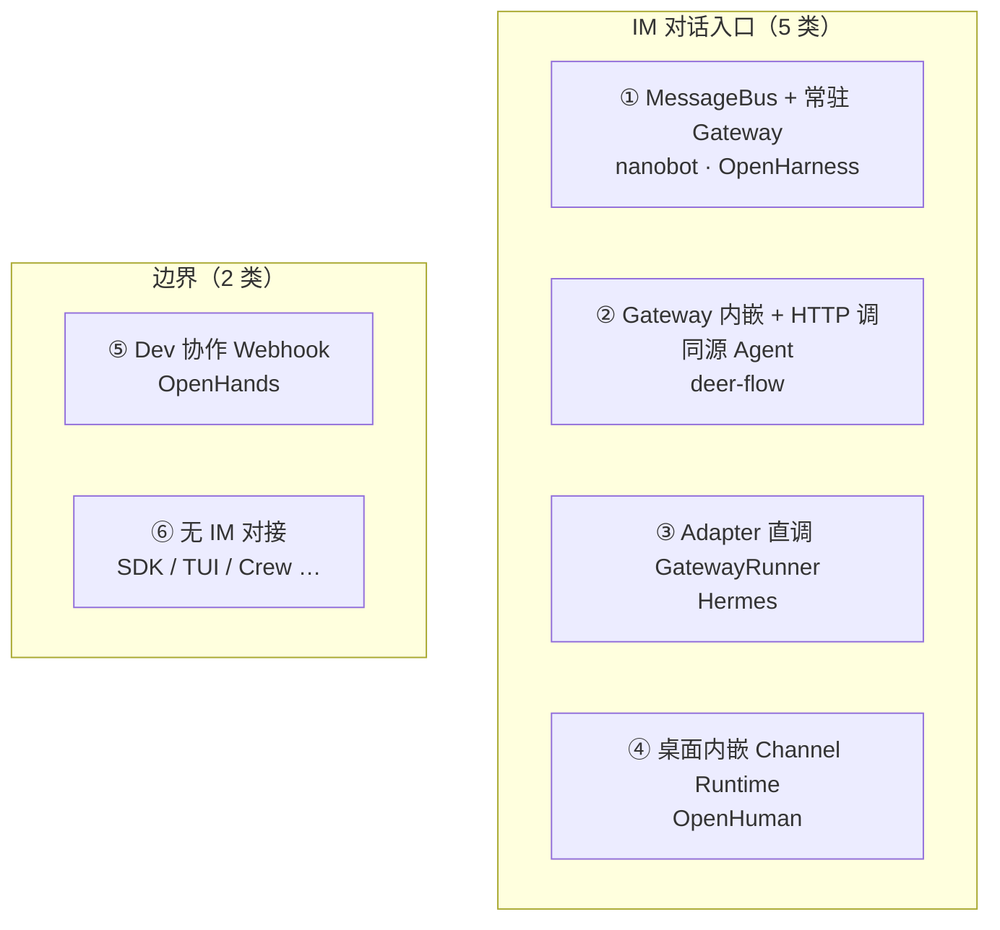
```mermaid
flowchart TB
    subgraph IM["IM 对话入口（5 类）"]
        C1["① MessageBus + 常驻 Gateway<br/>nanobot · OpenHarness"]
        C2["② Gateway 内嵌 + HTTP 调同源 Agent<br/>deer-flow"]
        C3["③ Adapter 直调 GatewayRunner<br/>Hermes"]
        C4["④ 桌面内嵌 Channel Runtime<br/>OpenHuman"]
    end

    subgraph Edge["边界（2 类）"]
        C5["⑤ Dev 协作 Webhook<br/>OpenHands"]
        C0["⑥ 无 IM 对接<br/>SDK / TUI / Crew …"]
    end
```

| 类 | 代表 | 一句话 |
|----|------|--------|
| **① Bus + Gateway** | nanobot、OpenHarness | 双队列解耦；Channel 与 AgentLoop/QueryEngine 分离 |
| **② 内嵌 + SDK** | deer-flow | IM 与 Web UI **同 LangGraph API** |
| **③ 直调 Runner** | Hermes | 无 Bus；Adapter → GatewayRunner → AIAgent |
| **④ 桌面 Core** | OpenHuman | Rust Channel trait + EventBus；Tauri 内嵌 |
| **⑤ Dev Webhook** | OpenHands | Issue/@mention **触发任务**，回 PR/Comment |
| **⑥ 无对接** | deepagents、OpenManus 等 | CLI/TUI/API/库 only |

### 4.1 连接技术子类（跨项目共性）

| 子类 | 典型平台 | 使用项目 |
|------|----------|----------|
| **WebSocket / Stream SDK（出站）** | 飞书、钉钉、企微 Bot、Slack Socket | nanobot、OH、deer-flow、Hermes、OpenHuman |
| **Long Polling** | Telegram、微信 iLink/Weixin、Matrix | 同上 |
| **Inbound Webhook** | Telegram 可选、Hermes 飞书、MS Teams、OpenHands | 多为备选；IM Gateway **默认多出站长连接** |

### 4.2 各类架构详解（由浅入深）

#### ① MessageBus + 常驻 Gateway + Channel 适配器

**代表**：nanobot、OpenHarness

```text
IM SDK → BaseChannel → MessageBus(inbound/outbound) → Bridge/AgentLoop → 回 Bus → ChannelManager.send
```

- **优点**：Channel 与 Agent **完全解耦**；易插件化（`entry_points`）；出站统一 dispatcher（流式/重试/去重）。
- **差异**：nanobot 用 `AgentLoop` + 同 session **Lock + pending inject**；OpenHarness 用 `OhmoGatewayBridge` + `QueryEngine`，同 session 新消息 **interrupt**。
```
openharness
IM User → TelegramChannel ──publish_inbound──> MessageBus
                                                ↓
                                        OhmoGatewayBridge (consume_inbound)
                                                ↓
                                        RuntimePool → QueryEngine
                                                ↓
Agent StreamEvent → GatewayStreamUpdate ─publish_outbound──> MessageBus
                                                ↓
                                        ChannelManager (_dispatch_outbound consume_outbound)
                                                ↓
                                        TelegramChannel.send() → IM User
```
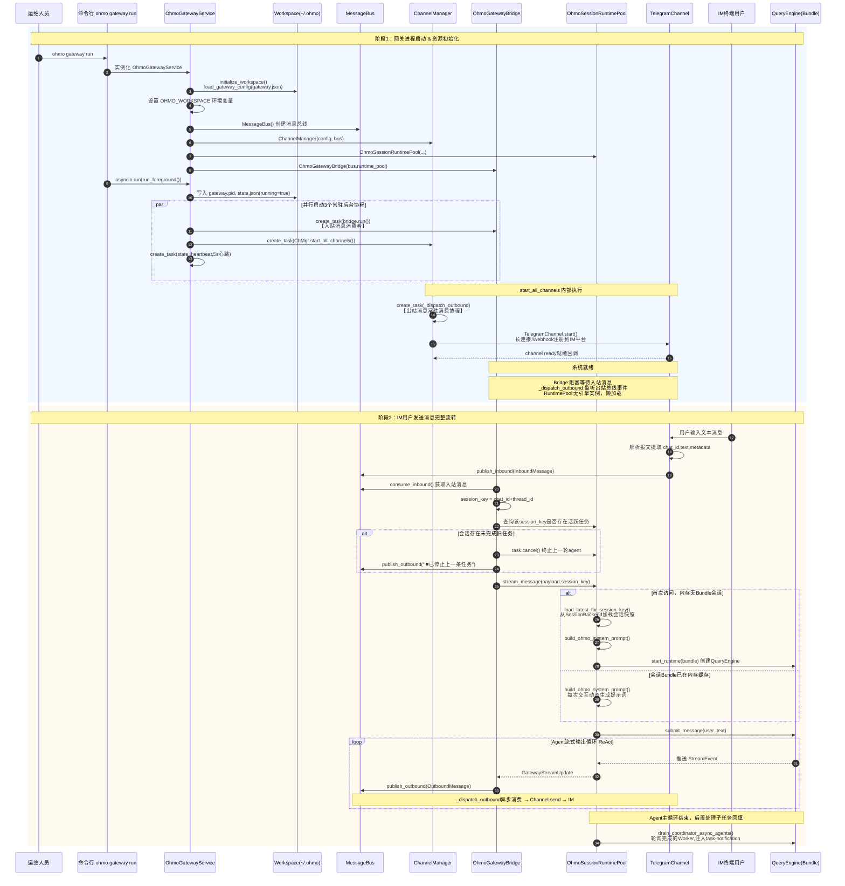
```mermaid
sequenceDiagram
    autonumber
    participant Operator as 运维人员
    participant CLI as 命令行 ohmo gateway run
    participant GWSvc as OhmoGatewayService
    participant WS as Workspace(~/.ohmo)
    participant Bus as MessageBus
    participant ChMgr as ChannelManager
    participant Bridge as OhmoGatewayBridge
    participant RuntimePool as OhmoSessionRuntimePool
    participant TelegramCh as TelegramChannel
    participant IMUser as IM终端用户
    participant QE as QueryEngine(Bundle)

%% ========== 阶段 1：网关启动初始化 ==========
    rect rgb(242,248,255)
        Note over Operator,QE:阶段1：网关进程启动 & 资源初始化
        Operator->>CLI: ohmo gateway run
        CLI->>GWSvc: 实例化 OhmoGatewayService
        GWSvc->>WS: initialize_workspace()<br/>load_gateway_config(gateway.json)
        GWSvc->>GWSvc: 设置 OHMO_WORKSPACE 环境变量
        GWSvc->>Bus: MessageBus() 创建消息总线
        GWSvc->>ChMgr: ChannelManager(config, bus)
        GWSvc->>RuntimePool: OhmoSessionRuntimePool(...)
        GWSvc->>Bridge: OhmoGatewayBridge(bus,runtime_pool)
        CLI->>GWSvc: asyncio.run(run_foreground())
        GWSvc->>WS: 写入 gateway.pid, state.json(running=true)
        par 并行启动3个常驻后台协程
            GWSvc->>Bridge: create_task(bridge.run())<br/>【入站消息消费者】
            GWSvc->>ChMgr: create_task(ChMgr.start_all_channels())
            GWSvc->>GWSvc: create_task(state_heartbeat,5s心跳)
        end
        Note over ChMgr,TelegramCh: start_all_channels 内部执行
        ChMgr->>ChMgr: create_task(_dispatch_outbound)<br/>【出站消息常驻消费协程】
        ChMgr->>TelegramCh: TelegramChannel.start()<br/>长连接/Webhook注册到IM平台
        TelegramCh-->>ChMgr: channel ready就绪回调
        Note over Bridge,TelegramCh:系统就绪
        Note over Bridge,TelegramCh: Bridge:阻塞等待入站消息<br/>_dispatch_outbound:监听出站总线事件<br/>RuntimePool:无引擎实例，懒加载
    end

%% ========== 阶段 2：单条用户消息完整收发链路 ==========
    rect rgb(255,250,240)
        Note over Operator,QE:阶段2：IM用户发送消息完整流转
        IMUser->>TelegramCh: 用户输入文本消息
        TelegramCh->>TelegramCh: 解析报文提取 chat_id,text,metadata
        TelegramCh->>Bus: publish_inbound(InboundMessage)
        Bridge->>Bus: consume_inbound() 获取入站消息
        Bridge->>Bridge: session_key = chat_id+thread_id
        Bridge->>RuntimePool: 查询该session_key是否存在活跃任务
        alt 会话存在未完成旧任务
            Bridge->>RuntimePool: task.cancel() 终止上一轮agent
            Bridge->>Bus: publish_outbound("⏹️已停止上一条任务")
        end
        Bridge->>RuntimePool: stream_message(payload,session_key)
        alt 首次访问，内存无Bundle会话
            RuntimePool->>RuntimePool: load_latest_for_session_key()<br/>从SessionBackend加载会话快照
            RuntimePool->>RuntimePool: build_ohmo_system_prompt()
            RuntimePool->>QE: start_runtime(bundle) 创建QueryEngine
        else 会话Bundle已在内存缓存
            RuntimePool->>RuntimePool: build_ohmo_system_prompt()<br/>每次交互动态生成提示词
        end
        RuntimePool->>QE: submit_message(user_text)

        loop Agent流式输出循环 ReAct
            QE-->>RuntimePool: 推送 StreamEvent
            RuntimePool-->>Bridge: GatewayStreamUpdate
            Bridge->>Bus: publish_outbound(OutboundMessage)
            Note over Bus,TelegramCh: _dispatch_outbound异步消费 → Channel.send → IM
        end

        Note over RuntimePool,QE: Agent主循环结束，后置处理子任务回填
        RuntimePool->>QE: drain_coordinator_async_agents()<br/>轮询完成的Worker,注入task‑notification
    end
```
# 两个项目组件等价映射对照表

| 功能 | Deer‑Flow | Open‑Ohmo 新版总线架构 |
| --- | --- | --- |
| Channel 实例启停、长连接 / Webhook | ChannelManager | ChannelManager |
| **消费 inbound 用户上行消息** | ✅ ChannelManager | ❌ 不做；由 OhmoGatewayBridge |
| session_key /thread_id 会话计算 | ChannelManager | OhmoGatewayBridge |
| 会话并发管控、旧任务 cancel | ChannelManager | OhmoGatewayBridge |
| 下发请求到 Agent 运行时 (LangGraph/QueryEngine) | ChannelManager 直接调用 Gateway | OhmoGatewayBridge → RuntimePool |
| 消费 outbound、分发消息回 IM | ✅ ChannelManager | ✅ ChannelManager |


#### ② Gateway 内嵌 Channel + SDK 调同源 Agent API

**代表**：deer-flow

```text
Channel → MessageBus → ChannelManager → langgraph-sdk(runs.wait/stream) → Gateway 内 make_lead_agent
```

- **优点**：IM 与 **Web UI 严格同 Agent 图**；thread 映射清晰（`ChannelStore`）。
- **代价**：多一层 HTTP；同 thread **reject** 并发 run。

#### ③ Platform Adapter 直调 GatewayRunner（无独立 Bus）

**代表**：Hermes Agent

```text
IM → BasePlatformAdapter.handle_message → GatewayRunner → AIAgent.run_conversation → adapter.send
```

- **优点**：延迟低；progress 与 Telegram 编辑气泡等 **深度绑定**；平台枚举广 + 插件。
- **代价**：适配器与 Runner **耦合**，测试面不如双队列 Bus 清晰。

#### ④ 桌面内嵌 Channel Runtime（EventBus + Rust trait）

**代表**：OpenHuman

```text
IM → channels/*Channel → dispatch loop → EventBus → Agent harness → Socket.IO/Web 推 UI + 平台 send
```

- **优点**：与个人桌面、审批门、沙箱、多账号 CEF 一体；适合 **社区/桌面助手**。
- **形态**：不是单独 `gateway` CLI，而是 **Core 进程内** 监听器。
## OpenHuman 完整数据流（入站 + 出站）

### 入站链路（用户上行）

```
IM平台事件 → TinyChannels‑Provider(适配器)
→ 标准化成 ChannelInboundEnvelope
→ 投递 Domain‑Event‑Bus
→ TurnDispatcher / ChannelInboundSink【消费 inbound】
    ├─生成 thread‑id(session_key)
    ├─查询活跃任务、旧任务cancel互斥
    └─chat‑harness 开启Agent Turn循环
→ Agent执行（可spawn子Agent，每个子会话独立Inbox队列）
```

### 出站链路（Agent 下行回复）

```
Agent输出 → ChannelOutboundIntent事件 → Domain‑Event‑Bus
→ ChannelManager / TinyChannels 出站分发器 【消费出站事件】
→ Provider发送API回IM → 送达用户
```
# OpenHuman / Open‑Ohmo / Deer‑Flow 启动‑注册‑消息收发时序对照表

表格

| 阶段 | 步骤 | OpenHuman (tinyhumansai) | Open‑Ohmo (新版总线架构) | Deer‑Flow |
| --- | --- | --- | --- | --- |
| **阶段 1网关进程启动初始化** | 1. 进程入口启动 | Rust Kernel 主进程启动，加载全局配置 | `ohmo gateway run`，OhmoGatewayService 启动 | 网关入口启动 |
|  | 2. 加载工作区 & 配置文件 | 加载渠道凭证、会话存储配置 | `initialize_workspace()`，读取 `gateway.json`，写入 pid、state.json | 加载 yaml 渠道配置 |
|  | 3. 实例化消息总线 | 创建 `Domain‑Event‑Bus` 领域事件总线 | 创建 `MessageBus`，拆分 inbound /outbound 两条队列 | 创建 `MessageBus`，双队列 |
|  | 4. 实例化渠道管理器 | `ChannelManager`，仅管理 Provider 生命周期 | `ChannelManager(config,bus)` | `ChannelManager(config,bus)` |
|  | 5. 实例化会话调度组件 | `TurnDispatcher`（等价 Bridge） | `OhmoGatewayBridge(bus, runtime_pool)` | **无独立 Bridge 组件** |
|  | 6. 实例化会话运行池 | Session Orchestrator 会话编排器每个会话分配独立 Inbox 队列 | `OhmoSessionRuntimePool`，Bundle+QueryEngine 容器 | LangGraph Thread / RunManager |
|  | 7. 拉起常驻后台协程 / 任务 | 1. TurnDispatcher‑入站消费循环2. ChannelManager‑出站分发循环3. subconscious 记忆后台任务 | 1. `bridge.run()` 入站消费者2. `ChMgr.start_all_channels()`3. state_heartbeat 5 秒心跳 | 1. ChannelManager‑inbound_dispatch_loop2. ChannelManager‑_dispatch_outbound3. 可选心跳任务 |
| **阶段 2渠道注册就绪** | 8. 启动各个 IM 适配器 | ChannelManager → Provider.start()建立长连接 / Webhook，向 IM 平台注册 | ChannelManager → TelegramChannel.start()长连接 / Webhook 注册 IM 平台 | ChannelManager → Channel.start() |
|  | 9. 后台出站消费协程启动 | 出站分发循环常驻，等待出站事件 | `_dispatch_outbound` 常驻协程启动 | `_dispatch_outbound` 常驻协程启动 |
|  | 10. 系统就绪状态 | TurnDispatcher 阻塞等待入站事件；会话运行池懒加载，无预先创建 Agent 实例 | Bridge 阻塞等待入站；RuntimePool 无引擎实例，懒创建 Bundle | ChannelManager 阻塞等待 inbound 消息 |
| **阶段 3用户上行消息流转** | 11.IM 推送用户消息 | IM → TinyChannels‑Provider 适配器接收报文 | IM → TelegramChannel 接收报文 | IM → TelegramChannel 接收报文 |
|  | 12. 消息标准化 & 投递总线 | 封装 `ChannelInboundEnvelope`，发布入站事件到总线 | 解析消息生成`InboundMessage`，`publish_inbound()` | 解析消息，`publish_inbound()` |
|  | 13. 总线消息消费者 | **TurnDispatcher 消费 inbound**ChannelManager 不读取入站队列 | **OhmoGatewayBridge 消费 inbound**ChannelManager 完全不碰入站消息 | **ChannelManager 消费 inbound** |
|  | 14. 会话 key /thread_id 生成 | 生成 thread_id，唯一会话标识 | `session_key = chat_id + thread_id` | `thread_id` |
|  | 15. 并发管控：旧任务中断 | 查询会话活跃任务，存在则 cancel 旧任务 + 下发停止通知 | 查询 session_key 活跃任务，`task.cancel()`+ 停止通知 | ChannelManager 内执行任务取消逻辑 |
|  | 16. 下发会话运行池 | 交给 Session Orchestrator 启动 Agent Turn 循环 | `stream_message()`下发 OhmoSessionRuntimePool | 直接调用 LangGraph‑Gateway |
|  | 17. 冷启动‑会话快照恢复 | 懒加载会话快照、重建上下文 | `load_latest_for_session_key()` → start_runtime(bundle) | load‑thread‑snapshot |
|  | 18. 启动 Agent 内核循环 | chat‑harness Agent Turn 循环 | `submit_message(user_text)`，QueryEngine ReAct 循环 | LangGraph run |
| **阶段 4Agent 流式输出‑下行返回** | 19.Agent 产出结果 | Agent 输出生成`ChannelOutboundIntent`领域事件，发布出站总线 | 推送 StreamEvent → GatewayStreamUpdate → `publish_outbound(OutboundMessage)` | 流式产出，publish_outbound |
|  | 20. 出站消息消费者 | ChannelManager 消费出站事件 | ChannelManager/_dispatch_outbound 消费出站 | ChannelManager/_dispatch_outbound 消费出站 |
|  | 21. 发送回 IM 用户 | Provider 调用 IM API 返回消息 | TelegramChannel.send() → IMUser | Channel.send () → IM 用户 |
| **阶段 5Agent 结束，子 Worker 任务回填** | 22. 后台子任务结果回填机制 | Worker 完成 → **主动推送通知消息写入主会话 Inbox**（回调推送，无轮询） | 主会话结束后主动调用 `drain_coordinator_async_agents()` 轮询 TaskManager，注入 task‑notification 消息 | 子任务回调推送结果 |

### openhuman
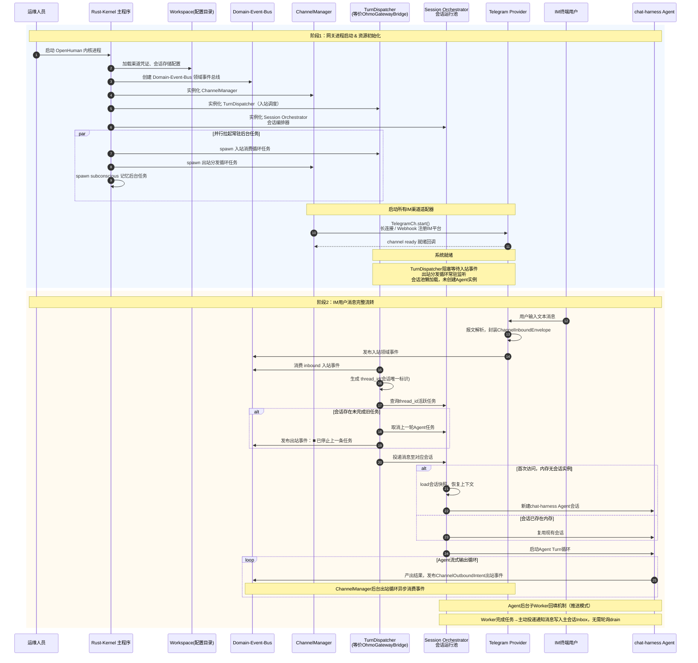
```mermaid
sequenceDiagram
    autonumber
    participant Operator as 运维人员
    participant Kernel as Rust‑Kernel 主程序
    participant Workspace as Workspace(配置目录)
    participant Bus as Domain‑Event‑Bus
    participant ChMgr as ChannelManager
    participant Dispatcher as TurnDispatcher<br/>(等价OhmoGatewayBridge)
    participant SessionOrch as Session Orchestrator<br/>会话运行池
    participant TelegramCh as Telegram Provider
    participant IMUser as IM终端用户
    participant Agent as chat‑harness Agent

    rect rgb(242,248,255)
        Note over Operator,Agent:阶段1：网关进程启动 & 资源初始化
        Operator->>Kernel: 启动 OpenHuman 内核进程
        Kernel->>Workspace: 加载渠道凭证、会话存储配置
        Kernel->>Bus: 创建 Domain‑Event‑Bus 领域事件总线
        Kernel->>ChMgr: 实例化 ChannelManager
        Kernel->>Dispatcher: 实例化 TurnDispatcher（入站调度）
        Kernel->>SessionOrch: 实例化 Session Orchestrator<br/>会话编排器
        par 并行拉起常驻后台任务
            Kernel->>Dispatcher: spawn 入站消费循环任务
            Kernel->>ChMgr: spawn 出站分发循环任务
            Kernel->>Kernel: spawn subconscious 记忆后台任务
        end

        Note over ChMgr,TelegramCh:启动所有IM渠道适配器
        ChMgr->>TelegramCh: TelegramCh.start()<br/>长连接 / Webhook 注册IM平台
        TelegramCh-->>ChMgr: channel ready 就绪回调

        Note over Dispatcher,TelegramCh:系统就绪
        Note over Dispatcher,TelegramCh: TurnDispatcher阻塞等待入站事件<br/>出站分发循环常驻监听<br/>会话池懒加载，未创建Agent实例
    end

    rect rgb(255,250,240)
        Note over Operator,Agent:阶段2：IM用户消息完整流转
        IMUser->>TelegramCh: 用户输入文本消息
        TelegramCh->>TelegramCh: 报文解析，封装ChannelInboundEnvelope
        TelegramCh->>Bus: 发布入站领域事件

        Dispatcher->>Bus: 消费 inbound 入站事件
        Dispatcher->>Dispatcher: 生成 thread_id(会话唯一标识)
        Dispatcher->>SessionOrch: 查询thread_id活跃任务

        alt 会话存在未完成旧任务
            Dispatcher->>SessionOrch: 取消上一轮Agent任务
            Dispatcher->>Bus: 发布出站事件：⏹️已停止上一条任务
        end

        Dispatcher->>SessionOrch: 投递消息至对应会话

        alt 首次访问，内存无会话实例
            SessionOrch->>SessionOrch: load会话快照，恢复上下文
            SessionOrch->>Agent: 新建chat‑harness Agent会话
        else 会话已存在内存
            SessionOrch->>Agent: 复用现有会话
        end

        SessionOrch->>Agent: 启动Agent Turn循环

        loop Agent流式输出循环
            Agent->>Bus: 产出结果，发布ChannelOutboundIntent出站事件
            Note over Bus,TelegramCh: ChannelManager后台出站循环异步消费事件
        end

        Note over SessionOrch,Agent: Agent后台子Worker回填机制（推送模式）
        Note over SessionOrch,Agent: Worker完成任务→主动投递通知消息写入主会话Inbox，无需轮询drain
    end
```
### nanobot
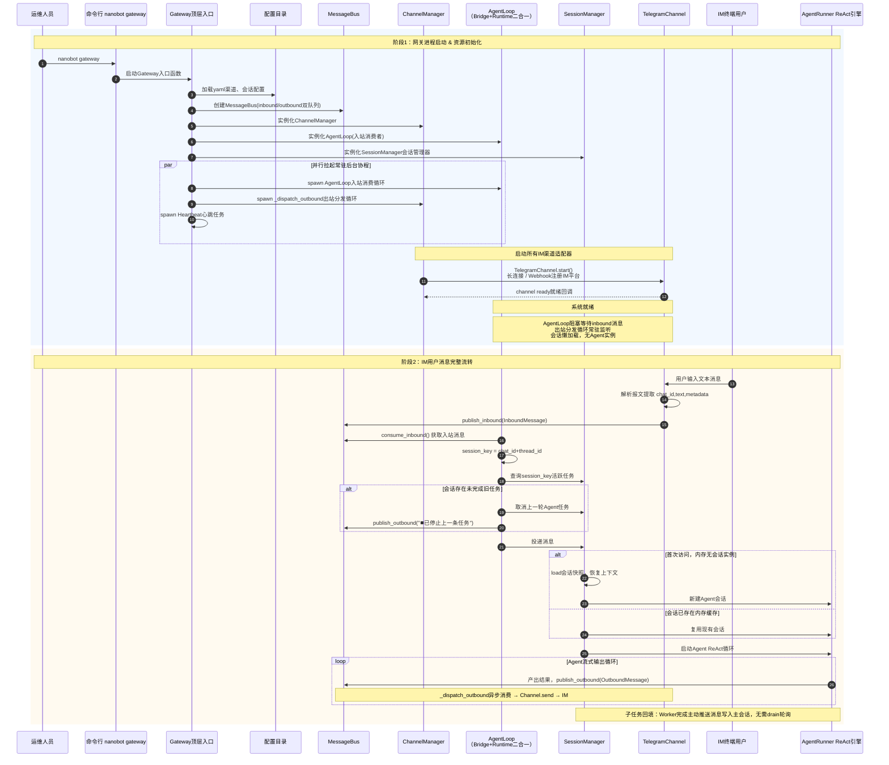
```mermaid
sequenceDiagram
    autonumber
    participant Operator as 运维人员
    participant CLI as 命令行 nanobot gateway
    participant Gateway as Gateway顶层入口
    participant Workspace as 配置目录
    participant Bus as MessageBus
    participant ChMgr as ChannelManager
    participant AgentLoop as AgentLoop<br/>（Bridge+Runtime二合一）
    participant SessionMgr as SessionManager
    participant TelegramCh as TelegramChannel
    participant IMUser as IM终端用户
    participant AgentRunner as AgentRunner ReAct引擎

    rect rgb(242,248,255)
    Note over Operator,AgentRunner:阶段1：网关进程启动 & 资源初始化
    Operator->>CLI: nanobot gateway
    CLI->>Gateway: 启动Gateway入口函数
    Gateway->>Workspace: 加载yaml渠道、会话配置
    Gateway->>Bus: 创建MessageBus(inbound/outbound双队列)
    Gateway->>ChMgr: 实例化ChannelManager
    Gateway->>AgentLoop: 实例化AgentLoop(入站消费者)
    Gateway->>SessionMgr: 实例化SessionManager会话管理器

    par 并行拉起常驻后台协程
        Gateway->>AgentLoop: spawn AgentLoop入站消费循环
        Gateway->>ChMgr: spawn _dispatch_outbound出站分发循环
        Gateway->>Gateway: spawn Heartbeat心跳任务
    end

    Note over ChMgr,TelegramCh:启动所有IM渠道适配器
    ChMgr->>TelegramCh: TelegramChannel.start()<br/>长连接 / Webhook注册IM平台
    TelegramCh-->>ChMgr: channel ready就绪回调

    Note over AgentLoop,TelegramCh:系统就绪
    Note over AgentLoop,TelegramCh: AgentLoop阻塞等待inbound消息<br/>出站分发循环常驻监听<br/>会话懒加载，无Agent实例
    end

rect rgb(255,250,240)
Note over Operator,AgentRunner:阶段2：IM用户消息完整流转
IMUser->>TelegramCh: 用户输入文本消息
TelegramCh->>TelegramCh: 解析报文提取 chat_id,text,metadata
TelegramCh->>Bus: publish_inbound(InboundMessage)

AgentLoop->>Bus: consume_inbound() 获取入站消息
AgentLoop->>AgentLoop: session_key = chat_id+thread_id
AgentLoop->>SessionMgr: 查询session_key活跃任务

alt 会话存在未完成旧任务
    AgentLoop->>SessionMgr: 取消上一轮Agent任务
    AgentLoop->>Bus: publish_outbound("⏹️已停止上一条任务")
end

AgentLoop->>SessionMgr: 投递消息

alt 首次访问，内存无会话实例
    SessionMgr->>SessionMgr: load会话快照，恢复上下文
    SessionMgr->>AgentRunner: 新建Agent会话
else 会话已存在内存缓存
    SessionMgr->>AgentRunner: 复用现有会话
end

SessionMgr->>AgentRunner: 启动Agent ReAct循环

loop Agent流式输出循环
    AgentRunner->>Bus: 产出结果，publish_outbound(OutboundMessage)
    Note over Bus,TelegramCh: _dispatch_outbound异步消费 → Channel.send → IM
end

Note over SessionMgr,AgentRunner:子任务回填：Worker完成主动推送消息写入主会话，无需drain轮询
end
```
#### ⑤ 企业 Dev 协作 Webhook（任务触发，非通用 IM Bot）

**代表**：OpenHands Enterprise

```text
GitHub/Slack/Jira/Linear/Bitbucket → POST /api/integration/... → IntegrationManager → Sandbox Agent → 回 PR/Comment
```

- **用途**：Issue、@mention、MR **触发编码任务**，不是飞书闲聊式个人助手。
- **Slack** 在这里是 **集成通道**（@mention 任务），不是 nanobot 式 Socket Mode 全双工 Bot。

#### ⑥ 无 IM 平台对接

deepagents（SDK）、deepagents-code（TUI）、OpenManus、AgentScope、MetaGPT、AutoGen、crewAI、smolagents、Letta、OpenAI/Claude SDK 等 — **无内置 Feishu/Telegram Channel 层**，需自建 Adapter 或接上述 Gateway 类产品（§13）。

---

## 5. IM Gateway 五项目速览

| 维度 | **nanobot** | **OpenHarness** | **deer-flow** | **Hermes** | **OpenHuman** |
|------|-------------|-----------------|---------------|------------|---------------|
| **代码根** | `nanobot/channels/` | `openharness/channels/` + `ohmo/gateway/` | `deer-flow/backend/app/channels/` | `hermes-agent/gateway/platforms/` | `openhuman/src/openhuman/channels/` |
| **运行时入口** | `nanobot gateway` | `ohmo gateway run` | Gateway FastAPI lifespan | `hermes gateway start` | Tauri 桌面 Core 内嵌 |
| **Agent 内核** | `AgentLoop` + `AgentRunner` | `QueryEngine` | LangGraph via SDK | `AIAgent.run_conversation` | Agent harness / turn engine |
| **解耦方式** | `MessageBus` | Bus + `OhmoGatewayBridge` | Bus + `ChannelManager`→SDK | Adapter→Runner | EventBus + dispatch |
| **同 session 并发** | Lock + pending inject | **interrupt** | `reject` | 排队/中断/debounce | supervised 审批门 |

### 5.1 各项目支持的平台（摘要）

#### nanobot（最全，16+ Channel）

飞书 · 钉钉 · 企业微信 · **个人微信** · Telegram · Slack · Discord · QQ · WhatsApp · Email · Matrix · MS Teams · Signal · Napcat(OneBot) · Mochat · **WebUI WebSocket**

连接方式以 **出站长连接** 为主（飞书/钉钉/企微/Slack 均为 WS/Stream）。详见 §7。

#### OpenHarness（channels 同源 nanobot，10+）

飞书 · 钉钉 · Slack · Telegram · Discord · QQ · Matrix · WhatsApp · Email · Mochat（企微间接）

**无** 个人微信原生；Agent 走 **ohmo QueryEngine**，不是 nanobot 的 `AgentLoop`。详见 §8。

#### deer-flow（产品 Gateway 内，7 注册）

飞书 · 钉钉 · **个人微信(iLink)** · **企业微信(aibot WS)** · Slack · Telegram · Discord

特点：与 Web UI **同一条 LangGraph Agent 路径**；飞书/企微/钉钉支持 **卡片流式**。详见 §9。

#### Hermes Agent（15+ 枚举 + 插件）

Telegram · Slack · Discord · WhatsApp · Signal · **飞书(WS/Webhook)** · **钉钉(Stream)** · **企微(WS+Callback)** · **微信个人号** · QQ · Matrix · Mattermost · Email · SMS · Webhook 入站 · OpenAI 兼容 API · 插件(Discord/SimpleX/Photon 等)。详见 §10。

#### OpenHuman（Rust 桌面，15+ Channel）

Telegram · Slack · Discord · WhatsApp · Signal · Email · **钉钉 · 飞书(Lark)** · QQ · iMessage · IRC · Mattermost · Matrix(可选) · 元宝 · Linq 等

形态：**Tauri 桌面进程内** 跑 Channel runtime，不是独立 `nanobot gateway` 进程。详见 §11。

#### OpenHands（Dev 集成，非 IM Bot）

GitHub · GitLab · Bitbucket · **Slack(@mention 任务)** · Jira / Jira DC · Linear — **Webhook 触发 Sandbox Agent**，回 PR/Comment/Ticket。详见 §12。

---

## 6. 共同设计模式

### 6.1 Adapter + Bus（nanobot / OpenHarness / deer-flow）

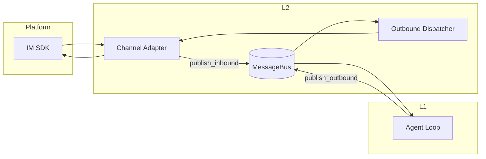
```mermaid
flowchart LR
    subgraph Platform
        IM[IM SDK]
    end
    subgraph L2
        AD[Channel Adapter]
        BUS[(MessageBus)]
        DISP[Outbound Dispatcher]
    end
    subgraph L1
        AG[Agent Loop]
    end
    IM --> AD
    AD -->|publish_inbound| BUS
    BUS --> AG
    AG -->|publish_outbound| BUS
    BUS --> DISP
    DISP --> AD
    AD --> IM
```

**Adapter 必做三件事**：

1. **`start()`** — 长期阻塞，监听平台（WS / Poll / Stream）。
2. **入站归一化** — 解析 @mention、thread、媒体 → 统一 DTO + `session_key`。
3. **`send()`** — 把 Outbound 转成平台 API（Markdown 转换、分片、卡片 patch）。

### 6.2 Direct Gateway（Hermes）

Hermes 用 **`BasePlatformAdapter.handle_message()` → `GatewayRunner._handle_message_with_agent()`**，无独立双队列 Bus；语义上仍是 Adapter + 编排器，只是 **in-process 函数调用** 代替 Queue。

### 6.3 出站分发

| 项目 | 出站路径 |
|------|----------|
| nanobot | `ChannelManager._dispatch_outbound()` 独立 asyncio task，合并 stream delta、过滤 progress |
| OpenHarness | 同 nanobot 模式 |
| deer-flow | `MessageBus.publish_outbound` → 各 Channel 注册的 `_on_outbound` 回调 |
| Hermes | `adapter.send()` 由 Runner 在 Agent 回调中直接调用 |
| OpenHuman | EventBus + Socket.IO 推 UI；IM 平台 `Channel::send` |

### 6.4 鉴权

| 模式 | 典型项目 |
|------|----------|
| `allowFrom` / pairing code | nanobot |
| `allow_from` + 群策略 mention | OpenHarness / deer-flow |
| env allowlist + 适配器自带 `group_policy` | Hermes |
| `SecurityPolicy` + `prompt_injection` 域 | OpenHuman |

### 6.5 桌面 EventBus（OpenHuman）

OpenHuman 不用 Python 式 `MessageBus`，而用 Rust **`EventBus`**（`src/core/event_bus/`）：

```text
Channel listener → channels/runtime/dispatch.rs
  → publish DomainEvent::ChannelInbound
  → Agent harness turn_engine
  → Socket.IO WebChannelEvent → React UI
  → Channel.send 回 IM 平台
```

入站路径强制经过 **`prompt_injection`** 与 **审批门（Approval gate）**；Channel 与 Web Chat 共用 Core，但 **External Channel** 有独立 provenance 标记。

### 6.6 Gateway 启动与 Channel 注册（总览）

各项目在 **进程启动时** 如何把 Channel/Adapter 拉起来，可归纳为下表（细节见各章「启动时序」小节）：

| 项目 | 入口命令 / 触发 | 注册方式 | 谁消费 inbound | 谁启动监听 | 并行任务 |
|------|-----------------|----------|----------------|------------|----------|
| **nanobot** | `nanobot gateway` | `registry.discover_enabled()` + `entry_points("nanobot.channels")` | `AgentLoop.run()` | 各 `BaseChannel.start()` | AgentLoop ∥ ChannelManager.start_all() |
| **OpenHarness** | `ohmo gateway run` | 同 nanobot fork（`openharness/channels`） | `OhmoGatewayBridge.run()` | `ChannelManager.start_all()` | Bridge ∥ ChannelManager |
| **deer-flow** | Gateway FastAPI `lifespan` | 硬编码 `_CHANNEL_REGISTRY` 名字→类路径 | `ChannelManager._dispatch_loop()` | 各 `Channel.start()` | LangGraph runtime ∥ ChannelService |
| **Hermes** | `hermes gateway start` | `config.platforms` + `platform_registry` 插件 | `GatewayRunner._handle_message`（直调） | 各 `adapter.connect()` | GatewayRunner 单进程 + 后台 ticker |
| **OpenHuman** | Tauri Core `start_channels()` | `config.channels_config.*` 逐项 `new()` | `run_message_dispatch_loop` | `spawn_supervised_listener` × N | dispatch loop ∥ N 个 listener task |
| **OpenHands** | App Server 启动 | FastAPI 挂载 `/api/integration/{svc}/events` | `IntegrationManager`（Webhook 触发） | **无长连接监听** | 被动 HTTP 入站 |

**共性**：先读配置里 `enabled` → 发现/实例化 Adapter → 启动 **出站分发** 或 **入站消费循环** → 各 Channel **长期 `start()`/connect()**。

### 6.7 为什么 ChannelManager「只走出、不进」？deer-flow 为何不同？

从**领域命名**看，`ChannelManager` 像应该统一管进出的「邮局」；实际上 **没有任何项目** 让入站和出站都经过同一个 `ChannelManager` 方法——差别在于 **谁消费 inbound、谁投递 outbound**。

#### 6.7.1 三项目 inbound / outbound 分工对照

| 角色 | **nanobot** | **deer-flow** | **OpenHarness ohmo** |
|------|-------------|---------------|----------------------|
| **入站 publish** | `BaseChannel` → `bus.publish_inbound` | `Channel` → `bus.publish_inbound` | 同 nanobot fork |
| **入站 consume** | **`AgentLoop.run()`** | **`ChannelManager._dispatch_loop()`** | **`OhmoGatewayBridge.run()`** |
| **出站 publish** | `AgentLoop` → `bus.publish_outbound` | `ChannelManager` → `bus.publish_outbound` | `RuntimePool` / Bridge → `bus.publish_outbound` |
| **出站 consume** | **`ChannelManager._dispatch_outbound()`** | **各 Channel 的 `_on_outbound` 回调**（`bus.subscribe_outbound`） | **`ChannelManager._dispatch_outbound()`** |
| **ChannelManager 实际职责** | 工厂 + 启动 Channel + **出站邮局** | **入站调度中心** + 调 LangGraph SDK | 同 nanobot（出站邮局） |

```text
nanobot / ohmo（Bus 双队列，消费者分裂）:

  入站:  Channel ──publish──► inbound ──consume──► AgentLoop / OhmoGatewayBridge
  出站:  Agent / Bridge ──publish──► outbound ──consume──► ChannelManager ──► Channel

deer-flow（入站集中、出站广播）:

  入站:  Channel ──publish──► inbound ──consume──► ChannelManager ──► langgraph-sdk
  出站:  ChannelManager ──publish──► outbound ──fan-out──► 各 Channel._on_outbound
```

**结论**：你觉得 deer-flow「挺好」，是因为它把 **IM→Agent 整条产品链** 放进 `ChannelManager`（thread 映射、`runs.wait/stream`、reject 并发），名字和职责更一致。nanobot 的 `ChannelManager` 其实是历史命名——更准确叫 **`ChannelRegistry + OutboundDispatcher`**；**入站消费者是 Agent 内核**（`AgentLoop`），不是 Channel 层。

#### 6.7.2 为什么 nanobot 不把 inbound 也塞进 ChannelManager？

1. **`AgentLoop` 不只是 dispatcher**：它包含 Turn FSM（RESTORE→COMPACT→BUILD→RUN→SAVE→RESPOND）、`SessionManager`、`Consolidator`、pending queue 注入、子 Agent 等——入站 **天然应接到 Loop**，多经一层 Manager 没有收益。
2. **入站在 Channel 已归一化**：`BaseChannel._handle_message()` 做完鉴权、DTO 构造；再经 Manager 转发只是多一次队列 hop。
3. **出站需要集中治理**：流式 delta 合并、progress/reasoning 过滤、重试、去重——**所有 Channel 共用一套** `_dispatch_outbound`，放 Manager 合理。
4. **并行模型**：`AgentLoop.run()` ∥ `ChannelManager.start_all()` 是刻意设计的 **双消费者**（一个吃 inbound，一个吃 outbound），而不是「Manager 包办一切」。

#### 6.7.3 OhmoGatewayBridge 是什么？为什么奇怪？

OpenHarness **fork 了 nanobot 的 Channel 层**，但 **不用** `AgentLoop`，而用 **`QueryEngine`**（ReAct + interrupt）。中间缺一层「谁 `consume_inbound`？」——**`OhmoGatewayBridge` 就是 ohmo 专用的 inbound 消费者**，地位上等于 nanobot 的 `AgentLoop.run()`，而不是第二个 ChannelManager。

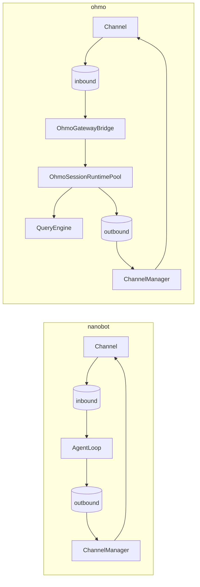
```mermaid
flowchart LR
    subgraph nanobot
        NB_CH[Channel] --> NB_IB[(inbound)]
        NB_IB --> NB_AL[AgentLoop]
        NB_AL --> NB_OB[(outbound)]
        NB_OB --> NB_CM[ChannelManager]
        NB_CM --> NB_CH
    end

    subgraph ohmo
        OH_CH[Channel] --> OH_IB[(inbound)]
        OH_IB --> OH_BR[OhmoGatewayBridge]
        OH_BR --> OH_RT[OhmoSessionRuntimePool]
        OH_RT --> OH_QE[QueryEngine]
        OH_RT --> OH_OB[(outbound)]
        OH_OB --> OH_CM[ChannelManager]
        OH_CM --> OH_CH
    end
```

**Bridge 里做的事**（不该塞进通用 `ChannelManager` 的 ohmo 产品逻辑）：

| 逻辑 | 说明 |
|------|------|
| `session_key_for_message()` | 群聊 / sender 路由（与 nanobot 默认规则可不同） |
| `_should_process_message()` | 飞书群策略（托管群、@mention） |
| `_interrupt_session()` | 同 session 新消息 **打断** 旧 task（非 nanobot 的 pending inject） |
| `/stop` `/restart` `/group` | ohmo 运维与飞书建群命令 |
| `runtime_pool.stream_message()` | 对接 `QueryEngine`，流式 progress → outbound |

**为什么不叫 AgentLoop？** 因为它不是 Turn FSM + `AgentRunner`，而是 **薄适配层**：Bus 消息 → QueryEngine 会话 → Bus 回复。放在 `ohmo/gateway/` 包内，与 harness 通用的 `ChannelBridge`（`channels/adapter.py`）分离——后者给非 gateway 场景用，**ohmo 生产路径走 `OhmoGatewayBridge`**。

#### 6.7.4 Hermes：连 Bus 都没有

`GatewayRunner` 同时扮演 **入站 handler + Agent 编排 + 出站 send**；`adapter.connect()` 后直接回调 `_handle_message_with_agent()`。这是第三类：**单体式 Gateway**，没有「Manager 只管一边」的问题，而是 **Adapter 与 Runner 紧耦合**。

#### 6.7.5 选型上的含义

| 若你期望… | 更接近 |
|-----------|--------|
| Channel 层薄、Agent 内核强、入站贴 Loop | **nanobot** |
| IM 与 Web 同 Agent API、入站调度在产品层一目了然 | **deer-flow** |
| fork nanobot Channel + 换 QueryEngine + interrupt 产品策略 | **ohmo**（Bridge 必不可少） |
| 最低延迟、progress 与平台深度绑定 | **Hermes**（无 Bus） |

### 6.8 Channel 层类关系图（继承 + 引用 + 核心方法）

下图帮助一眼看清：**基类是谁、平台实现有哪些、谁持有 Bus、谁消费 inbound/outbound**。方法只列 **对外契约** 与 **编排入口**，省略平台私有 helper。

#### 6.8.1 跨项目基类对照

| 项目 | 平台适配基类 | 入站 DTO | 出站 DTO | 总线 | 编排/消费类 |
|------|--------------|----------|----------|------|-------------|
| **nanobot** | `BaseChannel` | `InboundMessage` | `OutboundMessage` | `MessageBus` | `AgentLoop` |
| **OpenHarness** | `BaseChannel`（fork） | 同 nanobot | 同 nanobot | `MessageBus` | `OhmoGatewayBridge` |
| **deer-flow** | `Channel` | `InboundMessage` | `OutboundMessage` | `MessageBus` | `ChannelManager` |
| **Hermes** | `BasePlatformAdapter` | `MessageEvent` | `send()` 参数 | **无** | `GatewayRunner` |
| **OpenHuman** | `trait Channel` | `ChannelMessage` | `SendMessage` | `mpsc` + `EventBus` | `run_message_dispatch_loop` |

#### 6.8.2 nanobot / OpenHarness（channels 同源）

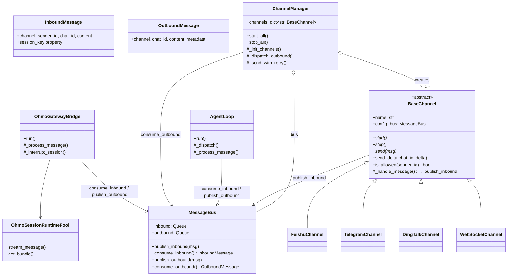
```mermaid
classDiagram
    direction TB

  class MessageBus {
    +inbound: Queue
    +outbound: Queue
    +publish_inbound(msg)
    +consume_inbound() InboundMessage
    +publish_outbound(msg)
    +consume_outbound() OutboundMessage
  }

  class InboundMessage {
    +channel, sender_id, chat_id, content
    +session_key property
  }

  class OutboundMessage {
    +channel, chat_id, content, metadata
  }

  class BaseChannel {
    <<abstract>>
    +name: str
    +config, bus: MessageBus
    +start()* 
    +stop()*
    +send(msg)*
    +send_delta(chat_id, delta)
    +is_allowed(sender_id) bool
    #_handle_message() → publish_inbound
  }

  class FeishuChannel
  class TelegramChannel
  class DingTalkChannel
  class WebSocketChannel
  class ChannelManager {
    +channels: dict~str, BaseChannel~
    +start_all()
    +stop_all()
    #_init_channels()
    #_dispatch_outbound()
    #_send_with_retry()
  }

  class AgentLoop {
    +run()
    #_dispatch()
    #_process_message()
  }

  class OhmoGatewayBridge {
    +run()
    #_process_message()
    #_interrupt_session()
  }

  class OhmoSessionRuntimePool {
    +stream_message()
    +get_bundle()
  }

  BaseChannel <|-- FeishuChannel
  BaseChannel <|-- TelegramChannel
  BaseChannel <|-- DingTalkChannel
  BaseChannel <|-- WebSocketChannel

  ChannelManager o-- MessageBus : bus
  ChannelManager o-- "1..*" BaseChannel : creates

  BaseChannel --> MessageBus : publish_inbound
  AgentLoop --> MessageBus : consume_inbound / publish_outbound
  ChannelManager --> MessageBus : consume_outbound

  OhmoGatewayBridge --> MessageBus : consume_inbound / publish_outbound
  OhmoGatewayBridge --> OhmoSessionRuntimePool
```

**其它内置 Channel**（均 `extends BaseChannel`）：`WeixinChannel` · `WecomChannel` · `SlackChannel` · `DiscordChannel` · `QQChannel` · `EmailChannel` · `MatrixChannel` · `MSTeamsChannel` · `WhatsAppChannel` · `SignalChannel` · `MochatChannel` · `NapcatChannel` …  
**发现**：`channels/registry.discover_enabled()` + `entry_points("nanobot.channels")`。

**引用关系（nanobot）**：

```text
_run_gateway()
  ├── MessageBus
  ├── AgentLoop(bus)          ← consume_inbound
  └── ChannelManager(bus)
        ├── __init__ → BaseChannel×N(bus)
        └── start_all() → _dispatch_outbound + channel.start()
```

#### 6.8.3 deer-flow

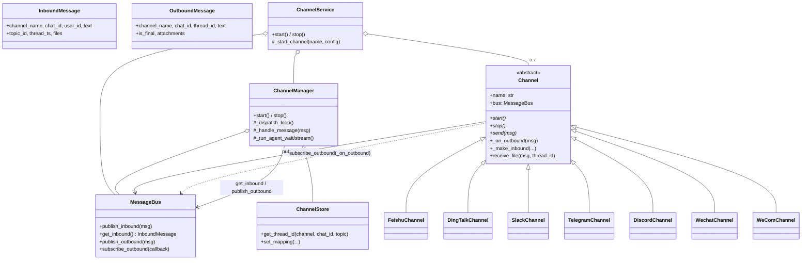
```mermaid
classDiagram
    direction TB

  class MessageBus {
    +publish_inbound(msg)
    +get_inbound() InboundMessage
    +publish_outbound(msg)
    +subscribe_outbound(callback)
  }

  class InboundMessage {
    +channel_name, chat_id, user_id, text
    +topic_id, thread_ts, files
  }

  class OutboundMessage {
    +channel_name, chat_id, thread_id, text
    +is_final, attachments
  }

  class Channel {
    <<abstract>>
    +name: str
    +bus: MessageBus
    +start()*
    +stop()*
    +send(msg)*
    +_on_outbound(msg)
    +_make_inbound(...)
    +receive_file(msg, thread_id)
  }

  class FeishuChannel
  class DingTalkChannel
  class SlackChannel
  class TelegramChannel
  class DiscordChannel
  class WechatChannel
  class WeComChannel

  class ChannelStore {
    +get_thread_id(channel, chat_id, topic)
    +set_mapping(...)
  }

  class ChannelManager {
    +start() / stop()
    #_dispatch_loop()
    #_handle_message(msg)
    #_run_agent_wait/stream()
  }

  class ChannelService {
    +start() / stop()
    #_start_channel(name, config)
  }

  Channel <|-- FeishuChannel
  Channel <|-- DingTalkChannel
  Channel <|-- SlackChannel
  Channel <|-- TelegramChannel
  Channel <|-- DiscordChannel
  Channel <|-- WechatChannel
  Channel <|-- WeComChannel

  ChannelService o-- MessageBus
  ChannelService o-- ChannelManager
  ChannelService o-- "0..7" Channel
  ChannelManager o-- MessageBus
  ChannelManager o-- ChannelStore

  Channel --> MessageBus : publish_inbound
  Channel ..> MessageBus : subscribe_outbound(_on_outbound)
  ChannelManager --> MessageBus : get_inbound / publish_outbound
```

**注册**：`ChannelService._CHANNEL_REGISTRY` 静态 `name → "module:Class"`，`resolve_class()` 懒加载。  
**与 nanobot 差异**：`ChannelManager` **消费 inbound**；出站由 **各 Channel 订阅** `bus.subscribe_outbound(self._on_outbound)`，不经 Manager 的 send 循环。

#### 6.8.4 Hermes Agent

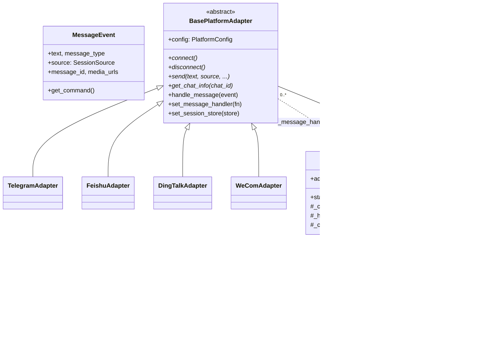
```mermaid
classDiagram
    direction TB

  class MessageEvent {
    +text, message_type
    +source: SessionSource
    +message_id, media_urls
    +get_command()
  }

  class BasePlatformAdapter {
    <<abstract>>
    +config: PlatformConfig
    +connect()*
    +disconnect()*
    +send(text, source, ...)*
    +get_chat_info(chat_id)*
    +handle_message(event)
    +set_message_handler(fn)
    +set_session_store(store)
  }

  class TelegramAdapter
  class FeishuAdapter
  class DingTalkAdapter
  class WeComAdapter

  class GatewayRunner {
    +start()
    +adapters: dict
    #_create_adapter(platform, cfg)
    #_handle_message_with_agent(event)
    #_connect_adapter_with_timeout()
  }

  class platform_registry {
    <<module>>
    +is_registered(name)
    +create_adapter(name, cfg)
    +plugin_entries()
  }

  class SessionStore {
    +get_or_create_session()
  }

  BasePlatformAdapter <|-- TelegramAdapter
  BasePlatformAdapter <|-- FeishuAdapter
  BasePlatformAdapter <|-- DingTalkAdapter
  BasePlatformAdapter <|-- WeComAdapter

  GatewayRunner o-- "0..*" BasePlatformAdapter : adapters
  GatewayRunner --> SessionStore
  GatewayRunner ..> platform_registry : _create_adapter
  BasePlatformAdapter ..> GatewayRunner : _message_handler callback
```

**无 `MessageBus`**：`adapter.connect()` 收到平台事件 → `handle_message(MessageEvent)` → 回调 `GatewayRunner._handle_message_with_agent()` → `AIAgent.run_conversation()` → `adapter.send()`。

#### 6.8.5 OpenHuman（Rust trait）

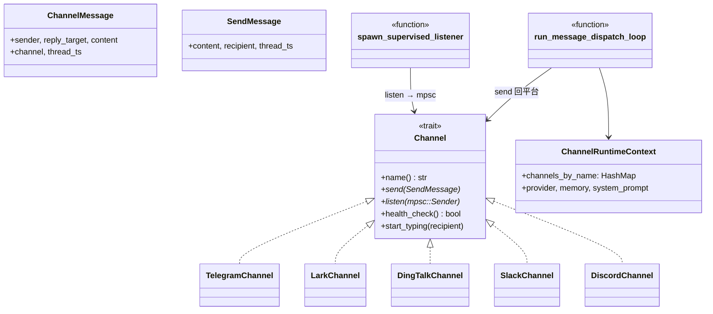
```mermaid
classDiagram
    direction TB

  class Channel {
    <<trait>>
    +name() str
    +send(SendMessage)*
    +listen(mpsc::Sender)*
    +health_check() bool
    +start_typing(recipient)
  }

  class TelegramChannel
  class LarkChannel
  class DingTalkChannel
  class SlackChannel
  class DiscordChannel

  class ChannelMessage {
    +sender, reply_target, content
    +channel, thread_ts
  }

  class SendMessage {
    +content, recipient, thread_ts
  }

  class ChannelRuntimeContext {
    +channels_by_name: HashMap
    +provider, memory, system_prompt
  }

  class spawn_supervised_listener {
    <<function>>
  }

  class run_message_dispatch_loop {
    <<function>>
  }

  Channel <|.. TelegramChannel
  Channel <|.. LarkChannel
  Channel <|.. DingTalkChannel
  Channel <|.. SlackChannel
  Channel <|.. DiscordChannel

  spawn_supervised_listener --> Channel : listen → mpsc
  run_message_dispatch_loop --> ChannelRuntimeContext
  run_message_dispatch_loop --> Channel : send 回平台
```

**注册**：`startup.rs` 里按 `config.channels_config.{telegram,lark,dingtalk,...}` **显式 `new()`**，无 Python 式 registry 扫描。

#### 6.8.6 一张图：谁继承谁、谁引用谁（Bus 架构对比）

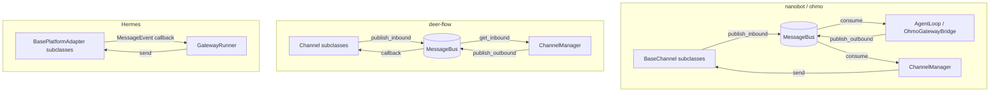
```mermaid
flowchart TB
    subgraph NB["nanobot / ohmo"]
        NBC[BaseChannel subclasses]
        NBB[(MessageBus)]
        NBC -->|publish_inbound| NBB
        NBB -->|consume| NBIn[AgentLoop / OhmoGatewayBridge]
        NBIn -->|publish_outbound| NBB
        NBB -->|consume| NBCM[ChannelManager]
        NBCM -->|send| NBC
    end

    subgraph DF["deer-flow"]
        DFC[Channel subclasses]
        DFB[(MessageBus)]
        DFC -->|publish_inbound| DFB
        DFB -->|get_inbound| DFCM[ChannelManager]
        DFCM -->|publish_outbound| DFB
        DFB -->|callback| DFC
    end

    subgraph HM["Hermes"]
        HMA[BasePlatformAdapter subclasses]
        HMR[GatewayRunner]
        HMA -->|MessageEvent callback| HMR
        HMR -->|send| HMA
    end
```

#### 6.8.7 编排类定位：`ChannelManager` / `GatewayRunner` 在哪一层？

**用法**：看图时先找 **「平台适配类」**（`BaseChannel` / `Channel` / `BasePlatformAdapter`）和 **「编排类」**（下表）。二者 **不是继承关系**，是 **组合 + 调用** 关系。

| 编排类 | 所在项目 | 在图中的位置 | 持有/引用 | 入站 | 出站 |
|--------|----------|--------------|-----------|------|------|
| **`ChannelManager`** | nanobot、ohmo | Channel **之上** 的「经理」 | `bus` + `channels: dict` | ❌ 不 consume | ✅ `consume_outbound` → `channel.send` |
| **`ChannelManager`** | deer-flow | Channel **之上** 的「调度中心」 | `bus` + `store` | ✅ `get_inbound` → LangGraph | ✅ `publish_outbound` |
| **`AgentLoop`** | nanobot | Bus 与 Agent 内核 **之间** | `bus` + `SessionManager` + `AgentRunner` | ✅ `consume_inbound` | ✅ `publish_outbound` |
| **`OhmoGatewayBridge`** | ohmo | 等同 nanobot 的 `AgentLoop` 位 | `bus` + `OhmoSessionRuntimePool` | ✅ `consume_inbound` | ✅ `publish_outbound` |
| **`GatewayRunner`** | Hermes | **顶层** 单体网关 | `adapters: dict` + `SessionStore` | ✅ adapter 回调 | ✅ 调 `adapter.send` |
| **`run_message_dispatch_loop`** | OpenHuman | Core 内 dispatch | `ChannelRuntimeContext` | ✅ mpsc 收消息 | ✅ `Channel.send` |


```mermaid
flowchart TB
    subgraph Legend["图例"]
        L1[平台适配类<br/>FeishuChannel / TelegramAdapter]
        L2[编排类<br/>Manager / Runner / Bridge / Loop]
        L3[(MessageBus)]
    end

    subgraph NB["nanobot"]
        direction LR
        NB_CH[BaseChannel×N]
        NB_CM[ChannelManager]
        NB_BUS[(MessageBus)]
        NB_AL[AgentLoop]
        NB_CH -->|publish_inbound| NB_BUS
        NB_BUS -->|consume_inbound| NB_AL
        NB_AL -->|publish_outbound| NB_BUS
        NB_BUS -->|consume_outbound| NB_CM
        NB_CM -->|send| NB_CH
        NB_CM -.->|创建/启动| NB_CH
    end

    subgraph OH["ohmo"]
        direction LR
        OH_CH[BaseChannel×N]
        OH_CM[ChannelManager]
        OH_BUS[(MessageBus)]
        OH_BR[OhmoGatewayBridge]
        OH_RT[RuntimePool]
        OH_CH --> OH_BUS
        OH_BUS --> OH_BR
        OH_BR --> OH_RT
        OH_BR --> OH_BUS
        OH_BUS --> OH_CM
        OH_CM --> OH_CH
        OH_CM -.-> OH_CH
    end

    subgraph DF["deer-flow"]
        direction LR
        DF_CH[Channel×N]
        DF_BUS[(MessageBus)]
        DF_CM[ChannelManager]
        DF_SDK[langgraph-sdk]
        DF_CH -->|publish| DF_BUS
        DF_BUS -->|get_inbound| DF_CM
        DF_CM --> DF_SDK
        DF_CM -->|publish_outbound| DF_BUS
        DF_BUS -->|subscribe callback| DF_CH
    end

    subgraph HM["Hermes — 无 Bus"]
        direction LR
        HM_AD[BasePlatformAdapter×N]
        HM_GR[GatewayRunner]
        HM_AI[AIAgent]
        HM_AD -->|MessageEvent| HM_GR
        HM_GR --> HM_AI
        HM_GR -->|send| HM_AD
        HM_GR -.->|connect/注册| HM_AD
    end
```

**从图里直接能读出的结论**：

1. **`ChannelManager` 名字相同、职责不同**  
   - nanobot/ohmo：**工厂 + 出站邮局**（虚线「创建/启动」连 Channel）  
   - deer-flow：**入站调度 + 出站 publish**（还连 `ChannelStore` / SDK，图中未展开）

2. **`GatewayRunner` 没有 `ChannelManager` 同级物** — 它自己兼做「注册 adapter + 收消息 + 跑 Agent + 发送」，所以 Hermes 子图 **没有 MessageBus**。

3. **`OhmoGatewayBridge` 占的是 `AgentLoop` 那个槽位**，不是第二个 `ChannelManager`；ohmo 里 **两个并行 task**：`Bridge.run()` ∥ `ChannelManager.start_all()`。

4. **找类时沿引用方向**：  
   - 从 `_run_gateway` / `start_gateway` / `lifespan` 往下看 **谁 `new` 了 Bus 和谁**  
   - 从 `BaseChannel` 往上看 **谁 `consume_outbound`**、**谁 `consume_inbound`**

#### 6.8.9 Hermes 封装设计评析（为何常觉得「不太好」）

与 nanobot / deer-flow 的 **Bus + 薄 Channel + 独立 Loop/Manager** 相比，Hermes 的 **GatewayRunner + 巨型 BasePlatformAdapter** 在工程上确实更「重」。这不是审美问题，而是可度量的结构差异。

**体量（本仓库快照）**：

| 文件 | 行数级 | 角色 |
|------|--------|------|
| `gateway/run.py` — `GatewayRunner` | **~16k** | 连接、鉴权、会话、Agent 调用、progress、slash、重启、Kanban… |
| `gateway/platforms/base.py` — `BasePlatformAdapter` | **~4.8k** | 连接契约 + 会话锁 + debounce + 中断 + TTS + 大量默认行为 |

`GatewayRunner` 还通过 **Mixin** 叠加：`GatewayAuthorizationMixin` · `GatewayKanbanWatchersMixin` · `GatewaySlashCommandsMixin` — 典型 **God Object 演进** 痕迹。

**与 Bus 架构对比 — 封装上的差异**：

| 维度 | nanobot / deer-flow（相对清晰） | Hermes |
|------|--------------------------------|--------|
| **边界** | Channel 只管平台 I/O；Loop/Manager 管编排 | Runner **兼** 编排 + 大量产品逻辑 |
| **依赖方向** | Channel → Bus ← Consumer（双向只经 Bus） | Adapter ←callback→ Runner；**双向注入**（`set_message_handler` / `set_session_store`） |
| **基类职责** | `BaseChannel` ~250 行：start/stop/send + `_handle_message` | `BasePlatformAdapter` 含会话锁、debounce、busy 模式、post-delivery callback… |
| **可测性** | 可 mock `MessageBus` 单测 Channel 或 Loop | 测 Adapter 常需 mock 整个 Runner 回调链 |
| **可替换性** | 换 Agent 内核只换 inbound 消费者 | 换 Agent 需动 `GatewayRunner._handle_message_with_agent` 巨方法 |
| **并发模型** | 集中在 Loop/Manager 一处 | Runner **与** Adapter **各有一份** session guard / pending |

**设计上的「合理之处」（不是洗白，是 tradeoff）**：

1. **进度与平台 UI 深度绑定** — Telegram 编辑气泡、飞书卡片 patch 等，callback 直调 `adapter.send` 延迟最低；Bus 多一跳在高频 progress 场景会被感受到。
2. **单进程个人网关** — 长期 daemon，功能持续堆在 Runner 上比抽 Bus 层更省迁移成本。
3. **插件化平台** — `platform_registry` 让第三方 adapter 注册，但 **编排仍只有 Runner 一个入口**，插件只能扩平台、难扩编排。
4. **历史包袱** — `handle_message` 注释里可见大量 issue 驱动的特殊路径（interrupt、/approve bypass、stale lock heal），Bus 抽象晚引入会更难拆。

**若用 nanobot 的标准重画 Hermes，理想拆分大概是**：

```text
PlatformAdapter（薄）→ MessageBus → GatewayDispatch（会话/鉴权/并发）
                              → AgentSession（AIAgent.run_conversation）
                              → OutboundDispatcher（progress 合并 → adapter.send）
```

当前 Hermes **把右边三层揉进 GatewayRunner + 厚 BasePlatformAdapter**，所以读类图时会感觉「`GatewayRunner` 无处不在、Adapter 也不纯」—— **你的感受与代码结构一致**。

**选型含义**：要 **最清晰的模块边界与可测性** → nanobot / deer-flow；要 **Hermes 现成生态（Cron deliver、skill_manage、多平台 progress 细节）** → 接受 Runner 单体，或只在边缘写薄插件 adapter，**不要指望轻易拆掉 Runner**。

#### 6.8.10 读图提示

| 想看… | 打开 |
|--------|------|
| nanobot 基类与 `_handle_message` | `nanobot/channels/base.py` |
| nanobot 注册 | `nanobot/channels/registry.py` · `channels/manager.py` |
| deer-flow 基类与 outbound 订阅 | `app/channels/base.py` · `feishu.py` `start()` |
| Hermes 适配器契约 | `gateway/platforms/base.py` — `BasePlatformAdapter` |
| Hermes 插件注册 | `gateway/platform_registry.py` |
| ohmo Bridge | `ohmo/gateway/bridge.py` · `runtime.py` |
| OpenHuman trait | `openhuman/channels/traits.rs` · `runtime/startup.rs` |

### 6.9 领域封装、对象封装与引用关系评榜

本节回答：**在「平台对接 + Agent 衔接」这一域内，谁的对象边界更清晰、依赖更单向、更符合常见最佳实践？**  
评价 **不** 等于「产品功能多少」—— Hermes 平台最全，但 **Channel 层封装** 并非最佳。

#### 6.9.1 评价维度（最佳实践清单）

| 维度 | 好设计的标志 | 反模式 |
|------|--------------|--------|
| **领域边界** | L2（Channel）/ L1（Agent）/ L3（平台 SDK）三层可独立阅读 | Gateway 一个类包办连接、会话、Agent、progress、slash |
| **对象职责（SRP）** | 基类只含 `start/stop/send` + 入站归一化 | 基类含会话锁、debounce、TTS、busy 模式 |
| **引用关系** | 依赖经 **中介**（Bus / EventBus / trait），无环 | Adapter ↔ Runner **双向 callback 注入** |
| **DTO / 值对象** | `InboundMessage` / `OutboundMessage` 与传输解耦 | 平台 payload 直传进 Agent 巨方法 |
| **可测性** | mock Bus 即可单测 Channel 或消费者 | 测 Channel 需 mock 整个 Runner |
| **内核可替换** | 换 Agent 只换 inbound **消费者**（Loop / Bridge / Manager 调度） | 换 Agent 要改 16k 行 `GatewayRunner` |

#### 6.9.2 IM Gateway 项目排名（L2 封装）

**总榜**（仅论 **Channel/Gateway 层的领域与对象封装**，与平台数量无关）：

| 排名 | 项目 | 综合 | 一句话 |
|:----:|------|:----:|--------|
| **1** | **nanobot** | ★★★★★ | **参考实现**：薄 `BaseChannel`（~256 行）、`MessageBus`（~44 行）、入站/出站分工固定 |
| **2** | **deer-flow** | ★★★★☆ | 更薄的 `Channel` 基类（~130 行）；`app/channels` 与 `deerflow` Agent 包 **物理分包**；Manager 偏重但职责集中 |
| **2** | **OpenHuman** | ★★★★☆ | Rust `trait Channel` + `mpsc` + `EventBus`；编译期边界清晰，与 nanobot **同套路不同语言** |
| **4** | **OpenHarness** | ★★★★ | Channel 层 **fork nanobot**（继承其封装优点）；`OhmoGatewayBridge` 占 **AgentLoop 槽位**，替换内核不碰 Channel |
| **5** | **Hermes** | ★★☆ | 功能最全，但 `GatewayRunner`（~16k）+ `BasePlatformAdapter`（~4.8k）为典型 God Object；见 [§6.8.9](#689-hermes-封装设计评析为何常觉得不太好) |
| **—** | **OpenHands** | ★★★（另域） | Dev Webhook 集成域内 **IntegrationManager + 路由** 合理，但 **不是 IM Channel 架构**，不与上表横比 IM 封装 |

**引用关系对比（谁更「单向」）**：

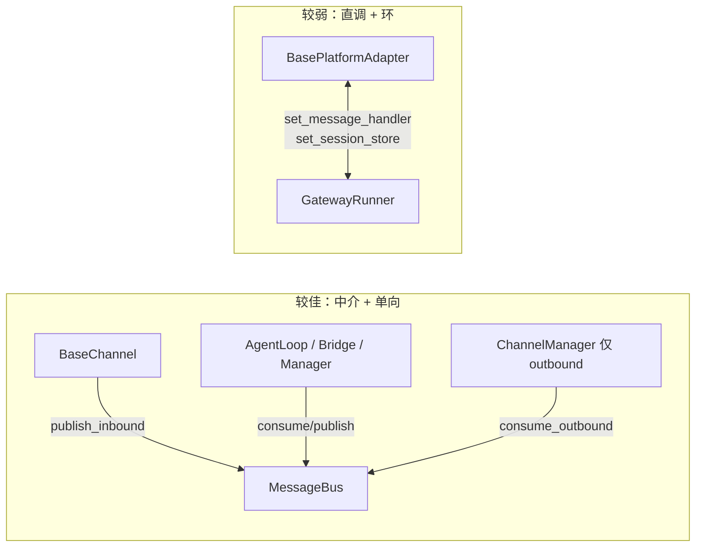
```mermaid
flowchart LR
    subgraph Good["较佳：中介 + 单向"]
        CH1[BaseChannel]
        BUS[MessageBus]
        LP1[AgentLoop / Bridge / Manager]
        MGR1[ChannelManager 仅 outbound]
        CH1 -->|publish_inbound| BUS
        LP1 -->|consume/publish| BUS
        MGR1 -->|consume_outbound| BUS
    end

    subgraph Weak["较弱：直调 + 环"]
        AD2[BasePlatformAdapter]
        RUN2[GatewayRunner]
        AD2 <-->|set_message_handler<br/>set_session_store| RUN2
    end
```

| 项目 | 依赖方向 | 中介物 | 编排类职责纯度 |
|------|----------|--------|----------------|
| nanobot | Channel → Bus ← Loop；Manager **只** consume outbound | `MessageBus` | ★★★★★ |
| OpenHarness | 同 nanobot；Bridge 替代 Loop | `MessageBus` | ★★★★★ |
| deer-flow | Channel → Bus ← Manager；各 Channel `subscribe_outbound` | `MessageBus` + callback | ★★★★（Manager 兼 inbound 调度，更重但 **一眼可见**） |
| OpenHuman | Provider → dispatch → EventBus → harness | `EventBus` / `mpsc` | ★★★★ |
| Hermes | Adapter ↔ Runner 双向 | **无** | ★★ |
| OpenHands | Webhook → IntegrationManager → Sandbox | HTTP 事件 | ★★★（Dev 域内 OK） |

**为何 nanobot 排第一（可核对源码）**：

| 构件 | 行数级 | 职责 |
|------|--------|------|
| `bus/queue.py` | ~44 | 纯队列 + DTO，**零** 业务 |
| `channels/base.py` | ~256 | 平台契约 + `_handle_message` → `publish_inbound` |
| `channels/manager.py` | ~486 | 工厂 + 启动 + **仅** `_dispatch_outbound` |
| `agent/loop.py` | ~1.7k | **唯一** inbound 消费者（与 Channel 层 **无 import 环**） |

deer-flow 的 `Channel` 基类更薄，但 `ChannelManager`（~1.2k）把 **thread 创建 + langgraph-sdk 调度 + 命令路由** 都收进来——对产品 Gateway 合理，**编排类比 nanobot 的 Manager 更胖**，故与 OpenHuman 并列第二档。

#### 6.9.3 无 IM 的 SDK / 框架（L1 封装）

这些项目 **不在 L2 Channel 域内竞争**；若只论 **Agent 运行时** 的对象封装：

| 排名 | 项目 | 综合 | 说明 |
|:----:|------|:----:|------|
| **1** | **OpenAI Agents SDK** | ★★★★ | `Runner` + typed items/handoffs/guardrails；边界在 **「一轮 Agent 运行」**，清晰可测 |
| **1** | **Claude Agent SDK** | ★★★★ | `Transport` / `ClaudeAgentOptions` / `Query` 控制协议；Python **不** 自建 loop，职责切在 CLI 边界 |
| **1** | **deepagents** (SDK) | ★★★★ | LangGraph + **middleware 链**；横切能力接口化，适合库形态 |
| **4** | **OpenManus** | ★★☆ | `Manus.run()` / `PlanningFlow` 扁平；学原型够用，**分层与 DTO 最弱** |
| **—** | **crewAI / MetaGPT / AutoGen** | ★★★ | 编排域模型清晰，但 **无** 单会话 Channel 抽象 |

**共同结论（SDK 三类）**：

| 项目 | 内置 IM Channel | 典型入口 | 若要接飞书/Telegram |
|------|:---------------:|----------|---------------------|
| **OpenAI Agents SDK** | ❌ | `Runner.run()` | 自建 Adapter → `Runner`；或上层接 deer-flow / nanobot |
| **Claude Agent SDK** | ❌ | `query()` / `ClaudeSDKClient` | 自建 `on_message` → `query()`；**MCP 连 Slack ≠ Messaging Gateway**（§2） |
| **OpenManus** | ❌ | `main.py` / `PlanningFlow` | 同左；并发为 **reject** 状态机，非 IM 排队模型 |
| **deepagents / deepagents-code** | ❌ | `create_deep_agent()` / TUI | code 的 Slack 仅为 **MCP OAuth 工具** |

#### 6.9.4 分场景推荐（封装 × 能力）

| 你最在意… | 优先选 | 避免 |
|-----------|--------|------|
| **Channel 层最佳实践、可 fork、可单测** | **nanobot** | Hermes（除非接受 Runner 单体） |
| **IM 与 Web 严格同 Agent 图 + 薄 Channel** | **deer-flow** | 把 channel 塞进 `deerflow` 包（破坏分包） |
| **桌面 Core + 类型安全 Channel trait** | **OpenHuman** | 指望 headless `gateway` CLI |
| **nanobot Channel + 换 QueryEngine + interrupt** | **OpenHarness** | 在 Channel 里写 Agent 逻辑 |
| **最多平台 + Cron deliver + progress 细节** | **Hermes**（接受封装代价） | 用 Hermes 当「架构教科书」 |
| **只要 Agent SDK、自己接 IM** | **OpenAI / Claude / deepagents SDK** | 指望 SDK 自带飞书 Bot |
| **学 PlanningFlow、快速原型** | **OpenManus** | 生产级多平台 Gateway |

#### 6.9.5 与 §19 选型的关系

- **§19** = 按 **业务场景** 选型（平台数、生态、是否桌面）。  
- **§6.9** = 按 **工程封装与引用关系** 选型。  
- 两者可能 **不一致**：例如 Hermes **场景分高、封装分低**；nanobot **封装分高、Hermes 部分平台能力需自研**。

> **深度专题**（Loop / Memory 逐条源码锚点）：[03-runtime-loop-queue.md](03-runtime-loop-queue.md) · [06-memory.md](06-memory.md)

#### 6.9.6 消息 Loop 封装评榜（L0/L1）

**评什么**：**Loop 编排** 是否与 **单 turn 执行**、**并发语义** 分开；L0（Bus/Queue）与 L1（排队 / inject / reject / interrupt）是否可单独理解与替换。  
**不评什么**：单 turn 里 tool 多不多、模型强不强。

**先分清两层**（与 [MESSAGE_LOOP §1](03-runtime-loop-queue.md#1-先分清两层) 一致）：

| 层 | 含义 | 封装好 = |
|----|------|----------|
| **L0 接入** | 消息如何进运行时 | 专用 Bus/Queue，与 turn 逻辑解耦 |
| **L1 并发** | 同 session 第二条消息怎么办 | 策略集中在一处，可配置或可测 |

**A. 完整产品 Loop（含 Gateway / 长驻进程 + L0+L1）**

| 排名 | 项目 | 综合 | 对象切分 | L1 默认策略 |
|:----:|------|:----:|----------|-------------|
| **1** | **nanobot** | ★★★★★ | `AgentLoop`（~1.7k，consume + `_dispatch` + pending）∥ `AgentRunner`（~1.5k，单 turn FSM + injection） | **Mid-turn inject** + finally re-publish |
| **2** | **OpenHarness** | ★★★★☆ | 同 nanobot L0；`OhmoGatewayBridge` 占 Loop 槽位 → `QueryEngine` | **interrupt**（产品策略与 nanobot 不同） |
| **3** | **deer-flow** | ★★★★ | `ChannelManager`（~1.2k）消费 inbound → `langgraph-sdk`；Agent 图在 `deerflow` 包 | **Reject**（`multitask_strategy=reject`） |
| **4** | **OpenHuman** | ★★★★ | `dispatch` → harness turn engine；`EventBus` 中介 | supervised 审批门 + 会话策略 |
| **5** | **Hermes** | ★★☆ | `GatewayRunner`（~16k）与 `AIAgent.run_conversation` **缠在一起**；无全局 Bus | **可配置** interrupt / queue / steer |
| **6** | **OpenManus** | ★★☆ | `BaseAgent.run()` 扁平状态机 | **Reject**（非 IDLE 抛错） |

**为何 nanobot Loop 排第一**：

```text
MessageBus.consume_inbound()
  → AgentLoop._dispatch()          # L1：session lock、pending_queue 路由
      → AgentRunner._run_core()    # 单 turn：LLM ↔ tool ↔ injection_callback
```

- L0 与 L1 **类级分离**；换并发策略主要动 `loop.py`，不必改 Runner 的 tool FSM。  
- `finally` 把未 drain 的 pending **re-publish** 回 Bus — 边界清晰，可单测。

**B. 库 / SDK Loop（通常只管「单次 run」，L1 交给嵌入方）**

| 排名 | 项目 | 综合 | 边界 |
|:----:|------|:----:|------|
| **1** | **deepagents** | ★★★★★ | LangGraph + **middleware 链**；`invoke/stream` 一轮；HITL 在图级 `interrupt_on` |
| **1** | **OpenAI Agents SDK** | ★★★★★ | `Runner.run` / `run_single_turn`；handoffs、guardrails 接口化 |
| **2** | **Claude Agent SDK** | ★★★★ | Python 侧 **不** 实现 loop；`Transport` + `Query` 控 CLI — 边界清楚，loop 在 CLI 内不可见 |
| **3** | **deepagents-code** | ★★★★ | TUI `deque` FIFO + interrupt **与 SDK 分离** — 应用层 L1 封装良好 |
| **4** | **OpenManus** | ★★☆ | `Manus.run()` / `PlanningFlow` 一体，无 Bus、无 inject 抽象 |

**C. Loop 封装反模式速查**

| 反模式 | 谁更接近 | 更好做法 |
|--------|----------|----------|
| Gateway 类兼管 loop + 平台 I/O + 会话 | Hermes `GatewayRunner` | nanobot：Loop 与 `ChannelManager` 分文件 |
| L1 策略散落在平台层与 Agent 层两处 | Hermes Adapter + Runner 各有一份 session guard | deer-flow：reject 集中在 `manager` + LangGraph 参数 |
| 库内硬编码 chat 并发 | — | deepagents：不提供 L1，由 Gateway 产品补 |

#### 6.9.7 Memory 封装评榜（M1–M5）

**评什么**：工作记忆（M1）、压缩（M2）、长期记忆（M3）、文件记忆（M4）、外挂（M5）是否 **分类型、分模块**；压缩与 LTM 是否正交。  
分层定义见 [MEMORY §1](06-memory.md#1-统一分层模型)。

**评价维度**：

| 维度 | 好设计 | 反模式 |
|------|--------|--------|
| **层间正交** | M1 messages 与 M3 事实存储分离 | 全塞进一个 `messages` 列表 |
| **压缩接口** | 独立 Middleware / Condenser / Consolidator | 在 Gateway 里随手 `truncate` |
| **LTM 可插拔** | provider / store / blocks 抽象 | SQLite 与业务 session 焊死 |
| **文件记忆** | 明确路径 + 注入点（`AGENTS.md`、SOUL） | 隐式 workspace 散落 |
| **可测性** | 可单测压缩而不跑完整 Agent | 压缩与 `run_conversation` 同文件 |

**总榜**（论 **封装**；Letta 在 LTM 领域最强但模型专用）：

| 排名 | 项目 | 综合 | M1 | M2 压缩 | M3 LTM | M4 文件 | 封装要点 |
|:----:|------|:----:|----|---------|--------|---------|----------|
| **1** | **deepagents** | ★★★★★ | graph `messages` | `SummarizationMiddleware` | LangGraph `store`（可选） | `MemoryMiddleware` → `AGENTS.md` | **middleware 链** — 每层一类 |
| **2** | **deer-flow** | ★★★★☆ | `ThreadState.messages` | 同族 SummarizationMiddleware | **`memory.json` 与 thread 分离** | `SOUL.md` | 用户事实不进 message 列表 |
| **3** | **Letta** | ★★★★☆ | messages + blocks | block compaction | **`memory_blocks` 一等公民** | — | LTM 封装最佳，但 **非通用 chat 模型** |
| **4** | **nanobot** | ★★★★ | `SessionManager` | Consolidator → `history.jsonl` | Dream → 更新 MEMORY | `SOUL/USER/MEMORY.md` | 模块多但 **职责按层拆开** |
| **5** | **OpenHands** | ★★★★ | `EventStream` | **可插拔 Condenser** | 应用层 | skills 插件 | 事件溯源 + 压缩组件化 |
| **6** | **AgentScope v2** | ★★★★ | `AgentState.context` | `summary` + 删头（S1） | 无内置 LTM | 应用层 | SDK 内 **context/summary 边界清晰** |
| **7** | **Hermes** | ★★★ | `SessionDB` SQLite | `conversation_compression` | 可插拔 `memory_provider` | skills / plans | 能力强，但与 Gateway、Todo 重注入 **耦合** |
| **8** | **OpenHuman** | ★★★★ | harness messages | 应用层 | Memory Tree | wiki 节点 | 产品级 M4，Rust 模块边界好 |
| **9** | **OpenAI Agents SDK** | ★★★ | RunState / Session | **应用层** | Session API | — | 运行时薄；压缩需自研 |
| **10** | **Claude Agent SDK** | ★★★ | CLI transcript | **CLI 内部** | Session mirror 可选 | — | Python **无 Memory 类**；边界在 CLI |
| **11** | **OpenManus** | ★★ | 内存 `Memory.messages` | **无**（仅 100 条截断） | 无 | workspace 产物 | **最弱** — M1/M2 未分层 |

**策略 ID 对照**（见 [MEMORY §4.1](06-memory.md#41-策略分类)）：

| 策略 | 封装较好的代表 |
|------|----------------|
| **S2** Middleware 摘要 | deepagents、deer-flow |
| **S3** Condenser 可插拔 | OpenHands |
| **S4** 压缩后 re-inject 结构化块 | Hermes（todo）；设计明确但 **与压缩同路径** |
| **S6** 离线巩固 | nanobot Dream |
| **S7** 无内置 | OpenManus、smolagents |

**Memory 封装分层示意（较佳 vs 较弱）**：

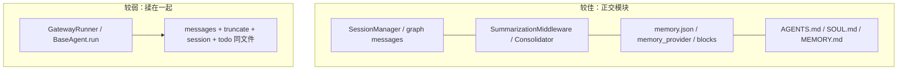
```mermaid
flowchart TB
    subgraph Good["较佳：正交模块"]
        M1A[SessionManager / graph messages]
        M2A[SummarizationMiddleware / Consolidator]
        M3A[memory.json / memory_provider / blocks]
        M4A[AGENTS.md / SOUL.md / MEMORY.md]
        M1A --- M2A
        M2A --- M3A
        M3A --- M4A
    end

    subgraph Weak["较弱：揉在一起"]
        RUN[GatewayRunner / BaseAgent.run]
        RUN --> ALL[messages + truncate + session + todo 同文件]
    end
```

#### 6.9.8 三维封装总览（Channel + Loop + Memory）

**图例**：★ 越多越好（**仅工程封装**，非功能多寡）。`—` 表示不在该维竞争或另域。

| 项目 | Channel L2 | Loop L0+L1 | Memory M1–M5 | 综合封装倾向 | 典型短板 |
|------|:----------:|:----------:|:------------:|--------------|----------|
| **nanobot** | ★★★★★ | ★★★★★ | ★★★★ | **全栈封装标杆** | Memory 模块分散，需读多文件 |
| **deepagents** (SDK) | — | ★★★★★（库） | ★★★★★ | **库形态最佳** | 无 Channel、无 chat L1 |
| **deer-flow** | ★★★★ | ★★★★ | ★★★★☆ | 产品与 Agent **分包**清晰 | IM 并发 reject；Manager 偏胖 |
| **OpenHarness** | ★★★★ | ★★★★☆ | ★★★★（文档） | Channel fork + Bridge 槽位 | 本 workspace 源码稀疏 |
| **OpenHuman** | ★★★★ | ★★★★ | ★★★★ | Rust trait + EventBus 一致 | 桌面内嵌，非 headless |
| **OpenHands** | —（Dev） | ★★★★ | ★★★★ | 事件流 + Condenser | 非 IM Gateway |
| **OpenAI Agents SDK** | — | ★★★★★（库） | ★★★ | Runner 清晰 | Memory 薄 |
| **Claude Agent SDK** | — | ★★★★ | ★★★ | Transport/CLI 分界 | Loop/Memory 在 CLI 黑盒 |
| **Hermes** | ★★☆ | ★★☆ | ★★★ | **功能最全、封装最散** | God Object Gateway |
| **OpenManus** | — | ★★☆ | ★★ | 易学 | 三层都弱 |
| **Letta** | — | ★★★★ | ★★★★☆ | **LTM 领域封装** | 非 IM、非通用 assistant |

**分场景一句话**：

| 你最在意… | Channel | Loop | Memory |
|-----------|---------|------|--------|
| **封装教科书** | nanobot | nanobot（产品）/ deepagents（库） | deepagents / deer-flow |
| **可插话 IM** | nanobot | nanobot pending inject | — |
| **用户事实与 thread 分离** | — | — | deer-flow `memory.json` |
| **block 级长期记忆** | — | Letta step | Letta blocks |
| **离线巩固 + 文件记忆** | — | — | nanobot Dream + MEMORY.md |
| **要功能不要封装** | Hermes | Hermes（可配 steer） | Hermes provider 生态 |

---

## 7. nanobot

### 7.1 架构

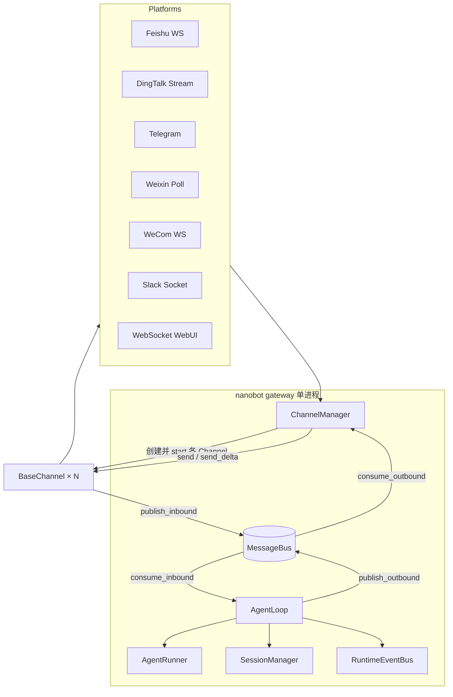
```mermaid
flowchart TB
    subgraph Platforms
        FS[Feishu WS]
        DT[DingTalk Stream]
        TG[Telegram]
        WX[Weixin Poll]
        WC[WeCom WS]
        SL[Slack Socket]
        WSUI[WebSocket WebUI]
    end

    subgraph Gateway["nanobot gateway 单进程"]
        CM[ChannelManager]
        BUS[(MessageBus)]
        AL[AgentLoop]
        AR[AgentRunner]
        SM[SessionManager]
        RE[RuntimeEventBus]
    end

    Platforms --> CM
    CM -->|创建并 start 各 Channel| CH2[BaseChannel × N]
    CH2 -->|publish_inbound| BUS
    BUS -->|consume_inbound| AL
    AL --> AR
    AL --> SM
    AL --> RE
    AL -->|publish_outbound| BUS
    BUS -->|consume_outbound| CM
    CM -->|send / send_delta| CH2
    CH2 --> Platforms
```

> **入站不经过 ChannelManager 转发**：`ChannelManager` 负责 **创建/启动** 各 `BaseChannel`；入站由各 Channel 在 `_handle_message()` 里直接 `bus.publish_inbound()`。出站才由 `ChannelManager._dispatch_outbound()` 统一消费 `outbound` 队列并路由到对应 Channel。详见 §7.2。

**源码锚点**：

| 组件 | 路径 |
|------|------|
| Bus | `nanobot/bus/queue.py` — `MessageBus` |
| 事件 | `nanobot/bus/events.py` — `InboundMessage`, `OutboundMessage` |
| 基类 | `nanobot/channels/base.py` — `BaseChannel._handle_message()` |
| 管理 | `nanobot/channels/manager.py` — `ChannelManager` |
| 发现 | `nanobot/channels/registry.py` — 内置 + `entry_points("nanobot.channels")` |
| Agent | `nanobot/agent/loop.py` — `AgentLoop.run()` → `_dispatch()` |
| 启动 | `nanobot/cli/commands.py` — `_run_gateway()` → `asyncio.gather(agent.run, channels.start_all)` |

#### 7.1.1 启动时序：注册与拉起 Channel

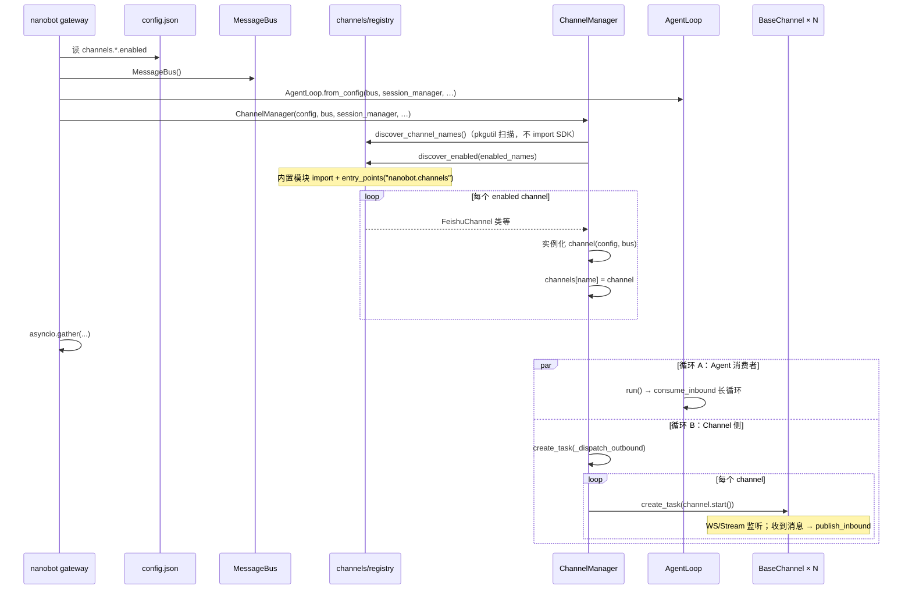
```mermaid
sequenceDiagram
    participant CLI as nanobot gateway
    participant CFG as config.json
    participant BUS as MessageBus
    participant REG as channels/registry
    participant CM as ChannelManager
    participant AL as AgentLoop
    participant CH as BaseChannel × N

    CLI->>CFG: 读 channels.*.enabled
    CLI->>BUS: MessageBus()
    CLI->>AL: AgentLoop.from_config(bus, session_manager, …)
    CLI->>CM: ChannelManager(config, bus, session_manager, …)

    CM->>REG: discover_channel_names()（pkgutil 扫描，不 import SDK）
    CM->>REG: discover_enabled(enabled_names)
    Note over REG: 内置模块 import + entry_points("nanobot.channels")
    loop 每个 enabled channel
        REG-->>CM: FeishuChannel 类等
        CM->>CM: 实例化 channel(config, bus)
        CM->>CM: channels[name] = channel
    end

    CLI->>CLI: asyncio.gather(...)
    par 循环 A：Agent 消费者
        AL->>AL: run() → consume_inbound 长循环
    and 循环 B：Channel 侧
        CM->>CM: create_task(_dispatch_outbound)
        loop 每个 channel
            CM->>CH: create_task(channel.start())
            Note over CH: WS/Stream 监听；收到消息 → publish_inbound
        end
    end
```

**要点**：

1. **注册在 `ChannelManager.__init__`**：扫描配置里 `enabled: true` 的名字，只对它们 `import` 对应 SDK 并实例化（未 enabled 的 channel 模块不会被加载）。
2. **插件**：第三方 channel 通过 `pyproject.toml` 的 `[project.entry-points."nanobot.channels"]` 注册，与内置同名时内置优先。
3. **`start_all()` 做两件事**：先起出站 `_dispatch_outbound`，再 `gather` 各 `channel.start()`（各 channel 内部 `publish_inbound`）。
4. **与 Agent 并行**：`agent.run()` 与 `channels.start_all()` 同一 `asyncio.gather`，互不阻塞。

### 7.2 入站 → AgentLoop 时序

nanobot gateway 里是 **两条并行异步循环**，§7.2 时序图按「用户视角」把入站 + 出站串成一条：

```text
循环 A（入站）：平台 → BaseChannel → MessageBus.inbound → AgentLoop
循环 B（出站）：AgentLoop → MessageBus.outbound → ChannelManager → BaseChannel → 平台
```

#### 7.2.1 逐步对照

| 步骤 | 参与者 | 动作 |
|------|--------|------|
| 1 | 平台 P | 飞书 WS / Telegram poll 等推来原始事件 |
| 2 | `BaseChannel` CH | 解析为统一字段（sender、chat、正文、媒体） |
| 3 | CH | `is_allowed()`：白名单 / pairing；未授权则回配对码或丢弃 |
| 4 | CH | 构造 `InboundMessage`，`bus.publish_inbound(msg)` 入 **inbound 队列** |
| 5 | `AgentLoop` AL | `run()` 中 `consume_inbound()`（1s 超时）取出消息 |
| 6 | AL | `_dispatch()`：per-`session_key` `asyncio.Lock`，走 Turn FSM |
| 7 | `AgentRunner` AR | LLM ↔ tools 多轮 |
| 8（可选） | AL → OB | 流式：`publish_outbound(_stream_delta)` |
| 9 | AL → OB | `publish_outbound(final)` |
| 10 | `ChannelManager` CM | `_dispatch_outbound()` 从 **outbound 队列** 取出 |
| 11 | CM → CH | 按 `msg.channel` 路由，调用 `send()` / `send_delta()` |
| 12 | CH → P | 平台 API 投递，用户看到回复 |

#### 7.2.2 时序图（入站 / 出站分工）

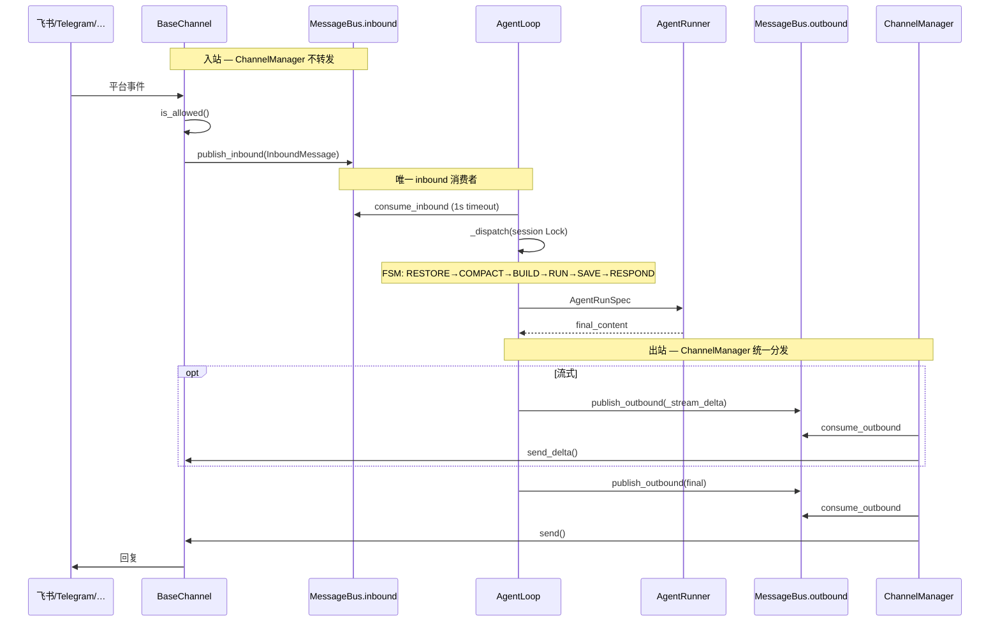
```mermaid
sequenceDiagram
    participant P as 飞书/Telegram/…
    participant CH as BaseChannel
    participant IB as MessageBus.inbound
    participant AL as AgentLoop
    participant AR as AgentRunner
    participant OB as MessageBus.outbound
    participant CM as ChannelManager

    Note over CH,IB: 入站 — ChannelManager 不转发
    P->>CH: 平台事件
    CH->>CH: is_allowed()
    CH->>IB: publish_inbound(InboundMessage)

    Note over IB,AL: 唯一 inbound 消费者
    AL->>IB: consume_inbound (1s timeout)
    AL->>AL: _dispatch(session Lock)
    Note over AL: FSM: RESTORE→COMPACT→BUILD→RUN→SAVE→RESPOND
    AL->>AR: AgentRunSpec
    AR-->>AL: final_content

    Note over AL,CM: 出站 — ChannelManager 统一分发
    opt 流式
        AL->>OB: publish_outbound(_stream_delta)
        CM->>OB: consume_outbound
        CM->>CH: send_delta()
    end
    AL->>OB: publish_outbound(final)
    CM->>OB: consume_outbound
    CM->>CH: send()
    CH->>P: 回复
```

#### 7.2.3 ChannelManager 的职责

源码：`nanobot/channels/manager.py`。类注释概括为 **管理 Channel 生命周期 + 路由出站消息**。

| 职责 | 方法 / 行为 | 说明 |
|------|-------------|------|
| **Channel 工厂** | `_init_channels()` | 读 config 里 `enabled` 的 channel → `registry.discover_enabled()` → `self.channels[name] = FeishuChannel(...)` |
| **启动** | `start_all()` | ① `create_task(_dispatch_outbound)` ② 各 `channel.start()` 长期监听平台 |
| **停止** | `stop_all()` | 取消 dispatcher + 各 channel `stop()` |
| **出站分发** | `_dispatch_outbound()` | `consume_outbound()` → 按 `msg.channel` 找实例 → `send` / `send_delta` |
| **流式合并** | `_coalesce_stream_deltas()` | 连续 `_stream_delta` 合并后再发，减少 API 调用 |
| **出站过滤** | dispatcher 内逻辑 | progress / tool_hint / reasoning 按 channel 配置决定是否下发 |
| **去重** | `_should_suppress_outbound()` | 同一源消息不重复发相同正文 |
| **重试** | `_send_with_retry()` | 发送失败指数退避 1s / 2s / 4s |
| **运维** | `_notify_restart_done_if_needed()` | 进程重启后向指定 chat 发完成通知 |

**入站 vs 出站分工**（易混点）：

| 方向 | 谁干活 |
|------|--------|
| **入站** | 各 `BaseChannel._handle_message()` → `bus.publish_inbound()`（构造 Channel 时注入同一 `MessageBus`） |
| **出站** | `AgentLoop` → `bus.publish_outbound()` → **`ChannelManager._dispatch_outbound()`** → `channel.send()` |

ChannelManager = **各 Channel 的总经理**（创建、启动、配置校验）+ **出站邮局局长**；**不是**入站中转站。为何如此分工见 [§6.7](#67-为什么-channelmanager只走出不进deer-flow-为何不同)。

`nanobot gateway` 启动时（`cli/commands.py` → `_run_gateway()`）：

```text
asyncio.gather(
  AgentLoop.run(),              # 循环 A：消费 inbound
  ChannelManager.start_all(),   # 循环 B 的 dispatcher + 各 channel 监听
)
```

#### 7.2.4 与 AgentLoop 的结合点

- `AgentLoop.run()` 是 **唯一** 消费 `inbound` 的长循环（CLI `process_direct` bypass bus，但共享 `_process_message` FSM）。
- 每消息 `_dispatch()`：per-`session_key` `asyncio.Lock`；**同 session 串行**，**跨 session 并发**。
- **Mid-turn 注入**：同 session 进行中时，新消息进 `_pending_queues`，Runner `injection_callback` 可阻塞等子 Agent（见 [03-runtime-loop-queue.md](03-runtime-loop-queue.md)）。

### 7.3 内置 Channel 一览（16+）

| Channel | 类 | 连接模式 |
|---------|-----|----------|
| feishu | `FeishuChannel` | 飞书 SDK **WebSocket** |
| dingtalk | `DingTalkChannel` | **dingtalk-stream** WebSocket |
| weixin | `WeixinChannel` | **Long poll** + QR 登录 |
| wecom | `WecomChannel` | 企微 **WebSocket** |
| telegram | `TelegramChannel` | Polling（可选 Webhook） |
| slack | `SlackChannel` | **Socket Mode** |
| discord | `DiscordChannel` | Gateway WebSocket |
| qq | `QQChannel` | qq-botpy WebSocket |
| mochat | `MochatChannel` | Socket.IO + HTTP 兜底 |
| websocket | `WebSocketChannel` | nanobot 作 **WS Server**（WebUI :8765） |
| email / matrix / msteams / signal / whatsapp / napcat | 各对应类 | 见各模块 |

### 7.4 Session Key 要点

默认：`{channel}:{chat_id}`；`unified_session=true` → `unified:default`。

| 平台 | 特殊 override |
|------|----------------|
| Telegram topic | `telegram:{chat_id}:topic:{thread_id}` |
| Slack 线程 | `slack:{chat_id}:{thread_ts}` |
| Feishu 群话题 | `feishu:{chat_id}:{root_id}`（`topic_isolation`） |
| DingTalk 群 | `dingtalk:group:{conversation_id}:{sender_id}` |

---

## 8. OpenHarness (ohmo gateway)

OpenHarness 的 IM 层 **fork 自 nanobot channels**，但 Agent 路径走 **ohmo 专用 Bridge + QueryEngine**，不是 nanobot 的 `AgentLoop`。

### 8.1 架构

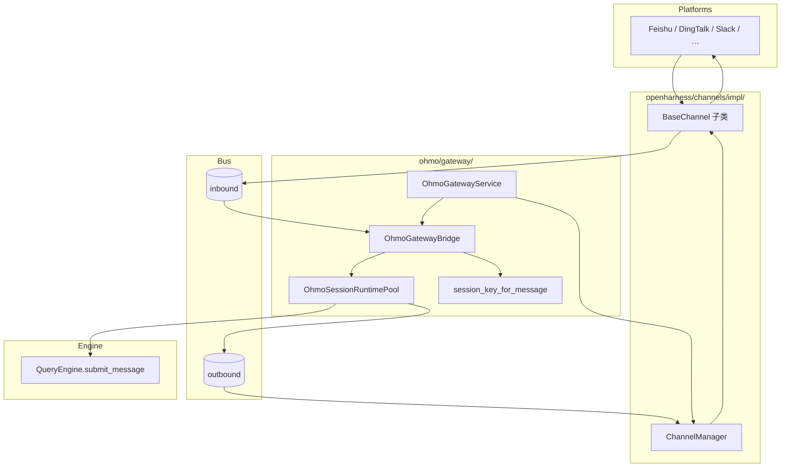
```mermaid
flowchart TB
    subgraph Platforms
        IM[Feishu / DingTalk / Slack / …]
    end

    subgraph Channels["openharness/channels/impl/"]
        BC[BaseChannel 子类]
        CM[ChannelManager]
    end

    subgraph Bus
        IB[(inbound)]
        OB[(outbound)]
    end

    subgraph Ohmo["ohmo/gateway/"]
        SVC[OhmoGatewayService]
        BR[OhmoGatewayBridge]
        RT[OhmoSessionRuntimePool]
        RTR[session_key_for_message]
    end

    subgraph Engine
        QE[QueryEngine.submit_message]
    end

    IM --> BC
    BC --> IB
    IB --> BR
    BR --> RTR
    BR --> RT
    RT --> QE
    RT --> OB
    OB --> CM
    CM --> BC
    BC --> IM
    SVC --> BR
    SVC --> CM
```

**源码锚点**：

| 组件 | 路径 |
|------|------|
| Channels | `src/openharness/channels/impl/` |
| Bus | `src/openharness/channels/bus/` |
| Gateway 服务 | `ohmo/gateway/service.py` — `OhmoGatewayService.run_foreground()` |
| Bridge | `ohmo/gateway/bridge.py` — `OhmoGatewayBridge` |
| Runtime | `ohmo/gateway/runtime.py` — `OhmoSessionRuntimePool.stream_message()` |
| 路由 | `ohmo/gateway/router.py` — `session_key_for_message()` |
| Agent | `src/openharness/engine/query_engine.py` |

> **注意**：`ChannelBridge`（`channels/adapter.py`）是通用 QueryEngine 桥，**ohmo gateway 主路径不用**；生产走 `OhmoGatewayBridge`。

#### 8.1.1 启动时序：ohmo gateway 注册与拉起

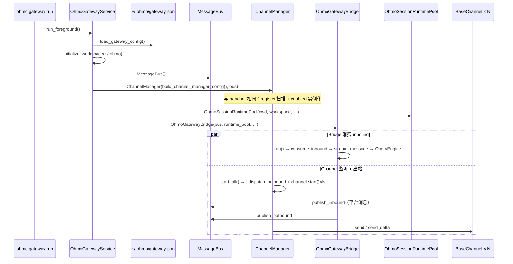
```mermaid
sequenceDiagram
    participant CLI as ohmo gateway run
    participant SVC as OhmoGatewayService
    participant CFG as ~/.ohmo/gateway.json
    participant BUS as MessageBus
    participant CM as ChannelManager
    participant BR as OhmoGatewayBridge
    participant RT as OhmoSessionRuntimePool
    participant CH as BaseChannel × N

    CLI->>SVC: run_foreground()
    SVC->>CFG: load_gateway_config()
    SVC->>SVC: initialize_workspace(~/.ohmo)
    SVC->>BUS: MessageBus()
    SVC->>CM: ChannelManager(build_channel_manager_config(), bus)
    Note over CM: 与 nanobot 相同：registry 扫描 + enabled 实例化
    SVC->>RT: OhmoSessionRuntimePool(cwd, workspace, …)
    SVC->>BR: OhmoGatewayBridge(bus, runtime_pool, …)

    par Bridge 消费 inbound
        BR->>BR: run() → consume_inbound → stream_message → QueryEngine
    and Channel 监听 + 出站
        CM->>CM: start_all() → _dispatch_outbound + channel.start()×N
        CH->>BUS: publish_inbound（平台消息）
        BR->>BUS: publish_outbound
        CM->>CH: send / send_delta
    end
```

**与 nanobot 启动差异**：用 **`OhmoGatewayBridge`** 替代 `AgentLoop` 消费 inbound；`ChannelManager` 的注册/启动逻辑与 nanobot **同源**（`openharness/channels` fork）。

### 8.2 时序（ohmo 路径）

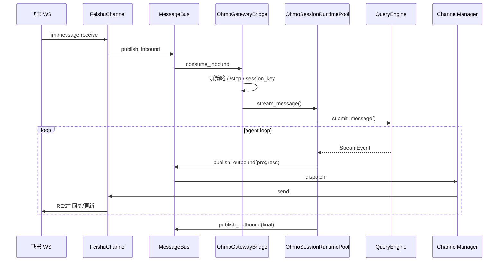
```mermaid
sequenceDiagram
    participant IM as 飞书 WS
    participant CH as FeishuChannel
    participant BUS as MessageBus
    participant BR as OhmoGatewayBridge
    participant RT as OhmoSessionRuntimePool
    participant QE as QueryEngine
    participant CM as ChannelManager

    IM->>CH: im.message.receive
    CH->>BUS: publish_inbound
    BUS->>BR: consume_inbound
    BR->>BR: 群策略 / /stop / session_key
    BR->>RT: stream_message()
    RT->>QE: submit_message()
    loop agent loop
        QE-->>RT: StreamEvent
        RT->>BUS: publish_outbound(progress)
        BUS->>CM: dispatch
        CM->>CH: send
        CH->>IM: REST 回复/更新
    end
    RT->>BUS: publish_outbound(final)
```

### 8.3 与 nanobot 的差异（Channel 同源、Loop 不同）

| 维度 | nanobot | OpenHarness ohmo |
|------|---------|-------------------|
| Agent | `AgentLoop` + Turn FSM | `QueryEngine` ReAct |
| 同 session 新消息 | pending queue **注入** 当前 turn | **interrupt** 旧 task，新起一轮 |
| 飞书群 | channel + 配置 | Bridge 层 `_should_process_message` + 托管群工具 |
| 钉钉 | 支持群/私聊 | 注释侧重 **1:1**；群消息策略需看配置 |
| 企业微信 | `wecom` 原生 | 经 **Mochat** 插件式接入 |
| 配置 | `~/.nanobot/config.json` | `~/.ohmo/gateway.json` + 投影为 `Config` |

---

## 9. deer-flow

deer-flow 把 Channel **嵌在 Gateway FastAPI 进程**内，通过 **`langgraph-sdk` HTTP 客户端** 调用 **同一套** LangGraph API（与 Web UI 共用 Agent 路径）。

### 9.1 架构

```mermaid
flowchart TB
    subgraph Platforms
        IM[Feishu / DingTalk / WeChat / WeCom / …]
    end

    subgraph App["backend/app/channels/"]
        CH[Channel 子类]
        BUS[MessageBus]
        MGR[ChannelManager]
        STORE[ChannelStore]
    end

    subgraph Gateway["app/gateway/ FastAPI :8001"]
        LG[LangGraph-compatible API]
        RA[run_agent → make_lead_agent]
    end

    IM --> CH
    CH -->|publish_inbound| BUS
    BUS --> MGR
    MGR --> STORE
    MGR -->|langgraph-sdk| LG
    LG --> RA
    MGR -->|publish_outbound| BUS
    BUS --> CH
    CH --> IM
```

**源码锚点**：

| 组件 | 路径 |
|------|------|
| 服务 | `app/channels/service.py` — `ChannelService` |
| 管理 | `app/channels/manager.py` — `ChannelManager._dispatch_loop()` |
| Bus | `app/channels/message_bus.py` |
| 映射 | `app/channels/store.py` — `{channel}:{chat_id}[:topic]` → `thread_id` |
| Gateway | `app/gateway/app.py` lifespan 启动 ChannelService |
| Agent | `deerflow` 包内 `make_lead_agent` |

#### 9.1.1 启动时序：Gateway lifespan 内注册 Channel

```mermaid
sequenceDiagram
    participant APP as FastAPI Gateway :8001
    participant LIFE as lifespan()
    participant LG as langgraph_runtime
    participant CS as ChannelService
    participant CFG as config.yaml channels.*
    participant REG as _CHANNEL_REGISTRY
    participant MGR as ChannelManager
    participant CH as Channel × N

    APP->>LIFE: 应用启动
    LIFE->>LG: 初始化 checkpointer / RunManager / StreamBridge
    LIFE->>CS: start_channel_service(app_config)

    CS->>CS: MessageBus() + ChannelStore()
    CS->>MGR: ChannelManager(bus, store, langgraph_url, …)
    CS->>MGR: manager.start()
    Note over MGR: create_task(_dispatch_loop) 消费 inbound

    loop config 里 enabled: true 的 channel
        CS->>REG: 查 dingtalk→app.channels.dingtalk:DingTalkChannel
        CS->>CS: resolve_class(import_path)
        CS->>CH: channel_cls(bus, config)
        CS->>CH: await channel.start()
        Note over CH: 长连接监听 → bus.publish_inbound
    end

    Note over MGR: _dispatch_loop 收到消息后 langgraph-sdk runs.wait/stream
```

**要点**：

1. **注册表是静态 dict** `_CHANNEL_REGISTRY`（7 个名字 → `模块:类`），不是 entry_points 扫描。
2. **`ChannelService.start()` 顺序**：先 `manager.start()`（dispatch 循环），再逐个 `_start_channel()`。
3. **与 LangGraph 同进程**：Channel 通过 HTTP 调本机 Gateway API，IM 与 Web UI **共用** `make_lead_agent` 图。
4. **关闭**：`lifespan` yield 之后 `stop_channel_service()` 停 channel + manager。

### 9.2 时序

```mermaid
sequenceDiagram
    participant IM as 钉钉 Stream
    participant CH as DingTalkChannel
    participant BUS as MessageBus
    participant MGR as ChannelManager
    participant SDK as langgraph-sdk
    participant GW as Gateway /runs
    participant AG as make_lead_agent

    IM->>CH: Stream 事件
    CH->>BUS: InboundMessage
    MGR->>BUS: consume inbound queue
    MGR->>MGR: ChannelStore → thread_id
    alt 非流式 Slack/Telegram/…
        MGR->>SDK: runs.wait(thread_id, input)
    else 流式 Feishu/WeCom/DingTalk Card
        MGR->>SDK: runs.stream(...)
    end
    SDK->>GW: HTTP + internal auth
    GW->>AG: ReAct loop
    AG-->>GW: messages / state
    GW-->>SDK: result / stream chunks
    MGR->>BUS: OutboundMessage(is_final=?)
    BUS->>CH: _on_outbound
    CH->>IM: 卡片 patch / 一次性回复
```

### 9.3 设计要点

1. **无 inbound Webhook**：全部 **出站长连接**（飞书 WS、钉钉 Stream、Slack Socket Mode 等），部署无需公网回调 URL。
2. **Thread 映射**：IM 会话 ≠ LangGraph thread；`ChannelStore` 持久化映射；`/new` 新建 thread。
3. **流式是平台能力**：`CHANNEL_CAPABILITIES` 决定 `runs.wait` vs `runs.stream`（Feishu / WeCom / DingTalk AI Card 流式 patch）。
4. **并发策略**：`multitask_strategy="reject"` — 同 thread 已有 run 则拒绝，提示用户等待。
5. **Harness 边界**：`deerflow.*` 不依赖 `app.*`；Channel 是 **产品层**，不在 Py harness 包内。

### 9.4 支持平台（7 个注册）

`FeishuChannel` · `DingTalkChannel` · `SlackChannel` · `TelegramChannel` · `DiscordChannel` · `WechatChannel`（iLink long-poll）· `WeComChannel`（aibot WebSocket）

---

## 10. Hermes Agent

Hermes 采用 **GatewayRunner + PlatformAdapter** 单体架构；适配器可通过 **内置** 或 **plugins/platforms/** 扩展。

> **仓库说明**：本 monorepo 的 `hermes-dev/hermes-agent/` 可能仅含部分 `gateway/platforms/*.py`（如 `telegram.py`）；飞书/钉钉等以 upstream [NousResearch/hermes-agent](https://github.com/NousResearch/hermes-agent) 为准，下列架构来自 Runner 引用与文档。

### 10.1 架构

```mermaid
flowchart TB
    subgraph Platforms
        IM[Telegram / Feishu / DingTalk / WeCom / Weixin / …]
    end

    subgraph Adapters["gateway/platforms/ + plugins/platforms/"]
        AD[BasePlatformAdapter]
    end

    subgraph Gateway["GatewayRunner :8642"]
        GR[run.py GatewayRunner]
        SS[SessionStore]
        API[APIServerAdapter OpenAI-compatible]
    end

    subgraph Agent
        AI[AIAgent.run_conversation]
        CL[conversation_loop]
    end

    IM --> AD
    AD -->|MessageEvent| GR
    GR --> SS
    GR --> AI
    AI --> CL
    GR -->|adapter.send| AD
    AD --> IM
    API --> GR
```

**源码锚点**：

| 组件 | 路径 |
|------|------|
| Runner | `gateway/run.py` — `GatewayRunner._handle_message_with_agent()` |
| 基类 | `gateway/platforms/base.py` — `BasePlatformAdapter`, `MessageEvent` |
| 会话 | `gateway/session.py` — `SessionSource`, `SessionStore` |
| Agent | `run_agent.py` → `agent/conversation_loop.py` |
| 插件注册 | `gateway/platform_registry.py` |
| 扩展指南 | `gateway/platforms/ADDING_A_PLATFORM.md` |

#### 10.1.1 启动时序：GatewayRunner 注册 Adapter

```mermaid
sequenceDiagram
    participant CLI as hermes gateway start
    participant SG as start_gateway()
    participant GR as GatewayRunner
    participant CFG as GatewayConfig / config.yaml
    participant PR as platform_registry
    participant AD as BasePlatformAdapter × N

    CLI->>SG: asyncio.run(start_gateway())
    SG->>SG: 单实例 PID 锁 / --replace 处理
    SG->>GR: GatewayRunner(config)

    GR->>GR: discover_plugins() / hooks / session 恢复
    loop config.platforms 每项 enabled
        GR->>PR: is_registered(platform)?
        alt 内置平台
            GR->>GR: _create_adapter(platform, cfg)
        else 插件平台
            PR-->>GR: platform_registry.create_adapter(name, cfg)
        end
        GR->>AD: set_message_handler(_handle_message)
        GR->>AD: set_session_store(session_store)
        GR->>AD: await connect()（超时保护）
        alt 连接成功
            GR->>GR: adapters[platform] = adapter
        else 失败
            GR->>GR: 记录 retryable/fatal；可选重连队列
        end
    end

    Note over GR,AD: 无 MessageBus；入站 = adapter 回调 _handle_message
    GR->>GR: APIServer / Cron ticker 等后台任务
    GR->>GR: 事件循环直到 SIGTERM
```

**要点**：

1. **注册两路**：内置 `Platform` 枚举 → 内置 adapter 类；插件通过 `gateway/platform_registry.py` 在 import 时登记。
2. **无独立 inbound 消费者任务**：`adapter.connect()` 成功后，平台 SDK 线程/协程 **直接回调** `GatewayRunner._handle_message_with_agent()`。
3. **出站**：Runner 在 Agent 回调里 **`adapter.send()`**，不经 ChannelManager 式队列（可有内部 progress 合并）。
4. **`start_gateway()`** 还负责：skills 同步、日志、SessionDB 悬挂 session 处理、信号优雅退出。

### 10.2 时序

```mermaid
sequenceDiagram
    participant IM as 飞书 WS / 钉钉 Stream
    participant AD as FeishuAdapter
    participant GR as GatewayRunner
    participant SS as SessionStore
    participant AI as AIAgent
    participant CL as conversation_loop

    IM->>AD: 平台原始事件
    AD->>AD: build SessionSource + MessageEvent
    AD->>AD: handle_message (debounce/排队/鉴权)
    AD->>GR: _message_handler(event)
    GR->>GR: Slash / STT / 授权
    GR->>SS: get_or_create_session
    GR->>AI: run_conversation(session_id, callbacks)
    loop tool iterations
        AI->>CL: LLM + tools
        CL-->>GR: progress_callback (流式/编辑气泡)
        GR->>AD: send(delta) 可选
    end
    GR->>AD: send(final, MEDIA:)
    AD->>IM: 平台格式化回复
```

### 10.3 中国区平台要点

| 平台 | 连接 | 配置 |
|------|------|------|
| **飞书** | WebSocket（推荐）或 Webhook `:8765/feishu/webhook` | `FEISHU_APP_ID/SECRET`, `lark-oapi` |
| **钉钉** | **Stream Mode** (`dingtalk-stream`) | `DINGTALK_CLIENT_ID/SECRET` |
| **企业微信 Bot** | WebSocket | `WECOM_BOT_ID/SECRET` |
| **企业微信回调** | HTTP 自建应用 | `wecom_callback` 适配器 |
| **微信个人** | iLink / QR 登录 | `weixin` 适配器自带 dm/group policy |

**额外能力**：`send_message_tool` 跨平台主动投递；Cron `deliver=feishu|telegram`；`PLATFORM_HINTS` 注入各平台 Markdown/媒体规则。

---

## 11. OpenHuman

OpenHuman 是 **Tauri 桌面社区助手**，Channel 在 **Rust Core 进程内**运行，不是独立 `gateway` CLI。

### 11.1 架构

```mermaid
flowchart TB
    subgraph Platforms
        IM[Telegram / Slack / Feishu·Lark / DingTalk / Discord / …]
    end

    subgraph Core["openhuman-core 内嵌"]
        CH[channels/*Channel trait]
        DISP[runtime/dispatch.rs]
        EB[(EventBus)]
        AH[Agent harness / turn_engine]
        SK[Socket.IO → React]
    end

    IM --> CH
    CH --> DISP
    DISP --> EB
    EB --> AH
    AH --> SK
    AH --> CH
    CH --> IM
```

**源码锚点**：

| 组件 | 路径 |
|------|------|
| 启动 | `src/openhuman/channels/runtime/startup.rs` — 注册各 Channel listener |
| 分发 | `src/openhuman/channels/runtime/dispatch.rs` |
| Trait | `src/openhuman/channels/traits.rs` — `Channel` |
| 事件 | `src/core/event_bus/` — `DomainEvent::Channel*` |
| Agent | `src/openhuman/agent/harness/` |
| 安全 | `src/openhuman/security/policy.rs` — 审批门、路径隔离 |
| UI | `app/src/services/chatService.ts` — WebChannel 事件 |

#### 11.1.1 启动时序：Core 内 `start_channels()`

```mermaid
sequenceDiagram
    participant APP as Tauri / Core 进程
    participant ST as start_channels(config)
    participant EB as EventBus（全局）
    participant CFG as channels_config.*
    participant CH as Channel trait × N
    participant SUP as spawn_supervised_listener
    participant DISP as run_message_dispatch_loop

    APP->>ST: start_channels(mut config)
    ST->>EB: init_global + 注册各类 subscriber
    ST->>ST: Provider / SecurityPolicy / Memory / tools 初始化

    loop 配置存在则 push
        ST->>CFG: telegram / slack / lark / dingtalk / …
        CFG-->>ST: TelegramChannel::new(…) 等
        ST->>CH: channels.push(Arc<dyn Channel>)
    end

    alt channels 为空
        ST-->>APP: 提示在 Web UI 配置后 return
    end

    ST->>ST: mpsc::channel(100) 作为 Channel 间消息总线
    loop 每个 Channel
        ST->>SUP: spawn_supervised_listener(ch, tx, backoff…)
        Note over SUP: 独立 task；断线指数退避重连
    end

    ST->>ST: channels_by_name HashMap
    ST->>EB: 订阅 CronDelivery / Proactive / Approval 等
    ST->>DISP: run_message_dispatch_loop(rx, runtime_ctx)
    Note over DISP: 消费 ChannelMessage → Agent harness turn
```

**要点**：

1. **注册是显式 `if let Some(ref tg) = config.channels_config.telegram`** — 无运行时插件扫描；编译期 `feature` 门控（如 Matrix）。
2. **不用 Python 式 MessageBus 双队列**：Channel listener → **mpsc** → dispatch loop → **Rust EventBus** 推 UI/Agent。
3. **`spawn_supervised_listener`**：每个 IM 一个受监督 task，崩溃/断线自动重连（initial/max backoff）。
4. **非独立 `gateway` CLI**：与桌面 Core、WebSocket UI、审批门 **同进程** 启动。

### 11.2 内置 Channel（`startup.rs` 注册）

| Channel | 模块 | 连接模式 |
|---------|------|----------|
| **飞书 Lark** | `channels/lark.rs` | lark-oapi WebSocket |
| **钉钉** | `channels/dingtalk.rs` | DingTalk Stream |
| Telegram | `channels/telegram.rs` | Bot API |
| Slack | `channels/slack.rs` | Socket Mode / API |
| Discord | `channels/discord.rs` | Gateway |
| WhatsApp | `channels/whatsapp.rs` | 桥接 |
| WhatsApp Web | `channels/whatsapp_web.rs` | feature flag |
| Signal | `channels/signal.rs` | signal-cli |
| Email | `channels/email_channel.rs` | IMAP/SMTP |
| QQ | `channels/qq.rs` | 官方 Bot |
| iMessage | `channels/imessage.rs` | macOS |
| IRC | `channels/irc.rs` | IRC |
| Mattermost | `channels/mattermost.rs` | API |
| Matrix | `channels/matrix.rs` | sync（feature） |
| 元宝 Yuanbao | `channels/yuanbao.rs` | WebSocket |
| Linq | `channels/linq.rs` | — |
| **Web Chat** | `channels/providers/web/` | 内置 UI，非 IM |

**无**：个人微信原生 Channel（配置中有 `use_feishu` 等开关，与 Lark 模块对应）。

### 11.3 与 Agent Loop 的结合

```text
外部 IM 消息
  → Channel 实现 parse → dispatch loop
  → prompt_injection 检查
  → Agent harness 跑 turn（工具 + 流式 delta）
  → mpsc/WebChannelEvent 推 React Chat
  → 同 turn 内 Channel.send 回 IM
```

**特点**：桌面 **Approval gate** 可拦截 Channel turn；`SecurityPolicy` 限制文件工具边界；Channel 与 Web Chat **共用** Core 但 session/channel id 隔离。

---

## 12. OpenHands（Dev 协作 Webhook）

OpenHands **不是** 飞书/Telegram 式 IM Bot Gateway，而是 **企业 Dev 平台 Webhook → 触发 Sandbox Agent → 回写 PR/Comment**。

### 12.1 架构

```mermaid
sequenceDiagram
    participant Ext as GitHub / Slack / Jira / Linear
    participant App as App Server
    participant Int as IntegrationManager
    participant Conv as ConversationService
    participant SB as Sandbox
    participant AG as Agent.step

    Ext->>App: POST /api/integration/{service}/events
    App->>Int: 验签 + 解析 payload
    Int->>Conv: 创建 conversation（带 Issue 上下文）
    Conv->>SB: 启动 sandbox
    SB->>AG: Agent 执行任务
    AG-->>Int: 完成
    Int->>Ext: PR / Comment / 状态更新
```

#### 12.1.1 启动时序：集成路由注册（非 Channel 长连接）

OpenHands **没有** nanobot 式 `Channel.start()` 监听飞书；启动时做的是 **HTTP Webhook 路由 + Integration 处理器注册**：

```mermaid
sequenceDiagram
    participant DEP as App Server 启动
    participant APP as FastAPI / enterprise routes
    participant INT as integrations/*
    participant MGR as IntegrationManager
    participant DB as 会话 / 组织存储

    DEP->>APP: 加载 enterprise server
    APP->>INT: 挂载 integration 路由模块
    Note over APP: POST /api/integration/github/events<br/>POST /api/integration/slack/events<br/>POST /api/integration/jira/…

    APP->>MGR: 注册各 IntegrationService 处理器
    MGR->>DB: 读已配置的 org token / webhook secret

    Note over DEP,DB: 无 outbound 长连接；平台主动 POST 入站

    participant Ext as GitHub / Slack
    Ext->>APP: Webhook 事件（部署后于各平台配置 URL）
    APP->>MGR: verify_signature + parse
    MGR->>MGR: 创建 conversation + 启动 Sandbox Agent
```

**与 IM Gateway 启动对比**：

| 维度 | IM Gateway（nanobot 等） | OpenHands 集成 |
|------|--------------------------|----------------|
| 启动产物 | N 个长连接 listener | N 个 HTTP route + secret 校验 |
| 「注册」 | Channel 类实例 + `start()` | Integration 回调处理器 + 路由表 |
| 出站 | `send()` 回 IM | REST API 写 PR/Comment/Ticket |
| 运维 | 进程需常在线收消息 | 需公网 HTTPS URL 供平台回调 |

### 12.2 支持集成（非 IM Channel 语义）

| 集成 | 触发 | Agent 动作 |
|------|------|------------|
| **GitHub** | Issue、PR、@mention | 开 PR、评论、push |
| **GitLab** | Issue、MR | 同上 |
| **Bitbucket** | PR 事件 | 同上 |
| **Slack** | Channel @mention | **线程内回复**（任务型，非 Hermes 式全功能 Bot） |
| **Jira / Jira DC** | Issue 创建/更新 | 更新 ticket、评论 |
| **Linear** | Issue 创建 | 更新状态、评论 |

**源码**：`OpenHands/enterprise/integrations/` · `enterprise/server/routes/integration/` · 架构说明 `enterprise/doc/architecture/external-integrations.md`

### 12.3 与 IM Gateway 的差异

| 维度 | IM Gateway（nanobot 等） | OpenHands 集成 |
|------|--------------------------|----------------|
| 入口 | 用户闲聊 / 问答 | **Dev 事件**（Issue、@mention） |
| 连接 | 长连接 Bot SDK | **Inbound HTTP Webhook** |
| 出站 | 同 channel 回复消息 | PR、Comment、Ticket 更新 |
| 会话 | chat/session_key | conversation + sandbox 生命周期 |

---

## 13. 无 IM 对接的 Tier 1 项目

以下 Tier 1 框架 **无内置** 飞书/Telegram Channel 层；若需 IM，需自建 Adapter 或接 nanobot/Hermes 等产品。  
**封装优劣对比**见 [§6.9](#69-领域封装对象封装与引用关系评榜)（本节只列事实，不重复打分）。

### 13.1 总表

| 项目 | 典型入口 | L2 Channel | 备注 |
|------|----------|:----------:|------|
| **deepagents** (SDK) | `create_deep_agent()` | ❌ | LangGraph middleware 库 |
| **deepagents-code** | Textual TUI | ❌ | Slack 仅 **MCP OAuth 工具**，非 Messaging（§2） |
| **OpenManus** | `main.py` / `PlanningFlow` | ❌ | ReAct + 可选规划流；无 `channels/` |
| **AgentScope** | `await agent(msg)` | ❌ | 生产 SDK，无 IM Gateway |
| **MetaGPT / AutoGen / crewAI** | 多角色编排 | ❌ | 编排优先，无单聊 Bot |
| **smolagents / Letta** | SDK / Server | ❌ | 无 IM |
| **OpenAI Agents SDK** | `Runner.run()` | ❌ | handoffs / guardrails / tracing |
| **Claude Agent SDK** | `query()` / `ClaudeSDKClient` | ❌ | 控 Claude Code CLI 子进程 |
| **LangGraph** | `StateGraph` | ❌ | 需上层产品（如 **deer-flow**） |

### 13.2 OpenAI / Claude / OpenManus 详解

三者都停在 **L1 Agent 运行时**，没有 L2 的 `BaseChannel`、`MessageBus` 或 `gateway start`。

#### OpenAI Agents SDK

```text
你的应用 / 自建 Webhook
  → Runner.run(agent, input)
  → 多轮 tool / handoff
  → 最终 output（字符串或 items）
```

- **有什么**：`Runner`、`Agent`、handoffs、guardrails、Session、Tracing。  
- **没有什么**：7×24 监听飞书 WS、钉钉 Stream、`session_key` 路由、出站 dispatcher。  
- **接 IM**：在应用层写薄 Adapter（解析平台事件 → `Runner.run` → 调平台 send API），或把内核嵌进 **deer-flow ChannelManager**（`langgraph-sdk` 路径）。

#### Claude Agent SDK

```text
Python query() / ClaudeSDKClient
  → SubprocessCLITransport
  → claude CLI（stream-json）
  → JSONL Message 流
```

- **有什么**：`ClaudeAgentOptions`、hooks、SDK MCP、`can_use_tool`、Session resume/mirror。  
- **没有什么**：任何 IM 平台 adapter；loop 在 **CLI 内**，不在 Python Channel 层。  
- **接 IM**：`on_telegram_message` → `await query(prompt=...)` → `send_reply`；与 deepagents-code 的 **Slack MCP 工具** 不同（§2 边界表）。

#### OpenManus

| 模式 | 入口 | 行为 |
|------|------|------|
| 默认 | `Manus.run()` | 单 Agent ReAct |
| Planning | `PlanningFlow.execute()` | 先 `planning create` 再逐步 execute |

- **没有什么**：`channels/`、Gateway 进程、平台长连接。  
- **并发**：`BaseAgent` 状态机 **reject**（非 IDLE 抛错），适合 CLI 单次任务，**不是** nanobot 式 pending inject 或 Hermes 式排队。  
- **接 IM**：同 OpenAI SDK——自建 Adapter，或换用 nanobot/Hermes 作 Gateway 外壳。

### 13.3 自建 IM 时的推荐叠层

```mermaid
flowchart TB
    subgraph L2["L2 产品层（任选其一）"]
        NB[nanobot gateway]
        DF[deer-flow ChannelService]
        HM[Hermes gateway]
    end

    subgraph L1["L1 Agent 内核（可替换）"]
        SDK1[OpenAI Runner]
        SDK2[Claude query]
        SDK3[OpenManus / deepagents]
        LG[LangGraph / deerflow graph]
    end

    IM[飞书 / Telegram / Slack] --> L2
    L2 --> L1
```

| 路径 | 做法 |
|------|------|
| **省事** | 直接用 **nanobot / deer-flow / Hermes** 自带 Agent 内核 |
| **保留 OpenAI SDK** | L2 自建 Bus + Adapter → 回调里 `Runner.run()` |
| **保留 Claude SDK** | L2 Adapter → `query()`；注意 CLI 子进程与 gateway 进程同寿 |
| **保留 OpenManus** | 仅适合低频 CLI；IM 生产环境更建议换 **nanobot AgentLoop** 或 **deer-flow** |

---

## 14. 平台支持矩阵

图例：✅ 内置/一等 · ⚠️ 插件/桥接/有限 · ❌ 无 · — 未调研

| 平台 | nanobot | OpenHarness | deer-flow | Hermes | OpenHuman | OpenHands |
|------|:-------:|:-----------:|:---------:|:------:|:---------:|:---------:|
| **飞书 Feishu** | ✅ WS | ✅ WS | ✅ WS | ✅ WS/Webhook | ✅ Lark WS | ❌ |
| **钉钉 DingTalk** | ✅ Stream | ✅ Stream | ✅ Stream+Card | ✅ Stream | ✅ Stream | ❌ |
| **企业微信 WeCom** | ✅ WS | ⚠️ Mochat | ✅ aibot WS | ✅ WS+Callback | ❌ | ❌ |
| **个人微信 Weixin** | ✅ Poll | ❌ | ✅ iLink | ✅ QR/iLink | ❌ | ❌ |
| **Telegram** | ✅ | ✅ | ✅ | ✅ | ✅ | ❌ |
| **Slack** | ✅ Socket | ✅ Socket | ✅ Socket | ✅ Socket | ✅ | ⚠️ @mention 任务 |
| **Discord** | ✅ | ✅ | ✅ | ⚠️ 插件 | ✅ | ❌ |
| **QQ** | ✅ | ✅ | ❌ | ✅ | ✅ | ❌ |
| **WhatsApp** | ✅ bridge | ✅ | ❌ | ✅ | ✅ | ❌ |
| **Email** | ✅ IMAP | ✅ | ❌ | ✅ | ✅ | ❌ |
| **Matrix** | ✅ | ✅ | ❌ | ✅ | ⚠️ feature | ❌ |
| **GitHub/GitLab/Jira** | ❌ | ❌ | ❌ | ❌ | ❌ | ✅ Webhook |
| **WebUI / 内置 Chat** | ✅ WS :8765 | — | ✅ Web | ✅ Dashboard | ✅ Tauri | ✅ Web |
| **OpenAI 兼容 API** | ✅ serve | — | ✅ Gateway | ✅ :8642 | — | ✅ API |

---

## 15. 连接模式：Webhook / WebSocket / Polling

IM Gateway 五项目 + OpenHands 的 **默认生产路径均偏出站长连接**（Dev Webhook 除外）：

```mermaid
flowchart LR
    subgraph Inbound["平台 → 你的进程"]
        WS[WebSocket 长连接]
        POLL[Long Polling]
        WH[HTTP Webhook 入站]
    end

    FS[飞书] --> WS
    DT[钉钉 Stream] --> WS
    WC[企微 Bot] --> WS
    TG[Telegram 默认] --> POLL
    TG2[Telegram 可选] --> WH
    SL[Slack 默认] --> WS
    WX[微信 iLink/Weixin] --> POLL
    HM[Hermes 飞书可选] --> WH
```

| 模式 | 典型平台 | 优点 | 注意 |
|------|----------|------|------|
| **WebSocket / Stream SDK** | 飞书、钉钉、企微、Slack Socket | 无需公网 IP、实时 | SDK 线程与 asyncio loop 桥接（deer-flow Feishu 独立线程） |
| **Long Polling** | Telegram、微信、Matrix sync | 简单 | 延迟与连接数 |
| **Inbound Webhook** | Telegram 可选、MS Teams、Hermes 飞书可选 | 平台标准 | 需 HTTPS 公网 URL |
| **WS Server（WebUI）** | nanobot websocket | 浏览器直连 | 非 IM 平台 |

---

## 16. Session / Thread 路由对比

| 项目 | 键名 | 默认规则 | 群聊隔离 |
|------|------|----------|----------|
| nanobot | `session_key` | `{channel}:{chat_id}` | 平台 override（见 §7.4） |
| OpenHarness | `session_key` | `router.session_key_for_message()` | 群常含 `sender_id` |
| deer-flow | `thread_id` | Store: `{channel}:{chat_id}[:topic]` | topic/root_id |
| Hermes | `session_key` | `SessionSource` 序列化 | `thread_id`, union_id |
| OpenHuman | session + channel | Core threads 域 | channel 级权限 map |
| OpenHands | conversation id | 按 integration 上下文 | 非 IM session 语义 |

**统一会话**（多 channel 共享历史）：nanobot `unified_session`；Hermes `*_HOME_CHANNEL` + Cron deliver；deer-flow / OH 需自行设计。

---

## 17. 与 Agent Loop 衔接对照

```mermaid
flowchart TB
    subgraph nanobot_path["nanobot"]
        N1[consume_inbound] --> N2[AgentLoop._dispatch]
        N2 --> N3[Turn FSM]
        N3 --> N4[AgentRunner.run]
    end

    subgraph oh_path["OpenHarness"]
        O1[consume_inbound] --> O2[OhmoGatewayBridge]
        O2 --> O3[RuntimePool.stream_message]
        O3 --> O4[QueryEngine.submit_message]
    end

    subgraph df_path["deer-flow"]
        D1[ChannelManager queue] --> D2[runs.wait / runs.stream]
        D2 --> D3[Gateway RunManager]
        D3 --> D4[make_lead_agent ReAct]
    end

    subgraph hm_path["Hermes"]
        H1[adapter.handle_message] --> H2[GatewayRunner]
        H2 --> H3[AIAgent.run_conversation]
        H3 --> H4[conversation_loop]
    end

    subgraph ohuman_path["OpenHuman"]
        U1[dispatch loop] --> U2[EventBus]
        U2 --> U3[Agent harness]
        U3 --> U4[Socket.IO + Channel.send]
    end

    subgraph ohs_path["OpenHands"]
        S1[Integration Webhook] --> S2[IntegrationManager]
        S2 --> S3[Sandbox Agent.step]
        S3 --> S4[回写 GitHub/Slack/Jira]
    end
```

| 衔接方式 | 代表 | 优点 | 代价 |
|----------|------|------|------|
| **Bus + AgentLoop** | nanobot | 解耦；Turn FSM、pending queue | 单进程 Gateway |
| **Bus + QueryEngine** | OpenHarness | interrupt；ohmo 产品化 | 与 nanobot Loop 分叉 |
| **Manager + langgraph-sdk** | deer-flow | IM 与 Web **同 Agent 图** | HTTP + reject 并发 |
| **Adapter → Runner** | Hermes | 低延迟；progress 深度集成 | 无 Bus |
| **EventBus + harness** | OpenHuman | 桌面审批/沙箱一体 | 非 headless Gateway |
| **Dev Webhook** | OpenHands | 深度 Dev 工具链 | 非通用 IM Bot |

**子 Agent / 进度 / 流式**：

| 项目 | 进度出站 | 子 Agent 结果回 IM |
|------|----------|-------------------|
| nanobot | `_progress` metadata → outbound；`RuntimeEventBus` 给 WebUI | `bus.publish_inbound(system)` → 父 session 再总结 |
| OpenHarness | `GatewayStreamUpdate` 多次 outbound | 依 QueryEngine 设计 |
| deer-flow | stream mode 卡片 patch | LangGraph 线程内处理 |
| Hermes | `progress_callback` → 编辑 Telegram 气泡等 | 后台 task → 合成 `MessageEvent` |
| OpenHuman | Socket.IO 流式推 UI | Cron/后台经 EventBus 注入 |
| OpenHands | — | Sandbox 完成后 Integration 回写外部系统 |

---

## 18. 协作关系总图

本 monorepo 内 **6 个有平台对接能力的项目** 的血缘与分工（非运行时依赖）：

```mermaid
flowchart TB
    NB[nanobot<br/>MessageBus + AgentLoop<br/>channels 参考实现]
    OH[OpenHarness<br/>channels fork + QueryEngine<br/>ohmo gateway]
    DF[deer-flow<br/>app/channels + LangGraph SDK]
    HM[Hermes Agent<br/>GatewayRunner + Adapters]
    OHU[OpenHuman<br/>Rust EventBus + 桌面 Core]
    OHS[OpenHands<br/>Dev Webhook 集成]

    NB -.->|UPSTREAM 同步| OH
    NB -.->|架构相似| DF
    NB -.->|Adapter 模式相似| HM
    NB -.->|Channel 概念相似| OHU

    subgraph 中国区
        FS[飞书 WS]
        DT[钉钉 Stream]
        WX[微信/企微]
    end

    FS & DT & WX --> NB & OH & DF & HM & OHU

    subgraph Dev协作
        GH[GitHub / Jira / Linear]
    end

    GH --> OHS
```

**协作边界**：

- **nanobot** → 最完整的 Channel Registry + 插件 entry point + WebUI WS；**pending inject** 与 Dream/Consolidator 文档最全。
- **OpenHarness** → 复用 Channel 层，替换 Agent 为 QueryEngine + ohmo 产品化（飞书托管群、**interrupt**）。
- **deer-flow** → 产品 Gateway 内嵌 Channel，**强制**与 LangGraph thread 对齐；IM 与 Web **同 Agent 图**。
- **Hermes** → 最广平台枚举 + 插件化 + OpenAI 兼容 APIServer + 跨平台 `send_message_tool` + Cron deliver。
- **OpenHuman** → 桌面 Tauri + Rust Channel trait；审批门、沙箱、Socket.IO UI 与 IM **同一 Core**。
- **OpenHands** → **另一条路径**：Dev 事件 Webhook → Sandbox → 回写 PR/Comment；Slack 为任务触发，非 Hermes 式全功能 Bot。

---

## 19. 选型与迁移建议

| 场景 | 倾向 |
|------|------|
| 需要 **最多 IM 平台**、统一 Bus、Turn FSM、Dream/Consolidator | **nanobot gateway** |
| 已有 **OpenHarness QueryEngine**、ohmo 个人 agent、飞书运维群 | **ohmo gateway** |
| 已有 **deer-flow** 产品、必须与 Web UI 同 Agent graph | **deer-flow ChannelService**（勿把 channel 塞进 `deerflow` 包） |
| 需要 **Hermes 生态**（Cron 跨平台 deliver、skill 自演进、多平台 toolsets、APIServer） | **Hermes Gateway** |
| **桌面社区助手** + 审批门 + 沙箱 + 多 Channel 与 Web UI 一体 | **OpenHuman**（Tauri Core 内嵌，非 headless gateway） |
| **GitHub/Slack/Jira** 触发写代码、开 PR、更新 Ticket（非闲聊 Bot） | **OpenHands 企业集成**（§12） |
| 仅 SDK/TUI/API，无 IM 需求 | deepagents、OpenManus、OpenAI/Claude SDK 等（§13）；或自建 Adapter 接上述 Gateway |
| **最在意 Channel 封装与可测性** | **nanobot**（§6.9.2）；其次 deer-flow / OpenHuman |
| **最在意 Loop 分层（L0/L1 分离）** | **nanobot** `AgentLoop`/`AgentRunner`（§6.9.6）；库形态选 **deepagents** |
| **最在意 Memory 层正交（M1–M5）** | **deepagents** middleware 链 / **deer-flow** `memory.json`（§6.9.7） |
| **最在意 IM 平台数 + Hermes 生态、可接受 God Object** | **Hermes**（Channel §6.8.9；Loop/Memory 封装偏弱） |
| 从 nanobot 迁到 OH | Channel 配置可投影；Agent 从 `AgentLoop` 改为 `QueryEngine`；并发从 pending inject 改为 interrupt |
| 从 nanobot 迁到 deer-flow | 重写 Bridge 为 `langgraph-sdk`；Session key → thread store；流式按平台开 `runs.stream` |
| 从 Hermes 迁到 nanobot | Adapter 逻辑可复用平台 SDK 经验；需补 `MessageBus` + `AgentLoop`；progress 从 callback 改为 outbound metadata |

**实现新平台的最小清单**（IM Gateway 五项目通用）：

1. 实现 Adapter 基类（connect / send / 入站归一化）。
2. 定义 `session_key` / thread 映射（群聊是否按 sender 隔离）。
3. 鉴权（allowlist、mention、pairing）。
4. 出站 Markdown/卡片/分片规则。
5. 注册到 Registry 或 Gateway 配置。
6. 单测：假 inbound → Agent mock → outbound 断言。

---

## 附录：关键文件索引

| 项目 | Bus/事件 | Adapter 基类 | 编排入口 | Agent Loop |
|------|----------|--------------|----------|------------|
| nanobot | `nanobot/bus/` | `channels/base.py` | `agent/loop.py` | `agent/runner.py` |
| OpenHarness | `openharness/channels/bus/` | `channels/impl/base.py` | `ohmo/gateway/bridge.py` | `engine/query_engine.py` |
| deer-flow | `app/channels/message_bus.py` | `app/channels/base.py` | `app/channels/manager.py` | `make_lead_agent` via SDK |
| Hermes | —（直调） | `gateway/platforms/base.py` | `gateway/run.py` | `agent/conversation_loop.py` |
| OpenHuman | `src/core/event_bus/` | `channels/traits.rs` | `channels/runtime/dispatch.rs` | `agent/harness/` |
| OpenHands | —（Webhook） | `enterprise/integrations/*/` | `IntegrationManager` | Sandbox `Agent.step` |

---

**文档维护**：Channel 列表随上游迭代变化；更新时请对照各仓库 `channels/` 或 `gateway/platforms/` 目录与 `config.example` / `onboard` 向导。

